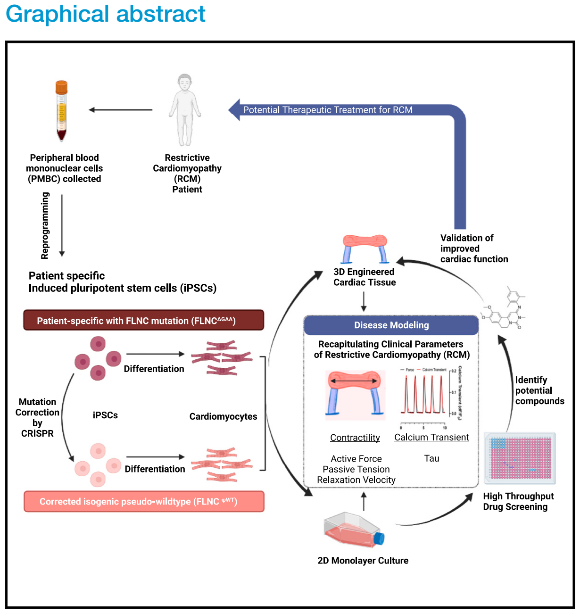
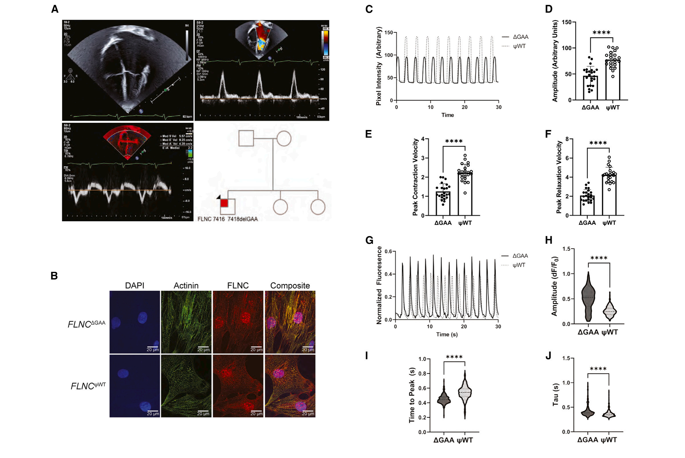
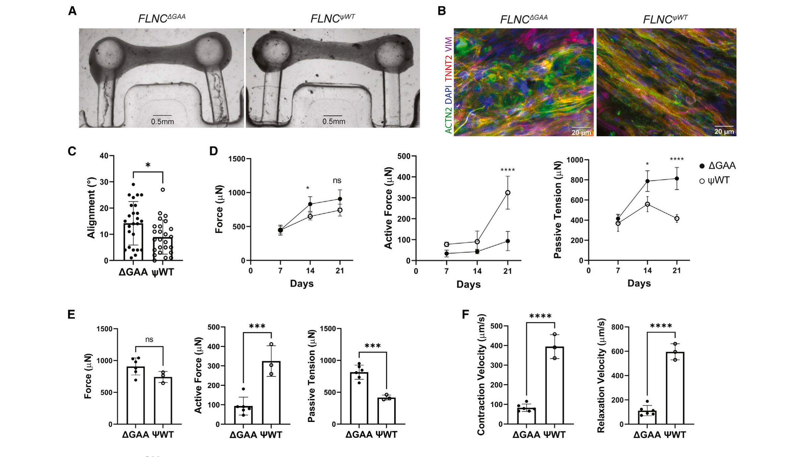
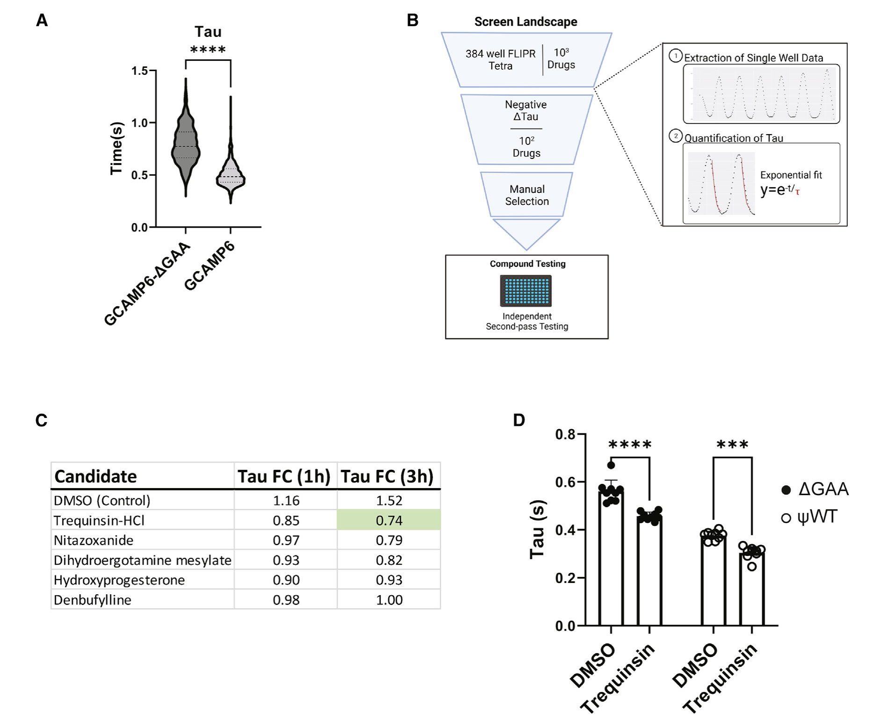
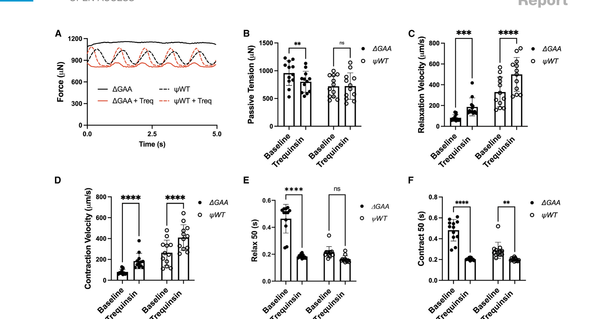
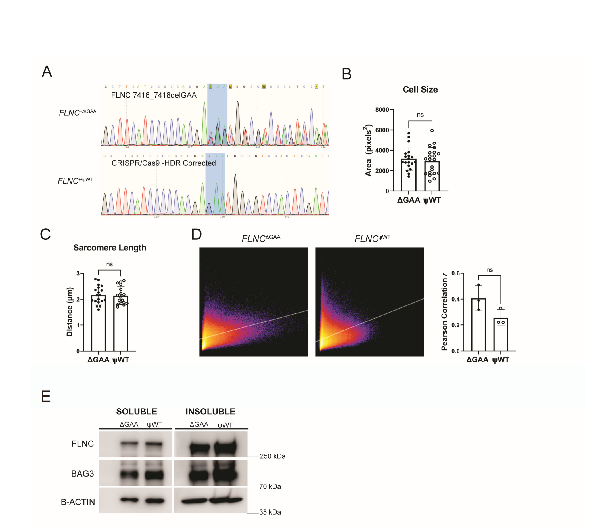
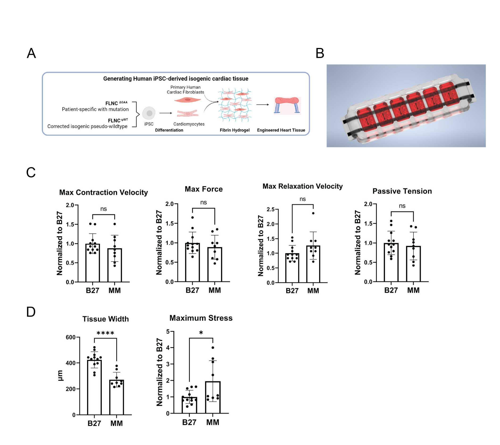
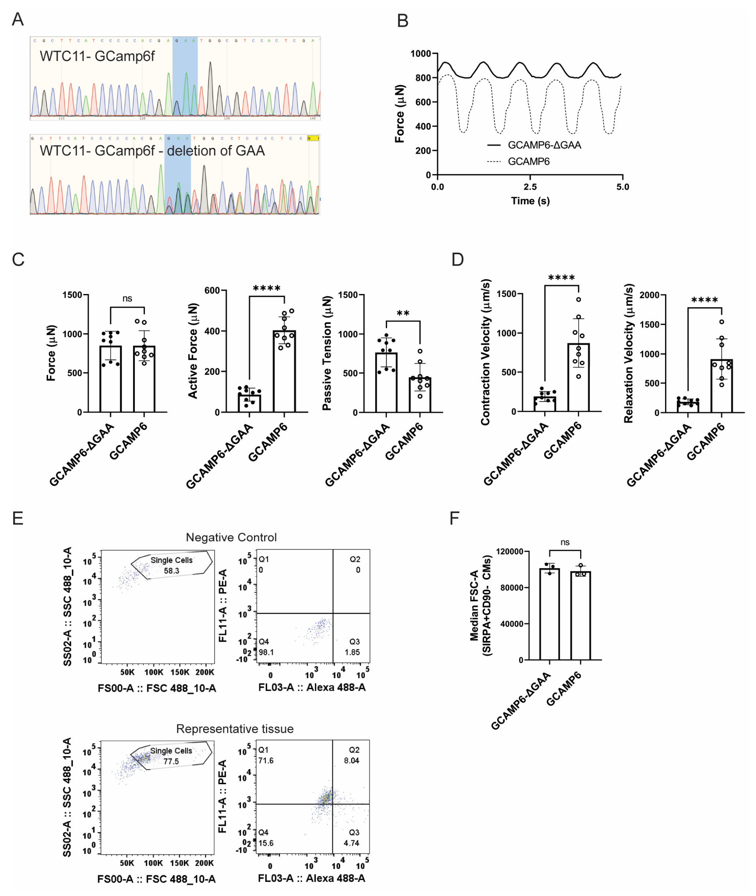
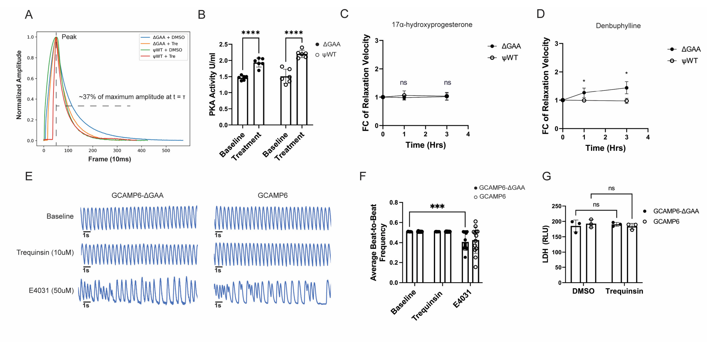

Engineered cardiac tissue model of restrictive cardiomyopathy for drug discovery

# Engineered cardiac tissue model of restrictive cardiomyopathy for drug discovery

### Authors

Bryan Z. Wang, Trevor R. Nash, Xiaokan Zhang, ..., Yulia V. Surovtseva, Gordana Vunjak-Novakovic, Barry M. Fine

### Correspondence

barry.fine@columbia.edu

### In brief

Wang, Nash, and Zhang et al. identify a *de novo* mutation in filamin C (*FLNC*) that causes restrictive cardiomyopathy in a young patient. Using stem cell-derived cardiomyocytes and cardiac tissue engineering, they model this mutation *in vitro* and identify a potential therapeutic pathway involving phosphodiesterase inhibition to improve myocardial relaxation.

### Graphical abstract

### Highlights

- A *de novo* mutation in *FLNC* causes restrictive cardiomyopathy
- Engineered cardiac tissue (ECT) captures clinical characteristics of restriction
- High-throughput calcium imaging identifies compounds that alter relaxation
- ECTs validate compounds improving myocardial relaxation

---

# Engineered cardiac tissue model of restrictive cardiomyopathy for drug discovery

Bryan Z. Wang,1,6 Trevor R. Nash,1,6 Xiaokan Zhang,2,6 Jenny Rao,2 Laura Abriola,3 Youngbin Kim,1 Sergey Zakharov,2 Michael Kim,2 Lori J. Luo,1 Margaretha Morsink,1 Bohao Liu,1 Roberta I. Lock,1 Sharon Fleischer,1 Manuel A. Tamargo,1 Michael Bohnen,2 Carrie L. Welch,4 Wendy K. Chung,4 Steven O. Marx,2 Yulia V. Surovtseva,3 Gordana Vunjak-Novakovic,1,2,5 and Barry M. Fine2,7,*

1Department of Biomedical Engineering, Columbia University, New York, NY 10032, USA  
2Department of Medicine, Division of Cardiology, Columbia University Medical Center, New York, NY 10032, USA  
3Yale Center for Molecular Discovery, Yale University, New Haven, CT 06520, USA  
4Department of Pediatrics, Columbia University, New York, NY 10032, USA  
5College of Dental Medicine, Columbia University, New York, NY 10032, USA  
6These authors contributed equally  
7Lead contact  
*Correspondence: barry.fine@columbia.edu  
https://doi.org/10.1016/j.xcrm.2023.100976

## SUMMARY

Restrictive cardiomyopathy (RCM) is defined as increased myocardial stiffness and impaired diastolic relaxation leading to elevated ventricular filling pressures. Human variants in filamin C (*FLNC*) are linked to a variety of cardiomyopathies, and in this study, we investigate an in-frame deletion (c.7416_7418delGAA, p.Glu2472_Asn2473delinAsp) in a patient with RCM. Induced pluripotent stem cell-derived cardiomyocytes (iPSC-CMs) with this variant display impaired relaxation and reduced calcium kinetics in 2D culture when compared with a CRISPR-Cas9-corrected isogenic control line. Similarly, mutant engineered cardiac tissues (ECTs) demonstrate increased passive tension and impaired relaxation velocity compared with isogenic controls. High-throughput small-molecule screening identifies phosphodiesterase 3 (PDE3) inhibition by trequinsin as a potential therapy to improve cardiomyocyte relaxation in this genotype. Together, these data demonstrate an engineered cardiac tissue model of RCM and establish the translational potential of this precision medicine approach to identify therapeutics targeting myocardial relaxation.

## INTRODUCTION

Restrictive cardiomyopathy is defined as increased myocardial stiffness and impaired relaxation leading to pulmonary hypertension and heart failure.1 Though less common than hypertrophic cardiomyopathy (HCM) or dilated cardiomyopathy (DCM), restrictive cardiomyopathy (RCM) prognosis is one of the poorest, owing to a lack of therapies.2 The phenotype of RCM arises from several etiologies including infiltrative processes, storage diseases, endomyocardial processes, radiation, drug exposure, and mutations to the sarcomeric apparatus.1 There are no approved therapies that directly target RCM, and treatment options are limited to careful volume management and identifying reversible causes.

With the rise of precision medicine, pluripotent stem cells have been increasingly used to study patient-specific mutations as *in vitro* models for disease modeling and therapeutic screening. There are currently no published models of RCM using induced pluripotent stem cell-derived cardiomyocytes (iPSC-CMs). Unlike DCM and HCM, which rely on morphological criteria, RCM is inherently more difficult to model and is defined functionally as restricted ventricular filling. The hallmarks of RCM are an increase in myocardial wall tension and failure to relax during diastole,3 parameters that are difficult to measure in cells attached to plastic substrate. Recent advances in iPSC-based cardiac tissue engineering have enabled the ability to capture more clinically relevant measures of cardiac phenotypes, for which classical 2D cell culture is lacking.4 Uniquely, cardiac tissues provide measurements of contractile force and promote the maturation of iPSC-CMs in a 3D microenvironment that mimics native tissue.5,6 Recently, we reported a platform for the generation and real-time assessment of engineered cardiac tissues in a medium-throughput manner, enabling the quantification of clinical-like parameters throughout the cardiac contraction cycle such as contractile force, muscle tension, and relaxation velocity.7

*FLNC* encodes filamin c, an actin cross-linking protein with a known role in sarcomeric protein organization.8 Deletion of *FLNC* in mice causes early death with a severe cardiac phenotype.9,10 Underscoring its importance in myocardial integrity, pathogenic mutations in *FLNC* have been identified in myofibrillar myopathy,11,12 DCM,13 HCM,14,15 and RCM.16–19 In this study, we identify a heterozygous *de novo* in-frame deletion in *FLNC* (c.7416_7418delGAA, p.Glu2472_Asn2473delinAsp) in a young patient with RCM. This variant occurs in the ROD2 domain, which is the most common site of *FLNC* mutations leading to RCM.20 iPSC-CMs were generated and studied successively using a 2D high-throughput drug screening approach and 3D engineered cardiac tissues. We show that engineered tissues recapitulate the phenotype of RCM displaying decreased relaxation velocity and increased passive tension. We further identify phosphodiesterase 3 (PDE3) inhibition as a potential therapeutic target for *FLNC* RCM.

## RESULTS

### In-frame deletion in *FLNC* leads to RCM and defects in cardiomyocyte relaxation

Figure 1. Patient-derived iPSC cardiomyocytes. (A) Echocardiogram of proband with restrictive cardiomyopathy. Top left: apical four-chamber image with enlarged left atria with normal LV thickness; top right: pulse Doppler of mitral inflow with restrictive pattern; bottom left: tissue Doppler imaging with low velocity of the mitral annulus; bottom right: family pedigree. (B) Immunofluorescence staining of iPSC-derived cardiomyocytes (iPSC-CMs) shows colocalization of cardiac actinin and filamin C. (C) Representative traces of bright-field contraction analysis of FLNCΔGAA and FLNCψWT iPSC-CMs. (D–E) Amplitude (D), peak contraction velocities (E), and peak relaxation velocities (F) measured by bright-field contraction analysis. n = 22–23 wells per group, representative of 3 independent differentiations. (G) Representative traces of calcium flux of FLNCΔGAA and FLNCψWT iPSC-CMs. (H–J) Amplitude (H), time to peak (I), and tau (J) measured using high-throughput fluorescence imaging (n = 384 wells, representative of 2 independent differentiations, captured using high-throughput fluorimetry). ****p < 0.0001 by two-tailed Student's t test. Error bars represent standard deviation. DAPI, 4′,6-diamidino-2-phenylindole.

A 3-year-old boy presented to our pediatric heart failure and transplant clinic for evaluation of heart failure, developmental delay, and arthrogryposis. Echocardiography revealed a systolic ejection fraction of 55%, normal left ventricle (LV) wall thickness, a dilated left atrium, right ventricular hypertrophy, restrictive filling Doppler of the mitral valve, reduced tissue Doppler velocity, and elevated estimated pulmonary pressures, all consistent with an RCM (Figure 1A). The patient and his parents underwent exome sequencing, revealing a rare *de novo* in-frame mutation in *FLNC* (c.7416_7418delGAA p.Glu2472_Asn2473delinsAsp), which was further confirmed by Sanger sequencing. This variant is located in exon 44, in the 22nd immunoglobulin-like domain repeat (R22) of the ROD2 domain of *FLNC*. Both Glu2472 and Asn2473 are strictly conserved across species, and the mutation was classified as a “pathogenic variant” by GeneDx.

Patient-specific iPSCs (FLNCΔGAA) were reprogrammed from peripheral blood mononuclear cells (PBMCs) isolated from the proband, and an isogenic cell line with the mutation corrected to pseudo-wild type (FLNCψWT) was engineered using CRISPR-Cas9 (Figure S1A). FLNCΔGAA and FLNCψWT iPSCs were differentiated into cardiomyocytes. Immunofluorescence of iPSC-CMs showed colocalization of FLNC and sarcomeric α-actinin (Figure 1B). No significant differences in either cell size, sarcomere length, or FLNC/actin colocalization were observed between FLNCΔGAA and FLNCψWT cardiomyocytes (Figures S1B–S1D). There were also no differences observed in FLNC protein solubility between FLNCΔGAA and FLNCψWT genotypes, as had been previously reported for other mutations in *FLNC* (Figure S1E).21,22

We next analyzed the spontaneous beating function of iPSC-CMs using video analysis (Videos S1 and S2). FLNCΔGAA cardiomyocytes had significantly diminished beating amplitudes associated with a decrease in both peak contraction and relaxation velocities (Figures 1C–1F). Because calcium mediates excitation-contraction coupling, we measured calcium flux in spontaneously beating cardiomyocytes and observed paradoxically increased amplitudes and decreased time to peak in FLNCΔGAA cardiomyocytes (Figures 1G–1I). This suggests that calcium flux and contraction may be decoupled in *FLNC* mutant cardiomyocytes, as previously reported.23 However, as opposed to calcium flux during contraction, we observed that the time constant of decay tau (τ), a measurement of calcium reuptake efficiency during relaxation, was significantly longer in FLNCΔGAA compared with FLNCψWT cardiomyocytes (Figure 1J). Together, these data demonstrate that the FLNCΔGAA mutation causes deficiencies in contractile function and aberrant calcium flux in cultured cardiomyocytes.

### FLNCΔGAA engineered cardiac tissues model RCM

Figure 2. FLNCΔGAA impairs ECT function and relaxation. (A) Representative bright-field microscopy of FLNCΔGAA and FLNCψWT tissues at max relaxation. See also Figures S2A and S2B. (B) Immunofluorescence of ECT revealed significant sarcomere disarray in FLNCΔGAA compared with FLNCψWT. (C) Quantification of sarcomere fiber angle relative to tissue axis (n = 30 measurements of 3 tissues per group). (D) Time course of contractile force of cardiac tissues over 3 weeks of electromechanical stimulation (n = 3–6 tissues per group; representative of 3 independent experiments). (E) Measurements of contractile force of cardiac tissues at 3 weeks after tissue formation (n = 3–6 tissues per group; representative of 3 independent experiments). (F) Measurements of contraction and relaxation velocities at 3 weeks after tissue formation (n = 3–6 tissues per group, representative of 3 independent experiments). *p < 0.05, ***p < 0.001, ****p < 0.0001 using two-tailed Student's t test or two-way ANOVA with Bonferroni correction. Error bars represent standard deviation.

Recent advances have highlighted the relative immaturity of iPSC-CMs cultured on 2D surfaces and suggest that engineering of 3D cardiac tissues enables maturation of iPSC-CMs in a native-like microenvironment.4,24 We hypothesized that the use of engineered cardiac tissue (ECT) and both metabolic and physical maturation could be used to further model the relaxation deficit in FLNCΔGAA iPSC-CMs. ECTs were created from FLNCΔGAA and FLNCψWT iPSC-CMs using our previously published method, in which cells encapsulated in a fibrin gel are molded around two horizontal pillars cast from polydimethylsiloxane (PDMS) (Figures 2A, S2A, and S2B).7 We combined two methods to encourage tissue maturation. First, tissues were subjected to 2 weeks of electromechanical stimulation, which we have shown previously to improve iPSC-CM maturation and gene expression.4 We also utilized a culture medium high in fatty acids to favor fatty acid oxidation, which has been shown to improve physiological function.25 The addition of the maturation media resulted in more compacted tissues and higher stress, or force per unit area, generated when compared with the standard RPMI-based media (Figures S2C and S2D).

Whole-mount immunofluorescence imaging at 3 weeks was used to assess sarcomeric structure *in situ*. Compared with FLNCψWT ECTs, FLNCΔGAA ECTs exhibited sarcomeric disorganization with significant deviation of actinin fibers from the tissue longitudinal axis (Figures 2B and 2C). We assessed ECT function using video microscopy to track pillar deflection. Based on pillar displacement and the previously performed empirical measurements,7 force generation is able to be calculated with three specific metrics: (1) active force, which is the force that displaces the pillars during tissue contraction; (2) passive tension, which denotes the residual force causing pillar deflection during maximum relaxation; and (3) total force, which is the sum of both passive and active forces. Total force generated by FLNCΔGAA and FLNCψWT tissues when paced at 1 Hz increased a similar amount over the maturation period. However, the increase in passive tension, and its contribution to total force, was significantly higher for FLNCΔGAA tissues when compared with FLNCψWT, while active force remained significantly lower in FLNCΔGAA compared with FLNCψWT (Figures 2D and 2E). Furthermore, FLNCΔGAA tissues exhibited slower contraction and relaxation velocities when compared with FLNCψWT tissues (Figure 2F).

We further validated these findings by generating a 7416_7418delGAA knockin using the WT iPSC calcium reporter line GCAMP6 using CRISPR-Cas9 (Figure S3A). As observed in the patient-derived tissues, the knockin mutation GCAMP6ΔGAA resulted in decreased active force and increased passive tension along with overall decreased velocities when compared with the isogenic WT GCAMP6 tissues (Figures S3B–S3D). There was no significant difference in cell size from this knockin mutation as measured by flow cytometry (Figures S3E and S3F). Together, these data indicate ECTs capture clinically relevant elements of RCM, illustrated through the measurement of tissue-specific parameters such as passive tension and relaxation velocity.

### High-throughput drug screening to identify potential therapy for RCM

Figure 3. High-throughput compound screening reveals phosphodiesterase inhibition as potential therapy. (A) Calcium transients in FLNCΔGAA knockin GCaMP6 iPSC-CM, showing lengthened tau (n = 902–1190 per group, representative of 15 independent plates). (B) Schematic of screen landscape. (C) Top drugs altering tau at both 1 and 3 h time points. (D) Effect of trequinsin-HCl on the calcium tau in proband and corrected patient-derived iPSC-CMs (n = 9 wells, representative of 3 independent experiments). See also Figure S4A. ***p < 0.001, ****p < 0.0001 with two-tailed Student's t test or two-way ANOVA with Bonferonni correction. Error bars represent standard deviation. FC, fold change.

Compared with video analysis of contractility, calcium flux can be measured quickly and efficiently using high-throughput fluorimetry. Given that we observed that deficits in calcium relaxation (Figure 1J) correlated with impaired mechanical relaxation in both 2D (Figure 1C) and 3D (Figures 2E and 2F) cardiomyocytes, we utilized tau as a surrogate endpoint for relaxation kinetics. GCAMP6ΔGAA iPSC-CMs similarly displayed a significantly increased tau compared with isogenic WT controls (Figure 3A). These cells were plated onto 384-well plates, and three compound libraries consisting of 2,185 total compounds were screened (Figure 3B). Calcium fluorescence was recorded prior to compound treatment and at 1 and 3 h post treatment, with each well serving as its own control for drug response. Because the initial screen was single pass, we selected compounds by their consistent effect on tau at both time points with the goal of improving the specificity of the results. As shown in Figure 3C, we identified trequinsin, a PDE3 inhibitor, as a top candidate with approximately 50% reduction in tau. We then cross-validated this finding in the proband cell line and demonstrated that trequinsin causes significant reductions in tau as predicted in both FLNCΔGAA and FLNCψWT iPSC-CMs (Figures 3D and S4A).

### PDE inhibition ameliorates the RCM phenotype in ECT

Figure 4. PDE3 inhibition ameliorates restrictive cardiomyopathy phenotype in ECT. Contraction analysis of tissues treated with 10 μM trequinsin. (A) Representative traces of ECT stimulated at 1 Hz before and after 1 h of trequisin treatment. (B) Rescue of passive tension with trequinsin. (C and D) Response of relaxation velocity (C) and contraction velocity (D) in response to trequinsin treatment. (E and F) Time to 50% relaxation (E) and 50% contraction (F). See also Videos S3, S4, S5, and S6 (n = 11–12 tissues per genotype, representative of 3 independent experiments). **p < 0.01, ***p < 0.001, ****p < 0.0001 with repeated measures two-way ANOVA with Sidak's multiple comparison's test. Error bars represent standard deviation.

In order to directly assess myocardial relaxation, FLNCΔGAA and FLNCψWT ECTs were treated with trequinsin, and the acute functional responses of tissues were measured with pacing at 1 Hz (Figure 4A). After 1 h of trequinsin treatment, passive tension was reduced in FLNCΔGAA tissues (Figure 4B). Trequinsin caused increases in relaxation and contraction velocities in both FLNCΔGAA and FLNCψWT tissues (Figures 4C and 4D; Videos S3, S4, S5, and S6). Importantly, trequinsin treatment also rescued the time-dependent metrics of contractile dynamics, including time to 50% relaxation and contraction (Figures 4E and 4F).

As inhibition of PDE3 in the heart leads to accumulation of cAMP and activation of the cAMP-dependent kinase PKA, we measured PKA activity in tissue lysates and observed significant increases in PKA kinase activity in both genotypes (Figure S4B). Given these data, we returned to the results of our screen and selected another two compounds, 17α-hydroxyprogesterone and denbuphylline (a non-selective PDE3/4 inhibitor), for testing in our engineered tissues. 17α-hydroxyprogesterone was ineffective at increasing the relaxation velocity of tissues when compared with the baseline. However, we observed a genotype-specific response of FLNCΔGAA tissues to denbuphylline, resulting in about 1.3-fold increase in relaxation velocity after 3 h (Figures S4C and S4D).

PDE inhibition is known to predispose to arrhythmia.26–29 We therefore tested the arrhythmogenicity of trequinsin in monolayer-cultured GCAMP6ΔGAA and GCAMP6 iPSC-CMs using the hERG channel blocker E-4031 as a positive control.30 Under 0.5 Hz stimulation, E-4031 induced arrhythmic events (as measured by calcium flux), while trequinsin did not, in both GCAMP6ΔGAA and GCAMP6 iPSC-CMs (Figure S4E). Quantification of the average beat-to-beat frequency demonstrated significant dispersion in cells treated with E-4031, while trequinsin did not alter capture at 0.5 Hz (Figure S4F). This suggests that at the concentration tested, trequinsin does not increase after-depolarizations. Finally, to quantify the cytotoxicity of trequinsin, we treated GCAMP6ΔGAA and GCAMP6 ECTs with trequinsin for 3 h and subsequently measured the release of lactate dehydrogenase (LDH) into the supernatant. No significant increase in LDH was observed when compared with DMSO treatment (Figure S4G). Taken together, these data demonstrate the potential therapeutic efficacy of modulating PDE activity to improve myocardial relaxation in RCM caused by the FLNCΔGAA mutation.

## DISCUSSION

Here, we report an autosomal dominant in-frame deletion in *FLNC* associated with early-onset RCM. This variant is located in R22 of the ROD2 domain in *FLNC*, nearby previously identified missense variants in R21 and R23 causing RCM.18,31,32 Using patient-specific and knockin iPSC-CMs, we demonstrate that this mutation causes impairment of cardiomyocyte contractility and alteration of calcium flux during the cardiac contraction cycle. There were significant differences in contractility, relaxation velocity, and tissue passive tension caused by this mutation when these cells were incorporated into ECTs. Utilizing high-throughput compound screening targeted at modulating calcium flux, we identified PDE3 inhibition as a potential therapeutic target for RCM and demonstrated amelioration of passive tension in this tissue system with a PDE3 inhibitor trequinsin.

Our study adds to a small but growing body of work using iPSC models to study cardiac filaminopathies.33 Recently, in a 2D model of DCM, homozygous loss of the C terminus of FLNC in iPSC-CMs resulted in aberrant sarcomeric structure and function, while heterozygous loss and an in-frame deletion (not patient based) were mechanically and structurally similar to isogenic controls.22 That study and others have also reported defects in lysosomal and autophagic flux leading to protein aggregation as significant contributors to muscle dysfunction.12,21 In this study, deficits in contractile properties and calcium flux were demonstrated in 2D culture without evidence of FLNC accumulation or changes in solubility. This finding may represent a divergence in cellular phenotypes between FLNC variants that generate DCM or HCM versus those that lead to RCM. The genotype-phenotype relationship may also be contributory since we model a dominant and highly penetrant mutation that manifested early in life, while other models are based on mutations that result in cardiomyopathy in adulthood or are not based on human mutation data.

A significant advancement in this study is the use of a 3D model to capture the phenotype of an RCM. We demonstrate that by leveraging the FLNC mutation, we can capture clinically relevant properties of RCM including passive tension and relaxation velocity. These results underscore the importance of a native-like microenvironment and cardiac tissue maturation as a necessary facet of cardiac disease modeling. The phenotypic differences between FLNCΔGAA and FLNCψWT tissues relevant to RCM increased after electrical and metabolic maturation. This is a critical step in disease modeling, as iPSC-CMs are immature and physiologically not representative of adult myocardium. We have previously shown that a dedicated maturation protocol improves tissue function, structure, and mature gene expression, and this study demonstrates the power of such an approach in eliciting genotype-phenotype relationships *in vitro*.4,7

While our model is medium throughput (24–96 tissues/experiment), high-throughput compound testing with this technology is not feasible without excessive personnel or time. Measurements of calcium transients paralleled contractile deficits in 2D FLNCΔGAA cardiomyocytes, and thus we hypothesized that the rate of calcium fluorescence decay could be used as a high-throughput surrogate for relaxation. This observation is consistent with previous studies in mouse models of RCM with troponin I (TNNI3) mutations, which show lengthened calcium transient decay.34–36 The control of intracellular [Ca2+] is integral to the electromechanical coupling of both sarcomeric contraction and relaxation.37 It is notable that calcium handling is dysregulated in many cardiomyopathy-associated sarcomeric mutations, including troponin T (TNNT2), myosin heavy chain 7 (MYH7), and myosin binding protein C (MYBPC3).38–40 Mutations in thick filament proteins can sensitize cardiomyocytes to calcium by increasing the availability of actin-myosin binding and myosin motor domain ATPase activity.41 Mutations in thin filaments increase the calcium buffering potential of troponin C, leading to increased myofilament [Ca2+].42 The identification of a PDE3 inhibitor as a positive regulator of relaxation in FLNCΔGAA is not unexpected, as the activation of PKA leads to the downstream activation of a number of targets involved in calcium flux and mechanical contraction.43,44

### Limitations of the study

When modeling a single genetic mutation, the question of external validity arises and specifically whether the observed therapeutic effect is applicable more broadly to other genetic and non-genetic causes of RCM. Inherited RCM is a rare disease that has been attributed to a constellation of mutations in sarcomeric contractile proteins, many of which overlap with other cardiomyopathies.45 Due to a paucity of studies, the exact prevalence of FLNC mutations in RCM is unknown, although it did account for approximately 15% in one cohort.46 Though the ROD2 domain of FLNC is the most common site for mutations that lead to RCM, we are modeling an in-frame deletion that is less common than other variants reported in this domain.20,47 It will be important going forward to use this system to model other genotypes of RCM to explore whether the results from this study are specific to *FLNC*-mediated cardiomyopathy versus more applicable to the wider family of RCM disease.

Clinically, PDE3 inhibitors are used for the treatment of systolic heart failure. However, chronic treatment does not lead to mortality improvement and has been associated with increased arrhythmia burden, likely due to increased calcium flux.26–29 In those trials, the main focus of PDE3 inhibition was to increase cardiac contractility for systolic dysfunction, and dosing a PDE3 inhibitor with the goal of improving cardiac relaxation may differ significantly. Using ECTs, we show that the studied concentration of trequinsin does not alter the active force generated but does improve relaxation dynamics. While we did not detect either arrhythmogenicity or toxicity acutely *in vitro*, further *in vivo* studies are needed to determine if chronic treatment with trequinsin is arrhythmogenic and whether *in vivo* relaxation can be specifically targeted without morbidity. Furthermore, investigation of individual downstream effectors of cAMP are merited to determine if more specific targeted therapy can modulate relaxation without the potential toxicity associated with increased calcium flux.

Lastly, the contribution of non-myocyte cells to cardiac disease is becoming increasingly recognized.48,49 The expression of *FLNC*, though highest in cardiomyocytes, is not exclusive to cardiomyocytes (Heart Cell Atlas).50 FLNCΔGAA may cause cell-type-specific changes that affect signaling in non-myocyte populations. Fibroblasts, in particular, modulate the cardiac extracellular matrix, which contributes to ventricular compliance, a significant factor in myocardial relaxation. Thus, non-myocyte dysfunction may also accelerate the development of RCM. These factors were not part of our system, and our study is limited in that we only model cardiomyocyte-specific effects of FLNCΔGAA.

## STAR★METHODS

Detailed methods are provided in the online version of this paper and include the following:

- KEY RESOURCES TABLE
- RESOURCE AVAILABILITY
  - Lead contact
  - Materials availability
  - Data and code availability
- EXPERIMENTAL MODEL AND SUBJECT DETAILS
  - Generation of patient-specific and CRISPR/Cas9 iPSC
  - iPSC culture
  - iPSC-CMs differentiation
  - Primary cardiac fibroblast culture
- METHOD DETAILS
  - Experimental design
  - Induced pluripotent stem cell generation
  - CRISPR-Cas9 modification of iPS cells
  - 2D immunofluorescence and sarcomere length measurement
  - Colocalization analysis
  - 2D contractility analysis
  - High-throughput compound screen
  - Compound validation
  - Generation of ECT
  - Force analysis of ECT
  - Drug treatments of human cardiac microtissue
  - Arrhythmia testing on iPSC-CM
  - Whole-mount staining of ECT
  - Relative cardiomyocyte size assessment by flow cytometry
  - Lactate dehydrogenase cytotoxicity assay
  - Western Blot
  - PKA activity assay
  - Fractionation of soluble and insoluble fractions
- QUANTIFICATION AND STATISTICAL ANALYSIS

### SUPPLEMENTAL INFORMATION

Supplemental information can be found online at https://doi.org/10.1016/j.xcrm.2023.100976.

### ACKNOWLEDGMENTS

We would like to thank Barbara Corneo and Achchhe Patel at the Columbia Stem Cell Core Facility for their assistance with stem cell reagents and protocols and with the generation of iPSC lines from PBMCs and CRISPR-Cas9 modification of iPSCs. This work was supported by NIH (grants P41EB027062 to G.V.-N. and B.M.F. and UH3 EB025765 to G.V.-N.) and a gift from Ms. Kira Makagon and Mr. Alexander I. Beilin to B.M.F. and W.K.C. High-throughput screening equipment was supported in part by the Program in Innovative Therapeutics for Connecticut's Health to Y.V.S.

### AUTHOR CONTRIBUTIONS

Conceptualization, B.Z.W., T.R.N., X.Z., and B.M.F.; methodology, B.Z.W., T.R.N., X.Z., L.A., Y.V.S., S.F., and M.A.T.; investigation, B.Z.W., T.R.N., X.Z., J.R., L.A., Y.K., S.Z., M.K., L.J.L., M.M., B.L., R.I.L., and M.B.; writing – original draft, B.Z.W.; writing – review & editing, B.Z.W., T.R.N., X.Z., S.O.M., and B.M.F.; funding acquisition, B.M.F., W.K.C., and G.V.-N.; resources, C.L.W., S.O.M., and W.K.C.; supervision, B.M.F., G.V.-N., S.O.M., W.K.C., and Y.V.S.

### DECLARATION OF INTERESTS

The authors declare no competing interests.

### INCLUSION AND DIVERSITY

We support inclusive, diverse, and equitable conduct of research.

Received: July 28, 2022

Revised: December 19, 2022

Accepted: February 21, 2023

Published: March 14, 2023

## REFERENCES

1. Muchtar, E., Blauwet, L.A., and Gertz, M.A. (2017). Restrictive cardiomyopathy: genetics, pathogenesis, clinical manifestations, diagnosis, and therapy. Circ. Res. 121, 819–837. https://doi.org/10.1161/CIRCRESAHA.117.310982.

2. Felker, G.M., Thompson, R.E., Hare, J.M., Hruban, R.H., Clemetson, D.E., Howard, D.L., Baughman, K.L., and Kasper, E.K. (2000). Underlying causes and long-term survival in patients with initially unexplained cardiomyopathy. N. Engl. J. Med. 342, 1077–1084. https://doi.org/10.1056/NEJM200004133421502.

3. Mogensen, J., and Arbustini, E. (2009). Restrictive cardiomyopathy. Curr. Opin. Cardiol. 24, 214–220. https://doi.org/10.1097/hco.0b013e32832a1d2e.

4. Ronaldson-Bouchard, K., Ma, S.P., Yeager, K., Chen, T., Song, L., Sirabella, D., Morikawa, K., Teles, D., Yazawa, M., and Vunjak-Novakovic, G. (2018). Advanced maturation of human cardiac tissue grown from pluripotent stem cells. Nature 556, 239–243. https://doi.org/10.1038/s41586-018-0016-3.

5. Mosqueira, D., Mannhardt, I., Bhagwan, J.R., Lis-Slimak, K., Katili, P., Scott, E., Hassan, M., Prondzynski, M., Harmer, S.C., Tinker, A., et al. (2018). CRISPR/Cas9 editing in human pluripotent stem cell-cardiomyocytes highlights arrhythmias, hypocontractility, and energy depletion as potential therapeutic targets for hypertrophic cardiomyopathy. Eur. Heart J. 39, 3879–3892. https://doi.org/10.1093/eurheartj/ehy249.

6. Wang, G., McCain, M.L., Yang, L., He, A., Pasqualini, F.S., Agarwal, A., Yuan, H., Jiang, D., Zhang, D., Zangi, L., et al. (2014). Modeling the mitochondrial cardiomyopathy of Barth syndrome with induced pluripotent stem cell and heart-on-chip technologies. Nat. Med. 20, 616–623. https://doi.org/10.1038/nm.3545.

7. Tamargo, M.A., Nash, T.R., Fleischer, S., Kim, Y., Vila, O.F., Yeager, K., Summers, M., Zhao, Y., Lock, R., Chavez, M., et al. (2021). milliPillar: a platform for the generation and real-time assessment of human engineered cardiac tissues. ACS Biomater. Sci. Eng. 7, 5215–5229. https://doi.org/10.1021/acsbiomaterials.1c01006.

8. van der Flier, A., and Sonnenberg, A. (2001). Structural and functional aspects of filamins. Biochim. Biophys. Acta 1538, 99–117. https://doi.org/10.1016/s0167-4889(01)00072-6.

9. Dalkilic, I., Schienda, J., Thompson, T.G., and Kunkel, L.M. (2006). Loss of FilaminC (FLNc) results in severe defects in myogenesis and myotube structure. Mol. Cell Biol. 26, 6522–6534. https://doi.org/10.1128/MCB.00243-06.

10. Zhou, Y., Chen, Z., Zhang, L., Zhu, M., Tan, C., Zhou, X., Evans, S.M., Fang, X., Feng, W., and Chen, J. (2020). Loss of filamin C is catastrophic for heart function. Circulation 141, 869–871. https://doi.org/10.1161/CIRCULATIONAHA.119.044061.

11. Fürst, D.O., Goldfarb, L.G., Kley, R.A., Vorgerd, M., Olivé, M., and van der Ven, P.F.M. (2013). Filamin C-related myopathies: pathology and mechanisms. Acta Neuropathol. 125, 33–46. https://doi.org/10.1007/s00401-012-1054-9.

12. Ruparelia, A.A., Oorschot, V., Ramm, G., and Bryson-Richardson, R.J. (2016). FLNC myofibrillar myopathy results from impaired autophagy and protein insufficiency. Hum. Mol. Genet. 25, 2131–2142. https://doi.org/10.1093/hmg/ddw080.

13. Janin, A., N'Guyen, K., Habib, G., Dauphin, C., Chanavat, V., Bouvagnet, P., Eschalier, R., Streichenberger, N., Chevalier, P., and Millat, G. (2017). Truncating mutations on myofibrillar myopathies causing genes as prevalent molecular explanations on patients with dilated cardiomyopathy. Clin. Genet. 92, 616–623. https://doi.org/10.1111/cge.13043.

14. Valdés-Mas, R., Gutiérrez-Fernández, A., Gómez, J., Coto, E., Astudillo, A., Puente, D.A., Reguero, J.R., Álvarez, V., Morís, C., León, D., et al. (2014). Mutations in filamin C cause a new form of familial hypertrophic cardiomyopathy. Nat. Commun. 5, 5326. https://doi.org/10.1038/ncomms6326.

15. Gómez, J., Lorca, R., Reguero, J.R., Morís, C., Martín, M., Tranche, S., Alonso, B., Iglesias, S., Alvarez, V., Díaz-Molina, B., et al. (2017). Screening of the filamin C gene in a large cohort of hypertrophic cardiomyopathy patients. Circ. Cardiovasc. Genet. 10, e001584. https://doi.org/10.1161/CIRCGENETICS.116.001584.

16. Brodehl, A., Ferrier, R.A., Hamilton, S.J., Greenway, S.C., Brundler, M.A., Yu, W., Gibson, W.T., McKinnon, M.L., McGillivray, B., Alvarez, N., et al. (2016). Mutations in FLNC are associated with familial restrictive cardiomyopathy. Hum. Mutat. 37, 269–279. https://doi.org/10.1002/humu.22942.

17. Roldán-Sevilla, A., Palomino-Doza, J., de Juan, J., Sánchez, V., Domínguez-González, C., Salguero-Bodes, R., and Arribas-Ynsaurriaga, F. (2019). Missense mutations in the FLNC gene causing familial restrictive cardiomyopathy. Circ. Genom. Precis. Med. 12, e002388. https://doi.org/10.1161/CIRCGEN.118.002388.

18. Schubert, J., Tariq, M., Geddes, G., Kindel, S., Miller, E.M., and Ware, S.M. (2018). Novel pathogenic variants in filamin C identified in pediatric restrictive cardiomyopathy. Hum. Mutat. 39, 2083–2096. https://doi.org/10.1002/humu.23661.

19. Tucker, N.R., McLellan, M.A., Hu, D., Ye, J., Parsons, V.A., Mills, R.W., Clauss, S., Dolmatova, E., Shea, M.A., Milan, D.J., et al. (2017). Novel mutation in FLNC (filamin C) causes familial restrictive cardiomyopathy. Circ. Cardiovasc. Genet. 10, e001780. https://doi.org/10.1161/CIRCGENETICS.117.001780.

20. Verdonschot, J.A.J., Vanhoutte, E.K., Claes, G.R.F., Helderman-van den Enden, A.T.J.M., Hoeijmakers, J.G.J., Hellebrekers, D.M.E.I., de Haan, A., Christiaans, I., Lekanne Deprez, R.H., Boen, H.M., et al. (2020). A mutation update for the FLNC gene in myopathies and cardiomyopathies. Hum. Mutat. 41, 1091–1111. https://doi.org/10.1002/humu.24004.

21. Löwe, T., Kley, R.A., van der Ven, P.F.M., Himmel, M., Huebner, A., Vorgerd, M., and Fürst, D.O. (2007). The pathomechanism of filaminopathy: altered biochemical properties explain the cellular phenotype of a protein aggregation myopathy. Hum. Mol. Genet. 16, 1351–1358. https://doi.org/10.1093/hmg/ddm085.

22. Agarwal, R., Paulo, J.A., Toepfer, C.N., Ewoldt, J.K., Sundaram, S., Chopra, A., Zhang, Q., Gorham, J., DePalma, S.R., Chen, C.S., et al. (2021). Filamin C cardiomyopathy variants cause protein and lysosome accumulation. Circ. Res. 129, 751–766. https://doi.org/10.1161/CIRCRESAHA.120.317076.

23. Powers, J.D., Kirkland, N.J., Liu, C., Razu, S.S., Fang, X., Engler, A.J., Chen, J., and McCulloch, A.D. (2022). Subcellular remodeling in filamin C deficient mouse hearts impairs myocyte tension development during progression of dilated cardiomyopathy. Int. J. Mol. Sci. 23, 871. https://doi.org/10.3390/ijms23020871.

24. Campostrini, G., Windt, L.M., van Meer, B.J., Bellin, M., and Mummery, C.L. (2021). Cardiac tissues from stem cells: new routes to maturation and cardiac regeneration. Circ. Res. 128, 775–801. https://doi.org/10.1161/CIRCRESAHA.121.318183.

25. Feyen, D.A.M., McKeithan, W.L., Bruyneel, A.A.N., Spiering, S., Hörmann, L., Ulmer, B., Zhang, H., Briganti, F., Schweizer, M., Hegyi, B., et al. (2020). Metabolic maturation media improve physiological function of human iPSC-derived cardiomyocytes. Cell Rep. 32, 107925. https://doi.org/10.1016/j.celrep.2020.107925.

26. Cuffe, M.S., Califf, R.M., Adams, K.F., Jr., Benza, R., Bourge, R., Colucci, W.S., Massie, B.M., O'Connor, C.M., Pina, I., Quigg, R., et al. (2002). Short-term intravenous milrinone for acute exacerbation of chronic heart failure: a randomized controlled trial. JAMA 287, 1541–1547. https://doi.org/10.1001/jama.287.12.1541.

27. DiBianco, R., Shabetai, R., Kostuk, W., Moran, J., Schlant, R.C., and Wright, R. (1989). A comparison of oral milrinone, digoxin, and their combination in the treatment of patients with chronic heart failure. N. Engl. J. Med. 320, 677–683. https://doi.org/10.1056/NEJM198903163201101.

28. Metra, M., Eichhorn, E., Abraham, W.T., Linseman, J., Böhm, M., Corbalan, R., DeMets, D., De Marco, T., Elkayam, U., Gerber, M., et al. (2009). Effects of low-dose oral enoximone administration on mortality, morbidity, and exercise capacity in patients with advanced heart failure: the randomized, double-blind, placebo-controlled, parallel group ESSENTIAL trials. Eur. Heart J. 30, 3015–3026. https://doi.org/10.1093/eurheartj/ehp338.

29. Packer, M., Carver, J.R., Rodeheffer, R.J., Ivanhoe, R.J., DiBianco, R., Zeldis, S.M., Hendrix, G.H., Bommer, W.J., Elkayam, U., Kukin, M.L., et al. (1991). Effect of oral milrinone on mortality in severe chronic heart failure. The PROMISE Study Research Group. N. Engl. J. Med. 325, 1468–1475. https://doi.org/10.1056/NEJM199111213252103.

30. Harris, K., Aylott, M., Cui, Y., Louttit, J.B., McMahon, N.C., and Sridhar, A. (2013). Comparison of electrophysiological data from human-induced pluripotent stem cell-derived cardiomyocytes to functional preclinical safety assays. Toxicol. Sci. 134, 412–426. https://doi.org/10.1093/toxsci/kft113.

31. Mao, Z., and Nakamura, F. (2020). Structure and function of filamin C in the muscle Z-disc. Int. J. Mol. Sci. 21, 2696. https://doi.org/10.3390/ijms21082696.

32. Eden, M., and Frey, N. (2021). Cardiac filaminopathies: illuminating the divergent role of filamin C mutations in human cardiomyopathy. J. Clin. Med. 10, 577. https://doi.org/10.3390/jcm10040577.

33. Chen, S.N., Lam, C.K., Wan, Y.W., Gao, S., Malak, O.A., Zhao, S.R., Lombardi, R., Ambardekar, A.V., Bristow, M.R., Cleveland, J., et al. (2022). Activation of PDGFRA signaling contributes to filamin C-related arrhythmogenic cardiomyopathy. Sci. Adv. 8, eabk0052. https://doi.org/10.1126/sciadv.abk0052.

34. Davis, J., Wen, H., Edwards, T., and Metzger, J.M. (2007). Thin filament disinhibition by restrictive cardiomyopathy mutant R193H troponin I induces Ca2+-independent mechanical tone and acute myocyte remodeling. Circ. Res. 100, 1494–1502. https://doi.org/10.1161/01.RES.0000268412.34364.50.

35. Wen, Y., Xu, Y., Wang, Y., Pinto, J.R., Potter, J.D., and Kerrick, W.G.L. (2009). Functional effects of a restrictive-cardiomyopathy-linked cardiac troponin I mutation (R145W) in transgenic mice. J. Mol. Biol. 392, 1158–1167. https://doi.org/10.1016/j.jmb.2009.07.080.

36. Li, Y., Charles, P.Y.J., Nan, C., Pinto, J.R., Wang, Y., Liang, J., Wu, G., Tian, J., Feng, H.Z., Potter, J.D., et al. (2010). Correcting diastolic dysfunction by Ca2+ desensitizing troponin in a transgenic mouse model of restrictive cardiomyopathy. J. Mol. Cell. Cardiol. 49, 402–411. https://doi.org/10.1016/j.yjmcc.2010.04.017.

37. Bers, D.M. (2002). Cardiac excitation-contraction coupling. Nature 415, 198–205. https://doi.org/10.1038/415198a.

38. Robinson, P., Liu, X., Sparrow, A., Patel, S., Zhang, Y.H., Casadei, B., Watkins, H., and Redwood, C. (2018). Hypertrophic cardiomyopathy mutations increase myofilament Ca(2+) buffering, alter intracellular Ca(2+) handling, and stimulate Ca(2+)-dependent signaling. J. Biol. Chem. 293, 10487–10499. https://doi.org/10.1074/jbc.RA118.002081.

39. Sparrow, A.J., Watkins, H., Daniels, M.J., Redwood, C., and Robinson, P. (2020). Mavacamten rescues increased myofilament calcium sensitivity and dysregulation of Ca(2+) flux caused by thin filament hypertrophic cardiomyopathy mutations. Am. J. Physiol. Heart Circ. Physiol. 318, H715–H722. https://doi.org/10.1152/ajpheart.00023.2020.

40. Wu, H., Yang, H., Rhee, J.W., Zhang, J.Z., Lam, C.K., Sallam, K., Chang, A.C.Y., Ma, N., Lee, J., Zhang, H., et al. (2019). Modelling diastolic dysfunction in induced pluripotent stem cell-derived cardiomyocytes from hypertrophic cardiomyopathy patients. Eur. Heart J. 40, 3685–3695. https://doi.org/10.1093/eurheartj/ehz326.

41. Adhikari, A.S., Kooiker, K.B., Sarkar, S.S., Liu, C., Bernstein, D., Spudich, J.A., and Ruppel, K.M. (2016). Early-onset hypertrophic cardiomyopathy mutations significantly increase the velocity, force, and actin-activated ATPase activity of human beta-cardiac myosin. Cell Rep. 17, 2857–2864. https://doi.org/10.1016/j.celrep.2016.11.040.

42. Schober, T., Huke, S., Venkataraman, R., Gryshchenko, O., Kryshtal, D., Hwang, H.S., Baudenbacher, F.J., and Knollmann, B.C. (2012). Myofilament Ca sensitization increases cytosolic Ca binding affinity, alters intracellular Ca homeostasis, and causes pause-dependent Ca-triggered arrhythmia. Circ. Res. 111, 170–179. https://doi.org/10.1161/CIRCRESAHA.112.270041.

43. Masterson, L.R., Yu, T., Shi, L., Wang, Y., Gustavsson, M., Mueller, M.M., and Veglia, G. (2011). cAMP-dependent protein kinase A selects the excited state of the membrane substrate phospholamban. J. Mol. Biol. 412, 155–164. https://doi.org/10.1016/j.jmb.2011.06.041.

44. Marks, A.R. (2013). Calcium cycling proteins and heart failure: mechanisms and therapeutics. J. Clin. Invest. 123, 46–52. https://doi.org/10.1172/JCI62834.

45. McKenna, W.J., and Judge, D.P. (2021). Epidemiology of the inherited cardiomyopathies. Nat. Rev. Cardiol. 18, 22–36. https://doi.org/10.1038/s41569-020-0428-2.

46. Gallego-Delgado, M., Delgado, J.F., Brossa-Loidi, V., Palomo, J., Marzoa-Rivas, R., Salazar-Mendiguicía, J., Perez-Villa, F., Ruiz-Cano, M.J., Gonzalez-Lopez, E., Padron-Barthe, L., et al. (2016). Idiopathic restrictive cardiomyopathy is primarily a genetic disease. J. Am. Coll. Cardiol. 67, 3021–3023. https://doi.org/10.1016/j.jacc.2016.04.024.

47. Ader, F., De Groote, P., Réant, P., Rooryck-Thambo, C., Dupin-Deguine, D., Rambaud, C., Khraiche, D., Perret, C., Pruny, J.F., Mathieu-Dramard, M., et al. (2019). FLNC pathogenic variants in patients with cardiomyopathies: prevalence and genotype-phenotype correlations. Clin. Genet. 96, 317–329. https://doi.org/10.1111/cge.13594.

48. Frangogiannis, N.G. (2021). Cardiac fibrosis. Cardiovasc. Res. 117, 1450–1488. https://doi.org/10.1093/cvr/cvaa324.

49. Giacomelli, E., Meraviglia, V., Campostrini, G., Cochrane, A., Cao, X., van Helden, R.W.J., Krotenberg Garcia, A., Mircea, M., Kostidis, S., Davis, R.P., et al. (2020). Human-iPSC-Derived cardiac stromal cells enhance maturation in 3D cardiac microtissues and reveal non-cardiomyocyte contributions to heart disease. Cell Stem Cell 26, 862–879.e11. https://doi.org/10.1016/j.stem.2020.05.004.

50. Litvińuková, M., Talavera-López, C., Maatz, H., Reichart, D., Worth, C.L., Lindberg, E.L., Kanda, M., Polanski, K., Heinig, M., Lee, M., et al. (2020). Cells of the adult human heart. Nature 588, 466–472. https://doi.org/10.1038/s41586-020-2797-4.

51. Huebsch, N., Loskill, P., Mandegar, M.A., Marks, N.C., Sheehan, A.S., Ma, Z., Mathur, A., Nguyen, T.N., Yoo, J.C., Judge, L.M., et al. (2015). Automated Video-Based Analysis of Contractility and Calcium Flux in Human-Induced Pluripotent Stem Cell-Derived Cardiomyocytes Cultured over Different Spatial Scales. Tissue Eng Part C Methods 21, 467–479. https://doi.org/10.1089/ten.tec.2014.0283.

52. Yang, W., Mills, J.A., Sullivan, S., Liu, Y., French, D.L., and Gadue, P. (2014). iPSC reprogramming from human peripheral blood using Sendai virus mediated gene transfer. In StemBook. https://doi.org/10.3824/stembook.1.73.1.

53. Burridge, P.W., Matsa, E., Shukla, P., Lin, Z.C., Churko, J.M., Ebert, A.D., Lan, F., Diecke, S., Huber, B., Mordwinkin, N.M., et al. (2014). Chemically defined generation of human cardiomyocytes. Nat. Methods 11, 855–860. https://doi.org/10.1038/nmeth.2999.

54. Buikema, J.W., Lee, S., Goodyer, W.R., Maas, R.G., Chirikian, O., Li, G., Miao, Y., Paige, S.L., Lee, D., Wu, H., et al. (2020). Wnt activation and reduced cell-cell contact synergistically induce massive expansion of functional human iPSC-derived cardiomyocytes. Cell Stem Cell 27, 50–63.e5. https://doi.org/10.1016/j.stem.2020.06.001.

55. Sala, L., van Meer, B.J., Tertoolen, L.G.J., Bakkers, J., Bellin, M., Davis, R.P., Denning, C., Dieben, M.A.E., Eschenhagen, T., Giacomelli, E., et al. (2018). MUSCLEMOTION: a versatile open software tool to quantify cardiomyocyte and cardiac muscle contraction *in vitro* and *in vivo*. Circ. Res. 122, e5–e16. https://doi.org/10.1161/CIRCRESAHA.117.312067.

56. Hossain, M.M., Shimizu, E., Saito, M., Rao, S.R., Yamaguchi, Y., and Tamiya, E. (2010). Non-invasive characterization of mouse embryonic stem cell derived cardiomyocytes based on the intensity variation in digital beating video. Analyst 135, 1624–1630. https://doi.org/10.1039/c0an00208a.

57. Papa, A., Zakharov, S.I., Katchman, A.N., Kushner, J.S., Chen, B.X., Yang, L., Liu, G., Jimenez, A.S., Eisert, R.J., Bradshaw, G.A., et al. (2022). Rad regulation of Ca(V)1.2 channels controls cardiac fight-or-flight response. Nat. Cardiovasc. Res. 1, 1022–1038. https://doi.org/10.1038/s44161-022-00157-y.

58. Dubois, N.C., Craft, A.M., Sharma, P., Elliott, D.A., Stanley, E.G., Elefanty, A.G., Gramolini, A., and Keller, G. (2011). SIRPA is a specific cell-surface marker for isolating cardiomyocytes derived from human pluripotent stem cells. Nat. Biotechnol. 29, 1011–1018. https://doi.org/10.1038/nbt.2005.

---

## STAR★METHODS

### KEY RESOURCES TABLE

| REAGENT or RESOURCE | SOURCE | IDENTIFIER |
| --- | --- | --- |
| Antibodies | | |
| FLNC | Sigma-Aldrich | Cat# HPA006135; RRID:AB_1848602 |
| Beta-Actin | Cell Signaling | Cat# 5125S; RRID:AB_1903890 |
| GAPDH | Cell Signaling Technology | Cat# 3683; RRID:AB_1642205 |
| α-actinin (ACTN2) | MACS | Cat#130-119-766; RRID:AB_2751827 |
| Cardiac troponin (TNNT2) | ThermoFisher | Cat# MA5-12960; RRID:AB_11000742 |
| Vimentin | Abcam | Cat# Ab24525; RRID:AB_778824 |
| Anti-chicken 594 secondary antibody | Thermofisher | Cat# A-11042; RRID:AB_2534099 |
| Anti-mouse 488 secondary antibody | Thermofisher | Cat# A28175; RRID:AB_2536161 |
| Biological samples | | |
| Patient PBMCs (IRB AAAR1017) | This study | N/A |
| Chemicals, peptides, and recombinant proteins | | |
| Y-27632 dihydrochloride | Tocris | Cat# 1254 |
| CHIR 99021 | Tocris | Cat# 4423 |
| Wnt-C59 | Tocris | Cat# 5148 |
| 6-aminocaproic acid | Sigma-Aldrich | Cat# A7824 |
| Protease and Phosphatase inhibitor cocktail | ThermoFisher | Cat# 78442 |
| Pierce Lysis Buffer | ThermoFisher | Cat# 87787 |
| Trequinsin-HCl | Tocris | Cat# 23371 |
| 17α-hydroxyprogesterone | Sigma-Aldrich | Cat# H-085-1ML |
| Denbuphyilline | Santa Cruz | Cat# sc-203915 |
| Fibrinogen | Sigma Aldrich | Cat# F3879-100MG |
| Thrombin | Sigma Aldrich | Cat# T6884 |
| PDMS/Sylgard 184 | Dow | Cat# 1024001 |
| Maturation Media | Described in STAR Methods (Feyen et al.25) | https://doi.org/10.1016/j.celrep.2020.107925 |
| Critical commercial assays | | |
| PKA activity kit | Invitrogen | Cat# EIAPKA |
| Taq PCR kit | New England Biolabs | Cat# E5000S |
| Fluo-4 calcium dye | ThermoFisher | Cat# F14201 |
| Pharmakon Drug library | Micro-Source Discovery Systems | N/A |
| FDA-approved Drug library | Enzo Life Sciences | N/A |
| Experimental models: Cell lines | | |
| WTC11-GCAMP6 hiPSC cell line | Material Transfer Agreements from Bruce Conklin, Gladstone Institute | Huebsch et al.51 |
| WTC11-GCAMP6 hiPSCs containing ΔGAA mutation | Generated in this study | N/A |
| FLNCΔGAA patient cell line | This study | N/A |
| FLNCψWT corrected cell line | This study | N/A |
| Oligonucleotides | | |
| Small Guide RNA targeting FLNCΔGAA | Synthego | ACCGUUGAACUUGACAUCGA |
| HDR sequence for FLNCΔGAA correction on proband iPSC | IDT | TCCACAGACAAGCACACCATC CGCTTCATCCCCCACGAgaaT GGCGTCCACTCgATCGATGTC AAGTTCAACGGTGCCCACATC CCTGGAAGTCCCTTCAAGAT |
| HDR sequence for FLNCΔGAA knock-in on WTC11-GCAMP6 iPSC | IDT | ATCTTGAAGGGACTTCCAGGGA TGTGGGCACCGTTGAACTTGAC ATCGATcGAGTGGACGCCATCG TGGGGGATGAAGCGGATGGTG TGCTTGTCTGTGG |
| Forward sequencing Primer for FLNCΔGAA | IDT | GGAGTGCTACGTCTCTGAGC |
| Reverse Sequencing Primer for FLNCΔGAA | IDT | CAGAAGTCACCCTGTTCCCC |
| Software and algorithms | | |
| R Studio (version 4.0.2) | Posit | https://www.rstudio.com/ |
| Python (version 3.8.12) | Anaconda | https://www.anaconda.com/products/distribution |
| GraphPad Prism 9 | GraphPad | https://www.graphpad.com/ |

### RESOURCE AVAILABILITY

#### Lead contact

Further information and requests for resources should be directed to the lead contact, Barry Fine (barry.fine@columbia.edu).

#### Materials availability

All unique reagents generated in this study are available from the lead contact with a completed materials transfer agreement.

#### Data and code availability

- All original code is available at https://github.com/GVNLab.
- Original Data can be found at: https://doi.org/10.17632/p5gfdv6skr.1.
- Any additional information required to reanalyze the data reported in this paper is available from the lead contact upon request.

### EXPERIMENTAL MODEL AND SUBJECT DETAILS

#### Generation of patient-specific and CRISPR/Cas9 iPSC

Blood samples were collected from the affected patient and parents. Exome sequencing of the trio was performed by GeneDx (Gaithersburg, MD) as part of the patient's clinical care. Isolated PBMCs were reprogrammed to iPSCs using Sendai virus (described below).52 CRISPR-Cas9 was used to revert the mutation back to the wild type allele for an isogenic control cell line and to generate the mutation in the GCAMP6 iPSC reporter line. Consent for the study was obtained from the patient's parents. The protocol was approved by the Columbia University Institutional Review Board (IRB AAAR1017).

#### iPSC culture

iPSCs were cultured in MTESR Plus media (Stem Cell Technologies) on Matrigel (Corning 354,230) coated plates until 70% confluence, then passaged using 0.5mM EDTA every 4–6 days.

#### iPSC-CMs differentiation

Two days before differentiation iPSCs were replated in 6 well plates at a density of 2 million cells per well. iPSCs were differentiated into cardiomyocytes as previously described, using a cardiac differentiation media (CDM) containing RPMI1640, albumin, and ascorbic acid.53 At day 10 post differentiation, beating cardiomyocytes were switched to RPMI 1640 + B27 Supplement (ThermoFisher), and were expanded one passage with the addition of 2μM CHIR99021 (Tocris), per a recently published method.54 Cardiomyocytes were maintained in RPMI1640 + B27 for experiments in 2D or until incorporation into tissues.

#### Primary cardiac fibroblast culture

Human primary cardiac fibroblasts (Lonza CC-2904) were thawed and expanded in Fibroblast Growth Medium 3 (Promocell C-23025) for two passages before freezing. A singular lot of cardiac fibroblasts was used for all experiments in this study.

### METHOD DETAILS

#### Experimental design

Experiments were replicated as described in figure legends. Generally, key experiments involved replication with at least n = 3 independent cardiomyocyte differentiations. The sample size for each experiment was selected based on anticipated means, α = 0.05, and 80% power, in addition to experimental workflow (for example, each cardiac tissue reactor contains 6 tissues). Regarding tissue experiments, experimental groups were randomized and labeled by letter. The operator obtaining video data was blinded and collection and analysis of videos were fully automated; videos were re-labeled after analysis. Prior to analysis, all tissues were subject to individual quality inspection. Those which exhibited 1) complete mechanical disruption due to operator manipulation, or 2) spontaneous detachment from a pillar, were excluded from analysis, as these conditions precluded data analysis from the pillar-tracking algorithm (which requires a continuous single tissue to be in contact with both pillars). All other tissues were included in the analysis. In general, these events occurred at a rate of 1–2 times per batch of 12 tissues.

#### Induced pluripotent stem cell generation

PBMC (2 × 106) were cultured in 12-well plates in a serum-free media that supports hematopoietic stem/progenitor cells, in the presence of cytokines that help the expansion of the erythroblast population.55 9 to 12 days after collection, the expanded erythroblast population were reprogrammed using a Sendai virus-based approach (Cytotune iPS 2.0 Sendai Reprogramming kit, Life Technologies) containing the four recombinant viral vectors (Oct4, Sox2, KLF4, c-myc). One week after infection, cells were transferred onto irradiated MEF feeder cells in hESC culture media supplemented with 20% KO-SR (Life Technologies) and 4 ng/mL bFGF (R&D Systems). After about 25–30 days, cells with iPSC characteristic morphology (high ratio of nucleus to cytoplasm, prominent nucleoli, well-defined borders) were isolated and further grown for expansion, freezing and characterization. Clones were tested to determine their stemness by staining for pluripotency markers Oct4 and Nanog (Cell Signaling Technology) and Tra-1-60 and SSEA4 (BD Biosciences) by flow cytometry. G-band karyotyping (Cell Line Genetics or NYP Clinical Cytogenetics Laboratory) was used to assess chromosomal stability on at least twenty metaphase cells at 450–500 band resolution. *In vitro* differentiation into the three germ layers was assessed by using the Human Pluripotent Stem Cell Functional Identification kit (R&D Systems). Absence of mycoplasma contamination was confirmed by PCR (e-Myco plus Mycoplasma PCR Detection Kit, Bulldog Bio).

#### CRISPR-Cas9 modification of iPS cells

CRISPR/Cas9 technology was used to correct the FLNC frameshift mutation c.7416_7418delGAA in the patient-derived iPSC line as well as knockin the mutation into the GCAMP6 reporter iPS line. We have used ribonucleoprotein delivery (RNPs), with a purified Cas9 protein (from IDT) and validated synthetic guide RNAs (sgRNA, from Synthego). The online tool from Synthego/benchling was used to choose the sgRNAs sequences with highest specificity and efficiency to target this region. Three synthetic sgRNAs (CRISPR evolution sgRNA EZ Kit, Synthego) were used for initial screening to choose the best sgRNA sequence. Cells were electroporated with three separate Ribonucleoprotein (RNPs)-sgRNA complex mix consisting in 10ug of purified Cas9 protein (Alt-R S.p. HiFi Cas9 Nuclease V3, IDT) and 5ug of each sgRNA, delivered in 2 × 105 cells/reaction via electroporation with the Amaxa Nucleofector 4D (program CA-137) and P3 Primary Cell 4D-Nucleofector X Kit L (Lonza, cat. no. V4XP-3012). Cells were allowed to recover for 2–3 days, then DNA was isolated for Sanger sequencing to assess the efficiency of cleavage by the Cas9. The genomic DNA was used in a PCR reaction to amplify the region of interest. The PCR products from electroporated samples and control (DNA from non-electroporated cells) were processed for Sanger Sequencing. To determine cleavage efficiency, the resulting electropherograms for both the electroporated and non-electroporated cells were applied to inference of CRISPR editing (ICE) analysis using the ICE online tool from Synthego (https://www.synthego.com/products/bioinformatics/crispr-analysis). Based on ICE results, electroporation was repeated using 1 × 106 cells using the selected reagents (20μg Cas9, 15ug sgRNA and 15ug single stranded modified donor DNA (IDT). Electroporated cells were allowed to grow for 48hrs and then seeded at low density (3 × 106 cells in a 10cm Matrigel-coated plate) in mTeSR Plus (Cat #100-0276, Stem Cell Technologies) and CloneR (cat# 05888 Stem Cell Technologies) to grow for 7–10 days before picking isolated iPSC colonies. Colonies were expanded and further analyzed by genotyping. The sequences of the corrected clones were confirmed by genotyping, then clones were further expanded, and final confirmation was obtained by Sanger sequencing. Clones were subsequently karyotyped and only those with normal karyotyping were used in this study.

#### 2D immunofluorescence and sarcomere length measurement

Cell were seeded onto glass coverslips coated with Matrigel. After cells were recovered in media for 3–5 days, iPSC-CM were fixed in 4% PFA for 15 min followed by permeabilization with 0.1% Triton X- in PBS at room temperature. Primary antibodies were incubated overnight followed by secondary antibody at room temperature for 1 h. Antibodies used are in Table S2. Sarcomere length was measured by taking pixel intensity along a line parallel to the sarcomere using α-actinin staining and calculating the distance between intensity peaks using ImageJ.

#### Colocalization analysis

In each fluorescent image, a 256 by 256 pixel region of interest was selected. Colocalization analysis was run in ImageJ using the Coloc2 plugin, which provides pixel intensity correlation of space using the Pearson method.

#### 2D contractility analysis

iPSC-CM were replated in Matrigel coated 24 well plates at a density of 200,000 per cm2. Brightfield videos of spontaneously beating cells were taken at a frame rate of 20 frames per second and analyzed with custom written Python code using the principle of pixel intensity subtraction.49,56 All code is available at https://github.com/GVNLab.

#### High-throughput compound screen

Cells were plated in 384-well black with clear bottom plates coated with Matrigel (Greiner 781,096). On the day of the assay, medium was aspirated from the assay plates and replaced with 10 μL of fresh media. After 30 min incubation for cells to acclimate to the media, 10 μL of FLIPR Calcium 6 dye (Molecular Devices) was added to the assay plates followed by centrifugation at 46g for 10 s. Assay plates were incubated for 2 h at 37°C in a humidified 5% CO2 incubator to load the dye. At the end of the incubation, a baseline reading was taken on the FLIPR Tetra (Molecular Devices). The exposure time was 0.05 s and 388 reads were collected at a read time interval of 0.125 s. Screening compounds (20 nL of 10 mM stock in DMSO) was added to the assay plates using a Labcyte Echo 550 acoustic dispenser (Beckman Coulter), resulting in a final concentration of 10 μM compound and 0.1% DMSO. Negative (DMSO vehicle) and positive control wells (300 μM nisoldipine and 10 μM NKH477) were included on every plate. Assay plates were centrifuged at 46 g for 10 s and incubated for 1 h at 37°C in a humidified 5% CO2 incubator before reading on the FLIPR. One minute of fluorescent flux of spontaneously beating cells was captured for each well (excitation/emission 470/530). An additional read was also taken 3 h post-drug treatment. Libraries screened included FDA-approved drug library (Enzo Life Sciences), Pharmakon (MicroSource Discovery Systems), and Tested-In-Humans collection (Yale Center for Molecular Discovery). Calcium traces for each well obtained from FLIPR Tetra were analyzed using a custom R script. Briefly, each trace was normalized to baseline fluorescence. A peak finding algorithm was implemented using the 'findpeaks' function in the R package 'pracma'. For each peak, the portion of the trace ranging from maximum amplitude to the minimum of the curve obtained from findpeaks was segmented. Linear regression using the equation:

$$\ln(y) = -\frac{1}{\tau} * t$$

where y is the fluorescence value and t is time, was used to obtain the value of tau. The value tau is reported as the average of all beats in the well. Compounds were rank ordered by their effect on tau at each time point, and the intersection of the top 100 compounds from each list were used to determine candidate therapies to validate.

#### Compound validation

iPSC-CM were replated in Matrigel coated 24 well plates at a density of 200,000 per cm2 and allowed 3 days to recover. Cells were stained with Fluo-4 (ThermoFisher F14201) calcium dye using a 1:4 dilution in culture media for 15 min. Then media was replaced with fresh media containing a dilution of 1:10 Fluo-4 dye. Trequinsin or DMSO was used to treat iPSC-CM at 5μM for 30 min. Fluorescent videos were taken of cardiomyocytes beating 30 min post treatment. Videos were processed to extract a curve of calcium fluorescence, and subsequent analysis of calcium transients was analyzed using a Python script.

#### Generation of ECT

ECTs were generated and analyzed in our recently reported pipeline.7 Briefly, bioreactors were cast from PDMS in custom-milled molds containing electrodes for electrical stimulation. Cardiomyocytes and human primary cardiac fibroblasts were dissociated using 10X TrypLE (ThermoFisher) for 15–20 min. Cells were resuspended at a concentration of 500,000 cells per tissue in a ratio of 75% cardiomyocytes and 25% cardiac fibroblasts, in a solution of 5 mg/mL fibrinogen. 12μL of cell suspension was mixed with 3μL of thrombin (12.5U/mL) in each well to cast one tissue. For three days after tissue formation, tissues were maintained in fresh B27 media containing 5 mg/mL 6-aminocaproic acid (Sigma-Aldrich A7824). Seven days after tissue formation, media was changed to an RPMI-based metabolic maturation media containing AlbuMAX (ThermoFisher 11,020,021) higher calcium content, and lower glucose content to promote fatty acid oxidation, as detailed previously.25 Also at day 7, tissues began a 2-week ramped electrical stimulation regimen which lasted from 2Hz and increased 0.33Hz every 24 h until 6Hz. After this two-week regimen, tissues were electrically paced at 1 Hz.

#### Force analysis of ECT

Analysis of tissue function and force generation was performed by capturing video of tissue contraction while stimulated at 1Hz and analyzing pillar deflection using a custom-written Python code, previously outlined in detail.7 Briefly, a computer vision package containing an object-tracking algorithm was adapted to track pillar head movement and calculate displacement from videos of beating tissues. Displacement measurements were then used to calculate force based on previously determined empirical measurements, which determined the force needed to deflect the pillar using a microscale mechanical tester (Microtester MT-LT, CellScale). Relaxation and contraction velocity measurements were calculated using the derivative of displacement.

#### Drug treatments of human cardiac microtissue

Matured cardiac tissue following 4 weeks of culture were treated with 10μM trequinsin-HCl. Contractile analysis was performed prior and post compound treatment at 1 and 3 h, using the method described above.

#### Arrhythmia testing on iPSC-CM

GCAMP6ΔGAA and GCAMP6 iPSC-CMs were seeded on coverslips and treated with Trequinsin (10μM), E−4031 (50μM) or forskolin (10μM) for 1h before imaging. The coverslip with cells was placed in a bath of Tyrode buffer and were stimulated with a frequency of 0.5 Hz for 1 min. Emission was detected at 510 nm through a Nikon Fluor ×10 objective by a Prime BSI-Express sCMOS (scientific Complementary Metal-Oxide-Semiconductor) camera (Teledyne Photometrics) and Nikon Elements (Version 5.21) as previously described.57 Cells were randomly selected for rhythmicity analysis. Calcium fluorescence was analyzed using a written Python code available on Github.

#### Whole-mount staining of ECT

Tissues were fixed and permeabilized with 100% methanol for 15 min at room temperature. After 1h blocking with 5% BSA in PBS, cells or tissues were incubated with antibodies against α-actinin 2 (MACS 130-119-766), Vimentin (Abcam ab202504) and Cardiac Troponin T (BD Biosciences 565744) for 1h at room temperature in the dark. For whole mount immunofluorescence staining, cardiac microtissues were embedded in Pro-Long Glass Antifade Mountant with NucBlue Stain (Invitrogen P36981) in CoverWell incubation Chambers (Grace Bio-Labs 645501), ECTs were imaged on a Nikon A1 confocal microscope.

#### Relative cardiomyocyte size assessment by flow cytometry

Per replicate, 3 cardiac tissues were pooled into a 1.5mL Eppendorf containing a solution of 200U/mL Type II Collagenase (Worthington) in Hank's Buffered Saline Solution (HBSS). Tissues were dissociated for 1–2 h at 37°C with constant agitation. The solution was spun at 10g for 5 min to remove large debris, and the supernatant collected. Supernatant was then pelleted again with a spin at 300g for 5 min, and washed 3X with PBS. Pellet was then stained with anti-SIRPA and CD90 antibodies (Biolegend 323806, Thermofisher 11-0909-42) in PBS at a concentration of 1:500. Cells were incubated at room temperature in the dark for 30 min. Following another 3 PBS washes, cells were suspended in PBS containing 1:1000 Sytox Blue (Thermofisher S34857) and 1:1000 Vibrant DyeCycle Ruby (Thermofisher V10309). Samples were run on a Bio-Rad ZE5 cell analyzer. Cells were discriminated from debris by being Sytox Blue negative and DyeCycle Ruby positive. Cardiomyocytes were selected on the basis of SIRPA+ but CD90-.58

#### Lactate dehydrogenase cytotoxicity assay

After ECTs were treated with trequinsin for 3 h, the supernatant from each tissue was collected. LDH in the supernatant was quantified using the LDH-Glo Cytotoxicity Assay following manufacturer's instructions.

#### Western Blot

iPSC-CM were washed with cold PBS and lysed using Pierce IP Lysis Buffer (Thermofisher 87787) containing protease and phosphatase inhibitors (ThermoFisher 78442) Lysate was transferred to ice for 30 min, then centrifuged at 16,000g for 10 min. The supernatant was removed to a clean tube as the soluble portion. The pellet was then resuspended in lysis buffer containing 10mM Tris-HCl and 4% SDS. Lysates were quantified with Pierce BCA kit, mixed 1:1 with 2X Laemmli buffer (Biorad) and 20ug total protein was loaded in 4–20% Tris-glycine gels (Thermo, XP04205BOX).

#### PKA activity assay

Cells were washed with PBS and then lysed in ice-cold IP Lysis Buffer (ThermoFisher 87787) containing protease and phosphatase inhibitors (ThermoFisher 78442) for 30 min. Protein concentration was quantified using BCA, then 5μg of protein was used in a PKA activity colorimetric kit (ThermoFisher EIAPKA) per manufacturer's instructions.

#### Fractionation of soluble and insoluble fractions

Cells were washed with PBS and then lysed in ice-cold IP Lysis Buffer (ThermoFisher 87787) containing protease and phosphatase inhibitors (ThermoFisher 78442) for 30 min. The cells were centrifuged at 16,000g for 15 min and supernatants were collected, generating the soluble fraction. The insoluble pellets were dissolved in lysis buffer containing 200U/mL DNAse I (Roche) and 2% sodium dodecyl sulfate (SDS), and sonicated, generating the insoluble fractions that were used for Western blotting.

### QUANTIFICATION AND STATISTICAL ANALYSIS

Graphpad Prism Version 9 was used for all statistical analysis. The details of statistical analysis including n, test used, and significance are reported in the figure legends. Assumptions of normality were analyzed using qq-plots.

---

Cell Reports Medicine, Volume 4 — Supplemental information

# Engineered cardiac tissue model of restrictive cardiomyopathy for drug discovery

Bryan Z. Wang, Trevor R. Nash, Xiaokan Zhang, Jenny Rao, Laura Abriola, Youngbin Kim, Sergey Zakharov, Michael Kim, Lori J. Luo, Margaretha Morsink, Bohao Liu, Roberta I. Lock, Sharon Fleischer, Manuel A. Tamargo, Michael Bohnen, Carrie L. Welch, Wendy K. Chung, Steven O. Marx, Yulia V. Surovtseva, Gordana Vunjak-Novakovic, and Barry M. Fine

Figure S1 related to Figure 1: Characterization of iPSC-CM. (A) CRISPR/Cas9 and homology directed repair of proband iPSC. (B) Quantification of iPSC-CM cell size via confocal microscopy. (C) Sarcomere length of iPSC-CM measured by ACTN2 staining. (D) Colocalization and Pearson correlation of FLNC and α-actinin from Figure 1B. n = 3 independent images at 20x magnification per genotype. (E) Western blot of soluble and insoluble fractions of iPSC-CM. Mean +/− SD, significance tested by two-tailed student's t-test.

Figure S2 related to Figure 2: Engineered heart tissues from milliPillar. (A) Schematic of tissue formation protocol. (B) Photo of tissue bioreactor casted from PDMS. (C) Comparison of maturation media (MM) versus B27 media on engineered cardiac tissues after 4 weeks of culture and electromechanical stimulation. (D) Maturation media causes a decrease in tissue width and an increase in tissue stress generation. n = 9–12 per group; normalized to B27 average. * p<0.05 **** P<0.0001 by two-tailed student's t-test.

Figure S3 related to Figure 2: Validation in a knock-in cell line. (A) Sanger sequences of the WTC-11 GCamp6f line with knocked-in FLNCΔGAA mutation. (B) Representative traces of GCAMP6ΔGAA and GCAMP6 ECTs. (C–D) Force and velocities from GCAMP6ΔGAA and isogenic control cardiac tissues. n = 9 per genotype. (E–F) Representative gating and flow cytometry analysis of cardiomyocyte size, dissociated from cardiac tissues. n = 3. ** p <0.01, **** p<0.0001 by two-tailed student's t-test.

Figure S4 Related to Figure 3: PDE inhibition in by trequinsin. (A) Representative calcium decay in proband and pseudowild-type iPSC-CM from Figure 3D. (B) Cardiac tissue PKA activity measured after 1 hour treatment with trequinsin compared to an untreated DMSO control. N = 6 per group, **** p< 0.0001 by two-way ANOVA with Sidak's multiple comparison test. Cardiac tissue relaxation velocity responses to (C) 17α-hydroxyprogesterone and (D) denbuphylline measured over three hours. N = 3–5 tissues per group, * p<0.05 by two-way ANOVA and Sidak's multiple comparison test. (E) Representative traces of single cells paced at 0.5Hz under baseline or drug treatment. (F) Quantification of average beat-to-beat frequency under baseline or drug treatment. N = 8–15 randomly selected cells per group. * p<0.05, **** p<0.0001 by two-way ANOVA with Dunnett's multiple comparisons test. (G) Lactate dehydrogenase cytotoxicity assay reveals no toxicity in response to trequinsin. N = 3 tissues per group, significance tested with two way ANOVA with Sidak's multiple comparison.
