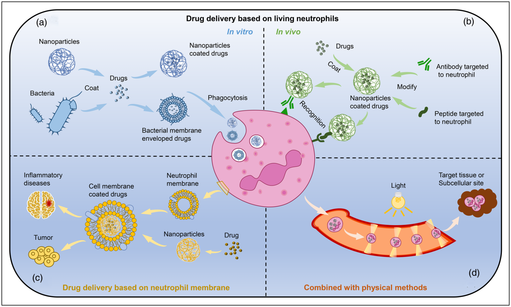
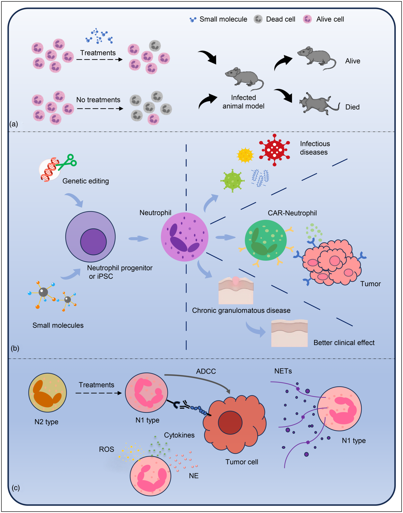

Review

# Engineered neutrophil, an emerging immune therapeutic strategy

Innate Immunity

Volume 31: 1–12

© The Author(s) 2025

Article reuse guidelines: [sagepub.com/journals-permissions](https://sagepub.com/journals-permissions)

DOI: [10.1177/17534259251365803](https://doi.org/10.1177/17534259251365803)

[journals.sagepub.com/home/ini](https://journals.sagepub.com/home/ini)

Jingyi Wang1,*, Teng Deng1,*, Ruisi Chen1,*, Lu Yang1, Yan Teng1 and Junming Miao1,2

1Departmnent of Neurology, Sichuan Provincial People’s Hospital, School of Medicine, University of Electronic Science and Technology of China, Chengdu, Sichuan, PR China

2Department of Optometry, North Sichuan Medical College, Nanchong, Sichuan, PR China

*These authors contributed equally to this work

**Corresponding authors:**  
Yan Teng, Departmnent of Neurology, Sichuan Provincial People’s Hospital, School of Medicine, University of Electronic Science and Technology of China, No.4, Section 2, North Jianshe Road, Chengdu, Sichuan, 610054, PR China. Email: [tengyan@uestc.edu.cn](mailto:tengyan@uestc.edu.cn)

Junming Miao, Department of Optometry, North Sichuan Medical College. No. 234, Fujiang Road, Shunqing District, Nanchong City, Sichuan Province, 637000, PR China. Email: [miaojunming@nsmc.edu.cn](mailto:miaojunming@nsmc.edu.cn)

## Abstract

Neutrophils play a pivotal role in the host immune system, serving as the frontline defense against microbial infections. They eradicate pathogens through diverse mechanisms, encompassing degranulation, phagocytosis, and the release of reactive oxygen species. Moreover, they are acknowledged as crucial contributors to chronic inflammatory pathological processes, including conditions such as cancer and autoimmune diseases. An expanding body of research suggests that neutrophils, harnessing their innate immune characteristics, possess the potential to serve as carriers for therapeutic agents or be directly employed in disease treatment. This underscores their potential as a cell therapy platform for future applications. Consequently, we systematically investigate the potential applications of neutrophils in this review, with a primary emphasis on elucidating the research advancements in utilizing neutrophils, including those derived from stem cells, for therapeutic interventions in various diseases.

**Keywords**  
Neutrophil, transfusion, drug delivery

Received: 7 April 2025; revised: 1 July 2025; accepted: 23 July 2025

Creative Commons Non Commercial CC BY-NC: This article is distributed under the terms of the Creative Commons Attribution-NonCommercial 4.0 License (<https://creativecommons.org/licenses/by-nc/4.0/>) which permits non-commercial use, reproduction and distribution of the work without further permission provided the original work is attributed as specified on the SAGE and Open Access page (<https://us.sagepub.com/en-us/nam/open-access-at-sage>).

## Introduction

Neutrophils, originating from the bone marrow, are the most prevalent immune cells and constitute 50%–70% of all white blood cells within the human bloodstream circulation.1,2 Neutrophils form the frontline defense against microorganisms and play a pivotal role in the overall immune defense system. During infection or inflammation, neutrophils rapidly migrate to the site of lesion. This process is facilitated by their strong chemotactic and endothelial adhesion capabilities. Simultaneously, activated pattern recognition receptors or opsonin-mediated receptors on neutrophils identify pathogenic microorganisms, thereby coordinating the phagocytosis of these microorganisms.1,3

The inadequate tissue infiltration of solid tumors by macromolecular drugs, antibody drugs, or existing cell therapy drugs, coupled with the challenges in penetrating biological barriers such as the blood-brain barrier, results in insufficient efficacy in the treatment of solid tumors and diseases like Alzheimer’s disease.4 Owing to the robust chemotaxis, rapid localization, and remarkable solid tissue infiltration capabilities of neutrophils, they emerge as highly promising candidates for drug delivery carriers. Simultaneously, being autologous immune cells, they exhibit excellent biocompatibility and low immunogenicity. Therefore, the utilization of neutrophils for the treatment of these diseases presents a broad and promising application prospect. Drug-loaded neutrophils are capable of achieving precise targeting through their response to inflammatory factors and chemokines.5

However, this technology also encounters challenges. Neutrophils have a short half-life. They are liable to undergo apoptosis during *in vitro* manipulation, exhibit low efficiency in separation and drug loading, and there exists a risk of toxicity resulting from off-target aggregation. Moreover, the preparation cost of autologous cell sources is high, and the process is intricate. In particular diseases such as tumors, their application may be restricted by the microenvironment. Consequently, clinical translation still has to overcome many technical bottlenecks.

Beyond their role as carriers for drug or molecular delivery, neutrophils transfusion is increasingly employed in therapeutic applications. As critical mediators of innate antibacterial immunity and inflammatory regulation, neutrophils play a pivotal role in host defense. Dysregulation of their functional activities or numerical abnormalities have been implicated in the pathogenesis of various diseases, examples of these conditions include congenital neutropenia, lazy leukocyte syndrome, and chronic granulomatous disease.6–8 Theoretically, the treatment of these diseases through transfusion of normal-functioning neutrophils to patients is feasible. It is capable of rapidly replenishing effector cells, regulating the body’s inflammatory state, or synergizing with antibiotics to enhance the bactericidal effect.

However, this therapy also faces challenges. the short half-life of neutrophils, lasting only 8–20 h in circulation, poses a significant hindrance to the efficiency of granulocyte transfusion (GTX) therapy.9–11 Simultaneously, frequent and high-dosage infusions are necessary. In the preparation process, a substantial quantity of blood needs to be collected from healthy donors, and the source is restricted. Additionally, *in vitro* manipulation of neutrophils is difficult, presenting a substantial limitation to the application of neutrophils in both scientific research and clinical practice. Hence, there is an urgent imperative to explore innovative approaches for enhancing the efficacy of treatments based on GTX.

In this review, we will provide a comprehensive introduction to current neutrophil-based treatment strategies, with a primary emphasis on the research progress in targeted drug delivery utilizing neutrophils as carriers and the application of neutrophils transfusion for disease treatment.

## Drug delivery via neutrophil

Over an extended duration, a multitude of researchers have endeavored to employ diverse viral or non-viral carriers for drug delivery.12 Despite efforts like molecular modification to boost drug treatment efficiency, problems like poor stability, easy degradation, and immune cell clearance have led to unsatisfactory results in murine or human subjects.13 As a result, an increasing number of researchers are investigating the utilization of the body’s endogenous cells as carriers for drug delivery. Initially, owing to their extended circulatory lifespan of up to 120 days, low immunogenicity, unique deformability, and a variety of drug-loading methods, red blood cells have natural advantages in long-acting sustained release, deep tissue penetration, and drug protection. Consequently, they are considered promising carriers. However, red blood cells do not possess active chemotaxis capabilities and encounter challenges in targeting inflammatory or tumor sites. Primarily, they rely on passive accumulation, which restricts the efficiency of precise delivery.14

With the progression of research, a growing cohort of researchers has observed that neutrophils exhibit a rapid ability to locate injury sites and traverse the blood-brain barrier. These distinctive characteristic positions them as a potential next-generation delivery carrier with significant potential. Neutrophil-based drug delivery predominantly hinges on their inherent chemotaxis mechanism. During inflammation, damaged tissues secrete diverse chemokines, establishing a concentration gradient in the lesion area. Neutrophils, equipped with surface-specific receptors (e.g., CXCR1/2), detect this gradient and initiate the “rolling-adhesion-migration” cascade, enabling trans-endothelial migration and directional movement to the inflamed site. Drug delivery systems leverage this trait via *ex vivo* drug loading followed by cell reinfusion or *in vivo* recruitment of endogenous neutrophils, allowing active migration to inflamed sites with drug cargo. Furthermore, researchers are capable of enhancing the chemotactic ability of neutrophils through a series of measures. These measures include loading tumor-targeting molecules or molecules that can promote the expression of chemotactic receptors, or integrating with physical methods such as optical tweezers and magnetic field technologies.5,15

Consequently, due to their natural chemotaxis characteristics, the utilization of neutrophils for delivering drugs to targeted injury sites possesses substantial application potential. Currently, drug delivery methods utilizing neutrophils as carriers primarily focus on the following aspects.

### Targeted drug delivery by utilizing living neutrophils

Figure 1. Drug delivery via neutrophil. (a) Neutrophils are isolated for host and utilized to engulf bacterial membranes or nanoparticle-coated drugs through phagocytosis *in vitro*. (b) Nanoparticles were modified with antibodies or amino acids and injected into the body, nanoparticles are capable of being recognized by neutrophils in circulation, facilitating their transportation to the site of pathology. (c) Neutrophil cell membranes isolated *in vitro* offer a viable method for drug encapsulation. (d) Application of physical methods to enhance the targeting efficacy of neutrophils. These strategies for drug delivery employing neutrophils show potential for the treatment of tumors and inflammatory conditions, including ischemic stroke.

*Drug delivery via neutrophil phagocytosis.* Neutrophils are widely recognized for their strong phagocytic capacity. They facilitate the engulfment of foreign substances, such as pathogenic microorganisms, via diverse receptors. By leveraging this capability, researchers initially employ bacterial-derived cell membranes as carriers for encapsulating targeted drugs. Through interaction with neutrophils, the carrier is engulfed by these neutrophils *in vitro*. Subsequently, the neutrophil-bacterial membrane carrier complex is injected into the body to accomplish targeted drug delivery (Figure 1(a)).

After phagocytosis, the drug-loaded carrier is encapsulated by neutrophils to form a phagosome, which then fuses with lysosomes. To avoid lysosomal degradation, drug stability maintenance requires optimization at both the carrier and drug structure levels. For instance, carriers can adopt anti-enzymatic modifications or co-load enzyme inhibitors to reduce lysosomal enzyme damage. Meanwhile, drugs themselves can undergo chemical modifications to enhance acid resistance and anti-enzymatic degradation capabilities. Some carriers promote drug escape into the cytoplasm through mechanisms like membrane fusion to avoid lysosomal degradation. In the other hand, Drug release relies on the responsive design of carriers, such as pH-sensitive carriers dissociating in acidic lysosomes or enzyme-sensitive carriers being degraded by hydrolases. Upon reaching the lesion, drug release is precisely regulated by stimuli-responsive systems, such as triggering carrier degradation via *in vivo* signals (e.g., pH, enzymes, redox). Additionally, multi-stage release mechanisms can be designed to match pharmacodynamic requirements by integrating sustained and controlled release strategies.5,15–17

For instance, a publication in 2025 by Gao et al. innovatively integrated three technologies, namely bacterial membrane camouflage, cellular robotics, and enzyme-driven nanorobotics, to develop a Trojan cell robot (Trojanbot) featuring a trinity of “sensing-navigation-assault” functions. The researchers developed enzyme-driven nanorobots (CatNbots) featuring autonomous motility by modifying catalase on the surface of nanoparticles. Employing nanotechnology, bacterial membranes were coated onto the nanoparticle surface. Subsequently, CatNbots were efficiently internalized by neutrophils through the latter’s natural phagocytic ability, thus successfully creating Trojanbots. Trojanbots initially respond to chemokines secreted by tumors, precisely traversing the blood-brain barrier and rapidly accumulating in glioblastoma tumor areas. Subsequently, upon being stimulated by inflammatory factors within the tumor microenvironment, Trojanbots actively release neutrophil extracellular traps (NETs) while concurrently unloading the internalized CatNbots. CatNbots, having catalase on their surface, detect the high-concentration \(\mathrm{H}_{2}\mathrm{O}_{2}\) in the tumor microenvironment, initiating enzyme-catalyzed decomposition to propel their movement into the depths of the tumor and release the anticancer drug. Kinetic trajectory analysis indicated that the velocity of CatNbots increases with the rising \(\mathrm{H}_{2}\mathrm{O}_{2}\) concentrations, demonstrating excellent autonomous navigation ability.18

This therapeutic strategy, which utilizes bacterial cell membranes as carriers for drug encapsulation and neutrophils for targeted delivery, offers numerous advantages. Bacterial cell membranes possess an inherent inflammatory tropism, which attracts neutrophil phagocytosis, enabling precise delivery to infected or inflamed lesions. The carrier can be loaded with a variety of drugs through genetic engineering or surface functionalization to address complex diseases. Nevertheless, this strategy also confronts several challenges. The source and preparation of bacterial cell membranes are not well-defined. The components can vary, and potential impurities may give rise to various issues. Neutrophils have a short lifespan and a restricted survival duration *in vitro*, thereby imposing limitations on the drug-loading efficiency. Moreover, the current *in vivo* tracing technologies are insufficient, which restricts the monitoring of the carrier’s distribution and drug release, thus impeding the evaluation of the treatment’s efficacy and safety.

*Drug delivery via neutrophil-specific ligands.* Considering their functional orientation, cells exhibit specific gene expression profiles and protein phenotypes. Molecular markers such as CD11b, CD66b, and CD16, on the surface of neutrophils, distinguish neutrophils from other cells. Hence, by optimizing nanoparticles and incorporating a specific ligand structure that recognizes the surface proteins of the neutrophil membrane, it is possible to achieve specific binding to neutrophils, serving the purpose of using them as transport carriers. This approach capitalizes on the ‘hitchhiking’ effect of neutrophils to effectively reach the disease site.

This approach primarily involves the *in vitro* design of drug delivery nanoparticles that are targeted at neutrophils. Subsequently, these nanoparticles are injected into the body. Once inside the body, they bind to endogenous neutrophils in the circulatory system. By capitalizing on the natural chemotactic properties of neutrophils, the nanoparticles convey the drug to the lesion site (Figure 1(b)).

As an illustration, Yu et al. initially conjugated fluorescein IR820 to albumin nanoparticles loaded with decitabine. Subsequently, they modified it with the CD11b antibody, enabling the nanoparticle to recognize and bind to the neutrophil surface protein CD11b. After systematic administration, the CD11b antibody is capable of targeting endogenous neutrophils in the bloodstream, enabling nanoparticles to bind to neutrophils. With the assistance of neutrophils, the nanoparticle was dispersed to the tumor site, releasing decitabine at the location. This process promotes tumor cell pyroptosis and enhances the adaptive immune response in a triple-negative breast cancer animal model. Simultaneously, the fluorescence of IR820 allows real-time tracking and observation of the local delivery status of drugs.19 N-acetylated proline-glycine-proline (PGP) exhibits an exceptionally high affinity for CXCR2, a receptor known to be highly expressed in activated neutrophils. Zhang et al. utilized the PGP molecule to modify nanoparticles containing cis-aconitic anhydride-modified catalase, enabling it to bind to neutrophils in blood after injection. By utilizing neutrophils, they achieved the penetration of the blood-brain barrier, rapid localization, and migration to inflammatory injury sites, thereby enhancing the therapeutic effect of drugs on ischemic stroke.20

This strategy is relatively simple and convenient compared to the drug loading-live neutrophil reinfusion. However, it present multiple off-target risks attributable to the non-specific expression of markers. As a prevalent marker for myeloid cells, CD11b binds to monocytes/macrophages, stimulating them to release inflammatory factors. This may give rise to systemic inflammation or local tissue damage. CXCR2, which is also expressed in macrophages, epithelial cells, vascular endothelial cells, and tumor cells, may lead to unpredictable consequences arising from the abnormal functions of various cell types.21

### Targeted drug delivery by utilizing neutrophil membrane

Despite the promising potential demonstrated by utilizing living neutrophils for drug delivery, several challenges persist. For example, an excessive influx of neutrophils may lead to significant tissue damage due to heightened inflammation. As a result, a considerable number of researchers have chosen to utilize the neutrophil membrane for drug delivery. This strategy aims to attain precise targeting and elevate local drug concentration without inducing inflammatory damage.22,23

The operational process of neutrophil membrane-based drug delivery encompasses isolating primary neutrophils, extracting their cell membranes, coating the membranes onto drug-loaded nanoparticles, and functionalizing the carriers with components such as targeting ligands. Finally, administer the drug by injection. This approach effectively harnesses the natural chemotactic properties of neutrophil membranes to achieve efficient and low-immunogenic drug delivery (Figure 1(c)). The body of its research reports is extensive, the following are several examples of classic studies.

The onset of acute myocardial infarction can elicit an aseptic inflammatory response, leading to myocardial remodeling and dysfunction. Despite advancements in employing various anti-cytokine drug interventions clinically, their efficacy remains suboptimal owing to the absence of precise targeting of intervention drugs.24 Although neutrophils can be directed to migrate to the site of inflammation, their presence may exacerbate the local inflammatory response. Hence, in this study, the author employs the neutrophil cell membrane to merge with a biomimetic nanoparticle and a broad-spectrum anti-inflammatory drug, resulting in the formation of Neu-LPs. The abundant expression of chemokines and cytokine receptors on the membrane surface allows for precise localization of the inflammatory site, targeting the infarct. This process facilitates the neutralization of released pro-inflammatory cytokines, achieves targeted release of anti-inflammatory drugs, modulates the immune microenvironment, and thereby inhibits the inflammatory response induced by acute myocardial infarction. Neu-LPs have exhibited favorable results in a mouse model of ischemia-reperfusion injury.25

Glioma is a malignant tumor that occurs in the brain, characterized by high mortality, poor prognosis, and a pronounced tendency for recurrence. The conventional approach entails surgical resection, yet it frequently proves ineffective.26 After surgical resection, local inflammation frequently ensues, attracting and recruiting neutrophils to the remaining tumor tissues. Numerous researchers exploit this biological phenomenon to encapsulate drugs within the neutrophil membrane, thereby achieving precise and effective targeted drug delivery.17,23,27 For example, Chen and colleagues incorporated the chemotherapeutic agent doxorubicin (DOX) into poly (lactide-co-glycolide)-poly (ethylene glycol) (PLGA-PEG). They employed the cell membrane derived from HL-60 cells to encapsulate PLGA-PEG-DOX, aiming to address glioma treatment. The outcomes of *in vivo* and *in vitro* experiments revealed the efficacy of this cell membrane drug-loading platform in penetrating the blood-brain barrier and restraining the proliferation of glioma cells.28 Furthermore, exosomes have garnered widespread applications in drug delivery and treatment due to their outstanding biocompatibility, long-range targeting, and cyclic stability. Wang et al. utilized neutrophil-derived exosomes loaded with doxorubicin (neutrophil-exosomes-DOX) for glioma treatment. The results indicated that neutrophil-exosomes-DOX could rapidly traverse the blood-brain barrier. Intravenous injection of neutrophil-exosomes-DOX effectively inhibited tumor growth and improved the survival time of mice.29

The utilization of neutrophil cell membranes for drug delivery presents distinctive biomimetic targeting advantages. Membrane chemokine receptors and adhesion molecules are capable of responding to inflammatory signals for directional migration, thereby accumulating at lesion sites. Moreover, this approach does not lead to excessive inflammatory damage. The human-derived membrane exhibits excellent biocompatibility, which extends the circulation time. However, it also encounters several challenges. The membrane extraction process might impair protein functions. The drug loading efficiency is relatively low, and it is difficult to precisely control the release kinetics. Additionally, non-specific binding may give rise to off-target effects and drug accumulation in organs.

### Neutrophil drug delivery strategy combined with physical methods

The conventional strategy of using neutrophils to deliver targeted drugs can allow neutrophils to transport drugs to specific sites, but often only through their chemotactic-dependent spontaneous movement, lacking effective activation and precise positioning capabilities. Researchers have developed various new methods to intervene in neutrophils, such as optical tweezers, and magnetic fields.30–32 These physical methods can be integrated with all of the aforementioned strategies, encompassing phagocytosis-based live cell drug delivery, specific ligands-based neutrophil drug delivery, and neutrophil cell membrane-based drug delivery (Figure 1(d)).

Optical tweezers technology is based on the principle of laser optical trapping, which utilizes the gradient force generated by the focusing of near-infrared laser beams to transfer photon momentum to neutrophils, creating an attractive force directed toward the beam focal point, thereby enabling non-invasive capture of cells. By flexibly manipulating the position of the laser beam, it allows precise guidance of cell migration in three-dimensional space. For example, Liu et al. integrated optical tweezers and neutrophils to form a microcraft, allowing the microcraft to be activated by remote control of the light and navigate to the target tissue along a pre-set route to fulfill its function.33 To address the limitation that neutrophil delivery can only reach the lesion and cannot be systematically delivered to the subcellular site, Xu et al. carried out modifications on neutrophils to create a novel photoactive neutrophil (PAN). This PAN encapsulates a multifunctional nanocomplex consisting of an Arginyl-Glycyl-Aspartic acid (RGD) and apoptotic peptide (RA), which is decorated with the liposomal photosensitizer Ce6. This modified neutrophil PAN can effectively cross the blood-brain barrier, demonstrating capabilities of self-amplified multistage targeting and inflammation response to enhance mitochondria-specific photo-chemotherapy. This allows RA/Cer6 to actively enter cancer cells and accumulate in mitochondria, triggering photodynamic therapy (PDT) and RA-induced mitochondrial membrane destruction, thereby enhancing anti-tumor effects.34

Magnetic field technology depends on magnetic nanoparticles (e.g., \(\mathrm{Fe}_{3}\mathrm{O}_{4}\)) labeled on the surface of neutrophils. Initially, magnetic nanoparticles are attached to cells via various methods. When an external gradient magnetic field is imposed, the magnetically labeled cells are subjected to the Lorentz force and move along the direction of the magnetic field gradient. This thereby enables the guidance of cells, assisting them in breaking through the interstitial pressure barrier of solid tumors and enhancing the drug penetration efficiency. For example, Zhang et al. coupled with the physical attributes of magnetic beads, innovatively designed neutrophil-*Escherichia coli* membrane-enveloped, drug-loaded magnetic nanogels, naming it a neutrophil-based microrobot (neutrobot). Upon exposure to a rotating magnetic field, the neutrobot autonomously accumulates in the brain and subsequently delivers the drug to the glioma. This approach significantly inhibits the growth of tumor cell.30

In neutrophil-based drug delivery using external physical signals, biological safety and cellular functional damage are major challenges. Optical tweezers’ laser energy can cause oxidative stress, raising reactive oxygen species ROS levels and impairing cell functions. Magnetically labeled nanoparticles may trigger immune responses. Also, the functional stability of cells under external interventions is not well-studied. Physical stimuli may alter neutrophil core functions, reducing drug delivery and therapeutic efficacy. Future work should optimize cellular responsiveness via gene editing and develop safer, more efficient manipulation methods with intelligent materials to overcome bottlenecks and enable clinical translation.

## Disease treatment through transfusion of engineered neutrophils

Neutrophil transfusion can be utilized to tackle diseases stemming from neutrophil functional or quantitative deficiencies, such as agranulocytosis. Similar to drug delivery, neutrophil transfusion therapy also relies on its intrinsic chemotactic properties. Researchers also utilize various methods to augment their immune function and lesion targeting capabilities. For instance, they employ cytokine pre-treatment (such as interferon-β) or genetic engineering techniques (such as chimeric antigen receptor) to modify neutrophils, thus enhancing their immune function and targeting of lesions.35

<table>
<caption data-pages="7" data-paragraph="46" id="p46">Table 1. Disease treatment through transfusion of engineered neutrophils.</caption>
<colgroup><col style="width:16%"/><col style="width:16%"/><col style="width:39%"/><col style="width:21%"/><col style="width:8%"/></colgroup>
<thead><tr><th scope="col">Disease</th><th scope="col">Objective</th><th scope="col">Treatment</th><th scope="col">Cell source</th><th scope="col">References</th></tr></thead>
<tbody>
<tr data-row="1">
<td data-col="1" rowspan="8">Infectious disease</td>
<td data-col="2" rowspan="2">Prolong neutrophil lifespan</td>
<td data-col="3">Anoxia, glucose, and DMOG supplementation</td>
<td data-col="4">Primary neutrophil</td>
<td class="table-reference" data-col="5">36</td>
</tr>
<tr data-row="2">
<td data-col="3">Cells were treated with cell death pathway blockers</td>
<td data-col="4">Primary neutrophil</td>
<td class="table-reference" data-col="5">10</td>
</tr>
<tr data-row="3">
<td data-col="2" rowspan="2">Prolong the <em>in vitro</em> preservation period of neutrophil</td>
<td data-col="3">A cocktail preservative is used to stable leukocyte viability</td>
<td data-col="4">Whole blood</td>
<td class="table-reference" data-col="5">37–39</td>
</tr>
<tr data-row="4">
<td data-col="3">A closed system procedure compatible with standard blood bank technologies to remove red blood cells and platelets</td>
<td data-col="4">Whole blood</td>
<td class="table-reference" data-col="5">40</td>
</tr>
<tr data-row="5">
<td data-col="2" rowspan="3">Enhance the production of granulocytes</td>
<td data-col="3">Prednisone and G-CSF Treatment</td>
<td data-col="4">Donors</td>
<td class="table-reference" data-col="5">41</td>
</tr>
<tr data-row="6">
<td data-col="3">Neutrophils were generated from induced pluripotent stem cells-based differentiation protocols</td>
<td data-col="4">Human induced pluripotent stem cells</td>
<td class="table-reference" data-col="5">42,43</td>
</tr>
<tr data-row="7">
<td data-col="3"><em>Ex vivo</em> manufacturing of neutrophils from progenitors</td>
<td data-col="4">progenitors</td>
<td class="table-reference" data-col="5">44</td>
</tr>
<tr data-row="8">
<td data-col="2">Transform the phenotype of neutrophils</td>
<td data-col="3">Inducing neutrophil transform to N1 and N2 phenotype by treating cells in a medium supplemented with clear chemical composition.</td>
<td data-col="4">Primary Human Neutrophils</td>
<td class="table-reference" data-col="5">45</td>
</tr>
<tr data-row="9">
<td data-col="1">Chronic granulomatous disease (CGD)</td>
<td data-col="2">Mutation gene repair</td>
<td data-col="3">CGD is a debilitating primary immunodeficiency affecting phagocyte function due to the mutations within the X-linked CYBB gene. Gene editing combined with viral delivery is used to repair the mutated CYBB gene</td>
<td data-col="4">CD34+ hematopoietic stem and progenitor cells</td>
<td class="table-reference" data-col="5">46–48</td>
</tr>
<tr data-row="10">
<td data-col="1">Severe congenital neutropenia (SCN)</td>
<td data-col="2">Mutation gene repair</td>
<td data-col="3">The main cause of SCN is autosomal dominant mutations in the elastase (ELANE) gene. Gene editing combined with viral delivery is used to repair the mutated ELANE gene</td>
<td data-col="4">SCN patient derived hematopoietic stem and progenitor cells</td>
<td class="table-reference" data-col="5">49–51</td>
</tr>
<tr data-row="11">
<td data-col="1" rowspan="3">Tumor</td>
<td data-col="2">Neutrophil genetic modification</td>
<td data-col="3">Genetically engineer human pluripotent stem cells using a platform with well-defined chemical components and chimeric antigen receptors (CARs), or combine them with nanorobots to differentiate them into functional neutrophils</td>
<td data-col="4">Human pluripotent stem cells</td>
<td class="table-reference" data-col="5">52,53</td>
</tr>
<tr data-row="12">
<td data-col="2" rowspan="2">Transform the phenotype of neutrophils</td>
<td data-col="3">type I TGF–β receptor kinase inhibitor (SM16) led to an influx of myeloid cells into tumors. TGF-β blockade results in the recruitment and activation of TAN with an anti-tumor phenotype</td>
<td data-col="4">Mice</td>
<td class="table-reference" data-col="5">54</td>
</tr>
<tr data-row="13">
<td data-col="3">Treat with low levels of IFN-β induced tumor angiogenesis by increasing infiltration of tumor-infiltrating neutrophils that encode pro-angiogenic and homing cytokines</td>
<td data-col="4">Tumor-infiltrating neutrophils</td>
<td class="table-reference" data-col="5">55</td>
</tr>
</tbody></table>

Currently, the research regarding neutrophil transfusion mainly centers on the following directions (Table 1).

### Transfusion of engineered neutrophil for infectious diseases treatment

Agranulocytosis is characterized by the absolute number of neutrophils in the blood being less than \(1.5 \times 10^{9}/\mathrm{L}\), while severe agranulocytosis is defined by the absolute number of neutrophils in the blood being less than \(0.5 \times 10^{9}/\mathrm{L}\). Once the absolute number falls below this threshold, the body becomes highly susceptible to infection by bacteria and fungi, leading to a high mortality rate. Therefore, granulocyte transfusion (GTX) can be used for clinical intervention.56–60 Nevertheless, this treatment is frequently not the first-choice option.61 The primary explanation for this circumstance is that neutrophils, originating from the bone marrow, are mature, terminally differentiated cells and lack the capacity for proliferation. Neutrophil lifespan is less than 24 h *ex vivo*. Additionally, neutrophils display robust resistance to gene editing. This poses a significant challenge in clinical practice, making the large-scale direct infusion of neutrophils for treating infectious diseases exceedingly difficult.3,10,11,62

Hence, extending the lifespan of neutrophils stands as a significant challenge in clinical applications. Despite considerable global efforts by scholars to prolong neutrophil lifespan, achieving an effective reversal of spontaneous neutrophil death remains elusive.

Figure 2. Transfusion of engineered neutrophil for disease treatment. (a) In contrast to untreated aging neutrophils, small molecule-modified neutrophils exhibit an extended lifespan, thereby emerging as a promising therapeutic option for the treatment of infectious diseases. (b) Genetic editing and small molecule modifications are employed to intervene in neutrophil progenitor cells or induced pluripotent stem cells (iPSCs), influencing downstream applications. Progenitor cells or iPSCs undergo differentiation into mature neutrophils, presenting a promising therapeutic avenue for a spectrum of diseases, encompassing infectious diseases, chronic granulomatous diseases, and tumors. (c) N2-type neutrophils can undergo conversion to N1-type neutrophils following specific treatments, including Transforming Growth Factor (TGF)-β blockade. N1-type neutrophils are characterized by their augmented anti-tumor activity, demonstrated through antibody-dependent cell-mediated cytotoxicity (ADCC) effects and the release of Neutrophil Elastase (NE), Reactive Oxygen Species (ROS), cytokines, and Neutrophil Extracellular Traps (NETs).

One of the recent breakthroughs involves a method reported by Fan et al. They employed a comprehensive approach, named CLON-G, which combines caspases-lysosomal membrane permeabilization-oxidant-necroptosis inhibition with granulocyte colony-stimulating factor (G-CSF). CLON-G effectively targets multiple neutrophil death pathways simultaneously. Following treatment with CLON-G, the *in vitro* survival time of both human and mouse neutrophils was extended from less than 1 day to more than 5 days. Importantly, the essential biological functions of neutrophils, including chemotaxis, phagocytosis, sterilization, and ROS production, remained unaffected. In a mouse model of agranulocytosis-associated pneumonia and systemic candida infection, the transfusion of CLON-G-treated neutrophils significantly prolonged the survival time of mice, enhanced their defense capabilities, and mitigated local infection damage. The observed effect is comparable to that of transfusing fresh granulocytes. CLON-G introduces a novel strategy for clinical applications of GTX (Figure 2(a)).10

Apart from directly extending the lifespan of mature neutrophils to enhance their utilization, researchers have also explored downstream interventions targeting the progenitor cells of neutrophils. This approach is particularly relevant for diseases arising from genetic mutations. For instance, chronic granulomatous disease (CGD), a frequently encountered genetic disorder of phagocyte dysfunction, is typically X-linked. It manifests as the deficiency of reduced coenzyme II (NADPH) oxidase in neutrophils, leading to a reduction in active oxygen and \(\mathrm{H}_{2}\mathrm{O}_{2}\) production. Consequently, invasive pathogenic microorganisms evade destruction, resulting in persistent, recurrent infections and the development of pigmented granulomas. Approximately one-third of patients succumb to various infections during childhood. Presently, clinical management involves continuous neutrophil transfusions and hematopoietic stem cell transplantation, either from normal donors or those modified for therapeutic purposes.8

Several research teams, including those led by Kohn, Wong, Mesa-Núñez, and Brendel, have employed lentiviral vectors for genetic modifications of CD34+ hematopoietic stem cells in patients, yielding promising clinical outcomes.46,47,63,64 In addition to gene editing utilizing lentiviral vectors, various research teams have reported employing alternative methods for gene editing of hematopoietic stem cells. Techniques such as Transcription Activator-Like Effector Nucleases (TALEN), Zinc Finger Nuclease (ZFN), and Clustered Regularly Interspaced Short Palindromic Repeats (CRISPR)-Cas9 have all demonstrated positive clinical therapeutic effects (Figure 2(b)).65

Except for hematopoietic stem cells, Trump et al. explored the use of induced Pluripotent Stem Cells (iPSC) as an alternative to hematopoietic stem cells, aiming to differentiate them into mature neutrophils for treatment. The findings indicated that the release of ROS in iPSC-derived neutrophils was comparable to that in normal peripheral blood-derived neutrophils. However, there was a slight attenuation in the phagocytosis of *Escherichia coli* and the formation of neutrophil extracellular traps (NET). Researchers have endeavored to integrate iPSC and CRISPR-Cas9 technology, modifying and repairing genes before downstream differentiation, to enhance their therapeutic efficacy (Figure 2(b)).42 Hence, cell therapy utilizing iPSC-derived neutrophils holds promising potential. However, further research is imperative to refine and enhance its effectiveness.43

### Transfusion of engineered neutrophil for tumor treatment

Advancements in cell therapy technology have been remarkable, encompassing chimeric antigen receptor T-cell (CAR-T), T-cell receptor-engineered T-cell (TCR-T), chimeric antigen receptor natural killer cell (CAR-NK), lymphokine-activated killer cells (LAK), and cytokine-induced killer cells (CIK). Notably, in the realm of hematological disorders, CAR-T targeting CD19, CD20, and B Cell Maturation antigen (BCMA) has yielded outstanding results. However, challenges such as poor T cell infiltration in solid tumor tissues, difficulty crossing the blood-brain barrier, and side effects like cytokine release syndrome prompt academia and industry to actively seek new approaches for treating solid tumors.66,67 Neutrophils, recognized for their significant infiltration of solid tissues and adeptness in crossing the blood-brain barrier, are being acknowledged as promising carriers for the treatment of solid tumors. In this context, we delve into the ongoing research focused on utilizing neutrophils for tumor treatment. In general, research on the direct treatment of tumors using neutrophils is primarily bifurcated into two aspects.

Firstly, akin to CAR-T, neutrophils are equipped with a ‘gripper’ capable of recognizing tumor antigens and subsequently activating the antibody-dependent cell-mediated cytotoxicity (ADCC) effect of neutrophils through corresponding signal transduction to exert tumoricidal effects. For instance, Chang et al. initially edited human pluripotent stem cells (hPSC), incorporated single-chain variable fragment (scFv) antibody fragments recognizing glioma antigens, and then inserted IgG4-CD4/NKG2D-CD3ζ to construct CAR-hPSC targeting glioma. Subsequently, it underwent *in vitro* differentiation and maturation to successfully construct CAR-Neutrophil targeting glioma. In an orthotopic tumor mouse model, it was demonstrated that hPSC-derived CAR-Neutrophil exhibited outstanding anti-tumor effects, significantly extending the survival time of mice.52 In 2023, Chang et al. also employed the CRISPR/Cas9-mediated gene-knock-in technology to genetically engineer human pluripotent stem cells. The aim was to enable these cells to express various anti-glioblastoma (GBM) chimeric antigen receptor (CAR) constructs, which incorporate either T-cell-specific CD3ζ or neutrophil-specific γ-signaling domains. CAR-neutrophils, featuring optimal anti-tumor activity, were developed to specifically and non-invasively deliver and release tumor microenvironment-responsive nanomedicines, with a focus on targeting GBM. This integrated chemo-immunotherapy approach demonstrated outstanding and specific anti-GBM activity (Figure 2(b)).53

Another research direction is the phenotypic transformation of neutrophils. Within tumors, neutrophils exhibit notable heterogeneity, similar to macrophages, neutrophils are categorized into N1 type (anti-tumor) and N2 type (pro-tumor) based on their functions in either promoting or inhibiting tumor progression.45,54,68 Studies have demonstrated that converting local neutrophils into the N1 type often leads to enhanced anti-tumor effects. For instance, Fridlender discovered that transforming growth factor (TGF)-β blockade can increase the entry and activation of anti-tumor effect neutrophils within the local tumor, resulting in improved anti-tumor efficacy. Similarly, Jablonska et al. identified that endogenous interferon (IFN)-β can impede tumor angiogenesis by suppressing tumor-infiltrating neutrophils that encode pro-angiogenic and homing cytokines (Figure 2(c)).45,54,55 Notwithstanding the existence of certain studies, the conversion efficiency remains less than satisfactory. There is a need for further exploration regarding how to precisely regulate the transition of neutrophil subtypes.

The utilization of engineered neutrophils for tumor therapy has innovative advantages. HSC-derived neutrophils allow large-scale production, overcoming quantity limits of traditional isolation and maintaining chemotaxis for tumor microenvironment migration; CAR-neutrophils can precisely recognize tumor antigens, penetrate the tumor stroma faster than CAR-T cells, release ROS and cytotoxic substances to kill tumors and activate the innate immune system; Engineering can optimize cell functions like enhancing anti-apoptosis, prolonging *in/ex vivo* survival, and improving neutrophil transfusion efficiency. However, this technology faces major challenges. At the preparation stage, inductive differentiation of HSCs into neutrophils has a long cycle, low efficiency, and it’s hard to ensure cell functional homogeneity. CAR-neutrophil antigen receptor design needs to balance specificity and off-target risks to avoid normal tissue attacks. In *in vivo* applications, neutrophils’ short lifespan may cause premature apoptosis before reaching the tumor, reducing therapeutic efficacy.

## Conclusion

Neutrophil-based cell therapy holds considerable promise in anti-cancer, anti-inflammatory, and anti-infection treatments, positioning itself as a pivotal cell therapy platform for future advancements. However, several unresolved issues persist. Neutrophils are easy to obtain, yet terminally differentiated, non-proliferative, and short-lived, limiting their use. Large-scale, repetitive production is a major hurdle for clinical translation. Also, the safety and efficacy of neutrophil-based drug delivery in humans are debatable. Additionally, while their inflammatory chemotaxis is useful, excessive infiltration and activation can cause diseases like tissue destruction and organ damage. Therefore, investigating the mechanisms of neutrophil spontaneous death and strategies to inhibit apoptosis is of great significance for surmounting the challenge of limited large-scale cell preparation. This is the primary directions for future research. Another pivotal approach is to enhance the efficiency of drug delivery and GTX through genetic editing or protein modification, while minimizing tissue damage caused by an increased number of neutrophils. In actuality, an effective approach for the genetic editing of primary neutrophils is also a significant matter that needs to be addressed. Additionally, exploring approaches to transform the phenotype of neutrophils is also a crucial research direction in the future. For example, techniques can be employed to transform cancer-promoting neutrophils into cancer-suppressing ones.

## Acknowledgments

This work was supported by funding from the National Natural Science Foundation of China (82302630 for Yan Teng), Department of Science and Technology of Sichuan Province (2021ZYD0093 and 2022YFS0597 for Lu Yang).

## ORCID iD

Yan Teng <https://orcid.org/0000-0002-8850-251X>

## Author contributions

T.Y. and Y.L. conceptualized the project, T.Y. and JM.M. searched and organized literatures. W.J.Y., D.T., and C.R.S. wrote first draft and made the figures. T.Y. and JM.M. wrote and revised the manuscript, T.Y. and Y.L. provided funding.

## Funding

Sichuan Provincial Science and Technology Support Program, National Natural Science Foundation of China, (grant number 2021ZYD0093, 2022YFS0597, 82302630).

## Declaration of conflicting interests

The authors declared no potential conflicts of interest with respect to the research, authorship, and/or publication of this article.

## References

1. Liew PX and Kubes P. The neutrophil’s role during health and disease. *Physiol Rev* 2019; 99: 1223–1248.

2. Ran T, Geng S and Li L. Neutrophil programming dynamics and its disease relevance. *Sci China Life Sci* 2017; 60: 1168–1177.

3. Kolaczkowska E and Kubes P. Neutrophil recruitment and function in health and inflammation. *Nat Rev Immunol* 2013; 13: 159–175.

4. Moroz E, Matoori S and Leroux JC. Oral delivery of macromolecular drugs: where we are after almost 100years of attempts. *Adv Drug Deliv Rev* 2016; 101: 108–121.

5. Chu D, Dong X, Shi X, et al. Neutrophil-based drug delivery systems. *Adv Mater* 2018; 30: e1706245.

6. Spoor J, Farajifard H and Rezaei N. Congenital neutropenia and primary immunodeficiency diseases. *Crit Rev Oncol Hematol* 2019; 133: 149–162.

7. Etzioni A and Ochs HD. Lazy leukocyte syndrome-an Enigma finally solved? *J Clin Immunol* 2020; 40: 9–12.

8. Yu HH, Yang YH and Chiang BL. Chronic granulomatous disease: a comprehensive review. *Clin Rev Allergy Immunol* 2021; 61: 101–113.

9. Teng Y, Luo HR and Kambara H. Heterogeneity of neutrophil spontaneous death. *Am J Hematol* 2017; 92: E156–E1E9.

10. Fan Y, Teng Y, Loison F, et al. Targeting multiple cell death pathways extends the shelf life and preserves the function of human and mouse neutrophils for transfusion. *Sci Transl Med* 2021; 13: eabb1069.

11. Luo HR and Loison F. Constitutive neutrophil apoptosis: mechanisms and regulation. *Am J Hematol* 2008; 83: 288–295.

12. Mitchell MJ, Billingsley MM, Haley RM, et al. Engineering precision nanoparticles for drug delivery. *Nat Rev Drug Discov* 2021; 20: 101–124.

13. Shi J, Kantoff PW, Wooster R, et al. Cancer nanomedicine: progress, challenges and opportunities. *Nat Rev Cancer* 2017; 17: 20–37.

14. Nguyen PHD, Jayasinghe MK, Le AH, et al. Advances in drug delivery systems based on red blood cells and their membrane-derived nanoparticles. *ACS Nano* 2023; 17: 5187–5210.

15. Vishnevskiy DA, Garanina AS, Chernysheva AA, et al. Neutrophil and nanoparticles delivery to tumor: is it going to carry that weight? *Adv Healthc Mater* 2021; 10: e2002071.

16. Han Y, Zhao R and Xu F. Neutrophil-Based delivery systems for nanotherapeutics. *Small* 2018; 14: e1801674.

17. Hosseinalizadeh H, Mahmoodpour M, Razaghi Bahabadi Z, et al. Neutrophil mediated drug delivery for targeted glioblastoma therapy: a comprehensive review. *Biomed Pharmacother* 2022; 156: 113841.

18. Gao Y, Mao M, Li Y, et al. A self-directed trojanbot-enzymatic nanobot in neutrobot for active target therapy of glioblastoma. *Nat Commun* 2025; 16: 5263.

19. Yu X, Xing G, Sheng S, et al. Neutrophil camouflaged stealth nanovehicle for photothermal-induced tumor immunotherapy by triggering pyroptosis. *Adv Sci (Weinh)* 2023; 10: e2207456.

20. Zhang C, Ling CL, Pang L, et al. Direct macromolecular drug delivery to cerebral ischemia area using neutrophil-mediated nanoparticles. *Theranostics* 2017; 7: 3260–3275.

21. Lazennec G, Rajarathnam K and Richmond A. CXCR2 Chemokine receptor - a master regulator in cancer and physiology. *Trends Mol Med* 2024; 30: 37–55.

22. Lee NH, You S, Taghizadeh A, et al. Cell membrane-cloaked nanotherapeutics for targeted drug delivery. *Int J Mol Sci* 2022; 23: 2223.

23. He Z, Zhang Y and Feng N. Cell membrane-coated nanosized active targeted drug delivery systems homing to tumor cells: a review. *Mater Sci Eng C Mater Biol Appl* 2020; 106: 110298.

24. Smit M, Coetzee AR and Lochner A. The pathophysiology of myocardial ischemia and perioperative myocardial infarction. *J Cardiothorac Vasc Anesth* 2020; 34: 2501–2512.

25. Chen J, Song Y, Wang Q, et al. Targeted neutrophil-mimetic liposomes promote cardiac repair by adsorbing proinflammatory cytokines and regulating the immune microenvironment. *J Nanobiotechnology* 2022; 20: 218.

26. Wang H, Xu T, Huang Q, et al. Immunotherapy for malignant glioma: current Status and future directions. *Trends Pharmacol Sci* 2020; 41: 123–138.

27. Phatale V, Famta P, Srinivasarao DA, et al. Neutrophil membrane-based nanotherapeutics: propitious paradigm shift in the management of cancer. *Life Sci* 2023; 331: 122021.

28. Chen H, Ji J, Zhang L, et al. Inflammatory responsive neutrophil-like membrane-based drug delivery system for post-surgical glioblastoma therapy. *J Control Release* 2023; 362: 479–488.

29. Wang J, Tang W, Yang M, et al. Inflammatory tumor microenvironment responsive neutrophil exosomes-based drug delivery system for targeted glioma therapy. *Biomaterials* 2021; 273: 120784.

30. Zhang H, Li Z, Gao C, et al. Dual-responsive biohybrid neutrobots for active target delivery. *Sci Robot* 2021; 6: eaaz9519.

31. Ekpenyong AE, Toepfner N, Fiddler C, et al. Mechanical deformation induces depolarization of neutrophils. *Sci Adv* 2017; 3: e1602536.

32. Hamza B and Irimia D. Whole blood human neutrophil trafficking in a microfluidic model of infection and inflammation. *Lab Chip* 2015; 15: 2625–2633.

33. Liu X, Gao Q, Wu S, et al. Optically manipulated neutrophils as native microcrafts in vivo. *ACS Cent Sci* 2022; 8: 1017–1027.

34. Chen YF, Hu F, Wang XG, et al. MicroRNA-23a-5p is involved in the regulation of lipopolysaccharide-induced acute lung injury by targeting HSP20/ASK1. *Oxid Med Cell Longev* 2021; 2021: 9942557.

35. Lopez-Arredondo A, Cruz-Cardenas JA, Cazares-Preciado JA, et al. Neutrophils, an emerging new therapeutic platform. *Curr Opin Biotechnol* 2024; 87: 103106.

36. Monceaux V, Chiche-Lapierre C, Chaput C, et al. Anoxia and glucose supplementation preserve neutrophil viability and function. *Blood* 2016; 128: 993–1002.

37. Sandlin RD, Wong KHK, Boneschansker L, et al. Preservative solution that stabilizes erythrocyte morphology and leukocyte viability under ambient conditions. *Sci Rep* 2017; 7: 5658.

38. Boonlayangoor P, Telischi M, Boonlayangoor S, et al. Cryopreservation of human granulocytes: study of granulocyte function and ultrastructure. *Blood* 1980; 56: 237–245.

39. Glasser L, Fiederlein RL and Huestis DW. Liquid preservation of human neutrophils stored in synthetic media at 22 degrees C: controlled observations on storage variables. *Blood* 1985; 66: 267–272.

40. Klinkmann G, Doss F, Goudeva L, et al. Prolonged storage of purified granulocyte concentrates: introduction of a new purification method. *Transfusion* 2022; 62: 194–204.

41. Murru A, Allard ME, Pare G, et al. Comparison of neutrophil function in granulocyte concentrates from prednisone- and G-CSF-treated donors: effect of stimulant, leukapheresis and storage. *Front Med (Lausanne)* 2022; 9: 839475.

42. Dannenmann B, Nasri M, Welte K, et al. CRISPR/Cas9 genome editing of human-induced pluripotent stem cells followed by granulocytic differentiation. *Methods Mol Biol* 2020; 2115: 471–483.

43. Trump LR, Nayak RC, Singh AK, et al. Neutrophils derived from genetically modified human induced pluripotent stem cells circulate and phagocytose Bacteria in vivo. *Stem Cells Transl Med* 2019; 8: 557–567.

44. Desai PM, Brown J, Gill S, et al. Open-Label phase II prospective, randomized, controlled study of romyelocel-L myeloid progenitor cells to reduce infection during induction chemotherapy for acute myeloid leukemia. *J Clin Oncol* 2021; 39: 3261–3272.

45. Ohms M, Moller S and Laskay T. An attempt to polarize human neutrophils toward N1 and N2 phenotypes in vitro. *Front Immunol* 2020; 11: 532.

46. Kohn DB, Booth C, Kang EM, et al. Lentiviral gene therapy for X-linked chronic granulomatous disease. *Nat Med* 2020; 26: 200–206.

47. Wong RL, Sackey S, Brown D, et al. Lentiviral gene therapy for X-linked chronic granulomatous disease recapitulates endogenous CYBB regulation and expression. *Blood* 2023; 141: 1007–1022.

48. De Ravin SS, Li L, Wu X, et al. CRISPR-Cas9 gene repair of hematopoietic stem cells from patients with X-linked chronic granulomatous disease. *Sci Transl Med* 2017; 9: eaah3480.

49. Tran NT, Graf R, Wulf-Goldenberg A, et al. CRISPR-Cas9-Mediated ELANE mutation correction in hematopoietic stem and progenitor cells to treat severe congenital neutropenia. *Mol Ther* 2020; 28: 2621–2634.

50. Nasri M, Ritter M, Mir P, et al. CRISPR/Cas9-mediated ELANE knockout enables neutrophilic maturation of primary hematopoietic stem and progenitor cells and induced pluripotent stem cells of severe congenital neutropenia patients. *Haematologica* 2020; 105: 598–609.

51. Sabo P, Makaryan V, Dicken Y, et al. Mutant allele knockout with novel CRISPR nuclease promotes myelopoiesis in ELANE neutropenia. *Mol Ther Methods Clin Dev* 2022; 26: 119–131.

52. Chang Y, Syahirah R, Wang X, et al. Engineering chimeric antigen receptor neutrophils from human pluripotent stem cells for targeted cancer immunotherapy. *Cell Rep* 2022; 40: 111128.

53. Chang Y, Cai X, Syahirah R, et al. CAR-neutrophil mediated delivery of tumor-microenvironment responsive nanodrugs for glioblastoma chemo-immunotherapy. *Nat Commun* 2023; 14: 2266.

54. Fridlender ZG, Sun J, Kim S, et al. Polarization of tumor-associated neutrophil phenotype by TGF-beta: “N1” versus “N2” TAN. *Cancer Cell* 2009; 16: 183–194.

55. Jablonska J, Leschner S, Westphal K, et al. Neutrophils responsive to endogenous IFN-beta regulate tumor angiogenesis and growth in a mouse tumor model. *J Clin Invest* 2010; 120: 1151–1164.

56. Gafter-Gvili A, Fraser A, Paul M, et al. Antibiotic prophylaxis for bacterial infections in afebrile neutropenic patients following chemotherapy. *Cochrane Database Syst Rev* 2005; 1: CD004386.

57. Marfin AA and Price TH. Granulocyte transfusion therapy. *J Intensive Care Med* 2015; 30: 79–88.

58. West KA and Conry-Cantilena C. Granulocyte transfusions: current science and perspectives. *Semin Hematol* 2019; 56: 241–247.

59. Morton S, Fleming K and Stanworth SJ. How are granulocytes for transfusion best used? The past, the present and the future. *Br J Haematol* 2023; 200: 420–428.

60. Boxer L and Dale DC. Neutropenia: causes and consequences. *Semin Hematol* 2002; 39: 75–81.

61. Zhang J, Wu XY and Jin RM. Neutropenia: diagnosis and management. *World J Pediatr* 2022; 18: 771–777.

62. Pillay J, den Braber I, Vrisekoop N, et al. In vivo labeling with 2H2O reveals a human neutrophil lifespan of 5.4 days. *Blood* 2010; 116: 625–627.

63. Brendel C, Rothe M, Santilli G, et al. Non-Clinical efficacy and safety studies on G1XCGD, a lentiviral vector for ex vivo gene therapy of X-linked chronic granulomatous disease. *Hum Gene Ther Clin Dev* 2018; 29: 69–79.

64. Colella P, Ronzitti G and Mingozzi F. Emerging issues in AAV-mediated in vivo gene therapy. *Mol Ther Methods Clin Dev* 2018; 8: 87–104.

65. Sweeney CL, Merling RK, De Ravin SS, et al. Gene editing in chronic granulomatous disease. *Methods Mol Biol* 2019; 1982: 623–665.

66. Labanieh L and Mackall CL. CAR Immune cells: design principles, resistance and the next generation. *Nature* 2023; 614: 635–648.

67. Schubert ML, Schmitt M, Wang L, et al. Side-effect management of chimeric antigen receptor (CAR) T-cell therapy. *Ann Oncol* 2021; 32: 34–48.

68. Sansores-Espana LD, Melgar-Rodriguez S, Vernal R, et al. Neutrophil N1 and N2 subsets and their possible association with periodontitis: a scoping review. *Int J Mol Sci* 2022; 23:12068.
