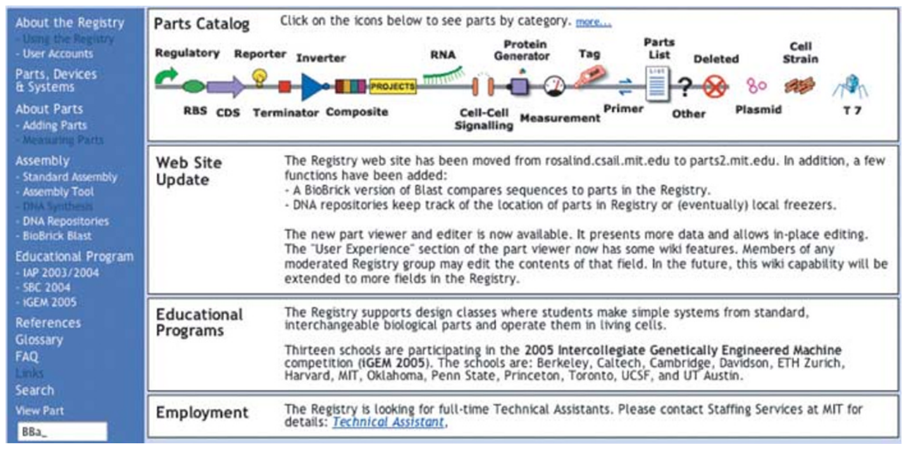
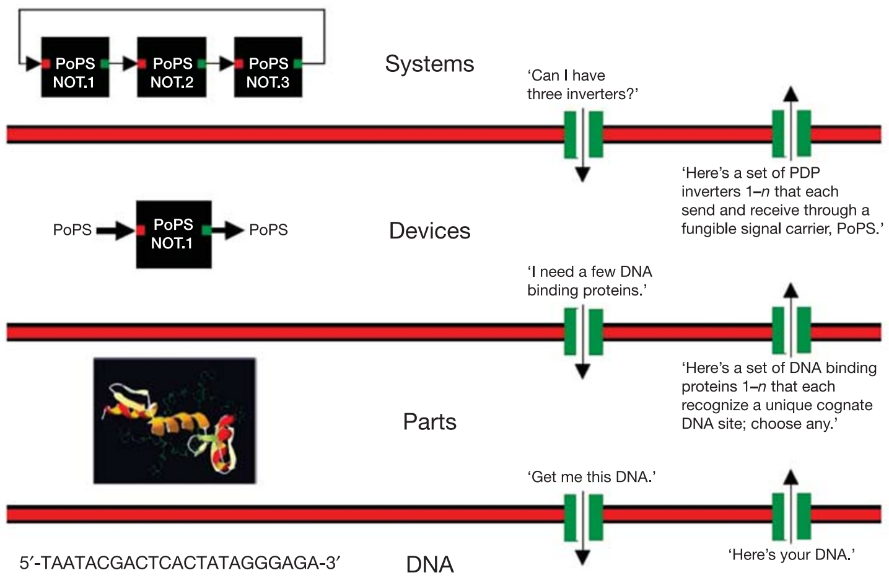
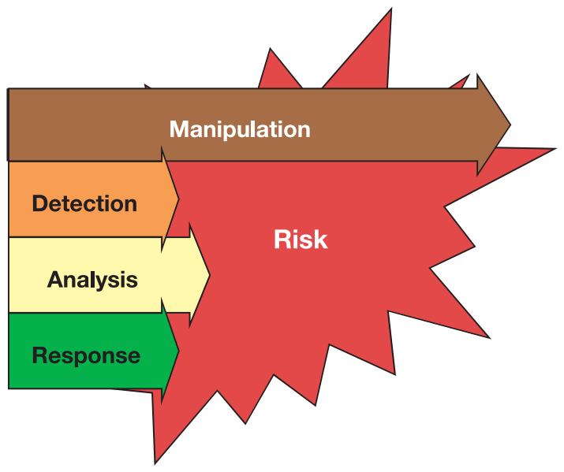

Foundations for engineering biology

Nature · Vol 438 · 24 November 2005 · [doi:10.1038/nature04342](https://doi.org/10.1038/nature04342)
Reviews

# Foundations for engineering biology

Drew Endy1

1 Division of Biological Engineering, Massachusetts Institute of Technology, Room 68-580, Koch Biology Building, 31 Ames Street, Cambridge, Massachusetts 02139, USA.

Engineered biological systems have been used to manipulate information, construct materials, process chemicals, produce energy, provide food, and help maintain or enhance human health and our environment. Unfortunately, our ability to quickly and reliably engineer biological systems that behave as expected remains quite limited. Foundational technologies that make routine the engineering of biology are needed. Vibrant, open research communities and strategic leadership are necessary to ensure that the development and application of biological technologies remains overwhelmingly constructive.

Please complete one of the following projects in the next hour: write down the DNA sequence that programmes a biofilm to take a photograph and perform distributed edge-detection on the light-encoded image; or, the DNA sequence that encodes a ring oscillator that works inside yeast; or, the DNA sequence that programmes any mammalian cell to count up to 256 in response to a generic input signal; or, the DNA sequence that programmes any prokaryote to produce 25 g l−1 artemisinic acid. Alternatively, describe in convincing detail the starting materials, experimental screens and genetic selections that could be used to evolve biological systems to perform these tasks… Time’s up!

The abovementioned applications of synthetic biology could find uses in the construction of templated surfaces for nanoscale materials fabrication, the characterization of physical performance limits for eukaryotic gene expression, the study and control of cell division, animal development, ageing and cancer by modest amounts of genetically encoded memory and logic, or the cost-effective production of an anti-malaria drug precursor, respectively. Furthermore, each application is physically plausible, or is the direct extension of an already demonstrated result[1–3](#ref-1). Yet, each project would be a unique, expert-driven research problem, with uncertain times to completion, costs and probabilities of success. For example, construction of the first genetically encoded ‘ring oscillator’ in bacteria took two of the world’s best biophysicists at least one year of research[2,4](#ref-2). Constructing a second genetically encoded ring oscillator would probably cost another group as much effort. In contrast, any competent electrical engineering student could build many working electronic ring oscillators in under one hour.

In 1978, Szybalksi and Skalka wrote[5](#ref-5), “The work on restriction nucleases not only permits us easily to construct recombinant DNA molecules and to analyse individual genes, but also has led us into the new era of ‘synthetic biology’ where not only existing genes are described and analyzed but also new gene arrangements can be constructed and evaluated.” Twenty-seven years later, despite tremendous individual successes in genetic engineering and biotechnology[6–8](#ref-6), why is the engineering of useful synthetic biological systems still an expensive, unreliable and *ad hoc* research process?

The first possibility is that we don’t yet know enough about biological systems, or that biological systems are too complex to reliably engineer, or both. For example, some descriptions of natural biological systems are notoriously complex[9,10](#ref-9). The large number of unique functional components combined with unexpected interactions among components (for example, pleiotropy) makes it hard to imagine that we might reliably engineer the behaviour of complex biological systems. Furthermore, it is possible that the designs of natural biological systems are not optimized by evolution for the purposes of human understanding and engineering[11](#ref-11). Thankfully, these concerns are best evaluated by attempting to surmount them[12](#ref-12).

The second possibility is that the engineering of biology remains a research problem because we have never invented and implemented foundational technologies that would make it an engineering problem. Stated plainly, the engineering of biology remains complex because we have never made it simple (T. F. Knight, personal communication). As above, the practicality of making biological engineering simple can best be evaluated by attempting to make it simple. Success would help to “create the discipline of synthetic biology: an engineering technology based on living systems”[13](#ref-13). Failures would directly illuminate and help prioritize the most relevant gaps in our current understanding of natural living systems, and suggest how we might best eventually come to understand and apply nature’s original technology[14](#ref-14).

## What and why is synthetic biology?

The recent and ongoing interest in ‘synthetic biology’ is being driven by at least four different groups: biologists, chemists, ‘re-writers’ and engineers. Briefly, for biologists, the ability to design and construct synthetic biological systems provides a direct and compelling method for testing our current understanding of natural biological systems[4,15](#ref-4); disagreements between expected and observed system behaviour can serve to highlight the science that is worth doing. For chemists, biology is chemistry, and thus synthetic biology is an extension of synthetic chemistry; the ability to create novel molecules and molecular systems allows the development of useful diagnostic assays and drugs, expansion of genetically encoded functions, study of the origins of life, and so on[16](#ref-16). For ‘re-writers’, the designs of natural biological systems may not be optimized for human intentions (for example, scientific understanding, health and medicine); synthetic biology provides an opportunity to test the hypothesis that the genomes encoding natural biological systems can be ‘re-written’, producing engineered surrogates that might usefully supplant some natural biological systems[11](#ref-11). Finally, for engineers, biology is a technology; building upon past work in genetic engineering, synthetic biology seeks to combine a broad expansion of biotechnology applications with—as the focus of this article—an emphasis on the development of foundational technologies that make the design and construction of engineered biological systems easier.

## Foundations for engineering biology

Many times over, individuals and groups have adapted and applied different resources from nature to the service of human needs such as shelter, food, health and happiness; notably, natural resources are limited while our needs, in aggregate, may be unbounded. In this context, we should attempt to develop foundational technologies that make it easier and more efficient to satisfy human needs. For example, in the developed world, the design and construction of buildings is now a routine and reliable process. The success of the building process depends on (1) the existence of a limited set of predefined, refined materials that can be delivered on demand and that behave as expected, (2) generally useful rules (that is, simple models) that describe how materials can be used in combination (or not), and (3) skilled individuals with a working knowledge and means to apply these rules. Biology itself is a natural resource that can be further adapted to help satisfy human needs. What foundational engineering technologies would best enable the routine design and construction of useful synthetic biological systems?

Today, four challenges that greatly limit the engineering of biology are (1) an inability to avoid or manage biological complexity, (2) the tedious and unreliable construction and characterization of synthetic biological systems, (3) the apparent spontaneous physical variation of biological system behaviour, and (4) evolution. In considering how best to address these engineering challenges, one practical starting point is to consider past lessons from when other engineering disciplines emerged from the natural sciences. Are any past lessons relevant to the engineering of biology today? For example, could we usefully consider adapting or extending ideas from structural engineering to synthetic biology?

The three past ideas that now seem most relevant to the engineering of biology are standardization, decoupling and abstraction (see the Acknowledgements for a list of people who have helped to contribute to these ideas). To be clear, these ideas and my prioritization of them could be wrong; I would explicitly encourage the widespread invention and discussion of alternative ideas. However, as introduced below, the successful development of foundational technologies based on these ideas would greatly ameliorate the first three engineering challenges posed above. The fourth challenge, evolution, is largely unaddressed within past engineering experience (discussed below).

## Standardization

Standards underlie most aspects of the modern world[17](#ref-17). Railroad gauges, screw threads, internet addresses, ‘rebar’ for reinforcing concrete, gasoline formulations, units of measure, and so on. In the science of biology, a number of useful standards have already arisen around the ‘central dogma’ that defines the core operations of most natural biological systems, and in response to the development of widely practiced methods that generate significant amounts of data. As representative examples, standards of varying utility now exist for DNA sequence data and genetic features[18](#ref-18), microarray data[19](#ref-19), protein crystallographic data[20](#ref-20), enzyme nomenclature[21](#ref-21), systems biology models[22](#ref-22) and restriction endonuclease activities[23](#ref-23). However, the biological engineering community has yet to develop formal, widely used standards for most classes of basic biological functions (for example, promoter activity), experimental measurements (for example, protein concentrations) and system operation (for example, genetic background, media, growth rate, environmental conditions, and so on).

Tremendous costs accrue owing to the lack of standards in biological engineering. For example, one would-be biological engineer’s ‘strong’ ribosome binding site may be merely middling to another. As a second example, one group’s genetic toggle switch may work in Jacques Monod’s *Escherichia coli* strain JM2.300 (which may be the same as Sydney Brenner’s *E. coli* strain XAO) when the cells are grown in Luria broth[24](#ref-24), while another group’s synthetic genetic oscillatory network will work in Malcolm Casadaban’s *E. coli* strain MC4100 when the cells are grown in supplemented minimal media[2](#ref-2). Could another group directly combine these two systems to produce a working ‘toggle-lator’[25](#ref-25)? The obvious engineering cost is that we don’t know—it’s a research project; but also note that it costs approximately 30 minutes just to track down all of this background information.

Figure 1 | The Registry of Standard Biological Parts. This registry (<http://parts.mit.edu/>; modified image from the homepage shown), hosted by the MIT, provides free access to an open commons of basic biological functions that can be used to programme synthetic biological systems[26](#ref-26). Anybody may contribute, draw upon, or improve the parts maintained within the Registry.

Looking forward, the biological engineering community would benefit from the development of technologies and the promulgation of standards that support the definition, description and characterization of the basic biological parts[26](#ref-26), as well as standard conditions that support the use of parts in combination and overall system operation. One very preliminary example of such work is emerging as the Registry of Standard Biological Parts (Fig. 1). However, beyond the technology itself, standards are also needed to support a vibrant, constructive and responsible community of biological engineers. For example, legal standards are needed to define means by which large collections of parts encoding basic biological functions, from a myriad of sources, can be easily shared and used in combination to realize many applications. Current legal standards such as uniform Materials Transfer Agreements (MTAs), which define the terms that allow researchers at different organizations to share biological materials, can take several weeks to execute, and typically do not resolve application rights. Meanwhile, direct chemical synthesis of up to ~10,000-base-pair DNA fragments is a widely available commercial service (as entering “gene synthesis” into an internet search engine will confirm); for cases in which the DNA sequence information encoding the desired part is freely available, it is often cheaper and faster to directly synthesize the part from scratch instead of executing an MTA. Thus, new low- or zero-cost legal strategies that facilitate and protect the exchange of the genetic information defining parts, and the use of parts in combination, are needed. As a second example, it seems prudent to develop community-wide standards for barcoding, signing and watermarking DNA in order to support the detection, identification and authentication of engineered biological systems, respectively[27](#ref-27).

## Decoupling

Decoupling is the idea that it is useful to separate a complicated problem into many simpler problems that can be worked on independently, such that the resulting work can eventually be combined to produce a functioning whole. Two representative examples of decoupling include (1) building projects, which are often separated into architecture, engineering, construction, project management and inspection tasks, and (2) very-large scale integrated (VLSI) electronics, which is an engineering technology that only became practical once rules were worked out to enable the separation of chip design from chip fabrication[28](#ref-28).

Today, in biological engineering, many useful types of decoupling could be developed within the context of standardization (discussed above) and abstraction (discussed below). For example, one engineer might develop standard ‘power supply and chassis’ cells that provide known rates of nucleotides, amino acids and other resources to any engineered biological system placed within the cell, independent of the details of the system[29](#ref-29). Another engineer might develop technologies that enable the decomposition of complicated ‘systems’ into sets of independent ‘devices’ (discussed below). However, the simplest and most immediate type of decoupling is likely to be design from fabrication. The decoupling of design and fabrication in biological engineering is being driven by recent and ongoing improvements in the process of DNA synthesis. Bulk DNA synthesis capacity appears to have doubled every 18 months or so for the last ten years; the commercial price of synthesis of long fragments of DNA (>500 base pairs) has continued to decrease by a factor of approximately two in each of the past three years[30](#ref-30)—a trend that seems likely to continue over the next three years. More recently, downstream technology has been developed that allows for the automatic assembly of oligonucleotides and short DNA fragments into much longer molecules[31–33](#ref-31). Given gene and genome synthesis technology, some individuals can and should focus on designing useful pieces of DNA, while other individuals focus on building DNA; each group need only be expert in their respective tasks.

## Abstraction

Natural biological systems seem wonderfully complex. New molecular mechanisms that regulate cellular behaviour are still being discovered[34](#ref-34) and ‘exceptions to rules’ abound[35](#ref-35). Given this context, how might we make routine the engineering of many-component biological systems that behave as expected?

Figure 2 | An abstraction hierarchy that supports the engineering of integrated genetic systems. The purpose of an abstraction hierarchy is to hide information and manage complexity. Abstraction levels are listed (‘DNA’, ‘Parts’, ‘Devices’, ‘Systems’). Here, ‘DNA’ is genetic material, ‘Parts’ are basic biological functions (for example, a DNA-binding protein), ‘Devices’ are any combination of ‘Parts’ that perform a human-defined function, and ‘Systems’ are any combination of ‘Devices’. Abstraction barriers (red) block all exchange of information between levels. Interfaces (green) enable the limited and principled exchange of information between levels. Naive exchanges are given in quotes. To be useful, individuals must be able to work independently at each level of the hierarchy. In synthetic biology, for example, parts-level researchers might need to know what sorts of parts that device-level researchers would like to use, how different types of parts actually work (for example, atomic interactions between amino acids and the major groove of DNA), and how to order a piece of DNA. But, parts-level researchers should not need to know anything about phosphoramidite chemistry, how short oligonucleotides are assembled into longer, contiguous DNA fragments, or how a genetic oscillator works, and so on. As a second example, device-level researchers must define devices that use common signal carriers, and thus can be reused in combination (A. Che *et al.*, manuscript in preparation). Implicit in this hierarchy are formidable molecular engineering challenges; for example, engineering a set of 1,000 synthetic transcription factors based on zinc-finger–leucine-zipper chimaeras[45](#ref-45), each recognizing a unique cognate DNA binding site with >99% specificity (C. O. Pabo, personal communication).

One powerful technology for managing complexity is abstraction. Two forms of abstraction now seem worth exploring in biological engineering. First, the information describing biological functions might be organized across levels of complexity using abstraction hierarchies (Fig. 2). To be useful, biological engineering abstraction hierarchies must (1) allow individuals to work at any one level of complexity without regard for the details that define other levels, yet (2) allow for the principled exchange of limited information across levels (see Fig. 2 legend for more information). Second, the parts and devices that comprise engineered biological systems should probably be redesigned and built anew so that they are simpler to model and easier to use in combination. For example, it is often hard to predict the expressed protein level that will be produced by the novel combination of a natural transcription promoter, ribosome binding site (RBS) and open reading frame (ORF); combination-specific messenger RNA secondary structures created across RBS–ORF junctions might occlude ribosome loading and prevent an otherwise ‘strong’ RBS from initiating protein synthesis. Thus, in this example, it is worth exploring whether libraries of parts might be refined to produce common part–part junctions at the genetic level to help simplify the prediction of function when parts are used in combination. As a related example, ORF sets might be codon shuffled[36](#ref-36) to ‘erase’ any cryptic regulatory elements and provide a common putative mRNA secondary structure, and so on. The refining of natural parts to produce engineered biological parts may be similar to nature’s use of negative selection against promiscuous, deleterious molecular interactions within specific cell types[37](#ref-37), and is analogous to the processing of physical materials in other engineering disciplines. For comparison, microprocessors and other electronic systems are not built directly from chunks of metal and silicon found lying about the countryside.

## Evolution or design of reproducing machines

Today, almost all of engineering is limited to the design and production of disposable systems. For example, our computers, mobile phones and cars are not themselves designed to directly produce the next generation of computers, phones and cars; beyond some level of failure, engineered artefacts are recycled or abandoned. To an engineer, biological systems are replicating machines that make mistakes during the replication process (that is, biological systems are reproducing machines). At present, we do not have a practical theory that supports the design of reproducing biological machines, despite great progress in understanding how natural biological systems couple and tune error detection and correction during machine replication to organism fitness (for example, see refs 38, 39). To develop such a theory, areas worth exploring may initially include reliable computing with unreliable components, error detection and correcting codes, and theory of self-replicating automata[40](#ref-40). If we fail to learn how to programme reproducing biological machines that we can understand, but can afford enough DNA synthesis, one fall-back option may be to engineer disposable biological systems, in which the system designs are decoupled from the constraints of direct descent and replication with error.

## Consequences of success

The successful development of foundational technologies based on the ideas of standardization, decoupling and abstraction would help make routine the engineering of synthetic biological systems that behave as expected. Once developed, many of these foundational technologies will take the form of ideas or information, and thus are likely to be freely distributed worldwide to the service of diverse human needs. By definition, foundational technologies would help to broadly enable many applications (that is, more than can be enumerated). The general utility of such technologies is what justifies the planning, investment and community organization needed for their development. In support of such work, what follows are a few representative examples that illustrate what should become possible within the next five years, given investment and advances in each technology class.

Standardization. Undergraduates and high school students, without prior training in biology or biological engineering, should, over a period of weeks, be able to design synthetic biological systems of their own invention comprised of several dozen pre-existing standard biological parts, order and receive the DNA encoding the system, and show it to work.

Decoupling. Systematic engineering of bacterial genomes and eukaryotic and plant chromosomes should be made possible by continued advances in DNA synthesis. Applications of genome and chromosome engineering will range from automated scientific discovery (for example, the annotation of a newly sequenced organism might be used to define a second genome that encodes only the annotated functions; synthesis of the second genome, in parts and in whole, could be used to test the accuracy of the original sequence and the sufficiency of its annotation) to biological safety (for example, orthogonal and ‘fail-fast’ codon tables that reduce the ecological impact of horizontal gene transfer) to biological defence (for example, rapid synthesis of DNA vaccines).

Abstraction. Performance characteristics and signal carriers that delimit how engineered biological parts can be combined into many-part devices and systems will be defined and may, in turn, spur the development of new measurement technologies for the characterization of cellular state[41](#ref-41).

## Biological risks, strategy and leadership

Figure 3 | Technology classes relevant to current and future biological risk. Both nature’s, and our own, ability to manipulate biological systems outpaces our ability to detect biological agents, analyse the resulting data, and respond appropriately. As a result, we are exposed to existing, emerging and engineered biological threats. Foundational technologies that affect the science and engineering of biology (for example, DNA synthesis) must be evaluated in the context of their net contribution to risk exposure and not only risk creation (see the text for a discussion).

The development and distribution of foundational technologies that make the engineering of biology easier will have a direct impact on our exposure to natural and engineered biological risks. However, analysing the risk impact of such technologies is not straightforward (Fig. 3). For example, DNA synthesis has recently helped to enable the ‘resurrection’ of the 1918 influenza strain[42](#ref-42), and is now widely believed capable of producing the smallpox genome from publicly available sequence information[43](#ref-43); variants of these viruses and other pathogens could be readily constructed. But, when a natural or engineered biological threat next emerges, DNA synthesis would find immediate use in accelerating our analysis of the risk (for example, rapid synthesis of pathogen ORFs codon optimized for recombinant protein expression) and our response to the risk (for example, rapid synthesis of vaccines or vaccine precursors). Meanwhile, and most importantly, the most overwhelming and certain use of DNA synthesis will be its direct acceleration of ongoing, constructive experimental research. Today, for example, a practicing experimental biologist or biological engineer can easily spend around 50% of their effort manipulating DNA just to produce the genetic material needed for an experiment; ‘instant’ DNA synthesis would provide a general twofold increase in research productivity. Thus, an attempt to ban or limit access to DNA synthesis technology, and the sequence information that defines what to synthesize, would only be guaranteed to cripple biological engineering research and hinder biomedical research. In this context, our future biological security will depend not on limits to technology and research, but rather on the successful development of general, agile capabilities for detecting, understanding and responding to biological risks; work that is already needed given existing and emerging infectious diseases. Because technologies for engineering biology will be openly developed and widely distributed, political leadership is needed to encourage all members of society to help actively foster a worldwide community that celebrates the science of biology, and lead the overwhelmingly constructive development and application of future biological technologies[44](#ref-44).

1. Levskaya, A. *et al.* Bacterial photography: Engineering *Escherichia coli* to see light. *Nature* [doi:10.1038/nature04405](https://doi.org/10.1038/nature04405) (this issue).
2. Elowitz, M. B. & Leibler, S. A synthetic oscillatory network of transcriptional regulators. *Nature* **403**, 335–338 (2000).
3. Martin, V. J. *et al.* Engineering a mevalonate pathway in *Escherichia coli* for production of terpenoids. *Nature Biotechnol.* **21**, 796–802 (2003).
4. Sprinzak, D. & Elowitz, M. B. Reconstruction of genetic circuits. *Nature* [doi:10.1038/nature04335](https://doi.org/10.1038/nature04335) (this issue).
5. Szybalski, W. & Skalka, A. Nobel prizes and restriction enzymes. *Gene* **4**, 181–182 (1978).
6. Goeddel, D. V. *et al.* Expression in *Escherichia coli* of chemically synthesized genes for human insulin. *Proc. Natl Acad. Sci. USA* **76**, 106–110 (1979).
7. Murray, A. W. & Szostak, J. W. Construction of artificial chromosomes in yeast. *Nature* **305**, 189–193 (1983).
8. Perlak, F. J. *et al.* Insect resistant cotton plants. *Biotechnology* **8**, 939–943 (1990).
9. Oltvai, Z. N. & Barabasi, A. L. Systems biology. Life’s complexity pyramid. *Science* **298**, 763–764 (2002).
10. Csete, M. E. & Doyle, J. C. Reverse engineering of biological complexity. *Science* **295**, 1664–1669 (2002).
11. Chan, L. Y., Kosuri, S. & Endy, D. Refactoring bacteriophage T7. *Mol. Syst. Biol.* published online, 13 September 2005 ([doi:10.1038/msb4100025](https://doi.org/10.1038/msb4100025)).
12. Weber, M. in *The Vocation Lectures* (eds Owen, D. & Strong, T. B.; translator Livingstone, R.) 1–31 (Hackett Publishing, Indianapolis, Indiana, 2004).
13. Knight, T. F. Engineering novel life. *Mol. Syst. Biol.* published online, 13 September 2005 ([doi:10.1038/msb4100028](https://doi.org/10.1038/msb4100028)).
14. Whitesides, G. M. The once and future nanomachine. *Sci. Am.* **285**, 78–83 (2001).
15. Kirschner, M. W. The meaning of systems biology. *Cell* **20**, 503–504 (2005).
16. Benner, S. A. & Sismour, A. M. Synthetic biology. *Nature Rev. Genet.* **6**, 533–543 (2005).
17. Surowiecki, J. Turn of the century. *WIRED* 10.01 <<http://www.wired.com/wired/archive/10.01/standards.html>> (2002).
18. International Nucleotide Sequence Database Collaboration. <<http://insdc.org/>> (2005).
19. Brazma, A. *et al.* Minimum information about a microarray experiment (MIAME)—toward standards for microarray data. *Nature Genet.* **29**, 365–371 (2001).
20. Protein Data Bank. <<http://www.rcsb.org/pdb/index.html>> (2005).
21. Nomenclature Committee of the International Union of Biochemistry and Molecular Biology (NC-IUBMB), Enzyme supplement 5. *Eur. J. Biochem.* **264**, 610–650 (1999).
22. Hucka, M. *et al.* The systems biology markup language (SBML): a medium for representation and exchange of biochemical network models. *Bioinformatics* **19**, 524–531 (2003).
23. Roberts, R. J., Vincze, T., Posfai, J. & Macelis, D. REBASE—restriction enzymes and DNA methyltransferases. *Nucleic Acids Res.* **1**, D230–D232 (2005).
24. Gardner, T. S., Cantor, C. R. & Collins, J. J. Construction of a genetic toggle switch in *Escherichia coli*. *Nature* **403**, 339–342 (2000).
25. Atkinson, M. R., Savageau, M. A., Myers, J. T. & Ninfa, A. J. Development of genetic circuitry exhibiting toggle switch or oscillatory behaviour in *Escherichia coli*. *Cell* **113**, 597–607 (2003).
26. Knight, T. F. *DARPA BioComp Plasmid Distribution 1.00 of Standard Biobrick Components* *MIT Synthetic Biology Working Group Reports* published online 22 May 2002 ([doi:1721.1/21167](https://doi.org/1721.1/21167)).
27. Graham-Rowe, D. Britain may force DNA ‘barcodes’ for GM food. *New Sci.* <[http://www.newscientist.com/article.ns?id = dn3377](http://www.newscientist.com/article.ns?id=dn3377)> (2003).
28. Mead, C. & Conway, L. *Introduction to VLSI Systems* (Addison-Wesley, Reading, Massachusetts, 1980).
29. Canton, B. *Engineering the Interface Between Cellular Chassis and Integrated Biological Systems* *MIT Synthetic Biology Working Group Reports* published online 8 August 2005 ([doi:1721.1/19813](https://doi.org/1721.1/19813)).
30. Carlson, R. The pace and proliferation of biological technologies. *Biosecur. Bioterror.* **1**, 203–214 (2003).
31. Stemmer, W. P. *et al.* Single-step assembly of a gene and entire plasmid from large numbers of oligodeoxyribonucleotides. *Gene* **164**, 49–53 (1995).
32. Yount, B., Curtis, K. M. & Baric, R. S. Strategy for systematic assembly of large RNA and DNA genomes: transmissible gastroenteritis virus model. *J. Virol.* **74**, 10600–10611 (2000).
33. Tian, J. *et al.* Accurate multiplex gene synthesis from programmable DNA microchips. *Nature* **432**, 1050–1054 (2004).
34. Sharp, P. A. RNA interference—2001. *Genes Dev.* **15**, 485–490 (2001).
35. Varmus, H. Reverse transcription. *Sci. Am.* **257**, 56–59 (1987).
36. Katz, L. & Burge, C. B. Widespread selection for local RNA secondary structure in coding regions of bacterial genes. *Genome Res.* **13**, 2042–2051 (2003).
37. Zarrinpar, A., Park, S. H. & Lim, W. A. Optimization of specificity in a cellular protein interaction network by negative selection. *Nature* **426**, 676–680 (2003).
38. Carroll, S. B. Evolution at two levels: on genes and form. *PLoS Biol.* **3**, e245 (2005).
39. Rutherford, S. L. & Lindquist, S. Hsp90 as a capacitor for morphological evolution. *Nature* **396**, 336–342 (1998).
40. von Neumann, J. in *Collected Works* (ed. Taub, A. H.) Vols 1–6 (Pergamon Press, New York, 1961–1963).
41. Endy, D., Deese, I. & Wadey, C. Adventures in synthetic biology. *Nature* [online] <<http://www.nature.com/nature/comics/syntheticbiologycomic>> (2005); also available at <<http://mit.edu/endy/www/comic/>>.
42. Tumpey, T. *et al.* Characterization of the reconstructed 1918 Spanish influenza pandemic virus. *Science* **310**, 77–80 (2005).
43. Venter, J. C. *Gene Synthesis Technology: State of the Science* National Science Advisory Board on Biosecurity (conference) <<http://www.webconferences.com/nihnsabb/july_1_2005.html>> (2005).
44. Dyson, F. The darwinian interlude. *Technology Review* <<http://www.technologyreview.com/articles/05/03/issue/magaphone.asp>> (2005).
45. Wolfe, S. A., Grant, R. A. & Pabo, C. O. Structure of a designed dimeric zinc finger protein bound to DNA. *Biochemistry* **42**, 13401–13409 (2003).

**Acknowledgements** I thank T. Knight, G. Sussman and R. Rettberg for teaching me about the theory and practice of engineering, especially as it relates to biology. I also thank A. Arkin, F. Arnold, R. Baric, F. Blattner, J. Braff, R. Brent, S. Bruck, C. Bustamante, B. Canton, R. Carlson, L. Chan, A. Che, G. Church, J. Collins, C. Conboy, L. Conway, R. Davis, M. Desai, J. Doyle, E. Eisenstadt, M. Elowitz, S. Forrest, T. Gardner, S. Goldstein, J. Gritton, H. Hellinga, G. Homsy, E. Horvitz, J. Jacobson, J. Kelly, T. Kalil, J. Keasling, D. Kirkpatrick, S. Kosuri, P. Lincoln, J. Mulligan, R. Murray, R. Nagpal, R. Newton, C. Pabo, I. Phillips, P. Rabinow, R. Shetty, P. Silver, B. Smith, C. Smolke, S. Sutton, C. Tomlin, J. Way, C. Webb, R. Weiss, S. Wolfe and A. Vesilind for their contributions to the ideas discussed here. Finally, I am grateful to R. Brent and N. Kuldell for comments on an earlier manuscript.

**Author Information** Reprints and permissions information is available at [npg.nature.com/reprintsandpermissions](https://npg.nature.com/reprintsandpermissions). The author declares competing financial interests: details accompany the paper at [www.nature.com/nature](https://www.nature.com/nature). Correspondence should be addressed to D.E. ([endy@mit.edu](mailto:endy@mit.edu)).

© 2005 Nature Publishing Group
