# Tracking fructose 1,6-bisphosphate dynamics in liver cancer cells using a fluorescent biosensor

Israel Pérez-Chávez,1,2,3,4 John N. Koberstein,5 Julia Malo Pueyo,1,2,3 Eduardo H. Gilglioni,4 Didier Vertommen,6 Nicolas Baeyens,7 Daria Ezeriņa,1,2,3,* Esteban N. Gurzov,4,8,* and Joris Messens1,2,3,9,*

1VIB-VUB Center for Structural Biology, Vlaams Instituut Voor Biotechnologie, B-1050 Brussels, Belgium

2Brussels Center for Redox Biology, Vrije Universiteit Brussel, B-1050 Brussels, Belgium

3Structural Biology Brussels, Vrije Universiteit Brussel, B-1050 Brussels, Belgium

4Signal Transduction and Metabolism Laboratory, Université Libre de Bruxelles (ULB), Brussels, Belgium

5HHMI Janelia Research Campus, Ashburn, VA, USA

6de Duve Institute, MASSPROT Platform, UCLouvain, 1200 Brussels, Belgium

7Laboratoire de Physiologie et de Pharmacologie (LAPP), Université Libre de Bruxelles (ULB), Brussels, Belgium

8WELBIO Department, WEL Research Institute, Avenue Pasteur 6, Wavre B-1300, Belgium

9Lead contact

\*Correspondence: daria.ezerina@vub.be (D.E.), esteban.gurzov@ulb.be (E.N.G.), joris.messens@vub.be (J.M.)

[https://doi.org/10.1016/j.isci.2024.111336](https://doi.org/10.1016/j.isci.2024.111336)

Pérez-Chávez et al., 2024, iScience 27, 111336  
December 20, 2024 © 2024 The Author(s). Published by Elsevier Inc.  
This is an open access article under the CC BY-NC-ND license ([http://creativecommons.org/licenses/by-nc-nd/4.0/](http://creativecommons.org/licenses/by-nc-nd/4.0/)).

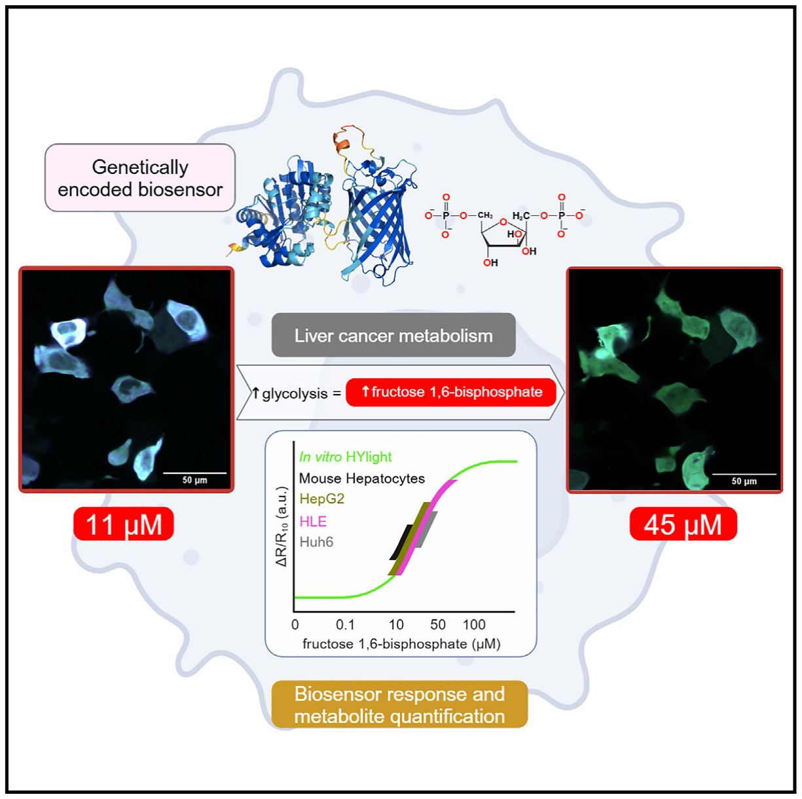

Graphical abstract

In brief

Biochemistry methods; Cancer; Metabolomics.

### Highlights

• HYlight tracks real-time fructose 1,6-bisphosphate dynamics at single-cell resolution

• HYlight’s cellular responses are aligned with glycolysis changes rather than gluconeogenesis

• HYlight’s cellular responses correlate with fructose 1,6-bisphosphate concentrations

• Fructose 1,6-bisphosphate levels in liver cancer cells are in the low micromolar range

### SUMMARY

HYlight is a genetically encoded fluorescent biosensor that ratiometrically monitors fructose 1,6-bisphosphate (FBP), a key glycolytic metabolite. Given the role of glucose in liver cancer metabolism, we expressed HYlight in human liver cancer cells and primary mouse hepatocytes. Through in vitro, in silico, and in cellulo experiments, we showed HYlight’s ability to monitor FBP changes linked to glycolysis, not gluconeogenesis. HYlight’s affinity for FBP was ∼1 µM and stable within physiological pH range. HYlight demonstrated weak binding to dihydroxyacetone phosphate, and its ratiometric response was influenced by both ionic strength and phosphate. Therefore, simulating cytosolic conditions in vitro was necessary to establish a reliable correlation between HYlight’s cellular responses and FBP concentrations. FBP concentrations were found to be in the lower micromolar range, far lower than previous millimolar estimates. Altogether, this biosensor approach offers real-time monitoring of FBP concentrations at single-cell resolution, making it an invaluable tool for the understanding of cancer metabolism.

### INTRODUCTION

HYlight is a circularly permuted green fluorescent protein (cpGFP)-based biosensor that operates similarly to the HyPer family probes.1,2 It incorporates cpGFP into the transcription factor CggR (PDB: 2OKG), which binds to upper glycolytic intermediates, particularly fructose 1,6-bisphosphate (FBP).3,4 Metabolite binding induces a conformational shift in the ligand binding domain, altering the proton network around cpGFP’s chromophore, and producing a ratiometric response linked to changes in FBP concentration.5 FBP, generated by phosphofructokinase-1 (PFK-1), represents the rate-limiting step of glycolysis,5,6 enabling HYlight to assess glycolytic flux. HYlight has already been employed in pancreatic and kidney cell lines, primary mouse β cells, and in vivo in C. elegans neurons, revealing cell-to-cell heterogeneity and autonomously regulated glycolysis.5,7 These findings suggest HYlight’s potential for advancing our understanding of glycolytic activity across different cellular contexts.

The metabolic reprogramming of liver cancer cells poses a major challenge that current methods struggle to address.8–10 The extracellular acidification rate (ECAR) offers an indirect measure of glycolysis but lacks single-cell resolution and centers on the final glycolytic product, lactate.11 Similarly, monitoring glucose uptake focuses on the initial step of glycolysis, after which glucose can enter alternative pathways like the pentose phosphate pathway.4,12 Although isotope tracing is a precise method,8,13 it requires cell lysis and lacks single-cell resolution, overlooking cell-to-cell heterogeneity.

In this study, we demonstrate the use of HYlight to accurately measure changes in FBP levels in liver cells. Given the critical role of glucose metabolism in liver function and hepatocellular carcinoma, understanding this process in metabolic cell reprogramming is essential.4,14 Through methods like confocal microscopy and glycolytic stress tests, HYlight was found to specifically track FBP changes linked to glycolysis. Using AlphaFold2, fluorometry, and mass spectrometry, we studied HYlight’s optical and structural properties. We discovered that HYlight’s ratiometric response is mainly driven by FBP, with minimal interference from dihydroxyacetone phosphate. Phosphate and ionic strength also impacted HYlight’s sensitivity to FBP. By replicating cytosolic conditions in vitro, we found FBP concentrations in liver cells to be 100 times lower than previously thought. Taken together, HYlight offers a powerful tool for monitoring FBP dynamics and glycolytic activity in both primary and cancerous liver cells.

### RESULTS

### HYlight monitors changes in fructose 1,6-bisphosphate levels in hepatocytes and liver cancer cells

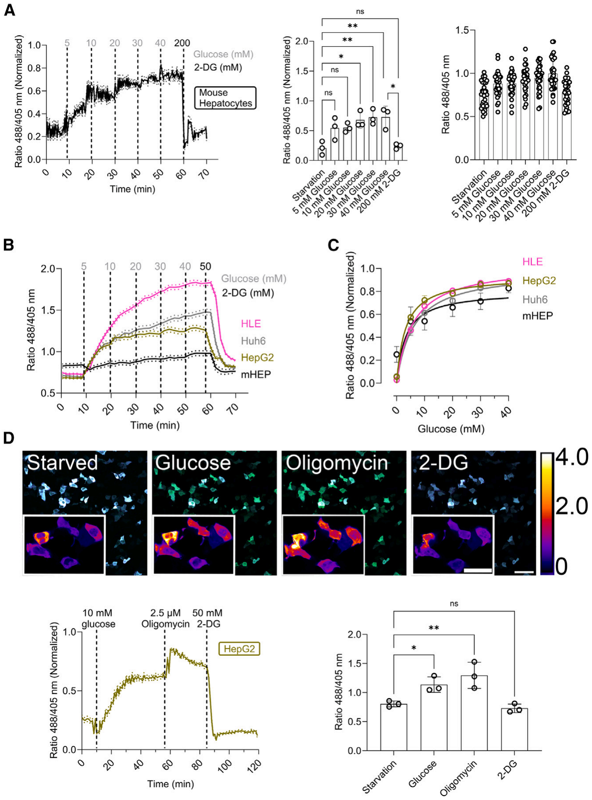

Figure 1. HYlight monitors fructose 1,6-bisphosphate (FBP) in hepatocytes and liver cancer cells

**(A)** Min-max normalized ratio changes of HYlight in primary mouse hepatocytes after 1 h of glucose starvation upon sequential addition of increasing concentrations of glucose every 10 min and 2-deoxy-D-glucose (2-DG) at the end of the experiment. Data are presented as mean ± SEM. Averaged fluorescence ratio upon compound addition. Mean ± SD. Single-cell fluorescence ratio upon compound addition. n = 3 and at least 10 cells per replicate.

**(B)** Fluorescence ratio changes of codon-optimized HYlight in HLE, Huh6, and HepG2 cell lines as well as primary mouse hepatocytes following 1 h of glucose starvation. This was followed by the sequential addition of increasing concentrations of glucose every 10 min, and subsequent addition of 2-deoxy-D-glucose (2-DG). Data are presented as mean ± SEM. n = 3 and at least 50 cells per replicate.

**(C)** The HYlight fluorescence ratio as a function of glucose concentration exhibits a hyperbolic response curve in HLE, HepG2, and Huh6 cell lines, as well as primary mouse hepatocytes. n = 3 and at least 50 cells per replicate.

**(D)** Fluorescence ratiometric images (fusion of 488 and 405 nm wavelength) of HepG2 cells after 1 h of glucose starvation and after the addition of glucose, oligomycin, and 2-DG. Scale bar, 100 µm. Inner scale bar, 50 µm. Below, the normalized min-max ratiometric change and the averaged ratio change of HYlight in HepG2 cells under physiological stimuli. n = 3 and at least 50 cells per replicate. Data on the left graph are presented as mean ± SEM and on the right graph as mean ± SD. Scale bar: 200 µm ns: Not significant; \*<0.05; \*\*<0.005; \*\*\*<0.0005; \*\*\*\*<0.00005. Ordinary One-Way ANOVA Šídák’s Multiple Comparisons Test. See also data S1 and Figure S1 for additional details.

### Data S1. HYlight/HYlight Null aminoacid and codon-optimized DNA sequence for its usage in HepG2, HLE, and Huh6 cell lines. Related to figure 1.

### Color Legend

CggR 96-180

Linkers

cpGFP

CggR 181-340

EcoRI/XhoI

BamHI/HindIII

HYlight Null Mutation (T152E)

### Amino Acid Sequence:

<pre class="other" data-source-pages="24" id="p282">MGSKDVLGLTLLEKTLKERLNLKDAIIVSGDSDQSPWVKKEMGRAAVACMKKRFSGKNI
VAVTGGTTIEAVAEMMTPDSKNRELLFVPARGGLGEPPYNVFIMADKQKNGIKANFKIR
HNIEDGGVQLAYHYQQNTPIGDGPVLLPDNHYLSVQSKLSKDPNEKRDHMVLLEFVTA
AGITLGMDELYKGGTGGSMVSKGEELFTGVVPILVELDGDVNGHKFSVSGEGEGDATY
GKLTLKFICTTGKLPVPWPTLVTTLTYGVQCFSRYPDHMKQHDFFKSAMPEGYIQERTI
FFKDDGNYKTRAEVKFEGDTLVNRIELKGIDFKEDGNILGHKLEYNFNKEDVKNQANTIC
AHMAEKASGTYRLLFVPGQLSQGAYSSIIEEPSVKEVLNTIKSASMLVHGIGEAKTMAQ
RRNTPLEDLKKIDDNDAVTEAFGYYFNADGEVVHKVHSVGMQLDDIDAIPDIIAVAGGSS
KAEAIEAYFKKPRNTVLVTDEGAAKKLLRDESG*</pre>

### DNA Sequence:

<pre class="other" data-source-pages="24" id="p284">GAATTCGGATCCATGGGCAGCAAAGACGTGCTGGGGCTGACCCTGCTGGAAAAAACCCTGA
AAGAACGCCTGAATCTGAAAGACGCCATTATCGTTAGCGGCGATAGCGACCAAAGCCCATG
GGTCAAAAAAGAAATGGGCCGCGCTGCTGTTGCTTGTATGAAGAAACGCTTTAGCGGCAAG
AATATCGTGGCCGTTACTGGGGGGACTACCATTGAAGCCGTGGCCGAGATGATGACCCCAG
ATAGCAAAAATCGCGAACTGCTGTTTGTGCCAGCTCGCGGCGGTCTGGGGGAACCTCCTTA
TAACGTCTTTATCATGGCCGACAAGCAGAAGAACGGCATCAAGGCCAACTTCAAGATCCGCC
ACAACATCGAGGACGGCGGCGTGCAGCTGGCCTATCACTACCAGCAGAACACCCCTATCGG
CGACGGCCCTGTGCTGCTGCCTGACAACCACTACCTGAGCGTGCAGAGCAAACTGAGCAAA
GACCCTAACGAGAAGCGCGATCACATGGTCCTGCTGGAGTTCGTGACCGCCGCCGGGATC
ACTCTGGGCATGGACGAGCTGTACAAGGGCGGCACCGGCGGGAGCATGGTGAGCAAGGG
CGAGGAGCTGTTCACCGGGGTGGTGCCTATCCTGGTCGAGCTGGACGGCGACGTGAACGG
CCACAAGTTCAGCGTGAGCGGCGAGGGCGAGGGCGATGCCACCTACGGCAAGCTGACCCT
GAAGTTCATCTGCACCACCGGCAAGCTGCCTGTGCCTTGGCCTACCCTGGTGACCACCCTG
ACCTACGGCGTGCAGTGCTTCAGCCGCTACCCTGACCACATGAAGCAGCACGACTTCTTCA
AGAGCGCCATGCCTGAAGGCTACATTCAGGAGCGCACCATCTTCTTCAAGGACGACGGCAA
CTATAAGACCCGCGCTGAGGTTAAGTTCGAGGGCGACACTCTGGTTAACCGCATCGAGCTG
AAGGGCATCGACTTCAAGGAGAGACGGCAACATCCTGGGCCATAAGCTGGAATATAACTTC
AACAAGGAGGATGTGAAGAATCAAGCTAATACCATTTGTGCACATATGGCCGAGAAAGCCAG
CGGTACCTATCGCCTGCTGTTTGTCCCTGGTCAGCTGAGCCAAGGTGCATACAGCAGCATT
ATCGAAGAACCTAGCGTCAAAGAAGTCCTGAATACCATCAAAAGCGCTAGCATGCTGGTCCA
TGGGATTGGGGAAGCAAAAACTATGGCTCAGCGCCGCAATACCCCACTGGAAGACCTGAAA
AAGATCGATGATAATGATGCCGTGACCGAAGCCTTTGGCTACTATTTTAATGCTGATGGTGA
GGTGGTGCATAAAGTGCATAGCGTGGGTATGCAACTGGATGATATTGATGCCATCCCTGATA
TTATTGCAGTCGCAGGTGGGAGCAGCAAGGCAGAGGCAATTGAGGCATATTTTAAGAAACC
ACGCAATACTGTTCTGGTCACTGATGAGGGTGCTGCCAAAAAGCTGCTGCGCGATGAAAGC
GGCTAAAAGCTTCTCGAG</pre>

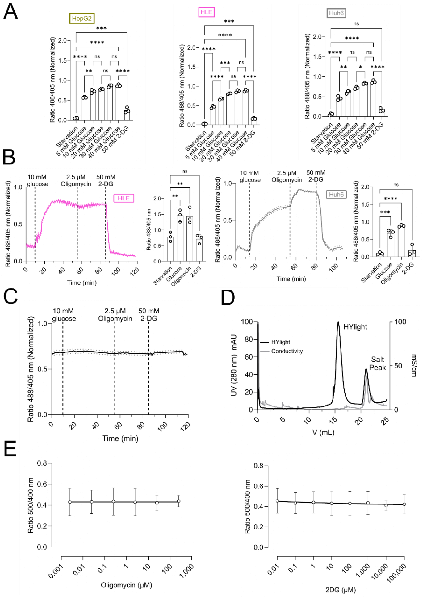

Figure S1. HYlight response varies across human liver cell lines. Related to Figure 1. A. Averaged fluorescence ratio upon compound addition in HepG2, HLE and Huh6 cells. Data are shown as mean ± SD. B. Averaged min-max normalized ratio change of HYlight in HLE and Huh6 cells after 1 h of glucose starvation and following the addition of glucose, oligomycin, and 2-deoxy-D-glucose (2-DG). Data are the mean ± SEM. Averaged min-max normalized fluorescence ratio upon compound addition. Data are shown as mean ± SD. n=3 with approximately 50 cells per replicate. C. No change of the ratio of HYlight Null in Hep G2 cells after 1 h of glucose starvation and following the addition of glucose, oligomycin, and 2-DG. Data are mean ± SEM. n=3 Approximately 50 cells per replicate. D. Size exclusion chromatography (SEC) on Superdex 200 10/300 of HYlight which elutes as a single peak indicating a monomeric state. E. No change in fluorescence ratio as a function of oligomycin and 2-DG concentration using purified recombinantly expressed HYlight. Data are shown as mean ± SD. n=3. ns: No significant; \*<0.05; \*\*<0.005; \*\*\*<0.0005; \*\*\*\*<0.00005. Ordinary One-Way ANOVA Šídák´s Multiple Comparisons Test. Related to figure 1.

To evaluate the capability of HYlight to detect changes in FBP levels in liver cells, we expressed it in the cytosol of isolated primary mouse hepatocytes and examined its functionality and sensitivity to external stimuli. We designed an assay to correlate externally-added glucose concentrations with the ratiometric response of HYlight, as well as to determine the dynamic range of this response. To this end, hepatocytes were starved of glucose for 1 h, followed by a treatment over time with increasing concentrations of glucose (0–40 mM) to stimulate glycolysis, and finally with 2-deoxy-D-glucose (2-DG) to inhibit glycolysis (Figure 1A).15 To extend our experiments to human liver cancer cell lines, we first codon-optimized HYlight for use in human cells and expressed it in the cytosol of HepG2, HLE, and Huh6 cells (SI Appendix, Data S1). We then applied the same glucose titration, and observed a different response between the cell types, illustrating the above-mentioned cellular heterogeneity8 (Figures 1B and S1A). Unlike in mouse hepatocytes, where changes were detected after adding 20 mM glucose (Figure 1A), only 5 mM was needed in the hepatoma cell lines (Figures 1B and S1A). In all cases, even 40 mM glucose did not lead to HYlight saturation. Treatment with 2-DG decreased HYlight’s ratiometric fluorescence response, demonstrating its reversibility. Plotting the obtained HYlight ratio against the glucose concentration added (Figure 1C), we observed a hyperbolic ratiometric response with a hill coefficient of approximately 1. These results confirm the efficacy of HYlight in detecting changes of FBP levels across different hepatocyte cell types, while distinguishing their varying glycolytic responses.

Next, we performed a glycolytic stress test15,16 in which cells were glucose starved for 1 h, and sequentially subjected to 10 mM glucose, 2.5 µM of oligomycin, and 50 mM 2-DG. In HepG2 cells, glucose induced an upsurge of the FBP levels, oligomycin intensified it, and 2-DG decreased it, again indicating that HYlight is reversible in liver cells (Figure 1D). Interestingly, in HLE cells, the maximum response to HYlight was achieved 30 min after the addition of 10 mM glucose (SI Appendix, Figure S1B), unlike in Huh6 and HepG2 cell lines, which required oligomycin to achieve the maximum response. This also indicates heterogeneity in reaching FBP steady-state levels among different liver cancer cell lines. To rule out the possibility of the response being elicited by factors other than FBP, we made use of HYlight Null, a fluorescent variant lacking the ability to bind FBP5 (SI Appendix, Figure S1C). The basal fluorescence of HYlight Null (around 0.7) did not change upon the addition of either glucose, oligomycin, or 2-DG, indicating that the response is due to FBP binding.

Finally, we checked whether oligomycin or 2-DG could affect the readout of HYlight by direct interaction with the protein-based sensor. Therefore, HYlight was expressed in E. coli and purified to homogeneity using immobilized metal affinity chromatography (IMAC) and size exclusion chromatography (SEC) (SI Appendix, Figure S1D). Then, we titrated purified HYlight protein with increasing concentrations of oligomycin or 2-DG (SI Appendix, Figure S1E). No changes in the ratiometric responsiveness of HYlight were observed, indicating that oligomycin and 2-DG do not directly interact with HYlight (SI Appendix, Figure S1E). In summary, this suggests that the HYlight response is caused by alterations in FBP concentrations and not by direct interaction with other compounds used in the glycolytic stress test.

### Expressing HYlight in liver cells does not affect cellular metabolism

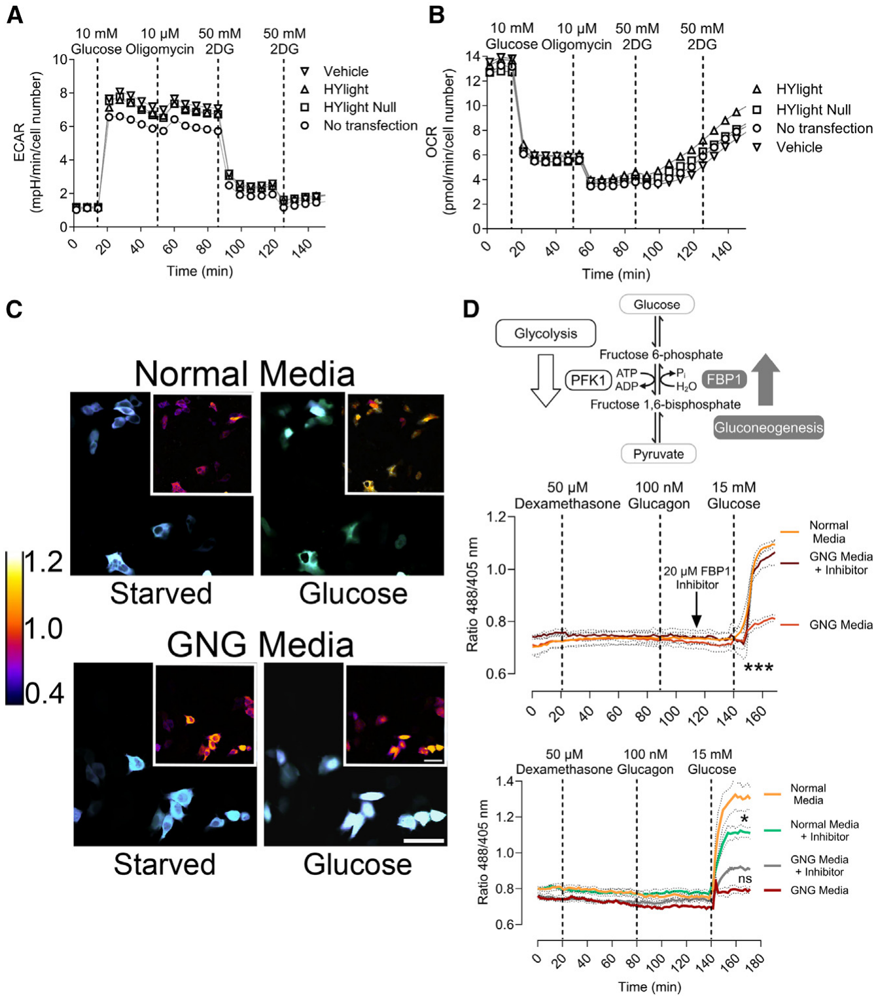

Figure 2. HYlight does not affect fructose 1,6-bisphosphate (FBP) levels in liver cells, and its response is linked to glycolysis

**(A)** ECAR of HepG2 liver cancer cells after 1 h of glucose starvation and following the addition of 10 mM glucose, 10 µM oligomycin, and 100 mM 2-DG in two steps. The ECAR readout is in milli-pH units per min and normalized to cell number. Sample size is n = 3.

**(B)** OCR assay of HepG2 liver cancer cells after 1 h of glucose starvation and following the addition of 10 mM glucose, 10 µM oligomycin, and 100 mM 2DG in two steps. The OCR is in picomoles of oxygen per min and normalized to cell number. Sample size is n = 3.

**(C)** Fluorescence ratiometric images of HepG2 cells under 15 mM glucose with or without gluconeogenic stimulation. Scale bar: 200 µm.

**(D)** FBP generation is catalyzed by phosphofructokinase 1 (PFK1) in glycolysis and its destruction is mediated by fructose 1,6-bisphosphatase 1 (FBP1) in gluconeogenesis. Below, changes in the fluorescence ratio of HYlight in HepG2 liver cancer cells after 1 h of glucose starvation and sequential addition of 50 µM dexamethasone, 100 nM glucagon, and 15 mM glucose. Comparison between gluconeogenic medium (GNG) and normal media in the presence or absence of either 20 µM FBP1 inhibitor (top) or 20 µM PFK inhibitor (bottom). Data are presented as mean ± SEM. n = 3, with approximately 50 cells per condition and replicate. See also Figure S2 for additional details. Figure 2D can also be accessed through BioRender: BioRender.com/e27y335.

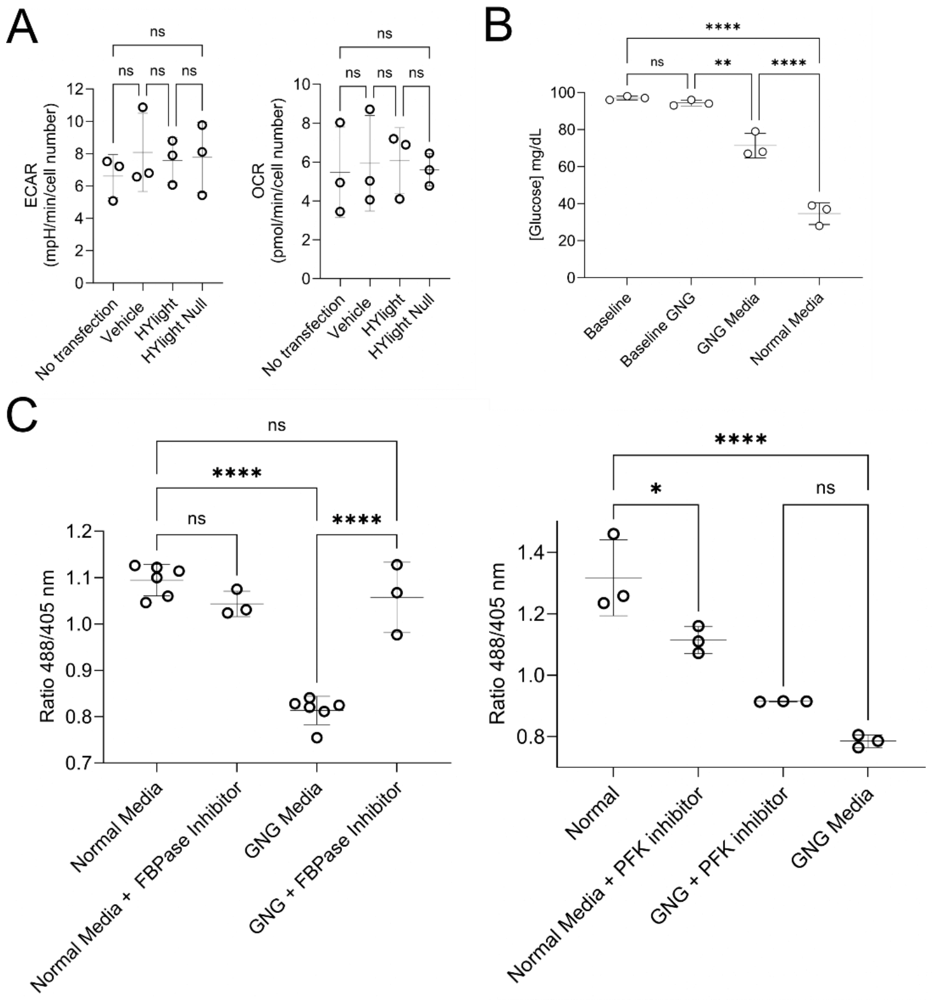

Figure S2. HYlight does not affect fructose 1,6-bisphosphate (FBP) levels in liver cells, and its response is exclusively linked to glycolysis. Related to Figure 2. A. ECAR and OCR differences at averaged glucose addition. ECAR is expressed in milli-pH units per minute and normalized to cell number. OCR is expressed in picomoles of oxygen per minute and normalized to cell number. Mean ± SD. n=3 B. Comparison of media glucose content after 48 h between gluconeogenic media (GNG) and normal media (DMEM GlutaMAXTM) in HepG2 cells. Data are shown as mean ± SD. n=3 C. Averaged change in the fluorescence ratio of HYlight in HepG2 liver cancer cells after glucose addition. Comparison between gluconeogenic media (GNG) and normal media (DMEM GlutaMAXTM) in the presence or absence of either 20 µM FBP1 inhibitor or 20 µM PFK inhibitor. Mean ± SD. n=3, with minimum 50 cells per replicate. ns: Not significant; \*<0.05; \*\*<0.005; \*\*\*<0.0005; \*\*\*\*<0.00005. Ordinary One-Way ANOVA Šídák´s Multiple Comparisons Test. Related to figure 2.

Due to the ability of HYlight to bind FBP, we next addressed the question of whether its expression in liver cells could potentially interfere with enzymes participating in the glycolytic pathway or, more generally, perturb cellular functionality. We, therefore, conducted an ECAR and an oxygen consumption rate (OCR) experiments on liver cells expressing HYlight or HYlight Null with similar transfection efficiencies of around 60% (data not shown)11 (Figures 2A, 2B, and S2A). These experiments were performed under similar conditions as the glycolytic stress test (Figure 1D). We observed similar patterns in the presence and absence of HYlight, meaning that the expression of HYlight has no effect on the extracellular acidification rate, which is caused by lactate production during glycolytic activity (Figures 2A and S2A). In the OCR experiment we also observed the expected cellular behavior independent of HYlight expression: a decrease in oxygen consumption with both glucose and oligomycin (conditions of glycolysis stimulation)11,17 and an increase in the OCR upon inactivation of glycolysis with 2-DG (Figures 2B and S2A). Thus, we concluded that the expression of HYlight in HepG2 cells does not alter cellular metabolism.

### HYlight monitors glycolysis, not gluconeogenesis

Considering that FBP is also found in the opposing pathway of glycolysis, gluconeogenesis, we hypothesized that the readout of HYlight could also provide insights into the flux within the gluconeogenesis pathway.4 To address this, we induced gluconeogenesis in HepG2 cells for two days. This was achieved through a combinatory treatment involving lactate, pyruvate, dexamethasone, and glucagon—a well-established and effective regimen for stimulating gluconeogenesis (SI Appendix, Figure S2B).18,19 Upon examination via confocal microscopy (Figure 2C), the 488/405 nm ratio revealed that under gluconeogenesis conditions following glucose addition, there was only a slight increase of FBP, whereas in standard glycolytic media (DMEM GlutaMAX), there was a notable increase in FBP concentration, suggesting an enhanced glycolytic flux (Figures 2C, 2D, and S2C).

To further confirm gluconeogenesis activation, the correlation between FBP and glycolytic flux, and to rule out that the lack of FBP increase was due to a decrease in cell fitness, we inhibited the dephosphorylation of FBP to fructose 6-phosphate by inhibiting FBP1—a key enzyme in the gluconeogenic pathway, whose inhibition would cause the inactivation of the pathway (Figure 2D)20 – with 5-chloro-2-(N-(2,5-dichlorobenzenesulfonamide))-benzoxazole. Glucose addition to cells grown in gluconeogenic medium while inhibiting FBP1, led to an increase of FBP to levels comparable to those seen with standard media (Figures 2D and S2C). This result shows that the absence of an increase of FBP levels (Figure 2C) was not due to diminished cell fitness but rather suggests a shift from gluconeogenesis to glycolysis.

Additionally, we inhibited phosphofructokinase (PFKFB3), an enzyme involved in generating FBP from fructose 6-phosphate via fructose 2,6-bisphosphate,21 with -(3-pyridinyl)-1-(4-pyridinyl)-2-propen-1-one (3PO). In normal media, a 24 h treatment with 20 µM 3PO followed by glucose addition, led to a significant decrease in the FBP levels. However, this effect was not observed in gluconeogenic media (Figures 2D and S2C).

Taken together, while HYlight effectively monitors changes in FBP levels associated with glycolytic flux, it is unaffected by gluconeogenesis.

### Hypoxia enhances basal glycolytic activity

We next sought to determine whether HYlight could detect subtle changes in FBP dynamics under pathophysiological conditions, such as hypoxia, which disrupts cellular respiration and shifts metabolism toward glycolysis.22

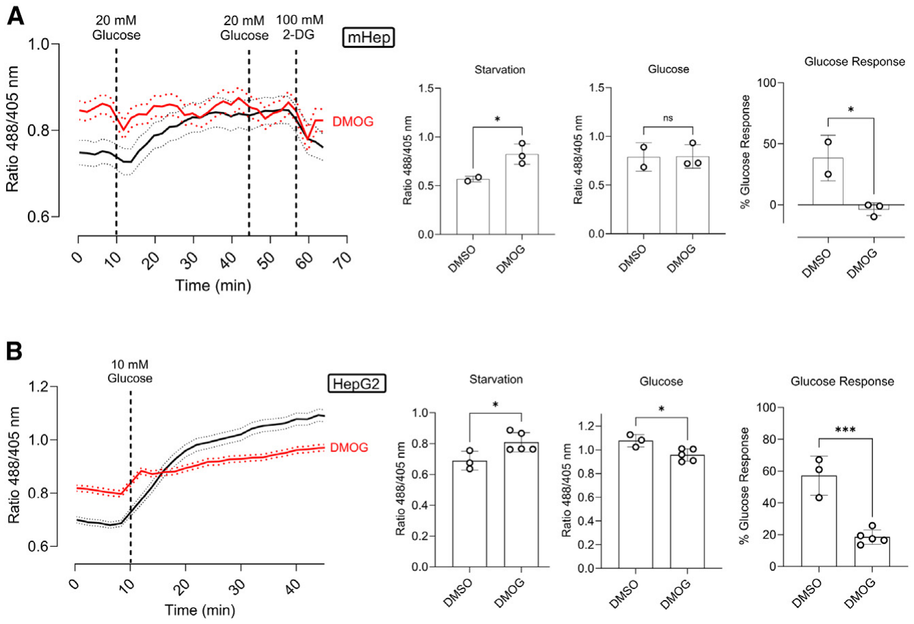

Figure 3. Hypoxia increases basal glycolytic activity

**(A)** Fluorescence ratio changes of HYlight in primary mouse hepatocytes after 24 h treatment with 1 mM DMOG, 1 h of glucose starvation, and sequential addition of glucose and 2-DG. Data are presented as mean ± SEM. Next, averaged fluorescence ratio upon starvation, and glucose addition. Data are presented as mean ± SEM. Glucose response is expressed as the percentage increase from starvation to glucose addition. Data are presented as mean ± SD. n = 3 with at least 10 cells per replicate.

**(B)** Fluorescence ratio changes of HYlight in HepG2 cells after 24 h of 1 mM DMOG treatment, 1 h of glucose starvation, and sequential addition of glucose over 35 min. Data shown as mean ± SD. The bar graphs depict the averaged fluorescence ratio upon starvation, and glucose addition. Data are presented as mean ± SEM. Glucose response is expressed as the percentage increase from starvation to glucose addition. Data are presented as mean ± SD. Sample size is n = 5, with at least 50 cells per replicate. ns: Not significant; \*<0.05; \*\*<0.005; \*\*\*<0.0005; \*\*\*\*<0.00005. Ordinary One-Way ANOVA Šídák’s Multiple Comparisons Test.

To mimic hypoxia, we treated cells with dimethyloxalylglycine (DMOG), which induces the accumulation of hypoxia-inducible factor (HIF-1α).23 After overnight incubation with 1 mM DMOG and 1 h of starvation, we observed a significant increase in basal fluorescence in both mouse hepatocytes and HepG2 cells (Figures 3A and 3B). Interestingly, cells treated with DMOG had a diminished or absent response to glucose, suggesting maximal glycolytic capacity.

Overall, hypoxia not only increases basal glycolytic activity but also alters the cell’s glycolytic response. This is interesting as it demonstrates the sensitivity of HYlight and its utility in studying FBP dynamics.

### HYlight reacts with fructose 1,6-bisphosphate and with dihydroxyacetone phosphate

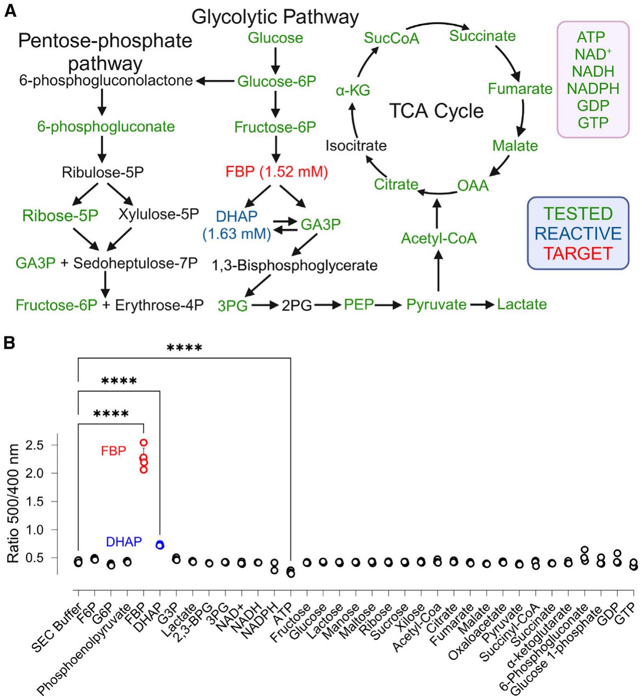

Figure 4. HYlight reacts with fructose 1,6-bisphosphate (FBP) and dihydroxyacetone phosphate (DHAP)

**(A)** HYlight was tested toward several metabolites from different metabolic pathways.

**(B)** Comparison of the ratio change in HYlight upon different metabolites at physiological concentrations. ns: Not significant; \*<0.05; \*\*<0.005; \*\*\*<0.0005; \*\*\*\*<0.00005. Ordinary One-Way ANOVA Šídák’s Multiple Comparisons Test. Data are presented as mean ± SD. n = 3. GTP: guanosine-5′-triphosphate (1 mM); GDP: guanosine diphosphate (1 mM); glucose 1-phosphate (1 mM); 6-phosphogluconate (0.5 mM); α-ketoglutarate (0.79 mM); succinate (6.8 µm); succinyl-CoA (6.8 µM); pyruvate (16 µM); oxaloacetate (2 µM); malate (1.39 mM); fumarate (0.38 mM); citrate (32 µM); acetyl-CoA (28 µM); xilose (5 mM), ribose (5 mM); maltose (5 mM); manose (5 mM); lactose (5 mM); glucose (5 mM); fructose (5 mM); ATP (4.67 mM); NADPH (65 µM); NADH (75 µM); NAD+ (0.5 mM); 3PG: 3-phosphoglycerate (0.37 mM); 2,3-BPG: 2,3-bisphosphoglycerate (0.23 mM); G3P: glyceraldehyde 3-phosphate (0.14 mM); DHAP (1.63 mM); FBP (1.52 mM); phosphoenolpyruvate (16 µM); G6P: glucose 6-phosphate (0.67 mM); F6P: fructose 6-phosphate (96 µM); SEC: size exclusion chromatography buffer: 50 mM Tris pH 7.5; 125 mM NaCl. Sample size is n = 3. See also Figure S3 for additional details. Figure 4A can also be accessed through BioRender: BioRender.com/b12m469.

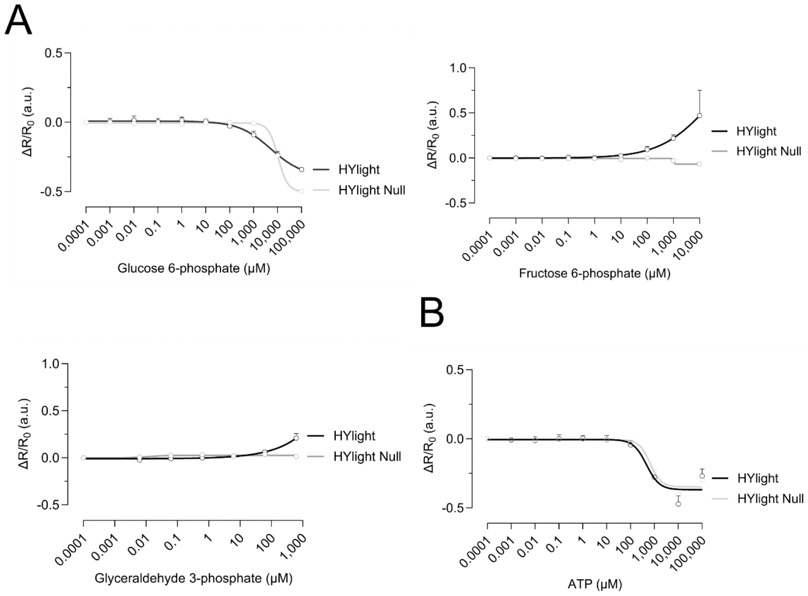

Figure S3. Dihydroxyacetone phosphate binds HYlight. Related to Figure 4. A. Change of the fluorescence ratio in HYlight and HYlight Null relative to 0 µM as a function of glucose 6-phosphate, fructose 6-phosphate, and glyceraldehyde 3-phosphate concentrations. B. Change of the fluorescence ratio in HYlight and HYlight Null relative to 0 µM as a function of ATP concentrations. SEC: Size Exclusion Chromatography Buffer: 50 mM Tris pH 7.5; 125 mM NaCl. \(R=\mathrm{Ratio}\;500\,\mathrm{nm}/400\,\mathrm{nm}\). \(\Delta R/R_0=(R_x-R_0)/R_0\). The data are shown as the mean ± SD. n=3 for each concentration. Related to figure 4.

To find out whether HYlight can serve as a tool to quantify cellular concentrations of FBP, we first checked whether the response recorded in hepatocytes is specific. As CggR (PDB: 2OKG), the transcription factor responsible for the binding of FBP (PDB: 3BXF) in HYlight, has been reported to bind several glycolytic intermediates, such as glucose 6-phosphate (G6P) (PDB: 3BXG), fructose 6-phosphate (F6P) (PDB: 3BXH), glyceraldehyde 3-phosphate (G3P) (PDB: 3BXG) and dihydroxyacetone phosphate (DHAP) (PDB: 3BXE),3 we decided to test the response of purified recombinantly expressed HYlight to various metabolites from both glycolysis and the tricarboxylic acid (TCA) cycle, as well as other biologically important metabolites at their reported cytosolic concentrations (Figure 4A). In addition, we performed a comprehensive titration of several key glycolytic intermediates (SI Appendix, Figure S3A). We confirmed that HYlight responds to FBP, as it elicited a ratiometric response of the excitation spectrum, increasing the ratio between the two maxima from 0.42 to 1.95. Additionally, a noticeable albeit subdued reaction with DHAP (ratio increase from 0.42 to 0.64) and ATP (ratio decrease from 0.42 to 0.27) was observed (Figure 4B). However, the ATP response was likely induced by changes in ionic strength, as its presence affected HYlight Null in a similar manner (SI Appendix, Figure S3B).

### Dihydroxyacetone phosphate competes with FBP for interaction with HYlight

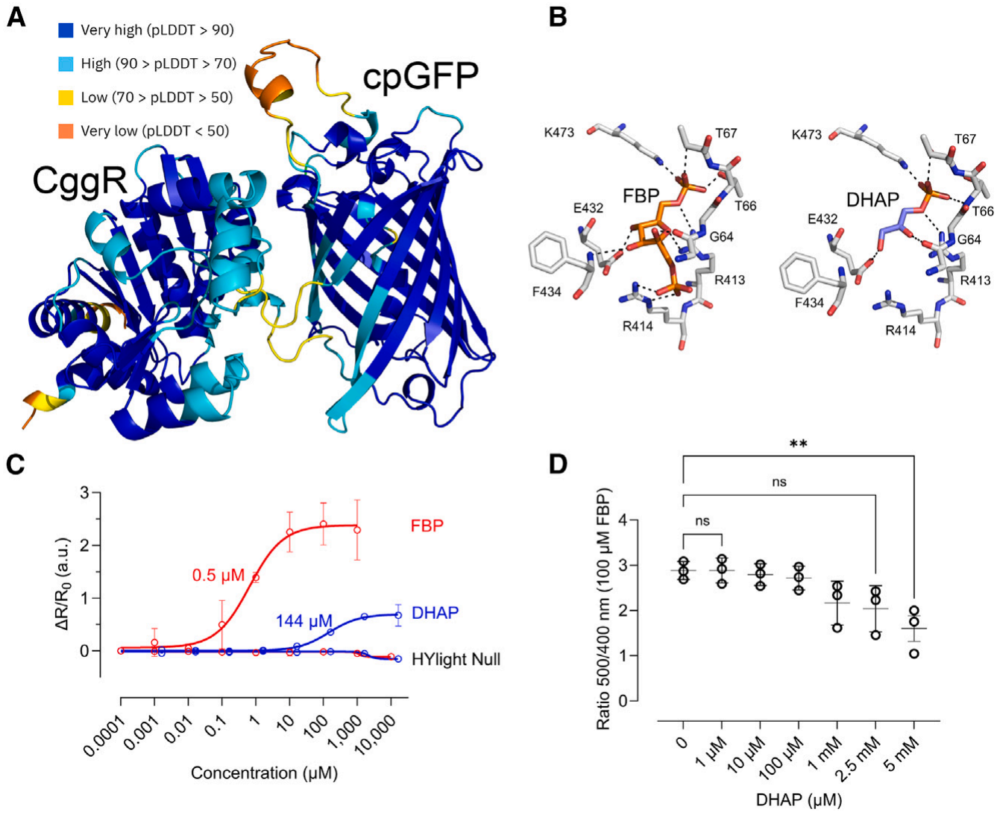

Figure 5. Dihydroxyacetone phosphate competes fructose 1,6-bisphosphate (FBP) for the binding in HYlight

**(A)** AlphaFold2 prediction of HYlight color-coded by per-residue model confidence score (pLDDT).

**(B)** Ligand binding pocket of HYlight with FBP (10 H-bonds), and DHAP (6 H-bonds). Colored by elements: CHNOS. Ligand binding pocket comparison were based on the structures of CggR with FBP (PDB: 3BXF) and DHAP (PDB: 3BXE).

**(C)** Change of the fluorescence ratio of purified HYlight as a function of FBP and DHAP concentrations, and relative to their absence, is shown. Numeric values represent the apparent \(K_D\). Sample size is n = 3.

**(D)** Fluorescence ratio change of purified HYlight in the presence of 100 µM FBP and increasing DHAP concentrations. \(R=\mathrm{Ratio}\;500\,\mathrm{nm}/400\,\mathrm{nm}\) \(\Delta R/R_0=(R_x-R_0)/R_0\). Data are presented as mean ± SD. Sample size is n = 3.

To get structural insights into the difference in binding of FBP and DHAP, we generated a structural model of HYlight using AlphaFold2.24 We obtained a highly confident predicted structure with an average per residue model confidence score (pLDDT) of 89.6 (Figure 5A) in which we positioned FBP and DHAP by structural alignment with CggR (Figure 5B). DHAP engaged in a fewer number of H-bonding contacts with amino acids in the ligand binding site of HYlight compared to FBP, which might explain its lower response.

As we observed a low but significant response while testing DHAP at its reported cytosolic concentration of 1.63 mM (Figure 4B),25 we decided to compare the response of HYlight toward DHAP to that of FBP. Therefore, we performed a titration of both metabolites on purified HYlight ranging from low µM range to mM range (Figure 5C). We observed a notably reduced reactivity of HYlight toward DHAP, exhibiting a maximum fluorescence ratio of 0.75, whereas with FBP, it peaked at 2. Moreover, the apparent \(K_D\) for FBP was found to be 0.5 µM, whereas for DHAP, it was 144 µM, i.e., HYlight is considerably less sensitive to DHAP.

To investigate direct competition, we added increasing concentrations of DHAP to purified HYlight in the presence of 100 µM of FBP (Figure 5D). Significant competition was only observed at DHAP concentrations above 2.5 mM, which is much higher than the levels typically found in the mammalian cytosol.25

Altogether, these findings suggest that DHAP has a minimal impact on the fluorescence of HYlight, and even in cases where competition occurs, its influence would be negligible.

### The \(K_D\) of HYlight for FBP remains ∼1 µM in the physiological pH range

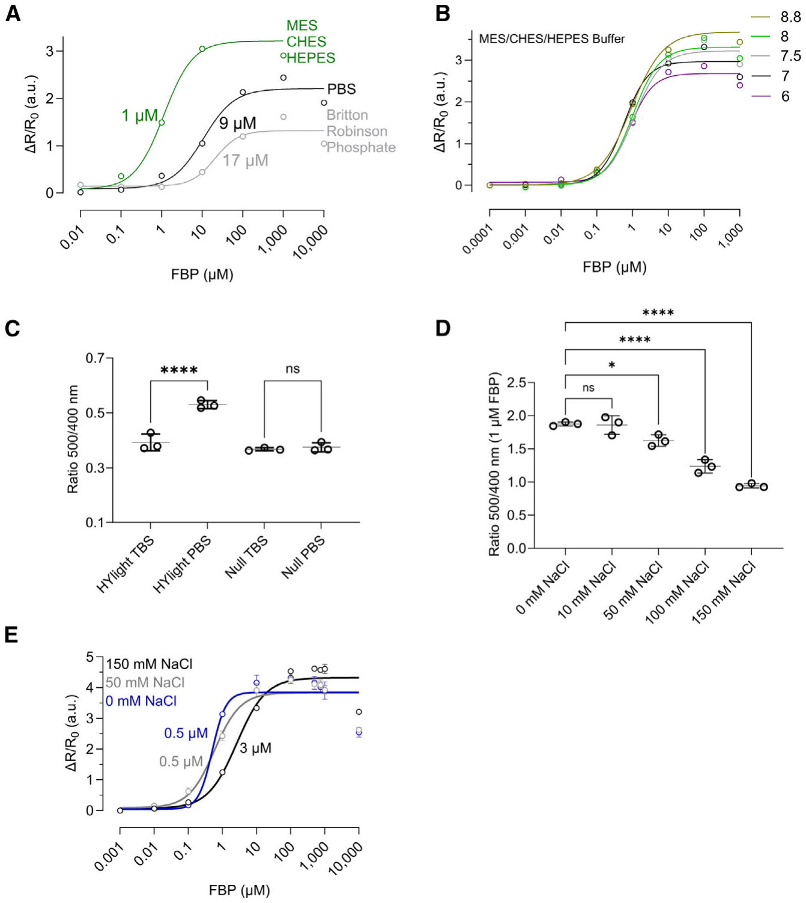

Figure 6. The \(K_D\) of HYlight for fructose 1,6-bisphosphate (FBP) is ∼1 µM, is not changing in the physiological pH range, and is affected by phosphorous compounds and changes in ionic strength

**(A)** Relative change of the fluorescence ratio as a function of increasing FBP concentrations and different buffers.

**(B)** Relative change of the fluorescence ratio as a function of increasing FBP concentrations and pH variation with the MES/CHES/HEPES buffer.

**(C)** Comparison of the ratio change in HYlight and HYlight Null in PBS, and TBS without FBP.

**(D)** Comparison of the ratio change in HYlight in the presence of 1 µM FBP and increasing NaCl concentrations.

**(E)** Relative change of the fluorescence ratio as a function of increasing FBP concentrations and increasing concentrations of NaCl. ns: Not significant; \*<0.05; \*\*<0.005; \*\*\*<0.0005; \*\*\*\*<0.00005. Ordinary One-Way ANOVA Šídák’s Multiple Comparisons Test. PBS: 137 mM NaCl, 2.7 mM KCl, 10 mM Na2HPO4, 1.8 mM KH2PO4; TBS: 150 mM NaCl, 50 mM Tris-HCl, pH 7.6; MES/CHES/HEPES 25 mM; Britton-Robinson phosphate: acid mixture of NaOH, CH3COOH, H3PO4, H3BO3, KCl. Data are presented as the mean ± SD. Sample size is n = 3 in all cases. See also Figure S4 for additional details.

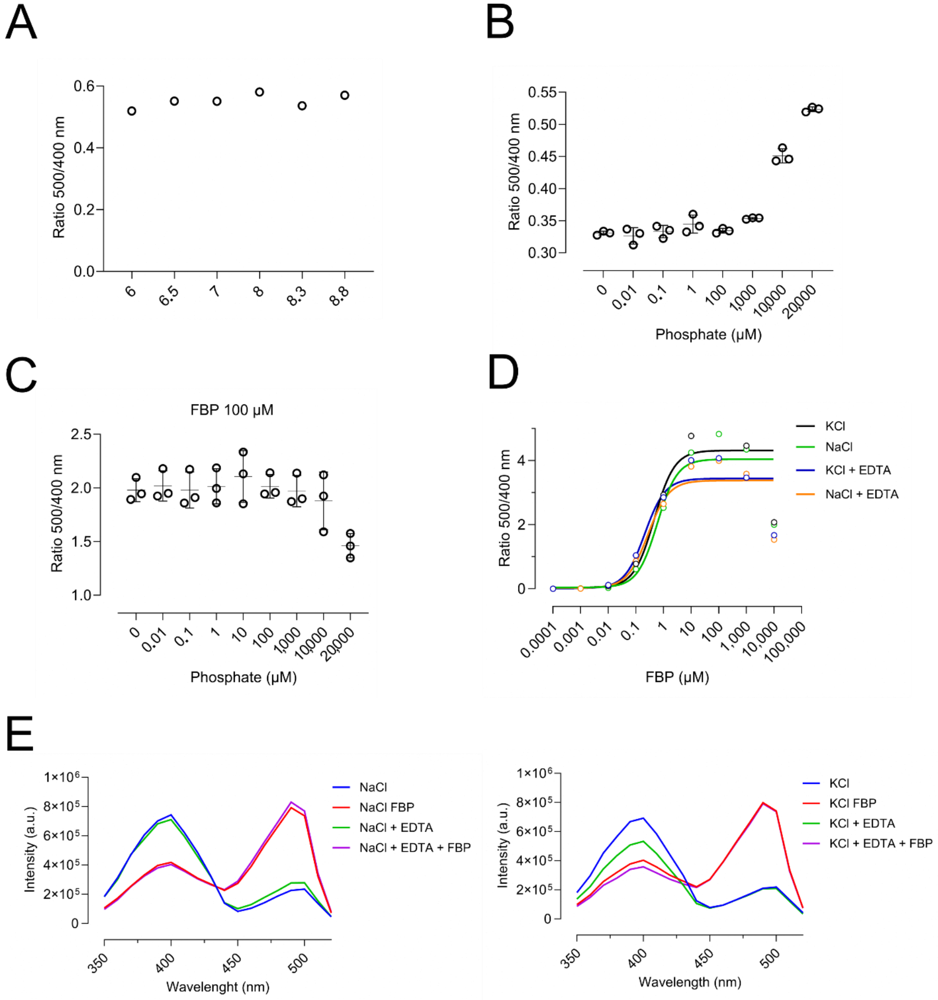

Figure S4. HYlight is sensitive to phosphorous compounds but not to metal binding. Related to Figure 6. A. Change of the fluorescence ratio in HYlight Null at different pH values. B. Fluorescence ratio change of HYlight at different phosphate concentrations C. Fluorescence ratio change of HYlight at different phosphate concentrations in the presence of 100 µM of fructose 1,6-bisphosphate (FBP). D. Relative change of the fluorescence ratio in HYlight as a function of different FBP concentrations in the presence of 150 mM NaCl, 150 mM KCL, and/or 0.1 mM EDTA. E. Excitation spectra of HYlight in the presence of 150 mM NaCl, 150 mM KCL, and/or 0.1 mM EDTA and 100 µM FBP. Data are shown as mean ± SD. n=3 for each experiment. Related to figure 6.

Probes based on a circularly permutated fluorescent protein (cpFP), such as HYlight (Figure 5A), or HyPer probes, tend to be sensitive to pH fluctuations. This sensitivity stems from the inherent characteristics of the chromophore, wherein spectral changes depend on alterations in its protonation state. Through circular permutation of the β-barrel structure of cpFP to bring the N- and C-termini closer, the chromophore becomes more exposed, thereby increasing its susceptibility to pH changes.26,27 In a previous study, HYlight characterization and pH titration were conducted in the phosphate buffer solution PBS, wherein no sensitivity to pH changes was observed.5 In our experiments, we noted a decline in the HYlight response within PBS in comparison to a sulfonic acid zwitterionic buffer system. This transition led from a fluorescence ratio of nearly 3 in MES-CHES-HEPES to only 2 in PBS, or 1 in Britton-Robinson phosphate buffer (Figure 6A), indicating approximately a 66% reduction in the ratiometric response. PBS could therefore potentially have masked the sensor’s reactivity to pH variations. Therefore, we re-evaluated the responsiveness of HYlight in physiological pH range, from pH 6 to pH 8.8, using the above-mentioned sulfonic acid buffer mixture (Figure 6A). We observed pH-dependent changes in the maximum \(\Delta R/\Delta R_0\) values in the pH 6 to 8.8 range when titrating with increasing concentrations of FBP (Figure 6B). However, altering pH conditions did not impact the \(K_D\) value, which remained approximately 1 µM. Further, HYlight Null was also found to be pH insensitive in this pH range (SI Appendix, Figure S4A), rendering it suitable as an FBP-insensitive control for HYlight. Overall, these results suggest that HYlight can effectively operate within the physiological pH range.

### HYlight is sensitive to phosphate, shifting the \(K_D\) for FBP to ∼10 µM

Given that FBP possesses two phosphate groups that interact with residues T67, T66, K473, and R414 in the ligand binding site of HYlight (Figure 5B), we speculated that variations in responsivity observed in PBS might stem from competition with phosphate. Our findings supported this hypothesis, as we witnessed a decrease in sensor response to FBP in both PBS and Britton-phosphate buffer (resulting in a displacement of \(K_D\) from 1 to 9 to 17 µM), alongside a decline in the maximum ratiometric value, dropping from 3 to 2 to 1 (Figure 6A). In conclusion, phosphate buffers are causing a one log shift in the \(K_D\) of HYlight for FBP to ∼10 µM, while simultaneously reducing its ratiometric response.

To further confirm the role of phosphate, we compared the steady state ratio of HYlight in PBS to Tris/HCl (TBS buffer solution). As can be seen in Figure 6C, the fluorescence ratio of HYlight was higher in PBS than in TBS, which was not observed for HYlight Null. This suggests that phosphate groups cause a conformational change of the sensor by binding to HYlight’s ligand binding site.

Furthermore, phosphate titration in the presence of FBP led to a decrease in fluorescence response, indicating sensor saturation. In the absence of FBP, we observed an increase in the 500/400 fluorescence ratio, confirming the binding of phosphate and our previous conclusions (SI Appendix, Figures S4B and S4C).

Protein phosphorylation could also potentially influence the functionality of HYlight. However, mass spectrometry analysis in HepG2 cells did not detect any post-translational modifications in HYlight (PRIDE: PXD051879).

### Ionic strength affects the responsiveness of HYlight

Given that HYlight functionality may be sensitive to specific metal binding, as observed in various enzymes,28 we used AlphaFill29 to predict potential metal binding sites based on HYlight’s AlphaFold2 predicted structure (Figure 5A). Our analysis showed possible interaction sites for Na+, K+, and divalent ions (data not shown). However, increasing the concentration of Na+ or K+ or the addition of EDTA did not alter the response or the apparent \(K_D\) value of HYlight (SI Appendix, Figures S4D and S4E).

After ruling out metal binding and noting an effect of different buffer composition on the fluorescence ratio, we focused on the impact of ionic strength on the response of HYlight. Since changes in ionic strength can affect protein behavior and function through shifts in electrostatic interactions,30 we tested the impact on the response to FBP by comparing HYlight in TBS with increasing concentration of NaCl (0–150 mM) (Figure 6D). With 0 mM NaCl, the average fluorescence ratio was 1.87, while it dropped to 0.94 with 150 mM NaCl (Figure 6D). Additionally, titration of FBP revealed changes in the apparent \(K_D\) values, which increased from 0.5 µM (no NaCl) to 3 µM (150 mM NaCl) (Figure 6E), suggesting that ionic strength affects the functionality of the sensor.

### Metabolite competition and ionic strength displace the apparent \(K_D\) for FBP

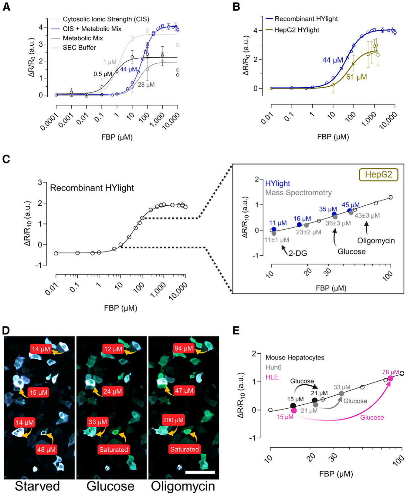

Figure 7. HYlight quantifies fructose 1,6-bisphosphate (FBP) concentrations in liver cells

**(A)** Changes in relative fluorescence ratio were observed as a function of FBP concentration in various buffers that simulate cellular ionic strength and metabolic composition. Sample size is n = 3.

**(B)** Relative fluorescence ratio change as a function of FBP concentration in HepG2 cells under saponin permeabilization and comparison with recombinant HYlight with CIS + metabolic mix. Sample size is n = 6.

**(C)** Comparison of FBP concentrations in HepG2 cells under glucose starvation, 10 mM glucose, 2.5 µM oligomycin, 50 mM 2-DG obtained via mass spectrometry (gray) and compared to normalized fluorescent ratios (\(\Delta R/R_{10}\)) of HYlight in HepG2 cells (blue), correlated with recombinant HYlight (open circles). Sample size of metabolomics analysis is n = 1 with 3 technical replicates.

**(D)** Fluorescence ratiometric images (fusion of 488 and 405 nm wavelength) of HepG2 cells after 1 h of glucose starvation and after the addition of glucose, and oligomycin. FBP quantification via correlation of normalized fluorescent ratio of HYlight in HepG2 cells with normalized fluorescence ratio \(\Delta R/R_{10}\) of recombinant HYlight. Scale bar, 100 µm.

**(E)** FBP quantification in mouse hepatocytes, Huh6 and HLE cell after 10 mM glucose addition via correlation of normalized fluorescent ratio of HYlight in HepG2 cells with normalized fluorescence ratio \(\Delta R/R_{10}\) of recombinant HYlight. Sample size is n = 3 with a minimum of 50 cells per replicate. CIS: cytosolic ionic strength. 140 mM KCl, 12 mM NaCl; PBS: 137 mM NaCl, 2.7 mM KCl, 10 mM Na2HPO4, 1.8 mM KH2PO4; TBS: 150 mM NaCl, 50 mM Tris-HCl; SEC (size exclusion chromatography) buffer: 50 mM Tris pH 7.5, 125 mM NaCl; metabolic mix: 4.67 mM ATP, 0.096 mM fructose 6-phosphate, 0.67 mM glucose 6-phosphate, 1.63 mM dihydroxyacetone phosphate, 0.14 mM glyceraldehyde 3-phosphate. \(\Delta R/R_{10}=(\mathrm{ratio}\;500/400-\mathrm{ratio}\;500/400_{10\,\mu\mathrm{M}\,\mathrm{FBP}})/\mathrm{ratio}\;500/400_{10\,\mu\mathrm{M}\,\mathrm{FBP}}\) where \(\mathrm{ratio}\;500/400_{10\,\mu\mathrm{M}\,\mathrm{FBP}}\) is the ratio with 10 µM FBP. Data are presented as the mean ± SD. See also Figure S5 and Table S1 for additional details. (C–E) can be also accessed through BioRender: BioRender.com/l93y325; BioRender.com/r87j960; BioRender.com/c21p293.

To evaluate HYlight’s reactivity to FBP under cytosolic conditions, we performed an in vitro study using purified recombinant HYlight. We determined the \(K_D\) for FBP in a cytosolic ionic strength (CIS) solution,30 a metabolic mix solution and our working buffer (50 mM Tris pH 7.5, 125 mM NaCl). The metabolic mix solution consisted of physiological concentrations of compounds known to affect HYlight, or CggR (4.67 mM ATP, 96 µM fructose 6-phosphate, 0.67 mM glucose 6-phosphate, 1.63 mM dihydroxyacetone phosphate, 0.14 mM glyceraldehyde 3-phosphate).3,5,25 Our results showed that HYlight’s apparent \(K_D\) for FBP was 0.5 µM in 125 mM NaCl (Figure 7A). CIS (140 mM KCl and 12 mM NaCl) slightly altered \(K_D\) to 1 µM and increased the fluorescence from 2 to 3.5. Competition with phosphate-containing metabolites (metabolic mix solution) further shifted the \(K_D\) to 28 µM, while the combination of CIS and metabolic mix solution increased the \(K_D\) to 44 µM with an increased fluorescence ratio of 3.5 (Figure 7A).

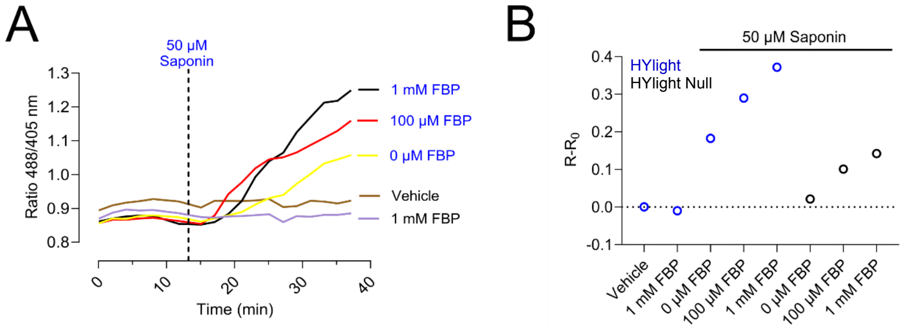

Figure S5. Saponin permeabilizes the cellular membrane allowing the entry of fructose 1,6-bisphosphate (FBP) in HepG2 cells. Related to Figure 7. A. Change of the fluorescence ratio of HYlight in HepG2 liver cancer cells after 1 h of glucose starvation and sequential addition of 50 µM Saponin and various concentrations of FBP. B. Maximum fluorescence ratio of HYlight and HYlight Null in HepG2 liver cancer cells after 1 hour of glucose starvation and addition of 50 µM saponin and various concentrations of FBP. \(R-R_0=\mathrm{Ratio}\;488/405\,\mathrm{nm}-\mathrm{Minimum\ Ratio}\;488/405\,\mathrm{nm}\). n=1, with at least 50 cells per condition. Related to figure 7.

To confirm that our in vitro method mimics conditions in live cells, we examined the response of HepG2 cells expressing HYlight to increasing concentrations of FBP in the media. HYlight’s fluorescence ratio remained unchanged, as FBP could not cross the membrane (SI Appendix, Figure S5A). To ensure that the addition of FBP in the medium would reach the cytosolic expressed biosensor, we permeabilized the cells with 50 µM of saponin.31,32 The HYlight ratiometric response increased with increasing FBP concentrations, while cells expressing HYlight Null showed only minor changes, most likely due to changes in ionic strength (SI Appendix, Figure S5B). We calculated an apparent \(K_D\) for FBP within the cellular environment to be 61 µM, close to the in vitro value of 44 µM (Figure 7B).

### HYlight accurately measures fructose 1,6-bisphosphate concentrations in liver cells

<table>
<caption id="p83">Table S1. Fructose 1,6-bisphosphate concentrations in cells. Related to figure 7.</caption><thead>
<tr><th scope="col">FBP (µM)</th><th scope="col">Treatment</th><th scope="col">Cell Type</th><th scope="col">Organism</th><th scope="col">Method</th><th scope="col">Source</th></tr>
</thead><tbody>
<tr><td>1520 (Absolute)</td><td>-</td><td>Kidney (iBMK)</td><td>M. musculus</td><td>Mass Spectrometry</td><td>¹</td></tr>
<tr><td>31</td><td>-</td><td>Human Erythrocyte</td><td>H. sapiens</td><td>-</td><td>²</td></tr>
<tr><td>1 (Free in liver)</td><td>-</td><td>Liver</td><td>R. rattus</td><td>-</td><td>³</td></tr>
<tr><td>50 (Maximum)</td><td>-</td><td>Liver</td><td>-</td><td>-</td><td>⁴</td></tr>
<tr><td>50</td><td>-</td><td>Liver</td><td>R. rattus</td><td>-</td><td>⁵</td></tr>
<tr><td>8 (Enzyme site)</td><td>-</td><td>Liver</td><td>R. rattus</td><td>Enzymatic Assay</td><td>⁶</td></tr>
<tr><td>100±50</td><td>5 mM Glucose</td><td>Liver</td><td>R. norvegicus</td><td>Enzymatic Assay</td><td>⁷</td></tr>
<tr><td>25000±7600</td><td>5 mM Glucose</td><td>Liver Hepatoma (AS-30D)</td><td>R. norvegicus</td><td>Enzymatic Assay</td><td>⁷</td></tr>
<tr><td>23±2</td><td>No treatment</td><td>Liver Hepatoma (HepG2)</td><td>H. sapiens</td><td>Mass Spectrometry</td><td>Current Article</td></tr>
<tr><td>36±3</td><td>10 mM Glucose</td><td>Liver Hepatoma (HepG2)</td><td>H. sapiens</td><td>Mass Spectrometry</td><td>Current Article</td></tr>
<tr><td>43±3</td><td>2.5 µM Oligomycin</td><td>Liver Hepatoma (HepG2)</td><td>H. sapiens</td><td>Mass Spectrometry</td><td>Current Article</td></tr>
<tr><td>11±1</td><td>50 mM 2-DG</td><td>Liver Hepatoma (HepG2)</td><td>H. sapiens</td><td>Mass Spectrometry</td><td>Current Article</td></tr>
</tbody></table>

By simulating the cellular ionic strength and metabolic conditions that impact the response of HYlight, we correlated HYlight’s ratiometric response with specific FBP concentrations in vitro (Figure 7C—open circles). To bring HYlight’s response to the cellular ratiometric scale, we used metabolomics to determine the minimum FBP concentration in HepG2 cells. By combining the mass spectrometry results with the average volume of hepatocytes,33–36 we calculated the FBP concentrations per cell after 2-DG treatment (SI Appendix, Table S1) and estimated an FBP concentration of 11 ± 1 µM. We normalized HYlight’s ratiometric response by using this FBP basal value. Then, we used the in vitro established correlation curve with HYlight readouts from individual HepG2 cells to determine the FBP concentration after the addition of 10 mM glucose, 2.5 µM of oligomycin, 50 mM of 2-DG (Figure 7C—blue circles). After starvation, FBP concentrations in HepG2 cells were 16 µM, which increased to 35 µM after glucose addition, reached 45 µM after oligomycin, and decreased to 11 µM after 2-DG (Figure 7C—blue circles).

To verify our approach, we turned again to metabolomics. We determined the FBP concentrations in HepG2 cells under the same conditions now by using mass spectrometry (see STAR Methods). The FBP concentrations obtained from HepG2 cells with HYlight aligned closely with those measured by mass spectrometry, confirming HYlight’s accuracy in quantifying specific FBP concentrations in liver cells (Figure 7C—gray circles).

Using the established biosensor approach, we determined the FBP concentration of single HepG2 cells. After 10 mM glucose addition and 2.5 µM oligomycin stimulation, we observed a high cell-to-cell heterogeneity, finding some cells with 12 µM, 33 µM, 200 µM, or even reaching the saturation of the sensor (>1 mM) (Figure 7D).

Finally, we measured FBP concentrations in primary mouse hepatocytes, as well as in Huh6 and HLE liver cancer cell lines (Figure 7E). This assay further confirmed the significant metabolic heterogeneity observed in Figure 1B. Following the addition of 10 mM glucose, FBP concentrations increased from 15 µM to 21 µM in primary mouse hepatocytes, from 15 µM to 78 µM in HLE cells, and from 21 µM to 33 µM in Huh6 cells.

### DISCUSSION

One of the hallmarks of liver cancer is upregulated glycolytic activity.15,37 This upregulation emerges at the onset of the disease to fulfill the energetic and biosynthetic demands of the cancer cell.37–39 Given its importance in cancer development, it is hardly surprising that glycolytic quantification and experimentation have been a debated topic for the last hundred years. Despite persistent efforts, there remains a significant gap in understanding the mechanisms behind the transition to metabolic cancer reprogramming.10 Due to the link between the onset of liver cancer and glycolysis, an accurate quantification of this pathway is imperative. However, the prevalent metabolic heterogeneity between cells poses a significant challenge to this quantification,8,9 and presently, there exists no method to effectively overcome this limitation.40

In this study, using HYlight, we developed an innovative approach for measuring concentrations of FBP within individual liver cells. The generation of FBP directly aligns with glycolytic activity,6 and its concentrations therefore exhibit similar cell-to-cell variability. Some sources claim that mammalian cells have a concentration of 1.52 mM of FBP in the cytosol,25 while others report variations that range from the micromolar to the millimolar.41–46 This variation may be due not only to inherent cellular variability but also to the diverse methods used for quantifying FBP concentrations or glycolytic flux, many of which lack single-cell resolution.40 With our approach, HYlight offers an opportunity to precisely measure variations in FBP, and therefore glycolytic activity, at the level of individual cells, reporting glycolytic activity in a reliable way.

To ensure that HYlight reliably reports on cellular FBP levels, we conducted a complete characterization of the biosensor. We performed a comparative analysis between HYlight and a well-established method for glycolytic measurement, the extracellular acidification rate (ECAR).11 While HYlight exhibited a response pattern similar to ECAR, we observed an enhanced glycolytic activity with HYlight at lower concentrations of oligomycin, a phenomenon not observed with ECAR. Since the readout of HYlight is directly related to glycolytic activity while ECAR addresses media acidification by lactate production, this finding suggests that HYlight may have a greater sensitivity than ECAR, enabling it to detect changes in glycolytic flux more accurately.

Then, as gluconeogenesis mirrors the pathway of glycolysis, we were interested in observing whether HYlight could detect any alterations in FBP concentration linked to gluconeogenesis. We showed that FBP changes are only correlated with glycolysis. We corroborated this by the addition of an inhibitor of phosphofructokinase, the enzyme directly linked with FBP production,21 whose inhibition resulted in a decrease in the response to glucose stimulation. Additionally, after adding an inhibitor of FBP1, the enzyme that uses FBP as substrate,20 we did not observe an increase in FBP. Instead, this increase was only observed following the addition of both the inhibitor and glucose. This suggests that inactivating FBP1 alone cannot cause an automatic accumulation of FBP within the cell. However, it is plausible that any FBP present is swiftly metabolized through glycolysis, suggesting a potential futile cycle of FBP that remains undetectable by the sensor. These findings are further supported by the enzyme activities involved in both metabolic pathways. The turnover rate (111 s−1) and specificity constant of PFK-1 (BRENDA:EC2.7.1.11; Zheng and Kemp47) toward FBP are higher than the turnover rate (8.2 s−1) and specificity constant of aldolase toward glyceraldehyde 3-phosphate (BRENDA:EC4.1.2.13; Plater et al.48). These factors explain why PFK-1 has a high conversion rate toward FBP in both high and low concentrations of fructose 6-phosphate, while aldolase’s conversion rate of FBP to glyceraldehyde 3-phosphate and dihydroxyacetone phosphate is lower, leading to FBP accumulation. Under gluconeogenic conditions, FBPase-1 (BRENDA.1.3.11) has a turnover rate similar to that of aldolase in converting FBP.49 However, the specificity constant of FBPase-1 (23 mM−1s−1) for FBP is higher than that of aldolase (4.7 mM−1s−1).49 This indicates that any FBP generated during gluconeogenesis is rapidly metabolized into fructose 6-phosphate, preventing its accumulation during the gluconeogenic process.

In testing HYlight’s ability to detect subtle changes in glycolysis under pathophysiological conditions, under hypoxia, we observed an increase in basal glycolytic activity but a reduced response to glucose. This aligns with findings by Urrutia et al. and Khan et al.,23,50,51 which suggest that while DMOG increases glycolytic activity due to HIF-1α accumulation, significant metabolic changes might deplete the NADH reserves, creating a bottleneck for glycolysis. Altogether, these findings in hypoxia enhance the sensor’s potential not only for monitoring glycolytic activity and FBP dynamics but also for detecting cellular metabolic alterations.

While evaluating the selectivity of HYlight, we found a noteworthy response for DHAP, albeit with significantly higher \(K_D\). However, this DHAP response was not significant in competing with FBP, as only unphysiologically high DHAP concentrations would influence FBP binding. In addition, HYlight can also bind to fructose 2,6-bisphosphate.5 However, the cellular concentration of fructose 2,6-bisphosphate is markedly lower than that of FBP. In HeLa cells, FBP concentrations of 380 µM were detected while only 4.2 µM of fructose 2,6-bisphosphate.52 Moreover, fructose 2,6-bisphosphate contributes to FBP generation implying that its presence correlates with heightened FBP production and underscoring the suitability of HYlight for assessing glycolysis.53

The biosensor also showed notable resistance to pH changes. cpFPs are generally sensitive to pH shifts because their chromophores are vulnerable to protonation. The circular permutation exposes the chromophore to the cellular cytosol, increasing its susceptibility to protonation.26,27 Similar to Hyper7, a H2O2 specific biosensor,2 HYlight’s \(K_D\) for FBP remains stable within the physiological pH range. The reason for this stability is unclear. To gain deeper insights into the phenomenon of ratiometric pH stability, X-ray structures are needed, which could guide the development of more resilient biosensors.

Through a comprehensive characterization of HYlight, we identified key factors that impact its functionality in the cytosol, overlooked in other studies.5,7 Understanding the effects of ionic strength and metabolite competition, as well as their dynamics, allowed us to replicate cytosolic conditions in vitro. We validated the reliability of this approach with a metabolomics study, and were able to correlate fluorescence ratios with specific FBP concentrations in the cytosol of primary mouse hepatocytes and various liver cancer cell lines. This resolved a key question not addressed in a previous study with HYlight,5 where despite the sensor’s low \(K_D\), it could report changes in FBP concentrations in mammalian cells, traditionally thought to be in the millimolar range. Likewise, we also observed no saturation in the cytosol. We resolved this contradiction by determining that liver FBP concentrations are in fact 100 times lower than previous estimates.5,25

In summary, HYlight enables the measurement of FBP concentrations in real-time within living cells, with single-cell precision. The biosensor’s readout is directly linked to changes in the cellular glycolytic flux, offering several advantages over existing methods.40 (1) Unlike ECAR, which measures lactate-induced medium acidification, HYlight directly targets FBP at single-cell resolution.11 (2) While metabolomics is specific, it lacks single-cell resolution and requires cell lysis.13 (3) HYlight also addresses cell-to-cell heterogeneity, although calibration for different volume cell types is necessary to define minimum FBP concentrations. Nevertheless, the methodology used with HYlight can be extended to other protein-based biosensors for precise metabolite quantification. We believe HYlight’s proven effectiveness can advance liver cancer research by shedding light on FBP dynamics and glycolytic activity during hepatocarcinogenesis. This tool can identify cells with increased glycolytic activity at the onset of liver cancer, potentially uncovering new genes or metabolic pathways altered in the early stages of the disease.

### Limitations of the study

• Potential rapid metabolism of fructose 1,6-bisphosphate (FBP) through glycolysis may hinder detection

• HYlight shows some response to DHAP, but with a significantly higher dissociation constant (\(K_D\))

• HYlight can bind to fructose 2,6-bisphosphate, although its cellular concentration is much lower than FBP

• Cell-to-cell heterogeneity affects HYlight readings, requiring calibration for various cell types to determine minimum FBP concentrations

### RESOURCE AVAILABILITY

### Lead contact

Further information and requests for resources and reagents should be directed to and will be fulfilled by the lead contact, Joris Messens (joris.messens@vub.be).

### Materials availability

This study did not generate new unique materials or reagents.

### Data and code availability

<table>
<caption>KEY RESOURCES TABLE</caption><thead>
<tr><th scope="col">REAGENT or RESOURCE</th><th scope="col">SOURCE</th><th scope="col">IDENTIFIER</th></tr>
</thead><tbody>
<tr class="group"><th colspan="3">Antibodies</th></tr>
<tr><td>Monoclonal Anti-β-Actin mouse antibody (1:4000)</td><td>Sigma-Aldrich</td><td>Cat# A2228; RRID: AB_476697</td></tr>
<tr><td>Anti-H7 v2 Rabbit (1:1000) polyclonal antibody for HYlight detection</td><td>Generated by Genscript</td><td>RRID: SCR_002891</td></tr>
<tr><td>Anti-histidine tag Mouse monoclonal antibody (1:1000)</td><td>Bio-rad</td><td>Cat# MCA1396G; RRID: AB_322084</td></tr>
<tr><td>Anti-Mouse IgG (Fc specific)–Peroxidase antibody produced in goat (1:10000)</td><td>Sigma-Aldrich</td><td>Cat# A0168; RRID: AB_257867</td></tr>
<tr><td>Goat Anti-Rabbit IgG Antibody, HRP-conjugate (1:5000)</td><td>Sigma-Aldrich</td><td>Cat# 12–348; RRID: AB_390191</td></tr>
<tr><td>Donkey anti-Rabbit IgG (H + L) Highly Cross-Adsorbed Secondary Antibody, Alexa Fluor 488 (1:500)</td><td>Thermofisher Scientific</td><td>Cat# A-21206; RRID:AB_2535792</td></tr>
<tr class="group"><th colspan="3">Bacterial and virus strains</th></tr>
<tr><td>XL1-Blue E. coli strain</td><td>Messens lab repository, originally Agilent</td><td>–</td></tr>
<tr class="group"><th colspan="3">Chemicals, peptides, and recombinant proteins</th></tr>
<tr><td>William’s E Medium, GlutaMAX™ Supplement</td><td>Thermofisher Scientific</td><td>Cat# 32551087</td></tr>
<tr><td>Fetal Bovine Serum, qualified, USDA-approved regions</td><td>Thermofisher Scientific</td><td>Cat# 10437028</td></tr>
<tr><td>Penicillin-Streptomycin (10,000 U/mL)</td><td>Thermofisher Scientific</td><td>Cat# 15140122</td></tr>
<tr><td>Gibco™ HEPES (1M)</td><td>Fisher Scientific</td><td>Cat# 15-630-080</td></tr>
<tr><td>Hoechst 33342</td><td>Thermofisher Scientific</td><td>Cat# 62249</td></tr>
<tr><td>Propidium iodide, ≥94.0% (HPLC)</td><td>Merck</td><td>Cat# P4170-100MG</td></tr>
<tr><td>DMEM, low glucose, GlutaMAX™ Supplement, pyruvate</td><td>Thermofisher Scientific</td><td>Cat# 21885108</td></tr>
<tr><td>Seahorse XF DMEM Medium pH 7.4</td><td>Agilent Technologies</td><td>Cat# 103575-100</td></tr>
<tr><td>Seahorse XF 200 mM glutamine solution</td><td>Agilent Technologies</td><td>Cat# 103579-100</td></tr>
<tr><td>Seahorse XF 1.0 M glucose solution</td><td>Agilent Technologies</td><td>Cat# 103577-100</td></tr>
<tr><td>Oligomycin A</td><td>MedChem Express</td><td>Cat# HY-16589</td></tr>
<tr><td>2-deoxy-D-glucose</td><td>Sigma-Aldrich</td><td>Cat# D6134</td></tr>
<tr><td>Dexamethasone</td><td>Sigma-Aldrich</td><td>Cat# D4902</td></tr>
<tr><td>Glucagon</td><td>Sigma-Aldrich</td><td>Cat# G2044</td></tr>
<tr><td>5-chloro-2-(N-(2,5-dichlorobenzenesulfonamide))-benzoxazole (FBPase-1 Inhibitor)</td><td>Santa Cruz Biotechnology</td><td>Cat# sc-221608</td></tr>
<tr><td>Seahorse XFp Cell Culture Miniplate</td><td>Agilent Technologies</td><td>Cat# 103025-100</td></tr>
<tr><td>Sodium L-lactate,~98%</td><td>Sigma-Aldrich</td><td>Cat# L7022-5G</td></tr>
<tr><td>Sodium pyruvate, ReagentPlus®, ≥99%</td><td>Sigma-Aldrich</td><td>Cat# P2256-100G</td></tr>
<tr><td>Cell Lysis Buffer (10×)</td><td>Cell Signaling Technology</td><td>Cat# 9803S</td></tr>
<tr><td>Halt™ Protease and Phosphatase Inhibitor Cocktails, Thermo Scientific, Halt Protease and Phosphatase Inhibitor Cocktail</td><td>Life Technologies</td><td>Cat# 78442</td></tr>
<tr><td>Trizma (Base)</td><td>Sigma-Aldrich</td><td>Cat# T6066</td></tr>
<tr><td>tris(2-carboxyethyl)phosphine (TCEP)</td><td>Carl Roth</td><td>Cat# HN95.2</td></tr>
<tr><td>Ampicillin Sodium</td><td>Duchefa</td><td>Cat# A0104</td></tr>
<tr><td>LB Broth High salt</td><td>Duchefa</td><td>Cat# L1704</td></tr>
<tr><td>Isopropyl-β-D-Thiogalactopyranoside, Dioxane free</td><td>Inalco</td><td>Cat# 1758-1400</td></tr>
<tr><td>Trizma® hydrochloride</td><td>Sigma-Aldrich</td><td>Cat# T5941</td></tr>
<tr><td>PMSF Protease Inhibitor</td><td>Thermofisher Scientific</td><td>Cat# 36978</td></tr>
<tr><td>Leupeptin Protease Inhibitor</td><td>Thermofisher Scientific</td><td>Cat# 78435</td></tr>
<tr><td>DNase I, RNase-free (1 U/μL)</td><td>Thermofisher Scientific</td><td>Cat# EN0521</td></tr>
<tr><td>Dithiothreitol (DTT)</td><td>Duchefa</td><td>Cat# D1309</td></tr>
<tr><td>Imidazole</td><td>Millipore</td><td>Cat# 288-32-4</td></tr>
<tr><td>D-Fructose 1,6-bisphosphate trisodium salt hydrate</td><td>Sigma-Aldrich</td><td>Cat# F6803</td></tr>
<tr><td>Bio-Rad Protein Assay Dye Reagent Concentrate</td><td>Bio-rad</td><td>Cat# 5000006</td></tr>
<tr><td>Carbohydrates Kit</td><td>Sigma-Aldrich</td><td>Cat# CAR10</td></tr>
<tr><td>TCA Cycle Metabolite Library</td><td>Sigma-Aldrich</td><td>Cat# ML0010</td></tr>
<tr><td>Guanosine 5′-triphosphate sodium salt hydrate</td><td>Sigma-Aldrich</td><td>Cat# G8877</td></tr>
<tr><td>Guanosine 5′-diphosphate sodium salt</td><td>Sigma-Aldrich</td><td>Cat# G7127</td></tr>
<tr><td>α-D-Glucose 1-phosphate dipotassium salt hydrate</td><td>Sigma-Aldrich</td><td>Cat# G6750</td></tr>
<tr><td>6-Phosphogluconic acid trisodium salt</td><td>Sigma-Aldrich</td><td>Cat# P7877</td></tr>
<tr><td>D-(−)-3-Phosphoglyceric acid disodium salt</td><td>Sigma-Aldrich</td><td>Cat# P8877</td></tr>
<tr><td>2,3-Diphospho-D-glyceric acid pentasodium salt</td><td>Sigma-Aldrich</td><td>Cat# D5764</td></tr>
<tr><td>Sodium L-lactate</td><td>Sigma-Aldrich</td><td>Cat# L7022</td></tr>
<tr><td>Dihydroxyacetone phosphate lithium salt</td><td>Sigma-Aldrich</td><td>Cat# 37442</td></tr>
<tr><td>Phospho(enol)pyruvic acid monopotassium salt</td><td>Sigma-Aldrich</td><td>Cat# P7127</td></tr>
<tr><td>D-Fructose 6-phosphate dipotassium salt</td><td>Sigma-Aldrich</td><td>Cat# F1502</td></tr>
<tr><td>DL-Glyceraldehyde 3-phosphate</td><td>Sigma-Aldrich</td><td>Cat# 39705</td></tr>
<tr><td>Adenosine 5′-triphosphate disodium salt solution</td><td>Sigma-Aldrich</td><td>Cat# A6559</td></tr>
<tr><td>β-Nicotinamide adenine dinucleotide 2′-phosphate reduced tetrasodium salt hydrate</td><td>Sigma-Aldrich</td><td>Cat# N1630</td></tr>
<tr><td>β-Nicotinamide adenine dinucleotide, reduced disodium salt hydrate</td><td>Sigma-Aldrich</td><td>Cat# N8129</td></tr>
<tr><td>β-Nicotinamide adenine dinucleotide hydrate</td><td>Sigma-Aldrich</td><td>Cat# N7004</td></tr>
<tr><td>Glucose 6-phosphate</td><td>Roche</td><td>Cat# 10127647001</td></tr>
<tr><td>Saponin</td><td>Sigma-Aldrich</td><td>Cat# 47036</td></tr>
<tr><td>Fructose 1,6-bisphosphate (U-¹ ³C₆)</td><td>Buchem</td><td>Cat# CLM-8962</td></tr>
<tr><td>(2E)-3-(3-Pyridinyl)-1-(4-pyridinyl)-2-propen-1-one, 3PO (inhibitor of glucose metabolism)</td><td>Sigma-Aldrich</td><td>Cat# SML1343</td></tr>
<tr><td>Dmog,≥98% (hplc) (Dimethyloxalylglycine)</td><td>Sigma-Aldrich</td><td>Cat# D3695</td></tr>
<tr><td>William’s Medium E w/o L-Glutamine, w/o Glucose, w/o Phenol red</td><td>Genaxxon Bioscience</td><td>Cat# C4318.0500TK</td></tr>
<tr class="group"><th colspan="3">Critical commercial assays</th></tr>
<tr><td>Pierce™ BCA Protein Assay Kits</td><td>Thermofisher Scientific</td><td>Cat# 23225</td></tr>
<tr><td>PureYield™ Plasmid Miniprep System</td><td>Promega</td><td>Cat# A1222</td></tr>
<tr><td>Wizard® SV Gel and PCR Clean-Up System</td><td>Promega</td><td>Cat# A9282</td></tr>
<tr class="group"><th colspan="3">Deposited data</th></tr>
<tr><td>Fructose 1,6-bisphosphate quantification</td><td>Metabolomics Workbench (NMDR)</td><td>NMDR: https://doi.org/10.21228/M8WB25</td></tr>
<tr><td>HYlight Mass Spectrometry</td><td>ProteomeXchange</td><td>PRIDE: PXD051879</td></tr>
<tr class="group"><th colspan="3">Experimental models: Cell lines</th></tr>
<tr><td>HepG2 hepatoma cell line (Male)</td><td>ATCC</td><td>Cat# HB-8065; RRID: CVCL_0027</td></tr>
<tr><td>Huh6 hepatoma cell line (Male)</td><td>–</td><td>RRID: CVCL_4381</td></tr>
<tr><td>HLE hepatoma cell line (Male)</td><td>–</td><td>RRID: CVCL_1281</td></tr>
<tr class="group"><th colspan="3">Experimental models: Organisms/strains</th></tr>
<tr><td>C57BL6N Mice</td><td>Janvier-Labs</td><td>Cat# C57BL/6NRj Mouse RRID: IMSR_RJ:C57BL-6NRJ</td></tr>
<tr class="group"><th colspan="3">Oligonucleotides</th></tr>
<tr><td>Fwd PCS2+/PQE30 EcoRI/BamHI HYlight Human E. coli primer: GGCACGTAGAATTCGGATCCATGGGCAGCAAAGACGTGCT</td><td>This paper.</td><td>N/A</td></tr>
<tr><td>Rev PCS2+/PQE30 XhoI/HindIII HYlight Human E. coli primer: GGCACGTACTCGAGAAGCTTTTAGCCGCTTTCATCGCGCA</td><td>This paper.</td><td>N/A</td></tr>
<tr><td>Forward Sequencing HYlight primer: GATCTACCAGAACCGTCAGATCCG</td><td>This paper.</td><td>N/A</td></tr>
<tr><td>Reverse Sequencing HYlight primer: GATGTTCTAGAGTCCGGAAGCTG</td><td>This paper.</td><td>N/A</td></tr>
<tr><td>pCS2+ vector Forward Sequencing primer: TGTTCTTTTTGCAGGATCCCATCG</td><td>This paper.</td><td>N/A</td></tr>
<tr><td>pCS2+ vector Reverse Sequencing primer: TCACTGCATTCTAGTTGTGGTTTG</td><td>This paper.</td><td>N/A</td></tr>
<tr><td>pQE-30 vector Forward Sequencing primer: AGGAGAAATTAACTATGAGAGG</td><td>This paper.</td><td>N/A</td></tr>
<tr><td>pQE-30 vector Reverse Sequencing plasmid: CCAGATGGAGTTCTGAGGTC</td><td>This paper.</td><td>N/A</td></tr>
<tr class="group"><th colspan="3">Recombinant DNA</th></tr>
<tr><td>HYlight codon-optimized E. coli/H. sapiens</td><td>This paper, generated by Twist Bioscience</td><td>https://www.twistbioscience.com/</td></tr>
<tr><td>pQE-30 vector</td><td>Qiagen</td><td>https://www.qiagen.com/ko-us</td></tr>
<tr><td>pCS2+ vector</td><td>pCS2+HyPer7 was a gift from Vsevolod Belousov</td><td>Addgene plasmid # 136466; http://n2t.net/addgene:136466; RRID:Addgene_136466</td></tr>
<tr><td>HYlight codon-optimized M. musculus</td><td>Provided by John N. Koberstein</td><td>Koberstein et al.⁵</td></tr>
<tr class="group"><th colspan="3">Software and algorithms</th></tr>
<tr><td>Snapgene</td><td>Snapgene</td><td>https://www.snapgene.com/; RRID: SCR_015052</td></tr>
<tr><td>TubeSeq Services Eurofins Genomics</td><td>Eurofins Genomics</td><td>https://eurofinsgenomics.eu/en/custom-dna-sequencing/eurofins-services/tubeseq-services/</td></tr>
<tr><td>NIS-Elements</td><td>Nikon</td><td>https://www.microscope.healthcare.nikon.com/products/software/nis-elements; RRID: SCR_014329</td></tr>
<tr><td>Fiji</td><td>https://doi.org/10.1038/nmeth.2019</td><td>https://fiji.sc/; RRID: SCR_002285</td></tr>
<tr><td>GraphPad Prism</td><td>GraphPad Software</td><td>https://www.graphpad.com/; RRID: SCR_002798</td></tr>
<tr><td>SoftMax Pro</td><td>Molecular Devices</td><td>https://es.moleculardevices.com/products/microplate-readers/acquisition-and-analysis-software/softmax-pro-software; RRID: SCR_014240</td></tr>
<tr><td>Amersham ImageQuant 800</td><td>Cytiva</td><td>https://www.cytivalifesciences.com/en/be/shop/protein-analysis/molecular-imaging-for-proteins/imaging-systems/amersham-imagequant-800-systems-p-11546</td></tr>
<tr><td>Xcalibur software</td><td>Thermo Scientific</td><td>Cat# OPTON-30965; RRID: SCR_014593</td></tr>
<tr><td>ColabFold</td><td>Milot Mirdita</td><td>https://github.com/sokrypton/ColabFold; RRID: SCR_025453</td></tr>
<tr><td>AlphaFold2</td><td>Google DeepMind</td><td>https://deepmind.google/technologies/alphafold/; RRID: SCR_025454</td></tr>
<tr><td>AlphaFill</td><td>Netherlands Cancer Institute</td><td>https://alphafill.eu/</td></tr>
<tr><td>PyMOL</td><td>Schrödinger</td><td>https://www.pymol.org/; RRID: SCR_000305</td></tr>
<tr><td>Proteome Discoverer Software</td><td>Thermofisher Scientific</td><td>https://www.thermofisher.com/be/en/home/industrial/mass spectrometry/liquid-chromatography-mass-spectrometry-lc-ms/lc-ms-software/multi-omics-data-analysis/proteome-discoverer-software.html; RRID: SCR_014477</td></tr>
<tr><td>FragPipe 20.0</td><td>Alexey Nesvizhskii’s proteome bioinformatics group</td><td>https://fragpipe.nesvilab.org/; RRID: SCR_022864</td></tr>
<tr class="group"><th colspan="3">Other</th></tr>
<tr><td>μ-Slide 8 Well high ibiTreat cell plate</td><td>Ibidi</td><td>Cat# 80806</td></tr>
<tr><td>Lipofectamine™ 3000 Transfection Reagent</td><td>Thermofisher Scientific</td><td>Cat# L3000001</td></tr>
<tr><td>Nb207 Agarose Beads</td><td>Kindly provided by Jan Steyaert Laboratory</td><td>https://doi.org/10.1038/s41592-020-01001-6</td></tr>
<tr><td>Cytiva Disposable PD-10 Columns</td><td>Cytiva</td><td>Cat# GE17-0851-01</td></tr>
<tr><td>4–15% Mini-PROTEAN® TGX™ Precast Protein Gels</td><td>Bio-rad</td><td>Cat# 4561086</td></tr>
<tr><td>InstantBlue® Coomassie Protein Stain (ISB1L)</td><td>Abcam</td><td>Cat# ab119211</td></tr>
<tr><td>Filtropur S 0.45 μm</td><td>Sarstedt</td><td>Cat# 83.1826</td></tr>
<tr><td>Ni2+-Sepharose High-Performance Agarose Beads</td><td>Cytiva</td><td>Cat# 17526802</td></tr>
<tr><td>Vivaspin® 20 Centrifugal Concentrator Polyethersulfone 10 kDa</td><td>Sartorius</td><td>Cat# VS2001</td></tr>
<tr><td>HiLoad 16/600 Superdex 200 pg</td><td>Cytiva</td><td>Cat# 28989335</td></tr>
<tr><td>MICROPLATE, 96 WELL, UV-STAR®, COC, F-BOTTOM</td><td>Greiner Bio-one</td><td>Cat# 655809</td></tr>
<tr><td>6-well plates, TC treated</td><td>VWR</td><td>Cat# 7341599</td></tr>
<tr><td>U(H)PLC Column ACQUITY HSS T3 C18, 100 Å, 1.8 μm, 2.1 × 150 mm</td><td>Waters</td><td>Cat# WT186003540</td></tr>
<tr><td>Acclaim™ PepMap™ 100 C18 HPLC Columns</td><td>Thermofisher Scientific</td><td>Cat# 164946</td></tr>
<tr><td>Acclaim PepMap RSLC, 0.075 × 250 mm</td><td>Thermofisher Scientific</td><td>Cat# 164569</td></tr>
<tr><td>Lab Vision™ Ultra V Block</td><td>Thermofisher Scientific</td><td>Cat# TA-060-UB</td></tr>
<tr><td>VECTASHIELD® Antifade Mounting Medium with DAPI</td><td>VectorLabs</td><td>Cat# H-1200</td></tr>
</tbody></table>

• Fructose 1,6-bisphosphate quantification via mass spectrometry data are available through Metabolomics Workbench (NMDR) (https://doi.org/10.1093/nar/gkv1042) with identifier 4816 (NMDR: https://doi.org/10.21228/M8WB25) This DOI is also listed in the key resources table. HYlight peptide mass spectrometry data are available via ProteomeXchange: PXD051879. This accession number is also listed in the key resources table.

• This paper does not report original code.

• Any additional information required to reanalyze the data reported in this paper is available from the lead contact upon request.

### ACKNOWLEDGMENTS

We thank Edwige Martin-Valiente and Chloé Goemans for confocal microscopy assistance; Steven Janvier for mass spectrometry experimental advice; Mariana Nunes, and Anne Van Praet for the isolation of primary mouse hepatocytes; Erick Arroba Nuñez, Francisco Ribeiro Coelho De Melo Costa for their technical assistance; Khadija Wahni, Antonio Ruiz Albor, Irene Clares Pedrero, and Andrea Jáñez Pedrayes for helpful discussions. We thank BioRender software for the creation of several figures. We thank the VIB Metabolomics Core facility for determining the FBP concentrations. Funding: I.P.C. was supported by FNRS-FRIA Scholarship (FC47359). J.M. was supported by a VIB grant. J.M.P. was supported by an FWO fellowship (1193524N). E.N.G. was supported by a European Research Council Consolidator grant METAPTPs (grant agreement no. GA817940), FNRS-WELBIO grant (35112672), FNRS-PDR grant (40007740), FNRS-TELEVIE grant (40007402), and ULB Foundation. N.B. was supported by the ULB foundation. E.N.G. is a Research Associate of the FNRS, Belgium.

### AUTHOR CONTRIBUTIONS

I.P.-C., D.E., E.N.G., and J.M. designed research; I.P.-C., J.M.P., and E.H.G. performed experiments; D.V. performed mass spectrometry; I.P.-C., J.M.P., D.V., and E.H.G. analyzed data; J.N.K. provided reagents and experimental advice; N.B. provided analytical tools (confocal microscopy); and I.P.-C., D.E., E.N.G., and J.M. wrote the paper.

### DECLARATION OF INTERESTS

The authors declare no competing interest.

### STAR★METHODS

Detailed methods are provided in the online version of this paper and include the following:

• KEY RESOURCES TABLE

• EXPERIMENTAL MODEL AND STUDY PARTICIPANT DETAILS

○ Mice

○ Tumor cell lines

○ Bacterial strains

• METHOD DETAILS

○ Gene design and cloning

○ Cell lines transfection

○ Imaging and quantification

○ Extracellular acidification rates measurement during glycolytic stress test

○ Immunocytochemistry (ICC)

○ Gluconeogenesis induction

○ Hypoxia induction assay

○ Co-immunoprecipitation

○ Protein expression and purification

○ In vitro excitation spectra assessment

○ HYlight selectivity assay

○ Buffer titration assay

○ pH titration assay

○ Phosphate titration assay

○ Ionic strength titration assay

○ Metal binding assay

○ Apparent \(K_D\) displacement assay

○ Dihydroxyacetone phosphate competition assay

○ Cell permeabilization by saponin

○ Single cells FBP quantification with HYlight

○ Structural model

○ Mass spectrometry

• QUANTIFICATION AND STATISTICAL ANALYSIS

### SUPPLEMENTAL INFORMATION

Supplemental information can be found online at https://doi.org/10.1016/j.isci.2024.111336.

Received: June 10, 2024

Revised: September 10, 2024

Accepted: November 4, 2024

Published: November 6, 2024

### REFERENCES

1. Belousov, V.V., Fradkov, A.F., Lukyanov, K.A., Staroverov, D.B., Shakhbazov, K.S., Terskikh, A.V., and Lukyanov, S. (2006). Genetically encoded fluorescent indicator for intracellular hydrogen peroxide. Nat. Methods 3, 281–286. https://doi.org/10.1038/nmeth866.

2. Pak, V.V., Ezerina, D., Lyublinskaya, O.G., Pedre, B., Tyurin-Kuzmin, P.A., Mishina, N.M., Thauvin, M., Young, D., Wahni, K., Martinez Gache, S.A., et al. (2020). Ultrasensitive Genetically Encoded Indicator for Hydrogen Peroxide Identifies Roles for the Oxidant in Cell Migration and Mitochondrial Function. Cell Metabol. 31, 642–653. https://doi.org/10.1016/j.cmet.2020.02.003.

3. Rezacova, P., Kozisek, M., Moy, S.F., Sieglova, I., Joachimiak, A., Machius, M., and Otwinowski, Z. (2008). Crystal structures of the effector-binding domain of repressor Central glycolytic gene Regulator from Bacillus subtilis reveal ligand-induced structural changes upon binding of several glycolytic intermediates. Mol. Microbiol. 69, 895–910. https://doi.org/10.1111/j.1365-2958.2008.06318.x.

4. Chandel, N.S. (2015). Navigating Metabolism (Cold Spring Harbor Laboratory Press).

5. Koberstein, J.N., Stewart, M.L., Smith, C.B., Tarasov, A.I., Ashcroft, F.M., Stork, P.J.S., and Goodman, R.H. (2022). Monitoring glycolytic dynamics in single cells using a fluorescent biosensor for fructose 1,6-bisphosphate. Proc. Natl. Acad. Sci. USA 119, e2204407119. https://doi.org/10.1073/pnas.2204407119.

6. Tanner, L.B., Goglia, A.G., Wei, M.H., Sehgal, T., Parsons, L.R., Park, J.O., White, E., Toettcher, J.E., and Rabinowitz, J.D. (2018). Four Key Steps Control Glycolytic Flux in Mammalian Cells. Cell Syst 7, 49–62.e48. https://doi.org/10.1016/j.cels.2018.06.003.

7. Wolfe, A.D., Koberstein, J.N., Smith, C.B., Stewart, M.L., Hammarlund, M., Hyman, A., Stork, P.J., Goodman, R., and Colón-Ramos, D.A. (2023). Local and dynamic regulation of neuronal glycolysis in vivo. Preprint at bioRxiv. https://doi.org/10.1101/2023.08.25.554774.

8. Cunningham, R.P., Kang, S.W.S., and Porat-Shliom, N. (2023). Location matters: cellular heterogeneity in the hepatic lobule and hepatocellular carcinoma. Am. J. Physiol. Gastrointest. Liver Physiol. 324, G245–G249. https://doi.org/10.1152/ajpgi.00278.2022.

9. Patil, N., Howe, O., Cahill, P., and Byrne, H.J. (2022). Monitoring and modelling the dynamics of the cellular glycolysis pathway: A review and future perspectives. Mol. Metabol. 66, 101635. https://doi.org/10.1016/j.molmet.2022.101635.

10. Yu, L., Chen, X., Sun, X., Wang, L., and Chen, S. (2017). The Glycolytic Switch in Tumors: How Many Players Are Involved? J. Cancer 8, 3430–3440. https://doi.org/10.7150/jca.21125.

11. Schmidt, C.A., Fisher-Wellman, K.H., and Neufer, P.D. (2021). From OCR and ECAR to energy: Perspectives on the design and interpretation of bioenergetics studies. J. Biol. Chem. 297, 101140. https://doi.org/10.1016/j.jbc.2021.101140.

12. Yamamoto, N., Ueda-Wakagi, M., Sato, T., Kawasaki, K., Sawada, K., Kawabata, K., Akagawa, M., and Ashida, H. (2015). Measurement of glucose uptake in cultured cells. Curr. Protoc. Pharmacol. 71, 12–14.

13. Long, C.P., and Antoniewicz, M.R. (2019). High-resolution (13)C metabolic flux analysis. Nat. Protoc. 14, 2856–2877. https://doi.org/10.1038/s41596-019-0204-0.

14. Talamantes, S., Lisjak, M., Gilglioni, E.H., Llamoza-Torres, C.J., Ramos-Molina, B., and Gurzov, E.N. (2023). Non-alcoholic fatty liver disease and diabetes mellitus as growing aetiologies of hepatocellular carcinoma. JHEP Rep. 5, 100811. https://doi.org/10.1016/j.jhepr.2023.100811.

15. Feng, J., Li, J., Wu, L., Yu, Q., Ji, J., Wu, J., Dai, W., and Guo, C. (2020). Emerging roles and the regulation of aerobic glycolysis in hepatocellular carcinoma. J. Exp. Clin. Cancer Res. 39, 126. https://doi.org/10.1186/s13046-020-01629-4.

16. Yang, M., Chadwick, A.E., Dart, C., Kamishima, T., and Quayle, J.M. (2017). Bioenergetic profile of human coronary artery smooth muscle cells and effect of metabolic intervention. PLoS One 12, e0177951. https://doi.org/10.1371/journal.pone.0177951.

17. de Kok, M.J.C., Schaapherder, A.F., Wüst, R.C.I., Zuiderwijk, M., Bakker, J.A., Lindeman, J.H.N., and Le Dévédec, S.E. (2021). Circumventing the Crabtree effect in cell culture: A systematic review. Mitochondrion 59, 83–95. https://doi.org/10.1016/j.mito.2021.03.014.

18. Sistare, F.D., and Haynes, R.C., Jr. (1985). Acute stimulation by glucocorticoids of gluconeogenesis from lactate/pyruvate in isolated hepatocytes from normal and adrenalectomized rats. J. Biol. Chem. 260, 12754–12760.

19. Ma, R., Zhang, W., Tang, K., Zhang, H., Zhang, Y., Li, D., Li, Y., Xu, P., Luo, S., Cai, W., et al. (2013). Switch of glycolysis to gluconeogenesis by dexamethasone for treatment of hepatocarcinoma. Nat. Commun. 4, 2508. https://doi.org/10.1038/ncomms3508.

20. Liu, G.M., and Zhang, Y.M. (2018). Targeting FBPase is an emerging novel approach for cancer therapy. Cancer Cell Int. 18, 36. https://doi.org/10.1186/s12935-018-0533-z.

21. Clem, B., Telang, S., Clem, A., Yalcin, A., Meier, J., Simmons, A., Rasku, M.A., Arumugam, S., Dean, W.L., Eaton, J., et al. (2008). Small-molecule inhibition of 6-phosphofructo-2-kinase activity suppresses glycolytic flux and tumor growth. Mol. Cancer Therapeut. 7, 110–120. https://doi.org/10.1158/1535-7163.Mct-07-0482.

22. Kierans, S.J., and Taylor, C.T. (2021). Regulation of glycolysis by the hypoxia-inducible factor (HIF): implications for cellular physiology. J. Physiol. 599, 23–37. https://doi.org/10.1113/jp280572.

23. Imran Khan, M. (2022). Exploration of metabolic responses towards hypoxia mimetic DMOG in cancer cells by using untargeted metabolomics. Saudi J. Biol. Sci. 29, 103426. https://doi.org/10.1016/j.sjbs.2022.103426.

24. Jumper, J., Evans, R., Pritzel, A., Green, T., Figurnov, M., Ronneberger, O., Tunyasuvunakool, K., Bates, R., Zidek, A., Potapenko, A., et al. (2021). Highly accurate protein structure prediction with AlphaFold. Nature 596, 583–589. https://doi.org/10.1038/s41586-021-03819-2.

25. Park, J.O., Rubin, S.A., Xu, Y.F., Amador-Noguez, D., Fan, J., Shlomi, T., and Rabinowitz, J.D. (2016). Metabolite concentrations, fluxes and free energies imply efficient enzyme usage. Nat. Chem. Biol. 12, 482–489. https://doi.org/10.1038/nchembio.2077.

26. Bilan, D.S., and Belousov, V.V. (2016). HyPer Family Probes: State of the Art. Antioxid Redox Signal 24, 731–751. https://doi.org/10.1089/ars.2015.6586.

27. Deng, H., Li, J., Zhou, Y., Xia, Y., Chen, C., Zhou, Z., Wu, H., Wang, P., and Zhou, S. (2021). Genetic engineering of circularly permuted yellow fluorescent protein reveals intracellular acidification in response to nitric oxide stimuli. Redox Biol. 41, 101943. https://doi.org/10.1016/j.redox.2021.101943.

28. Riordan, J.F. (1977). The role of metals in enzyme activity. Ann. Clin. Lab. Sci. 7, 119–129.

29. Hekkelman, M.L., de Vries, I., Joosten, R.P., and Perrakis, A. (2023). AlphaFill: enriching AlphaFold models with ligands and cofactors. Nat. Methods 20, 205–213. https://doi.org/10.1038/s41592-022-01685-y.

30. Liu, B., Poolman, B., and Boersma, A.J. (2017). Ionic Strength Sensing in Living Cells. ACS Chem. Biol. 12, 2510–2514. https://doi.org/10.1021/acschembio.7b00348.

31. Wassler, M., Jonasson, I., Persson, R., and Fries, E. (1987). Differential permeabilization of membranes by saponin treatment of isolated rat hepatocytes. Release of secretory proteins. Biochem. J. 247, 407–415. https://doi.org/10.1042/bj2470407.

32. Jacob, M.C., Favre, M., and Bensa, J.C. (1991). Membrane cell permeabilization with saponin and multiparametric analysis by flow cytometry. Cytometry 12, 550–558. https://doi.org/10.1002/cyto.990120612.

33. Lodish, H.F. (2008). Molecular Cell Biology (W.H. Freeman).

34. Arzumanian, V.A., Kiseleva, O.I., and Poverennaya, E.V. (2021). The Curious Case of the HepG2 Cell Line: 40 Years of Expertise. Int. J. Mol. Sci. 22, 13135. https://doi.org/10.3390/ijms222313135.

35. Wiśniewski, J.R., Vildhede, A., Norén, A., and Artursson, P. (2016). In-depth quantitative analysis and comparison of the human hepatocyte and hepatoma cell line HepG2 proteomes. J. Proteonomics 136, 234–247. https://doi.org/10.1016/j.jprot.2016.01.016.

36. Bondarava, M. (2007). Hypertonicity-induced cation channels in HepG2 cells (Ruhr-University Bochum), PhD.

37. Liberti, M.V., and Locasale, J.W. (2016). The Warburg Effect: How Does it Benefit Cancer Cells? Trends Biochem. Sci. 41, 211–218. https://doi.org/10.1016/j.tibs.2015.12.001.

38. Warburg, O., and Minami, S. (1923). Versuche an Überlebendem Carcinom-gewebe. Klin. Wochenschr. 2, 776–777. https://doi.org/10.1007/BF01712130.

39. Wang, B., and Pu, R. (2023). Association between glycolysis markers and prognosis of liver cancer: a systematic review and meta-analysis. World J. Surg. Oncol. 21, 390. https://doi.org/10.1186/s12957-023-03275-4.

40. TeSlaa, T., and Teitell, M.A. (2014). Techniques to monitor glycolysis. Methods Enzymol. 542, 91–114. https://doi.org/10.1016/b978-0-12-416618-9.00005-4.

41. Albe, K.R., Butler, M.H., and Wright, B.E. (1990). Cellular concentrations of enzymes and their substrates. J. Theor. Biol. 143, 163–195. https://doi.org/10.1016/S0022-5193(05)80266-8.

42. Marín-Hernández, A., Rodríguez-Enríquez, S., Vital-González, P.A., Flores-Rodríguez, F.L., Macías-Silva, M., Sosa-Garrocho, M., and Moreno-Sánchez, R. (2006). Determining and understanding the control of glycolysis in fast-growth tumor cells. Flux control by an over-expressed but strongly product-inhibited hexokinase. FEBS J. 273, 1975–1988. https://doi.org/10.1111/j.1742-4658.2006.05214.x.

43. Tornheim, K., and Lowenstein, J.M. (1976). Control of phosphofructokinase from rat skeletal muscle. Effects of fructose diphosphate, AMP, ATP, and citrate. J. Biol. Chem. 251, 7322–7328.

44. Van Schaftingen, E., Jett, M.F., Hue, L., and Hers, H.G. (1981). Control of liver 6-phosphofructokinase by fructose 2,6-bisphosphate and other effectors. Proc. Natl. Acad. Sci. USA 78, 3483–3486. https://doi.org/10.1073/pnas.78.6.3483.

45. Boscá, L., and Corredor, C. (1984). Is phosphofructokinase the rate-limiting step of glycolysis? Trends Biochem. Sci. 9, 372–373. https://doi.org/10.1016/0968-0004(84)90214-7.

46. Maskow, T., and von Stockar, U. (2005). How reliable are thermodynamic feasibility statements of biochemical pathways? Biotechnol. Bioeng. 92, 223–230. https://doi.org/10.1002/bit.20572.

47. Zheng, R.L., and Kemp, R.G. (1992). The mechanism of ATP inhibition of wild type and mutant phosphofructo-1-kinase from Escherichia coli. J. Biol. Chem. 267, 23640–23645.

48. Plater, A.R., Zgiby, S.M., Thomson, G.J., Qamar, S., Wharton, C.W., and Berry, A. (1999). Conserved residues in the mechanism of the E. coli Class II FBP-aldolase. J. Mol. Biol. 285, 843–855. https://doi.org/10.1006/jmbi.1998.2376.

49. Fushinobu, S., Nishimasu, H., Hattori, D., Song, H.J., and Wakagi, T. (2011). Structural basis for the bifunctionality of fructose-1,6-bisphosphate aldolase/phosphatase. Nature 478, 538–541. https://doi.org/10.1038/nature10457.

50. Urrutia, A.A., Mesa-Ciller, C., Guajardo-Grence, A., Alkan, H.F., Soro-Arnáiz, I., Vandekeere, A., Ferreira Campos, A.M., Igelmann, S., Fernández-Arroyo, L., Rinaldi, G., et al. (2024). HIF1α-dependent uncoupling of glycolysis suppresses tumor cell proliferation. Cell Rep. 43, 114103. https://doi.org/10.1016/j.celrep.2024.114103.

51. Zhdanov, A.V., Okkelman, I.A., Collins, F.W.J., Melgar, S., and Papkovsky, D.B. (2015). A novel effect of DMOG on cell metabolism: direct inhibition of mitochondrial function precedes HIF target gene expression. Biochim. Biophys. Acta Bioenerg. 1847, 1254–1266. https://doi.org/10.1016/j.bbabio.2015.06.016.

52. Marín-Hernández, A., Gallardo-Pérez, J.C., Rodríguez-Enríquez, S., Encalada, R., Moreno-Sánchez, R., and Saavedra, E. (2011). Modeling cancer glycolysis. Biochim. Biophys. Acta 1807, 755–767. https://doi.org/10.1016/j.bbabio.2010.11.006.

53. Bartrons, R., Simon-Molas, H., Rodríguez-García, A., Castaño, E., Navarro-Sabaté, À., Manzano, A., and Martinez-Outschoorn, U.E. (2018). Fructose 2,6-Bisphosphate in Cancer Cell Metabolism. Front. Oncol. 8, 331. https://doi.org/10.3389/fonc.2018.00331.

54. Uchanski, T., Masiulis, S., Fischer, B., Kalichuk, V., Lopez-Sanchez, U., Zarkadas, E., Weckener, M., Sente, A., Ward, P., Wohlkonig, A., et al. (2021). Megabodies expand the nanobody toolkit for protein structure determination by single-particle cryo-EM. Nat. Methods 18, 60–68. https://doi.org/10.1038/s41592-020-01001-6.

55. Mirdita, M., Schütze, K., Moriwaki, Y., Heo, L., Ovchinnikov, S., and Steinegger, M. (2022). ColabFold: making protein folding accessible to all. Nat. Methods 19, 679–682. https://doi.org/10.1038/s41592-022-01488-1.

56. Steinegger, M., and Söding, J. (2017). MMseqs2 enables sensitive protein sequence searching for the analysis of massive data sets. Nat. Biotechnol. 35, 1026–1028. https://doi.org/10.1038/nbt.3988.

### STAR★METHODS

### [KEY RESOURCES TABLE](#Key_Resources_Table)

### EXPERIMENTAL MODEL AND STUDY PARTICIPANT DETAILS

### Mice

C57BL/6J mice were housed and managed in compliance with the Belgian Regulations for Animal Care, and the animal protocols underwent approval from the Commision d’Ethicque du Bien-Être Animal (CEBEA), Faculté de Médecine, Université libre de Bruxelles (dossier No. 732). Animals were housed at 22°C on a 12:12-h light-dark cycle with ad libitum access to food and water.

Male or female mouse primary hepatocytes were isolated utilizing a two-step collagenase perfusion method through the vena cava. 5 × 10⁴ were cultured in µ-Slide 8 Well ibiTreat plate in William’s Medium with Glutamax (Sigma-Aldrich), 10% heat-inactivated FBS, 1% Penicillin-Streptomycin, and 10 mM HEPES. Cell death was assessed using Hoechst 33342/Propidium Iodide (PI) (Sigma-Aldrich).

### Tumor cell lines

A total of 5 × 10⁴ HepG2, HLE, or HuH-6 (often abbreviated as Huh6, which we will use in our paper) hepatoma cells were seeded per well of a µ-Slide 8 Well ibiTreat plate (Ibidi). Cell lines were cultured using DMEM Glutamax (Thermo Fisher Scientific) with 10% heat-inactivated fetal bovine serum (FBS) and 1% Penicillin-Streptomycin at 37°C with 5% CO₂. Cell lines have not been authenticated. Cell lines have been tested for mycoplasma contamination.

### Bacterial strains

XL1-Blue E. coli strain was used for the expression and purification of HYlight and HYlight Null.

### METHOD DETAILS

### Gene design and cloning

The sequence of HYlight/HYlight Null was codon optimized for simultaneous improved expression in E. coli and H. sapiens (SnapGene) and modified to include EcoRI, BamHI, HindIII, and XhoI restriction sites. The genes were ordered (Twist Bioscience), amplified, and cloned into the pQE-30 vector (N-terminally 6xHis-tagged) (Qiagen) for bacterial expression using BamHI/HindIII restriction sites. For expression in human cell lines, HYlight and HYlight Null were cloned into the pCS2+ vector (Addgene plasmid #136466) using EcoRI/XhoI sites. For expression in primary mouse hepatocytes, the original constructs optimized for M. musculus, were used.⁵ Insertion was checked by sequencing (TubeSeq Services; Eurofins Genomics).

### Cell lines transfection

A total of 5 × 10⁴ HepG2, HLE, or Huh6 cells were seeded per well of a µ-Slide 8 Well ibiTreat plate. The next day, cells were transfected with pCS2+ plasmid encoding HYlight or HYlight Null. Transfection was performed using the Lipofectamine 3000 kit (Thermo Fisher Scientific) following the standard protocol provided by the manufacturer. Media was replaced 24 h post transfection. For primary mouse hepatocytes, cells were transfected 2 h after seeding following the same protocol. Media was replaced 12 h post transfection.

### Imaging and quantification

Mouse primary hepatocytes, HepG2, HLE, or Huh6 cells were deprived of glucose 1 h before imaging using Seahorse XF DMEM medium (Agilent) with a pH of 7.4, 2 mM glutamine, no phenol red, and no glucose. Media was changed once again prior to the assay. Cell imaging was conducted using a Nikon Eclipse Ti2 inverted microscope, which was outfitted with a Nikon AX confocal system and a 20× objective (NA 0.8, Plan Apo λD 20× OFN 25 DIC N2). Cells expressing HYlight were imaged using 488 nm and 405 nm wavelengths, emission was captured from 510 to 530 nm and cells were maintained at 37°C without CO₂. Images were acquired every 2 min. Image processing was performed by using NIS-Elements (Nikon) and single-cell regions of interest (ROIs) were manually selected. The fluorescence intensity at 488 and 405 channels was measured for each ROI over time, extracted, and used to calculate the excitation ratio (\(R=F_{488}/F_{405}\)). The fluorescence ratio was normalized using the lowest value of each dataset as 0 and the maximum value as 1. Further image processing was carried out using FIJI. In the glycolytic stress test, cells underwent imaging for 10 min, followed by sequential treatments: 10 mM Glucose (Sigma-Aldrich) for 30 min, 2.5 µM oligomycin (MedChem Express) for the next 30 min, and 50 mM 2-deoxy-D-glucose (2-DG) (Sigma-Aldrich) for the final 30 min. For the glucose titration in primary hepatocytes, HepG2, Huh6 and HLE cell lines, cells were imaged for 10 min, then treated with increasing concentrations of glucose every 10 min, until 40 mM was reached. Then, cells were treated with 50 mM 2-DG (cell lines) or 100 mM 2-DG (mouse hepatocytes). For addressing the response of HYlight toward gluconeogenic increase, cells were imaged for 10 min, followed by sequential treatments: 50 µM Dexamethasone (Sigma-Aldrich) for 60 min, 100 nM Glucagon (Sigma-Aldrich) for 60 min, 20 µM Fructose 1,6-bisphosphatase-1 Inhibitor (Santa Cruz Biotechnology) for 30 min and 15 mM Glucose for 25 min. When testing the effect of phosphofructokinase inhibition, a constant presence of 20 µM (2E)-3-(3-Pyridinyl)-1-(4-pyridinyl)-2-propen-1-one (3PO) (Sigma-Aldrich) was maintained from 24 h before the assay. In the case of the cell lines, a minimum of n = 3 with 50 cells per replicate were analyzed. In the case of mouse hepatocytes, a minimum of n = 3 with 10 cells per replicate was analyzed.

### Extracellular acidification rates measurement during glycolytic stress test

The glycolytic stress test was performed in a XFp Flux Analyzer from Seahorse Bioscience (Agilent). Prior to the assay, transfection efficiency was evaluated via immunocytochemistry. Cells were seeded in Seahorse XF cell culture plates (Agilent) and transfected the following day. 24 h post-transfection, cells were glucose starved for 1 h in Seahorse XF DMEM medium (pH 7.4, 2 mM Glutamine, no phenol red, no glucose) (Agilent) in a CO₂-depleted incubator. Prior to the assay, the media was changed once again. The test involved the addition of 10 mM glucose, 10 µM of oligomycin, and 100 mM of 2-DG in two 50 mM steps. Extracellular acidification rate (ECAR) and oxygen consumption rate (OCR) data were normalized against cell number by BCA protein assay (Thermo Scientific Pierce). n = 3 per condition.

### Immunocytochemistry (ICC)

HepG2 cells were permeabilized for 10 min with 0.5% Triton in PBS. Upon permeabilization, cells were washed with PBS and incubated for 10 min with Lab Vision Ultra V Block (Thermo Scientific). Cells were then incubated O/N at 4°C with Anti-H7 v2 Rabbit (1:1000) primary polyclonal antibody for HYlight detection. Wells were washed with PBS and Donkey anti-Rabbit IgG (H + L) Highly Cross-Adsorbed Secondary Antibody, Alexa Fluor 488 (1:500), was added. Finally, for staining of the nucleus, VECTASHIELD Antifade Mounting Medium with DAPI (VectorLabs), was added. Imaging was performed at 488 nm and 405 nm in a Nikon Eclipse Ti2 inverted microscope. n = 3 with over 500 nuclei counted per replicate.

### Gluconeogenesis induction

HepG2 cells set for gluconeogenesis induction were incubated in standard DMEM Glutamax supplemented with 25 mM lactate (Sigma-Aldrich) and 0.65 mM pyruvate (Sigma-Aldrich). Upon transfection with HYlight/HYlight Null, the media was supplemented with 50 µM Dexamethasone (Sigma-Aldrich) and 100 nM Glucagon (Sigma-Aldrich). Gluconeogenesis induction was validated by glucose production using the GlucCell Glucose Monitoring System (Esco VacciXcell). Additional validation was carried out by acute fructose 1,6-bisphosphatase-1 inhibition with 20 µM of 5-chloro-2-(N-(2,5-dichlorobenzenesulfonamide))-benzoxazole (Santa Cruz Biotechnology), and chronic phosphofructokinase inhibition (PFK) with 20 µM (2E)-3-(3-Pyridinyl)-1-(4-pyridinyl)-2-propen-1-one (3PO) (Sigma-Aldrich) 24 h before the assay. A minimum of n = 3 with 50 cells per replicate were analyzed.

### Hypoxia induction assay

Mouse hepatocytes and HepG2 cells were cultured and transfected as previously described. 24 h before the assay, 1 mM of Dimethyloxalylglycine (DMOG) (Sigma-Aldrich) was added and maintained throughout the assay. DMSO was added as a blank. For mouse hepatocytes, during the assay, a sequential addition of 20 mM of Glucose (Sigma-Aldrich) for 35 min, 20 mM of glucose for 10 min, and 100 mM 2-deoxy-D-glucose (2-DG) (Sigma-Aldrich) for 10 min, was performed. For HepG2 cells, imaging for 30 min after 10 mM Glucose was performed. In the case of HepG2 cells, a minimum of n = 5 with 50 cells per replicate were analyzed. In the case of mouse hepatocytes, a minimum of n = 5 with 10 cells per replicate were analyzed.

### Co-immunoprecipitation

10⁷ HepG2 Cells expressing HYlight were manually lysed using cell Lysis Buffer (Cell Signaling Technology) supplemented with Halt protease and phosphatase inhibitor cocktail (Thermo Fisher Scientific). 50 µL of Nb 207 Agarose Beads (kindly provided by Steyaert Lab⁵⁴) were incubated head over head for 40 min with 700 µL of lysate supernatant. The lysate was passed by a PD10 column (Cytiva) and washed 2 times with ice-cold co-IP buffer (pH 7.4, 50 mM Tris, 200 mM NaCl, and 1 mM tris(2-carboxyethyl)phosphine (TCEP)). Beads were collected and spun for 1 min at 14,000 rpm (5430/5430R, Eppendorf). The supernatant was discarded and beads were resuspended in 50 µL of co-IP buffer. The sample was loaded in a 4–15% Mini-PROTEAN TGX Precast Protein Gel (Bio-rad) and the gel was stained with InstantBlue Coomassie Protein Stain (ISB1L) (Abcam). After destaining, samples were excised from the gel for LC/MS.

### Protein expression and purification

For protein expression, HYlight-pQE-30 was transformed into the XL1-Blue E. coli strain. Cells were grown in lysogeny broth (LB)-medium with 100 µg/mL ampicillin at 37°C until an OD₆₀₀ of ∼0.3 was reached. The protein expression was induced with 0.5 mM isopropyl ß-D-1-thiogalactopyranoside (IPTG) overnight at 30°C. The cultures were harvested by centrifuging at 4000 × g, 4°C, for 20 min. Cell pellets were resuspended in 3 mL/g of lysis buffer (50 mM Tris/HCl pH 8, 0.5 M NaCl, 20 mM MgCl₂, 2 mM (phenyl-methylsulfonyl fluoride) PMSF, 0.1 µg/mL Leupeptin, 50 µg/mL DNaseI, 1 mM dithiothreitol (DTT)). Cells were sonicated on ice using a VCX 130 (Sonics©) with 20 s pulses ON cycle, 60 s OFF cycle, and 70% amplitude, for a total of 5 repetitions. Lysates were centrifuged at 25000 × g for 30 min at 4°C. and the supernatant was filtered through a 0.45 µm filter and incubated for 1 h with 2 mL/L of Ni²⁺-Sepharose High-Performance Agarose Beads (Cytiva) equilibrated with 50 mM Tris/HCl pH 8, 0.5 M NaCl, 20 mM imidazole, 1 mM DTT at 4°C. The flowthrough was manually eluted, and the beads were packed in a column, which was washed 3 times with the buffer solution, and then eluted in the same buffer solution containing 1 M imidazole. The eluted fractions were analyzed on a 12% SDS-PAGE gel. Fractions were pooled and concentrated on a Vivaspin20 PES concentrator (Sartorius) with a 10 kDa membrane until a final volume of 2 mL. The concentrated fraction was injected on a HiLoad Superdex 200 pg 16/600 (Cytiva) column equilibrated with 50 mM Tris/HCl pH 8, 125 mM NaCl, 1 mM DTT (Size Exclusion Chromatography buffer (SEC)). For FBP saturation, 1 mM of final concentration was added. The elution fractions were evaluated with 12% SDS-PAGE, pooled, and the final protein concentration was determined in a Bradford assay (Bio-rad).

### In vitro excitation spectra assessment

Purified HYlight and HYlight null proteins were measured at 200 nM in 200 µL using Greiner 96-well Black/Clear Bottom Microplates (Greiner). The excitation spectra were recorded from 350 to 520 nm in a SpectraMax iD5 plate reader (Molecular Devices) using an emission wavelength of 560 nm at 25°C. Response to different stimuli was recorded as changes in (\(R=F_{500}/F_{400}\)). The change in excitation ratio was calculated as \(\Delta R/R=(R_t-R_{t=0})/R_{t=0}\) where \(R_{t=0}\) is the excitation ratio at the start of the experiment. n = 3 replicates.

### HYlight selectivity assay

The assay was carried out as described in the ‘‘in vitro excitation spectra assessment’’. For the initial testing, cellular average metabolite concentrations were used.²⁵ Metabolites found to be significantly altering the fluorescence ratio of the sensor were titrated from the nM to the mM range in both HYlight and HYlight null. Guanosine 5′-triphosphate (GTP), guanosine diphosphate (GDP), glucose 1-phosphate, 6-phosphogluconate, α-ketoglutarate, succinate, succinyl-CoA, pyruvate, oxaloacetate, malate, fumarate, citrate, acetyl-CoA, xilose, sucrose, ribose, maltose, manose, lactose, glucose, fructose, 3-phosphoglycerate (3PG), 2,3-bisphosphoglycerate (2,3-BPG), lactate, DHAP, FBP, phosphoenolpyruvate, F6P, Glyceraldehyde 3-phosphate (G3P), ATP, NADPH, NADH and NAD⁺ from Sigma-Aldrich. G6P from Roche. n = 3 replicates.

### Buffer titration assay

The assay was carried out as described in the ‘‘in vitro excitation spectra assessment’’, using MES/CHES/HEPES 25 mM; PBS (137 mM NaCl, 2.7 mM KCl, 10 mM Na₂HPO₄, and 1.8 mM KH₂PO₄); and Britton-Robinson pH 8 buffers, adjusted for pH with NaOH. n = 3 replicates.

### pH titration assay

The assay was carried out as described in the ‘‘in vitro excitation spectra assessment’’, with buffers at different pH. MES/CHES/HEPES 25 mM buffers were prepared, adjusted for pH with NaOH and with NaCl for conductivity. n = 3 replicates.

### Phosphate titration assay

The assay was carried out as described in the ‘‘in vitro excitation spectra assessment’’, using HYligth/HYlight Null in SEC buffer pH 8 in the presence of TBS/PBS. Additionally, 200 mM of Sorensen’s phosphate buffer pH 8 buffer was titrated from the nM to the mM range in HYlight with Tris 50 mM pH 8. This was performed in the absence or presence of 100 µM FBP, ensuring stable conductivity in all steps. n = 3 replicates.

### Ionic strength titration assay

The assay was carried out as described in the ‘‘in vitro excitation spectra assessment’’, comparing the response of HYlight titrated with FBP toward different concentrations of NaCl. HYlight was diluted in TBS (0 mM NaCl, 50 mM Tris-HCl, pH 7.6) and titrated against FBP and increasing concentrations of NaCl (0–150 mM). n = 3 replicates.

### Metal binding assay

The assay was carried out as described in the ‘‘in vitro excitation spectra assessment’’, comparing the response of HYlight toward FBP in the presence of K⁺ and Na⁺, as well as its chelation by ethylenediaminetetraacetic acid (EDTA). 150 mM solutions of either NaCl or KCl, in the presence or absence of 0.1 mM EDTA were used. n = 3 replicates.

### Apparent \(K_D\) displacement assay

The assay was carried out as described in the ‘‘in vitro excitation spectra assessment’’, comparing the response of HYlight toward different concentrations of FBP in the presence or absence of 140 mM K⁺, 12 mM Na⁺ (Cytosolic Ionic Strength); and in the presence or absence of a Metabolic Mix: ATP 4.67 mM, Fructose 6-phosphate 0.096 mM, Glucose 6-phosphate 0.67 mM, Dihydroxyacetone phosphate 1.63 mM, Glyceraldehyde 3-phosphate 0.14 mM n = 3 replicates.

### Dihydroxyacetone phosphate competition assay

The assay was carried out as describe in the ‘‘in vitro excitation spectra assessment’’, comparing the response of HYlight toward different concentrations of DHAP in the presence or absence of Fructose 1,6-bisphosphate 100 µM, and in the presence or absence of 140 mM K⁺, 12 mM Na⁺ (Cytosolic Ionic Strength), and a Metabolic Mix: ATP 4.67 mM, Fructose 6-phosphate 0.096 mM, Glucose 6-phosphate 0.67 mM, Fructose 1,6-bisphosphate 100 µM, Glyceraldehyde 3-phosphate 0.14 mM n = 3 replicates.

### Cell permeabilization by saponin

HepG2 cells expressing HYlight/HYlight Null were grown and imaged by confocal microscopy. Cells were glucose starved for 1 h in Seahorse XF DMEM medium (Agilent) (pH 7.4, 2 mM Glutamine, no phenol red, no glucose) in a CO₂-depleted incubator. Prior to the assay, the media was changed once again. The test, previously optimized, involved the addition of different concentrations of FBP in the µM-mM range before the addition of 50 µM of saponin (Sigma-Aldrich). The fluorescence intensity at 488 and 405 channels was measured for each ROI over time, extracted, and used to calculate the excitation ratio (\(R=F_{488}/F_{405}\)) until the fluorescence signal disappeared. For each condition, the ROIs with the maximum excitation ratio were selected. The change in excitation ratio was addressed as saponin presence increased the excitation ratio. It was calculated as \(\Delta R/R=(R_t-R_{t=0})/R_{t=0}\) where \(R_{t=0}\) is the excitation ratio at the start of the experiment. n = 6 replicates with 30 cells per replicate.

### Single cells FBP quantification with HYlight

4 × 10⁵ HepG2 cells per well were seeded in a 6-well plate (VWR). Cells were cultured using DMEM Glutamax (Thermo Fisher Scientific) with 10% heat-inactivated fetal bovine serum (FBS) and 1% Penicillin-Streptomycin. 4 days after seeding, cells were glucose starved for 1 h in Seahorse XF DMEM medium (pH 7.4, 2 mM Glutamine, no phenol red, no glucose) (Agilent) in a CO₂-depleted incubator. Prior to the assay, the media was changed once again. The test involved the addition of 10 mM glucose, 2.5 µM of oligomycin, and 50 mM of 2-DG. Three replicates per condition were used each replicate containing a minimum of 1 × 10⁶ cells. After media change and starvation, cells without treatment were trypsinized for detachment (5 min at 37°C). Trypsin was neutralized with media and cells were harvested at 100 × g for 5 min. The pellet was resuspended in 1 mL 0.9% NaCl. Cells were counted in a Luna Cell Counter (Logos Biosystems) and samples were placed on ice. Cells were pelleted for 5 min at 4 °C at 1500 × g. The pellet was then resuspended in 100 µL of extraction buffer (80% Methanol/20% mQ water +2 µM Fructose-1,6-bisphosphate (U-¹ ³C₆)(Buchem)). Cells were then incubated for 3 min on ice and then spun at 20000 × g 4°C for 20 min. The supernatant was then collected and stored at −80°C until metabolomics analysis. This procedure was repeated in samples after glucose addition, oligomycin and 2-DG addition. Metabolomics Analysis by mass Spectrometry measurements were performed using a Dionex UltiMate 3000 LC System (Thermo Scientific Bremen, Germany) coupled via heated electrospray ionization to a Q Exactive Orbitrap mass spectrometer (Thermo Scientific). 10 µL sample was taken from an MS vial and injected onto a 15 cm C-18 column (Acquity UPLC -HSS T3 1.8 µm; 2.1 × 150 mm, Waters). A step gradient was carried out using solvent A (10 mM TBA and 15 mM acetic acid in 95/5 milliQ/MeOH) and solvent B (100% methanol). The gradient started with 100% solvent A until 13 min post-injection. A linear gradient to 33.3% B was carried out until 14 min and increased to 36.4% until 25 min. Between 25 and 26 min the gradient increased to 90.9% of B and kept at this % for 4 min. At 30 min the gradient returned to 100% solvent A. The chromatography was stopped at 40 min. The flow was kept constant at 0.25 mL/min and the column was kept at 40°C throughout the analysis. The HESI-source operated at negative polarity mode using a spray voltage of 4.8 kV, sheath gas at 40°C, auxiliary gas at 10°C, the latter heated to 260°C. The ion transfer capillary temperature was 300°C. The mass spectrometer operated in full scan (range [70.0000–1050.0000]) and AGC target was set at 3.0E+006 using a resolution of 140000. Data collection was performed using the Xcalibur software (Thermo Scientific). The data analyses were performed by integrating the peak areas (El-Maven – Polly - Elucidata). After FBP quantification per condition. Total cellular volume was quantified based on cell number and average hepatocyte size.³³–³⁶ Knowing the initial cellular volume of HepG2 cells (2.70–3.2 pL),³³–³⁶ FBP concentration per cell was derived from the quantified content of FBP in 100 µL of extraction buffer. Taking into account that the minimum FBP concentration was found in the condition after 50 mM 2-DG addition (11 µM), the standard curve obtained with HYlight against FBP by mimicking in vitro the ionic strength and the metabolic competition was normalized against 10 µM. \(\Delta R/R_{10}=(\mathrm{Ratio}\;500/400-\mathrm{Ratio}\;500/400_{10\,\mu\mathrm{M}\,\mathrm{FBP}})/\mathrm{Ratio}\;500/400_{10\,\mu\mathrm{M}\,\mathrm{FBP}}\) where \(\mathrm{Ratio}\;500/400_{10\,\mu\mathrm{M}\,\mathrm{FBP}}\) is the ratio with 10 µM FBP. In the same manner, fluorescent ratio values (488/405 nm) obtained by confocal microscopy with HYlight in HepG2 cells, were normalized against the values after 2-DG addition. The obtained values were plotted against the in vitro standard curve and FBP concentrations in HepG2 cells were obtained. The same approach was used for quantifying FBP in primary mouse hepatocytes, HLE, and Huh6 liver cancer cell lines. n = 1 with 3 technical replicates per condition.

### Structural model

The ColabFold interface⁵⁵ was used to construct Multiple Sequence Alignments (MSA) for HYLight and ColabFold sequence databases with MMSeq2.⁵⁶ The MSA was used as input for structure prediction with AlphaFold2²⁴ using the following settings (colabfold\_batch –model-type alphafold2 –num-recycle 48 –amber –use-gpu-relax). In the prediction process, 48 recycling steps were employed, serving as iterations where the model fine-tuned its predictions to enhance accuracy. The refinement stage utilized AMBER (Assisted Model Building with Energy Refinement), a force field commonly used in molecular dynamics simulations. Additionally, a relaxation process was implemented, optimizing the predicted structures further to attain more realistic and energetically favorable conformations. Visualization was performed using PyMol software (https://pymol.org). AlphaFill²⁹ was used to identify potential ligands and cofactors in HYlight.

### Mass spectrometry

Proteins bands were digested overnight trypsin at 37°C, peptides were extracted from the gel and dried by SpeedVac and resuspended in 3% (v/v) acetonitrile with 0.1% (v/v) TFA.

Peptides were directly loaded onto reversed-phase pre-column (Acclaim PepMap 100, Thermo Scientific) and eluted in backflush mode. Peptide separation was performed using a reversed-phase analytical column (Acclaim PepMap RSLC, 0.075 × 250 mm, Thermo Scientific) with a linear gradient of 4%–27.5% solvent B (0.1% FA in 98% ACN) for 60 min, 27.5%–40% solvent B for 10 min, 40%–95% solvent B for 1 min and holding at 95% for the last 10 min at a constant flow rate of 300 nL/min on an Ultimate 3000 RSLC system. The peptides were analyzed by an Orbitrap Fusion Lumos tribrid mass spectrometer (ThermoFisher Scientific). The peptides were subjected to NSI source followed by tandem mass spectrometry (MS/MS) in Fusion Lumos coupled online to the nano-LC. Intact peptides were detected in the Orbitrap at a resolution of 120,000. Peptides were selected for MS/MS using HCD setting at 30; ion fragments were detected in the Orbitrap at a resolution of 30,000. A data-dependent procedure that alternated between one MS scan followed by MS/MS scans was applied for 3 s for ions above a threshold ion count of 2.0E4 in the MS survey scan with 40.0 s dynamic exclusion. The electrospray voltage applied was 2.1 kV MS1 spectra were obtained with an AGC target of 4E5 ions and a maximum injection time of 50 ms, MS2 spectra were acquired with an AGC target of 5E4 ions and a maximum injection time set to dynamic. For MS scans, the m/z scan range was 375–1800. The resulting MS/MS data was processed using Sequest HT search engine within Proteome Discoverer 2.5 SP1 against a Homo sapiens protein database obtained from Uniprot (78,787 entries) and the HYlight protein sequence. Trypsin was specified as cleavage enzyme allowing up to 2 missed cleavages, 4 modifications per peptide and up to 5 charges. Mass error was set to 10 ppm for precursor ions and 0.02 Da for fragment ions. Oxidation on Met (+15.995 Da), phosphorylation on Ser, Thr and Tyr (+79.966 Da), ubiquitin remnant on Lys (+114.043 Da), pyro-Glu formation from Gln or Glu (−17.027 Da or – 18.011 Da respectively) were considered as variable modifications. False discovery rate (FDR) was assessed using Percolator and thresholds for protein, peptide and modification site were specified at 1%. For PTMs open search, raw MS data were processed by the software package FragPipe 20.0 using MsFragger 3.8 and PTMShepperd using the Open workflow with default settings. n = 1 replicate.

### QUANTIFICATION AND STATISTICAL ANALYSIS

GraphPad Prism software 10.2.0 (GraphPad) was used for statistical analysis. All the data are expressed either as mean ± standard error of the mean (SEM) or standard deviation (SD), unless otherwise specified. Statistical analysis between 2 groups was performed via unpaired, two-tailed Student’s t test. Statistical analysis between 2 or more groups was performed via Ordinary One-Way ANOVA with Šídák’s Multiple Comparisons Test. Statistically significant differences are indicated as follows: \*p < 0.05, \*\*p < 0.005, \*\*\*p < 0.0005, and \*\*\*\*p < 0.00005.

### Supplemental information

### SI References

1. Park, J.O., Rubin, S.A., Xu, Y.F., Amador-Noguez, D., Fan, J., Shlomi, T., and Rabinowitz, J.D. (2016). Metabolite concentrations, fluxes and free energies imply efficient enzyme usage. Nat Chem Biol 12, 482-489. 10.1038/nchembio.2077.

2. Maskow, T., and von Stockar, U. (2005). How reliable are thermodynamic feasibility statements of biochemical pathways? Biotechnol Bioeng 92, 223-230. 10.1002/bit.20572.

3. Tornheim, K., and Lowenstein, J.M. (1976). Control of phosphofructokinase from rat skeletal muscle. Effects of fructose diphosphate, AMP, ATP, and citrate. J Biol Chem 251, 7322-7328.

4. Van Schaftingen, E., Jett, M.F., Hue, L., and Hers, H.G. (1981). Control of liver 6-phosphofructokinase by fructose 2,6-bisphosphate and other effectors. Proc Natl Acad Sci U S A 78, 3483-3486. 10.1073/pnas.78.6.3483.

5. Boscá, L., and Corredor, C. (1984). Is phosphofructokinase the rate-limiting step of glycolysis? Trends in Biochemical Sciences 9, 372-373. https://doi.org/10.1016/0968-0004(84)90214-7.

6. Albe, K.R., Butler, M.H., and Wright, B.E. (1990). Cellular concentrations of enzymes and their substrates. Journal of Theoretical Biology 143, 163-195. https://doi.org/10.1016/S0022-5193(05)80266-8.

7. Marín-Hernández, A., Rodríguez-Enríquez, S., Vital-González, P.A., Flores-Rodríguez, F.L., Macías-Silva, M., Sosa-Garrocho, M., and Moreno-Sánchez, R. (2006). Determining and understanding the control of glycolysis in fast-growth tumor cells. Flux control by an over-expressed but strongly product-inhibited hexokinase. Febs j 273, 1975-1988. 10.1111/j.1742-4658.2006.05214.x.
