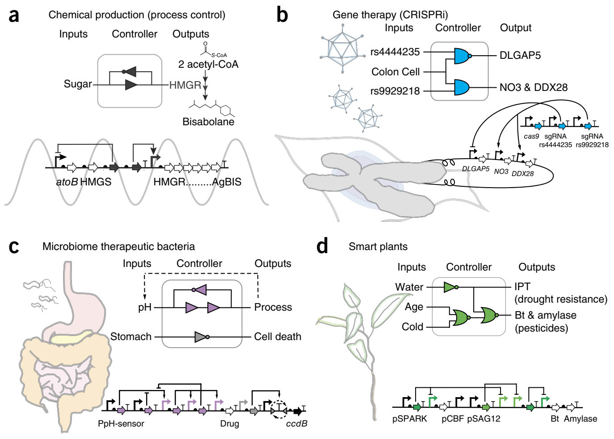
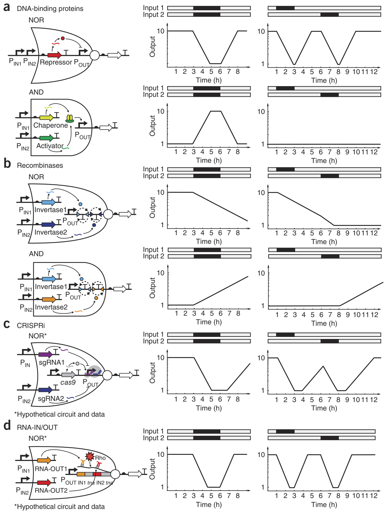
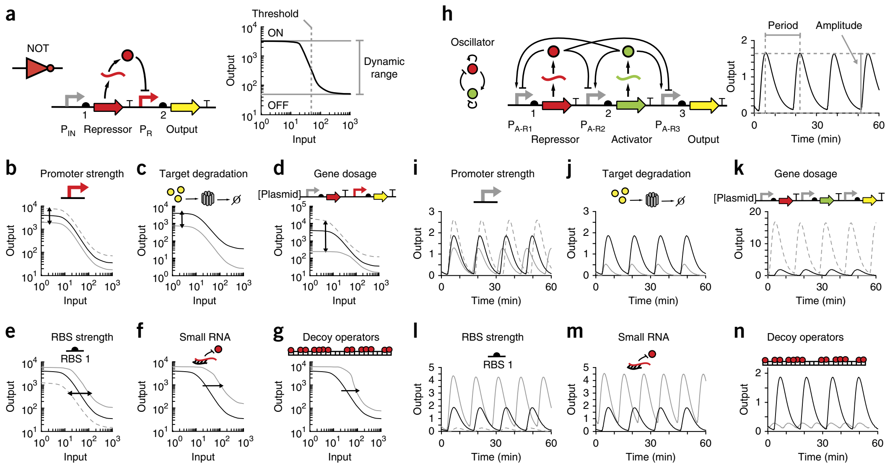
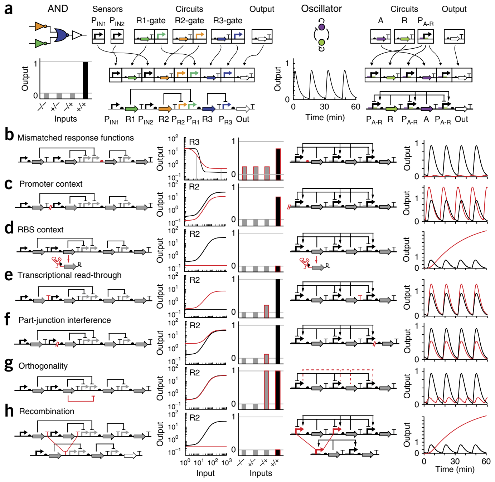
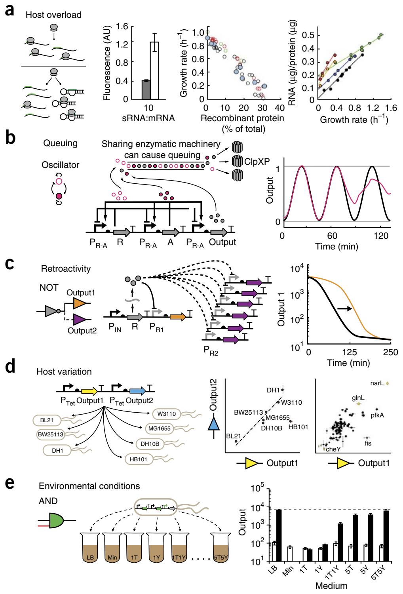
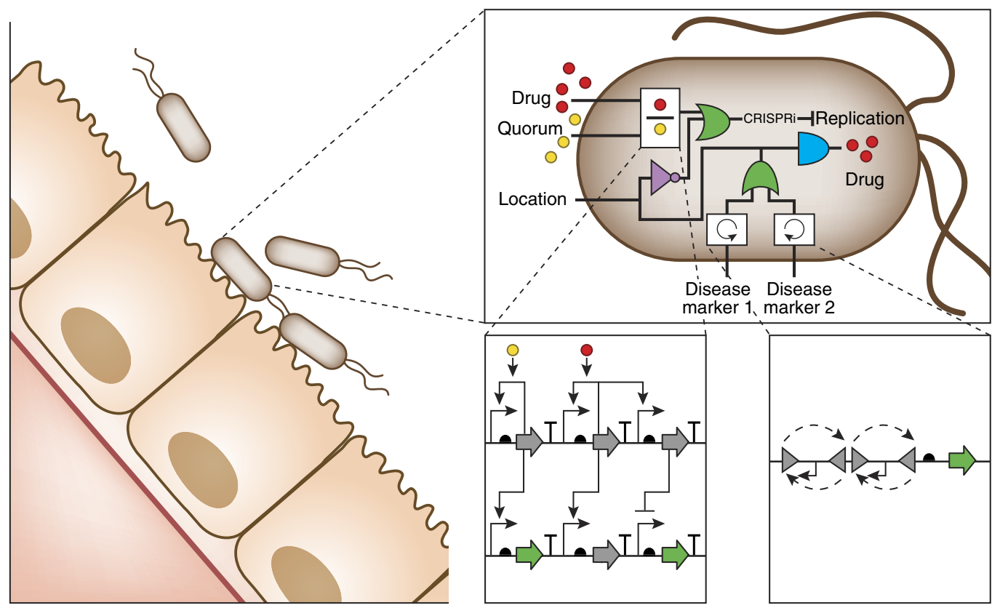

# **Principles** **of** **genetic** **circuit** **design**

**Jennifer** **A** **N** **Brophy** **&** **Christopher** **A** **Voigt**

Synthetic Biology Center, Department of Biological Engineering, Massachusetts Institute of Technology, Cambridge, Massachusetts, USA. Correspondence should be addressed to C.A.V. (cavoigt@gmail.com).

**Received** **24** **Janua**r**y;** **acce**p**ted** **18** **Ma**r**ch;** p**ublished** **online** **29** Apr**il** **2014;** **doi:10.1038/n**m**eth.2926**

© 2014 Nature America, Inc. All rights reserved.

Cells navigate environments, communicate and build complex patterns by initiating gene expression in response to specific signals. Engineers seek to harness this capability to program cells to perform tasks or create chemicals and materials that match the complexity seen in nature. This Review describes new tools that aid the construction of genetic circuits. Circuit dynamics can be influenced by the choice of regulators and changed with expression ‘tuning knobs’. We collate the failure modes encountered when assembling circuits, quantify their impact on performance and review mitigation efforts. Finally, we discuss the constraints that arise from circuits having to operate within a living cell. Collectively, better tools, well-characterized parts and a comprehensive understanding of how to compose circuits are leading to a breakthrough in the ability to program living cells for advanced applications, from living therapeutics to the atomic manufacturing of functional materials.

**Figure** **1** | Potential uses of synthetic genetic circuits. All of these examples are hypothetical and have not yet been realized. (**a**) A circuit controlling the production of a diesel-fuel alternative (bisabolane221). The circuit reduces accumulation of a toxic intermediate (HMG-CoA) by sensing the bisabolane sugar precursor and oscillating the production of HMGR222. (**b**) Gene therapy circuits based on CRISPRi technology. The circuit detects two single-nucleotide polymorphisms associated with colon cancer susceptibility (rs4444235 and rs9929218)223 and uses a tissue-specific promoter (pAMUC2) to control the expression of Cas9 and misregulated genes (*DLGAP5*, *NO3* (*NBL1*) and *DDX28*). (**c**) Commensal bacteria programmed to stabilize pH in the human stomach to treat gastoesophageal acid reflux. The bacteria use a proportional integral controller224, whose output is a proton pump inhibitor, to achieve set-point control over stomach pH. The circuit also restricts acid regulation to the stomach by terminating the bacterium via an irreversible switch that turns on a bacterial toxin (CcdB) when it leaves this organ225. (**d**) Genetic circuits in ‘smart’ plants that sense environmental stimuli and implement a response. The circuit, built into chloroplasts, integrates sensors for drought (pSpark), temperature (pCBF) and plant maturity (pSAG12) to control pesticide (Bt) production and drought tolerance (IPT).

Performing computation in a living cell will revolutionize biotechnology by improving existing processes and enabling new applications. In the short term, the production of bio-based chemicals can be improved by timing gene expression at different stages of fermentation or by turning on an enzyme only under particular conditions (e.g., high cell density)1–6. As circuits become more advanced, entire algorithms from control theory could be implemented to improve biochemical production7–16 (**Fig.** **1a**). Synthetic regulation is also an important tool for the discovery of natural products including pharmaceuticals, insecticides and entirely new classes of chemicals. Accessing these products may require synthetic regulation because many of the relevant gene clusters are ‘silent’, meaning that the conditions under which they are induced are unknown17–22. Outside of the fermenter, living cells could be programmed to serve as therapeutic agents that correct genetic disease (**Fig.** **1b**) or colonize niches in the human microbiome to perform a therapeutic function23–35 (**Fig.** **1c**). Longer-term applications include ‘smart’ plants that sense and adapt to environmental challenges (**Fig.** **1d**) and bacteria that organize to weave functional materials with nanoscale features36–42.

Despite its potential, genetic circuit design remains one of the most challenging aspects of genetic engineering43. The earlier fields of protein and metabolic engineering have yielded tools to optimize enzymes and fluxes through a metabolic network. These tools include computational methods that can predict the impact of an amino acid substitution on protein thermostability44 or the distribution of flux through modified metabolic networks45. Biotech companies often have research groups dedicated to protein and metabolic engineering that have specialized training in these tools. However, industrial groups dedicated to building synthetic regulation are rare, and even simple tasks, such as building a switch or inducible system, tend to be one-off projects performed by a nonspecialist.

Several features of genetic circuits make them challenging to work with, relative to other areas of genetic engineering. First, circuits require the precise balancing of their component regulators to generate the proper response46,47. Computational tools and part libraries that enable the tuning of expression levels have been developed only recently48–51. Before this, only course-grained control was achievable with small sets of parts46,47,52. Second, many circuits are difficult to screen in directed-evolution experiments for correct performance. Digital logic has clear ON and OFF states that can form the basis for a screen12,53–59. However, screening for dynamic circuits, such as oscillators, is significantly more complex60, and it is hard to imagine how screens would be established for more sophisticated functions, such as a PID (proportional integral derivative) controller with proscribed response properties. Third, there are few tools to measure circuit performance. Typically, a fluorescent reporter is used to measure the output, but fluorescence detection requires artificially high expression, and fluorescent protein degradation rates can limit the ability to measure dynamics. Fourth, synthetic circuits are very sensitive to environment, growth conditions and genetic context in ways that are poorly understood61. Finally, the process of building a large genetic circuit requires the assembly of many DNA parts, and this process has been both technically challenging (until recently) and fraught with its own sources of errors58,62–67.

The purpose of this Review is to serve as a guide to designing a prokaryotic transcriptional circuit, in which both the inputs and outputs are promoters53,55,68–71. Transcriptional circuits maintain a common signal carrier, which simplifies the connection of circuits to build more sophisticated operations72. Post-transcriptional circuits, including those based on protein and RNA interactions, are covered in other excellent reviews73–75. Although the majority of this guide is dedicated to bacterial circuits, many of the principles, albeit not the details, are relevant for eukaryotes, including human cells and plants76,77.

## G**enetic** **circuit** **design** **based** **on** **different** **regulator** **classes**

**Figure** **2** | Logic gates built on the basis of different regulator types. (**a**–**d**) All gates are transcriptional, with two input promoters (PIN1 and PIN2) and one output promoter (POUT). The graphs show how the gates respond to inputs introduced at the same time (center) or sequentially (right). In all panels, the ON state is assumed to generate tenfold higher response than the OFF state. (**a**) Top, NOR gate based on a repressor that binds DNA110. The response curves are based on measured induction (τ1/2 ≈ 36 min) and relaxation (τ1/2 ≈ 35 min) half-lives226. Bottom, AND gate based on an activator that requires a second protein to be active55. The responses are based on measured induction (τ1/2 ≈ 36 min) and approximate relaxation (τ1/2 ≈ 35 min) half-lives55. (**b**) Top, NOR gate based on integrases that flip two terminators to turn off the output122,123. The responses are based on an on rate of 1.8 h (refs. 119,121,122). Bottom, AND gate based on integrases122. (**c**) Hypothetical NOR gate based on CRISPRi. Cas9 is expressed constitutively, and two input promoters drive the expression of two sgRNAs. The lines are based on measured induction (τ1/2 = 35 min) and relaxation (τ1/2 = 47 min) half-lives79. (**d**) NOR gate based on the RNA-IN/RNA-OUT system80. RNA-OUT represses translation of *tnaC*, which allows Rho to bind the mRNA and repress transcription of the output. The response lines are based on theoretical induction (τ1/2 ≈ 30 min) and relaxation (τ1/2 ≈ 35 min) half-lives162,226.

Transcriptional circuits function by changing the flow of RNA polymerase (RNAP) on DNA. There are a number of regulators that influence this flux that have been used as the basis for building synthetic circuits (**Fig.** **2**). For example, DNA-binding proteins can recruit or block RNAP to increase or decrease the flux, respectively. Analogously, the CRISPRi system uses the Cas9 protein to bind to the DNA and alter transcription78,79. RNAP flux can also be altered with invertases that change the orientation of promoters, terminators or gene sequences. Additionally, RNA translational repressors, such as RNA-IN/OUT, can be converted to control RNAP flux80,81. In this section, we describe recent advances in these methods and analyze the impact that each regulator has on circuit response.

**DNA-binding** **proteins.** Many families of proteins can bind to specific DNA sequences (operators). The simplest way to use these proteins as regulators is to design promoters with operators that block the binding or progression of RNAP. Such repressors have been built out of zinc-finger proteins82, transcription activator–like effectors83,84, TetR homologs71, phage repressors85,86 and LacI homologs87. A core set of three repressors were used to build many of the first synthetic circuits (CI, TetR, LacI)47,53,88–91. However, recently there have been efforts to expand the number of DNA-binding proteins that are available for circuit design54,92–99. Expanding protein libraries can be challenging because each repressor has to be orthogonal; i.e., only interact with their operators and not the others in the set. Because of their simple function, repressors are relatively easy to move between species, including to eukaryotes92–97. DNA-binding proteins can also function as activators that increase the flux of RNAP on DNA. Recent efforts have increased the number of such proteins that are available for constructing circuits54,98–100.

Many logic gates have been constructed with DNA-binding proteins71,101–109. For example, NOT and NOR gates have been built by connecting input promoter(s) to a repressor that turns off an output promoter47,53,71,88,110 (**Fig.** **2a**). Other types of transcriptional logic gates have been built using pairs of proteins in which one either activates or inhibits the other. For example, AND gates have been built with artificially split proteins111 and activators that require chaperones55,101 (**Fig.** **2a**). Similarly, NAND gates can be built with proteins that block the activity of an activator, such as anti-σ factors, which inhibit σ factors100.

DNA-binding proteins have also been used to build circuits that incorporate positive and negative feedback loops, which form the basis for dynamic circuits, such as pulse generators112, bistable switches47,53,113 and oscillators70,88,114–116. Analog circuits, which allow complex computational functions to be generated with fewer regulators, have also been built with DNA-binding proteins. For example, two or three transcription factors can be used to build an adder or a ratiometer103.

There are also several challenges in using DNA-binding proteins to build circuits. Individual transcription factors may appear nontoxic, but often a combination of multiple regulators can lead to acute toxicity. The circuits can also be very dependent on growth rate because differences in the dilution rate change how quickly regulators accumulate or degrade, which alters their steady-state concentration, ultimately affecting their response. Finally, the response functions are often suboptimal and difficult to control because they have high OFF states (meaning they generate significant transcriptional signals in the OFF state) and low dynamic ranges.

**Recombinases.** Recombinases are proteins that can facilitate the inversion of DNA segments between binding sites117. Site specific recombinases often mediate ‘cut-and-paste’ recombination, during which DNA is looped, cleaved and religated118. Two types of recombinases have been used to build genetic circuits. The first is tyrosine recombinases, such as Cre, Flp and FimBE, which require host-specific factors69,119–121. These recombinases can be reversible and flip the DNA in both directions, or irreversible and flip in only a single direction. The second class of recombinases is serine integrases, which catalyze unidirectional reactions that rely on double-strand breaks to invert DNA. Serine integrases typically do not require host factors and often have cognate excisionases that can be expressed independently to return the DNA to its original orientation.

Recombinases have been used to build switches119, memory circuits120,121, counters69 and logic gates122,123. These proteins are ideal for memory storage because they flip DNA permanently, and once the DNA is flipped, its new orientation is maintained without the continuous input of materials or energy. In recombinase logic gates, these discrete physical states of the DNA can correspond to ON and OFF states (1 and 0). However, using recombinases can be challenging because their reactions are slow (requiring 2–6 h) and often generate mixed populations when targeting a multicopy plasmid121. Reversible recombinases can also generate mixed populations; however, this limitation was overcome recently when a unidirectional serine integrase was used to flip DNA in one direction and an integrase-excisionase pair was used to return it to the original state124.

All two-input gates, including AND and NOR logic, have been constructed using orthogonal serine integrases122,123 (**Fig.** **2b**). The gates are organized such that two input promoters express a pair of orthogonal recombinases, which change RNAP flux by inverting unidirectional terminators, promoters or entire genes. These gates are based on unidirectional serine integrases without excisionases and therefore operate as memory circuits that record exposure to two input signals. Once flipped, the circuits cannot be returned to their original state; therefore, the gates do not distinguish the order in which they were exposed to the inputs or even whether the inputs occurred at the same time. To overcome this limitation, rewritable switches could be used to build logic gates that respond transiently to pulses of inputs. To do this, one recombinase is constitutively expressed to maintain the state, and the other is induced in response to an input signal.

**CRISPRi.** Clustered, regularly interspaced, short palindromic repeat (CRISPR) arrays function as a bacterial ‘immune system’ that targets specific DNA sequence motifs for degradation125. CRISPR systems use a Cas (CRISPR-associated) nuclease and guide RNA to introduce double-strand breaks to specific DNA sequences126. Mutant Cas proteins (such as dCas9 (ref. 79) and Cas9N− (ref. 127)) that do not have nuclease activity have been developed and used as transcription factors that knock down gene expression by forming a DNA bubble that interferes with RNAP activity78,79. CRISPR can also activate transcription by fusing an RNAP recruiting domain to catalytically inactive Cas9 (refs. 78,127–131). One advantage of CRISPR interference (CRISPRi) is the designability of the RNA-DNA complex. It is possible to imagine creating a very large set of orthogonal guide sequences that target different promoters. This set would enable the construction of large genetic circuits, but it would need to be experimentally screened because predicting guide RNA orthogonality is complicated132–135.

CRISPRi is still relatively new, and NOT gates are the most complex circuits built to date79. The NOT gates induce synthetic guide RNA (sgRNA) and dCas9 expression simultaneously to repress transcription at an output promoter. In theory, a NOR gate could be created by introducing a second sgRNA that targets the same output promoter (**Fig.** **2c**). In general, the properties of CRISPRi circuits will probably resemble DNA-binding protein circuits. Circuits based on CRISPRi are expected to operate on timescales similar to those of protein-based circuits because of the stability of the regulatory dCas9-sgRNA-DNA complex79.

A current challenge in implementing CRISPRi circuits is toxicity, which is difficult to control. Toxicity could be the result of Cas9 binding to the host genome at protospacer-adjacent motifs (such as NGG), forming bubbles that deleteriously affect host gene expression136,137. It appears that this nonspecific binding occurs when a guide RNA is absent; therefore, one of the roles of the RNA is to repel Cas9 from off-target sequences. Toxicity is less noticeable when Cas9 is used as a nuclease because the RNA is in excess, but in a circuit Cas9 would need to be able to be carried in an RNA-free state before the gate is turned on. Another consideration for building CRISPRi circuits is retroactivity138, which could arise from using Cas9 as a shared resource (see “Common failure modes from connecting circuits” below). One way to circumvent retroactivity would be to express multiple orthogonal Cas9 homologs132,139.

**Adapted** **RNA-IN/OUT.** The RNA-IN/OUT system from *Escherichia* *coli* represses translation of a target protein when a short noncoding RNA (RNA-OUT) is expressed. In the natural system, RNA-OUT binds to a specific sequence at the 5′ end of an mRNA (RNA-IN) to occlude ribosome binding and increase mRNA degradation140–142. Arkin and coworkers retooled this system to repress transcription, instead of translation, using a transcriptional adaptor from the *tna* operon80. The *tna* regulatory element is composed of a ribosome-binding site (RBS), the coding sequence for a short peptide called TnaC, a Rho factor–binding site and an RNAP pause site that facilitates Rho-mediated transcription termination. Translation of *tnaC* causes ribosomal stalling, which blocks Rho factor binding and allows RNAP to transcribe genes downstream of *tnaC.* However, when translation of *tnaC* is prohibited by the RNA-IN/OUT system, Rho binds the growing mRNA and knocks off RNAP, thereby inhibiting transcription elongation. As with CRISPRi, the adapted RNA-IN/OUT system could be used to generate a large set of orthogonal regulators because it is based on designable RNA-RNA interactions. To date, more than 150 different families of at least seven orthogonal RNA-IN/OUT mutants have been designed using the RNA-IN/OUT model, and all of the mutants tested experimentally have been functional and orthogonal81.

Adapted RNA-IN/OUT has been used to build two-, three- and four-input NOR gates80 (**Fig.** **2d**). In these systems, orthogonal RNA-IN variants were connected such that expression of any cognate RNA-OUT represses transcription of the output gene. Additional layers of regulation could be engineered into the adapted RNA-IN/OUT system with ligand-responsive aptamers that regulate RNA-OUT activity143 or tRNAs that control ribosomal pausing in *tnaC*144. A challenge in building larger RNA-IN/OUT circuits is that each transcriptional regulator requires the same *tna* regulatory element (~290 bp). The reuse of this part in multiple circuits could lead to homologous recombination (see below). Engineering *tnaC* to reduce the length of the repeated sequence80 or using homologs from other organisms and alternative Rho-binding sites could potentially attenuate recombination.

## S**electing** **parts** **to** **tune** **the** **circuit** **response**

Genetic circuits need to be tuned to meet the specifications required for a particular application. For example, a large dynamic range may be required to strongly activate a pathway. Similarly, low OFF states are desirable when expressing toxic proteins145. When the first synthetic circuits were built, there were few options available for tuning circuits and only course-grained changes were possible46,47. New libraries of well-characterized parts and computational tools have made it easier to design and tune genetic circuits. Moreover, new classes of insulators improve the reliability of these parts when they are placed in the local genetic context of a circuit. Additional biochemical tools, such as small RNA (sRNA), have been incorporated into circuits in order to provide more tuning knobs. In a prior review, we detailed advances in part design and tools that allow engineers to obtain reliable expression levels146. Here we show how the selection or modification of different parts affects the response of a circuit.

**Figure** **3** | Methods of modifying circuit behavior. (**a**–**n**) Ordinary differential equation models were used to simulate a NOT gate (**a**) and an oscillator (**h**) (for model equations and parameters in SBML format205,227, see **Supplementary Notes** **1** and **2**); parameters were adjusted (**b**–**g** and **i**–**n**) to show the effect of each tuning knob on circuit performance. Black, original parameters; gray, tuning knob variations. Inputs in **a**–**f** are isopropyl β-d-1-thiogalactopyranoside (IPTG). (**b**,**i**) Promoter strength is increased (dashed gray line) or decreased (solid gray line) by a factor of 2. (**c**,**j**) Enzymatic degradation of the reporter protein was modeled as a fivefold increase in the protein degradation rate228. (**d**,**k**) Gene dosage. The circuits are moved between a high-copy plasmid ten times more abundant than in the original circuit (dashed gray line) and the genome (solid gray line) to tune expression. (**e**,**l**) RBS strength. Repressor RBSs (RBS 1) are increased (dashed gray line) or decreased (solid gray line) by a factor of 5. (**f**,**m**) Small RNAs designed to bind repressor mRNA with the same affinity as a ribosome (this value was chosen arbitrarily and can be modulated to change circuit dynamics). In this model, sRNAs are produced constitutively, and sRNA-mRNA duplexes are degraded faster than either RNA alone. (**g**,**n**) Decoy operators that bind repressor proteins with the same dissociation constant *K*d as the repressible promoter.

Two circuits are used as model systems to demonstrate the effects of various tuning knobs. The first, a NOT gate, represents a simple logic operation46,53 (**Fig.** **3a**). Logic gates are often characterized by their response function, which captures how the steady-state output changes as a function of input. The shape of this function is defined by: (i) the ON and OFF states, which define the circuit’s dynamic range, (ii) the amount of input required to reach the half-maximum output (also referred to as the threshold) and (iii) the cooperativity of the switch147,148. We selected an oscillator as an example of a dynamic circuit (**Fig.** **3h**). These types of circuits can be very difficult to tune because they need to be balanced in a narrow region of parameter space in order to function properly90,149,150. For an oscillator, tuning will affect the period, amplitude and shape of the oscillations. Tuning can also force the system out of the oscillating parameter space and cause the circuit to fail90.

The response function of a digital logic gate can be shifted up or down by changing promoter strengths151 (**Fig.** **3b**), RBS strengths or the proteins’ degradation rates152 (**Fig.** **3c**). Promoter strength can be altered with mutations in the promoter sequence153 or by selecting new promoters from a characterized library49,154. Increased degradation can be achieved with protease tags or N-terminal degrons152. Circuit components are often distributed between multiple plasmids at different copy numbers in order to synthesize each component at the necessary level. However, when entire circuits are expressed on one plasmid, copy number can be shifted to simultaneously alter the circuit’s dynamic range and threshold155 (**Fig.** **3d**).

The threshold of the gate can be changed via several methods. Selecting a stronger or weaker RBS, adding multiple operators or changing operator positions within a promoter can change the threshold59,71,156,157 (**Fig.** **3e**). The threshold of a gate becomes steeper and more switch-like when small changes in the input have a large effect on the output158. Increased cooperativity makes connecting gates easier by decreasing the range of input needed from an upstream circuit to span the induction threshold of the next circuit in the series. One way to make a gate more switch-like is to change the cooperativity of repressor binding to the promoter or to introduce DNA looping159,160. Another approach is to express a sequestering molecule that binds a circuit component and prevents it from functioning. Sequestration has been achieved using sRNAs that bind to mRNA161,162 (**Fig.** **3f**), proteins that bind to transcription factors113,163,164, and decoy DNA operators that titrate the transcription factor away from the output promoter165 (**Fig.** **3g**).

In an oscillator, parts that affect the rate of gene expression change the amplitude of the response and can shift the period (**Fig.** **3i**,**l**). Rapid protein degradation is critical for dynamic circuits to function correctly. If proteins are slow to degrade, then the circuit may slow down or stop functioning altogether166 (**Fig.** **3j**). Protease tags can be used to decrease the degradation rate from several hours to ~20 min, which will increase the rate at which a gate switches70,89,112,152. Changing plasmid copy number can affect the amplitude of oscillations (**Fig.** **3k**). Cooperativity is critical for obtaining robust oscillators because it increases the region of phase space that produces oscillations159. Therefore, sequestration approaches are predicted to have a large impact on the period and amplitude of oscillations167 (**Fig.** **3m**,**n**).

## C**ommon** **failure** **modes** **from** **connecting** **circuits**

**Figure** **4** | Common failure modes and their impact on circuit dynamics. (**a**) Parts are assembled to build complex circuits. The AND gate71 is built with two inducible input promoters (PIN1 and PIN2), one output promoter (PR3) and two internal repressor-promoter pairs (PR1 is repressed by R1). The steady-state response to different combinations of inputs is shown as a bar graph, where the OFF states are gray and the ON state is black. The oscillator70 is built with PA-R promoters, which are repressed by R and activated by A. (**b**–**h**) The impact of various failures (red) are shown for the AND gate (left) and oscillator (right). R2 or R3 expression as a function of input 2 (unless indicated otherwise) is also shown in each panel to explain the AND gate failures. Ordinary differential equation models were used to simulate repressor induction (buffer gate) and oscillator behavior (parameters and model equations used for the oscillator simulation is included in **Supplementary Note** **2** in SBML format205,227). Outputs from the buffer gate simulations were fed into a separate AND gate model71. Figure from ref. 71, Nature Publishing Group. (**b**) Mismatched response functions. In the AND gate, R3 was modeled as a different repressor: *BET1* (dissociation constant *k*d = 0.2, Hill coefficient *n* = 2.4, max = 13, min = 0.4) instead of *ORF2* (*k*d = 0.4, *n* = 6.1, max = 16, min = 0.2)71. R2 is the input for the R3 transfer function. In the oscillator, the R translation rate is increased tenfold. (**c**) Strength of the indicated promoters is reduced by 50% in both circuits. (**d**) Translation rates of R2 (AND gate) and R (oscillator) are set to 0. (**e**) 30% read-through from upstream operons through the red terminator is simulated in both circuits. Here the R2 expression is shown as a function of input 1 (instead of input 2). (**f**) Part-junction interference. A new constitutive promoter (AND gate) is simulated as having approximately 20% of the strength of PIN2. The new terminator (oscillator) decreases transcription 40%. (**g**) Orthogonality. R3max is set as R2min to simulate repression of PR3 by R2. Additional equations are added to the oscillator model to simulate repressor-activator complex formation. (**h**) Recombination. R2 and R were removed from the AND gate and oscillator models, respectively.

Gates can be combined to build larger circuits that implement more sophisticated computational operations. Transcriptional gates can be connected by using the output promoter of one circuit as the input promoter to the next. This method applies for all transcriptional circuits, including digital, analog and dynamic circuits or a combination of types. To be connected, circuits have to be broken up into their component parts and then combined in a particular order (**Fig.** **4a**). Reorganizing the parts places them in new local contexts that are different from those where they were characterized. This can be problematic because circuit components can behave differently in new genetic contexts, and small circuits may have identical component parts (e.g., terminators) that interfere with each other in the larger circuit. In this section, we discuss failure modes that can arise when building larger circuits, show the impact that each failure has on circuit function, and discuss engineering approaches to mitigate these problems.

A common problem when connecting circuits is that the upstream circuit’s output does not span the dynamic range required to stimulate next circuit in series (**Fig.** **4b**). In digital logic, this mismatch manifests as either a decrease in the dynamic range of the complete circuit or a loss of function. Connectivity mismatches can be corrected by selecting parts that shift the thresholds of individual gates. For example, RBSs can be mutated to force the threshold of a gate to fall within the dynamic range produced from an upstream circuit46,102. Mismatches in an oscillator can dampen oscillations or force the system outside the functional parameter space (**Fig.** **4b**). Mathematical models can be used to streamline circuit design by predicting the functional parameter space and selecting appropriate RBSs and promoters to achieve the required expression levels48,68,157.

Genetic parts are often context dependent, meaning their functions change when the DNA sequences on either side of the part are altered168,169. Context dependencies complicate part substitutions because part characterizations are often carried out in isolation and their activity in a new context may not match the measured strength. For example, promoters that are defined as DNA sequences of <50 bp may behave differently in new contexts because the α-domain of *E.* *coli* RNAP can contact the DNA ~100 bp upstream of the transcription start site153. In a digital circuit, reducing promoter efficiency attenuates the response of individual gates and reduces the output of the complete circuit (**Fig.** **4c**). Promoter attenuation can increase the amplitude of an oscillator and elongate the period by reducing repressor expression. Insulator sequences can relieve some compositional context effects by standardizing the DNA sequences flanking promoters169,170.

Context effects can also occur when promoters are fused to different RBSs. Promoters are sensitive to the DNA sequences near the transcription start site because that region can alter promoter melting and polymerase escape frequency154. Transcription start sites can also fluctuate according to the local sequence context171,172, which can affect RBS strength by altering the length of the 5′ untranslated region (UTR) and changing mRNA secondary structure. Tandem promoters can generate especially long 5′ UTRs that exacerbate this effect by base pairing with the RBS or sequences in the open reading frame173–175. Circuits can fail completely when mutations in the 5′ UTRs cause hairpins to completely occlude the RBSs and prohibit translation (**Fig.** **4d**). As a solution, the 5′ UTR can be cleaved with ribozymes or CRISPR processing to standardize RBS accessibility170,176. Catalytic insulator elements serve dual functions by standardizing both the 5′ end of mRNA and the promoter region downstream of the transcription start site. RBSs can be further insulated from the local context using bicistronic designs, which prime the mRNA for translation with an upstream RBS that keeps the mRNA unfolded49.

Transcriptional read-through can be a problem in genetic circuits with monocistronic designs, in which every gene has its own promoter and terminator. These designs require strong terminators to insulate against read-through from neighboring promoters. Failure to fully insulate each cistron can link the expression of genes that are supposed to be regulated independently (**Fig.** **4e**) and can contribute to the leaky expression of uninduced genes. Strong, tandem terminators can be placed on either side of each gene to ensure isolated expression of individual operons177. Large libraries of Rho-independent terminators were recently built and characterized to enable the construction of large circuits that are robust with respect to read-through and homologous recombination (described below)50,177.

DNA sequences are information rich; therefore, connecting two parts can create a new functional sequence at the junction178. New regulatory elements, such as promoters or terminators, can be generated at a part junction if the combination creates a sequence of DNA that resembles a regulatory element. For large circuits, many parts have to be combined in a new order, and unexpected parts that interfere with gene expression can be generated (**Fig.** **4f**). One way to scan for unintended functional sequences is to use computer algorithms that search for various regulatory elements48,177,179–185.

Cross-talk, which occurs when regulators interact with each other’s targets, can change the topology of a circuit and can lead to errors in the desired operation55. For example, cross-talk between a repressor and noncognate promoter can inappropriately decrease expression of a gene and cause a circuit to fail (**Fig.** **4g**). Avoiding cross-talk requires that parts be screened for orthogonality via combinatorial experiments that test every combination of promoter and regulatory element71,81,83,98,100,186.

Many of the circuits built to date reuse the same regulatory parts, which can lead to homologous recombination. Homologous recombination deletes DNA between repeated sequences and can result in the loss of circuit components and circuit failure177 (**Fig.** **4h**). In general, the rate of recombination increases with circuit toxicity187 and homologous DNA length, with the threshold occurring between 20 and 30 bp (ref. 188). Homologous recombination can be avoided with large libraries of parts with redundant functions that have enough sequence diversity to avoid recombination177,189.

## I**nteractions** **between** **synthetic** **circuits** **and** **the** **host** **organism**

Genetic circuits are based on biochemical interactions within living cells. Most circuits use host resources to function, including transcription and translation machinery (e.g., ribosomes and RNAP), DNA-replication equipment and metabolites (e.g., amino acids). The availability of these resources and the details of the intracellular environment change significantly in different strain backgrounds, environmental conditions and media, and they also depend on cell density and growth rate. When the first synthetic circuits were built, they were fragile, and it was unclear why they would work only in specific conditions20,21. Now there is a more precise understanding of the ways in which circuits break owing to interactions with the host61. A better understanding of what these failure modes are and of the methods that natural systems use to overcome them will lead to new design rules for composing synthetic circuits.

**Figure** **5** | Circuit performance within the context of a living cell. (**a**) Synthetic sRNAs compete with mRNA for ribosomes. When sRNAs are produced (left graph, gray bar), ribosomes are titrated away from fluorescent protein mRNA and observed fluorescence is reduced relative to no sRNA (white bar)229. AU, arbitrary units. Center graph, colored circles represent the overexpression of different proteins in *E.* *coli* (blue, *Pu* promoter β-galactosidase; red, T7 promoter β-galactosidase; black, *tac* promoter ∆EF-Tu; green, *bla* promoter β-lactamase)230. Right graph, colored circles represent growth of different bacterial and yeast strains plotted against rRNA supply (blue, *E.* *coli* 30 °C; green, *Aerobacter* *aerogenes* 37 °C, red; *Candida* *utilis* 25 °C; orange, *C.* *utilis* 30 °C; black, *Neurospora* *crassa* 30 °C)230. Left graph adapted from ref. 229 with permission of The Royal Society of Chemistry. Center and right graphs from Scott, M., Gunderson, C.W., Mateescu, E.M., Zhang, Z. & Hwa, T. Interdependence of cell growth and gene expression: origins and consequences. *Science* **330**, 1099–1102 (2010). Reprinted with permission from AAAS. (**b**) Queuing as a result of overloading the ClpXP protease machinery with proteins from a synthetic oscillator. The graph shows the difference between expected (black) and measured (red) dynamics for an oscillator affected by queuing166. Adapted with permission from ref. 166, Wiley. (**c**) An additional output (PR2) on a high-copy plasmid is added to the NOT gate, which alters the activation dynamics of the original output (PR1) (black line, original dynamic response; orange line, retroactive effect)195. Adapted with permission from Jayanthi, S., Nilgiriwala, K.S. & Del Vecchio, D. Retroactivity controls the temporal dynamics of gene transcription. *ACS* *Synth.* *Biol.* **2**, 431–441 (2013). Copyright 2013 American Chemical Society. (**d**) One plasmid with two reporter proteins is transformed into different *E.* *coli* strains. The ratio of expression varies in some strains (center: wild-type *E.* *coli* strains; right, KEIO collection knockouts)196. Adapted with permission from ref. 196, Elsevier. (**e**) Different media affect the performance of an AND gate based on T7 RNAP2,102. Data are shown for the circuit in the absence (white) and presence (black) of both inputs in different media (Min, minimal medium; #T and/or #Y, minimal medium supplemented with tryptone and/or yeast extract, where # indicates the grams of tryptone and/or yeast extract per liter). Reprinted with permission from Moser, F. *et* *al.* Genetic circuit performance under conditions relevant for industrial bioreactors. *ACS* *Synth.* *Biol*. **1**, 555–564 (2012). Copyright 2012 American Chemical Society.

A common observation is that some synthetic regulators can cause growth defects. Yet it remains unclear why certain regulators can be expressed at high levels with no noticeable impact whereas others in the same class are very toxic. This was evident in analyses of large libraries of TetR and σ-factor homologs sourced from diverse organisms and transferred into *E.* *coli*71,100. Expression of some regulators slowed *E.* *coli* growth, but the origin of this effect is unclear as it does not correlate with the number of predicted binding sites in the genome or off-target gene expression measured using RNA-seq. T7 RNAP is another part that can be very toxic when combined with a strong T7 promoter102. It is also unclear how this toxicity arises, but it could be due to the difficulty terminating T7 RNAP, which could cause excessive transcription around a plasmid or expose mRNA by decoupling RNAP and ribosome progression. Circuits based on protein-protein interactions can also exhibit toxicity when the proteins bind to off-target partners. We observed this with anti-σ factors, which appear to bind and titrate native σ factors100. Small RNA with RBS-like sequences can also cause toxicity by titrating ribosomes, increasing expression variability and reducing growth145 (**Fig.** **5a**). Larger circuits are particularly sensitive to the toxicity that can arise from individual regulators because their effects are compounded when they are expressed together190.

Circuits can also decrease growth rate by monopolizing host resources and slowing production of essential protein and RNAs191 (**Fig.** **5a**). A small reduction in the growth rate can be a problem when using a circuit for industrial applications that rely on high product yields. A decrease in growth rate can reduce the dilution rate of circuit components and lead to unintended buildup of proteins or RNA that can cause a circuit to fail. In fact, circuits can appear to function better when growth is impeded because slow dilution increases the observed concentration of transcription factors and reporters. Slow growth can also put pressure on the host organism to evolve away the burdensome circuit, via either homologous recombination, point mutations, deletions or copy-number reduction.

Circuits can diverge from their expected behavior when they overuse a limited resource that is shared with other cellular processes. Overburdening resources causes queuing, which results in a delay or reduction in circuit activity192. For example, when σ factors are overexpressed, they can occupy the entire pool of free core RNAP. When this happens, σ factors must compete to bind to the core, which indirectly couples their activity and can disrupt host processes193. Native σ factors are able to avoid queuing by pulsing their expression such that they alternate the usage of core RNAP over time194. A similar coupling effect has been observed when the ClpXP protease is shared by regulators that have been modified to contain C-terminal tags for fast degradation. If too many proteins are targeted for degradation, the enzymatic machinery can become overwhelmed and force substrates to wait for processing166. The rapid degradation of regulators is important for dynamic circuits, such as oscillators, which will fail if the regulatory proteins accumulate (**Fig.** **5b**).

Retroactivity can also interfere with circuit activity. Retroactivity is defined as the influence that a downstream genetic element can have on an upstream one, and it describes the changes in circuit behavior that result from connecting new downstream modules to a circuit138. For example, connecting a second output to a NOT gate may cause retroactivity by titrating the repressor away from the original output promoter (**Fig.** **5c**). Retroactivity will affect the NOT gate’s dynamics by increasing the time it takes to build up an adequate amount of protein to repress promoter activity195. Retroactivity that delays a circuit’s response to input stimulation can be alleviated by increasing expression of the problematic circuit component; however, increasing expression can lead to other trade-offs, including toxicity.

Strain variation can affect circuit performance in different ways. Differences in growth rate, ribosome concentration and induction lag time have been identified as the main contributors to strain-dependent variations in circuit performance196. In recent reports, these phenotypes have been correlated with specific genes by studying growth and circuit performance across single-gene knockouts196,197 (**Fig.** **5d**). Media and growth conditions can also influence circuit performance by altering promoter activity, protein stability and regulator dilution198,199. These effects can be so severe that switching from LB to minimal medium can cause circuits to fail2 (**Fig.** **5e**).

One approach to reduce strain- and medium-based variation is to use reference standards to report circuit performance. To this end, the relative expression unit (REU) was introduced as a standard for reporting promoter activity2,200. REUs report the promoter activity by normalizing measurements to a constitutive promoter standard in an identical strain. REU measurements have yielded reliable, reproducible data when compared across labs, strains and media, which is important for transcriptional circuits that use promoters as inputs and outputs. In the future, this will facilitate the computer-aided design of large circuits.

## C**onclusions**

The first circuits were built by repurposing a small number of regulators and genetic parts from other areas of genetic engineering. After early success47,88, these parts were put together in different combinations to explore the range of circuit functions that could be performed in the cell. We are now in a phase where there are >100 new regulators55,71,78–80,82,83,101,146,180 that are orthogonal and could theoretically be used to build synthetic regulatory networks at the scale of natural networks in bacteria201. The challenge is to be able to design and construct synthetic regulatory networks at this scale.

There are several key advances that need to happen before we can build and debug genetic circuits this large. First, computational tools have to be developed to aid the design process. These programs must be able to simulate the dynamics of a circuit and convert the designs into a linear assembly of genetic parts68,202–205. Insulating DNA sequences will be critical in future circuits because the majority of parts will be in new contexts206,207. Second, new approaches to whole-cell omics measurements have to be integrated into the debugging cycle. Currently, there is an overreliance on fluorescent proteins as the output of circuits. However, transcriptomics is now sufficiently inexpensive that it could be used to infer polymerase flux on many of the parts internal to a circuit208. Other single-molecule approaches, such as ribosome and RNAP mapping, will become powerful when the experiments become more routine209,210. Third, new approaches need to be developed that can rapidly test circuits under conditions that are difficult to control in the cell. Circuits are sensitive to parameters such as the number of ribosomes, the number of available RNAP, the redox state of the cell, the growth temperature and the ATP concentration, all of which change in different cell types and conditions. However, these parameters are difficult to measure in the cell without broadly affecting the host. To this end, the development of *in* *vitro* cell-free methods to debug circuits will be valuable for designing circuits that are robust to these changes211–220.

**Figure** **6** | Conceptual circuit for a therapeutic bacterium that colonizes a niche in the human microbiome and delivers a drug. This circuit demonstrates how the different classes of regulators and circuits described in this Review could be combined into a single system. The left panel shows genetically modified bacteria that have colonized the interior of a human gastrointestinal tract. The top right panel focuses on the conceptual circuit that the bacteria use to regulate their growth and deliver drugs to the human patient. Bottom, an analog circuit103 (left) and irreversible recombinases (right) are highlighted to emphasize the diverse biochemistries used to build this circuit.

New biochemistries, tuning knobs and troubleshooting methods are now converging for the sophisticated design and construction of genetic circuits. Different classes of regulators can be used in a single circuit to fulfill specialized functions. In this vision, each regulator has found a niche within the larger circuit that exploits its strengths. For example, digital circuits can be used to integrate sensors and respond to environmental conditions, whereas analog circuitry can perform arithmetic functions with a small number of regulators103. Integrases can store memory or cause an irreversible commitment. CRISPRi can regulate essentially any gene in the genome. A vision of this marriage is shown in **Figure** **6**, which is an example of a commensal bacterium that has been engineered to produce a drug while colonizing the gut. In it, repressor-based logic gates respond dynamically to environmental states, and invertases record these observations. Analog circuits can be used to calculate a dosage rate, and, if the drug dosage is surpassed, CRISPRi knocks down specific host genes to arrest growth and avoid overmedication. Collectively, these new circuits and the tools and knowledge to connect and debug them will enable a new era of cellular programming and the applications that come with this capability.

*Note:* *Any* *Supplementary* *Information* *and* *Source* *Data* *files* *are* *available* *in* *the* *online* *version* *of* *the* *paper.*

## ACKNOWLEDGMENTS

C.A.V. and J.A.N.B. are supported by the US National Institute of General Medical Sciences (NIGMS grant P50 GMO98792 and R01 GM095765), Office of Naval Research (ONR) Multidisciplinary University Research Initiative (MURI grant 4500000552) and US National Science Foundation (NSF) Synthetic Biology Engineering Research Center (SynBERC EEC0540879) and by Life Technologies (A114510). J.A.N.B. is supported by an NSF Graduate Research Fellowship.

## COM**P**ETING **F**INANCIAL INTERESTS

The authors declare no competing financial interests.

Reprints and permissions information is available online at <http://www.nature.com/reprints/index.html>.

1. Dahl, R.H. *et* *al.* Engineering dynamic pathway regulation using stress-response promoters. *Nat.* *Biotechnol.* **31**, 1039–1046 (2013).

2. Moser, F. *et* *al.* Genetic circuit performance under conditions relevant for industrial bioreactors. *ACS* *Synth.* *Biol.* **1**, 555–564 (2012).

3. Holtz, W.J. & Keasling, J.D. Engineering static and dynamic control of synthetic pathways. *Cell* **140**, 19–23 (2010).

4. Anesiadis, N., Kobayashi, H., Cluett, W.R. & Mahadevan, R. Analysis and design of a genetic circuit for dynamic metabolic engineering. *ACS* *Synth.* *Biol.* **2**, 442–452 (2013).

5. Zhang, F. & Keasling, J. Biosensors and their applications in microbial metabolic engineering. *Trends* *Microbiol.* **19**, 323–329 (2011).

6. Dietrich, J.A., Shis, D.L., Alikhani, A. & Keasling, J.D. Transcription factor-based screens and synthetic selections for microbial small-molecule biosynthesis. *ACS* *Synth.* *Biol.* **2**, 47–58 (2013).

7. Schendzielorz, G. *et* *al.* Taking control over control: use of product sensing in single cells to remove flux control at key enzymes in biosynthesis pathways. *ACS* *Synth.* *Biol.* **3**, 21–29 (2014).

8. Zhang, F., Carothers, J.M. & Keasling, J.D. Design of a dynamic sensor-regulator system for production of chemicals and fuels derived from fatty acids. *Nat.* *Biotechnol.* **30**, 354–359 (2012).

9. Yi, T.-M., Huang, Y., Simon, M.I. & Doyle, J. Robust perfect adaptation in bacterial chemotaxis through integral feedback control. *Proc.* *Natl.* *Acad.* *Sci.* *USA* **97**, 4649–4653 (2000).

10. Krishnanathan, K., Anderson, S.R., Billings, S.A. & Kadirkamanathan, V. A data-driven framework for identifying nonlinear dynamic models of genetic parts. *ACS* *Synth.* *Biol.* **1**, 375–384 (2012).

11. Carbonell, P., Parutto, P., Baudier, C., Junot, C. & Faulon, J.-L. Retropath: automated pipeline for embedded metabolic circuits. *ACS* *Synth.* *Biol.* doi:10.1021/sb4001273 (4 October 2013).

12. Adams, B.L. *et* *al.* Evolved quorum sensing regulator, LsrR, for altered switching functions. *ACS* *Synth.* *Biol.* doi:10.1021/sb400068z (10 October 2013).

13. Umeyama, T., Okada, S. & Ito, T. Synthetic gene circuit-mediated monitoring of endogenous metabolites: identification of *GAL11* as a novel multicopy enhancer of *S*-adenosylmethionine level in yeast. *ACS* *Synth.* *Biol.* **2**, 425–430 (2013).

14. Stapleton, J.A. *et* *al.* Feedback control of protein expression in mammalian cells by tunable synthetic translational inhibition. *ACS* *Synth.* *Biol.* **1**, 83–88 (2012).

15. Liu, D., Xiao, Y., Evans, B.S. & Zhang, F. Negative feedback regulation of fatty acid production based on a malonyl-CoA sensor-actuator. *ACS* *Synth.* *Biol.* doi:10.1021/sb400158w (30 December 2013).

16. Siedler, S. *et* *al.* SoxR as a single-cell biosensor for NADPH-consuming enzymes in *Escherichia* *coli*. *ACS* *Synth.* *Biol.* **3**, 41–47 (2014).

17. Medema, M.H., Breitling, R., Bovenberg, R. & Takano, E. Exploiting plug-and-play synthetic biology for drug discovery and production in microorganisms. *Nat.* *Rev.* *Microbiol.* **9**, 131–137 (2011).

18. Fischbach, M. & Voigt, C.A. Prokaryotic gene clusters: a rich toolbox for synthetic biology. *Biotechnol.* *J.* **5**, 1277–1296 (2010).

19. Frasch, H.-J., Medema, M.H., Takano, E. & Breitling, R. Design-based re-engineering of biosynthetic gene clusters: plug-and-play in practice. *Curr.* *Opin.* *Biotechnol.* **24**, 1144–1150 (2013).

20. Temme, K., Zhao, D. & Voigt, C.A. Refactoring the nitrogen fixation gene cluster from *Klebsiella* *oxytoca*. *Proc.* *Natl.* *Acad.* *Sci.* *USA* **109**, 7085–7090 (2012).

21. Shao, Z. *et* *al.* Refactoring the silent spectinabilin gene cluster using a plug-and-play scaffold. *ACS* *Synth.* *Biol.* **2**, 662–669 (2013).

22. Oßwald, C. *et* *al.* Modular construction of a functional artificial epothilone polyketide pathway. *ACS* *Synth.* *Biol.* doi:10.1021/sb300080t (25 October 2012).

23. Steidler, L. *et* *al.* Treatment of murine colitis by *Lactococcus* *lactis* secreting interleukin-10. *Science* **289**, 1352–1355 (2000).

24. Anderson, J.C., Clarke, E.J., Arkin, A.P. & Voigt, C.A. Environmentally controlled invasion of cancer cells by engineered bacteria. *J.* *Mol.* *Biol.* **355**, 619–627 (2006).

25. Ruder, W.C., Lu, T. & Collins, J.J. Synthetic biology moving into the clinic. *Science* **333**, 1248–1252 (2011).

26. Motta, J.-P. *et* *al.* Food-grade bacteria expressing elafin protect against inflammation and restore colon homeostasis. *Sci.* *Transl.* *Med.* **4**, 158ra144 (2012).

27. Wang, S., Kong, Q. & Curtiss, R. III. New technologies in developing recombinant attenuated *Salmonella* vaccine vectors. *Microb.* *Pathog.* **58**, 17–28 (2013).

28. Huh, J.H., Kittleson, J.T., Arkin, A.P. & Anderson, J.C. Modular design of a synthetic payload delivery device. *ACS* *Synth.* *Biol.* **2**, 418–424 (2013).

29. Gupta, S., Bram, E.E. & Weiss, R. Genetically programmable pathogen sense and destroy. *ACS* *Synth.* *Biol.* **2**, 715–723 (2013).

30. Hwang, I.Y. *et* *al.* Reprogramming microbes to be pathogen-seeking killers. *ACS* *Synth.* *Biol.* doi:10.1021/sb400077j (10 September 2013).

31. Prindle, A. *et* *al.* Genetic circuits in *Salmonella* *typhimurium*. *ACS* *Synth.* *Biol.* **1**, 458–464 (2012).

32. Volzing, K., Borrero, J., Sadowsky, M.J. & Kaznessis, Y.N. Antimicrobial peptides targeting gram-negative pathogens, produced and delivered by lactic acid bacteria. *ACS* *Synth.* *Biol.* **2**, 643–650 (2013).

33. Hasty, J. Engineered microbes for therapeutic applications. *ACS* *Synth.* *Biol.* **1**, 438–439 (2012).

34. Danino, T., Lo, J., Prindle, A., Hasty, J. & Bhatia, S.N. *In* *vivo* gene expression dynamics of tumor-targeted bacteria. *ACS* *Synth.* *Biol.* **1**, 465–470 (2012).

35. Archer, E.J., Robinson, A.B. & Süel, G.M. Engineered *E.* *coli* that detect and respond to gut inflammation through nitric oxide sensing. *ACS* *Synth.* *Biol.* **1**, 451–457 (2012).

36. Antunes, M.S. *et* *al.* Programmable ligand detection system in plants through a synthetic signal transduction pathway. *PLoS* *ONE* **6**, e16292 (2011).

37. Widmaier, D.M. *et* *al.* Engineering the *Salmonella* type III secretion system to export spider silk monomers. *Mol.* *Syst.* *Biol.* **5**, 309 (2009).

38. Bernhardt, K. *et* *al.* New tools for self-organized pattern formation. *BMC* *Syst.* *Biol.* **1** (suppl. 1), S10 (2007).

39. Xia, X.-X. *et* *al.* Native-sized recombinant spider silk protein produced in metabolically engineered *Escherichia* *coli* results in a strong fiber. *Proc.* *Natl.* *Acad.* *Sci.* *USA* **107**, 14059–14063 (2010).

40. Widmaier, D.M. & Voigt, C.A. Quantification of the physiochemical constraints on the export of spider silk proteins by *Salmonella* type III secretion. *Microb.* *Cell* *Fact.* **9**, 78 (2010).

41. Aquea, F. *et* *al.* A molecular framework for the inhibition of *Arabidopsis* root growth in response to boron toxicity. *Plant* *Cell* *Environ.* **35**, 719–734 (2012).

42. Antunes, M.S. *et* *al.* A synthetic de-greening gene circuit provides a reporting system that is remotely detectable and has a re-set capacity. *Plant* *Biotechnol.* *J.* **4**, 605–622 (2006).

43. Purnick, P.E.M. & Weiss, R. The second wave of synthetic biology: from modules to systems. *Nat.* *Rev.* *Mol.* *Cell* *Biol.* **10**, 410–422 (2009).

44. Khoury, G.A., Smadbeck, J., Kieslich, C.A. & Floudas, C.A. Protein folding and *de* *novo* protein design for biotechnological applications. *Trends* *Biotechnol.* **32**, 99–109 (2014).

45. Lewis, N.E., Nagarajan, H. & Palsson, B.O. Constraining the metabolic genotype-phenotype relationship using a phylogeny of *in* *silico* methods. *Nat.* *Rev.* *Microbiol.* **10**, 291–305 (2012).

46. Weiss, R. *Cellular* *Computation* *and* *Communications* *Using* *Engineered* *Genetic* *Regulatory* *Networks*. PhD thesis, MIT (2001).

47. Gardner, T.S., Cantor, C.R. & Collins, J.J. Construction of a genetic toggle switch in *Escherichia* *coli*. *Nature* **403**, 339–342 (2000).

48. Salis, H.M., Mirsky, E.A. & Voigt, C.A. Automated design of synthetic ribosome binding sites to control protein expression. *Nat.* *Biotechnol.* **27**, 946–950 (2009).

49. Mutalik, V.K. *et* *al.* Precise and reliable gene expression via standard transcription and translation initiation elements. *Nat.* *Methods* **10**, 354–360 (2013).

50. Cambray, G. *et* *al.* Measurement and modeling of intrinsic transcription terminators. *Nucleic* *Acids* *Res.* **41**, 5139–5148 (2013).

51. Rodrigo, G. & Jaramillo, A. AutoBioCAD: full biodesign automation of genetic circuits. *ACS* *Synth.* *Biol.* **2**, 230–236 (2013).

52. Voigt, C.A. Genetic parts to program bacteria. *Curr.* *Opin.* *Biotechnol.* **17**, 548–557 (2006).

53. Yokobayashi, Y., Weiss, R. & Arnold, F.H. Directed evolution of a genetic circuit. *Proc.* *Natl.* *Acad.* *Sci.* *USA* **99**, 16587–16591 (2002).

54. Ellefson, J.W. *et* *al.* Directed evolution of genetic parts and circuits by compartmentalized partnered replication. *Nat.* *Biotechnol.* **32**, 97–101 (2014).

55. Moon, T.S., Lou, C., Tamsir, A., Stanton, B.C. & Voigt, C.A. Genetic programs constructed from layered logic gates in single cells. *Nature* **491**, 249–253 (2012).

56. Haseltine, E.L. & Arnold, F.H. Synthetic gene circuits: design with directed evolution. *Annu.* *Rev.* *Biophys.* *Biomol.* *Struct.* **36**, 1–19 (2007).

57. Collins, C.H., Arnold, F.H. & Leadbetter, J.R. Directed evolution of *Vibrio* *f*i*scheri* LuxR for increased sensitivity to a broad spectrum of acyl-homoserine lactones. *Mol.* *Microbiol.* **55**, 712–723 (2005).

58. Sleight, S.C. & Sauro, H.M. Randomized BioBrick assembly: a novel DNA assembly method for randomizing and optimizing genetic circuits and metabolic pathways. *ACS* *Synth.* *Biol.* **2**, 506–518 (2013).

59. Shong, J. & Collins, C.H. Engineering the *esaR* promoter for tunable quorum sensing-dependent gene expression. *ACS* *Synth.* *Biol.* **2**, 568–575 (2013).

60. Balagaddé, F.K., You, L., Hansen, C.L., Arnold, F.H. & Quake, S.R. Long-term monitoring of bacteria undergoing programmed population control in a microchemostat. *Science* **309**, 137–140 (2005).

61. Cardinale, S. & Arkin, A.P. Contextualizing context for synthetic biology – identifying causes of failure of synthetic biological systems. *Biotechnol.* *J.* **7**, 856–866 (2012).

62. Engler, C., Gruetzner, R., Kandzia, R. & Marillonnet, S. Golden Gate shuffling: a one-pot DNA shuffling method based on type IIs restriction enzymes. *PLoS* *ONE* **4**, e5553 (2009).

63. Gibson, D.G. *et* *al.* Enzymatic assembly of DNA molecules up to several hundred kilobases. *Nat.* *Methods* **6**, 343–345 (2009).

64. Hillson, N.J., Rosengarten, R.D. & Keasling, J.D. j5 DNA assembly design automation software. *ACS* *Synth.* *Biol.* **1**, 14–21 (2012).

65. Leguia, M., Brophy, J.A., Densmore, D., Asante, A. & Anderson, J.C. 2ab assembly: a methodology for automatable, high-throughput assembly of standard biological parts. *J.* *Biol.* *Eng.* **7**, 2 (2013).

66. de Kok, S. *et* *al.* Rapid and reliable DNA assembly via ligase cycling reaction. *ACS* *Synth.* *Biol.* **3**, 97–106 (2014).

67. Paetzold, B., Carolis, C., Ferrar, T., Serrano, L. & Lluch-Senar, M. *In* *situ* overlap and sequence synthesis during DNA assembly. *ACS* *Synth.* *Biol.* **2**, 750–755 (2013).

68. Clancy, K. & Voigt, C.A. Programming cells: towards an automated ‘genetic compiler’. *Curr.* *Opin.* *Biotechnol.* **21**, 572–581 (2010).

69. Friedland, A.E. *et* *al.* Synthetic gene networks that count. *Science* **324**, 1199–1202 (2009).

70. Stricker, J. *et* *al.* A fast, robust and tunable synthetic gene oscillator. *Nature* **456**, 516–519 (2008).

71. Stanton, B.C. *et* *al.* Genomic mining of prokaryotic repressors for orthogonal logic gates. *Nat.* *Chem.* *Biol.* **10**, 99–105 (2014).

72. Endy, D. Foundations for engineering biology. *Nature* **438**, 449–453 (2005).

73. Khalil, A.S. & Collins, J.J. Synthetic biology: applications come of age. *Nat.* *Rev.* *Genet.* **11**, 367–379 (2010).

74. Liang, J.C., Bloom, R.J. & Smolke, C.D. Engineering biological systems with synthetic RNA molecules. *Mol.* *Cell* **43**, 915–926 (2011).

75. Lim, W.A. Designing customized cell signalling circuits. *Nat.* *Rev.* *Mol.* *Cell* *Biol.* **11**, 393–403 (2010).

76. Weber, W. & Fussenegger, M. Synthetic gene networks in mammalian cells. *Curr.* *Opin.* *Biotechnol.* **21**, 690–696 (2010).

77. Liu, W., Yuan, J.S. & Stewart, C.N. Jr. Advanced genetic tools for plant biotechnology. *Nat.* *Rev.* *Genet.* **14**, 781–793 (2013).

78. Bikard, D. *et* *al.* Programmable repression and activation of bacterial gene expression using an engineered CRISPR-Cas system. *Nucleic* *Acids* *Res.* **41**, 7429–7437 (2013).

79. Qi, L.S. *et* *al.* Repurposing CRISPR as an RNA-guided platform for sequence-specific control of gene expression. *Cell* **152**, 1173–1183 (2013).

80. Liu, C.C. *et* *al.* An adaptor from translational to transcriptional control enables predictable assembly of complex regulation. *Nat.* *Methods* **9**, 1088–1094 (2012).

81. Mutalik, V.K., Qi, L., Guimaraes, J.C., Lucks, J.B. & Arkin, A.P. Rationally designed families of orthogonal RNA regulators of translation. *Nat.* *Chem.* *Biol.* **8**, 447–454 (2012).

82. Beerli, R.R. & Barbas, C.F. III. Engineering polydactyl zinc-finger transcription factors. *Nat.* *Biotechnol.* **20**, 135–141 (2002).

83. Garg, A., Lohmueller, J.J., Silver, P.A. & Armel, T.Z. Engineering synthetic TAL effectors with orthogonal target sites. *Nucleic* *Acids* *Res.* **40**, 7584–7595 (2012).

84. Moscou, M.J. & Bogdanove, A.J. A simple cipher governs DNA recognition by TAL effectors. *Science* **326**, 1501 (2009).

85. Takeda, Y., Folkmanis, A. & Echols, H. Cro regulatory protein specified by bacteriophage λ. *J.* *Biol.* *Chem.* **252**, 6177–6183 (1977).

86. Ptashne, M. & Hopkins, N. The operators controlled by the lambda phage repressor. *Proc.* *Natl.* *Acad.* *Sci.* *USA* **60**, 1282–1287 (1968).

87. Zhan, J. *et* *al.* Develop reusable and combinable designs for transcriptional logic gates. *Mol.* *Syst.* *Biol.* **6**, 388 (2010).

88. Elowitz, M.B. & Leibler, S. A synthetic oscillatory network of transcriptional regulators. *Nature* **403**, 335–338 (2000).

89. Guet, C.C., Elowitz, M.B., Hsing, W. & Leibler, S. Combinatorial synthesis of genetic networks. *Science* **296**, 1466–1470 (2002).

90. Hasty, J., Dolnik, M., Rottschäfer, V. & Collins, J.J. Synthetic gene network for entraining and amplifying cellular oscillations. *Phys.* *Rev.* *Lett.* **88**, 148101 (2002).

91. Hooshangi, S., Thiberge, S. & Weiss, R. Ultrasensitivity and noise propagation in a synthetic transcriptional cascade. *Proc.* *Natl.* *Acad.* *Sci.* *USA* **102**, 3581–3586 (2005).

92. Gaber, R. *et* *al.* Designable DNA-binding domains enable construction of logic circuits in mammalian cells. *Nat.* *Chem.* *Biol.* **10**, 203–208 (2014).

93. Lohmueller, J.J., Armel, T.Z. & Silver, P.A. A tunable zinc finger-based framework for Boolean logic computation in mammalian cells. *Nucleic* *Acids* *Res.* **40**, 5180–5187 (2012).

94. Peacock, R.W.S., Sullivan, K.A. & Wang, C.L. Tetracycline-regulated expression implemented through transcriptional activation combined with proximal and distal repression. *ACS* *Synth.* *Biol.* **1**, 156–162 (2012).

95. Mercer, A.C., Gaj, T., Sirk, S.J., Lamb, B.M. & Barbas, C.F. III. Regulation of endogenous human gene expression by ligand-inducible TALE transcription factors. *ACS* *Synth.* *Biol.* doi:10.1021/sb400114p (19 November 2013).

96. Purcell, O., Peccoud, J. & Lu, T.K. Rule-based design of synthetic transcription factors in eukaryotes. *ACS* *Synth.* *Biol.* doi:10.1021/sb400134k (12 December 2013).

97. Lienert, F. *et* *al.* Two- and three-input TALE-based AND logic computation in embryonic stem cells. *Nucleic* *Acids* *Res.* **41**, 9967–9975 (2013).

98. Temme, K., Hill, R., Segall-Shapiro, T.H., Moser, F. & Voigt, C.A. Modular control of multiple pathways using engineered orthogonal T7 polymerases. *Nucleic* *Acids* *Res.* **40**, 8773–8781 (2012).

99. Esvelt, K.M., Carlson, J.C. & Liu, D.R. A system for the continuous directed evolution of biomolecules. *Nature* **472**, 499–503 (2011).

100. Rhodius, V.A. *et* *al.* Design of orthogonal genetic switches based on a crosstalk map of σs, anti-σs, and promoters. *Mol.* *Syst.* *Biol.* **9**, 702 (2013).

101. Wang, B., Kitney, R.I., Joly, N. & Buck, M. Engineering modular and orthogonal genetic logic gates for robust digital-like synthetic biology. *Nat.* *Commun.* **2**, 508 (2011).

102. Anderson, J.C., Voigt, C.A. & Arkin, A.P. Environmental signal integration by a modular AND gate. *Mol.* *Syst.* *Biol.* **3**, 133 (2007).

103. Daniel, R., Rubens, J.R., Sarpeshkar, R. & Lu, T.K. Synthetic analog computation in living cells. *Nature* **497**, 619–623 (2013).

104. Buchler, N.E., Gerland, U. & Hwa, T. On schemes of combinatorial transcription logic. *Proc.* *Natl.* *Acad.* *Sci.* *USA* **100**, 5136–5141 (2003).

105. Calles, B. & de Lorenzo, V. Expanding the boolean logic of the prokaryotic transcription factor XylR by functionalization of permissive sites with a protease-target sequence. *ACS* *Synth.* *Biol.* **2**, 594–603 (2013).

106. Ramalingam, K.I., Tomshine, J.R., Maynard, J.A. & Kaznessis, Y.N. Forward engineering of synthetic bio-logical AND gates. *Biochem.* *Eng.* *J.* **47**, 38–47 (2009).

107. Lou, C. *et* *al.* Synthesizing a novel genetic sequential logic circuit: a push-on push-off switch. *Mol.* *Syst.* *Biol.* **6**, 350 (2010).

108. Regot, S. *et* *al.* Distributed biological computation with multicellular engineered networks. *Nature* **469**, 207–211 (2011).

109. Ausländer, S., Ausländer, D., Müller, M., Wieland, M. & Fussenegger, M. Programmable single-cell mammalian biocomputers. *Nature* **487**, 123–127 (2012).

110. Tamsir, A., Tabor, J.J. & Voigt, C.A. Robust multicellular computing using genetically encoded NOR gates and chemical ‘wires’. *Nature* **469**, 212–215 (2011).

111. Shis, D.L. & Bennett, M.R. Library of synthetic transcriptional AND gates built with split T7 RNA polymerase mutants. *Proc.* *Natl.* *Acad.* *Sci.* *USA* **110**, 5028–5033 (2013).

112. Basu, S., Mehreja, R., Thiberge, S., Chen, M.-T. & Weiss, R. Spatiotemporal control of gene expression with pulse-generating networks. *Proc.* *Natl.* *Acad.* *Sci.* *USA* **101**, 6355–6360 (2004).

113. Chen, D. & Arkin, A.P. Sequestration-based bistability enables tuning of the switching boundaries and design of a latch. *Mol.* *Syst.* *Biol.* **8**, 620 (2012).

114. Atkinson, M.R., Savageau, M.A., Myers, J.T. & Ninfa, A.J. Development of genetic circuitry exhibiting toggle switch or oscillatory behavior in *Escherichia* *coli*. *Cell* **113**, 597–607 (2003).

115. Fung, E. *et* *al.* A synthetic gene–metabolic oscillator. *Nature* **435**, 118–122 (2005).

116. Tigges, M., Dénervaud, N., Greber, D., Stelling, J. & Fussenegger, M. A synthetic low-frequency mammalian oscillator. *Nucleic* *Acids* *Res.* **38**, 2702–2711 (2010).

117. Argos, P. *et* *al.* The integrase family of site-specific recombinases: regional similarities and global diversity. *EMBO* *J.* **5**, 433–440 (1986).

118. Gopaul, D.N. & Van Duyne, G.D. Structure and mechanism in site-specific recombination. *Curr.* *Opin.* *Struct.* *Biol.* **9**, 14–20 (1999).

119. Ham, T.S., Lee, S.K., Keasling, J.D. & Arkin, A.P. A tightly regulated inducible expression system utilizing the fim inversion recombination switch. *Biotechnol.* *Bioeng.* **94**, 1–4 (2006).

120. Ham, T.S., Lee, S.K., Keasling, J.D. & Arkin, A.P. Design and construction of a double inversion recombination switch for heritable sequential genetic memory. *PLoS* *ONE* **3**, e2815 (2008).

121. Moon, T.S. *et* *al.* Construction of a genetic multiplexer to toggle between chemosensory pathways in *Escherichia* *coli*. *J.* *Mol.* *Biol.* **406**, 215–227 (2011).

122. Bonnet, J., Yin, P., Ortiz, M.E., Subsoontorn, P. & Endy, D. Amplifying genetic logic gates. *Science* **340**, 599–603 (2013).

123. Siuti, P., Yazbek, J. & Lu, T.K. Synthetic circuits integrating logic and memory in living cells. *Nat.* *Biotechnol.* **31**, 448–452 (2013).

124. Bonnet, J., Subsoontorn, P. & Endy, D. Rewritable digital data storage in live cells via engineered control of recombination directionality. *Proc.* *Natl.* *Acad.* *Sci.* *USA* **109**, 8884–8889 (2012).

125. Sorek, R., Lawrence, C.M. & Wiedenheft, B. CRISPR-mediated adaptive immune systems in bacteria and archaea. *Annu.* *Rev.* *Biochem.* **82**, 237–266 (2013).

126. Sashital, D.G., Wiedenheft, B. & Doudna, J.A. Mechanism of foreign DNA selection in a bacterial adaptive immune system. *Mol.* *Cell* **46**, 606–615 (2012).

127. Mali, P. *et* *al.* CAS9 transcriptional activators for target specificity screening and paired nickases for cooperative genome engineering. *Nat.* *Biotechnol.* **31**, 833–838 (2013).

128. Farzadfard, F., Perli, S.D. & Lu, T.K. Tunable and multifunctional eukaryotic transcription factors based on CRISPR/Cas. *ACS* *Synth.* *Biol.* **2**, 604–613 (2013).

129. Gilbert, L.A. *et* *al.* CRISPR-mediated modular RNA-guided regulation of transcription in eukaryotes. *Cell* **154**, 442–451 (2013).

130. Maeder, M.L. *et* *al.* CRISPR RNA-guided activation of endogenous human genes. *Nat.* *Methods* **10**, 977–979 (2013).

131. Perez-Pinera, P. *et* *al.* RNA-guided gene activation by CRISPR-Cas9–based transcription factors. *Nat.* *Methods* **10**, 973–976 (2013).

132. Esvelt, K.M. *et* *al.* Orthogonal Cas9 proteins for RNA-guided gene regulation and editing. *Nat.* *Methods* **10**, 1116–1121 (2013).

133. Hsu, P.D. *et* *al.* DNA targeting specificity of RNA-guided Cas9 nucleases. *Nat.* *Biotechnol.* **31**, 827–832 (2013).

134. Larson, M.H. *et* *al.* CRISPR interference (CRISPRi) for sequence-specific control of gene expression. *Nat.* *Protoc.* **8**, 2180–2196 (2013).

135. Gossen, M., Bonin, A.L. & Bujard, H. Control of gene activity in higher eukaryotic cells by prokaryotic regulatory elements. *Trends* *Biochem.* *Sci.* **18**, 471–475 (1993).

136. Sternberg, S.H., Redding, S., Jinek, M., Greene, E.C. & Doudna, J.A. DNA interrogation by the CRISPR RNA-guided endonuclease Cas9. *Nature* **507**, 62–67 (2014).

137. Nishimasu, H. *et* *al.* Crystal structure of Cas9 in complex with guide RNA and target DNA. *Cell* **156**, 935–949 (2014).

138. Del Vecchio, D., Ninfa, A.J. & Sontag, E.D. Modular cell biology: retroactivity and insulation. *Mol.* *Syst.* *Biol.* **4**, 161 (2008).

139. Deltcheva, E. *et* *al.* CRISPR RNA maturation by trans-encoded small RNA and host factor RNase III. *Nature* **471**, 602–607 (2011).

140. Simons, R.W. & Kleckner, N. Translational control of IS10 transposition. *Cell* **34**, 683–691 (1983).

141. Kittle, J.D., Simons, R.W., Lee, J. & Kleckner, N. Insertion sequence IS10 anti-sense pairing initiates by an interaction between the 5′ end of the target RNA and a loop in the anti-sense RNA. *J.* *Mol.* *Biol.* **210**, 561–572 (1989).

142. Ma, C. & Simons, R.W. The IS10 antisense RNA blocks ribosome binding at the transposase translation initiation site. *EMBO* *J.* **9**, 1267–1274 (1990).

143. Qi, L., Lucks, J.B., Liu, C.C., Mutalik, V.K. & Arkin, A.P. Engineering naturally occurring trans-acting non-coding RNAs to sense molecular signals. *Nucleic* *Acids* *Res.* **40**, 5775–5786 (2012).

144. Liu, C.C., Qi, L., Yanofsky, C. & Arkin, A.P. Regulation of transcription by unnatural amino acids. *Nat.* *Biotechnol.* **29**, 164–168 (2011).

145. Callura, J.M., Dwyer, D.J., Isaacs, F.J., Cantor, C.R. & Collins, J.J. Tracking, tuning, and terminating microbial physiology using synthetic riboregulators. *Proc.* *Natl.* *Acad.* *Sci.* *USA* **107**, 15898–15903 (2010).

146. Nielsen, A.A., Segall-Shapiro, T.H. & Voigt, C.A. Advances in genetic circuit design: novel biochemistries, deep part mining, and precision gene expression. *Curr.* *Opin.* *Chem.* *Biol.* **17**, 878–892 (2013).

147. Bintu, L. *et* *al.* Transcriptional regulation by the numbers: models. *Curr.* *Opin.* *Genet.* *Dev.* **15**, 116–124 (2005).

148. Bintu, L. *et* *al.* Transcriptional regulation by the numbers: applications. *Curr.* *Opin.* *Genet.* *Dev.* **15**, 125–135 (2005).

149. Voigt, C.A., Wolf, D.M. & Arkin, A.P. The *Bacillus* *subtilis* *sin* operon: an evolvable network motif. *Genetics* **169**, 1187–1202 (2005).

150. Strogatz, S.H. *Nonlinear* *Dynamics* *and* *Chaos:* *With* *Application* *to* *Physics,* *Biology,* *Chemistry,* *and* *Engineering* (Westview, 2000).

151. Ang, J., Harris, E., Hussey, B.J., Kil, R. & McMillen, D.R. Tuning response curves for synthetic biology. *ACS* *Synth.* *Biol.* **2**, 547–567 (2013).

152. Gottesman, S. Proteases and their targets in *Escherichia* *coli*. *Annu.* *Rev.* *Genet.* **30**, 465–506 (1996).

153. Naryshkin, N., Revyakin, A., Kim, Y., Mekler, V. & Ebright, R.H. Structural organization of the RNA polymerase-promoter open complex. *Cell* **101**, 601–611 (2000).

154. Davis, J.H., Rubin, A.J. & Sauer, R.T. Design, construction and characterization of a set of insulated bacterial promoters. *Nucleic* *Acids* *Res.* **39**, 1131–1141 (2011).

155. Kittleson, J.T., Cheung, S. & Anderson, J.C. Rapid optimization of gene dosage in *E.* *coli* using DIAL strains. *J.* *Biol.* *Eng.* **5**, 10 (2011).

156. Cox, R.S. III., Surette, M.G. & Elowitz, M.B. Programming gene expression with combinatorial promoters. *Mol.* *Syst.* *Biol.* **3**, 145 (2007).

157. Chen, S. *et* *al.* Automated design of genetic toggle switches with predetermined bistability. *ACS* *Synth.* *Biol.* **1**, 284–290 (2012).

158. Koshland, D.E., Goldbeter, A. & Stock, J.B. Amplification and adaptation in regulatory and sensory systems. *Science* **217**, 220–225 (1982).

159. Vilar, J.M. & Saiz, L. DNA looping in gene regulation: from the assembly of macromolecular complexes to the control of transcriptional noise. *Curr.* *Opin.* *Genet.* *Dev.* **15**, 136–144 (2005).

160. Johnson, S., Lindén, M. & Phillips, R. Sequence dependence of transcription factor-mediated DNA looping. *Nucleic* *Acids* *Res.* **40**, 7728–7738 (2012).

161. Legewie, S., Dienst, D., Wilde, A., Herzel, H. & Axmann, I.M. Small RNAs establish delays and temporal thresholds in gene expression. *Biophys.* *J.* **95**, 3232–3238 (2008).

162. Levine, E., Zhang, Z., Kuhlman, T. & Hwa, T. Quantitative characteristics of gene regulation by small RNA. *PLoS* *Biol.* **5**, e229 (2007).

163. Buchler, N.E. & Cross, F.R. Protein sequestration generates a flexible ultrasensitive response in a genetic network. *Mol.* *Syst.* *Biol.* **5**, 272 (2009).

164. Lu, M.S., Mauser, J.F. & Prehoda, K.E. Ultrasensitive synthetic protein regulatory networks using mixed decoys. *ACS* *Synth.* *Biol.* **1**, 65–72 (2012).

165. Lee, T.-H. & Maheshri, N. A regulatory role for repeated decoy transcription factor binding sites in target gene expression. *Mol.* *Syst.* *Biol.* **8**, 576 (2012).

166. Cookson, N.A. *et* *al.* Queueing up for enzymatic processing: correlated signaling through coupled degradation. *Mol.* *Syst.* *Biol.* **7**, 561 (2011).

167. Shen, J., Liu, Z., Zheng, W., Xu, F. & Chen, L. Oscillatory dynamics in a simple gene regulatory network mediated by small RNAs. *Physica* *A* **388**, 2995–3000 (2009).

168. Espah Borujeni, A., Channarasappa, A.S. & Salis, H.M. Translation rate is controlled by coupled trade-offs between site accessibility, selective RNA unfolding and sliding at upstream standby sites. *Nucleic* *Acids* *Res.* **42**, 2646–2659 (2014).

169. Geyer, P.K. The role of insulator elements in defining domains of gene expression. *Curr.* *Opin.* *Genet.* *Dev.* **7**, 242–248 (1997).

170. Lou, C., Stanton, B., Chen, Y.-J., Munsky, B. & Voigt, C.A. Ribozyme-based insulator parts buffer synthetic circuits from genetic context. *Nat.* *Biotechnol.* **30**, 1137–1142 (2012).

171. Jeong, W. & Kang, C. Start site selection at lacUV5 promoter affected by the sequence context around the initiation sites. *Nucleic* *Acids* *Res.* **22**, 4667–4672 (1994).

172. Walker, K.A. & Osuna, R. Factors affecting start site selection at the *Escherichia* *coli* *f*i*s* promoter. *J.* *Bacteriol.* **184**, 4783–4791 (2002).

173. Kudla, G., Murray, A.W., Tollervey, D. & Plotkin, J.B. Coding-sequence determinants of gene expression in *Escherichia* *coli*. *Science* **324**, 255–258 (2009).

174. Goodman, D.B., Church, G.M. & Kosuri, S. Causes and effects of N-terminal codon bias in bacterial genes. *Science* **342**, 475–479 (2013).

175. Kosuri, S. *et* *al.* Composability of regulatory sequences controlling transcription and translation in *Escherichia* *coli*. *Proc.* *Natl.* *Acad.* *Sci.* *USA* **110**, 14024–14029 (2013).

176. Qi, L., Haurwitz, R.E., Shao, W., Doudna, J.A. & Arkin, A.P. RNA processing enables predictable programming of gene expression. *Nat.* *Biotechnol.* **30**, 1002–1006 (2012).

177. Chen, Y.-J. *et* *al.* Characterization of 582 natural and synthetic terminators and quantification of their design constraints. *Nat.* *Methods* **10**, 659–664 (2013).

178. Yao, A.I. *et* *al.* Promoter element arising from the fusion of standard BioBrick parts. *ACS* *Synth.* *Biol.* **2**, 111–120 (2013).

179. Villalobos, A., Ness, J.E., Gustafsson, C., Minshull, J. & Govindarajan, S. Gene Designer: a synthetic biology tool for constructing artificial DNA segments. *BMC* *Bioinformatics* **7**, 285 (2006).

180. Rhodius, V.A., Mutalik, V.K. & Gross, C.A. Predicting the strength of UP-elements and full-length *E.* *coli* σE promoters. *Nucleic* *Acids* *Res.* **40**, 2907–2924 (2012).

181. Brewster, R.C., Jones, D.L. & Phillips, R. Tuning promoter strength through RNA polymerase binding site design in *Escherichia* *coli*. *PLoS* *Comput.* *Biol.* **8**, e1002811 (2012).

182. Weller, K. & Recknagel, R.-D. Promoter strength prediction based on occurrence frequencies of consensus patterns. *J.* *Theor.* *Biol.* **171**, 355–359 (1994).

183. Seo, S.W. *et* *al.* Predictive design of mRNA translation initiation region to control prokaryotic translation efficiency. *Metab.* *Eng.* **15**, 67–74 (2013).

184. de Hoon, M.J.L., Makita, Y., Nakai, K. & Miyano, S. Prediction of transcriptional terminators in *Bacillus* *subtilis* and related species. *PLoS* *Comput.* *Biol.* **1**, e25 (2005).

185. Lesnik, E.A. *et* *al.* Prediction of rho-independent transcriptional terminators in *Escherichia* *coli*. *Nucleic* *Acids* *Res.* **29**, 3583–3594 (2001).

186. Rackham, O. & Chin, J.W. A network of orthogonal ribosome·mRNA pairs. *Nat.* *Chem.* *Biol.* **1**, 159–166 (2005).

187. Sleight, S.C. & Sauro, H.M. Visualization of evolutionary stability dynamics and competitive fitness of *Escherichia* *coli* engineered with randomized multigene circuits. *ACS* *Synth.* *Biol.* **2**, 519–528 (2013).

188. Lovett, S.T., Hurley, R.L., Sutera, V.A., Aubuchon, R.H. & Lebedeva, M.A. Crossing over between regions of limited homology in *Escherichia* *coli*: RecA-dependent and RecA-independent pathways. *Genetics* **160**, 851–859 (2002).

189. Sleight, S.C., Bartley, B.A., Lieviant, J.A. & Sauro, H.M. Designing and engineering evolutionary robust genetic circuits. *J.* *Biol.* *Eng.* **4**, 12 (2010).

190. Arkin, A.P. & Fletcher, D.A. Fast, cheap and somewhat in control. *Genome* *Biol.* **7**, 114 (2006).

191. Dong, H., Nilsson, L. & Kurland, C.G. Gratuitous overexpression of genes in *Escherichia* *coli* leads to growth inhibition and ribosome destruction. *J.* *Bacteriol.* **177**, 1497–1504 (1995).

192. Mather, W.H., Hasty, J., Tsimring, L.S. & Williams, R.J. Translational cross talk in gene networks. *Biophys.* *J.* **104**, 2564–2572 (2013).

193. Grigorova, I.L., Phleger, N.J., Mutalik, V.K. & Gross, C.A. Insights into transcriptional regulation and σ competition from an equilibrium model of RNA polymerase binding to DNA. *Proc.* *Natl.* *Acad.* *Sci.* *USA* **103**, 5332–5337 (2006).

194. Levine, J.H., Lin, Y. & Elowitz, M.B. Functional roles of pulsing in genetic circuits. *Science* **342**, 1193–1200 (2013).

195. Jayanthi, S., Nilgiriwala, K.S. & Del Vecchio, D. Retroactivity controls the temporal dynamics of gene transcription. *ACS* *Synth.* *Biol.* **2**, 431–441 (2013).

196. Cardinale, S., Joachimiak, M.P. & Arkin, A.P. Effects of genetic variation on the *E.* *coli* host-circuit interface. *Cell* *Rep.* **4**, 231–237 (2013).

197. Canton, B., Labno, A. & Endy, D. Refinement and standardization of synthetic biological parts and devices. *Nat.* *Biotechnol.* **26**, 787–793 (2008).

198. Tagami, H., Inada, T., Kunimura, T. & Aiba, H. Glucose lowers CRP\* levels resulting in repression of the *lac* operon in cells lacking cAMP. *Mol.* *Microbiol.* **17**, 251–258 (1995).

199. Purcell, O., Grierson, C.S., di Bernardo, M. & Savery, N.J. Temperature dependence of ssrA-tag mediated protein degradation. *J.* *Biol.* *Eng.* **6**, 10 (2012).

200. Kelly, J.R. *et* *al.* Measuring the activity of BioBrick promoters using an *in* *vivo* reference standard. *J.* *Biol.* *Eng.* **3**, 4 (2009).

201. Cho, B.-K., Charusanti, P., Herrgård, M.J. & Palsson, B.Ø. Microbial regulatory and metabolic networks. *Curr.* *Opin.* *Biotechnol.* **18**, 360–364 (2007).

202. Yaman, F., Bhatia, S., Adler, A., Densmore, D. & Beal, J. Automated selection of synthetic biology parts for genetic regulatory networks. *ACS* *Synth.* *Biol.* **1**, 332–344 (2012).

203. Bhatia, S. & Densmore, D. Pigeon: a design visualizer for synthetic biology. *ACS* *Synth.* *Biol.* **2**, 348–350 (2013).

204. Huynh, L., Tsoukalas, A., Köppe, M. & Tagkopoulos, I. SBROME: a scalable optimization and module matching framework for automated biosystems design. *ACS* *Synth.* *Biol.* **2**, 263–273 (2013).

205. Roehner, N. & Myers, C.J. A methodology to annotate systems biology markup language models with the synthetic biology open language. *ACS* *Synth.* *Biol.* **3**, 57–66 (2014).

206. Arkin, A.P. A wise consistency: engineering biology for conformity, reliability, predictability. *Curr.* *Opin.* *Chem.* *Biol.* **17**, 893–901 (2013).

207. Ceroni, F., Furini, S., Stefan, A., Hochkoeppler, A. & Giordano, E. A synthetic post-transcriptional controller to explore the modular design of gene circuits. *ACS* *Synth.* *Biol.* **1**, 163–171 (2012).

208. Seo, J.-H. *et* *al.* Multiple-omic data analysis of *Klebsiella* *pneumoniae* MGH 78578 reveals its transcriptional architecture and regulatory features. *BMC* *Genomics* **13**, 679 (2012).

209. Ingolia, N.T., Brar, G.A., Rouskin, S., McGeachy, A.M. & Weissman, J.S. The ribosome profiling strategy for monitoring translation *in* *vivo* by deep sequencing of ribosome-protected mRNA fragments. *Nat.* *Protoc.* **7**, 1534–1550 (2012).

210. Becker, A.H., Oh, E., Weissman, J.S., Kramer, G. & Bukau, B. Selective ribosome profiling as a tool for studying the interaction of chaperones and targeting factors with nascent polypeptide chains and ribosomes. *Nat.* *Protoc.* **8**, 2212–2239 (2013).

211. Shin, J. & Noireaux, V. An *E.* *coli* cell-free expression toolbox: application to synthetic gene circuits and artificial cells. *ACS* *Synth.* *Biol.* **1**, 29–41 (2012).

212. Siegal-Gaskins, D., Noireaux, V. & Murray, R.M. Biomolecular resource utilization in elementary cell-free gene circuits. in *Proc.* *Am.* *Control* *Conf.* 1531–1536 (IEEE, 2013).

213. Karzbrun, E., Shin, J., Bar-Ziv, R.H. & Noireaux, V. Coarse-grained dynamics of protein synthesis in a cell-free system. *Phys.* *Rev.* *Lett.* **106**, 048104 (2011).

214. Noireaux, V., Bar-Ziv, R. & Libchaber, A. Principles of cell-free genetic circuit assembly. *Proc.* *Natl.* *Acad.* *Sci.* *USA* **100**, 12672–12677 (2003).

215. Karig, D.K., Jung, S.-Y., Srijanto, B., Collier, C.P. & Simpson, M.L. Probing cell-free gene expression noise in femtoliter volumes. *ACS* *Synth.* *Biol.* **2**, 497–505 (2013).

216. Lentini, R. *et* *al.* Fluorescent proteins and *in* *vitro* genetic organization for cell-free synthetic biology. *ACS* *Synth.* *Biol.* **2**, 482–489 (2013).

217. Davidson, E.A., Meyer, A.J., Ellefson, J.W., Levy, M. & Ellington, A.D. An *in* *vitro* autogene. *ACS* *Synth.* *Biol.* **1**, 190–196 (2012).

218. Niederholtmeyer, H., Xu, L. & Maerkl, S.J. Real-time mRNA measurement during an *in* *vitro* transcription and translation reaction using binary probes. *ACS* *Synth.* *Biol.* **2**, 411–417 (2013).

219. Chizzolini, F., Forlin, M., Cecchi, D. & Mansy, S.S. Gene position more strongly influences cell-free protein expression from operons than T7 transcriptional promoter strength. *ACS* *Synth.* *Biol.* doi:10.1021/sb4000977 (27 November 2013).

220. Sun, Z.Z., Yeung, E., Hayes, C.A., Noireaux, V. & Murray, R.M. Linear DNA for rapid prototyping of synthetic biological circuits in an *Escherichia* *coli* based TX-TL cell-free system. *ACS* *Synth.* *Biol.* doi:10.1021/sb400131a (22 November 2013).

221. Peralta-Yahya, P.P. *et* *al.* Identification and microbial production of a terpene-based advanced biofuel. *Nat.* *Commun.* **2**, 483 (2011).

222. Jonnalagadda, S.B., Becker, J.U., Sel’kov, E.E. & Betz, A. Flux regulation in glycogen-induced oscillatory glycolysis in cell-free extracts of *Saccharomyces* *carlsbergensis*. *Biosystems* **15**, 49–58 (1982).

223. Loo, L.W.M. *et* *al.* *cis*-Expression QTL analysis of established colorectal cancer risk variants in colon tumors and adjacent normal tissue. *PLoS* *ONE* **7**, e30477 (2012).

224. Klavins, E. Proportional-integral control of stochastic gene regulatory networks. in *Proc.* *IEEE* *Conf.* *Decis.* *Control* 2547–2553 (IEEE, 2010).

225. Bernard, P. & Couturier, M. Cell killing by the F plasmid CcdB protein involves poisoning of DNA-topoisomerase II complexes. *J.* *Mol.* *Biol.* **226**, 735–745 (1992).

226. Hussein, R. & Lim, H.N. Direct comparison of small RNA and transcription factor signaling. *Nucleic* *Acids* *Res.* **40**, 7269–7279 (2012).

227. Hucka, M. *et* *al.* The systems biology markup language (SBML): a medium for representation and exchange of biochemical network models. *Bioinformatics* **19**, 524–531 (2003).

228. Gottesman, S., Roche, E., Zhou, Y. & Sauer, R.T. The ClpXP and ClpAP proteases degrade proteins with carboxy-terminal peptide tails added by the SsrA-tagging system. *Genes* *Dev.* **12**, 1338–1347 (1998).

229. Tabor, J.J., Bayer, T.S., Simpson, Z.B., Levy, M. & Ellington, A.D. Engineering stochasticity in gene expression. *Mol.* *Biosys.* **4**, 754–761 (2008).

230. Scott, M., Gunderson, C.W., Mateescu, E.M., Zhang, Z. & Hwa, T. Interdependence of cell growth and gene expression: origins and consequences. *Science* **330**, 1099–1102 (2010).
