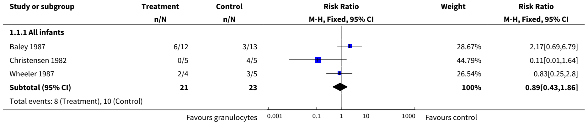
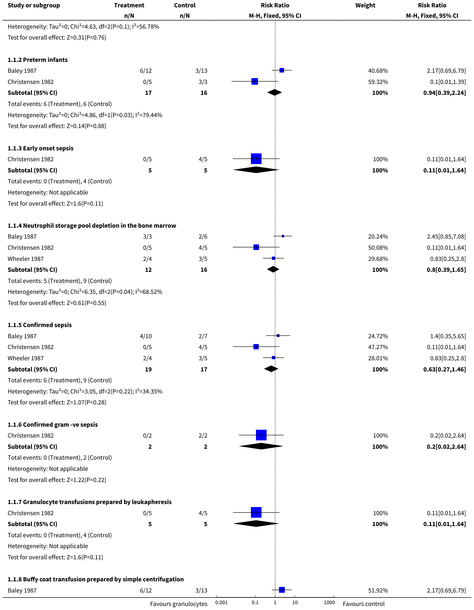
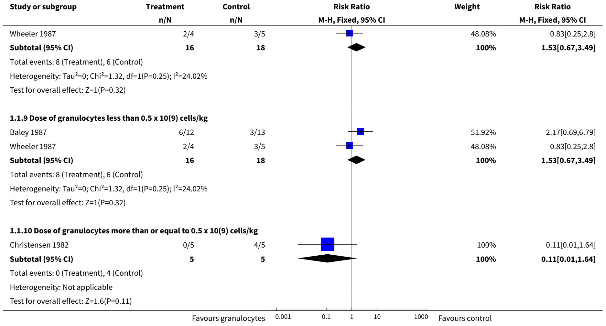
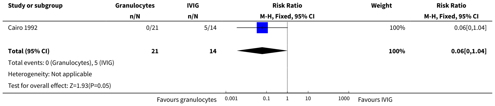

Cochrane Database of Systematic Reviews

# Granulocyte transfusions for neonates with confirmed or suspected sepsis and neutropenia (Review)

Pammi M, Brocklehurst P

Pammi M, Brocklehurst P. Granulocyte transfusions for neonates with confirmed or suspected sepsis and neutropenia. Cochrane Database of Systematic Reviews 2011, Issue 10. Art. No.: CD003956. DOI: [10.1002/14651858.CD003956.pub2](https://doi.org/10.1002/14651858.CD003956.pub2).

[www.cochranelibrary.com](https://www.cochranelibrary.com)

Copyright © 2011 The Cochrane Collaboration. Published by John Wiley & Sons, Ltd.

## TABLE OF CONTENTS

1. [ABSTRACT  1](#p-34)
2. [PLAIN LANGUAGE SUMMARY  2](#p-52)
3. [BACKGROUND  3](#p-55)
4. [OBJECTIVES  4](#p-67)
5. [METHODS  4](#p-82)
6. [RESULTS  6](#p-167)
7. [DISCUSSION  9](#p-250)
8. [AUTHORS' CONCLUSIONS  9](#p-258)
9. [ACKNOWLEDGEMENTS  9](#p-263)
10. [REFERENCES  11](#p-268)
11. [CHARACTERISTICS OF STUDIES  13](#p-359)
12. [DATA AND ANALYSES  17](#p-362)
13. [Analysis 1.1. Comparison 1 Granulocyte transfusion vs placebo or no intervention, Outcome 1 All-cause mortality during hospital stay  17](#Analysis_1_1)
14. [Analysis 2.1. Comparison 2 Granulocyte transfusion vs IVIG, Outcome 1 All cause mortality during hospital stay  19](#Analysis_2_1)
15. [WHAT'S NEW  19](#p-367)
16. [HISTORY  20](#p-368)
17. [CONTRIBUTIONS OF AUTHORS  20](#p-371)
18. [DECLARATIONS OF INTEREST  20](#p-374)
19. [SOURCES OF SUPPORT  21](#p-376)
20. [INDEX TERMS  21](#p-381)

[Intervention Review]

## Granulocyte transfusions for neonates with confirmed or suspected sepsis and neutropenia

Mohan Pammi1, Peter Brocklehurst2

1Section of Neonatology, Department of Pediatrics, Baylor College of Medicine, Houston, Texas, USA.

2National Perinatal Epidemiology Unit, University of Oxford, Headington, UK

Contact: Mohan Pammi, Section of Neonatology, Department of Pediatrics, Baylor College of Medicine, 6621, Fannin, MC.WT 6-104, Houston, Texas, 77030, USA. mohanv@bcm.tmc.edu, suseela12@hotmail.com.

Editorial group: Cochrane Neonatal Group.

Publication status and date: New search for studies and content updated (no change to conclusions), published in Issue 10, 2011.

Citation: Pammi M, Brocklehurst P. Granulocyte transfusions for neonates with confirmed or suspected sepsis and neutropenia. Cochrane Database of Systematic Reviews 2011, Issue 10. Art. No.: CD003956. DOI: [10.1002/14651858.CD003956.pub2](https://doi.org/10.1002/14651858.CD003956.pub2).

Copyright © 2011 The Cochrane Collaboration. Published by John Wiley & Sons, Ltd.

## ABSTRACT

### Background

Neonates have immature granulopoiesis, which frequently results in neutropenia after sepsis. Neutropaenic septic neonates have a higher mortality than non-neutropenic septic neonates. Therefore, granulocyte transfusion to septic neutropenic neonates may improve outcomes.

### Objectives

The primary objective was to determine the effect of granulocyte or buffy coat transfusions as adjuncts to antibiotics, after confirmed or suspected sepsis in neutropenic neonates, on all-cause mortality during hospital stay and neurological outcome at ≥ year of age. Secondary objectives were to determine the effects of granulocyte transfusions on length of hospital stay in survivors to discharge, adverse effects and immunologic outcomes at ≥ year of age.

### Search methods

The Cochrane Central Register of Controlled Trials (The Cochrane Library), MEDLINE, EMBASE and CINAHL, proceedings of the PAS conferences and ongoing trials at clinicaltrials.gov and clinical-trials.com were searched in July 2011.

### Selection criteria

Studies where neutropenic neonates with suspected or confirmed sepsis were randomised or quasi-randomised to granulocyte or buffy coat transfusions at any dose or duration, and reporting any outcome of interest were included.

### Data collection and analysis

Relative risk (RR) and risk difference (RD) with 95% confidence intervals using the fixed effects model were reported for dichotomous outcomes. Pre-specified subgroup analyses were performed.

### Main results

Four trials were eligible for inclusion. Forty-four infants with sepsis and neutropenia were randomised in three trials to granulocyte transfusions or placebo/no transfusion. In another trial, 35 infants with sepsis and neutropenia on antibiotics were randomised to granulocyte transfusion or IVIG.

When granulocyte transfusion was compared with placebo or no transfusion, there was no significant difference in 'all-cause mortality' (three trials; typical RR 0.89, 95% CI 0.43 to 1.86; typical RD -0.05, 95% CI -0.31 to 0.21).

When granulocyte transfusion was compared with intravenous immunoglobulin (one trial), there was a reduction in 'all-cause mortality' of borderline statistical significance (RR 0.06, 95% CI 0.00 to 1.04; RD -0.34, 95% CI -0.60 to -0.09; NNT 2.7, 95% CI 1.6 to 9.1).

Pulmonary complications were the only adverse effect reported in the trials that used buffy coat transfusions. None of the trials reported on neurological outcome at one year of age or later, length of hospital stay in survivors to discharge or immunological outcome at one year of age or later.

### Authors' conclusions

Currently, there is inconclusive evidence from randomised controlled trials (RCTs) to support or refute the routine use of granulocyte transfusions in neutropenic, septic neonates. Researchers are encouraged to conduct adequately powered multi-centre trials of granulocyte transfusions in neutropenic septic neonates.

## PLAIN LANGUAGE SUMMARY

### Granulocyte transfusions for neonates with confirmed or suspected sepsis and neutropenia

More evidence is needed on the effects of granulocyte infusions for babies with sepsis and neutropenia (decreased number of white blood cells). Sepsis is an infection of the blood, caused by bacteria or fungi reaching the bloodstream. It is often fatal when it occurs in newborn babies, especially those born preterm (before 37 weeks). Preterm babies are not yet able to adequately form granulocytes, which are a key part of the immune system's ability to fight infections. Some babies with sepsis, therefore, develop neutropenia (decrease in white blood cells), which makes them more vulnerable. Granulocytes can be infused. However, the review found that there are not enough trials to show the potential benefits or harms of this treatment for newborn babies with sepsis and neutropenia.

## BACKGROUND

### Description of the condition

Neonatal infection (sepsis) is common and has been reported to affect 6.6 babies per 1000 live births (Isaacs 1995). It is one of the major causes of neonatal mortality. The incidence of sepsis is inversely related to birthweight and gestational age. In very low birth weight (VLBW) neonates (birth weight less than 1500 grams), the incidence of culture proven, early onset sepsis (sepsis in the first 72 hrs) is approximately 2% (Stoll 1996a). Of these babies with confirmed infection approximately a quarter will die. In this same group of babies, the incidence of late-onset sepsis (sepsis after the first 72 hrs) ranges from 16 to 25% with a mortality between 17 and 21% (Stoll 1996a; Stoll 1996b; Fanaroff 1998). The rates of early and late onset sepsis have been increasing (Mehr 2002) and acute mortality from sepsis has remained high at 15% for the last two decades (Gladstone 1990). In the United States and Australia, Group B streptococcal infection accounts for approximately one third to one half of early onset infections (Stoll 1996a; Isaacs 1995) and coagulase negative staphylococcal infection for approximately one half of late onset infections (Stoll 1996b). The pattern of organisms causing early onset sepsis is changing as a result of use of antibiotics in mothers to prevent group B streptococcal infection. A predominance of gram negative organisms, especially E. coli, has been observed in VLBW infants (Stoll 2002). Sepsis has also been implicated in the development of cerebral palsy both in preterm and term infants. Neonatal sepsis in preterm infants increases the risk of cerebral palsy fourfold (Wheater 2000), and exposure to maternal infection during labour increases the risk of cerebral palsy nine fold in infants born at term (Grether 1997).

The diagnosis of sepsis is based on clinical parameters, positive microbiological cultures or both. Antibiotics remain the mainstay of treatment for neonatal sepsis, but antibiotic resistance is an emerging global problem (Levy 1998). As a consequence, newer adjuncts to antibiotics have been sought to reduce the mortality and morbidity associated with neonatal sepsis.

### Description of the intervention

Granulocyte transfusions in septic and neutropenic neonates may be a useful strategy to reduce mortality and improve neurological outcome. Granulocytes are prepared in a concentrated form for transfusion to reduce the volume of the transfusion. Granulocyte concentrates are prepared by leukophoresis or by centrifugation of whole blood (buffy coats). Buffy coats for transfusion are easier to prepare but contain a lower dose of granulocytes. They have been shown to be less effective in reducing mortality than granulocyte concentrates prepared by leukopheresis in infected neutropenic adults (Reiss 1982). In a non-randomised study of 20 newborns with blood-culture proven sepsis, the majority of whom had antibiotic resistant Klebsiella infection, there was a significant reduction in mortality in the group who were transfused with granulocytes compared with those who were not (mortality 10% versus 72%). This effect was more pronounced in VLBW neonates (mortality 10% versus 91%) (Laurenti 1981).

Vamvakas 1996 reported a meta-analysis of trials of granulocyte transfusions in adults and neonates. All trials published between 1970 to 1994, that were in English and had a control group were included. Randomisation was not a selection criterion. Results were analysed using the random effects method. When controlled trials in neonates were analysed, granulocyte transfusion did not significantly reduce mortality. However, not all participants in these trials were randomised and some trials included non-randomised infants. This review includes only randomised trials published after 1994. In adult trials, granulocyte transfusions significantly reduced mortality in the following situations; low survival rate of controls (survival rate < 40%), transfusion of adequate dose of granulocytes (more than 10 to the power 10 granulocytes) and when compatibility of granulocytes was assessed prior to the transfusion. This information may be useful in assessing the efficacy and safety of granulocyte transfusions in specific neonatal subgroups (e.g. neonates with gram-negative sepsis or fungal sepsis who have a lower survival rate, neonates who had an adequate dose of granulocytes of more than or equal to 10 to the power 9 cells/kg, among others).

### How the intervention might work

The immaturity of the immune system, especially humoral and phagocytic immunity, predisposes neonates to an increased incidence of sepsis caused by bacteria and fungi. Neonatal neutrophils exhibit both quantitative and qualitative abnormalities. Neutropaenia, defined as a neutrophil count below the lower range of normal, is commonly found in small for gestational age (SGA) neonates and commonly noted as a consequence of sepsis. Neutrophil kinetics in septic newborn animals have been reviewed (al-Mulla 1995). When newborn animals are inoculated with a non-lethal dose of bacteria, neutrophilia occurs after a latent period of three to five hours associated with a reduction in bone marrow storage pool of neutrophils (al-Mulla 1995). However, in contrast to adult animals after similar inoculations, no increase in neutrophil production is observed (al-Mulla 1995). Newborn animals inoculated with a lethal dose of bacteria occasionally develop a transient neutrophilia after a latent period of three to five hours, but usually develop a rapid neutropenia that precedes death and is accompanied by an exhaustion of bone marrow neutrophil reserves and no increase in neutrophil production (al-Mulla 1995). Septic neonates who are neutropenic have a higher mortality than non-neutropenic neonates (Rodwell 1993). Neonates also have an immaturity of neutrophil function and production. Immaturity of granulopoiesis in preterm neonates is manifest by a low neutrophil cell mass, a reduced capacity for increasing progenitor cell proliferation and frequent occurrence of neutropenia in response to sepsis (Carr 2000). There may be reduced ability of neonatal neutrophils in signal transduction, cell surface receptor up regulation, mobility, cytoskeletal rigidity, microfilament contraction, oxygen metabolism and intracellular oxidant mechanisms (Hill 1987).

Preparation of granulocyte concentrates can be time consuming, taking several hours, and their availability soon after the diagnosis of sepsis could be an important factor determining efficacy in reducing mortality and morbidity. The potential complications of leukocyte transfusions in neonates may be fluid overload, transmission of blood-borne infection, graft versus host disease (GVHD) from mature lymphocytes in the transfusion, pulmonary complications secondary to leukocyte aggregation and sequestration, and sensitisation to donor erythrocyte and leukocyte antigens (Hill 1991). Presence of preformed anti-leukocyte antibodies in the recipient has been shown to be associated with reduced half-life of transfused granulocytes (McCullough 1986). Leukocyte alloantibodies may also play a role in febrile and pulmonary transfusion reactions (McCullough 1983). However, these antibodies may have less relevance in infants, as infants do not easily produce alloantibodies against blood cell antigens (Floss 1985). Long-term immunological follow-up (6 to 23 months) for humoral, cell-mediated and phagocytic immunity in infants who received granulocyte transfusions in the first three weeks after birth for neonatal sepsis has not shown any adverse outcomes (Stegagno 1985).

### Why it is important to do this review

The availability of more effective antibiotics, recombinant hematopoetic growth factors to counter neutropenia, the risk of transmission of infection and the necessity for appropriate technology are some of the factors that have dampened the initial enthusiasm and promise of granulocyte transfusions (Chanock 1996). However, with the availability of recombinant hematopoetic growth factors, harvesting granulocytes from donors in relatively large quantities is feasible and these granulocytes may have a longer half-life (Engelfriet 2000). These technological advances in harvesting granulocytes and reducing the risk for transmission of infection have rekindled interest in granulocyte transfusions in neutropenic patients, especially in patients with cancer (Sachs 2006; Grigull 2006a; Grigull 2006b; Cesaro 2003). The following systematic review will evaluate the role of granulocyte transfusions as an adjunct to antibiotics in the treatment of neutropenic septic newborns, and will attempt to clarify the effect of granulocyte transfusions in specific situations.

## OBJECTIVES

Primary objective:  
To determine the effect of granulocyte preparations (granulocyte and buffy coat transfusions) as an adjunct to antibiotics for the treatment of confirmed or suspected sepsis in neonates with neutropenia on mortality during hospital stay and adverse neurological outcome at a year of age or later.

Secondary objectives:  
To determine the effect of granulocyte transfusions as an adjunct to antibiotics in neonates with confirmed or suspected sepsis and neutropenia on:

• length of hospital stay in survivors to discharge

• adverse effects (fluid overload, transmission of blood borne infections, pulmonary complications and sensitisation to donor leukocyte antigens)

• immunologic outcomes at a year of age or later

Planned subgroup analyses: to determine the influence on efficacy and safety of granulocyte transfusions in this population of the following:

• gestational age (preterm, term)

• depletion of neutrophil storage pool

• confirmed sepsis

• confirmed sepsis with gram negative organisms

• confirmed sepsis with fungi

• early or late onset sepsis

• type of granulocyte preparation (granulocyte concentrates, buffy coat transfusions)

• dose of granulocytes transfused (less than 0.5 x \(10^{9}\)/kg OR more than or equal to 0.5 x \(10^{9}\)/kg)

## METHODS

### Criteria for considering studies for this review

#### Types of studies

Randomised or quasi-randomised controlled trials

#### Types of participants

Neonates with neutropenia and confirmed or suspected sepsis, on antibiotics, born at any gestational age or birth weight.

Confirmed sepsis is defined as microbiologically proven infection with a positive blood culture, CSF culture, urine culture (obtained by suprapubic tap) or culture from a normally sterile site (e.g. pleural fluid or peritoneal fluid) for bacteria or fungi. Suspected sepsis is defined as clinical signs and symptoms consistent with infection without isolation of a causative organism.

Neutropenia is defined as neutrophil count less than 1700/microL (Manroe 1979).

Key subgroups of participants will be based on:

1. Gestational age:  
a) preterm infants (defined as infants born at less than 37 completed weeks of gestational age);  
b) term infants (defined as infants born at or after 37 completed weeks of gestational age).

2. Postnatal age at onset of sepsis  
a) early onset sepsis (< 72 hours after birth);  
b) late onset sepsis (72 hours or more after birth).

3. Depletion of bone marrow neutrophil storage pool - defined as less than or equal to 7% postmitotic cells, which include polymorphonuclear neutrophils, band cells and metamyelocytes among the nucleated bone marrow cells:  
a) neonates with depleted neutrophil storage pool;  
b) neonates without depletion of neutrophil storage pool.

4. Infants with confirmed sepsis:  
a) infants with confirmed bacterial sepsis;  
b) infants with confirmed gram negative sepsis;  
c) infants with confirmed fungal sepsis.

#### Types of interventions

Granulocyte transfusions (granulocyte concentrates and buffy coat preparations) as adjuncts to antibiotics at any dose and using any number of transfusions, compared to placebo or no granulocyte transfusion. Granulocyte transfusions will also be compared with any other adjuncts to antibiotics to treat confirmed or suspected neonatal sepsis in separate comparisons.

Subgroups of intervention will be based on:

1. method of preparation of neutrophils for infusion;  
a) granulocyte transfusions;  
b) buffy coat transfusions.

2. Dose of neutrophils transfused:  
a) dose of neutrophils transfused less than to 0.5 x \(10^{9}\)/kg;  
b) dose of neutrophils transfused more than or equal to 0.5 x \(10^{9}\)/kg.

#### Types of outcome measures

#### Primary outcomes

1. All-cause mortality during initial hospital stay;

2. Neurological outcome at one year of age or later (neurodevelopmental outcome assessed by any validated test).

#### Secondary outcomes

1. Length of hospital stay in days in survivors at discharge;

2. Adverse effects attributable to granulocyte transfusions - fluid overload, transmission of blood-borne infections, pulmonary complications, sensitisation to donor leukocyte antigens during hospital stay and during the first year of life;

3. Immunological outcome at one year or more (assessed by a standard test to evaluate humoral, cell-mediated or phagocytic immunity, e.g. evaluation of serum immunoglobulin levels, T-cell number and lymphocyte blastic response to antigens, phagocytic index testing etc.).

#### Definitions of adverse outcomes:

• fluid overload as assessed by clinical signs and symptoms;

• transmission of blood-borne infections (e.g. cytomegalovirus infection, HIV infection, hepatitis B and C infections) detected by appropriate tests;

• pulmonary complications - acute deterioration in lung function related (in time) to the granulocyte transfusions, with or without radiographic changes;

• sensitisation to donor leukocyte antigens identified by febrile transfusion reactions, pulmonary complications or by an appropriate serological test.

### Search methods for identification of studies

We used the Cochrane Neonatal Review Group's search strategy. We searched relevant trials in any language in July 2011 in the following databases:

1. The Cochrane Central Register of Controlled (CENTRAL, The Cochrane Library, Issue 2, 2011)

2. Electronic journal reference databases -  
MEDLINE (1966 - present) and PREMEDLINE  
EMBASE (1980 - present)  
CINAHL (1982 - present)

3. Abstracts of conferences - Proceedings of the Pediatric Academic Societies (American Pediatric Society, Society for Pediatric Research) and the European Society for Paediatric Research. The authors of identified abstracts published in Pediatric Research (1987 - July 2011) were searched in the journal Pediatric research and Abstractsonline. Conference proceedings were also searched using BIOSIS biological abstracts (1981 - July 2011).

4. Ongoing registered trials at clinicaltrials.gov and clinical-trials.com were searched.

5. Communication with authors for more information on relevant published articles or abstracts and with other prominent authors in the field for possible unpublished articles was carried out. However, no abstracts identified by our search strategy could be included as none fulfilled our selection criteria. No unpublished articles were identified.

6. Additional searches were made in the reference lists of identified clinical trials and in the reviewer's personal files.

Search strategy for MEDLINE AND PREMEDLINE and was adapted to suit EMBASE, CINAHL and the Cochrane Controlled Trials Register

#1 Explode 'granulocytes' [MESH heading] /all subheadings

#2 Explode 'Leukocyte-transfusion' [MESH heading]/all subheadings

#3 Search granulocyt*near transfusion*

#4 Search buffy coat near transfusion*

#5 Search leukocyt* near transfusion*

#6 Search leucocyt* near transfusion*

#7 Search neutrophil* near transfusion*

#8 #1 OR #2 OR #3 OR #4 OR #5 OR #6 OR #7

#9 Explode 'Infant-Newborn' [MESH heading]/ all subheadings

#10 neonat*

#11 #9 OR #10

# 12 #8 AND #11

#13 #12 and (TG=HUMAN)

No language restriction was applied

### Data collection and analysis

The standard methods of the Cochrane Neonatal Review Group Guidelines were employed in creating this update.

#### Selection of studies

The titles and the abstracts of studies identified by the search strategy were independently assessed for eligibility to be included into the review by the two review authors. If this could not be done reliably, the full text version was obtained for assessment. Differences were resolved by discussion.

#### Data extraction and management

The full text versions of all eligible studies were obtained. Forms were designed for trial inclusion/exclusion, data extraction and for requesting additional unpublished information from authors of the original reports. Data extraction was done independently by the reviewers using specifically designed paper forms and compared for any differences, which were resolved by discussion.

#### Assessment of risk of bias in included studies

The standardized review methods of the Cochrane Neonatal Review Group (CNRG) were used to assess the methodological quality of the studies. An assessment of the quality of the included studies was done by the two reviewers independently using the standard criteria developed by the CNRG.

The reviewers independently assessed risk of bias for each study using the criteria outlined in the Cochrane Handbook for Systematic Reviews of interventions (Higgins 2011). Disagreements were resolved by discussion.

We completed the Risk of Bias table addressing the following methodological issues:

1. Sequence generation: Was the allocation sequence adequately generated? For each included study we described the method used to generate the allocation sequence. We assessed the methods as:

low risk (any truly random process, e.g. random number table; computer random number generator); high risk (any non-random process, e.g. odd or even date of birth; hospital or clinic record number); unclear risk.

2. Allocation concealment: Was allocation adequately concealed? For each included study, we described the method used to conceal the allocation sequence and determined whether intervention allocation could have been foreseen in advance of, or during recruitment, of changed after assignment. We assessed the methods as:

low risk (e.g. telephone or central randomisation; consecutively numbered sealed opaque envelopes); high risk (open random allocation; unsealed or non-opaque envelopes, alternation; date of birth); unclear risk.

3. Blinding of participants, personnel and outcome assessors: Was knowledge of the allocated intervention adequately prevented during the study? For each included study, we categorized the methods used to blind study participants and personnel from knowledge of which intervention a participant received. Blinding was assessed separately for different outcomes or classes of outcomes. We categorized the methods as:

- low risk, high risk or unclear risk for participants;

- low risk, high risk or unclear risk for personnel;

- low risk, high risk or unclear risk for outcome assessors.

4. Incomplete outcome data: Were incomplete outcome data adequately addressed? For each included study and for each outcome, we described the completeness of data including attrition and exclusions from the analysis. We stated whether attrition and exclusions were reported, the numbers included in the analysis at each stage (compared with the total randomised participants), reasons for attrition or exclusion where reported, and whether missing data were balanced across groups or were related to outcomes. We assessed the methods as: low risk; high risk; unclear risk.

5. Selective outcome reporting: Are reports of the study free of suggestion of selective outcome reporting? For each included study we described how we examined the possibility of selective outcome reporting bias and what we found. We assessed the methods as:

low risk (where it is clear that all of the study's pre-specified outcomes and all expected outcomes of interest to the review have been reported); high risk (where not all the study's pre-specified outcomes have been reported; one or more reported primary outcomes were not pre-specified; outcomes of interest are reported incompletely and so cannot be used; study fails to include results of a key outcome that would have been expected to have been reported); unclear risk.

6. Other sources of bias: Was the study apparently free of other problems that could put it at a high risk of bias? For each included study, we described any important concerns regarding other possible sources of bias. We assessed whether each study was free of other problems that could put it at risk of bias: low risk; high risk; unclear risk.

#### Measures of treatment effect

The statistical analyses were performed according to the recommendations of the CNRG. Planned analyses were undertaken for the subgroups defined under the 'Criteria for considering studies for the review'. All randomised infants were analysed irrespective of whether or not they survived to receive their allocated treatment in full, or for some other reason were not able to complete their allocated treatment (intention to treat). The treatment effects in the individual trials were analysed. The statistical package RevMan provided by the Cochrane Collaboration was used. Relative risk (RR), risk difference (RD) (and number needed to treat (NNT) where appropriate) with 95% confidence intervals (CI) are reported for dichotomous outcomes. Continuous data were analysed using weighted mean difference (WMD). The 95% Confidence interval (CI) was reported on all estimates.

#### Assessment of heterogeneity

We estimated the treatment effects of individual trials and examine heterogeneity between trials by inspecting the forest plots and quantifying the impact of heterogeneity using the I-squared statistic. If we detected statistical heterogeneity, we planned to explore the possible causes (for example, differences in study quality, participants, intervention regimens, or outcome assessments) using post hoc subgroup analyses. We planned to use a fixed effects model for meta-analysis.

#### Data synthesis

The meta-analysis was performed using Review Manager software (RevMan 5), supplied by the Cochrane Collaboration. For estimates of typical relative risk and risk difference, we used the Mantel-Haenszel method. For measured quantities, we used the inverse variance method. All meta-analyses were done using the fixed effect model.

#### Subgroup analysis and investigation of heterogeneity

Subgroups of intervention will be based on:  
1. method of preparation of neutrophils for infusion;  
a) granulocyte transfusions;  
b) buffy coat transfusions.

2. Dose of neutrophils transfused:  
a) dose of neutrophils transfused less than to 0.5 x \(10^{9}\)/kg;  
b) dose of neutrophils transfused more than or equal to 0.5 x \(10^{9}\)/kg.

## RESULTS

### Description of studies

## CHARACTERISTICS OF STUDIES

### Characteristics of included studies [ordered by study ID]

<table class="study-table" id="Baley_1987">
<caption data-paragraph="169" data-source-pages="15" id="p-169">Baley 1987</caption>
<colgroup><col/><col/><col/></colgroup>
<tbody>
<tr data-row="0"><th scope="row">Methods</th><td colspan="2">Randomised controlled trial Blinding of intervention- no Blinding of outcome assessment- no Completeness of follow-up- yes</td></tr>
<tr data-row="1"><th scope="row">Participants</th><td colspan="2">Entry criteria: neonates with neutropenia (neutrophil count less than 1500 /microL) and clinical signs of fulminant sepsis: shock, requiring mechanical ventilation or confirmed NEC  25 infants were enrolled: 12 had granulocyte transfusions and 13 did not have granulocyte transfusion</td></tr>
<tr data-row="2"><th scope="row">Interventions</th><td colspan="2">Buffy coats prepared by simple centrifugation of single units of whole blood stored at 22 C for a maximum of 24 hr Dose: 0.1 to 0.9 x 10 to the power 9 granulocytes/kg and a mean of 0.35 x 10 to the power 9 granulocytes/kg given once a day over 1-2 hr until absolute neutrophil count &gt; 1500/microL versus No granulocyte transfusion</td></tr>
<tr data-row="3"><th scope="row">Outcomes</th><td colspan="2">Short-term survival (survival of the illness precipitating the neutropenia) and longer term survival (survival till hospital discharge)</td></tr>
<tr data-row="4"><th scope="row">Notes</th><td colspan="2">Period of study: June 1983 to November 1984 Place of study: Cleveland, USA</td></tr>
<tr><th class="risk-heading" colspan="3">Risk of bias</th></tr>
<tr><th scope="col">Bias</th><th scope="col">Authors' judgement</th><th scope="col">Support for judgement</th></tr>
<tr data-row="5"><th scope="row">Allocation concealment (selection bias)</th><td>Unclear risk</td><td>Unclear</td></tr>
<tr data-row="6"><th scope="row">Blinding (performance bias and detection bias) All outcomes</th><td>High risk</td><td>No blinding of intervention</td></tr>
<tr data-row="7"><th scope="row">Blinding of participants and personnel (performance bias) All outcomes</th><td>High risk</td><td>No blinding of intervention</td></tr>
<tr data-row="8"><th scope="row">Blinding of outcome assessment (detection bias) All outcomes</th><td>Low risk</td><td>Short-term and long-term survival were the outcomes studied</td></tr>
<tr class="continuation"><th colspan="3" data-paragraph="170" data-source-pages="16" id="p-170">Baley 1987 (Continued)</th></tr>
<tr data-row="9"><th scope="row">Incomplete outcome data (attrition bias) All outcomes</th><td>Low risk</td><td>Outcomes were reported for all infants</td></tr>
</tbody>
</table>

<table class="study-table" id="Cairo_1992">
<caption data-paragraph="171" data-source-pages="16" id="p-171">Cairo 1992</caption>
<colgroup><col/><col/><col/></colgroup>
<tbody>
<tr data-row="0"><th scope="row">Methods</th><td colspan="2">Randomised controlled trial Blinding of intervention-no Blinding of outcome assessment - no Completeness of follow-up -yes</td></tr>
<tr data-row="1"><th scope="row">Participants</th><td colspan="2">Entry criteria: age 28 days or less, weight more than or equal to 800g, neutropenia defined as &lt; 1700/ microL and clinical signs of sepsis [requiring at least one of the following; positive blood culture, positive cerebrospinal fluid gram stain or culture, chest radiograph consistent with lobar pneumonia, or clinical features consistent with necrotising enterocolitis. Infants lacking these criteria could still be entered in the study if at least 2 major or one major and 2 minor findings of sepsis were present. Major criteria included unexplained hypotension, lethargy, unexplained respiratory failure, or significant thrombocytopaenia (&lt; or = to 100,000 cells/cubic mm. Minor criteria included a history of maternal amnionitis, maternal fever, fetal tachycardia (&gt; or = 160 beats/min), or prolonged rupture of the membranes (&gt; or = to 24 hr) ] Participants were randomised in a 3:2 ratio to granulocyte transfusions or IVIG: 21 infants had granulocyte transfusions and 14 had intravenous immunoglobulin</td></tr>
<tr data-row="2"><th scope="row">Interventions</th><td colspan="2">Granulocytes were prepared by continuous flow leukapheresis Dose: 15 ml/kg given every 12h for 5 doses irrespective of the post transfusion neutrophil count versus Intravenous immune globulin (Gammimmune N) 5% Ig Dose: 1g/kg/dose given over 4-6 hr per day for 3 days</td></tr>
<tr data-row="3"><th scope="row">Outcomes</th><td colspan="2">Mortality and neurological morbidity during hospital stay</td></tr>
<tr data-row="4"><th scope="row">Notes</th><td colspan="2">Place of study: California, USA</td></tr>
<tr><th class="risk-heading" colspan="3">Risk of bias</th></tr>
<tr><th scope="col">Bias</th><th scope="col">Authors' judgement</th><th scope="col">Support for judgement</th></tr>
<tr data-row="5"><th scope="row">Allocation concealment (selection bias)</th><td>Unclear risk</td><td>Unclear</td></tr>
<tr data-row="6"><th scope="row">Blinding (performance bias and detection bias) All outcomes</th><td>High risk</td><td>No blinding of the intervention</td></tr>
<tr data-row="7"><th scope="row">Blinding of participants and personnel (performance bias) All outcomes</th><td>High risk</td><td>No blinding of the intervention</td></tr>
<tr data-row="8"><th scope="row">Blinding of outcome assessment (detection bias) All outcomes</th><td>High risk</td><td>No blinding of outcome assessment</td></tr>
<tr class="continuation"><th colspan="3" data-paragraph="172" data-source-pages="17" id="p-172">Cairo 1992 (Continued)</th></tr>
<tr data-row="9"><th scope="row">Incomplete outcome data (attrition bias) All outcomes</th><td>Low risk</td><td>Outcomes were reported for all infants</td></tr>
</tbody>
</table>

<table class="study-table" id="Christensen_1982">
<caption data-paragraph="173" data-source-pages="17" id="p-173">Christensen 1982</caption>
<colgroup><col/><col/><col/></colgroup>
<tbody>
<tr data-row="0"><th scope="row">Methods</th><td colspan="2">Randomised controlled trial Blinding of intervention- no Blinding of outcome assessment - no Completeness of follow-up -yes</td></tr>
<tr data-row="1"><th scope="row">Participants</th><td colspan="2">Entry criteria: Sepsis as per defined criteria, neutropenia of &lt; 1700/microL (Manroe 1979) and bone marrow examination showing a NSP depletion of &lt; 7%  10 infants were randomised: 5 infants received granulocyte transfusions and 5 did not receive granulocyte transfusion</td></tr>
<tr data-row="2"><th scope="row">Interventions</th><td colspan="2">Granulocytes were prepared by intermittent flow centrifugation leukapheresis Dose: 10-15 ml/kg over 45 minutes given over 45 minutes, every 12 hr till neutrophil counts were normal. The dose was 0.2- 1.0 with a mean of 0.7 x 10 to the power 9 granulocytes/kg</td></tr>
<tr data-row="3"><th scope="row">Outcomes</th><td colspan="2">Mortality and adverse effects</td></tr>
<tr data-row="4"><th scope="row">Notes</th><td colspan="2">Period of study- April 1979- March 1981 Place of study- Utah, USA All infants had early onset sepsis</td></tr>
<tr><th class="risk-heading" colspan="3">Risk of bias</th></tr>
<tr><th scope="col">Bias</th><th scope="col">Authors' judgement</th><th scope="col">Support for judgement</th></tr>
<tr data-row="5"><th scope="row">Allocation concealment (selection bias)</th><td>Unclear risk</td><td>Unclear</td></tr>
<tr data-row="6"><th scope="row">Blinding (performance bias and detection bias) All outcomes</th><td>High risk</td><td>No blinding of intervention</td></tr>
<tr data-row="7"><th scope="row">Blinding of participants and personnel (performance bias) All outcomes</th><td>High risk</td><td>No blinding of intervention</td></tr>
<tr data-row="8"><th scope="row">Blinding of outcome assessment (detection bias) All outcomes</th><td>Unclear risk</td><td>No blinding of outcome assessment</td></tr>
<tr data-row="9"><th scope="row">Incomplete outcome data (attrition bias) All outcomes</th><td>Low risk</td><td>Outcomes were reported for all infants</td></tr>
</tbody>
</table>

<table class="study-table" id="Wheeler_1987">
<caption data-paragraph="174" data-source-pages="17" id="p-174">Wheeler 1987</caption>
<colgroup><col/><col/><col/></colgroup>
<tbody>
<tr data-row="0"><th scope="row">Methods</th><td colspan="2">Randomised controlled trial Blinding of intervention - unclear Blinding of outcome assessment - yes Completeness of follow-up - yes</td></tr>
<tr class="continuation"><th colspan="3" data-paragraph="175" data-source-pages="18" id="p-175">Wheeler 1987 (Continued)</th></tr>
<tr data-row="1"><th scope="row">Participants</th><td colspan="2">Eligibility criteria: infants less than 30 days of age, neutropenic (neutrophil count &lt; 1500/microL on 2 samples) and had clinical sepsis and positive cultures.  9 infants were randomised: 4 infants received buffy coat transfusions and 5 received FFP/deglycerolised RBCs</td></tr>
<tr data-row="2"><th scope="row">Interventions</th><td colspan="2">Buffy coats prepared from single donors. Dose was 15ml/kg given over 2 hr till neutrophil count was &gt; 1500/microL. The dose was 0.3 to 0.7 with a mean of 0.4 x 10p9 granulocytes/kg versus 15ml/kg of deglycerolised RBCs or FFP</td></tr>
<tr data-row="3"><th scope="row">Outcomes</th><td colspan="2">Peripheral neutrophil counts, mortality for seven days or less in relation to the episode requiring the intervention and adverse effects</td></tr>
<tr data-row="4"><th scope="row">Notes</th><td colspan="2">Place of study: North Carolina, USA</td></tr>
<tr><th class="risk-heading" colspan="3">Risk of bias</th></tr>
<tr><th scope="col">Bias</th><th scope="col">Authors' judgement</th><th scope="col">Support for judgement</th></tr>
<tr data-row="5"><th scope="row">Allocation concealment (selection bias)</th><td>Unclear risk</td><td>Unclear</td></tr>
<tr data-row="6"><th scope="row">Blinding (performance bias and detection bias) All outcomes</th><td>Unclear risk</td><td>Unclear whether blinded for intervention</td></tr>
<tr data-row="7"><th scope="row">Blinding of participants and personnel (performance bias) All outcomes</th><td>Unclear risk</td><td>Unclear whether blinded for intervention</td></tr>
<tr data-row="8"><th scope="row">Blinding of outcome assessment (detection bias) All outcomes</th><td>Low risk</td><td>Blinded for outcome assessment</td></tr>
<tr data-row="9"><th scope="row">Incomplete outcome data (attrition bias) All outcomes</th><td>Low risk</td><td>Outcomes were reported for all infants</td></tr>
</tbody>
</table>

Details of the included studies are provided in the table "Characteristics of Included Studies". Four small studies met the inclusion criteria (Christensen 1982; Wheeler 1987; Baley 1987; Cairo 1992).

Christensen 1982 randomised 10 infants who had predefined clinical and laboratory criteria for sepsis, neutropenia (defined as < 1700/microL, Manroe 1979) and neutrophil storage pool (NSP) depletion in the bone marrow to granulocyte transfusions obtained by intermittent flow centrifugation leukophoresis or to no granulocyte transfusions. All infants had early onset sepsis. Adverse effects due to granulocyte transfusions and mortality were reported for each group.

Wheeler 1987 randomised nine infants who had proven sepsis, neutropenia (< 1500/ microL) and NSP depletion in the bone marrow to buffy coat transfusions or to fresh frozen plasma (FFP)/ deglycerolised red blood cells (RBCs). Outcomes reported were mortality and adverse effects.

Baley 1987 randomised 25 infants who had suspected sepsis and neutropenia (defined as neutrophil count < 1500 /microL on two consecutive samples) to buffy coat transfusions until neutrophil count rose over 1500/microL or to no granulocyte transfusion. Outcomes reported were short-term survival (survival of the illness requiring the transfusion), survival till discharge and adverse effects.

Cairo 1992 randomised 35 infants with sepsis (diagnosis requiring at least one of the following; positive blood culture, positive cerebrospinal fluid gram stain or culture, chest radiograph consistent with lobar pneumonia, or clinical features consistent with necrotising enterocolitis). Infants lacking these criteria could still be entered in the study if at least two major or one major and two minor findings of sepsis were present. Major criteria included unexplained hypotension, lethargy, unexplained respiratory failure, or significant thrombocytopaenia (< or = to 100,000 cells/cubic mm). Minor criteria included a history of maternal amnionitis, maternal fever, fetal tachycardia (> or = 160 beats/min), or prolonged rupture of the membranes (> or = to 24 hr)] and neutropenia (defined as < 1700/ microL, Manroe 1979) to granulocyte transfusions or to intravenous immunoglobulin (IVIG). Outcomes reported were mortality and neurological morbidity before discharge. Details of outcomes for the subgroups of participants as detailed under 'Criteria for considering studies for this review' were requested from the authors but were unavailable.

### Excluded studies

<table class="" id="Characteristics_of_excluded_studies">
<caption data-paragraph="361" data-source-pages="18" id="p-361">Characteristics of excluded studies [ordered by study ID]</caption>
<colgroup><col/><col/></colgroup>
<thead><tr><th scope="col">Study</th><th scope="col">Reason for exclusion</th></tr></thead>
<tbody>
<tr data-row="0"><td>Cairo 1987</td><td>Neutropenia was not an entry criterion and thus this study did not fulfil eligibility criteria.</td></tr>
<tr data-row="1"><td>Laing 1983</td><td>Not a randomised or quasi randomised controlled trial</td></tr>
<tr data-row="2"><td>Laurenti 1979</td><td>Not a randomised or quasi randomised controlled trial</td></tr>
<tr data-row="3"><td>Laurenti 1980</td><td>Not a randomised or quasi randomised controlled trial</td></tr>
</tbody>
</table>

The following four studies were excluded.

#### Cairo 1987

Thirty-five infants with sepsis were randomised to granulocyte transfusions or to antibiotics alone. Neutropaenia was not an entry criterion, although 20/35 infants had neutropenia. The following outcomes were reported: mortality, adverse effects and neurological morbidity before discharge. Outcome data limited to the neutropenic infants were not available.

#### Laing 1983

Six infants who had septicaemia resistant to antibiotic treatment were given buffy coat transfusions prepared from a single donor. The outcomes reported were mortality, adverse effects, full blood counts before and after the transfusion, mean plasma values of urea, electrolytes, creatinine, alanine aminotransferase, protein and albumin. This study was excluded as it was not a randomised or a quasi-randomised controlled trial.

#### Laurenti 1979

Eleven premature neonates (birthweight 820 to 1200 g and gestational age 25 to 29 weeks) who had confirmed sepsis were given granulocyte transfusions prepared by leukophoresis. Most of these infants had antibiotic resistant Klebsiella sepsis. Six infants who had a mean of one unit per 2.2 symptomatic days were compared with five infants who received one unit of granulocyte transfusions per six symptomatic days. Mortality and adverse effects were reported. This study was not a randomised or a quasi-randomised trial (communication with the author) and, therefore, this study was excluded.

#### Laurenti 1980

Twenty-five newborns with bacterial sepsis received granulocyte transfusions prepared by leukophoresis. They were compared with 40 septic newborns who did not receive granulocyte transfusions. Outcomes of mortality, adverse effects, complications of sepsis (namely NEC), meningitis, pneumonia, peritonitis, osteoarthritis and disseminated intravascular coagulation were reported. This study was not a randomised or a quasi-randomised trial (communication with the author) and, therefore, was excluded.

### Risk of bias in included studies

#### Christensen 1982

Randomisation was achieved by "drawing a card from an array of transfusion/no transfusion decisions". Blinding of randomisation was unclear. There was no blinding of the intervention or blinding of outcome assessment. All infants randomised were followed up.

#### Wheeler 1987

No details of the randomisation procedure are provided and blinding of randomisation was unclear. Blinding of the intervention was unclear. There was a placebo infusion in the control group but details of this were not available. All patients who were randomised were followed up.

#### Baley 1987

Randomisation was achieved by "drawing cards from sealed envelopes" and blinding of randomisation was not clear. There was no blinding of the intervention or blinding of outcome assessment. Outcomes were reported for all randomised infants.

#### Cairo 1992

No details of randomisation were available and blinding of randomisation was unclear. There was no blinding of intervention or blinding of outcome measurement. Complete follow-up of all randomised infants was achieved.

### Effects of interventions

Four trials were identified. Forty-four infants with sepsis and neutropenia on antibiotics were randomised in three trials to granulocyte transfusions or placebo/no transfusion. In another trial, thirty-five infants with sepsis and neutropenia on antibiotics were randomised to granulocyte transfusion or intravenous immunoglobulin.

## DATA AND ANALYSES

<table class="comparison-table" id="Comparison_1">
<caption data-paragraph="363" data-source-pages="19" id="p-363">Comparison 1. Granulocyte transfusion vs placebo or no intervention</caption>
<colgroup><col/><col/><col/><col/><col/></colgroup>
<thead><tr><th scope="col">Outcome or subgroup title</th><th scope="col">No. of studies</th><th scope="col">No. of participants</th><th scope="col">Statistical method</th><th scope="col">Effect size</th></tr></thead>
<tbody>
<tr data-row="0"><td>1 All-cause mortality during hospital stay</td><td>3</td><td></td><td>Risk Ratio (M-H, Fixed, 95% CI)</td><td>Subtotals only</td></tr>
<tr data-row="1"><td>1.1 All infants</td><td>3</td><td>44</td><td>Risk Ratio (M-H, Fixed, 95% CI)</td><td>0.89 [0.43, 1.86]</td></tr>
<tr data-row="2"><td>1.2 Preterm infants</td><td>2</td><td>33</td><td>Risk Ratio (M-H, Fixed, 95% CI)</td><td>0.94 [0.39, 2.24]</td></tr>
<tr data-row="3"><td>1.3 Early onset sepsis</td><td>1</td><td>10</td><td>Risk Ratio (M-H, Fixed, 95% CI)</td><td>0.11 [0.01, 1.64]</td></tr>
<tr data-row="4"><td>1.4 Neutrophil storage pool depletion in the bone marrow</td><td>3</td><td>28</td><td>Risk Ratio (M-H, Fixed, 95% CI)</td><td>0.80 [0.39, 1.65]</td></tr>
<tr data-row="5"><td>1.5 Confirmed sepsis</td><td>3</td><td>36</td><td>Risk Ratio (M-H, Fixed, 95% CI)</td><td>0.63 [0.27, 1.46]</td></tr>
<tr data-row="6"><td>1.6 Confirmed gram -ve sepsis</td><td>1</td><td>4</td><td>Risk Ratio (M-H, Fixed, 95% CI)</td><td>0.2 [0.02, 2.64]</td></tr>
<tr data-row="7"><td>1.7 Granulocyte transfusions prepared by leukapheresis</td><td>1</td><td>10</td><td>Risk Ratio (M-H, Fixed, 95% CI)</td><td>0.11 [0.01, 1.64]</td></tr>
<tr data-row="8"><td>1.8 Buffy coat transfusion prepared by simple centrifugation</td><td>2</td><td>34</td><td>Risk Ratio (M-H, Fixed, 95% CI)</td><td>1.53 [0.67, 3.49]</td></tr>
<tr data-row="9"><td>1.9 Dose of granulocytes less than 0.5 x 10(9) cells/kg</td><td>2</td><td>34</td><td>Risk Ratio (M-H, Fixed, 95% CI)</td><td>1.53 [0.67, 3.49]</td></tr>
<tr data-row="10"><td>1.10 Dose of granulocytes more than or equal to 0.5 x 10(9) cells/kg</td><td>1</td><td>10</td><td>Risk Ratio (M-H, Fixed, 95% CI)</td><td>0.11 [0.01, 1.64]</td></tr>
</tbody>
</table>

### GRANULOCYTE TRANSFUSIONS VERSUS PLACEBO OR NO GRANULOCYTE TRANSFUSION (COMPARISON 1):

Outcomes reported:

Analysis 1.1. Comparison 1 Granulocyte transfusion vs placebo or no intervention, Outcome 1 All-cause mortality during hospital stay.

#### 1. All-cause mortality during hospital stay in all infants (Outcome 1.1):

Three trials reported on this outcome (Christensen 1982; Baley 1987; Wheeler 1987)

There was no significant difference in mortality in neonates who had granulocyte transfusions compared with placebo or no granulocyte transfusion (typical RR 0.89, 95% CI 0.43 to 1.86; typical RD -0.05, 95% CI -0.32 to 0.22). The test for statistical heterogeneity (I squared test) suggested that 56.8% of variation of the results was due to heterogeneity.

### Subgroup analyses

The numbers included in any of the subgroup analyses were very small and it is difficult to draw clear conclusions.

#### Preterm infants (Outcome 1.2):

Two trials involving a total of 33 infants reported results in preterm infants (Christensen 1982; Baley 1987).

There was no significant difference in all-cause mortality during hospital stay in preterm infants who had granulocyte transfusions compared to those who did not receive granulocyte transfusions (typical RR 0.94, 95% CI 0.39 to 2.24; typical RD -0.02, 95% CI -0.33 to 0.28). The test for statistical heterogeneity (I squared test) suggested that 96.2% of the variation in the results was due to heterogeneity.

#### Early onset sepsis (Outcome 1.3):

One trial involving 10 infants reported on this subgroup (Christensen 1982) of infants with early onset sepsis.

There was no significant difference in all-cause mortality during hospital stay in infants with early onset sepsis (RR 0.11, 95% CI 0.01 to 1.64; RD -0.80, 95% CI -1.21 to 0.39).

#### Neutrophil storage pool depletion in the bone marrow (Outcome 1.4):

Three trials reported on a subgroup of 28 infants with neutrophil storage pool depletion (Christensen 1982; Baley 1987; Wheeler 1987).

There was no significant difference in all-cause mortality during hospital stay in infants who had NSP depletion of the bone marrow (typical RR 0.79, 95% CI 0.37 to 1.67; typical RD -0.13, 95% CI -0.47 to 0.20). The test for statistical heterogeneity (I squared test) suggested that 72.9% of variation of the results was due to heterogeneity.

#### Confirmed sepsis (Outcome 1.5):

Three trials reported on a subgroup of 36 infants with confirmed sepsis (Christensen 1982; Baley 1987; Wheeler 1987).

There was no significant difference in all-cause mortality during hospital stay in infants with confirmed sepsis (typical RR 0.63, 95% CI 0.27 to 1.46; typical RD -0.20, 95% CI -0.50 to 0.10). The test for statistical heterogeneity (I squared test) suggested that 34.4% of variation of the results was due to heterogeneity.

#### Confirmed gram negative sepsis (Outcome 1.6):

One trial reported on a subgroup of 10 infants with confirmed gram negative sepsis (Christensen 1982).

There was no significant difference in all-cause mortality during hospital stay in infants with confirmed gram-negative sepsis (RR 0.20, 95% CI 0.02 to 2.64; RD -1.00, 95% CI -1.60 to -0.40).

#### Granulocyte transfusions prepared by leukophoresis (Outcome 1.7):

One trial enrolling 10 infants utilized granulocyte transfusions prepared by leukophoresis (Christensen 1982).

There was a reduction in all-cause mortality during hospital stay when granulocyte transfusions were prepared by leukophoresis, which was of borderline statistical significance (RR 0.11, 95% CI 0.01 to 1.64; RD -0.80, 95% CI -1.21 to -0.39; NNT 1.25, 95% CI 1 to 3).

#### Buffy coat transfusion prepared by simple centrifugation (Outcome 1.8):

Two trials enrolling 34 infants utilized buffy coat transfusions prepared by simple centrifugation (Baley 1987; Wheeler 1987).

There was no significant difference in all-cause mortality during hospital stay when buffy coat transfusions prepared by simple centrifugation were used (typical RR 1.53, 95% CI 0.67 to 3.49; typical RD 0.17, 95% CI -0.15 to 0.49). The test for statistical heterogeneity (I squared test) suggested that 24% of variation of the results was due to heterogeneity.

#### Dose of granulocytes less than 0.5 x \(10^{9}\)/kg (Outcome 1.9):

Two trials enrolling 34 infants administered a dose of granulocytes less than 0.5 x \(10^{9}\)/kg (Baley 1987; Wheeler 1987).

There was no significant difference in all-cause mortality during hospital stay when the dose of granulocytes used was less than 0.5 x \(10^{9}\)/kg (RR 1.53, 95% CI 0.67 to 3.49; RD 0.17, 95% CI -0.15 to 0.49). The test for statistical heterogeneity (I squared test) suggested that 24% of variation of the results was due to heterogeneity.

#### Dose of granulocytes more than or equal to 0.5 x \(10^{9}\)/kg (Outcome 1.10):

One trial enrolled 10 infants administered a dose of granulocytes more than or equal to 0.5 x \(10^{9}\)/kg (Christensen 1982).

There was no significant difference in the all-cause mortality during hospital stay when the dose of granulocytes used was greater than \(10^{9}\)/kg (RR 0.11, 95% CI 0.01 to 1.64; RD -0.80, 95% CI -1.21 to -0.39).

There was no information available on infants with fungal sepsis.

#### 2. Adverse effects

Pulmonary complications were the only adverse effect reported in four infants (4%) in two trials.  
Wheeler 1987 reported that in two infants who already had severe respiratory disease, death occurred within 24 hours of buffy coat transfusion, which may have been due to an unrecognised pulmonary leukoagglutination reaction, but an autopsy in one of the infants did not reveal postmortem evidence of leukoagglutination.

Baley 1987 reported a transient fall in PaO2 of more than 30 mm Hg, without radiographic changes, in two infants after the third buffy coat transfusion. These changes were transient and no further buffy coat transfusions were given.

No adverse effects were observed in the trials where granulocytes were prepared by leukophoresis (Christensen 1982).

Outcomes not reported:

Neurological outcomes at one year of age or later, length of hospital stay in survivors at discharge and immunological outcomes at one year of age or later were not reported in any of the trials.

<table class="comparison-table" id="Comparison_2">
<caption data-paragraph="365" data-source-pages="21" id="p-365">Comparison 2. Granulocyte transfusion vs IVIG</caption>
<colgroup><col/><col/><col/><col/><col/></colgroup>
<thead><tr><th scope="col">Outcome or subgroup title</th><th scope="col">No. of studies</th><th scope="col">No. of participants</th><th scope="col">Statistical method</th><th scope="col">Effect size</th></tr></thead>
<tbody>
<tr data-row="0"><td>1 All cause mortality during hospital stay</td><td>1</td><td>35</td><td>Risk Ratio (M-H, Fixed, 95% CI)</td><td>0.06 [0.00, 1.04]</td></tr>
</tbody>
</table>

### GRANULOCYTE TRANSFUSIONS VERSUS INTRAVENOUS IMMUNOGLOBULIN (COMPARISON 2):

One trial comparing granulocyte transfusion to intravenous immunoglobulin was identified (Cairo 1992). This trial enrolled 35 infants.

Outcomes reported:

Analysis 2.1. Comparison 2 Granulocyte transfusion vs IVIG, Outcome 1 All cause mortality during hospital stay.

#### All-cause mortality during hospital stay in all infants (Outcome 2.1):

There was a reduction in all-cause mortality during hospital stay in septic infants receiving granulocyte transfusion compared to intravenous immunoglobulin (RR 0.06, 95% CI 0.00 to 1.04; RD -0.36, 95% CI -0.61 to -0.11; NNT 2.7, 95% CI 1.6 to 9.1) (Cairo 1992).

2. No adverse effects due to granulocyte transfusion were observed in this trial.

No other outcomes of interest were reported. Subgroup analyses were not possible because of lack of relevant data.

## DISCUSSION

The four trials which were eligible for inclusion in this review included a small number of randomised infants. There were considerable differences between trials in the methodology, preparation of granulocytes, dose administered, diagnosis and treatment of sepsis, and severity of sepsis.

This review found no significant difference in 'all-cause mortality during hospital stay' in infants with sepsis and neutropenia who received granulocyte transfusions when compared with placebo or no granulocyte transfusion. There was a reduction in all-cause mortality during hospital stay, of borderline statistical significance, when granulocyte transfusions were compared to intravenous immunoglobulin.

Subgroup analyses were based on very few trials with a small number of infants and no conclusions can be drawn from these.

Granulocyte concentrates used for transfusion have potential adverse effects, including pulmonary complications, transmission of infections, fluid overload and graft versus host disease. The most common adverse effect reported in these trials was pulmonary complications when buffy coat transfusions were used. There were no adverse effects reported in the trials which used granulocyte transfusions prepared by leukophoresis; however, the numbers of infants included in these trials are small and there have been no direct randomised comparisons between granulocytes prepared by the different methods.

Preparation of granulocytes for transfusion needs technical expertise and this is not universally available. There will be substantial cost implications, even in centres where it is available, there may be a delay in the procurement and transfusion of granulocytes after a decision to transfuse has been made. This delay in the transfusion of granulocytes in neonates with sepsis with neutropenia may potentially make these transfusions less effective.

Correction of neutrophil storage pool deficiency in the bone marrow is achievable through colony stimulating factors such as G-CSF and GM-CSF. They may be more easily available and appear to have relatively fewer side effects when compared with granulocyte transfusions. GM-CSF stimulates IFN-gamma production by mononuclear cells, which may correct functional defects of neonatal neutrophils (Carr 2000). The role of G-CSF and GM-CSF in the treatment and prevention of neonatal sepsis has been recently reviewed (Carr 2003).

G-CSF and GM-CSF have been used to harvest granulocytes much more easily from normal healthy donors, thereby making it easier to transfuse larger doses of granulocytes. This practice has not been used in neonatal trials. In a prospective non-randomised study in children who had severe neutropenia (absolute neutrophil count < 0.5 x \(10^{9}\)/L) due to haematological disorders or malignancy, transfusion of cross-matched granulocytes from donors treated with G-CSF was found to safe and effective in clearing bacterial and or fungal sepsis (Sachs 2006). Improvement in survival and safety of G-CSF mobilized granulocyte transfusion has been reported in retrospective case series in neutropenic children with hematological disorder or malignancy (Grigull 2006a; Grigull 2006b; Cesaro 2003). G-CSF and GM-CSF require sufficient progenitor cells in the bone marrow to act on and there is a latent period after which neutrophils begin to rise peripherally in the blood after G-CSF or GM-CSF therapy. Adults receiving intensive chemotherapy and/or radiotherapy may lack enough progenitor cells in the bone marrow and may have a severe neutropenic phase predisposing them to severe infections. Granulocyte transfusions may have a role in these patients (Dale 1997) before colony stimulating factors can increase the neutrophil count. The clinical situation is different in neonates where there are progenitor cells in the bone marrow. However, neonates are unable to increase proliferation; hence, colony stimulating factors appear promising.

## AUTHORS' CONCLUSIONS

### Implications for practice

Currently, there is inconclusive evidence from randomised controlled trials to support or refute the routine use of granulocyte transfusions in neonates with sepsis and neutropenia to reduce neonatal mortality or morbidity. Granulocyte concentrates for transfusion need technical expertise for preparation and are not universally available. Granulocyte transfusions also have potentially serious side effects.

### Implications for research

Researchers should be encouraged to conduct adequately powered multicentre trials of granulocyte transfusions to clarify their role in neonates with sepsis and neutropenia. Meanwhile, other adjuncts to antibiotics to improve host defence mechanisms and reduce neonatal mortality and morbidity such as colony stimulating factors, IVIG and pentoxifylline should be tested. Researchers should determine short-term outcomes including mortality and length of hospital stay in survivors as well as long-term neurological and immunological outcomes. Ideally, the design of these trials should include cost-effectiveness evaluations.

## ACKNOWLEDGEMENTS

1. Nicola Bexon, Information Services Manager, Institute of Health Sciences, Oxford, UK, for assisting in the formulation of the search strategy.

2. Sheilo Lacano, from the Italian Cochrane Centre, in translating an article from Italian to English.

3. Our thanks to Prof. F. Laurenti, for supplying details about his articles and advice.

4. Our thanks to Dr. G. Wheeler for information about his articles.

## REFERENCES

### References to studies included in this review

#### Baley 1987 {published data only}

Baley JE, Stork EK, Warkentin PI, Shurin SB. Buffy coat transfusions in neutropenic neonates with presumed sepsis: A prospective randomized trial. Pediatrics 1987;80:712-9.

#### Cairo 1992 {published data only}

Cairo MS, Worcester CC, Rucker RW, Hanten S, Amlie RN, Sender L, Hicks DA. Randomized trial of granulocyte transfusions versus intravenous immune globulin therapy for neonatal neutropenia and sepsis. Journal of Pediatrics 1992;120:281-5.

#### Christensen 1982 {published data only}

Christensen RD, Rothstein G, Anstall HB, Bybee B. Granulocyte transfusions in neonates with bacterial infection, neutropenia and depletion of mature marrow neutrophils. Pediatrics 1982;70:1-6.

#### Wheeler 1987 {published data only}

* Wheeler JG, Chauvenet AR, Johnson CA, Block SM, Dillard R, Abramson JS. Buffy coat transfusions in neonates with sepsis and neutrophil storage pool depletion. Pediatrics 1987;79:422-5.

Wheeler JG, Chauvenet AR, Johnson CA, Dillard R, Block SM, Boyle R, Abramson JS. Neutrophil storage pool depletion in septic, neutropenic neonates. Pediatric Infectious Disease Journal 1984;3:407-9.

### References to studies excluded from this review

#### Cairo 1987 {published data only}

Cairo MS, Rucker R, Bennetts GA, Hicks D, Worcester C, Amlie R, Johnson S, Katz J. Improved survival of newborns receiving leukocyte transfusions for sepsis. Pediatrics 1984;74:887-92.

* Cairo MS, Worcester C, Rucker R, Bennetts GA, Amlie R, Perkin R, Anas N, Hicks D. Role of circulating complement and polymorphonuclear leukocyte transfusion in treatment and outcome in critically ill neonates with sepsis. Journal of Pediatrics 1987;110:935-41.

#### Laing 1983 {published data only}

Laing IA, Boulton FE, Hume R. Polymorphonuclear leucocyte transfusion in neonatal septicaemia. Archives of Disease in Childhood 1983;58:1003-5.

#### Laurenti 1979 {published data only}

Laurenti F, Ferro R, Colarizi P, Mendicini M, Isaachi G, Malagnino F, Rossini M, Bucci G. Granulocyte transfusions in very premature infants with sepsis. Pediatric Research 1980;14 (part 2):169 (abstract 18).

* Laurenti F, Ferro R, De Berardinis M, Crispino P, Malagnino F, Isacchi G, Rossini M. Treatment with granulocyte concentrates in VLBW infants [Terapia con concentrato Di' granulociti nei prematuri di peso molto basso con sepsi]. Acta Pediatrica-Latina 1979;32:709-13.

#### Laurenti 1980 {published data only}

Laurenti F, Ferro R, Colarizi P, Mendicini M, Isaachi G, Malagnino F, Rossini M, Bucci G. Polymorphonuclear leukocytes (PMN) transfusion for the treatment of neonatal sepsis. Pediatric Research 1980;14 (part 2):1424 (abstract 61).

### Additional references

#### al-Mulla 1995

al-Mulla ZS, Christensen RD. Neutropenia in the neonate. Clinics in Perinatology 1995;22:711-39.

#### Carr 2000

Carr R. Neutrophil production and function in newborn infants. British Journal of Haematology 2000;110:18-28.

#### Carr 2003

Carr R, Modi N, Doré C. G-CSF and GM-CSF for treating or preventing neonatal infections. Cochrane Database of Systematic Reviews 2003, Issue 3. [DOI: [10.1002/14651858.CD003066](https://doi.org/10.1002/14651858.CD003066)]

#### Cesaro 2003

Cesaro S, Chinello P, De Silvestro G, Marson P, Picco G, Varotto S, Pittalis S, Zanesco L. Granulocyte transfusions from G-CSF-stimulated donors for the treatment of severe infections in neutropenic pediatric patients with onco-hematological diseases. Support Care Cancer 2003;11:101-6.

#### Chanock 1996

Chanock SJ, Gorlin JB. Granulocyte transfusions: Time for a second look. Infectious Disease Clinics of North America 1996;10:327-43.

#### Dale 1997

Dale DC, Liles WC, Price TH. Renewed interest in granulocyte transfusion therapy. British Journal of Haematology 1997;98:497-501.

#### Engelfriet 2000

Engelfriet CP, Reesink HW, Klein HG, Murphy MF, Pamphilon D, Devereux S, Hocker P, Adkins D, Boyce N, Tobin S, Grigg A, Strauss RG, Liles WC, Price TH, Dale DC, Norol F. Granulocyte transfusions: International forum. Vox Sanguinis 2000;79:59-66.

#### Fanaroff 1998

Fanaroff AA, Korones SB, Wright LL, Verter J, Poland RL, Bauer CR, et al. Incidence, presenting features, risk factors and significance of late onset septicemia in very low birth weight infants. Pediatric Infectious Disease Journal 1998;17:593-8.

#### Floss 1985

Floss AM, Strauss RG, Goeken N, Knox L. Multiple transfusions fail to provoke antibodies against blood cell antigens in human infants. Transfusion 1985;26:419-22.

#### Gladstone 1990

Gladstone IM, Ehrenkranz RA, Edberg SC, Baltimore RS. A ten-year review of neonatal sepsis and comparison with the previous fifty-year experience. Pediatric Infectious Disease Journal 1990;9:819-25.

#### Grether 1997

Grether JK, Nelson KB. Maternal infection and cerebral palsy in infants of normal birth weight. JAMA 1997;278:207-11.

#### Grigull 2006a

Grigull L, Beilken A, Schmid H, Kirschner P, Sykora K, Linderkamp C, et al. Secondary prophylaxis of invasive fungal infections with combination antifungal therapy and G-CSF-mobilized granulocyte transfusions in three children with hematological malignancies. Support Care Cancer 2006;14:783-6.

#### Grigull 2006b

Grigull L, Pulver N, Goudeva L, Sykora K, Linderkamp C, Beilken A, et al. G-CSF mobilised granulocyte transfusions in 32 paediatric patients with neutropenic sepsis. Support Care Cancer 2006;14:910-6.

#### Higgins 2011

Higgins JPT, Green S (editors). In: Cochrane Handbook for Systematic Reviews of Interventions. The Cochrane Collaboration, 2011, Version 5.1.0 [updated March 2011] edition.

#### Hill 1987

Hill HR. Biochemical, structural, and functional abnormalities of polymorphonuclear leukocytes in the neonate. Pediatric Research 1987;22:375-82.

#### Hill 1991

Hill HR. Granulocyte transfusions in neonates. Pediatrics in Review 1991;12:298-302.

#### Isaacs 1995

Isaacs D, Barfield CP, Grimwood K, McPhee AJ, Minutillo C, Tudehope DI. Systemic bacterial and fungal infections in infants in Australian neonatal units. Medical Journal of Australia 1995;162:198-201.

#### Laurenti 1981

Laurenti F, Ferro R, Isacchi G, Panero A, Savignoni PG, Malagnino F, et al. Polymorphonuclear leukocyte transfusion for the treatment of sepsis in the newborn infant. Journal of Pediatrics 1981;98:118-23.

#### Levy 1998

Levy SB. Antimicrobial resistance: Bacteria on the defence. Resistance stems from misguided efforts to try to sterilise our environment. BMJ 1998;317:612-3.

#### Manroe 1979

Manroe BL, Weinberg AG, Rosenfield CR, Browne R. The neonatal blood count in health and disease. I. Reference values for neutrophilic cells. Journal of Pediatrics 1979;95:89-98.

#### McCullough 1983

McCullough J. Granulocyte antigen systems, antibodies and their clinical significance. Human Pathology 1983;14:228-34.

#### McCullough 1986

McCullough J, Clay M, Hurd D, Richards K, Ludvigsen C, Forstrom L. Effect of leukocyte antibodies and HLA matching on the intravascular recovery, survival and tissue localisation of 111-indium granulocytes. Blood 1986;67:522-8.

#### Mehr 2002

Mehr SS, Sadowsky JL, Doyle LW, Carr J. Sepsis in neonatal intensive care in the late 1990s. Journal of Paediatrics and Child Health 2002;38:246-51.

#### Reiss 1982

Reiss RF, Pindyck J, Waldman AA, Raju M, Kulpa J. Transfusion of granulocyte rich buffy coats to neutropenic patients. Medical and Pediatric Oncology 1982;10:447-54.

#### Rodwell 1993

Rodwell RL, Taylor KM, Tudehope DI, Gray PH. Hematologic scoring system in early diagnosis of sepsis in neutropenic newborns. Pediatric Infectious Disease Journal 1993;12:372-6.

#### Sachs 2006

Sachs UJH, Reiter A, Walter T, Bein G, Woessmann W. Safety and efficacy of therapeutic early onset granulocyte transfusions in pediatric patients with neutropenia and severe infections. Transfusion 2006;46:1909-14.

#### Stegagno 1985

Stegagno M, Pascone R, Colarizi P, Laurenti F, Isaachi G, Bucci G, De Luca EC. Immunologic follow-up of infants treated with granulocyte transfusion for neonatal sepsis. Pediatrics 1985;76:508-11.

#### Stoll 1996a

Stoll BJ, Gordon T, Korones SB, Shankaran S, Tyson JE, Bauer CR, et al. Early-onset sepsis in very low birth weight neonates: a report from the National Institute of Child Health and Human Development Neonatal Research Network. Journal of Pediatrics 1996;129:72-80.

#### Stoll 1996b

Stoll BJ, Gordon T, Korones SB, Shankaran S, Tyson JE, Bauer CR, et al. Late-onset sepsis in very low birth weight neonates: a report from the National Institute of Child Health Development Neonatal Research Network. Journal of Pediatrics 1996;129:63-71.

#### Stoll 2002

Stoll BJ, Hansen N, Fanaroff AA, Wright LL, Carlo WA, Ehrenkranz RA, et al. Changes in pathogens causing early-onset sepsis in very-low-birth-weight infants. New England Journal of Medicine 2002;347:240-7.

#### Vamvakas 1996

Vamvakas EC, Pineda AA. Meta-analysis of clinical studies of the efficacy of granulocyte transfusions in the treatment of bacterial sepsis. Journal of Clinical Apheresis 1996;11:1-9.

#### Wheater 2000

Wheater M, Rennie JM. Perinatal infection is an important risk factor for cerebral palsy in very low birth weight infants. Developmental Medicine and Child Neurology 2000;42:364-7.

### References to other published versions of this review

#### Pammi 2003

Pammi M, Brocklehurst P. Granulocyte transfusions for neonates with confirmed or suspected sepsis and neutropaenia. Cochrane Database of Systematic Reviews 2003, Issue 4. [DOI: [10.1002/14651858.CD003956](https://doi.org/10.1002/14651858.CD003956)]

* Indicates the major publication for the study

## WHAT'S NEW

<table class="history-table" id="Whats_New">
<colgroup><col/><col/><col/></colgroup>
<thead><tr><th scope="col">Date</th><th scope="col">Event</th><th scope="col">Description</th></tr></thead>
<tbody>
<tr data-row="0"><td>7 July 2011</td><td>New citation required but conclusions have not changed</td><td>No change to conclusions.</td></tr>
<tr data-row="1"><td>7 July 2011</td><td>New search has been performed</td><td>This updates the review 'Granulocyte transfusions for neonates with confirmed or suspected sepsis and neutropenia' published in the Cochrane Database of Systematic Reviews (Pammi 2003).  Updated search in July 2011 did not identify any new trials for inclusion.</td></tr>
</tbody>
</table>

## HISTORY

Protocol first published: Issue 1, 2003

Review first published: Issue 4, 2003

<table class="history-table" id="History">
<colgroup><col/><col/><col/></colgroup>
<thead><tr><th scope="col">Date</th><th scope="col">Event</th><th scope="col">Description</th></tr></thead>
<tbody>
<tr data-row="0"><td>7 December 2010</td><td>Amended</td><td>Contact details updated.</td></tr>
<tr data-row="1"><td>5 October 2010</td><td>Amended</td><td>Contact details updated.</td></tr>
<tr data-row="2"><td>26 June 2008</td><td>Amended</td><td>Converted to new review format.</td></tr>
<tr data-row="3"><td>23 April 2007</td><td>New search has been performed</td><td>This review updates the review "Granulocyte transfusions for neonates with confirmed or suspected sepsis and neutropaenia", published in The Cochrane Library, Issue 4, 2003 (Mohan 2003).  No new eligible trials were identified since the last update in November 2003.  Four references have been added to the 'Additional references' section and the Discussion section has been updated.</td></tr>
<tr data-row="4"><td>2 July 2003</td><td>New citation required and conclusions have changed</td><td>Substantive amendment</td></tr>
</tbody>
</table>

## CONTRIBUTIONS OF AUTHORS

Mohan Pammi  
Literature search and identification of trials for inclusion  
Evaluation of methodological quality of included trials  
Verification and entry of data into RevMan  
Writing the text of the review

Peter Brocklehurst  
Assisted in writing the review and incorporated comments from peer reviewers as necessary  
Evaluation of the methodological quality of included trials  
Abstraction of data from eligible trials

## DECLARATIONS OF INTEREST

None

## SOURCES OF SUPPORT

### Internal sources

• The National Perinatal Epidemiology Unit is supported by the Department of Health, UK.

### External sources

• No sources of support supplied

## INDEX TERMS

### Medical Subject Headings (MeSH)

Granulocytes [transplantation]; Immunoglobulins, Intravenous [therapeutic use]; Leukocyte Transfusion [*methods]; Neutropenia [*therapy]; Randomized Controlled Trials as Topic; Sepsis [*therapy]

### MeSH check words

Humans; Infant, Newborn

Granulocyte transfusions for neonates with confirmed or suspected sepsis and neutropenia (Review)

Copyright © 2011 The Cochrane Collaboration. Published by John Wiley & Sons, Ltd.
