High-pulse-energy integrated mode-locked laser using a Mamyshev oscillator

Article

# High-pulse-energy integrated mode-locked laser using a Mamyshev oscillator

Zheru Qiu1,2,5, Xuan Yang1,2,5, Xurong Li1,2,5, Jianqi Hu1,2,5, Zhongshu Liu1,2, Yichi Zhang1,2, Xinru Ji1,2, Jiale Sun1,2, Grigory Lihachev1,2,4, Zihan Li1,2, Ulrich Kentsch3 & Tobias J. Kippenberg1,2 ✉

https://doi.org/10.1038/s41586-026-10517-4  
Received: 22 July 2025 · Accepted: 9 April 2026 · Published online: 3 June 2026

Ultrafast lasers have led to numerous advances across science and technology: they enabled corneal surgery1, revealed chemical reaction dynamics2 and triggered the development of optical atomic clocks3. Over the past decades, extensive efforts have aimed to realize mode-locked lasers based on photonic integrated circuits (PICs) that are compact, manufactured at wafer scale and are compatible with further on-chip functionalities4–6. Yet, existing demonstrations to date lack the pulse energy required to drive nonlinear processes, such as supercontinuum generation. Here we demonstrate a mode-locked laser that overcomes this challenge through the use of erbium-ion-implanted silicon nitride PICs7. The laser is based on the Mamyshev oscillator architecture8, in which alternating spectral filtering and self-phase modulation enable mode-locking and can support large nonlinear phase shifts9. It operates without external seeding, delivering a 176-MHz pulse train with nanojoule pulse energy, comparable with fibre lasers and exceeding previous PIC-based sources by two orders of magnitude. The output exhibits high coherence, can be linearly compressed to 147 fs and can directly drive a 1.5-octave-spanning supercontinuum in a Si3N4 waveguide, without any further amplification. A compact terahertz time-domain spectrometer driven by this source achieved a bandwidth of 5 THz and a 90-dB dynamic range. We demonstrate its application in non-contact chemical analysis and inspection. Our results show the potential of an integrated ultrafast laser, with applications ranging from chip-scale frequency metrology to portable spectroscopy systems.

Mode-locked lasers (MLLs) are optical sources that generate trains of intense, ultrashort pulses by locking the phases of different longitudinal modes10,11. Since their inception, MLLs have become an indispensable tool across numerous fields, enabling advances in material processing, metrology12, biological imaging13, ophthalmic surgery1, femtochemistry2, optical spectroscopy and high-resolution ranging14. Recently, considerable efforts have been devoted to developing ultrafast pulse sources on photonic integrated circuits (PICs) with the aim of replicating tabletop-laser performance within a compact footprint while allowing for the integration of other functionalities on the same chip. For example, mode-locking of integrated III–V semiconductor lasers has been demonstrated both monolithically15,16 and through heterogeneous integrations with silicon nitride or lithium niobate photonics, which uses saturable absorption in semiconductors5,17–19 or radio-frequency modulation6,20. By using external semiconductor saturable absorber mirrors, mode-locking has also been achieved in low-confinement erbium-doped planar light-wave circuits4. Moreover, Kerr microcombs21,22 and electro-optic frequency combs23 have been shown to generate femtosecond pulses on-chip. However, all existing PIC-based ultrafast sources still fall far short of the performance of tabletop MLLs, in terms of noise, peak power, pulse duration and pulse energy. In particular, pulse energies reported in existing works remain at the few-picojoule level, limiting peak power for nonlinear optical processes such as octave-spanning supercontinuum generation.

Recent advances in high-confinement doped waveguides offer a promising way to scale up pulse energy. Demonstrations of high-power optical amplifiers in erbium-ion-implanted silicon nitride (Er:Si3N4)7, thulium-doped aluminium oxide (Tm:Al2O3)24 and titanium-doped sapphire waveguides25,26 highlight their potential as efficient gain media for integrated MLLs. These low-loss doped waveguides also support sub-metre-long laser cavities within compact chips, thus enabling low repetition rates of a few hundred megahertz, which are crucial for achieving a high pulse energy at a moderate average power. However, stable mode-locking has not yet been attained with these active waveguides, as previous attempts have been limited to Q-switched operation27,28.

To overcome the limitations of current integrated MLLs, we consider alternative mode-locking mechanisms29. The Mamyshev oscillator stands out as a particularly promising approach8,9, as it enables record megawatt peak powers30 and few-cycle pulses31 in fibre-based lasers. The concept builds on the Mamyshev regenerators, originally proposed by P. V. Mamyshev for optical signal regeneration in soliton transmission, which exploits self-phase modulation and spectral filtering to produce a nonlinear transfer function. By concatenating two such regenerators that feature a nonlinear waveguide and two spectrally offset band-pass filters, a Mamyshev oscillator cavity can be formed (Fig. 1a), as first demonstrated in refs. 32,33. Unlike conventional mode-locking schemes, Mamyshev oscillators eliminate the need for a physical saturable absorber8,9,34. Instead, mode-locking arises from a combination of nonlinear broadening and filtering: low-power light is suppressed by the non-overlapping filters, while high-power pulses broaden spectrally in the nonlinear segment and pass through both filters to sustain lasing. A key advantage of the Mamyshev oscillator is its intrinsic tolerance to large intracavity nonlinear phase shifts as high as 60π (ref. 9), which can otherwise cause pulse break-up in conventional MLLs35. This challenge is particularly pronounced in high-confinement integrated waveguides, as their effective nonlinearities are three orders of magnitude higher than in fibres. Furthermore, a Mamyshev oscillator requires only two critical components: nonlinear waveguides and band-pass filters. The latter can simply be implemented on-chip using waveguide Bragg gratings (WBGs). This eliminates the need to integrate semiconductor saturable absorbers or engineer artificial ones, thus substantially reducing the complexity of integrated MLLs.

In this work, we demonstrate a PIC-based Mamyshev oscillator MLL with erbium-doped silicon nitride waveguides. This system can be self-seeded and achieves a high pulse energy for a PIC-based MLL (Supplementary Note 1). The oscillator delivers coherent nanojoule-level pulses that are linearly dechirped to 147 fs. We demonstrate the utility of the integrated Mamyshev oscillator pulses by demonstrating a terahertz time-domain spectrometer and the on-chip generation of 1.5-octave-spanning supercontinuum, both directly driven by the laser.

## An integrated Mamyshev oscillator

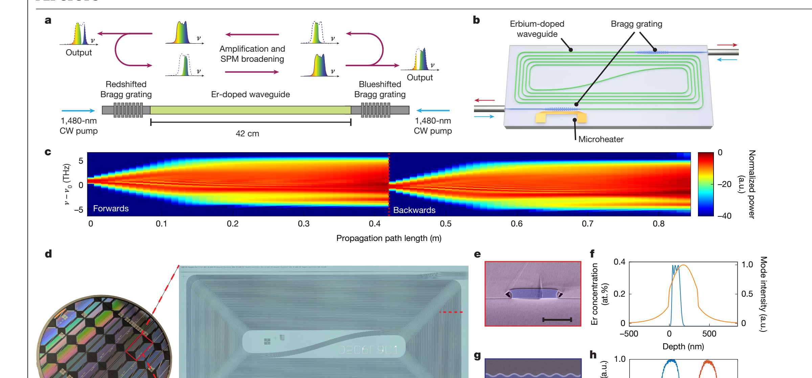

**Fig. 1 | Principle and fabrication of the integrated MLLs based on a Mamyshev oscillator.** **a**, Illustration of the working principle of the integrated Mamyshev oscillator, which consists of a 42-cm Er:Si3N4 waveguide sandwiched between two spectrally offset WBGs. SPM, self-phase modulation; ν, optical frequency; ν0, central frequency. **b**, Schematic of the integrated Mamyshev oscillator, showing the erbium-doped waveguide arranged in a spiral and the WBGs with an integrated microheater for tuning. **c**, Numerically simulated optical spectrum of the Mamyshev oscillator as a function of propagation path length in the linear cavity. **d**, Photographs of the fabricated wafer (left) and a chip that contains 26 individual MLLs (right). The blue boxes indicate the location of the WBGs. The internal tracking number for the MLL sample used in the experiment is D20602F8C2. **e**, False-coloured scanning electron microscope (SEM) image of the cross section of the doped waveguide. **f**, Simulated profile of the fundamental transverse-electric optical mode (orange) and the erbium concentration in the Si3N4 waveguide (blue). **g**, False-coloured SEM image of the corrugated WBG. **h**, Overlaid reflection spectra of the two WBGs, showing the spectral offset between the passbands. a.u., arbitrary units; CW, continuous wave. Scale bars, 2 cm (d, left), 2 mm (d, right), 1 μm (e, g).

Figure 1a illustrates the working principle of an integrated MLL based on a Mamyshev oscillator. A 42-cm-long section of an Er:Si3N4 waveguide is placed between two spectrally offset WBGs to form a simple linear cavity with a 175.5-MHz free spectral range. As simulated in Fig. 1c (Supplementary Note 2), pulses reflected by one grating undergo simultaneous amplification and self-phase modulation, which broaden their spectrum to bridge the spectral gap between the WBGs and eventually establish stable mode-locked operation. To maximize nonlinear interactions while maintaining low optical loss (Extended Data Fig. 1), we use a narrow few-mode Si3N4 waveguide with a cross section of 1.6 μm × 0.35 μm (Fig. 1e). Erbium ions are implanted into the waveguide to provide an optical gain7 using a maximum implantation energy of 500 keV and a total fluence of 3.87 × 1015 cm−2. This results in an estimated peak doping concentration of approximately 0.4 at.% and a 22% overlap between the mode and the dopant profile7 (Fig. 1f). The WBGs, shown in Fig. 1g, serve as narrowband reflectors for the pulses while simultaneously enabling injection of the 1,480-nm pump and partial transmission for the MLL output. The fabricated WBGs exhibit 3-dB bandwidths of approximately 5 nm and a centre wavelength separation of 8.9 nm (Fig. 1h). The reflection bands were designed to be near 1,557 nm to optimally use the erbium gain bandwidth. Microheaters are placed above the WBGs to facilitate fine-tuning of their reflection wavelengths (Fig. 1b). For prototyping, 26 independent MLLs were placed in a parallel waveguide bundle and collectively routed in a spiral layout on a 2 cm × 1.1 cm chip (Fig. 1d), which yielded over 300 MLLs per wafer.

## Mode-locking operation

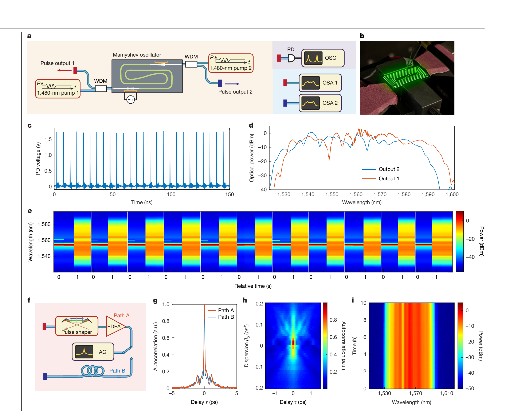

**Fig. 2 | Characterization of a photonic integrated circuit-based Mamyshev oscillator.** **a**, Experimental set-up for MLL operation and basic characterization. The on-chip Mamyshev oscillator is pumped by 1,480-nm diode lasers through the WBGs, and it is self-seeded by temporarily modulating the pump current. The optical spectra and temporal characteristics are measured using optical spectrum analysers and a fast photodetector with an oscilloscope. **b**, Photograph of the integrated MLL in operation. **c**, Stable pulse train acquired through direct photodetection of the MLL output after disabling the self-seeding pump modulation. **d**, Optical spectra acquired at the two output ports of the integrated MLL at high pump power, normalized to a resolution bandwidth of 0.2 nm. **e**, Stacked spectrograms showing the self-seeding processes. **f**, Experimental set-up for characterizing the second-order intensity autocorrelation function. **g**, Intensity autocorrelation traces after optimized linear chirp compression using either a programmable filter (pulse shaper) and erbium-doped fibre amplifier (path A) or through approximately 10 m of a single-mode silica fibre (path B). **h**, Evolution of the autocorrelation function under varying compensation for the group delay dispersion. **i**, Spectrogram of output 1 recorded continuously over 10 h when pumped with 820-mW pump 2. AC, non-collinear second-order intensity autocorrelator; EDFA, erbium-doped fibre amplifier; OSA, optical spectrum analyser; OSC, oscilloscope; PD, photodetector; WDM, wavelength (de-)multiplexer.

Figure 2a illustrates the experimental set-up used to operate and characterize the integrated MLL (Supplementary Note 3). For maximum output power, the MLL is optically pumped from both ends of the waveguide with two 1,480-nm lasers (pumps 1 and 2), which deliver 820 mW and 959 mW off-chip optical power, respectively. These power levels are readily achievable using commercially available laser diodes in butterfly packages after polarization combining, thus offering possibilities for future hybrid integration of the pump source.

The MLL can either be self-seeded by a temporary modulation to the pump power or be seeded with a single pulse from an external MLL (Supplementary Notes 5 and 6), like fibre-based Mamyshev oscillators8,9,36. For self-seeding, a modulation of 1.2 MHz to 2.8 MHz is applied to the drive current of the pump laser diodes for a duration of less than 10 s and is then disabled when the mode-locked pulses appear. The self-seeding process is highly repeatable and has been shown to yield identical mode-locked states in each experiment (Fig. 2e).

Upon initiation, self-sustained mode-locking is established without a continuous-wave background or Q-switching instabilities, as confirmed by the stable pulse train detected using a d.c.-coupled fast photodetector (Fig. 2c). The optical spectra collected from both waveguide outputs (Fig. 2d) are centred at approximately 1.56 μm and show 64 nm and 47 nm of 20 dB bandwidth, thus spanning the entire telecom C-band and extending into the L-band. This corresponds to over 40,000 comb lines (Methods and Extended Data Fig. 2). Average output powers of 136 mW (output 1) and 138 mW (output 2) were measured from the two ends of the linear cavity, corresponding to on-chip powers of 182 mW and 184 mW after accounting for coupling loss (Supplementary Note 7), yielding a pump-to-output efficiency of 27.5% when the powers are summed for the two outputs. With a repetition rate *f*rep = 175.5 MHz, the pulse energies at each output reached 1.04 nJ and 1.05 nJ, over two orders of magnitude higher than previously reported for PIC-based ultrafast sources. For power-constrained applications, stable mode-locking is also achieved using only the 820-mW pump power delivered by a diode laser (pump 2). In this lower power configuration, the oscillator produces on-chip pulse energies of 397 pJ and 347 pJ from outputs 1 and 2, respectively, still surpassing all previous integrated ultrafast sources by a wide margin. As shown by a spectrogram (Fig. 2i), the integrated MLL can maintain stable mode-locking for over 10 h, demonstrating the robustness of the mode-locked state and the long-term integrity of the waveguide.

The output pulses from the integrated Mamyshev oscillator are predominantly linearly chirped, in agreement with numerical simulations. To characterize the pulses, we used an intensity autocorrelator in conjunction with a programmable filter to apply a variable group delay dispersion and a home-built erbium-doped fibre amplifier to compensate for loss in the filter. Sweeping the applied dispersion, the pulse undergoes compression and rebroadening (Fig. 2h), which allowed us to identify the optimal dispersion for pulse compression. Moreover, the pulse waveform can be computationally reconstructed from the dispersion sweep data (Supplementary Note 8). With the optimized group delay dispersion, the intensity autocorrelation function of the output pulse from output 1 is compressed to 187 fs full-width at half-maximum (Fig. 2g). Alternatively, using a single-mode silica fibre as a delay line (approximately 10 m long, including other components in the set-up) for dispersion compensation, the pulse from output 2 is directly compressed to an autocorrelation width of 147 fs. Such dispersion compensation can be implemented on the Si3N4 platform using chirped Bragg gratings, although this was not implemented in the present device.

## Coherence characterization

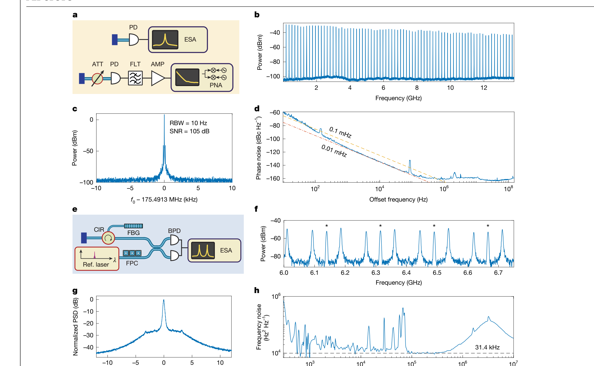

**Fig. 3 | Characterizing the coherence of an MLL with a photonic integrated Mamyshev oscillator.** **a**, Schematic for the characterization of the repetition-rate beat note through direct photodetection. **b**, Spectrum of the photodetected signal at 100 kHz RBW, showing several harmonics of the repetition rate *f*rep. **c**, Measured *f*rep beat note with SNR of 105 dB at 10-Hz resolution bandwidth. *f*0, radio frequency. **d**, Phase noise of the *f*rep beat note, with reference lines corresponding to Lorentzian linewidths of 0.1 mHz and 0.01 mHz. **e**, Schematic of the set-up for characterizing the heterodyne beat note of the integrated MLL. A portion of the MLL spectrum is preselected by a fibre Bragg grating and interferes with a reference continuous-wave laser. **f**, Spectrum of the heterodyne beat note between the reference laser and the integrated MLL at 3 MHz RBW. Asterisks denote residual *f*rep harmonics resulting from imperfect common-mode rejection in the balanced photodetector. **g**, PSD of the heterodyne beat note centred at 3.9796 GHz with an RBW of 12.47 kHz. νN and ν0, optical frequencies of the comb lines and the reference laser, respectively. The linewidth for a measurement time of 10 ms is 174 kHz. **h**, Frequency noise of the heterodyne beat note in g, indicating the 31.4-kHz Lorentzian linewidth for the optical comb line of the integrated MLL. AMP, amplifier; ATT, attenuator; BPD, balanced photodetector; CIR, circulator; ESA, electronic signal analyser; FBG, fibre Bragg grating; FPC, fibre polarization controller; FLT, filter; PNA, phase noise analyser; RBW, resolution bandwidth.

For many applications, MLLs are desired to be low noise in terms of pulse interval and pulse-to-pulse phase slip37. We evaluated the coherence of the integrated Mamyshev oscillator with direct photodetection (Fig. 3a) and heterodyne beating with a reference laser (Fig. 3e). The photodetected signal exhibits tens of harmonics of *f*rep, which extend well into the microwave range (Fig. 3b). Using a low-noise amplifier and appropriate filtering (Supplementary Note 3), the signal-to-noise ratio (SNR) of the fundamental beat note at *f*rep was measured to be 105 dB at 10-Hz resolution bandwidth, approaching the limit of the instrument. To estimate the timing jitter of the MLL, the power spectral density (PSD) of the single-sideband phase noise of the sixth repetition-rate harmonic was characterized with a phase noise analyser. After scaling down to the fundamental 175.5-MHz beat note, the single-sideband phase noise at 10 kHz offset reached −134 dBc Hz−1. The integrated timing jitter between 10 kHz and 10 MHz was 59.1 fs. Moreover, by fitting the 1/*f*2 slope to the *f*rep phase noise between 1 kHz and 50 kHz offset, we extracted a Lorentzian linewidth of 0.012 mHz, which represents a notable improvement over the best reported value from integrated semiconductor MLLs5.

The heterodyne beat note between the MLL and a continuous-wave reference laser at 1,552 nm (Fig. 3f) reveals a series of regularly spaced beat notes, indicating a stable frequency comb with a well-defined carrier-envelope offset frequency over the measurement duration. To quantify the linewidth of individual comb lines (Fig. 3g), we acquired the beat signal with an electronic signal analyser and extracted the PSD of its single-sideband frequency noise (Fig. 3h). By fitting the noise floor near a 200 kHz offset, we determined a Lorentzian linewidth of 31.4 kHz. Spurs observed between 10 kHz and 100 kHz were probably caused by the intensity noise of the 1,480-nm pump laser, and the bump between 1 MHz and 10 MHz may be attributed to a relaxation oscillation. The frequency noise between 1 kHz and 100 kHz offset remained below 5 × 104 Hz2 Hz−1, which we attribute to the large cavity volume and, thus, low thermorefractive noise38.

## Direct supercontinuum generation

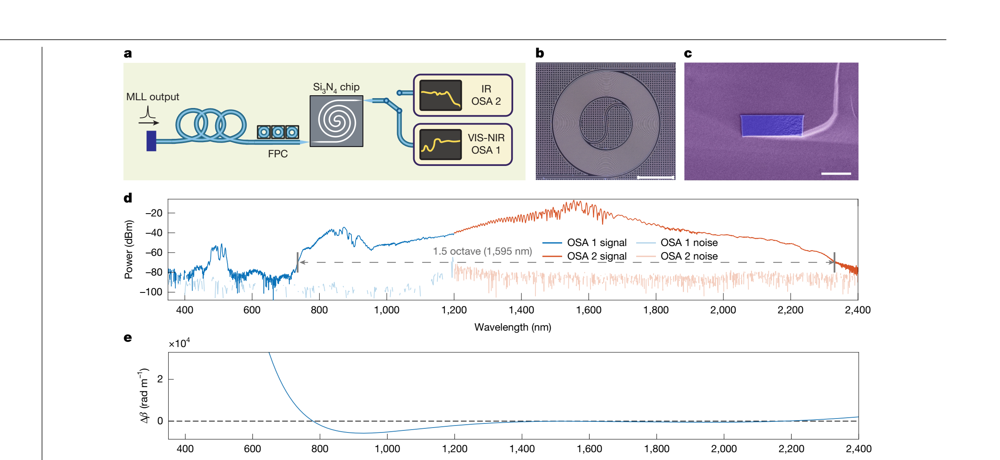

**Fig. 4 | Supercontinuum generation directly driven by the integrated Mamyshev oscillator.** **a**, Experimental set-up for supercontinuum generation in a Si3N4 spiral waveguide, directly driven by the integrated MLL without post-amplification. **b**, Photograph of a Si3N4 spiral waveguide chip identical to the one used for supercontinuum generation. The internal tracking number of the sample used in the experiment is D7802F4C4. **c**, False-coloured SEM image of the cross section of the waveguide. **d**, Spectrum of the generated 1.5-octave-spanning supercontinuum, normalized to a resolution bandwidth of 2 nm. The 20-dB bandwidth is 18.7 THz. **e**, Simulated integrated dispersion Δβ of the spiral waveguide used in the experiment. IR, infrared; VIS-NIR, visible to near-infrared. Scale bars, 200 μm (b), 1 μm (c).

One application of the high-energy on-chip pulse sources is supercontinuum generation, which is an efficient route for producing spatially and temporally coherent optical spectra that can span an octave. Crucially, our integrated Mamyshev oscillator provides sufficient pulse energy such that it does not require any further external amplification. As a proof of concept, we routed the output of the integrated MLL through approximately 10 m of a single-mode silica fibre, followed by coupling into a 43.7-mm Si3N4 spiral waveguide on a separate chip to generate a supercontinuum (Fig. 4a). This fibre link provides dispersion compensation for the chirped MLL pulses and linearly compresses them to reach kilowatt-level peak power. The Si3N4 spiral waveguide (Fig. 4b) features a 2.07 μm × 0.70 μm cross section (Fig. 4c) and a relatively flat integrated dispersion near the telecom C-band (Fig. 4e). Without optical amplification, the MLL output generated a 1.5-octave-spanning supercontinuum from 736 nm to 2,331 nm (Fig. 4d), which matches numerical simulations (Supplementary Note 9). Such a supercontinuum can serve as an ideal wideband high-brightness source for infrared spectroscopy with integrated spectrometers39 and for optical coherence tomography40, and it is a step towards an integrated self-referenced frequency comb12.

## Application for THz-time domain spectroscopy

Our photonic integrated Mamyshev oscillator can serve as a high-performance, compact replacement for conventional MLLs in a range of applications. One compelling example is in terahertz time-domain spectroscopy (THz-TDS). The terahertz band lies between the microwave and infrared regions of the electromagnetic spectrum and offers several distinctive advantages: terahertz radiation is non-ionizing, penetrates many optically opaque materials, provides higher spatial resolution than millimetre waves and contains rich spectroscopic signatures of molecules41. These properties enable applications including security screening42, non-destructive testing43 and art conservation44.

A central technique in terahertz spectroscopy is THz-TDS, in which an ultrafast optical pulse train generates broadband terahertz transients and samples their electric field in the time domain, commonly using photoconductive antennas or nonlinear optical processes41. However, most THz-TDS systems rely on a solid-state or fibre-based MLL, which is a primary contributor to system cost and footprint, thereby limiting their broader deployment.

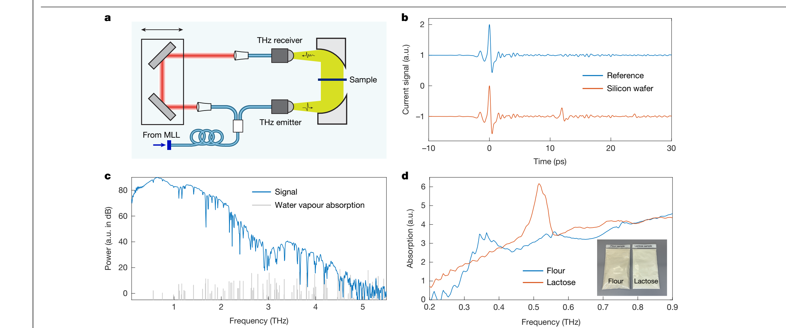

**Fig. 5 | THz-TDS system directly driven by the integrated Mamyshev oscillator.** **a**, Experimental set-up of a transmissive THz-TDS system driven by the integrated MLL. **b**, Measured THz-TDS electric-field waveforms with a clear beam path (reference) and with a silicon wafer inserted, showing delayed replicas arising from several internal reflections. **c**, Terahertz power spectra with approximately 7-GHz resolution obtained from the Fourier transform of the reference signal in b. Absorption lines for water vapour are from the HITRAN database49. **d**, Terahertz absorption spectra of flour and lactose samples, showing a clear lactose absorption feature near 0.53 THz. Inset, photograph of the powders used in the measurement.

In this work, we used our photonic integrated Mamyshev oscillator to directly drive a THz-TDS system (Fig. 5a). We achieved a peak dynamic range of 90 dB and a detection bandwidth of 5 THz (Fig. 5c) with approximately 5 minutes of averaging, which were enabled by the high average power and the short pulse duration after linear dechirping. Absorption lines from atmospheric water vapour in the terahertz beam path are clearly resolved in the acquired spectrum.

We further demonstrate two proof-of-concept applications of the system (Supplementary Note 3). First, we performed thickness metrology in a time-of-flight measurement by transmitting terahertz waves through a silicon wafer. Delayed replicas of the main pulse appeared due to internal reflection. The 11.93-ps delay measured between the main pulse and the first replica corresponds to a thickness of 523.3 μm (Fig. 5b), consistent with the nominal thickness of the silicon wafer (525 μm). Second, in a material identification application, the measured absorption spectra clearly distinguish lactose powder from flour by resolving the characteristic feature near 0.53 THz (ref. 45; Fig. 5d). These proof-of-concept demonstrations highlight the potential of integrated-MLL-driven THz-TDS as a path towards portable, cost-effective systems for wide industrial deployment.

## Discussion and conclusions

We demonstrate an integrated Mamyshev oscillator MLL based on erbium-ion-implanted Si3N4 PICs. It can generate ultrafast pulses with nanojoule-level energy at a 175.5-MHz repetition rate, a parameter regime so far attained only with non-chip-scale MLLs, such as those based on fibres. The integrated MLL enables the generation of a 1.5-octave-spanning supercontinuum in a separate dispersion-engineered Si3N4 waveguide without extra amplification, which lays the foundation for on-chip self-referenced frequency combs, with future work to study reducing and understanding the phase noise of the free-running laser. The laser delivers pulses that can be compressed to 147 fs and exhibits excellent coherence compared with existing integrated MLLs. A compelling future direction is to combine the MLL with octave-spanning supercontinuum generation directly on the same photonic chip by integrating a dispersion-engineered waveguide and pulse compression. The latter could unlock octave-spanning optical frequency combs to create a phase-coherent radio-frequency-to-optical link. Optical pulses from an integrated Mamyshev oscillator could also directly drive a THz-TDS system, with performance comparable with state-of-the-art commercial systems and superior to all existing THz-TDS demonstrations driven by integrated sources (see Supplementary Note 10 for a comparison). Although our demonstration is based on silicon nitride waveguides and in the 1.55-μm band, the Mamyshev oscillator concept is readily transferable to other platforms and wavelengths. Simulations indicate that the nonlinear Er:Si3N4 waveguide amplifier section could be operated individually for similariton pulse amplification (Supplementary Note 11).

The combination of high pulse energy, excellent coherence and stable mode-locking demonstrated with wafer-scale manufactured PICs opens new opportunities for nonlinear integrated photonics, including mid-infrared supercontinuum sources for spectroscopy46, handheld low-cost terahertz systems for non-destructive testing47 and chip-scale frequency combs for optical atomic clocks48. Beyond this, our work highlights the emerging frontier of integrated photonics and ultrafast laser science, which so far has been explored using fibres and bulk laser cavities, with erbium- or other rare-earth-ion-doped silicon nitride nonlinear PICs.

## Online content

Any methods, additional references, Nature Portfolio reporting summaries, source data, extended data, supplementary information, acknowledgements, peer review information; details of author contributions and competing interests; and statements of data and code availability are available at https://doi.org/10.1038/s41586-026-10517-4.

1. Juhasz, T. et al. Corneal refractive surgery with femtosecond lasers. *IEEE J. Sel. Top. Quantum Electron.* **5**, 902–910 (2002).
2. Zewail, A. H. Femtochemistry: atomic-scale dynamics of the chemical bond. *J. Phys. Chem. A* **104**, 5660–5694 (2000).
3. Diddams, S. A. et al. An optical clock based on a single trapped 199Hg+ ion. *Science* **293**, 825–828 (2001).
4. Byun, H. et al. Integrated low-jitter 400-MHz femtosecond waveguide laser. *IEEE Photonics Technol. Lett.* **21**, 763–765 (2009).
5. Cuyvers, S. et al. Low noise heterogeneous III-V-on-silicon-nitride mode-locked comb laser. *Laser Photonics Rev.* **15**, 2000485 (2021).
6. Guo, Q. et al. Ultrafast mode-locked laser in nanophotonic lithium niobate. *Science* **382**, 708–713 (2023).
7. Liu, Y. et al. A photonic integrated circuit–based erbium-doped amplifier. *Science* **376**, 1309–1313 (2022).
8. Regelskis, K., Želudevičius, J., Viskontas, K. & Račiukaitis, G. Ytterbium-doped fiber ultrashort pulse generator based on self-phase modulation and alternating spectral filtering. *Opt. Lett.* **40**, 5255–5258 (2015).
9. Liu, Z., Ziegler, Z. M., Wright, L. G. & Wise, F. W. Megawatt peak power from a Mamyshev oscillator. *Optica* **4**, 649–654 (2017).
10. Haus, H. A. Mode-locking of lasers. *IEEE J. Sel. Top. Quantum Electron.* **6**, 1173–1185 (2002).
11. Keller, U. Recent developments in compact ultrafast lasers. *Nature* **424**, 831–838 (2003).
12. Udem, T., Holzwarth, R. & Hänsch, T. W. Optical frequency metrology. *Nature* **416**, 233–237 (2002).
13. Xu, C. & Wise, F. Recent advances in fibre lasers for nonlinear microscopy. *Nat. Photon.* **7**, 875–882 (2013).
14. Lee, J., Kim, Y.-J., Lee, K., Lee, S. & Kim, S.-W. Time-of-flight measurement with femtosecond light pulses. *Nat. Photon.* **4**, 716–720 (2010).
15. Lu, Z. et al. 312-fs pulse generation from a passive C-band InAs/InP quantum dot mode-locked laser. *Opt. Express* **16**, 10835–10840 (2008).
16. Moskalenko, V. et al. Record bandwidth and sub-picosecond pulses from a monolithically integrated mode-locked quantum well ring laser. *Opt. Express* **22**, 28865–28874 (2014).
17. Wang, Z. et al. A III-V-on-Si ultra-dense comb laser. *Light: Sci. Appl.* **6**, e16260 (2017).
18. Liu, S. et al. High-channel-count 20 GHz passively mode-locked quantum dot laser directly grown on Si with 4.1 Tbit/s transmission capacity. *Optica* **6**, 128–134 (2019).
19. Hermans, A. et al. High-pulse-energy III-V-on-silicon-nitride mode-locked laser. *APL Photonics* **6**, 096102 (2021).
20. Ling, J. et al. Electrically empowered microcomb laser. *Nat. Commun.* **15**, 4192 (2024).
21. Brasch, V. et al. Photonic chip–based optical frequency comb using soliton Cherenkov radiation. *Science* **351**, 357–360 (2016).
22. Helgason, Ó. B. et al. Surpassing the nonlinear conversion efficiency of soliton microcombs. *Nat. Photon.* **17**, 992–999 (2023).
23. Yu, M. et al. Integrated femtosecond pulse generator on thin-film lithium niobate. *Nature* **612**, 252–258 (2022).
24. Singh, N. et al. Watt-class silicon photonics-based optical high-power amplifier. *Nat. Photon.* **19**, 307–314 (2025).
25. Wang, Y., Holguín-Lerma, J. A., Vezzoli, M., Guo, Y. & Tang, H. X. Photonic-circuit-integrated titanium: sapphire laser. *Nat. Photon.* **17**, 338–345 (2023).
26. Yang, J. et al. Titanium: sapphire-on-insulator integrated lasers and amplifiers. *Nature* **630**, 853–859 (2024).
27. Shtyrkova, K. et al. Integrated CMOS-compatible Q-switched mode-locked lasers at 1900 nm with an on-chip artificial saturable absorber. *Opt. Express* **27**, 3542–3556 (2019).
28. Singh, N. et al. Silicon photonics-based high-energy passively Q-switched laser. *Nat. Photon.* **18**, 485–491 (2024).
29. Fu, W., Wright, L. G., Sidorenko, P., Backus, S. & Wise, F. W. Several new directions for ultrafast fiber lasers. *Opt. Express* **26**, 9432–9463 (2018).
30. Liu, W. et al. Femtosecond Mamyshev oscillator with 10-MW-level peak power. *Optica* **6**, 194–197 (2019).
31. Ma, C., Khanolkar, A., Zang, Y. & Chong, A. Ultrabroadband, few-cycle pulses directly from a Mamyshev fiber oscillator. *Photonics Res.* **8**, 65–69 (2019).
32. Pitois, S., Finot, C., Provost, L. & Richardson, D. J. Generation of localized pulses from incoherent wave in optical fiber lines made of concatenated Mamyshev regenerators. *J. Opt. Soc. Am. B* **25**, 1537–1547 (2008).
33. Rochette, M., Chen, L. R., Sun, K. & Hernandez-Cordero, J. Multiwavelength and tunable self-pulsating fiber cavity based on regenerative SPM spectral broadening and filtering. *IEEE Photonics Technol. Lett.* **20**, 1497–1499 (2008).
34. Finot, C. & Rochette, M. From signal processing of telecommunication signals to high pulse energy lasers: the Mamyshev regenerator case. *Nanophotonics* **14**, 2835–2846 (2025).
35. Grelu, P. & Akhmediev, N. Dissipative solitons for mode-locked lasers. *Nat. Photon.* **6**, 84–92 (2012).
36. Chen, Y.-H., Sidorenko, P., Thorne, R. & Wise, F. Starting dynamics of a linear-cavity femtosecond Mamyshev oscillator. *J. Opt. Soc. Am. B* **38**, 743–748 (2021).
37. Kim, J. & Song, Y. Ultralow-noise mode-locked fiber lasers and frequency combs: principles, status, and applications. *Adv. Opt. Photonics* **8**, 465–540 (2016).
38. Huang, G. et al. Thermorefractive noise in silicon-nitride microresonators. *Phys. Rev. A* **99**, 061801 (2019).
39. Peters, M. R. A. et al. Integrated photonic spectrometers: a critical review. *Photonics Insights* **4**, R10 (2025).
40. Barrick, J. et al. High-speed and high-sensitivity parallel spectral-domain optical coherence tomography using a supercontinuum light source. *Opt. Lett.* **41**, 5620–5623 (2016).
41. Koch, M., Mittleman, D. M., Ornik, J. & Castro-Camus, E. Terahertz time-domain spectroscopy. *Nat. Rev. Methods Primers* **3**, 48 (2023).
42. Liu, H.-B., Zhong, H., Karpowicz, N., Chen, Y. & Zhang, X.-C. Terahertz spectroscopy and imaging for defense and security applications. *Proc. IEEE* **95**, 1514–1527 (2007).
43. Li, X. et al. Plasmonic photoconductive terahertz focal-plane array with pixel superresolution. *Nat. Photon.* **18**, 139–148 (2024).
44. Guillet, J.-P. et al. Art painting diagnostic before restoration with terahertz and millimeter waves. *J. Infrared Millim. Terahertz Waves* **38**, 369–379 (2017).
45. Datta, S. et al. Terahertz spectroscopic analysis of lactose in infant formula: implications for detection and quantification. *Molecules* **27**, 5040 (2022).
46. Guo, H. et al. Mid-infrared frequency comb via coherent dispersive wave generation in silicon nitride nanophotonic waveguides. *Nat. Photon.* **12**, 330–335 (2018).
47. Li, X., Li, J., Li, Y., Ozcan, A. & Jarrahi, M. High-throughput terahertz imaging: progress and challenges. *Light: Sci. Appl.* **12**, 233 (2023).
48. Ludlow, A. D., Boyd, M. M., Ye, J., Peik, E. & Schmidt, P. O. Optical atomic clocks. *Rev. Mod. Phys.* **87**, 637–701 (2015).
49. Gordon, I. E. et al. The HITRAN2024 molecular spectroscopic database. *J. Quant. Spectrosc. Radiat. Transf.* **353**, 109807 (2026).

**Publisher's note** Springer Nature remains neutral with regard to jurisdictional claims in published maps and institutional affiliations.

Springer Nature or its licensor (e.g. a society or other partner) holds exclusive rights to this article under a publishing agreement with the author(s) or other rightsholder(s); author self-archiving of the accepted manuscript version of this article is solely governed by the terms of such publishing agreement and applicable law.

© The Author(s), under exclusive licence to Springer Nature Limited 2026

1Institute of Physics, Swiss Federal Institute of Technology Lausanne (EPFL), Lausanne, Switzerland. 2Institute of Electrical and Microengineering, Swiss Federal Institute of Technology Lausanne (EPFL), Lausanne, Switzerland. 3Helmholtz-Zentrum Dresden-Rossendorf (HZDR), Dresden, Germany. 4Present address: EDWATEC SA, EPFL Innovation Park, Lausanne, Switzerland. 5These authors contributed equally: Zheru Qiu, Xuan Yang, Xurong Li, Jianqi Hu. ✉e-mail: tobias.kippenberg@epfl.ch

---

## Methods

### Sample fabrication process

The erbium-doped wafers used in this study (D20602) were fabricated using a subtractive process50,51. The process started with 100-mm silicon wafers (SIEGERT WAFER GmbH). A 10-μm thermal SiO2 layer was grown by wet oxidation. A 362-nm stoichiometric Si3N4 film was deposited by low-pressure chemical vapour deposition. The thickness compensated for shrinkage during subsequent annealing, yielding a final thickness close to 350 nm. Waveguide patterns were defined by deep-ultraviolet lithography (ASML PAS5500/350C, JSR M108Y, Brewer Science DUV-42P) and fluorine-based reactive-ion etching using CHF3/SF6/Ar/O2 gases (SPTS APS). For isolated features, the critical dimension shrunk by approximately 55 nm on each side; this bias was compensated for in the edge coupler design and in the calibration of the WBG parameters. After stripping the resist, the backside Si3N4 was removed by reactive-ion etching while the front side was protected with a photoresist. The wafers were megasonically cleaned to remove particle contamination and then annealed at 1,200 °C for 12 h in N2. Removing the backside Si3N4 before annealing was crucial, as the 350-nm film has sufficient internal stress to cause plastic deformation and permanent wafer bowing, which would impede subsequent fabrication steps. Ultraviolet direct-write lithography (Heidelberg MLA150, 6 μm AZ 15nXT) then defined the implantation mask, which protected the WBGs and edge couplers.

Erbium ions were implanted using a 500-kV air-insulated implanter. Singly charged ions were extracted from an indirectly heated cathode Bernas-type ion source with a 40-kV extraction system and post-accelerated to energies up to 500 keV, then mass-separated by an analysing magnet and transported using quadrupoles and an Einzel lens. A neutral trap prevented neutral particles from reaching the target. The ion beam was scanned in the *x* and *y* directions at approximately 1 kHz with a slight frequency offset. To tailor a dopant profile across the film thickness, implantation was performed sequentially at 125 keV, 253 keV and 500 keV with doses of 8.40 × 1014 cm−2, 1.41 × 1015 cm−2 and 2.84 × 1015 cm−2, respectively. All implantation was conducted at room temperature with a 0° incidence angle.

After ion implantation, the photoresist was removed by oxygen plasma. The surface was cleaned in concentrated hydrochloric acid to eliminate erbium oxide residues and in dilute hydrofluoric acid to remove resputtered material. The wafers were annealed at 900 °C for 1 h in N2 to repair radiation damage to the Si3N4 waveguide. Approximately 6 μm of SiO2 cladding was deposited by inductively coupled plasma chemical vapour deposition using a SiCl4 precursor52, followed by an anneal at 600 °C for 1 h in O2 to reduce the optical loss. Metallic microheaters were fabricated by sputtering approximately 25 nm of Ti and approximately 500 nm of Pt, followed by ultraviolet lithography (Heidelberg MLA150, 2 μm AZ 10nXT) and ion-beam etching (Veeco IBE350). The photoresist was reflown at 135 °C to reduce etch fencing. Dies were separated by ultraviolet lithography (Heidelberg MLA150, 10 μm AZ 15nXT), followed by deep reactive-ion etching through the SiO2 and approximately 250 μm of Si. The backside was ground to give a final chip thickness of approximately 250 μm. Finished dies were baked on a 310 °C hotplate overnight to heal Si3N4 damage incurred due to ultraviolet exposure from intense plasmas during fabrication, which can increase the waveguide optical loss50.

The current process has two known issues that are readily addressed. First, the highly stressed 350-nm Si3N4 film can crack within days if not promptly patterned. Such cracks can destroy the waveguides and reduce the yield, especially after annealing-induced shrinkage. Patterning deep trenches (in a 2-μm-wide square grid, approximately 3 μm deep, like what was used in ref. 50) into the oxide in a ring along the wafer edge effectively prevented cracking. Second, high-dose implantation can swell the Si3N4 surface and form overhanging edges that lead to the formation of voids during the deposition of SiO2 cladding with inductively coupled plasma chemical vapour deposition, which increases the scattering loss. This can be mitigated by introducing lateral cladding before implantation, for example, with the photonic damascene process7,53 or with low-pressure chemical vapour deposition followed by chemical-mechanical polishing and controlled hydrofluoric acid etching.

The dispersion-engineered Si3N4 waveguides used for the supercontinuum demonstration (D7802) were fabricated using the photonic damascene process, as described in ref. 53.

### Waveguide loss and erbium absorption

We characterized the total waveguide loss of D20602 samples after ion implantation using optical frequency-domain reflectometry with a home-built optical vector network analyser54. Extended Data Fig. 1 shows the measured small-signal loss spectrum, which reveals broadband erbium absorption between approximately 1,400 nm and 1,600 nm, with a peak loss of approximately 165 dB m−1 at 1,533 nm, about twice that of a commercial highly erbium-doped fibre (Liekki ER80-8/125). Outside the erbium absorption band, we estimated the background waveguide loss to be 9.5 dB m−1, as inferred from the loss between 1,300 nm and 1,370 nm.

### Heterodyne beat note across a wide wavelength range

In the integrated Mamyshev oscillator MLL, the repetition rate 175.5 MHz is lower than the minimal resolution bandwidth of available grating-based optical spectrum analysers (0.02 nm), such that individual comb lines cannot be resolved. To visualize the comb-like spectrum, we characterized the heterodyne beat note of the MLL output using a tunable single-frequency laser (Toptica CTL) and a balanced photodetector at nine different wavelengths. Because of the wide wavelength range to cover, the fibre Bragg grating preselector can no longer be used, as in Fig. 3e. The SNR may appear lower and vary from line to line owing to the more pronounced saturation in the balanced photodetector (and, thus, distortion in its time-domain response) caused by the higher pulse energy. As shown in Extended Data Fig. 2, we observed discrete beat notes at all nine wavelengths in the emission bandwidth, indicating discrete comb lines within ±1 GHz of each observation wavelength.

### Data availability

All experimental datasets used to produce the results are available at Zenodo (https://doi.org/10.5281/zenodo.18732610)55.

### Code availability

The laser simulation code is available at Zenodo (https://doi.org/10.5281/zenodo.18732610)55.

50. Ji, X. et al. Efficient mass manufacturing of high-density, ultra-low-loss Si3N4 photonic integrated circuits. *Optica* **11**, 1397–1407 (2024).
51. Ji, X. et al. Wafer-scale manufacturing of ultra-broadband, high-power erbium-doped integrated lasers. *Nat. Commun.* **17**, 3722 (2026).
52. Qiu, Z. et al. Hydrogen-free low-temperature silica for next generation integrated photonics. Preprint at http://arxiv.org/abs/2312.07203 (2023).
53. Liu, J. et al. High-yield, wafer-scale fabrication of ultralow-loss, dispersion-engineered silicon nitride photonic circuits. *Nat. Commun.* **12**, 2236 (2021).
54. Riemensberger, J. et al. A photonic integrated continuous-travelling-wave parametric amplifier. *Nature* **612**, 56–61 (2022).
55. Qiu, Z. et al. Supplementary dataset for manuscript: high-pulse-energy integrated mode-locked laser using a Mamyshev oscillator. Zenodo https://doi.org/10.5281/zenodo.18732610 (2026).

**Acknowledgements** The samples were partially fabricated in the EPFL Center of MicroNanoTechnology. The ion implantation was carried out at the Ion Beam Center of the Helmholtz-Zentrum Dresden-Rossendorf. We thank J. Riemensberger for the design and J. Liu and R. Ning Wang for the fabrication of the D7803 device used in the supercontinuum generation demonstration. We thank H. Li for help with wafer dicing. This work is supported by funding from the Swiss National Science Foundation (Grant Agreement No. 216493, HEROIC). This manuscript is based upon work supported by the Air Force Office of Scientific Research (Award No. FA9550-25-1-0259).

**Author contributions** Z.Q. and Z. Liu conceived the work. Z.Q. and J.H. performed the numerical simulations and designed the Mamyshev oscillator with help from J.S. and Z. Liu. Z.Q. fabricated the D206 devices (excluding ion implantation) with substantial help from Y.Z., X.J., X.L. and Z. Li. U.K. performed the ion implantation. Z.Q. and X.Y. performed the MLL demonstration experiment and processed the data with help from G.L., J.H. and X.L. Z.Q. and J.H. performed the supercontinuum generation experiment. X.L. and Z.Q. performed the THz-TDS experiment with help from X.Y. Z.Q., J.H. and X.L. wrote the Article with contributions from all co-authors. T.J.K. supervised the work.

**Competing interests** Z.Q., X.Y., and T.J.K. are co-inventors on patent applications regarding the integrated Mamyshev oscillator. T.J.K. is co-founder of EDWATEC SA, a company offering optical amplifiers on-chip. The other authors declare no competing interests.

### Additional information

**Supplementary information** The online version contains supplementary material available at https://doi.org/10.1038/s41586-026-10517-4.

**Correspondence and requests for materials** should be addressed to Tobias J. Kippenberg.

**Peer review information** *Nature* thanks Amir Safavi-Naeini and the other, anonymous, reviewer(s) for their contribution to the peer review of this work. Peer reviewer reports are available.

**Reprints and permissions information** is available at http://www.nature.com/reprints.

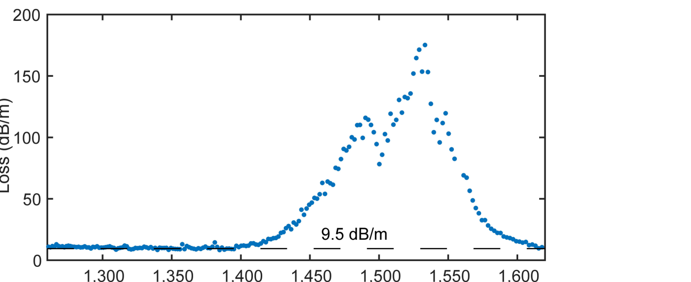

**Extended Data Fig. 1 | Waveguide loss after ion implantation measured by OFDR.** The dashed line denotes the estimated background loss outside of the erbium absorption band.

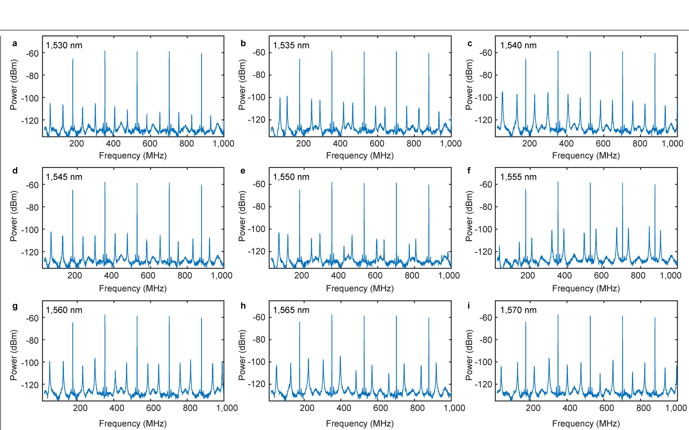

**Extended Data Fig. 2 | Heterodyne beat note.** **a** to **i**, Heterodyne beat note at 9 individual wavelengths from 1530 nm to 1570 nm.

---

nature portfolio

https://doi.org/10.1038/s41586-026-10517-4

## Supplementary information

# High-pulse-energy integrated mode-locked laser using a Mamyshev oscillator

In the format provided by the authors and unedited

---

# Supplementary Notes for: High-pulse-energy integrated mode-locked laser using a Mamyshev oscillator

Zheru Qiu†,1,2, Xuan Yang†,1,2, Xurong Li†,1,2, Jianqi Hu†,1,2, Zhongshu Liu1,2, Yichi Zhang1,2, Xinru Ji1,2, Jiale Sun1,2, Grigory Lihachev1,2,3, Zihan Li1,2, Ulrich Kentsch4, and Tobias J. Kippenberg∗,1,2

1Institute of Physics, Swiss Federal Institute of Technology Lausanne (EPFL), CH-1015 Lausanne, Switzerland  
2Institute of Electrical and Microengineering, EPFL, CH-1015 Lausanne, Switzerland  
3Current address: EDWATEC SA, EPFL Innovation Park, CH-1015 Lausanne, Switzerland  
4Helmholtz-Zentrum Dresden-Rossendorf (HZDR), D-01328 Dresden, Germany

## Contents

* S1. Comparison with state-of-the-art photonic integrated circuit-based ultrafast sources  ... SP2
* S2. Simulation of integrated Mamyshev oscillator and design guidelines  ... SP4
  + A. Method  ... SP4
  + B. Parameters  ... SP6
  + C. Simulation results  ... SP8
  + D. Design analysis guidelines  ... SP11
* S3. Detailed description of the experiment setup  ... SP13
  + A. Basic mode-locking operation  ... SP13
  + B. Self-seeding by pump modulation  ... SP14
  + C. Autocorrelation characterization  ... SP14
  + D. Coherence characterization  ... SP15
  + E. External seeding  ... SP15
  + F. Alternative starting method by extended cavity Q-switching  ... SP16
  + G. Supercontinuum generation  ... SP16
  + H. THz time-domain spectroscopy  ... SP17
* S4. Details on the waveguide Bragg gratings  ... SP18
* S5. Dynamics of pulse build-up  ... SP18
* S6. Time to start for self-seeding  ... SP21
* S7. Fiber-to-chip coupling and output beam quality  ... SP22
* S8. Time domain pulse reconstruction from dispersion sweep data  ... SP23
* S9. Simulation and additional experimental results of supercontinuum generation  ... SP25
* S10. Comparison with state-of-the-art terahertz TDS systems driven by integrated ultrafast sources  ... SP27
* S11. Single-pass pulse propagation in the gain section  ... SP28
* References  ... SP29

†These authors contributed equally.  
∗: tobias.kippenberg@epfl.ch

## S1. Comparison with state-of-the-art photonic integrated circuit-based ultrafast sources

Here, we compare the key performance metrics of our work with state-of-the-art integrated ultrafast sources reported in the literature (Table S1). For completeness, we present a comprehensive list of integrated ultrafast sources, including some semiconductor and waveguide lasers that may not strictly be considered photonic integrated circuits (PICs) by today's standards due to fabrication process compatibility and mode confinement. In addition, a selection of small commercially available mode-locked lasers (MLLs) and notable recent laboratory demonstrations of fiber-based MLLs are also listed for reference. Figure S1 compares the pulse energy *E*p and the pulse interval (1/*f*rep) of the sources listed in Table S1.

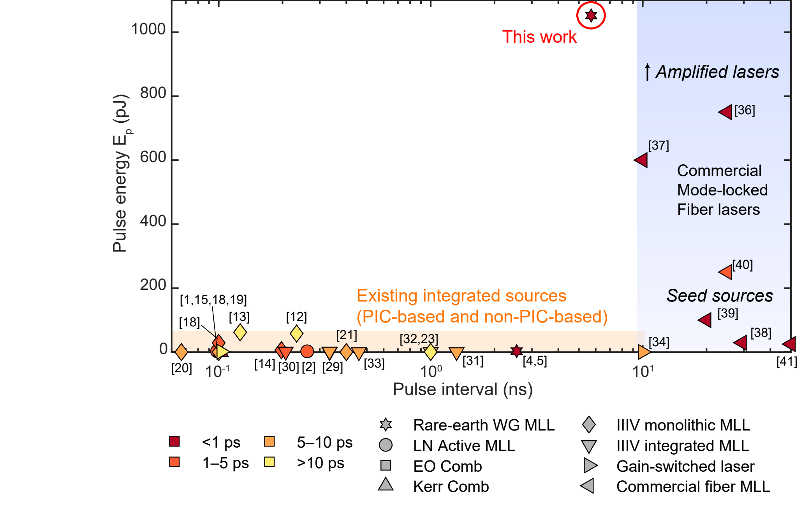

**Figure S1.** Comparison with state-of-the-art integrated ultrafast pulse sources (and a few commercial lasers) in terms of pulse energy *E*p and pulse interval (1/*f*rep). The color of the markers represents the pulse width.

Table S1: Comparison with state-of-the-art integrated ultrafast pulse sources and a sample of state-of-the-art lasers.

| Year | λc (μm) | *f*rep (GHz) | Pulse width (ps) | (On-chip) average power (mW) | *E*p (pJ) | *f*rep RF linewidth (Hz) | Comb line linewidth (kHz) | Spectrum width (nm) | Type | Reference |
| --- | --- | --- | --- | --- | --- | --- | --- | --- | --- | --- |
| 2026 | 1.56 | 0.175 | 0.147a | 184 | 1052 | 1.2 × 10−5 | 31.4 | 64 (20 dB) | Er-doped-Si3N4 Mamyshev | **This work** |
| Integrated ultrafast pulse sources | | | | | | | | | | |
| 2023 | 1.06 | 10.17 | 4.81 | 53 | 2.6 | x | 3.91 × 103 | 0.35 (3 dB) | LN active MLL | [1] |
| 1995 | 1.60 | 3.823 | 3.8 | 0.9 | 2.4 | x | − | 0.95 (3 dB) | LN active MLL | [2] |
| 2024 | 1.55 | 39.58 | ∼20 | 11 | 0.28 | x | 0.6v | 20 | LN active MLL | [3] |
| 2009 | 1.56 | 0.393 | 0.44 | 1.2o | 3.05 | + | - | 8.4 (3 dB) | Er-glass WG MLL (SESAM) | [4, 5] |
| 2019 | 1.90 | 1.2 | - | 9 | - | - | - | 17 (3 dB) | Tm:Al2O3 passive MLL | [6] |
| 2022 | 1.56 | 30.10 | 0.52 | 16.25 | 0.54 | x | x | 6 (10 dB) | EO comb (LN, time-lens) | [7] |
| 2022 | 1.55 | 30.925 | 0.336 | 20 | 0.65 | x | x | 132 (−70 dBm) | EO comb (LN, resonant) | [8] |
| 2020 | 1.56 | 9.78 | 0.098 | 0.11c | 0.011c | x | x | 25.8 (3 dB) | Kerr comb (SiN) | [9] |
| 2023 | 1.55 | 99.72 | ++ | ∼6 | ∼0.06 | x | x | − | Kerr comb (SiN) | [10] |
| 2022 | 1.55 | 143.6 | ++ | 20 | 0.14 | x | 0.5 | 200 (60 dB) | Kerr comb (hybrid SiN) | [11] |
| 2006 | 1.55 | 4.29 | 10 | 250 | 58 | - | - | 5.7 (3 dB) | III-V monolithic (SCOWL) | [12] |
| 2007 | 0.98 | 7.92 | 16 | 489 | 62 | - | - | 0.96 (3 dB) | III-V monolithic (SCOWL) | [13] |
| 2005 | 1.26 | 5.06 | 3.2 | <30 | <6 | - | - | 7.1 (3 dB) | III-V monolithic (QD) | [14] |
| 2011 | 1.51 | 10.0 | 6 | 0.8o | 0.08o | 1 × 102e | - | 1.5 | III-V monolithic (QD) | [15] |
| 2005 | 1.26 | 21.0 | 0.39 | 25 | 0.95 | - | - | 20 | III-V monolithic (QD) | [16] |
| 2008 | 1.54 | 92.0 | 0.312 | 8.6 | 0.09 | - | - | 11.62 (3 dB) | III-V monolithic (QD) | [17] |
| 2012 | 1.26 | 10.0 | 2.2 | 288 | 28.7 | - | - | 5.6 (3 dB) | III-V monolithic (Tapered) | [18] |
| 2025 | 1.53 | 10.6 | 0.726 | - | - | - | - | 19.22 (20 dB) | III-V monolithic (QW) | [19] |
| 2006 | 1.53 | 15.0 | 5 | ∼0.15 | 0.01 | 4 × 105 | 6 × 105 | 4.5 (3 dB) | III-V monolithic (Ring) | [20] |
| 2015 | 1.58 | 2.5 | 9.8 | 0.08 | 0.032 | 6.13 × 103 | - | 3 (3 dB) | III-V monolithic (InP PIC) | [21] |
| 2017 | 1.53 | 21.5 | 0.35 | 1 | 0.047 | 4.5 × 105 | - | 14 (3 dB) | III-V monolithic (InP PIC) | [22] |
| 2010 | 1.58 | 1.0 | 36 | >0.59 | 0.59 | - | 7 × 104 | 5 (10 dB) | III-V monolithic (QW) | [23] |
| 2021 | 1.55 | 0.99 | 272 | - | - | - | 7 × 104 | - | III-V monolithic | [24] |
| 2019 | 1.31 | 20.0 | 1.7 | 0.48 | 0.024 | 400 | - | 5.5 (3 dB) | III-V monolithic (on Si) | [25] |
| 2019 | 1.27 | 20.0 | 5 | <18 | <0.9 | 1.8 × 103i | 10.6 × 103v | 8.4 (10 dB) | III-V monolithic (on Si) | [26] |
| 2024 | 1.55 | 3.0 | - | 2 | 0.67 | - | - | 23 (10 dB) | III-V integrated (het. SiN) | [27] |
| 2018 | 1.58 | 20.0 | 0.9 | 1.83 | 0.09 | 1.1 × 103 | - | ∼20 (20 dB) | III-V integrated (het. Si) | [28] |
| 2021 | 1.61 | 3.0 | 8 | 5.6 | 2 | 4 × 102 | < 103 | 4 (10 dB) | III-V integrated (het. SiN) | [29] |
| 2015 | 1.56 | 4.83 | 3 | 9 | 1.86 | 1.7 × 103 | < 2 × 103 | 3.5 (10 dB) | III-V integrated (het. Si) | [30] |
| 2021 | 1.58 | 0.755 | 7.46 | 0.125 | 0.17 | 1 | 146 | 3.27 (10 dB) | III-V integrated (het. SiN) | [31] |
| 2017 | 1.60 | 1.0 | 7 | <0.8 | <0.8 | 9 × 102 | 2.5 × 102 | 17 (10 dB) | III-V integrated (het. Si) | [32] |
| 2021 | 1.56 | 2.18 | 6.31 | 0.4o | 0.18 | 31 | - | 8.3 (10 dB) | III-V integrated (hyb. SiN) | [33] |
| 2025 | 1.53 | 3.03 | 4.5 | 12.5 | 4.2 | 1.4 × 103 | - | 10 (10 dB) | III-V integrated (het. SiN) | [34] |
| 2023 | 1.27 | 0.1 | 5.3 | 0.042 | 0.42 | - | - | 0.4 (3 dB) | Gain-switched DFB laser | [35] |
| 2021 | 1.55 | 9.72 | - | 13 | 1.34 | - | - | - | Gain-switched laser | [36] |
| Commercial mode-locked lasers | | | | | | | | | | |
| 2025 | 1.55 | 0.04 | <0.3 | 30 | 750 | - | - | 20 | Fiber-based MLL (w/ amp.) | [37] |
| 2025 | 1.56 | 0.1 | 0.1 | 60 | 600 | 3 × 10−8p | < 0.12p | 30 | Fiber-based MLL (w/ amp.) | [38] |
| 2025 | 1.50 | 0.034 | 0.38 | 1 | 29.4 | - | - | 20 | Fiber-based MLL (w/ amp.) | [39] |
| 2025 | 1.95 | 0.05 | 0.35 | 5 | 100 | - | - | 10 | Fiber-based MLL (w/o amp.) | [40] |
| 2025 | 1.03 | 0.04 | 3 | 10 | 250 | 3 × 10−10e | - | 14 | Fiber-based MLL (w/o amp.) | [41] |
| 2025 | 1.55 | 0.02 | 0.5 | 0.5 | 25 | - | - | - | Fiber-based MLL (w/o amp.) | [42] |
| Lab demonstration of fiber-based mode-locked lasers | | | | | | | | | | |
| 2017 | 1.03 | 0.017 | 0.04 | 850 | 5 × 104 | - | - | 110 | Fiber Mamyshev oscillator | [43] |
| 2019 | 1.05 | 0.008 | 0.041 | 9000 | 1.1 × 106 | - | - | 127 (20 dB) | Fiber Mamyshev oscillator | [44] |
| 2022 | 1.05 | 0.014 | 0.058 | 17000 | 1.2 × 106 | 30i | - | 76 (10 dB) | Fiber Mamyshev oscillator | [45] |
| 2017 | 1.03 | 0.1 | 0.098 | 10 | 100 | - | - | 43 (3 dB) | figure-9 fiber laser | [46] |
| 2017 | 1.55 | 0.25 | 0.072 | 3 | 12 | - | - | 23 (3 dB) | figure-9 fiber laser | [46] |
| 2017 | 2.05 | 0.01 | 0.24 | 4.6 | 460 | - | - | 24 (3 dB) | figure-9 fiber laser | [46] |

**Notes:** QD: Quantum dot; QW: Quantum well; SCOWL: Slab-coupled optical waveguide laser; SESAM: Semiconductor saturable absorber mirrors; LN: LiNbO3; het.: heterogeneous; hyb.: hybrid.  
x Not applicable (for example, when it directly depends on the driving source).  
- No data provided.  
+ No data provided, but likely good as the integrated jitter (26 fs from 10 kHz to 10 MHz) is low.  
++ No data provided, but likely very short due to the solitonic nature and wide spectrum.  
a Autocorrelation function width after linear compression in fiber.  
c Estimated from the conversion efficiency.  
p Experimentally measured at EPFL for an older unit produced in 2016.  
e Estimated from figures on datasheet.  
o Off-chip coupled power or unspecified. No coupling efficiency reported.  
v Average optical linewidth of each mode from delayed self-heterodyne method.  
i Integrated full width at half maximum linewidth.

## S2. Simulation of integrated Mamyshev oscillator and design guidelines

### A. Method

Pulse propagation in the Mamyshev oscillator cavity is modeled using the generalized nonlinear Schrödinger equation (GNLSE):

$$\frac{\partial A}{\partial z} = -\frac{i\beta\_2}{2}\frac{\partial^2 A}{\partial t^2} + \frac{g-\alpha}{2}A + i\gamma|A|^2 A, \tag{1}$$

where *A*(*z*, *t*) is the complex envelope of the intracavity optical field, β2 is the group velocity dispersion for the waveguide, γ is the waveguide Kerr nonlinear coefficient detailed later, *g*(*z*) is the position-dependent optical gain, and α is the linear optical loss. Pulse propagation is performed sequentially in the forward and backward directions using the split-step Fourier method [47] or higher-order algorithms, assuming negligible nonlinear interaction between counter-propagating pulses. Due to the short physical length of the gratings, the reflections from the gratings are modeled as an instantaneous linear process. Accurate modeling of *g*(*z*) requires additional effort and we adopt a first-principles static model instead of the gain saturation model commonly used in the literature. The latter usually assumes a fixed small-signal gain *g*0 and a constant saturation power *P*sat, with the gain given by \(g = \frac{g\_0}{1+P/P\_\mathrm{sat}}\). In erbium-doped waveguides with sub-meter-scale lengths and high doping levels, pump power can decay significantly along the propagation direction, which makes the assumption of a constant *P*sat inaccurate.1 To address this, we aim to model the non-constant population inversion *n*(*z*) and gain *g*(*z*) for each point during the pulse and pump propagation, using the effective two-level system rate equations [48, 49]:

$$\begin{aligned} \frac{\mathrm{d}N\_2}{\mathrm{d}t} &= -\frac{N\_2}{\tau} + (N\_1\sigma\_{12\mathrm{s}} - N\_2\sigma\_{21\mathrm{s}})\phi\_\mathrm{s} - (N\_2\sigma\_{21\mathrm{p}} - N\_1\sigma\_{12\mathrm{p}})\phi\_\mathrm{p} \\ \frac{\mathrm{d}N\_1}{\mathrm{d}t} &= \frac{N\_2}{\tau} + (N\_2\sigma\_{21\mathrm{s}} - N\_1\sigma\_{12\mathrm{s}})\phi\_\mathrm{s} - (N\_1\sigma\_{12\mathrm{p}} - N\_2\sigma\_{21\mathrm{p}})\phi\_\mathrm{p}. \end{aligned} \tag{2}$$

Under the assumption that the population inversion has reached equilibrium (d*N*1,2/d*t* = 0) and the inversion is uniform across the waveguide cross-section, the normalized population inversion *n*(*z*) = *N*2/*N*0′ becomes

$$n = N\_2/N\_0' = \frac{\tau\frac{\sigma\_{12\mathrm{s}}}{h\nu\_\mathrm{s}}I\_\mathrm{s} + \tau\frac{\sigma\_{12\mathrm{p}}}{h\nu\_\mathrm{p}}I\_\mathrm{p}}{\tau\frac{\sigma\_{12\mathrm{s}}+\sigma\_{21\mathrm{s}}}{h\nu\_\mathrm{s}}I\_\mathrm{s} + \tau\frac{\sigma\_{12\mathrm{p}}+\sigma\_{21\mathrm{p}}}{h\nu\_\mathrm{p}}I\_\mathrm{p} + 1}. \tag{3}$$

The resulting gain coefficient *g*(*z*) and pump power evolution are:

$$\begin{aligned} g(z) &= \left[n(z)(1-n\_\mathrm{cluster})\sigma\_{21\mathrm{s}} - \Big((1-n(z))(1-n\_\mathrm{cluster}) + n\_\mathrm{cluster}\Big)\sigma\_{12\mathrm{s}}\right] N\_0 \Gamma \frac{n\_g}{n\_A}, \\ \frac{\mathrm{d}I\_\mathrm{p,prop}(z)}{\mathrm{d}z} &= \left[n(z)(1-n\_\mathrm{cluster})\sigma\_{21\mathrm{p}} - \Big((1-n(z))(1-n\_\mathrm{cluster}) + n\_\mathrm{cluster}\Big)\sigma\_{12\mathrm{p}}\right] N\_0 \Gamma \frac{n\_g}{n\_A} I\_\mathrm{p,prop}(z) - \alpha I\_\mathrm{p,prop}(z). \end{aligned} \tag{4}$$

where the definitions of the parameters in Eqs. (2)–(4) can be found below:

* σ12s and σ12p: absorption cross sections for signal and pump.
* σ21s and σ21p: emission cross sections for signal and pump.
* φs, φp: photon fluxes for signal and pump (sum of both forward and backward propagating light).
* *I*s and *I*p: optical intensities of signal and pump (sum of both forward and backward propagating light).
* α: power loss coefficient in either forward or backward propagation, assumed to be the same for pump and signal.
* *g*: power gain coefficient for signal in either forward or backward propagation.
* *I*p,prop: optical intensity of the pump in either forward (*I*p,fwd) or backward (*I*p,bwd) propagation.
* τ: spontaneous emission lifetime.
* *h*νs, *h*νp: photon energies of signal and pump.
* *N*0: peak erbium ion concentration.
* Γ: overlap factor between the erbium ion distribution and optical mode intensity, normalized to the peak concentration.
* *N*1(*z*), *N*2(*z*): ground- and excited-state population densities (peak of the profile).
* *N*0′ = *N*1(*z*) + *N*2(*z*): total active erbium concentration (peak of the profile).
* *n*cluster = 1 − *N*0′/*N*0: fraction of erbium ions in ion clusters that cannot be excited, while still absorbing.
* *n*g/*n*A: correction factor of the gain in high-index-contrast waveguides [50].

1 In some literature on erbium-doped fibers or waveguides, *P*sat is presented as a constant independent of pump power, and typically expressed as inversely proportional to the upper-level lifetime τ and the emission (or absorption) cross-section σ. However, this is incorrect for systems where the optical pumping rate greatly exceeds the spontaneous decay rate, as can be seen by analyzing the rate equations Eq. (2). For erbium-doped waveguides, while the spontaneous decay rate is on the order of 102 s−1 due to the millisecond-scale lifetime, the optical pumping rate can reach 105 s−1 for hundreds of milliwatts of pump power. When the waveguide functions as a laser cavity with signal average power exceeding several milliwatts (as in continuous-wave or high-repetition-rate pulsed systems), the stimulated emission rate can similarly exceed the spontaneous decay rate by orders of magnitude, making τ irrelevant.

In the gain simulation, we assumed a uniform excitation ratio in the cross-section of the waveguide, which is a good approximation for high pump and signal intensity. We considered a simplified phenomenological quenching model similar to the pair-induced quenching in [51] due to the relatively high erbium doping concentration (up to 0.5 atomic percent), where some ions are considered to be in "clusters" that absorb while having negligible radiative emission efficiency. We did not include the uniform up-conversion processes [52], as these effects are found to be negligible in our strongly pumped system. This conclusion is based on parameters extracted from separate photoluminescence decay measurements in implanted short waveguide samples. The emission and absorption cross-sections, as well as the fraction of clustered ions, are empirically determined by fitting the model to measured amplifier gain data.

Algorithm 1: Steady state Mamyshev oscillator simulation

```
Input: Guess of the intracavity field A(ν), pump power at the boundaries: P_{0,fwd}, P_{0,bwd},
       complex reflectivity of the two filters R_1(ν) and R_2(ν), and other waveguide properties used in propagation.
Create initial guesses as functions of spatial coordinate z for average power of pulse propagating backward P_{avg,bwd,1}(z),
and pump power propagating backward P_{p,bwd,1}(z) with piecewise linear functions;
for j ← 1 to M do
    // Pseudo-"time stepping" for convergence of spectrum
    for k ← 1 to N do
        // Self-consistent iteration for all the optical powers
        Reset A(ν, 0) to the A'(ν, 0) obtained from the last "time-stepping";
        for m ← 1 to l/dz do
            // Forward propagation.
            Current position z ← m × dz;
            Compute average signal power at the past position P_{avg,fwd,k}(z - dz) using the electric field A(ν, z - dz);
            Compute population inversion n(z) using P_{avg,fwd,k}(z - dz) + P_{avg,bwd,1}(z - dz) and
              P_{p,fwd,k}(z - dz) + P_{p,bwd,k-1}(z - dz) with Eq. (3);
            Compute the gain g(z) using n(z) with Eq. (4);
            Compute the signal electric field A(ν, z) from A(ν, z - dz) and g(z) using split-step Fourier method;
            Compute the pump power P_{p,fwd,k}(z) from P_{p,fwd,k}(z - dz) using n(z) and propagation equation Eq. (4);
        // Apply filter 1.
        A(ν, l) ← A(ν, l) × R_2(ν);
        for m ← 1 to l/dz do
            // Backward propagation.
            Current position z ← l - m × dz;
            Compute average signal power at the past position P_{avg,bwd,k}(z + dz) using the electric field A(ν, z + dz);
            Compute population inversion n(z) using P_{avg,fwd,k}(z + dz) + P_{avg,bwd,k}(z + dz) and
              P_{p,fwd,k}(z + dz) + P_{p,bwd,k}(z + dz) with Eq. (3);
            Compute the gain g(z) using n(z) with Eq. (4);
            Compute the signal electric field A(ν, z) from A(ν, z + dz) and g(z) using split-step Fourier method;
            Compute the pump power P_{p,bwd,k}(z) from P_{p,bwd,k}(z - dz) using n(z) and propagation equation Eq. (4);
        if |P_{avg,bwd,k}(0) - P_{avg,bwd,k-1}(0)| < tol or k = N then
            // Self-consistent iterations converged or exhausted.
            // Apply filter 2 and prepare for the next "time-stepping" from z = 0.
            A'(ν, 0) ← A(ν, 0) × R_1(ν);
            Break;
Postprocess the computed intra-cavity field A'(ν, 0) to obtain output field and performance estimations;
```

Due to the linear cavity design and bidirectional pumping, both signal and pump propagate in forward and backward directions. Their intensities modify the local population inversion, which in turn affects the gain and absorption experienced during pulse and pump propagation. Thus, forward and backward propagation and the propagation of pulse and pump are interdependent and must be solved in a self-consistent manner.

In this work, we searched for steady-state solutions of the system using Algorithm 1, where the average powers are assumed to be time-independent and the average powers obtained from pulse propagation (accounting for gain and loss) are consistent with those used in the gain calculation. This avoids simulating the slow population dynamics (microsecond timescale) over many cavity round-trips (nanosecond timescale), which would otherwise be computationally expensive. For each propagation step for position *z* → *z* + d*z*, we compute the steady-state population inversion *n* = *N*2/*N*0′ using Eq. (3) and the intensities *I*s and *I*p as detailed in Algorithm 1. Then we compute *g*(*z*) using Eq. (4) and proceed with the split-step method for the signal and the scalar propagation of the pump. The average signal and pump powers in both directions are stored as guesses for the following reversed propagation step. This bidirectional propagation loop is repeated iteratively until the forward and backward power profiles converge. Once convergence is achieved, the updated intracavity field *A* is used as the input for the next outer iteration ("pseudo-time step") to refine the pulse shape and spectrum. The overall process continues until a given number of outer loops is reached.

The algorithm typically converges within tens of outer iterations across most of the parameter space, either settling into a stable mode-locked state or collapsing to a trivial solution dominated by continuous-wave lasing from parasitic reflections. In some cases, the algorithm fails to converge, which we attribute to chaotic pulse dynamics, which have also been occasionally observed experimentally as unstable or chaotic pulsing behavior under specific pump powers and grating separations.

The MATLAB-based simulation code is provided in the supplementary Zenodo repository accompanying the manuscript (https://doi.org/10.5281/zenodo.18732611).

### B. Parameters

To estimate the Kerr nonlinear coefficient γ of our Si3N4 waveguide, we use the definition:

$$\gamma = \frac{2\pi}{\lambda}\frac{n\_2}{A\_\mathrm{eff}}, \tag{5}$$

where λ = 1.55 μm and *n*2 = 2.2 × 10−19 m2/W is the Kerr nonlinear index of Si3N4 [53]. We assume that the nonlinear index modification caused by the ion implantation is negligible. The nonlinear contribution from the SiO2 cladding is neglected due to the significantly lower *n*2 in SiO2 and the confinement of the optical mode. *A*eff is the effective mode area of the waveguide, which can be calculated using a fully vectorial model [54]:

$$A\_\mathrm{eff} = \frac{\mu\_0}{\varepsilon\_0}\,\frac{3\left|\int\_\infty (\mathbf{E}\times\mathbf{H}^\*)\cdot \mathrm{d}\mathbf{S}\right|^2}{n\_{\mathrm{Si\_3N\_4}}^2 \int\_{\mathrm{Si\_3N\_4}} \left[2|\mathbf{E}|^4 + |\mathbf{E}^2|^2\right] \mathrm{d}\mathbf{S}}, \tag{6}$$

where **E** and **H** are the modal electric and magnetic fields derived from finite element simulation with COMSOL, *n*Si3N4 is the refractive index of Si3N4 and d**S** is the vectorial surface element of the cross-section. Figure S2 shows the calculated values of the nonlinear coefficient γ for the fundamental transverse electric (TE) mode across different waveguide geometries, as this mode typically exhibits the strongest confinement and highest nonlinearity. In this work, we selected a Si3N4 waveguide thickness of 350 nm as a compromise between achieving high nonlinearity and ensuring compatibility with cost-effective ion implantation using air-insulated electrostatic accelerators.

The waveguide used here has simulated dispersion coefficients of β2 = 715 ps2/km (normal group velocity dispersion (GVD)) and β3 = −1.81 ps3/km. For the cavity geometry used in the experiments, the corresponding total round-trip group-delay dispersion is 0.601 ps2. Dispersion in the Si3N4 waveguides is primarily determined by the waveguide geometry. In our fabrication process, the Si3N4 layer thickness is monitored by optical interferometry and the waveguide width is defined lithographically and verified by scanning electron microscopy. Typical dimensional tolerances are approximately ±5 nm in thickness and ±20 nm in width, which correspond to an estimated GVD uncertainty bound at the level of approximately 6%. In future developments, commercial foundry fabrication with statistical process control is expected to further improve dispersion reproducibility across wafers.

The complex reflectivity *R*1(ν) and *R*2(ν), as well as the transmissivity of the waveguide Bragg gratings (WBGs), are simulated using the transfer matrix method (TMM) [55]. The effective index modulation Δ*n* and parasitic chirping Δ*l*/*l* caused by the bandgap center shift due to apodization [56], are extracted from experimentally measured grating spectra fabricated during calibration runs. We note that the experimentally extracted Δ*n* in our gratings can be lower than the numerical predictions from either cross-section effective index simulations or photonic-bandgap simulations [56], even after compensating for the finite lithographic resolution. The reason for this discrepancy is currently unknown, and may arise from the breakdown of the perturbative approximation for the strongly modulated gratings used here. Nevertheless, we find that TMM provides a good approximation of the grating spectrum after using the experimentally calibrated Δ*n*.

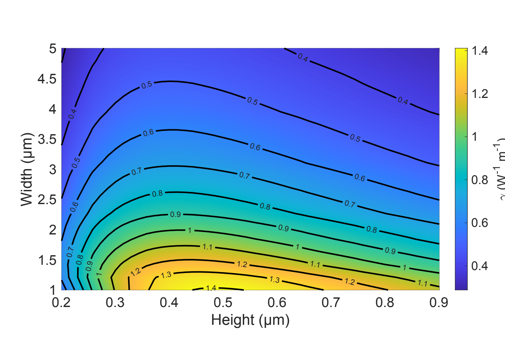

**Figure S2.** Computed Kerr nonlinear coefficient γ as a function of the width and height of a Si3N4 waveguide at 1.55 μm wavelength.

Mamyshev oscillator MLLs are particularly sensitive to parasitic backreflections, which can lead to undesirable continuous-wave lasing in the cavity, reduced round-trip gain, and eventually failure to reach stable mode-locking. To model wideband Fresnel backreflections at the chip facets, which represent the dominant source of reflections, we introduce a correction term to the grating reflectivity: \(R'\_i = R\_i + \sqrt{R\_\mathrm{parasitic}}(1-|R\_i|^2)\exp(\mathrm{i}\varphi)/[1 + R\_i\sqrt{R\_\mathrm{parasitic}}\exp(\mathrm{i}\varphi)]\), where *R*parasitic is the measured power back-reflection ratio, and ϕ is the frequency-dependent, round-trip propagation phase between the grating and facet.

The typical parameters for the integrated Mamyshev MLL are listed in Table S2. These parameters are used to produce the pulse propagation simulation shown in Fig. 1(c) of the main text. The silicon nitride waveguide is assumed to have a refractive index of 1.98 at the wavelengths of interest.

Table S2: Parameters used in the integrated Mamyshev MLL simulation

| Symbol | Variable name | Description | Value |
| --- | --- | --- | --- |
| λs |  | Simulation center wavelength | 1550 nm |
| λp |  | Pump wavelength | 1480 nm |
| *l* | l | Length of doped waveguide | 0.42 m |
| *n*g | ng | Waveguide group refractive index | 2.0023 |
| β2 | beta2 | Group-velocity dispersion | 0.715 ps2/m |
| β3 | beta3 | Third-order dispersion | −1.81 × 10−3 ps3/m |
| γ | gamma\_nl | Kerr nonlinear coefficient | 1.145 W−1 m−1 |
| α | alpha\_loss | Propagation loss | 10 dB/m = 2.3 m−1 |
| *n*cluster | clusteringFrac | Fraction of clustered ions | 0.06 |
| Γ | overlap | Mode-gain overlap | 0.22 |
| *N*0 | N0 | Peak erbium ion concentration | 3.68 × 1026 m−3 |
| *A*s, *A*p | As, Ap | Effective mode area (signal, pump) | 1.5 × 10−12 m2 |
| τ | tau | Upper-state lifetime | 3.0 × 10−3 s |
| σ12p, σ12s | s12p, s12s | Absorption cross-sections (pump, signal) | 3.43 × 10−25 m2; 2.53 × 10−25 m2 |
| σ21p, σ21s | s21p, s21s | Emission cross-sections (pump, signal) | 5.9 × 10−26 m2; 4.48 × 10−25 m2 |
| Δλg | delta\_lambda\_g | Gain bandwidth | 40 nm |
| *P*p,fwd | pump\_power\_fwd | On-chip forward pump power | 450 mW |
| *P*p,bwd | pump\_power\_bwd | On-chip backward pump power | 390 mW |
| Δλf | filter\_gap | Offset between filters | 8.9 nm |
| *R*parasitic | br | Power back-reflection ratio | 1.0 × 10−3 |
| *N* | NN | Number of grating periods | 950 |
| Δ*n* | dn | Peak-to-peak effective index modulation | 8.6 × 10−3 |
| Δ*l*/*l* | parasitic\_chirping | Parasitic chirping due to index change | 1.2 × 10−3 |
| σapo | apodization\_sigma | Standard deviation of the Gaussian apodization | 0.15 |

### C. Simulation results

For reference, we define Grating 1 as the red-shifted WBG and Grating 2 as the blue-shifted one. "Forward propagation" refers to the direction from Grating 1 to Grating 2, while "backward propagation" is from Grating 2 to Grating 1. All reported powers in the simulation correspond to on-chip values.

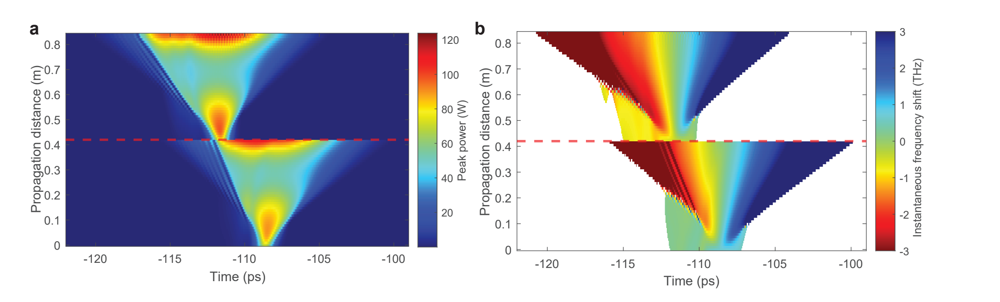

**Figure S3. Pulse propagation in the time domain.** **a**, Time-domain intensity of the pulse as a function of propagation length within the cavity. The red dashed line indicates the transition from forward to backward propagation after filtering. **b**, Instantaneous frequency of the pulse as a function of propagation distance. The white area indicates where the pulse intensity is less than 0.1% of the peak and the chirping is irrelevant.

Figure S3 shows the simulated time-domain evolution of the pulse as it propagates through the cavity. The pulse acquires a linear chirp and broadens significantly to several picoseconds due to the strong normal GVD of the waveguide, which disperses the newly generated frequency components. The intracavity peak power remains within 50 W to 125 W throughout the round-trip, allowing for substantial self-phase modulation (SPM) without inducing pulse instability or damage to the waveguide.

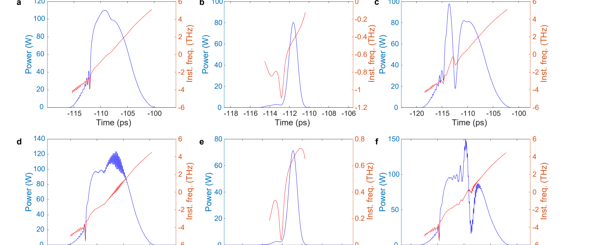

**Figure S4. Pulse waveforms and chirp at key locations.** **a**, Pulse after forward propagation, before WBG reflection. **b**, Pulse after forward propagation, immediately after reflection. **c**, Output pulse transmitted through WBG after forward propagation. **d**–**f**, Same as a–c, but for backward propagation.

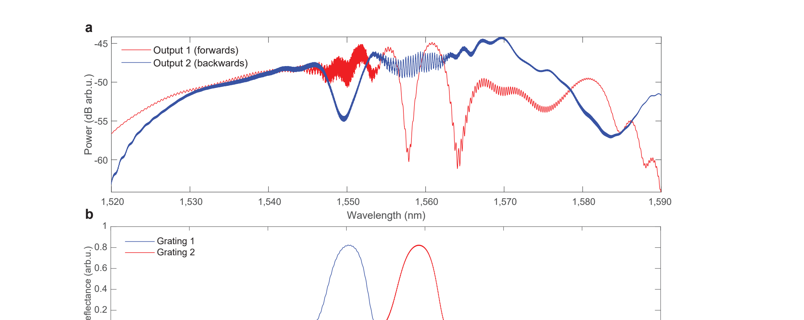

**Figure S5. Simulated frequency-domain results.** **a**, Output spectra of the Mamyshev oscillator. **b**, Reflectance spectra of the WBGs including modeled facet parasitic reflections.

Figure S4 shows the time-domain envelope and instantaneous frequency at various points in the cavity, including the reflected and transmitted pulses at the WBGs. The simulated output pulses from both gratings feature pulse widths of a few picoseconds and clearly exhibit a linear frequency chirp. This indicates that the output pulses can be significantly compressed by group delay dispersion compensation. Figure S5 presents the simulated optical spectra of the laser outputs along with the modeled WBG reflectance. While the details of the spectra differ from the measured ones, the simulations reproduced key features such as spectral valleys and fine oscillations on one side of the output. Figure S6 presents the pulse after optimal group delay dispersion compensation. Sub-150 fs compressed pulses are achieved from both output directions, with peak powers at the kilowatt level.

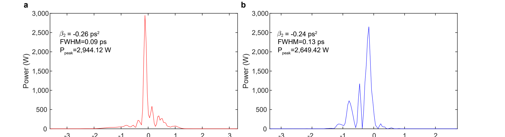

**Figure S6. Compressed output pulses.** **a**, Forward-propagated and **b**, Backward-propagated output pulse after optimal group delay dispersion compensation. β2: group delay dispersion applied. FWHM: full width at half maximum of the compressed pulse. *P*peak: peak power after compression.

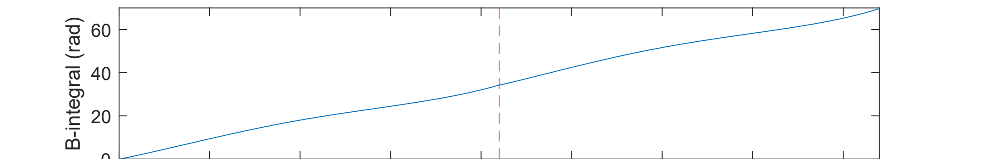

**Figure S7.** Accumulated nonlinear phase shift (B-integral) during pulse propagation in the linear cavity. The vertical line separates forward and backward propagation segments.

The accumulated nonlinear phase shift during a round-trip is semi-quantitatively characterized using the B-integral \(B = \int\_0^{2l} \gamma I\_{\mathrm{s,prop}}(z)\,\mathrm{d}z\) [57]. Figure S7 shows the B-integral as a function of propagation length. The maximum B-integral reaches approximately 20π per round-trip, which is well beyond the regime accessible in soliton-based mode-locking [43, 57].

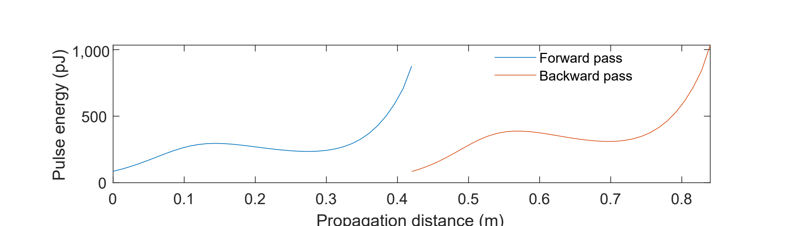

**Figure S8.** Pulse energy as a function of the propagation distance. The forward propagation pass and backward propagation pass are plotted separately and the drop in energy represents out-coupling from the cavity.

Figure S8 shows the evolution of pulse energy during propagation. The forward pass and the backward pass are plotted separately, and the abrupt drop in energy represents output coupling from the cavity. One notes that the pulse energy increases at both the beginning and the end of the cavity, while slightly decreasing in the middle section. We believe this is due to the rapid depletion of the pump power at both ends of the waveguide, leading to insufficient population inversion at the center. In future developments, a more uniform intra-cavity gain profile may be achieved by decreasing the erbium doping concentration or engineered selective doping. The fractions of incident power reflected by the WBGs are 8.3% and 9.6% for the WBG before the forward pass and that after the forward pass, respectively.

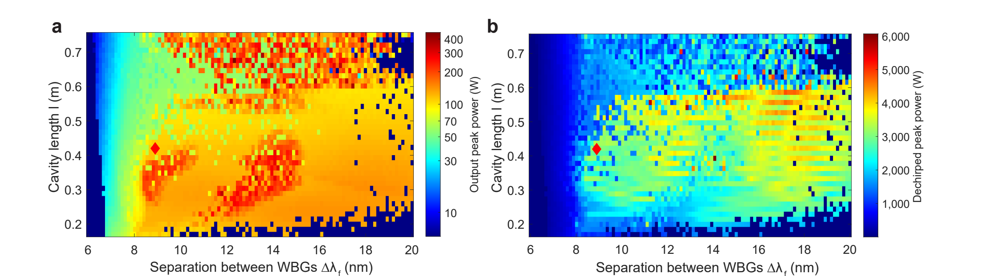

**Figure S9. Parameter map of peak power.** **a**, Intracavity peak power after backward propagation as a function of WBG center wavelength offset Δλf and cavity length *l*. Color map is in logarithmic scale. **b**, Output peak power after optimal group delay dispersion compensation. The red diamond marker indicates the location of the current design.

Figure S9 shows the simulated intracavity and dispersion compensated output peak power of the stable solution as a function of two key design parameters: the grating center wavelength offset Δλf and the cavity length *l*. A wide parameter range supports stable mode-locking, with WBG separations ranging from 7 nm to 20 nm and cavity lengths from 15 cm to 75 cm. However, for cavity lengths exceeding 57 cm combined with relatively large grating separations, the algorithm often fails to converge to a stable solution. These regions are suspected to correspond to chaotic states where the pulse becomes unstable, possibly due to excessive nonlinear phase accumulation within a round-trip. The cavity lengths where stable mode-locking is observed correspond to a repetition rate range of 500 MHz to 131 MHz. Further extension of the repetition range may be achieved either by using a higher doping concentration, by including additional sections of dispersion engineered passive (undoped) waveguides in the cavity, or by using a pulse interleaver at the output [58]. Our current design is made with a moderate cavity length and relatively small grating separation, to enable reuse of calibrated grating designs. It lies well within the stable regime, leaving a margin for unforeseen fabrication variations. We believe that in future developments, different repetition rates and potentially higher dechirped peak power can be achieved with an optimized design.

### D. Design analysis guidelines

One way to understand the pulse propagation behavior in the waveguides is to rewrite the GNLSE (Eq. (1)) in a normalized, dimensionless form following [47]. We define a characteristic pulse duration *T*0 and a characteristic peak power *P*0 for the pulse reflecting off the grating. This allows us to define two fundamental length scales: the dispersion length *L*D = *T*02/|β2| and the nonlinear length *L*NL = 1/(γ*P*0). We then introduce dimensionless variables for distance (ξ), time (τ), and the optical field (*U*):

$$\xi = \frac{z}{L\_{\mathrm{D}}}, \quad \tau = \frac{t}{T\_0}, \quad U = \frac{A}{\sqrt{P\_0}} \tag{7}$$

Substituting these into the original equation and multiplying by *L*D yields the normalized form. We define the soliton number \(N = \sqrt{\gamma P\_0 L\_{\mathrm{D}}} = \sqrt{L\_{\mathrm{D}}/L\_{\mathrm{NL}}}\) and the normalized net gain \(\hat{g} = (g - \alpha)L\_{\mathrm{D}}\). The term \(\hat{g}\) represents the net power growth scaled to the dispersion length; in lasers, this is subject to gain saturation and clamping, and is determined by intracavity loss and the out-coupling ratio. The propagation equation thus simplifies to:

$$\frac{\partial U}{\partial \xi} = -\frac{i}{2}\,\mathrm{sgn}(\beta\_2)\frac{\partial^2 U}{\partial \tau^2} + \frac{\hat{g}}{2} U + i N^2 |U|^2 U \tag{8}$$

Table S3. Comparison of physical and dimensionless parameters between a typical fiber-based Mamyshev oscillator design and the integrated Si3N4 oscillator. Some parameters are order-of-magnitude estimates extracted from [43]. *T*0 and *P*0 correspond to the pulse passing through/reflected by the filter and entering the nonlinear section.

| Parameter | Symbol | Fiber laser [43] Yb-doped SMF | Integrated laser 350 nm thick Er:Si3N4 | Integrated laser 600 nm thick Er:Si3N4 |
| --- | --- | --- | --- | --- |
| Physical parameters | | | | |
| Center wavelength | λc | 1030 nm | 1555 nm | 1555 nm |
| Nonlinear coefficient | γ | 0.005 W−1m−1 | 1.145 W−1m−1 | 0.987 W−1m−1 |
| Group velocity dispersion | β2 | ∼ 0.025 ps2/m | 0.715 ps2/m | 0.069 ps2/m |
| Saturated gain | *g*sat | 𝒪(4 dB/m) | 𝒪(25 dB/m) | 𝒪(21 dB/m) |
| Cavity half-length | *l* | 4.1 m | 0.42 m | 0.6 m |
| Filter bandwidth |  | 4 nm | 5 nm | 5 nm |
| Parameters from numerical simulation, *P*p = 75 mW for 600 nm integrated laser. | | | | |
| Filtered pulse width | *T*0 | ∼ 0.5 ps | ∼ 1 ps | ∼ 1 ps |
| Peak power | *P*0 | ∼ 2 kW | ∼ 80 W | ∼ 7 W |
| Dimensionless parameters for pulse propagation | | | | |
| Dispersion length | *L*D = *T*02/|β2| | ∼ 10 m | ∼ 1.4 m | ∼ 15 m |
| Normalized cavity length | *l*/*L*D | ∼ 0.4 | ∼ 0.3 | ∼ 0.04 |
| Nonlinear length | *L*NL = 1/(γ*P*0) | ∼ 0.1 m | ∼ 0.01 m | ∼ 0.14 m |
| Soliton number | *N* = √(*L*D/*L*NL) | ∼ 10 | ∼ 9 | ∼ 10 |
| Norm. saturated gain | \(\hat{g}\) = *g*sat*L*D | 𝒪(35) | 𝒪(40) | 𝒪(315) |

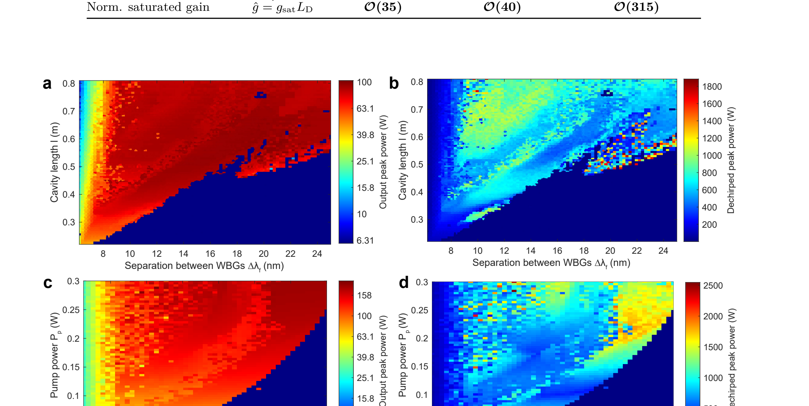

**Figure S10. Parameter maps of peak power for a 2 μm × 600 nm waveguide.** **a**, Intracavity peak power after backward propagation versus WBG center-wavelength offset Δλf and cavity length *l* (logarithmic color scale). Pump power *P*p,fwd = *P*p,bwd = *P*p = 75 mW. **b**, Output peak power after optimal group-delay-dispersion compensation versus WBG center-wavelength offset Δλf and cavity length *l*. **c**, Intracavity peak power after backward propagation versus pump power *P*p and WBG center-wavelength offset Δλf. **d**, Output peak power after optimal group-delay-dispersion compensation versus pump power *P*p and WBG center-wavelength offset Δλf.

This implies that in (8), if *N*2 and \(\hat{g}\) are comparable for two systems, the pulse propagation dynamics will also be similar. Table S3 compares the key parameters of two different integrated Mamyshev oscillator designs to those in optical fiber [43]. While the integrated Mamyshev oscillator is governed by the same underlying physics (Kerr nonlinearity, dispersion, and rare-earth doped gain) as its fiber-based counterparts, the unnormalized physical parameters of the integrated platform (γ, β2, *l*, *g*, α) are in a vastly different regime due to the tighter mode-confinement in waveguides. However, both integrated designs feature a comparable soliton number (*N* ∼ 10) to the fiber-based laser, though the normalized gain factor \(\hat{g}\) differs significantly. Our intuition is that, to prevent wave-breaking and ensure gradual self-phase modulation during propagation, it is preferable to maintain *N* ∼ 𝒪(10) while utilizing normal GVD (sgn(β2) > 0). Consequently, stronger normal dispersion and a wider grating bandwidth (which decreases *T*0) permit a higher peak power *P*0. A wider grating also increases the total reflectance of the circulating power and the cavity finesse, potentially decreasing threshold power. Thus, the strong normal dispersion of the 350 nm thick waveguides and the high 3 dB grating bandwidth in our current design directly contribute to the high peak power and pulse energy achieved experimentally. These design principles can be adapted to other waveguide platforms selected for availability or co-integration requirements. Alternative platforms may present different material refractive indices, dispersion profiles, cross-sectional geometries, and gain properties, alongside cavity length (*l*) limitations dictated by chip area and defect rates. The first step in the design is extracting parameters for gain, passive loss, and maximum achievable non-chirped grating bandwidth (often limited by the fabrication process via Δ*n*). Given a specific application constraint on pump power, the numerical analysis described above can determine suitable operational parameters. As an example, an alternative design could target a lower-power integrated Mamyshev oscillator featuring a reduced mode-locking threshold, trading off output pulse energy. For this goal, one can reduce the waveguide dispersion β2 to allow a similar *N* ∼ 10 to be reached for a reduced *P*0. We can select Er:Si3N4 waveguides with a 2 μm × 600 nm cross-section. Compared to the 350 nm devices used in the main text, these exhibit significantly weaker normal dispersion (β2 = 0.069 ps2/m) but a comparable nonlinear coefficient (γ = 0.987 W−1m−1, Figure S2). If ion implantation is similarly restricted to a maximum energy of 500 keV (a common practical limit for air-insulated implanters), the overlap factor Γ drops significantly to ∼ 0.09. This can be partially countered by increasing the peak erbium ion concentration *N*0 to 4.76 × 1026 m−3; if higher-energy implantation is available, the ion distribution and dose should be adjusted accordingly [59].

Assuming the same grating response as the 350 nm lasers, numerical simulations indicate a wide range of feasible mode-locking parameters. The acceptable WBG separation Δλf scales with cavity length *l* (Figure S10 a,b), though an unstable pulsing regime appears at Δλf > 18 nm and *l* > 0.45 m. This aligns with the physical intuition that longer cavities produce more self-phase modulation, allowing for greater filter separation, but risk destabilizing the pulse due to extreme nonlinear phase shifts. Simulations demonstrate this laser can operate at on-chip pump powers as low as *P*p = 25 mW per side. Parameter sweeps of Δλf and *P*p (Figure S10 c,d) map the regions supporting stable mode-locking. Higher pump powers increase intracavity power and spectral broadening, accommodating larger grating separations. However, increasing *P*p beyond 100 mW at narrow grating separations (< 10 nm) degrades pulse stability (where *N* increases to above ∼ 20), indicating a regime that should be avoided. Final design parameters should be selected within these established stable boundaries.

## S3. Detailed description of the experiment setup

### A. Basic mode-locking operation

Pump power for the integrated MLL engine is currently provided by single-mode-fiber-coupled 1480 nm lasers. In the highest power demonstration, we use a Connet VLSS-1480-B-800-1 (based on two polarization combined laser diodes in a butterfly package, pump 1) and a Lumibird CRFL-05-1480-OM1-8230-FA (a Raman fiber laser) for the 959 mW pump 2. For the demonstrations with lower power, we use only the Connet laser. When the 959 mW pump 2 is used, the Lumibird laser is operated at 2 W output power and attenuated before sending to the wavelength division multiplexer (WDM).

In the demonstration of self-seeding by pump modulation, the pump lasers are polarization combined, butterfly packaged diode lasers. Two diodes from QPhotonics are used for pump 1 and one diode from QPhotonics and one from Aerodiode are used for pump 2. We note that for the self-seeding at lower power (approximately < 1000 mW total power), we have deliberately disabled one of the two diodes on each end to reach the lower total power. For the basic operation of the laser, no polarization beam combiners are required.

For future integration, we note that the currently used powers are compatible with high power InP laser diodes in butterfly packages after polarization combining, commercially available from vendors including Lumentum [60] (S35/S36 series, rated at 600 mW) and Anritsu (AF4B SERIES type E, rated at 650 mW). These laser diodes can be either hybrid integrated or integrated in systems as external pump modules. The use of the Lumibird Raman laser is purely for experimental convenience rather than a limitation of the architecture.

Two thin-film-filter-based WDMs (Ascentta FWDM-45-L-10-FA) are used to inject the 1480 nm pump light while simultaneously extracting the laser output in the 1550 nm band. To minimize back-reflection from the pump lasers, we use thin-film filter-based WDMs of the "1480nm pass / 1550nm reflect" configuration, which offer better 1550 nm band isolation at the 1480 nm port compared to typical fused-fiber WDMs or the "1550nm pass / 1480nm reflect" variants. These WDMs also feature sufficiently wide passbands in the 1550 nm range to accommodate the MLL output spectrum. The pump power after the WDM is calibrated using an optical power sensor (Thorlabs S145C).

We note that the WDMs can be readily implemented on chip using either a directional coupler or an unbalanced Mach-Zehnder interferometer design for future hybrid integrated devices. In this tapeout, we used 1480 nm pumping for a lower coupling loss with our current facet couplers designed for 1550 nm, while pumping at 980 nm is likely possible as well. A higher gain coefficient is achievable with 980 nm pumping due to the more complete population inversion, which may be helpful for extending this laser concept to higher repetition rates, although the quantum defect is larger and can lead to lower on-chip power efficiency, even though GaAs-based pump laser diodes are generally more power-efficient.

Isolators or circulators are placed along the 1550 nm signal path to suppress back-reflections from photodetectors and other diagnostic instruments for the characterizations shown in the main text. Meanwhile, we have also successfully demonstrated mode-locked operation without isolators or circulators (when self-seeded); no significant impact on performance has been observed, except that parasitic continuous-wave lasing may appear for the supercontinuum-generation experiment described below. If isolators are still desirable for downstream applications, passive and broadband hybrid-integrated isolators [61] have been recently shown. Such parasitic lasing does not prevent the laser from continuing to generate mode-locked pulses capable of driving an octave-spanning supercontinuum. This can be prevented by using butt coupling with index matching for the second thick silicon nitride chip, or, in future integration, by placing both waveguides on the same chip. The integrated microheaters are powered by a DC power supply (Rigol DP832A) or a source measure unit (Keithley 2450). For many samples, stable mode-locking can be reached without using the microheaters, although some samples required tuning to prevent parasitic continuous-wave lasing. Light is coupled into and out of the chip by butt-coupling with cleaved Coherent UHNA7 fibers. To reduce facet reflections, the fiber-chip interface is covered with index-matching gel (Thorlabs G608N3), ensuring no air gap remains at the contact point. The sample is mounted on a metal block equipped with a thermoelectric cooler, which is feedback-controlled via a thermistor for temperature stabilization. Thorlabs NanoMax flexure stages are used to position the fibers.

Average output powers from both outputs are monitored using Thorlabs S144C power sensors, placed after several broadband fiber directional couplers. During calibration, the wavelength-dependent insertion losses between the common port of the WDMs and the power sensors are characterized using a swept tunable laser and taken into account to ensure accurate measurement of the laser output power. The optical spectra from both outputs are simultaneously monitored using two optical spectrum analyzers (OSAs): a Yokogawa AQ6370D with a 0.2 nm resolution (Output 1), and a HP 71451B with 1 nm resolution (Output 2). The power spectral density (PSD) plots shown in the main text are corrected for insertion loss and normalized to a resolution bandwidth of 0.2 nm for both outputs. However, there remains significant uncertainty in the absolute power level in the optical spectrum due to the varying physical resolution bandwidths/instrument bandpass of these grating-based OSAs. The time-domain pulse traces are recorded using a DC-coupled fast photodiode (Thorlabs DET08CFC/M) and a digital oscilloscope.

### B. Self-seeding by pump modulation

The integrated Mamyshev oscillator can be self-seeded when the pump power is modulated. In that case, we use two Koheron CTL300 laser drivers for two laser diodes (Aerodiode) providing the pump from one side, and two SRS LDC502 laser drivers for two other diode lasers (QPhotonics and Aerodiode) providing pump from the other side. The powers are combined with a fiber-coupled polarization beam splitter and are directly applied to the WDMs. The current modulation is applied to the Koheron drivers via the digital bias switching input (BSEL), programmed to switch the current setpoint between zero and a fixed level. This allows fast modulation with a higher depth than the analog input despite a significant distortion in the waveform. For each pump power, we select a modulation frequency of the Koheron drivers between 1.5 MHz and 2.8 MHz to achieve the fastest startup, and the modulation frequency of the SRS drivers is fixed to 1.2 MHz due to the lower bandwidth of its analog modulation input.

The procedure to start the Mamyshev oscillator can be readily automated as follows:

1. Turn on the pump power.
2. Set the microheaters, wait up to 0.5 s for stabilization.
3. Enable pump modulation.
4. Wait for the time described in Section S6; *Optional*: detect whether the laser has already entered the mode-locking state with a photodiode. If so, skip waiting.
5. Disable pump modulation. *Now the laser should be mode-locked.*
6. *Optional*: Fine-tune the pump power and heater setpoint to target a desired pulse energy and output spectrum.

We note that programmable generation of the modulation signal can be straightforwardly implemented with low-cost electronics, such as using the pulse width modulation (PWM) outputs from modern microcontrollers. Applying the modulation to the laser diode driver is also possible with a transistor shunt switch.

### C. Autocorrelation characterization

To characterize the pulse duration after applying dispersion compensation, we perform intensity autocorrelation measurements using the output from Port 1 of the laser (path A in the main text). The signal is first sent through an optical isolator to prevent backreflections, then through a programmable optical filter (Finisar Waveshaper 1000s) for dispersion compensation, and is subsequently amplified using a home-built erbium-doped fiber amplifier (EDFA) to compensate for the ∼6 dB loss in the filter. The total fiber path length from the chip facet to the autocorrelator (APE pulseCheck USB 50) is approximately 11 m. We avoid the use of commercial EDFAs, which typically employ several meters of erbium-doped fiber and are known to introduce distortions to the pulse due to uncontrolled dispersion and nonlinear effects at high peak powers. Instead, we construct an EDFA with minimal fiber length to preserve the pulse fidelity. The custom EDFA consists of two 980/1550 nm WDMs (Thorlabs), a 980 nm pump laser diode (Aerodiode), and a short (∼50 cm) section of highly doped erbium fiber (LIEKKI ER80-4/125-HD-PM). To further minimize unwanted nonlinear broadening, we keep the fiber connection between the EDFA output and the autocorrelator as short as possible (approximately 1 m).

In an alternative approach, we employ the group delay dispersion of the SMF to compress the MLL output pulse. The signal from output 2 of the laser (path B) is routed through a SMF delay line to the autocorrelator. In this case, no EDFA is used and the autocorrelation measurement is performed directly after the fiber. The total length of the fiber is approximately 10 m, corresponding to a dispersion of −0.22 ps2.

### D. Coherence characterization

To characterize the radio-frequency (RF) repetition-rate beatnote via direct photodetection, we use a high-power-handling p-i-n photodiode (Discovery Semiconductor DSC40S). The RF spectrum is measured using an electronic signal analyzer (ESA, Keysight N9020A), while phase noise is characterized using a signal-source analyzer (Rohde & Schwarz FSUP26), which offers sensitivity beyond the phase noise floor of standard ESAs. The timing jitter *T*j is calculated by integrating the measured phase noise spectrum (after removing spurs), using \(T\_{\mathrm{j}} = \dfrac{1}{2\pi f\_{\mathrm{rep}}}\sqrt{2 \times \int 10^{\mathrm{SSBPN}(f)/10}\,\mathrm{d}f}\), where SSBPN(*f*) is the single-sideband phase noise at offset frequency *f* in units of dBc/Hz. An optical attenuator is used to adjust the optical power to the photodetector, as the photodetected RF signal phase noise can be affected by photodetector saturation and amplitude-noise-to-phase-noise (AM-to-PM) conversion. For narrowband measurements of the RF beatnote and its phase noise, we use bandpass filters (Mini-Circuits ZX75BP-1062-S+ for the 6th harmonic, ZX75BP-188-S+ and SLP-250+ for the fundamental harmonic) and a low-noise RF preamplifier (Mini-Circuits ZFL-1000LN+) to optimize the signal-to-noise ratio. For wideband spectral analysis of the beatnote, no preamplifier is used to avoid saturation and nonlinear harmonic generation within the amplifier.

To evaluate the linewidth of individual comb lines by heterodyne detection, we first preselect a narrow spectral portion of the MLL output using a tunable fiber Bragg grating (AOS GmbH), aligned to match the wavelength (∼ 1552 nm) of a single-frequency erbium-doped fiber laser (Koheras Adjustik). After optimizing polarization, the filtered comb signal and the reference laser are combined using a 50:50 directional coupler and detected with a balanced photodetector (Discovery Semiconductor DSC720-39). The resulting heterodyne signal is analyzed using an ESA (Rohde & Schwarz FSW). For frequency noise extraction, a 100 ms segment of the in-phase and quadrature baseband signal is recorded from the ESA, converted to phase and post-processed using Welch's method.

### E. External seeding

To initiate mode-locking in the integrated Mamyshev oscillator by external seeding, we use the experimental setup shown in Fig. S11. A commercial fiber MLL (Menlo ELMO High Power) serves as the seed source. Because the pulse width from the laser (51 fs full-width-half-maximum) is considerably shorter than required to start the integrated MLL, we employed a programmable optical filter (Finisar Waveshaper) to degrade the pulse to emulate a lower-performance laser. The spectrum of the seed pulse is reduced using a Gaussian-shaped filter, typically with a bandwidth of 0.15 THz to 0.6 THz. This also avoids excessive nonlinear broadening and pulse breaking of the seed pulse in subsequent fiber propagation in the test system. Meanwhile, a group delay dispersion of 0.4 ps/nm is also programmed to the filter to pre-compensate for dispersion in the fiber-based experiment setup. The pulse is subsequently amplified by another home-built low-nonlinearity erbium-doped fiber amplifier (EDFA) to boost the power to approximately 20 mW. To select single pulses from the pulse train, we use an electro-optic Mach-Zehnder intensity modulator (EOSpace) driven by a pulse picker board (Aerodiode). The pulse picker is synchronized with the seed MLL using the trigger output from the MLL. We note that the repetition rate of the seed MLL is unrelated to that of the integrated MLL when the mode-locked state has been initiated by the gated pulse. We also note that the Mamyshev oscillator is relatively tolerant to variations in seed pulse parameters, particularly when parasitic backreflections from the fiber coupling or experimental setup are minimized. During experiments, stable mode-locking can be established across a broad parameter space of the seed, even when the energy, filter bandwidth, or polarization state are varied substantially. We have observed that once started with a single pulse, the laser tends to stabilize at the same state as dictated by the pump power and grating configuration after tens of round-trips, like a stable attractor in the nonlinear dynamical system, regardless of the seed parameters. A single pulse is sufficient to start the mode-locked operation when the pump power is sufficient and fiber coupling alignment is optimized, corresponding to a starting time of tens of round trips (on the order of hundreds of nanoseconds).


**Figure S11.** Schematic of the seed source used to initiate Mamyshev oscillator operation and the setup for external seeded initiation of the mode-locked state.

The minimum bandwidth of the Gaussian-filtered pulse used for seeding is lower than 0.15 THz, corresponding to a transform-limited pulse width of ∼3 ps. The seed pulse energy delivered on chip ranged from 15 pJ to 45 pJ. We have achieved repeatable seeding with pulses of 15 pJ on-chip energy and 0.15 THz bandwidth, which is within reach of integrated III-V mode-locked diodes combined with on-chip erbium-doped waveguide amplifiers.

### F. Alternative starting method by extended cavity Q-switching

A high-energy, nanosecond-duration intracavity pulse can also initiate mode-locking. To demonstrate this, we construct an extended cavity by routing one output port of the device back into the waveguide and implementing active Q-switching using an external modulator. We use a higher off-chip pump power of 2000 mW from pump 1 and 820 mW from pump 2 during the starting, although these powers can be significantly lowered after mode-locking is started. As illustrated in Fig. S12, a controllable extended cavity is created using an electro-optic intensity modulator (EOSpace) in combination with a circulator (Thorlabs). The modulator is driven by a function generator at a repetition rate of 1 kHz, providing high transmission for approximately 200 ns per period in the extended arm of the cavity. A Q-switch pulse can build up in the main cavity and the extended arm after the gate is switched on, providing a pulse with sufficient energy to initiate the mode-locking (see Section S5). Since the intensity modulator operates on a single polarization with the orthogonal polarization being blocked, we empirically optimized the fiber polarization controller settings by monitoring the Q-switching behavior on an oscilloscope.


**Figure S12.** Schematic of the experimental setup for initiating the Mamyshev oscillator using an extended cavity Q-switching method.

### G. Supercontinuum generation

For the supercontinuum generation demonstration, the output from the WDM (including approximately 2.5 m of fiber) is routed through a series of fiber-connected components. The signal first passes through an optical isolator with a 2.18 m pigtail, followed by a polarization controller (3.43 m of fiber), and is then directed into a 1550 nm lensed fiber (approximately 2 m in length), which couples the light into a second Si3N4 chip. We estimate a coupling loss of 2.5 dB from fiber to chip near 1550 nm. The optical isolator is included to prevent back-reflection from the lensed fiber and the input facet of the Si3N4 supercontinuum chip (potentially up to a few percent) which can disrupt stable mode-locking. For future monolithic implementations, the optical isolator can be omitted, and the approximately 3.8 dB power penalty from coupling loss and fiber components can also be eliminated. The output from the second chip is collected using a similar 1550 nm lensed fiber (not optimized for short-wavelength coupling efficiency) and routed to two optical spectrum analyzers (Yokogawa AQ6375 and AQ6373) for spectral characterization. To eliminate potential second-order diffraction artifacts from the grating-based optical spectrum analyzers in the long-wavelength region (1800 nm to 2400 nm), two Thorlabs FELH1250 long-pass filters are used in a free-space fiber bench (Thorlabs) to block shorter wavelengths during acquisition in this region. The long end of the transmission band of the FELH1250 filters is 2150 nm and their transmission at >2200 nm is not documented, so it is possible that the output power at the longer wavelengths is underestimated.

### H. THz time-domain spectroscopy

We use two commercial fiber-coupled photoconductive antennas (PCAs; Menlo Systems TERA15-TX-FC and TERA15-RX-FC) for the THz field emission and sampling. Each PCA is equipped with a 1 m fiber pigtail and an integrated high-resistivity silicon hyperhemispherical lens to reduce beam divergence. Because the emitted THz beam remains weakly divergent, we use metallic off-axis parabolic mirrors (Thorlabs) for collimation and re-focusing. The total THz beam path length is approximately 25 cm.

After the WDMs, the output of the integrated Mamyshev oscillator is directly sent through a length of single-mode fiber for partial chirp compensation, followed by a polarization controller, a fiber-coupled polarization beam splitter (PBS), and a 50:50 splitter. No optical isolator is used. The polarization controller and the PBS are used for power monitoring and adjustable attenuation, since the > 100 mW laser output can easily exceed the optical power rating of the current PCAs used (PCAs rated for higher optical power are available on the market). After the final splitter, one arm is sent to the receiver PCA and the other to the transmitter PCA via a free-space optical delay line.

Before THz measurements, we optimize the pulse duration at the PCAs by selecting the dispersion-compensation fiber length while monitoring the pulse with an autocorrelator. To ensure that the autocorrelator measurement faithfully represents the pulses delivered to the PCAs, we insert an additional 1 m fiber section before the autocorrelator input, matching the fixed pigtail length of the PCAs. With this procedure, we routinely achieve autocorrelation function FWHM of approximately 200 fs at the PCA inputs. The time delay is provided by a motorized free-space delay line (Thorlabs ODL100) operated at 20 mm s−1 (double pass). In future systems aiming for a compact solution or fast scanning, asynchronous optical sampling techniques [62] could also be applied to eliminate the mechanical delay line.

To suppress 1/*f* noise from the PCAs and electronics, we employ lock-in detection and modulate the transmitted THz signal by applying a square-wave modulation to the transmitter PCA bias. A high-voltage amplifier (Falco WMA-300), driven by a function generator (Keysight 33622A) at approximately 23 kHz, provides a 0 V to 100 V modulation. The receiver PCA output is treated as a current signal from a high-impedance source; with a clear beam path, the peak photocurrent is typically on the order of 100 nA to 500 nA. We demodulate the signal using a lock-in amplifier (SRS SR630) with built-in transimpedance amplifier (106 V/A gain) and digitize the two-channel demodulated output with a NI USB-6216 acquisition device. We average multiple scans over approximately 5 min. The main THz electric field peaks from each scan are temporally aligned prior to averaging. Windowed Fourier transformation of the THz time-domain waveform yields the corresponding frequency-domain spectrum.

To demonstrate thickness metrology, we insert a double-side-polished, high-resistivity float-zone silicon wafer into the THz beam path. The time delay between the main pulse and the reflected pulse is Δ*t*rt = 11.93 ps. This delay corresponds to the round-trip propagation time of the terahertz pulse inside the silicon wafer. Accordingly, the single-pass delay is Δ*t*sp = Δ*t*rt/2 = 5.965 ps. Using the refractive index of *n*Si = 3.4173 [63], the wafer thickness is obtained from *d* = *c* Δ*t*rt / (2 *n*Si) = 523.3 μm, where *c* is the speed of light. The minimum measurable thickness is set by the minimum resolvable separation between the main pulse and its internal-reflection replica. In our THz-TDS system, the 3 dB width of the main time-domain peak is Δ*t*rt,3dB = 0.35 ps, and we take this value as an estimate of the minimum resolvable delay without using deconvolution. The corresponding thickness resolution is therefore *d*min = *c* Δ*t*rt,3dB / (2 *n*Si) = 15.4 μm.

To demonstrate material identification, we measure lactose (C12H22O11), which exhibits well-known absorption features in the THz band and is of practical interest as lactose content in dairy products such as milk powder is relevant to individuals with lactose intolerance. A sample of lactose powder (Adipogen SA) is sealed in a thin plastic bag and placed in the beam path; the bag material is effectively transparent at THz frequencies. For comparison, we place wheat flour (from a local supermarket) packaged in an identical bag, which is visually similar to lactose, in the beam path. We compute the absorbance as *A*(*f*) = −ln[*T*(*f*)], where the transmittance is *T*(*f*) = *P*sample(*f*)/*P*reference(*f*) and *P*(*f*) denotes the measured THz power.

## S4. Details on the waveguide Bragg gratings

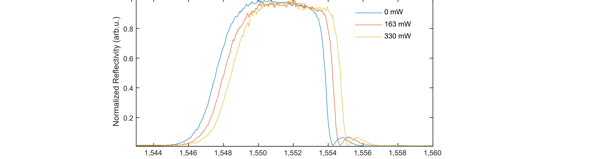

**Figure S13.** Normalized reflectance spectrum of a representative WBG for different electrical powers applied to the microheater (0 mW, 163 mW, and 330 mW). The reflection band red-shifts with increasing heater power.

For the WBGs, we adopt an apodized grating design [64], using only 950 grating periods to reduce both chromatic dispersion and cladding mode scattering loss at the pump wavelength [65], while maintaining sufficient reflectivity.

The unpowered grating reflection spectrum shown in Figure 1h of the main text is characterized using a swept single-frequency laser (Toptica CTL) serving as the probe source. The reflected signal is extracted using a 50:50 directional coupler (Fibermart) and measured with a power meter (Thorlabs) at the polarization maximizing reflection signal. Each of the two gratings is probed individually from the closest ends of the device. The probe power is kept sufficiently low to avoid reaching the transparency of the erbium-doped waveguides, ensuring that nearly all transmitted light is attenuated between the gratings. The same UHNA fiber butt-coupling setup as in the main experiments is used to minimize backreflections from the chip facets during measurement.

To quantify the thermal tunability of the WBGs, we separately characterize the WBG reflection spectrum at different heater powers. The measurement is performed with lensed fibers for chip coupling. The characterized grating has a slightly higher corrugation strength than the WBGs used in the laser experiments; however, the thermal tuning behavior is expected to be comparable because it is primarily determined by the cross-section geometry and thermal conductivity. As shown in Figure S13, increasing heater power produces a clear red shift of the reflection band. To extract the band center, we identify the two wavelengths at which the reflectivity reaches 50% on the rising and falling edges of the reflection band and take the average of the two. Using this definition, we obtain a tuning efficiency of approximately 2.66 pm/mW, corresponding to −0.332 GHz/mW near 1550 nm. We have operated the heaters continuously at ∼500 mW electrical power for several hours without observing degradation. At this power level, the demonstrated tuning range is approximately 1.33 nm. In future fabrications, thermal isolation trenches can be created during the deep etch die separation process to reduce the power requirement for tuning.

## S5. Dynamics of pulse build-up

In the experiments, mode-locking can be initiated either by (1) modulating the pump current, (2) using an external mode-locked laser to seed the laser or (3) generating an energetic pulse with an extended cavity and Q-switch.

The pump modulation method is preferable in most cases as no off-chip optical component is required and the pump current modulation can be implemented with commercial drivers (see Section S3 B) or simple external electronics. In that case, the pump can be modulated at a frequency close to the relaxation oscillation frequency of the parasitic continuous-wave lasing, thus leading to a significantly amplified response in the intracavity intensity or Q-switched pulsing. Such high-intensity, slow, quasi-continuous-wave (CW) pulsing can be observed in Figure S14, before the probabilistic initiation of a continuous train of fast mode-locked pulses. After the appearance of the mode-locked pulse, the pump current modulation can be disabled at any moment (i.e. can be immediately disabled, or if limited by control electronics, at any later time) as the mode-locked pulse train is stable. This is verified by using the burst mode of the signal generator for the modulation. When the modulation is disabled, the laser will then reproducibly convert into a stable pulsing state as shown in Figure S15. Notably, the required modulation frequency for the integrated laser is significantly higher (MHz level) than that for fiber-based lasers in [66] (100 kHz level), which corresponds to the difference in relaxation oscillation frequency.

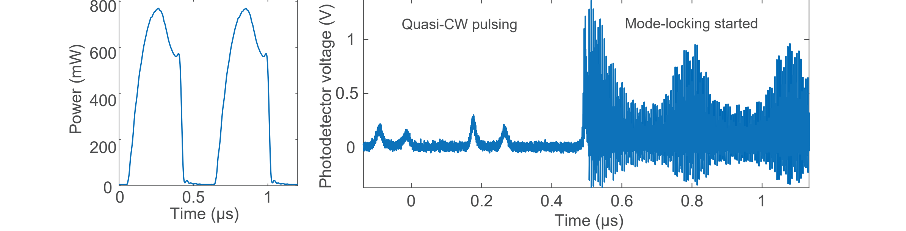

**Figure S14. The self-seeded pulse build-up process monitored with a photodetector and oscilloscope.** **a**, Instantaneous power of the diode laser when current modulated at 1.7 MHz. The vertical axis is calibrated against the average power measured with a thermal pile power meter. **b**, Pulse emergence from strong relaxation oscillation pulses. The captured trace only covers a segment before switching off the modulation. The amplitude modulation envelope of the mode-locked pulses will disappear when the modulation is switched off.

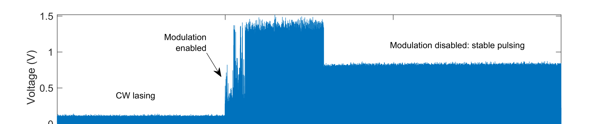

**Figure S15.** Pulse emergence dynamics from the relaxation oscillation pulsing, and transition into stable pulsing after switching off modulation.

Alternatively, pulse initiation can be achieved using an extended cavity arm and an electro-optic Q-switch, similar to the scheme in [67] with the effective saturable absorber replaced with a modulator. In this case, the dynamics differ significantly: mode-locked pulse trains emerge following a high-energy Q-switched pulse, as shown in Figure S16 b. The Q-switched pulse lasts approximately 24 ns and carries an on-chip energy on the order of 100 nJ, estimated roughly by integrating the pulse area (with possible large error due to photodiode saturation), comparable to the values reported in [68]. A train of fast pulses builds up after the slow Q-switched pulse and rapidly increases in amplitude, eventually splitting into two pulses after roughly 150 ns due to excess energy. This later evolves into a single-pulse state (Fig. S16 c) as the population inversion decreases. Significant amplitude fluctuations are observed immediately after initiation, but they damp out quickly and nearly vanish after around 3000 round-trips (Fig. S16 d), leading to a low noise mode-locked state. This behavior may correspond to the high-energy chaotic state during pulse build-up as discussed in [69].

When external seeding is used to start the mode-locked laser, Figure S16 a shows the temporal evolution when the laser is seeded by a short pulse from an external MLL, as described in Section S3 E. In this case, similar to the "coherence memory" regime reported in [69], the injected seed pulse directly evolves into the stable mode-locked pulse in the cavity. The pulse amplitude exhibits only a modest ∼20% overshoot before settling into a steady state within approximately 20 round-trips.

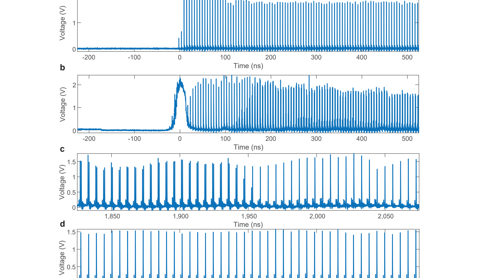

**Figure S16. Instantaneous output power during the pulse build-up process for external seeding or extended cavity Q-switching.** Monitored with a photodetector and oscilloscope. **a**, Pulse evolution after seeding by an external MLL pulse. **b**, Pulse evolution after initiation using an external cavity and Q-switch. **c**, Transition from a double-pulse state to a single-pulse state, occurring approximately 340 round-trips after b. **d**, Stable pulse train recorded approximately 3000 round-trips after b.

We note that the stable mode-locking state may be regarded as a stable attractor in the nonlinear system, and the system tends to reach that state given a certain set of grating and pump parameters, regardless of the route taken to reach it. In Figure S17, we compare the optical spectrum of the self-seeded mode-locked state and the state seeded by an external MLL, which is practically the same except for the expected fluctuations in the heater power and fiber coupling.

We would also like to note that we have never observed device damage during initialization of mode-locking using any of the three approaches for the currently presented devices fabricated with 350 nm thick silicon nitride. Despite the extreme intracavity pulse energy and peak power that may incur during the Q-switching or with pump modulation, we believe the damage threshold of the waveguides is still significantly higher than what is required for starting.

Several reports have demonstrated self-seeding or self-starting fiber-based Mamyshev oscillators using similar or different mechanisms [66, 70–72]. We believe the relative difficulty in starting the integrated Mamyshev oscillator arises from the large difference between the power of parasitic continuous-wave lasing and the peak power of the mode-locked pulses. To initiate mode-locking, a high intracavity gain is required to amplify small intensity fluctuations into a viable pulse seed. However, with a typical estimated back-reflection level of 10 log10 *R*parasitic ≈ −27 dB, parasitic lasing between one of the waveguide Bragg gratings (WBGs) and the reflection point clamps the single-pass gain to only 13.5 dB, insufficient to amplify noise to a level capable of sustained pulsing. In numerical simulation, we find that approximately −42 dB of back-reflection is required for self-starting from intracavity noise without pump modulation. Nevertheless, using angled edge couplers and matched fiber array units can significantly reduce chip facet reflectivity, currently the dominant source of parasitic back-reflection. For reference, commercial angled end-face fiber connectors (e.g.: FC/APC) can routinely achieve a back reflection level of −60 dB, which would be sufficient with a significant margin.

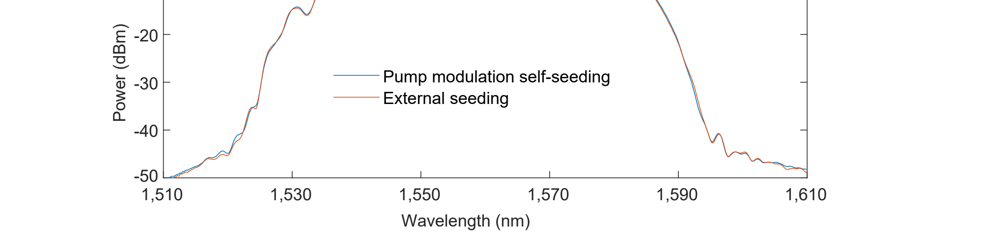

**Figure S17.** Comparison between the experimentally measured optical spectrum of a self-seeded mode-locked state and an external seeded state.

## S6. Time to start for self-seeding

For self-seeding of the integrated mode-locked laser by pump modulation, an important question is how long it takes from the start of pump modulation to the emergence of a stable mode-locked pulse train. Due to the probabilistic nature of self-seeding from slow relaxation-oscillation pulses with nanosecond duration (in contrast to external seeding), there is intrinsically a distribution of the time to start. This time is orders of magnitude longer than the cavity round-trip time. We statistically study the time to start at different pump-power levels by repeatedly applying pump modulation, waiting for the mode-locking to stabilize, and extinguishing mode-locking by either manually shifting the gratings or disabling the pump.

In the experiment, we generate a trigger signal indicating the initiation of mode-locked pulses by passing the laser output through an optical filter (Dicon, 0.8 nm bandwidth) centered at approximately 1538 nm. The quasi-continuous-wave parasitic lasing does not reach this wavelength; when mode-locked pulses with sufficient bandwidth are generated, significant power is detected by a photodiode (Thorlabs) after the filter. We feed the optical trigger signal to a digital oscilloscope to apply thresholding. We manually verified the oscilloscope traces to ensure that a continuous pulse train is generated after each triggering event. A National Instruments USB-6216 data acquisition device is used to measure the time difference between the first modulation edge sent to the laser driver and the trigger output from the oscilloscope.

As shown in Figure S18, reliable self-seeding is realized across a wide range of pump powers from 623 mW (467 mW on-chip) to 1012 mW (759 mW on-chip). Here, the pump-power level represents the total off-chip pump power at 1480 nm applied to both inputs of the integrated laser. For each pump-power level, more than 20 self-seeding events are recorded for statistical analysis. The self-seeding always occurs within 10 s, while in most cases it takes more than 100 μs. The rate of success is virtually 100%. Somewhat surprisingly, the time to start does not decrease monotonically with increasing pump power. We note that it is generally possible to initialize mode-locking at an advantageous pump-power level and then either increase or decrease the pump power to reach the desired operating state (either for higher lasing performance or for lower power consumption), while maintaining continuous mode-locked operation.

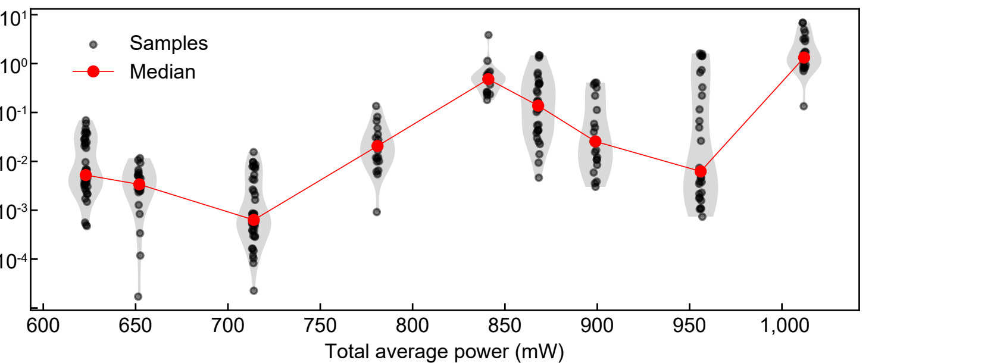

**Figure S18. Time to start:** Violin plot of the time to start stable mode-locking from the first modulation edge applied to the pump laser diodes, overlaid with the median time to start. The data points are dithered along the x-axis to allow visualization of each point with minimal overlap.

## S7. Fiber-to-chip coupling and output beam quality

To efficiently couple light from fiber to photonic integrated circuits, we use edge couplers with inverse tapers that transform the guided mode to better match the mode field in the optical fiber. We use Coherent UHNA7 fiber, which has a mode-field diameter (MFD) of approximately 3 μm near a wavelength of 1550 nm, spliced to conventional SMF-28 fiber. The edge coupling efficiency η is calculated from the vectorial field overlap [73]:

$$\eta = \frac{\int \boldsymbol{E}\_{\mathrm{f}} \times \boldsymbol{H}\_{\mathrm{w}} \cdot \mathrm{d}\boldsymbol{S} \, \int \boldsymbol{E}\_{\mathrm{w}} \times \boldsymbol{H}\_{\mathrm{f}} \cdot \mathrm{d}\boldsymbol{S}}{\int \boldsymbol{E}\_{\mathrm{f}} \times \boldsymbol{H}\_{\mathrm{f}} \cdot \mathrm{d}\boldsymbol{S} \, \int \boldsymbol{E}\_{\mathrm{w}} \times \boldsymbol{H}\_{\mathrm{w}} \cdot \mathrm{d}\boldsymbol{S}}, \tag{9}$$

where **E**f, **H**f, **E**w, **H**w are the electric and magnetic fields of the fiber and waveguide, respectively. The mode fields are simulated with commercial software (COMSOL) using the finite element method. The parameters of the UHNA7 fiber are extracted from the datasheet. The waveguide height is designed to be 350 nm as mentioned to leverage a high effective Kerr nonlinearity γ, while still maintaining sufficient overlap between the erbium ion distribution and the optical mode field. We conservatively designed the length of the tapering section to be 500 μm long to ensure adiabatic mode conversion. The theoretical coupling efficiency η as a function of taper width is shown in Fig. S19 a. The taper width is designed to be around 350 nm to maximize the mode-field overlap, which corresponds to a simulated fiber-to-fiber loss of 1.45 dB.

We characterized the coupling loss with a 2 cm dummy straight waveguide from the same wafer but without ion implantation, using a scanning single frequency laser and a power meter. As shown in Fig. S19 b, the average total fiber-to-fiber loss between 1540 nm and 1570 nm is approximately 2.52 dB, corresponding to a per-facet coupling loss of 1.26 dB. This value includes contributions from waveguide propagation loss (< 0.2 dB) and splice losses between SMF and UHNA7 fibers at both ends. The splice loss, estimated at 0.62 dB, is characterized by measuring the total loss of three spliced segments (SMF-UHNA7-SMF).

We note that thermal drift and the resulting hysteresis in the coupling setup (despite the use of a TEC) make manual coupling significantly more difficult when the fiber is "hot" (carrying significant pump and output power), compared to coupling to dummy waveguides at low power. This can be resolved by improving the design of the chip mount, or properly designed packaging of the photonic integrated circuit. The coupling loss described above should therefore be considered as a lower bound for the actual loss during the experiment. Meanwhile, we note that once the system reaches thermal equilibrium (potentially after realigning the fiber), sustained stable operation with the TEC disabled is possible and demonstrated experimentally.

We would like to also note that the 26 parallel waveguides in the current layout design are not meant for simultaneous operation, due to the space constraints at the coupling edge. The 20 μm spacing between the waveguides is too small for accessing individual cavities with fiber arrays (commonly with pitch of 127 μm or 250 μm). If a high-density array of MLLs is desired, single MLL cavities can be fitted in a footprint as small as 0.35 × 0.15 cm2 when the parallel spiral configuration is not used, using simulation-verified 70 μm radius bends and 9.5 μm waveguide spacing. This design requires a chip area less than 1/26 of that of the chip used in the current demonstration and can support higher integration density and better fabrication economy.

Concerning the beam quality of the emission, because we access the integrated mode-locked laser through facet couplers and butt-coupled single-mode fibers in near field, the concept of *M*2 does not directly apply. In this case, all the energy in the beam that is not matching the mode field is supposedly lost in the characterization. The facet couplers are also designed to feature a narrow taper that only supports the fundamental mode. For the above reason, we believe the *M*2 factor of the fiber-coupled output beams should be very close to 1. These fiber-coupled beams are also what we refer all power and energy characterizations results to. The relatively high coupling efficiency of approximately 75% shown in Section S7 indicates the output has a very high spatial coherence.

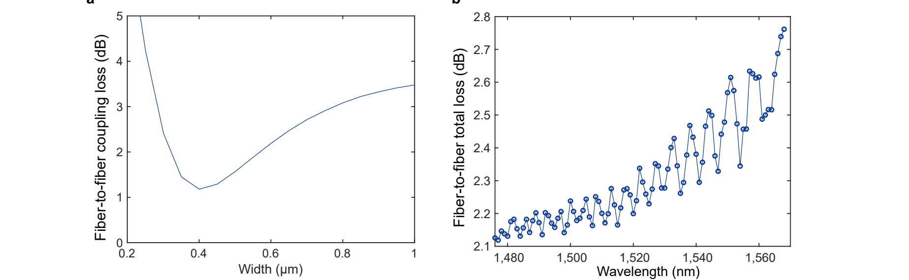

**Figure S19. Fiber to waveguide coupling loss.** **a**, Simulated fiber to chip to fiber coupling loss of TE mode of a cladded 350 nm thick Si3N4 waveguide to the UHNA7 fiber for different taper widths at 1.55 μm. **b**, Measured loss from fiber to chip to fiber for a 2 cm reference waveguide.

To explicitly confirm this, we characterize the beam diameter from a pre-aligned fiber collimator (Thorlabs F240APC-1550) as a function of the distance from the furthest surface of the collimator (Fig. S20), including the near field and the far field regime. A fit of the beam expansion to the scaled Gaussian beam expansion law (10) in logarithmic scale yields an estimation of *M*2 = 1.08, which is very close to 1, confirming the single-mode output.

$$D(z) = D(0) \sqrt{1 + \left(\frac{M^2 \lambda}{\pi w\_0^2} (z - z\_0)\right)^2}, \tag{10}$$

where *z*0 is the axial position of the waist, λ is the center wavelength, and *z* is the axial propagation coordinate at which the diameter *D*(*z*) is measured.

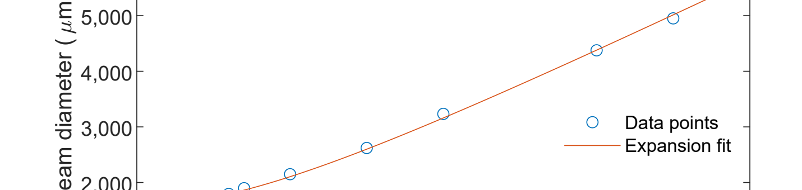

**Figure S20.** Beam diameter as a function of propagation distance after emerging from the fiber collimator.

## S8. Time domain pulse reconstruction from dispersion sweep data

It is well known that one cannot retrieve the optical pulse profile unambiguously from the intensity autocorrelation measurement alone. In our experiments, since we have acquired a series of intensity autocorrelation functions IAC(*t*) measured under different group-delay-dispersion values β2, together with the measured spectrum intensity |*E*(ω)|2, we can computationally reconstruct the amplitude and phase of the pulse. The phase to retrieve φ(ω) is defined by \(E(\omega) = |E(\omega)| e^{i\phi(\omega)}\) and its relation to the intensity autocorrelation IAC(*t*) can be established by the following equations. First, the time-domain intensity of the pulse *I*(*t*) with quadratic spectral phase assignment (β2) is given by:

$$I(t) = \left| \mathcal{F}^{-1} \left\{ |E(\omega)| \, e^{i\phi(\omega)} \, e^{i\frac{\beta\_2}{2}\omega^2} \right\} \right|^2, \tag{11}$$

where \(\mathcal{F}^{-1}\) denotes the inverse Fourier transform, and ω is the offset angular frequency with respect to the carrier frequency of light. The autocorrelation of intensity can be computed in the spectral domain using the Wiener–Khinchin theorem:

$$\mathrm{IAC}(t) = \mathcal{F}^{-1}\left\{ |\mathcal{F}\{I(t)\}|^2 \right\}, \tag{12}$$

where \(\mathcal{F}\) denotes the Fourier transform. Equations (11) and (12) describe the forward model of the phase retrieval problem.

We use the stochastic gradient descent optimizer in PyTorch, which implements automatic differentiation to calculate the gradient and perform backpropagation. The detailed algorithm is shown in Algorithm 2. Notably, we adopted the cosine similarity as the metric for the similarity between the measured and computed correlation functions, which is scale-invariant and thus robust to the amplitude mismatches between the computed and measured intensity autocorrelation function. We also applied a weighted time window to emphasize the region near the zero delay. In addition, we observed that subtracting the background at large time delays in both measured intensity autocorrelation and the forward model improves the retrieval quality. During optimization, the loss converges after 10000 iterations, and the reconstructed pulse reaches the shortest pulse width at β2 = 0.0189 ps2 (Fig. S21). The linear temporal phase in the main pulse peak indicates that the most of the pulse energy is well compressed. Minor ripples in the reconstructed pulse intensity away from the main peaks may be artifacts from the retrieval process. Figure S22 confirms the validity of the retrieved pulse, where the measured intensity autocorrelation is in good agreement with the computed intensity autocorrelation based on the retrieved pulse.

Algorithm 2: Spectral phase retrieval from measured intensity autocorrelation

```
Input: Measured optical spectrum |E(ω)|², measured autocorrelation map IAC_meas(t, β2)
       as a function of time delay t and dispersion values β2.
A. Data preprocessing:
   Define uniform time and frequency grids;
   Interpolate IAC_meas(t, β2) and |E(ω)| onto the uniform grids;
   Normalize, subtract the background, and apply weighting of IAC_meas(t, β2) for each β2:
     IAC_meas'(t, β2) ← w(t)(IAC_meas(t, β2) - min_t(IAC_meas(t, β2))).
B. Parameter initialization:
   Set an initial guess for spectral phase φ(ω);
   Create a weighting function w(t) centered at zero delay.
C. Forward model:
   Function ForwardModel(φ(ω), β2):
     // Compute the autocorrelation function for a given spectral phase and dispersion.
     E(ω) ← |E(ω)|·e^{iφ(ω)};
     E(t, β2) ← F^{-1}{E(ω)·e^{i β2/2 ·ω²}};
     I(t, β2) ← |E(t, β2)|²;
     Compute IAC_fwd(t, β2) of I(t, β2) via the Wiener–Khinchin theorem.
D. Spectral phase retrieval:
   for k ← 1 to n_iter do
       foreach dispersion value β2 do
           Compute the autocorrelation function: IAC_fwd(t, β2) ← ForwardModel(φ(ω), β2);
           Subtract background and apply weighting:
             IAC_est(t, β2) ← w(t)(IAC_fwd(t, β2) - min_t(IAC_fwd(t, β2)));
           Compute cosine similarity loss: L(β2) ← 1 - cos_sim(IAC_est(t, β2), IAC_meas'(t, β2));
       Compute average loss over all β2: L ← mean(L(β2));
       Update φ(ω) with the stochastic gradient descent algorithm.
```

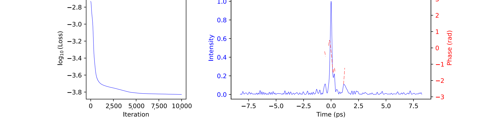

**Figure S21.** **a**, Evolution of the retrieval error over the course of the optimization iterations. **b**, Reconstructed pulse intensity and phase at the point of minimum pulse duration, corresponding to a dispersion value of β2 = 0.0189 ps2. The phase is shown only in regions where the pulse intensity exceeds a threshold for clarity.

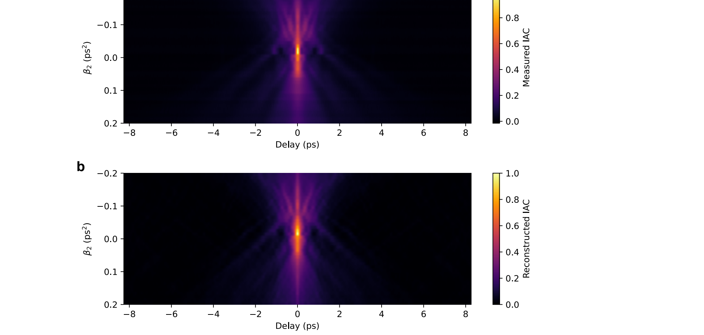

**Figure S22.** **a**, Measured and **b**, reconstructed intensity autocorrelation function, shown as a function of dispersion β2 and delay.

## S9. Simulation and additional experimental results of supercontinuum generation

In this section, we present simulations of supercontinuum generation based on the nonlinear Schrödinger equation (NLSE) [74, 75]. The input pulse is taken from the simulated output of the Mamyshev oscillator after chirp compensation (Fig. S6 a). While the simulated pulse in Fig. S6 a is compressed to its minimal width, in practice, the connecting optical fiber may slightly under- or over-compensate the chirp, since pulse compression is experimentally optimized by adjusting the fiber length in ∼1 m steps. To account for this, we also include a small residual chirp in the simulated input pulse. The on-chip average power is set to approximately 18 mW (corresponding to a peak power of ∼450 W), based on experimental estimates that take into account the input coupling loss. The nonlinear coefficient is calculated as a function of wavelength using the simulated effective mode area, and a propagation loss of 5 dB/m is assumed for the waveguide. The dispersion of the Si3N4 waveguide (Fig. 4e in the main text) is extracted from the broadband mode effective index simulation, obtained in COMSOL Multiphysics with the finite element method. The simulated waveguide cross-section is set to 2.07 μm × 0.70 μm, based on SEM measurements (Fig. 4 c in the main text). The generated visible light components below 600 nm measured on the OSA and observed with the naked eye during the experiment may result from modal-phase-matched third-harmonic generation, which is not modeled here.

Figure S23 shows the simulated supercontinuum spectrum in a 43.7 mm dispersion-engineered Si3N4 waveguide, exhibiting good agreement with the measured spectrum (Fig. 4d in the main text). Minor discrepancies may arise from uncertainties in the Si3N4 refractive index or variations in waveguide height across different samples. We also experimentally investigated supercontinuum generation in a longer Si3N4 waveguide (175 mm) with the same cross-section. The corresponding measured and simulated spectra are presented in Fig. S24 a and b, respectively. Compared to the 43.7 mm device, the 175 mm waveguide shows enhanced spectral broadening toward both shorter and longer wavelengths, though likely at the expense of reduced coherence. Figure S24 c illustrates the simulated spectral evolution along the propagation length. The results indicate that the 43.7 mm waveguide length approximately corresponds to the onset of octave-spanning supercontinuum generation, with the initial section contributing to compensating for the residual chirp of the input pulse.


**Figure S23.** Simulated supercontinuum generated in a 43.7 mm Si3N4 waveguide driven by the Mamyshev oscillator.

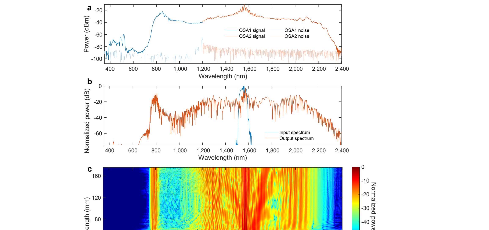

**Figure S24.** **a**, Experimentally measured supercontinuum generated in a 175 mm Si3N4 waveguide. **b**, Simulated supercontinuum generated in a 175 mm Si3N4 waveguide driven by the Mamyshev oscillator. **c**, Simulated evolution of spectra over a propagation distance of 175 mm. The dashed line marks the propagation distance of 43.7 mm, corresponding to the spectrum in Fig. S23.

## S10. Comparison with state-of-the-art terahertz TDS systems driven by integrated ultrafast sources

We compare our terahertz TDS demonstration with other state-of-the-art lab-scale experiments driven by integrated ultrafast sources, and with commercially available systems, in terms of peak dynamic range and bandwidth (Fig. S25, Table S4). For completeness, in Table S4, we have also included the comparison with several lab-scale experiments using table-top laser systems. The performance of our integrated Mamyshev oscillator-driven terahertz TDS system is superior to all existing terahertz TDS systems driven by integrated ultrafast sources, and is on par with commercial systems.

Table S4: Comparison of state-of-the-art terahertz TDS demonstrations

| Reference | Ultrafast optical source | Peak dynamic range (dB) | Bandwidth (THz) |
| --- | --- | --- | --- |
| **This work** | Integrated MLL | 90 | 5 |
| Integrated source demonstrations | | | |
| [76] | Semiconductor MLL | 45 | 0.6 |
| [77] | Semiconductor MLL | 65 | 0.9 |
| [78] | Semiconductor MLL | 60 | 1 |
| [79] | Semiconductor MLL | 56 | 1.4 |
| [80] | Semiconductor MLL | 68 | 1.6 |
| [81] | Semiconductor MLL | 65 | 1.1 |
| [82] | Semiconductor MLL | 70 | 1.2 |
| [83] | Semiconductor MLL | 90 (6.5 h avg.) | 1.6 |
| [84] | Microcomb | 40 | 0.6 |
| Commercial systems | | | |
| Menlo Systems Tera K15 | Fiber-based MLL | 100 | 6 |
| Menlo Systems Tera ASOPS | Fiber-based MLL | 70 | 4.5 |
| Toptica TeraFlash pro | Fiber-based MLL | 100 | 6 |
| Toptica TeraFlash smart | Fiber-based MLL | 80 | 4.5 |
| TeraView TeraPulse Lx Sample Chamber | Fiber-based MLL | 95 | 6 |
| TeraView TeraPulse Lx PolyScan Head | Fiber-based MLL | 80 | 4 |
| Advantest TAS7500SP | Fiber-based MLL | 70 | 4 |
| Advantest TAS7500SU | Fiber-based MLL | 70 | 7 |
| PNP Tera Prospector | Fiber-based MLL | 40 | 4 |
| BATOP TDS1008 | Fiber-based MLL | 85 | 4.5 |
| BATOP TDS1015 | Fiber-based MLL | 65 | 1.5 |
| Hamamatsu C12068-01 | Fiber-based MLL | 50 | 4 |
| Hamamatsu C12068-02 | Fiber-based MLL | 50 | 7 |
| Luna T-Ray 5000 Series HTS40n2 | Fiber-based MLL | 70 | 3.5 |
| Luna T-Ray 5000 Series HTS40n3 | Fiber-based MLL | 55 | 3.5 |
| Rainbow Photonics TeraSys-ULTRA | Fiber-based MLL | 70 | 20 |
| Rainbow Photonics TeraSys12 | Fiber-based MLL | 60 | 12 |
| Laboratory demonstrations using table-top lasers | | | |
| [85] | External cavity semiconductor MLL | 43 | 1.4 |
| [86] | Fiber-based MLL | 90 | 4.5 |
| [87] | Fiber-based MLL | 100 | 6.5 |
| [88] | Fiber-based MLL | ∼95 | 10 |
| [89] | Fiber-based MLL | 137 | 6.5 |
| [90] | Fiber-based MLL | 50 | 6 |
| [91] | Fiber-based MLL | 80 | 20 |
| [92] | Ti:Sapphire MLL | 100 | 6 |
| [93] | Mid-IR optical parametric amplifier | ∼45 | ∼20 |
| [94] | Ti:Sapphire MLL & amplifier | ∼55 | 200 |
| [95] | Ti:Sapphire MLL & amplifier | ∼70 | 13 |

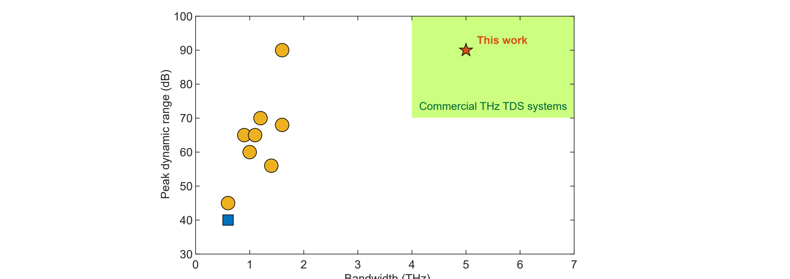

**Figure S25.** Performance comparison with state-of-the-art terahertz TDS systems driven by integrated ultrafast sources.

## S11. Single-pass pulse propagation in the gain section

One interesting question is how the pulse propagates in the gain section if it is isolated from the laser cavity and operated as a standalone amplifier for external pulse inputs. We performed a numerical simulation using the same gain and pump parameters as in Table S2 for a sech-shaped transform-limited pulse input with 10 W on-chip peak power, 3 ps duration and 175.5 MHz repetition rate. The input pulse is injected from the side with 450 mW pump power. Such a pulse train has properties similar to the seed pulses used for initiating the mode-locking when pump-modulation is not employed.

As shown in Figure S27 b, the spectrum is significantly broadened during the propagation in the amplifier with strong nonlinearity. The resulting pulse, shown in Figure S26, has a 1.57 nJ on-chip energy, features a linear chirp and can be compressed to a FWHM of approximately 150 fs when applying the ideal group delay dispersion. Several features in the propagation process such as the highly linear chirp and wave-breaking free propagation are consistent with the self-similar propagation in fiber amplifiers described in [96]. We believe this result shows a complementary approach to on-chip high-energy pulse generation, if suitable external seed pulses are available from other sources such as semiconductor mode-locked lasers2 or fiber-based lasers. However, pulse coherence, and whether such a hybrid system would require isolators between the source and the amplifier remain to be experimentally investigated.

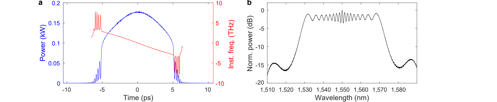

**Figure S26. Single-pass pulse output from the gain section:** **a**, The pulse output in time domain, showing the instantaneous power and the instantaneous frequency. **b**, The output power spectral density in frequency domain.

2 We note that existing integrated ultrafast sources typically generate pulses at repetition rates of 𝒪(1 GHz) to 𝒪(100 GHz) featuring relatively low pulse energies (Section S1). Pulse picking and an additional pre-amplification stage would likely be required to achieve sufficiently low repetition rate to produce a pulse train comparable to the input used in this simulation.

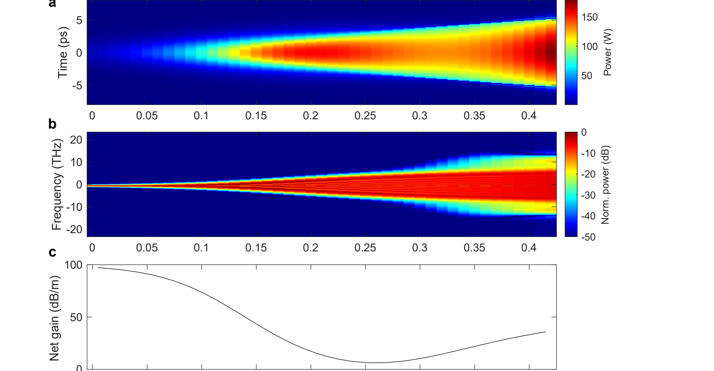

**Figure S27. Single-pass pulse evolution in the gain section:** **a**, Time domain evolution along the propagation. **b**, Frequency domain power spectral intensity of the pulse along the propagation. **c**, Net gain as a function of the propagation distance.

## References

1. Guo, Q. et al. Ultrafast mode-locked laser in nanophotonic lithium niobate. *Science* **382**, 708–713 (2023).
2. Suche, H. et al. Harmonically mode-locked Ti:Er:LiNbO3 waveguide laser. *Optics Letters* **20**, 596–598 (1995).
3. Ling, J. et al. Electrically empowered microcomb laser. *Nature Communications* **15**, 4192 (2024).
4. Byun, H. et al. Integrated low-jitter 400-MHz femtosecond waveguide laser. *IEEE Photonics Technology Letters* **21**, 763–765 (2009).
5. Pudo, D. et al. Scaling of passively mode-locked soliton erbium waveguide lasers based on slow saturable absorbers. *Opt. Express* **16**, 19221–19231 (2008).
6. Shtyrkova, K. et al. Integrated CMOS-compatible Q-switched mode-locked lasers at 1900 nm with an on-chip artificial saturable absorber. *Optics Express* **27**, 3542–3556 (2019).
7. Yu, M. et al. Integrated femtosecond pulse generator on thin-film lithium niobate. *Nature* **612**, 252–258 (2022).
8. Hu, Y. et al. High-efficiency and broadband on-chip electro-optic frequency comb generators. *Nature Photonics* **16**, 679–685 (2022).
9. Liu, J. et al. Photonic microwave generation in the X- and K-band using integrated soliton microcombs. *Nature Photonics* **14**, 486–491 (2020).
10. Helgason, Ó. B. et al. Surpassing the nonlinear conversion efficiency of soliton microcombs. *Nature Photonics* **17**, 992–999 (2023).
11. Dmitriev, N. Y. et al. Hybrid integrated dual-microcomb source. *Physical Review Applied* **18**, 034068 (2022).
12. Plant, J. J. et al. 250 mW, 1.5 μm monolithic passively mode-locked slab-coupled optical waveguide laser. *Optics Letters* **31**, 223–225 (2006).
13. Gopinath, J. T. et al. 980-nm monolithic passively mode-locked diode lasers with 62 pJ of pulse energy. *IEEE Photonics Technology Letters* **19**, 937–939 (2007).
14. Gubenko, A. et al. High-power monolithic passively modelocked quantum-dot laser. *Electronics Letters* **41**, 1124–1125 (2005).
15. Carpintero, G., Thompson, M., Yvind, K., Penty, R. & White, I. Comparison of the noise performance of 10 GHz repetition rate quantum-dot and quantum well monolithic mode-locked semiconductor lasers. *IET optoelectronics* **5**, 195–201 (2011).
16. Rafailov, E. U. et al. High-power picosecond and femtosecond pulse generation from a two-section mode-locked quantum-dot laser. *Applied Physics Letters* **87**, 081107 (2005).
17. Lu, Z. et al. 312-fs pulse generation from a passive C-band InAs/InP quantum dot mode-locked laser. *Optics Express* **16**, 10835–10840 (2008).
18. Nikitichev, D. I. et al. High peak power and sub-picosecond fourier-limited pulse generation from passively mode-locked monolithic two-section gain-guided tapered InGaAs quantum-dot lasers. *Laser Physics* **22**, 715–724 (2012).
19. Sun, D. et al. Generation of 10-GHz ultrashort pulse and flat optical comb using a semiconductor mode-locked laser. *Optics Communications* **583**, 131655 (2025).
20. Barbarin, Y. et al. Characterization of a 15 GHz integrated bulk InGaAsP passively modelocked ring laser at 1.53 μm. *Optics Express* **14**, 9716–9727 (2006).
21. Latkowski, S. et al. Monolithically integrated 2.5 GHz extended cavity mode-locked ring laser with intracavity phase modulators. *Opt. Lett.* **40**, 77–80 (2015).
22. Lo, M.-C. et al. 1.8-THz-wide optical frequency comb emitted from monolithic passively mode-locked semiconductor quantum-well laser. *Optics Letters* **42**, 3872–3875 (2017).
23. Cheung, S. et al. 1-GHz monolithically integrated hybrid mode-locked InP laser. *IEEE Photonics Technology Letters* **22**, 1793–1795 (2010).
24. Alloush, M. A. et al. RF analysis of a sub-GHz InP-based 1550 nm monolithic mode-locked laser chip. *IEEE Photonics Technology Letters* **33**, 828–831 (2021).
25. Auth, D., Liu, S., Norman, J., Bowers, J. E. & Breuer, S. Passively mode-locked semiconductor quantum dot on silicon laser with 400 Hz RF line width. *Opt. Express* **27**, 27256–27266 (2019).
26. Liu, S. et al. High-channel-count 20 GHz passively mode-locked quantum dot laser directly grown on Si with 4.1 Tbit/s transmission capacity. *Optica* **6**, 128–134 (2019).
27. Billet, M. et al. Heterogeneous tunable III-V-on-silicon-nitride mode-locked laser emitting wide optical spectra. *Photon. Res.* **12**, A21–A27 (2024).
28. Davenport, M. L., Liu, S. & Bowers, J. E. Integrated heterogeneous silicon/III-V mode-locked lasers. *Photon. Res.* **6**, 468–478 (2018).
29. Hermans, A. et al. High-pulse-energy III-V-on-silicon-nitride mode-locked laser. *APL Photonics* **6**, 096102 (2021).
30. Keyvaninia, S. et al. III–V-on-silicon anti-colliding pulse-type mode-locked laser. *Optics Letters* **40**, 3057–3060 (2015).
31. Cuyvers, S. et al. Low noise heterogeneous III-V-on-silicon-nitride mode-locked comb laser. *Laser & Photonics Reviews* **15**, 2000485 (2021).
32. Wang, Z. et al. A III-V-on-Si ultra-dense comb laser. *Light: Science & Applications* **6**, e16260–e16260 (2017).
33. Vissers, E., Poelman, S., de Beeck, C. O., Gasse, K. V. & Kuyken, B. Hybrid integrated mode-locked laser diodes with a silicon nitride extended cavity. *Opt. Express* **29**, 15013–15022 (2021).
34. Poelman, S., Reep, T., Billet, M. & Kuyken, B. High-power heterogeneously integrated mode-locked laser enabled by a booster amplifier. *Opt. Express* **33**, 54747–54756 (2025).
35. Kobayashi, M., Nakamura, T., Nakamae, H., Kim, C. & Akiyama, H. Gain-switched pulse generation of 5.3 ps from 30 GHz-modulation-bandwidth 1270 nm DBF laser diode. *Opt. Lett.* **48**, 6344–6347 (2023).
36. Weng, W. et al. Gain-switched semiconductor laser driven soliton microcombs. *Nature communications* **12**, 1425 (2021).
37. Optilab. Femtosecond Mode-Locked Laser Module – All-PM Fiber Option. https://www.optilab.com/products/femtosecond-mode-locked-laser-module-all-pm-fiber-option (2025). Accessed: 2025-06-22.
38. Menlo Systems. ELMO Femtosecond Erbium Laser. https://www.menlosystems.com/products/femtosecond-lasers-and-amplifiers/elmo/ (2025). Accessed: 2025-06-22.
39. Kokyo, Inc. (Symphotony). FL-MLEr-Kit-PM: PM-Type Mode-Locked Er Fiber Laser Kit (1.5 μm). https://en.symphotony.com/products/ultrafast-laser-kit/fl-mler-kit-pm/ (2025). Accessed: 2025-06-22.
40. AdValue Photonics. 2 μm Mode-Locked Fiber Seed Laser (AP-ML). https://advaluephotonics.com/products/fiber-lasers-amplifiers/picosecond-pulsed-2-%C2%B5m-mode-locked-fiber-lasers-ps-fs/2-micron-mode-locked-fiber-seed-ap-ml/ (2025). Accessed: 2025-06-22.
41. Cycle GmbH. SONATA – 1030 nm Yb Femtosecond Laser. https://www.cyclelasers.com/femtosecond-lasers/sonata-10-40/ (2025). Accessed: 2025-06-22.
42. Calmar Laser. 1550 nm Low Jitter Fiber Femtosecond Laser Data Sheet. https://www.calmarlaser.com/docs/datasheets/benchtop/1550%20nm%20Low%20Jitter%20Fiber%20fs.pdf (2020). Accessed: 2025-06-22.
43. Liu, Z., Ziegler, Z. M., Wright, L. G. & Wise, F. W. Megawatt peak power from a Mamyshev oscillator. *Optica* **4**, 649–654 (2017).
44. Liu, W. et al. Femtosecond Mamyshev oscillator with 10-MW-level peak power. *Optica* **6**, 194–197 (2019).
45. Lin, D. et al. The generation of 1.2 μJ pulses from a Mamyshev oscillator based on a high concentration, large-mode-area Yb-doped fiber. *Journal of Lightwave Technology* **40**, 7175–7179 (2022).
46. Hänsel, W. et al. All polarization-maintaining fiber laser architecture for robust femtosecond pulse generation. In *Exploring the World with the Laser: Dedicated to Theodor Hänsch on his 75th birthday*, 331–340 (Springer, 2018).
47. Agrawal, G. (ed.) *Nonlinear Fiber Optics (Fifth Edition)*. Optics and Photonics (Academic Press, Boston, 2013), fifth edition edn.
48. Becker, P. C., Anders Olsson, N. & Simpson, J. R. *Erbium-Doped Fiber Amplifiers*. Optics and Photonics (Academic Press, San Diego, 1999).
49. Giles, C. R. & Desurvire, E. Modeling erbium-doped fiber amplifiers. *Journal of Lightwave Technology* **9**, 271–283 (2002).
50. Robinson, J. T., Preston, K., Painter, O. & Lipson, M. First-principle derivation of gain in high-index-contrast waveguides. *Opt. Express* **16**, 16659–16669 (2008).
51. Delevaque, E., Georges, T., Monerie, M., Lamouler, P. & Bayon, J.-F. Modeling of pair-induced quenching in erbium-doped silicate fibers. *IEEE Photonics Technology Letters* **5**, 73–75 (1993).
52. Snoeks, E. et al. Cooperative upconversion in erbium-implanted soda-lime silicate glass optical waveguides. *J. Opt. Soc. Am. B* **12**, 1468–1474 (1995).
53. Gao, M. et al. Probing material absorption and optical nonlinearity of integrated photonic materials. *Nature communications* **13**, 3323 (2022).
54. Afshar, V. S., Monro, T. M. & de Sterke, C. M. Understanding the contribution of mode area and slow light to the effective Kerr nonlinearity of waveguides. *Opt. Express* **21**, 18558–18571 (2013).
55. Bjork, G. & Nilsson, O. A new exact and efficient numerical matrix theory of complicated laser structures: properties of asymmetric phase-shifted DFB lasers. *Journal of Lightwave Technology* **5**, 140–146 (1987).
56. Brückerhoff-Plückelmann, F. et al. General design flow for waveguide Bragg gratings. *Nanophotonics* (2025).
57. Fu, W., Wright, L. G., Sidorenko, P., Backus, S. & Wise, F. W. Several new directions for ultrafast fiber lasers. *Optics Express* **26**, 9432–9463 (2018).
58. Qiu, Z. et al. Large-scale photonic chip based pulse interleaver for low-noise microwave generation. *Nature Communications* **16** (2025).
59. Liu, Y. et al. A photonic integrated circuit–based erbium-doped amplifier. *Science* **376**, 1309–1313 (2022).
60. Lumentum Operations LLC. 600 mW fiber Bragg grating stabilized 14xx nm pump modules. Accessed: 2025-06-17.
61. Lapointe, J., Coia, C., Dupont, A. & Vallée, R. Passive broadband Faraday isolator for hybrid integration to photonic circuits without lens and external magnet. *Nature Photonics* **19**, 248–257 (2025).
62. Mosley, C. D. W. et al. Asynchronous optical sampling of on-chip terahertz devices for real-time sensing and imaging applications. *Opt. Express* **32**, 27940–27949 (2024).
63. Franta, D., Franta, P., Vohánka, J., Čermák, M. & Ohlídal, I. Determination of thicknesses and temperatures of crystalline silicon wafers from optical measurements in the far infrared region. *Journal of Applied Physics* **123**, 185707 (2018).
64. Erdogan, T. Fiber grating spectra. *Journal of Lightwave Technology* **15**, 1277–1294 (2002).
65. Zhan, J. et al. Investigation of backward cladding-mode coupling in bragg gratings implemented on a Si3N4 waveguide platform. *J. Opt. Soc. Am. B* **36**, 3442–3449 (2019).
66. Chen, Y.-H., Sidorenko, P., Thorne, R. & Wise, F. Starting dynamics of a linear-cavity femtosecond Mamyshev oscillator. *J. Opt. Soc. Am. B* **38**, 743–748 (2021).
67. Sidorenko, P., Fu, W., Wright, L. G., Olivier, M. & Wise, F. W. Self-seeded, multi-megawatt, Mamyshev oscillator. *Opt. Lett.* **43**, 2672–2675 (2018).
68. Singh, N. et al. Silicon photonics-based high-energy passively Q-switched laser. *Nature Photonics* **18**, 485–491 (2024).
69. Cao, B. et al. Coherence memory and amnesia in a mode-locked Mamyshev oscillator. *Optica* **11**, 1673–1681 (2024).
70. Rochette, M., Chen, L. R., Sun, K. & Hernandez-Cordero, J. Multiwavelength and tunable self-pulsating fiber cavity based on regenerative SPM spectral broadening and filtering. *IEEE Photonics Technology Letters* **20**, 1497–1499 (2008).
71. Liu, Z. et al. Mamyshev oscillation self-starting mode-locked fiber laser based on a self-feedback amplifying sub-cavity. *Opt. Lett.* **49**, 6397–6400 (2024).
72. Wang, C., Li, X. & Zhang, S. Automated start-up and extinction dynamics of a Mamyshev oscillator based on a temperature-dependent filter. *Laser & Photonics Reviews* **17**, 2201016 (2023).
73. Wu, Y. & Chiang, K. S. Mode-selective coupling between few-mode fibers and buried channel waveguides. *Optics Express* **24**, 30108–30123 (2016).
74. Dudley, J. M., Genty, G. & Coen, S. Supercontinuum generation in photonic crystal fiber. *Reviews of modern physics* **78**, 1135–1184 (2006).
75. Guo, H. et al. Mid-infrared frequency comb via coherent dispersive wave generation in silicon nitride nanophotonic waveguides. *Nature Photonics* **12**, 330–335 (2018).
76. Merghem, K. et al. Terahertz time-domain spectroscopy system driven by a monolithic semiconductor laser. *Journal of Infrared, Millimeter, and Terahertz Waves* **38**, 958–962 (2017).
77. Balzer, J. C., Tonder, S., Lehr, J. & Koch, M. THz TDS system driven by a commercially available laser diode. In *2019 44th International Conference on Infrared, Millimeter, and Terahertz Waves (IRMMW-THz)*, 1–2 (2019).
78. Tonder, S. C. et al. A compact THz quasi TDS system for mobile scenarios. In *2019 Second International Workshop on Mobile Terahertz Systems (IWMTS)*, 1–5 (2019).
79. Tybussek, K.-H., Kolpatzeck, K., Faridi, F., Preu, S. & Balzer, J. C. Terahertz time-domain spectroscopy based on commercially available 1550 nm Fabry–Perot laser diode and ErAs:In(Al)GaAs photoconductors. *Applied Sciences* **9**, 2704 (2019).
80. Kolpatzeck, K. et al. System-theoretical modeling of terahertz time-domain spectroscopy with ultra-high repetition rate mode-locked lasers. *Optics Express* **28**, 16935–16950 (2020).
81. Cherniak, V. et al. Direct time axis reconstruction for THz-TDS systems with ultra-high repetition rates. In *2020 45th International Conference on Infrared, Millimeter, and Terahertz Waves (IRMMW-THz)*, 1–2 (2020).
82. Cherniak, V. et al. Compact and inexpensive terahertz system driven by monolithically integrated commercial light sources. In *2021 46th International Conference on Infrared, Millimeter and Terahertz Waves (IRMMW-THz)*, 1–2 (2021).
83. Cherniak, V., Kubiczek, T., Kolpatzeck, K. & Balzer, J. C. Laser diode based THz-TDS system with 133 dB peak signal-to-noise ratio at 100 GHz. *Scientific Reports* **13**, 13476 (2023).
84. Peters, L. et al. Millimetre-wave comb generated by an optical microcomb. *arXiv preprint* (2025). 2512.05005.
85. Jördens, C. et al. All-semiconductor laser driven terahertz time-domain spectrometer. *Applied Physics B* **93**, 515–520 (2008).
86. Vieweg, N. et al. Terahertz-time domain spectrometer with 90 dB peak dynamic range. *Journal of Infrared, Millimeter, and Terahertz Waves* **35**, 823–832 (2014).
87. Kohlhaas, R. B. et al. Photoconductive terahertz detectors with 105 dB peak dynamic range made of rhodium doped InGaAs. *Applied Physics Letters* **114**, 221103 (2019).
88. Kohlhaas, R. B. et al. Ultrabroadband terahertz time-domain spectroscopy using III-V photoconductive membranes on silicon. *Opt. Express* **30**, 23896–23908 (2022).
89. Dohms, A. et al. Fiber-coupled THz TDS system with mW-level THz power and up to 137-dB dynamic range. *IEEE Transactions on Terahertz Science and Technology* **14**, 857–864 (2024).
90. Couture, N. et al. Compact, low-cost, and broadband terahertz time-domain spectrometer. *Appl. Opt.* **62**, 4097–4101 (2023).
91. Puc, U., Bach, T., Günter, P., Zgonik, M. & Jazbinsek, M. Ultra-broadband and high-dynamic-range THz time-domain spectroscopy system based on organic crystal emitter and detector in transmission and reflection geometry. *Advanced Photonics Research* **2**, 2000098 (2021).
92. Yardimci, N. T., Turan, D. & Jarrahi, M. Efficient photoconductive terahertz detection through photon trapping in plasmonic nanocavities. *APL Photonics* **6**, 080802 (2021).
93. Koulouklidis, A. D. et al. Observation of extremely efficient terahertz generation from mid-infrared two-color laser filaments. *Nature communications* **11**, 292 (2020).
94. Matsubara, E., Nagai, M. & Ashida, M. Ultrabroadband coherent electric field from far infrared to 200 THz using air plasma induced by 10 fs pulses. *Applied Physics Letters* **101**, 011105 (2012).
95. Singh, A., Pashkin, A., Winnerl, S., Helm, M. & Schneider, H. Gapless broadband terahertz emission from a germanium photoconductive emitter. *ACS Photonics* **5**, 2718–2723 (2018).
96. Kruglov, V. I., Peacock, A. C., Dudley, J. M. & Harvey, J. D. Self-similar propagation of high-power parabolic pulses in optical fiber amplifiers. *Opt. Lett.* **25**, 1753–1755 (2000).