https://doi.org/10.1088/1758-5090/ac8621

Received 11 March 2022; Revised 30 June 2022; Accepted for publication 2 August 2022; Published 19 August 2022

# Hybrid extracellular vesicles-liposome incorporated advanced bioink to deliver microRNA

Kamil Elkhoury1,2,10, Mo Chen1,3,10, Polen Koçak1,4, Eduardo Enciso-Martínez1, Nicole Joy Bassous1, Myung Chul Lee1, Batzaya Byambaa5, Zahra Rezaei1, Yang Li1, María Elizabeth Ubina López1, Melvin Gurian6, Nebras Sobahi7, Mohammad Asif Hussain7, Laura Sanchez-Gonzalez2, Jeroen Leijten6, Shabir Hassan1,8, Elmira Arab-Tehrany2, Jennifer Ellis Ward9 and Su Ryon Shin1,1,1,∗

1 Division of Engineering in Medicine, Department of Medicine, Harvard Medical School, Brigham and Women’s Hospital, Cambridge, MA 02139, United States of America

2 LIBio, Université de Lorraine, F-54000 Nancy, France

3 Department of Gynecology, Obstetrics & Gynecology Hospital, Fudan University, Shanghai 200011, People’s Republic of China

4 Department of Biomedical Engineering, Faculty of Engineering, İstinye University, 34396 Sariyer/Istanbul, Trukey

5 3D BioLabs, LLC, 700 Main St., Cambridge, MA 02138, United States of America

6 Department of Developmental BioEngineering, University of Twente, Enschede, Overijssel 7522 NB, The Netherlands

7 Department of Electrical and Computer Engineering, King Abdulaziz University, Jeddah 21569, Saudi Arabia

8 Department of Biology, Khalifa University, 127788 Abu Dhabi, United Arab Emirates

9 Department of Medicine, Harvard Medical School, Brigham and Women’s Hospital, Boston, MA 02115, United States of America

10 These authors contributed equally to this work.

∗ Author to whom any correspondence should be addressed.

E-mail: sshin4@bwh.harvard.edu

Keywords: extracellular vesicles, liposomes, bioink, 3D bioprinting, microRNAs, tissue regeneration

Supplementary material for this article is available online

© 2022 IOP Publishing Ltd. All rights, including for text and data mining, AI training, and similar technologies, are reserved.

## Abstract

In additive manufacturing, bioink formulations govern strategies to engineer 3D living tissues that mimic the complex architectures and functions of native tissues for successful tissue regeneration. Conventional 3D-printed tissues are limited in their ability to alter the fate of laden cells. Specifically, the efficient delivery of gene expression regulators (i.e. microRNAs (miRNAs)) to cells in bioprinted tissues has remained largely elusive. In this study, we explored the inclusion of extracellular vesicles (EVs), naturally occurring nanovesicles (NVs), into bioinks to resolve this challenge. EVs show excellent biocompatibility, rapid endocytosis, and low immunogenicity, which lead to the efficient delivery of miRNAs without measurable cytotoxicity. EVs were fused with liposomes to prolong and control their release by altering their physical interaction with the bioink. Hybrid EVs-liposome (hEL) NVs were embedded in gelatin-based hydrogels to create bioinks that could efficiently encapsulate and deliver miRNAs at the target site in a controlled and sustained manner. The regulation of cells’ gene expression in a 3D bioprinted matrix was achieved using the hELs-laden bioink as a precursor for excellent shape fidelity and high cell viability constructs. Novel regulatory factors-loaded bioinks will expedite the translation of new bioprinting applications in the tissue engineering field.

## 1. Introduction

Commonly used hydrogel-based bioinks possess excellent biocompatibility and biodegradation ability, which allows for cellular growth and proliferation while retaining shape fidelity during and after the printing process [1, 2]. However, these bioinks still possess a low tunability for their biological and biophysical properties. Moreover, conventional bioink formulations cannot selectively deliver or control the release of encapsulated therapeutics to specific cells due to their non-selective and micrometric porous structure, which is typically associated with burst release of incorporated bioactive molecules [3]. To overcome these limitations, various reinforcing materials (i.e. nanoparticles, nanofibers, growth factors, or gene/drug-loaded nanovesicles (NVs)) have been incorporated into bioinks to improve their mechanical and electrical properties, biologic function, and therapeutic ability [4–8]. 3D-printed constructs developed using these advanced bioinks have proven their potential to regenerate various types of damaged tissues [9–11].

Regulation of cellular gene expression is a regeneration strategy that holds a high promise to treat damaged or diseased tissues [12]. Consequently, biofunctional bioinks that allow for the regulation of cellular gene expression in bioprinted constructs are highly anticipated; however, effective strategies to realize such bioinks have remained largely elusive. Controlling cells-fate in bioprinted constructs could be achieved by incorporating target-specific NVs, which can deliver various regulatory factors, like microRNAs (miRNAs), to recipient-specific cell types. Hydrogel-based 3D matrices can establish local and prolonged release of regulatory factors-loaded NVs in a dose-dependent manner that overcomes the limitation of NVs alone, which are rapidly cleared from the injured area through the systemic circulation. Also, in this composite platform, 3D printed scaffolds can serve as guide-like native extracellular matrix (ECM), since cell-fate conversion and maturation is also affected by the ECM’s biophysical properties and exerted mechanical forces [13, 14]. Therefore, coalescing 3D bioprinting with gene expression regulators can lead to engineering 3D tissues to repair the irreversible defects caused by diseases affecting major pathological structures and functions in the human body.

Extracellular vesicles (EVs) are being increasingly investigated for use as NVs, due to their natural targeting capabilities, rapid endocytosis, excellent biocompatibility, and low immunogenicity [3]. Donor cells from which EVs are derived confer these desirable properties, in that the surface adhesion molecules inherited by the EVs allow them to specifically target receptor cells [15]. Although membrane proteins and lipid compositions assume an important role in the targeting efficiency of EVs, they reduce the strength of the noncovalent bonds that are usually formed with the hydrogel’s matrix, which leads to burst release from the hydrogel matrix [16]. On the other hand, liposomes (Lip) are well-established and clinically approved delivery NVs used to transfer various transcription and regulatory factors [17–19]. Although Lip lack this natural targeting ability, they possess a favorable controlled release from hydrogel matrices due to the formation of strong noncovalent bonds between Lip and the hydrogel network [20]. Since, EVs and Lip have similar physical and chemical features, combining both type of NVs might prolong and control the release of EVs from the hydrogel matrix, while preserving their natural targeting abilities.

In this study, we have produced hybrid EVs-Lip (hELs) NVs to preserve the advantages of both complementary systems while eliminating their limitations [21–27]. Moreover, NVs were loaded with miRNAs, as these small non-coding RNAs behave as regulatory molecules that can drive the cellular events towards functional recovery [28, 29]. The ability to encapsulate regulatory factors in smart targeting NVs could lead to superior treatment strategies, like direct cellular reprogramming [30–32]. Moreover, incorporating miRNA-loaded NVs within the 3D constructs ascertains their localized and controlled delivery to the physiologically diseased tissue. Gathering on this, and to take advantage of the synergetic effect of miRNA-laden targeting NVs and 3D bioprinted matrices, herein, we formulated a gelatin methacryloyl (GelMA)-hELs (Gel-hELs) bioink and investigated its ability to be biofabricated and microfabricated into complex shapes and forms. The pore sizes, mechanical properties, NVs release profile, degradation profile, topography, and biocompatibility of this novel Gel-hEL system were characterized, as was its biofunctionality as a gene expression regulator bioink.

## 2. Results and discussion

### 2.1. Fabrication and characterization of NVs

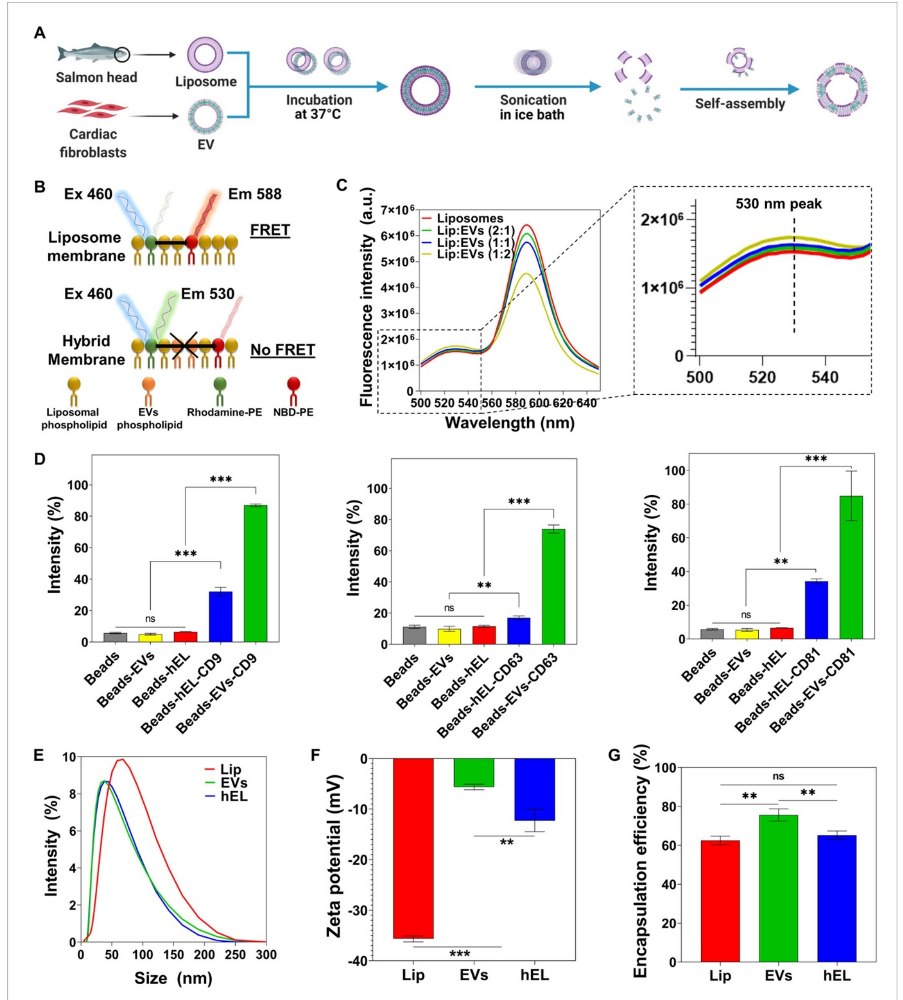

Figure 1. Fabrication and characterization of Lip, EVs, and hybrid (hELs) nanovesicles (NVs). (A) Schematic of the synthesis procedure of hELs NVs. Created with BioRender.com. (B) Schematic of the fluorescence resonance energy transfer (FRET) analysis assay used to monitor the fusion between EVs and Lip. (C) FRET assays were performed for various ratios of Lip to EVs (1:0, 2:1, 1:1, and 1:2) with excitation at 460 nm. (D) Expression of CD9, CD63, and CD81 markers on EVs and hELs was analyzed by flow cytometry (n = 3). (E) Size distribution of NVs was measured by DLS. (F) Average zeta-potential of NVs (n = 3). (G) Encapsulation efficiency of miRNA-DY547 by NVs (n = 3). All data are expressed as mean ± standard deviation. Significance is indicated as ∗∗ (p < 0.01) and ∗∗∗ (p < 0.001).

We used the salmon-derived Lip, which are an intriguing type of Lip because they present a double functionality, since they are rich in bioactive ω-3 and ω-6 polyunsaturated fatty acids, and they can encapsulate bioactive molecules [33–36]. Lip were enzymatically extracted from salmon fish heads and EVs were isolated from neonatal rat cardiac fibroblasts (CFs)s culture media and used to produce loaded hELs via incubation followed by probe-sonication as shown in figure 1(A) [35, 37, 38]. Briefly, they were formed by co-incubating the lipid vesicles at 37 °C for 12 h in order to fuse EVs and Lip [3, 21, 23, 39–42]. Structural, electrostatic, or chemical interactions of the lipid particle constituents contributed to the membrane fusion. The NVs subsequently underwent probe-sonication to induce membrane breakage, whereby the localized reorganization, re-constitution, and interweaving of fragmented EVs and Lip membranes occurred after sonic agitation was discontinued.

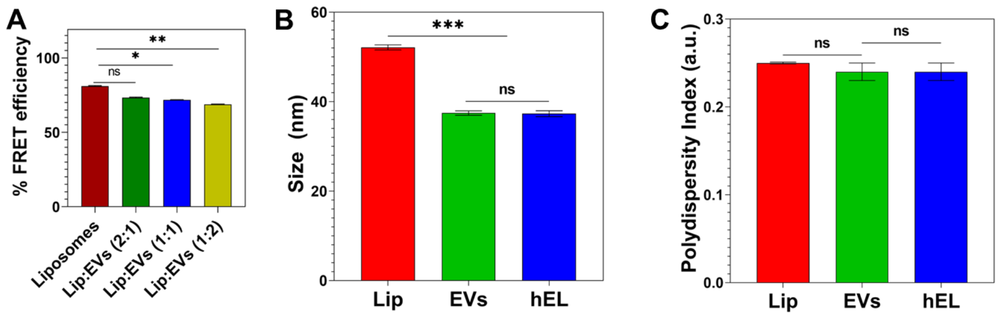

Figure S1. (A) The quantification of percentage FRET efficiency of different ratios of liposomes (Lip) to extracellular vesicles (EVs) (n=3). (B) Average size of NVs (n=3). (C) Average polydispersity index (PdI) of NVs (n=3). All data are expressed as mean ± standard deviation. Significance is indicated as *(p < 0.05), **(p < 0.01) and ***(p < 0.001).

Successful membrane fusion between Lip and EVs was demonstrated using a fluorescence resonance energy transfer (FRET) assay using a set of 1,2-dioleoyl-sn-glycero-3-phosphoethanolamine-N-(7-nitro-2-1,3-benzoxadiazol-4-yl) (ammonium salt) (NBD-PE)- and 1,2-dioleoyl-sn-glycero-3-phosphoethanolamine-N-(lissamine Rhodamine B sulfonyl) (ammonium salt) (Rhod-PE)-labeled phospholipids. As can be seen in figure 1(B), when NBD-PE, which is present in the liposomal membrane, is excited at a wavelength of 460 nm, it emits fluorescence at 530 nm, and part of that energy is transferred to nearby Rhod-PE, which emits fluorescence at 588 nm. However, when new EVs phospholipids and membrane components are introduced into the liposomal bilayer, the distance between fluorescent NBD-PEs and Rhod-PEs increases, and, as a result, the fluorescence intensity increases at 530 nm and decreases at 588 nm. Successful production of hELs was verified as the fluorescence intensity increased at 530 nm and decreased at 588 nm when higher concentrations of EVs were introduced to the liposomal solution (figure 1(C)), a phenomenon that suggests the insertion of new EVs phospholipids into the liposomal bilayer. To quantify the decreasing FRET effect, FRET efficiency was calculated. The decrease in FRET efficiency with higher EVs concentrations is shown in figure S1(A).

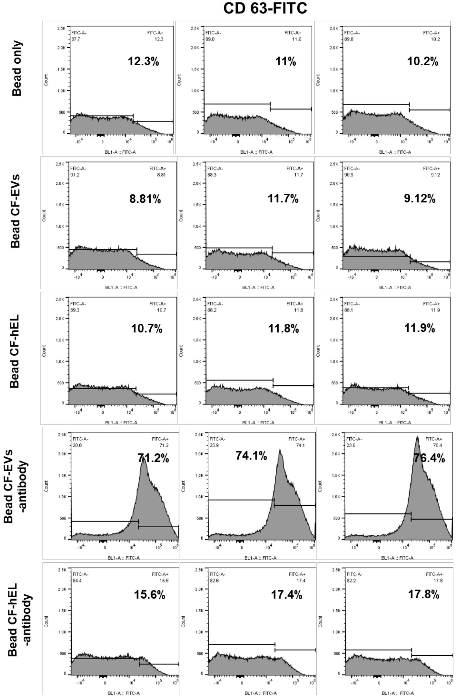
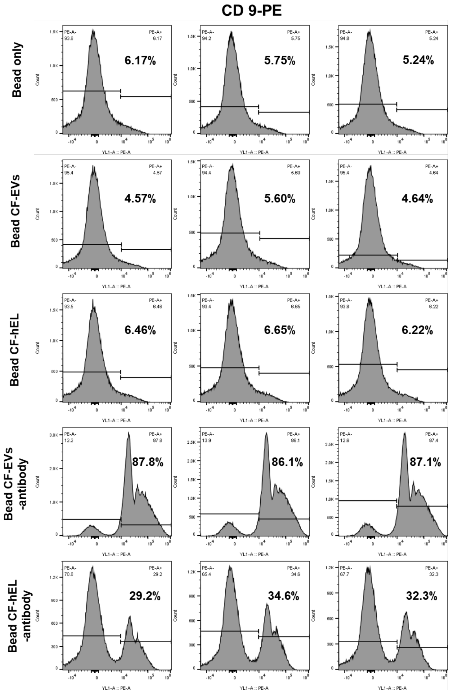
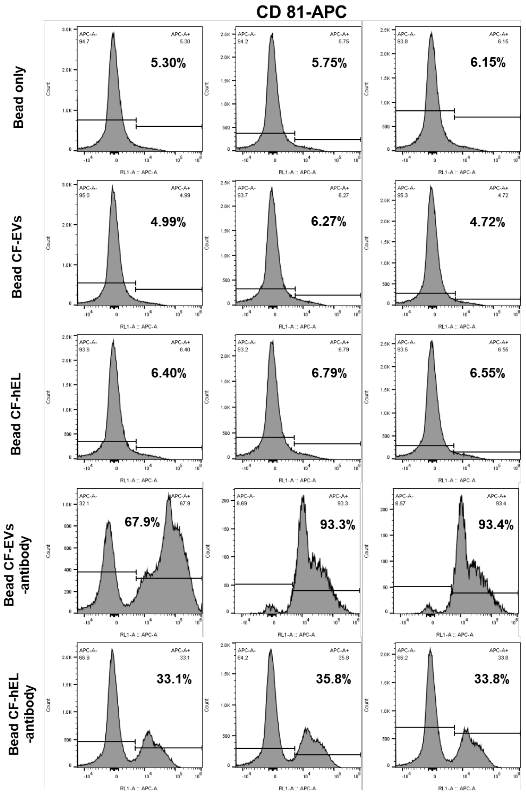

Figure S2. FACS analysis of markers CD9, CD63, and CD81 on EVs and hELs.

Flow cytometry (FACS) analysis was used to assess the percentages of EVs-specific CD markers on the surfaces of the three NVs configurations. To enable the detection of small EVs and hEL particles by FACS, NVs were pre-bound by magnetic beads and then fluorescently labeled for FACS. EVs without any marker, and only in the presence of control beads, were selected as the control group. For the antibody-stained sample groups containing beads and EVs (Beads-EVs) or beads and hELs (Beads-HEL), the tetraspanins CD9, CD63, and CD81 were analyzed as common EVs surface markers due to their broad distribution in many types of tissues [43, 44]. The percentage intensities of the CD markers, CD9, CD63, and CD81, in the EVs groups were subsequently found to be 87%, 73.9%, and 84.86%, respectively (figures 1(D) and S2). Lastly, hELs were also found to express all EVs-specific CD surface markers, with measured intensities of 32%, 16.93%, and 34.23%, respectively, of the CD9, CD63, and CD81 markers.

The sonication parameters applied during synthesis, including amplitude, duration of sonication, and mode of operation, may affect the minimum mean particles sizes of the hELs. After optimization of these parameters, the sizes, polydispersity indexes (PdIs), and zeta potentials of the hELs compared with Lip and EVs were quantified using dynamic light scattering (DLS).

The hydrodynamic size of Lip (52.13 ± 0.57 nm) was determined as larger than that of EVs (37.45 ± 0.49 nm) and hELs (37.31 ± 0.65 nm) (figures 1(E) and S1(B)). All of the formulated NVs were relatively monodisperse and presented near-identical average PdIs of ∼0.25, a low value, and, correspondingly, one that is associated with a narrow size distribution (figure S1(C)) [45]. Typically, PdI values of lower than 0.3 indicate homogenous populations and are considered acceptable in nanoformulations for drug delivery applications [46]. As can be ascertained from inspecting figure 1(F), the Lip in this work had a negative zeta potential (−35.67 0 ± 0.59 mV), with the strong negative value attributed to the negatively charged phospholipids found in salmon lecithins, such as phosphatidylglycerol, phosphatidic acid, phosphatidylinositol, and phosphatidylserine, which could be present on the outside surfaces of the Lip [47]. EVs also displayed a negative zeta potential (−5.6 ± 0.6 mV), but with a value closer to neutral than that of the Lip. As an intermediate blend of Lip and EVs, hELs were determined to have a negative and transitional zeta potential value (−12.3 ± 2.2 mV), with a magnitude that appeared influenced more so by the EVs than the liposomal constituents. This zeta potential of hELs may explain their congruity to EVs and deviation from Lip in terms of the hydrodynamic size, as less negative zeta potentials tend to possibly lower the repulsive forces between phospholipids, and, thus, lead to a decrease in the particle size.

The encapsulation efficiency (EE) of miRNA by NVs was assessed using the fluorescent model, miRNA-DY547. Immediately after encapsulation, the loaded NVs suspensions were ultracentrifuged to remove free miRNA, which remained in the supernatant, from the pelletized NVs containing their biofunctional payload. The concentration of free miRNA-DY547 was quantified using a standard curve based on DY547 fluorescence intensities at Ex/Em of 525/570 nm. From this, the EE was calculated and found to be around 63% ± 2.21% for Lip, 65% ± 2.18% for hELs, and 76% ± 3.12% for EVs (figure 1(G)). It is likely that these EE values are governed by NVs’ charge. Since miRNAs are negatively charged, a correlation can be inferred, in that the greater the negative charge on the NVs, the lower their EE value as the result of repulsive forces between similarly charged substances [48].

### 2.2. Biofunctionality of NVs

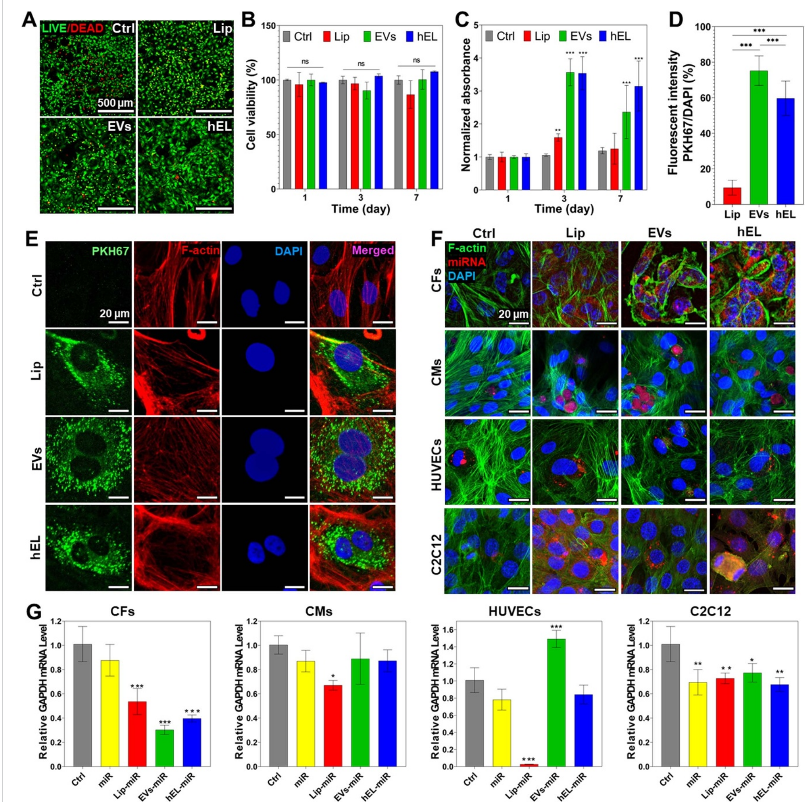

Figure 2. Comparison of viability and cellular uptake of NVs. (A) Live/Dead images of CFs cultured with NVs (100 µg ml−1) on day 7. (B) Quantified viability of CFs cultured with NVs (100 µg ml−1) for 7 d (n = 3). (C) PrestoBlue results showing the cell proliferation of CFs cultured with 100 µg ml−1 NVs for 7 d (n = 3). (D) Percentages of fluorescent intensities of PKH67-labeled NVs quantified and normalized with cell number (n = 10). (E) Fluorescence images of PKH67-labeled NVs (green) uptake by CFs stained with F-actin (red) and DAPI (blue) after transfection for 48 h. (F) Confocal images of CFs, CMs, HUVECs, and C2C12 cells stained with F-actin (green) and DAPI (blue) after transfection for 48 h with NVs loaded with miRNA DY547 (red). (G) Data representing RT-PCR of mRNA GAPDH expression of CFs, CMs, HUVECs, and C2C12 cells cultured with miRNA GAPDH loaded in NVs (n = 3). All data are expressed as mean ± standard deviation. Significance is indicated as ∗ (p < 0.05), ∗∗ (p < 0.01) and ∗∗∗ (p < 0.001).

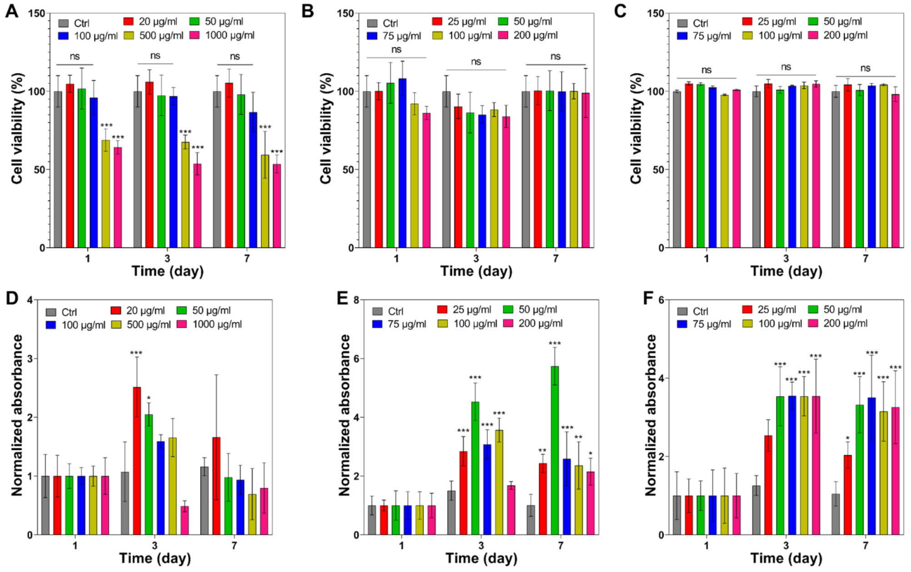

Figure S3. (A-C) Quantified viability of CFs cultured with different concentrations of (A) Lip, (B) EVs, and (C) hybrid NVs for 7 days (n=3). (D-F) PrestoBlue results showing the cell proliferation of CFs with different concentrations of (D) Lip, (E) EVs, and (F) hybrid NVs for 7 days (n=3). All data are expressed as mean ± standard deviation. Significance is indicated as *(p < 0.05), **(p < 0.01) and ***(p < 0.001).

The cytotoxicity of Lip toward CF cells was determined, in order to establish biocompatibility and to complement previous research studies which recommended the cytocompatibility of salmon Lip toward human adipose and Wharton’s jelly stem cells, and toward cortical neurons [20, 47, 49, 50]. Investigating the possibility of a cytotoxic response with a new cell type is an important requirement. This requirement also applies to the hEL particles studied here, as they have not been previously fabricated using combinations of CF-derived EVs and salmon-derived Lip. To test the NVs biocompatibilities, CFs were incubated with different concentrations of Lip, EVs, or hELs, and cellular viability and proliferation were measured at 1, 3, and 7 d after NVs addition. CFs that were cultured with all NVs, except Lip at concentrations exceeding 100 µg ml−1, showed excellent viability as observed from Live/Dead staining images (figure 2(A)), and there were no significant differences compared to the control (no NVs) (figures 2(B) and S3).

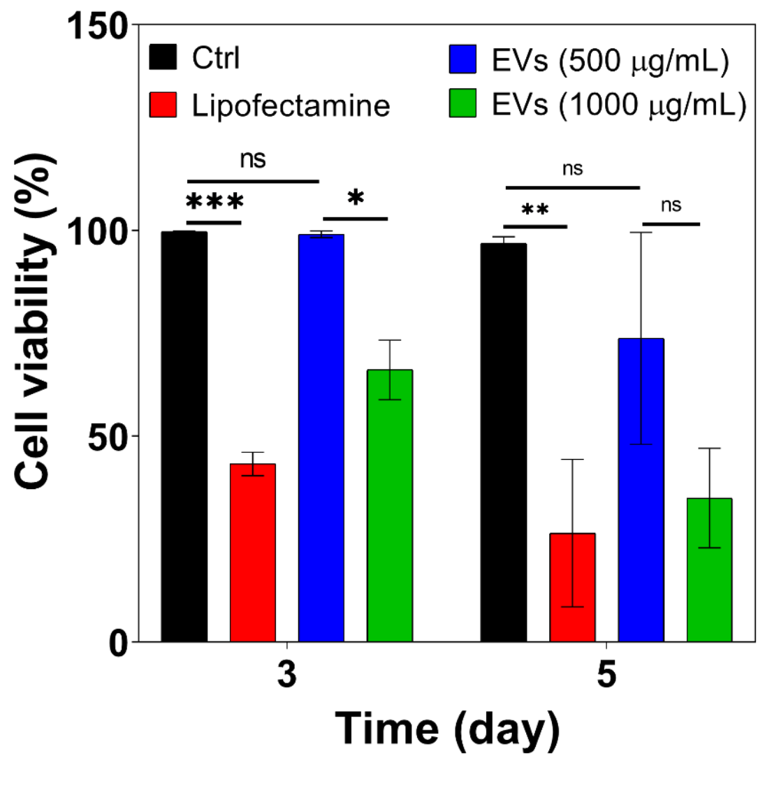

Figure S4. Quantified viability of CFs cultured with high concentrations of EVs and lipofectamine (n=3). All data are expressed as mean ± standard deviation relative to the control. Significance is indicated as *(p < 0.05), **(p < 0.01) and ***(p < 0.001).

Live/Dead staining was additionally performed to interpret the viability of CFs that were treated with EVs (500 µg ml−1 and 1000 µg ml−1) or the commercially available and well-known transfection reagent lipofectamine (4 µl), and the cell viability results indicated that EVs, especially at the lower tested concentration of 500 µg ml−1, were more supportive of normal CF proliferation (figure S4). The viability of the group treated with EVs at 500 µg ml−1 (>100%) was not decreased at all compared to the control group after 3 d. On the other hand, lipofectamine significantly decreased the viability of CF cells, more so than EVs treatments at 1000 µg ml−1. Thus, EVs provide a feasible route to encapsulate large quantities of miRNA while providing high biocompatibility for hybrid NVs. Interestingly, fluorometric detection of aerobic respiration-driven reduction of resazurin into resorufin of CFs cultured with NVs, barring the Lip at 100 µg ml−1 and higher concentrations, demonstrated significantly increased total mitochondrial metabolic activity as compared to controls (figures 2(C) and S3). This is most likely explained due to increased proliferative effects for cells that were cultured in the presence of EVs and hELs. These results can be attributed to the native proneness for EVs to enhance the proliferation and inhibit apoptosis of cells for which they contain vital endosomal proteins and signaling molecules [51].

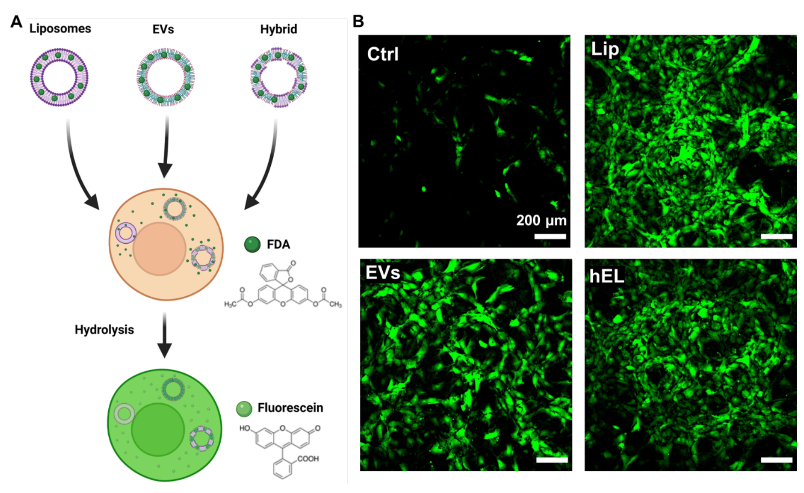

Figure S5. (A) Schematic representation of FDA-delivery via NVs. Created with BioRender.com. (B) Fluorescence images of FDA-loaded NVs uptake by CFs following incubation for 20 minutes.

Incubation of cells with NVs labeled with fluorescent lipophilic dyes is a common method to investigate their internalization and cellular uptake. To determine whether CF-derived EVs, salmon-derived Lip, and composite hELs could be taken up by CFs, and also to test dye retention, NVs were stained with PKH67 and then washed extensively. Following this procedure, dye-labeled NVs were added to CFs and incubated for 8 h. As shown in figure 2(E), PKH67-labeled NVs were present in overlaying recipient fibroblasts, meaning that EVs, Lip, and hELs were successfully delivered to the CF cytoplasm and that cellular uptake was achieved. The fluorescence intensities of PKH67-labeled NVs were additionally quantified and normalized with cell number (DAPI count) (figure 2(D)). The intensity ratio was the highest for PKH67-labeled EVs (75.2% ± 7.9%) and slightly lower for the PKH67-labeled hELs (59.6% ± 9.2%), which in turn showed a significantly higher uptake than the PKH67-Lip (9.4% ± 4.0%). To check whether these NVs could deliver different types of cargo to CFs, three NVs were loaded with fluorescein diacetate (FDA) and added to cultured cells. As can be seen from figure S5(A), CFs can take up the non-fluorescent FDA molecule and hydrolyze it into fluorescein, which emits fluorescence. From the green signals in the fluorescent images (figure S5(B)), Lip, EVs, and hELs successfully delivered the FDA molecule into CFs, thereby proving the drug delivery abilities of these NVs. A significant problem in the delivery of miRNAs is that free RNA has low cellular penetration, a brief half-life, and significant offtarget effects [52, 53]. Many efforts have been made to alter miRNAs in order to enhance their stabilization and uptake by cells; however, off-target outcomes and the release of toxic compounds due to degradation continue to be a challenge. Alternative methods for miRNA delivery, including the use of lipid formulations, have been of interest, although conventional transfection agents can indeed be harmful [53–56].

Therefore, NVs-based carriers have been used to deliver nucleic acids successfully in several areas [57]. To check whether the NVs in this work can successfully deliver miRNAs to different cell types, the NVs were loaded with a red-fluorescing miRNA mimic dye (miRNA DY547) and added to CFs, cardiomyocytes (CMs), human umbilical vein endothelial cells (HUVECs), and C2C12 cells in culture. Following immunostaining with DAPI (blue fluorescence) and F-actin (green fluorescence), confocal images were taken. As observed from the confocal microscopy panels presented in figure 2(F), unlike for free miRNAs, NP-encapsulated red-fluorescent miRNA DY547 was successfully delivered in large amounts to CFs, and, in lesser quantities, to CMs, HUVECs, and C2C12 cells. The miRNAs surrounded the nuclei that were stained with the blue-fluorescing DAPI, and this suggests their successful delivery to the cytoplasm, where they could perform their well-characterized functions in cytoplasmic gene regulation [58].

Furthermore, the successful cellular uptake and delivery of miRNA-loaded NVs to both CFs and CMs was also investigated; miRNA mimics targeting the 3′-UTR of the glyceraldehyde-3-phosphate dehydrogenase (GAPDH) gene (referred to hereafter as miRNA GAPDH), and is thereby capable of reducing its expression. Reverse transcriptase polymerase chain reaction (RT-PCR) was employed to quantify downregulations in mRNA GAPDH expression levels. As shown in figure 2(G), miRNA GAPDH-loaded EVs induced the highest downregulation of GAPDH gene expression (∼0.3) in CFs, followed by loaded hELs (∼0.4), then loaded Lip (∼0.5). Figure 2(G) also shows the downregulation of the GAPDH mRNA levels in CMs caused by the miRNA GAPDH-loaded NVs. Interestingly, loaded EVs and hELs did not induce any significant downregulation of the expression of the GAPDH gene, unlike loaded Lip (∼0.7). This specificity of EVs and hELs to CFs might be due to the presence of fibroblastic specific receptors on the CF-derived EVs and hELs surfaces, which improved their cellular uptake by CFs and prevented their uptake by CMs. For Lip, this specificity does not exist due to the absence of cell-specific receptors and membrane proteins on their surfaces, which lead to their uptake by both CFs and CMs, and to the downregulation of the GAPDH mRNA levels in both cell types.

This might suggest that EVs and hELs possess an enriched specificity for CFs, and thus might be used for targeting drug delivery to CFs even when other cell types, such as CMs, are present. This was also the case for HUVECs where the downregulation in the GAPDH mRNA levels was only observed for the Lip group. However, all groups downregulated the GAPDH mRNA levels in C2C12 cells, which suggested increased miRNA permeability across the C2C12 membrane.

### 2.3. Characterization of NVs incorporated hydrogels

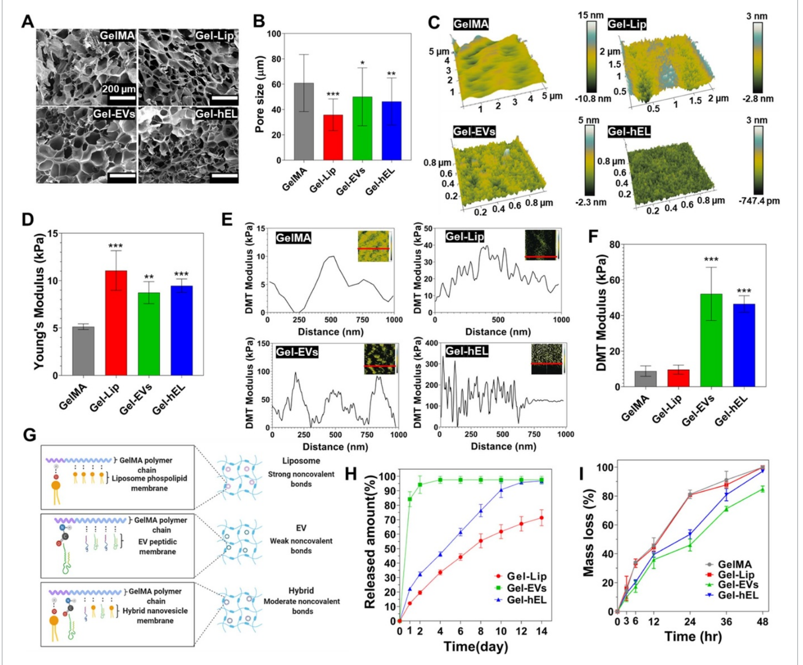

Figure 3. Characterization of 7.5% (w/v) GelMA hydrogels embedding NVs (100 µg ml−1) (Gel-NVs). (A) SEM cross-sectional images of Gel-NVs hydrogels. (B) Pore size measurements of Gel-NVs hydrogels (n = 50). (C) Spatial topography of Gel-NVs measured by AFM. (D) Young’s modulus of Gel-NVs hydrogels (n = 5). (E) DMT modulus distribution profile of Gel-NVs. (F) Average DMT modulus values of Gel-NVs. (G) Schematic representation of electrostatic interactions between GelMA matrix and NVs. Created with BioRender.com. (H) Release profile of NVs from GelMA hydrogels for 14 d (n = 5). (I) Degradation profile of Gel-NVs hydrogels for 48 h when exposed to collagenase type II. All data are expressed as mean ± standard deviation. Significance is indicated as ∗ (p < 0.05), ∗∗ (p < 0.01) and ∗∗∗ (p < 0.001).

For hydrogels containing NVs, the Lip, EVs, or hELs were evenly dispersed into the 7.5% GelMA polymer solution by vortexing. After photocrosslinking, the possibility of NV aggregation inside the hydrogels was diminished, even with submersion of the gel in aqueous media, due to the presence of impeding strong bonds and porous networks that reduce direct contact and simultaneous release of NVs. To visualize the internal structures of GelMA hydrogels, corresponding cross-sectional microstructures were examined using scanning electron microscopy (SEM) (figure 3(A)). Nanofunctionalization with soft NVs resulted in the observation of GelMA hydrogels with different pore sizes and morphologies. It can be seen from figure 3(B) that GelMA hydrogels contained significantly larger pores than all other GelMA-NVs (Gel-NVs) hydrogels. GelMA-Lip (Gel-Lip) hydrogels exhibited smaller pores than those of Gel-hEL and GelMA-EVs (Gel-EVs) hydrogels. This difference might be due to the presence of stronger interactions between Lip and the GelMA matrix than of the EVs and hydrogel’s matrix. Those strong interactions will further increase the amount of GelMA crosslinking, which in turn leads to a greater reduction in the pore sizes.

To evaluate the surface roughness of the hydrogels, surface topographic mapping was carried out by atomic force microscopy (AFM) (figure 3(C)). The surface of GelMA hydrogels was smooth, whereas Gel-NVs surfaces exhibited rough features that were produced by the distribution of NVs. Many cell-surface interfaces that are examined in the literature tend to improve cellular adhesion, viability, or proliferation when the measured root mean square roughness (RMS) is at an optimal value [59, 60]. To determine the optimal RMS for their growth conditions, typically, a value with a magnitude of much less than the size of the cells, and in the nano- or picometer range, is ideal [61]. Surface energy and surface roughness are correlated, generally in an increasing manner, and rough surfaces tend to trap, by adsorption, certain proteins that regulate cellular adhesion and growth [62, 63]. As it relates to this work, the optimization of RMS to the adsorption of proteins assisting CF or CM metabolism and functions is expected to be beneficial.

To evaluate NVs’ effect on the 3D matrix, mechanical properties of Gel-NVs hydrogels were characterized with compression tests (figure 3(D)). Compared with pure GelMA (5.1 ± 0.3 kPa) hydrogels, Young’s or compressive moduli were markedly increased upon NVs incorporation, in the order of increasing moduli from 8.7 ± 1 kPa for Gel-EVs hydrogels to 9.5 ± 0.6 kPa for Gel-hEL hydrogels and 11.1 ± 1.9 kPa for the Gel-Lip hydrogels. Strong, moderate, and weak noncovalent bonds occurring between the GelMA matrix and Lip, hELs, and EVs, respectively, mediated the interactions that lead to changes in the moduli, whereby NVs behaved as pseudo-crosslinkers that improved the intrinsic mechanical properties of hydrogels [64]. To elucidate the local mechanical attributes of hydrogels, a Derjaguin–Muller–Toporov (DMT) modulus for each GelMA configuration was obtained using the force-deformation plots (figure 3(E)). Gel-NVs hydrogels had greater fluctuations in their DMT moduli than bare GelMA. Generally, the low mechanical properties of GelMA and the higher Young’s moduli of the NVs compensated for one another to produce structures with intermediate DMT moduli. However, from the average DMT values (figure 3(F)), Gel-EVs and Gel-hEL hydrogels had significantly higher values of the DMT modulus than Gel-Lip and pure GelMA hydrogels. As compared with standard compression tests, in-fluid imaging contributed to these differences in the properties of samples. Generally, compressive and tensile strengths decrease in aqueous media, and from previous reports, 3D-AFM force maps showed that EVs had relatively higher average Young’s moduli (50–350 MPa) than synthetic Lip (11–115 MPa) in water [65–67]. Moisture also perturbs the swelling behaviors of hydrogels, causing porous networks to be more accessible by diffusible NVs. The EVs and hELs in this work were smaller than Lip and formed weaker bonds with GelMA. Therefore, another possible explanation for the greater DMT moduli of the Gel-EVs and Gel-hEL hydrogels in water could be the outwards diffusion of NVs, followed by their aggregation and electrostatic bond re-formation near the hydrogel exterior. AFM probes functioned as pico indenters that measured the DMT values in superficial regions where this accumulation would have occurred.

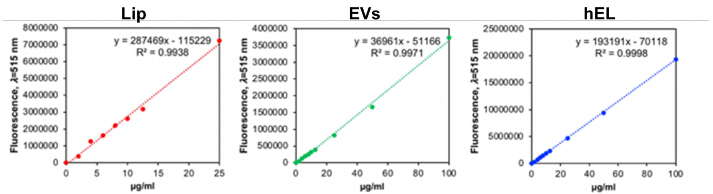

Figure S6. Standard curves of PKH67-labeled NVs with various concentrations. The fluorescence intensity of PKH67-labeled NVs was measured at 𝜆 = 515 nm.

The mechanical properties of the hydrogels provide support for the existence of stronger hydrogen bonds between the phosphorous heads in Lip and the nitrogen molecules in GelMA than the noncovalent bonds existing between EVs and GelMA, which resulted in moderately strong bonds between the hEL and GelMA matrix (figure 3(G)). Due to the nature of these interactions between the NVs and GelMA matrix, Lip was released at a slower rate than hELs, which were released at an even slower rate than EVs (figure 3(H)); standard curves shown in (figure S6). The slower releasing Lip are thus construed as being more present in the bulk region. From this discussion, it is important to consider that variabilities in the fabrication parameters impact NVs residence times, stabilities, physiological clearance rates, and hydrogel release properties. This is advantageous as numerous medical applications require systems that are tuned to gradually emit their therapeutic payloads in order to enhance cellular uptake and handling, to deliver the appropriate doses or concentrations over time, and to prevent toxicity or any other adverse events from unfolding. The adjustable parameters of the hydrogel include the bulk material, type and quantity of additives, structural porosity, crosslinking density, wettability, surface energy, and surface roughness, among others [68]. These properties of NVs-laden hydrogels, and, effectually, enhanced localization of therapeutic hydrogel-encapsulated NVs to diseased areas, in many cases support the rationale that hydrogel delivery of NVs far outweighs their administration in suspension.

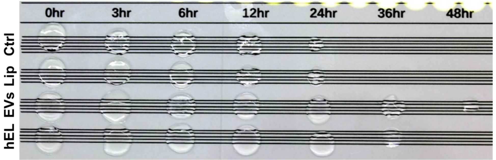

Figure S7. Images of 7.5% (w/v) Gel-NVs hydrogels degradation test performed in solutions of 0.1 U/mL of collagenase Type II inside an incubator operating at 37 °C for 0, 3, 6, 12, 24, 36, and 48 hours.

The degradation profiles of the hydrogels were investigated to determine whether improvements in stiffness had any effect on the degradability of GelMA, which is one of its favorable characteristics [69]. Figures 3(I) and S7 demonstrate that the degradation profiles of Gel-NVs hydrogels are similar to those for GelMA, with all hydrogels significantly degrading by losing more than 80% of their initial mass after just 48 h in the presence of collagenase type II. The hydrogels in this work were primarily composed of GelMA, and as such, even after photocrosslinking, were expected to decay quickly in a collagenase solution. Biodegradability is a desirable feature of hydrogel materials that has gained sizeable attention in tissue engineering and regenerative applications [70]. Since all Gel-NVs followed a similar degradation pattern, it can be concluded that there is no difference in susceptibility to enzyme degradation and that all Gel-NVs possess a consistent biodegradability. It is interesting to consider, however, that hydrogels containing EVs and hELs had markedly lower mass losses after 24 h, and this is attributed to the ability of nanoparticulate reinforcement to modulate the mechanical stiffness of GelMA-based hydrogels.

Although both EVs and Lip are functional carriers of miRNAs and other cargoes, an enhanced drug targeting system is produced when the beneficial properties of both particle classes act to complement one another, as with hELs. For instance, in this work, EVs components in hELs improved miRNA encapsulation efficiencies and targeting abilities relative to unmodified Lip; and liposomal components in hELs improved the stabilities of the particles in solution compared to unmodified EVs. This improvement of particle stabilities and, correspondingly, electrostatic interactions, could be understood from the zeta potential results, which showed a more negative mean value for hELs than for EVs. Moreover, to further demonstrate the significance of modifying EVs to generate hELs, it must be noted that hELs demonstrated an improved controlled release over time from the GelMA matrix than EVs. In some cases, CFs viability was improved when the cells were cultured with the hybrid particles than for those that were cultured with Lip or EVs carriers.

### 2.4. Biofunctionality of NVs incorporated hydrogels

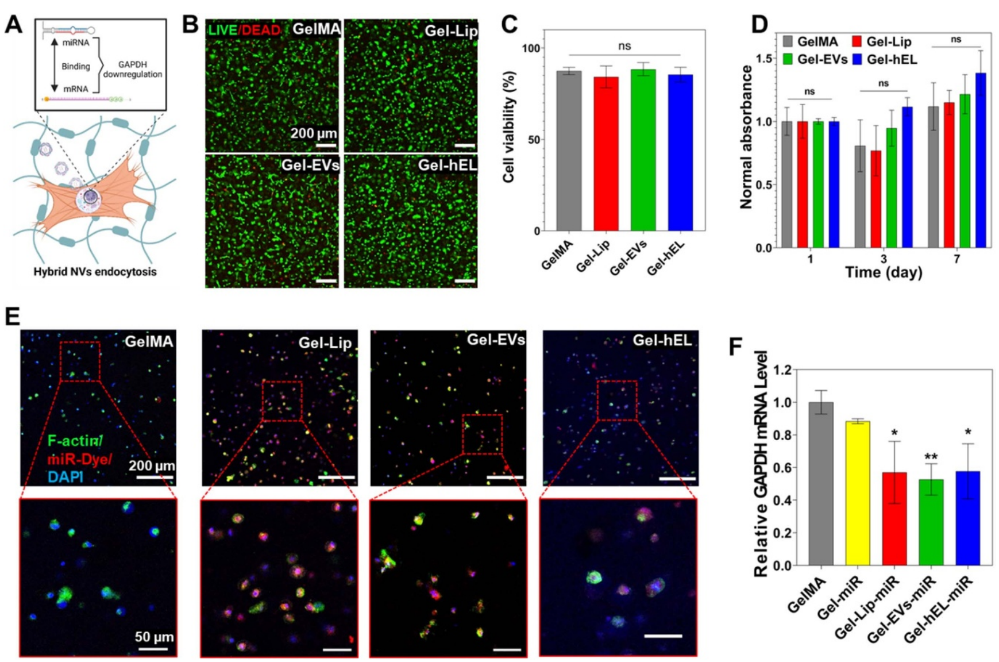

Figure 4. Characterization of 3D CFs-laden Gel-NVs hydrogels. (A) Schematic representation of the GAPDH mRNA levels downregulation process. Created with BioRender.com. (B) Live/Dead images of CFs-laden Gel-NVs hydrogels on day 1. (C) Live/Dead assay showing the viability of CFs-laden Gel-NVs hydrogels on day 1 (n = 9). (D) PrestoBlue results showing the cell proliferation of CFs-laden Gel-NVs hydrogels for 7 d (n = 3). (E) Images of CFs-laden Gel-NVs hydrogels loaded with miRNA DY547 (red) and immunostained with F-actin (green) and DAPI (blue). (F) RT-PCR results of CFs-laden Gel-NVs hydrogels loaded with miRNA GAPDH (n = 3). All data are expressed as mean ± standard deviation. Significance is indicated as ∗ (p < 0.05) and ∗∗ (p < 0.01).

CFs were cultured in the Gel-NVs hydrogels, and the genetic and viability outcomes were analyzed. Specifically, it was anticipated that miRNA GAPDH loading in NVs would downregulate the GAPDH mRNA levels following a process of hEL endocytosis, as shown in figure 4(A), and these results would therefore demonstrate the exceptional delivery potential of the NVs’ miRNA payload. First, the viability of cells encapsulated in the different GelMA hydrogels was assessed after 1 d using Live/Dead images to evaluate the impact of UV exposure on the CFs’ survival during the fabrication process (figure 4(B)). Figure 4(C) illustrates the quantitative analysis of the percentage of living cells, where it can be seen that NVs incorporation in the GelMA matrix did not affect CF viability, as all hydrogels presented non-significant differences in viability, all greater than 84%. This high viability was found to be consistent with previously reported viabilities of cardiac cells encapsulated in GelMA hydrogels [71]. As for the mitochondrial metabolic activity of CFs in Gel-NVs hydrogels, resazurin reduction revealed good CF metabolic activities, with all specimens showing non-significant changes as compared to the CF controls, except for CFs encapsulated in Gel-hEL hydrogels that associated with a significantly higher proliferation rate after 7 d of culture (figure 4(D)).

To check whether the GelMA matrix would hinder the delivery of miRNA loaded in NVs, miRNA DY547 (red fluorescence) was loaded in Gel-NVs hydrogels that in turn were immunostained using F-actin (green fluorescence) and DAPI (blue fluorescence). The staining on miRNA-loaded Gel-NVs samples revealed that all NVs successfully deliver the miRNA DY547 to CFs, whereas this delivery was not achieved when using free miRNAs (figure 4(E)). This delivery was further verified by RT-PCR of miRNA GAPDH loaded in Gel-NVs hydrogels. Indeed, free miRNAs did not induce a significant downregulation of the GAPDH mRNA levels, whereas miRNA-loaded NVs did (figure 4(F)). This suggests that the GelMA matrix did not hinder the NVs ability to successfully deliver miRNAs to CFs.

### 2.5. Bioprinting and microfabrication of hybrid GelMA bioinks

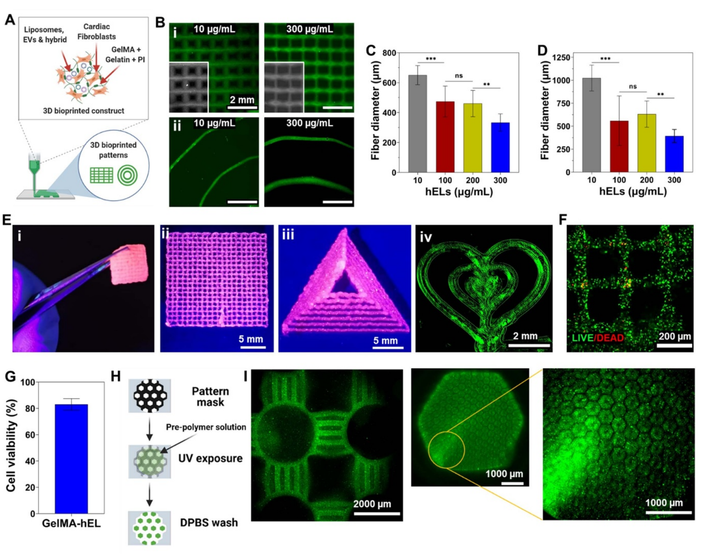

Figure 5. Gel-NVs-based bioinks for bioprinting and microfabrication. (A) Schematic representation of the bioprinting process. Created with BioRender.com. (B) 3D printed patches (i) and spirals (ii) with different concentrations of fluorescein-loaded hELs. Average fiber diameter of 3D printed (C) patches and (D) spirals with different concentrations of fluorescein-loaded hELs (n = 12). (E) (i) Free-standing and mechanically robust 3D printed patch and (ii–iv) complex shapes using Gel-NVs-based loaded with pink food dye (pink) or fluorescein-loaded hELs. (F) Live/Dead image and (G) quantified viability of 3D bioprinted construct with CF-laden Gel-hEL bioink at day 3 (n = 9). (H) Schematic representation of the photolithography microfabrication process. Created with BioRender.com. (I) Fluorescence images of microfabricated various blocks with PKH67-labeled NVs encapsulated GelMA bioink. All data are expressed as mean ± standard deviation. Significance is indicated as ∗∗ (p < 0.01) and ∗∗∗ (p < 0.001).

The schematic representation in figure 5(A) demonstrates the printing process, whereby a 7.5% GelMA matrix that is interspersed by CFs and NVs was selected as the bioink for generating variable 3D printed patterned scaffolds. Prior to crosslinking, bioprinted 3D GelMA constructs maintained their shape fidelity with the use of cooled, partially solidified bioinks. Temperature controls are documented as major regulators for tailoring the viscosities of gelatin and GelMA pre-polymer solutions, whereby the viscosity of pre-polymers is significantly increased in conjunction with a reduction in temperature [72]. Biofabrication techniques, such as bioprinting, made the creation of complex structures that can mimic the native ECM’s complex architecture possible. In addition to printing pressure and printing speed, the embedded NVs concentration can govern the printed fiber diameter, as can be seen by the decrease in fiber diameters of printed NVs-laden patches (figures 5(B i) and (C)) and spirals (figures 5(B ii) and D) with the increasing hELs concentration. In figure 5(E), it can be seen that 7.5% GelMA can also be 3D printed into large complex shapes, such as tough multilayered patches and large triangles. Leakage of encapsulated fluorescein from 3D printed Gel-hEL complex shapes (patches, spirals, hearts) did not occur, which suggests that the Gel-hEL printed system can retain encapsulated materials which can maximize their bioactivity. Hence, Gel-hEL ink presented excellent printability, with this critical feature being judged by the extrudability and formability of the bioink [73]. Furthermore, the printing resolution and printability of the pristine 7.5% (w/v) GelMA were increased by incorporating hELs, without the need for sacrificial inks, such as gelatin and alginate [74, 75].

More importantly, to check whether the bioprinting process would hinder the viability of CFs, Live/Dead assays were performed on bioprinted CF-laden Gel-hEL patches after 3 d of culture. As can be seen from the bioprinted construct with very few dead cells (red fluorescence) in figure 5(F), the bioprinted construct had a high expression of the green stain, and thus, excellent cell viability (∼80%) (figure 5(G)). Figure 5(H) follows the process of photolithography employed to yield patterned networks, and figure 5(I) shows the successful microfabrication of well-structured PKH-labeled Gel-hEL hydrogels, which proves the high shape-tunability of this biomaterial. It can be concluded that the parameters of the bioprinting process, influencing fibrous diameters, intrinsic features, and the bulk architecture of the 3D bioprinted scaffold, can be tailored to optimize the cell morphology, orientation, and adhesion behaviors. With the incorporation of regulatory factors, transfection methods, transcription factors, or other cell-modifying components, the biological and physical effects on the hydrogel-laden cells can be further altered or enhanced.

## 3. Conclusion

In summary, we report here on the engineering of the first-of-its-kind multiscale regulatory factors-loaded hybrid bioink. Firstly, hELs were produced from CF-derived EVs and salmon-derived Lip. The smart behavior of EVs is due to the presence of cell-specific receptors and membrane proteins on their surfaces, which allows them to target specific cells. However, bioactive salmon-derived Lip possess stronger noncovalent bonds with the hydrogel’s matrix than EVs. CFs cultured with hELs showed high viability and a significantly improved proliferation. Interestingly, hELs successfully delivered their miRNA cargo to CFs and to a lesser extent to CMs, which suggests that they gained and maintained the smart behavior of EVs. Moreover, the embedment of hELs in GelMA improved its mechanical properties and reduced its average pore size due to the presence of noncovalent bonds between NVs and the GelMA matrix. HELs also improved the hydrogel’s surface nanotopography and nanomechanical properties, and this embedment did not significantly affect the desirable biodegradability of GelMA or the ability of hELs to deliver miRNA to CFs at high concentrations. Furthermore, the excellent biocompatibility of hELs toward CFs was not depreciated, but on the contrary, the proliferation of CFs in the 3D environment containing hELs significantly improved. To add to all these beneficial characteristics, the Gel-hEL hydrogel was successfully microfabricated and bioprinted with excellent cell viability and in different sizes and shapes, which suggests that this novel class of hybrid bioink might be very promising for the regulation of gene expression in 3D bioprinted constructs.

## 4. Experimental section

### 4.1. Materials

Gelatin from porcine skin, photo-initiator (PI) 2-hydroxy-4′-(2-hydroxyethoxy)-2-methyl propiophenone (Irgacure D-2959), methacrylic anhydride, FDA, bovine serum albumin (BSA), Bradford reagent, polyethylene glycol (PEG), dextran (DEX), PKH67 green fluorescent dye, Triton X-100, and paraformaldehyde ampules were purchased from Sigma-Aldrich (St. Louis, MO, USA). Fetal bovine serum (FBS), EVs-depleted FBS, Dulbecco’s phosphate-buffered saline (DPBS), Hank’s balanced salt solution (HBSS), trypsin, Dulbecco’s modified eagle medium (DMEM), and penicillin–streptomycin (P/S) were purchased from Thermo Fisher Scientific (Waltham, MA, USA). MiRIDIAN microRNA Mimic Transfection Control with Dy547 (miRNA DY547) and miRIDIAN microRNA Mimic Housekeeping Positive Control #2 (miRNA GAPDH) were purchased from Horizon Discovery Ltd (Cambridge, UK). Collagenase Type II (LS004176) was obtained from Worthington Biochemical Corporation (Lakewood, NJ, USA).

### 4.2. Cell isolation and culture

Neonatal rat CFs and CMs were isolated from newborn rats through a collagenase enzyme-based digestion, following the practices and procedures approved by the Institution of Animal Care and Use Committee at Brigham and Women’s Hospital (Protocol #: 2016N000379). Immediately after euthanasia, the thoracic cavity of the neonatal pups was exposed to remove the heart and atria, after which ventricular heart tissue was incised to create small tissue fragments. To isolate CFs and CMs, these sections, with shaking, were incubated overnight (4 °C) in a 0.05% (w/v) solution of trypsin prepared in HBSS. Collagenase Type II was used four times consecutively, 10 min per application, to facilitate the digestion of the tissue sections at 37 °C and under shaking (80 rpm). The cell suspensions were centrifuged at 1000 rpm for 5 min, plated in DMEM supplemented by 10% FBS and 1% P/S, and incubated at 37 °C in a 5% CO2 atmosphere. After 1 h, the non-adherent cells, comprised of enriched CMs, were removed for experiments, and the adherent CF cultures were maintained for up to three passages.

HUVECs, C2C12 myoblasts, DMEM, endothelial cell basal medium-2 (EBM-2), and endothelial cell growth medium-2 (EGM-2) SingleQuots Kit were obtained from Lonza Biosciences (Durham, NC, USA). As a brief description of the C2C12 and HUVECs culture procedures, cell vials that were frozen in liquid nitrogen were slowly thawed in a water bath operating at 37 °C, and the appropriate media was similarly warmed to physiological temperature.

For C2C12 cells, this consisted of DMEM basal media supplemented by 10% FBS and 1% P/S (1 × solution), whereas HUVECs were cultured in EBM-2 enriched using the EGM-2 SingleQuots Kit, containing specialized growth factors for endothelial cell culture. In order to prevent any loss of function to the bulk media, aliquots were made in 50 ml conical tubes (Corning Inc., Corning, NY, USA) prior to warm water bath placement. After thawing, 1 ml per cell suspension, containing approximately 0.7 × 106 cells were transferred into 9 ml of media, to dilute the 10% dimethylsulfoxide (DMSO; Thermo Fisher Scientific, Waltham, MA, USA)-containing freezing solution, and centrifugation was performed at 1000 rpm for 5 min. The supernatants were removed, the pellets were re-suspended in 15 ml of the appropriate cell culture media, and the suspensions were thus transferred into T-75 flasks (Thermo Fisher Scientific, Waltham, MA, USA) for continuous culturing inside a humidified incubator operating at 37 °C and in a 5% CO2 atmosphere.

### 4.3. Preparation of NVs

All NVs were produced using incubation followed by a sonication step. Lecithin was enzymatically extracted from Salmo salar without the use of organic solvents, as described previously [38]. A lecithin stock solution of 2% (w/v) was prepared under nitrogen flow to prevent oxidation and then stored in the dark at 4 °C. Fresh Lip were prepared via probe-sonication (Q500 Sonicator; QSonica, Newtown, CN, USA) of the lecithin solution (that was incubated at 37 °C for 12 h) using a 3.2 mm microtip at 30% amplitude and subjected to a pulse mode for 4 min (5 s on–off alterations).

CFs were incubated with media supplemented with EVs-depleted FBS for 6 h, then media was collected and centrifuged at 300 × g for 10 min to get rid of detached cells. EVs isolation by using aqueous two-phase systems was performed as previously described [76]. The supernatant was transferred into clean Falcon tubes, to which DEX-PEG solution (1:1 volume ratio) was subsequently added. The solution was then centrifuged at 1000 × g for 10 min at −4 °C, with low acceleration and deceleration rates.

After centrifugation, the upper phase was discarded, and the bottom phase was washed with wash solution (1:1 ratio of distilled water to DEX-PEG solution) to increase the purity of EVs. The solution was again centrifuged at 1000 × g for 10 min, and the upper phase was again discarded. To completely purify EVs, this washing step was repeated a second time. Then, the bottom phase, composed of pure EVs, was filtered using a 0.22 µm filter inside a laminar flow cabinet and stored at −80 °C. The concentration of EVs was estimated using the Bradford assay [77, 78].

Standard samples were prepared from protein standards in a buffer; specifically, BSA was prepared at concentrations of 0.25, 0.5, 0.75, and 1 mg ml−1. About 5 µl aliquots of standard or pure EVs solutions were mixed into 250 µl of the Bradford reagent, added to 96-well plates, and then incubated for 30 min at room temperature. Absorbance readings were obtained at 595 nm using a microplate reader (SpectraMax Paradigm, Molecular Devices, San Jose, CA, USA). Before use, EVs were incubated at 37 °C for 12 h, then probe-sonicated using the same sonication parameters described above.

HELs were produced by incubating equal concentrations of EVs and Lip at 37 °C for 12 h, followed by probe-sonication using the same sonication parameters described above.

### 4.4. Synthesis of GelMA and NVs-laden GelMA hydrogels

GelMA synthesis was carried out according to previously reported methods [79, 80]. In brief, gelatin was added to DPBS to a final concentration of 10% w/v, and the solution was mixed on a hot plate at 50 °C for 1 h. About 400 µl of methacrylic anhydride were added dropwise per gram of gelatin. The reaction mixture was allowed to stir at 50 °C, to avoid gelation, for 2 h, before being terminated by the addition of two times the volume of DPBS.

Dialysis of the methacrylated gelatin solution was carried out at 40 °C for 5 d, to ensure the complete removal of excess methacrylic anhydride. Briefly, freshly methacrylated gelatin was transferred into SpectraPor dialysis membranes with 12 kDa molecular weight cutoff pores, and dialysis water was changed at least twice daily. GelMA was added into conical tubes and freeze-dried extensively to completely remove all moisture.

A 7.5% solution of GelMA was obtained by dissolving the lyophilized solid in DPBS, and photoinitiator was also added to a final concentration of 0.5% to allow uniform crosslinking after 20 s of UV light exposure. NVs-laden GelMA hydrogels were prepared by mixing a 15% GelMA solution containing 1% photoinitiator with an equal volume of 200 µg ml−1 of NVs in the DPBS solution, to have a final solution with 7.5% GelMA, 0.5% photoinitiator, and 100 µg ml−1 of NVs in DPBS.

### 4.5. FRET analysis

The fusion between Lip and EVs was evaluated using FRET assay. Lip was labeled with 2% (w/w) of NBD-PE and Liss Rhod-PE (Avanti Polar Lipids, Birmingham, AL, USA) and mixed with different concentrations of EVs (1:2, 1:1, and 2:1) to produce hELs. A fluorescence spectrum of the mixture from 500 nm to 650 nm was measured using a microplate reader with an excitation at 460 nm.

Percentage FRET efficiency was calculated as (F588/(F588 + F530)) × 100, where F588 = emission fluorescence at 588 nm and where F530 = emission fluorescence at 530 nm.

### 4.6. Characterization of the NVs

The average hydrodynamic particle diameter, size distribution, and zeta potential of the NVs were characterized by a Zetasizer Nano ZS (Malvern Instruments Ltd, Malvern, UK). The samples were concentrated in ultrapure water at 200 µg ml−1. Measurements were performed in standard capillary zeta potential cells bounded by gold electrodes at 25 °C, and the input parameters for fixed scattering angle, refractive index, and absorbance were 173°, 1.471, and 0.01, respectively.

### 4.7. EE

Loaded NVs (100 µg ml−1) were prepared by the incubation of the miRNA DY547 (100 nM) with EVs and/or lecithin solution at 37 °C for 12 h, followed by probe-sonication using the as-described sonication parameters. NVs were then collected after passing through Amicon Ultra-0.5 ml centrifugal filters with a 10 kDa molecular weight cutoff (MilliporeSigma, Burlington, MA, USA). The EE of miRNA was quantified in RNase-free water. To quantify the encapsulated miRNA DY547, first a standard curve was prepared based on fluorescence intensity of the dye (525/570). Then the free miRNA amount was quantified by the ultra centrifugation of NVs at 100 000 × g for 70 min at 4 °C, and the encapsulation efficiency was calculated as (1 − free drug/loaded drug) × 100.

### 4.8. FACS analysis

EVs and hELs were attached to 10 µl of 4% w/v aldehyde/sulfate-latex beads (A37304; Invitrogen, Waltham, MA, USA) by mixing 30 µg of EVs in a 10 µl volume of beads for 15 min at room temperature. This suspension was diluted by the addition of PBS to 1 ml and incubated at 4 °C overnight with agitation. Then, the reaction was stopped with the application of 100 mM glycine and 2% BSA in PBS for 30 min at room temperature. EVs- and hEL-bound beads were washed in PBS/2% BSA and centrifuged for 1 min at 14 800 × g, blocked with 10% BSA for 30 min, centrifuged again for 1 min at 14 800 × g, and stained for FACS with CD9 (1:400, Cat# 312105; Biolegend, San Diego, CA, USA), CD63 (1:400; Cat# 353005; Biolegend, San Diego, CA, USA), and CD81 (1:400; Cat# 349509; Biolegend, San Diego, CA, USA) antibodies. About 5 µl of secondary antibodies were added, and EVs and hELs were evaluated by FACS (Attune NxT Flow Cytometer; Thermo Fisher Scientific, Waltham, MA, USA).

### 4.9. Cell viability and proliferation

Cell viability and proliferation of cells and cell-laden constructs were assessed using Live/Dead assays (Thermo Fisher Scientific, Waltham, MA, USA) and PrestoBlue staining (Thermo Fisher Scientific, Waltham, MA, USA). For the Live/Dead assays, cells were seeded at a density of 25 × 10³ cells cm−2 or 5 × 10⁶ cells ml−1 of GelMA. These cells were cultured with different concentrations of NVs or without NVs in the case of control groups. A mixed solution containing 2 µl ml−1 of Ethd-1 and 0.5 µl ml−1 of Calcein AM was prepared. The solution was added to the cells after the media was aspirated, and the cells were incubated for 30 min at 5% CO2 and 37 °C. After incubation, cells were washed two times with PBS, and images were taken using a fluorescent microscope (Zeiss Axio Observer D1; Carl Zeiss AG, Oberkochen, Germany). For the PrestoBlue assay, cells were seeded at the density of 25 × 10³ cells cm−2 or 5 × 10⁶ cells ml−1 of GelMA. These cells were cultured with different concentrations of NVs. PrestoBlue reagent was prepared and diluted with the complete DMEM media in a 1:9 ratio. The diluted reagent was incubated with cells for 30 min. The colorimetric assay results were evaluated with a plate reader by obtaining the absorbance value at 570 nm and a reference wavelength at 600 nm. The results were normalized to those obtained after 1 d of culture.

### 4.10. FDA and miRNA delivery

FDA (48 mM) was encapsulated in NVs (100 µg ml−1). FDA-loaded NVs were cultured with CFs (25 × 10³ cells cm−2 or 5 × 10⁶ cells ml−1 of GelMA) for 20 min before two washing steps using PBS. Images were then taken using a fluorescent microscope.

DY547-labeled miRNA (100 nM) was encapsulated in NVs (100 µg ml−1). DY547-labeled miRNA loaded in NVs were cultured with cells for 4 h in a an antibiotic free culture medium before two washing steps using culture medium. Cells were then cultured in culture medium containing antibiotics and serum fro 24 h before being fixed using 4% paraformaldehyde for 15 min inside the Nunc™ Lab-Tek™ II Chamber Slide™ System (Thermo Fisher Scientific, Waltham, MA, USA), and then permeabilized with 0.2% Triton X-100. F-actin (1:40; Invitrogen, Waltham, MA, USA) and anti-cardiac troponin I antibody (ab19615; Abcam, Cambridge, UK) were added to the samples for staining. The samples were incubated at 4 °C overnight with the primary antibody. Secondary antibodies (Alexa Fluor-594 goat anti-mouse for troponin I; Invitrogen, Waltham, MA, USA) were added to the samples, followed by incubation at room temperature for 60 min. DAPI was then added for 10 min at room temperature and replaced by fresh DPBS. Images were obtained by confocal microscopy using a ZEISS LSM 880 device equipped with an Airyscan detector. Image processing and analysis were carried out using Fiji software.

### 4.11. PKH-labeled NVs cellular uptake

NVs were labeled according to a manufacturer’s protocol on the uptake of green stain, PKH67, which attaches to lipid membranes. In this procedure, 1 ml of diluent C was added to each of PK67 and NVs, in separate vessels, before mixing to produce a 2 ml suspension of NVs with the green dye. Incubation occurred at room temperature for 5 min, after which 2 ml of 10% BSA were added in order to terminate the staining mechanism. Unincorporated dye was removed by membrane filtration with a 100 kDa Amicon unit, after which PBS washing and ultracentrifugation of the NVs were performed. CFs (25 × 10³ cells cm−2 or 5 × 10⁶ cells ml−1 of GelMA) were incubated with PKH67-labeled NVs (100 µg ml−1) for 48 h, after which a 4% paraformaldehyde was used to fix the as-treated cells over 30 min, and permeabilization occurred with the subsequent application of 0.1% Triton X-100 for 30 min. Fixation and permeabilization of the cell membranes were performed at room temperature. Alexa Fluor 594 phalloidin (1:40; Invitrogen, Waltham, MA, USA) and DAPI (4′,6-diamidino-2-phenylindole, 1:1000; Sigma-Aldrich, St. Louis, MO, USA) were added for staining prior to imaging, and samples were washed three times with DPBS before being assessed by fluorescence microscopy.

### 4.12. RNA isolation and RT-PCR

Total RNA was extracted directly from dishes or 3D constructs, using TRIzol (Thermo Fisher Scientific). The concentrations and purities of the extracted RNA were assessed by a NanoDrop 2000 spectrophotometer (Thermo Fischer Scientific, Waltham, MA, USA). cDNA was synthesized by reverse transcription using a QuantiTect Reverse Transcription Kit (Qiagen, USA), according to the manufacturers’ instructions. Real-time PCR was performed using the Rotor-Gene SYBR Green PCR Kit (Qiagen, Hilden, Germany) following the manufacturer’s protocol. The gene expression levels of GAPDH, a common endogenous housekeeping gene, were calculated by the 2−∆∆Ct method, normalized to an endogenous control gene (β-actin), and presented as fold-change over control samples.

### 4.13. SEM analysis

After crosslinking, the hydrogels assumed a pore-like structure that was investigated with SEM. The samples were frozen at −80 °C and subsequently dried under vacuum (both processes were carried out overnight). Samples were then lyophilized, and SEM images were obtained with a JSM-IT100 from JEOL (15 kV). Sputter coating with gold was performed prior to analysis to increase the electron density of the lyophilized gel surfaces. Mean sizes of the GelMA hydrogel pores were obtained from a group of three samples for each condition (n = 50).

### 4.14. Characterization of mechanical properties

A mechanical tester (MTESTQuattro; ADMET, Norwood, MA, USA) with the parallel plate configuration was used to derive compression stress test results at room temperature. Samples with a circular diameter of approximately 7 mm and thickness of 1 mm were loaded onto the holding surface and compressed until the rupture point. Prior to taking measurements, a zero-gap was resolved for each sample, and four samples were tested for each type of substrate. From stress–strain curves, the elastic part was identified in the 10%–20% strain region for calculating the Young’ modulus.

### 4.15. NVs release profile

To detect NVs released from GelMA hydrogel, PKH67-labeled NVs (100 µg ml−1) encapsulated in the hydrogel were placed in a 48-well plate (0.5 ml/well) and incubated in PBS at 37 °C. The amount of released PKH67-labeled NVs was calculated by collecting the supernatant at days 1, 2, 4, 6, 8, 10, 12, and 14. For calculating the cumulative NVs release profile, a calibration curve was plotted and used. Different concentrations of PKH67-labeled NV solutions (µg ml−1) were prepared, and the fluorescent intensity of each solution was measured at 502 nm with an excitation at 490 nm using a microplate reader. The concentration (µg ml−1) was multiplied by the volume (ml) of the buffer to get the mass of the released PKH67-NVs (µg). For each successive time point, the amount released would be the summation of the current amount released and the previous amount released. This continued until the point at which no intensity was observed, which meant that all of the PKH67-labeled NVs were released. For plotting the percentage of the cumulative release, the amount of released PKH67-labeled NVs was added to the total initial NVs concentration.

### 4.16. AFM

GelMA (7.5%) samples loaded with 100 µg ml−1 NVs with a circular diameter of approximately 7 mm and thickness of 1 mm were characterized using AFM (Dimension Icon; Bruker, Billerica, MA, USA). The hydrogels were imaged in-fluid, under wet conditions, and ScanAsyst-Fluid + sharp-tipped cantilevers (150 kHz frequency, 0.7 N m−1 spring constant) were affixed to the magnetic probe holder of the AFM. The probes performed exceedingly well in obtaining high-resolution images and enabling sample edge observation. A scanning rate equal to 1 Hz and a sampling rate of 512 samples per line were specified, and, after the acquisition, AFM images were analyzed using the compatible software. As a method for characterizing the surface stiffness and roughness values, topographical features, especially height, and the DMT moduli of the sample surfaces were assessed by flattening the images and then evaluating them computationally.

### 4.17. Degradation profile

About 7.5% (w/v) GelMA hydrogels embedding NVs (100 µg ml−1) with a 1 cm diameter and 600 µm thickness were prepared and incubated for up to 48 h in solutions of 0.1 U ml−1 of collagenase Type II inside an incubator operating at 37 °C. At 0, 3, 6, 12, 24, 36, and 48 h, gross images of the hydrogels were taken. The supernatants were discarded and sample washing was performed with 1 ml of PBS. Subsequently, the samples were frozen overnight at −80 °C, lyophilized for 24 h, and then weighed. The degradation percentages were calculated by dividing the weight of the dried, enzyme-treated hydrogels by the weight of the dried, untreated hydrogels in each group.

### 4.18. Bioprinting and photolithography

To prepare the bioink, a solution that was comprised of 7.5% GelMA (medium degree of methacrylation), 5% gelatin, and 0.5% PI was used. The three components were added to DPBS, and the mixture was covered with aluminum foil and incubated at 80 °C for 30 min. The bioink was transferred to the 37 °C incubator for 60 min, after which CFs and NVs were added to the bioink when needed. The bioink was then allowed to partially solidify in a fridge at 4 °C for 10 min before bioprinting. 3D bioprinting was performed using a SunP ALPHA-CPD1 bioprinter. A G-code readable by the bioprinter was created and uploaded. For 3D printing the bioink, a 3 ml syringe (BD, Franklin Lakes, NJ, USA) and 27-gauge needle (Fisnar, Wayne, NJ, USA) were used. To prevent premature or random crosslinking of the gels, the printing nozzle was covered with aluminum foil during the procedure. After 3D printing constructs were obtained, their position was adjusted to 8 cm beneath an 800 mW UV light source (Omnicure S2000; Excelitas Technologies, Mississauga, Canada) for crosslinking (20 s) to take place. Microfabricated GelMA hydrogels were produced by first mixing a 7.5% GelMA solution with a 0.5% photoinitiator. This solution was then incubated at 80 °C for 15 min, and afterward, it was mixed for 15 s using a vortex mixer. PKH67-labeled hELs at a concentration of 200 µg ml−1 were added to this GelMA solution and mixed with the vortex mixer for 15 s. A 6 cm diameter Petri dish (Fisherbrand/Fisher Scientific, Waltham, MA, USA) was used as the base of two square-shaped pieces of hand-cut microscope slides (Epredia SlideMate; Fisherbrand/Fisher Scientific, Waltham, MA, USA) that were fixed on the corners with tape. A volume of 50 µl of Gel-hEL solution was placed in the space between the square-shaped glasses, and black-patterned sheets were fixed to rectangular microscope slides, which were resting atop the square-shaped glasses and pressing along the surface of the gel. The Petri dish was placed at a distance of 8 cm from the Omnicure S2000 800 mW UV light source, and the constructs was allowed to crosslink for 25 s. The top glass slide was carefully removed and flipped upside down, and the 3D gel was washed five times using 1000 µl of DPBS each time. The microfabricated gel was placed on a microscope slide and imaged with a fluorescence microscope. All patterns were fabricated following the same procedure.

### 4.19. Statistical analysis

All data are expressed as mean ± standard deviation. Statistical analyses were implemented utilizing the one-way or two-way analysis of variance with Tukey’s test (for n > 8), or the Kruskal–Wallis test or the Holm–Sidak test (n < 8) to evaluate significance levels. Significance was indicated as ∗ (p < 0.05), ∗∗ (p < 0.01) and ∗∗∗ (p < 0.001).

## Data availability statement

All data that support the findings of this study are included within the article (and any supplementary files).

## Acknowledgments

This paper was funded by AHA Innovative Project Award (19IPLOI34660079), the National Institutes of Health (R01AR074234, R21EB026824, R01AR077132), the Gillian Reny Stepping Strong Center for Trauma Innovation and the Brigham Research Institute Innovation Evergreen Fund (IEF) at Brigham and Women’s Hospital. M A Hussain and S R Shin extend their appreciation to the Deputyship for Research & Innovation, Ministry of Education in Saudi Arabia for funding this research work through the project number (325). The authors thank the LUE for funding K Elkhoury travel grant. K Elkhoury acknowledges financial support from the Ministry of Higher Education, Research and Innovation. M C Lee was supported by Basic Science Research Program through the National Research Foundation of Korea (NRF) funded by the Ministry of Education (NRF-2021R1A6A3A14039720).

## Author contributions

The manuscript was written through contributions of all authors. All authors have given approval to the final version of the manuscript.

## ORCID iDs

Kamil Elkhoury https://orcid.org/0000-0001-8160-9333

Eduardo Enciso-Martínez https://orcid.org/0000-0003-4813-3251

Su Ryon Shin https://orcid.org/0000-0003-0864-6482

## References

[1] Elkhoury K, Morsink M, Sanchez-Gonzalez L, Kahn C, Tamayol A and Arab-Tehrany E 2021 Biofabrication of natural hydrogels for cardiac, neural, and bone tissue engineering applications Bioact. Mater. 6 3904–23

[2] Elkhoury K, Morsink M, Tahri Y, Kahn C, Cleymand F, Shin S R, Arab-Tehrany E and Sanchez-Gonzalez L 2021 Synthesis and characterization of C2C12-laden gelatin methacryloyl (GelMA) from marine and mammalian sources Int. J. Biol. Macromol. 183 918–26

[3] Elkhoury K, Koçak P, Kang A, Arab-Tehrany E, Ellis Ward J and Shin S R 2020 Engineering smart targeting nanovesicles and their combination with hydrogels for controlled drug delivery Pharmaceutics 12 849

[4] Lee J et al 2019 Nanoparticle-based hybrid scaffolds for deciphering the role of multimodal cues in cardiac tissue engineering ACS Nano 13 12525–39

[5] Annabi N et al 2016 Highly elastic and conductive human-based protein hybrid hydrogels Adv. Mater. 28 40–49

[6] Elkhoury K, Russell C S, Sanchez-Gonzalez L, Mostafavi A, Williams T J, Kahn C, Peppas N A, Arab-Tehrany E and Tamayol A 2019 Soft-nanoparticle functionalization of natural hydrogels for tissue engineering applications Adv. Healthcare Mater. 8 1900506

[7] Elkhoury K, Kahn C, Sanchez-Gonzalez L and Arab-Tehrany E 2021 Liposomes for biomedical applications Soft Matter Series ed H S Azevedo, J F Mano and J Borges (Cambridge: Royal Society of Chemistry) ch 15, pp 392–404

[8] Shin S R et al 2013 Carbon-nanotube-embedded hydrogel sheets for engineering cardiac constructs and bioactuators ACS Nano 7 2369–80

[9] Emmert M Y, Hitchcock R W and Hoerstrup S P 2014 Cell therapy, 3D culture systems and tissue engineering for cardiac regeneration Adv. Drug Deliv. Rev. 69–70 254–69

[10] Lin S, Yang G, Jiang F, Zhou M, Yin S, Tang Y, Tang T, Zhang Z, Zhang W and Jiang X 2019 A magnesium-enriched 3D culture system that mimics the bone development microenvironment for vascularized bone regeneration Adv. Sci. 6 1900209

[11] Bhattacharjee M, Coburn J, Centola M, Murab S, Barbero A, Kaplan D L, Martin I and Ghosh S 2015 Tissue engineering strategies to study cartilage development, degeneration and regeneration Adv. Drug Deliv. Rev. 84 107–22

[12] Wang H, Yang Y, Liu J and Qian L 2021 Direct cell reprogramming: approaches, mechanisms and progress Nat. Rev. Mol. Cell Biol. 22 410–24

[13] Jin Y et al 2018 Three-dimensional brain-like microenvironments facilitate the direct reprogramming of fibroblasts into therapeutic neurons Nat. Biomed. Eng. 2 522–39

[14] Li Y, Dal-Pra S, Mirotsou M, Jayawardena T M, Hodgkinson C P, Bursac N and Dzau V J 2016 Tissue-engineered 3-dimensional (3D) microenvironment enhances the direct reprogramming of fibroblasts into cardiomyocytes by microRNAs Sci. Rep. 6 38815

[15] Liu C and Su C 2019 Design strategies and application progress of therapeutic exosomes Theranostics 9 1015–28

[16] Born L J, McLoughlin S T, Dutta D, Mahadik B, Jia X, Fisher J P and Jay S M 2022 Sustained released of bioactive mesenchymal stromal cell-derived extracellular vesicles from 3D-printed gelatin methacrylate hydrogels J. Biomed. Mater. Res. 110 1190–8

[17] Bulbake U, Doppalapudi S, Kommineni N and Khan W 2017 Liposomal formulations in clinical use: an updated review Pharmaceutics 9 12

[18] Anselmo A C and Mitragotri S 2019 Nanoparticles in the clinic: an update Bioeng. Transl. Med. 4 e10143

[19] Yang N 2015 An overview of viral and nonviral delivery systems for microRNA Int. J. Pharma. Investig. 5 179

[20] Elkhoury K, Sanchez-Gonzalez L, Lavrador P, Almeida R, Gaspar V, Kahn C, Cleymand F, Arab-Tehrany E and Mano J F 2020 Gelatin methacryloyl (GelMA) nanocomposite hydrogels embedding bioactive naringin liposomes Polymers 12 2944

[21] Sato Y T, Umezaki K, Sawada S, Mukai S, Sasaki Y, Harada N, Shiku H and Akiyoshi K 2016 Engineering hybrid exosomes by membrane fusion with liposomes Sci. Rep. 6 21933

[22] Piffoux M, Silva A K A, Wilhelm C, Gazeau F and Tareste D 2018 Modification of extracellular vesicles by fusion with liposomes for the design of personalized biogenic drug delivery systems ACS Nano 12 6830–42

[23] Lin Y, Wu J, Gu W, Huang Y, Tong Z, Huang L and Tan J 2018 Exosome–liposome hybrid nanoparticles deliver CRISPR/Cas9 system in MSCs Adv. Sci. 5 1700611

[24] Rayamajhi S, Nguyen T D T, Marasini R and Aryal S 2019 Macrophage-derived exosome-mimetic hybrid vesicles for tumor targeted drug delivery Acta Biomater. 94 482–94

[25] Sun L, Fan M, Huang D, Li B, Xu R, Gao F and Chen Y 2021 Clodronate-loaded liposomal and fibroblast-derived exosomal hybrid system for enhanced drug delivery to pulmonary fibrosis Biomaterials 271 120761

[26] Hu Y, Li X, Zhang Q, Gu Z, Luo Y, Guo J, Wang X, Jing Y, Chen X and Su J 2021 Exosome-guided bone targeted delivery of Antagomir-188 as an anabolic therapy for bone loss Bioact. Mater. 6 2905–13

[27] Hu M et al 2021 Immunogenic hybrid nanovesicles of liposomes and tumor-derived nanovesicles for cancer immunochemotherapy ACS Nano 15 3123–38

[28] Chakraborty S and Ghosh Z 2019 MicroRNAs shaping cellular reprogramming AGO-Driven Non-Coding RNAs ed B Mallick (New York: Academic) ch 4, pp 75–97

[29] Chen C, Ponnusamy M, Liu C, Gao J, Wang K and Li P 2017 MicroRNA as a therapeutic target in cardiac remodeling Biomed. Res. Int. 2017 1–25

[30] Jayawardena T M, Egemnazarov B, Finch E A, Zhang L, Payne J A, Pandya K, Zhang Z, Rosenberg P, Mirotsou M and Dzau V J 2012 MicroRNA-mediated in vitro and in vivo direct reprogramming of cardiac fibroblasts to cardiomyocytes Circ. Res. 110 1465–73

[31] Jayawardena T, Mirotsou M and Dzau V J 2014 Direct reprogramming of cardiac fibroblasts to cardiomyocytes using MicroRNAs Stem Cell Transcriptional Networks ed B L Kidder vol 1150 (New York: Springer) pp 263–72

[32] Jayawardena T M, Finch E A, Zhang L, Zhang H, Hodgkinson C P, Pratt R E, Rosenberg P B, Mirotsou M and Dzau V J 2015 MicroRNA induced cardiac reprogramming in vivo: evidence for mature cardiac myocytes and improved cardiac function Circ. Res. 116 418–24

[33] Passeri E, Elkhoury K, Jiménez Garavito M C, Desor F, Huguet M, Soligot-Hognon C, Linder M, Malaplate C, Yen F T and Arab-Tehrany E 2021 Use of active salmon-lecithin nanoliposomes to increase polyunsaturated fatty acid bioavailability in cortical neurons and mice Int. J. Mol. Sci. 22 11859

[34] Hasan M, Elkhoury K, Belhaj N, Kahn C, Tamayol A, Barberi-Heyob M, Arab-Tehrany E and Linder M 2020 Growth-inhibitory effect of chitosan-coated liposomes encapsulating curcumin on MCF-7 breast cancer cells Mar. Drugs 18 217

[35] Li J, Elkhoury K, Barbieux C, Linder M, Grandemange S, Tamayol A, Francius G and Arab-Tehrany E 2020 Effects of bioactive marine-derived liposomes on two human breast cancer cell lines Mar. Drugs 18 211

[36] Hasan M, Elkhoury K, Kahn C J F, Arab-Tehrany E and Linder M 2019 Preparation, characterization, and release kinetics of chitosan-coated nanoliposomes encapsulating curcumin in simulated environments Molecules 24 2023

[37] Shin H, Han C, Labuz J M, Kim J, Kim J, Cho S, Gho Y S, Takayama S and Park J 2015 High-yield isolation of extracellular vesicles using aqueous two-phase system Sci. Rep. 5 13103

[38] Linder M, Matouba E, Fanni J and Parmentier M 2002 Enrichment of salmon oil with n-3 PUFA by lipolysis, filtration and enzymatic re-esterification Eur. J. Lipid Sci. Technol. 104 455–62

[39] Jhan -Y-Y, Prasca-Chamorro D, Palou Zuniga G, Moore D M, Arun Kumar S, Gaharwar A K and Bishop C J 2020 Engineered extracellular vesicles with synthetic lipids via membrane fusion to establish efficient gene delivery Int. J. Pharm. 573 118802

[40] Xu M, Yang Q, Sun X and Wang Y 2020 Recent advancements in the loading and modification of therapeutic exosomes Front. Bioeng. Biotechnol. 8 586130

[41] Gangadaran P and Ahn B-C 2020 Extracellular vesicle- and extracellular vesicle mimetics-based drug delivery systems: new perspectives, challenges, and clinical developments Pharmaceutics 12 442

[42] Antimisiaris S, Mourtas S and Marazioti A 2018 Exosomes and exosome-inspired vesicles for targeted drug delivery Pharmaceutics 10 218

[43] Andreu Z and Yáñez-Mó M 2014 Tetraspanins in extracellular vesicle formation and function Front. Immunol. 5 442

[44] Yakimchuk K 2015 Exosomes: isolation methods and specific markers Mater. Methods 5 1450

[45] Yen F-L, Wu T-H, Lin L-T, Cham T-M and Lin C-C 2008 Nanoparticles formulation of Cuscuta chinensis prevents acetaminophen-induced hepatotoxicity in rats Food Chem. Toxicol. 46 1771–7

[46] Danaei M, Dehghankhold M, Ataei S, Hasanzadeh Davarani F, Javanmard R, Dokhani A, Khorasani S and Mozafari M 2018 Impact of particle size and polydispersity index on the clinical applications of lipidic nanocarrier systems Pharmaceutics 10 57

[47] Dostert G, Kahn C J F, Menu P, Mesure B, Cleymand F, Linder M, Velot É and Arab-Tehrany E 2017 Nanoliposomes of marine lecithin, a new way to deliver TGF-β1 J. Biomater. Tissue Eng. 7 1163–70

[48] Lee S W L, Paoletti C, Campisi M, Osaki T, Adriani G, Kamm R D, Mattu C and Chiono V 2019 MicroRNA delivery through nanoparticles J. Control. Release 313 80–95

[49] Latifi S et al 2016 Natural lecithin promotes neural network complexity and activity Sci. Rep. 6 25777

[50] Hasan M, Latifi S, Kahn C, Tamayol A, Habibey R, Passeri E, Linder M and Arab-Tehrany E 2018 The positive role of curcumin-loaded salmon nanoliposomes on the culture of primary cortical neurons Mar. Drugs 16 218

[51] de Abreu R C, Fernandes H, da Costa Martins P A, Sahoo S, Emanueli C and Ferreira L 2020 Native and bioengineered extracellular vesicles for cardiovascular therapeutics Nat. Rev. Cardiol. 17 685–97

[52] Wesselhoeft R A, Kowalski P S and Anderson D G 2018 Engineering circular RNA for potent and stable translation in eukaryotic cells Nat. Commun. 9 2629

[53] Takeda Y S, Wang M, Deng P and Xu Q 2016 Synthetic bioreducible lipid-based nanoparticles for miRNA delivery to mesenchymal stem cells to induce neuronal differentiation Bioeng. Transl. Med. 1 160–7

[54] O’Neill C P and Dwyer R M 2020 Nanoparticle-based delivery of tumor suppressor microRNA for cancer therapy Cells 9 521

[55] Moro M et al 2019 Coated cationic lipid-nanoparticles entrapping miR-660 inhibit tumor growth in patient-derived xenografts lung cancer models J. Control. Release 308 44–56

[56] Ramishetti S, Hazan-Halevy I, Palakuri R, Chatterjee S, Naidu Gonna S, Dammes N, Freilich I, Kolik Shmuel L, Danino D and Peer D 2020 A combinatorial library of lipid nanoparticles for RNA delivery to leukocytes Adv. Mater. 32 1906128

[57] Amin R, Sink D, Narayan E, P S, Abdel-Hafiz M, Mestroni L and Peña B 2020 Nanomaterials for cardiac tissue engineering Molecules 25 5189

[58] Turunen T A, Roberts T C, Laitinen P, Väänänen M-A, Korhonen P, Malm T, Ylä-Herttuala S and Turunen M P 2019 Changes in nuclear and cytoplasmic microRNA distribution in response to hypoxic stress Sci. Rep. 9 10332

[59] Khan S P, Auner G G and Newaz G M 2005 Influence of nanoscale surface roughness on neural cell attachment on silicon Nanomedicine 1 125–9

[60] Zareidoost A, Yousefpour M, Ghaseme B and Amanzadeh A 2012 The relationship of surface roughness and cell response of chemical surface modification of titanium J. Mater. Sci., Mater. Med. 23 1479–88

[61] Zhang F, Zhang N, Meng H-X, Liu H-X, Lu Y-Q, Liu C-M, Zhang Z-M, Qu K-Y and Huang N-P 2019 Easy applied gelatin-based hydrogel system for long-term functional cardiomyocyte culture and myocardium formation ACS Biomater. Sci. Eng. 5 3022–31

[62] Khang D, Lu J, Yao C, Haberstroh K M and Webster T J 2008 The role of nanometer and sub-micron surface features on vascular and bone cell adhesion on titanium Biomaterials 29 970–83

[63] Bassous N J, Jones C L and Webster T J 2019 3D printed Ti-6Al-4V scaffolds for supporting osteoblast and restricting bacterial functions without using drugs: predictive equations and experiments Acta Biomater. 96 662–73

[64] Zaragoza J, Fukuoka S, Kraus M, Thomin J and Asuri P 2018 Exploring the role of nanoparticles in enhancing mechanical properties of hydrogel nanocomposites Nanomaterials 8 882

[65] Li S, Eghiaian F, Sieben C, Herrmann A and Schaap I A T 2011 Bending and puncturing the influenza lipid envelope Biophys. J. 100 637–45

[66] Yurtsever A, Yoshida T, Badami Behjat A, Araki Y, Hanayama R and Fukuma T 2021 Structural and mechanical characteristics of exosomes from osteosarcoma cells explored by 3D-atomic force microscopy Nanoscale 13 6661–77

[67] Delorme N and Fery A 2006 Direct method to study membrane rigidity of small vesicles based on atomic force microscope force spectroscopy Phys. Rev. E 74 030901

[68] Chai Q, Jiao Y and Yu X 2017 Hydrogels for biomedical applications: their characteristics and the mechanisms behind them Gels 3 6

[69] Shin S R et al 2013 Cell-laden microengineered and mechanically tunable hybrid hydrogels of gelatin and graphene oxide Adv. Mater. 25 6385–91

[70] Zhu M, Wang Y, Ferracci G, Zheng J, Cho N-J and Lee B H 2019 Gelatin methacryloyl and its hydrogels with an exceptional degree of controllability and batch-to-batch consistency Sci. Rep. 9 6863

[71] Sadeghi A H et al 2017 Engineered 3D cardiac fibrotic tissue to study fibrotic remodeling Adv. Healthcare Mater. 6 1601434

[72] Siebert L et al 2021 Light-controlled growth factors release on tetrapodal ZnO-incorporated 3D-printed hydrogels for developing smart wound scaffold Adv. Funct. Mater. 31 2007555

[73] Zhang Z, Jin Y, Yin J, Xu C, Xiong R, Christensen K, Ringeisen B R, Chrisey D B and Huang Y 2018 Evaluation of bioink printability for bioprinting applications Appl. Phys. Rev. 5 041304

[74] Jodat Y A et al 2020 A 3D-printed hybrid nasal cartilage with functional electronic olfaction Adv. Sci. 7 1901878

[75] Zhu K et al 2017 Gold nanocomposite bioink for printing 3D cardiac constructs Adv. Funct. Mater. 27 1605352

[76] Kırbaş O K, Bozkurt B T, Asutay A B, Mat B, Ozdemir B, Öztürkoğlu D, Ölmez H, İşlek Z, Şahin F and Taşlı P N 2019 Optimized isolation of extracellular vesicles from various organic sources using aqueous two-phase system Sci. Rep. 9 19159

[77] Shi S, Wang L, Wang C, Xu J and Niu Z 2021 Serum-derived exosomes function as tumor antigens in patients with advanced hepatocellular carcinoma Mol. Immunol. 134 210–7

[78] Abusamra A J, Zhong Z, Zheng X, Li M, Ichim T E, Chin J L and Min W-P 2005 Tumor exosomes expressing Fas ligand mediate CD8+ T-cell apoptosis Blood Cells Mol. Dis. 35 169–73

[79] Nichol J W, Koshy S T, Bae H, Hwang C M, Yamanlar S and Khademhosseini A 2010 Cell-laden microengineered gelatin methacrylate hydrogels Biomaterials 31 5536–44

[80] van Den Bulcke A I, Bogdanov B, de Rooze N, Schacht E H, Cornelissen M and Berghmans H 2000 Structural and rheological properties of methacrylamide modified gelatin hydrogels Biomacromolecules 1 31–38

## Supporting Information

### Graphical Abstract

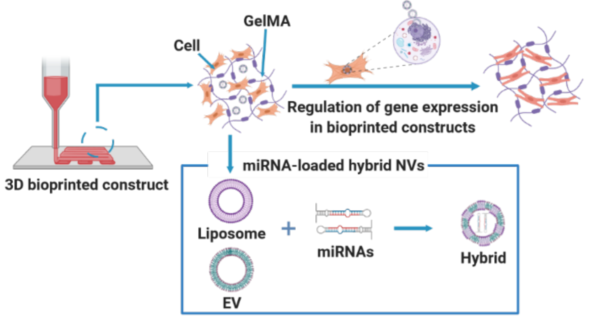

To regulate gene expression in 3D bioprinted constructs, hybrid extracellular vesicles-liposomes nanovesicles encapsulating microRNAs are embedded in gelatin-based bioinks. The targeting hybrid nanovesicles improved the native bioink’s mechanical properties, biological functions, and printing ability without hampering its desirable biodegradability and biocompatibility. This unique bioink is a great candidate for bioprinting tissue grafts to treat injuries or diseases.
