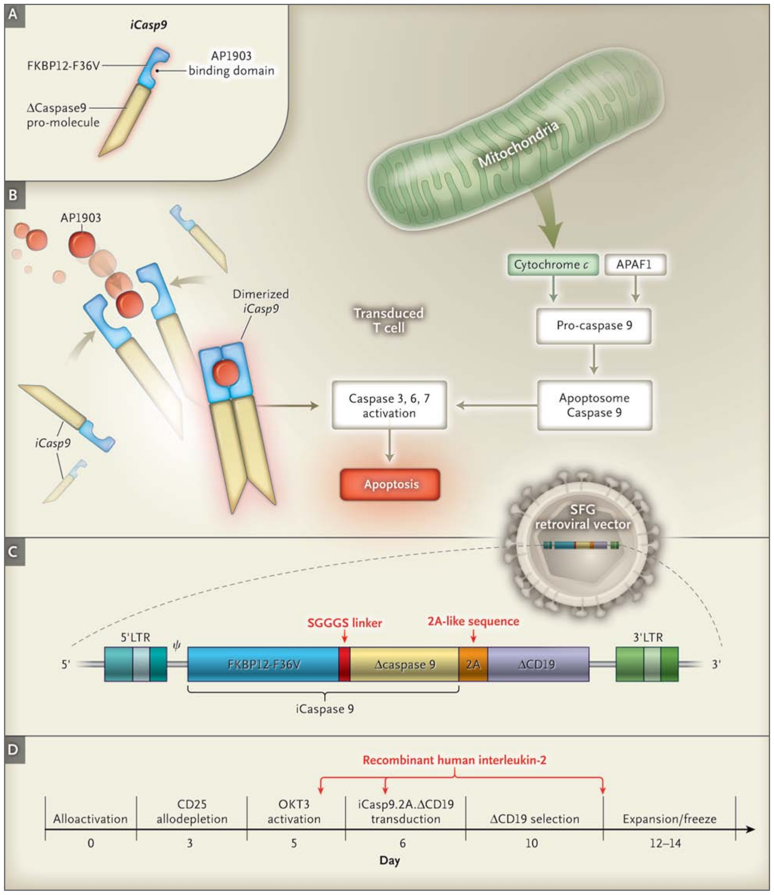
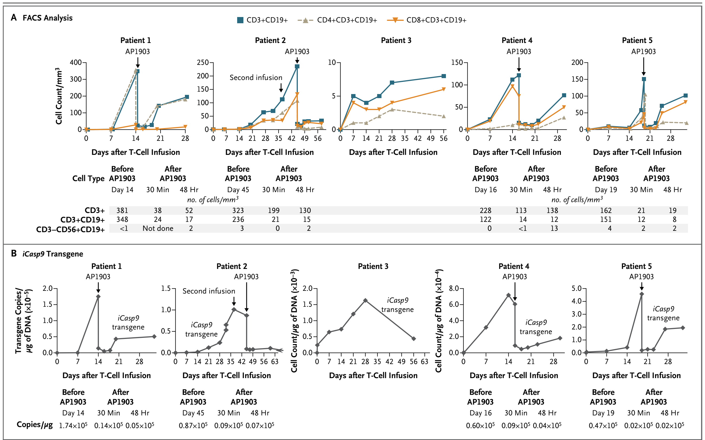
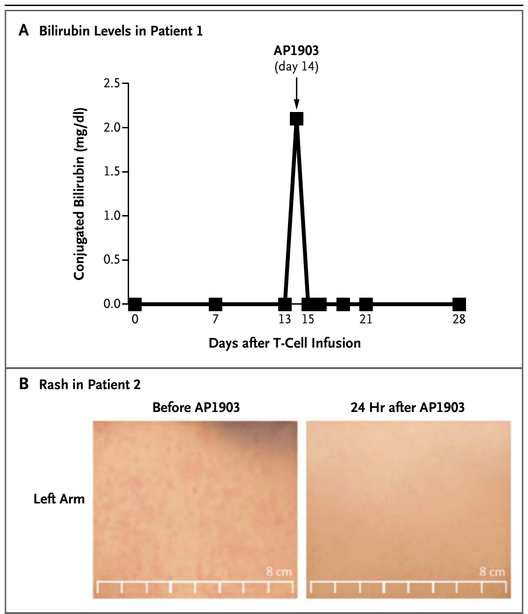
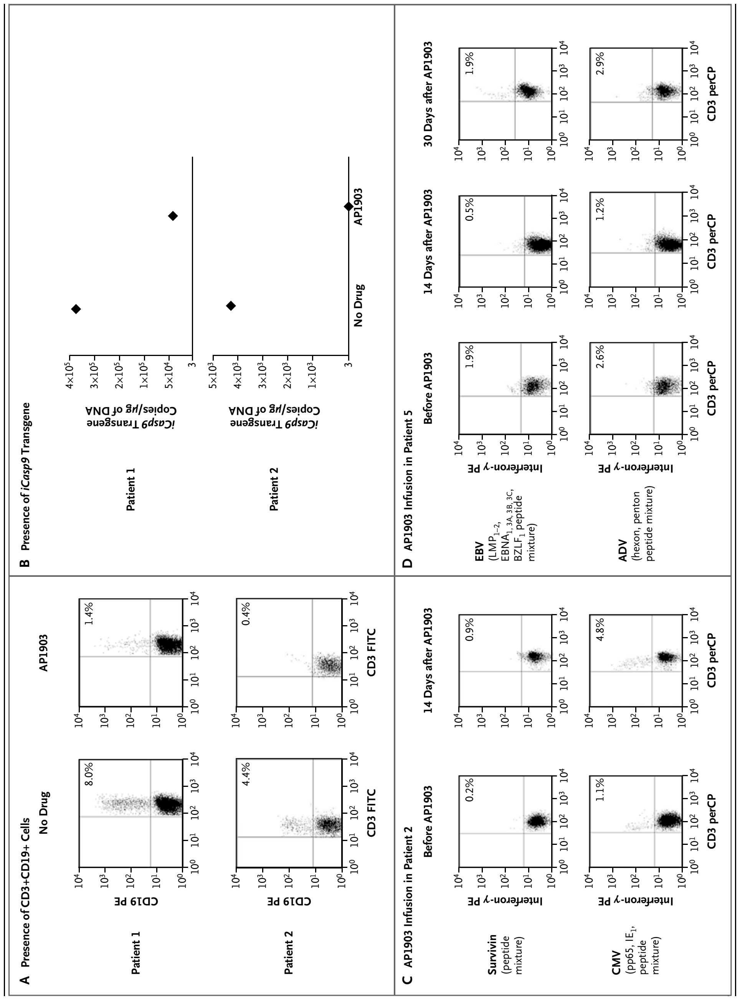
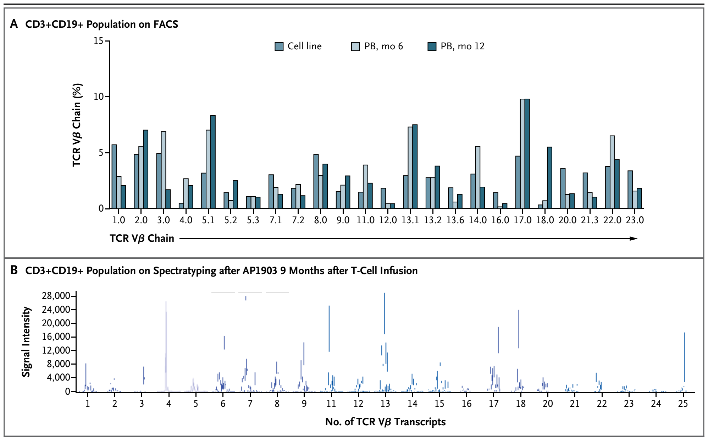

The New England Journal of Medicine

original article

# Inducible Apoptosis as a Safety Switch for Adoptive Cell Therapy

Antonio Di Stasi, M.D., Siok-Keen Tey, M.D., Gianpietro Dotti, M.D., Yuriko Fujita, M.D., Alana Kennedy-Nasser, M.D., Caridad Martinez, M.D., Karin Straathof, M.D., Enli Liu, M.D., April G. Durett, M.Sc., Bambi Grilley, R.Ph., Hao Liu, Ph.D., Conrad R. Cruz, M.D., Barbara Savoldo, M.D., Adrian P. Gee, Ph.D., John Schindler, Ph.D., Robert A. Krance, M.D., Helen E. Heslop, M.D., David M. Spencer, Ph.D., Cliona M. Rooney, Ph.D., and Malcolm K. Brenner, M.D.

From the Center for Cell and Gene Therapy, Baylor College of Medicine, Texas Children’s Hospital and Methodist Hospital, Houston (A.D.S., S.-K.T., G.D., Y.F., A.K.-N., C.M., K.S., E.L., A.G.D., B.G., H.L., C.R.C., B.S., A.P.G., R.A.K., H.E.H., D.M.S., C.M.R., M.K.B.); and the University of Texas Southwestern Medical School, Dallas (J.S.). Address reprint requests to Dr. Brenner at the Center for Cell and Gene Therapy, Baylor College of Medicine, 1102 Bates Ave., Suite FC 1660, Houston, TX 77030, or at mbrenner@bcm.edu.

Drs. Di Stasi and Tey contributed equally to this article.

N Engl J Med 2011;365:1673-83.

November 3, 2011 · Volume 365, Number 18

Copyright © 2011 Massachusetts Medical Society.

## Abstract

### Background

Cellular therapies could play a role in cancer treatment and regenerative medicine if it were possible to quickly eliminate the infused cells in case of adverse events. We devised an inducible T-cell safety switch that is based on the fusion of human caspase 9 to a modified human FK-binding protein, allowing conditional dimerization. When exposed to a synthetic dimerizing drug, the inducible caspase 9 (iCasp9) becomes activated and leads to the rapid death of cells expressing this construct.

### Methods

We tested the activity of our safety switch by introducing the gene into donor T cells given to enhance immune reconstitution in recipients of haploidentical stem-cell transplants. Patients received AP1903, an otherwise bioinert small-molecule dimerizing drug, if graft-versus-host disease (GVHD) developed. We measured the effects of AP1903 on GVHD and on the function and persistence of the cells containing the iCasp9 safety switch.

### Results

Five patients between the ages of 3 and 17 years who had undergone stem-cell transplantation for relapsed acute leukemia were treated with the genetically modified T cells. The cells were detected in peripheral blood from all five patients and increased in number over time, despite their constitutive transgene expression. A single dose of dimerizing drug, given to four patients in whom GVHD developed, eliminated more than 90% of the modified T cells within 30 minutes after administration and ended the GVHD without recurrence.

### Conclusions

The iCasp9 cell-suicide system may increase the safety of cellular therapies and expand their clinical applications. (Funded by the National Heart, Lung, and Blood Institute and the National Cancer Institute; ClinicalTrials.gov number, NCT00710892.)

Although cellular therapies may be effective in cancer treatment, their potential for expansion, damage of normal organs,1-4 and malignant transformation5 is a source of concern. In contrast, the toxic effects of small molecules usually diminish once the drugs are withdrawn. One approach to preventing adverse outcomes is to incorporate a safety, or “suicide,” gene in the transferred cells.6,7 In this strategy, a prodrug that is administered in the event of an adverse event is activated by the suicide-gene product and kills the transduced cell. Expression of the gene encoding herpes simplex virus thymidine kinase (*HSV-TK*) has shown promise as a safety switch in patients receiving cellular therapies, but its mechanism of action requires interference with DNA synthesis8 so that cell killing may take several days and be incomplete, resulting in a prolonged delay in clinical benefit.8,9 Moreover, an antiviral prodrug (e.g., ganciclovir) is required for cell elimination, a factor that removes this class of agents from the therapeutic repertoire. Finally, HSV-TK is virus-derived and hence potentially immunogenic.10

We have developed an alternative strategy that relies on inducible caspase proteins to exploit the mitochondrial apoptotic pathway.11,12 To test our system in humans, we studied recipients of donor T cells in whom graft-versus-host disease (GVHD) had developed after allogeneic stem-cell transplantation. Our previous studies had shown that the use of T cells depleted of alloreactive progenitor cells (allodepleted), without safety genes, provided excellent immune recovery and protection against severe viral disease but did not provide protection against relapse.13 We postulated that a higher dose of allodepleted donor T cells might also reduce the risk of relapse, since our allodepletion technique spared leukemia-reactive precursor cells.14 Because no allodepletion process is 100% effective, we decided to use activation of the safety switch for the treatment of any case of GVHD caused by this high-dose of haploidentical T cells.

In the clinical study reported here, five recipients of allogeneic stem-cell transplants who were between the ages of 3 and 17 years received infusions of inducible caspase 9 (iCasp9)–expressing donor T cells. We measured the expansion and function of the infused iCasp9 T cells in vivo, the ability of the cells to cause GVHD, and the response of the T cells and the GVHD they caused to a single dose of a dimerizing drug.

## Methods

### Generation of Allodepleted T Cells

The study was conducted in accordance with the protocol, which is available with the full text of this article at NEJM.org. We cocultured peripheral-blood mononuclear cells (PBMCs) obtained from HLA-haploidentical stem-cell donors with irradiated recipient Epstein–Barr virus (EBV)–transformed lymphoblastoid cell lines at a ratio of 40:1 responder (donor) cells to stimulator (recipient) cells in serum-free medium (AIM V, Invitrogen).13 After 72 hours, activated T cells that expressed CD25 were depleted from the coculture by overnight incubation in an immunotoxin that was constructed by linking the monoclonal antibody RFT5 through a sterically hindered disulfide linker (SMPT) to deglycosylated ricin A-chain (dgA). Allodepletion was considered adequate if the residual CD3+CD25+ population was less than 1% and if residual proliferation in response to recipient cells by [³H]thymidine incorporation was less than 10%.13

### Plasmid, Retrovirus, and Retroviral Transduction

Figure 1 (facing page). Generation of Transgene and Function of Activated *iCasp9*. In Panel A, the suicide gene *iCasp9* is shown to consist of the sequence of the human FK506-binding protein, FKBP12, with an F36V mutation, connected through a series of amino acids to the gene encoding human caspase 9. FKBP12-F36V binds with high affinity to a small-molecule dimerizing agent, AP1903. Panel B shows that physiological activation of the intrinsic apoptosis pathway requires a cytoplasmic protein, apoptotic peptidase activating factor 1 (APAF1), which binds with cytochrome *c* to form an oligomeric apoptosome, which in turn binds and cleaves caspase 9 preproprotein, releasing an activated form of the peptidase and resulting in a caspase cascade that ends in apoptosis. In transduced cells, the administration of AP1903 leads to dimerization of iCasp9, thereby bypassing activation of the initial mitochondrial apoptotic pathway. Panel C shows the structure of the *iCaspase9.2A.∆CD19* bicistronic transgene (i.e., one with two cistrons, the loci responsible for generating a protein), comprising the *iCasp9* sequence, with truncated *CD19* (ΔCD19) serving as the selectable marker. The sequence cassette is then incorporated into the SFG retroviral vector. Panel D shows the manufacturing process, along with the day of each manipulation. The arrows indicate the times of adding recombinant human interleukin-2 to the cultures. LTR denotes long terminal repeat, OKT3 mouse antihuman CD3 monoclonal antibody, and SGGGS Ser-Gly-Gly-Gly-Ser.

The transgene *SFG.iCasp9.2A.ΔCD19* consists of *iCasp9*, which is linked through a sequence of 2A-derived nucleotides15,16 to truncated human CD19 (ΔCD19) (Fig. 1C); *iCasp9* consists of the sequence of the human FK506-binding protein (*FKBP12*; GenBank number, AH002818) with an F36V mutation, connected through a Ser-Gly-Gly-Gly-Ser linker to the gene encoding human caspase 9 (*CASP9*; GenBank number, NM001229), which is deleted for its endogenous caspase activation and recruitment domain.17-20 FKBP12-F36V binds with high affinity to an otherwise bioinert small-molecule dimerizing agent, AP1903,12,19 with truncated CD19 (ΔCD19) serving as a selectable marker (Fig. 1A, 1B, and 1C).17 In the presence of the drug, the iCasp9 promolecule dimerizes and activates the intrinsic apoptotic pathway, leading to cell death (Fig. 1B). The safety and efficacy of the transgene have previously been tested in vitro and in small-animal models.17 Detailed methods for T-cell activation and expansion and for retroviral transduction have been described previously18 and are provided in the Supplementary Appendix, available at NEJM.org.

### CD19 Immunomagnetic Selection

Four days after transduction, we labeled cells with paramagnetic microbeads conjugated to monoclonal mouse antihuman CD19 antibodies (Miltenyi Biotec) and selected them on an automated selection device (CliniMACS Plus, Miltenyi Biotec). CD19-selected cells were expanded for up to 4 more days and then were cryopreserved. Aliquots of cells were tested for transduction efficiency, identity, phenotype, and sterility, as required for final release testing by the Food and Drug Administration.

### Immunophenotyping, Spectratyping, and PCR

We performed flow cytometric analysis — using FACSCanto II (BD Biosciences); FACSDiva software, version 6.1.2 (Becton Dickinson); FACSCalibur CellQuest TM Pro software, version 6 (Becton Dickinson); FCS Express software, version 3 (De Novo); and Gallios, Kaluza software, version 1.1 (Beckman Coulter) — with antibodies to the following antigens: CD3, CD4, CD8, CD19, CD20, CD25, CD27, CD28, CD56, CD69, interferon-γ (Becton Dickinson), CD45RA/RO, CD62L, and CD127 (Beckman Coulter). The repertoire of the T-cell receptor variable beta chain (TCR Vβ) was analyzed with the use of the IO Test Beta Mark kit (Beckman Coulter) (for details, see the Supplementary Appendix). Spectratyping analysis was performed by the immune monitoring laboratory at the Fred Hutchinson Cancer Research Center, as described previously.21 A real-time quantitative polymerase-chain-reaction (PCR) assay was used to measure the *iCasp9* transgene in PBMCs.

### T-Cell Infusion

Patients meeting eligibility criteria (evidence of neutrophil engraftment, no serious organ toxicity or infection, and an interval of >42 days after treatment of the previous patient in the study) received allodepleted cells between 30 and 90 days after transplantation. The parents or guardians of the patients provided written informed consent.

The cryopreserved T cells were administered at the Center for Cell and Gene Therapy at the Methodist Hospital or at Texas Children’s Hospital. To determine the maximum tolerated dose, we began with a dose of 1×10⁶ T cells per kilogram of body weight and used a continual reassessment method that was based on a logistic dose–response curve, administering each dose level in two patients before moving to the next dose level.22 Dose level 2 was 3×10⁶ T cells per kilogram, and dose level 3 was 1×10⁷ T cells per kilogram. Patients did not receive any dose of T cells until at least 42 days had elapsed since the T-cell infusion in the previous patient enrolled in the study.

### Treatment with AP1903

Patients in whom GVHD developed after the infusion of allodepleted T cells received 0.4 mg of the dimerizing agent AP1903 (Bellicum Pharmaceuticals) per kilogram as a 2-hour infusion, in accordance with pharmacokinetic data showing plasma concentrations of 10 to 1275 ng per milliliter in patients receiving doses ranging from 0.01 to 1.0 mg per kilogram, with plasma levels falling to 18% of the maximum half an hour after infusion and falling to 7% of the maximum 2 hours after infusion.23 At these concentrations of the dimerizing drug, preclinical studies showed little variation in the induction of apoptosis among patients, with consistent elimination of more than 90% of iCasp9-expressing cells.17,18 To analyze the effects of the drug, we collected PBMCs from treated patients, stained a portion of the cells with CD3/CD19 monoclonal antibodies (BD Biosciences), and analyzed them using fluorescence-activated cell sorting (FACS) analysis (1×10⁴ events on CD3+ and CD3+CD19+ gated populations). We extracted DNA from a second aliquot of 1×10⁶ cells and measured the *iCasp9* signal by means of a quantitative PCR assay.

### Detection of Antigen-Specific T Cells

We cultured PBMCs from treated patients with overlapping peptide libraries (15-mer peptides overlapping by 11 amino acids) that were derived from adenovirus (ADV), cytomegalovirus (CMV), and EBV antigens, a human survivin protein, and hepatitis C (HCV) or with no peptides at a concentration of 1 ng per cubic millimeter. After 1 hour, Brefeldin-A (BD Biosciences) was added at a 1:1000 dilution to block cytokine secretion. After overnight incubation at 37°C, cells were stained with CD3/CD8/CD19 antibodies, permeabilized with Cytofix/Cytoperm solution, and stained with PE anti-human IFN-γ antibody (all from BD Biosciences).

## Results

### Patients and Treatment Strategy

Table 1. Characteristics of the Patients and Clinical Outcomes.*

<table aria-labelledby="p38">
<thead><tr><th scope="col">Variable</th><th scope="col">Patient 1</th><th scope="col">Patient 2</th><th scope="col">Patient 3</th><th scope="col">Patient 4</th><th scope="col">Patient 5</th></tr></thead>
<tbody><tr><th scope="row">Age (yr)</th><td>3</td><td>17</td><td>8</td><td>4</td><td>6</td></tr><tr><th scope="row">Sex</th><td>Male</td><td>Female</td><td>Male</td><td>Female</td><td>Male</td></tr><tr><th scope="row">Weight (kg)</th><td>12.6</td><td>51.6</td><td>27.1</td><td>16.0</td><td>42.3</td></tr><tr><th scope="row">Diagnosis</th><td>Myelodysplastic syndrome, acute myeloid leukemia</td><td>B-lineage acute lymphoblastic leukemia</td><td>T-lineage acute lymphoblastic leukemia</td><td>T-lineage acute lymphoblastic leukemia</td><td>B-lineage acute lymphoblastic leukemia</td></tr><tr><th scope="row">Disease status at SCT</th><td>Second complete remission</td><td>Second complete remission</td><td>Primary induction failure, first complete remission</td><td>Active disease</td><td>Second complete remission</td></tr><tr><th scope="row">No. of days from SCT to T-cell infusion</th><td>63</td><td>80 and 112†</td><td>93</td><td>30</td><td>41</td></tr><tr><th scope="row">No. of cells infused per kg of weight</th><td>1×10⁶</td><td>1×10⁶ in each of two infusions</td><td>3×10⁶</td><td>3×10⁶</td><td>1×10⁷</td></tr><tr><th scope="row">Acute GVHD</th><td>Grade 1 or 2 skin, liver</td><td>Grade 1 skin</td><td>None</td><td>Grade 1 skin</td><td>Grade 1 skin</td></tr><tr><th scope="row">Clinical outcome‡</th><td>Complete remission &gt;12 mo; no GVHD</td><td>Complete remission &gt;12 mo; no GVHD</td><td>Complete remission &gt;12 mo; no GVHD</td><td>Death from progressive disease; no GVHD</td><td>Complete remission &gt;3 mo; no GVHD</td></tr></tbody></table>

* GVHD denotes graft-versus-host disease, and SCT haploidentical stem-cell transplantation.

† Patient 2 received two T-cell infusions in order to eliminate mixed hematopoietic chimerism.

‡ Data on outcomes reflect follow-up as of March 2011.

All five patients in our study had undergone haploidentical transplantation with CD34-selected hematopoietic stem cells (Table 1). T cells from the donors of these haploidentical stem cells were allodepleted13,14 before they were genetically modified with the construct shown in Figure 1C to induce the expression of *iCasp9* and the selectable marker *ΔCD19*.

After column selection of CD19+ cells, the yield of transgene-positive cells increased to a range of 90 to 93%, as determined by the presence of cells that were simultaneously positive for both CD3 and CD19 markers. (The efficiency of transduction and selection, phenotypic characteristics, and alloreactivity of the infused T-cell lines are summarized in Table S1 and Fig. S1B in the Supplementary Appendix.) The infused lines were predominantly CD4+ and CD8+ T cells, expressing both central and effector memory markers. On the basis of data from our previous studies, the patients received between 1×10⁶ and 1×10⁷ of these T cells per kilogram in an effort to reduce infection or relapse after transplantation13,14 (Fig. 1D).

### In Vivo Expansion of *iCasp9*-Transduced T Cells

Figure 2. Detection of *iCasp9*-Transduced T Cells in Peripheral Blood. Panel A shows fluorescence-activated cell sorting (FACS) analysis for *iCasp9*-transduced T cells (CD3+, CD3+CD19+, CD4+CD19+, CD8+CD19+, or CD3−CD56+CD19+, with the cell count given per cubic millimeter of peripheral blood) from five patients who received cellular therapy after undergoing HLA-haploidentical stem-cell transplantation for relapsed leukemia. Skin or liver graft-versus-host disease (GVHD) developed in Patients 1, 2, 4, and 5, who had high levels of engraftment. Each of these patients received a single dose of AP1903. The tables beneath the graphs show the cell counts before and after treatment with AP1903. Panel B shows the number of copies of the *iCasp9* transgene per microgram of DNA obtained from peripheral-blood mononuclear cells, evaluated by means of real-time quantitative polymerase-chain-reaction (PCR) amplification, for each patient at time points corresponding to those in Panel A before and after AP1903 infusion. The tables beneath the graphs show the actual quantitative PCR values before and after treatment, revealing a diminution by a factor of 100 (2 log) in the signal from the iCasp9 transgenic cells.

Constitutive expression of a “procaspase” molecule has the potential to impede cell survival and expansion in vivo. We therefore sought to detect *iCasp9-*transduced T cells in peripheral blood during the first 6 weeks after infusion. The modified T cells (CD3+CD19+) became detectable in vivo within 3 to 7 days after the first T-cell infusion, and the number of modified cells was increased in Patient 2 after a second infusion of allodepleted T cells, which were administered to eliminate mixed hematopoietic chimerism. The numbers of these transgenic cells increased with time, as measured by FACS analysis for CD3+CD19+ cells (Fig. 2A) and by quantitative PCR amplification of the *iCasp9* transgene (Fig. 2B). Both CD4+ and CD8+ transgenic T cells were detected. Thus, in the absence of the dimerizing drug, forced expression of iCasp9 did not preclude the survival or in vivo expansion of the transduced cells. Not only did the T-cell numbers in the circulation rise after infusion but the numbers of circulating transgenic T cells also exceeded the numbers of cells initially infused by a substantial margin.

### Control of Acute GVHD with AP1903

Figure 3. Rapid Reversal of GVHD after Treatment with AP1903. Panel A shows the normalization of bilirubin levels in Patient 1 within 24 hours after treatment with AP1903. To convert the values for bilirubin to micromoles per liter, multiply by 17.1. Panel B shows the disappearance of rash from the left arm of Patient 2 within 24 hours after treatment.

Concomitantly with the expansion of the modified T cells, GVHD of the skin developed in four of the five patients (Patients 1, 2, 4, and 5) within 14 to 42 days after the first T-cell infusion, indicating that constitutive iCasp9 expression did not impede T-cell function, as measured by alloreactivity (Fig. 3). Findings in skin-biopsy specimens were consistent with mild GVHD, although in this early phase of the disease, too few infiltrating T cells were present to confirm the presence of CD3+CD19+ T cells. Liver GVHD also developed in Patient 1, as indicated by rising levels of serum bilirubin (Fig. 3A) and alkaline phosphatase (not shown). Each of the four patients was treated with a single infusion of the dimerizing drug AP1903. The numbers of circulating transgenic T cells decreased by more than 90% within 30 minutes after infusion, as assessed either by FACS analysis of cell phenotype or by PCR assay to detect the *iCasp9* transgene (Fig. 2, and Fig. S3 and S6 in the Supplementary Appendix). There was a further decline of 0.5 log (according to the FACS analysis) or 1 log (according to the PCR analysis) during the subsequent 24 hours without additional treatment.

The dimerizing drug had no effect on the endogenous CD3+CD19− (nontransduced) T-cell population or on other blood counts (Table S2 in the Supplementary Appendix). No immediate or delayed adverse effects of the drug were noted. Within 24 hours after infusion, the GVHD-associated abnormalities of skin and liver began to resolve in all four patients and essentially normalized within 24 to 48 hours after infusion (Fig. 3). (The phenotypes of the CD3+CD19+ T cells before T-cell infusion and before and after AP1903 infusion are provided in Table S1 in the Supplementary Appendix.)

Figure 4 (facing page). Persistence of Drug Sensitivity and Antiviral Function of CD3+CD19+ T Cells after Treatment with AP1903 in Vivo. Panel A shows the presence of CD3+CD19+ cells and the *iCasp9* transgene in Patients 1 and 2. Cells were counted and incubated with antibodies labeled with fluorochrome (phycoerythrin [PE] or fluorescein isothiocyanate [FITC]) targeting CD19+ cells (PE) and CD3+ cells (FITC). CD3+CD19+ T cells remained within the CD3+ population in the peripheral blood after treatment with AP1903 for 5 months in Patient 1 and for 9 months in Patient 2. These CD3+CD19+ cells retained sensitivity to AP1903 in vitro, as assessed both by the reduction in the number of CD3+CD19+ cells on fluorescence-activated cell sorting (FACS) analysis (as measured per microliter of peripheral blood) (Panel A) and by quantitative polymerase-chain-reaction (PCR) analysis of the *iCasp9* gene before and after exposure to the dimerizing drug (Panel B). As shown in Panel A, values for Patient 1 were 2290 lymphocytes per cubic millimeter with a CD3+ count of 41%, and values for Patient 2 were 1380 lymphocytes per cubic millimeter with a CD3+ count of 35%. As indicated on the y axis in Panel B, 3 is the minimum number of copies of *iCasp9* that can be detected on quantitative PCR. CD3+CD19+ gene-modified T cells that were collected from Patient 2 (Panel C) and Patient 5 (Panel D) were responsive to viral peptide mixtures and survivin peptide mixture (in Patient 2) before the administration of AP1903, as shown by the presence of interferon-γ–positive CD3+CD19+ T cells in the peptide-stimulated cultures. The assessment of the recovering CD3+CD19+ population at 14 days in Patient 2 and at 14 and 30 days in Patient 5 after AP1903 infusion to treat GVHD showed the persistence of these antigen-specific cells in the absence of recurrent GVHD. ADV denotes adenovirus, BZLF1 BamHI Z leftward reading frame, EBNA Epstein–Barr nuclear antigen, IE1 immediate early protein, LMP latent membrane protein, perCP peridinin chlorophyll protein, and pp65 phosphoprotein 65.

Although the protocol provided the option of administering additional doses of the dimerizing drug, the prompt resolution and lack of recurrence of GVHD over the long term (up to 1 year) made this unnecessary. Nonetheless, because there was subsequent re-expansion of the small population of CD3+CD19+ T cells that remained in peripheral blood after treatment (Fig. 2, and Fig. S3 and S6 in the Supplementary Appendix), we assessed the drug responsiveness of these recovering T cells in vitro. We found that these residual transduced cells could still be rapidly killed on repeated exposure to the dimerizing drug, with a kill rate of approximately 85% more than 9 months after infusion (Fig. 4A and 4B). It should therefore be possible to prolong transduced T-cell depletion in vivo with the use of additional doses of the dimerizing agent, should they be required.

### recovery of nonalloreactive t cells

Figure 5. Polyclonality of Recovering T Cells in Patient 1. The analysis of the repertoire of T-cell receptor variable beta chain (TCR Vβ) in the CD3+CD19+ selected population, which recovered 6 months after the administration of the dimerizing drug in Patient 1, shows a polyclonal pattern of expression, as measured by reactivity to monoclonal antibodies directed against TCR Vβ chain families and measured on FACS analysis (Panel A), as well as by multiplex polymerase-chain-reaction–based spectratyping to analyze the number of distinct TCR Vβ transcripts present (Panel B). PB denotes peripheral blood.

Finally, we characterized the nonalloreactive transgenic T cells that survived the dimerizing drug and subsequently repopulated the recipients (Fig. 4, and Fig. S2 through S7 in the Supplementary Appendix). The *iCasp9*-positive CD3+CD19+ T cells were polyclonal, as judged by TCR Vβ and spectratyping analysis, and recovered after the administration of the dimerizing drug (Fig. 5A and 5B). (For data on the polyclonality of the recovering T cells from other patients, see Fig. S2A and S2B in the Supplementary Appendix.) Consistent with this polyclonality was the finding that virus-reactive T cells directed against ADV, CMV, and EBV could be detected in the *iCasp9-*positive CD3+CD19+ T cells in peripheral blood both before and after exposure to the dimerizing drug (Fig. 4C and 4D). Moreover, none of the five recipients of these haploidentical T-cell–depleted stem-cell grafts had reactivation of ADV, CMV, or EBV or other serious viral disease after T-cell infusion and dimerizer treatment. Indeed, Patient 5 had high levels of adenoviral DNA in stool and blood that normalized after the infusion of transgenic T cells; the high levels did not recur after the administration of the dimerizing drug (Fig. S5 in the Supplementary Appendix). Notably, we found no evidence of destructive immune reactivity against the transgenic cells,23-25 since CD3+CD19+ cells were present in stable numbers for more than 1 year (Fig. S6 in the Supplementary Appendix), and we found no measurable response of T cells to peptide pools from the nonhuman 2A-linker sequences within the transgene (Fig. S7 in the Supplementary Appendix).

## Discussion

Our data show that a modified component of the human intrinsic apoptotic pathway can be used to induce cell death in patients receiving cellular therapy. A single dose of the dimerizing drug AP1903, which has a terminal half-life of 5 hours in vivo,23 eliminates 90% of the transgenic cells within 30 minutes after infusion, with a further log depletion during the next 24 hours. Although we cannot formally exclude the possibility that the rapid decline in CD3+CD19+ *iCasp9*-transduced T cells was due to AP1903-induced redistribution rather than apoptosis, this explanation seems unlikely. Indeed, we have been able to induce apoptosis both readily and rapidly in vitro at the concentrations of the dimerizing drug that were reached in peripheral blood from the patients,17,23 whereas the resolution of the signs of GVHD in both skin and liver suggests that both tissues, as well as circulating T cells, were rapidly affected by the drug.

The iCasp9*-*based cell safety switch provides several potential advantages over preexisting suicide genes for cellular therapy.6-9 The use of an otherwise bioinert small molecule12,19 to dimerize and activate iCasp9 allows us to retain important antiviral agents, such as ganciclovir, for therapy. The human origin of the *iCasp9* suicide gene probably makes it less immunogenic than suicide genes from xenogeneic sources. We found no evidence of an immune response against transgenic cells, which persisted at stable levels over the long term in our patients, but we cannot rule out immunogenicity of any component of the construct in other clinical settings.24-26 Most important, since the iCasp9 system engages the endogenous apoptotic pathway in the cell, it can cause cell death within minutes after drug administration, whereas other established methods that interfere with DNA synthesis require prolonged treatment and remove a smaller proportion of transduced cells.6-9 However, we do not yet know whether such rapid efficacy will eliminate the acute toxic effects that have followed the administration of large numbers of gene-modified T cells.27,28

A more extensive clinical study will be required to address whether infusions of iCasp9-transduced T cells will reduce rates of infection or relapse among patients with cancer and whether treatment with a dimerizing drug adversely affects the benefit of such infusions. We find it encouraging that by 1 to 2 weeks after treatment with AP1903, polyclonal iCasp9-positive CD3+CD19+ T cells could again be detected in peripheral blood and that these T cells retained virus-specific reactivity. Notably, none of the recipients of these haploidentical T-cell–depleted stem-cell grafts had viral reactivation or disease up to 1 year after the infusion. Although a single dose of the dimerizing drug kills 99% of the cells with the highest transgene expression, alloactivation increases transgene expression in T cells.18,29 Hence, a small, but apparently sufficient, number of unstimulated virus-reactive T cells are spared, perhaps because of a lower level of activation and transgene expression (Table S1C and Fig. S3 in the Supplementary Appendix).

Although the iCasp9 system is designed to increase the safety of T-cell therapy, the integration of any transgene is a mutagenic event and hence is potentially oncogenic.5 Fortunately, after nearly two decades of study,30 the introduction of transgenes into T cells has yet to be associated with malignant transformation, although the unequivocal risks of such complications when human CD34+ stem cells are the targets of retroviral gene transfer5 mean that the extension of the iCasp9 safety system, for example, to human stem cells1,2 will continue to require careful assessment of both potential risks and benefits.31

Supported by a grant (U54HL08100) from the National Heart, Lung, and Blood Institute for the clinical protocol and a grant (P01CA094237) from the National Cancer Institute for the development of the caspase system.

Disclosure forms provided by the authors are available with the full text of this article at NEJM.org.

We thank the patients and their families for their cooperation; Yu-Feng Lin for coordinating the study; Drs. Ann Leen, Ulrike Gerdemann, Catherine Bollard, and Stephen Gottschalk for assisting with immunologic studies; Dr. Christopher Leveque for collecting donated blood and performing apheresis; Teresita Lopez and Eric Yvon for providing technical assistance; Deborah Lyon for performing quality-control testing; Crystal Silva-Lentz, Carlos Lee, and Sarah Richman for providing quality assurance; Oumar Diouf for helping to ensure Good Manufacturing Practice conditions for production; Dr. Jennifer Lynds for providing pharmaceutical assistance; Kimberly Sparks, Melissa Gates, Kely Sharpe, Tatiana Goltstova, Threeton Christopher, John Norman, and Reshma Kulkarni for performing flow cytometry; Rong Cai and Yijiu Tong for follow-up sample processing; and Mei Zhuyong and the Center for Cell and Gene Therapy Vector Production Facility.

## References

1. Daley GQ, Scadden DT. Prospects for stem cell-based therapy. Cell 2008;132:544-8.

2. Williams DA, Keating A. Enhancing research in regenerative medicine. Blood 2010;116:866-7.

3. Appelbaum FR. Haematopoietic cell transplantation as immunotherapy. Nature 2001;411:385-9.

4. Kolb HJ. Graft-versus-leukemia effects of transplantation and donor lymphocytes. Blood 2008;112:4371-83.

5. Boztug K, Schmidt M, Schwarzer A, et al. Stem-cell gene therapy for the Wiskott–Aldrich syndrome. N Engl J Med 2010;363:1918-27.

6. Bonini C, Ferrari G, Verzeletti S, et al. HSV-TK gene transfer into donor lymphocytes for control of allogeneic graft-versus-leukemia. Science 1997;276:1719-24.

7. Tiberghien P, Reynolds CW, Keller J, et al. Ganciclovir treatment of herpes simplex thymidine kinase-transduced primary T lymphocytes: an approach for specific in vivo donor T-cell depletion after bone marrow transplantation? Blood 1994;84:1333-41.

8. Ciceri F, Bonini C, Stanghellini MT, et al. Infusion of suicide-gene-engineered donor lymphocytes after family haploidentical haemopoietic stem-cell transplantation for leukaemia (the TK007 trial): a non-randomised phase I-II study. Lancet Oncol 2009;10:489-500.

9. Tiberghien P, Ferrand C, Lioure B, et al. Administration of herpes simplex-thymidine kinase-expressing donor T cells with a T-cell-depleted allogeneic marrow graft. Blood 2001;97:63-72.

10. Riddell SR, Elliott M, Lewinsohn DA, et al. T-cell mediated rejection of gene-modified HIV-specific cytotoxic T lymphocytes in HIV-infected patients. Nat Med 1996;2:216-23.

11. Fan L, Freeman KW, Khan T, Pham E, Spencer DM. Improved artificial death switches based on caspases and FADD. Hum Gene Ther 1999;10:2273-85.

12. Spencer DM, Wandless TJ, Schreiber SL, Crabtree GR. Controlling signal transduction with synthetic ligands. Science 1993;262:1019-24.

13. Amrolia PJ, Mucciolo-Casadei G, Huls H, et al. Adoptive immunotherapy with allodepleted donor T-cells improves immune reconstitution after haploidentical stem cell transplantation. Blood 2006;108:1797-808.

14. Amrolia PJ, Muccioli-Casadei G, Yvon E, et al. Selective depletion of donor alloreactive T-cells without loss of antiviral or antileukemic responses. Blood 2003;102:2292-9. [Erratum, Blood 2004;104:1605.]

15. Donnelly ML, Luke G, Mehrotra A, et al. Analysis of the aphthovirus 2A/2B polyprotein ‘cleavage’ mechanism indicates not a proteolytic reaction, but a novel translational effect: a putative ribosomal ‘skip.’ J Gen Virol 2001;82:1013-25.

16. Quintarelli C, Vera JF, Savoldo B, et al. Co-expression of cytokine and suicide genes to enhance the activity and safety of tumor-specific cytotoxic T lymphocytes. Blood 2007;110:2793-802.

17. Straathof KC, Pule MA, Yotnda P, et al. An inducible caspase 9 safety switch for T-cell therapy. Blood 2005;105:4247-54.

18. Tey SK, Dotti G, Rooney CM, Heslop HE, Brenner MK. Inducible caspase 9 suicide gene to improve the safety of allodepleted T cells after haploidentical stem cell transplantation. Biol Blood Marrow Transplant 2007;13:913-24.

19. Clackson T, Yang W, Rozamus LW, et al. Redesigning an FKBP-ligand interface to generate chemical dimerizers with novel specificity. Proc Natl Acad Sci U S A 1998;95:10437-42.

20. Zhou LJ, Ord DC, Hughes AL, Tedder TF. Structure and domain organization of the CD19 antigen of human, mouse, and guinea pig B lymphocytes: conservation of the extensive cytoplasmic domain. J Immunol 1991;147:1424-32.

21. Akatsuka Y, Martin EG, Madonik A, Barsoukov AA, Hansen JA. Rapid screening of T-cell receptor (TCR) variable gene usage by multiplex PCR: application for assessment of clonal composition. Tissue Antigens 1999;53:122-34.

22. Piantadosi S, Fisher JD, Grossman S. Practical implementation of a modified continual reassessment method for dose-finding trials. Cancer Chemother Pharmacol 1998;41:429-36.

23. Iuliucci JD, Oliver SD, Morley S, et al. Intravenous safety and pharmacokinetics of a novel dimerizer drug, AP1903, in healthy volunteers. J Clin Pharmacol 2001; 41:870-9.

24. Traversari C, Marktel S, Magnani Z, et al. The potential immunogenicity of the TK suicide gene does not prevent full clinical benefit associated with the use of TK-transduced donor lymphocytes in HSCT for hematologic malignancies. Blood 2007;109:4708-15.

25. Ciceri F, Bonini C, Marktel S, et al. Antitumor effects of HSV-TK-engineered donor lymphocytes after allogeneic stem-cell transplantation. Blood 2007;109:4698-707.

26. Mercier-Letondal P, Deschamps M, Sauce D, et al. Early immune response against retrovirally transduced herpes simplex virus thymidine kinase-expressing gene-modified T cells coinfused with a T-cell-depleted marrow graft: an altered immune response? Hum Gene Ther 2008; 19:937-50.

27. Morgan RA, Yang JC, Kitano M, Dudley ME, Laurencot CM, Rosenberg SA. Case report of a serious adverse event following the administration of T cells transduced with a chimeric antigen receptor recognizing ERBB2. Mol Ther 2010;18:843-51.

28. Brentjens R, Yeh R, Bernal Y, Riviere I, Sadelain M. Treatment of chronic lymphocytic leukemia with genetically targeted autologous T cells: case report of an unforeseen adverse event in a phase I clinical trial. Mol Ther 2010;18:666-8.

29. Pollok KE, van der Loo JC, Cooper RJ, Kennedy L, Williams DA. Costimulation of transduced T lymphocytes via T-cell receptor-CD3 complex and CD28 leads to increased transcription of integrated retrovirus. Hum Gene Ther 1999;10:2221-36.

30. Heslop HE, Slobod KS, Pule MA, et al. Long-term outcome of EBV-specific T-cell infusions to prevent or treat EBV-related lymphoproliferative disease in transplant recipients. Blood 2010;115:925-35.

31. Ramos CA, Asgari Z, Liu E, et al. An inducible caspase 9 suicide gene to improve the safety of mesenchymal stromal cell therapies. Stem Cells 2010;28:1107-15.

Copyright © 2011 Massachusetts Medical Society.

The New England Journal of Medicine

Downloaded from nejm.org at RICE UNIVERSITY on August 26, 2018. For personal use only. No other uses without permission.

Copyright © 2011 Massachusetts Medical Society. All rights reserved.

×
