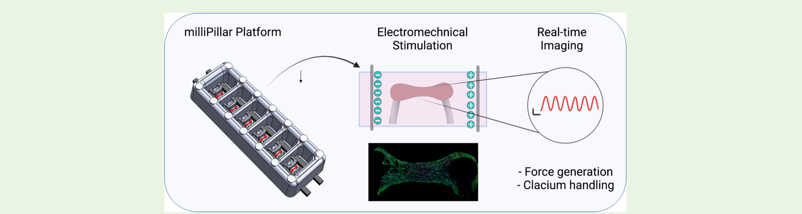
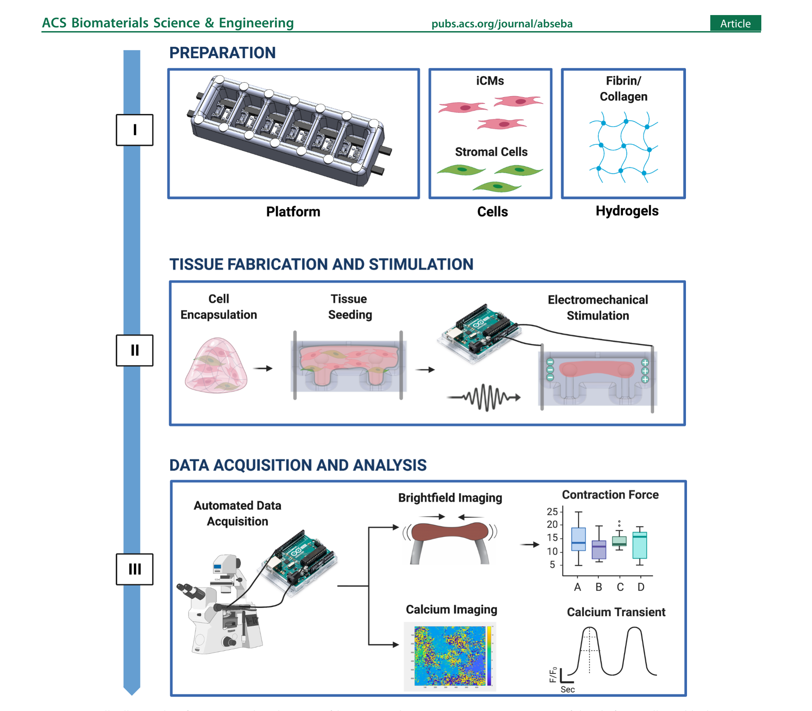
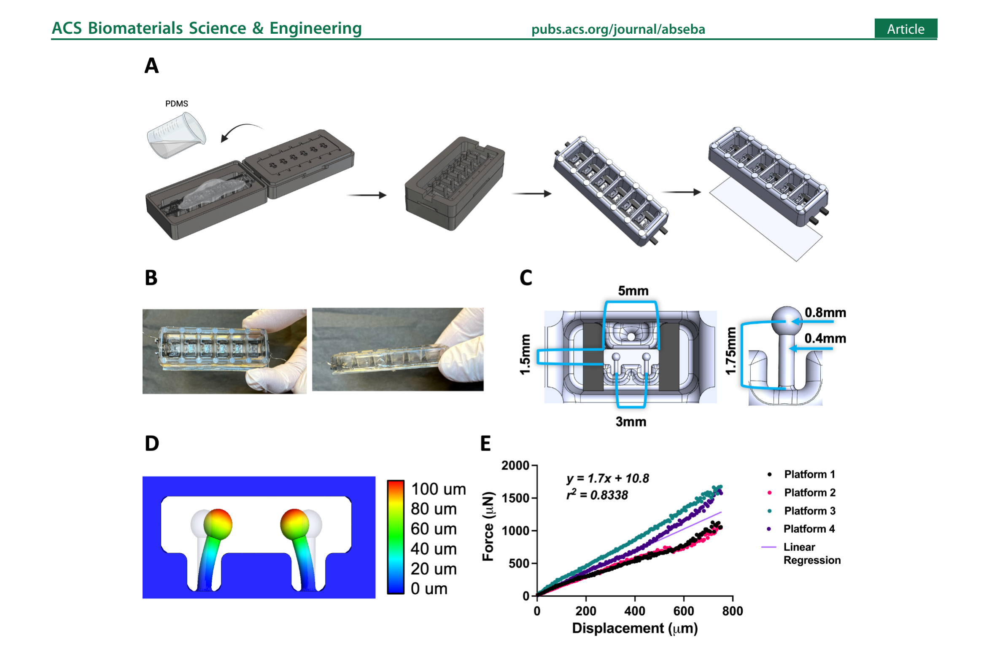
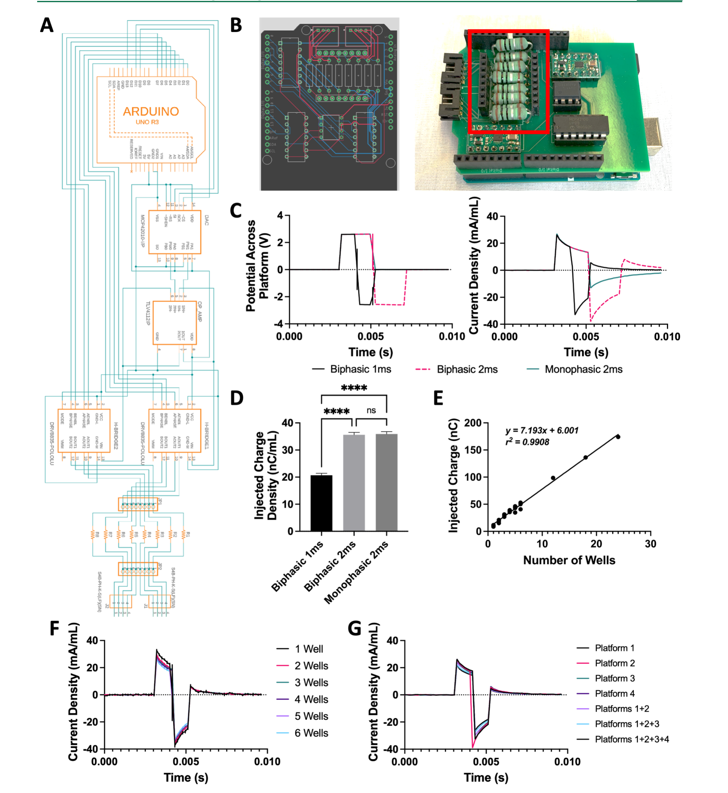
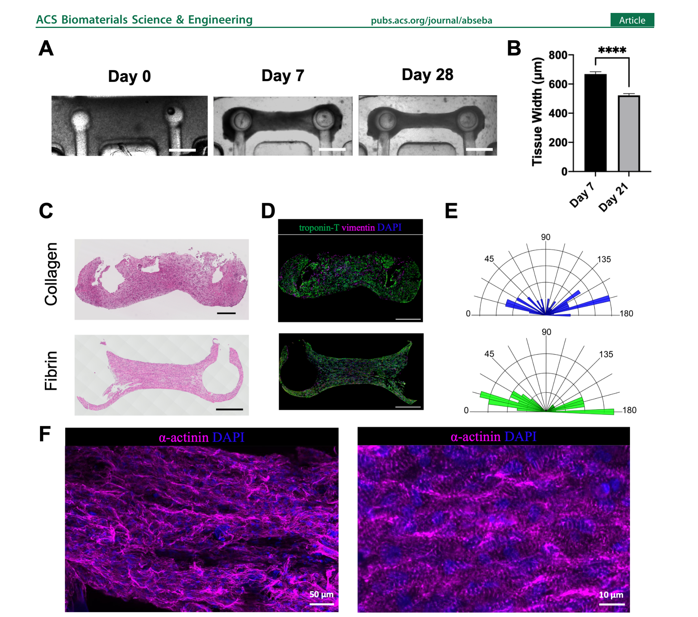
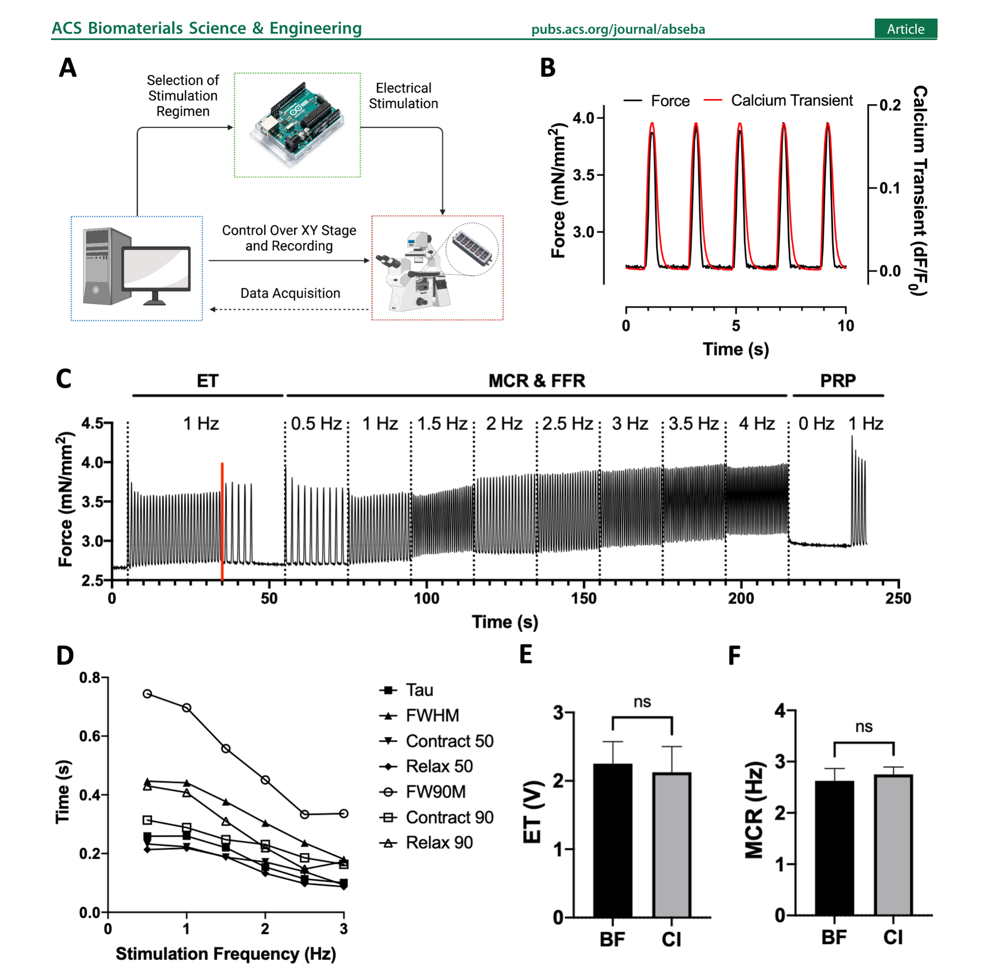
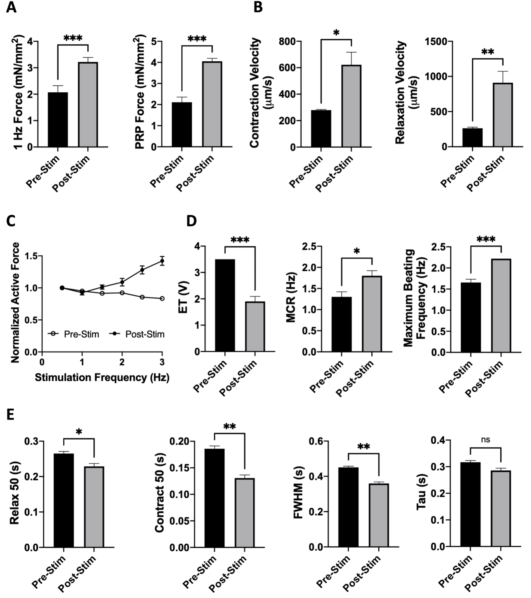

ACS Biomaterials Science & Engineering · Article · pubs.acs.org/journal/abseba

# milliPillar: A Platform for the Generation and Real-Time Assessment of Human Engineered Cardiac Tissues

Manuel Alejandro Tamargo,§ Trevor Ray Nash,§ Sharon Fleischer,§ Youngbin Kim, Olaia Fernandez Vila, Keith Yeager, Max Summers, Yimu Zhao, Roberta Lock, Miguel Chavez, Troy Costa, and Gordana Vunjak-Novakovic*

Cite This: *ACS Biomater. Sci. Eng.* 2021, 7, 5215−5229 · [https://doi.org/10.1021/acsbiomaterials.1c01006](https://doi.org/10.1021/acsbiomaterials.1c01006)

Received: August 6, 2021 · Accepted: October 5, 2021 · Published: October 20, 2021

**Graphical Abstract.** milliPillar Platform → Electromechanical Stimulation → Real-time Imaging (Force generation, Calcium handling).

**ABSTRACT:** Engineered cardiac tissues derived from human induced pluripotent stem cells (iPSCs) are increasingly used for drug discovery, pharmacology and in models of development and disease. While there are numerous platforms to engineer cardiac tissues, they often require expensive and nonconventional equipment and utilize complex video-processing algorithms. As a result, only specialized academic laboratories have been able to harness this technology. In addition, methodologies and tissue features have been challenging to reproduce between different groups and models. Here, we describe a facile technology (milliPillar) that covers the entire pipeline required for studies of engineered cardiac tissues. We include methodologies for (i) platform fabrication, (ii) cardiac tissue generation, (iii) electrical stimulation, (iv) automated real-time data acquisition, and (v) advanced video analyses. We validate these methodologies and demonstrate the versatility of the platform by showcasing the fabrication of tissues in different hydrogel materials and using cardiomyocytes derived from different iPSC lines in combination with different types of stromal cells. We also validate the long-term culture of tissues within the platform and provide protocols for automated analysis of force generation and calcium flux using both brightfield and fluorescence imaging. Lastly, we demonstrate the compatibility of the milliPillar platform with electromechanical stimulation to enhance cardiac tissue function. We expect that this resource will provide a valuable and user-friendly tool for the generation and real-time assessment of engineered human cardiac tissues for basic and translational studies.

**KEYWORDS:** cardiac tissue engineering, organs-on-a-chip, induced pluripotent stem cells, cardiomyocytes, electromechanical stimulation, real-time imaging

## INTRODUCTION

Numerous models of the human myocardium have been developed in recent years with the goal to generate minimally functional units that capture the (patho)physiology of the human heart muscle in a simplified manner.1 Monolayer cultures represent the simplest and highest throughput model; however, they lack the cell maturity and three-dimensional (3D) tissue environment required for faithful recapitulation of complex (patho)physiology.2,3 Cardiac microspheres or cardiac organoids can overcome some of these limitations while maintaining high throughput, but they lack a structural template and organized mechanical cues. This limits their organization and precludes the direct measurement of contraction force, a critical aspect of disease-modeling studies.3 Although lower in throughput, 3D cardiac tissues represent a promising alternative.4

Cardiac tissues have been created through the compaction of cell−hydrogel constructs around anchoring structures such as wires, posts, and pillars that provide mechanical loading to support tissue maturation.5−8 Further maturation has been achieved by electrical stimulation, designed to mimic the electrical pacing of cells in the native heart.9,10 With advances in stem cell biology and the use of iPSC-derived cells, 3D models of the human heart have been used to study cardiac biology, gain mechanistic insights into genetic disorders, and inform more effective patient-tailored therapies.11 While methodologies to generate and mature iPSC-derived cardiac tissues have been established by several groups, they are often difficult to set up and require specialized devices.8,12,13 The equipment and protocols for electrical stimulation also vary between studies, and differences in injected electrical charge can lead to difficulties in reproducing experiments between laboratories. With the increasing interest in harnessing these models for cardiac research, there is a clear need for a simple and accessible methodology to generate engineered cardiac tissues that can be adopted by any research laboratory.

Similarly, the measurement of tissue function is an important point of consideration. Readouts from cardiac tissue models must be quantifiable, standardized, reproducible, and relevant to the biological question at hand. With a diversity of existing models, it is imperative to compare tissue function across different studies using absolute values of functional readouts.

Quantitative metrics extracted from tissue recordings can provide such values for pharmacological screening and studies of cardiac development and disease. In addition, the acquisition of quantitative metrics in real-time is of great interest to enable longitudinal functional studies, where the same tissue can be repeatedly perturbed and evaluated over time.

To address these needs, we developed the milliPillar technology, a robust, user-friendly, and customizable platform that supports tissue fabrication, electromechanical stimulation, and real-time data acquisition and analysis. milliPillar is designed to be tailored to the specific needs of different research groups. We developed this technology to facilitate the adoption of cardiac tissue engineering techniques (especially to those entering the field), to allow the exchange of experimental resources and data between laboratories, and to support further advances in the field. The capabilities of the milliPillar platform and a selection of previously reported cardiac tissue engineering platforms are compared in Table S1.8,12,14−19

## RESULTS AND DISCUSSION

**Figure 1.** milliPillar pipeline for engineered cardiac tissue fabrication and assessment. Step I: Preparation of the platform, cells, and hydrogel. Step II: Encapsulation of cardiomyocytes and stromal cells into a hydrogel, seeding tissues, and maturation of cardiac tissues by electromechanical stimulation. Step III: Automated analysis assessing cardiac tissue function using brightfield and calcium imaging. Created with BioRender.com

### Platform Overview.

The milliPillar platform was designed to accommodate six wells for the cultivation of millimeter-scale tissues composed of iPSC-derived cardiomyocytes and supporting stromal cells encapsulated in fibrin or collagen hydrogels (Figure 1, Step I). Cell-laden hydrogels were dispensed into each well and compacted around two flexible pillars that provided mechanical load during tissue contraction. Two electrodes embedded along the platform were connected to a customized electrical stimulator to provide tissues with controlled electrical stimulation (Figure 1, Step II). The bottom of the platform was bonded to a glass slide to allow real-time imaging. Custom video analysis algorithms were developed to measure tissue contractility (by brightfield imaging) and calcium handling (by fluorescence imaging) (Figure 1, Step III). These three steps make milliPillar suitable for adaptation by nonspecialized research groups that are interested in harnessing engineered cardiac tissues for research.

**Figure 2.** milliPillar platform fabrication and mechanical characterization. (A) Schematics of the milliPillar platform fabrication process. (B) Top and side views of the milliPillar platform. (C) Single-well and pillar dimensions. (D) Modeling of pillar deflection. (E) Force versus displacement curves of the pillars.

### Fabrication and Characterization of the milliPillar Platform.

#### Platform Design.

The milliPillar platform was fabricated by casting polydimethylsiloxane (PDMS) into custom molds containing carbon electrodes and curing it in an oven at 65 °C. The platform was then detached from the mold and bonded to a glass slide (Figure 2A and 2B, Supplementary Figures S1 and S2). PDMS was chosen due to its low cost, ease of manipulation, biocompatibility, and gas exchange properties. However, users must take into consideration that PDMS nonselectively absorbs hydrophobic compounds, including oxygen and many drugs, and therefore could lead to misinterpretation of pharmacological studies and supernatant analyses.20 Efforts are in progress to replace PDMS with other biocompatible and inert materials.21,22 The platform was designed to accommodate six tissues in separate wells to enable controlled culture conditions for each individual tissue. The millimeter scale of the tissues was selected to decrease the number of required cells while still providing sufficient tissue mass for molecular, structural, and functional assays and maintaining ease of manipulation under standard laboratory conditions (Figure 2C).10 Four platforms fit into one standard 4-well plate, enabling 24 tissues to be simultaneously cultured and analyzed (Supplementary Figure S2, bottom panel, step 7). The tissue spacing is compatible with a 96-well configuration to provide compatibility with microplate readers and other standard instrumentation. The dimensions of each culture well (13 mm wide × 7 mm long × 6 mm high) were designed to accommodate small amounts of culture media (400 μL) in order to maximize the injected electrical charge per unit volume and to facilitate studies which may require precious media supplements (e.g., patient serum, extracellular vesicles, growth factors, and cytokines).

#### Mechanical Characterization of Pillars.

Flexible anchors (e.g., pillars, posts, wires) provide passive tension for continuous mechanical strain and auxotonic tissue contraction.8,12,14−19 The pairs of pillars (head diameter of 0.8 mm and stem length of 1.75 mm) were placed in a horizontal configuration at the bottom of each well to allow compaction of the tissues around the pillar heads and enable visualization of pillar deflection using an inverted microscope to accurately calculate tissue force generation (Figure 2C and 2D). To our knowledge, this is the first use of horizontal pillars in engineered cardiac tissues, which allows for observation of tissue movement in the *xy* plane.

The mechanical properties of the PDMS pillars are sensitive to the curing temperature, curing time, ratio of the base material to curing agent, and environmental temperature.10 Using a microscale force transducer and linear actuator, we tracked the pillar movement and the force associated with pillar deflection (Supplementary Figure S3A). The coefficient derived from the linear regression of the force−displacement data allowed for direct calculations of the active force and passive tension based on the displacement of the pillars by the cardiac tissues during contraction and rest. Among four independent experiments, the pillars exhibited linear elastic behavior (*r*2 = 0.834) over the 0−750 μm testing range (Figure 2E). The pillars exhibited no hysteresis, suggesting that both tissue contraction and relaxation can be evaluated with the same coefficient (Supplementary Figure S3B). Importantly, this feature suggests the same coefficient can be used throughout the study and that longitudinal measurements of the same cardiac tissue can be taken over time without recalibration.

As anticipated, there was some batch-to-batch variation of the material properties (Supplementary Figure S3C). Ideally, a single batch of platforms should be fabricated at the same time for a set of experiments and used soon after fabrication to minimize variability.

### Customized Electrical Stimulation Apparatus.

Many groups, including our own, have utilized electrical stimulation designed to mimic signals driving cardiac muscle contractions in the heart and have demonstrated improved cell−cell connectivity, alignment, and overall tissue function.9,12,23−25 In previous studies, we evaluated and modeled the electric field stimulation used to facilitate cardiac tissue contractions and have shown that carbon is a superior material of choice for electrodes.26 Here, we built upon this model and designed the milliPillar electrodes with carbon rods (6.5 mm long × 2 mm wide × 1 mm high; 5 mm apart) to create a double-bilayer capacitor. We utilized pure carbon rods as an improvement over the electrodes used in the past, due to the elimination of resin, to obtain a more porous material with increased surface area and higher conductivity.27

**Figure 3.** Custom milliPillar electrical stimulation apparatus. (A) Schematics of the custom electrical stimulator. (B) CAD rendering of the stimulator's printed circuit board (left) and the assembled circuit connected to the Arduino development board (right). Connectors for measuring current across a series of test resistors are highlighted in red. (C) Representative measurements of voltage (left) and current density (right) for a single platform stimulated with 1 ms monophasic, 1 ms biphasic, and 2 ms biphasic waveforms. (D) Quantification of the charge density injected by these three waveforms. (E) Injected charge as a function of the number of wells connected to the stimulator. (F−G) Injected current density as a function of time measured through differing numbers of wells (F) and platforms (G).

Published protocols for the electrical stimulation of engineered cardiac tissues often require expensive and specialized equipment not commonly available in most laboratories. To overcome this barrier, we built upon our previous work and developed an inexpensive, user-friendly, and easily customizable electrical stimulation device that utilizes the accessible Arduino software and hardware ecosystem and can be assembled from commercially available components and a printed circuit board (Figure 3A and 3B).10 The use of this custom stimulator allows for precise control and measurement of electrical stimulation at any point during tissue studies.

#### Customizable Stimulation Regimens.

Customizable stimulation regimens were used to promote the maturation of tissues and to assess tissue function.12,28 Controlling stimulation frequency allows for the reduction of variability between tissues with different spontaneous beating frequencies. In addition, it allows for the measurement of tissue characteristics that require dynamic changes in beating frequencies, such as the force−frequency response (FFR) and frequency-dependent acceleration of relaxation (FDAR). The built-in electrodes enable real-time and nondestructive functional characterization of the tissues at any point during culture without the need to transfer the tissues to external stimulation devices.12

The electrical stimulator has the capability to generate either biphasic or monophasic waveforms. In addition, we incorporated a current and voltage measurement system to provide control over the stimulation regimen for the duration of tissue culture (Figure 3B). Routinely, the voltage across and current running through a single reactor were measured during stimulation at 2.5 V (generating a 5 V/cm electric field) and 2 Hz with varying 2 ms waveforms (Figure 3C). As expected, a monophasic wave maintained 2.5 V across the platform for 2 ms before returning to the baseline, while the current density peaked at 30 mA/mL and then decreased exponentially before returning to the baseline at 2 ms, in accordance with the theoretical charging of a double-bilayer capacitor. A charge-matched biphasic wave maintained 2.5 V across the platform for 2 ms, followed by −2.5 V for 2 ms, before returning to the baseline. The current density followed a similar pattern as with monophasic stimulation but with the current injected in both directions. Charge injection was calculated by integrating the injected current over time.

A previous study reported that a biphasic wave of 1 ms instead of 2 ms enhanced cardiac tissue function, potentially due to the theoretical reduction in cytotoxic reactive oxygen species (ROS) from a 1 ms biphasic wave.29 The milliPillar stimulator was therefore programmed to electrically stimulate tissues with a 1 ms biphasic wave in long-term cultures (Figure 3D). Further studies are warranted to determine the minimum amount of charge necessary to stimulate cardiac tissues for maximal functional enhancement and cardiomyocyte health.

#### Injected Charge Control and Variation with the Number of Wells in Use.

We extensively validated the electrical stimulator to ensure that it can provide sufficient charge injection for the milliPillar platform as determined in previous studies.27,29 The current through the platform increases with the number of wells in use due to the decreased resistance from the additional electrolyte-to-carbon surface area. Charge was injected at an average of 7.19 ± 0.29 nC per well per pulse (corresponding to 17.9 ± 0.7 nC/mL) according to the linear regression (*r*2 = 0.99) of the injected charge versus the number of wells in use (Figure 3E). In line with these data, the current normalized by the volume of the electrolyte was not dependent on the number of wells in use (Figure 3F). Each channel on the stimulator could deliver a controlled charge for 4 platforms (24 wells), maintaining an electric field of 5 V/cm (Figure 3G). Previous studies have shown that the injection of charge into the media containing multiple tissues makes it difficult to control the amount of charge to which each tissue is exposed.12,25 As electrical stimulation generates oxidative stress within the cells and at extremes can create Faradaic currents, it is important to control the injected charge in a manner that preserves tissue health. The milliPillar platform allows for control over the amount of charge injected into each tissue well to reproducibly expose each cardiac tissue to the same amount of electrical stimulation and to detect more nuanced differences between tissues from different experimental groups.

**Figure 4.** Generation of milliPillar cardiac tissues. (A) Representative brightfield images of WTC11-GCaMP6f/NHCF milliPillar tissues immediately after seeding into the platform (day 0), before electrical stimulation (day 7), and at the end of 21 days of ramp electrical stimulation (day 28). Scale bar, 1 mm. (B) Impact of culture period and electrical stimulation on WTC11-GCaMP6f/NHCF milliPillar tissue width before and after electrical stimulation. Representative images of (C) Hematoxylin and Eosin (H&E) staining and (D) immunostaining for troponin-T (green), vimentin (magenta), and nuclei (blue) staining of BS2/NHDF milliPillar tissues formed using collagen and fibrin hydrogels (scale bar, 500 μm). (E) Quantification of iPS-cardiomyocytes alignment in WTC11-GCaMP6f/NHCF collagen and fibrin tissues. (F) Representative confocal images of a WTC11-GCaMP6f/NHCF fibrin tissue electrically stimulated with the ramp stimulation regimen and immunostained for sarcomeric α-actinin (magenta) and nuclei (blue) taken at a lower (left) and higher (right) magnification.

### Cardiac Tissue Assembly Using a Range of Hydrogels, iPSC Lines, and Stromal Cell Sources.

Engineered cardiac tissues were fabricated by mixing iPSC-derived cardiomyocytes and cardiac fibroblasts into a hydrogel that was then cast into the platform wells. The area in which the cell-laden hydrogel was cast was designed to minimize the tissue size, requiring only 15 μL of hydrogel containing 550,000 cells. During the first 7 days, the cells extensively remodeled the hydrogel and formed compact tissues surrounding the pillar heads. The milliPillar platform gives the user the option to use electrical stimulation to promote maturation of cardiac tissues. To evaluate the effect of sustained biphasic electrical stimulation, tissues were stimulated for 21 days with an intensity training regimen ("ramp stimulation") as previously reported.12 Further tissue remodeling and compaction were observed over the course of stimulation (Figure 4A) with a significant decrease in tissue width (670 ± 20 μm vs 520 ± 10 μm, *p* < 0.0001, Figure 4B).

It has previously been demonstrated that different hydrogel materials such as collagen, fibrin, and decellularized ECM can support functional cardiac tissue assembly.12,30−34 Therefore, we sought to evaluate the versatility of the milliPillar platform by generating cardiac tissues using both collagen and fibrin hydrogels. In both collagen and fibrin, the cells remodeled the hydrogel and formed compact tissues with aligned cardiomyocytes, as observed by histological staining and immunofluorescence imaging (Figure 4C and 4D). Quantification of the cellular alignment demonstrated that the fibrin hydrogel resulted in more cellular alignment than the collagen hydrogels (Figure 4E). This is in line with a recent study comparing collagen and fibrin hydrogels for cardiac tissue engineering. It is hypothesized that the differences in mechanical and chemical properties lead to differences in cell migration and alignment.35 High-magnification imaging of milliPillar tissues fabricated with fibrin hydrogels demonstrated the formation of pronounced sarcomeric α-actinin striations and cell alignment indicative of an improved contractile apparatus (Figure 4F).

The choice of iPSC lines for cardiomyocyte differentiation, types of stromal cells, and ratios of cardiomyocytes to stromal cells differ between protocols. Our goal here was to develop a technology that is customizable and lends the researcher flexibility. We thus investigated the ability of the milliPillar platform to support tissue formation using various cell types. Functional tissue assembly was achieved using cardiomyocytes derived from different iPSC lines (BS2, WTC11, and WTC11-GCaMP6f) and different types of stromal cells (cardiac fibroblasts (NHCF), iPSC-derived cardiac fibroblasts (iCF), and dermal fibroblasts (NHDF)) (Supplementary Videos S1, S2, and S3). A previously optimized concentration of 75% iPSC-cardiomyocytes to 25% fibroblasts was used; however, the ratios of iPSC-cardiomyocytes to other stromal cells may require further optimization.

To demonstrate the potential of the platform for use in long-term studies, we cultured milliPillar tissues for as long as 100 days. Immunofluorescence images revealed pronounced α-actinin striations in these long-term tissue cultures (Supplementary Figure S4A). We also explored the ventricular phenotype of these milliPillar tissues. As expected, ventricular myosin light chain-2 (MLC-2v) staining indicated that our culture conditions facilitated a ventricular cardiomyocyte phenotype (Supplementary Figure S4B). While further validation is required, atrial tissues could also be generated by incorporating cells generated via atrial cardiomyocyte differentiation protocols.8,36

**Figure 5.** Custom software and hardware for functional analysis of cardiac tissues. (A) Overview of the system that enables simultaneous and automated tissue stimulation, microscopy video recordings, and microscope stage movement between multiple tissues in the *XY* axes. Created with BioRender.com. (B) Representative traces of calcium signal and force generation of milliPillar tissues stimulated at 0.5 Hz. (C) Representative trace of milliPillar tissues in response to the custom stimulation regimen that enables the measurement of ET, MCR, maximum beating frequency, force generation, contraction velocity, relaxation velocity, and characterization of FFR. Red line indicates tissue ET. (D) Representative measurements of calcium handling parameters (Tau, FWHM, Contract 50, Relax 50, FW90M, Contract 90, and Relax 90) across varying stimulation frequencies. (E) ET and (F) MCR measurements extracted from brightfield (BF) and fluorescent calcium imaging (CI) videos demonstrate similar values.

### Custom Software and Hardware for Functional Analysis of Cardiac Tissues.

Monitoring cardiac tissue function, noninvasively and over extended periods of time, is important for evaluating tissue response to pharmaceutical compounds, environmental signals and understanding tissue maturation. Optical imaging provides an ideal solution since it is nondestructive and can be translated into absolute values of tissue function. Automated data acquisition and streamlined analyses are also important for improving throughput and reducing user error.

To address these needs, we developed a software to control and synchronize video acquisition, electrical stimulation, and stage positioning using a standard laboratory microscope and our custom stimulator (Figure 5A; Supplementary File S2). This facilitates the assessment of up to 24 tissues simultaneously. The milliPillar platform is also complemented by a suite of customized software based on established methodologies to analyze brightfield videos for measurements of force generation and tissue movement and fluorescent imaging for measurements of calcium handling.13,25,37 A summary of the metrics obtained using the custom milliPillar software is provided in Supplementary Figure S5.

Calcium transients directly affect tissue contraction, relaxation, and arrhythmogenicity. Therefore, following dynamic changes in calcium handling is key for understanding tissue (patho)physiology. Here, calcium transients were measured using cardiomyocytes differentiated from the WTC11-GCaMP6f cell line that is genetically encoded with a fluorescent calcium indicator to allow real-time readouts.38 However, this cell line is not a requirement, and a calcium dye could be used as well. Measurements of the fluorescent signals from the calcium indicator over time allow for the direct determination of calcium handling parameters.

By directly measuring the deflection of pillars with known elastic moduli, the milliPillar system enables the calculation of absolute values for the total and active force generation and the passive tension rather than the relative approximations generated by some other systems.12,39 This method facilitates assessment of contractile force normalized to the cross-section of the tissue area (mN/mm2), which is becoming a requirement for various consortia and regulatory agencies.

Representative calcium and force transients recorded simultaneously at 0.5 Hz are shown in Figure 5B. Studies differ in the types of parameters extracted from calcium transients (e.g., measurement of the contraction side of the calcium transient between 0% and 90%, 10% and 90%, or 0% and 80%).37 We thus provide a custom code so that the same metrics can be compared across groups.

A stimulation regimen was designed to allow extraction of the excitation threshold (ET, minimum voltage required for tissues to capture at 1 Hz while stimulated at 1 Hz), maximum capture rate (MCR, maximum frequency at which the tissues capture when stimulated at 5 V), and postrest potentiation (PRP, the maximum force generated by tissues upon stimulation after a period of exertion followed by rest) in a single automated recording from which the pillar movement, and thus the force generation, are extracted (Figure 5C). The details of this regimen and representative tissue recordings are provided in Supplementary Figure S6A. A representative video demonstrating accurate tracking of the pillar heads is provided in Supplementary Video S4. Importantly, the analysis program can detect subtle changes in beating, eliminating the error and bias that may arise from attempting to make such determinations by eye.

Of note, the force generation of milliPillar tissues within the platform does not represent their full potential due to the Frank−Starling relationship between cardiomyocyte length and force generation.40 The tissues were not stretched to their optimal relaxed length to maximize force generation, since the passive tension and stretch, which correlate to afterload *in vivo*, cannot be adjusted by the user. This is a trade-off for the ease of longitudinal real-time measurements. At the study end point, tissues can be removed from the platform and evaluated using standard force measurement methodologies in an organ bath.

Calcium dynamics can also be assessed at different stimulation frequencies (Figure 5D). Notably, calcium transient durations decreased with an increase in stimulation frequency. The versatility of the system to allow stimulation in a wide range of frequencies is important given the frequency dependence of many cell phenotypes and drug responses. Such features may only become apparent during stimulation at frequencies that recapitulate bradycardia or tachycardia, emphasizing the importance of recording at dynamic frequencies.

The analysis suite can also be set to calculate the ET and MCR with brightfield or fluorescence imaging. We found that brightfield and fluorescence imaging showed no significant difference in assessing ET and MCR (Figure 5E). With our custom code, the ET and MCR are easier to analyze using calcium transients, due to the high signal-to-noise ratio and ease of computation. It is important to note, however, that blue light is phototoxic, and overexposure may lead to confounding effects. Since calcium transient features can only be calculated with fluorescence imaging, care must be taken to not overexpose tissues to blue light.

Cardiac tissue heterogeneity can be introduced at any of the steps; thus, baseline imaging is used to quality control the individual tissues to reduce variability. Depending on the research question, any metric can be chosen for quality control (e.g., if calcium handling is of more interest, the full width half max, FWHM, could be chosen; if force generation is of more interest, PRP could be chosen). An example is the use of the full width 90 max (FW90M) for quality control to identify and exclude the top 10% and bottom 10% of cardiac tissues and thereby secure a normal distribution of tissue functional (Supplementary Figure S5C).

### Electromechanical Stimulation for Enhanced Cardiac Tissue Function.

milliPillar provides the capability to enhance tissue function using a customized electrical stimulator. The stimulator can be used for any stimulation regimen; however, the ramp stimulation protocol has been shown to enhance tissue functionality and maturation.12 We used this regimen and tracked the function of the milliPillar tissues over time, analyzing the tissues before and after 21 days of ramp stimulation. As the cells within tissues become electrically coupled, aligned, and beat in unison, they can generate more force perpendicular to the pillar axis.

**Figure 6.** Engineered cardiac tissues fabricated and cultured within the milliPillar platform exhibit enhanced tissue function after 21 days of electrical ramp stimulation. (A) Quantification of force generation measured at 1 Hz stimulation and PRP before and after electrical stimulation. (B) Quantification of contraction and relaxation velocities before and after electrical stimulation. (C) Quantification of the normalized active force as a function of stimulation frequency to observe the FFR before and after electrical stimulation. (D) Quantification of the ET, MCR and maximum beating frequency before and after electrical stimulation. (E) Quantification of the calcium handling before and after electrical stimulation.

As expected, WTC11-GCaMP6f/NHCF milliPillar tissues showed increased force generation post-stimulation with both 1 Hz force generation (3.22 ± 0.17 mN/mm2 vs 2.07 ± 0.25 mN/mm2, *p* < 0.001, Supplementary Videos S5 and S6) and PRP (4.05 ± 0.14 mN/mm2 vs 2.11 ± 0.25 mN/mm2, *p* < 0.001) (Figure 6A). The maximum values of contraction velocity (622 ± 94 μm/s vs 280 ± 4 μm/s, *p* < 0.05) and relaxation velocity (911 ± 162 μm/s vs 263 ± 4 μm/s, *p* < 0.01) also increased with electrical stimulation, demonstrating more mature and physiologically functional tissues (Figure 6B).

Dynamic frequency measurements allowed us to assess the FFR of cardiac tissues. As the stimulation frequency increases, the maximum force generation of each contraction also increases, demonstrating a positive FFR, a feature of amature cardiac tissue.8,12,41,42 Our data demonstrate that milliPillar tissues before stimulation did not exhibit a positive FFR and that by applying ramp stimulation we were able achieve a positive FFR, indicating improvement of their functional maturation (Figure 6C).

To evaluate the effect of electrical stimulation on tissue excitability and sensitivity, we measured the ET and MCR. As expected, WTC11-GCaMP6f/NHCF milliPillar tissues exhibited a significantly lower ET after stimulation (1.9 ± 0.19 V vs 3.5 V, *p* < 0.001), higher MCR (1.8 ± 0.12 Hz vs 1.3 ± 0.12 Hz, *p* < 0.05), and higher maximum beating frequency (2.22 Hz vs 1.67 ± 0.08 Hz, *p* < 0.001) (Figure 6D).

Mature ventricular cardiomyocytes exhibit shorter calcium transients as their sarcoplasmic reticulum is organized and saturated with ryanodine receptors and SERCA2A calcium channels. A mature sarcoplasmic reticulum can more rapidly release and uptake calcium during every beat.43 In disease or in response to drugs, some or all of the calcium handling metrics (contraction, duration, relaxation) may be altered. Calcium handling was enhanced by electrical stimulation, as shown by significant decreases in the upstroke, downstroke and overall duration of the calcium transient: Contract 50 (0.13 ± 0.005 s vs 0.186 ± 0.005 s, *p* < 0.01), Relax 50 (0.229 ± 0.008 s vs 0.265 ± 0.006 s, *p* < 0.05), and FWHM (0.36 ± 0.008 s vs 0.45 ± 0.007 s, *p* < 0.01) (Figure 6E). The decrease in the time constant Tau (0.29 ± 0.009 s vs 0.32 ± 0.006 s) was not significant. Longer culture periods under electrical stimulation may lead to a further reduction in Tau.

Taken together, we demonstrated that electromechanical stimulation in the milliPillar platform led to improved force generation, tissue excitability and calcium handling. We validated that the mechanical load applied by the milliPillar platform, electrical stimulation supplied by the milliPillar stimulator, and real-time measurements at any point during the protocol allowed for the maturation of cardiac tissues and the assessment of their function over time.

## CONCLUSION

The milliPillar platform is a robust and versatile technology that has been developed and validated to provide a streamlined pipeline for reproduction and utilization of engineered cardiac tissues for *in vitro* research. We validated milliPillar's ability to support functional cardiac tissue assembly using multiple cell lines, stromal cell types, and hydrogel materials in long-term cultures. We characterized the amount of charge injected into each tissue for controlled stimulation leading to advanced maturation and function, and we developed the hardware and software necessary for long-term electrical stimulation and real-time analysis of tissue function.

By integrating the multiple steps required for successful cardiac tissue engineering studies, we believe that the milliPillar technology can help overcome several of the challenges engineered cardiac tissue models currently face. Our goal is to enhance reproducibility and data comparisons across different studies and to facilitate the adoption of cardiac tissue engineering for basic and translational research.

## MATERIALS AND METHODS

### milliPillar Platform Design and Fabrication.

Platforms and molds were designed in SolidWorks (Dassault Systems). A computer numerical control (CNC) milling machine (OM-2A 2015, Haas Automation Inc.) was used to make a 3-part mold out of Delrin acetal homopolymer to generate one platform (Supplementary Figures S1 and S2, design files provided in Supplementary File S1). The molds were deburred and subsequently cast with PDMS (SLYGARD 184 Silicone Elastomer Kit, Dow Chemical Co., cat. no. 2065622) three times to clear debris before the initial use. Before casting, the pillar spaces in the molds were cleaned with pressurized air to ensure clearing of the pillar space in the mold. Metal tools should not be used to avoid scratching.

To fabricate platforms, parts 2 and 3 were assembled and carbon rods (Ohio Carbon Blank, Squares & Plates, AR-14, Semi precision, Saw-Cut *X* = 2.63 , *Y* = 0.0790, and *Z* = 0.0590) were placed into part 2. PDMS (10:1 ratio of base to curing agent) was mixed thoroughly, degassed, and cast into part 2. An additional degassing stage was performed for 45 min or until no more bubbles were visible. Next, part 1 was placed onto part 2. The assembled molds were then clamped using low profile C-clamps (McMaster-Carr, cat. no. 1705A11) with the 1/4″ × 4″ hex standoff (McMaster, cat. no. 91780A060) in place, topped off with PDMS, and placed into a 65 °C oven overnight for curing (Supplementary Figure S2, part 1).

Platforms were removed using a thin flat tool by gently separating the sides of the platform from the mold until the platform slid out. PDMS was cut off the ends of the platform, and tweezers were used to remove PDMS tabs to expose the electrodes. Next, the PDMS film on the rods within the wells was removed with forceps and a scalpel. A 1/32″ hole was drilled into the ends of the rods (Supplementary Figure S2, part 1). The platforms were sonicated with 1% Tween-20 in distilled water for 1 h, rinsed thoroughly with distilled water, and allowed to dry in a 65 °C oven overnight. Glass slides were cut using a diamond-tipped blade to 25 mm × 60 mm. Platforms were bonded to glass slides by 5 mbar oxygen plasma treatment (Plasma Cleaner PDC-001, Harrick Plasma) for 30 sec. A platinum wire (Superpure Chemical, cat. no. 2805) was threaded through the drilled holes and wrapped around the carbon rods (Supplementary Figure S2, part 2).

### Pillar Force−Displacement Analysis.

The bending of the pillars was simulated with COMSOL Multiphysics (COMSOL, Inc.) to estimate the displacement of each portion of the pillars throughout a bending cycle. The force required to displace the pillars was determined using a microscale mechanical tester (Microtester MT-LT, CellScale). A 0.4064 mm diameter circular tungsten microbeam with a compression platen (1 mm × 1 mm) was used to displace the pillar head. Before the test, the platform was fixed on the testing stage with clamps. The probe tip with platen was placed adjacent to the pillar head without contact and gradually moved toward the center of the platform at a velocity of 8.5 μm/s. The tip displaced the pillar head and applied the force perpendicular to the original pillar position. Four to six pillars were tested in each milliPillar platform, and four batches of milliPillar platforms were included. The experimental data were fit into a linear equation, generating a force−displacement calibration curve with a coefficient that can be used to calculate active forces and passive tensions based on the position of the pillar head during the experiment.

### Electrical Stimulation.

A custom electrical stimulator was designed to work within the Arduino software and hardware environment. Detailed schematics of the circuit and computer-aided design (CAD) files for the printed circuit board are provided in Supplementary File S2. Briefly, the circuit consists of an Arduino Uno Rev3 microcontroller development board (Arduino, cat. no. A000066), a digital potentiometer (Microchip Technology, cat. no. MCP42100-I/P), a power operational amplifier (Texas Instruments, cat. no. TLV4112IP), two dual-channel H-bridge motor drivers (Pololu Robotics, cat. no. 2135), and a series of 1 Ω test resistors. The microcontroller sets the stimulation voltage by adjusting the resistance of the digital potentiometer, which is placed between +5 V and ground in the circuit. The wiper from the digital potentiometer connects to the power op-amp in a unity gain configuration such that the output of the op-amp maintains the specified voltage but with the capability to supply a much greater current (∼300 mA). This output powers the motor drivers and provides the current for stimulation. Each motor driver channel is controlled by two digital outputs from the microcontroller using the driver's PHASE/ENABLE mode to generate biphasic pulses at ± the specified stimulation voltage supplied to the drivers.

The frequency, duration, and phase offset of these pulses are specified in the Arduino code and can be easily customized. Monophasic stimulation can also be selected instead of biphasic stimulation. Each of the four output channels can operate independently at a unique frequency, but all channels share a common output voltage. Due to the incorporation of field-effect transistors within the motor drivers, there is a slight voltage drop that varies with the output current. We recommend measuring the output voltage after connection to the platform and adjusting if necessary.

### Cardiomyocyte Differentiation.

hiPSCs were obtained from B. Conklin, Gladstone Institutes (WTC11 and WTC11-GCaMP6f lines), and from the Stem Cell Core at Columbia University (BS2 line).

Cardiomyocytes were differentiated from all three iPSC lines as previously described.44 On day 10, a starvation medium, RPMI-no glucose (Life Technologies, cat. no. 11879020) supplemented with B27 (Thermo Fisher Scientific, cat. no. 17504044) and 213 μg/mL ascorbic acid (Sigma-Aldrich, cat. no. A445), was used to purify the iPSC-CM population and eliminate potential contaminating mesodermal and endodermal populations. Starvation medium was replaced on day 13 with RPMI-B27 medium supplemented with 213 μg/mL ascorbic acid, and this medium was maintained through day 16.

On day 17, cells were pretreated with a ROCK inhibitor (5 μM y-27632 dihydrochloride; Tocris, cat. no. 1254 ) for 4 hr before dissociation. Cells were dissociated by enzymatic digestion with collagenase type II (95 U/mL; Worthington, cat. no. LS004176) and pancreatin (0.6 mg/mL; Sigma-Aldrich, cat. no. P7545) in dissociation buffer (glucose (5.5 mM), CaCl2·2H2O (1.8 mM), KCl (5.36 mM), MgSO4·7H2O (0.81 mM), NaCl (0.1 M), NaHCO3 (0.44 mM), NaH2PO4 (0.9 mM)) on a rocker in a 37 °C incubator. After 10 min, a 5 mL pipette (or cell scraper) was used to gently triturate the cells and lift them off the plate. Cells were placed back in the incubator for 10 min until dissociated into single cells. With a 5 mL pipette, the cardiac cell suspension was triturated and added to a 50 mL conical tube. Cells were gently triturated again to form a homogeneous suspension. One volume of RPMI-B27 medium was added to the tube, and the cells were centrifuged at 100*g* for 5 min.

A cardiomyocyte purity of at least 85% is required to ensure reproducibility when generating cardiac tissues. Flow cytometry for cTnT+ (BD BioSciences cat. no 565744) was performed prior to cell use for tissue fabrication. Cells can be frozen in freezing media (CryoStor CS10, Stem Cell Technologies, cat. no. 07955) at a concentration of 5−10 million/mL or used right away. If cells were thawed, medium was added dropwise for 60−90 s, filled to an appropriate volume, and then centrifuged at room temperature at 100*g*. Cells were kept on ice until tissue fabrication.

### Fibroblasts.

Primary human cardiac fibroblasts (NHCF-V; Lonza, cat. no. CC-2904) and dermal fibroblasts (NHDFs; Lonza, cat. no. CC-2509) were cultured according to the manufacturer's recommendation. iPS-CFs were differentiated according to previously described protocol.22

### Engineering and Culture of Cardiac Tissues.

Either thawed or fresh iPS-cardiomyocytes (75%) and fibroblasts (25%) were resuspended in RPMI-B27 medium to form a cell mixture. Precise cardiomyocyte purity was determined by flow cytometry for cTnT (BD BioSciences cat. no. 565744) to ensure ratio accuracy.

When a fibrin hydrogel was used to make tissues, the cell mixture was resuspended in fibrinogen by mixing 33 mg/mL human fibrinogen (Sigma-Aldrich, cat. no. F3879) with the cell solution to a final fibrinogen concentration of 5 mg/mL. The volume of each individual tissue was 15 μL containing 550,000 cells (370,000 cells/μL). When calculating the amount of fibrinogen to add, the volume of the cell pellet and the volume of the thrombin solution were taken into account. A 3 μL amount of thrombin (2.5 U/mL) was added to each well. Following, 12 μL of the fibrinogen−cell solution was dispensed and quickly spread over the entire well with a pipette tip. Tissues were placed in a 37 °C incubator for 15−20 min to allow gelation in the well. Fibrinogen−cell suspensions were kept homogeneous by frequent mixing, without introducing bubbles. Pipette tips were replaced after seeding each tissue to prevent residual thrombin cross-linking with the fibrinogen−cell suspension.

When a collagen gel was used, it was prepared according to the manufacturer's protocol (Advanced Biomatrix, cat. no. 5279) and mixed with the cell mixture for a final concentration of 4 mg/mL collagen. A 15 μL amount of the cell−gel suspension was added to each well.

A 400 μL amount of RPMI-B27 with 213 μg/mL ascorbic acid, 10 μM Rock inhibitor, and 5 mg/mL 6-aminocaproic acid (Sigma-Aldrich, cat. no. A7824, only necessary for fibrinogen tissues to prevent rapid degradation) was added to each well. After 1 h, a 26-gauge needle was used to detach tissues from the walls of the well. Twenty-four hours later, tissues were detached again, and the medium was changed to RPMI-B27 with 213 μg/mL ascorbic acid and 5 mg/mL 6-aminocaproic acid. The medium was changed every other day for 6 days.

On day 7, 6-aminocaproic acid was removed from the medium and electrical stimulation was started using a 5 V/cm (2.5 V) biphasic pulse (2 ms pulse length, 1 ms per phase) at 2 Hz. Tissues were either paced at 2 Hz continuously or according to the previously reported ramp stimulation regimen.12 During the ramp stimulation regimen, the frequency started at 2 Hz and was increased every day by 1/3 Hz until reaching 6 Hz. The 6 Hz stimulation was maintained for 3 days, after which the stimulation frequency was reduced to 2 Hz and maintained until end point analysis at day 21. This code is made available in Supplementary File S3. Stimulation voltage and pulse duration were not modified during the stimulation regimen. The medium was changed every other day.

### Histology and Immunostaining.

For whole mount immunostaining, engineered cardiac tissues were fixed and permeabilized in 100% ice cold methanol for 10 min, washed three times in PBS, and then blocked for 1 h at room temperature in PBS with 2% fetal bovine serum (FBS). For paraffin tissue sections, tissues were fixed in 4% paraformaldehyde (PFA) for 30 min and washed three times in PBS. Whole tissues were placed at the bottom of 15 mm square disposable histology base molds and encapsulated in 1 mL of molten Histogel (Fisher Scientific, cat. no. 22-110-678). Histogel blocks were cooled according to the manufacturer's protocol and then fixed with 4% PFA for 30 min followed by three washes with PBS. Fixed histogel blocks were paraffin embedded and cut into 5 μm thick sections. Paraffin sections underwent heat-mediated antigen retrieval in a pH 6 sodium citrate buffer, were permeabilized with 0.25% triton in PBS, and then were blocked for 1 h at room tempeterature in PBS with 10% FBS. . After blocking, the tissues and slides were incubated with primary mouse anti-α-sarcomeric actinin antibody (1:750, Sigma-Aldrich, cat. no. A7811), anti-cardiac troponin T (cTnT, 1:100; Thermo Fisher Scientific, cat. no. MS-295-P1), and anti-vimentin (Abcam, cat. no. ab24525), washed three times, and incubated for 1 h with secondary antibodies (Millipore Sigma, cat. no. AP194C; Thermo Fisher, cat. no. A-21206; Thermo Fisher, cat. no. A31571). For nuclei detection, the tissues were washed and subsequently incubated with NucBlue (Thermo Fisher, cat. no. R37606). Samples were visualized using a scanning laser confocal microscope (Eclipse Ti, Nikon) or an inverted fluorescent microscope (DMi8, Leica Microsystems).

### Calcium Imaging.

To make tissues with an endogenous marker of cytosolic calcium, we used WTC11-GCaMP6f iPSCs that contain a constitutively expressed GCaMP6f calcium-responsive fluorescent protein inserted into a single allele of the AAVS1 safe harbor locus.45 The incorporation of these GCaMP6f cells allows for real-time visualization of calcium transients without the need for additional dyes. Tissues were imaged in a live-cell chamber (STX Temp & CO2 Stage Top Incubator, Tokai Hit) using a sCMOS camera (Zyla 4.2, Andor Technology) connected to an inverted fluorescence microscope (IX-81, Olympus) with a standard GFP filter set. To assess calcium transients in tissues made with non-GCaMP cell lines, cardiac tissues can be incubated with 10 μM fluo-4 AM (Invitrogen, cat. no. F14201) and 0.1% Pluronic F-127 (Sigma-Aldrich, cat. no. P2443) for 45 min at 37 °C.

Tissues were stimulated once with the analysis stimulation regimen to acclimate them for measurement. Tissues were then electrically stimulated, and videos were acquired at 20 frames/s (fps) for 4600 frames (Supplementary Figure S6A) to measure the ET and MCR or for 300 frames (stimulated at 1 Hz) to measure calcium transients. The 1 Hz stimulation calcium parameters may be pulled from the ET/MCR stimulation code, but parameters extracted from different stimulation regimens are not comparable (i.e., a tissue stimulated for 4600 frames vs 300 frames will behave differently enough to confound results).

### Brightfield Imaging.

Cardiac tissues were stimulated once with the ET-MCR-FFR custom program to acclimate all tissues for measurement. Videos were then acquired at 20 fps for 4800 frames using a custom program to stimulate cardiac tissues at various voltages and frequencies to characterize the ET, MCR, and FFR (Supplementary Figure S6). The stimulation regimen begins by recording the spontaneous beating activity without stimulation, followed by 1 Hz stimulation to measure the ET. The stimulation voltage begins at 5 V and then drops by 0.5 V every 5 sec so that the analysis program can determine the ET as the voltage at which the tissue stops responding to stimulation. For the MCR and FFR, the voltage is fixed at 5 V and the stimulation frequency increases in 0.5 Hz increments every 20 sec. The program determines the MCR as the frequency at which the tissue stops contracting with every stimulus. To measure the PRP, the stimulation was paused for 20 sec after the MCR/FFR frequency ramp (ending at a maximum frequency of 4 Hz) and then resumed at 1 Hz. The PRP is determined as the force generated by the first beat upon the resumption of stimulation.

### Calcium Signal Analysis.

Calcium signals were analyzed from calcium imaging videos recorded at 20 fps. A custom Python script was developed to average the pixel intensities for each frame. This transient was then corrected for fluorescent decay. SDRR, Tau, FWHM, FW90M, Contract 90, Contract 50, Relax 50, and Relax 90 were calculated for every transient (Supplementary Figure S5B). An average of every transient over 15 s was calculated and exported into a table. When calculating ET and MCR, the custom program generates traces for each stimulation frequency and determines when tissues begin to beat out of sync with stimulation. Manual inspection of each trace is recommended due to the sensitivity of the program to cardiac tissue abnormalities (spiral waves, etc.).

### Force Generation.

Force generation was analyzed from brightfield videos recorded at 20 fps. A custom Python script was developed to track the motion of the pillar heads and to calculate the force by multiplying the displacement of the pillars with the coefficient determined from the force−displacement calibration curve generated for the pillars. This script uses the correlation tracker class from the dlib C++ library ([https://github.com/davisking/dlib](https://github.com/davisking/dlib))46 to determine the location of the pillar heads in each frame based on initial bounding boxes placed around the pillar heads in the first frame by the user. The script uses the location of the pillar heads to determine the total deflection of the pillar from their equilibrium position without any force applied. The dlib correlation tracker is based on a previously published object-tracking algorithm that uses a cosine correlation filter applied to a histogram of ordered gradients (HOG) feature descriptor for each frame in the recording.47

### Statistical Analysis.

Statistical analyses were performed using GraphPad Prism 9. Single comparisons of data were assumed to follow a normal distribution and assessed using a one- or two-tailed paired Student's *t* test to determine statistical significance. A *p* value of <0.05 was considered statistically significant: * *p* < 0.05, ** *p* < 0.01, *** *p* < 0.001, **** *p* < 0.0001.

## ASSOCIATED CONTENT

### Supporting Information

The Supporting Information is available free of charge at [https://pubs.acs.org/doi/10.1021/acsbiomaterials.1c01006](https://pubs.acs.org/doi/10.1021/acsbiomaterials.1c01006).

milliPillar molds; preparing the milliPillar reactor; mechanical testing of milliPillar PDMS pillars; alignment and ventricular characterization of milliPillar tissues cultured for 100 days; detailed schematic of functional outputs from custom milliPillar software; detailed schematic of the ET/MCR stimulation regimen; comparison of the design principles and properties of engineered heart tissue models (PDF)
milliPillar molds CAD design (ZIP)
milliPillar stimulator resources (ZIP)
milliPillar analysis software (ZIP)
Spontaneously beating BS2 milliPillar tissue with NHDFs (MPG)
WTC11 milliPillar tissue paced at 1 Hz with iPSC-CFs (MPG)
WTC11-GCaMP6f milliPillar tissue paced at 1 Hz with NHCFs (MPG)
Pillar tracking of milliPillar (MPG)
milliPillar tissue prestimulation (MPG)
milliPillar tissue poststimulation (MPG)

## AUTHOR INFORMATION

### Corresponding Author

**Gordana Vunjak-Novakovic** − *Department of Biomedical Engineering and Department of Medicine, Columbia University, New York, New York 10032, United States*; orcid.org/0000-0002-9382-1574; Email: gv2131@columbia.edu

### Authors

**Manuel Alejandro Tamargo** − *Department of Biomedical Engineering and Department of Medicine, Columbia University, New York, New York 10032, United States*

**Trevor Ray Nash** − *Department of Biomedical Engineering and Department of Medicine, Columbia University, New York, New York 10032, United States*; orcid.org/0000-0003-4555-7577

**Sharon Fleischer** − *Department of Biomedical Engineering, Columbia University, New York, New York 10032, United States*

**Youngbin Kim** − *Department of Biomedical Engineering, Columbia University, New York, New York 10032, United States*

**Olaia Fernandez Vila** − *Department of Biomedical Engineering, Columbia University, New York, New York 10032, United States; Gladstone Institutes, San Francisco, California 94158, United States*; orcid.org/0000-0002-1238-2275

**Keith Yeager** − *Department of Biomedical Engineering, Columbia University, New York, New York 10032, United States*

**Max Summers** − *Department of Biomedical Engineering, Columbia University, New York, New York 10032, United States*

**Yimu Zhao** − *Department of Biomedical Engineering, Columbia University, New York, New York 10032, United States*

**Roberta Lock** − *Department of Biomedical Engineering, Columbia University, New York, New York 10032, United States*

**Miguel Chavez** − *Department of Biomedical Engineering, Columbia University, New York, New York 10032, United States*; orcid.org/0000-0003-3279-2789

**Troy Costa** − *Department of Biomedical Engineering, Columbia University, New York, New York 10032, United States*

Complete contact information is available at: [https://pubs.acs.org/10.1021/acsbiomaterials.1c01006](https://pubs.acs.org/10.1021/acsbiomaterials.1c01006)

### Author Contributions

§M.A.T., T.R.N., and S.F.: Equally contributing authors.

### Author Contributions

All authors contributed to the development and testing of the platform, data collection, and analysis. M.A.T., T.R.N., and S.F. wrote the manuscript. G.V.-N. edited and finalized the manuscript.

### Notes

The authors declare the following competing financial interest(s): G.V.N is a co-founder and equity holder of TARABiosystems that uses engineered cardiac tissues for commercial drug testing. She receives consulting fees and royalty and serves on the Board of Directors.

The most up to date version of our custom software can be found on our GITHUB: [https://github.com/GVNLab](https://github.com/GVNLab). CAD files can be found in the Supporting Information of this paper and on our Tissue Engineering Resource Center Web site (TERC) ([www.nextgenterc.com/](http://www.nextgenterc.com/)).

## ACKNOWLEDGMENTS

The authors gratefully acknowledge financial support from the NIH (grants EB025765, EB027062, and HL076485 to G.V.-N.; grant T32GM00736 to T.R.N.) and NSF (grant NSF16478 to G.V.-N.).

## REFERENCES

(1) Ogle, B. M.; Bursac, N.; Domian, I.; Huang, N. F.; Menasché, P.; Murry, C. E.; Pruitt, B.; Radisic, M.; Wu, J. C.; Wu, S. M.; Zhang, J.; Zimmermann, W.-H.; Vunjak-Novakovic, G. Distilling Complexity to Advance Cardiac Tissue Engineering. *Sci. Transl. Med.* **2016**, *8*, 342ps13.

(2) Karbassi, E.; Fenix, A.; Marchiano, S.; Muraoka, N.; Nakamura, K.; Yang, X.; Murry, C. E. Cardiomyocyte Maturation: Advances in Knowledge and Implications for Regenerative Medicine. *Nat. Rev. Cardiol.* **2020**, *17*, 341−359.

(3) Giacomelli, E.; Meraviglia, V.; Campostrini, G.; Cochrane, A.; Cao, X.; van Helden, R. W. J.; Krotenberg Garcia, A.; Mircea, M.; Kostidis, S.; Davis, R. P.; van Meer, B. J.; Jost, C. R.; Koster, A. J.; Mei, H.; Míguez, D. G.; Mulder, A. A.; Ledesma-Terrón, M.; Pompilio, G.; Sala, L.; Salvatori, D. C. F.; Slieker, R. C.; Sommariva, E.; de Vries, A. A. F.; Giera, M.; Semrau, S.; Tertoolen, L. G. J.; Orlova, V. V.; Bellin, M.; Mummery, C. L. Human-IPSC-Derived Cardiac Stromal Cells Enhance Maturation in 3D Cardiac Microtissues and Reveal Non-Cardiomyocyte Contributions to Heart Disease. *Cell Stem Cell* **2020**, *26*, 862−879.

(4) Campostrini, G.; Windt, L. M.; van Meer, B. J.; Bellin, M.; Mummery, C. L. Cardiac Tissues from Stem Cells. *Circ. Res.* **2021**, *128*, 775−801.

(5) Fink, C.; Ergün, S.; Kralisch, D.; Remmers, U.; Weil, J.; Eschenhagen, T. Chronic Stretch of Engineered Heart Tissue Induces Hypertrophy and Functional Improvement. *FASEB J.* **2000**, *14*, 669−679.

(6) Boudou, T.; Legant, W. R.; Mu, A.; Borochin, M. A.; Thavandiran, N.; Radisic, M.; Zandstra, P. W.; Epstein, J. A.; Margulies, K. B.; Chen, C. S. A Microfabricated Platform to Measure and Manipulate the Mechanics of Engineered Cardiac Microtissues. *Tissue Eng., Part A* **2012**, *18*, 910−919.

(7) Zimmermann, W.-H.; Melnychenko, I.; Wasmeier, G.; Didié, M.; Naito, H.; Nixdorff, U.; Hess, A.; Budinsky, L.; Brune, K.; Michaelis, B.; Dhein, S.; Schwoerer, A.; Ehmke, H.; Eschenhagen, T. Engineered Heart Tissue Grafts Improve Systolic and Diastolic Function in Infarcted Rat Hearts. *Nat. Med.* **2006**, *12*, 452−458.

(8) Zhao, Y.; Rafatian, N.; Feric, N. T.; Cox, B. J.; Aschar-Sobbi, R.; Wang, E. Y.; Aggarwal, P.; Zhang, B.; Conant, G.; Ronaldson-Bouchard, K.; Pahnke, A.; Protze, S.; Lee, J. H.; Davenport Huyer, L.; Jekic, D.; Wickeler, A.; Naguib, H. E.; Keller, G. M.; Vunjak-Novakovic, G.; Broeckel, U.; Backx, P. H.; Radisic, M. A Platform for Generation of Chamber-Specific Cardiac Tissues and Disease Modeling. *Cell* **2019**, *176*, 913−927.

(9) Radisic, M.; Park, H.; Shing, H.; Consi, T.; Schoen, F. J.; Langer, R.; Freed, L. E.; Vunjak-Novakovic, G. Functional Assembly of Engineered Myocardium by Electrical Stimulation of Cardiac Myocytes Cultured on Scaffolds. *Proc. Natl. Acad. Sci. U. S. A.* **2004**, *101*, 18129−18134.

(10) Ronaldson-Bouchard, K.; Yeager, K.; Teles, D.; Chen, T.; Ma, S.; Song, L.; Morikawa, K.; Wobma, H. M.; Vasciaveo, A.; Ruiz, E. C.; Yazawa, M.; Vunjak-Novakovic, G. Engineering of Human Cardiac Muscle Electromechanically Matured to an Adult-like Phenotype. *Nat. Protoc.* **2019**, *14*, 2781−2817.

(11) Tavakol, D. N.; Fleischer, S.; Vunjak-Novakovic, G. Harnessing Organs-on-a-Chip to Model Tissue Regeneration. *Cell Stem Cell* **2021**, *28*, 993−1015.

(12) Ronaldson-Bouchard, K.; Ma, S. P.; Yeager, K.; Chen, T.; Song, L.; Sirabella, D.; Morikawa, K.; Teles, D.; Yazawa, M.; Vunjak-Novakovic, G. Advanced Maturation of Human Cardiac Tissue Grown from Pluripotent Stem Cells. *Nature* **2018**, *556*, 239−243.

(13) Hansen, A.; Eder, A.; Bonstrup, M.; Flato, M.; Mewe, M.; Schaaf, S.; Aksehirlioglu, B.; Schworer, A.; Uebeler, J.; Eschenhagen, T. Development of a Drug Screening Platform Based on Engineered Heart Tissue. *Circ. Res.* **2010**, *107*, 35−44.

(14) Mannhardt, I.; Breckwoldt, K.; Letuffe-Brenière, D.; Schaaf, S.; Schulz, H.; Neuber, C.; Benzin, A.; Werner, T.; Eder, A.; Schulze, T.; Klampe, B.; Christ, T.; Hirt, M. N.; Huebner, N.; Moretti, A.; Eschenhagen, T.; Hansen, A. Human Engineered Heart Tissue: Analysis of Contractile Force. *Stem Cell Rep.* **2016**, *7*, 29−42.

(15) Jackman, C. P.; Carlson, A. L.; Bursac, N. Dynamic Culture Yields Engineered Myocardium with Near-Adult Functional Output. *Biomaterials* **2016**, *111*, 66−79.

(16) Tiburcy, M.; Hudson, J. E.; Balfanz, P.; Schlick, S.; Meyer, T.; Chang Liao, M.-L.; Levent, E.; Raad, F.; Zeidler, S.; Wingender, E.; Riegler, J.; Wang, M.; Gold, J. D.; Kehat, I.; Wettwer, E.; Ravens, U.; Dierickx, P.; van Laake, L. W.; Goumans, M. J.; Khadjeh, S.; Toischer, K.; Hasenfuss, G.; Couture, L. A.; Unger, A.; Linke, W. A.; Araki, T.; Neel, B.; Keller, G.; Gepstein, L.; Wu, J. C.; Zimmermann, W.-H. Defined Engineered Human Myocardium With Advanced Maturation for Applications in Heart Failure Modeling and Repair. *Circulation* **2017**, *135*, 1832−1847.

(17) Dostanić, M.; Windt, L. M.; Stein, J. M.; van Meer, B. J.; Bellin, M.; Orlova, V.; Mastrangeli, M.; Mummery, C. L.; Sarro, P. M. A Miniaturized EHT Platform for Accurate Measurements of Tissue Contractile Properties. *J. Microelectromech. Syst.* **2020**, *29*, 881−887.

(18) Thavandiran, N.; Hale, C.; Blit, P.; Sandberg, M. L.; McElvain, M. E.; Gagliardi, M.; Sun, B.; Witty, A.; Graham, G.; Do, V. T. H.; Bakooshli, M. A.; Le, H.; Ostblom, J.; McEwen, S.; Chau, E.; Prowse, A.; Fernandes, I.; Norman, A.; Gilbert, P. M.; Keller, G.; Tagari, P.; Xu, H.; Radisic, M.; Zandstra, P. W. Functional Arrays of Human Pluripotent Stem Cell-Derived Cardiac Microtissues. *Sci. Rep.* **2020**, *10*, 6919.

(19) Turnbull, I. C.; Karakikes, I.; Serrao, G. W.; Backeris, P.; Lee, J.-J.; Xie, C.; Senyei, G.; Gordon, R. E.; Li, R. A.; Akar, F. G.; Hajjar, R. J.; Hulot, J.-S.; Costa, K. D. Advancing Functional Engineered Cardiac Tissues toward a Preclinical Model of Human Myocardium. *FASEB J.* **2014**, *28*, 644−654.

(20) Radisic, M.; Loskill, P. Beyond PDMS and Membranes: New Materials for Organ-on-a-Chip Devices. *ACS Biomater. Sci. Eng.* **2021**, *7*, 2861−2863.

(21) Borysiak, M. D.; Bielawski, K. S.; Sniadecki, N. J.; Jenkel, C. F.; Vogt, B. D.; Posner, J. D. Simple Replica Micromolding of Biocompatible Styrenic Elastomers. *Lab Chip* **2013**, *13*, 2773−2784.

(22) Sano, E.; Mori, C.; Matsuoka, N.; Ozaki, Y.; Yagi, K.; Wada, A.; Tashima, K.; Yamasaki, S.; Tanabe, K.; Yano, K.; Torisawa, Y. Tetrafluoroethylene-Propylene Elastomer for Fabrication of Microfluidic Organs-on-Chips Resistant to Drug Absorption. *Micromachines* **2019**, *10*, 793.

(23) Fleischer, S.; Shevach, M.; Feiner, R.; Dvir, T. Coiled Fiber Scaffolds Embedded with Gold Nanoparticles Improve the Performance of Engineered Cardiac Tissues. *Nanoscale* **2014**, *6*, 9410−9414.

(24) Thavandiran, N.; Dubois, N.; Mikryukov, A.; Massé, S.; Beca, B.; Simmons, C. A.; Deshpande, V. S.; McGarry, J. P.; Chen, C. S.; Nanthakumar, K.; Keller, G. M.; Radisic, M.; Zandstra, P. W. Design and Formulation of Functional Pluripotent Stem Cell-Derived Cardiac Microtissues. *Proc. Natl. Acad. Sci. U. S. A.* **2013**, *110*, E4698−4707.

(25) Nunes, S. S.; Miklas, J. W.; Liu, J.; Aschar-Sobbi, R.; Xiao, Y.; Zhang, B.; Jiang, J.; Massé, S.; Gagliardi, M.; Hsieh, A.; Thavandiran, N.; Laflamme, M. A.; Nanthakumar, K.; Gross, G. J.; Backx, P. H.; Keller, G.; Radisic, M. Biowire: A Platform for Maturation of Human Pluripotent Stem Cell−Derived Cardiomyocytes. *Nat. Methods* **2013**, *10*, 781−787.

(26) Tandon, N.; Cannizzaro, C.; Chao, P.-H. G.; Maidhof, R.; Marsano, A.; Au, H. T. H.; Radisic, M.; Vunjak-Novakovic, G. Electrical Stimulation Systems for Cardiac Tissue Engineering. *Nat. Protoc.* **2009**, *4*, 155−173.

(27) Tandon, N.; Marsano, A.; Maidhof, R.; Wan, L.; Park, H.; Vunjak-Novakovic, G. Optimization of Electrical Stimulation Parameters for Cardiac Tissue Engineering. *J. Tissue Eng. Regener. Med.* **2011**, *5*, e115−e125.

(28) Chan, Y.-C.; Ting, S.; Lee, Y.-K.; Ng, K.-M.; Zhang, J.; Chen, Z.; Siu, C.-W.; Oh, S. K. W.; Tse, H.-F. Electrical Stimulation Promotes Maturation of Cardiomyocytes Derived from Human Embryonic Stem Cells. *J. Cardiovasc. Transl. Res.* **2013**, *6*, 989−999.

(29) Chiu, L. L. Y.; Iyer, R. K.; King, J.-P.; Radisic, M. Biphasic Electrical Field Stimulation Aids in Tissue Engineering of Multicell-Type Cardiac Organoids. *Tissue Eng., Part A* **2011**, *17*, 1465−1477.

(30) Tiburcy, M.; Meyer, T.; Soong, P. L.; Zimmermann, W.-H. Collagen-Based Engineered Heart Muscle. In *Cardiac Tissue Engineering: Methods and Protocols*; Radisic, M., Black, L. D., III, Eds.; Methods in Molecular Biology; Springer: New York, 2014; pp 167−176.

(31) Kaiser, N. J.; Kant, R. J.; Minor, A. J.; Coulombe, K. L. K. Optimizing Blended Collagen-Fibrin Hydrogels for Cardiac Tissue Engineering with Human IPSC-Derived Cardiomyocytes. *ACS Biomater. Sci. Eng.* **2019**, *5*, 887−899.

(32) Lemoine, M. D.; Mannhardt, I.; Breckwoldt, K.; Prondzynski, M.; Flenner, F.; Ulmer, B.; Hirt, M. N.; Neuber, C.; Horváth, A.; Kloth, B.; Reichenspurner, H.; Willems, S.; Hansen, A.; Eschenhagen, T.; Christ, T. Human IPSC-Derived Cardiomyocytes Cultured in 3D Engineered Heart Tissue Show Physiological Upstroke Velocity and Sodium Current Density. *Sci. Rep.* **2017**, *7*, 5464.

(33) Edri, R.; Gal, I.; Noor, N.; Harel, T.; Fleischer, S.; Adadi, N.; Green, O.; Shabat, D.; Heller, L.; Shapira, A.; Gat-Viks, I.; Peer, D.; Dvir, T. Personalized Hydrogels for Engineering Diverse Fully Autologous Tissue Implants. *Adv. Mater.* **2019**, *31*, 1803895.

(34) Gaetani, R.; Yin, C.; Srikumar, N.; Braden, R.; Doevendans, P. A.; Sluijter, J. P. G.; Christman, K. L. Cardiac-Derived Extracellular Matrix Enhances Cardiogenic Properties of Human Cardiac Progenitor Cells. *Cell Transplant.* **2016**, *25*, 1653−1663.

(35) Zhao, Y.; Rafatian, N.; Wang, E. Y.; Feric, N. T.; Lai, B. F. L.; Knee-Walden, E. J.; Backx, P. H.; Radisic, M. Engineering Microenvironment for Human Cardiac Tissue Assembly in Heart-on-a-Chip Platform. *Matrix Biol.* **2020**, *85−86*, 189−204.

(36) Lee, J. H.; Protze, S. I.; Laksman, Z.; Backx, P. H.; Keller, G. M. Human Pluripotent Stem Cell-Derived Atrial and Ventricular Cardiomyocytes Develop from Distinct Mesoderm Populations. *Cell Stem Cell* **2017**, *21*, 179−194.

(37) Psaras, Y.; Margara, F.; Cicconet, M.; Sparrow, A. J.; Repetti, G. G.; Schmid, M.; Steeples, V.; Wilcox, J. A. L.; Bueno-Orovio, A.; Redwood, C. S.; Watkins, H. C.; Robinson, P.; Rodriguez, B.; Seidman, J. G.; Seidman, C. E.; Toepfer, C. N. CalTrack: High-Throughput Automated Calcium Transient Analysis in Cardiomyocytes. *Circ. Res.* **2021**, *129*, 326−341.

(38) Chen, T.-W.; Wardill, T. J.; Sun, Y.; Pulver, S. R.; Renninger, S. L.; Baohan, A.; Schreiter, E. R.; Kerr, R. A.; Orger, M. B.; Jayaraman, V.; Looger, L. L.; Svoboda, K.; Kim, D. S. Ultrasensitive Fluorescent Proteins for Imaging Neuronal Activity. *Nature* **2013**, *499*, 295−300.

(39) Sala, L.; van Meer, B. J.; Tertoolen, L. G. J.; Bakkers, J.; Bellin, M.; Davis, R. P.; Denning, C.; Dieben, M. A. E.; Eschenhagen, T.; Giacomelli, E.; Grandela, C.; Hansen, A.; Holman, E. R.; Jongbloed, M. R. M.; Kamel, S. M.; Koopman, C. D.; Lachaud, Q.; Mannhardt, I.; Mol, M. P. H.; Mosqueira, D.; Orlova, V. V.; Passier, R.; Ribeiro, M. C.; Saleem, U.; Smith, G. L.; Burton, F. L.; Mummery, C. L. MUSCLEMOTION. *Circ. Res.* **2018**, *122*, e5−e16.

(40) Moss, R. L.; Fitzsimons, D. P. Frank-Starling Relationship. *Circ. Res.* **2002**, *90*, 11−13.

(41) Saleem, U.; Mannhardt, I.; Braren, I.; Denning, C.; Eschenhagen, T.; Hansen, A. Force and Calcium Transients Analysis in Human Engineered Heart Tissues Reveals Positive Force-Frequency Relation at Physiological Frequency. *Stem Cell Rep.* **2020**, *14*, 312−324.

(42) de Lange, W. J.; Farrell, E. T.; Kreitzer, C. R.; Jacobs, D. R.; Lang, D.; Glukhov, A. V.; Ralphe, J. C. Human IPSC-Engineered Cardiac Tissue Platform Faithfully Models Important Cardiac Physiology. *Am. J. Physiol. Heart Circ. Physiol.* **2021**, *320*, H1670−H1686.

(43) Bers, D. M. Calcium Cycling and Signaling in Cardiac Myocytes. *Annu. Rev. Physiol.* **2008**, *70*, 23−49.

(44) Burridge, P. W.; Matsa, E.; Shukla, P.; Lin, Z. C.; Churko, J. M.; Ebert, A. D.; Lan, F.; Diecke, S.; Huber, B.; Mordwinkin, N. M.; Plews, J. R.; Abilez, O. J.; Cui, B.; Gold, J. D.; Wu, J. C. Chemically Defined Generation of Human Cardiomyocytes. *Nat. Methods* **2014**, *11*, 855−860.

(45) Huebsch, N.; Loskill, P.; Mandegar, M. A.; Marks, N. C.; Sheehan, A. S.; Ma, Z.; Mathur, A.; Nguyen, T. N.; Yoo, J. C.; Judge, L. M.; Spencer, C. I.; Chukka, A. C.; Russell, C. R.; So, P.-L.; Conklin, B. R.; Healy, K. E. Automated Video-Based Analysis of Contractility and Calcium Flux in Human-Induced Pluripotent Stem Cell-Derived Cardiomyocytes Cultured over Different Spatial Scales. *Tissue Eng., Part C* **2015**, *21*, 467−479.

(46) King, D. E. Dlib-Ml: A Machine Learning Toolkit. *J. Mach. Learn. Res.* **2009**, *10*, 1755−1758.

(47) Bolme, D. S.; Beveridge, J. R.; Draper, B. A.; Lui, Y. M. Visual Object Tracking Using Adaptive Correlation Filters. *2010 IEEE Computer Society Conference on Computer Vision and Pattern Recognition* **2010**, 2544−2550.

## NOTE ADDED AFTER ASAP PUBLICATION

This paper was published on October 20, 2021, with an author's name misspelled. The corrected version was reposted on October 28, 2021.
