**ARTICLE**

# In situ nanocrystal confinement for efficient blue perovskite LEDs

https://doi.org/10.1038/s41586-026-10596-3

Received: 31 May 2024 | Accepted: 27 April 2026 | Published online: 10 June 2026

Shaocheng Liu^1^, Mike Pols^2^, Zhongyang Zhang^1^, Xudan Huang^3^, Zijian Huang^1^, Ying Han^1^, Zhenyu Guo^1^, Liang Li^1^, Rundong Fan^1^, De-Yi Zhang^1^, Du Ping^1^, Wenjin Yu^1^, Jiazhen Gu^1^, Luxuan Men^1,4^, Hao Dong^1^, Shuxia Tao^2^, Lifen Wang^3^, Qi Chen^5^, Huan Wang^1^, Huaiyu Xu^6^, Ling-Dong Sun^1^✉, Chun-Hua Yan^1^✉ & Huanping Zhou^1,7,8^✉

^1^Beijing National Laboratory for Molecular Sciences, Beijing Key Laboratory for Theory and Technology of Advanced Battery Materials, Key Laboratory of Polymer Chemistry and Physics of Ministry of Education, State Key Laboratory of Advanced Waterproof Materials, School of Materials Science and Engineering, School of Physics, College of Chemistry and Molecular Engineering, Peking University, Beijing, People's Republic of China. ^2^Department of Applied Physics and Science Education, Eindhoven University of Technology, Eindhoven, The Netherlands. ^3^Beijing National Laboratory for Condensed Matter Physics, Institute of Physics, Chinese Academy of Sciences, Beijing, People's Republic of China. ^4^College of Materials Science and Engineering, Beijing University of Technology, Beijing, People's Republic of China. ^5^Experimental Centre for Advanced Materials, School of Materials Science and Engineering, Beijing Institute of Technology, Beijing, People's Republic of China. ^6^Laboratory of Spin Magnetic Resonance, School of Physical Sciences, Anhui Province Key Laboratory of Scientific Instrument Development and Application, University of Science and Technology of China, Hefei, People's Republic of China. ^7^Southwest United Graduate School, Kunming, People's Republic of China. ^8^Institute of Carbon Neutrality, Peking-University, Beijing, People's Republic of China. ✉e-mail: sun@pku.edu.cn; yan@pku.edu.cn; happy_zhou@pku.edu.cn

**Abstract.** Metal halide perovskites have emerged as promising semiconductors for light-emitting diodes (LEDs) owing to their excellent luminescence properties^1^. However, their performance remains limited, primarily owing to the inherent contradiction between 'high crystallinity' and 'small size' in the in situ synthesis of perovskite nanocrystals on substrates. Here we report efficient blue perovskite LEDs (PeLEDs) achieved via in situ polymerization-driven nanocrystal confinement to synthesize perovskite films composed of high-quality nanocrystals. The in situ-formed polymer network imposes nanoscale spatial constraints during perovskite nanocrystal growth, enabling nanocrystals with small sizes and a high photoluminescence quantum yield of 83%. Furthermore, polymerizable monomers with sufficient coordination sites allow a prolonged lattice rearrangement of perovskite clusters, promoting the crystallinity of the nanocrystals. The synthesized perovskite nanocrystals are utilized in the fabrication of PeLEDs, resulting in an external quantum efficiency of 21.8% at 491 nm, which is among the highest performances in blue PeLEDs. This work simultaneously controls the thermal dynamics of perovskite crystallization and organic ligand reactions, which helps to advance understanding of the effect of ligand engineering on nanocrystal synthesis, benefiting the development of efficient PeLEDs and other optoelectronic technologies.

Metal halide perovskites are promising candidates for next-generation light-emitting materials owing to their tunable bandgaps, high colour purity and low-cost solution processability^1,2^. Recently, perovskite light-emitting diodes (PeLEDs) have undergone rapid developments, with the external quantum efficiency (EQE) exceeding 30% for green and red emissions^3–6^. Nevertheless, there is still a clear gap between PeLEDs and organic LEDs as well as metal chalcogenide-based quantum-dot LEDs^7–12^, especially for the blue-emitting counterparts. To improve the performance of blue PeLEDs, perovskites with high crystallinity and nanoscale grain sizes are required. High crystallinity with low defect density suppresses non-radiative recombination losses and material degradation^13^, whereas small grains enhance radiative efficiency through charge confinement and limited diffusion^14,15^.

Despite extensive studies on perovskite crystallization kinetics, it is still an inherent challenge to simultaneously achieve perovskite nanocrystals with high crystallinity and nanoscale confinement through in situ synthesis on substrates. Current strategies, including solvent engineering^16,17^, thermal annealing^18,19^ and additive engineering^20^, primarily improve crystallinity by retarding nucleation and promoting crystal growth. These approaches contribute significantly to the device stability^13^, but typically yield micrometre-scale grains that limit emission efficiency. Meanwhile, perovskite nanocrystals grown in situ on substrates generally suffer from low monodispersity, defective surfaces and poor crystallinity, which collectively degrade their luminescence^21^. As a result, this long-standing trade-off between crystallinity and size confinement has limited the full potential of perovskite nanocrystals in PeLED applications. Therefore, it is necessary to develop a simple, controllable and universal approach that enables precise control of both crystallinity and nanoscale confinement in perovskite nanocrystals for optoelectronics.

Here we propose a facile in situ polymerization strategy to produce perovskite nanocrystals with both high crystallinity and confined sizes. The polymer network formed in situ from oligo(ethylene glycol) methyl ether acrylate (OEGA) dynamically constrains nanocrystal overgrowth during crystallization, reducing the grain size from over 250 nm to 11 nm. This facilitates carrier confinement and intergranular coupling. Owing to the strong coordination affinity, OEGA interacts effectively with perovskite precursors, moderating the initial rapid growth of perovskite clusters and thereby improving crystallinity. The fully confined nanocrystals exhibit a cubic phase at room temperature with decreased octahedral distortions, substantially mitigating non-radiative losses caused by electron–phonon coupling. Accordingly, blue PeLEDs realize a recorded EQE of 21.8% and prolonged operational stability of 69.4 min. This work demonstrates a feasible in situ nanocrystal confinement approach that advances understanding of the effect of ligand engineering on perovskite nanocrystal synthesis, benefiting the development of efficient blue PeLEDs and related optoelectronic technologies.

## In situ nanocrystal confinement strategy

Inspired by colloidal perovskite nanocrystal synthesis, we find that the ligand structure has a crucial role in crystallization processes, influencing nanocrystal size, monodispersity, morphology and surface states^20,22^. For in situ synthesis on substrates, ideal ligands should provide continuous confinement throughout the perovskite crystallization process, and have a strong binding affinity to their framework to prevent rapid cluster aggregation. This promotes crystal rearrangement and ordered lattice alignments, yielding high-quality, small perovskite nanocrystals with reduced defects^23,24^. However, directly introducing conventional organic ligands can not meet both requirements, prompting our development of an in situ polymerization strategy using polymerizable monomers. Effective monomers require: (1) linear rather than cyclic configurations for minimal steric hindrance and effective nanocrystal encapsulation^25^; and (2) sufficient coordination sites for strong binding towards the perovskite lattice^26^.

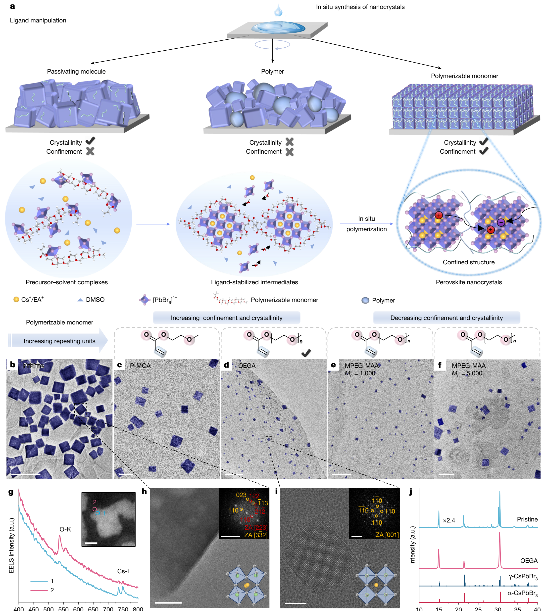

**Fig. 1 | Schematic diagram and mechanism of in situ nanocrystal confinement strategy.** **a**, Schematic of ligand design and crystallization of perovskite nanocrystals. The coordinated polymerizable monomer suppresses the nucleation process and the in situ-formed polymer network further restrains the growth of perovskite nanocrystals, which induces small and stable nanocrystals. **b–f**, Transmission electron microscopy images of perovskite nanocrystals without additives (**b**), with P-MOA (**c**), with OEGA (**d**), with MPEG-MAA (M~n~ = 1,000) (**e**) and with MPEG-MAA (M~n~ = 5,000) (**f**). **g**, The electron energy loss spectra (EELS) acquired from the positions highlighted in the inset high-angle annular dark-field scanning transmission electron microscopy image. O-K and Cs-L denote the EELS edges corresponding to the oxygen K-shell and caesium L-shell, respectively. **h**,**i**, High-resolution transmission electron microscopy images of the pristine (**h**) and OEGA perovskites (**i**). Insets: corresponding fast Fourier transform diffractograms and atomic structure model. **j**, X-ray diffraction patterns of the pristine and OEGA perovskites. \(\theta\) denotes the Bragg angle. ZA, zone axis. Scale bars, 1 µm (**b**); 100 nm (**c**–**f**); 20 nm (**g**(inset),**h**); 5 nm^−1^ (**h**(inset)); 5 nm (**i**); 10 nm^−1^ (**i**(inset)).

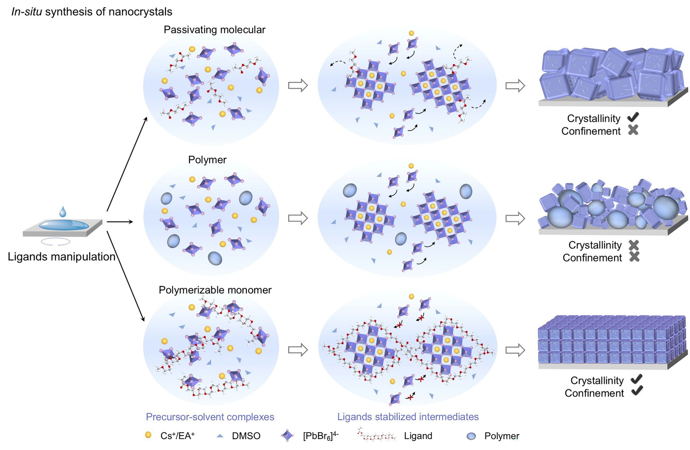

**Extended Data Fig. 1 | Schematic diagram of ligands design and crystallization of perovskite nanocrystals.**

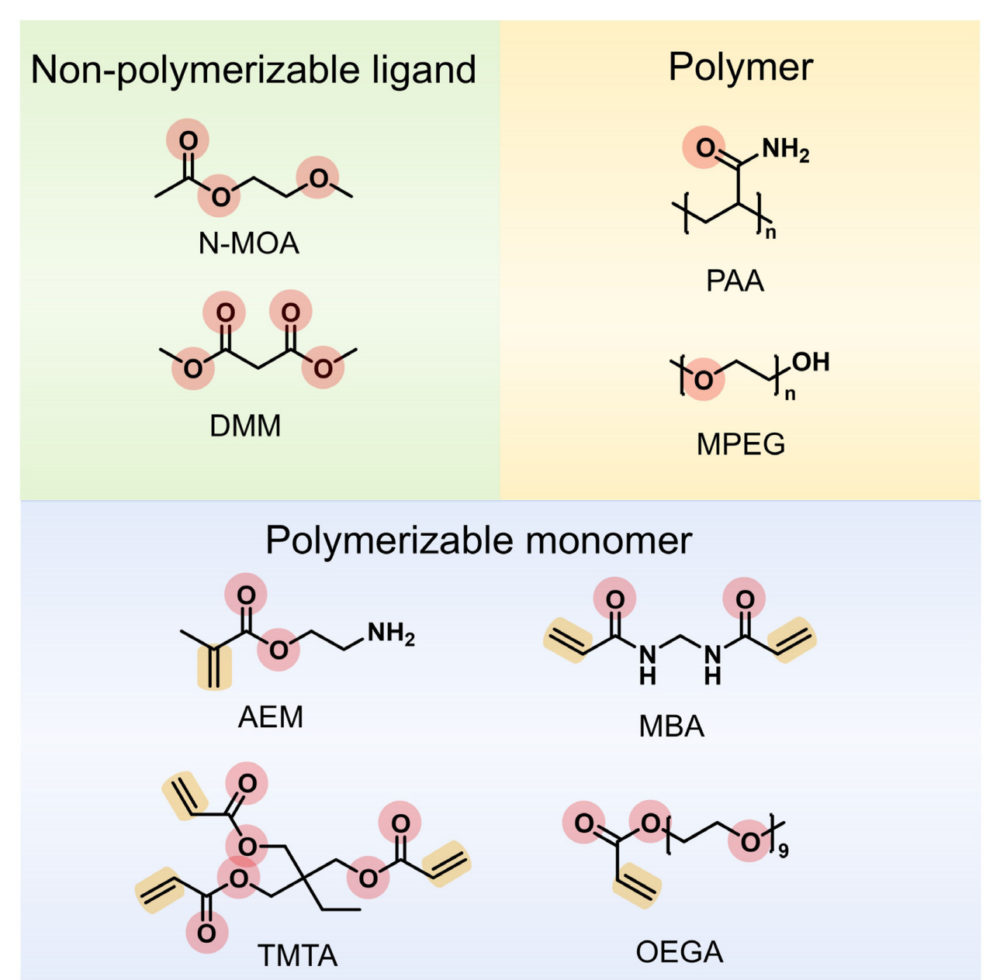

**Supplementary Figure 2.** Chemical structures of the ligands, including non-polymerizable ligands, polymers and polymerizable monomers.

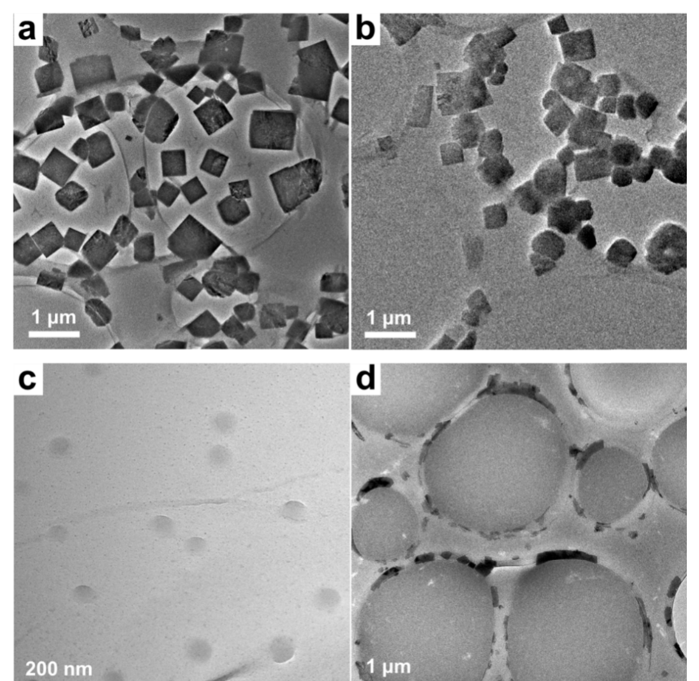

**Supplementary Figure 3.** TEM images of perovskite nanocrystals with N-MOA (**a**), DMM (**b**), MPEG (M~n~ = 5,000) (**c**) and PAA (M~n~ = 40,000) (**d**).

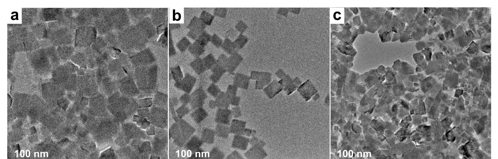

**Supplementary Figure 4.** TEM images of perovskite nanocrystals with polymerizable monomers. **a**, AEM, **b**, MBA and **c**, TMTA.

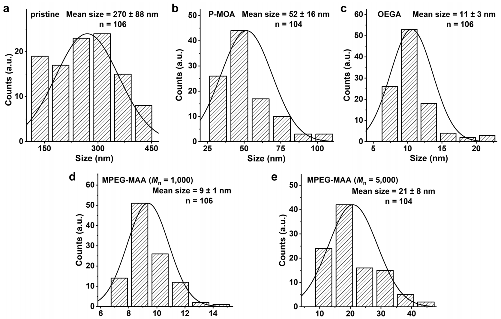

**Supplementary Figure 1.** Size distribution histograms for perovskites without additives (**a**), with P-MOA (**b**), with OEGA (**c**), with MPEG-MAA (M~n~ = 1,000) (**d**), and with MPEG-MAA (M~n~ = 5,000) (**e**). Data are shown as mean particle size ± standard deviation (SD); 'n' denotes the number of particle counts. The statistics were obtained from multiple TEM images collected from different regions of the grid or from different samples.

Cs~0.7~EA~0.3~PbBr~3~ (EA, ethylamine) blue-emitting perovskites are selected as a typical example to evaluate this in situ-confinement strategy and its potential application in LEDs. The pristine film, prepared via the one-step anti-solvent approach^27^ (Fig. 1a), exhibits large crystal gains of 270 ± 88 nm (Fig. 1b and Supplementary Fig. 1a). Attempts are made to directly introduce ligands into precursor solutions, including non-polymerizable passivating molecules and polymers (with carbonyl or ether groups as electron donors) (Extended Data Fig. 1 and Supplementary Figs. 2 and 3). Non-polymerizable ligands such as 2-methoxyethyl acetate (N-MOA) and dimethyl malonate fail to reduce the grain size and instead yield larger perovskite grains (514 ± 120 nm and 504 ± 125 nm), probably owing to their short-chain structures limiting spatial confinement. Moreover, when high-molecular-weight polymers (methoxy polyethylene glycol (MPEG) and poly(acrylamide) (PAA) are incorporated directly, they tend to form amorphous aggregates with poor perovskite lattice affinity, yielding grains averaging 202 ± 44 nm. Impressively, polymerizable monomers such as 2-methoxyethyl acrylate (P-MOA) significantly reduce the perovskite grain size to 52 ± 16 nm (Fig. 1c and Supplementary Fig. 1b). This trend extends to other monomers such as 2-aminoethyl methacrylate (AEM), N,N′-methylene bis(acrylamide) and trimethylolpropane triacrylate, resulting in average nanocrystal sizes of 40–60 nm (Supplementary Fig. 4). These monomers with unsaturated vinyl groups enable easy polymerization with free radical initiators at low temperatures^28,29^, ensuring in situ polymerization during nanocrystal growth. The consistent size reduction across diverse monomer structures highlights the central role of the in situ polymerization reaction in modulating perovskite crystallization.

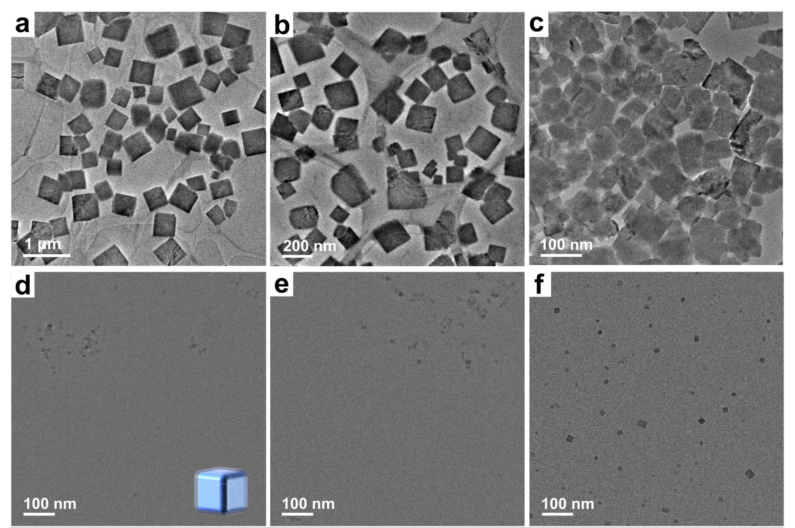

**Supplementary Figure 5.** TEM images of perovskite nanocrystals with 0% (**a**), 0.2% (**b**), 0.5% (**c**), 1% (**d**), 2% (**e**), and 4% OEGA (**f**).

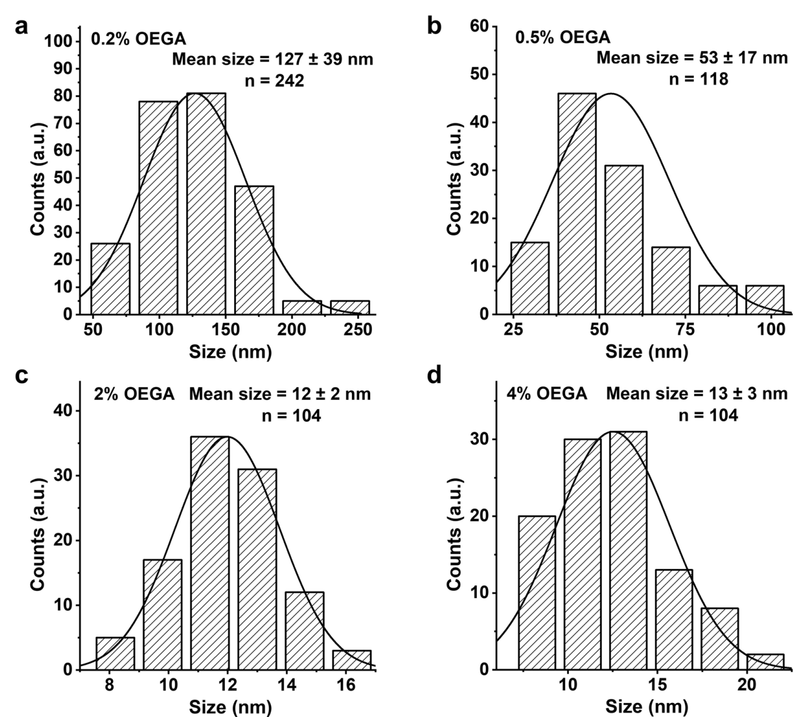

**Supplementary Figure 6.** Size distribution histograms for perovskites with 0.2% (**a**), 0.5% (**b**), 2% (**c**), and 4% OEGA (**d**). Data are shown as mean particle size ± standard deviation (SD); 'n' denotes the number of particle counts. The statistics were obtained from multiple TEM images collected from different regions of the grid or from different samples.

Mechanistic studies further reveal that as the number-average molecular weight (M~n~) of the monomer increases from 120 (P-MOA) to 480 (OEGA) and 1,000 (poly(ethylene glycol) methyl ether acrylate, MPEG-MAA), the monomers increasingly constrain the nanocrystals to 9 ± 1 nm (Fig. 1c–e and Supplementary Fig. 1b–d). In contrast, an excessive molecular weight of 5,000 induces ligand self-aggregation, causing nanocrystal size heterogeneity (Fig. 1f and Supplementary Fig. 1e). Furthermore, controlled increases in ligand concentration can also effectively reduce nanocrystal sizes (Supplementary Figs. 5 and 6). This implies that the in situ synthesis of controllable nanocrystal sizes can be achieved by adjusting both the chain length and content of polymerizable monomers.

Among the tested ligands, OEGA provides an optimal balance between confinement and charge transport in perovskite nanocrystals. OEGA (1%) reduces the grain size to 11 ± 3 nm (Fig. 1d) and forms a thin coating layer via strong coordination, as evidenced by electron energy loss spectra (Fig. 1g). Low-dose high-resolution transmission electron microscopy analysis reveals a ligand-induced structural phase transition. Fast Fourier transform analysis of pristine perovskites (Fig. 1h) shows diffraction spots indexed to the orthorhombic (\(\gamma\)) phase along the [223] and [332] zone axis. In contrast, OEGA nanocrystals exhibit cubic (\(\alpha\)) symmetry across multiple crystallographic orientations (Fig. 1i and Extended Data Fig. 2c–f), indicating an orthorhombic-to-cubic phase transition. The transition is also verified by X-ray diffraction measurements, showing that peak evolves from orthorhombic (Pnma) to cubic symmetry (Pm\(\bar{3}\)m) with increasing OEGA content (Fig. 1j and Extended Data Fig. 2a,b). Notably, the OEGA-treated films show significantly enhanced diffraction intensity, reflecting their improved crystallinity.

## Crystallization kinetics of perovskite nanocrystals

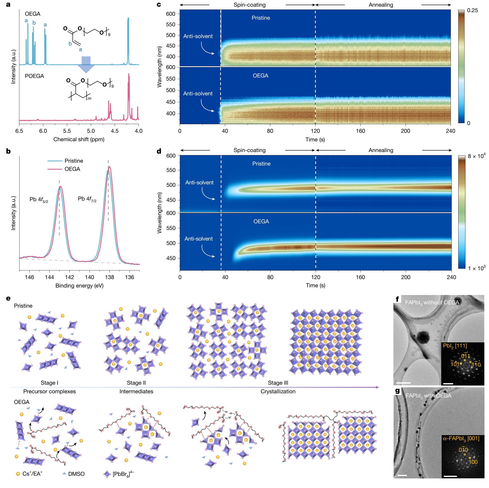

**Fig. 2 | Analysis of perovskite crystallization kinetics.** **a**, ^1^H NMR spectra of OEGA/PbBr~2~ before and after thermal annealing (POEGA). **b**, Pb 4f X-ray photoelectron spectroscopy spectra of the pristine and OEGA perovskites. The X-ray photoelectron spectroscopy spectra are calibrated to the adventitious C 1s peak at 284.8 eV. **c**,**d**, In situ absorption (**c**) and photoluminescence (**d**) evolution of the pristine and OEGA perovskites during the crystallization process. The colour bars in **c** and **d** indicate the signal intensity (a.u.). **e**, Schematic of the nucleation and crystallization of pristine and OEGA perovskites. **f**,**g**, Transmission electron microscopy images and fast Fourier transform diffractograms of FAPbI~3~ without (**f**) and with (**g**) OEGA. Scale bars, 500 nm (**f**); 5 nm^−1^ (**f**(inset),**g**(inset)); 200 nm (**g**).

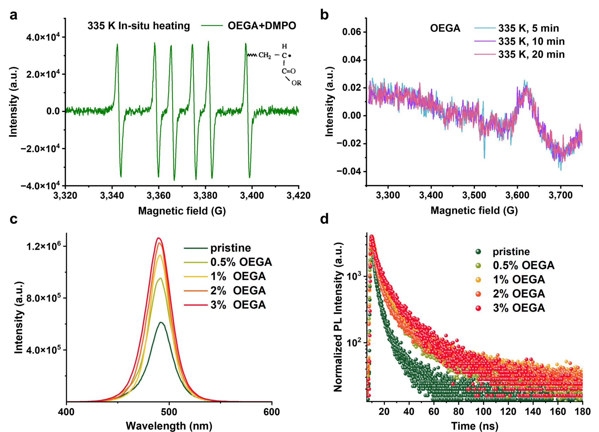

**Supplementary Figure 7.** **a**, in-situ EPR spectra of OEGA and 5,5-dimethyl-1-pyrroline N-oxide (DMPO) in DMSO solution at 335 K. **b**, Quasi-in-situ EPR spectra of OEGA in DMSO solution after heating at 335 K for varying durations. **c**–**d**, Steady-state PL spectra (**c**) and TRPL decay (**d**) of perovskites with different OEGA concentrations. The parameters of carrier lifetime of perovskites are listed in Supplementary Table 1. No EPR signals were observed after 5, 10, or 20 minutes of heating. This finding aligns with previous studies reporting that acrylate radicals, due to the electron-withdrawing ester group, are highly reactive intermediates with lifetimes typically in the microsecond-to-millisecond range^1^.

**Supplementary Table 1.** The parameters of carrier lifetime of perovskite with different concentrations of OEGA by fitting the TRPL decay.

| Perovskites | τ~1~ (ns) | a~1~ (%) | τ~2~ (ns) | a~2~ (%) | τ~avg~ (ns) |
|---|---|---|---|---|---|
| pristine | 2.35 | 63.37 | 13.47 | 36.63 | 6.42 |
| 0.5% OEGA | 4.35 | 60.19 | 22.02 | 39.81 | 11.38 |
| 1% OEGA | 5.00 | 51.71 | 26.38 | 48.29 | 15.32 |
| 2% OEGA | 4.06 | 47.72 | 28.19 | 52.28 | 16.68 |
| 3% OEGA | 4.33 | 39.28 | 23.59 | 60.72 | 16.02 |

*The kinetics can be fitted by a biexponential function of \(I(t)=I_0+a_1\exp(-t/\tau_1)+a_2\exp(-t/\tau_2)\), where a~1~, a~2~ are the amplitudes; τ~1~, τ~2~ are time constants for fast and slow decay lifetimes.*

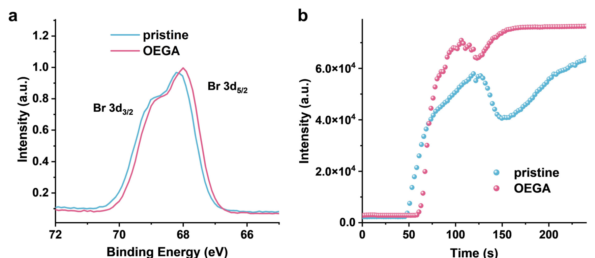

**Supplementary Figure 8.** **a**, XPS spectra of the pristine and OEGA perovskites for Br 3d. **b**, PL intensities extracted from in-situ PL evolution of the pristine and OEGA perovskites at 490 nm.

To elucidate the impact of polymerizable monomers, we investigated their evolution and interaction with perovskites. Proton nuclear magnetic resonance (^1^H NMR) confirms the thermal polymerization of OEGA (Fig. 2a). After annealing, vinyl proton signals at 5.9–6.4 ppm disappear completely, signifying polymerization of vinyl groups and formation of a poly(oligo (ethylene glycol) acrylate) (POEGA) network. Electron paramagnetic resonance further verifies the absence of residual radicals in the final film (Supplementary Fig. 7 and Supplementary Table 1). X-ray photoelectron spectroscopy (Fig. 2b) reveals that both Pb 4f~5/2~ (138.1 eV) and Pb 4f~7/2~ (143.0 eV) peaks shift towards lower binding energies after OEGA incorporation, demonstrating reduced charge on Pb^2+^ ions through OEGA coordination. A similar negative shift is also observed for the Br 3d~3/2~ and Br 3d~5/2~ peaks (Supplementary Fig. 8a). This interaction promotes the formation of OEGA coating layers throughout the crystallization process, as evidenced by electron energy loss spectroscopy analysis (Fig. 1g), facilitating defect passivation and grain stabilization.

To investigate the effects of in situ polymerization on the entire crystallization process of perovskites, we conducted in situ ultraviolet–visible absorption and photoluminescence analyses (Fig. 2c,d). Pristine perovskites show simultaneous emergence of absorption and photoluminescence peaks upon anti-solvent treatment, indicating rapid cluster aggregation and growth. In contrast, OEGA-modified samples show delayed emission onset with gradual redshift and intensity enhancement, suggesting suppressed initial cluster aggregation and improved lattice relaxation. During subsequent annealing, pristine films show pronounced thermal photoluminescence quenching (Supplementary Fig. 8b), whereas OEGA perovskites achieve enhanced final absorption and photoluminescence intensity, consistent with improved crystallinity and confined nanocrystal sizes.

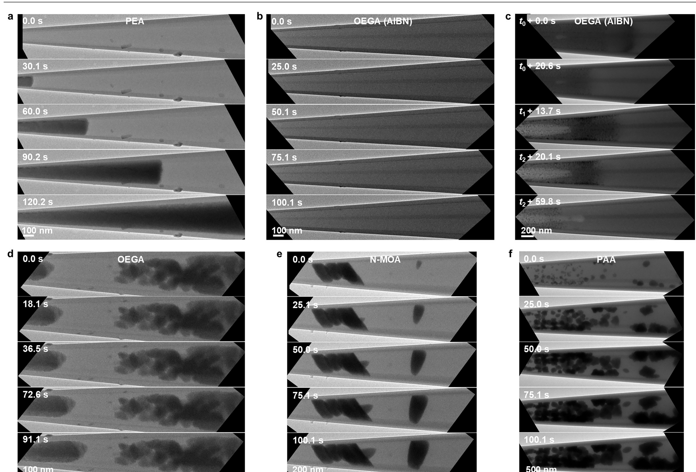

**Extended Data Fig. 3 | Time-lapse LP-TEM images of perovskite precursors.** Precursor solutions without additives (**a**), with OEGA and AIBN (**b**), with OEGA and AIBN after long-time irradiation (**c**), with OEGA (**d**), with N-MOA (**e**), and with PAA (**f**). Time zero indicates the start of imaging. Images are acquired at 200 kV with an electron dose rate of 5 e^−^/Å^2^·s, except for (**c**), where images from t~0~ to t~1~ are collected at 12 e^−^/Å^2^·s, and images at t~2~ are collected at 5 e^−^/Å^2^·s. The field of view is adjusted between t~0~ and t~1~ to center the nanocrystals. Energy-dispersive X-ray spectroscopy (EDS) confirms homogeneous element distribution of (**b**) (cesium: 37.4%, lead: 23.6%, bromine: 39.0%), ruling out premature precipitation. FFT analysis confirms these aggregates lacked crystalline order, consistent with amorphous intermediates formed via solvent-ligand-precursor interactions. Controlled experiments of OEGA precursors without initiators (**d**) revealed beam-generated radicals induced partial polymerization, yielding two particle types: <100 nm nanocrystals confined by polymer networks and >300 nm nanocrystals growing slowly via unreacted OEGA coordination.

The growth dynamics are further visualized by in situ liquid-phase electron microscopy imaging of precursor solutions (Extended Data Fig. 3). Pristine precursors form sol–gel intermediates instantaneously under low-dose electron irradiation (5 e^−^ (Å^2^ s)^−1^), rapidly grow along the nanopipette tip, and ultimately grow into uncontrollable large aggregates. In contrast, OEGA- and 2,2′-azobis(2-methylpropionitrile) (AIBN)-modified precursors show no detectable nucleation for over 10 min under identical conditions. Increasing the electron dose rate to 12 e^−^ (Å^2^ s^−1^) induces solvent extraction and local supersaturation^30^, mimicking the perovskite spin-coating process. This triggers the formation of numerous nanoscale particles (approximately 10 nm) that remain stable over time, contrasting with pristine systems. These observations align with the in situ optical measurements (Fig. 2c,d), demonstrating that OEGA delays nucleation of perovskite precursors and subsequently stabilizes nanocrystal size through polymer-network confinement. Comparatively, non-polymerizable ligand N-MOA slows nanocrystal growth but fails to confine the size owing to the absence of a rigid network, yielding larger particle sizes. Preformed polymer PAA shows negligible nanocrystal growth restriction, reflecting its static and weak interactions with precursors. These contrasts demonstrate that the in situ polymerization process is critical for size regulation, providing key insights into ligand-mediated growth control for nanocrystal engineering.

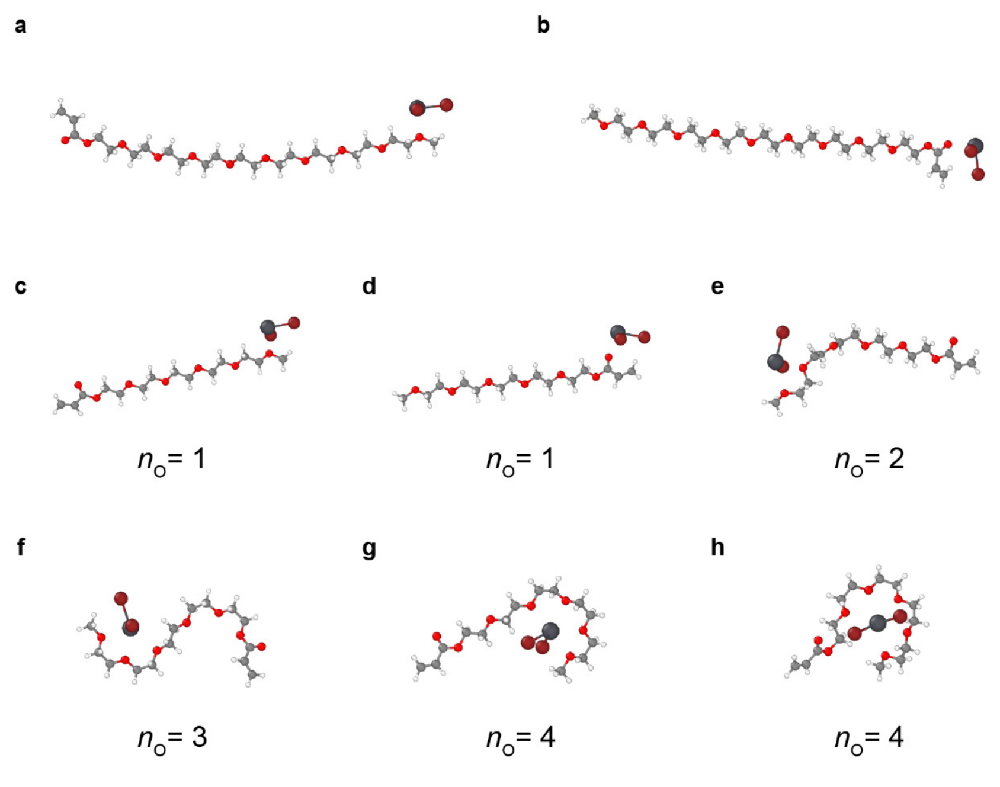

**Supplementary Figure 9.** Molecular complexes with organic ligands binding to a PbBr~2~ molecule. **a**–**b**, OEGA-anchored PbBr~2~ complexes are shown binding to a single ether (**a**) and carbonyl oxygen (**b**). **c**–**h**, PbBr~2~ complexes with a shorter model system (n = 5), binding through one (**c**–**d**), two (**e**), three (**f**) and four O-Pb bonds (**g**–**h**).

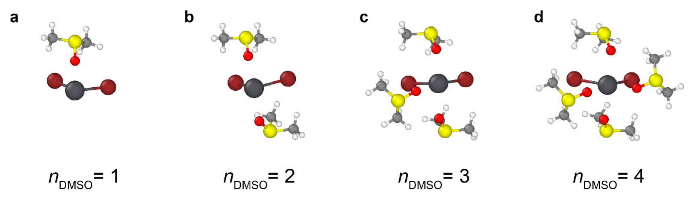

**Supplementary Figure 10.** Adsorption of DMSO molecules to PbBr~2~ molecule with one (**a**), two (**b**), three (**c**) and four (**d**) DMSO molecules bonded to Pb through a O-Pb bond.

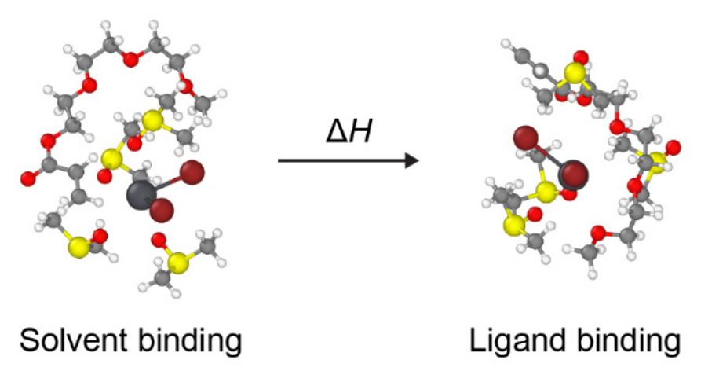

**Supplementary Figure 11.** Most stable cluster geometries for ligand with a chain length n = 3.

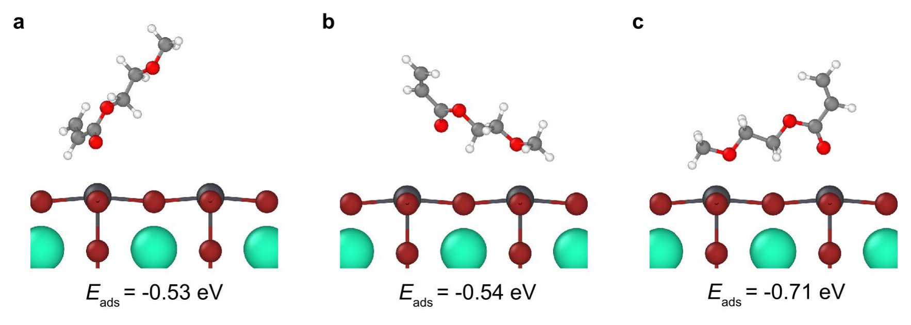

**Supplementary Figure 12.** Various geometries of molecular adsorption of P-MOA on a CsPbBr~3~ surface, with carbonyl (**a**), ether (**b**), and carbonyl and ether oxygen species (**c**) interacting with Pb in the CsPbBr~3~ surface.

**Supplementary Table 2.** Calculated binding energies of ligand conformations around a PbBr~2~ molecule, with N~bonds~ indicating the number of O-Pb bonds formed in each molecular complex.

| OEGA | N~bonds~ | E~b~ (eV) | E~b~/N~bonds~ (eV) | Bond type | Subfigure |
|---|---|---|---|---|---|
| M~n~=480 | 1 | −0.67 | −0.67 | Ether | S9a |
|  | 1 | −0.74 | −0.74 | Carbonyl | S9b |
| M~n~=310 | 1 | −0.68 | −0.68 | Ether | S9c |
|  | 1 | −0.67 | −0.67 | Carbonyl | S9d |
|  | 2 | −0.94 | −0.47 | Ether | S9e |
|  | 3 | −1.12 | −0.37 | Ether | S9f |
|  | 4 | −1.47 | −0.37 | Ether | S9g |
|  | 4 | −1.51 | −0.38 | Ether | S9h |

**Supplementary Table 3.** Binding energies of DMSO molecules to a PbBr~2~ molecule.

| n~DMSO~ | E~b~ (eV) | ΔE~complex~ (eV) |
|---|---|---|
| 1 | −1.07 | −1.07 |
| 2 | −0.93 | −0.79 |
| 3 | −0.81 | −0.55 |
| 4 | −0.75 | −0.58 |

**Supplementary Table 4.** Calculated Gibbs free energy from \(G=E_{\mathrm{ele}}+ZPE+pV+\Delta U_{(0\to T)}-T\cdot S\) (T = 298.15 K, p = 1 atm).

|  | S (meV/K) | H (eV) | G (eV) |
|---|---|---|---|
| DMSO | 321.9 | −48.22 | −49.18 |
| 4DMSO+PbBr~2~ | 837.3 | −203.44 | −205.93 |
| OEGA | 898.9 | −263.86 | −266.02 |
| OEGA+PbBr~2~ | 811.7 | −273.46 | −274.82 |
| PbBr~2~ | 353.4 | −8.35 | −9.40 |

**Supplementary Table 5.** The Gibbs free energy changes after DMSO and OEGA coordinate with PbBr~2~.

|  | ΔS (meV/K) | ΔH (eV) | ΔG (eV) |
|---|---|---|---|
| 4DMSO + PbBr~2~ → 4DMSO · PbBr~2~ | −803.7 | −2.20 | 0.20 |
| OEGA + PbBr~2~ → OEGA · PbBr~2~ | −440.6 | −1.25 | −0.46 |

To clarify the mechanism, density functional theory calculations (Supplementary Note 1) are performed to compare the thermodynamics of OEGA and solvent (dimethyl sulfoxide (DMSO)) coordination with lead bromide (PbBr~2~). The carbonyl (0.74 eV) and ether (0.67 eV) groups of OEGA show slightly weaker binding energies with PbBr~2~ (Supplementary Fig. 9 and Supplementary Table 2) than DMSO (Supplementary Fig. 10 and Supplementary Table 3), yielding a minimal binding-energy difference (\(\Delta E_b\approx 0.1\,\text{eV}\)) for one-site OEGA adsorption to replace DMSO (Supplementary Fig. 11). However, such an exchange increases entropy owing to the release of free DMSO molecules, yielding a favourable Gibbs free energy (\(\Delta G=-0.66\,\text{eV}\); Supplementary Tables 4 and 5), which is expected to further decrease upon polymerization. The thermodynamic stabilization arises from multiple O–Pb coordination of OEGA, adopting a crown ether-like configuration (Supplementary Fig. 9) known to slow crystallization and improve crystal quality^31–33^. OEGA also binds nanocrystal surfaces at multiple sites (Supplementary Fig. 12), while its in situ polymerization provides crystallization modulation, as discussed below.

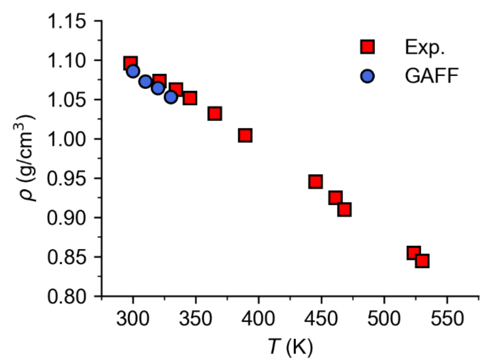

**Supplementary Figure 13.** Comparison of experimental DMSO densities^2^ against densities of DMSO obtained using molecular dynamics simulations with GAFF.

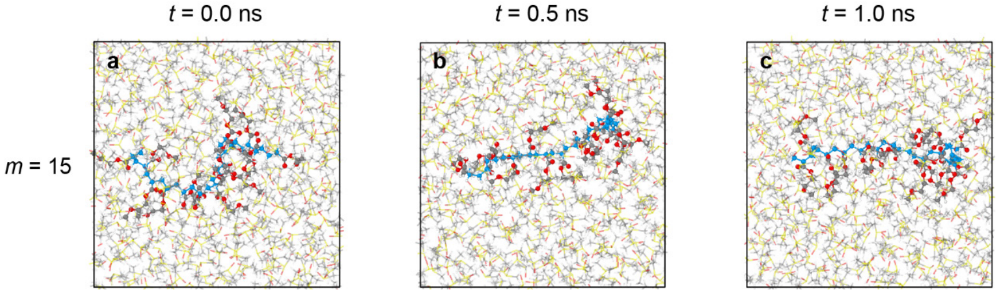

**Supplementary Figure 14.** Simulation snapshots of the polymerization of 15 P-MOA monomers, taken at t = 0.0 ns (**a**), t = 0.5 ns (**b**) and t = 1.0 ns (**c**). The polymer backbone is highlighted in blue and DMSO molecules are represented by transparent stick models.

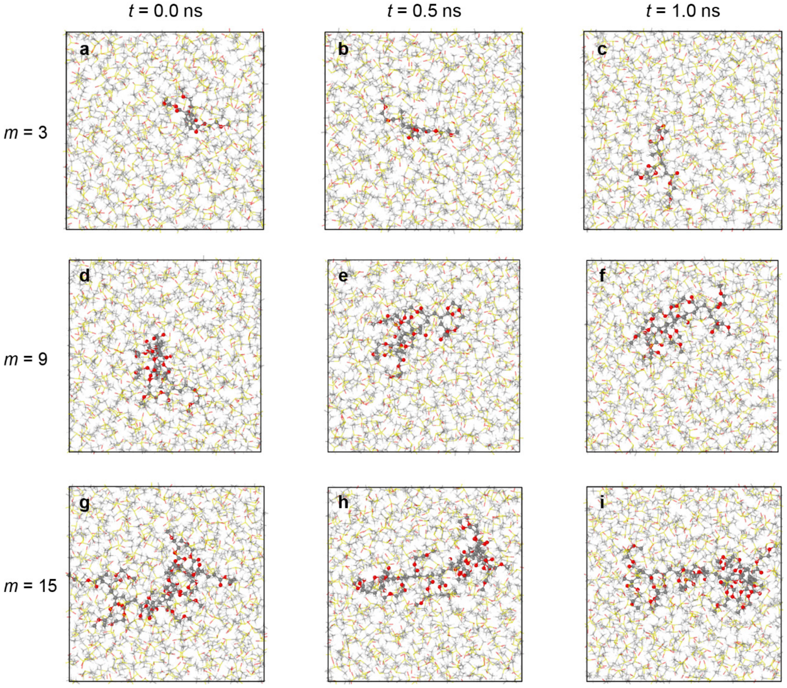

**Supplementary Figure 15.** Simulation snapshots of polymerized P-MOA. The time evolution for a degree of polymerization of m = 3 (**a**–**c**), m = 9 (**d**–**f**) and m = 15 (**g**–**i**) are shown at times t = 0.0 ns, 0.5 ns and 1.0 ns. DMSO molecules are represented by transparent stick models.

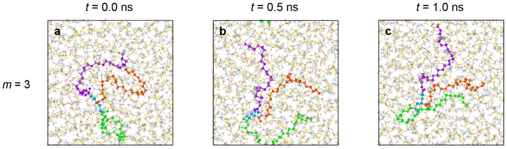

**Supplementary Figure 16.** Simulation snapshots of three OEGA monomers linked together (m = 3), taken at t = 0.0 ns (**a**), t = 0.5 ns (**b**) and t = 1.0 ns (**c**). The polymer backbone is highlighted in blue and the sidechains in green, orange and purple. DMSO molecules are represented by transparent stick models.

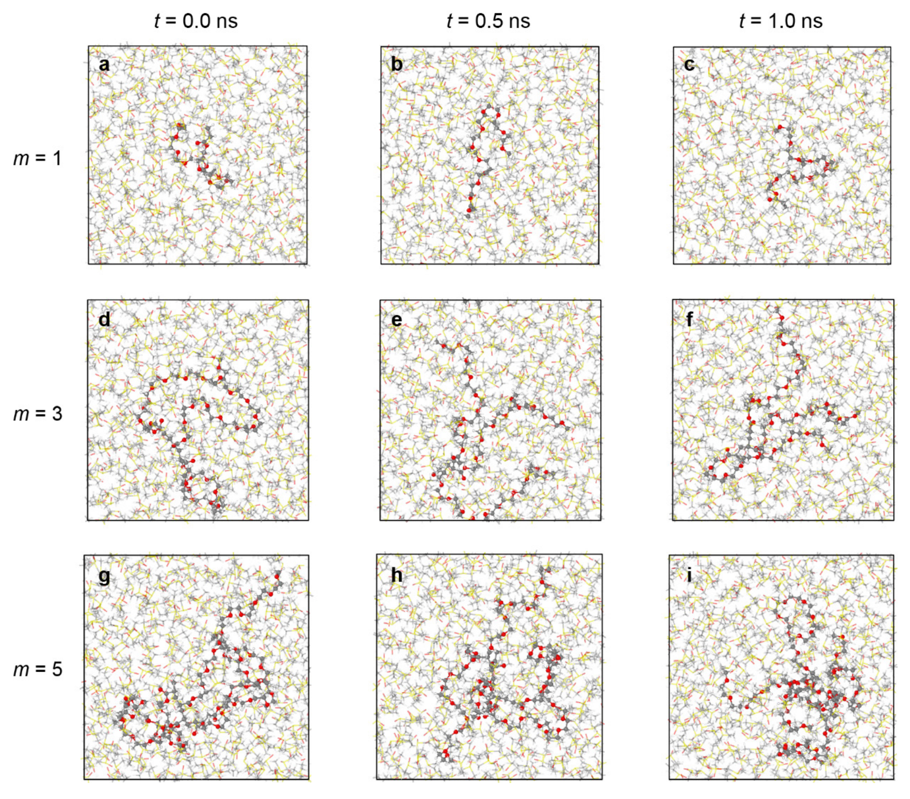

**Supplementary Figure 17.** Simulation snapshots of polymerized OEGA monomers. The time evolution for a degree of polymerization of m = 1 (**a**–**c**), m = 3 (**d**–**f**) and m = 5 (**g**–**i**) are shown at times t = 0.0 ns, 0.5 ns and 1.0 ns. DMSO molecules are represented by transparent stick models.

**Supplementary Table 6.** Solvent densities for DMSO at different temperatures.

| T~sim~ (K) | ρ (g cm^−3^) |
|---|---|
| 300 | 1.086 |
| 310 | 1.073 |
| 320 | 1.064 |
| 330 | 1.053 |

Molecular dynamics simulations of polymerization reactions (Supplementary Note 2, Supplementary Fig. 13 and Supplementary Table 6) reveal that monomer structure critically influences polymerization efficiency and growth modulation. Small monomers such as P-MOA polymerize rapidly owing to high densities of reactive termini, whereas their short side chains lack sufficient coordination capacity to restrict crystal evolution (Supplementary Figs. 14 and 15). Medium-length OEGA achieves optimal kinetic synchronization with perovskite crystallization through balanced reactive group densities, whereas its extended side chains offer structural flexibility and considerable sites that facilitate polymer–perovskite interactions for controlled growth (Supplementary Figs. 16 and 17). Large monomers such as MPEG-MAA (M~n~ 1,000 and 5,000) show suppressed polymerization rates owing to self-interactions, limiting their utility in perovskite crystallization. These findings highlight the importance of balancing polymerization dynamics and coordination affinity for crystal engineering.

On the basis of these findings, Figs. 1a and 2e schematically illustrate the crystallization pathway enabled by the in situ polymerization strategy. OEGA incorporation enables an in situ-formed polymer network, which effectively constrains crystal overgrowth during crystallization. The multiple coordination bonds thermodynamically stabilize intermediates, and further suppress rapid perovskite cluster growth while facilitating intergranular coupling. The prolonged relaxation of small clusters promotes ordered lattice formation with reduced defects, leading to enhanced crystallinity^23^. In contrast, pristine films show accelerated phase transformation from intermediates to perovskite during spin-coating, where unregulated cluster aggregation disrupts optimal stacking and generates lattice imperfections^34^. Subsequent annealing further promotes grain coarsening, leading to increased non-radiative recombination losses.

These results establish in situ polymerization as a distinct strategy for confined nanocrystal growth. Although conventional non-polymerizable passivators can improve crystallinity by slowing growth, they often induce excessive grain coarsening. In contrast, the dynamic confinement environment generated by polymerization simultaneously reinforces crystallinity and restricts grain growth, providing a synergistic pathway to enhance radiative recombination.

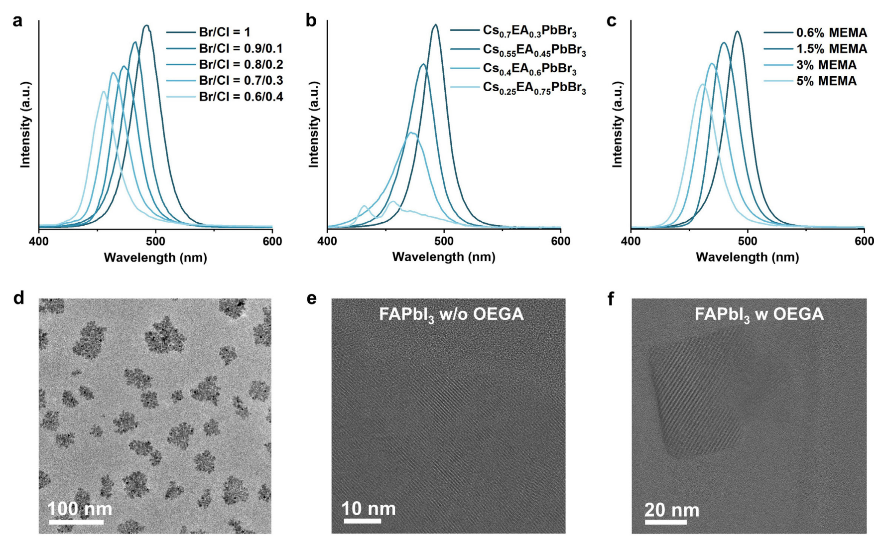

**Supplementary Figure 18.** In-situ polymerization strategy applied to different systems. **a**, PL emission of Cs~0.7~EA~0.3~PbBr~3~ with mixed halide (Br/Cl). **b**, PL emission of perovskites with different ratios of EABr. **c**–**d**, PL emission (**c**) and TEM image (**d**) of Cs~0.7~EA~0.3~PbBr~3~ with different ratios of 2-(methylthio)ethyl methacrylate (MEMA). However, the strong and rapid coordination between MEMA and Pb^2+^ accelerates perovskite crystallization kinetics. This results in a higher density of trap states, producing films with rough surfaces and numerous pinholes that directly impair device performance and stability. **e**–**f**, HRTEM images of FAPbI~3~ without (**e**), and with OEGA (**f**). Due to the extreme degradation of pristine FAPbI~3~ under electron beam, only diffraction of lead iodide can be obtained in (**e**).

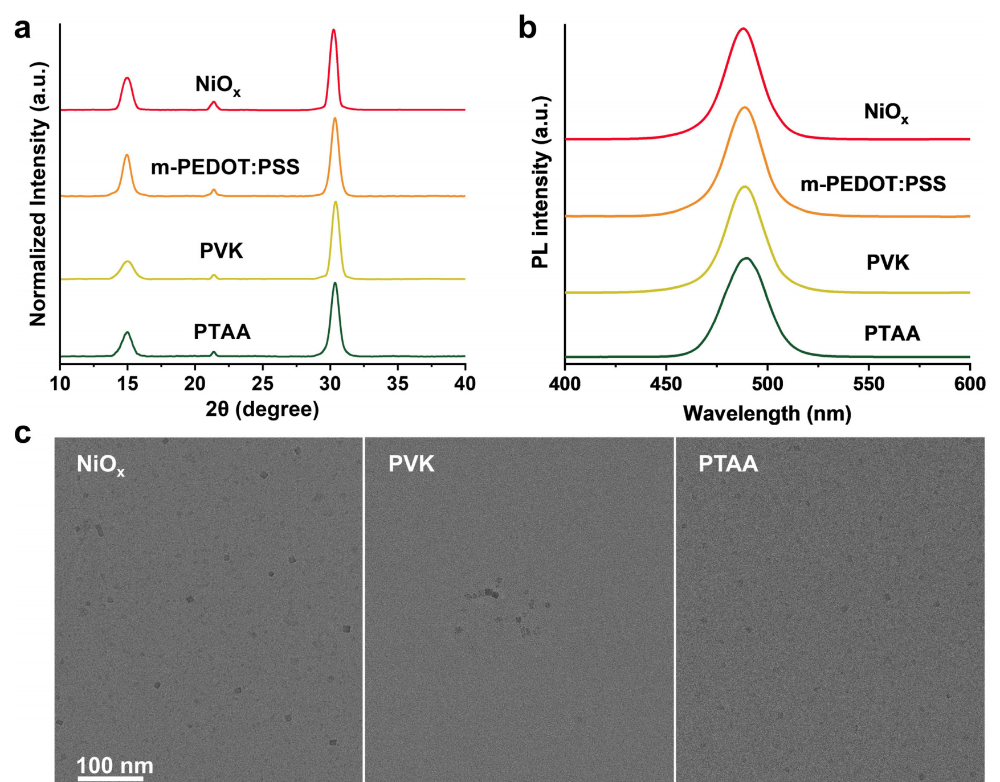

**Supplementary Figure 19.** In-situ nanocrystal confinement strategy on various underlying materials. **a**–**b**, XRD patterns (**a**) and PL spectra (**b**) of OEGA perovskites (0.11 M) on various underlying materials. **c**, TEM image of perovskite nanocrystals synthesized on NiOx, PVK, and PTAA.

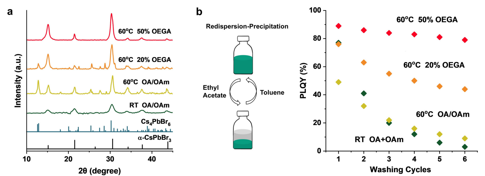

**Supplementary Figure 20.** In-situ polymerization strategy applied to ligand-assisted reprecipitation (LARP) method for the synthesis of colloidal nanocrystals. **a**, XRD patterns of perovskite nanocrystals synthesized by LARP method. Pristine colloidal nanocrystals were synthesized at room temperature using oleic acid (OA) and oleylamine (OAm) as typical ligands, according to the literature^3^. After thermal treatment of the as-prepared colloidal solution (60 °C for 20 min), the crystallinity was enhanced, but the Cs~4~PbBr~6~ impurity phase also emerged. **b**, PLQYs of perovskite nanocrystals synthesized by LARP method for different washing cycles.

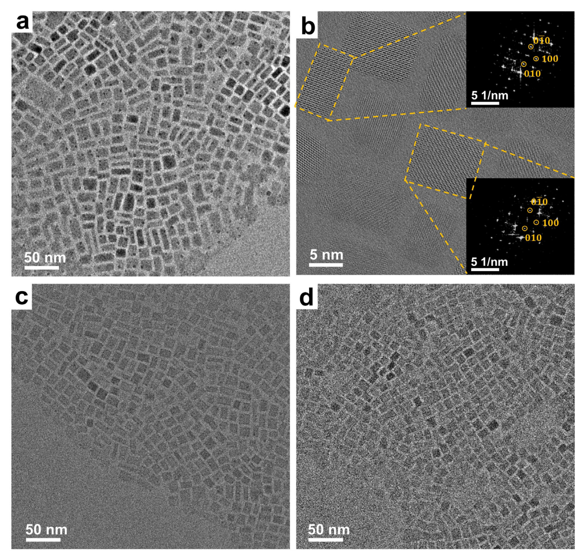

**Supplementary Figure 21.** TEM images of perovskite nanocrystals synthesized by LARP method after thermal treatment. **a**–**b**, TEM images (**a**) and high-resolution TEM images (**b**) of OA/OAm-treated perovskite nanocrystals. **c**–**d**, TEM images of 20% (**c**) and 50% (**d**) OEGA-treated perovskite nanocrystals. The 50% OEGA-treated perovskite nanocrystals exhibited more uniform and smaller cubes.

We further demonstrate the generality of this strategy across diverse perovskite systems, spanning deep-blue to sky-blue emissions (Supplementary Fig. 18a–d). Notably, applying this approach to the predominant photovoltaic material formamidinium lead iodide (FAPbI~3~) also yields smaller, cubic-phase nanocrystals (Fig. 2f,g and Supplementary Fig. 18e,f). The resulting perovskite nanocrystals show largely substrate-independent properties when deposited on various surfaces (Supplementary Fig. 19). Beyond in situ nanocrystal synthesis, this polymerization-assisted approach is also applicable to colloidal nanocrystal synthesis, where it unexpectedly improves phase purity, photoluminescence efficiency and colloidal stability (Supplementary Figs. 20 and 21).

## Optimized structural and optical properties

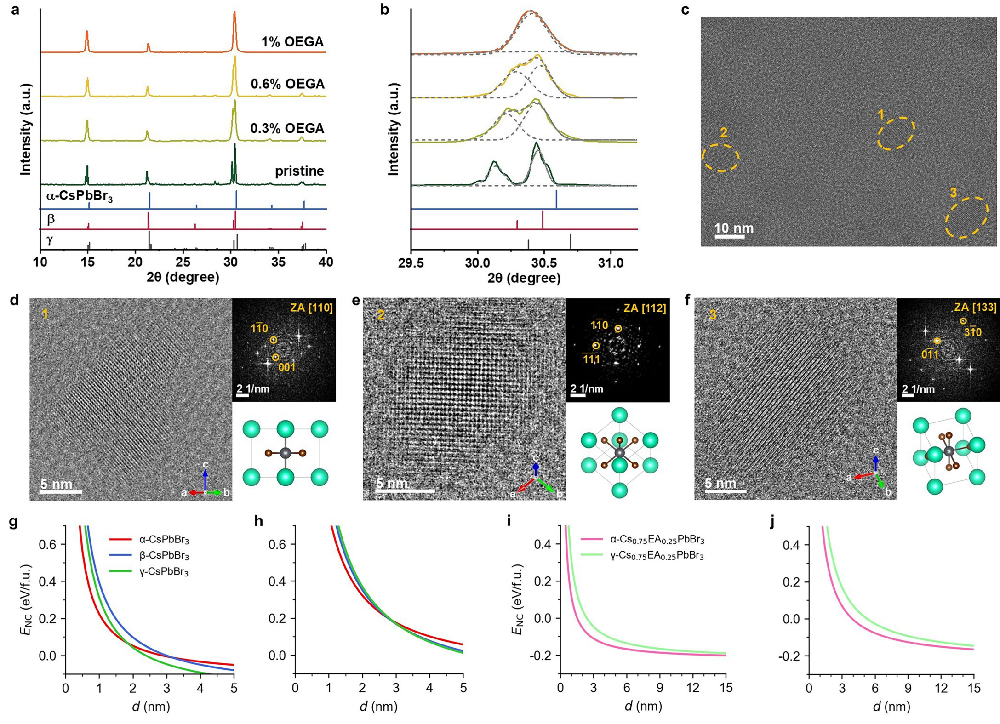

**Extended Data Fig. 2 | The phase of the pristine and OEGA nanocrystals.** **a**–**b**, XRD patterns (**a**), and magnified and fitting of the (002) plane (**b**) for the Cs~0.7~EA~0.3~PbBr~3~ nanocrystals with different OEGA concentrations. **c**–**f**, HRTEM images of OEGA perovskite nanocrystals with tilted angles (**c**), and corresponding nanocrystals with FFT diffractograms and atomic structure model (**d**–**f**). **g**–**h**, Energies of CsPbBr~3~ nanocrystals with CsBr-termination (**g**) and PbBr~2~-termination (**h**). The total energies of the cubic (\(\alpha\)), tetragonal (\(\beta\)), and orthorhombic (\(\gamma\)) phases are shown in red, blue, and green, respectively. **i**–**j**, Energies of Cs~0.75~EA~0.25~PbBr~3~ nanocrystals with CsBr-termination (**i**) and PbBr~2~-termination (**j**). By incorporating EA^+^, the bulk energy \(\Delta_{\mathrm{bulk}}\) decreases, shifting the energy of \(\alpha\)-Cs~0.75~EA~0.25~PbBr~3~ down with respect to the \(\gamma\)-phase, as indicated by the pink and lightgreen lines.

**Supplementary Table 7.** Geometries (a, b, and c), enthalpies (E~x~), and formation energies (E~f~) of CsPbBr~3~ and its CsBr and PbBr~2~ precursors.

| Phase | a (Å) | b (Å) | c (Å) | E~x~ (eV/f.u.) | E~f~ (eV/f.u.) |
|---|---|---|---|---|---|
| CsBr | 4.27 | 4.27 | 4.27 | −6.355 | – |
| PbBr~2~ | 7.91 | 4.68 | 9.56 | −10.387 | – |
| α-CsPbBr~3~ | 5.86 | 5.86 | 5.86 | −16.861 | −118.7 |
| β-CsPbBr~3~ | 8.10 | 8.10 | 5.95 | −16.939 | −197.6 |
| γ-CsPbBr~3~ | 7.96 | 8.38 | 11.66 | −16.968 | −226.2 |

**Supplementary Table 8.** Surface energies of different perovskite phases and surface terminations of CsPbBr~3~.

| Phase | Termination | E~surf,1~ (meV/Å) | E~surf,2~ (meV/Å) | E~surf,3~ (meV/Å) |
|---|---|---|---|---|
| Cubic (α) | CsBr | 2.84 | 2.84 | 2.84 |
|  | PbBr~2~ | 7.31 | 7.31 | 7.31 |
| Tetragonal (β) | CsBr | 4.90 | 4.90 | 5.30 |
|  | PbBr~2~ | 8.81 | 8.81 | 10.47 |
| Orthorhombic (γ) | CsBr | 4.61 | 4.61 | 4.65 |
|  | PbBr~2~ | 10.14 | 10.14 | 10.36 |

**Supplementary Table 9.** Energy difference between the α- and γ-phase of various perovskites. A positive value of ΔE~phase~ indicates that the γ-phase is more stable than the α-phase.

| Phase | ΔE~phase~ (eV/f.u.) |
|---|---|
| CsPbBr~3~ | 0.107 |
| Cs~0.875~EA~0.125~PbBr~3~ | 0.003 |
| Cs~0.75~EA~0.25~PbBr~3~ | 0.001 |

The phase of lead halide perovskites is governed by [PbBr~6~]^4−^ octahedral distortions, which critically determine optical and electronic properties. Whereas bulk pristine grains adopt the orthorhombic phase, the in situ-confined nanocrystals maintain the high-temperature cubic phase at room temperature. It is demonstrated that, in addition to pressure, temperature and compositions^35^, the physical size critically modulates phase stability. Density functional theory calculations^36^ reveal that the cubic phase has significantly lower surface energy than the tetragonal and orthorhombic phases (Supplementary Note 3 and Supplementary Tables 7 and 8). Therefore, size confinement stabilizes the perovskite cubic phase by increasing the surface-to-volume ratio (Extended Data Fig. 2g,h and Supplementary Table 9), which leads to a reduced critical temperature for the orthorhombic-to-cubic phase transition. Moreover, ligand-induced surface interactions further reinforce this stability^37,38^, enabling the confined nanocrystals in our experiments to maintain the cubic phase as thermodynamically favourable at room temperature.

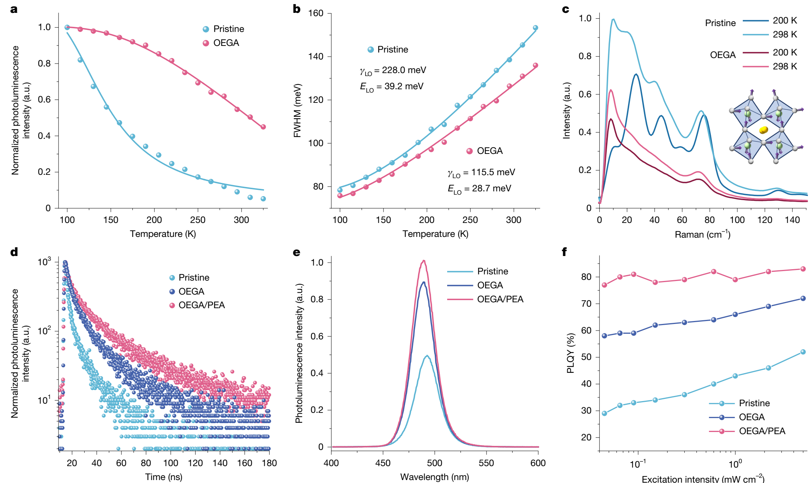

**Fig. 3 | Luminescence properties of perovskite nanocrystals.** **a**,**b**, Integrated photoluminescence intensity (**a**) and FWHM (**b**) from temperature-dependent photoluminescence spectra against measuring temperatures. The symbols are the extracted experimental data and the solid lines are the best least-squares fit. **c**, Raman spectra of the pristine and OEGA perovskite films after normalization for sample concentration. Inset: atomic structure model representing longitudinal-optical vibration. **d**–**f**, Time-resolved photoluminescence decay (**d**), steady-state photoluminescence spectra (**e**) and excitation intensity-dependent PLQY (**f**) of pristine, OEGA and OEGA/PEA perovskites. The decays in **d** were normalized to their maximum intensity and rescaled to 1,000 for clarity.

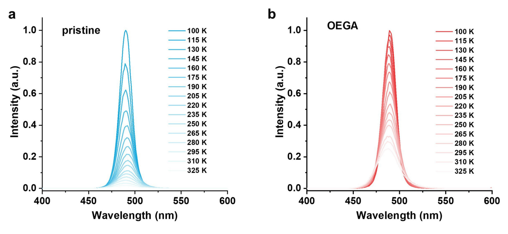

**Supplementary Figure 22.** Temperature-dependent PL spectra of pristine (**a**) and OEGA (**b**) nanocrystals.

The in situ-confinement effect drives a phase transition of perovskite nanocrystals from the original orthorhombic to cubic structure, with direct implications for luminescence properties. Temperature-dependent photoluminescence measurements show gradual intensity attenuation and full-width at half-maximum (FWHM) broadening from 100 K to 325 K (Supplementary Fig. 22). Notably, pristine nanocrystals exhibit more severe thermal quenching than their cubic counterparts, even at low temperatures (Fig. 3a), which could be partially attributed to stronger electron–phonon coupling associated with octahedral distortions in the orthorhombic lattice. Quantitative analysis based on the temperature-dependent linewidth broadening^39–41^ reveals that the in situ-confined nanocrystals show markedly reduced longitudinal-optical (LO) phonon energy and electron–phonon coupling strength (\(\gamma_{\mathrm{LO}}=115.5\,\text{meV}\), \(E_{\mathrm{LO}}=28.7\,\text{meV}\)) compared with pristine nanocrystals (\(\gamma_{\mathrm{LO}}=228.0\,\text{meV}\), \(E_{\mathrm{LO}}=39.2\,\text{meV}\); Fig. 3b). This result indicates suppressed lattice vibrational energies in the in situ-confined nanocrystals, consequently reducing non-radiative recombination pathways and enhancing the photoluminescence quantum yield (PLQY).

Low-frequency Raman spectra further elucidate the lattice vibrations in pristine and OEGA perovskites (Fig. 3c). Pristine perovskites exhibit five Raman peaks at 200 K, assigning to octahedral distortions^42^, which broaden and redshift with increasing temperature owing to enhanced thermal vibrations and electron–phonon interactions^42^. In contrast, OEGA perovskites exhibit a broad spectral band with a central peak, reflecting inherent vibrational instabilities from highly anharmonic double-well potentials in the cubic phase^43^. Crucially, OEGA samples maintain spectral stability at 200 K, confirming robust low-temperature phase stability. The significantly reduced Raman intensity in OEGA perovskites indicates suppressed lattice vibrational modes, critically mitigating electron–phonon coupling^44^.

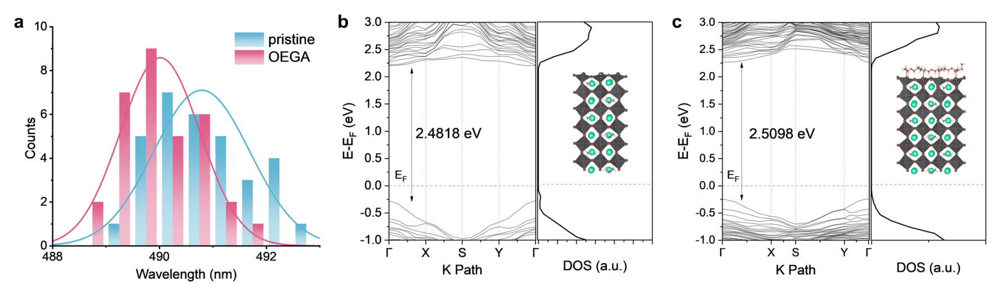

**Supplementary Figure 23.** **a**, Histogram of the emission wavelength of 32 perovskite films. This induces a slight blue shift in the emission peaks of the films, with the average PL peak shifting from 490.8 nm to 490.0 nm. **b**–**c**, The calculated band structure and electronic density of states (DOS) of Cs~0.75~EA~0.25~PbBr~3~ without (**b**) and with OEGA (**c**). These results indicate that the slight blueshift arises from the altered octahedral distortion and coordination environment.

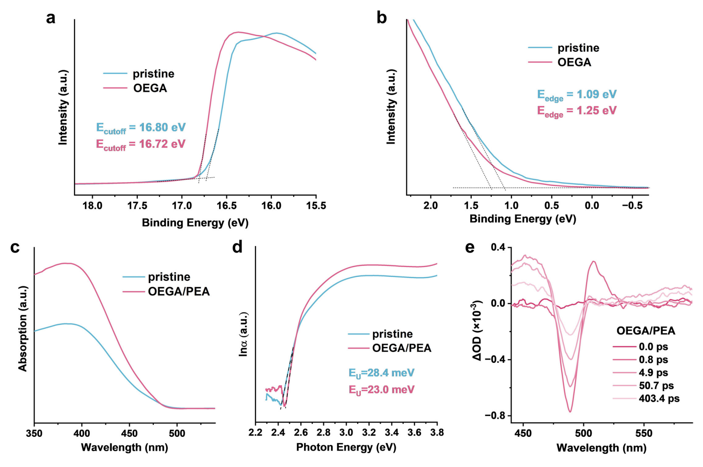

**Supplementary Figure 24.** **a**–**b**, Photoemission cutoff (**a**) and fermi edge (**b**) UPS spectra of the pristine and OEGA films. **c**–**d**, Absorption spectra (**c**) and Urbach energy plots (**d**) of the pristine and OEGA/PEA films. **e**, TA spectroscopy at different probe delay times of OEGA/PEA perovskites.

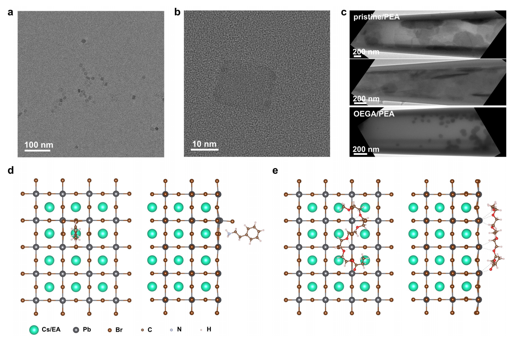

**Supplementary Figure 25.** **a**–**b**, TEM image (**a**) and high-resolution TEM image (**b**) of OEGA/PEA perovskites. **c**, LP-TEM images of pristine/PEA and OEGA/PEA perovskite precursor solutions. **d**–**e**, Structural models of PEA (**d**) and OEGA (**e**) adsorption on the Cs~0.75~EA~0.25~PbBr~3~ surface. The calculated binding energies are 1.8 eV for PEA and 9.2 eV for OEGA, creating a kinetic barrier that prevents PEA from displacing OEGA or self-aggregating to form 2D phases. Notably, our DFT model likely underestimates the binding strength of OEGA, as it accounts for only 4 coordination sites, whereas the full OEGA molecule offers additional chelating groups.

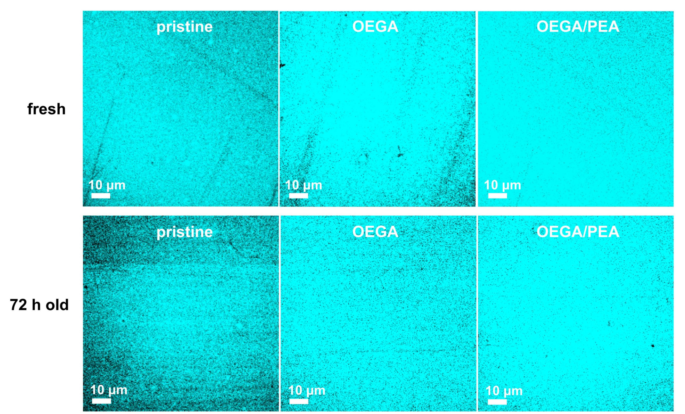

**Supplementary Figure 26.** Confocal fluorescence microscopy (CFM) images of pristine, OEGA and OEGA/PEA perovskites.

**Supplementary Table 10.** The parameters of carrier lifetime by fitting the TRPL decay.

| Perovskites | τ~1~ (ns) | a~1~ (%) | τ~2~ (ns) | a~2~ (%) | τ~avg~ (ns) |
|---|---|---|---|---|---|
| pristine | 1.99 | 51.36 | 13.34 | 48.64 | 7.51 |
| OEGA | 4.33 | 39.28 | 22.29 | 60.72 | 15.24 |
| OEGA/PEA | 5.05 | 25.45 | 29.92 | 74.55 | 23.59 |

*The kinetics can be fitted by a biexponential function of \(I(t)=I_0+a_1\exp(-t/\tau_1)+a_2\exp(-t/\tau_2)\), where a~1~, a~2~ are the amplitudes; τ~1~, τ~2~ are time constants for fast and slow decay lifetimes.*

The incorporation of OEGA enhances perovskite luminescence through simultaneous size confinement and improved crystallinity, which promote radiative recombination while suppressing non-radiative losses. OEGA films show nearly doubled photoluminescence intensity and an extended average lifetime of 15.2 ns compared with 7.5 ns for pristine films (Fig. 3d,e and Supplementary Table 10), accompanied by only a slight blueshift (Supplementary Fig. 23). Further passivation with phenethylammonium bromide (PEABr) yields OEGA/PEA co-modified perovskites (denoted as OEGA/PEA perovskites), which show superior performance with intense blue photoluminescence emission and a prolonged lifetime of 23.6 ns. Ultraviolet photoelectron spectroscopy and Urbach-tail analysis reveal a more ordered energetic landscape after OEGA incorporation (Supplementary Fig. 24a–d). Transient absorption spectra show a single narrow bleach peak (Supplementary Fig. 24e), and the bleach wavelengths keep constant in time, indicating high nanocrystal monodispersity. The PLQY reaches up to 83% and saturates at low excitation densities (Fig. 3f), indicating minimal defect states. Structural analyses confirm that PEA predominantly resides at grain boundaries rather than lattice sites, as the substantially higher binding strength of OEGA to the nanocrystal surfaces prevents structural reorganization (Supplementary Fig. 25). This dual modification enhances photoluminescence uniformity and stability of perovskite films, as evidenced by photoluminescence mapping of fresh and aged samples (Supplementary Fig. 26).

## High-performance blue PeLEDs

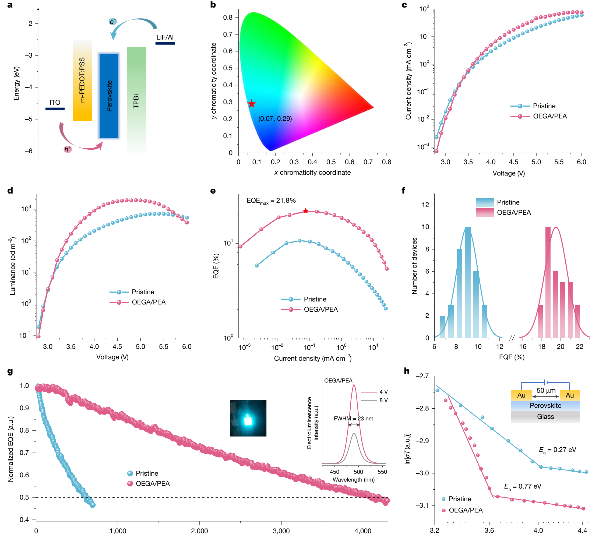

**Fig. 4 | Performance and stability of PeLED devices.** **a**, Energy diagram of each layer in PeLEDs. **b**, CIE coordinates of OEGA/PEA PeLEDs. **c**–**e**, Current density–voltage (**c**), luminance–voltage (**d**) and EQE–current density (**e**) curves of PeLED devices. **f**, Histogram of 32 devices for the pristine and OEGA/PEA PeLEDs. **g**, Operational stability of PeLEDs with an initial luminance around 100 cd m^−2^. Inset: electroluminescence spectra of OEGA/PEA PeLEDs at different bias voltages. **h**, Temperature-dependent conductivity measurements of the pristine and OEGA/PEA perovskite films. ITO, indium tin oxide.

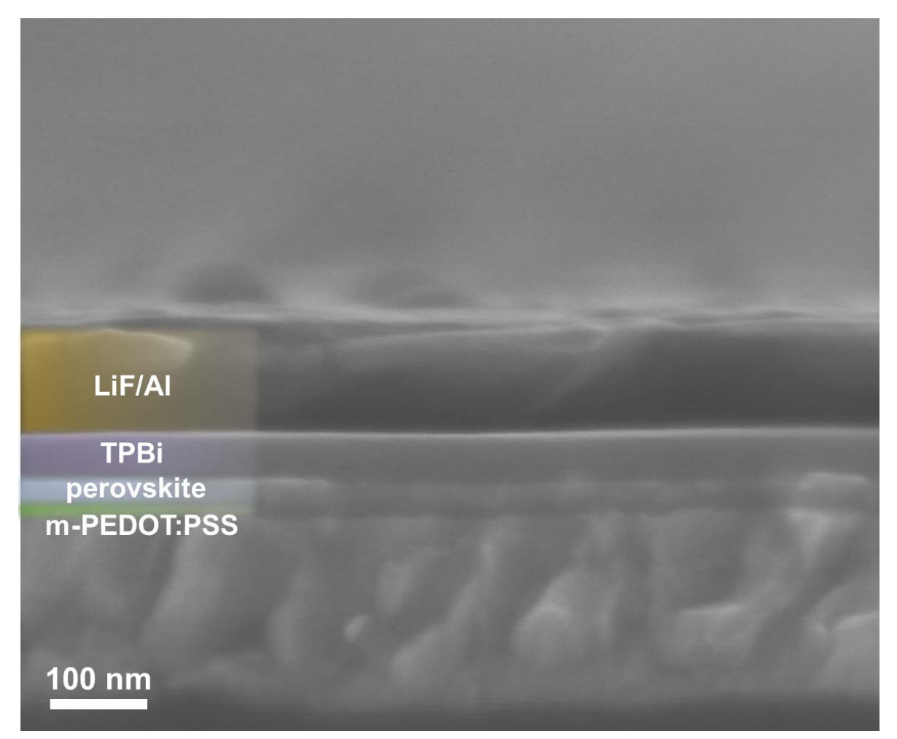

**Supplementary Figure 27.** Cross-section SEM image of PeLEDs.

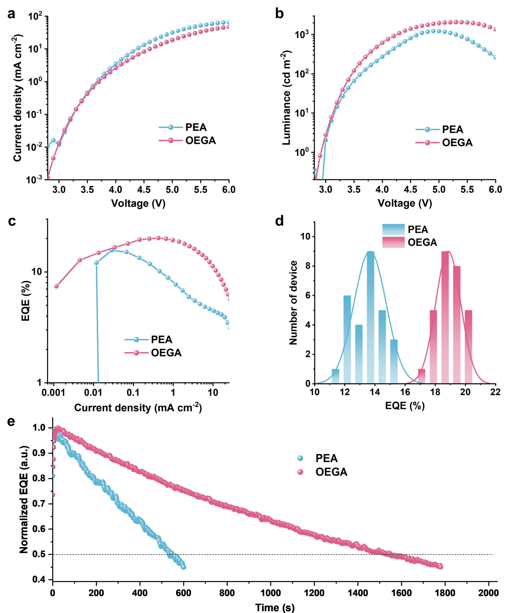

**Supplementary Figure 28.** Performance and stability of PEA and OEGA PeLED devices. **a**–**c**, J–V (**a**), L–V (**b**) and EQE–J (**c**) curves of PeLED devices. **d**, Histogram of EQE values of 28 PeLED devices. **e**, Operational stability of PeLEDs with an initial luminance around 100 cd m^–2^.

**Supplementary Table 11.** Performance of reported high-performance (>20% EQE) blue PeLEDs.

| Strategy category | Perovskite | Method | EQE (%) | L~max~ (cd m^−2^) | λ~EL~ (nm) | PLQY (%) | T~50~ (min) | Reference |
|---|---|---|---|---|---|---|---|---|
| Device / interface engineering | Nanocrystal | Tuning energy levels of nanocrystal layers (ex-situ) | 20.3 | 31,407 | 469 | 83.7 | 11,082@100 cd m^−2^ | 4 |
|  | quasi-2D | Buried interface modification (in-situ) | 20.4 | 4,190 | 487 | 89 | ~15@10 mA cm^−2^ | 5 |
|  |  | Carbon dots additives in HTL (in-situ) | 21.07 | ~1,400 | 494 | 71 | 27.8@100 cd m^−2^ | 6 |
|  |  | Doping self-assembled molecules (in-situ) | 24.03 | 4,384 | 485 | 96.78 | 13@100 cd m^−2^ | 7 |
|  |  | An interlayer HTL and a fluorinated additive (in-situ) | 25.87 | 1,460 | 490 | – | 12@1 mA cm^−2^ | 8 |
|  | 3D | All-site alloyed perovskites (in-situ post-treatment) | 23.3 | 5,700 | 487 | ~77 | 42@50 cd m^−2^ | 9 |
|  | 3D/0D | 3D/0D heterostructure (in-situ) | 21.5 | 7,449 | 495 | 80 | 318.8@1,000 cd m^−2^ | 10 |
| Composition / phase engineering | Nanocrystal | Rb compensation in A-site (ex-situ) | 26.4 | 1,601 | 480 | 92 | ~1.6@1 mA cm^−2^ | 11 |
|  | quasi-2D | Nondestructive halide exchange (in-situ post-treatment) | 23.6 | ~1,000 | 488 | 83.8 | 5.8@1 mA cm^−2^ | 12 |
|  |  | Multifunctional ionic additive (in-situ) | 21.4 | 1,981 | 483 | 88 | 129@100 cd m^−2^ | 13 |
| Composition / phase engineering | quasi-2D | Anchoring-assisted intermediate-direct-pinning (in-situ post-treatment) | 22.5 | ~1,000 | 489 | 73 | 150@100 cd m^−2^ | 14 |
|  |  | Betaine hydrochloride additive (in-situ) | 22.66 | 2,357 | 485 | 78 | 28.5@100 cd m^−2^ | 15 |
| Passivation | Nanocrystal | A trifluoroacetic acid additive and a mixed HTL (ex-situ) | 23.5 | 2,843 | 490 | 84 | 43.4@100 cd m^−2^ | 16 |
|  | quasi-2D | Fluorinated adsorbed layer (in-situ) | 22.88 | 2,011 | 490 | 71 | 6.6@1 mA cm^−2^ | 17 |
| Size / crystallization engineering | Nanocrystal | Co-additive system (in-situ) | 21.6 | 10,030 | 488 | 76 | 1.0@778 cd m^−2^ | 18 |
|  |  | In-situ polymerization (in-situ) | 21.8 | 1,925 | 491 | 83 | 69.4@100 cd m^−2^ | This work |

*Note: The terms 'in-situ' and 'ex-situ' denote the on-substrate synthesis and the colloidal suspension synthesis, respectively.*

On the basis of the optimized OEGA/PEA perovskite films with enhanced stability and PLQYs, PeLEDs were fabricated with the architecture of indium tin oxide/m-PEDOT:PSS/perovskite/TPBi/LiF/Al (Supplementary Fig. 27). The corresponding energy-level alignment is shown in Fig. 4a, where modified-poly(3,4-ethylenedioxythiophene): poly(styrene-sulfonate) (m-PEDOT:PSS) and 1,3,5-tris(1-phenyl-1H-benzimidazol-2-yl)benzene (TPBi) act as effective hole and electron transport layers to facilitate carrier injection. PeLEDs incorporating confined perovskite nanocrystals show narrow blue emission at 491 nm with CIE (International Commission on Illumination) coordinates of (0.07, 0.29) and a FWHM of 23 nm (Fig. 4b,g). Incorporation of OEGA/PEA induces a modest increase in current density under high voltage compared with pristine devices (Fig. 4c), accompanied by a substantial enhancement in maximum luminance from approximately 720 cd m^−2^ to 1,925 cd m^−2^ (Fig. 4d). As shown in Fig. 4e, the optimized devices achieve a peak EQE of 21.8%, nearly doubling that of pristine devices (10.7%), ranking among the highest EQEs reported for blue PeLEDs (Supplementary Table 11). A comparison study of devices modified with PEA, OEGA and OEGA/PEA (Supplementary Fig. 28), respectively, reveals that OEGA has the dominant role in performance enhancement. Statistical analysis of 32 devices further confirms good reproducibility, with the average EQE increasing from 9.0% for pristine devices to 19.5% for OEGA/PEA devices (Fig. 4f).

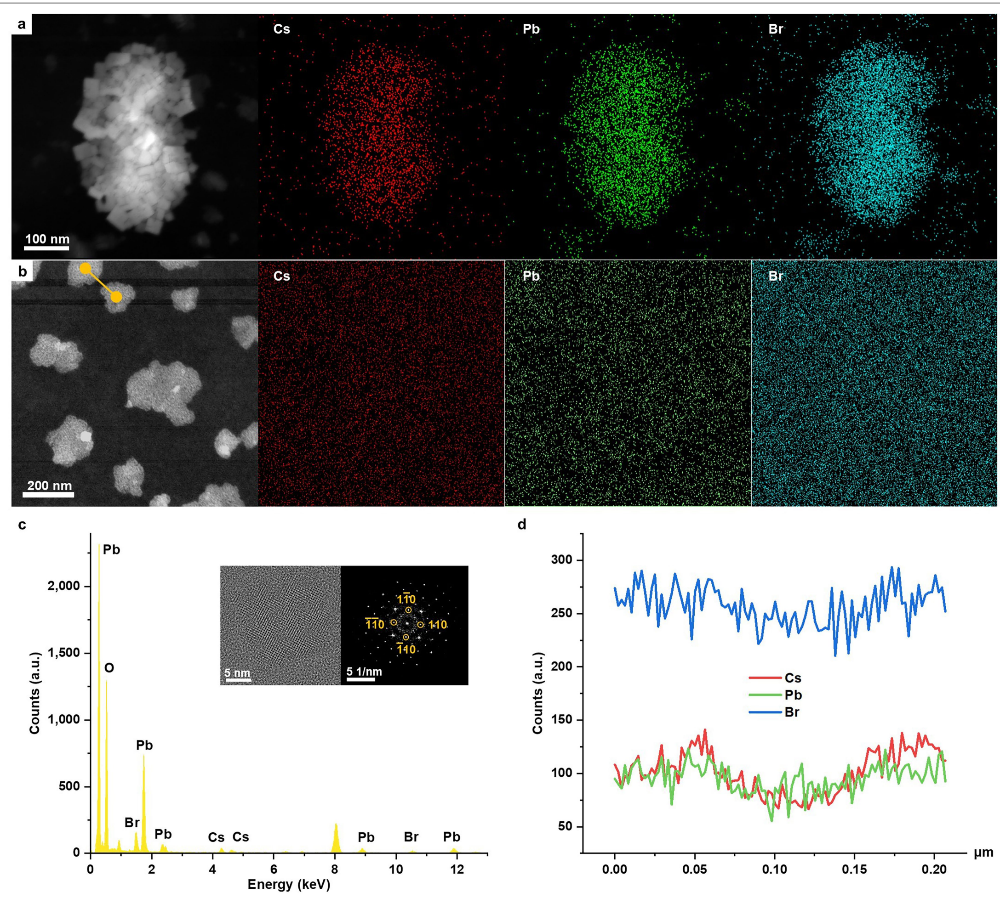

**Extended Data Fig. 4 | Characterization of the isolated submicrometric particles distributed on the surface of OEGA perovskite films.** **a**–**b**, HAADF-STEM and EDS mapping images of the isolated submicrometric particles (**a**) and the perovskite film (**b**) with OEGA. **c**, EDS spectrum acquired from Extended Data Fig. 4a. The atomic percentages of Cs, Pb, and Br are 7.0%, 4.9%, and 21.9%, respectively. **d**, EDS line scan analysis along the yellow line in Extended Data Fig. 4b.

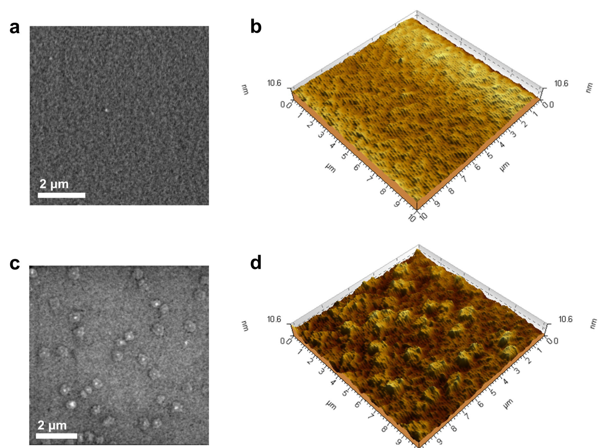

**Supplementary Figure 29.** SEM and AFM images of the pristine (**a**, **b**) and OEGA/PEA (**c**, **d**) perovskites.

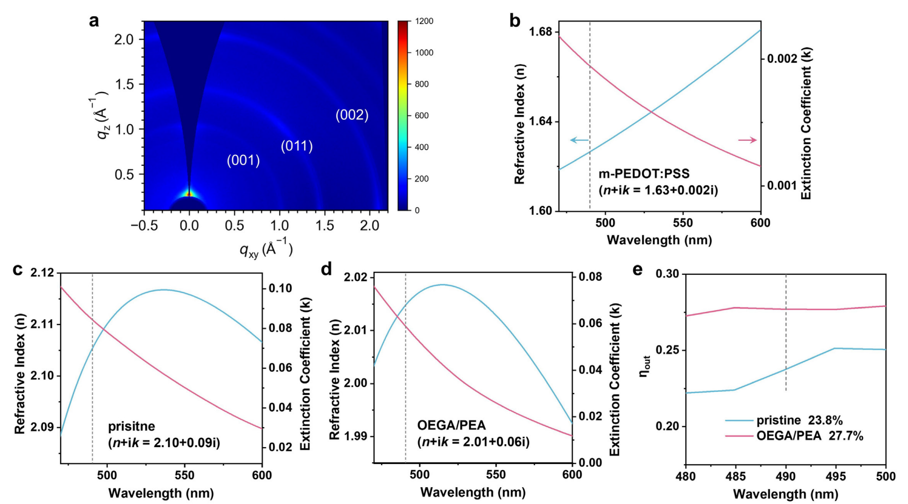

**Supplementary Figure 30.** **a**, GIWAXS patterns of the OEGA/PEA perovskite films. **b**–**d**, Refractive indices of m-PEDOT:PSS (**b**) and perovskite layers (**c**–**d**) in the PeLED. Optical constants (n, k) of the multilayers were determined using an ellipsometer. **e**, Results of light outcoupling efficiency simulations.

Apart from the high-quality confined nanocrystals, device efficiency also benefits from the optimized surface morphology of OEGA/PEA perovskite films. As evidenced by scanning electron microscopy and atomic force microscopy images (Supplementary Fig. 29), isolated submicrometric particles are uniformly distributed across the surface of OEGA/PEA perovskite films, which probably arise from the aggregation of confined nanocrystals (Extended Data Fig. 4). This morphology facilitates the extraction of lateral-propagating waveguide modes in planar devices, thereby reducing optical losses^45^ and providing a complementary contribution to the device performance (Supplementary Fig. 30).

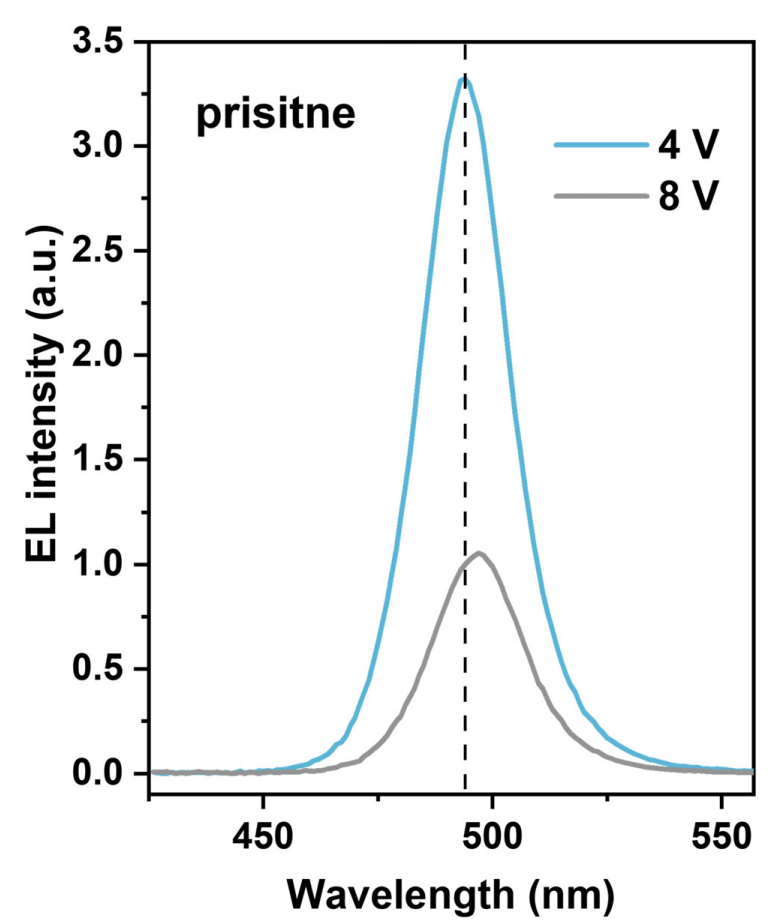

**Supplementary Figure 31.** EL spectra of pristine PeLEDs at different bias voltages.

The OEGA/PEA PeLEDs also show improved spectral and operational stability. As shown in Fig. 4g, both the electroluminescence peak position and FWHM of the OEGA/PEA PeLED remain constant under a bias voltage up to 8 V, in contrast to pristine devices (Supplementary Fig. 31). The operational half lifetime (T~50~) is markedly increased from 10.3 min of the pristine device to 69.4 min of the OEGA/PEA PeLED. To understand this stability enhancement, we tested the thermal conductance (\(\sigma(T)\), where \(\sigma\) is the conductivity and \(T\) is the temperature) of perovskite films to estimate ion-migration activation energies (\(E_a\))^46,47^. Fitting results (Fig. 4h) yield an \(E_a\) of 0.27 eV for pristine films and 0.77 eV for OEGA/PEA films, confirming that the in situ-formed polymer network effectively suppresses ion migration.

## Conclusion

We have developed an in situ-confinement strategy that enables the simultaneous realization of high crystallinity and nanoscale size control in perovskite nanocrystals grown directly on substrates. The dynamically formed polymer network restricts nanocrystal overgrowth, while strong coordination between polymerizable ligands and perovskite clusters prolongs lattice rearrangement, yielding highly crystalline, low-defect nanocrystals without sacrificing charge transport. This study enriches the scope of ligand categories and advances understanding of the effect of ligand engineering on nanocrystal synthesis. By simultaneously controlling the thermal dynamics of perovskite crystallization and organic ligand reactions, it solves the contradiction between the 'high crystallinity' and 'small size' in the in situ synthesis of perovskite nanocrystals on substrates. This method is both simple and universal, with potential for extension to diverse quantum dots owing to similar interactions, advancing high-performance PeLEDs and next-generation optoelectronics.

## Online content

Any methods, additional references, Nature Portfolio reporting summaries, source data, extended data, supplementary information, acknowledgements, peer review information; details of author contributions and competing interests; and statements of data and code availability are available at https://doi.org/10.1038/s41586-026-10596-3.

1. Ma, D. et al. Distribution control enables efficient reduced-dimensional perovskite LEDs. *Nature* **599**, 594–598 (2021).
2. Liu, X.-K. et al. Metal halide perovskites for light-emitting diodes. *Nat. Mater.* **20**, 10–21 (2021).
3. Bai, W. et al. Perovskite light-emitting diodes with an external quantum efficiency exceeding 30%. *Adv. Mater.* **35**, 2302283 (2023).
4. Feng, S.-C. et al. Efficient and stable red perovskite light-emitting diodes via thermodynamic crystallization control. *Adv. Mater.* **36**, 2410255 (2024).
5. Jiang, J. et al. Efficient red perovskite LEDs with iodine management via volatile additive I~2~. *Adv. Mater.* **37**, 2503699 (2025).
6. Xing, Z. et al. Ions-induced assembly of perovskite nanocomposites for highly efficient light-emitting diodes with EQE exceeding 30%. *Adv. Mater.* **36**, 2309392 (2024).
7. Vasilopoulou, M. et al. High efficiency blue organic light-emitting diodes with below-bandgap electroluminescence. *Nat. Commun.* **12**, 4868 (2021).
8. Zou, S.-J. et al. Recent advances in organic light-emitting diodes: toward smart lighting and displays. *Mater. Chem. Front.* **4**, 788–820 (2020).
9. Deng, Y. et al. Solution-processed green and blue quantum-dot light-emitting diodes with eliminated charge leakage. *Nat. Photon.* **16**, 505–511 (2022).
10. Ren, A. et al. Emerging light-emitting diodes for next-generation data communications. *Nat. Electron.* **4**, 559–572 (2021).
11. Yuan, S. et al. Efficient blue electroluminescence from reduced-dimensional perovskites. *Nat. Photon.* **18**, 425–431 (2024).
12. Nong, Y. et al. Boosting external quantum efficiency of blue perovskite QLEDs exceeding 23% by trifluoroacetate passivation and mixed hole transportation design. *Adv. Mater.* **36**, 2402325 (2024).
13. Chen, W. et al. Highly bright and stable single-crystal perovskite light-emitting diodes. *Nat. Photon.* **17**, 401–407 (2023).
14. Shamsi, J., Rainò, G., Kovalenko, M. V. & Stranks, S. D. To nano or not to nano for bright halide perovskite emitters. *Nat. Nanotechnol.* **16**, 1164–1168 (2021).
15. Kim, Y.-H. et al. Comprehensive defect suppression in perovskite nanocrystals for high-efficiency light-emitting diodes. *Nat. Photon.* **15**, 148–155 (2021).
16. Cao, X. et al. A review of the role of solvents in formation of high-quality solution-processed perovskite films. *ACS Appl. Mater. Interfaces* **11**, 7639–7654 (2019).
17. Rezaee, E., Zhang, W. & Silva, S. R. P. Solvent engineering as a vehicle for high quality thin films of perovskites and their device fabrication. *Small* **17**, 2008145 (2021).
18. Li, N. et al. Liquid medium annealing for fabricating durable perovskite solar cells with improved reproducibility. *Science* **373**, 561–567 (2021).
19. Liao, K. et al. Hot-casting large-grain perovskite film for efficient solar cells: film formation and device performance. *Nanomicro Lett.* **12**, 156 (2020).
20. Fiuza-Maneiro, N. et al. Ligand chemistry of inorganic lead halide perovskite nanocrystals. *ACS Energy Lett.* **8**, 1152–1191 (2023).
21. Liu, Y. et al. Efficient blue light-emitting diodes based on quantum-confined bromide perovskite nanostructures. *Nat. Photon.* **13**, 760–764 (2019).
22. Sun, W. et al. Ligands in lead halide perovskite nanocrystals: from synthesis to optoelectronic applications. *Small* **19**, 2205950 (2023).
23. Min, H. et al. Additive treatment yields high-performance lead-free perovskite light-emitting diodes. *Nat. Photon.* **17**, 755–760 (2023).
24. Lee, J., Yang, J., Kwon, S. G. & Hyeon, T. Nonclassical nucleation and growth of inorganic nanoparticles. *Nat. Rev. Mater.* **1**, 16034 (2016).
25. Wang, F. et al. Monolithically-grained perovskite solar cell with Mortise-Tenon structure for charge extraction balance. *Nat. Commun.* **14**, 3216 (2023).
26. Xiao, Z. et al. Efficient perovskite light-emitting diodes featuring nanometre-sized crystallites. *Nat. Photon.* **11**, 108–115 (2017).
27. Liu, S. et al. Zwitterions narrow distribution of perovskite quantum wells for blue light-emitting diodes with efficiency exceeding 15%. *Adv. Mater.* **35**, 2208078 (2023).
28. Chen, W. et al. Polymerized hybrid perovskites with enhanced stability, flexibility, and lattice rigidity. *Adv. Mater.* **33**, 2104842 (2021).
29. Proppe, A. H. et al. Photochemically cross-linked quantum well ligands for 2D/3D perovskite photovoltaics with improved photovoltage and stability. *J. Am. Chem. Soc.* **141**, 14180–14189 (2019).
30. Zhang, D. et al. Nanopipette dynamic microscopy unveils nano coffee ring. *Proc. Natl Acad. Sci. USA* **121**, e2314320121 (2024).
31. Su, T.-S. et al. Crown ether modulation enables over 23% efficient formamidinium-based perovskite solar cells. *J. Am. Chem. Soc.* **142**, 19980–19991 (2020).
32. Wu, X. et al. Stable triple cation perovskite precursor for highly efficient perovskite solar cells enabled by interaction with 18C6 stabilizer. *Adv. Funct. Mater.* **30**, 1908613 (2020).
33. Chen, R. et al. Crown ether-assisted growth and scaling up of FACsPbI~3~ films for efficient and stable perovskite solar modules. *Adv. Funct. Mater.* **31**, 2008760 (2021).
34. McMeekin, D. P. et al. Intermediate-phase engineering via dimethylammonium cation additive for stable perovskite solar cells. *Nat. Mater.* **22**, 73–83 (2023).
35. Simenas, M., Gagor, A., Banys, J. & Maczka, M. Phase transitions and dynamics in mixed three- and low-dimensional lead halide perovskites. *Chem. Rev.* **124**, 2281–2326 (2024).
36. Yang, R. & Tan, L. Understanding size dependence of phase stability and band gap in CsPbI~3~ perovskite nanocrystals. *J. Chem. Phys.* **152**, 034702 (2020).
37. Li, D. et al. Size-dependent phase transition in methylammonium lead iodide perovskite microplate crystals. *Nat. Commun.* **7**, 11330 (2016).
38. Yang, F. et al. Surface stabilized cubic phase of CsPbI~3~ and CsPbBr~3~ at room temperature. *Chin. Phys. B* **28**, 056402 (2019).
39. Li, H. et al. Efficient and stable red perovskite light-emitting diodes with operational stability >300 h. *Adv. Mater.* **33**, 2008820 (2021).
40. Lao, X. et al. Photoluminescence signatures of thermal expansion, electron–phonon coupling and phase transitions in cesium lead bromide perovskite nanosheets. *J. Phys. Chem. Lett.* **10**, 695–702 (2019).
41. Wright, A. D. et al. Electron–phonon coupling in hybrid lead halide perovskites. *Nat. Commun.* **7**, 11755 (2016).
42. Alexander, E. J. H. et al. Understanding the phase transition mechanism in the lead halide perovskite CsPbBr~3~ via theoretical and experimental GIWAXS and Raman spectroscopy. *APL Mater.* **11**, 041124 (2023).
43. Yang, R. X. et al. Spontaneous octahedral tilting in the cubic inorganic cesium halide perovskites CsSnX~3~ and CsPbX~3~ (X = F, Cl, Br, I). *J. Phys. Chem. Lett.* **8**, 4720–4726 (2017).
44. Chen, Z. et al. Photoluminescence enhancement for efficient mixed-halide blue perovskite light-emitting diodes. *Adv. Optical Mater.* **11**, 2202528 (2023).
45. Shen, Y. et al. Interfacial nucleation seeding for electroluminescent manipulation in blue perovskite light-emitting diodes. *Adv. Funct. Mater.* **31**, 2103870 (2021).
46. Yuan, S. et al. Efficient and spectrally stable blue perovskite light-emitting diodes employing a cationic π-conjugated polymer. *Adv. Mater.* **33**, 2103640 (2021).
47. Wang, Q. et al. Efficient sky-blue perovskite light-emitting diodes via photoluminescence enhancement. *Nat. Commun.* **10**, 5633 (2019).

## Methods

### Materials and reagents

Lead bromide (PbBr~2~), caesium bromide (CsBr, 99.999%), DMSO and poly(sodium 4-styrene-sulfonate) (PSS-Na, M~w~ (weight-average molecular weight) ≈ 70,000) were purchased from Sigma-Aldrich. Trimethylolpropane triacrylate and MPEG (average M~n~ = 5,000) were purchased from Macklin. Poly(acrylamide) (average M~n~ = 40,000) and 2-methoxyethyl acetate (M-MOA) were purchased from Adamas. Dimethyl malonate was purchased from Bide Pharmatech. 2-Aminoethyl methacrylate was purchased from Konoscience. N,N′-methylene bis(acrylamide) and potassium bromide (KBr) were purchased from Aladdin. TPBi was purchased from Xi'an Polymer Light Technology. Lithium fluoride (LiF, 99.99%) was purchased from Alfa Aesar. P-MOA (Sigma-Aldrich), OEGA (average M~n~ = 480, Sigma-Aldrich) and MPEG-MAA (average M~n~ = 1,000 and 5,000, Macklin) were purified by passing through basic alumina to remove the radical inhibitor before use. AIBN (Sigma-Aldrich, 98%) was recrystallized from methanol. Further adjustments are made to the purchased PEDOT:PSS (AI 4083) aqueous solution to fine-tune its work function and improve infiltration. The modified-PEDOT:PSS solution was a 1:1 volume mixture of a double-diluted PEDOT:PSS aqueous solution and an aqueous solution containing 15 mg ml^−1^ PSS-Na and 3 mg ml^−1^ KBr.

### Materials synthesis

PEABr was synthesized by slowly adding 0.12 mol hydrobromic acid to a solution of 0.1 mol phenethylamine in ethanol with vigorously stirring at 0 °C for 2 h. Subsequently, the solution was concentrated by evaporating the solution at 50 °C, which was washed with ethanol 3 times and then dried under vacuum at 40 °C for 24 h. The final products were sealed in a nitrogen-filled glovebox for future use.

### Perovskite precursor solution preparation

The perovskite precursor solution was prepared by dissolving CsBr (0.1 M), EABr (0.044 M) and PbBr~2~ (0.11 M) into DMSO under continuous stirring overnight. For OEGA/PEA perovskites, OEGA, PEABr (0.03 M) and AIBN (1% of OEGA) were directly added to the precursor solution before use, and the ratio of OEGA refers to the mass ratio between OEGA and PbBr~2~. Before use, the mixture was filtered through a 0.45 µm polytetrafluoroethylene membrane.

### Device fabrication

The indium tin oxide (ITO)-coated glass substrates were sequentially cleaned by sonication in detergent, deionized water, acetone and isopropyl alcohol, and then further treated with ultraviolet-ozone cleaner for 20 min. The m-PEDOT:PSS aqueous solution was spin-coated onto the ITO substrates and annealed at 150 °C for 15 min in ambient air. Then the perovskite films were prepared in a nitrogen-filled glovebox by spin-coating at 3,500 rpm. After spin-coating for 36 s, 450 µl toluene anti-solvent containing 0.2 mg ml^−1^ poly(methyl methacrylate) was dropped onto the film, followed by annealing at 60 °C for 20 min and a subsequent 3 s CF~4~ plasma treatment. Finally, TPBi (40 nm), LiF (1 nm) and Al electrode (100 nm) were deposited sequentially through a thermal evaporator.

### Characterization

The steady-state photoluminescence spectra and time-resolved photoluminescence spectra were recorded on the FLS980 (Edinburgh Instruments) with an excitation at 345 nm. The ultraviolet–visible absorption spectra of the samples were obtained by a ultraviolet–visible diffuse reflectance spectrophotometer (UV–vis DRS, Japan Hitachi UH4150). The broadband femtosecond transient absorption spectra were taken using the Ultrafast System HELIOS TA spectrometer. All the samples were encapsulated with quartz flakes during these optical measurements. The in situ absorbance measurements were tested on a Quartz Flow-Through Semi-Micro Cuvette with a 2 mm slit. The fluorescence microscopy images were tested under a laser scanning confocal microscope (Nikon). The temperature-dependent low-frequency Raman spectra were collected using a home-built microscope. A 633-nm helium–neon laser (N-LHP-925, Newport) was filtered from undesirable amplified spontaneous emission using a volume Bragg grating (VBG) bandpass filter (Optigrate, linewidth 5 cm^−1^). To minimize the Rayleigh scattered light, the collected signal was sent through the VBG reflecting filter and passed through three VBG notch filters (Optigrate, optical density > 3) before being dispersed in the spectrograph. The X-ray diffraction patterns were collected by using a PANalytical X'Pert Pro X-ray powder diffractometer with Cu Kα radiation (wavelength λ = 1.54050 Å). To improve the signal-to-noise ratio, the precursor solution concentration was magnified. The ^1^H NMR measurements were recorded on a Bruker-400 MHz NMR. The samples were scraped off after spin-coating and redissolved in the solvent for testing. To improve the signal-to-noise ratio, the OEGA concentration was magnified. The morphology of perovskite films was measured using a scanning electron microscope (S4800) and an atomic force microscope (Bruker). The X-ray photoelectron spectroscopy (XPS) data were obtained by an Axis Ultra XPS spectrometer (Kratos) with Kα radiation of Al, and operated at 150 W. XPS and ultraviolet photoelectron spectroscopy were obtained by an Axis Ultra XPS spectrometer (Kratos) with Al Kα radiation and ionizing helium I, respectively. The current density–voltage–luminance curve, EQE and operational stability measurement of our perovskite LEDs and the PLQY measurement were conducted using a commercialized system (LQE-100-EL, Enlitech) equipped with an integrated sphere and a photomultiplier tube, in which the photomultiplier tube was used to measure the low luminance up to 10^−4^ cd m^−2^, ensuring accurate measurement of luminance. The start and stop voltages of the EQE measurement were set at 2.8 V and 6 V, respectively, with a voltage step of 0.1 V, a dwell time of 100 ms and a delay of 100 ms. All the device characterization tests of perovskite LEDs were recorded at room temperature in the nitrogen-filled glovebox for the unencapsulated devices. To confirm the measurement results, third-party laboratory cross-checks were performed.

Transmission electron microscopy (TEM) samples were prepared by spin-coating precursor solutions onto carbon-coated copper grids, followed by thermal annealing under conditions consistent with those used for thin-film fabrication. To evaluate the potential influence of the underlying layers, additional TEM samples were prepared by spin-coating perovskite layers on ITO substrates pre-coated with the respective transport layers, followed by gentle scraping and redispersion in toluene before drop-casting onto copper grids. TEM characterization was carried out using an aberration-corrected microscope (JEOL Grand ARM 300) operated at 300 kV. To minimize beam-induced damage of perovskite nanocrystals, the samples were tested with a pixel detector-based ultralow-dose electron imaging camera (Gatan, K2). Particle size analysis was conducted using Nano Measurer software. Multiple TEM images collected from different regions of the grid and from different samples were used for statistical analysis. The particle size was defined based on the edge length of the cubic nanocrystals, and overlapping or aggregated particles were excluded from the analysis. In total, more than 100 particles were analysed for each sample.

Liquid-phase TEM images were collected with a JEM-2100 Plus (HC) microscope with a Gatan OneviewIS camera operated at 200 kV. Quartz capillaries (outer diameter 1.0 mm, inner diameter 0.7 mm, length 10 cm, Sutter Instrument) of liquid-phase electron microscopy were positioned on a CO~2~-laser-based puller (P-2000, Sutter Instrument). A typical two-line protocol was used to generate nanopipette liquid cells with conical shape: (1) HEAT: 835; FIL: 5; VEL: 30; DEL: 128; PUL: 90, (2) HEAT: 865; FIL: 4; VEL: 25; DEL: 132; PUL: 195. The precursor solution was injected into a quartz capillary with a nanosized conical tip from the open end and left undisturbed for 3 h to allow precursor diffusion to the nano-tip. The tip (0.5–1 mm in length) was cut and sealed with vacuum grease at the open end, then loaded onto a carbon-coated TEM grid to create a nanopipette liquid cell.

The temperature-dependent photoluminescence spectra were recorded on an FLS980 (Edinburgh Instruments) equipped with a liquid-nitrogen-cooled cryostat (Oxford Instruments, OptistatDN-V); a 375-nm laser was used as the excitation source. The extracted FWHM of the photoluminescence spectra are plotted as a function of temperature and fitted with the independent Boson model^39–41^:

$$\Gamma(T)=\Gamma_0+\Gamma_{\mathrm{ac}}+\Gamma_{\mathrm{LO}}+\Gamma_{\mathrm{imp}}=\Gamma_0+\gamma_{\mathrm{ac}}T+\frac{\gamma_{\mathrm{LO}}}{e^{E_{\mathrm{LO}}/k_{\mathrm{B}}T}-1}+\gamma_{\mathrm{imp}}e^{-E_b/k_{\mathrm{B}}T} \quad (1)$$

Here \(\Gamma_0\) is a temperature-independent inhomogeneous broadening coefficient. \(\Gamma_{\mathrm{ac}}\) and \(\Gamma_{\mathrm{LO}}\) are electron–phonon coupling coefficients arising from acoustic (ac) and longitudinal-optical (LO) phonon scattering, with the corresponding coupling strengths of \(\gamma_{\mathrm{ac}}\) and \(\gamma_{\mathrm{LO}}\). \(E_{\mathrm{LO}}\) represents the LO phonon energy. \(\Gamma_{\mathrm{imp}}\) accounts for scattering from ionized impurities with the average binding energy \(E_b\) and the coefficient \(\gamma_{\mathrm{imp}}\), which is exceedingly small and can be neglected in the fitting. \(k_{\mathrm{B}}\) is the Boltzmann constant. As the electron-carrier interaction is dominated by high-energy LO phonons in the high-temperature regime^41,48^, we fit the FWHM data based on LO phonon modes.

Temperature-dependent conductivity measurements were conducted using a Keithley 2400 and the temperature was controlled by a Cryo Industries Liquid Nitrogen Dewars with Lake Shore model 335 cryogenic temperature controller. Perovskite films were fabricated on glass substrates and 80-nm gold electrodes with spacing of 50 µm were subsequently deposited. The ion activation energy (\(E_a\)) can be derived by fitting the conductivity curve with Nernst–Einstein equation:

$$\sigma(T)=\frac{\sigma_0}{T}\exp\!\left(-\frac{E_a}{k_{\mathrm{B}}T}\right) \quad (2)$$

where \(\sigma\) is the conductivity, \(T\) is the temperature, \(E_a\) is the activation energy and \(k_{\mathrm{B}}\) is the Boltzmann constant.

### Computational section

**Density functional theory calculations.** The molecular clusters were investigated using density functional theory (DFT) calculations with ADF^49,50^ using AMS2023^51^. Slater Type Orbitals with TZP basis functions were used for all atoms^52^, treating the lighter atoms (H, C, O and S) with an all-electron basis set, whereas the cores for the heavier atoms were kept frozen (Br 1s–3p and Pb 1s–4d). The Zero Order Regular Approximated (ZORA) Hamiltonian was used to include spin–orbit coupling^53^. Exchange-correlation interactions between the electrons were modelled with the Perdew, Burke and Ernzerhof (PBE) functional^54^ to which we explicitly added dispersive interactions through the Becke-Johnson (BJ) damped DFT-D3 scheme^55^. Structures are visualized using OVITO^56^.

The binding energy of molecules on a perovskite surface and phase-stability calculations were investigated using DFT calculations with the projector-augmented wave method as implemented in the Vienna Ab-initio Simulation Package (VASP)^57–59^. The outermost electrons of H (1s^1^), C (2s^2^2p^2^), N (2s^2^2p^3^), O (2s^2^2p^4^), Br (4s^2^4p^5^), Cs (5s^2^5p^6^6s^1^) and Pb (6s^2^6p^2^) were treated as valence electrons. In all calculations, the plane-wave basis set was expanded to 500 eV with Γ-centred k-meshes^60^. For the binding-energy calculations, we modelled the exchange-correlation interactions using the PBE + D3(BJ) functional^54,55^. The phase stability calculation used the PBEsol functional^61^, and the changes in the bandgap were calculated with the r^2^SCAN meta-GGA functional^62^. The Gibbs free energy was calculated from \(G=E_{\mathrm{ele}}+ZPE+pV+\Delta U_{(0\to T)}-TS\) by VASPKIT^63^, here \(E_{\mathrm{ele}}\) is the electronic energy, ZPE is the zero-point energy, p is the pressure, V is the volume, \(\Delta U_{(0\to T)}\) is the thermal correction to the internal energy from 0 K to temperature T, and S is the entropy.

The structural models for the binding-energy calculations were created from a bulk structure of the cubic phase of CsPbBr~3~, which was optimized with a 6 × 6 × 6 k-mesh. Slabs with a thickness of 6 octahedral layers and with a PbBr~2~-termination were made from 2 × 2 supercells in the lateral dimension with 25 Å of vacuum. The perovskite slabs with the adsorbed molecule were optimized using a 3 × 3 × 1 k-mesh by allowing the ionic positions to change. Models were visualized using OVITO^56^.

To assess the phase stability, we optimized the structures of CsBr and PbBr~2~, the precursors of CsPbBr~3~, as well as the different phases of the perovskite, that is, cubic, tetragonal and orthorhombic. The reciprocal space of the precursors was sampled with an 8 × 8 × 8 and 4 × 7 × 3 k-mesh for CsBr and PbBr~2~, and a 6 × 6 × 6, 4 × 4 × 6 and 4 × 4 × 3 k-mesh was used for the cubic, tetragonal and orthorhombic phase of CsPbBr~3~, respectively. The various compounds were optimized by allowing the ionic positions, cell shape and cell volume to change. The optimized perovskite geometries were then used to create slabs with CsBr or PbBr~2~ termination and a thickness of 8 octahedral layers with 25 Å of vacuum. The reciprocal space of these slabs was sampled using a 6 × 6 × 1, 4 × 4 × 1 and 4 × 4 × 1 k-mesh for the cubic, tetragonal and orthorhombic phases of CsPbBr~3~, respectively. Mixed cation systems were created from the optimized unit cells of the cubic and orthorhombic phases of CsPbBr~3~, replacing Cs^+^ with EA^+^ in a model structure with eight octahedral units. These systems were optimized using a 3 × 3 × 3 and 2 × 4 × 3 k-mesh for the cubic and orthorhombic phases, respectively. During optimization of the ionic positions, cell shape and cell volume were allowed to change.

### Molecular dynamics simulations

Molecular dynamics simulations were done using the General Amber Force Field (GAFF)^64^ as implemented in AMS2023^51^. Model systems were created using PACKMOL^65^. The atom types and bond types in the model systems were determined using the antechamber module^66^ based on data obtained from MOPAC calculations^67^. In the simulations, a time step of \(\Delta t=0.5\,\text{fs}\) was used. The damping constants for the thermostat and barostat were \(\tau_T=100\,\text{fs}\) and \(\tau_p=2500\,\text{fs}\), respectively. The systems were equilibrated with a Berendsen thermostat and Berendsen barostat^68^, whereas the production runs made use of an NHC thermostat^69^ and an MTK barostat^70^. For the barostats, an equal scaling for all dimensions (x, y and z) was used to prevent a collapse of the simulation cell in one of the periodic directions. For both pure solvent systems and polymer–solvent systems and equilibration time of \(t_{eq}=200\,\text{ps}\) was found to be enough to achieve system equilibration. The production runs were carried out for \(t_{prod}=200\,\text{ps}\) and \(t_{prod}=1\,\text{ns}\) for the pure solvent and polymer–solvent systems, respectively. Simulation snapshots are visualized using OVITO^56^.

### Optical simulation

Three-dimensional finite-difference-time-domain simulations were performed to calculate the theoretical outcoupling in planar and patterned PeLEDs. We established a structure of glass (n = 1.5)/ITO (n = 1.8, 110 nm)/m-PEDOT:PSS (n = 1.63, 15 nm)/perovskite (n = 2.10/2.01, 20 nm)/TPBi (n = 1.7, 40 nm)/Al (100 nm). The real part (n) and imaginary part (k) of the refractive index of the m-PEDOT:PSS and perovskite layers were obtained from an ellipsometer and others were from the literature^13^. The nanostructure of the patterned OEGA/PEA films was modelled with the detailed surface morphologies from the scanning electron microscope and atomic force microscope images. Multiple simulations with different polarizations were carried out to simulate the incoherent isotropic light source. The total radiated power (P) was obtained according to the following equation^71^:

$$P=\Theta P_{\parallel}+(1-\Theta)P_{\perp}=\Theta(P_x^s+P_y^s)+(1-\Theta)P_z^s \quad (3)$$

where \(\Theta\) is the horizontal dipole ratio defining the orientation of transition dipole moments, and \(P^s\) represents the radiated power contributed by dipoles polarized along the corresponding spatial direction. For isotropic emitters that possess randomly oriented dipoles with equal probability for all directions, \(\Theta\) equals 2/3.

### Data availability

All data are available in the main text or Supplementary Information.

48. Mante, P.-A., Stoumpos, C. C., Kanatzidis, M. G. & Yartsev, A. Electron–acoustic phonon coupling in single crystal CH~3~NH~3~PbI~3~ perovskites revealed by coherent acoustic phonons. *Nat. Commun.* **8**, 14398 (2017).
49. Fonseca Guerra, C., Snijders, J. G., te Velde, G. & Baerends, E. J. Towards an order-N DFT method. *Theor. Chem. Acc.* **99**, 391–403 (1998).
50. Velde, G. et al. Chemistry with ADF. *J. Comput. Chem.* **22**, 931–967 (2001).
51. Baerends, E. J. et al. The Amsterdam Modeling Suite. *J. Chem. Phys.* **162**, 162501 (2025).
52. Van Lenthe, E. & Baerends, E. J. Optimized slater-type basis sets for the elements 1–118. *J. Comput. Chem.* **24**, 1142–1156 (2003).
53. Van Lenthe, E., van Leeuwen, R., Baerends, E. J. & Snijders, J. G. Relativistic regular two-component hamiltonians. *J. Quantum Chem.* **57**, 281–293 (1996).
54. Perdew, J. P., Burke, K. & Ernzerhof, M. Generalized gradient approximation made simple. *Phys. Rev. Lett.* **78**, 1396 (1997).
55. Grimme, S., Ehrlich, S. & Goerigk, L. Effect of the damping function in dispersion corrected density functional theory. *J. Comput. Chem.* **32**, 1456–1465 (2011).
56. Stukowski, A. Visualization and analysis of atomistic simulation data with OVITO—the open visualization tool. *Model. Simul. Mat. Sci. Eng.* **18**, 015012 (2009).
57. Kresse, G. & Hafner, J. Ab Initio molecular-dynamics simulation of the liquid-metal–amorphous-semiconductor transition in germanium. *Phys. Rev. B* **49**, 14251 (1994).
58. Kresse, G. & Furthmüller, J. Efficiency of ab-initio total energy calculations for metals and semiconductors using a plane-wave basis set. *Comput. Mater. Sci.* **6**, 15–50 (1996).
59. Kresse, G. & Furthmüller, J. Efficient iterative schemes for ab initio total-energy calculations using a plane-wave basis set. *Phys. Rev. B* **54**, 11169 (1996).
60. Monkhorst, H. J. & Pack, J. D. Special points for Brillouin-zone integrations. *Phys. Rev. B* **13**, 5188 (1976).
61. Perdew, J. P. et al. Restoring the density-gradient expansion for exchange in solids and surfaces. *Phys. Rev. Lett.* **100**, 136406 (2008).
62. Furness, J. W. et al. Accurate and numerically efficient r^2^SCAN meta-generalized gradient approximation. *J. Phys. Chem. Lett.* **11**, 8208–8215 (2020).
63. Wang, V. et al. VASPKIT: a user-friendly interface facilitating high-throughput computing and analysis using VASP code. *Comput. Phys. Commun.* **267**, 108033 (2021).
64. Wang, J., Wolf, R. M., Caldwell, J. W., Kollman, P. A. & Case, D. A. Development and testing of a general amber force field. *J. Comput. Chem.* **25**, 1157–1174 (2004).
65. Martínez, L., Andrade, R., Birgin, E. G. & Martínez, J. M. PACKMOL: a package for building initial configurations for molecular dynamics simulations. *J. Comput. Chem.* **30**, 2157–2164 (2009).
66. Wang, J., Wang, W., Kollman, P. A. & Case, D. A. Automatic atom type and bond type perception in molecular mechanical calculations. *J. Mol. Graph. Model.* **25**, 247–260 (2006).
67. Stewart, J. J. P. Optimization of parameters for semiempirical methods VI: more modifications to the NDDO approximations and re-optimization of parameters. *J. Mol. Model.* **19**, 1–32 (2013).
68. Berendsen, H. J. C. et al. Molecular dynamics with coupling to an external bath. *J. Chem. Phys.* **81**, 3684–3690 (1984).
69. Martyna, G. J., Klein, M. L. & Tuckerman, M. Nosé–Hoover chains: the canonical ensemble via continuous dynamics. *J. Chem. Phys.* **97**, 2635–2643 (1992).
70. Martyna, G. J., Tobias, D. J. & Klein, M. L. Constant pressure molecular dynamics algorithms. *J. Chem. Phys.* **101**, 4177–4189 (1994).
71. Cui, J. et al. Efficient light-emitting diodes based on oriented perovskite nanoplatelets. *Sci. Adv.* **7**, eabg8458 (2021).

**Acknowledgements** This work was supported by the National Natural Science Foundation of China (grant numbers 52125206, 52433013, 52202209, 21927901, 22031002, 21931001, 92262301 and 22109002), Ministry of Science and Technology of the People's Republic of China (numbers 2023YFB4202502 and 2025YFF0516700), the Beijing Natural Science Foundation (Z240024), China National Petroleum Corporation-Peking University Strategic Cooperation Project of Fundamental Research, Tencent Foundation through the XPLORER PRIZE, and Vidi (Project VI.Vidi.213.091) from the Dutch Research Council (NWO). We thank the staff at beamlines BL14B1 at the Shanghai Synchrotron Radiation Facility (SSRF) for their help with GIWAXS characterizations. We thank the Materials Processing and Analysis Center, Peking University, for assistance with X-ray diffraction, photoluminescence and scanning electron microscopy characterization.

**Author contributions** S.L., H.Z., L.-D.S. and C.-H.Y conceived of and designed the study. S.L. fabricated the perovskite nanocrystals and the efficient PeLEDs. M.P. performed the interaction energy calculations, molecular dynamics simulations and nanocrystal phase stability calculations under the supervision of S.T. Z.Z. calculated the Gibbs free energies and electronic properties under supervision of Q.C. X.H. conducted transmission electron microscopy measurements under the supervision of L.W. H.X. and Z.H. contributed to the three-dimensional finite-difference-time-domain simulations and thermal conductance measurements. Z.G. and L.L. contributed to the in situ absorption and photoluminescence measurements. R.F. and J.G. contributed to the Raman measurement. D.-Y.Z. conducted the liquid-phase transmission electron microscopy measurements under the supervision of H.W. D.P. contributed to the confocal fluorescence microscopy measurement. W.Y. contributed to the atomic force microscopy measurement. S.L., Y.H., L.M., H.D., H.Z. and L.-D.S. wrote and revised the paper. All authors were involved in discussions of data analysis and commented on the paper.

**Competing interests** The authors declare no competing interests.

### Additional information

**Supplementary information** The online version contains supplementary material available at https://doi.org/10.1038/s41586-026-10596-3.

**Correspondence and requests for materials** should be addressed to Ling-Dong Sun, Chun-Hua Yan or Huanping Zhou.

**Peer review information** *Nature* thanks the anonymous reviewers for their contribution to the peer review of this work.

**Reprints and permissions information** is available at http://www.nature.com/reprints.

---

## Supplementary Information

*In the format provided by the authors and unedited*

# *In-situ* Nanocrystal Confinement for Efficient Blue Perovskite LEDs

Shaocheng Liu^1^, Mike Pols^2^, Zhongyang Zhang^1^, Xudan Huang^4^, Zijian Huang^1^, Ying Han^1^, Zhenyu Guo^1^, Liang Li^1^, Rundong Fan^1^, De-Yi Zhang^1^, Ping Du^1^, Wenjin Yu^1^, Jiazhen Gu^1^, Luxuan Men^1,5^, Hao Dong^1^, Shuxia Tao^2^, Lifen Wang^4^, Qi Chen^3^, Huan Wang^1^, Huaiyu Xu^6^, Ling-Dong Sun^1^*, Chun-Hua Yan^1^*, and Huanping Zhou^1,7,8^*

^1^Beijing National Laboratory for Molecular Sciences, Beijing Key Laboratory for Theory and Technology of Advanced Battery Materials, Key Laboratory of Polymer Chemistry and Physics of Ministry of Education, State Key Laboratory of Advanced Waterproof Materials, School of Physics, School of Materials Science and Engineering, College of Chemistry and Molecular Engineering, Peking University, Beijing 100871, People's Republic of China
^2^Department of Applied Physics and Science Education, Eindhoven University of Technology, 5600 MB Eindhoven, The Netherlands
^3^Experimental Centre for Advanced Materials, School of Materials Science and Engineering, Beijing Institute of Technology, Beijing 100081, People's Republic of China
^4^Beijing National Laboratory for Condensed Matter Physics, Institute of Physics, Chinese Academy of Sciences, Beijing 100190, People's Republic of China
^5^College of Materials Science and Engineering, Beijing University of Technology, Beijing 100124, People's Republic of China
^6^Laboratory of Spin Magnetic Resonance, School of Physical Sciences, Anhui Province Key Laboratory of Scientific Instrument Development and Application, University of Science and Technology of China, Hefei 230026, People's Republic of China
^7^Southwest United Graduate School, Kunming, People's Republic of China
^8^Institute of Carbon Neutrality, Peking-University, Beijing, People's Republic of China

E-mail: happy_zhou@pku.edu.cn (H. Zhou), sun@pku.edu.cn (L. D. Sun), yan@pku.edu.cn (C. H. Yan)

## Table of content

**Supplementary Figures 1–31, Tables 1–11, Notes 1–3**

1. Supplementary Figure 1–6 | TEM images and size distribution histograms for perovskite nanocrystals.
2. Supplementary Figure 7, Supplementary Table 1 | Absence of acrylate radicals from polymerizable monomers in the resulting films.
3. Supplementary Figure 8 | Interaction of OEGA with perovskite and its influence on PL emission.
4. Supplementary Figure 9–12, Supplementary Table 2–5, Supplementary Note 1 | DFT calculations to compare the thermodynamics of OEGA and solvents coordination with PbBr~2~.
5. Supplementary Figure 13–17, Supplementary Table 6, Supplementary Note 2 | MD simulations of polymerization reactions with different monomer structure.
6. Supplementary Figure 18–21 | Extending applications of in-situ polymerization strategy in other perovskite systems.
7. Supplementary Table 7–9, Supplementary Note 3 | DFT calculations of nanocrystal phase stability.
8. Supplementary Figure 22–26, Supplementary Table 10 | Supplementary luminescence and structural characterization of OEGA perovskites.
9. Supplementary Figure 27–31 | Device structure, performance characterization, and light-outcoupling simulation of PeLEDs.
10. Supplementary Table 11 | Performance of reported high-performance blue PeLEDs.
11. Supplementary References

## Supplementary Note 1: Interaction energies

### Molecular binding energies

To assess the binding strength of a various molecules including the polymers and solvents to PbBr~2~, we calculate the binding energy \(E_b\) as

$$E_b=\frac{E_{\mathrm{complex}}-E_{\mathrm{PbBr}_2}-n_{\mathrm{molecule}}\cdot E_{\mathrm{molecule}}}{n_{\mathrm{molecule}}}$$

where \(E_{\mathrm{complex}}\) is the total energy of the complex in which the molecules are bonded, \(E_{\mathrm{PbBr}_2}\) is the energy of an isolated PbBr~2~ molecule, \(E_{\mathrm{molecule}}\) is the energy of an isolated molecule and \(n_{\mathrm{molecule}}\) is the number of molecules coordinating PbBr~2~ in the complex. For all complexes the geometry was optimized from several starting configurations, the most stable complexes were used in the determination of the binding energies.

### Organic ligands

To probe the interaction strength of the organic ligands with the perovskite precursor, we compute the binding energies for various ligand conformations with PbBr~2~. Comparing the interaction energies of OEGA (n = 9) and a shorter model system (n = 5), we find minimal differences in the binding strength between PbBr~2~ and the organic ligands, highlighting the local nature of the O-Pb bonds. As a result of this, we use the shorter model system to compute the binding energies associated with the various binding modes of the organic ligands. Supplementary Fig. 9 provides an overview of the different binding modes between organic ligand and PbBr~2~, their respective binding energies can be found in Supplementary Table 2. The binding energies indicate that the formation of additional O-Pb bonds between the organic ligands and inorganic PbBr~2~ provide additional stabilization for the molecular complexes that is facilitated by the flexibility of the organic backbone of the ligands.

### Solvent molecules

To investigate the binding energies of DMSO molecules to PbBr~2~, we progressively add more DMSO molecules until the lead atom in PbBr~2~ is fully coordinated (\(n_{\mathrm{DMSO}}\)). In this fully coordinated geometry Pb forms six bonds arranged in an octahedral shell around the Pb in the center: two Br-Pb bonds and four O-Pb bonds. The most stable complexes are shown in Supplementary Fig. 10 with their respective binding energies and the energy difference associated with the adsorption of an additional DMSO molecule (\(\Delta E_{\mathrm{complex}}\)) reported in Supplementary Table 3. The successive adsorption of solvent molecules diminishes the energy gain per molecule, as demonstrated by \(\Delta E_{\mathrm{complex}}\), which is likely the result of repulsive interactions that arise from the packing of solvent molecules around the PbBr~2~ molecule.

### Solvent exchange reaction

The reaction enthalpy for the solvent exchange reaction was modeled by comparing the energies of PbBr~2~ complexes in which PbBr~2~ is completely coordinated by DMSO molecules against complexes in which a part of the PbBr~2~ molecule is coordinated by the organic ligand. Both DMSO and the polymer can bond to PbBr~2~ through O-Pb bonds, as shown in Supplementary Fig. 11. We compute the reaction enthalpy \(\Delta H\) as

$$\Delta H=E_{\mathrm{complex}}^{\mathrm{p}}-E_{\mathrm{complex}}^{\mathrm{s}}$$

with \(E_{\mathrm{complex}}^{\mathrm{p}}\) and \(E_{\mathrm{complex}}^{\mathrm{s}}\) the energies of the molecular complexes in which the organic ligand and DMSO bind PbBr~2~, respectively. In the calculations we used shorter chain lengths (n = 3, 5) than for OEGA used in the nanocrystal synthesis (n = 9), to prevent any reorientations of the organic ligand far away from the PbBr~2~ from influencing the reaction enthalpy of solvent exchange. For both complexes we optimized the cluster geometry using different starting points, using the most stable configurations for both (Supplementary Fig. 11), we find an enthalpy for solvent exchange of +0.12 eV and +0.09 eV for n = 3 and n = 5, respectively.

### Surface adsorption

To assess the ability of OEGA-like molecules to the surface of CsPbBr~3~ nanocrystals, we compute the adsorption energies shorter molecules (n = 1; i.e. P-MOA) to the surface of CsPbBr~3~. We compute this adsorption energy \(E_{\mathrm{ads}}\) as

$$E_{\mathrm{ads}}=E_{\mathrm{complex}}-E_{\mathrm{molecule}}-E_{\mathrm{surface}}$$

where \(E_{\mathrm{complex}}\) is the energy of the molecule bonded to the surface, \(E_{\mathrm{molecule}}\) is the energy of the isolated molecule and \(E_{\mathrm{surface}}\) is the energy of the isolated surface. For the optimized bonded geometry, we only allow the ions in the molecule to relax. The resulting geometries, shown in Supplementary Fig. 12, have adsorption energies that range from −0.53 eV to −0.71 eV. The adsorption energies of a single adsorption site are slightly smaller compared to the binding energies with PbBr~2~ molecules (Supplementary Table 3). However, it is interesting to note that on perovskite surfaces, multiple adsorption sites are available, and the adsorption energy per ligand increases with the number of available sites for O-Pb bonds.

## Supplementary Note 2: Effects of polymerization

### Force field validation

To validate the use of GAFF for the simulation of the polymer-solvent systems with DMSO as the solvent, we assess its performance for pure solvent systems. A solvent cell with 400 solvent molecules was equilibrated at atmospheric pressure to target temperatures of 300 K and 330 K. The average densities were extracted from 200 ps production runs. As shown in Supplementary Fig. 13, the simulated densities agree well with the DMSO densities reported on in experiments by Campbell^2^. The simulated solvent densities are reported in Supplementary Table 6.

### Dynamics of P-MOA

To assess the dynamics of P-MOA as a function of its degree of polymerization \(m\), we investigate the dynamics of intermediate chemical species of the polymerization of the monomers using molecular dynamics simulations. We create model systems in which P-MOA monomers are linked together forming polymers with m = 3, 9 and 15, thus following the degree of polymerization from low to high. The polymers were simulated in 400 DMSO solvent molecules at 330 K for 1 ns at atmospheric pressure. Simulation snapshots of the growing organic backbone, taken after 0.0 ns, 0.5 ns and 1.0 ns, are shown in Supplementary Fig. 14–15. The snapshots illustrate that the backbone of the polymer, which scales with the degree of polymerization, exhibits a substantially more persistent orientation and conformation for higher values of \(m\). Moreover, the relatively short length of the sidechains on the backbone possesses insufficient degrees of freedom to appropriately coordinate precursor species.

### Dynamics of OEGA

To understand the effects that the longer sidechains in OEGA have on the polymer dynamics, we investigate the dynamics for various degrees of polymerization \(m\) of OEGA. We create model systems in which m = 1, 3 and 5 OEGA monomers are linked together in 400 DMSO solvent molecules and simulate them at 330 K for 1 ns at atmospheric pressure. Snapshots from these simulations are taken at 0.0 ns, 0.5 ns and 1.0 ns, the result of which is shown in Supplementary Fig. 16–17. Analogous as for the polymerization of P-MOA, we observe that the polymer backbone becomes increasingly more persistent in terms of orientation and conformation for higher degrees of polymerization. Nevertheless, the longer sidechains on this backbone possess sufficient mobility to coordinate with precursors of the perovskite when in solution.

## Supplementary Note 3: Nanocrystal phase stability

### Nanocrystal energy

To identify the most stable phase of perovskite nanocrystals of a specific size, we compare the total energy of the nanocrystals with different phases following the method proposed by Yang and Tan^19^. The total energy of a nanocrystal contains a bulk and a surface contribution, which we calculate per formula unit as

$$E_{\mathrm{NC}}=\Delta_{\mathrm{bulk}}+\Delta_{\mathrm{surf}}.$$

The bulk contribution \(\Delta_{\mathrm{bulk}}\) is the perovskite formation energy per formula unit, which is defined as

$$\Delta_{\mathrm{bulk}}=E_{\mathrm{f}}=E_{\mathrm{CsPbBr}_3}-E_{\mathrm{CsBr}}-E_{\mathrm{PbBr}_2},$$

where \(E_{\mathrm{CsPbBr}_3}\), \(E_{\mathrm{CsBr}}\), and \(E_{\mathrm{PbBr}_2}\) are the total enthalpies of the materials from DFT calculations. Assuming cubic nanocrystals, the energy contribution of the surface \(\Delta_{\mathrm{surf}}\) is written as

$$\Delta_{\mathrm{surf}}=\frac{2d^2\cdot\left(E_{\mathrm{surf},1}+E_{\mathrm{surf},2}+E_{\mathrm{surf},3}\right)}{d^3/V_{\mathrm{unit}}}=\frac{2V_{\mathrm{unit}}\cdot\left(E_{\mathrm{surf},1}+E_{\mathrm{surf},2}+E_{\mathrm{surf},3}\right)}{d},$$

where \(E_{\mathrm{surf},j}\) (j = 1, 2, or 3) is the surface energy, \(d\) is the diameter of the nanocrystal, and \(V_{\mathrm{unit}}\) the unit cell volume of the perovskite phase. The surface energy is calculated as^20^

$$E_{\mathrm{surf},j}=\frac{1}{2A_j}\left(E_{\mathrm{slab},j}-N_{\mathrm{unit}}E_{\mathrm{bulk}}-\sum_i n_i\mu_i\right),$$

where \(A\) is the surface area of the slab, \(E_{\mathrm{slab},j}\) is the total energy of the slab from DFT, \(N_{\mathrm{unit}}\) is the number of formula units in the bulk, \(E_{\mathrm{bulk}}\) is the DFT total energy of the bulk, \(n_i\) is the number of species at the surface, and \(\mu_i\) is the chemical potential of the species at the surface termination. For the cubic phase, all surfaces are identical \(\left(E_{\mathrm{surf},1}=E_{\mathrm{surf},2}=E_{\mathrm{surf},3}\right)\), because of the highly symmetric structure. This similarity is lifted in lower-symmetry phases, such as the tetragonal and orthorhombic phase, with the different surfaces having varying energies.

For stable perovskite phases, the chemical potential \(\mu_i\) must satisfy the following relations^19,21^

$$\mu_{\mathrm{CsBr}}+\mu_{\mathrm{PbBr}_2}=E_{\mathrm{CsPbBr}_3}$$

$$\mu_{\mathrm{CsBr}}\leq E_{\mathrm{CsBr}}$$

$$\mu_{\mathrm{PbBr}_2}\leq E_{\mathrm{PbBr}_2},$$

which prevent CsPbBr~3~ from decomposing into its precursors, i.e. CsBr or PbBr~2~. Depending on the conditions, the chemical potential of the species is determined. In a CsBr-rich environment, \(\mu_{\mathrm{CsBr}}=E_{\mathrm{CsBr}}\) and \(\mu_{\mathrm{PbBr}_2}=E_{\mathrm{CsPbBr}_3}-E_{\mathrm{CsBr}}\). For a PbBr~2~-rich environment, \(\mu_{\mathrm{PbBr}_2}=E_{\mathrm{PbBr}_2}\) and \(\mu_{\mathrm{CsBr}}=E_{\mathrm{CsPbBr}_3}-E_{\mathrm{PbBr}_2}\).

### Phase stability

Using the above, the total energies of perovskite nanocrystals can be determined for various phases, surface terminations, and synthesis conditions. By comparison of the total energies, the most stable nanocrystals can be identified. The parameters used to determine the total energies of the nanocrystals can be found in Supplementary Table 7–8.

For very large nanocrystals (\(d\to\infty\)), the surface contribution becomes negligible, and the total energy of the nanocrystal approximates the formation energy of the bulk, thus predicting the orthorhombic (\(\gamma\)) phase to be most stable. For smaller nanocrystals, the surface contribution starts to play a role. Due to the smaller surface energies of the cubic (\(\alpha\)) phase, the total energy of the orthorhombic and cubic phase starts to compete. Suppose that we grow CsBr-terminated (PbBr~2~-terminated) surfaces in CsBr-rich (PbBr~2~-rich) conditions, we find that for nanocrystals of 1.8 nm (2.8 nm) or smaller the cubic (\(\alpha\)) phase is the most stable, as shown in Extended Data Fig. 2. The tetragonal (\(\beta\)) phase, with its higher bulk energy than the \(\gamma\)-phase and its higher surface energy than the \(\alpha\)-phase, has a higher energy than the other phases and therefore is not the most stable phase for any nanocrystal size. Our calculations predict a smaller nanocrystal size at which the cubic becomes more stable than in the experiments (10 nm in experiments). However, as shown in earlier work, the finite temperature dynamics of metal halide perovskites, specifically close to surfaces, aids the formation of cubic domains^22^. Thus, increasing the critical size below which the cubic phase becomes the most stable phase.

Another factor contributing to the discrepancy found above is the effect of ethylammonium (EA^+^) on CsPbBr~3~. To study this effect, we create model structures of the \(\alpha\)- and \(\gamma\)-phase with EA^+^ replacing Cs^+^. Due to the large size of the EA^+^ cations, the cubic phase exhibits a more significant octahedral tilt, whereas this tilt diminishes in the orthorhombic phase. As such, the energy difference of the \(\alpha\)-phase and \(\gamma\)-phase is smaller for the EA^+^-containing perovskite (Cs~0.75~EA~0.25~PbBr~3~) than for pure CsPbBr~3~ (Supplementary Table 9). Therefore, the energy of \(\alpha\)-Cs~0.75~EA~0.25~PbBr~3~ shifts down compared to that of \(\alpha\)-CsPbBr~3~ (Extended Data Fig. 2), remaining stable for much larger nanocrystal sizes. We propose that the combination of the surface and bulk effects discussed above may account for the relatively large sizes of the cubic phases observed experimentally.

We note that our mixed perovskite model that incorporates EA^+^ does not predict the \(\gamma\)-phase is most stable at any nanocrystal size. This outcome is likely due to the overstabilization of the \(\alpha\)-phase, which may stem from the simplified unit cell used in DFT calculations. Furthermore, changes in surface energies arising from more complex surface chemistry, which were not considered in this study, could further influence phase stability.

## Supplementary References

1. Barth, J., Buback, M., Hesse, P. & Sergeeva, T. EPR analysis of n-butyl acrylate radical polymerization. *Macromol. Rapid Commun.* **30**, 1969 (2009).
2. Campbell, A. N. The density and vapour pressure of dimethylsulfoxide at various temperatures and the (hypothetical) critical density. *Can. J. Chem.* **57**, 705–707 (1979).
3. Cai, Y. et al. Synthesizing bright CsPbBr~3~ perovskite nanocrystals with high purification yields and their composites with in situ-polymerized styrene for light-emitting diode applications. *ACS Sustainable Chem. Eng.* **10**, 7385–7393 (2022).
4. Yao, Z. et al. Decoupling the exciton-carrier interaction for highly efficient pure blue perovskite light-emitting diodes exceeding 20%. *Adv. Mater.* **37**, e20131 (2025).
5. Wang, S. et al. Buried interface modification and light outcoupling strategy for efficient blue perovskite light-emitting diodes. *Sci. Bull.* **69**, 2231–2240 (2024).
6. Wang, H. et al. Efficient quasi-2D perovskite based blue light-emitting diodes with carbon dots modified hole transport layer. *Nano Lett.* **24**, 8702–8708 (2024).
7. Chu, Z. et al. Blue perovskite light-emitting diodes using multifunctional small-molecule dopants. *Adv. Mater.* **37**, 2409718 (2025).
8. Yu, Y. et al. Efficient blue perovskite LEDs via bottom-up charge manipulation for solution-processed active-matrix displays. *Adv. Mater.* **37**, 2503234 (2025).
9. Chen, Y. et al. All-site-alloyed perovskite for efficient and bright blue light-emitting diodes. *Nat. Commun.* **16**, 3254 (2025).
10. Zheng, S. et al. Stable sky-blue perovskite LEDs achieved by efficient sub-bandgap emission with 24.5% PCE. *Adv. Funct. Mater.* e21079 (2025).
11. Gao, Y. et al. Highly efficient blue light-emitting diodes based on mixed-halide perovskites with reduced chlorine defects. *Sci. Adv.* **10**, eado5645 (2024).
12. Zhang, K. et al. Nondestructive halide exchange via an S~N~2-like mechanism for efficient blue perovskite light-emitting diodes. *Nat. Commun.* **15**, 10621 (2024).
13. Yuan, S. et al. Efficient blue electroluminescence from reduced-dimensional perovskites. *Nat. Photon.* **18**, 425–431 (2024).
14. Kim, J. S. et al. Kinetically-controlled intermediate-direct-pinning for homogeneous energy landscapes in quasi-two-dimensional perovskites for efficient and narrow blue emission. *Nat. Commun.* **16**, 9590 (2025).
15. Wang, S. et al. Multifunctional additives with cation−π interactions enable high-performance blue perovskite light-emitting diodes. *ACS Energy Lett.* **10**, 1183–1191 (2025).
16. Nong, Y. et al. Boosting external quantum efficiency of blue perovskite QLEDs exceeding 23% by trifluoroacetate passivation and mixed hole transportation design. *Adv. Mater.* **36**, 2402325 (2024).
17. Wang, B. F. et al. Enhanced electroluminescence and stability of sky-blue perovskite light-emitting diodes. *Angew. Chem. Int. Ed.* **64**, e202419746 (2025).
18. Jiang, M. et al. Efficient perovskite nanograin light-emitting diodes in green-to-blue gamut with co-additive engineering. *Adv. Mater.* **36**, 2400565 (2024).
19. Yang, R. X. & Tan, L. Z. Understanding size dependence of phase stability and band gap in CsPbI~3~ perovskite nanocrystals. *J. Chem. Phys.* **152**, 034702 (2020).
20. Padilla, J. & Vanderbilt, D. Ab initio study of BaTiO~3~ surfaces. *Phys. Rev. B* **56**, 1625 (1997).
21. Yang, Y., Gao, F., Gao, S. & Wei, S.-H. Origin of the stability of two-dimensional perovskites: A first-principles study. *J. Mater. Chem. A* **6**, 14949–14955 (2018).
22. Pols, M. et al. What happens at surfaces and grain boundaries of halide perovskites: Insights from reactive molecular dynamics simulations of CsPbI~3~. *ACS Appl. Mater. Interfaces* **14**, 40841–40850 (2022).
