Article

# Neuroproteasomes regulate endogenous tau paired helical filament formation in an APOE genotype- and age-dependent manner

<https://doi.org/10.1038/s41593-026-02297-x>

Received: 1 January 2025; Accepted: 6 April 2026; Published online: 29 May 2026

Victoria Paradise1,2,8, Kalin D. Konrad-Vicario1,2,8, Chi Nguyen1,2, Nyle A. Sharif1,2, Xiao Wang1,2, Rijuta D. Mukim1,2, Malavika Sabu1,2, Bianca T. Corjuc1,2, Joanna Bafia3, Jack Fu4, Gabriella C. Maldonado1,2, Michael Strickland5, Sarah L. Grauman1,2, Helen Figueroa1, Bradley T. Hyman6, David M. Holtzman5, Tal Nuriel1 & Kapil V. Ramachandran1,2,7

## Abstract

In Alzheimer’s disease (AD), endogenous tau undergoes a pathogenic transition to form paired helical filaments (PHFs), but the cellular mechanisms driving this process have been elusive. Here, we identify the neuron-specific plasma membrane proteasome (‘neuroproteasome’) as a critical determinant of tau proteostasis. Selective inhibition of neuroproteasome function rapidly triggers the de novo formation of endogenous, sarkosyl-insoluble tau PHFs in primary neurons and mouse brain, which share key biochemical and ultrastructural features with PHFs from human AD brains. The APOE gene has three isoforms (E2, E3 and E4), with APOE4 being the largest genetic risk factor for AD. Neuroproteasome abundance at the plasma membrane is differentially modulated by ApoE isoforms (E2 > E3 > E4) and declines with age. ApoE4 neurons accumulate tau aggregates following modest neuroproteasome disruption, whereas ApoE2 neurons remain resistant. Our findings delineate a neuron-specific mechanism linking genetic and age-related risk factors to the formation of AD-relevant tau pathology, and position neuroproteasome function as a potential target to preserve proteostasis.

The conversion of normally soluble proteins into aggregated macromolecular assemblies is a pathological hallmark common to many neurodegenerative diseases1,2. A defining feature of AD and a subset of tauopathies is the transformation of endogenous soluble tau into aggregated PHFs that accumulate in defined brain regions and correlate with disease progression3,4. While rare familial forms of tauopathies are driven by tau mutations, this pathological transition in AD occurs in the absence of tau mutation or overexpression3,5. The fundamental cellular mechanisms that can lead to the formation of endogenous PHF tau aggregates in AD have remained elusive.

Neurons rely on intricate protein homeostasis (proteostasis) networks to maintain the proteome and prevent aberrant aggregation. However, proteostatic control weakens during aging, the primary risk factor for AD6. Furthermore, the strongest genetic risk factor for sporadic AD, the ε4 allele of apolipoprotein E (APOE), markedly exacerbates tau pathology compared to the common ε3 and protective ε2 alleles7–9. Despite these strong correlations, little is known mechanistically about how AD risk factors converge to disrupt neuronal proteostasis and promote the formation of tau filaments. Considering ApoE is primarily a glia-derived secreted extracellular factor10, we hypothesized that specialized proteostasis machinery at the neuronal plasma membrane might provide a critical link to intracellular tau stability. We focused on a neuron-specific proteasome complex localized to the neuronal plasma membrane (‘neuroproteasome’)11. While neuroproteasomes are conserved in vertebrates12, their physiological role and relevance to disease remain undefined.

Here, we demonstrate that neuroproteasome dysfunction actively drives the formation of AD-relevant PHF tau aggregates. Using selective membrane-impermeant inhibitors, we show that disrupting this plasma membrane-bound proteasome induces de novo aggregation of endogenous tau in primary neurons and in vivo (wild-type (WT) mice and mice expressing humanized tau). The resulting sarkosyl-insoluble aggregates exhibit key features of human AD PHFs, including characteristic ultrastructure and AD-relevant phosphorylation patterns. We also identify ApoE and its receptor Lrp1 as neuroproteasome interactors and show that neuroproteasome activity and membrane localization are modulated by ApoE isoforms and decline with age—two major risk factors for AD. We provide evidence from human tissues supporting the hypothesis that neuroproteasomes link ApoE genotype to tau proteostasis. Reducing neuroproteasome function lowers the threshold for aggregation in a genotype-specific manner, with ApoE4 neurons exhibiting heightened susceptibility and ApoE2 neurons being relatively protected. Together, our findings define neuroproteasomes as a distinct node of the proteostasis network that integrates genetic and aging-related risk to govern the pathological transition of tau in AD.

## Results

### Generating selective neuroproteasome inhibitors

Neuroproteasomes share the same essential subunits as cytoplasmic proteasomes, complicating genetic strategies to selectively perturb their localization or function. Instead, to reveal neuroproteasome function, we developed neuroproteasome-specific inhibitors based on epoxomicin, a covalent proteasome inhibitor with no measured off-target effects. The specificity of epoxomicin is based on the unique chemistry of the catalytic threonines of proteasome subunits β1, β2 and β5—the α-amino group of the threonine opens the C-terminal epoxide of epoxomicin, which forms the final inhibitory covalent morpholino adduct13. The catalytic residues of serine and cysteine proteases do not have α-amino groups, thereby rendering epoxomicin specific. Numerous N-terminally modified epoxomicin analogs retain proteasomal specificity without reported off-target effects14,15 and, crucially, epoxomicin only inhibits active proteasomes.

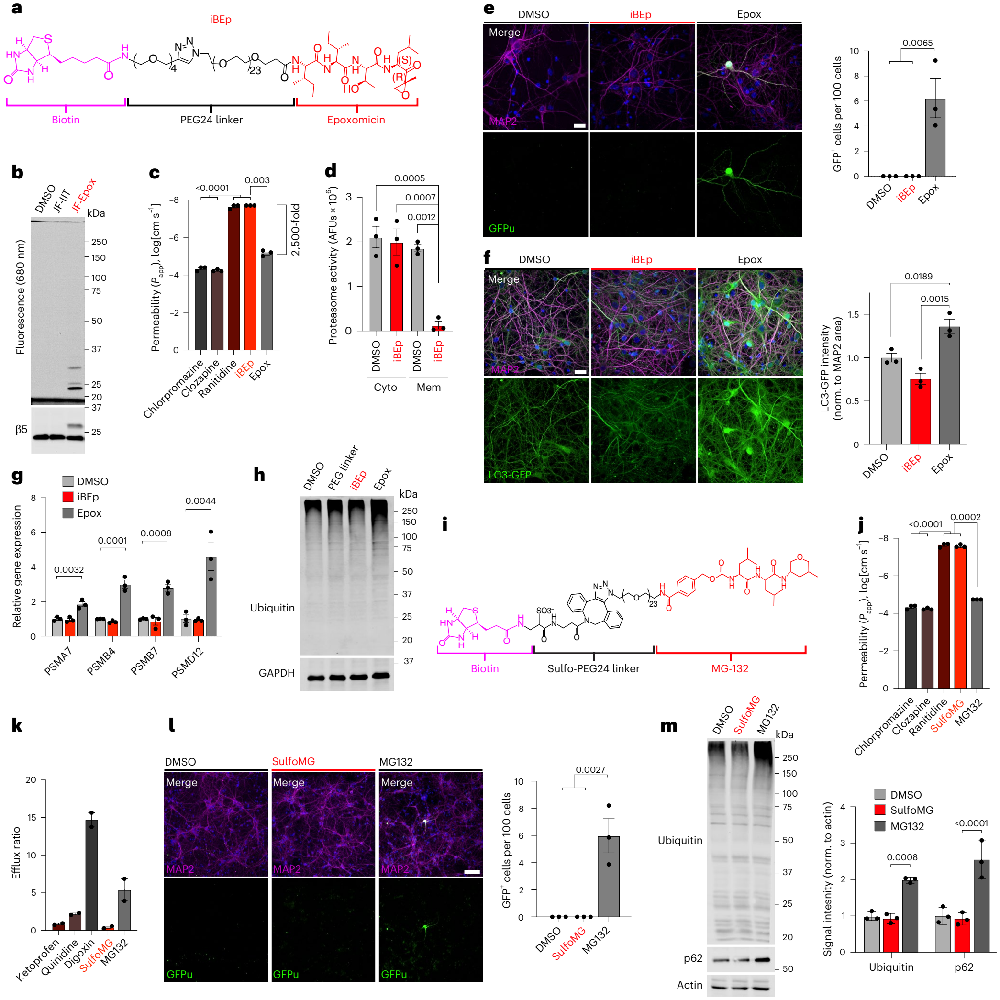

Fig. 1 | Development of selective neuroproteasome inhibitors. a, Structure of neuroproteasome-specific inhibitor iBEp. b, Lysates treated with indicated compounds. Note only three subunits bound by JF-Epox corresponding to covalent modification of proteasome subunits. Note the lack of off-targets, highlighting specificity retained by N-terminal PEGylated epoxomicin derivatives, supported by MS analyses in Supplementary Table 1. c–h, Orthogonal measures of permeability of iBEp compared to epoxomicin. c, PAMPA assay to test physiochemical permeability of molecules. N = 3 biological replicates. d, Proteasome catalytic activity of membrane and cytosolic fractions of primary neurons treated with iBEp. N = 3 biological replicates. e, GFPu degradation assay to measure turnover of unstable GFP. Day in vitro (DIV) 14 primary neurons transfected with ubiquitin-proteasome reporter GFPu treated with indicated drugs. Number of GFP-positive cells per 100 cells quantified. Each biological replicate is plotted. n = 6 regions imaged per replicate; N = 3 biological replicates. Scale bars, 25 µm. f, LC3-GFP analysis to visualize autophagosome formation. DIV14 primary hippocampal neurons from LC3-GFP transgenic mice treated with indicated drugs. LC3-GFP signal normalized to MAP2 area plotted. Individual biological replicates are plotted. n = 6 regions imaged per replicate; N = 3 biological replicates. Scale bar, 25 µm. g, qPCR-based measurement of proteasome bounceback following iBEp or epoxomicin (Epox) treatment. Primary DIV14 neurons treated with indicated drugs. Relative gene expression is plotted. N = 2 biological replicates. h, Immunoblots of primary WT neurons treated with DMSO, biotin-PEG24-azide linker, iBEp or epoxomicin. i, Structure of SulfoMG. j, PAMPA assay of validated compounds and test compounds SulfoMG and MG132 over 24 h. N = 3 biological replicates. k, MDCK assay with indicated compounds over 24 h. N = 2 biological replicates. l, Micrographs from DIV14 primary WT hippocampal neurons transfected with ubiquitin-proteasome reporter GFPu and treated with indicated drugs, with quantification to the right. N = 3 biological replicates. Scale bar, 100 µm. m, Immunoblots of lysates from DIV14 hTau-KI primary neurons treated with indicated compounds for 12 h and immunoblotted using indicated antibodies. LiCor-based quantification of p62 and ubiquitin intensities normalized to actin, plotted relative to DMSO. N = 3 biological replicates. For all plots, P values are indicated, and data are the mean ± s.e.m. and were analyzed by one-way analysis of variance (ANOVA) Tukey’s multiple-comparisons test. CFUs, colony-forming units.

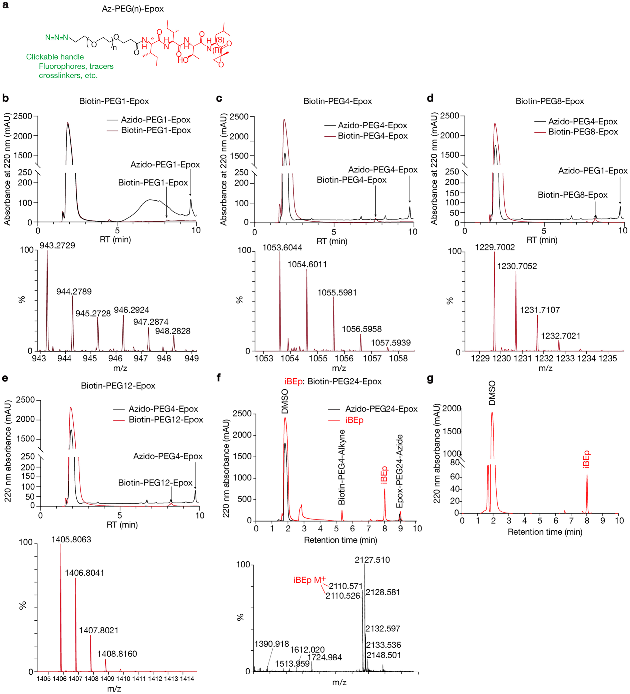

Extended Data Fig. 1 | Validation for synthesis of PEGylated Epoxomicin derivatives. a, Structure of Azide-PEG(n)-Epoxomicin handle to enable rapid conjugation of linkers to global proteasome inhibitor Epoxomicin using Click chemistry, b-f, HPLC analysis (above) and LC/MS spectra (below) for Biotin-PEG1-Epox (b), Biotin-PEG4-Epox (c), Biotin-PEG8-Epox (d), Biotin-PEG12-Epox (e), Biotin-PEG24-Epox (f), g, HPLC analysis of iBEp (Biotin-PEG24-Epox) after purification.

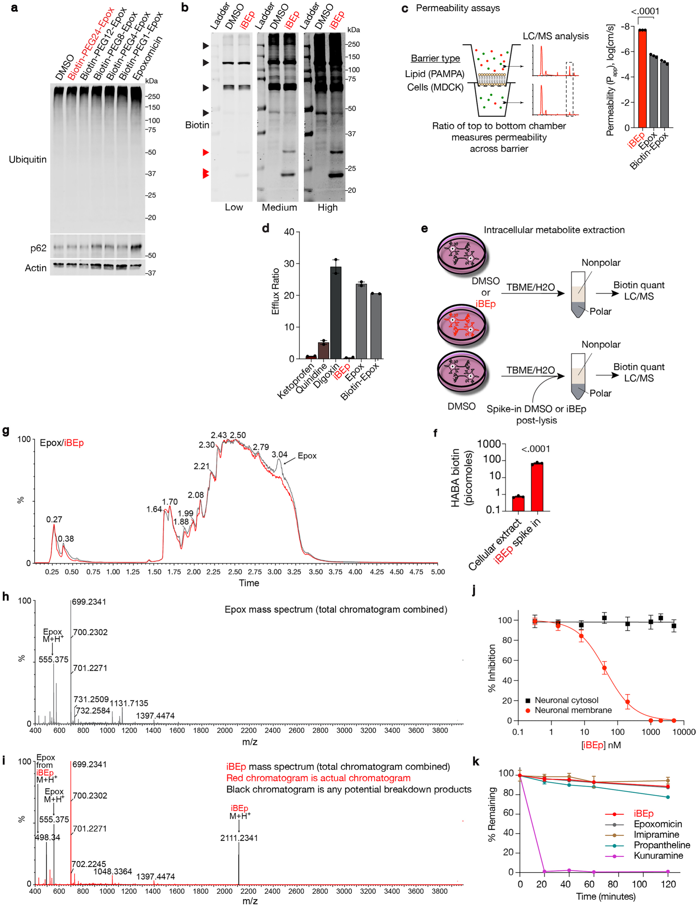

Extended Data Fig. 2 | iBEp is a cell impermeant proteasome inhibitor. a, Immunoblot of lysates from primary WT neurons treated with varying Biotin-PEG lengths coupled to Epoxomicin. Increases in ubiquitin conjugates are a hallmark of cytosolic proteasomal inhibition. p62 is a marker for autophagosomes which is transiently induced by proteasome inhibition. Note lack of both markers in Biotin-PEG24-Epox or Biotin-PEG12-Epox. b, Three exposures (Low, Medium, High) of immunoblot of lysates from primary neurons treated with DMSO or iBEp for 12 hours. Black arrowheads denote endogenous biotinylated proteins, Red arrowheads denote covalent modification of proteasome subunits with biotinylated epoxomicin (iBEp). Note there are only three bands differentially labeled between iBEp treatment and DMSO which correspond to correct MW of catalytic proteasome subunits. c, Schematic of assays to measure physiochemical properties of membrane permeability of compounds. Parallel artificial membrane permeability assay (PAMPA) and Madin-Darby Canine Kidney (MDCK) assay. LC/MS sensitivity of assay is 1 pg. Data are mean +/- SEM. N = 3 biological replicates. d, MDCK assay with indicated compounds for 24 hours. Data are mean +/- SEM. N = 3 biological replicates \*\*\*p < 0.001 by One-Way ANOVA e, Schematic for intracellular metabolite extractions from neurons treated with indicated inhibitors. f, Biotin quantification by HABA of extracted intracellular metabolites after compound treatment. Spike in indicated where compound is spiked into lysate prior to processing to establish positive control. Data are mean +/- SEM. \*\*\*\*p < 0.0001 Paired two tailed T-test. g, LC chromatogram of metabolites extracted from DIV14 cortical neurons from WT mice treated with Epoxomicin (black) or iBEp (red) for 12 hours. Note peak in Epox treated cells corresponds to Epoxomicin, no iBEp peak is identified. h, LC/MS spectra of metabolites extracted from DIV14 cortical neurons from WT mice treated with Epoxomicin, note mass corresponding to Epoxomicin identified in spectrum. i, LC/MS spectra of metabolites extracted from DIV14 cortical neurons from WT mice treated with iBEp, experimental spectra from iBEp treated neurons in red, expected spectra of indicated compounds overlaid in Black onto iBEp spectrum to emphasize lack of breakdown products or intact iBEp inside neurons. Epox from iBEp is expected cleavage product if iBEp were to be cleaved at amide bond linking Epoxomicin peptide to PEG linker. j, Proteasome catalytic activity assays of membrane (red) and cytosolic (black) fractions treated with a dose curve of iBEp. Catalytic activity was assessed by monitoring degradation of Suc-LLVY-AMC. N = 3 replicates. k, Indicated compounds incubated with mouse brain extracts and measured over time by LC/MS for degradation and stability.

Previous work used N-terminal biotinylated epoxomicin (Biotin-Epox) to target proteasome subunits16. Reasoning that neuroproteasomes are exposed extracellularly11, we hypothesized that introducing a hydrophilic PEG linker between biotin and epoxomicin’s N terminus would drastically reduce cell permeability17, thereby rendering the inhibitor selective for neuroproteasomes. Initial screening identified impermeant biotin-PEG24-epoxomicin (iBEp; Fig. 1a and Extended Data Figs. 1a–g and 2a) as a lead candidate. iBEp selectively targets catalytic proteasome subunits, confirmed by fluorescent labeling with a Fluor-conjugated PEG24-epoxomicin and liquid chromatography–mass spectrometry (LC–MS)-based identification of iBEp-bound targets after streptavidin enrichment in primary mouse neurons and mouse brain (Fig. 1b, Extended Data Fig. 2b and Supplementary Table 1).

We extensively validated iBEp’s cell impermeability using multiple assays. iBEp showed no detectable permeability in the highly sensitive PAMPA-BBB assay18, being at least 2,500-fold less permeable than epoxomicin (Fig. 1c and Extended Data Fig. 2c). We also observed no iBEp permeability in the MDCK-MDR1 assay19 (Extended Data Fig. 2d) or into primary mouse neurons assessed by both biotin detection (Extended Data Fig. 2e,f) and LC–MS-based metabolite profiling (1 pmol and 1 pg limit of detection, respectively; Extended Data Fig. 2e–i). Importantly, iBEp added to primary mouse neurons selectively inhibited proteasomes in the membrane fraction but not the cytosol, confirming its activity at the target location (Fig. 1d and Extended Data Fig. 2g–j). LC–MS analyses also confirmed that iBEp is stable and is not cleaved in mouse brain or in neurons (Extended Data Fig. 2h–k).

Consistent with its impermeability, iBEp did not elicit conventional cellular responses to cytosolic proteasome inhibition, despite being an active inhibitor. Unlike epoxomicin, iBEp treatment did not cause accumulation of the ubiquitin-proteasome reporter GFPu20 (Fig. 1e), induce an increase in LC3-GFP levels21 (an indicator of autophagosome formation; Fig. 1f), trigger the proteasome bounceback response22 (Fig. 1g) or increase total intracellular ubiquitin conjugates or p62 levels23 in primary neurons (Fig. 1h and Extended Data Fig. 2a). Altogether, our extensive characterization of iBEp shows that it is a specific, stable, active and cell-impermeable neuroproteasome inhibitor.

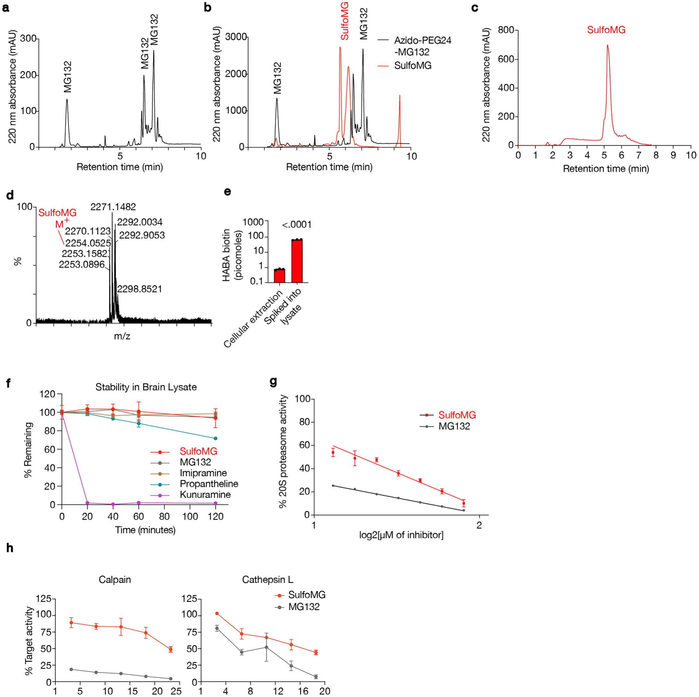

Extended Data Fig. 3 | SulfoMG is a reversible and cell-impermeant proteasome inhibitor. a, HPLC analysis of MG132-PEG24-Azide. b, Overlay of HPLC chromatograms of MG132-PEG24-Azide (black) and the overnight reaction between MG132-PEG24-Azide and DBCO-Sulfo-Link-Biotin (red). Note peaks emerging at 5.5 and 6 minutes corresponding to the formation of Sulfo-MG132 (SulfoMG). c, HPLC analysis of SulfoMG after purification. d, LC/MS spectrum of purified SulfoMG. Expected mass of SulfoMG (2254.0525) is observed. Other peaks correspond to adducts resulting from LC/MS ionization in the spectrometer. e, Biotin quantification by HABA of extracted intracellular metabolites after compound treatment. Spike in indicated where compound is spiked into lysate prior to processing to establish positive control. Data are mean +/- SEM. N = 3 biological replicates \*\*\*\*p < 0.0001 two tailed Student T-test. f, Indicated compounds incubated with mouse brain extracts and measured over time by LC/MS for degradation and stability. Data are mean +/- SEM. N = 2 biological replicates. g, Proteasome catalytic activity assays comparing inhibitory effects of a dose curve of SulfoMG (red) and MG132 (black). Data are mean +/- SEM. h, Calpain and Cathepsin L catalytic activity assays comparing inhibitory effects of a dose curve of SulfoMG (red) and MG132 (dark gray). Data are mean +/- SEM. N = 3 biological replicates.

To corroborate these findings with an independent tool, we developed Sulfo-MG132 (SulfoMG), modifying the reversible inhibitor MG132 (ref. 14), with a membrane-impermeant sulfonated biotin linker (Fig. 1i and Extended Data Fig. 3a–d). Physiochemical and cellular assays confirmed SulfoMG is also membrane impermeant, stable and active (Fig. 1j–m and Extended Data Fig. 3e–g). Biotin pulldowns to reveal SulfoMG-bound proteins revealed the catalytic proteasome subunits as well as some off-targets of MG132 (for example, calpains24; Supplementary Table 1). However, since these are all cytosolic targets, and SulfoMG is cell impermeable and less potent than MG132 (Extended Data Fig. 3g,h), we suggest that there are no off-targets of SulfoMG in intact cells.

### Neuroproteasome inhibition induces endogenous sarkosyl-insoluble tau aggregates

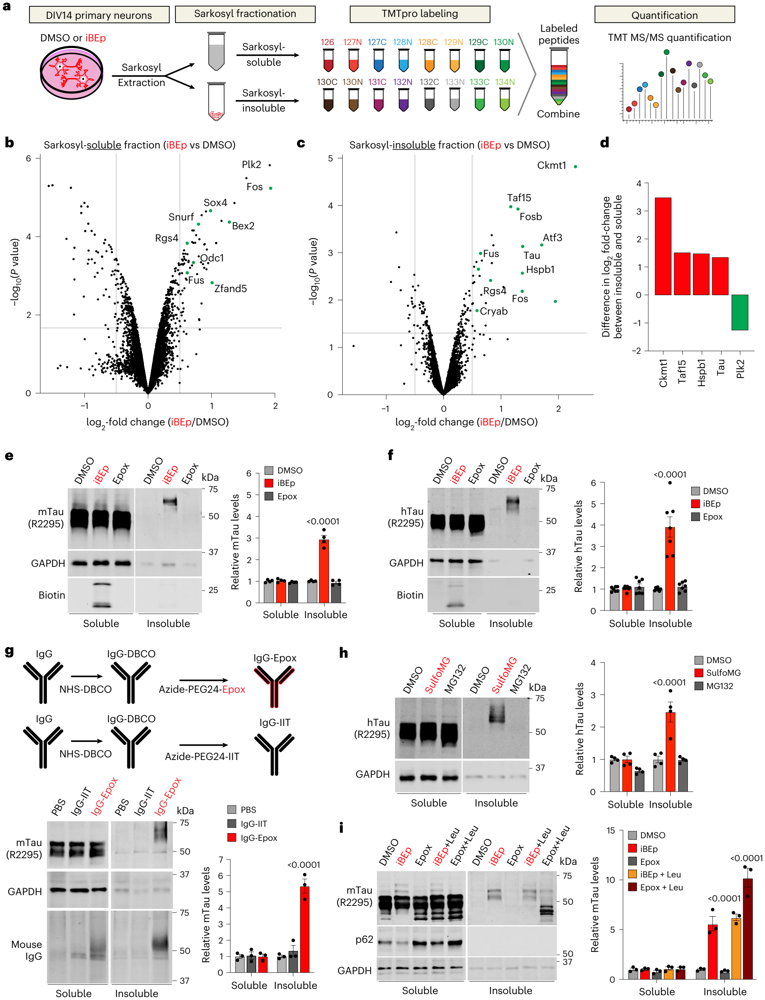

Fig. 2 | Neuroproteasome inhibition drives formation of sarkosyl-insoluble tau in primary neurons. a, Schematic to analyze changes in sarkosyl-soluble and insoluble proteomes in response to neuroproteasome inhibition. b, Differential enrichment of proteins in the sarkosyl-soluble fraction of neurons treated with iBEp versus DMSO was analyzed and plotted as log2-fold change versus −log10(P value). Green dots represent selected proteins enriched in the iBEp treatment compared to DMSO treatment. c, Differential enrichment of proteins in the sarkosyl-insoluble fraction of primary neurons treated with iBEp versus DMSO. Green dots represent selected proteins enriched in iBEp treatment. d, Identification of proteins exclusively enriched in the insoluble fraction with no corresponding change in the soluble fraction (red). Proteins plotted as differences in log2-fold changes between iBEp insoluble and iBEp soluble. e, Sarkosyl fractionation of primary mouse WT neurons treated with iBEp or Epox. Sarkosyl-soluble and sarkosyl-insoluble fractions immunoblotted using the indicated antibodies. LiCor-based quantification of relative tau levels was calculated as follows: soluble and insoluble tau intensities were normalized to respective soluble GAPDH intensity. All tau levels were plotted relative to DMSO in either the soluble or the insoluble fraction. N = 4 biological replicates. f, Sarkosyl fractionation of primary hTau-KI neurons treated with iBEp or Epox. Sarkosyl-soluble and sarkosyl-insoluble fractions immunoblotted using the indicated antibodies. LiCor-based quantification of relative hTau levels. N = 7 biological replicates. g, Sarkosyl fractionation of primary WT neurons treated with alternative inhibitor IgG-Epox. Top, Schematic of coupling epoxomicin or PEG24 linker to IgG. Bottom, Sarkosyl-soluble and sarkosyl-insoluble fractions immunoblotted using indicated antibodies. LiCor-based quantification of relative tau levels. N = 3 biological replicates. h, Sarkosyl fractionation of primary hTau-KI neurons treated with alternative reversible inhibitor SulfoMG or MG132. Sarkosyl-soluble and sarkosyl-insoluble fractions immunoblotted using indicated antibodies. LiCor-based quantification of relative tau levels. Data (right) are the mean ± s.e.m. N = 4 biological replicates. i, Immunoblots of sarkosyl fractionations from DIV14 primary neurons treated with indicated compounds for 12 h. Sarkosyl-soluble and sarkosyl-insoluble fractions immunoblotted using indicated antibodies. LiCor-based quantification of relative tau levels. N = 3 biological replicates. All data are the mean ± s.e.m. and were analyzed by one-way ANOVA Tukey’s multiple-comparisons test.

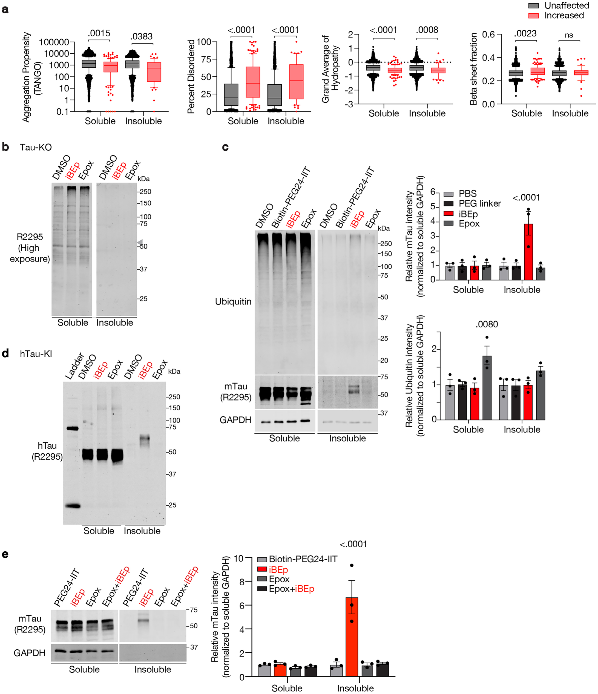

Extended Data Fig. 4 | Neuroproteasome inhibition induces accumulation of endogenous sarkosyl-insoluble Tau in primary neurons. a, Analysis of biophysical characteristics of soluble or insoluble proteome from neurons treated with iBEp relative to controls. Proteins which are unaffected between iBEp and DMSO in gray and increased in iBEp in red. Box plots show the median (center line), the interquartile range (25th-75th percentiles plotted as the box), with whiskers representing the 10th and 90th percentiles. Data analyzed by two-tailed Unpaired T-test. b, Sarkosyl fractionation of primary neurons from Tau knockout (Tau-KO) immunoblotted using R2295 antibody against total Tau. Neurons treated with indicated compounds and subjected to sarkosyl fractionation. We do not observe any signal at the expected molecular weight for Tau as indicated by the gray arrowhead. c, Immunoblots of sarkosyl soluble and insoluble fractions from primary WT neurons treated with DMSO, Biotin-PEG24-Azide linker, iBEp, or Epoxomicin. Relative Tau levels calculated as follows: Soluble and insoluble Tau intensities were normalized to respective soluble GAPDH intensity. All Tau levels plotted relative to DMSO in either soluble or insoluble fraction. Data are mean ± SEM, N = 4 biological replicates, \*\*\*\*p < 0.0001 by One-Way ANOVA Tukey’s Multiple Comparison Test. d, Full-length blot from Fig. 2e to demonstrate molecular weight of sarkosyl-insoluble Tau species formed following neuroproteasome inhibition with iBEp (red), compared to Epoxomicin (Epox) or DMSO controls. e, Sarkosyl fractionation of primary neurons treated with indicated compounds. Epox + iBEp co-treatement indicated. Relative Tau levels calculated and plotted compared to inactive scaffold. N = 3 biological replicates, \*\*\*\*p < 0.0001 by One-Way ANOVA Tukey’s Multiple Comparison Test.

To investigate the functions of neuroproteasomes in proteostasis, we treated primary mouse neurons with iBEp and identified proteins in detergent-soluble and detergent-insoluble fractions, representing soluble and aggregated species, by quantitative Tandem Mass Tag (TMT) proteomics (Fig. 2a). Neuroproteasome inhibition caused only 52 proteins to become significantly enriched in the sarkosyl-insoluble fraction, compared to over 250 proteins increasing in the soluble fraction (Fig. 2b,c, Extended Data Fig. 4a and Supplementary Table 2). Because of the potential importance of failed protein degradation resulting in protein aggregate formation without changing total protein levels, we identified proteins that showed significant and greater than log2-fold increases in the insoluble fraction with no change in the soluble fraction. This revealed only four proteins: Ckmt1, tau, Taf15 and Hspb1 (Fig. 2d). Notably, aggregated tau is a primary hallmark of AD, while Taf15 and Ckmt1 have been linked to tau tangles25,26.

Based on these data, we sought to test whether neuroproteasome inhibition indeed drives formation of endogenous sarkosyl-insoluble tau aggregates. We first confirmed a substantial increase in sarkosyl-insoluble tau upon iBEp treatment in primary mouse neurons by immunoblot (Fig. 2e). No such signal was seen in neurons obtained from tau-knockout (KO) mice (Extended Data Fig. 4b) or following treatment with the inactive iBEp analog biotin-PEG24-IleIleThr (identical to iBEp but lacking the active site epoxyketone warhead; Extended Data Fig. 4c), confirming specificity. Neuroproteasome inhibition similarly induced sarkosyl-insoluble aggregation of human tau in primary neurons from hTau-knockin (hTau-KI) mice (Fig. 2f and Extended Data Fig. 4d), which express all six human tau isoforms at endogenous levels without mutations27. As an orthogonal means of testing whether neuroproteasome inhibition could induce the accumulation of sarkosyl-insoluble tau, we coupled PEG24-epoxomicin with normal mouse immunoglobulin (IgG), which is too large and hydrophilic to penetrate across the plasma membrane (Fig. 2g). Similarly to iBEp, we found that IgG-Epox induces the accumulation of sarkosyl-insoluble tau in primary WT mouse neurons, compared to IgG-PEG24-IleIleThr (IgG-Epox without epoxyketone warhead) alone (Fig. 2g). Finally, we found that SulfoMG induces similar partitioning of hTau into the sarkosyl-insoluble fraction as iBEp in primary hTau-KI neurons (Fig. 2h).

Neuroproteasome inhibition by iBEp and SulfoMG induces tau aggregation, while total proteasome inhibition with the cell-permeant parent compounds epoxomicin and MG132 does not28,29, despite epoxomicin and MG132 inhibiting both cytosolic and neuroproteasomes. We hypothesized that cytosolic proteasome inhibition induces a compensatory response, which may clear inclusions. Consistent with this, co-treatment of iBEp and epoxomicin together does not induce insoluble tau, compared to iBEp alone (Extended Data Fig. 4e). We considered that cytosolic proteasome inhibition, and not neuroproteasome inhibition, resulted in compensation by the autophagy/lysosomal degradation system28–30 (Fig. 1f,m). Supporting our hypothesis, we found sarkosyl-insoluble tau from neurons co-treated with the lysosomal protease inhibitor leupeptin together with epoxomicin (Fig. 2i). We interpret these findings to mean that the lysosome is involved in clearing aggregates when cytosolic proteasomes are inhibited, thereby explaining why epoxomicin masks neuroproteasome inhibition-induced tau aggregate formation.

### Neuroproteasome inhibition-induced tau aggregates are PHFs

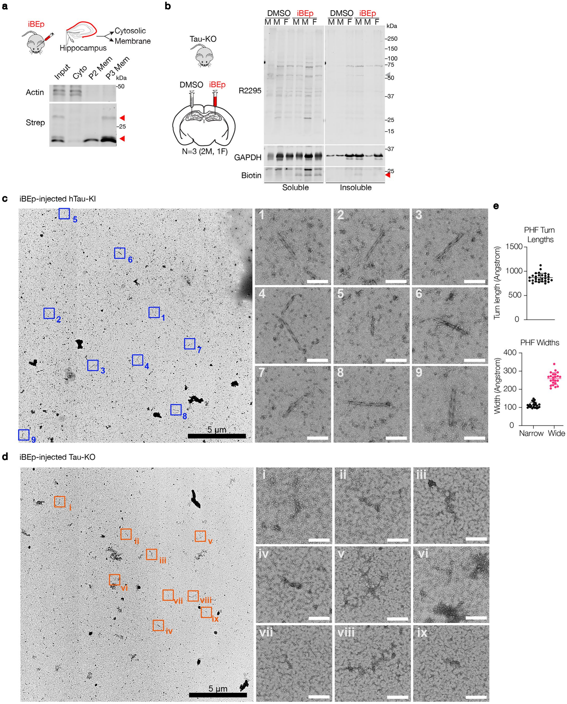

Extended Data Fig. 5 | Neuroproteasome inhibition induces formation of endogenous PHFs in vivo. a, Immunoblots of membrane and cytosolic fractions of hippocampi from mice stereotactically injected with iBEp ipsilaterally or DMSO controls contralaterally. b, Immunoblots of sarkosyl-soluble and insoluble fractions of hippocampi from Tau-KO mice stereotactically injected with iBEp ipsilaterally or DMSO controls contralaterally. N = 3 (2 M, 1 F) c,d, Sarkosyl-insoluble fractions of hippocampi injected with iBEp from either hTau-KI (c) or Tau-KO (d) mice. Low magnification image scale bar is 5 µm, high magnification is 200 nm. Despite extensive searching, no fibrils were observed in Tau-KO mice even after 3-fold concentration of samples. All fibre-like densities from Tau-KO animals appeared as protein clusters lacking helical characteristics when examined at high magnification. Similar results obtained from at least N = 3 independent animals. e, Quantification of fibril lengths and widths, n=27 individual fibrils across multiple squares and grids.

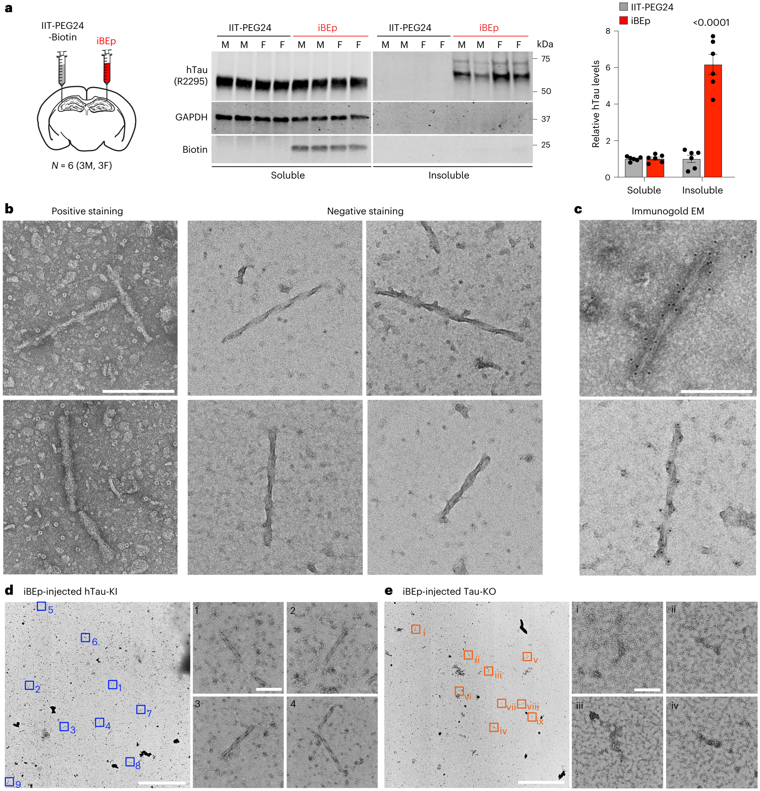

Fig. 3 | Neuroproteasome inhibition drives formation of endogenous tau PHFs in vivo. a, Immunoblots of sarkosyl-soluble and sarkosyl-insoluble fractions from hTau-KI mice stereotactically injected with iBEp ipsilaterally and IIT-PEG24-biotin contralaterally into CA1 of the hippocampus. Relative tau levels were calculated as follows: Soluble and insoluble tau intensities were normalized to respective soluble GAPDH intensity. All tau levels were plotted relative to inactive scaffold in either the soluble or the insoluble fraction. Data (right) are the mean ± s.e.m. N = 6 biological replicates (3 male, 3 female) analyzed by two-tailed paired t-test. b, Sarkosyl-insoluble fractions of hippocampi injected from iBEp-injected mice analyzed by negative-stain electron microscopy (EM). Two examples of positive staining effect (left) and four examples of negative staining (right) are shown. c, Fractions from b stained using anti-tau antibodies conjugated to 6-nm gold beads. d,e, Sarkosyl-insoluble fractions of hippocampi injected with iBEp from either hTau-KI (d) or tau-KO (e) mice. Scale bars, 5 µm (low-magnification image) and 200 nm (high-magnification image). Nine examples of fibrils corresponding to PHFs are highlighted (remainder of the insets in Extended Data Fig. 5c) and are abundantly present throughout the low magnification image. Despite extensive searching, no fibrils were observed in tau-KO mice even after 3-fold concentration of samples. All fiber-like densities (nine examples highlighted) in tau-KO samples lack helical characteristics at high magnification (remainder of insets in Extended Data Fig. 5d). Similar results were obtained from three separate experiments with N = 4 animals each.

Next, we examined whether neuroproteasome inhibition would induce the formation of sarkosyl-insoluble endogenous tau aggregates in vivo. Here, we stereotactically injected iBEp into the mouse hippocampus, a region that displays robust tau pathology in humans with AD and shows some of the earliest pathology in AD31. Based on membrane fractionation of hippocampal tissues, we did not detect permeability of iBEp in vivo (Extended Data Fig. 5a). iBEp injection resulted in a substantial induction of sarkosyl-insoluble tau in hippocampi from hTau-KI mice (Fig. 3a). There was no detectable signal in iBEp-injected hippocampi from tau-KO mice (Extended Data Fig. 5b).

AD-relevant tau aggregates are sarkosyl-insoluble tau PHFs as determined by electron microscopy32. To characterize the insoluble tau formed upon neuroproteasome inhibition, we analyzed sarkosyl-insoluble fractions of hippocampi from mice following 72 h of iBEp injection by electron microscopy. Depending on the staining protocol, we obtained both positively and negatively stained samples (Fig. 3b). Twisted filaments resembling PHFs were readily apparent by negative-stain electron microscopy analyses (Fig. 3b). As a demonstration, nine examples of filament-like structures were chosen from low-magnification images and highlighted, though many more examples are easily observable in these preparations, as seen in low magnification images (Fig. 3d and Extended Data Fig. 5c). These were confirmed to be tau PHFs by immunogold electron microscopy (Fig. 3c). We did not detect any straight filaments in our preparations. No twisted filaments could be detected in samples obtained from tau-KO animals, despite exhaustive searching at low and high magnification (Fig. 3d,e and Extended Data Fig. 5c,d). The maximal width of the tau PHFs formed by neuroproteasome inhibition was 25.9 nm ± 3.3 nm, while the crossover spacing was 87 nm ± 8.8 nm (Extended Data Fig. 5e).

Together, these results establish that neuroproteasome inhibition is sufficient to trigger the formation of PHFs from endogenous tau in the absence of genetic lesions or overexpression.

### Neuroproteasome inhibition-induced tau aggregates have AD-like features

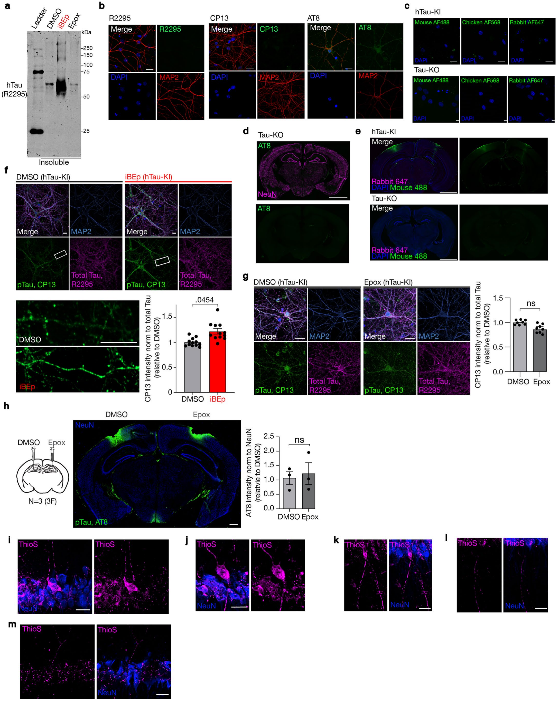

Extended Data Fig. 6 | Neuroproteasome inhibition-induced Tau aggregates have AD-like features. a, Full-length immunoblot demonstrating high molecular species of sarkosyl-insoluble Tau species formed following neuroproteasome inhibition with iBEp (red), compared to Epoxomicin (Epox) or DMSO controls. N = 7 biological replicates. b, Micrographs of DIV14 primary hippocampal neurons obtained from Tau knockout (Tau-KO) mice stained using indicated antibodies and DAPI. Scale bars=20 µm. c, Micrographs of DIV14 primary hippocampal neurons from hTau-KI (top) and Tau-KO (bottom) mice stained using only secondary antibodies as indicated. Scale bars=20 µm. d, Micrographs of hippocampal sections obtained from Tau-KO mice stained using indicated antibodies. Scale bars=1 mm. e, (top) Micrographs of hippocampal sections obtained hTau-KI mice stereotactically injected bilaterally and stained with secondary antibodies alone. Note staining of injection site at cortex, indicating damage, but no signal in hippocampus. (bottom) Micrographs of hippocampal sections from Tau-KO mice stained using indicated secondary antibodies. Scale bars=1 mm. (b-e) replicated in at least three independent cultures or mice f, Micrographs of DIV14 primary hippocampal neurons obtained from hTau-knock-in (hTau-KI) mice treated with indicated drugs for 12 hours and stained using indicated antibodies. Quantification of pTau signal intensity was normalized to total Tau. Data are mean ± SEM normalized to DMSO. N = 3 biological replicates, n = 4 images/replicate, analyzed by two-tailed Paired T-test. Scale bars=15 µm. g, Experiment as in (f) but with Epoxomicin. N = 2 biological replicates, n = 4 images/replicate), data are mean +/- SEM. h, Micrographs of sections from hTau-KI mice stereotactically injected Epoxomicin ipsilaterally and DMSO contralaterally. Quantification of pTau signal intensity was normalized to NeuN counts. Analysis was done blinded to experimental condition. Data are mean ± SEM normalized to DMSO. N = 3 independent animals, n = 2 sections/animal, Scale bars=500 µm. p > 0.05 by two-tailed Paired T-test. i-m, Representative micrographs of flame-like and thread-like Thioflavin-S positive aggregates from experiment in Fig. 4d, seen in each of N = 7 independent animals. Scale bar=20 µm.

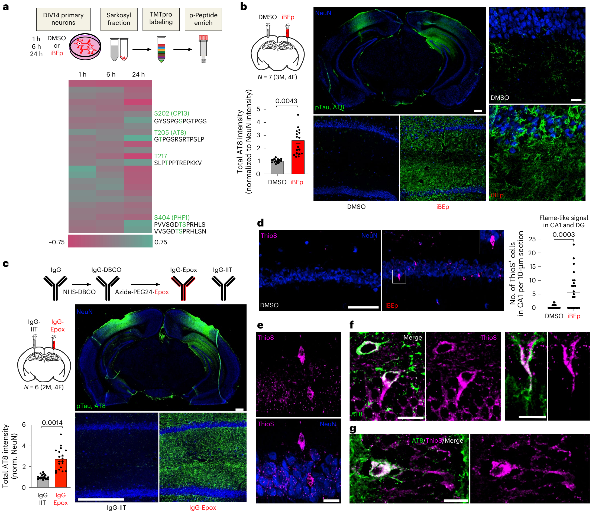

Fig. 4 | Neuroproteasome inhibition-induced aggregates have AD-like features. a, Top, Schematic of experimental setup for phosphoproteomics. Bottom, Quantitative phosphoproteomics from primary WT neurons treated with iBEp. Heat map displays all identified tau phosphopeptides and their relative depletion (pink) or enrichment (green) compared to DMSO controls at indicated time points. Phosphopeptides enriched in iBEp-treated neurons in green. b, Immunohistochemical analysis of mice stereotactically injected with iBEp to measure tau phosphorylation in vivo. hTau-KI mice stereotactically injected into CA1 of the hippocampus with iBEp ipsilaterally and DMSO injected contralaterally. Mice were collected 72 h after injection and sections were stained using the indicated antibodies: NeuN (blue) and AT8 (pTau, green). Quantification of total AT8 signal intensity in hippocampus per section normalized to NeuN counts in that section. Analysis was done blinded to experimental condition. N = 7 (3 male, 4 female) independent animals. n = 2–3 sections per animal. Scale bars, 500 µm (top) and 25 µm (bottom). c, Immunohistochemical analysis of mice stereotactically injected with orthogonal inhibitor IgG-Epox to measure tau phosphorylation in vivo. Experiment conducted identically to b but with stereotactic injection of IgG-Epox ipsilaterally and IgG-PEG24 contralaterally. N = 6 (2 male, 4 female) independent animals. n = 2–3 sections per animal. d, ThioS staining (to mark β-sheet-containing aggregates) of sections from mice stereotactically injected with iBEp. Conditions were identical to c but stained with ThioS and NeuN. N = 7 (3 male, 4 female) independent animals. Inset shows a representative example of flame-like ThioS-positive inclusion in iBEp-treated hippocampus. Data show the quantification of the number of flame-like ThioS-positive inclusions in CA1 per section. N = 7 (3 male, 4 female) animals, n = 2–3 sections per animal. Counting and analysis was blinded to experimental condition. Scale bars, 100 µm. e, Higher-magnification image of flame-like ThioS-positive inclusions (magenta), NeuN (blue). Top, ThioS alone; Bottom, merge with NeuN. Scale bar, 20 µm. f,g, Single z-plane micrographs of sections from iBEp-injected mice co-stained with ThioS (magenta) and AT8 (green); overlap appears white. Panel f contains two representative examples of flame-like ThioS-positive inclusions, while g displays a representative example of thread-like inclusions. Scale bar, 20 µm. All data are the mean ± s.e.m. analyzed by paired two-tailed t-test. DG, dentate gyrus.

Neuroproteasome inhibition induces a shift of sarkosyl-insoluble tau that migrates at a higher molecular weight on an SDS–PAGE gel, at approximately 64 kDa (Fig. 2e–i and Extended Data Figs. 4c,d and 6a). Similar shifts in molecular weight of tau are observed in the AD brain and are a hallmark phenotype of multiple neurodegenerative disorders33, likely reflecting tau phosphorylation. Using quantitative phosphoproteomics we find a time-dependent increase in tau phosphorylation after iBEp treatment of primary mouse neurons at 4 of 26 identified sites, which correspond to human Ser202, Thr205, Thr217 and Ser404 (Fig. 4a and Supplementary Table 3). These sites are established markers of phosphorylated tau in the human AD brain4.

To validate these data, we performed immunostaining for phosphorylated tau in either hTau-KI neurons treated with iBEp or sections from hTau-KI mice stereotactically injected with iBEp. hTau-KI mice were stereotactically injected with iBEp and contralaterally injected with vehicle control. We validated the specificity of our antibodies and approach in both immunocytochemistry (Extended Data Fig. 6b,c) and immunohistochemistry (Extended Data Fig. 6d,e). Tau phosphorylation at Ser202/Thr205 was markedly elevated in iBEp-treated primary hTau-KI neurons (Extended Data Fig. 6f) and in hippocampi from mice injected with iBEp compared to the contralateral dimethylsulfoxide (DMSO) controls (Fig. 4b). We observed AT8+ (phospho-Ser202/Thr205) signal mislocalized to somatodendritic compartments in iBEp-injected hippocampi, which extend into the stratum radiatum and stratum moleculare (Fig. 4b). No tau Ser202/Thr205 phosphorylation was detectable in epoxomicin-treated primary neurons (Extended Data Fig. 6g) or in hTau-KI mice injected with epoxomicin compared to contralateral controls (Extended Data Fig. 6h). We reproduced the increase in mislocalized AT8+ dendrites in hTau-KI mice stereotactically injected with IgG-Epox compared to contralateral IgG-PEG24 controls (Fig. 4c).

Thioflavin S (ThioS) stains β-pleated sheets, including aggregated tau tangles and β-amyloid plaques. We conducted ThioS staining of sections from hTau-KI mice stereotactically injected with iBEp and contralaterally injected with vehicle control. After 72 h, we find a strong increase in ThioS staining from the CA1 region of hippocampi exposed to iBEp relative to contralateral controls (Fig. 4d). ThioS-positive aggregates appear as flame-like inclusions in both the CA1 pyramidal layer and the granule cell layer of the dentate gyrus (Fig. 4d,e and Extended Data Fig. 6i–k). Neuroproteasome inhibition-induced flame-like ThioS-positive aggregates colocalize with phosphorylated tau (AT8) in single z-plane images from neurons in the CA1 and dentate gyrus of the hippocampus (Fig. 4f,g). We also observed thread-like ThioS+ aggregates in the hippocampal neuropil (Fig. 4g and Extended Data Fig. 6i–m). Taken together with the biochemical and electron microscopy analyses, these results establish that neuroproteasome inhibition rapidly induces aggregation of endogenous tau into assemblies that resemble those observed in individuals with sporadic AD.

### Neuroproteasomes associate with ApoE

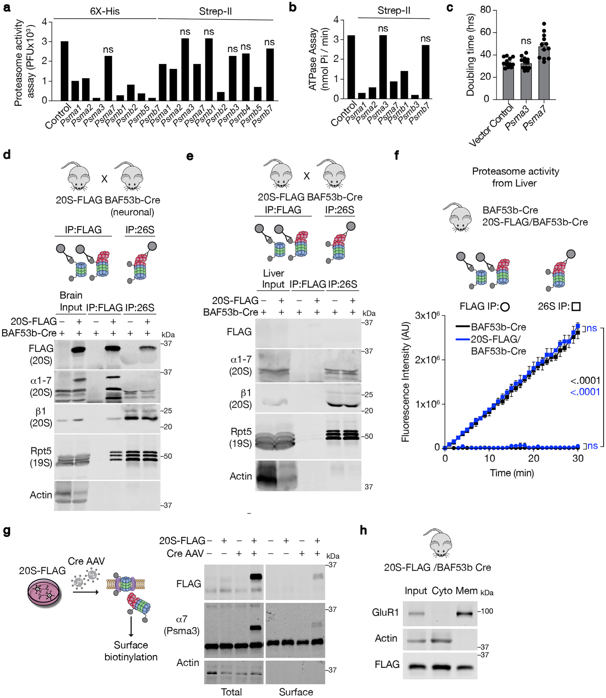

Extended Data Fig. 7 | Validation of endogenous Cre-dependent FLAG-tagged 20S proteasome transgenic line. a, Proteasome catalytic activity assay from lysates of HEK293 cells transfected with indicated genes and tags. ns, not significant from control, One-way ANOVA. b, Candidate hits from (a) subjected to ATPase assay. ns indicates p > 0.5, not significant from control, One-way ANOVA. N = 3 biological replicates. c, Candidates from (b) transfected into HEK293 cells and doubling time was measured and plotted, ns indicates p > 0.5, not significant from control, One-way ANOVA. Data are mean +/- SEM. N = 12 biological replicates. d, Immunoblots of proteasome immunopurifications from the cytosol of brains from 20S-FLAG/BAF53b-Cre mice. Immunoprecipitation (IP) using FLAG beads isolate FLAG-tagged 20S core particle as well as the 20S-containing 26S particle, whereas IP against the 19S only isolates 26S particles. FLAG and 26S IP from mouse brain cytosolic fractions immunoblotted using indicated antibodies. e, Proteasome purifications from the cytosol of livers from 20S-FLAG/BAF53b-Cre mice. Note, compare (d) which was done from brain cytosol. f, Catalytic activity of proteasomes isolated by 26S IP (squares) and FLAG IP (circles) from whole liver cytosol. Data are mean ± SEM from three replicates. \*\*\*\*p < 0.0001 by Two-Way ANOVA Tukey’s Multiple Comparison Test. N = 3 biological replicates. g, Immunoblots from surface biotinylation of primary neurons from 20S-FLAG mice transduced with Cre AAVs. Lysates (Total) and Streptavidin pulldowns (Surface) were immunoblotted using the indicated antibodies. h, Immunoblots of membrane fractionation of brains from 20S-FLAG/BAF53b-Cre mice. Lysates, cytosolic fraction, and membrane fraction immunoblotted using indicated antibodies.

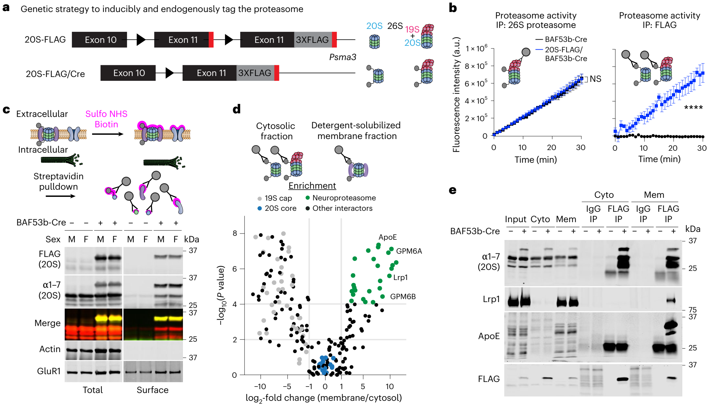

Fig. 5 | Neuroproteasomes associate with ApoE. a, Schematic for endogenous and conditional tagging of the 20S proteasome with FLAG tag. Top, Schematic of edited Psma3 gene locus, endogenous exon 11 flanked with loxP sites, and an insert containing 3x-FLAG-tagged exon 11 was inserted into the 3′ untranslated region of the gene. Transgene is referred to as 20S–FLAG. Right, Schematics of proteasome complexes: 20S and 26S (20S + 19S regulatory particle). b, Catalytic activity of proteasomes isolated from 20S–FLAG transgenic mice. Proteasomes isolated using 26S IP (left) or FLAG IPs (right) from BAF53b-Cre mice (black) or 20S–FLAG/BAF53b-Cre mice (blue). AMC fluorescence generated from proteasome-dependent cleavage of Suc-LLVY-AMC plotted. Data are the mean ± s.e.m. from N = 3 biological replicates, analyzed by two-way ANOVA Fisher’s least significant difference test. c, Immunoblots from surface biotinylation of hippocampi from 20S–FLAG mice alone or with BAF53b-Cre. Lysates (total) and streptavidin pulldowns (surface) immunoblotted using indicated antibodies. Merge indicates overlay (yellow) between FLAG (green) and α1–7 blots (red). Similar results were obtained from at least N = 3 independent animals. d, Co-IP and MS analysis of 20S–FLAG proteasomes from cytosolic and membrane-enriched fractions. Cytosolic and membrane fractions were prepared from whole brains of 20S–FLAG/BAF53b-Cre and immunoprecipitates (IPs) were isolated using anti-FLAG affinity beads. Samples were subjected to TMT labeling and quantitative MS. Differential levels of proteins enriched from FLAG pulldowns from membrane versus cytosol were analyzed and plotted as log2-fold change versus –log10(P value). Green dots represent proteins enriched in the membrane FLAG IP, blue dots represent 20S core subunits, and gray dots represent proteins in the 19S cap. e, Immunoblots of 20S–FLAG Co-IP from cytosolic and membrane fractions of 20S–FLAG alone (Cre−) or 20S–FLAG/ BAF53b-Cre (Cre+) mouse brain tissue (inputs). IgG alone (IgG IP) or FLAG antibody (FLAG IP) used for IP indicated. NS, not significant. \*\*\*\*P < 0.0001.

To understand whether neuroproteasomes are part of the mechanism for tau aggregation in neurodegenerative diseases such as AD, we sought to gain insights into how neuroproteasomes are regulated. After extensive screening (Extended Data Fig. 7a–c), we generated a conditional knockin 20S–FLAG transgenic mouse line into the endogenous Psma3 locus (Fig. 5a). We generated mice that expressed FLAG-tagged proteasomes selectively in neurons in a Cre-dependent manner (Extended Data Fig. 7d,e). The FLAG tag does not affect the catalytic activity of the 26S or 20S proteasome relative to controls (Fig. 5b and Extended Data Fig. 7f). Moreover, we found that mice expressing 20S–FLAG appear indistinguishable from WT littermates, confirming that the endogenous FLAG tag on Psma3 is inert. The 20S–FLAG was efficiently incorporated into the neuroproteasome, as determined by surface biotinylation experiments in primary neurons and hippocampal tissue from 20S–FLAG transgenic mice (Fig. 5c and Extended Data Fig. 7g). To identify neuroproteasome interactors, we extracted membrane proteins from plasma membrane-enriched fractions (Extended Data Fig. 7h) from 20S–FLAG/Baf53b-Cre34 mouse brains followed by FLAG affinity isolation to extract neuroproteasomes and TMT-based IP–MS (Fig. 5d). Sixty-four proteins were enriched in the neuroproteasome fraction and depleted in the cytosolic fraction, including enrichment of ApoE and its receptor Lrp1 (Fig. 5d and Supplementary Table 4). We focused on ApoE given that the APOE allele influences the risk for tau aggregation8,9,35. We did not observe other ApoE receptors35, such as ApoER2, VLDLR and LDLR, in our proteomics analysis. We validated these proteomic data by affinity isolating FLAG-tagged neuroproteasomes as well as cytosolic FLAG-tagged proteasomes and observed co-purification of ApoE and Lrp1 with the FLAG-tagged neuroproteasomes (Fig. 5e). We only observed ApoE and Lrp1 after immunoprecipitating against FLAG from Cre-positive membrane fractions and not from membrane fractions of transgene controls with no Cre expression, cytosolic controls from Cre-positve or Cre-negative brains, or in mock immunoprecipitations (IPs; Fig. 5e).

### ApoE isoforms differentially modulate neuroproteasome localization

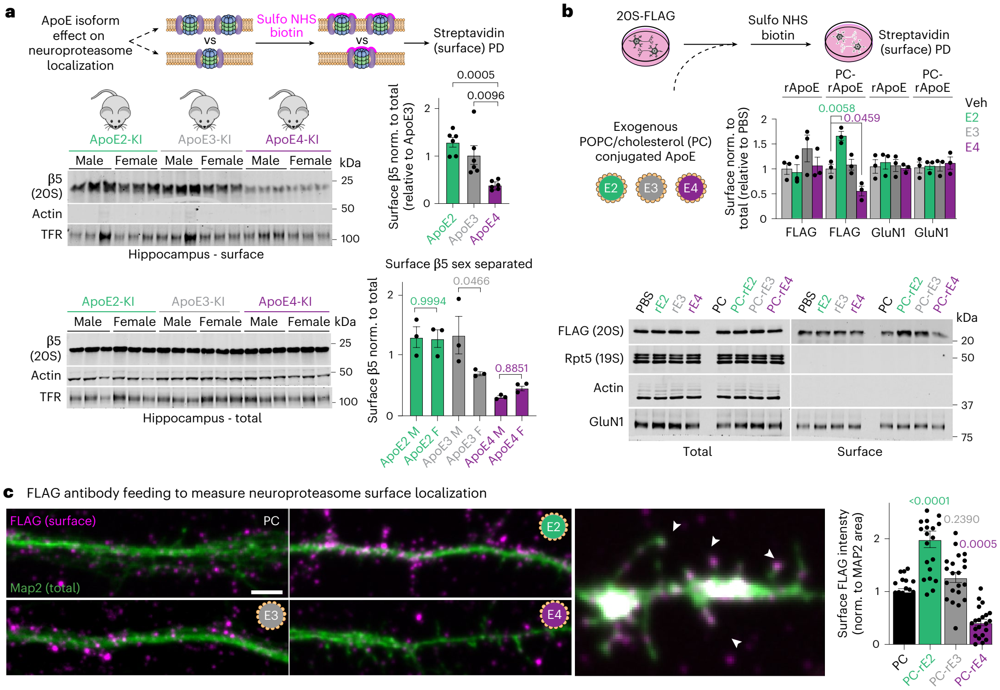

Fig. 6 | ApoE isoforms differentially modulate neuroproteasome localization. a, Surface biotinylation of hippocampi from hApoe-KI mice. Lysates (total) and streptavidin pulldowns (surface) were immunoblotted using indicated antibodies. Experimenters were blinded to genotype. LiCor-based quantification of surface β5 intensity was normalized to total β5 intensity. N = 6 biological replicates per genotype (3 male and 3 female independent mice). Data were normalized to ApoE3 KI intensity, analyzed by two-way ANOVA Fisher’s least significant difference test. b,c, Surface biotinylation (b) and antibody feeding (c) of 20S–FLAG neurons treated with exogenous ApoE lipoparticles. DIV16 primary neurons treated with recombinant ApoE isoforms (rE2, rE3, rE4) or PC-conjugated ApoE isoforms (PC-rE2, rE3 and rE4). b, Lysates (total) and streptavidin pulldowns (surface) were immunoblotted using indicated antibodies. LiCor-based quantification of surface FLAG and GluN1 intensities were normalized to corresponding total intensities. Data were normalized to corresponding vehicle control. N = 3 biological replicates. One-way ANOVA Tukey’s multiple-comparisons test. c, Neurons fed live with anti-FLAG antibodies (magenta) and subsequently stained with MAP2 (green). Quantification of surface FLAG fluorescence intensity was normalized to total MAP2 surface area. Data plotted relative to PC alone. N = 3 biological replicates, n = 21 quantified regions; one-way ANOVA Tukey’s multiple-comparisons test. Scale bar, 2 µm. All data are the mean ± s.e.m.

The most significant genetic risk factor for sporadic AD is the ApoE4 isoform of the APOE gene, while the ApoE3 isoform is neutral and the ApoE2 isoform is considered protective10. Given the connection between tau aggregation and ApoE carrier status, we examined whether ApoE isoforms could regulate neuroproteasomes. We obtained human ApoE isoform knockin mice that each express one of three fully humanized ApoE isoforms36. Surface biotinylation and immunoblotting revealed a strong reduction of neuroproteasome surface localization in the hippocampus of ApoE4 KI mice, compared to ApoE3 KI and ApoE2 KI mice (Fig. 6a).

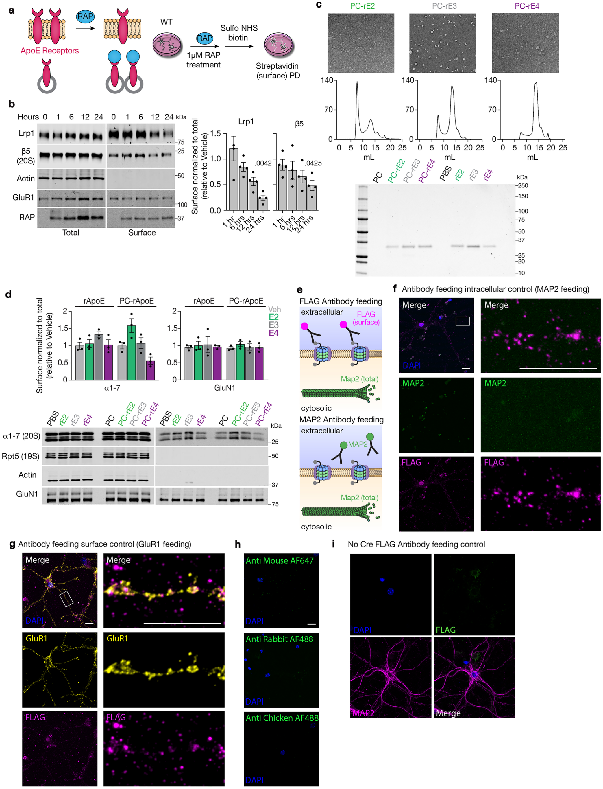

Extended Data Fig. 8 | ApoE isoforms differentially modulate neuroproteasome localization. a, Schematic of surface biotinylation of Receptor-Associated Protein (RAP)-treated neurons. Influence of RAP (blue) on surface ApoE receptors (light red) is depicted. Gray circles represent endosomes. b, Immunoblots from surface biotinylation of DIV14 primary neurons obtained from WT mice treated with RAP for indicated time. Lysates (Total) and Streptavidin pulldowns (Surface) were immunoblotted using indicated antibodies. LiCor-based quantification of surface Lrp1 and β5 intensity was normalized to corresponding total signal. Data (right) are mean ± SEM normalized to 0 hr condition. N = 3 biological replicates analyzed by One-Way ANOVA Tukey’s Multiple Comparisons Test. c, Representative images from negative stain EM (top) of hApoE lipoproteins PC-rE2 (green), PC-rE3 (gray), and PC-rE4 (purple) and their corresponding chromatograms from size-exclusion chromatography. Coomassie G250 stained gel comparing PC-ApoE isoforms and non-lipidated recombinant ApoE isoforms. Similar results were obtained from at least N = 3 preparations. d, Surface biotinylation of WT neurons treated with exogenous ApoE lipoparticles. DIV16 primary neurons treated with recombinant ApoE isoforms (rE2, rE3, rE4) or POPC/Cholesterol(PC)-conjugated ApoE isoforms (PC-rE2, rE3, and rE4). Lysates (Total) and Streptavidin pulldowns (Surface) were immunoblotted using indicated antibodies. LiCor-based quantification of surface 20S and GluN1 intensities were normalized to corresponding total intensities. Data are mean ± SEM normalized to corresponding vehicle control. N = 3 biological replicates, analyzed by One-Way ANOVA Tukey’s Multiple Comparisons Test. e, Illustrative schematic for antibody feeding experiments. f, Micrographs of anti-MAP2 and anti-FLAG antibody feeding of live DIV14 primary hippocampal neurons obtained from 20S-FLAG mice. Note lack of MAP2 signal. Scale bars=10 µm. N = 3 biological replicates. g, Micrographs of anti-GluR1 and anti-FLAG antibody feeding of live DIV14 primary hippocampal neurons obtained from 20S-FLAG mice. Scale bars=10 µm. N = 3 biological replicates. h, Micrographs from DIV14 primary hippocampal neurons obtained from 20S-FLAG mice which received the same treatment as antibody feeding samples as in Fig. 6c, but only secondary antibodies were used. Scale bars=10 µm. N = 3 biological replicates. i, DIV14 primary neurons from 20S-FLAG mice transduced with control AAVs without Cre and anti-FLAG antibodies were fed in Fig. 6c and above in f,g. Samples were stained with MAP2 antibodies following fixation. N = 3 biological replicates. Scale bars=10 µm.

We next tested the role of ApoE receptors in modulating neuroproteasome localization using the well-established pan-ApoE receptor antagonist, receptor-associated protein (RAP)37 (Extended Data Fig. 8a). We incubated primary mouse neurons with purified RAP and measured surface protein levels using surface biotinylation and immunoblotting. Treatment with RAP rapidly decreased the surface localization of Lrp1, without modifying another membrane protein GluR1 (Extended Data Fig. 8b). We also find that RAP reduced the surface abundance of neuroproteasomes (Extended Data Fig. 8b).

ApoE is a lipoprotein that is released in a lipid-bound form by glia in the brain35. Therefore, we determined whether extracellular ApoE could modulate neuroproteasome membrane localization and if ApoE lipidation was important for this modulation. We conjugated recombinant ApoE isoforms with a mixture of POPC and cholesterol (PC) and purified ApoE lipoproteins, referred to as PC-rApoE2, PC-rApoE3 and PC-rApoE4 (Extended Data Fig. 8c), which resemble the endogenous ApoE lipoproteins observed in the human brain38. In primary mouse neurons from 20S–FLAG mice, we found that PC-ApoE4 reduces neuroproteasome membrane localization compared to PC-ApoE3, whereas PC-ApoE2 increases neuroproteasome membrane localization (Fig. 6b). We found no change in neuroproteasome levels with delipidated ApoE particles or lipoparticles alone, nor did we find PC-ApoE-dependent changes in other membrane proteins such as GluN1 (Fig. 6b). We found similar results in primary WT mouse neurons, suggesting that the observed ApoE-isoform-dependent effect on localization is not an artifact of the FLAG epitope tag on neuroproteasomes (Extended Data Fig. 8d).

We next performed surface labeling experiments to determine whether ApoE isoforms modified the subcellular distribution and localization of neuroproteasomes. We observed punctate neuroproteasome localization when feeding anti-FLAG antibodies in primary hippocampal neurons (Fig. 6c and Extended Data Fig. 8e). No staining was observed when feeding with antibodies against MAP2 or secondary antibodies alone (Extended Data Fig. 8e–h) or from neurons not transduced with Cre (Extended Data Fig. 8i). We observed that PC-ApoE2 increases neuroproteasome surface localization by nearly 2-fold and that PC-ApoE4 reduces neuroproteasome surface localization by nearly 3-fold compared to PC vehicle or PC-ApoE3 controls (Fig. 6c). Similarly to our biochemical analyses, delipidated ApoE did not modify neuroproteasome surface localization. These data recapitulate the observations from the hApoE-KI mice and indicate that extracellular lipidated ApoE isoforms can influence neuroproteasome localization.

### Neuroproteasomes link ApoE and aging to tau proteostasis

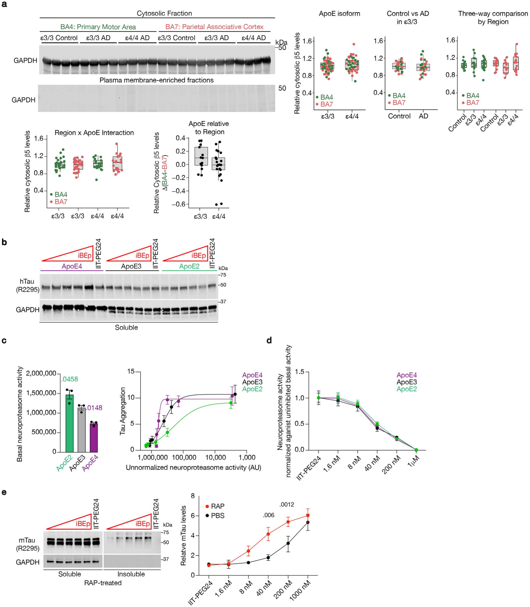

Extended Data Fig. 9 | Neuroproteasomes link ApoE and aging to Tau proteostasis. a, Immunoblots of cytosolic fractions from BA7 and BA4 from Apoε3/3 patients with AD and without AD (unaffected) and Apoε4/4 patients with AD were immunoblotted using indicated antibodies. Quantification of all human patient tissues. 14 AD ApoE3/3, 17 Control ApoE3/3, and 21 AD ApoE4/4 from BA4 (low Tau pathology) and paired samples from BA7 (high Tau pathology). Box plots show the median (center line), the interquartile range (25th-75th percentiles plotted as the box), with whiskers representing the 10th and 90th percentiles. Effect of ApoE isoform alone, Effect of AD comparing only ApoE3/3 tissues, Effect of genotype and pathology compared three way, Quantification of tissues to determine interaction between ApoE genotype and Tau pathology, Differences of differences of means between AD BA4 and AD BA7 to isolate ApoE genotype effect independent of pathology. No significant different were detected across any comparison. b, GAPDH loading control and mTau levels for ApoE-KI/hTau dose curve. c, Data from Fig. 7f, (left) initial proteasome activity plotted. (right) unnormalized raw values from proteasome activity assay plotted, y-axis is insoluble Tau levels from Fig. 7f. d Data from Fig. 7f, neuroproteasome activity at each dose of iBEp normalized against uninhibited basal activity from each genotype. e, Immunoblots of sarkosyl-insoluble fractions of primary neurons from WT mice treated with RAP protein and a dose curve of iBEp. Red indicates RAP-treated neurons, Black indicated PBS-treated neurons. LiCor-based quantification of sarkosyl-insoluble Tau intensity was normalized to soluble GAPDH. All data in c-e are data are mean +/- SEM.

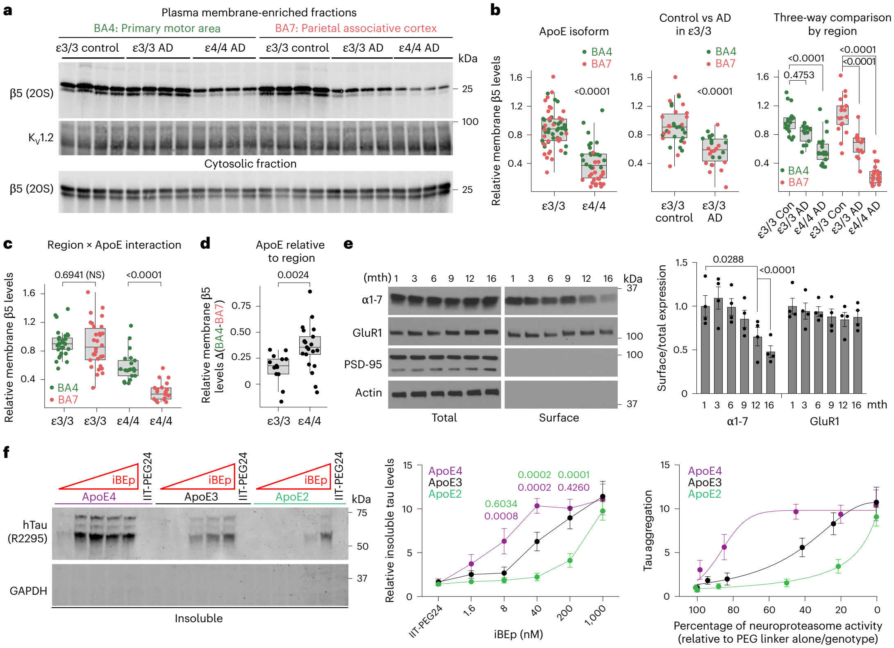

Fig. 7 | Neuroproteasomes link ApoE and aging to tau proteostasis. a, Immunoblots of postmortem human brain tissue of individuals with indicated genotypes, with and without AD, from BA4 and BA7 regions. All AD tissues were Braak V/VI. b–d, Quantification of all human tissues; 14 AD ApoE3/3, 17 control ApoE3/3 and 21 AD ApoE4/4 from BA4 (low tau pathology) and paired samples from BA7 (high tau pathology). LiCor-based quantification of membrane β5 intensities were normalized to intensities of membrane loading control Kv1.2. Box plots show the median (center line) and interquartile range (25th–75th percentiles plotted as the box), with whiskers representing the 10th and 90th percentiles. b, Left, Effect of ApoE isoform alone; middle, effect of AD comparing only ApoE3/3 tissues; right, effect of genotype and pathology compared across all samples. Analyzed by t-test (left and middle) and two-way ANOVA with Tukey’s multiple-comparisons test (right). c, Quantification of relative membrane β5 to determine interaction between ApoE genotype and tau pathology, analyzed by two-way ANOVA with Tukey’s multiple-comparisons test. d, Differences-of-difference analysis of means of relative β5 intensities between AD BA4 and AD BA7 to isolate ApoE genotype effect independent of pathology, analyzed by paired t-test. e, Surface biotinylation of hippocampi from WT mice at indicated ages. Total and surface fractions indicated, and surface over total protein plotted relative to 1-month levels quantified to the right. N = 3 biological replicates, analyzed by one-way ANOVA Tukey’s multiple-comparisons test. f, Immunoblots of sarkosyl-insoluble fractions of primary neurons from hTau/hApoE double KI treated with a dose curve of iBEp. LiCor-based quantification of sarkosyl-insoluble tau intensity. Insoluble tau intensities were normalized to respective soluble GAPDH intensity, plotted relative to inactive scaffold. Data (middle) are the mean ± s.e.m. N = 4 biological replicates. Right, Proteasome activity assays of membrane fractions of neurons from ApoE/hTau-KI double KI mice plotted against tau aggregation (LiCor-based quantification of insoluble tau intensity). Data are the mean ± s.e.m. normalized to respective inactive scaffold controls. N = 3 biological replicates, analyzed by two-way ANOVA Tukey’s multiple-comparisons test.

Having established that neuroproteasome function is both critical for tau proteostasis and is directly modulated by ApoE isoforms, we next determined whether these ApoE-dependent effects dictate neuronal vulnerability to tau aggregation. We began by testing whether ApoE-dependent mislocalization of neuroproteasomes is observable in human postmortem AD tissues. We observed no disease-, genotype- or region-dependent changes in the cytosolic proteasome population (Extended Data Fig. 9a). We next monitored surface localization of neuroproteasomes by immunoblotting plasma membrane-enriched fractions from two different brain regions of human brains, Brodmann area 7 (BA7) and BA4, which were obtained from the same individual (Fig. 7a–d). BA7 has substantial amyloid plaque and tau tangle pathology as well as neuronal loss, whereas BA4 has little tau pathology or neurodegeneration, but still has amyloid plaques. The difference between high and low tau pathology regions across ApoE genotypes provides an opportunity to analyze the relationships between ApoE isoform, tau and neuroproteasome levels. We controlled for sample loading both by total protein and then by normalizing against Kv1.2, a protein whose expression has been reproducibly demonstrated as unchanged in the AD brain39–41. We observed that individuals with the APOE ε4/4 genotype exhibited significantly reduced neuroproteasome levels compared to APOE ε3/3 carriers, regardless of region (Fig. 7b). Neuroproteasome levels were lower in APOE ε3/3 individuals with AD compared to APOE ε3/3 controls, consistent with a disease-associated effect (Fig. 7b). When comparing all three groups—unaffected APOE ε3/3, AD APOE ε3/3 and AD APOE ε4/4—neuroproteasome levels were unchanged in BA4 (low tau pathology) between controls and AD APOE ε3/3, but were lower in BA7 (high tau pathology), consistent with an inverse relationship between neuroproteasome levels and tau pathology (Fig. 7b).

To determine the effects of genotype and tau pathology, we performed interaction analyses between region and genotype. These analyses pool all APOE ε3/3 carriers, regardless of disease status. These revealed that neuroproteasome reductions in APOE ε4/4 were present regardless of brain region compared to APOE ε3/3, but were stronger in regions with high tau pathology (Fig. 7c). To more specifically isolate the genotype from the disease-associated effects, we performed a difference-of-differences analysis between regions only from individuals with AD but between genotypes. We found the difference in neuroproteasomes between BA4 and BA7 was ~2-fold greater in APOE ε4/4 individuals (Fig. 7d), indicating a genotype-driven amplification of regional vulnerability. Because BA4 exhibits minimal tau pathology yet shows a genotype-dependent decrease, these findings collectively support that neuroproteasome levels are reduced by APOE ε4/4 independent of local tau burden, but are markedly lower in more pathologically affected regions.

While these findings underscore the impact of APOE genotype, aging represents the largest overall risk factor for AD6. Therefore, we next examined the effect of aging on neuroproteasome levels. We observed a progressive age-dependent reduction in membrane-localized neuroproteasomes in WT mice starting around 12 months (Fig. 7e). While aging thus represents a major risk factor impacting neuroproteasome levels, the striking differential modulation by ApoE isoforms (Figs. 6 and 7a–d) points to a more direct mechanism influencing genotype-specific risk. To determine if this ApoE modulation functionally alters susceptibility to tau pathology, we quantified tau aggregation as a function of neuroproteasome inhibition across a range of iBEp doses in primary neurons from mice expressing human tau alongside ApoE2, ApoE3 or ApoE4. We found no sarkosyl-insoluble tau aggregates without neuroproteasome inhibition in any line (Fig. 7f and Extended Data Fig. 9b). However, after iBEp treatment, tau aggregation exhibited a sharply genotype-dependent relationship to neuroproteasome activity. ApoE4 neurons exhibited insoluble tau accumulation when only ~20% of neuroproteasome activity is lost, whereas ApoE3 and ApoE2 neurons do not cross this threshold until ~60% and ~85% of activity are inhibited, respectively (Fig. 7f and Extended Data Fig. 9c,d). Consistent with this, we found that RAP, which reduces neuroproteasome localization at the plasma membrane similarly to ApoE4, also is not sufficient but renders neurons more susceptible to tau aggregation (Extended Data Fig. 9e). These findings imply that ApoE4 neurons operate with reduced reserve capacity to adapt to proteotoxic insults or age-related decline, whereas ApoE2 neurons possess higher reserves, relative to ApoE3s. The neuroproteasome may, therefore, serve as a critical determinant of neuronal susceptibility to tau pathology in an ApoE genotype-dependent manner.

## Discussion

In this study, we identify the neuron-specific plasma membrane proteasome (‘neuroproteasome’) as a critical regulator of tau proteostasis, mechanistically linking it to the major AD risk factors, APOE genotype and aging. We demonstrate that selective neuroproteasome inhibition rapidly drives the de novo formation of endogenous tau into PHF aggregates. Furthermore, we show that ApoE isoforms differentially modulate neuroproteasome function and localization, establishing genotype-specific thresholds for tau aggregation. These findings carry important implications for understanding both tau pathogenesis and ApoE biology in the context of AD.

A central question in AD research is how PHF tau pathology forms. Our results offer one potential insight by identifying neuroproteasome disruption as sufficient to trigger pathological conversion from endogenous, WT tau. The rapid formation of PHFs, together with AD-relevant phosphorylation, suggests neuroproteasome impairment could be an early event rendering neurons vulnerable to subsequent pathogenic cascades. Identifying the relationships between neuroproteasomes and these mechanisms should be a central focus of future work. While the speed at which tau aggregates develop following neuroproteasome inhibition may be surprising given that tau pathology emerges after months in tau overexpression and genetic tauopathy models, there is compelling evidence that individual tangles in these models can form within 24 h in vivo42,43. While acute in vivo neuroproteasome inhibition does not fully replicate the chronic, widespread pathology of end-stage AD, it provides critical proof-of-principle for a direct link between neuroproteasome dysfunction and the formation of PHFs, a key feature of AD-relevant tau pathology. The appearance of pathology in specific neuronal populations might reflect differential underlying vulnerability or cell-to-cell variability in neuroproteasome function in vivo, which is not accurately quantifiable with the current tools available. How neuroproteasome inhibition-induced PHF formation relates to other important aspects of tau pathology, such as hyperphosphorylation, secretion, spreading, seeding and neurodegeneration, are important future directions.

Delineating the pathways by which ApoE isoforms confer dramatically different risks for AD is crucial for developing a mechanistic explanation for AD pathogenesis. Our findings provide a new mechanistic explanation for how APOE genotype influences tau pathology, a link that has been poorly understood. ApoE4-induced reduction of neuroproteasome levels is not sufficient to drive tau aggregation but requires a ‘second hit’ to sufficiently compromise neuroproteasome function under this threshold level (for example, by aging or potentially by other insults blunting neuroproteasome function). In contrast, ApoE2 neurons are afforded protection not only by higher neuroproteasome expression but also by a greater tolerance to its loss—a dual mechanism of resilience. Based on these data, we suggest ApoE isoforms help establish a neuron’s proteostatic reserve capacity by modulating neuroproteasomes. These observations hold in human tissues, where neuroproteasome levels are reduced in APOE ε4/4 carriers in multiple brain regions, and show even further reduction in regions with high tau pathology than those with low tau pathology. Future work should focus on how ApoE influences neuroproteasome localization through lipidation or other mechanisms, as well as the precise structural mechanism by which neuroproteasome membrane localization is modulated.

ApoE is likely one of multiple, yet-to-be-identified genetic mechanisms that can modulate neuroproteasome localization and, consequently, the neuronal capacity for tau proteostasis. The neuroproteasome interactors we found here will be an informative starting place for identifying and studying relevant mechanisms. These studies will likely gain insights into if and how neurons recognize and respond to neuroproteasome perturbations. Determining why neurons do not trigger canonical protective responses to neuroproteasome inhibition, and what if any responses are enacted, will likely be valuable. Overall, our findings highlight the importance of understanding genetic and cell biological networks that regulate neuroproteasomes, and other neuronal-specific principles of proteostasis, to achieve long-term neuronal health. The neuroproteasome thus emerges as a key molecular node integrating both genetic and age-related risk factors and helps explain differential susceptibility to AD pathology. Consequently, strategies aimed at preserving or enhancing neuroproteasome function, or mitigating the negative impact of ApoE4 on this pathway, represent potential new therapeutic avenues for AD and perhaps related tauopathies.

## Online content

Any methods, additional references, Nature Portfolio reporting summaries, source data, extended data, supplementary information, acknowledgements, peer review information; details of author contributions and competing interests; and statements of data and code availability are available at https://doi.org/10.1038/s41593-026-02297-x.

## References

1. Scheres, S. H. W., Ryskeldi-Falcon, B. & Goedert, M. Molecular pathology of neurodegenerative diseases by cryo-EM of amyloids. Nature 621, 701–710 (2023).

2. Soto, C. & Pritzkow, S. Protein misfolding, aggregation, and conformational strains in neurodegenerative diseases. Nat. Neurosci. 21, 1332–1340 (2018).

3. Gendron, T. F. & Petrucelli, L. The role of tau in neurodegeneration. Mol. Neurodegener. 4, 13 (2009).

4. Wegmann, S., Biernat, J. & Mandelkow, E. A current view on Tau protein phosphorylation in Alzheimer’s disease. Curr. Opin. Neurobiol. 69, 131–138 (2021).

5. Xia, D., Gutmann, J. M. & Gotz, J. Mobility and subcellular localization of endogenous, gene-edited Tau differs from that of over-expressed human wild-type and P301L mutant Tau. Sci. Rep. 6, 29074 (2016).

6. Taylor, R. C. & Dillin, A. Aging as an event of proteostasis collapse. Cold Spring Harb. Perspect. Biol. https://doi.org/10.1101/cshperspect.a004440 (2011).

7. Tiraboschi, P. et al. Impact of APOE genotype on neuropathologic and neurochemical markers of Alzheimer disease. Neurology 62, 1977–1983 (2004).

8. Shi, Y. et al. ApoE4 markedly exacerbates tau-mediated neurodegeneration in a mouse model of tauopathy. Nature 549, 523–527 (2017).

9. Serrano-Pozo, A., Das, S. & Hyman, B. T. APOE and Alzheimer’s disease: advances in genetics, pathophysiology, and therapeutic approaches. Lancet Neurol. 20, 68–80 (2021).

10. Holtzman, D. M., Herz, J. & Bu, G. Apolipoprotein E and apolipoprotein E receptors: normal biology and roles in Alzheimer disease. Cold Spring Harb. Perspect. Med. 2, a006312 (2012).

11. Ramachandran, K. V. & Margolis, S. S. A mammalian nervous-system-specific plasma membrane proteasome complex that modulates neuronal function. Nat. Struct. Mol. Biol. 24, 419–430 (2017).

12. He, H. Y. et al. Neuronal membrane proteasomes regulate neuronal circuit activity in vivo and are required for learning-induced behavioral plasticity. Proc. Natl Acad. Sci. USA 120, e2216537120 (2023).

13. Groll, M., Kim, K. B., Kairies, N., Huber, R. & Crews, C. M. Crystal structure of Epoxomicin:20S proteasome reveals a molecular basis for selectivity of α‘,β‘-epoxyketone proteasome inhibitors. J. Am. Chem. Soc. 122, 1237–1238 (2000).

14. Kisselev, A. F., van der Linden, W. A. & Overkleeft, H. S. Proteasome inhibitors: an expanding army attacking a unique target. Chem. Biol. 19, 99–115 (2012).

15. Kim, K. B. & Crews, C. M. From epoxomicin to carfilzomib: chemistry, biology, and medical outcomes. Nat. Prod. Rep. 30, 600–604 (2013).

16. Sin, N. et al. Total synthesis of the potent proteasome inhibitor epoxomicin: a useful tool for understanding proteasome biology. Bioorg. Med. Chem. Lett. 9, 2283–2288 (1999).

17. Matsson, P. & Kihlberg, J. How big is too big for cell permeability? J. Med. Chem. 60, 1662–1664 (2017).

18. Sun, H. et al. Highly predictive and interpretable models for PAMPA permeability. Bioorg. Med. Chem. 25, 1266–1276 (2017).

19. Irvine, J. D. et al. MDCK (Madin-Darby canine kidney) cells: a tool for membrane permeability screening. J. Pharm. Sci. 88, 28–33 (1999).

20. Bence, N. F., Bennett, E. J. & Kopito, R. R. Application and analysis of the GFPu family of ubiquitin-proteasome system reporters. Methods Enzymol. 399, 481–490 (2005).

21. Mizushima, N. & Kuma, A. Autophagosomes in GFP-LC3 transgenic mice. Methods Mol. Biol. 445, 119–124 (2008).

22. Radhakrishnan, S. K. et al. Transcription factor Nrf1 mediates the proteasome recovery pathway after proteasome inhibition in mammalian cells. Mol. Cell 38, 17–28 (2010).

23. Sha, Z., Schnell, H. M., Ruoff, K. & Goldberg, A. Rapid induction of p62 and GABARAPL1 upon proteasome inhibition promotes survival before autophagy activation. J. Cell Biol. 217, 1757–1776 (2018).

24. Sasaki, T. et al. Inhibitory effect of di- and tripeptidyl aldehydes on calpains and cathepsins. J. Enzyme Inhib. 3, 195–201 (1990).

25. Hales, C. M. et al. Changes in the detergent-insoluble brain proteome linked to amyloid and tau in Alzheimer’s disease progression. Proteomics 16, 3042–3053 (2016).

26. Guo, Q. et al. Targeted quantification of detergent-insoluble RNA-binding proteins in human brain reveals stage and disease specific co-aggregation in Alzheimer’s disease. Front. Mol. Neurosci. 14, 623659 (2021).

27. Saito, T. et al. Humanization of the entire murine Mapt gene provides a murine model of pathological human tau propagation. J. Biol. Chem. 294, 12754–12765 (2019).

28. Kruger, U., Wang, Y., Kumar, S. & Mandelkow, E. M. Autophagic degradation of tau in primary neurons and its enhancement by trehalose. Neurobiol. Aging 33, 2291–2305 (2012).

29. Wang, Y. & Mandelkow, E. Degradation of tau protein by autophagy and proteasomal pathways. Biochem. Soc. Trans. 40, 644–652 (2012).

30. Lei, Z., Brizzee, C. & Johnson, G. V. BAG3 facilitates the clearance of endogenous tau in primary neurons. Neurobiol. Aging 36, 241–248 (2015).

31. Mrdjen, D. et al. The basis of cellular and regional vulnerability in Alzheimer’s disease. Acta Neuropathol. 138, 729–749 (2019).

32. Goedert, M., Spillantini, M. G., Cairns, N. J. & Crowther, R. A. Tau proteins of Alzheimer paired helical filaments: abnormal phosphorylation of all six brain isoforms. Neuron 8, 159–168 (1992).

33. Dujardin, S. et al. Different tau species lead to heterogeneous tau pathology propagation and misfolding. Acta Neuropathol. Commun. 6, 132 (2018).

34. Zhan, X. et al. Generation of BAF53b-Cre transgenic mice with pan-neuronal Cre activities. Genesis 53, 440–448 (2015).

35. Lane-Donovan, C. & Herz, J. ApoE, ApoE receptors, and the synapse in Alzheimer’s disease. Trends Endocrinol. Metab. 28, 273–284 (2017).

36. Huynh, T. V. et al. Lack of hepatic apoE does not influence early Abeta deposition: observations from a new APOE knock-in model. Mol. Neurodegener. 14, 37 (2019).

37. Prasad, J. M., Migliorini, M., Galisteo, R. & Strickland, D. K. Generation of a potent low density lipoprotein receptor-related protein 1 (LRP1) antagonist by engineering a stable form of the receptor-associated protein (RAP) D3 domain. J. Biol. Chem. 290, 17262–17268 (2015).

38. Verghese, P. B. et al. ApoE influences amyloid-beta (Abeta) clearance despite minimal apoE/Abeta association in physiological conditions. Proc. Natl Acad. Sci. USA 110, E1807–E1816 (2013).

39. Hesse, R. et al. Comparative profiling of the synaptic proteome from Alzheimer’s disease patients with focus on the APOE genotype. Acta Neuropathol. Commun. 7, 214 (2019).

40. Johnson, E. C. B. et al. Large-scale proteomic analysis of Alzheimer’s disease brain and cerebrospinal fluid reveals early changes in energy metabolism associated with microglia and astrocyte activation. Nat. Med. 26, 769–780 (2020).

41. Ping, L. et al. Global quantitative analysis of the human brain proteome and phosphoproteome in Alzheimer’s disease. Sci. Data 7, 315 (2020).

42. de Calignon, A. et al. Caspase activation precedes and leads to tangles. Nature 464, 1201–1204 (2010).

43. Zwang, T. J. et al. Neurofibrillary tangle-bearing neurons have reduced risk of cell death in mice with Alzheimer’s pathology. Cell Rep. 43, 114574 (2024).

Publisher’s note Springer Nature remains neutral with regard to jurisdictional claims in published maps and institutional affiliations.

Springer Nature or its licensor (e.g. a society or other partner) holds exclusive rights to this article under a publishing agreement with the author(s) or other rightsholder(s); author self-archiving of the accepted manuscript version of this article is solely governed by the terms of such publishing agreement and applicable law.

© The Author(s), under exclusive licence to Springer Nature America, Inc. 2026

1 Taub Institute for Research on Alzheimer’s Disease and the Aging Brain, Columbia University, New York, NY, USA.

2 Department of Neurology, Vagelos College of Physicians and Surgeons, Columbia University, New York, NY, USA.

3 Department of Molecular and Cellular Biology, Harvard University, Cambridge, MA, USA.

4 Program in Medical Population Genetics, Broad Institute of MIT and Harvard, Cambridge, MA, USA.

5 Department of Neurology, Hope Center for Neurological Disorders, Knight Alzheimer’s Disease Research Center, Washington University School of Medicine, St. Louis, MO, USA.

6 Alzheimer Research Unit of the MassGeneral Institute for Neurodegenerative Disease, Department of Neurology of the Massachusetts General Hospital, and Harvard Medical School, Charlestown, MA, USA.

7 Department of Neuroscience, Vagelos College of Physicians and Surgeons, Columbia University, New York, NY, USA.

8 These authors contributed equally: Victoria Paradise, Kalin D. Konrad-Vicario. e-mail: kvr2113@cumc.columbia.edu

## Methods

### Antibodies

The following antibodies were used in the study:

#### Antibodies used in this study

| Antibody | Vendor | Catalog | Application | Dilution |
| --- | --- | --- | --- | --- |
| M anti-Actin | Abcam | ab8226 | Western blot | 1:1,000 |
| R anti-Actin | Abcam | ab8227 | Western blot | 1:1,000 |
| R anti-PSMB5 | Bethyl | A303-847A | Western blot | 1:1,000 |
| R anti-PSMA3 | Proteintech | 11887-1-AP | Western blot | 1:1,000 |
| M anti-alpha 1–7 | Enzo | MCP231 | Western blot | 1:1,000 |
| R anti-GluR1 | Cell Signaling | 13185S | Western blot Antibody feeding | 1:1,000 1:100 |
| R anti-pan-ApoE | Cell Signaling | 13366 | Western blot | 1:1,000 |
| M anti-human-ApoE | D. Holtzman | HJ15.7 | Western blot | 1:1,000 |
| M anti-TFR | Abcam | ab1086 | Western blot | 1:1,000 |
| R anti-TFR | Abcam | ab84036 | Western blot | 1:1,000 |
| M anti-GAPDH | Santa Cruz | sc-32233 | Western blot | 1:2,500 |
| M anti-FLAG M2 | Sigma | F1804 | Western blot Antibody feeding | 1:1,000 1:100 |
| M anti-His tag | Genetech | A00186 | Western blot | 1:1,000 |
| M anti-StrepII tag | Genetech | A01732 | Western blot | 1:1,000 |
| R anti-Rpt5 | Bethyl | A303-538A | Western blot | 1:1,000 |
| Ch anti-MAP2 | Thermo | PA-10005 | Immunocytochemistry Antibody feeding | 1:1,000 1:100 |
| R anti-tau (R2295) | V. Lee | Not applicable | Western blot Immunocytochemistry | 1:1,000 1:1,000 |
| M anti-pTau (CP13) | P. Davies | Not applicable | Immunocytochemistry | 1:2,500 |
| M anti-ptau (AT8) | Thermo Fisher | MN1020 | Immunohistochemistry Immunocytochemistry | 1:1,000 1:2,000 |
| R anti-NeuN | Sigma | ABN78 | Immunohistochemistry | 1:1,000 |
| M anti-KV2.1 | DSHB | K14/16 | Western blot | 1:1,000 |
| R anti-PSMB1 | Proteintech | 11749-1-AP | Western blot | 1:1,000 |
| R anti-Lrp1 | Abcam | ab92544 | Western blot | 1:1,000 |
| M anti-tau (DA9) | P. Davies | DA9 | Immunohistochemistry | 1:1,000 |
| R anti-Puromycin | Kerafast | Kf-ab02366-23.0 | Immunocytochemistry | 1:1,000 |
| R anti-p62 | Abcam | ab109012 | Western blot | 1:1,000 |
| M anti-Ubiquitin | CST | 3936S | Western blot | 1:1,000 |
| R anti-Synaptophysin | Synaptic Systems | 101203 | Immunohistochemistry | 1:1,000 |
| GFP-Booster AF488 | Proteintech | gb2AF488 | Immunocytochemistry | 1:1,000 |
| Anti-mouse IgG 680 LT | LiCor | 926-68022 | Western blot | 1:10,000 |
| Anti-rat IgG 680 RD | LiCor | 925-68076 | Western blot | 1:10,000 |
| Anti-rabbit IgG 800 CW | LiCor | 926-32211 | Western blot | 1:10,000 |
| Streptavidin 680 LT | LiCor | 926-68031 | Western blot | 1:10,000 |
| Anti-rabbit IgG AF647 | Thermo Fisher | A21244 | Immunocytochemistry | 1:1,000 |
| Anti-mouse IgG AF488 | Thermo Fisher | A11001 | Immunocytochemistry | 1:1,000 |
| Anti-mouse IgG AF647 | Thermo Fisher | A21240 | Immunocytochemistry | 1:1,000 |
| Anti-chicken IgY AF488 | Thermo Fisher | A32931 | Immunocytochemistry | 1:1,000 |
| Anti-chicken IgY AF568 | Thermo Fisher | A78950 | Immunocytochemistry | 1:1,000 |
| Anti-chicken Alexa Fluor 488 Plus | Thermo Fisher | A32931 | Immunocytochemistry | 1:1,000 |

**Mice.** All animal procedures were performed under protocols compliant and approved by the Institutional Animal Care and Use Committees of Columbia University Medical Center. WT mice (C57BL/6J, stock number 027 from Charles River Laboratories) and mice transgenic for 20S–FLAGfl/fl (ref. 34) (RRID: IMSR_JAX: 027826), tau knockout44 (RRID: IMSR_JAX: 007251), LC3-GFP, hTau-KI27, ApoE2 KI, ApoE3 KI and ApoE4 KI36 were used in this study. All mice were used in the C57BL/6J background. Non-sibling 20S–FLAGfl/WT mice were crossed to generate a homozygous 20S–FLAGfl/fl line. 20S–FLAGfl/fl mice were bred with neuronal Cre driver line BAF53b-Cre to generate a 20S–FLAGfl/fl BAF53b-Cre line, which expresses 20S–FLAG in neurons. hTau-KI mice were crossed with ApoE2 KI, ApoE3 KI and ApoE4 KI mice and homozygosed to generate homozygous hTau/ApoE2 KI, hTau/ApoE3 KI and hTau/ApoE4 KI lines. Subsequent generations were confirmed by genotyping. Mice were genotyped using ear punches from weaning-age mice, and tail snips from postnatal day (P) 0–1 pups were used for postmortem genotyping during the preparation of primary neuron cultures. For the majority of experiments, mice were euthanized with carbon dioxide-induced anoxia and decapitated as a secondary method of euthanasia.

**Synthesis of iBEp.** Synthesis of Azido-PEG(n)-Epox. Azido-PEG(n)-Epox (where n = 1, 4, 8, 12 or 24) was synthesized using Fmoc solid-phase peptide synthesis, followed by coupling of the epoxy group in solution. All reactions were carried out at room temperature. Solid-phase peptide synthesis was carried out in a capped 6-ml solid-phase extraction tube with a frit and a metal stopcock. The tube was shaken by hand for 1-min washes and rotated on a tube rotator during incubation periods longer than 10 min. A vacuum trap was used to release the solution phase after each deprotecting, coupling and washing step. Washing steps were carried out between all deprotecting and coupling steps.

Around 100–200 mg of Fmoc-Thr(tBu)-Wang resin (ChemPep, 161702) was swelled in 3 ml of dimethylformamide (DMF) for a minimum of 1 h, then Fmoc deprotection was done by incubating the resin in 3 ml of 20% piperidine in DMF for 3 × 10 min, followed by 5 × 1-min washes. Next, 3 eq of Fmoc-Ile-OH (ChemPep, 101001) and 2.9 eq of hexafluorophosphate benzotriazole tetramethyl uronium (HBTU) was dissolved in 3 ml of DMF and added to the resin, followed by addition of 9 eq of N,N-diisopropylethylamine (DIEA). The coupling reaction was carried out for a minimum of 3 h, followed by 5 ×1-min washes. The Fmoc group was deprotected and the second Fmoc-Ile-OH was coupled using the same procedure as described above. Following this, 1.5 eq of Azido-PEG X-acid (X = 1, 4, 24) and 1.5 eq of HBTU was dissolved in 3 ml of DMF and added to the resin, before adding 4.5 eq of DIEA. After an overnight reaction period, the resin was washed with 3 ml DMF for 3 × 1 min, then with 2 ml dichloromethane for 2 × 1 min and left to dry on the vacuum trap for at least 30 min. The resin was then moved to a capped glass vial, and a cleavage solution containing 95% trifluoroacetic acid (TFA), 2.5% triisopropylsilane and 2.5% dichloromethane was added on top of the resin. The cleavage reaction occurred for 2 h with continuous stirring using a magnetic stir bar. Finally, the entire cleavage solution was passed through glass wool to filter out the resin, and the cleaved peptide was precipitated into cold diethyl ether. The precipitate was centrifuged, decanted, reconstituted in 3 ml of water and 100 µl of acetonitrile (ACN), then lyophilized.

The epoxy group was coupled to the Azido-PEG X-Ile-Ile-Thr-OH peptide in solution using the procedure described in ref. 45. In one glass vial (vial A), Azido-PEG X-Ile-Ile-Thr-OH (compound A) was dissolved in 1 ml of tetrahydrofuran (THF). The solution was purged with argon gas. Then, 2 eq of tert-butyldimethylsilyl chloride and 2.2 eq of imidazole was added to compound A in THF. The solution was purged with argon gas and left to run overnight. Next, 1.05 eq of hydroxybenzotriazole, 1.05 eq of HBTU and 3 eq of DIEA was added to vial A. The solution was purged with argon gas and left to react for 30 min. In a separate vial (vial B), 1.05 eq of (S)-2-Amino-4-methyl-1-((R)-2-methyloxiran-2-yl) pentan-1-one 2,2,2-trifluoroacetate (Combi-Blocks) and 3 eq of DIEA was dissolved in 1 ml THF. The solution was purged with argon gas and left to react for 5–10 min. Next, the content of vial B was transferred to vial A under argon gas, and the mixture was allowed to react for 4–5 h. The reaction was then concentrated using the SpeedVac vacuum concentrator. The concentrated mixture was reconstituted in 1 ml of methanol, then injected directly into a high-performance liquid chromatography (HPLC) system for purification, then lyophilized.

**Synthesis of biotin-PEG X-Epox and JF647-Epox.** Biotin-PEG X-Epox was synthesized by conjugating biotin-PEG X1-Epox (where X1 = 0, 4, 8; BroadPharm) to Azido-PEG X2-Epox (where X2 = 1, 4, 8, 12, 24) using copper-catalyzed azide-alkyne cycloaddition (CuAAc Click reaction). The Click reaction typically consisted of 300 µM CuSO4, 200 µM BTTES, 1,500 µM sodium ascorbate, 200 µM azide moeity and 200 µM alkyne moeity in 1 ml of PBS with 10% isopropyl alcohol. The reaction occurred at room temperature for a minimum of 4 h, or at 37 °C for 2 h. The crude reaction was injected directly onto a HPLC system for purification, then lyophilized.

JF647-Epox was also synthesized via CuAAc Click reaction between Janelia Fluor 647-azide and Epox-alkyne (received from Trader group), using the same ratios of reagents as described above. The reaction mixture was used directly to treat HEK cell lysate.

**HPLC.** The compounds were purified using the Agilent 1290 Infinity II reverse-phase HPLC series in combination with the Agilent ZORBAX Eclipse SB-C18 column, 4.6 × 250 mm, 5 µm. The HPLC method for Azido-PEG X-Epox is a gradient that starts from 95:5 water + 0.1% TFA:ACN + 0.1% TFA and goes to 5:95 water + 0.1% TFA:ACN + 0.1% TFA within 30 min, at a flow rate of 2 ml min−1. The HPLC method for biotin-PEG X-Epox and SMG-132 is a gradient that goes from 90:10 water:ACN to 25:75 water:ACN within 10 min, at a flow rate of 2 ml min−1.

**LC–MS.** The molecular weights of the compounds were confirmed using the UPLC-H-class combined with a XEVO G2 XS mass spectrometer at the MS core facility at the Department of Chemistry at Columbia University. The MS column is the Acquity UPLC BEH C8 column, 130 Å, 2.1 mm × 50 mm, 1.7 µm. The LC gradient goes from 95:5 water + 0.1% formic acid:ACN + 0.1% formic acid to 5:95 water + 0.1% formic acid:ACN + 0.1% formic acid within 5 min, with a flow rate of 0.2 ml min−1. The LC–MS data were analyzed using the software MassLynx 4.2.

**PAMPA and MDCK assays.** We contracted Enamine, a commercial contract research organization with extensive expertise in small-molecule synthesis and characterization, to perform cell permeability assays and stability assays in mouse brain lysate.

**PAMPA conditions.** All steps of the PAMPA were carried out according to the pION PAMPA Explorer Manual. The main principle of the assay is the incubation of the compound in a donor chamber (a well in the donor plate) with an aqueous buffer, which is separated from the acceptor chamber (a well in the acceptor plate) with another buffer by a phospholipid or hydrocarbon membrane fixed on filter support. After the test, concentrations in the corresponding donor and acceptor wells are measured and permeability is calculated.

The blood–brain barrier model was simulated using BBB-1 phospholipid mix. Clozapine, chlorpromazine (high permeability) and ranitidine (low permeability) were used as reference compounds. All compounds were tested in triplicates. Prisma HT buffer (pH 7.4) containing 50 µM test compounds (0.5% DMSO) was added into the donor plate wells. Brain sink buffer was added into each well of the acceptor plate. Incubation was done at room temperature for 4 h without stirring. After incubation, samples of the tested compounds were diluted 10-fold with ACN containing internal standard and were analyzed using the HPLC system coupled with a tandem mass spectrometer. Then the apparent permeability coefficient was calculated.

All test articles were detected using the Shimadzu HPLC system including vacuum degasser, gradient pumps, reverse-phase HPLC column, column oven and autosampler. The HPLC system was coupled with a tandem mass spectrometer API 3000 (PE Sciex, LC–MS-1SX-1165). The TurboIonSpray ion source was used in positive ion mode. Acquisition and analysis of the data were performed using Analyst 1.6.3 software (PE Sciex).

The formula for calculating logPapp was as follows in equation (1):

$$\begin{aligned} \log P_{\mathrm{app}} &= \log_{10}\!\Biggl(-\frac{2.303 \times V_D}{A \times (t-\tau_{\mathrm{ss}}) \times \varepsilon_a} \\ &\quad \times \log_{10}\!\left(\frac{1}{1-R_M/100\%} \times \frac{C_{\mathrm{don}}}{C_{\mathrm{ref}}}\right)\Biggr) \end{aligned}$$

(1)

VD – volume of transport buffer in donor compartment (0.3 ml); A – surface area of the lipids in the insert (effective growth area of the insert, 0.3 cm²); t – time of the assay, seconds; Cdon – final concentration of test compound in the donor compartment; Cref – starting concentration of test compound in the donor compartment; εa – apparent filter porosity, equals to 0.76; RM – membrane mass retention, calculated as

$$R_M = \left(1-\frac{C_{\mathrm{don}}+C_{\mathrm{acc}}}{C_{\mathrm{ref}}}\right) \times 100\%$$

Cacc – final concentration of test compound in the donor compartment; τss – steady-state lag time, estimated as (54 RM + 1) × 60 s. Values of Cdon/Cref and Cacc/Cref are practically calculated using optical absorbance data.

**MDCK conditions.** Canine MDR1 knockout, human MDR1 knockin MDCKII cells (MDR1-MDCKII; Sigma-Aldrich, MTOX1303) were cultured in 75-cm² flasks to 80–90% confluence according to the manufacturer’s recommendations in a humidified atmosphere at 37 °C and 5% CO2. Cells were detached with trypsin/EDTA solution and resuspended in the cell culture medium to a final concentration of 4 × 105 cells per ml. Then, 400 µl of the cell suspension was added to each well of the HTS Multiwell Insert System and 25 ml of prewarmed complete medium was added to the feeder tray. Confluent MDR1-MDCKII monolayers expressing P-gp were obtained after 4–5 days after seeding. Integrity of the cell monolayers was determined by measuring the transepithelial electrical resistance using an epithelial voltammeter (Millipore, MERS 000 01). Mature MDR1-MDCKII cell monolayer exhibited the transepithelial electrical resistance (TEER) values > 100 Ω × cm². The 24-well insert plate was removed from its feeder tray and placed in a new sterile 24-well transport analysis plate. The inserts were washed with PBS after medium aspiration.

To determine the rate of compounds transport in the apical (A)-to-basolateral (B) direction, 300 µl of the test compound dissolved in transport buffer (9.5 g l−1 HBSS and 0.35 g l−1 NaHCO3 with 0.81 mM MgSO4, 1.26 mM CaCl2, 25 mM HEPES, pH adjusted to 7.4) was added into the filter wells; 1,000 µl of transport buffer was added to transport analysis plate wells.

Ketoprofen, atenolol, quinidine and digoxin were used as reference compounds.

To determine transport rates in the basolateral (B)-to-apical (A) direction, 1,000 µl of the test compound solutions was added into the wells of the transport analysis plate, and the wells in the filter plate were filled with 300 µl of buffer (apical compartment). The final concentration of the test compounds was 1 µM.

The effect of the inhibitor on the P-gp-mediated transport of the tested compounds was assessed by determining the bidirectional transport in the presence or absence of cyclosporine A. The MDR1-MDCKII cells were preincubated for 30 min at 37 °C with 10 µM of cyclosporine A in both apical and basolateral compartments. After removal of the preincubation medium, the test compounds (final concentration, 1 µM) with cyclosporine A (10 µM) in transport buffer were added in donor wells, while the receiver wells were filled with the appropriate volume of transport buffer with 10 µM cyclosporine A.

The plates were incubated for 90 min at 37 °C under continuous shaking at 100g. After this, 75-µl aliquots were taken from the donor and receiver compartments for LC–MS/MS analysis. All samples were mixed with two volumes of ACN followed by protein sedimentation by centrifuging at 10,000g for 10 min. Supernatants were analyzed using an HPLC system coupled with a tandem mass spectrometer.

All solutions of test and reference compounds were prepared manually, and further manipulations with the solutions were performed with automation using Opentrons.

The apparent permeability (Papp) was calculated for the MDR1-MDCKII permeability assay using the following equation:

$$P_{\mathrm{app}} = \frac{V_A}{\mathrm{Area} \times \mathrm{Time}} \times \frac{[\mathrm{drug}]_{\mathrm{acc}}}{[\mathrm{drug}]_{\mathrm{initial},d}}$$

(2)

VA – volume of transport buffer in acceptor well Area – surface area of the insert (equal to effective growth area of the insert, 0.7 cm²), Time – time of the assay [drug]acc – peak area of test compound in acceptor well [drug]initial,d – initial amount of the test compound in a donor well Papp is expressed in 10−6 cm s−1. Efflux ratio (Papp(BA)/Papp(AB)) reveals the difference in Papp as a result of active transport. If the efflux ratio is greater than 2, this indicates the occurred active efflux.

To identify the P-gp substrate, the P-gp inhibitor was added to the incubation medium. A decrease of the efflux ratio in the presence of an inhibitor indicates the compound is a P-gp substrate.

The percentage recovery was calculated using equation (3):

$$\%\,\mathrm{recovery} = \frac{C_{\mathrm{acc}} \times V_{\mathrm{acc}} + C_d \times V_d}{C_{\mathrm{initial},d} \times V_d} \times 100$$

(3)

Vacc – volume of compound solution in acceptor well (cm³), Vd – volume of compound solution in donor well (cm³), Cacc – peak area of test compound in acceptor well, Cd – peak area of test compound in donor well, Cinitial,d – initial amount of the test compound in a donor well.

**Stability assays.** Mouse brain lysate was prepared from pooled brains of male Balb/c mice (n = 10). Mouse brains were fragmented into small pieces and homogenized in four volumes of lysis buffer (1% Triton X-100, 100 mM NaCl, 1 mM MgCl2, 0.1 mM CaCl2, 50 mM Tris, adjusted to pH = 7.4) using SPEX SamplePrep 1600 MiniG. Samples were centrifuged at 6,000g for 20 min. Supernatants were decanted and collected. The obtained mouse brain lysate was flash frozen in liquid nitrogen. Aliquots were stored at −70 °C until use.

The brain lysate incubations were carried out in 96-well plates in five aliquots of 60 µl each (one for each time point), in duplicates. Test compounds (1 µM, final DMSO and ACN concentrations were 0.005% and 1%, respectively) were incubated at 37 °C with shaking at 200g. Five time points over 120 min have been analyzed. The reactions were stopped by adding 240 µl 90% ACN containing internal standard (verapamil) with subsequent brain protein sedimentation by centrifuging at 5,000g for 5 min. Supernatants were analyzed by the HPLC system coupled with a tandem mass spectrometer. The percentage of the test compounds remaining after incubation in mouse brain lysate and their half-lives (T1/2) were calculated.

**Proteasome bounceback assays.** DIV14 cortical neurons were treated with either 1 µM epoxomicin (Epox) or 1 µM neuroproteasome inhibitor (iBEp) for 6 h. Following treatment, RNA was isolated using the RNeasy Mini Kit (Qiagen, 74624) and eluted in 10 µl RNase-free water. cDNA was prepared using the iScript cDNA Synthesis Kit (Bio-Rad, 1708890) according to the manufacturer’s recommendation (all 10 µl RNA was used for the reaction). Mouse-specific qPCR primers from Radhakrishnan et al.22 were used (primer sequences listed below). The qPCR reaction was performed in a 384-well plate using the PowerUp SYBR Green Master Mix (Thermo Fisher, A25742) and 0.75 µl cDNA per reaction. The following primers were used in the study:

#### qPCR primer sequences

| Gene | Forward primer | Reverse primer |
| --- | --- | --- |
| 18S | 5′-AGGGGAGAGCGGGTAAGAGA-3′ | 5′-GGACAGGACTAGGCGGAACA-3′ |
| PSMA7 | 5′-AACGTCTGTATGGCCTTTGC-3′ | 5′-GTCACTGGGTCCTCCACTGT-3′ |
| PSMB4 | 5′-TTCACTGGCCACTGGTTATG-3′ | 5′-CGAACGGGCATCTCTGTAGT-3′ |
| PSMB7 | 5′-CTGTCTTGGAAGCGGATTTC-3′ | 5′-GCAACAACCATCCCTTCAGT-3′ |
| PSMD12 | 5′-TCACAGACCTGCCAGTCAAG-3′ | 5′-AGGTTTTAGTCAGCCGAGCA-3′ |

**Proteasome subunit β5 activity assay.** Chymotrypsin-like catalytic activity was assessed using a Suc-Leu-Leu-Val-Tyr-AMC activity assay. HEK cell lysate was diluted in activity assay buffer (25 mM Tris pH 7.4, 2.5 mM MgCl2 and 10 mM NaCl) supplemented with 10 mM ATP. Around 20 µM Suc-LLVY-AMC (Enzo Life Sciences, BML-P802) was added to the diluted lysate, and proteasomal activity was assessed in the absence of inhibitors and with serially diluted concentrations of inhibitors (25 µM, 12.5 µM, 6.25 µM, 3.125 µM and 1.5625 µM). The assay was performed using the Corning 96-well Black Flat Bottom Polystyrene NBS Microplate, and read at excitation and emission wavelengths of 360 nm and 460 nm, respectively, using the Molecular Devices SpectraMax iD5 Microplate Reader.

**Intracellular metabolite extractions.** Primary DIV14 cortical neurons were treated with compounds for 24 h (at concentrations indicated in the ‘Drug treatments’ section), and metabolites were extracted precisely according to a detailed published protocol46,47 and analyzed by LC–MS.

**JF647-Epox treatment.** A total of 0.1 µM JF647-Epox was added to 100 µl of mouse brain lysates (whole mouse brain homogenized in 25 mM Tris 7.4, 100 mM NaCl, 0.1 mM CaCl2, 2 mM MgCl2, 0.1% NP-40, supernatant after removing nuclei in a 500g spin) and left to react for 1 h at 37 °C. The reaction was quenched by adding 100 µl of SDS loading buffer and ran on a 10% acrylamide gel. The gel was imaged at 680 nm of fluorescence before being subjected to immunoblotting as described above.

**Drug treatments.** Epoxomicin (Selleckchem, S7038) and iBEp were used to treat cultured neurons at 1 µM, IgG-Epox or IgG-PEG24 were used at 0.25 µM, and SulfoMG and MG132 (Selleckchem, S2619) were used to treat cultured neurons at 1 µM. Leupeptin (20 µM; Thermo, 78435) was added every 2 h over a 12-h time course based on previous studies48,49. A total of 2 µl of drugs were stereotactically injected at the following concentrations in vivo: 6.4 µM iBEp, 1.2 µM IgG-Epox, 10 µM epoxomicin. For in vivo hippocampal injections, iBEp concentrations were optimized. Initial dose-ranging studies indicated that concentrations exceeding 12 µM induced seizure activity. Therefore, a concentration of 6.4 µM was selected for all subsequent experiments, as this dose achieved detectable inhibition of membrane-fraction proteasomes without causing observable adverse physiological effects.

**GFPu cell penetration assay.** Primary hippocampal neurons on coverslips were co-transfected with the Ub-G76V-GFP construct and the pCAGGS-mCherry construct (Addgene, plasmid no. 41583) at DIV7 or DIV8. The plasmids (0.5 µg per coverslip for Ub-GFP and 0.1 µg per coverslip for mCherry) and Lipofectamine 2000 transfection reagent (0.75 µl per coverslip) were reconstituted in Neurobasal media (minus phenol red) and incubated together at 37 °C for 30 min. A total of 600 µl of NM0 per well was removed and 100 µl of the plasmid–Lipofectamine mixture was added. The cells were incubated for 4 h at 37 °C, then 500 µl of NM0 was added back into the well. At DIV14, the cells were treated with 1 µM epoxomicin, MG132, iBEp or SulfoMG. After a 12-h incubation, the cells were processed as described in the ‘Immunocytochemistry’ section. The cells were incubated with chicken anti-MAP2 and rabbit anti-mCherry primary antibodies (GeneTex, GTX128508), followed by goat anti-chicken 647 and goat anti-mouse 568 secondary antibodies, and GFP-Booster Alexa Fluor 488 (ChromoTek, gb2AF488). The coverslips were then mounted and imaged as described in the ‘Immunocytochemistry’ section.

**Synthesis of SulfoMG-132.** SulfoMG-132 was synthesized via strain-promoted alkyne-azide cycloaddition between DBCO-Sulfo-Link-Biotin (BroadPharm, 22296) and MG132-PEG24-azide (Affinity Chemistry, S2619). Around 25 mM DBCO-Sulfo-Link-Biotin was reacted at a 1:1 ratio with 20 mM MG132-PEG24-azide, both resuspended in MilliQ water. MilliQ water was added to make up the final volume. The reaction was run overnight with continuous stirring at room temperature and purified using the same method as iBEp. Product fractions from the HPLC were dried by vacuum evaporation and sent for LC–MS analysis. Dried fractions were resuspended in MilliQ water and stored at 4 °C.

**Calpain/cathepsin L activity assay.** The effective concentrations of MG132 and SulfoMG against calpain and cathepsin L were measured using an Ac-Leu-Leu-Tyr-AFC assay and a Z-Phe-Arg-AFC assay (both from Echelon Biosciences, 875-20 and 65147-22-0, respectively. The activity assay was carried out using the same procedure as the Suc-LLVY-AMC activity assay, except the plate was read at excitation and emission wavelengths of 395 nm and 495 nm, respectively.

**Synthesis of IgG-PEG24-azide and IgG-PEG24-Epox.** Normal mouse IgG was reacted with 10 eq of Azido-PEG24-NHS ester (BroadPharm, BP-23542) in PBS to make IgG-PEG24-azide or reacted with 10 eq of DBCO-NHS ester (BroadPharm, BP-22231) and 10 eq of Azido-PEG24-Epox in PBS to make IgG-PEG24-Epox. The reactions occurred for 2 h at 37 °C, then filtered using the Amicon filter with a 10-kDa molecular-weight cutoff remove unreacted products.

**Immunocytochemistry.** Neurons were treated with iBEp, Epox, SulfoMG or MG132 for 12 h as described in the ‘Drug treatments’ section. After the treatment, neurons were washed with cold PBS supplemented with 0.1 mM CaCl2 and 2 mM MgCl2 (PBSCM) and fixed in 4% paraformaldehyde (PFA; Electron Microscopy Sciences, 15710)/4% sucrose diluted in PBS for 8 min. Following fixation, neurons were washed three times in PBS. Coverslips were blocked in 1× GDB (0.2 mM NaPO4, 0.2% gelatin, 0.8 M NaCl and 0.1% Triton X-100). Primary antibodies were diluted as noted in 1× GDB. After incubation, the coverslips were washed in PBS and incubated with secondary antibodies diluted at a 1:1,000 ratio in 1× GDB. Coverslips were washed in PBS and mounted and imaged using a CSU-W1 SoRa confocal microscope. Images are representative maximal z-projections of multiple optical sections. Images were quantified using ImageJ by integrated density analysis. For all analyses, analyzers were blinded to experimental conditions.

Maximum intensity projections were made for each channel. Maximum intensity projections in ND2 format were imported into Fiji using Bio-Formats Importer plugin. For GFPu, GFP+ cells were manually counted and normalized to the total number of cells, as counted by nuclei stained by DAPI. To count nuclei, the DAPI channel was thresholded using Huang, and nuclei were counted using Particle Analyzer with a particle size of 8–15 µm. For LC3-GFP, fluorescence intensity was measured using Fiji integrated density and normalized to MAP2 surface area. To obtain surface area, the MAP2 channel was converted from a 16-bit image to 8-bit and converted to binary using the Default method. Area fraction was measured from the binary MAP2 image to calculate surface area for normalization. All conditions were normalized to average DMSO value. Three images were analyzed per replicate. For CP13, CP13 and R2295 fluorescence intensity were measured using Fiji integrated density. Background CP13 signal for each image was measured in an area with no neurons or projections. CP13 fluorescence intensity was background subtracted and normalized to R2295 fluorescence intensity or MAP2 surface area and all conditions were normalized to average DMSO value. For antibody feeding, total FLAG surface signal was quantified by Fiji integrated density and normalized to MAP2 surface area as quantified above.

**Sarkosyl extraction.** For in vitro sarkosyl extractions, primary neurons were treated for 12 h and lysed in sarkosyl lysis buffer (250 mM NaCl, 2 mM MgCl2, 0.2 mM CaCl2, 10% sucrose, 20 mM Tris pH 7.4, 1.5% N-lauroylsarcosine (Sigma, 30% stock, 61747), protease inhibitors (Roche, 11697498001) and phosphatase inhibitors (Sigma, P004)) and collected. Samples were spun at 10,000g and debris was removed. Samples were pelleted at 186,000g at 10 °C for 60 min. The supernatants were collected as part of the sarkosyl-soluble fraction and pellets were resuspended in the sarkosyl lysis buffer. Samples were pelleted at 186,000g at 10 °C for 60 min and supernatants were collected and pooled with the sarkosyl-soluble fraction from the first spin. The pellets were taken as the sarkosyl-insoluble fractions, and resuspended in 6 M urea and 2 M thiourea. For in vivo sarkosyl extractions, mice were euthanized 72 h following stereotactic intrahippocampal injections, the hippocampi were dissected out on ice and homogenized in a dounce homogenizer in sarkosyl lysis buffer (800 mM NaCl, 10% sucrose, 1 mM EGTA, 25 mM Tris pH 7.4). The lysate was then brought up to 1% N-laurylsarcosine, homogenized and shaken at room temperature for 1 h. Supernatants were spun at 186,000g at 10 °C for 60 min and supernatants were collected as the sarkosyl-soluble fraction. Pellets were washed and resuspended with the same buffer without sucrose and either 0.1% sarkosyl or 0.2% sarkosyl. Samples were pelleted at 186,000g at 10 °C for 60 min and this process was repeated twice. The pellets were taken as the sarkosyl-insoluble fractions, and resuspended in 6 M urea and 2 M thiourea for SDS–PAGE analyses and PBS for electron microscopy analysis.

**Stereotaxic surgery.** Mice were anesthetized with Avertin by weight through an intraperitoneal injection, and given local and general painkillers Marcaine and carprofen along with optical lube to prevent dryness. On the stereotax, the surgical site was shaved and prepared with three alternating rounds of betadine and ethanol washes. A vertical incision was made and the open skull area was swabbed with hydrogen peroxide to visualize bregma. The stereotactic equipment was centered on bregma and then adjusted via manipulators to ±2.5 mm laterally and ±2.7 mm posteriorly or ±1.8 mm laterally and ±1.9 mm posteriorly. A drill was used to open the holes in the skull on either hemisphere and a needle was lowered 2.2 mm or 1.3 mm in order to inject into the hippocampus. The microinjector pump then delivered a dose of 2 µl of the drug/saline solution and retracted after a minute after delivery was complete. The wound was closed and sealed with VetBond.

**Electron microscopy of tau fibrils, negative staining and immuno-electron microscopy.** Four hTau-KI mice (2 male, 2 female) that were ~5 months old were bilaterally injected with iBEp and collected 72 h after surgery. Eight hippocampi were collected and processed for sarkosyl-insoluble fractions as above, but final pellets were resuspended in PBS and applied to glow-discharged carbon-film-coated copper 200-mesh grids (Electron Microscopy Sciences, CF200-CU) for 1 min. Excess sample was removed by blotting with filter paper. The grids were washed with drops of water for three times, and stained in 2% uranyl acetate for 60 s. Following the staining, the grids were lightly blotted to remove the bulk of the stain, and let air-dry. To achieve a positive staining effect, grids were more thoroughly blotted before air-drying to reduce staining of the background.

For immunogold labeling, the sample solution was applied to the glow-discharged grid and incubated for 2 min. The grid was then incubated on a drop of the blocking solution (0.1% gelatin in PBS) for 10 min. Excess blocking solution was blotted, and the grid was incubated in R2295 primary antibody at a 1:50 dilution in the blocking solution for 1 h at room temperature. The grid was then washed three times in the blocking solution, and incubated in the secondary antibody (6-nm gold-conjugated Donkey anti-Rabbit) at a 1:20 dilution in the blocking solution for 1 h at room temperature. After blotting the excess antibody solution, the grid was washed three times in water and stained in 2% uranyl acetate for 60 s.

The grid was examined with Hitachi HT7800 TEM at 100 kV, and micrographs were routinely acquired at magnifications of ×5,000 and ×120,000 with a TVIPS TemCam-XF416 CMOS camera. Imaging was performed blinded to experimental manipulations. A series of low magnification images were first acquired and then any object resembling a larger fibril or aggregate was obtained at higher magnification.

**Immunohistochemistry.** For AT8 and ThioS staining under PBS and iBEp conditions, seven hTau-KI mice (4 male and 3 female) at ~5 months of age were used. For AT8 staining under IgG-PEG24 and IgG-Epox conditions, six hTau-KI mice (2 male and 4 female) at ~4–5 months of age were used. For AT8 staining under PBS and Epox conditions, three female hTau-KI mice were used at ~4–5 months of age. Seventy-two hours following stereotactic intrahippocampal injections, mice were anesthetized with ketamine–xylazine and perfused with PBS before being perfused with 4% PFA (Electron Microscopy Sciences, 15710) diluted in PBS. Mice were decapitated and brains were removed and fixed in 4% PFA in PBS overnight. Brains were cryopreserved in sequential incubations with sucrose. Brains were embedded in OCT (Sakura, 4583) on dry ice, sectioned on a cryostat and collected on SuperFrost glass slides (VWR, 48311-703). Sections were permeabilized in blocking buffer (10% normal goat serum; Vector Laboratories, S-1000-20; 1% BSA in PBS) supplemented with 0.1% Triton X-100 and incubated in blocking buffer. Sections were incubated with primary antibodies Mouse anti-AT8 and Rabbit anti-NeuN diluted at a 1:1,000 ratio and with secondary antibodies diluted 1:1,000. Sections were also stained with DAPI (Thermo Fisher, D1306) diluted at a 1:1,000 ratio and submerged in 0.1% Sudan Black B (Sigma, 199664) in 70% ethanol to reduce autofluorescence. ThioS (Sigma, T1892) staining done by incubating NeuN or AT8 stained slices in 500 µM ThioS in 50% ethanol for 8 min, washed in 50% ethanol and then submerged in Sudan Black and mounted. They were then mounted and imaged using a CSU-W1 SoRa confocal microscope. Images are representative maximal z-projections of multiple optical sections with the notable exception of AT8/ThioS staining, which are single z-planes from confocal sections. Images were quantified using ImageJ by integrated density analysis.

**Quantification.** Regions of interest of the same size were defined for each hemisphere to include the dentate gyrus and CA1, and CA3 hippocampal regions and for background AT8 signal, which was sampled from the hypothalamus where AT8 signal was minimal. AT8 and NeuN were measured from regions of interest using Fiji integrated density. AT8 fluorescence intensity was background subtracted and normalized to NeuN intensity. NeuN intensities did not vary across any measured conditions, NeuN signal intensities also corresponded to the number of NeuN+ nuclei. All conditions were normalized to average DMSO value. For ThioS, sections between 0 µm and 50 µm from the injection site were selected for quantification. ThioS-positive signal that resembled a flame-like appearance in the CA1 region of the hippocampus was quantified. ThioS counts are shown as the total number of flame-like signal per section. ThioS+ cells were only found in CA1 and dentate gyrus neuronal cell body layers and not in the molecular layer—only CA1 was counted. Thread-like ThioS+ inclusions were found in the molecular layer but not counted since they could not be consistently assigned to a cell body because the associated cell body may have been in a different section. We could not detect ThioS in non-neuronal cells. ThioS images were quantified by an experimenter blinded to experimental condition and manually counted.

**MS.** All proteomic experiments were performed with isobaric tandem mass tagging followed by LC–MS/MS quantitative MS.

For quantitative total and phosphoproteomics following iBEp treatment, three biological replicates of DIV14 neurons were treated with drugs (as described in the ‘Drug treatments’ section) and then fractionated (as described in the ‘Sarkosyl extraction’ section) using sarkosyl-containing lysis buffer. Insoluble fractions were lysed in 6 M urea and 2 M thiourea. Proteins were crashed out of the soluble fraction with high methanol to remove sarkosyl buffer. All samples were digested with trypsin and peptides were labeled with 16-plex TMTpro reagents. Combined samples were resuspended in buffer A and offline fractionated. The 96-well plate was combined in a checkerboard fashion for a total of 24 final fractions. Twelve fractions were dried by the SpeedVac vacuum, cleaned on a C18 packed stage tip and eluted. Samples were then resuspended in 5% ACN and 5% formic acid and analyzed by LC-MS3 using a real-time search, data-dependent method. Twelve fractions from the total proteome HPRP set were analyzed on an Orbitrap Lumos mass spectrometer using a 150-min method with real-time search. Peptides were detected (MS1) and quantified (MS3) in the Orbitrap and sequenced (MS2) in the ion trap. The MS2 spectra were searched using the COMET algorithm against a Uniprot composite database derived from the mouse proteome containing its reversed complement and known contaminants. The proteins from the 12 runs were filtered to a 1% false discovery rate (FDR) using the target-decoy strategy combined with linear discriminant analysis and were filtered to a <1% FDR. The proteins were quantified only from peptides with a summed signal/noise (SN) threshold of >150.

For quantitative phosphoproteomics, MS2 spectra were searched using the COMET algorithm against a Uniprot composite database derived from the mouse proteome containing its reversed complement and known contaminants. Phosphorylation of Ser, Thr and Tyr residues was set as a differential modification. Peptide spectral matches of phosphorylated peptides were filtered to a 1% FDR using the target-decoy strategy combined with linear discriminant analysis, and the proteins were filtered to a <1% FDR. The proteins were quantified only from peptides with a summed SN threshold of >150. Isolation specificity was set to be greater than 0.5. The combined sample was resuspended in buffer A (5% ACN, 50 mM AmBic, pH 8.0) and basic pH reverse-phase phospho sample offline fractionated into a 96-well plate. This plate was run by columns for a total of 12 final fractions, which were dried by the SpeedVac vacuum, cleaned on a C18 packed stage tip and then eluted and resuspended in 5% ACN and 5% formic acid. These samples were analyzed by LC–MS2 on an Orbitrap Eclipse mass Spectrometer using a 180-min high-resolution MS2 method. Peptides were detected (MS1) and quantified (MS2).

For co-IP experiments, four independent brains from two male and two female 20S–FLAG/BAF53b-Cre mice were fractionated into cytosolic and membrane fractions (as described in the ‘Cellular fractionation’ section) and incubated with anti-FLAG nanobodies (as described in ‘IP by affinity beads’ section). Samples were reduced on-bead (10 mM TCEP, 55 °C for 1 h), alkylated (18.75 mM iodoacetamide, room temperature for 30 min) and then digested from the beads with trypsin (2.5 µg trypsin, 37 °C). Following digestion, the resulting peptides were labeled with TMT 10-plex reagents and pooled. The combined sample was resuspended in buffer A (5% ACN, 50 mM ammonium bicarbonate, pH 8.0) and basic pH reverse-phase sample offline fractionated into a 96-well plate. This plate was run by columns for a total of 12 final fractions, which were dried by the SpeedVac, cleaned on a C18 packed stage tip and then eluted and resuspended in 5% ACN and 5% formic acid. These samples were analyzed by LC–MS2 on an Orbitrap Eclipse mass spectrometer using a 180-min high-resolution MS2 method. Peptides were detected (MS1) and quantified (MS2).

The details of the high-resolution MS2 run were with Comet Search Parameters of 50 ppm for peptide mass tolerance, 0.02 for fragment ion tolerance, and 2 as the limit for maximum internal cleavage site and maximum differential per site. The reported quant parameters were set to 0.003 for tolerance, and 0 for MS3. The peak picking was set to max, number of isotopes were limited to 2, and MS2 isolation width was set to 0.9. The MS2 spectra were searched using the SEQUEST algorithm against a Uniprot composite database derived from the human proteasome containing its reversed complement and known contaminants. Peptide spectral matches were filtered to a 1% FDR using the target-decoy strategy combined with linear discriminant analysis and the proteins were filtered to a <1% FDR. The proteins were quantified only from peptides with a summed SN threshold of >100. Isolation specificity was set to be greater than 0.7.

**MS analysis.** Peptide-spectrum matches (PSMs) were adjusted to a 1% FDR. PSM filtering was performed using a linear discriminant analysis. To quantify the TMT-based reporter ions in the datasets, the summed signal-to-noise ratio for each TMT channel was obtained and found the closest matching centroid to the expected mass of the TMT reporter ion (integration tolerance of 0.003 Da). Proteins were quantified by summing reporter ion counts across all matching PSMs. PSMs with poor quality, or isolation specificity less than 0.7, or with TMT reporter summed signal-to-noise ratios that were less than 100 or 150 or had no MS3 spectra were excluded from quantification.

The list of quantified proteins exported from Proteome Discoverer 2.1 was utilized as the input for our differential expression analysis. The raw values were organized in a matrix where each column represented a sample and each row a protein. To normalize the raw expression values, we began by log2 transforming the matrix with a + 1 for computation. Then we median polished the log-transformed values by subtracting the row median from each row, followed by the subtraction of the column median from each column. The resulting normalized expression values for each sample appeared normally distributed and were comparable across samples.

For the detection of differential regulation, we followed the recommendation outline in ref. 50. An empirical Bayes method was used on the normalized matrix to detect differences between the iBEp-treated group compared to DMSO. The empirical Bayes method shrinks individual protein’s sample variance toward a pooled estimate, and creates a more stable and powerful inference in differential protein abundance detection.

For the selection of the colors in the heat map, we carried out feature-scaling of the normalized expression values on a peptide-by-peptide basis. For each gene, this process assigns the largest expression a value of 1, and the smallest expression a value of 0. The remaining values are scaled between 0 and 1 based on where they are relative to the largest and smallest expression values. These were then normalized to DMSO. For instance, a feature-scaled value of 0.5 represents an expression level that is halfway between the lowest expression and the highest expression observed for a gene. In other words, this sample’s expression is 50% of the maximum fold change away from the lowest and the highest expression values at this gene.

**Computational analysis of substrate properties.** From quantitative MS results, proteins were selected for bioinformatic comparisons based on the relative changes in quantities between iBEp and DMSO control treatments. Proteins with greater than a 25% increase in quantities under iBEp treatment over the control were categorized as ‘increased’. Proteins with changes smaller than ±10% under iBEp treatment were considered ‘unaffected’ by iBEp. The list of proteins was mapped to entries in UniProtKB/Swiss-Prot to obtain the sequences for all subsequence analyses. Aggregation propensity calculation was performed on full-length protein sequences using TANGO version 2.3.151. The grand average of hydropathy was calculated based on the Kyte and Doolittle hydropathy scale52, using codes written with Biopython53. The percentage of disordered regions within the full-length protein was calculated using Metapredict V254.

**Statistics.** No statistical methods were used to predetermine sample size. Mice were assigned to experimental groups based on genotype and no additional randomization was required. In many in vivo experiments, mice were bilaterally injected and processed identically so were therefore internally controlled but blinded to analyzers by the technician generating sections. The following experiments were randomized to experimenters (figures refer to main and include associated supplements): ApoE-KI surface biotinylation, cellular fractionation with postmortem human tissues, as well as stereotactic injections (tubes were blinded to experimenter). For human tissues, we obtained as many samples as reasonable from two Alzheimer’s disease research centers (ADRCs) based on norms in the field. All statistical analyses were performed using Origin Prism and GraphPad software except for MS analysis, which used Bioconductor DEqMS55, accounting for appropriate distribution and variance to ensure proper statistical parameters were applied. Experimental sample sizes were chosen according to norms within the field. Experiments were excluded only if positive or negative controls failed, but no other exclusions were made. The observed magnitude of differences, together with the low replicate variance, permits high power of analysis based on the sample size chosen. Statistical analysis using Student’s t-tests, ANOVAs, paired t-tests and the appropriate post hoc tests were performed as described in each figure legend. Data distribution was assumed to be normal, but this was not formally tested unless specifically stated. Data collection and analysis were not performed blind to the conditions of the experiments unless otherwise indicated (for example, in many of the imaging and in vivo experiments, analyzers were blinded to experimental condition).

**Microscopes.** All images were acquired with a Nikon Ti2-E stand and CSU-W1 or CSU-W1 SoRa spinning disks with ORCA-fusionBT Hamamatsu cameras. Images were maximum intensity projected except for the colocalization experiments between ThioS and AT8, which are presented as single z-planes.

**Generation of tagged 20S DNA constructs.** Plasmids containing full-length mouse PSMA1–PSMA3, PSMA7 and PSMB1–PSMB7 were acquired from Dharmacon. 6XHis and StrepII constructs were designed as C-terminal tags with GGS and GGA linkers, respectively, and were cloned into pCAGEN (Addgene plasmid no. 11160) for transfection and pLenti hSynapsin Cre WPRE (Addgene plasmid no. 86641) for lentivirus production. Q5 DNA polymerase (NEB, M0491) was used in PCRs to amplify proteasome subunit sequences with respective tags using PCR conditions recommended by the manufacturer. Amplified fragments were run on a 1% agarose gel and visualized to confirm PCR and purified with a commercial kit (Machery Nagel, 740609.50). pCAGEN was digested with EcoRV (NEB, R0195) and pLenti hSynapsin Cre WPRE was digested with AgeI and EcoRI (NEB, R3552 and R0101, respectively). Digested plasmids were run on a 1% agarose gel and gel extracted using a standard kit (Machery Nagel, 740609.50). Purified vectors and fragments were assembled using Gibson assembly (NEB, E2611) and constructs were transformed into competent cells—NEB5α competent cells (NEB, C2987) for pCAGEN constructs, and NEBStable competent cells (NEB, C3040) for pLenti. Single colonies were sequence verified using Sanger sequencing and preserved in glycerol stocks. All plasmids used in this study were grown up and purified using standard kits from commercial vendors.

**Lentiviral production.** LentiX293T cells were transfected using the standard protocol in normal culture medium with polyethylenimine (PEI). Cells were transfected with PEI, envelope pMD2.G (Addgene plasmid no. 12259), packaging psPAX2 (Addgene plasmid no. 12260) and transfer plasmid. As per the standard protocol, the medium was aspirated and replaced with OptiMEM (Gibco, 31985062) supplemented with 10 mM sodium butyrate (Sigma, B5887) and 1 mM sodium pyruvate (Sigma, P2256) 24 h after transfection. Virus-containing medium was collected 72 h after transfection, concentrated with LentiX Concentrator (Takara, PT4421-2), and resuspended in Neurobasal (Gibco, 21103049).

**Transfection and transduction.** HEK293T and LentiX293T cells were transfected using a PEI protocol. Primary neurons were transfected using Lipofectamine 2000 (Invitrogen, 11668019) according to the manufacturer’s protocol. iSyn Cre AAV was obtained from the Columbia University Zuckerman Institute Virology Core.

**Cell culture.** HEK293T-LentiX cells (Takara, 632180) were cultured in DMEM supplemented with 10% fetal bovine serum (Corning, 35-015-CV), 2 mM glutamine, 1 mM sodium pyruvate (Sigma, P2256) and a penicillin and streptomycin solution (100 U ml−1 and 100 µg ml−1, respectively). For WT primary cultures, E17 C57BL/6 mouse cortical and hippocampal neurons were maintained in Neurobasal Medium (Gibco, 21103049) supplemented with 2% B-27 (Gibco), penicillin–streptomycin (100 U ml−1 and 100 µg ml−1, respectively) and 2 mM glutamine. For transgenic primary cultures, P0–P1 postnatal mouse cortical or hippocampal neurons were maintained in Neurobasal-A Medium (Gibco, 10888022) supplemented with 2% B-27, penicillin–streptomycin (100 U ml−1 and 100 µg ml−1, respectively) and 2 mM glutamine. Standard neuronal culture protocols were followed to harvest and grow the cell and neuronal cultures. Whole litters were used to generate neuronal cultures, and sex of the pups was not monitored.

**Generation of 20S–FLAG mice.** 20S–FLAG mice transgenic genomic sequence was designed in-house, contracted out to Biocytogen Pharmaceuticals and generated using CRISPR–Cas9 editing. Zygotes were microinjected with Cas9–RNP complexes, selected for in vitro culture, and founders were identified by genotyping. F0 founders were crossed to produce F1s which were confirmed by genotyping and by Southern blot analysis to confirm the lack of random integration and correct insertion of the target sequence into the endogenous locus. Subsequent generations were confirmed by genotyping.

**Western blotting.** To ensure that equal amounts of protein were loaded, samples were analyzed by the RC DC assay (Bio-Rad, 5000121). The samples were prepared following the RC DC user manual and the absorbance was read at 750 nm on the Molecular Devices SpectraMax iD5 Microplate Reader. Gels were run using the standard western blot protocol either on 10% Criterion TGX gels (Bio-Rad, 5671034) or on 10% gels made in the laboratory. All antibodies were made up in a blocking buffer (5% BSA in 0.1% TBST). Western blots were imaged on a LiCor Odyssey M Imager. Images were quantified using ImageStudio by standard densitometry analysis, which accounts for a large range of signal intensities using quantitative IR secondaries. A rectangle of the same area was drawn for each band for a given gel and signal intensities were output by ImageStudio.

**Cellular fractionation for plasma membrane enrichment.** Cellular fractionation experiments were performed as previously described11. For cellular fractionation experiments with primary neurons, cultured neurons were lysed in a hypotonic lysis buffer (20 mM Tris pH 7.4, 5 mM NaCl, 2 mM MgCl2, 0.2 mM CaCl2, complete protease inhibitor cocktail tablet (Roche, 11697498001)) supplemented with 0.1% GDN and adjusted to 100 mM NaCl and collected. Nuclei were pelleted at 400g, heavy membranes were pelleted at 5,000g, and the supernatant containing plasma membrane-enriched samples was pelleted at 75,000g for 30 min. Pelleted membranes were washed twice by homogenizing in lysis buffer and re-pelleted. Following two washes, membranes were collected and prepared for SDS–PAGE. For cellular fractionation with brain tissue, whole tissue from mouse brain was homogenized in lysis buffer (20 mM Tris pH 7.4, 100 mM NaCl, 2 mM MgCl2, 0.2 mM CaCl2, complete protease inhibitor cocktail tablet). Nuclei were pelleted at 400g, and the pellet was washed in lysis buffer and re-pelleted. The supernatant containing membranes was brought up to 0.1% GDN, heavy membranes were pelleted at 5,000g, and the supernatant containing plasma membrane-enriched samples was pelleted at 75,000g for 30 min. Pelleted membranes were rinsed and then resuspended and pelleted, and this was repeated three times.

**Surface biotinylation and streptavidin pulldown.** Surface biotin labeling was performed as previously described11. For surface biotinylation with hApoE-KI mice, brains were obtained from six ApoE2 KI mice (3 male and 3 female), six ApoE3 KI mice (3 male and 3 female) and ApoE4 KI mice (3 male and 3 female) at ~12 months of age. For surface biotinylation with 20S–FLAG mice, four mice were used. Mouse brain tissue was recovered in cutting artificial cerebropsinal fluid (195 mM sucrose, 10 mM NaCl, 15 mM glucose, 26 mM NaHCO3, 2.5 mM KCl, 1.25 mM NaH₂PO₄, 0.5 mM CaCl2 and 1 mM MgCl2, bubbled with carbogen) at 4 °C with light agitation for 30 min before biotin labeling. Mouse brain tissue and cultured neurons were washed in pH 8.0 cold PBSCM (Gibco, 10010023) and incubated in 0.5 mg ml−1 Sulfo-NHS-LC-Biotin (Thermo Fisher) dissolved in PBSCM at 4 °C for 10 min. The labeling reaction was quenched in 50 mM glycine in two sequential 10-min incubations at 4 °C. Mouse brain tissue and cultured neurons were collected and homogenized in RIPA buffer (50 mM Tris pH 7.4, 250 mM NaCl, 1% Triton X-100, 0.5% sodium deoxycholate, 0.1% SDS, 5 mM EDTA, complete protease inhibitor cocktail tablet (Roche, 10010023)). Samples were pelleted at 20,000g for 10 min at 4 °C and the supernatant was taken for streptavidin pulldown. For streptavidin pulldowns, lysate was incubated with high-capacity streptavidin agarose beads (Thermo Fisher, 20353) overnight and washed five times with RIPA buffer before elution in SDS sample buffer supplemented with 25 mM biotin.

**LLVY-based proteasome activity assay and ATPase assay.** Chymotrypsin-like catalytic activity was assessed using a Suc-LLVY-AMC activity assay. Lysate was collected and diluted in activity assay buffer (25 mM Tris pH 7.4, 2.5 mM MgCl2 and 10 mM NaCl) supplemented with 2 mM ATP. A total of 10 mM Suc-LLVY-AMC (Enzo Life Sciences, BML-P802) was added to the diluted lysate, and proteasomal activity was assessed ±10 µM epoxomicin by measuring fluorescence intensity at 460 nm. ATPase assays were performed using the ATPase Assay Kit (Abcam, ab234055), according to manufacturer instructions.

**IP by affinity beads.** IP was performed in a batch format. For FLAG IP from the membrane protein extract, ChromoTek DYKDDDDK Fab-Trap Agarose resin (Proteintech, hfa) was equilibrated with LSB buffer. The extract from each brain along with about 75 µl of beads was added to equilibrated beads and incubated with end-to-end rotation. The beads were washed and proteins were eluted with 2× SDS sample loading buffer.

FLAG IP from cytosolic fractions were performed similarly with the following modifications. About 50 µl of beads slurry was equilibrated in the PD buffer (20 mM Tris-HCl, 100 mM NaCl, 2 mM MgCl2, 0.5 mM ATP) for each IP reaction. The IP reaction was then incubated and proteins were eluted with a 2× SDS sample loading buffer. UBL IPs from cytosolic fractions were performed using UBPBio Rapid 26S proteasome Purification kit (UBPBio, J4310). The affinity beads were prepared by combining GST-Ubl with equilibrated glutathione agarose beads slurry for each IP reaction.

**RAP purification.** Stable RAP expression plasmid was obtained from Kerafast (EMD008) and was transformed into T7 Express lysY Competent Escherichia coli (NEB C3010I). E. coli containing the plasmid were cultured, induced with isopropyl β-D-1-thiogalactopyranoside (Hello Bio, HB3941), and incubated37. Cultures were pelleted and resuspended in resuspension buffer (50 mM Tris-HCl, 50 mM EDTA, 15% sucrose, pH 8.0). Cells were lysed on ice in 1 mg ml−1 lysozyme (Thermo Fisher, 89833) and 1:1,000 DNase (Worthington Biochemical, 9003-98-9). Around 0.02% Triton X-100 (vol/vol) and complete protease inhibitor cocktail tablets (Roche, 04693116001) were mixed into the lysate. Lysate was passed consecutively through 18- and 25-gauge needles and centrifuged. The supernatant was removed and incubated with Glutathione Sepharose resin (Cytiva, 17075601). Beads were packed into a gravity column and washed with five column volumes in buffer A (20 mM HEPES, 100 mM KCl, 0.2 mM EDTA, 5% glycerol and complete protease inhibitor cocktail tablets). RAP-GST was eluted in buffer A with 25 mM glutathione (Fisher Scientific, AAJ6216606). Fractions confirmed by Coomassie were dialyzed in a dialysis buffer (20 mM HEPES, 50 mM NaCl and 5% glycerol at pH 7.4) and incubated with Thrombin beads (Innovative Research, IHUTHRB100UG). Beads were removed and RAP was purified using an AKTA pure with a Superdex 200 increase column (Cytiva, 28990944) in SEC buffer (150 mM NaCl, 0.2 mM EDTA pH 8, and 10% glycerol). Fractions confirmed by Coomassie were concentrated using a 30-kDa molecular-weight-cutoff filter and concentration was assessed using a BCA assay (Thermo Fisher, 23225). RAP was stored in single-use aliquots at −80 °C.

**Lipidated ApoE particles.** Lipidated ApoE2, ApoE3 and ApoE4 (PC-ApoE) were prepared from recombinant ApoE2, ApoE3 and ApoE4 (AlexoTech, AE-100-50, AE-101-50 and AEN-102-10, respectively) as previously described56. Samples were purified after lipidation using superose 6 increase GL 10/300 columns using buffer A (20 mM phosphate buffer, 50 mM NaCl, pH 7.4) at a flow rate of 0.5 ml min−1. To show negative-stain images of the ApoE isoforms lipidated with POPC and cholesterol, copper grids with carbon film were glow discharged and incubated with 30 µl of sample. Samples were then washed three times with water and then stained with uranyl formate. Grids were blotted with a filter paper and imaged with a JOEL TEM microscope at a magnification of 50,000 (0.212492 nm per pixel).

**Antibody feeding.** Antibody feeding was performed as previously described57. On DIV13, neurons were treated with 400 nM PC-ApoE. Twenty-four hours later, hippocampal neurons were washed with PBSCM. On ice, hippocampal neurons were treated with mouse anti-FLAG M2 antibodies (1:100 dilution) for treatment conditions, and additionally with Chicken anti-MAP2 antibodies (1:100 dilution) and Rabbit anti-GluR1 antibodies (1:100 dilution) for controls. Critically, all antibody feeding experiments are always performed with negative controls each time, where neurons are fed with anti-MAP2 to ensure no intracellular labeling is observed. This ensures that cultures are healthy—if signal is ever observed using negative controls, samples are no longer considered reliable and are discarded. Antibodies were diluted in PBSCM supplemented with 1% BSA and incubated on live neurons. Antibodies were washed and neurons were rinsed in PBSCM. Neurons were fixed in 4% PFA (Electron Microscopy Sciences, 15710)/4% sucrose and samples were blocked in 1× GDB (0.2 mM NaPO4, 0.2% gelatin, 0.8 M NaCl and 0.1% Triton X-100). Chicken anti-MAP2 primary antibody was diluted as noted in 1× GDB and coverslips treated with PC-ApoE were incubated in primary dilutions. Coverslips were washed, incubated in secondary antibodies diluted at 1:1,000 in 1× GDB and washed again. Neurons were mounted on glass slices and imaged using a CSU-W1 SoRa confocal microscope. Images are representative maximal z-projections of multiple optical sections. Images were quantified using ImageJ by integrated density analysis.

**Human samples.** Human samples were obtained from MassGeneral Institute for Neurodegenerative Disease. The use of postmortem brain tissue was approved by the Harvard University Institutional Review Board and the Columbia University ADRC Brain Bank and associated Institutional Review Board. Informed consent was obtained from all participants. The authors did not have access to any identifying personal information. AD disease neuropathologic change rating was made using three criteria. Blind assessment for density of neuritic beta amyloid, distribution of beta amyloid plaques and Braak tau stage were conducted using the scoring system recommended by the Consortium to Establish a Registry for Alzheimer’s Disease58, Thal Score59 and Bielchowsky’s silver stain60 along with total tau immunostaining, respectively. According to the Braak tau pathway, the following brain regions were collected from either unaffected ApoE3/3 controls or individuals with Braak V ApoE3/3 or Braak V ApoE4/4. A full list of deidentified information about the participant list is presented in Supplementary Table 5.

We obtained material from BA4 (primary motor area) and BA7 (parietal associative area). We analyzed these regions as a means of untangling how neuroproteasome localization changes in a limited survey of severe tau pathology (BA7) versus less severe tau pathology (BA4) containing regions of the brain. Tissue from BA7 contained severe tangle and amyloid pathology as well as neuronal loss, whereas tissue from BA4 had moderate amyloid pathology but not tangle accumulation or neuronal loss. We fractionated these samples to remove nuclei, mitochondria and cytosol, enriching for plasma membranes and detergent-insoluble proteins. We monitored the success of our fractionation using LLVY-based proteasome activity assays out of the supernatant of our washes and continued washing our plasma membrane preparations until cytosolic proteasomes were undetectable.

The brains were sliced, flash frozen and dissected from BA4 and BA7 to be homogenized in lysis buffer (50 mM HEPES, 0.1 mM CaCl2 and 2 mM MgCl2, 100 mM NaCl) supplemented with fresh 1 mM ATP and 0.1% GDN (Anatrace, GDN101 - GDN). Nuclei, mitochondria and heavy membranes enriched in endoplasmic reticulum and Golgi membranes were pelleted at 5,000g and then 10,000g and washed several times. The supernatant containing the membranes was pelleted at 75,000g, for 30 min and the supernatant was taken as cytosol. Pelleted membranes were washed by homogenizing in lysis buffer and re-pelleted. After each wash, the supernatant was analyzed by LLVY-based proteasome activity assay to assess cleanliness of the prep. Following washes, plasma membrane-enriched and cytosolic fractions were prepared for MS and SDS–PAGE.

### Reporting summary

Further information on research design is available in the Nature Portfolio Reporting Summary linked to this article.

### Data availability

All data in the manuscript are available within the manuscript or its Supplementary Information. Reagents, including the inhibitors and mouse lines, can be requested from the corresponding author and will be distributed upon reasonable request and availability to fill all requests. Mouse lines will be deposited at Jackson Labs after publication and inhibitors will be attempted to be made commercially available shortly. Source data are provided with this paper.

### Code availability

No custom software codes were used in the data analysis for this paper.

### References

44. Dawson, H. N. et al. Inhibition of neuronal maturation in primary hippocampal neurons from tau deficient mice. J. Cell Sci. 114, 1179–1187 (2001).

45. Salazar-Chaparro, A. F., Halder, S. & Trader, D. J. Synthesis and application of a clickable epoxomicin-based probe for proteasome activity analysis. Curr. Protoc. 2, e490 (2022).

46. Salem, M., Bernach, M., Bajdzienko, K. & Giavalisco, P. A simple fractionated extraction method for the comprehensive analysis of metabolites, lipids, and proteins from a single sample. J. Vis. Exp. https://doi.org/10.3791/55802 (2017).

47. Ding, J. et al. A metabolome atlas of the aging mouse brain. Nat. Commun. 12, 6021 (2021).

48. Lee, S., Sato, Y. & Nixon, R. A. Lysosomal proteolysis inhibition selectively disrupts axonal transport of degradative organelles and causes an Alzheimer’s-like axonal dystrophy. J. Neurosci. 31, 7817–7830 (2011).

49. Jeong, H. et al. Acetylation targets mutant huntingtin to autophagosomes for degradation. Cell 137, 60–72 (2009).

50. Kammers, K., Cole, R. N., Tiengwe, C. & Ruczinski, I. Detecting significant changes in protein abundance. EuPA Open Proteom. 7, 11–19 (2015).

51. Fernandez-Escamilla, A. M. et al. Prediction of sequence-dependent and mutational effects on the aggregation of peptides and proteins. Nat. Biotechnol. 22, 1302–1306 (2004).

52. Kyte, J. & Doolittle, R. F. A simple method for displaying the hydropathic character of a protein. J. Mol. Biol. 157, 105–132 (1982).

53. Cock, P. J. et al. Biopython: freely available Python tools for computational molecular biology and bioinformatics. Bioinformatics 25, 1422–1423 (2009).

54. Emenecker, R. J., Griffith, D. & Holehouse, A. S. Metapredict: a fast, accurate, and easy-to-use predictor of consensus disorder and structure. Biophys. J. 120, 4312–4319 (2021).

55. Zhu Y. 2025. DEqMS: a tool to perform statistical analysis of differential protein expression for quantitative proteomics data R package version 1.29.0. https://bioconductor.org/packages/DEqMS (2025).

56. Verghese, P. B. et al. ApoE influences amyloid-β (Aβ) clearance despite minimal apoE/Aβ association in physiological conditions. Proc. Natl Acad. Sci. USA 110, E1807–E1816 (2013).

57. Ascaño, M., Richmond, A., Borden, P. & Kuruvilla, R. Axonal targeting of Trk receptors via transcytosis regulates sensitivity to neurotrophin responses. J. Neurosci. 29, 11674–11685 (2009).

58. Morris, J. C. et al. The Consortium to Establish a Registry for Alzheimer’s Disease (CERAD). Part I. Clinical and neuropsychological assessment of Alzheimer’s disease. Neurology 39, 1159–1165 (1989).

59. Thal, D. R., Rüb, U., Orantes, M. & Braak, H. Phases of A beta-deposition in the human brain and its relevance for the development of AD. Neurology 58, 1791–1800 (2002).

60. Braak, H. & Braak, E. Neuropathological stageing of Alzheimer-related changes. Acta Neuropathol. 82, 239–259 (1991).

## Acknowledgements

We thank the families and individuals who contributed human tissue which enabled the discoveries in this paper. We thank P. Davies for the CP13 antibody and V. Lee for the R2295 antibody. We thank M. Quick for generously sharing the radioactive apparata and equipment in his laboratory. We thank A. Hussaini for providing the hTau-KI mice, O. Arancio and E. Argyrousi for stereotactic surgery training, and R. Kuruvilla and G. M. Alvarado for technical assistance with the FLAG antibody feeding experiments. We thank U. Hengst and C. Waites for discussions, L. Cairns, N. Sharma and F. Polleux for careful reading and comments, and S. Nayi for invaluable laboratory support. We also thank M. Shelanski, R. Mayeux and the Taub Institute for support and start-up funding. We thank the Thermo Fisher Scientific Center for Multiplexed Proteomics at Harvard Medical School. The following funding supported this work: Alzheimer’s Association Research Fellowship AARFD-23-1151195 (to K.D.K.V.), NSF GRFP 2024369596 (to B.T.C.), NIH Director’s Early Independence Award DP5OD028133 (to K.V.R.), Department of Defense CDMRP award W81XWH-21-1-0093 (to K.V.R.), Fidelity Biomedical Research Initiative (to K.V.R.), Cure Alzheimer’s Fund (to K.V.R.), Alzheimer’s Association (to K.V.R.), Klingenstein-Simons Fellowship (to K.V.R.), Norm Foundation Impetus Grants (to K.V.R.), start-up funding from Columbia University Taub Institute (to K.V.R.), Eli Lilly (to K.V.R.), MassCATS award (to K.V.R.), American Federation for Aging Research New Investigator Grant (to K.V.R.) and the Harvard Milton Fund (to K.V.R.), RF1AG047644 (to D.M.H.), R01NS090934 (to D.M.H.), U19AG069701 (to D.M.H.) and the Freedom Together Foundation (to D.M.H.). Human samples obtained from the Massachusetts General Hospital ADRC funded by P30AG062421 and the Columbia ADRC funded by P30AG066462, R01AG072474 and U24AG056270. Some of this work was performed at the Simons Electron Microscopy Center at the New York Structural Biology Center, with major support from the Simons Foundation (SF349247). The funders had no role in study design, data collection and analysis, decision to publish or preparation of the manuscript.

## Author contributions

K.V.R. conceptualized the overall project and K.V.R., V.P. and K.D.K.-V. designed the methodology for all experiments. V.P. performed the majority of experiments related to tau aggregation in cellulo. K.D.K.-V. performed the majority of experiments related to tau aggregation in vivo and PHF preparations, all small-molecule synthesis and validation was performed by C.N. N.A.S. synthesized the initial neuroproteasome-specific inhibitors. M. Sabu performed some stereotactic injections and in vivo surgeries. J.B. performed the proteomic screen in mice. X.W. performed proteasome isolations, electron microscopy and computational analysis of datasets and pipelines for some imaging analysis. R.M. performed most IHC sectioning and produced primary WT embryonic cultures. J.F. analyzed proteomic datasets. B.T.C. performed blinded ThioS quantification and helped with running western blots. G.M. performed perfusion experiments for ApoE-TR experiments and blinded experimenters and trained M. Sabu in stereotactic surgeries. M. Strickland prepared lipidated ApoE particles. H.F. maintained mouse crosses. S.L.G. performed qPCR. X.W., C.N., K.D.K.-V. and V.P. aided with writing, and K.V.R. did the majority of writing. V.P. and K.D.K.-V. helped assemble figures. B.H. provided ApoE human postmortem samples and important insights. D.M.H. provided reagents for the in vitro lipidated ApoE experiments, anti-tau antibodies and protocol for immunoprecipitation, anti-human ApoE antibodies for measuring ApoE in patient tissues, and important insights. T.N. provided ApoE2, ApoE3 and ApoE4 KI mice as well as hTau/ApoE2, ApoE3 and ApoE4 double KI mice. K.V.R. was responsible for acquiring funding and supervised the project.

## Competing interests

K.V.R. is an inventor on a patent on the cell-impermeable proteasome inhibitors described here. K.V.R. received funding from Eli Lilly and Company. D.M.H. is an inventor on a patent licensed by Washington University to NextCure on the therapeutic use of anti-apoE antibodies. D.M.H. cofounded, has equity in and is on the scientific advisory board of C2N Diagnostics. D.M.H. is on the scientific advisory boards of Denali, Genentech, Acta and Cajal Neuroscience and consults for Pfizer, Roche and Switch Therapeutics. The remaining authors declare no competing interests.

## Additional information

Extended data is available for this paper at https://doi.org/10.1038/s41593-026-02297-x.

Supplementary information The online version contains supplementary material available at https://doi.org/10.1038/s41593-026-02297-x.

Correspondence and requests for materials should be addressed to Kapil V. Ramachandran.

Peer review information Nature Neuroscience thanks the anonymous reviewer(s) for their contribution to the peer review of this work.

**Reprints and permissions information** is available at [www.nature.com/reprints](https://www.nature.com/reprints).

## Nature Portfolio Reporting Summary

**Corresponding author(s):** Kapil V Ramachandran  
**Last updated by author(s):** Mar 15, 2026

Nature Portfolio wishes to improve the reproducibility of the work that we publish. This form provides structure for consistency and transparency in reporting. For further information on Nature Portfolio policies, see our Editorial Policies and the Editorial Policy Checklist.

### Statistics

For all statistical analyses, confirm that the following items are present in the figure legend, table legend, main text, or Methods section.

| Status | Reporting item |
| --- | --- |
| Confirmed | The exact sample size (n) for each experimental group/condition, given as a discrete number and unit of measurement |
| Confirmed | A statement on whether measurements were taken from distinct samples or whether the same sample was measured repeatedly |
| Confirmed | The statistical test(s) used AND whether they are one- or two-sided *Only common tests should be described solely by name; describe more complex techniques in the Methods section.* |
| Confirmed | A description of all covariates tested |
| Confirmed | A description of any assumptions or corrections, such as tests of normality and adjustment for multiple comparisons |
| Confirmed | A full description of the statistical parameters including central tendency (e.g. means) or other basic estimates (e.g. regression coefficient) AND variation (e.g. standard deviation) or associated estimates of uncertainty (e.g. confidence intervals) |
| Confirmed | For null hypothesis testing, the test statistic (e.g. F, t, r) with confidence intervals, effect sizes, degrees of freedom and P value noted *Give P values as exact values whenever suitable.* |
| N/A | For Bayesian analysis, information on the choice of priors and Markov chain Monte Carlo settings |
| N/A | For hierarchical and complex designs, identification of the appropriate level for tests and full reporting of outcomes |
| Confirmed | Estimates of effect sizes (e.g. Cohen’s d, Pearson’s r), indicating how they were calculated |

*Our web collection on statistics for biologists contains articles on many of the points above.*

### Software and code

Policy information about availability of computer code

| Category | Details |
| --- | --- |
| Data collection | All chemical synthesis was performed in house, purified on a Agilent 1280 HPLC, and LC/MS performed at the Columbia biomolecular core facility. All immunoblots were acquired on a LiCor and analyzed in ImageStudio software. All imaging was performed on a CSU-W1 Spinning Disk, sometimes in SoRa superrresolution mode, on a Nikon Ti2 stand equipped with dual FusionBT cameras and Nikon Elements software. TMT proteomics analyses performed through the Taplin proteomics facility at Harvard Medical School. |
| Data analysis | Data were plotted in Graphpad Prism and assembled in Adobe Illustrator and Affinity Designer. Most imaging data (colocalization) was analyzed in Nikon Elements and in Imaris. Intensity-only analyses were performed in ImageJ, the only code used was automation to increase speed of processing, but all else was done in Bio-Formats plugins and other standard ImageJ plugins. LC/MS was analyzed in MassLynx. TMT data and other mass spectrometry data analyed in Sequest, Bioconductor DEqMS, Proteome Discoverer, r, and Microsoft Excel. |

For manuscripts utilizing custom algorithms or software that are central to the research but not yet described in published literature, software must be made available to editors and reviewers. We strongly encourage code deposition in a community repository (e.g. GitHub). See the Nature Portfolio guidelines for submitting code & software for further information.

### Data

Policy information about availability of data

All manuscripts must include a data availability statement. This statement should provide the following information, where applicable:

- Accession codes, unique identifiers, or web links for publicly available datasets
- A description of any restrictions on data availability
- For clinical datasets or third party data, please ensure that the statement adheres to our policy

**Availability of data:** All data is provided in this paper or in supplementary tables.

### Research involving human participants, their data, or biological material

Policy information about studies with human participants or human data. See also policy information about sex, gender (identity/presentation), and sexual orientation and race, ethnicity and racism.

|  |  |
| --- | --- |
| Reporting on sex and gender | Sex of donors of postmortem brain tissue were provided by the Massachusetts ADRC and the Columbia ADRC without any identifying information. Information in the supplement. |
| Reporting on race, ethnicity, or other socially relevant groupings | N/A |
| Population characteristics | N/A |
| Recruitment | All participants were recruited by the Massachusetts ADRC and the Columbia ADRC |
| Ethics oversight | The use of post-mortem brain tissue was approved by the Harvard University and Columbia University institutional review board (IRB). Informed consent was obtained from all subjects. The authors did not have access to any identifying personal information. |

Note that full information on the approval of the study protocol must also be provided in the manuscript.

### Field-specific reporting

Please select the one below that is the best fit for your research. If you are not sure, read the appropriate sections before making your selection.

**☒ Life sciences**    ☐ Behavioural & social sciences    ☐ Ecological, evolutionary & environmental sciences

For a reference copy of the document with all sections, see nature.com/documents/nr-reporting-summary-flat.pdf

### Life sciences study design

All studies must disclose on these points even when the disclosure is negative.

|  |  |
| --- | --- |
| Sample size | Sample sizes were not predetermined as biological effect sizes could not be predetermined. In primary cultures, almost all experiemnts were repeated in at least 3-4 independent cultures and at times upto 7 or 8 times to assess variability of phenotypes central to the conclusions of the manuscript. In vivo experiments were largely limited by the availability of transgenic animals, but were repeated a minimum of 3 male and 3 female mice and more N were included where and when possible. |
| Data exclusions | No data were excluded |
| Replication | All experiments were replicated in independent cultures or independent animals, the number of replicates were as indicated in legends. In addition, core observations (eg endogenous Tau aggregation after iBEp or ApoE modulation of neuroproteasomes) were replicated by multiple people within the lab and were also replicated by neighboring or collaborating labs. |
| Randomization | Mice were picked at random as were cultures for drug treatments. |
| Blinding | Investigators performing experiments in cultures were rarely blinded, except in replication studies, where tubes were blinded prior to treatments. In addition, technicians running immunoblots would be frequently blinded to sample identity. Technicians performing stereotactic surgeries were blinded to what they were injecting. In addition, all analysis for IHC and ICC as well as ThioS staining were performed blinded. Human samples were blinded to experimenters during processing. |

### Reporting for specific materials, systems and methods

We require information from authors about some types of materials, experimental systems and methods used in many studies. Here, indicate whether each material, system or method listed is relevant to your study. If you are not sure if a list item applies to your research, read the appropriate section before selecting a response.

### Materials & experimental systems

**Involved in the study:** Antibodies; Eukaryotic cell lines; Animals and other organisms. **Not applicable:** Palaeontology and archaeology; Clinical data; Dual use research of concern; Plants.

**Methods not applicable:** ChIP-seq; Flow cytometry; MRI-based neuroimaging.

### Antibodies

|  |  |
| --- | --- |
| Antibodies used | M anti Actin Abcam ab8226 WB 1:1000, R anti Actin Abcam ab8227 WB 1:1000, R anti PSMB5 Bethyl A303-847A WB 1:1000, R anti PSMA3 Proteintech 11887-1-AP WB 1:1000, M anti alpha 1-7 Enzo MCP231 WB 1:1000, R anti GluR1 Cell Signaling 13185S WB Ab feeding 1:1000, 1:100, R anti pan-ApoE Cell Signaling 13366 WB 1:1000, M anti human-ApoE D.Holtzman HJ15.7 WB 1:1000, M anti TFR Abcam ab1086 WB 1:1000, R anti TFR Abcam ab84036 WB 1:1000, M anti GAPDH Santa Cruz sc-32233 WB 1:2500, M anti FLAG M2 Sigma F1804 WB, Ab feeding 1:1000, 1:100, M anti His tag Genetech A00186 WB 1:1000, M anti StrepII tag Genetech A01732 WB 1:1000, R anti Rpt5 Bethyl A303-538A WB 1:1000, Ch anti MAP2 Thermo PA-10005 ICC, Ab feeding, 1:1000, 1:100, R anti Tau (R2295) Virginia Lee N/A WB, ICC, 1:1000, 1:1000, M anti pTau (CP13) Peter Davies ICC 1:2500, M anti pTau (AT8) ThermoFisher MN1020 IHC, ICC, 1:1000, 1:2000, R anti NeuN Sigma ABN78 IHC 1:1000, M anti KV2.1 DSHB K14/16 WB 1:1000, R anti PSMB1 ProteinTech 11749-1-AP WB 1:1000, R anti Lrp1 Abcam ab92544 WB 1:1000, M anti Tau (DA9) Peter Davies DA9 IHC 1:1000, R anti Puromycin Kerafast Kf-ab02366-23.0, ICC 1:1000, R anti p62 Abcam ab109012 WB 1:1000, M anti Ubiquitin CST 3936S WB 1:1000, M anti Tau D. Holtzman HJ9.3 IP 1:100, R anti Synaptophysin, Synaptic Systems 101203 IHC 1:1000, GFP-Booster AF488 Proteintech gb2AF488 ICC 1:1000, Anti mouse IgG 680LT LiCor 926-68022 WB 1:10,000, Anti Rat IgG 680RD LiCor 925-68076 WB 1:10,000, Anti Rabbit IgG 800CW LiCor 926-32211 WB 1:10,000 Streptavidin 680 LT LiCor 926-68031 WB 1:10,000, Anti rabbit IgG AF647 ThermoFisher A21244 ICC 1:1000, Anti mouse IgG AF488 ThermoFisher A11001 ICC 1:1000, Anti mouse IgG AF647 ThermoFisher A21240 ICC 1:1000, Anti chicken IgYAF488ThermoFisher A32931 ICC 1:1000, Anti chicken IgY AF568 ThermoFisher A78950 ICC 1:1000, Anti chicken AlexaFluor 488 Plus ThermoFisher A32931 ICC 1:1000 |
| Validation | All ApoE and Tau antibodies were verified in KO animals for the individual application, eg IHC or ICC, importantly tested with each experimental perturbation. Secondary alone controls were done for all imaging experiments. All other antibodies were either previously validated in knockout animals, in knockdown or tagged overexpression, or gave expected staining (eg NeuN for neuronal nuclei or Map2 for dendrites). |

### Eukaryotic cell lines

Policy information about cell lines and Sex and Gender in Research

|  |  |
| --- | --- |
| Cell line source(s) | The only cell line used was HEK293T-LentiX cells (Takara) and were obtained from the manufacturer and used in under 20 passages. |
| Authentication | Primary cells were obtained directly from manufacturer |
| Mycoplasma contamination | All cell lines were tested negative for mycoplasma. |
| Commonly misidentified lines (See ICLAC register) | N/A |

### Animals and other research organisms

Policy information about studies involving animals; ARRIVE guidelines recommended for reporting animal research, and Sex and Gender in Research

|  |  |
| --- | --- |
| Laboratory animals | Wildtype mice (C57BL/6J, stock number 027 from Charles River Laboratories) and mice transgenic for 20S-FLAG flox/flox (lines designed by Ramachandran lab, created by Biocytogen, reported in this manuscript), BAF53b Cre (RRID: IMSR_JAX:027826), Tau knockout (RRID: IMSR_JAX:007251), LC3-GFP, hTau KI (obtained from Abid Hussaini through transfer from RIKEN, Saito et al 2019 JBC), ApoE2 KI, ApoE3 KI, and ApoE4 KI (Huynh et al 2019, Mol Neurodeg) were used in this study. Non-sibling 20S-FLAGflox/WT mice were crossed to generate a homozygous 20S-FLAGflox/flox line. 20S-FLAGflox/flox were bred with neuronal Cre driver line BAF53b Cre to generate a 20S-FLAGflox/flox BAF53 line which expresses 20S-flag in neurons. hTau KI mice were crossed with ApoE2 KI, ApoE3 KI, and ApoE4 KI mice and homozygosed to generate homozygous hTau/ApoE2 KI, hTau/ApoE3 KI, and hTau/ApoE4 KI lines. Subsequent generations were confirmed by genotyping. Mice were genotyped using ear punches from weaning-age mice and tail snips from P0-1 pups post-mortem for primary neuron cultures. For the majority of experiments, mice were euthanized with carbon dioxide-induced anoxia and decapitated as a secondary method of euthanasia. |
| Wild animals | Study did not involve wild animals |
| Reporting on sex | For all in vivo experiments, sex was considered a variable and was reported in figures and figure legends. All analyses were sex balanced where possible, only rare in vivo experiments were not due to limitations on transgenic mice available. For primary cultures, sex was not determined for E16 or P0-1 pups prior to dissection, cultures were mixed sex. |
| Field-collected samples | Study did not involve samples collected from the field. |
| Ethics oversight | All animal procedures were performed under protocols compliant and approved by the Institutional Animal Care and Use Committees of Columbia University Medical Center. |

Note that full information on the approval of the study protocol must also be provided in the manuscript.

### Plants

|  |  |
| --- | --- |
| Seed stocks | Report on the source of all seed stocks or other plant material used. If applicable, state the seed stock centre and catalogue number. If plant specimens were collected from the field, describe the collection location, date and sampling procedures. |
| Novel plant genotypes | Describe the methods by which all novel plant genotypes were produced. This includes those generated by transgenic approaches, gene editing, chemical/radiation-based mutagenesis and hybridization. For transgenic lines, describe the transformation method, the number of independent lines analyzed and the generation upon which experiments were performed. For gene-edited lines, describe the editor used, the endogenous sequence targeted for editing, the targeting guide RNA sequence (if applicable) and how the editor was applied. |
| Authentication | Describe any authentication procedures for each seed stock used or novel genotype generated. Describe any experiments used to assess the effect of a mutation and, where applicable, how potential secondary effects (e.g. second site T-DNA insertions, mosiacism, off-target gene editing) were examined. |
