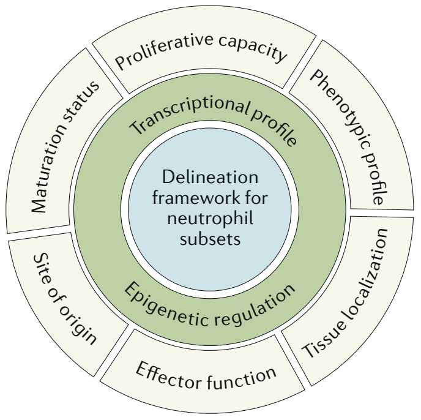
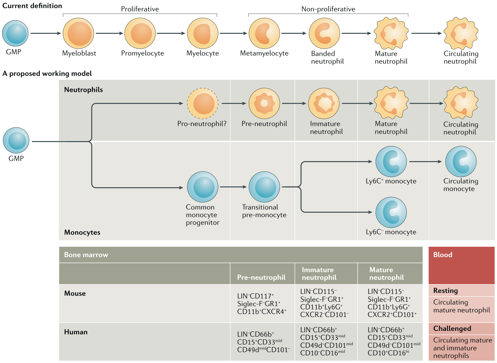
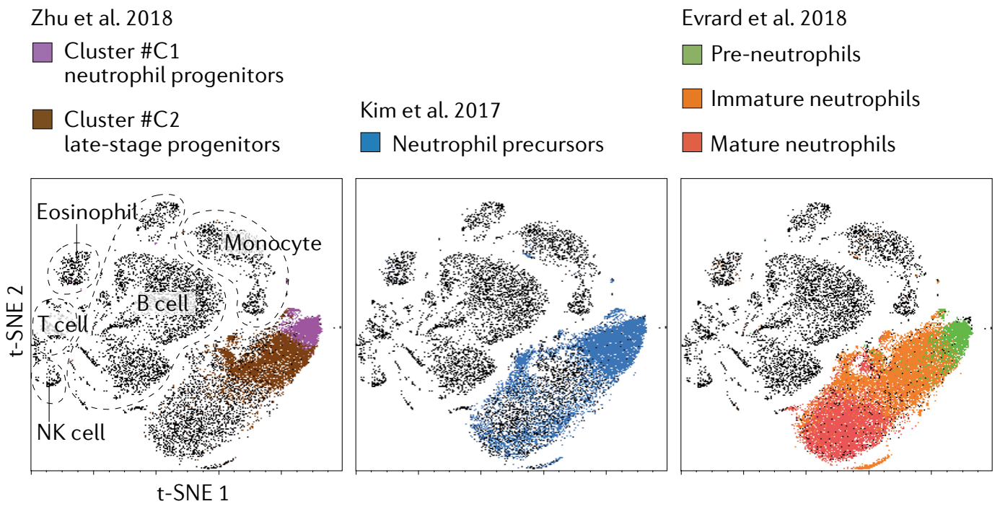
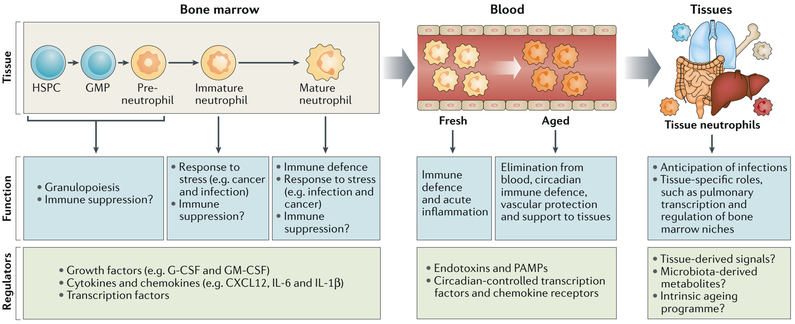
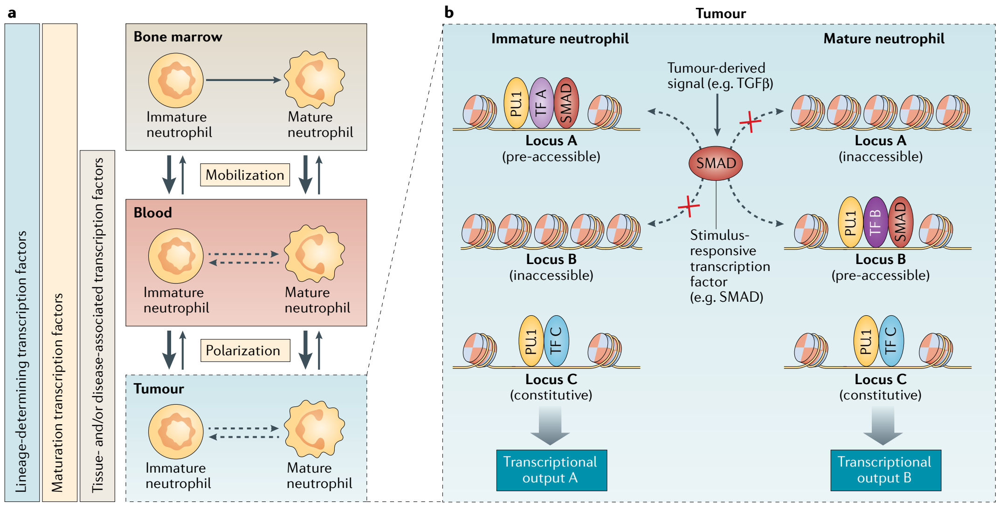

PERSPECTIVES · OPINION

# Heterogeneity of neutrophils

Lai Guan Ng[iD](http://orcid.org/0000-0003-1905-3586 "ORCID 0000-0003-1905-3586"), Renato Ostuni[iD](http://orcid.org/0000-0003-0460-3426 "ORCID 0000-0003-0460-3426") and Andrés Hidalgo[iD](http://orcid.org/0000-0001-5513-555X "ORCID 0000-0001-5513-555X")

Abstract | Structured models of ontogenic, phenotypic and functional diversity have been instrumental for a renewed understanding of the biology of immune cells, such as macrophages and lymphoid cells. However, there are no established models that can be used to define the diversity of neutrophils, the most abundant myeloid cells. This lack of an established model is largely due to the uniquely short lives of neutrophils, a consequence of their inability to divide once terminally differentiated, which has been perceived as a roadblock to functional diversity. This perception is rapidly evolving as multiple phenotypic and functional variants of neutrophils have been found, both in homeostatic and disease conditions. In this Opinion article, we present an overview of neutrophil heterogeneity and discuss possible mechanisms of diversification, including genomic regulation. We suggest that neutrophil heterogeneity is an important feature of immune pathophysiology, such that co-option of the mechanisms of diversification by cancer or other disorders contributes to disease progression.

**Fig. 1 | A framework for subset identification.** A systematic and integrated framework for assessing neutrophil subsets on the basis of their proliferative capacity, maturation status, phenotypic profile, site of origin, tissue localization and effector function, which can change rapidly. By contrast, transcriptional and epigenetic properties represent core characteristics for longer-term marking of true subsets.

Immunity functions through the concerted actions of diverse cell types with specialized tasks. Hence, a central goal of modern immunology has been to catalogue cells in an effort to unify observations, generate hypotheses and propose basic biological principles. However, ‘naming’ subsets creates rules and restrictions that typically prevent capturing the true biology of a cell. This observation is particularly evident for ‘plastic’ immune cells, for which the capacity to adapt to environmental changes is a defining property. Recent unbiased single-cell analyses are reshaping decades-old nomenclatures and models of ontology and in fact challenge the possibility of defining discrete cell types and states in the immune system using simple and rigid rules. Instead, by considering protein and transcript composition, functional properties and tissue distribution together with genomic organization may provide a more definitive way to classify immune cells and to call for true heterogeneity (Fig. 1).

Neutrophils are traditionally defined as a type of myeloid cell with a short half-life, specific nuclear morphology, defined granule content and surface expression of markers, such as the glycosylphosphatidylinositol (GPI)-linked receptor Ly6G in mice or CD66b in humans1. Over the past decade, however, neutrophils have been described in a variety of ‘flavours’: from immature cells that are numerous in the bone marrow and can be rapidly mobilized into the circulation to cells with non-overlapping profiles and regulatory functions in physiological and pathological conditions, including infection, sterile injury, autoimmunity and cancer. Unlike other myeloid cells in which diverse functional properties have been linked to molecular programmes driven by specific transcription factors, the contribution of transcription factors to neutrophil heterogeneity beyond developmental programmes2,3 remains unknown.

In this Opinion article, we present a critical discussion of neutrophil heterogeneity and outline potential underlying mechanisms, primarily on the basis of experimental mouse models, unless otherwise specified. We first discuss recent high-resolution analyses of granulopoiesis that highlight how specific neutrophil differentiation stages may be prone to generating diversity. We then provide an overview of neutrophil heterogeneity in healthy and diseased tissues, focusing on examples that best illustrate their plasticity in phenotype and function. Finally, we describe how existing principles of genomic organization and cell identity may apply to neutrophil heterogeneity.

## Neutrophil development

Neutrophils are the most abundant circulating leukocytes in humans. An estimate of 10⁷ neutrophils in mice and 10¹¹ in humans are produced each day, with transit times from the last cell division in the bone marrow to release into the circulation of about 3 and 6–7 days in mice and humans, respectively4–6. Although it is generally accepted that the half-life of circulating neutrophils is shorter than 1 day7, a recent study in humans calculated a lifespan of up to 5.4 days8. These studies highlight the need for a definitive and precise estimation of the neutrophil lifespan and suggest that neutrophils may persist in the circulation for periods of time sufficient to translate environmental signals into specific molecular programmes, a realization of conceptual importance for rationalizing neutrophil diversity in vivo.

**Fig. 2 | The neutrophil differentiation pathway.** Neutrophils are derived from granulocyte–monocyte progenitors (GMPs). Current characterization of neutrophil development defines two major phases: (1) a proliferative stage in which GMPs differentiate into myeloblasts, promyelocytes and myelocytes and (2) a non-proliferative stage in which myelocytes give rise to non-proliferating metamyelocytes, band cells and finally mature neutrophils. Here, we propose a working model in which bone marrow neutrophils in mice and humans can be divided into three subsets: a committed proliferative pre-neutrophil subset that sequentially differentiates into non-proliferating immature neutrophils and mature neutrophils. Comparing this pathway to the developmental hierarchy of monocytes, pre-neutrophils have the functional attributes of transitional pre-monocytes, suggesting that there could be a ‘common neutrophil progenitor’ (that is, pro-neutrophil) that is equivalent to the common monocyte progenitor. Of note, a recent study identified a heterogeneous early neutrophil progenitor that is likely to be upstream of pre-neutrophils14. It will be interesting to further define the earliest step of neutrophil progenitor specification and their subsequent commitment during granulopoiesis. In the steady state, only mature neutrophils are detected in the circulation. In response to inflammatory stimuli, immature neutrophils are also released into the circulation12. This proposed working model may provide a basis for the re-examination of granulopoiesis within the broader context of myeloid cell development, paving the way towards a better alignment of neutrophil functional heterogeneity in mice and humans.

Historically, granulocyte precursors in humans have been defined from density gradients followed by histological inspection of the different fractions upon Giemsa staining9. Classification of the different stages of granulopoiesis was assessed manually on the basis of morphological features, such as cell size, nuclear condensation and granule content. According to current paradigms, neutrophil development starts from granulocyte–monocyte progenitors (GMPs) and progresses through a continuum of maturation stages, ranging from a mitotic pool of granulocyte-committed precursors, comprising myeloblasts, promyelocytes and myelocytes, to a postmitotic or transition pool of metamyelocytes, band cells and segmented neutrophils10 (Fig. 2).

Although this model represents a valuable framework for defining granulopoiesis, it is generally acknowledged that morphological and histochemical observations are subjective, not indicative of developmental trajectories and functional properties, and incompatible with downstream analyses. Instead, transcriptomic advances at the single-cell level have allowed analyses of the dynamics of haematopoiesis and revealed the presence of early, intermediate and late human neutrophil precursors with distinct gene and transcription factor signatures11. Complementary to these studies, cell cycle-based and multiparametric flow analyses revealed three neutrophil subsets within the mouse bone marrow: a committed proliferative precursor, termed a pre-neutrophil, which sequentially differentiates into non-proliferating immature and mature neutrophils12. In mice, pre-neutrophils do not express markers for other leukocyte lineages but express CD117 (also known as KIT), whereas differential expression of CXC-chemokine receptor 4 (CXCR4), CXCR2 and CD101 allows discrimination of immature neutrophils (which are CXCR2−CD101−) and mature neutrophils (which are CXCR2+CD101+). On the other hand, human bone marrow neutrophils comprise three major subsets that are based on the absent expression of differentiated lineage markers and the expression of CD101, together with the presence of specific cell surface proteins, including CD66, CD15, CD33, CD10, CD16 and CD49d (see Fig. 2).

## Box 1 | Neutrophil heterogeneity in the bone marrow

Within the bone marrow, stromal, vascular and perivascular cells constitute the haematopoietic niche that provides instructive signals for the maintenance and differentiation of haematopoietic precursors23. Various studies have shown that haematopoietic stem cells and progenitor cells, including pre-neutrophils, are in close contact with CXC-chemokine ligand 12 (CXCL12)-expressing stromal cells in the bone marrow12. Although the CXCL12–CXC-chemokine receptor 4 (CXCR4) signalling pathway is crucial for pre-neutrophil retention in the bone marrow, CXCR4-mediated signals are dispensable for their differentiation into mature neutrophils. Unlike mature neutrophils, immature neutrophils do not express CXCR2 and are normally absent from the circulation. Because CXCR2 signalling is essential for neutrophil mobilization from the bone marrow51,134,135, this observation may suggest that immature neutrophils are programmed to remain in this tissue. However, in response to inflammatory stimuli, these cells can be mobilized into the circulation and recruited to sites of inflammation, similarly to mature neutrophils. By contrast, pre-neutrophils are not mobilized to the circulation or affected tissues during inflammatory responses12. These migratory and other characteristics observed in the bone marrow are indicative of the significant heterogeneity of neutrophils during maturation. This raises the fundamental question of whether heterogeneity originates only from the release into the blood of medullary neutrophils at different stages of maturation and/or through ‘priming’ of homogeneous circulating neutrophils by local signals in the extramedullary milieu.

Here, we propose a model whereby this pre-neutrophil population serves as a proliferative pool that can rapidly amplify neutrophil numbers on demand. By contrast, non-proliferative immature neutrophils represent a reservoir of neutrophils that can be rapidly deployed to the circulation, and mature neutrophils are important for effector functions. Additional subsets of recently identified neutrophil progenitors further add to resolving the stages of neutrophil specification in the bone marrow. One study delineates these proliferative progenitors into neutrophil progenitors (referred to as NePs) and late-stage progenitors14, whereas another study identified a late-lineage neutrophil precursor in the mouse bone marrow (referred to as NeuPs)13. Interestingly, the neutrophil precursors described by Zhu et al.14 were shown to have pro-tumoural functions14. The figure presents a comparative overview of t-distributed stochastic neighbour embedding (t-SNE) analyses of mouse bone marrow cells, defining the various committed neutrophil precursors and possible overlap at the single-cell level. Although the nomenclature differs between these studies, the overarching concept is that medullary neutrophil subsets can be defined by specific phenotypic, proliferative, transcriptional and functional properties. The leukocyte subsets, as well as the bone marrow neutrophil subsets, are annotated and colour-coded on the basis of published studies refs12–14.

Thus, several recent studies suggest that early-stage neutrophil precursor populations exist in human and mouse bone marrow12–14 (see Box 1). This refined definition of the developmental hierarchy of neutrophils in the bone marrow extends beyond taxonomical interest (Fig. 2), as much of the heterogeneity of neutrophils in homeostasis and disease may in part arise from the neutrophils at different developmental stages in the bone marrow, although this still remains to be formally demonstrated.

## Neutrophil diversity in health

**Fig. 3 | Stages of neutrophil heterogeneity in the steady state.** Progressively mature neutrophils in the bone marrow can be discriminated by defined sets of markers and morphological phenotypes, from granulocyte–monocyte progenitors (GMPs) to mature neutrophils, and display distinct functions: basic granulopoiesis (GMPs and pre-neutrophils), roles under stress conditions including cancer (immature and mature neutrophils) and immune defence (mature neutrophils in the steady state or during stress). Once in the blood, neutrophils undergo circadian ageing, a process that instructs additional heterogeneity during the day and induces a functional switch from a defensive role (by newly generated neutrophils) to homeostatic clearance from the blood and infiltration of tissues (by aged neutrophils). Circadian alterations in the blood and entry into tissues possibly confer vascular protection against excessive inflammation and anticipate potential infections in tissues. Once in tissues, neutrophils may undergo further phenotypic and functional diversification to perform supportive roles in certain tissues (such as the lungs and bone marrow) and are ultimately eliminated by phagocytosis. Various mechanisms could mediate the homeostatic changes of neutrophils during their life cycle, including cell-intrinsic myeloid-related and circadian-related transcription factors, or environmental cues derived from the microbiota or from tissues. CXCL12, CXC-chemokine ligand 12; G-CSF; granulocyte colony-stimulating factor; GM-CSF, granulocyte–macrophage colony-stimulating factor; HSPC, haematopoietic stem and progenitor cell; PAMP, pathogen-associated molecular pattern.

Once maturation has been completed in the bone marrow and the pool of mature cells is released into the circulation, neutrophils circulate with a set of preformed adhesion and chemotactic receptors and effector proteins to rapidly migrate and respond to multiple microbial and sterile challenges15. These defensive and inflammatory tasks constitute a primary function of neutrophils and are a source of phenotypic diversity that has been extensively investigated over the past few decades16–19. However, here we focus on the phenotypic and functional diversity of neutrophils in the steady state (Fig. 3).

***Heterogeneity in the bone marrow.*** Neutrophils are the most abundant cells in the bone marrow, and this compartment contains the largest pool of neutrophils in the body. Indeed, classical studies in human and animal models investigating the kinetics of neutrophil mobilization and distribution in different body compartments found that bone marrow reserves of granulocytes are much more abundant than those in the circulation20–22. In addition to providing an immune reservoir for deployment in situations of alarm, the bone marrow is a primary site of haematopoietic stem cell (HSC) maintenance, a function that relies on a dense network of vascular structures such as sinusoids and arterioles23. Interestingly, a recent study found that bone marrow-derived, but not circulating, neutrophils exert important regenerative support for the medullary sinusoids after a genotoxic insult through the production of tumour necrosis factor (TNF)24. Mature neutrophils within the bone marrow also produce prostaglandin E2 in response to adrenergic stimulation, and this lipid mediator enhances HSC retention by activating osteolineage niche cells25. A key feature of haematopoietic niches is the capacity to maintain HSCs in a quiescent state, which is fundamental in preventing proliferative exhaustion or DNA damage of the stem cell pool. Notably, bone marrow granulocytes that express histidine decarboxylase, a histamine-synthesizing enzyme, were shown to support the quiescence and repopulating capacity of a subset of myeloid-biased HSCs26. Overall, these recent studies in mice reveal specialized niche-supportive and HSC-supportive functions and functional diversity of neutrophils within the bone marrow, suggesting that neutrophils can adapt to their tissue of residence.

In addition to the various types of immature neutrophils at different stages of maturation, the bone marrow is also a site for recycling of circulating neutrophils, at least in mice. Indeed, a large fraction of mature neutrophils that have aged in the circulation are recruited back to the bone marrow with circadian frequency27,28. Although a main purpose of this return may simply be to eliminate dysfunctional cells, these aged neutrophils display niche-inhibitory functions that lead to the circadian release of haematopoietic precursors into the circulation27,29. Thus, the bone marrow provides an illustrative example of neutrophil diversity within a single compartment, with cells at different stages of maturation fulfilling specialized roles. It will be important to validate whether such functional diversity also exists in humans.

***Heterogeneity in the blood.*** Under steady-state conditions, neutrophils and other leukocyte subsets are released from the bone marrow and circulate for about half a day before infiltrating tissues and being removed from the blood27,30,31. Both processes occur with circadian frequency and, in the case of neutrophils, their time in the blood is thought to represent their full extramedullary life, whereas for lymphocytes, for example, presence in the blood normally represents a transit between lymphoid organs32. Although the relatively short time of neutrophils in the blood would suggest homogeneous properties of these cells, marked diurnal changes in phenotype do occur, a phenomenon referred to as neutrophil ageing33. Indeed, mouse and human neutrophils lose CD62L (also known as L-selectin) expression and gain CD11b and CXCR4 expression over ~6 hours27,34, their nuclei become hypersegmented and, at least in inflamed mouse venules, aged-like neutrophils appear to display enhanced integrin activation and capacity to form neutrophil extracellular traps (NETs)27,35. Notably, these features are significantly blunted in the early morning in mice, when neutrophils are recently released from the bone marrow. This finding suggests that neutrophils adjust their functions to the changing demands of the day — for example, to protect from microbial invasions during the animal’s active phase (when the exposure to pathogens is highest) or to exert reparative functions during the resting phase33,36.

Similar phenotypic oscillations have been found in neutrophils from healthy human volunteers and correlated with diurnal oscillations in reactive oxygen species (ROS) production and phagocytosis37. The changing properties of neutrophils during the day align with studies in mice showing that aged neutrophils (that is, those present at daytime) are more prone to damage the vasculature in a mouse model of sickle cell disease35. These findings are also consistent with the observed circadianicity of many forms of vascular disease in mammals38. Interestingly, these diurnal changes in neutrophil function correlate with transcriptional changes associated with Toll-like receptor and CXCR2 signalling, adhesion, cell death35 and marked changes in their migratory properties during the day34. One interpretation of these observations is that the lifetime of neutrophils in the blood allows for synchronous diversification over time.

Of particular interest are the underlying mechanisms of circadian diversification of neutrophils. Glucocorticoid signalling in humans37 and bacterially derived metabolites in mice35,39 have been proposed to drive diurnal ageing in neutrophils. Alternatively, we have found that circadian clock genes also regulate the diurnal variations in phenotype and function in a cell-intrinsic manner34 through a process similar to that reported for inflammatory monocytes40. Indeed this would be consistent with diurnal patterns of clock gene expression in human and mouse neutrophils34,37. Defining the exact mechanisms underlying neutrophil diversification in the blood may hold the key for therapeutic intervention against the detrimental activity of specific subsets, particularly those prone to damage the cardiovascular system41,42.

***Do tissue-specific neutrophils exist?*** Tissues provide instructive signals for immune cell activation, differentiation and functional diversity. For example, macrophages are highly responsive to their microenvironment and adopt diverse phenotypes, transcriptional profiles and functions that are tailored to the demands of each tissue43,44. Indeed, despite their ‘immune’ denomination, it is now clear that macrophages perform specialized tissue-supportive functions that are unrelated to immunity — from neuronal maturation in the brain to electrical conduction in the heart45. Although compelling evidence suggests that, similar to macrophages, neutrophils are also present in many unperturbed tissues at least in mice, they are typically found in low numbers, with the exception of the bone marrow, spleen and lungs30. Thus, the prevailing assumption has been that tissue neutrophils reflect technical contaminants from blood.

Challenging this assumption, however, mass cytometry coupled with dimensionality reduction analyses uncovered several clusters of mouse neutrophils in different tissues on the basis of the expression of over 30 markers, hinting for the first time towards true phenotypic diversity in healthy tissues46. Consistent with this, we have found that most tissues are actively infiltrated by neutrophils in the steady state, with the conspicuous exception of the brain and gonads30. Although the potential functions for these homeostatic populations remain uncertain, it is noteworthy that neutrophils present in intact skin display scout-like behaviour that may allow for early detection of damage and facilitate secondary recruitment of other neutrophils from the vicinity or from the circulation47,48. In the lower female reproductive tract, homeostatic infiltration is regulated by chemokine gradients that form during the ovarian cycle, thereby conferring protection against pathogens that could potentially breach the vaginal lumen49,50. In the lungs, a large population of neutrophils is marginated in the pulmonary microcirculation through CXCR4-mediated signalling51, thereby enabling rapid responses to microbial challenges52. These findings suggest that neutrophils in naive tissues may generally serve as immune sentinels; however, the acquisition of tissue-specific phenotypes suggests that neutrophils may be differentially primed by tissue-derived signals. It is important to note that these features of neutrophil diversity in mouse tissues are yet to be confirmed in humans.

Intratissue heterogeneity can also occur in defined microenvironments, as suggested by studies showing that immature neutrophils in the mouse spleen are immotile whereas mature neutrophils actively patrol the red pulp, suggesting specialized roles during bacterial infection53. In addition, marginal zone neutrophils in the human spleen adopt unique B cell-stimulating properties through the secretion of cytokines, chemoattractants and the pattern recognition receptor pentraxin 3 that stimulate class switch recombination and immunoglobulin production by B cells that reside in this region54,55. These neutrophils, which represent the best characterized pool of tissue neutrophils in humans, acquire their distinctive low levels of CD15 and CD16 and transcriptional signature postnatally, through microbiota-dependent IL-10 and JAK2–STAT3 signalling55. A more thorough characterization of neutrophils in other mouse and human tissues will help to determine whether, similar to macrophages, neutrophils adopt functions that are tailored to their tissue of residence (Fig. 3).

## Neutrophil heterogeneity in disease

Although the recognition that neutrophils are phenotypically heterogeneous in healthy tissues is recent, their diversity in conditions of inflammation, infection and chronic disease has been appreciated for decades. Various phenotypic and functional properties of neutrophils rapidly change under conditions of sterile or infectious inflammation. For example, neutrophils can adopt different forms of migration across vascular walls56, express an array of pattern recognition receptors and secrete different types of cytokines during infections57, or they can be endowed, or not, with the ability to impair T cell activation58. In the context of vascular repair and hypoxia, a distinct population of VEGFR1+CXCR4+ neutrophils was found that displays tropism for angiogenic foci, produces matrix metalloproteinase 9 (MMP9) in response to vascular endothelial growth factor A (VEGFA) and cooperates with macrophages for vascular growth59,60. Heterogeneity under all these scenarios has been reviewed recently45,61,62 and is not further addressed here. Instead, we focus our discussion on chronic inflammatory disease and cancer, as they represent prime examples of disease-induced heterogeneity among neutrophils.

***Neutrophil heterogeneity in cancer.*** Tumours are endowed with a functionally important ‘immune stroma’, which plays varying and even opposing roles in disease progression63. For example, macrophages can be antitumoural at early stages of disease and later adopt pro-tumoural functions as signals from the tumour instruct reparative, immune-suppressive and pro-angiogenic properties64. Only recently have neutrophils emerged as similarly important players and contributors of the tumoural stroma, and they are found at highly variable numbers within the tumour depending on the type of cancer65. Importantly, a large pan-cancer meta-analysis in thousands of human tumours found a neutrophil signature associated with poor disease outcome despite their relative low numbers compared with other leukocyte subsets66. In keeping with this notion, the frequency of circulating neutrophils and the ratio between neutrophils and lymphocytes are being evaluated as prognostic biomarkers of cancer progression67.

Similar to macrophages, neutrophils appear to undergo a reprogramming process in the spleen to favour tumour growth as shown in an experimental mouse model of KRAS-driven lung adenocarcinoma68. Consistent with the notion of an immune switch during the course of disease, depletion of neutrophils is detrimental at early disease stages and becomes protective at late stages69–71. An outstanding question therefore is how tumour-derived signals reprogramme neutrophils to allow this functional switch and heterogeneous behaviour. Is it at the level of the bone marrow where decisions on cell differentiation and mobilization are taken? In support of this view, an atypical chemokine receptor 2 (ACKR2)-dependent programme in haematopoietic progenitors was shown to elicit pro-metastatic functions72. Additionally, factors produced by the primary tumour (such as IL-1β, granulocyte colony-stimulating factor (G-CSF) or granulocyte–macrophage colony-stimulating factor (GM-CSF)) can induce granulopoiesis through RORC and C/EBPβ expression and release of immature neutrophils (including the so-called granulocytic myeloid-derived suppressor cells (G-MDSCs)) to the circulation and into the tumour73.

This mobilizing axis appears to be critical for the recruitment of tumour-supportive and metastasis-supportive neutrophils in several settings, including obese mice and humans, in which GM-CSF critically favours pulmonary metastasis of breast cancer cells74. The premature release of neutrophils due to inflammation and cancer can result in the presence of circulating immature cells with incomplete nuclear condensation and lesser granule content, which may contribute to the presence of neutrophils with low buoyant density in patients with cancer or chronic inflammatory disease. Consistent with these increases, pre-neutrophil expansion is observed in the spleen of tumour-bearing mice12, and splenic immature neutrophils with immunosuppressive properties have also been reported75. Thus, cancer triggers a type of ‘emergency’ granulopoiesis similar to that elicited by infection76 that contributes to neutrophil heterogeneity and disease progression.

Early evidence revealed transforming growth factor-β (TGFβ) as a central regulator of tumour-associated neutrophil responses, as its blockade induced a functional switch in neutrophils from pro-tumoural to antitumoural77. More recently, at least three distinct populations of neutrophils were reported in the circulation of tumour-bearing mice and human patients78 on the basis of density properties. Those with lower density (low-density neutrophils) increased during disease progression, whereas high-density neutrophils, which predominate in healthy individuals, differentiated into low-density neutrophils through a mechanism dependent on TGFβ that rendered them less cytotoxic against malignant cells78. In the context of lung adenocarcinoma, a subset of tumour-infiltrating Siglec-F+ neutrophils with pro-tumoural properties presented a TGFβ signalling signature79. Although the pro-tumoural profile was instructed by bone marrow osteoblasts and the Siglec-F+ signature already appeared in blood, full reprogramming required entry into the lung and correlated with disease outcome in a human cohort79. Thus, TGFβ is of particular interest as a neutrophil reprogramming factor given its broad links with tumour progression80. Opposing the actions of TGFβ, growing evidence suggests that interferon signalling instructs antitumoural properties in neutrophils81,82. Collectively, the observations made in the context of cancer highlight the plasticity of neutrophils and reveal that instructive signals from different tissues (bone marrow, spleen, blood and tumours) can contribute to the phenotypic and functional heterogeneity of neutrophils.

***Neutrophil heterogeneity in chronic inflammation.*** Neutrophils play dominant roles in early stages of inflammation but can additionally perpetuate damage to organs if the instigating stimulus persists83. Like in cancer, acute insults elicit rapid activation of bone marrow niches, resulting in remodelling of stromal elements and activation of myelopoiesis84,85. Acute inflammatory insults, including infection or ischaemia, induce the production of G-CSF, GM-CSF or other myelopoietic factors that favour granulocyte production76,84,86. In humans treated with low doses of endotoxin, at least three granulocyte populations with distinct phenotypic and proteomic properties appear in the blood, of which only CD16hiCD62Llow cells have T cell-suppressing activity58. This population, however, does not display features of immaturity, suggesting that newly produced neutrophils and those recruited from other sources contribute to generating phenotypic and functional heterogeneity during inflammation. Similarly, G-CSF can also recruit CD10+ mature neutrophils with immunosuppressive functions into the human blood, although interestingly, it also mobilizes CD10− immature, immunostimulatory neutrophils that promote T cell survival and proliferation87.

When inflammation is made chronic by a persistent stimulus, such as elevated cholesterol in atherosclerosis, the sustained production of neutrophils can create a vicious cycle of inflammation and tissue damage88. In cardiovascular disease models, monocytes undergo maturation in the spleen before migrating to the injured tissues89, suggesting that this may also be an organ of further functional specification for neutrophils during chronic inflammation. Neutrophils have also been associated with long-term neurodegenerative disorders90,91 and with acute brain damage after stroke92. Paradoxically, in a mouse model of stroke, neutrophils were essential to reduce brain injury in the presence of rosiglitazone, a peroxisome proliferator-activated receptor-γ (PPARγ) agonist93. These beneficial neutrophils exhibited features of M2-like macrophages (expression of CD206 and chitinase-like protein 3 (also known as secreted protein YM1)) and could already be detected in the bone marrow and blood of infarcted mice93. These observations suggest that neutrophils can be rapidly reprogrammed in the bone marrow towards phenotypes that antagonize inflammation, yet the signals and the exact cell populations targeted (mature or immature) remain undefined.

In addition to cardiovascular disease, neutrophils have been prominently associated with autoimmune disease. A prime example is systemic lupus erythematosus (SLE), a disease characterized by the presence of autoantibodies against double-stranded RNA and ribonucleoproteins that deposit in various organs and cause progressive damage94. Early studies showed that patients with SLE display interferon and neutrophil signatures in the blood95, a finding that was later extended to show that neutrophils incited activation of plasmacytoid dendritic cells and type I interferon production through the release of NETs96,97. These DNA–protein structures contain damage-associated molecular patterns (DAMPs) and autoantigens that can additionally elicit antibody production and have been associated with other forms of autoimmunity, including vasculitis, rheumatoid arthritis, antiphospholipid syndrome and even type 1 diabetes98. In most instances, cytokines, antibodies or metabolites associated with each of these disorders can trigger NET formation, thereby perpetuating disease.

Relevant for our discussion is whether specific populations of neutrophils exist that are prone to produce NETs and trigger disease. Indeed, only a fraction of neutrophils from the blood of healthy individuals form NETs even when challenged with strong agonists. Likewise, there is a marked variability in the capacity of neutrophils across species and even among different mouse strains to form NETs99. In the case of SLE, low-density neutrophils with density features similar to those described in cancer are markedly elevated in the circulation of patients, but they are pro-inflammatory, as they actively produce inflammatory cytokines and kill endothelial cells in vitro100. Low-density neutrophils in patients with SLE also display enhanced NET formation, suggesting that the presence of this type of neutrophil may underlie other forms of autoimmune disease98,101. As proposed in the context of cancer, low-density neutrophils could represent populations of immature neutrophils that are prematurely mobilized from the bone marrow and coexist with fully mature cells in the blood of patients with SLE.

The presence of mobilizing cytokines and interferons in patients with SLE may release immature neutrophils filled with granule proteins and partially condensed DNA, which makes them prone to form NETs. Although this remains speculative, it could explain the elevated presence of granule transcripts in lupus-associated low-density neutrophils and the strong association of SLE with atherosclerosis and cardiovascular disease102. Alternative origins for immune-suppressive neutrophils are nonetheless possible as, for example, activation with potent agonists (lipopolysaccharide, N-formyl-methionyl-leucyl-phenylalanine and phorbol myristate acetate) can generate neutrophils of low density but mature morphology with T cell-suppressive activity58,103. Intriguingly, epigenetic marks in the neutrophil genome have been associated with different types of autoimmune inflammation in human patients104, suggesting specific programming of neutrophils under this environment.

## Mechanisms of heterogeneity

Although the existence of heterogeneity among neutrophils is now recognized, the mechanisms and biological relevance of this diversity remain under debate. To what extent does heterogeneity represent bona fide cell programming rather than activation? Are there unifying mechanisms of diversity, and how do they adapt to specific pathophysiological contexts? In our earlier discussion, we hinted at two potential and non-mutually exclusive mechanisms: intrinsic heterogeneity of neutrophils in the bone marrow and blood and exposure to local or systemic extrinsic factors that modify neutrophil properties. Accumulating evidence indicates that both processes impinge on highly coordinated transcriptional and epigenomic dynamics, a feature often overlooked in neutrophils. Below, we highlight recent examples of genomic plasticity in neutrophils and speculate how they may provide a mechanistic framework to rationalize heterogeneity.

### Structure of the neutrophil genome and transcriptional plasticity.

The neutrophil nucleus is organized into a peculiar structure with 3–5 lobes, each comprising physically interacting regions located at large distances (>3 Mb) on the linear DNA105. This compacted architecture may provide physical flexibility during crawling or phagocytosis106 and support the formation and release of NETs107, but it may also limit transcriptional dynamics105. Indeed, the low RNA content of mature neutrophils compared with other myeloid cells may be viewed as a constraint to plasticity. Recent analyses are challenging this notion, as broad and selective genomic remodelling occurs throughout the neutrophil life cycle.

Neutrophil maturation is linked to progressive silencing of hundreds of genes that control biosynthetic and proliferative processes, whereas granule, antimicrobial and immune response genes are induced108. Notably, genes involved in effector functions such as antiviral defence are selectively expressed in human circulating neutrophils compared with immediate bone marrow precursors12,109, showing that even terminal neutrophil maturation is linked to active gene transcription. Dynamic changes of the epigenome (namely, the repertoire of gene regulatory elements and associated epigenetic, histone and nucleosome marks) also occur during neutrophil development109,110.

In the steady state, mature neutrophils sense and adapt to subtle environmental changes. Recent analyses found that the basal neutrophil transcriptome is highly variable among human donors111, to a higher extent than monocytes or lymphocytes112, and genes with hypervariable expression in neutrophils were enriched in immune functions such as inflammasome activation and antiviral responses. These and other studies113–116 showed that, although genetic factors dictate most of the interindividual variability in neutrophil gene expression113,116, hundreds of high-variance genes might be linked to epigenetic or chromatin control111,112. Accordingly, human neutrophils display interindividual variability in DNA methylation profiles111,112,114, reinforcing the notion that epigenomic mechanisms may fine-tune neutrophil gene expression.

The extent of transcriptional plasticity of neutrophils is evident upon exposure to stimuli such as microbial components, cytokines and growth factors. Hundreds of genes are modulated under these conditions115,117,118 in a manner reflecting diverse chromatin-based control119. Some pro-inflammatory genes are induced with very fast kinetics, reaching maximal expression minutes after stimulation. This behaviour, exemplified by *CXCL8* (encoding IL-8), is indicative of a pre-poised local chromatin organization able to support immediate transcription. Conversely, induction of genes such as *IL6* (ref.120) requires previous chromatin remodelling and deposition of histone marks at regulatory elements in order to permit the recruitment and licensing of transcriptional machinery. Chromatin-dependent mechanisms are also in place to prevent gene induction at specific loci, such as *IL10* in human neutrophils121. Thus, both pre-existing and stimulus-induced locus accessibility and chromatin modifications enable dynamic responses to microenvironmental signals, overall contributing to the plastic phenotype of neutrophils.

### Genomic mechanisms of neutrophil plasticity: nature or nurture?

Accumulating evidence indicates that neutrophils are capable of functional, phenotypic and molecular adaptations to context-specific cues. Although these features are incorporated into mechanistic models for plastic immune cells such as macrophages122, analogous frameworks are not available for neutrophils. We suggest that, at least to some extent, established principles of genomic organization may also apply to neutrophils and help to rationalize their plasticity and context-dependent heterogeneity.

## Box 2 | Maturation transcription factors and organization of neutrophil epigenomes

Given that the myeloid lineage-determining transcription factors PU.1, C/EBPα and C/EBPβ are generally expressed at high levels throughout neutrophil development, it is likely that additional collaborating transcription factors control developmental stage-specific epigenomic organization in these cells. These transcription factors are also expected to be required for proper neutrophil differentiation so that their absence or dysfunction is linked to neutropenias136. For example, C/EBPε is expressed by lineage-committed granulocyte progenitors, and its deletion leads to neutrophil progenitor arrest, defective expression of genes encoding for granule proteins and neutropenia3,9,12,137. Krüppel-like factor 5 is also active during early stages of granulocyte differentiation, where it controls neutrophil production at the expense of eosinophils138. Lymphoid enhancer-binding factor 1 is expressed in myeloid progenitors, and its inactivation leads to a differentiation block at the promyelocyte stage, as revealed by studies in individuals with congenital neutropenia139. In addition to positive regulators of neutrophil maturation, it is likely that repressive mechanisms have a role in establishing the neutrophil epigenome. The transcriptional repressor zinc-finger protein GFI1 is expressed during early stages of monocyte–neutrophil commitment and is essential for neutrophil development140. Indeed, GFI1 is co-expressed with interferon regulatory factor 8 (IRF8) in rare populations of haematopoietic progenitors with bivalent monocyte–neutrophil potential and counteracts the formation and maintenance of IRF8-induced enhancers141. The antagonistic circuit involving GFI1 and IRF8 is likely to be a crucial component of neutrophil maturation, as IRF8 is a major driver of monocyte lineage commitment and expansion at the expense of neutrophils142–144, and IRF8 actively controls the formation of the enhancer landscape in these cells145,146. As more high-resolution genomic analyses of neutrophil maturation are performed12,14,109, we expect more candidates to be added to this list.

In macrophages, few lineage-determining transcription factors (LDTFs), such as PU.1, C/EBPα, C/EBPβ and others, collaborate with a heterogeneous set of transcription factors with tissue-restricted43,123,124 and/or stimulus-dependent activity125–128 to specify the repertoire of active promoters and enhancers and ensuing gene expression programmes. Some myeloid LDTFs can access their target sequences and modify the surrounding chromatin even when ectopically expressed in unrelated cell types (a property of ‘pioneer transcription factors’)129. Because neutrophils express PU.1, C/EBPα and C/EBPβ at high levels and require them for proper maturation and stimulus-induced gene expression108, it is plausible that myeloid LDTFs may also establish the epigenome of these cells during granulopoiesis, likely in coordination with other transcription factors130 (Box 2). Whether tissue-restricted transcription factors also act in neutrophils as they migrate to tissues and are exposed to local homeostatic signals, such as haem in the spleen, remains to be determined.

**Fig. 4 | A model for genomic control of neutrophil heterogeneity in cancer.** a | During homeostasis, neutrophil differentiation in the bone marrow is controlled by myeloid lineage-determining transcription factors (such as PU.1, C/EBPα and C/EBPβ) as well as by transcription factors with developmental stage-specific expression or activity. We hypothesize that the combinatorial actions of these transcription factors may shape the intrinsic epigenomic diversity of neutrophil subsets. In this model, upon systemic inflammatory stress elicited by growing tumours (for example, involving release of granulocyte colony-stimulating factor (G-CSF)), neutrophil populations with diverse stages of maturation are mobilized to the blood and tumour tissue, where both immature and mature neutrophils are exposed to tumour-derived factors that further activate tissue-associated and disease-associated transcription factors. b | This genomic model describes how pre-existing differences in the epigenomic landscape of neutrophil subsets (such as immature versus mature) may influence the transcriptional response to shared tumour-derived signals. Representative loci are shown to exemplify a constitutively active region (locus C) and two loci that are selectively accessible in immature (locus A) or mature (locus B) neutrophils as a consequence of the genomic activity of different maturation transcription factors (TF A and TF B, respectively). Upon exposure to tumour-derived factors (such as transforming growth factor-β (TGFβ)), activated transcription factors (represented in the figure by SMAD) bind to already accessible sites, resulting in diverse transcription factor occupancy genome-wide and in distinct transcriptional outputs. Although the model depicted here is an oversimplification and requires experimental validation, we propose that it may provide a framework to rationalize neutrophil diversity.

Understanding how the neutrophil epigenome is established during differentiation is relevant, as pre-existing differences between neutrophil subsets in the bone marrow or blood may contribute to heterogeneity in tissues or disease (Fig. 4). Upon stress, neutrophils at different stages of maturation, with diverse chromatin and transcriptional landscapes112, are mobilized from the bone marrow or recruited from the blood to target sites. This observation is evident in tumours, where immature and mature neutrophils often coexist and are exposed to a common milieu but display heterogeneous activation states131. One possible explanation for this diversity could be that the neutrophil subsets recruited to tumours may mount different transcriptional responses to shared extrinsic signals. Although this remains speculative at the moment, it is well known that the binding sites of most stimulus-activated transcription factors are largely cell type-specific and are dictated by the pre-existing chromatin landscape. For instance, TGFβ stimulation of myeloid, muscle or embryonic stem cells resulted in binding of SMAD transcription factors to different sites, previously made accessible by LDTFs132. Analogously, other families of stimulus-activated transcription factors, including nuclear factor-κB (NF-κB) and STATs, bind to the genome in a cell type-specific manner and lead to diverse transcriptional outputs128,133. An attractive hypothesis is therefore that cytokines or other stimuli present in the tumour microenvironment or different tissues may trigger different biological outputs in recruited neutrophil subsets, at least partly because of differences in the chromatin landscape. Recent and future developments linking high-resolution single-cell genomics, lineage tracing and imaging technologies are poised to address these issues and uncover the rules of neutrophil diversity.

## Future perspectives

With the increased appreciation that neutrophils are far more heterogeneous than initially thought, and the characterization of new populations in health and disease, it is becoming clear that these cells are in functional terms far more than mere effectors of inflammation. High-end analytical technologies, including genomic and epigenomic sequencing at single-cell resolution, advanced imaging and mass cytometry, will expand the palette of neutrophil subsets and discover new functions. This knowledge will in turn open up the possibility to harness the therapeutic potential of neutrophil subsets. For instance, the proliferative neutrophil precursors could be used as a bridging treatment when transferred in combination with HSCs to accelerate the recovery of haematopoiesis and to enhance the immune competence of patients undergoing bone marrow transplantation. On the other hand, dissection of the mechanisms underlying heterogeneity will offer new avenues for therapeutic intervention in diseases driven by neutrophils — for example, by promoting effector functions during neutropenia or suppressive properties in autoimmune disorders. Likewise, manipulation of circadian ageing may provide benefit by promoting clearance of neutrophils from the blood into tissues, thereby improving immune surveillance while simultaneously protecting the vasculature from their toxic action. Finally, development of new antitumoural strategies will enormously benefit from proper comprehension of the origin and programming mechanisms of tumour-supportive neutrophils. The exponential growth that we are witnessing in this emerging area of research should place neutrophils — in their many flavours — in a prominent position among immune cells.

Lai Guan Ng[iD](http://orcid.org/0000-0003-1905-3586 "ORCID 0000-0003-1905-3586") 1*, Renato Ostuni[iD](http://orcid.org/0000-0003-0460-3426 "ORCID 0000-0003-0460-3426") 2,3* and Andrés Hidalgo[iD](http://orcid.org/0000-0001-5513-555X "ORCID 0000-0001-5513-555X") 4,5*

1Singapore Immunology Network (SIgN), A*STAR, Biopolis, Singapore, Singapore.

2Genomics of the Innate Immune System Unit, San Raffaele-Telethon Institute for Gene Therapy (SR-Tiget), IRCCS San Raffaele Scientific Institute, Milan, Italy.

3Vita-Salute San Raffaele University, Milan, Italy.

4Area of Cell and Developmental Biology, Fundación Centro Nacional de Investigaciones Cardiovasculares Carlos III (CNIC), Madrid, Spain.

5Institute for Cardiovascular Prevention, Ludwig Maximillians University, Munich, Germany.

*e-mail: Ng_Lai_Guan@immunol.a-star.edu.sg; ostuni.renato@hsr.it; ahidalgo@cnic.es

https://doi.org/10.1038/s41577-019-0141-8

Published online 28 February 2019

1. Pillay, J., Tak, T., Kamp, V. M. & Koenderman, L. Immune suppression by neutrophils and granulocytic myeloid-derived suppressor cells: similarities and differences. *Cell. Mol. Life Sci.* **70**, 3813–3827 (2013).

2. Giladi, A. et al. Single-cell characterization of haematopoietic progenitors and their trajectories in homeostasis and perturbed haematopoiesis. *Nat. Cell Biol.* **20**, 836–846 (2018).

3. Paul, F. et al. Transcriptional heterogeneity and lineage commitment in myeloid progenitors. *Cell* **163**, 1663–1677 (2015).

4. Fliedner, T. M., Cronkite, E. P., Killmann, S. A. & Bond, V. P. Granulocytopoiesis. II. Emergence and pattern of labeling of neutrophilic granulocytes in humans. *Blood* **24**, 683–700 (1964).

5. Lord, B. I. et al. Myeloid cell kinetics in mice treated with recombinant interleukin-3, granulocyte colony-stimulating factor (CSF), or granulocyte-macrophage CSF in vivo. *Blood* **77**, 2154–2159 (1991).

6. Basu, S., Hodgson, G., Katz, M. & Dunn, A. R. Evaluation of role of G-CSF in the production, survival, and release of neutrophils from bone marrow into circulation. *Blood* **100**, 854–861 (2002).

7. Tak, T., Tesselaar, K., Pillay, J., Borghans, J. A. & Koenderman, L. What’s your age again? Determination of human neutrophil half-lives revisited. *J. Leukoc. Biol.* **94**, 595–601 (2013).

8. Pillay, J. et al. In vivo labeling with 2H2O reveals a human neutrophil lifespan of 5.4 days. *Blood* **116**, 625–627 (2010).

9. Bjerregaard, M. D., Jurlander, J., Klausen, P., Borregaard, N. & Cowland, J. B. The in vivo profile of transcription factors during neutrophil differentiation in human bone marrow. *Blood* **101**, 4322–4332 (2003).

10. Dancey, J. T., Deubelbeiss, K. A., Harker, L. A. & Finch, C. A. Neutrophil kinetics in man. *J. Clin. Invest.* **58**, 705–715 (1976).

11. Velten, L. et al. Human haematopoietic stem cell lineage commitment is a continuous process. *Nat. Cell Biol.* **19**, 271–281 (2017).

12. Evrard, M. et al. Developmental analysis of bone marrow neutrophils reveals populations specialized in expansion, trafficking, and effector functions. *Immunity* **48**, 364–379 (2018).

13. Kim, M. H. et al. A late-lineage murine neutrophil precursor population exhibits dynamic changes during demand-adapted granulopoiesis. *Sci. Rep.* **7**, 39804 (2017).

14. Zhu, Y. P. et al. Identification of an early unipotent neutrophil progenitor with pro-tumoral activity in mouse and human bone marrow. *Cell Rep.* **24**, 2329–2341 (2018).

15. Sadik, C. D., Kim, N. D. & Luster, A. D. Neutrophils cascading their way to inflammation. *Trends Immunol.* **32**, 452–460 (2011).

16. Kolaczkowska, E. & Kubes, P. Neutrophil recruitment and function in health and inflammation. *Nat. Rev. Immunol.* **13**, 159–175 (2013).

17. Kruger, P. et al. Neutrophils: between host defence, immune modulation, and tissue injury. *PLOS Pathog.* **11**, e1004651 (2015).

18. Ley, K., Laudanna, C., Cybulsky, M. I. & Nourshargh, S. Getting to the site of inflammation: the leukocyte adhesion cascade updated. *Nat. Rev. Immunol.* **7**, 678–689 (2007).

19. Phillipson, M. & Kubes, P. The neutrophil in vascular inflammation. *Nat. Med.* **17**, 1381–1390 (2011).

20. Craddock, C. G. Jr., Perry, S., Ventzke, L. E. & Lawrence, J. S. Evaluation of marrow granulocytic reserves in normal and disease states. *Blood* **15**, 840–855 (1960).

21. Donohue, D. M., Reiff, R. H., Hanson, M. L., Betson, Y. & Finch, C. A. Quantitative measurement of the erythrocytic and granulocytic cells of the marrow and blood. *J. Clin. Invest.* **37**, 1571–1576 (1958).

22. Perry, S., Weinstein, I. M., Craddock, C. G. Jr & Lawrence, J. S. The combined use of typhoid vaccine and P32 labeling to assess myelopoiesis. *Blood* **12**, 549–558 (1957).

23. Wei, Q. & Frenette, P. S. Niches for hematopoietic stem cells and their progeny. *Immunity* **48**, 632–648 (2018).

24. Bowers, E. et al. Granulocyte-derived TNFalpha promotes vascular and hematopoietic regeneration in the bone marrow. *Nat. Med.* **24**, 95–102 (2018).

25. Kawano, Y. et al. G-CSF-induced sympathetic tone provokes fever and primes antimobilizing functions of neutrophils via PGE2. *Blood* **129**, 587–597 (2017).

26. Chen, X. et al. Bone marrow myeloid cells regulate myeloid-biased hematopoietic stem cells via a histamine-dependent feedback loop. *Cell Stem Cell* **21**, 747–760 (2017).

27. Casanova-Acebes, M. et al. Rhythmic modulation of the hematopoietic niche through neutrophil clearance. *Cell* **153**, 1025–1035 (2013).

28. Martin, C. et al. Chemokines acting via CXCR2 and CXCR4 control the release of neutrophils from the bone marrow and their return following senescence. *Immunity* **19**, 583–593 (2003).

29. Mendez-Ferrer, S., Lucas, D., Battista, M. & Frenette, P. S. Haematopoietic stem cell release is regulated by circadian oscillations. *Nature* **452**, 442–447 (2008).

30. Casanova-Acebes, M. et al. Neutrophils instruct homeostatic and pathological states in naive tissues. *J. Exp. Med.* **215**, 2778–2795 (2018).

31. Scheiermann, C. et al. Adrenergic nerves govern circadian leukocyte recruitment to tissues. *Immunity* **37**, 290–301 (2012).

32. Scheiermann, C., Frenette, P. S. & Hidalgo, A. Regulation of leucocyte homeostasis in the circulation. *Cardiovasc. Res.* **107**, 340–351 (2015).

33. Adrover, J. M., Nicolas-Avila, J. A. & Hidalgo, A. Aging: a temporal dimension for neutrophils. *Trends Immunol.* **37**, 334–345 (2016).

34. Adrover, J. M. et al. A neutrophil timer coordinates immune defense and vascular protection. *Immunity.* https://doi.org/10.1016/j.immuni.2019.01.002 (2019).

35. Zhang, D. et al. Neutrophil ageing is regulated by the microbiome. *Nature* **525**, 528–532 (2015).

36. Man, K., Loudon, A. & Chawla, A. Immunity around the clock. *Science* **354**, 999–1003 (2016).

37. Ella, K., Csepanyi-Komi, R. & Kaldi, K. Circadian regulation of human peripheral neutrophils. *Brain Behav. Immun.* **57**, 209–221 (2016).

38. Scheiermann, C., Kunisaki, Y. & Frenette, P. S. Circadian control of the immune system. *Nat. Rev. Immunol.* **13**, 190–198 (2013).

39. Scheiermann, C., Gibbs, J., Ince, L. & Loudon, A. Clocking in to immunity. *Nat. Rev. Immunol.* **18**, 423–437 (2018).

40. Nguyen, K. D. et al. Circadian gene Bmal1 regulates diurnal oscillations of Ly6C(hi) inflammatory monocytes. *Science* **341**, 1483–1488 (2013).

41. Schloss, M. J. et al. The time-of-day of myocardial infarction onset affects healing through oscillations in cardiac neutrophil recruitment. *EMBO Mol. Med.* **8**, 937–948 (2016).

42. Steffens, S. et al. Circadian control of inflammatory processes in atherosclerosis and its complications. *Arterioscler. Thromb. Vasc. Biol.* **37**, 1022–1028 (2017).

43. Lavin, Y. et al. Tissue-resident macrophage enhancer landscapes are shaped by the local microenvironment. *Cell* **159**, 1312–1326 (2014).

44. Wynn, T. A., Chawla, A. & Pollard, J. W. Macrophage biology in development, homeostasis and disease. *Nature* **496**, 445–455 (2013).

45. Nicolas-Avila, J. A., Hidalgo, A. & Ballesteros, I. Specialized functions of resident macrophages in brain and heart. *J. Leukoc. Biol.* **104**, 743–756 (2018).

46. Becher, B. et al. High-dimensional analysis of the murine myeloid cell system. *Nat. Immunol.* **15**, 1181–1189 (2014).

47. Lammermann, T. et al. Neutrophil swarms require LTB4 and integrins at sites of cell death in vivo. *Nature* **498**, 371–375 (2013).

48. Ng, L. G. et al. Visualizing the neutrophil response to sterile tissue injury in mouse dermis reveals a three-phase cascade of events. *J. Invest. Dermatol.* **131**, 2058–2068 (2011).

49. Lasarte, S. et al. Sex hormones coordinate neutrophil immunity in the vagina by controlling chemokine gradients. *J. Infect. Dis.* **213**, 476–484 (2016).

50. Wira, C. R., Rodriguez-Garcia, M. & Patel, M. V. The role of sex hormones in immune protection of the female reproductive tract. *Nat. Rev. Immunol.* **15**, 217–230 (2015).

51. Devi, S. et al. Neutrophil mobilization via plerixafor-mediated CXCR4 inhibition arises from lung demargination and blockade of neutrophil homing to the bone marrow. *J. Exp. Med.* **210**, 2321–2336 (2013).

52. Yipp, B. G. et al. The lung is a host defense niche for immediate neutrophil-mediated vascular protection. *Sci. Immunol.* **2**, eaam8929 (2017).

53. Deniset, J. F., Surewaard, B. G., Lee, W. Y. & Kubes, P. Splenic Ly6G(high) mature and Ly6G(int) immature neutrophils contribute to eradication of *S. pneumoniae*. *J. Exp. Med.* **214**, 1333–1350 (2017).

54. Chorny, A. et al. The soluble pattern recognition receptor PTX3 links humoral innate and adaptive immune responses by helping marginal zone B cells. *J. Exp. Med.* **213**, 2167–2185 (2016).

55. Puga, I. et al. B cell-helper neutrophils stimulate the diversification and production of immunoglobulin in the marginal zone of the spleen. *Nat. Immunol.* **13**, 170–180 (2011).

56. Nourshargh, S., Renshaw, S. A. & Imhof, B. A. Reverse migration of neutrophils: where, when, how, and why? *Trends Immunol.* **37**, 273–286 (2016).

57. Tsuda, Y. et al. Three different neutrophil subsets exhibited in mice with different susceptibilities to infection by methicillin-resistant *Staphylococcus aureus*. *Immunity* **21**, 215–226 (2004).

58. Pillay, J. et al. A subset of neutrophils in human systemic inflammation inhibits T cell responses through Mac-1. *J. Clin. Invest.* **122**, 327–336 (2012).

59. Christoffersson, G. et al. Vascular sprouts induce local attraction of proangiogenic neutrophils. *J. Leukoc. Biol.* **102**, 741–751 (2017).

60. Massena, S. et al. Identification and characterization of VEGF-A-responsive neutrophils expressing CD49d, VEGFR1, and CXCR4 in mice and humans. *Blood* **126**, 2016–2026 (2015).

61. Seignez, C. & Phillipson, M. The multitasking neutrophils and their involvement in angiogenesis. *Curr. Opin. Hematol.* **24**, 3–8 (2017).

62. Silvestre-Roig, C., Hidalgo, A. & Soehnlein, O. Neutrophil heterogeneity: implications for homeostasis and pathogenesis. *Blood* **127**, 2173–2181 (2016).

63. Binnewies, M. et al. Understanding the tumor immune microenvironment (TIME) for effective therapy. *Nat. Med.* **24**, 541–550 (2018).

64. Bonavita, E., Galdiero, M. R., Jaillon, S. & Mantovani, A. Phagocytes as corrupted policemen in cancer-related inflammation. *Adv. Cancer Res.* **128**, 141–171 (2015).

65. Fridlender, Z. G. & Albelda, S. M. Tumor-associated neutrophils: friend or foe? *Carcinogenesis* **33**, 949–955 (2012).

66. Gentles, A. J. et al. The prognostic landscape of genes and infiltrating immune cells across human cancers. *Nat. Med.* **21**, 938–945 (2015).

67. Guthrie, G. J. et al. The systemic inflammation-based neutrophil-lymphocyte ratio: experience in patients with cancer. *Crit. Rev. Oncol. Hematol.* **88**, 218–230 (2013).

68. Cortez-Retamozo, V. et al. Origins of tumor-associated macrophages and neutrophils. *Proc. Natl Acad. Sci. USA* **109**, 2491–2496 (2012).

69. Eruslanov, E. B. et al. Tumor-associated neutrophils stimulate T cell responses in early-stage human lung cancer. *J. Clin. Invest.* **124**, 5466–5480 (2014).

70. Galdiero, M. R., Varricchi, G., Loffredo, S., Mantovani, A. & Marone, G. Roles of neutrophils in cancer growth and progression. *J. Leukoc. Biol.* **103**, 457–464 (2018).

71. Mishalian, I. et al. Tumor-associated neutrophils (TAN) develop pro-tumorigenic properties during tumor progression. *Cancer Immunol. Immunother.* **62**, 1745–1756 (2013).

72. Massara, M. et al. ACKR2 in hematopoietic precursors as a checkpoint of neutrophil release and anti-metastatic activity. *Nat. Commun.* **9**, 676 (2018).

73. Strauss, L. et al. RORC1 regulates tumor-promoting “emergency” granulo-monocytopoiesis. *Cancer Cell* **28**, 253–269 (2015).

74. Quail, D. F. et al. Obesity alters the lung myeloid cell landscape to enhance breast cancer metastasis through IL5 and GM-CSF. *Nat. Cell Biol.* **19**, 974–987 (2017).

75. Youn, J. I., Collazo, M., Shalova, I. N., Biswas, S. K. & Gabrilovich, D. I. Characterization of the nature of granulocytic myeloid-derived suppressor cells in tumor-bearing mice. *J. Leukoc. Biol.* **91**, 167–181 (2012).

76. Manz, M. G. & Boettcher, S. Emergency granulopoiesis. *Nat. Rev. Immunol.* **14**, 302–314 (2014).

77. Fridlender, Z. G. et al. Polarization of tumor-associated neutrophil phenotype by TGF-beta: “N1” versus “N2” TAN. *Cancer Cell* **16**, 183–194 (2009).

78. Sagiv, J. Y. et al. Phenotypic diversity and plasticity in circulating neutrophil subpopulations in cancer. *Cell Rep.* **10**, 562–573 (2015).

79. Engblom, C. et al. Osteoblasts remotely supply lung tumors with cancer-promoting SiglecF(high) neutrophils. *Science* **358**, eaal5081 (2017).

80. Massague, J. TGFbeta in cancer. *Cell* **134**, 215–230 (2008).

81. Andzinski, L. et al. Type I IFNs induce anti-tumor polarization of tumor associated neutrophils in mice and human. *Int. J. Cancer* **138**, 1982–1993 (2016).

82. Jablonska, J., Leschner, S., Westphal, K., Lienenklaus, S. & Weiss, S. Neutrophils responsive to endogenous IFN-beta regulate tumor angiogenesis and growth in a mouse tumor model. *J. Clin. Invest.* **120**, 1151–1164 (2010).

83. Soehnlein, O., Steffens, S., Hidalgo, A. & Weber, C. Neutrophils as protagonists and targets in chronic inflammation. *Nat. Rev. Immunol.* **17**, 248–261 (2017).

84. Anzai, A. et al. The infarcted myocardium solicits GM-CSF for the detrimental oversupply of inflammatory leukocytes. *J. Exp. Med.* **214**, 3293–3310 (2017).

85. Vandoorne, K. et al. Imaging the vascular bone marrow niche during inflammatory stress. *Circ. Res.* **123**, 415–427 (2018).

86. Boettcher, S. et al. Endothelial cells translate pathogen signals into G-CSF-driven emergency granulopoiesis. *Blood* **124**, 1393–1403 (2014).

87. Marini, O. et al. Mature CD10(+) and immature CD10(-) neutrophils present in G-CSF-treated donors display opposite effects on T cells. *Blood* **129**, 1343–1356 (2017).

88. Dutta, P. et al. Myocardial infarction accelerates atherosclerosis. *Nature* **487**, 325–329 (2012).

89. Swirski, F. K. et al. Identification of splenic reservoir monocytes and their deployment to inflammatory sites. *Science* **325**, 612–616 (2009).

90. Fabene, P. F. et al. A role for leukocyte-endothelial adhesion mechanisms in epilepsy. *Nat. Med.* **14**, 1377–1383 (2008).

91. Zenaro, E. et al. Neutrophils promote Alzheimer’s disease-like pathology and cognitive decline via LFA-1 integrin. *Nat. Med.* **21**, 880–886 (2015).

92. Cuartero, M. I., Ballesteros, I., Lizasoain, I. & Moro, M. A. Complexity of the cell-cell interactions in the innate immune response after cerebral ischemia. *Brain Res.* **1623**, 53–62 (2015).

93. Cuartero, M. I. et al. N2 neutrophils, novel players in brain inflammation after stroke: modulation by the PPARgamma agonist rosiglitazone. *Stroke* **44**, 3498–3508 (2013).

94. Banchereau, R. et al. Personalized immunomonitoring uncovers molecular networks that stratify lupus patients. *Cell* **165**, 1548–1550 (2016).

95. Bennett, L. et al. Interferon and granulopoiesis signatures in systemic lupus erythematosus blood. *J. Exp. Med.* **197**, 711–723 (2003).

96. Garcia-Romo, G. S. et al. Netting neutrophils are major inducers of type I IFN production in pediatric systemic lupus erythematosus. *Sci. Transl Med.* **3**, 73ra20 (2011).

97. Lood, C. et al. Neutrophil extracellular traps enriched in oxidized mitochondrial DNA are interferogenic and contribute to lupus-like disease. *Nat. Med.* **22**, 146–153 (2016).

98. Gupta, S. & Kaplan, M. J. The role of neutrophils and NETosis in autoimmune and renal diseases. *Nat. Rev. Nephrol.* **12**, 402–413 (2016).

99. Ermert, D. et al. Mouse neutrophil extracellular traps in microbial infections. *J. Innate Immun.* **1**, 181–193 (2009).

100. Denny, M. F. et al. A distinct subset of proinflammatory neutrophils isolated from patients with systemic lupus erythematosus induces vascular damage and synthesizes type I IFNs. *J. Immunol.* **184**, 3284–3297 (2010).

101. Villanueva, E. et al. Netting neutrophils induce endothelial damage, infiltrate tissues, and expose immunostimulatory molecules in systemic lupus erythematosus. *J. Immunol.* **187**, 538–552 (2011).

102. Carlucci, P. M. et al. Neutrophil subsets and their gene signature associate with vascular inflammation and coronary atherosclerosis in lupus. *JCI Insight* **3**, 99276 (2018).

103. Rodriguez, P. C. et al. Arginase I-producing myeloid-derived suppressor cells in renal cell carcinoma are a subpopulation of activated granulocytes. *Cancer Res.* **69**, 1553–1560 (2009).

104. Weeding, E. et al. Genome-wide DNA methylation analysis in primary antiphospholipid syndrome neutrophils. *Clin. Immunol.* **196**, 110–116 (2018).

105. Zhu, Y. et al. Comprehensive characterization of neutrophil genome topology. *Genes Dev.* **31**, 141–153 (2017).

106. Carvalho, L. O., Aquino, E. N., Neves, A. C. & Fontes, W. The neutrophil nucleus and its role in neutrophilic function. *J. Cell. Biochem.* **116**, 1831–1836 (2015).

107. Chen, X. et al. ATAC-see reveals the accessible genome by transposase-mediated imaging and sequencing. *Nat. Methods* **13**, 1013–1020 (2016).

108. Borregaard, N. Neutrophils, from marrow to microbes. *Immunity* **33**, 657–670 (2010).

109. Grassi, L. et al. Dynamics of transcription regulation in human bone marrow myeloid differentiation to mature blood neutrophils. *Cell Rep.* **24**, 2784–2794 (2018).

110. Ronnerblad, M. et al. Analysis of the DNA methylome and transcriptome in granulopoiesis reveals timed changes and dynamic enhancer methylation. *Blood* **123**, e79–e89 (2014).

111. Chen, L. et al. Genetic drivers of epigenetic and transcriptional variation in human immune cells. *Cell* **167**, 1398–1414 (2016).

112. Ecker, S. et al. Genome-wide analysis of differential transcriptional and epigenetic variability across human immune cell types. *Genome Biol.* **18**, 18 (2017).

113. Andiappan, A. K. et al. Genome-wide analysis of the genetic regulation of gene expression in human neutrophils. *Nat. Commun.* **6**, 7971 (2015).

114. Chatterjee, A. et al. Genome-wide DNA methylation map of human neutrophils reveals widespread inter-individual epigenetic variation. *Sci. Rep.* **5**, 17328 (2015).

115. de Kleijn, S. et al. Transcriptome kinetics of circulating neutrophils during human experimental endotoxemia. *PLOS ONE* **7**, e38255 (2012).

116. Naranbhai, V. et al. Genomic modulators of gene expression in human neutrophils. *Nat. Commun.* **6**, 7545 (2015).

117. Pedersen, C. C. et al. Changes in gene expression during G-CSF-induced emergency granulopoiesis in humans. *J. Immunol.* **197**, 1989–1999 (2016).

118. Thomas, H. B., Moots, R. J., Edwards, S. W. & Wright, H. L. Whose gene is it anyway? The effect of preparation purity on neutrophil transcriptome studies. *PLOS ONE* **10**, e0138982 (2015).

119. Ostuni, R., Natoli, G., Cassatella, M. A. & Tamassia, N. Epigenetic regulation of neutrophil development and function. *Semin. Immunol.* **28**, 83–93 (2016).

120. Zimmermann, M. et al. Chromatin remodelling and autocrine TNFalpha are required for optimal interleukin-6 expression in activated human neutrophils. *Nat. Commun.* **6**, 6061 (2015).

121. Tamassia, N. et al. Cutting edge: an inactive chromatin configuration at the IL-10 locus in human neutrophils. *J. Immunol.* **190**, 1921–1925 (2013).

122. Glass, C. K. & Natoli, G. Molecular control of activation and priming in macrophages. *Nat. Immunol.* **17**, 26–33 (2016).

123. Gosselin, D. et al. Environment drives selection and function of enhancers controlling tissue-specific macrophage identities. *Cell* **159**, 1327–1340 (2014).

124. Lavin, Y., Mortha, A., Rahman, A. & Merad, M. Regulation of macrophage development and function in peripheral tissues. *Nat. Rev. Immunol.* **15**, 731–744 (2015).

125. Ghisletti, S. et al. Identification and characterization of enhancers controlling the inflammatory gene expression program in macrophages. *Immunity* **32**, 317–328 (2010).

126. Heinz, S. et al. Simple combinations of lineage-determining transcription factors prime cis-regulatory elements required for macrophage and B cell identities. *Mol. Cell* **38**, 576–589 (2010).

127. Garber, M. et al. A high-throughput chromatin immunoprecipitation approach reveals principles of dynamic gene regulation in mammals. *Mol. Cell* **47**, 810–822 (2012).

128. Ostuni, R. et al. Latent enhancers activated by stimulation in differentiated cells. *Cell* **152**, 157–171 (2013).

129. Zaret, K. S. & Mango, S. E. Pioneer transcription factors, chromatin dynamics, and cell fate control. *Curr. Opin. Genet. Dev.* **37**, 76–81 (2016).

130. Monticelli, S. & Natoli, G. Transcriptional determination and functional specificity of myeloid cells: making sense of diversity. *Nat. Rev. Immunol.* **17**, 595–607 (2017).

131. Veglia, F., Perego, M. & Gabrilovich, D. Myeloid-derived suppressor cells coming of age. *Nat. Immunol.* **19**, 108–119 (2018).

132. Mullen, A. C. et al. Master transcription factors determine cell-type-specific responses to TGF-beta signaling. *Cell* **147**, 565–576 (2011).

133. Vahedi, G. et al. STATs shape the active enhancer landscape of T cell populations. *Cell* **151**, 981–993 (2012).

134. Eash, K. J., Greenbaum, A. M., Gopalan, P. K. & Link, D. C. CXCR2 and CXCR4 antagonistically regulate neutrophil trafficking from murine bone marrow. *J. Clin. Invest.* **120**, 2423–2431 (2010).

135. Kohler, A. et al. G-CSF-mediated thrombopoietin release triggers neutrophil motility and mobilization from bone marrow via induction of Cxcr2 ligands. *Blood* **117**, 4349–4357 (2011).

136. Skokowa, J., Dale, D. C., Touw, I. P., Zeidler, C. & Welte, K. Severe congenital neutropenias. *Nat. Rev. Dis. Primers* **3**, 17032 (2017).

137. Yamanaka, R. et al. Impaired granulopoiesis, myelodysplasia, and early lethality in CCAAT/enhancer binding protein epsilon-deficient mice. *Proc. Natl Acad. Sci. USA* **94**, 13187–13192 (1997).

138. Shahrin, N. H., Diakiw, S., Dent, L. A., Brown, A. L. & D’Andrea, R. J. Conditional knockout mice demonstrate function of Klf5 as a myeloid transcription factor. *Blood* **128**, 55–59 (2016).

139. Skokowa, J. et al. LEF-1 is crucial for neutrophil granulocytopoiesis and its expression is severely reduced in congenital neutropenia. *Nat. Med.* **12**, 1191–1197 (2006).

140. Karsunky, H. et al. Inflammatory reactions and severe neutropenia in mice lacking the transcriptional repressor *Gfi1*. *Nat. Genet.* **30**, 295–300 (2002).

141. Olsson, A. et al. Single-cell analysis of mixed-lineage states leading to a binary cell fate choice. *Nature* **537**, 698–702 (2016).

142. Kurotaki, D. et al. IRF8 inhibits C/EBPalpha activity to restrain mononuclear phagocyte progenitors from differentiating into neutrophils. *Nat. Commun.* **5**, 4978 (2014).

143. Yanez, A., Ng, M. Y., Hassanzadeh-Kiabi, N. & Goodridge, H. S. IRF8 acts in lineage-committed rather than oligopotent progenitors to control neutrophil versus monocyte production. *Blood* **125**, 1452–1459 (2015).

144. Hambleton, S. et al. IRF8 mutations and human dendritic-cell immunodeficiency. *N. Engl. J. Med.* **365**, 127–138 (2011).

145. Kurotaki, D. et al. Transcription factor IRF8 governs enhancer landscape dynamics in mononuclear phagocyte progenitors. *Cell Rep.* **22**, 2628–2641 (2018).

146. Mancino, A. et al. A dual cis-regulatory code links IRF8 to constitutive and inducible gene expression in macrophages. *Genes Dev.* **29**, 394–408 (2015).

## Acknowledgements

The authors are grateful to members of their laboratories for continued enthusiasm and discussions, which are reflected in many parts of this text, and to J. M. Adrover and I. Kwok for the original artwork. The authors apologize to the many colleagues whose contributions could not be discussed in this manuscript. This article is supported by Singapore Immunology Network (A*STAR) core funding to L.G.N. This paper is also supported in part by SAF2015-65607-R and Fondo Europeo de Desarrollo Regional (FEDER) to A.H. The Centro Nacional de Investigaciones Cardiovasculares Carlos III (CNIC) is supported by the Ministerio de Ciencia, Innovacion y Universidades (MCIU) and the Pro CNIC Foundation and is a Severo Ochoa Center of Excellence (MCIU award SEV-2015-0505). Research in the R.O. laboratory is supported by grants from the European Research Council (ERC Starting Grant # 759532, X-TAM), the Italian Telethon Foundation (SR-Tiget grant award F04), the Italian Ministry of Health (GR-2016-02362156), the Associazione Italiana per la Ricerca sul Cancro (AIRC MFAG, #20247), the Cariplo Foundation (2015–0990) and the European Union (Infect-ERA #126).

## Author contributions

All authors researched, wrote and edited the manuscript.

## Competing interests

The authors declare no competing interests.

## Publisher’s note

Springer Nature remains neutral with regard to jurisdictional claims in published maps and institutional affiliations.
