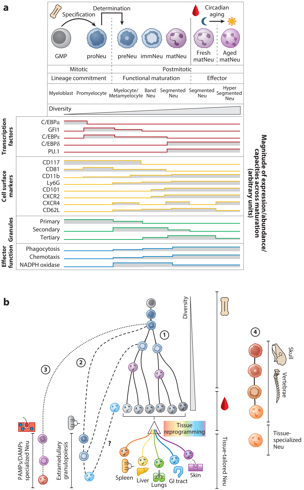
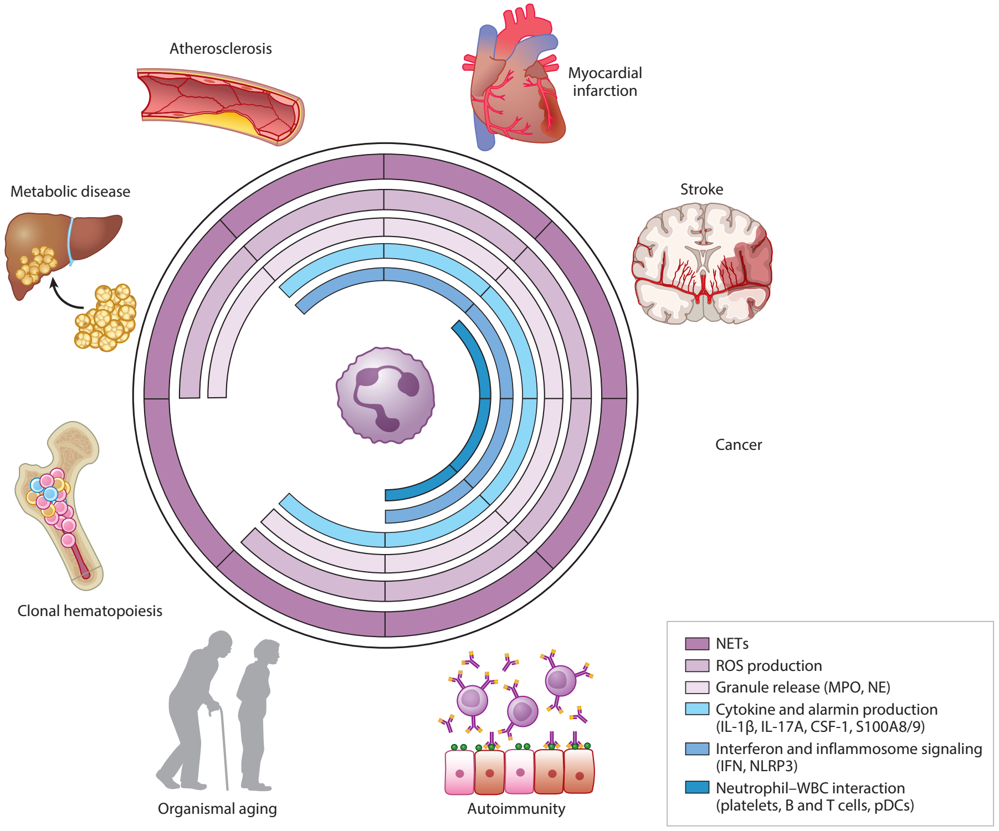
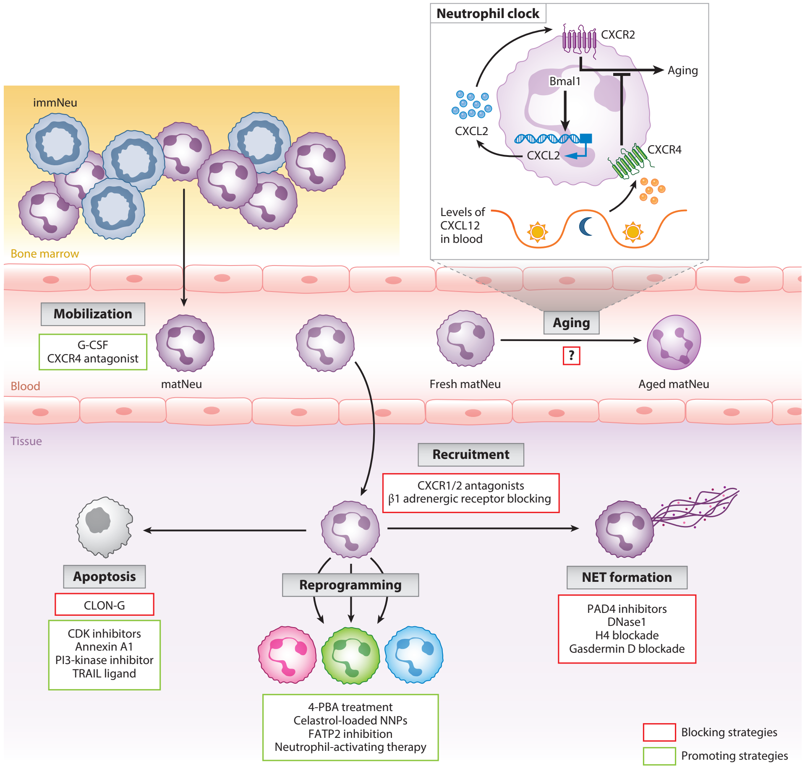

Annual Review of Pathology: Mechanisms of Disease

# Neutrophils in Physiology and Pathology

Alejandra Aroca-Crevillén,1 Tommaso Vicanolo,1 Samuel Ovadia,2 and Andrés Hidalgo1,2

1Cardiovascular Regeneration Program, Centro Nacional de Investigaciones Cardiovasculares Carlos III (CNIC), Madrid, Spain; email: ahidalgo@cnic.es

2Vascular Biology and Therapeutics Program and Department of Immunobiology, Yale University, New Haven, USA

Annu. Rev. Pathol. Mech. Dis. 2024. 19:227–59

The *Annual Review of Pathology: Mechanisms of Disease* is online at [pathol.annualreviews.org](https://pathol.annualreviews.org)

<https://doi.org/10.1146/annurev-pathmechdis-051222-015009>

Copyright © 2024 by the author(s). This work is licensed under a Creative Commons Attribution 4.0 International License, which permits unrestricted use, distribution, and reproduction in any medium, provided the original author and source are credited. See credit lines of images or other third-party material in this article for license information.

## Keywords

neutrophil, inflammation, infection, cardiovascular disease, cancer

## Abstract

Infections, cardiovascular disease, and cancer are major causes of disease and death worldwide. Neutrophils are inescapably associated with each of these health concerns, by either protecting from, instigating, or aggravating their impact on the host. However, each of these disorders has a very different etiology, and understanding how neutrophils contribute to each of them requires understanding the intricacies of this immune cell type, including their immune and nonimmune contributions to physiology and pathology. Here, we review some of these intricacies, from basic concepts in neutrophil biology, such as their production and acquisition of functional diversity, to the variety of mechanisms by which they contribute to preventing or aggravating infections, cardiovascular events, and cancer. We also review poorly explored aspects of how neutrophils promote health by favoring tissue repair and discuss how discoveries about their basic biology inform the development of new therapeutic strategies.

## 1. ORIGIN AND DIVERSITY OF NEUTROPHILS, FROM SUBSETS TO STATES

The development of single-cell technologies over the past decade has changed the way we categorize and understand the immune system. Immune cells have been classified into subsets when they could be identified by a defined set of markers and determined to emerge from a distinct hematopoietic branch. This approach offered the opportunity to isolate cells and build simple working models, but it fails at capturing the plasticity and functional dynamics that immune cells display across physiological and pathologic contexts or anatomical locations. Hence, efforts now focus on building landscapes of immune states through the analysis of individual cells at high molecular and functional resolution. In this section, we review neutrophil diversity across maturation, anatomical, and pathological contexts and discuss the possible sources of neutrophil diversity.

### 1.1. Granulopoiesis: Origin of Diversity and Implications in Pathology

Neutrophils emerge from a fine-tuned sequence of molecular and morphological transformations, or granulopoiesis, during which they progressively modify their transcriptomic, proteomic, structural, and functional properties. We emphasize here how the progressive acquisition of effector functions is, surprisingly, independent of the differentiation process. Indeed, neutrophil development can appear normal in terms of the phenotype and abundance of precursors and yet generate nonfunctional mature neutrophils (1).

**Figure 1** (*Figure appears on preceding page*) Origin and diversity of neutrophils. (*a*) Granulopoiesis is a stepwise process during which neutrophils acquire transcriptomic, proteomic, structural, and functional properties. There are several features that categorize neutrophil development, namely the precursors, proliferative capacity, transcriptional program (driven by master transcription factors), maturational stages, nuclear morphology, granule formation, acquisition of effector functions, cell surface proteome, and type of granules. (*b*) ① (*Solid lines*) Precursors and mature neutrophils acquire diversity during development. Transcriptomic and phenotypic heterogeneity starts in the bone marrow but becomes prominent once in the periphery. Exposure of neutrophils to inflammatory and microbial molecules and biochemical cues in the microcirculation might initiate this diversification. In tissues, neutrophils are reprogrammed and acquire tissue-tailored signatures. ② (*Dashed lines*) Neutrophil precursors may also egress into blood and migrate to the spleen to continue differentiation. ③ (*Dotted lines*) In some settings of infection or inflammation, neutrophil precursors are recruited and can differentiate in situ to generate a local pool of mature cells. ④ Neutrophil diversification may depend on the varying composition of the hematopoietic niches found in different bones. Abbreviations: DAMP, damage-associated molecular pattern; GI, gastrointestinal; GMP, granulocyte-monocyte progenitor; immNeu, immature neutrophils; matNeu, mature neutrophils; Neu, neutrophils; PAMP, pathogen-associated molecular pattern; preNeu, preneutrophils; proNeu, proneutrophils.

Neutrophil commitment can be divided into two major steps, namely, specification and determination. Proneutrophils (proNeu) 1 and 2 are already committed to the neutrophil lineage but may replenish the monocytic compartment in the absence of either of two critical granulocytic transcription factors, C/EBPε (2) or GFI1 (1) (**Figure 1*a***). Conversely, the preneutrophil (preNeu) stage appears to be a determination stage (3). Contrasting with lineage specification, the acquisition of effector functions occurs only after determination and follows a precise series of molecular events (1–4) (**Figure 1*a***). For instance, phagocytosis, chemotaxis, immune sensing, and activation appear progressively during neutrophil maturation and peak at the so-called immature and mature stages of differentiation. Intriguingly, however, expression of genes encoding for the NADPH oxidase peaks at the immature stage and is drastically reduced as the cells advance to maturation in the marrow and in blood (1–4). Although these events take place after lineage determination, functional maturation is preestablished by chromatin remodeling at the stage of specification (proNeu), in which GFI1 plays a pivotal role (1). GFI1 is a zinc-finger (ZnF) transcription factor that is mainly expressed in proNeu and functions as a repressor of transcription (5, 6). GFI1-instructed granulopoiesis relies on two properties. First, protein abundance is needed for granulocytic commitment, as shown by the differential capacity of hematopoietic progenitors containing one or two copies of the gene encoding for GFI1 to form granulocytic colonies in vitro (6). Second, transcriptional repression of the *CSF1* gene in proNeu, which is mediated by the ZnF5 domain of GFI1, inhibits specification into the monocytic lineage (6). More recently, Muench et al. (1) provided new insights into the role of GFI1 in granulopoiesis by showing that, in addition to dose- and ZnF5-dependent regulation, the ZnF6 domain controls subsequent functional maturation (1). This latter function is exemplified in mouse models of severe congenital neutropenia (SCN), a primary immune deficiency triggered by the presence of a single nucleotide polymorphism in different ZnF domains of Gfi1, including the ZnF6 domain (i.e., R412X). Mice hemizygous for \(\mathrm{Gfi1}^{\mathrm{R412X}/-}\) exhibited severe neutropenia, circulating neutrophils with abnormal or immature morphologies, and monocytosis as a result of lineage skewing at the level of the granulocyte-monocyte progenitor and ProNeu stage. Although \(\mathrm{Gfi1}^{\mathrm{R412X}/\mathrm{R412X}}\) mice showed partial restoration of Gfi1 protein levels and normal neutrophil counts, these mice continued to produce nonfunctional neutrophils. These elegant experiments demonstrate the dual role played by GFI1 in neutrophil development and highlight the importance of the ZnF domains of GFI1 for both functional maturation (ZnF6) (1) and neutrophil specification (ZnF5) (6). They also illustrate the complexity of implementing effector functions during granulopoiesis and highlight the dichotomy between differentiation and functional maturation, which may explain the remarkable adaptability of granulopoiesis to environmental changes, including during emergency granulopoiesis (EG). This dichotomy is also seen in humans; granulocyte-colony stimulating factor (G-CSF) treatment rescues neutropenia in SCN patients but fails to generate functional mature neutrophils and resolve the immune deficiency (7). Thus, chromatin remodeling independently controls both specification and function, ultimately making granulopoiesis a major source of neutrophil heterogeneity.

### 1.2. Emergency Granulopoiesis as a Source of Diversity and Memory

EG is the process of de novo generation of neutrophils in response to systemic pathogen invasion or another major source of stress (such as trauma or cancer), resulting in a significant increase in circulating neutrophils (8) (**Figure 1*b***). Granulopoiesis relies on G-CSF, the main cytokine responsible for neutrophil maturation (9) and is accompanied by the serial action of different transcription factors, including PU.1, C/EBPs, and GFI1 (10) (**Figure 1*a***).

EG not only increases the number but also shapes the identity of the precursors and mature cells, as demonstrated by the transcriptional reprogramming observed upon bacterial infection (4). For example, neutrophil precursors exhibit higher NADPH oxidase scores that suggest heightened capabilities for reactive oxygen species (ROS) production, whereas mature neutrophils feature greater phagocytic and chemotaxis capacities (4). Sterile inflammation also affects maturation, as seen in the context of cancer (3) or myocardial infarction (MI) (11). Indeed, the presence of an early committed neutrophil progenitor promotes tumoral growth in murine cancer models (12). Consistent with studies in mice, EG induced in humans after treatment with G-CSF alters the transcriptional landscape of precursors and mature neutrophils in blood and marrow: Mature neutrophils disappear from the circulation and are replaced by low-density CD10NEG immature precursors (13). Functionally, G-CSF-elicited neutrophils exhibit reduced production of ROS and neutrophil extracellular traps (NETs) but are better at producing cytokines than mature, normal-density neutrophils, implying that qualitative alterations may be as relevant as changes in numbers during EG (13). The molecular mechanisms driving these qualitative changes remain to be elucidated but appear to be associated with the different stages of maturation involved, as suggested by the different transcriptional profiles displayed by blood neutrophils depending on the type of perturbation (G-CSF treatment, bone marrow transplantation, or cancer) (13). Adaptation of granulopoiesis to disease is also evident in the context of coronavirus disease 2019 (COVID-19), in which symptomatology is associated with mobilization of low-density immature neutrophils resembling the proNeu and preNeu stages (14). These immature neutrophils are enriched in genes involved in NET formation and immunosuppression (14, 15), suggesting that granulopoiesis entrains new functional properties to the neutrophil pool. The bone marrow is also a site of early neutrophil reeducation during cancer, as systemic factors present in tumor-bearing mice can distally modify the bone marrow stroma to promote the emergence of SiglecFHIGH neutrophils that infiltrate the lung and favor tumor progression (16).

Normal granulopoiesis takes place in bone marrow niches, in dedicated locations recently shown to have oligoclonal composition (17). Variations in the composition of such niches and clones produced across different bones could conceivably result in the production of functionally different neutrophils. Indeed, meningeal neutrophils derived from the skull and vertebral bone marrows exhibit distinct transcriptional profiles compared with their blood counterparts and infiltrate the central nervous system in the context of stroke (18) (**Figure 1*b***). These findings suggest that other marrow compartments across different bones may yield specialized populations of neutrophils that surveil different tissues. Likewise, granulopoietic precursors can be mobilized in the circulation and complete their differentiation outside of the bone marrow (**Figure 1*b***). For example, during *Staphylococcus aureus* skin infection (19), neutrophil precursors terminate their differentiation in the infected tissue, thereby producing tissue- and pathogen-tailored mature neutrophils. Although functional differences between bone marrow– and abscess-derived neutrophils were not evaluated, myeloid-committed cells and their progeny were longer lived in the wounds (19). In cancer, a similar phenomenon of extramedullary granulopoiesis is observed in the spleen (20), where progenitors give rise to immunosuppressive neutrophils due to increased production of ROS; in contrast, bone marrow precursors do not suppress T cell proliferation. Hence, extramedullary granulopoiesis adds another layer of diversification in neutrophil production.

### 1.3. Peripheral Blood Neutrophils

Neutrophils released into the circulation reach all perfused tissues and rapidly engage in immune responses when microbes or other threats are detected. Previously considered a homogenous population, peripheral blood neutrophils in fact display a spectrum of transcriptional, phenotypic, and behavioral states.

Single-cell transcriptomic analyses have reported at least three neutrophil populations in the murine circulation. One enriched in genes involved in migration and inflammatory responses, a second featuring interferon-induced signatures, and a third bearing traits of circadian aging and overall maturation (4). These populations have been identified across multiple studies in both mice (1, 4, 21) and humans (4, 13, 22). In mice, interferon signature gene (ISG)-related neutrophils are found in circulation but also in the spleen, where they exhibit a subcapsular localization that contrasts with the uniform distribution of common S100a8+ neutrophils, demonstrating spatial compartmentalization (4). ISG+ neutrophils appear to be preferentially expanded and responsive during sterile and nonsterile inflammation, suggesting specialized roles in inflammatory pathophysiology. For instance, expansion of ISG+ neutrophils correlates with disease severity in tuberculosis (TB) patients (23), whereas in COVID-19 patients the abundance of ISG+ neutrophils is associated with mild symptomatology (15). Patients with severe COVID-19, in contrast, feature neutrophils with an immunosuppressive signature characterized by expression of the immune checkpoint receptor PD-L1 (13, 15), overall indicating that the transcriptional state of blood neutrophils is associated with disease outcome.

In systemic lupus erythematosus (SLE), a multifactorial autoimmune disease associated with vascular inflammation, an atypical population of granulocytes with altered buoyancy [(low-density neutrophils (LDNs)] appears in blood and exhibits distinct epigenetic, transcriptomic, and functional properties when compared with autologous normal-density neutrophils (24). LDNs are a mixture of mature and immature neutrophils, with mature cells featuring an ISG signature and enhanced NET forming capacity and immature cells being capable of degranulation but having reduced phagocytic capacity (24, 25). Current models propose that the distinct clinical manifestations in SLE patients are driven by the different neutrophil types. The origin and molecular drivers of these pathogenic neutrophils remain to be elucidated. Intriguingly, however, the epigenome of LDNs from SLE patients suggests epigenetic reprogramming already at the level of granulocytic precursors (25). ISG-related neutrophils are observed across species and disease with remarkable consistency, and independent studies have found the ISG signature early in neutrophil development (4, 21), suggesting that a core program during maturation gives rise to this state. Formal proof, however, requires DNA barcoding–based tracing analyses.

While transcriptomic analyses dominate current efforts to classify immune cells, alternative approaches have emerged. Indeed, transcriptomic profiling fails to capture the full spectrum of neutrophil diversity, especially when defining immune function in dynamic environments, such as inflammation. In this context, transient properties (or states) may be more informative than fixed genetic programs (subsets). Recent studies have implemented imaging methods that measure the dynamic properties of leukocytes (26, 27). In particular, in vivo imaging of inflamed vessels in mice allowed the extraction of tens of morphological and kinetic traits from individual cells that were computed to describe neutrophil behaviors (26, 28). These analyses identified three distinct behaviors, one of which involved large neutrophils that remain sessile against the endothelium and are correlated with the magnitude of inflammation. This pathogenic behavioral type was found to rely on the activity of the Fgr kinase, and deficiency or inhibition of this kinase was sufficient to prevent this behavior and to prevent vascular inflammation in the context of glomerulonephritis and myocardial ischemia (26). Importantly, neutrophils were found to transit through the three behavioral archetypes, although with low frequency, a finding that highlights the dynamism of neutrophils in both phenotype and function and raises the possibility that these different behavioral traits may be genetically encoded rather than driven by the environment (29).

### 1.4. Sources of Diversity in Blood

As discussed above, granulocytic progenitors and mature neutrophils can integrate cell-intrinsic and environmental cues that shape their phenotypic and functional identity. Among these are signals that follow natural day–night oscillations and influence all aspects of organismal physiology, including the immune system (30). Indeed, once mobilized into blood, mature neutrophils undergo transcriptional and phenotypical alterations that align to circadian oscillations and are collectively referred to as aging. In the mouse, circadian aging is driven by an internal circadian machinery that involves the transcription factor Bmal1, which controls expression of the chemokine CXCL2. This initiates signaling events by engaging the receptor CXCR2 in an autocrine fashion and, interestingly, is antagonized by signaling through another chemokine receptor, CXCR4, when the levels of its ligand, CXCL12, naturally increase during the day in the plasma of mice (31, 32). The combination of these positive and negative signals modulates neutrophil function through the diurnal cycle and is critical to balancing immune defense and protection of host cells. For example, aged neutrophils, which dominate during daytime in mice and humans, are better at controlling pathogen invasion. However, this comes at the cost of increased thrombo-inflammatory events, or other vascular-damaging processes, as seen in a mouse model of MI (32). In contrast, fresh neutrophils, which dominate at nighttime, may be less immune competent but are better at rapidly infiltrating inflamed tissues (32). The basis for this immune and migratory bias is, at least in part, dictated by modifications in the surface topology and by the natural degranulation of mouse and human neutrophils, which is controlled by the circadian clock (32, 33). Circadian aging also requires the integration of signals from the microbiota. Indeed, microbiome-derived Toll-like receptor (TLR)4 and TLR2 agonists regulate phenotypic properties of neutrophils (34), which are in turn associated with more severe vaso-occlusive events in a mouse model of sickle cell disease (34).

Overall, the heterogeneity of mature neutrophils extends beyond granulopoiesis and into the circulation, in both mice and humans (21, 22), but the strategies used for diversification remain largely unknown (29).

### 1.5. Tissue Neutrophils

Upon entry into naive tissues from the circulation, neutrophils appear to localize in specific niches (35). For instance, in the pulmonary parenchyma, neutrophils accumulate at the periphery of large vessels (35, 36), and bulk analyses of transcriptome and chromatin accessibility have revealed that distinct molecular landscapes of chromatin are imprinted across different organs (36). However, this diversity in tissues does not seem to be caused by infiltration of neutrophils with predetermined programs, at least as determined by the single-cell transcriptional signatures of blood neutrophils (36), suggesting that microenvironmental cues coopt the plasticity of neutrophils to mold their fates and functions (36).

A remarkable observation from these studies is that tissue neutrophils acquire nonimmune properties. For instance, vascular regenerative programs, revealed by expression of genes encoding Apelin, ADAMTS, and vascular endothelial growth factor (VEGF)-A, are associated with neutrophils from the lung and intestine, whereas factors that favor immunoglobulin production and maturation are produced by splenic neutrophils (36, 37). Interestingly, these signatures are not shared by other leukocyte subsets in the same organ (36), suggesting that the environment specifically enacts neutrophil programs. Thus, despite their reduced transcriptional activity, neutrophils share with macrophages the capacity to adapt to the environment to support tissue homeostasis.

Cancer represents a particularly interesting scenario. Indeed, the tumor microenvironment (TME) provides molecular, cellular, and structural cues to the infiltrating cells that ultimately support tumor growth. Neutrophils that infiltrate tumors undergo reprogramming that varies with tumor type and the different intratumoral microenvironments (38, 39). For example, in genetic mouse models and human patients with lung cancer, neutrophils can acquire at least six different transcriptional programs, some of which can also be found in the healthy lung (40). The nature of such states and their potential role in the tumor remain unclear, although specific subsets with T cell–suppressive activity and angiogenic properties have been defined based on expression-specific transcription factors, enzymes, or growth factors (such as *Bhlhe40*, *Ptgs2*, and *Vegfa*, respectively) and have been functionally validated. Cancer provides a remarkable example of how neutrophils adapt to different environments, as discussed in more detail in Section 4.2.1.

## 2. THE REPARATIVE NEUTROPHIL

The recent discovery that neutrophils adapt to different tissues (36) highlights that their plasticity is broadly beneficial for the organism, and indeed, neutrophils aggressively fight infections but can also contribute to tissue repair. Here, we focus on a typically neglected aspect of neutrophil biology related to the maintenance and repair of tissue structures.

### 2.1. Neutrophils and the Extracellular Matrix

Neutrophils travel through the bloodstream and extravasate into most tissues under homeostatic conditions (35). This program is enhanced during infections or physical insults where neutrophils are massively recruited into the damaged tissues. Once neutrophils leave the blood stream, they encounter the extracellular matrix (ECM), a noncellular component present in all tissues and organs that is an essential component of the interstitial matrix and the basement membrane. The interstitial matrix is a loose network of collagen fibers (mainly type I and III collagens, fibronectin, elastin, and proteoglycans) that creates a meshwork that connects structural cell types within tissues. The basement membrane is a protein-dense structure made up by type IV collagen, laminin, and heparan sulfate proteoglycans. This ECM, which localizes at the base of epithelial or endothelial layers, separates cells from the surrounding matrix, serving as a barrier for the transfer of materials (41).

During maturation in the bone marrow, neutrophils store a collection of proteases in their granules that degrade ECM proteins. Serine proteases, including elastase, proteinase 3, and cathepsin G, which are a substantial part of the cargo in primary granules, can break down elastin, fibronectin, laminin, and collagen IV (42). Matrix metalloproteinases (MMPs), which degrade the matrix, are found mostly in secondary and tertiary granules and can degrade all type of matrix proteins, including all types of collagens (43). Neutrophils dedicate a significant portion of their granules to storing matrix-degrading enzymes that enable their function and motility. For instance, migration through the vessel basement membrane is facilitated by neutrophil elastase (NE) and by finding ECM-poor gaps in the pericyte layer (44). Once out of blood vessels, neutrophils must migrate through the ECM mesh to penetrate and move inside tissues. They do so by employing their enzymatic repertoire to proteolytically degrade the matrix proteins. Reciprocally, the ECM regulates neutrophil behavior and recruitment: In the context of inflammation, neutrophils release MMP8 and MMP9 to break down collagen into bioactive ECM fragments endowed with chemotactic activity (45). Laminin in the basement membrane of the ECM can send signals to upregulate surface expression of CD31 and the integrin α6β1 on neutrophils, which promote transmembrane transport and infiltration into the inflamed tissue (46). The ECM also promotes antimicrobial functions in neutrophils, including ROS production, myeloperoxidase (MPO) release, and NET formation (47). A recent study reported that fibrin deposits in the oral mucosa instruct neutrophil activation through direct engagement of Mac-1, which induces production of ROS and NETs for immune protection, but these products also cause considerable tissue damage (48).

### 2.2. Neutrophils as Wound Healers

The first immune cells to enter damaged tissues are neutrophils. They arrive in large numbers in response to damage-associated molecular patterns (DAMPs) released from injured and necrotic cells and orchestrate precise and effective migration to the specific area of injury using a collective, feed-forward mechanism called swarming (49). The contribution of neutrophils to wound healing is multifaceted: Too few increase the risk of infection and delayed healing (50), whereas too many can be toxic for host cells and delay healing. Impaired leukocyte trafficking is known to delay the healing of cutaneous wounds in mice (51), and experimental depletion of neutrophils in the context of intestinal injury is associated with increased inflammation and impaired repair of the intestinal mucosa (52). Similarly, patients with neutropenia (or impaired neutrophil trafficking or function) display a higher risk of not only developing infections but also impaired wound healing (53). These findings highlight the critical role of early immune responses and neutrophils in initiating wound repair.

A plethora of studies have unveiled links between neutrophils and ECM remodeling. During wound healing, degradation of the ECM facilitates neoangiogenesis within the restored tissue, which is key to normal regeneration. MMPs exert a proangiogenic function, as they can degrade ECM and release matrix-bound VEGF, which is then free to signal and promote angiogenic remodeling (54). Interestingly, neutrophils are the only cells that can release MMP9 from its endogenous inhibitors, the tissue inhibitors of metalloproteinases (TIMPs), and can directly deliver MMP9 to sites of angiogenesis (54). Neutrophils also contribute to building new ECM in the wound by transporting preexisting matrix from the mesothelial layer surrounding visceral and parietal internal organs into the injured tissue, where they fuel tissue repair (55). This recently discovered phenomenon is mediated by upregulating the collagen-binding integrin αMβ2, which binds and transports matrix proteins. In the absence of neutrophils, internal wounds fail to incorporate active fibroblasts and to mature into long-lasting scars. In this context, fibroblasts are part of a secondary response, but neutrophils have been estimated to account for approximately 80% of the matrix generated in scar tissue (55). In addition to transporting preformed ECM, under specific pathological contexts neutrophils have been reported to actively produce ECM components. During MI, neutrophils appear to contribute to ECM deposition and organization in the ischemic heart by producing fibronectin, fibrinogen, and vitronectin (56). Similarly, neutrophils contribute to bone healing by synthesizing so-called emergency ECM before stromal cells infiltrate the fracture hematoma and synthesize bone matrix (57). Neutrophils within these early hematomas stain positive for cellular fibronectin, in contrast to neutrophils within coagulated peripheral blood (57). Thus, neutrophils are producers and transporters of ECM components, at least in the context of injury.

### 2.3. Remodeling the Tumoral Matrix

Alterations within the tumoral ECM can promote cancer by providing biomechanical and biochemical cues that drive cell growth, survival, invasion, and metastasis and by regulating angiogenesis and curbing immune function. Tumors often display enhanced stiffness, which is caused by altered deposition, cross-linking, and geometrical organization (e.g., linearization) of fibrous proteins, especially of collagen fibers, which are often positioned perpendicular to the tumor boundary (58). Compared with benign lesions in which type I and type III collagen bundles are regularly organized, malignant human breast tumors show elevated expression of type I and type III collagen and newly synthesized collagens that are frequently arranged in abnormal bundles (58). ECM morphology and composition in the metastatic site are therefore important for the seeding and growth capacity of metastatic cells. For example, ECM stiffening facilitates colonization of cancer cells and infiltration of myeloid cells at the metastatic site (59). The contribution of neutrophils and other immune cells to the aberrant organization of the tumoral matrix is a field of emerging interest.

Neutrophils can also remodel the tumoral ECM and, in doing so, modulate cancer cell plasticity. Tumor-recruited neutrophils release MMP9 that remodels the ECM and induces angiogenesis or promotes metastasis (60). Indeed, MMP9-expressing neutrophils are predominantly found inside angiogenic islets in early stages of pancreatic carcinogenesis and mediate VEGF activation (61). Thus, neutrophil MMP9 is a potential therapeutic target in human cancers in which neutrophil infiltration is associated with enhanced tumor angiogenesis and poor prognosis. Neutrophils can also alter the ECM environment to facilitate tumor cell invasiveness. In a zebrafish xenograft model of in vivo tumorigenesis, neutrophil migration enhanced tumor cell invasion by providing collagen tracks that were exploited by cancer cells for migration (62) and, at least in vitro, neutrophils induce the formation of invadopodia and collagenous matrix degradation by oral squamous cell carcinoma cell lines (63). Interestingly, collagen-dense mammary tumors exhibit a cytokine milieu that promotes neutrophil recruitment and activation. In this setting, neutrophil ablation significantly reduces tumor burden and diminishes the formation of metastasis (64), suggesting that tumor progression in collagen-dense microenvironments is promoted by neutrophils.

Processing of the ECM can also participate at early stages of tumor formation. In the context of organismal stress [induced by lipopolysaccharide (LPS) or tobacco inhalation], NETs produced by neutrophils induced the awakening of dormant cancer cells and promoted metastasis in mice. NETs concentrate neutrophil proteases (elastase and MMP9), which enable the sequential cleavage of laminin and generate a neoepitope for integrin α3β1 that triggers cancer cell activation (65). Collectively, these findings illustrate various mechanisms through which neutrophils modify the ECM to promote tumor progression and metastasis and may drive the design of new therapies against cancer.

## 3. ANTIMICROBIAL NEUTROPHILS: COST TO THE HOST

Neutrophils are fundamental for primary immune defense. After migrating to the site of inflammation, they kill, phagocytose, and digest the invading microbes by generating ROS and by discharging the microbicidal content of their granules. They also produce cytokines, attract other immune cells, and release NETs, which ensnare and kill pathogens (66, 67). The effective elimination of invading agents by neutrophils, however, comes at a cost, since neutrophils actively promote inflammatory pathology (68), as prominently illustrated in the recent context of COVID-19 (15, 69). Understanding the mechanisms of neutrophil-driven toxicity, interactions with other immune cells, and how they drive or amplify inflammation is of major clinical relevance. Here, we focus on specific antimicrobial activities of neutrophils that may impact the structural and functional integrity of the host.

### 3.1. Reactive Oxygen Species

Among the array of antimicrobial products produced by neutrophils, ROS are essential for pathogen clearing after phagocytosis. The main mechanism for ROS generation involves activation of the NADPH oxidase complex (70), which consists of different NOX enzymes. NOX2, the main catalytic subunit of this complex, assembles in the membrane and generates the precursor superoxide anion (\(\mathrm{O}_{2}^{-}\)) by reduction of oxygen (71). This superoxide is released into the phagosome containing the microbe where it undergoes dismutation into hydrogen peroxide. Neutrophils additionally generate secondary oxidants such as hydroxyl radical, hypochlorous acid, chloramines, and hypothiocyanite via the activity of MPO (71).

The production of ROS by neutrophils is variable. ROS production changes circadianally; a subset of phenotypically aged neutrophils has been shown to produce higher levels of ROS (34), although these differences are not apparent when comparing neutrophils collected at different times of the day [Zeitgeber (ZT)5 and ZT13, corresponding to noon and 8pm, respectively] (32). During infections, ROS production is associated with damage to multiple tissues, including lung, liver, heart, and kidney injury in different sepsis models, as well as with endothelial dysfunction (72). In the context of COVID-19, neutrophils from patients with severe disease and non-COVID-19-related sepsis exhibited a heightened capacity for ROS generation (73). This has been linked to thrombosis and red blood cell dysfunction, which is likely to contribute to the higher mortality of these patients (74). Activation of neutrophils within vascularized tissues can also promote ROS production and cause vascular damage (see Section 4). A particularly interesting example is that of reverse transmigrated neutrophils, which exhibit a distinct activation phenotype characterized by increased ROS production that disseminates systemic inflammation (75). In sum, the imbalance between ROS production and effective performance and pathogen removal is paramount for tissue protection against pathogens and preserving homeostasis.

### 3.2. Degranulation and Cytokine Production

Neutrophil granules are formed during maturation in the bone marrow. The different types of granules with varying content and functions are distinguished based on the time of synthesis during granulopoiesis or their major protein content. Azurophilic or primary granules are enriched in MPO; specific or secondary granules contain lactoferrin; and tertiary granules contain gelatinase and MMP9, among other proteins (76). During medullary maturation, expression of different transcription and growth factors determines the different stages of maturation that drive the acquisition of a particular granule type in neutrophils. High levels of the ZnF transcription factor GFI1 and low PU.1 (77) initially guide the transition toward a myeloblast state and the production of primary granules, then low expression of ELF-1 and increased C/EBPε allow the transition into the myelocyte state and the formation of secondary granules. Finally, tertiary granules appear after the metamyelocyte state, concomitant with loss of mitotic activity (78) (**Figure 1*a***). This sequential production of granules has more recently been delineated by analyzing the transcriptional profile of neutrophils from the preNeu to the immature state (3). The release of granule content into the environment is regulated and triggered by multiple stimuli but, interestingly, the process is very selective in that specific receptor–ligand couplings trigger the release of particular granule types. For example, fMLP promotes the discharge only of primary granules (79), whereas S100A9 discharges specific and gelatinase granules (80).

From a physiological perspective, it is remarkable that basal degranulation occurs and is under circadian control. Basal release of granule content into the circulation of healthy mice is driven by CXCR2 signaling, a component of the neutrophil clock, upon release from the bone marrow (33), which implies that these granule proteins may serve purposes beyond immune defense. Although granule proteins can cause pathogenic inflammation, particularly by promoting NET formation and vascular inflammation (see Section 4.1.1), different studies have reported pathogenic roles in other scenarios. In a model of TB, neutrophil-derived MMP8 released from secondary granules caused destruction of the collagen matrix both in cultured cells and in lung biopsies from TB patients (81). AMPK signaling in neutrophils was needed for MMP8 secretion and matrix destruction (81). In COVID-19 patients, a neutrophil activation signature associated with severity and mortality reveals the presence of distinct granule proteins, including MMP8 and lipocalin-2 (82), and studies in mice show that NE and cathepsin G (CG) may facilitate viral and bacterial infections (83).

Neutrophils promote both protective and pathological responses by attracting other immune cells to the site of infection or injury. This is mediated by the production and release of mediators important for cell signaling, including cytokines, chemoattractants, and alarmins (84). Cytokines, which are preformed within neutrophils, can be released under homeostatic and inflammatory conditions, though in most cases, they are induced upon stimulation, following previous induction via mRNA accumulation and de novo synthesis (76). The array of cytokines produced by human neutrophils is vast; it consists of antiinflammatory [interleukin (IL)-1ra, TGFβ1, TGFβ2] and proinflammatory cytokines (IL-1α, IL-1β, IL-6, IL-8, TNFα), chemokines (CXCL1, CXCL2, CXCL8, CXCL12), and immunoregulatory cytokines (IL-22, IL-23) (76). Uncontrolled release of proinflammatory cytokines can exacerbate inflammation and cause immunopathologies. This anomalous response, referred to as a cytokine storm, can be initiated after noninfectious and infectious signals and is common during bacterial and viral respiratory infections. Accordingly, the predictive mortality signature of COVID-19 patients includes a neutrophil activation signature in which the proinflammatory cytokine IL-8 is a predictor of severity (82), as it is in patients with avian influenza A (H5N1) virus infection with poor survival (85). In mice, neutrophil depletion during abdominal sepsis abolished the cytokine storm (IL-1β, IL-6, and TNF-α) fueled via IL-3 production by so-called innate response activator B cells (86).

### 3.3. Neutrophil Extracellular Traps

NETs are structures formed by DNA; nuclear proteins, including citrullinated histones; and proteins originally contained in granules or in the cytoplasm of neutrophils and were originally proposed to contain and kill microbes (67). The most common mechanism of NET formation is through a process that requires ROS production by the NADPH oxidase, chromatin decondensation, protein assembly, and membrane permeabilization (87). The molecular mechanisms regulating NET formation have been extensively reviewed (88) and, in brief, involve MPO activation through ROS, leading to release of enzymes from azurophilic granules to the cytoplasm and subsequently to the nucleus, where they promote chromatin decondensation. ROS also induce the enzyme peptidyl arginine deiminase 4 (PAD4), which induces histone citrullination, a hallmark of NETosis, along with the presence of MPO and NE. As the nuclear membrane disassembles, the DNA mixes with granule and cytoplasmic content, and finally, the plasma membrane disintegrates, resulting in the choreographed release of DNA into the environment (88). However, despite augmenting inflammatory signaling, histone citrullination has been found to be dispensable for NET formation in atherosclerotic lesions (89), highlighting the importance of using other existing or new chromatin markers. Moreover, NET components have different roles that synergize to promote inflammation; for example, during atherosclerosis, NET-associated histones are involved in the activation of TLR4, while the DNA component promotes internalization (89). While this phenomenon is well characterized in vitro, the mechanism, location, and consequences of NET formation in living tissues remain somewhat mysterious, since tools to specifically detect NETs in vivo have been difficult to generate (90). NETs form in a variety of situations (see below in this section) and are strongly associated with damage to the host, particularly to the cardiovascular system (91). It is therefore not surprising that NET formation is highly regulated. For instance, the capacity of neutrophils to form NETs follows tight circadian oscillations in both humans and mice, at least under homeostatic conditions. Indeed, neutrophils are more prone to produce NETs right after release from the bone marrow, and this susceptibility is progressively lost over time. This reduction is caused by the natural and progressive loss of granules and their content in the circulation, a disarming process that relies on the circadian factor Bmal1 and signaling through CXCR2 (33).

The lytic event of NETosis, with consequent release of DNA and associated enzymes and nuclear proteins, triggers an inflammatory response that irreversibly damages host tissues, and indeed, NETs have been involved in many types of inflammatory disorders including psoriasis, gout, vasculitis, thrombosis, chronic lung diseases, cancer, atherosclerosis, lupus, and diabetic wound healing (92). This is further illustrated in the context of experimental sepsis in mice, during which neutrophils migrate to the liver sinusoids (93, 94) or pulmonary capillaries (94) and produce NETs that may be important for trapping bacteria and diminishing systemic dissemination but also cause severe damage (93, 94). Accordingly, studies in mice and humans showed that preventing NET formation, through inhibition of the NET-inducer protein gasdermin D, reduces organ injury and death associated with sepsis (95). Similar results have been found in models of transfusion-related acute lung injury, in which NET formation in lungs causes endothelial damage and organ dysfunction in both humans and mice (96, 97).

Although NETs are typically considered effective at combating and limiting infections, they also contribute to pathologies associated with microbial infections. Indeed, while NETs kill large pathogens such as fungal hyphae (98), dysregulated control of NET formation can exacerbate organ damage if too many NETs are produced. This was evident in Dectin-1-deficient mice, in which excessive NET formation during fungal infection was harmful for lung tissue (98). Other illustrative examples come from studies of genetic deficiencies associated with impaired NET formation. Patients with chronic granulomatous disease, who exhibit poor capacity to form NETs, are more susceptible to infections, and restoration of NET formation by gene therapy improves the response to *Aspergillus nidulans* (99). Interestingly, however, mice lacking PAD4 (which also controls NET formation) manifest lower fungal burdens in their lungs and associated injury during *Aspergillus* infection (100), suggesting that release of NETs can contribute to tissue damage and in some settings promote fungal outgrowth. The paradoxical susceptibility to infections induced by NETs also manifests in patients with cystic fibrosis, in whom NETs positively correlate with bacterial colonization rather than elimination (101).

NETs are also produced during infections with a wide variety of viruses, including human immunodeficiency virus 1 (HIV), influenza A, encephalomyocarditis, and respiratory syncytial virus, among others. Viral-derived molecules also induce NETs through mechanisms that typically involve neutrophil activation through TLR signaling (102). Early studies demonstrated that, at least in vitro, NETs can physically capture viral particles to neutralize HIV infection (103) or directly inhibit influenza A replication (104). Nonetheless, there remains controversy since nonsevere influenza A viral infection does not trigger NETosis in vivo (105). Further, LPS priming was shown to be necessary for NET formation to capture myxoma virus in liver sinusoids (106). This suggests that the production of antiviral NETs depends on the severity of infection and may be secondary to particular DAMP–PAMP (pathogen-associated molecular pattern) interactions that are different from those seen during antibacterial and antifungal responses. As shown for bacterial and fungal infections, NETs produced after viral infections can also result in immunopathology. During severe influenza virus infection, excessive NET formation induces alveolar capillary damage, hemorrhagic lesions, and obstruction of the small airways in lungs of infected mice (107), which can ultimately favor bacterial outgrowth and be detrimental. Accordingly, studies have established a positive correlation between high levels of NETs and poor prognosis during severe influenza A infections (108).

The COVID-19 pandemic has provided a particularly relevant context to understand how NETs propagate disease. The involvement of NETs in lung pathology was in fact the first evidence for the central role of neutrophils in coronavirus disease, and these structures were differentially detected in the serum of patients with severe COVID-19 (109). NET aggregates and NET-rich thrombi were found in the lungs, hearts, and kidneys of COVID-19 patients, suggesting that NETs may promote systemic thrombosis and vascular occlusion (109). Endothelial activation by NETs can also compromise the barrier function of different tissues such as the lung or the kidney and cause pulmonary edema, microthrombi, and glomerular injury (69). These phenomena ultimately contribute to organ failure and may underlie the tight association between an abundance of NETs and a poor clinical outcome (110).

In sum, while NETs are a fascinating and effective mechanism to contain pathogen spread, they can be extremely toxic and promote acute and chronic inflammation. Understanding the biological fundamentals behind NETs, including not only their formation but also their clearance from tissues, is paramount to effectively targeting the deleterious effects of neutrophils.

## 4. NEUTROPHILS IN STERILE INFLAMMATION: CARDIOVASCULAR AND BEYOND

**Figure 2** Mediators of neutrophil-driven pathology. The effector functions of neutrophils may cause disease in different scenarios, from metabolic disorders and atherosclerosis to clonal hematopoiesis and organismal aging. For example, NETs have been shown to contribute to most, if not all, cardiovascular events and chronic inflammation, whereas interactions with other cells have been reported mostly in the context of stroke, autoimmune disease, and cancer. For details about the multiple mechanisms by which neutrophils cause disease, please refer to Sections 3 and 4. Abbreviations: IFN, interferon; IL, interleukin; MPO, myeloperoxidase; NE, neutrophil elastase; NET, neutrophil extracellular trap; NLRP3, nucleotide-binding domain, leucine-rich-containing family, pyrin domain-containing-3; pDC, plasmacytoid dendritic cell; ROS, reactive oxygen species; WBC, white blood cell. Parts of the figure were adapted from Servier Medical Art (CC BY 3.0).

Neutrophils excel at antimicrobial defense because they combine active patrolling of the organism with a heavily cytotoxic arsenal. Location in this context is critical, because timely and localized release of their cargo protects from microbial invasion. However, when stimulatory signals become systemic or localize in damaged but otherwise uninfected organs or the regulatory networks controlling neutrophil activity become faulty, the destructive activity of neutrophils can turn against host cells. Because vascular cells are often exposed to neutrophils, the cardiovascular system is a recurrent victim of neutrophil activation, as we discuss in this section (**Figure 2**).

### 4.1. Cardiovascular Disease

Given their abundance and susceptibility to rapid activation by a plethora of signals, circulating neutrophils can be potentially dangerous for the cells that comprise the blood vessel walls. Not surprisingly, neutrophils are major contributors to cardiovascular disease, as we discuss in this section.

#### 4.1.1. Atherosclerosis.

Atherosclerosis arises from the accumulation of triglycerides, cholesterol, and other metabolites in the inner tunica intima of large vessels (111). It is the leading source of cardiovascular disease, which includes ischemic events in the heart and brain, and therefore accounts for much of the morbidity and mortality worldwide (111). Although the establishment of the atherosclerotic plaque is multifactorial (111), increased numbers of neutrophils found in both human and mouse atherosclerotic lesions is associated with poor prognosis (112, 113), thus providing evidence of their involvement in atherosclerosis.

During early stages of atherosclerosis, neutrophils adhere to the activated endothelium at the affected arterial wall and infiltrate the intima (114). The patterns of neutrophil recruitment and adhesion differ in arteries and peripheral venules based on specific localization of chemoattractants, and this has been shown to be under circadian control (recently reviewed in 114). Neutrophil depletion in mice leads to reduced plaque size at early but not late stages of atherosclerosis (112), indicating early contributions to plaque formation. At these sites, neutrophils release granule proteins, cytokines or chemokines, and ROS, all of which increase vascular permeability and favor secondary monocyte recruitment (112). For example, deposition of CG on the arterial endothelium increased leukocyte adhesion, while its deficiency was sufficient to reduce arterial neutrophil adhesion and atherosclerotic plaque area (115). Similarly, interaction of neutrophils (and monocytes) with platelets also leads to delivery of platelet-derived chemokines, such as CCL5, on the atherosclerotic endothelium inside arteries, which further increases leukocyte adhesiveness and fuels disease progression (112). The presence of cholesterol crystals in early atherosclerotic lesions further promotes the release of NETs, and their deposition on the affected endothelium has been reported to accelerate disease progression (116). Accordingly, preventing NET formation with a PAD4 inhibitor reduced atherosclerotic lesion size in mice (117). Mechanistically, NETs appear to function as platforms for the deposition of cytokines and granule proteins, which in turn activate endothelial cells, plasmacytoid dendritic cells (pDCs), platelets, and macrophages (118). NETs also prime macrophages to release IL-1β, which amplifies immune cell recruitment in atherosclerotic plaques (116) and engages a feedback loop of disease progression. Neutrophils can also regulate hematopoiesis during atherosclerosis, boosting myeloid-biased hematopoiesis. For example, in conditions of sleep disruption, a population of preNeu in the bone marrow has been demonstrated to mediate myelopoiesis during atherosclerosis through CSF1 production in response to the neuropeptide hypocretin (119). This resulted in elevated leukocytes numbers in circulation and large atherosclerotic lesions (119).

In advanced stages of atherosclerosis, plaque destabilization leads to rupture of the fibrous cap, and neutrophils have been found to promote plaque instability and rupture (114). The abundance of neutrophils in the arterial intima is correlated with plaque instability in both humans and mice (113, 120), and this may be partly explained by the effects of NETs on structural cells of the arterial wall. Indeed, activated lesional smooth muscle cells attract neutrophils to the arterial lesion and instigate NET release. Extracellular histone 4 associated with NETs in turn binds and lyses smooth muscle cells, thereby boosting plaque destabilization (120). Studies in endotoxemic and atherosclerotic mice similarly reported that leukotriene B4 production amplifies neutrophil recruitment, increasing features of plaque destabilization (121).

In sum, atherosclerosis exemplifies the multiple stages at which neutrophils participate during localized sterile inflammation and highlights the relevance of neutrophil-driven death of host cells as a mechanism of disease.

#### 4.1.2. Ischemic injury.

In addition to triggering thrombosis and ischemia, neutrophils contribute to subsequent damage to the affected tissues, most notably the heart and brain. During MI, neutrophils are recruited to the ischemic tissue and initiate an aggressive inflammatory response. Infiltration of the infarcted myocardium follows circadian patterns, with elevated infiltration at night in a model of permanent ischemia. More severe cardiac damage is observed when ischemia is triggered at this time (122), suggesting coupling of the inflammatory response with the homeostatic dynamics of these cells in circulation. Indeed, CXCR2-dependent recruitment at night increased infarct size and cardiac dysfunction (122). Intriguingly, myocardial injury was more severe when infarction occurred in the morning in a model of ischemia/reperfusion (I/R) (32), suggesting that the type of inflammation may in turn influence the immune dynamics. Humans also manifest circadian oscillations not only in onset but also in infarct size, both of which are higher in the early morning (123).

How do neutrophils induce cardiac injury? ROS production and granule protein and cytokine release by neutrophils in the ischemic myocardium create a proinflammatory environment that directly affects myocyte viability and contractility and impacts postcardiac remodeling during MI (124). Release of the alarmins S100A8/A9 in the infarcted area and subsequent induction of IL-1β-mediated granulopoiesis have been shown to aggravate cardiac function after MI (11). NET release is another potential mechanism of injury; in MI patients, NET levels in coronary plasma correlate with the occurrence of adverse cardiac events and dysfunction (125), and in mice, pharmacological or genetic targeting of NET formation reduced cardiac damage in an I/R surgical model, with improvement of contractile function (126).

Diversity in neutrophil populations has also been observed during MI. Recently, a marrow-originated late-stage neutrophil subset with high expression of SiglecF was found to appear at Day 1 after MI and last up to Day 4 in the permanent infarcted heart, probably due to its Myc-recovered signature that advantaged survival (127). Although the role of this population is still unclear, its late appearance could indicate a role for fibrosis and monocyte recruitment (127). In another study, a population of NLRP3-primed neutrophils was observed to be retained in the bone marrow after MI (128). These reverse-migrating neutrophils that homed to the bone marrow in a CXCR4-dependent manner were able to induce granulopoiesis by local production of IL-1β (128).

Beyond aggravating tissue damage, however, growing evidence suggests that neutrophils also promote cardiac repair by exerting proreparative and proangiogenic functions. Experimental neutrophil depletion demonstrated a beneficial role for neutrophils in the context of MI-induced healing (129). This was proposed to be mediated by neutrophil-driven polarization of macrophages toward a reparative phenotype characterized by increased expression of the phagocytic receptor MERTK, which enhanced clearance of apoptotic cells and improved cardiac remodeling (129). Neutrophils have also been shown to incite the production of VEGF-A by macrophages through signaling that involved the receptor AnxA1, which was primarily derived from infiltrating neutrophils, and this positively impacted neovascularization and cardiac repair after MI (130).

The controversial data showing beneficial and detrimental roles for neutrophils during MI raise the possibility that these effects are mediated by different neutrophil subsets, which may be recruited at different times or by distinct inflammatory cues after ischemia. Understanding this potential dichotomy is of particular interest for future strategies aimed not only at inhibiting neutrophil function but additionally at potentiating the recruitment of beneficial subsets.

Within the myocardium, neutrophils can also be detrimental for the cardiac electrical system. Neutrophil counts are positively correlated with cardiac arrhythmia in humans and mice (131). In a new model of spontaneous arrhythmia in mice, generated by combining hypokalemia with MI, neutrophils increased ventricular tachycardia through lipocalin 2–mediated ROS production that caused cardiomyocyte damage. Interestingly, macrophages were protective in this model by removing dead cardiomyocytes and debris (131).

Stroke is another major clinical entity, given its high prevalence, and it shares mechanisms with myocardial ischemia, including its thrombotic etiology downstream of atherosclerotic plaque rupture (132). Studies addressing the recruitment dynamics of neutrophils to ischemic sites in a murine cerebral I/R model revealed that neutrophil influx occurs within the first 24 hours and that neutrophils still represent the vast majority of immune cells in the ischemic hemisphere 3 days after reperfusion (133). Notably, depleting neutrophils or preventing their entry into the brain reduced cerebral injury and promoted functional recovery in hyperlipidemic mice (134), thereby revealing a prominent role for neutrophils during stroke. Neutrophils have been shown to aggravate cerebral damage via different mechanisms. Intravascular neutrophils recruited at early time points become primed upon interaction with activated platelets to boost entry and cerebral injury, and blocking these interactions by antibodies targeting the PSGL-1–P-selectin pair reduced infarct volumes in a permanent stroke model in mice (135). These interactions can be driven by different neutrophil-released proteins, such as cathelicidins (136), which enhance neutrophil and platelet activation, arterial thrombi formation, and NET release (136), leading to worse stroke outcomes.

NETs also participate in stroke pathology. They are found throughout the brain of ischemic stroke patients, and elevated plasma NETs and high-mobility group box 1 (HMGB1) are correlated with stroke outcomes (137). By studying mouse models, activated platelets were identified as a source of HMGB1, which promotes NET release during the acute phase. Consequently, targeting HMGB1, depletion of platelets, or treatment with the neonatal NET-inhibitory factor improved stroke outcome (137). NET components, proteases, and decondensed DNA all increase neuronal cell death in mice subjected to middle cerebral artery occlusion, a common model of stroke (138). NETs also impair cerebrovascular remodeling during stroke recovery by increasing blood–brain barrier breakdown and impairing neovascularization and vascular repair, ultimately hampering functional recovery (139).

But neutrophils can also protect the brain. At late stages after stroke, a type of alternative neutrophil (typically referred to as N2, as they resemble alternatively polarized macrophages) appears in the infarcted brain (140). This type of polarization is mediated by activation of peroxisome proliferator-activated receptor gamma (PPARγ) (140) or TLR4 (141) signaling and is associated with neuroprotection (140, 141). The mechanisms underlying this striking protective effect remain undefined but highlight the extreme functional heterogeneity of neutrophils, even in the context of a single disease.

In sum, neutrophils are generally detrimental for cardiovascular health by promoting thrombosis or direct endothelial damage within vessels and by dramatically compromising the integrity of tissues upon an infarction. The identification of multiple neutrophil subsets in the context of this family of diseases supports the intriguing idea that beneficial neutrophils also exist that could be positively targeted to protect the host.

### 4.2. Chronic Inflammation

When the initial response to infection or injury is not properly resolved, it can lead to persistent low-grade inflammation. This chronic inflammatory state can last for prolonged periods of time, from months to years, depending on the originating stimulus and the nature of the disrupted resolution program. Disorders associated with chronic inflammation affect a high percentage of the population, especially the elderly, and are a major cause of death worldwide (142). The contribution of neutrophils to chronic inflammation remains poorly defined, as discussed here for some of the most prevalent chronic disorders (**Figure 2**).

#### 4.2.1. Cancer.

Many types of cancer are highly infiltrated by neutrophils, commonly referred to as tumor-associated neutrophils. While antitumoral functions of neutrophils have been reported (reviewed in 38, 39), particularly during early tumorigenesis, they are largely considered protumoral cells in advanced cancer. In fact, their abundance in tumoral tissues has been shown to be the strongest predictor of adverse prognosis in a broad collection of human tumors (143).

Amplification of inflammation and tissue stress is a classical mechanism by which neutrophils are believed to incite carcinogenesis. In a model of experimental chemical carcinogenesis in the lungs, neutrophils contributed directly to neoplastic transformation by amplifying DNA damage in lung cells via ROS (144). In some RAS-driven cancers, neutrophils were found to release cytokines, proteins, or factors that directly stimulated tumor cell proliferation, such as prostaglandin E2 (PGE2) (145) or NE (146). Similarly, the production of NETs also promotes tumorigenesis and participates in metastasis. For example, these structures act indirectly as safeguards and physically protect tumoral cells from defensive cells (147). Proteases bound to NETs also promote cleavage of matrix proteins and the appearance of binding sites that promote the awakening of dormant cancerous cells (65).

Another remarkable property associated with neutrophils in the context of cancer is the capacity to support vessel formation. Different mechanisms proposed include tumor infiltration of MMP9-expressing neutrophils that promote VEGF activation or expression of the proangiogenic factor Bv8, which induces mobilization from bone marrow and local angiogenesis during murine pancreatic cancer (61). NETs can also increase vascularization of Matrigel plugs in vivo (148) and show proangiogenic responses in classical in vitro Matrigel tube formation assays (148). Furthermore, neutrophils can acquire potent immunosuppressive properties that hinder the antitumoral activity of other immune cells. Studies have associated these immunosuppressive properties with metabolic changes in neutrophils (149, 150). In mouse models of lung and colon carcinoma and pancreatic cancer, overexpression of the fatty acid transport protein 2 (FATP2) enables uptake of arachidonic acid and synthesis of PGE2, resulting in the accumulation of immunosuppressive lipids (149). Consequently, blocking FATP2 reduced tumor progression and the capacity to suppress cytotoxic T cell responses (149). In mouse models of breast cancer (150), lung mesenchymal cells in the premetastatic niche repress lipase activity on neutrophils to favor the accumulation of lipids, which are delivered to tumoral cells to fuel their proliferative and metastatic capacities (150).

On the other hand, neutrophils can exert a variety of antitumoral functions, especially during the early stages of cancer (reviewed in depth in 39). One clear example is the induction of DNA damage in cancer cells through neutrophil-released ROS (144). Elastase produced by mouse and human neutrophils displays remarkable and selective cytotoxic activity against cancer cells and additionally elicits antitumoral activity of CD8 T cells (151). Neutrophils can also prevent tumor progression by orchestrating immune responses. In mouse models of lung cancer, neutrophils stimulated T cell proliferation and an IFNγ response (152). Similar findings were made in mouse and human sarcomas, in which neutrophils promoted the activation of unconventional αβ T cells through IFNγ signaling (153) or suppressed the activation of protumoral IL-17-producing γδ T cells via induction of oxidative stress (154). This neutrophil activity is linked to the induction of antigen presentation, and in fact, a subset of neutrophils with antigen-presenting cell properties have been identified in early stages of human lung cancer (155).

Overall, the activity of neutrophils during cancer progression is a multi-layered process in which multiple factors contribute, including tumoral stage, cell-intrinsic features of the cancer cell, the particular immune landscapes of the TME, neutrophil reprogramming, location (circulating and tumor-associated), and species. Unraveling these relationships will allow the design of tailored strategies for cancer treatment.

#### 4.2.2. Metabolic disease.

Obesity results in excessive accumulation of adipose tissue that undergoes immunometabolic and functional transformation and is therefore at the source of metabolic diseases, from type 2 diabetes mellitus (T2DM) to nonalcoholic fatty liver disease (NAFLD). In both cases, neutrophil infiltration and activation are hallmarks of disease (68).

T2DM patients experience elevated blood glucose levels and insulin resistance. Several potential mechanisms of neutrophil derangement contribute to adipose tissue inflammation (68), among which release of elastase has been directly associated with insulin resistance in diet-induced obese mice (156). Elastase degrades insulin receptor substrate 1 in hepatocytes after neutrophil infiltration of the mouse liver, leading to impaired insulin signaling, higher glucose production, and insulin resistance. Genetic deletion of NE reverses obesity and improves glucose tolerance (156), and similar findings have been found in humans (68, 157). In addition to NE, aggravation of vascular disease appears to be further propagated by NETs released in the circulation of obese mice (158).

Progression of NAFLD from fatty liver to nonalcoholic steatohepatitis (NASH) to liver cirrhosis entails early accumulation of fat, followed by steatosis, inflammation, and fibrosis, most of which have been causally associated with neutrophils. Studies performed in high-fat diet (HFD)-fed mice showed that CXCL1-mediated infiltration of neutrophils in the liver promotes NASH through an increase in neutrophil oxidative burst and activation of stress kinases (159). In line with these results, p38 MAP kinases are elevated in livers of obese NAFLD patients (160). Secreted granular proteins also contribute to acceleration of fatty liver damage, and NE promotes liver steatosis (157), while neutrophil-derived MPO accelerates hepatic fibrosis in response to an HFD (161). The contribution of NETs is still controversial, as these structures are found in the serum of NASH patients and mice, but inhibition of NET formation did not prevent disease progression despite reduced liver inflammation (162).

#### 4.2.3. Autoimmune disease.

A hallmark of autoimmune disorders is the deregulated response of the immune system against self-antigens, which results in damage to host cells and tissues. A large body of studies has reported the participation of neutrophils in a broad range of autoimmune disorders, including rheumatoid arthritis (RA), SLE, type 1 diabetes mellitus, primary Sjögren’s syndrome, multiple sclerosis, Crohn’s disease, gout, and inflammatory bowel disease. Tissue infiltration, release of effector molecules and proinflammatory cytokines, altered ROS production, autoantigen presentation, and interaction with T or B cells are some of the multifaceted functions through which neutrophils have been shown to contribute to the pathology of autoimmune disease (68). In particular, during SLE, human neutrophils can extrude oxidized mitochondrial components (163) and also antimicrobial peptides and self-DNA (164) that act as interferogenic complexes, promoting chronic activation of pDCs and triggering IFN-mediated autoimmune responses (163, 164). A common mechanism in most scenarios, however, is the anomalous production of NETs. Enhanced NET formation has been observed in circulating and synovial neutrophils from RA patients (165). These NETs aggravate RA pathogenesis through externalization of citrullinated autoantigens that trigger the formation of autoantibodies, in turn activating adaptive immune responses (165). More recently, studies have shown that fibroblast-like synoviocytes function as intermediaries that present citrullinated peptides from NETs to trigger adaptive responses (166). In lupus pathogenesis, a particular neutrophil subset (LDNs), was also reported to be endowed with the capacity to release NETs and to externalize different autoantigens (167), and neutrophils from lupus patients were found to produce higher levels of NETs that could probably trigger a positive feedback loop to sustain inflammation (164).

#### 4.2.4. Organismal aging.

With life expectancy increasing remarkably over the last several decades, age has become the main risk factor for prevalent diseases in high-income countries. Aging alters neutrophil functions such that chemotaxis, superoxide generation, phagocytosis, and NET release are dysregulated (generally reduced) in elderly patients and in aged mice, which may explain their higher susceptibility to infection and microbial dissemination (168). Conversely, neutrophils from aged individuals can be involved in inflammaging. For example, during herpes viral infection, excessive production of IL-17 by neutrophils in aged mice aggravates liver injury (169), and impaired neutrophil egress after resolution of inflammation can aggravate pulmonary injury through altered expression of adhesion and chemotactic receptors in aged mice (170). Production of CXCL1 by senescent cells in aged mice also enhances neutrophil recruitment, sustains inflammation, and augments neutrophil reverse transmigration to induce remote organ damage (171). Neutrophils can also incite senescence in neighboring cells by damaging their telomeres via ROS (172), in turn affecting removal of apoptotic neutrophils and promoting a permanent state of low-grade inflammation. Thus, altered interactions of neutrophils with neighboring cells emerge as a common mechanism that promotes unresolved inflammation in aged environments.

#### 4.2.5. Clonal hematopoiesis.

Also associated with aging, accumulation of somatic mutations in hematopoietic progenitors drives clonal hematopoiesis (CH), which precedes blood malignancies and promotes cardiovascular disease (173). Although the role of neutrophils in CH is poorly understood, aberrant NET production has been observed in association with the *JAK2*V617F mutation. Mice with conditional expression of *JAK2*V617F have increased expression of PAD4, which predisposes neutrophils to NET formation and associated thrombosis (174), a finding also validated in a large cohort of humans bearing the *JAK2*V617F mutation (174). Other prevalent CH mutations, such as those affecting *TET2* or *DNMT3A*, have not yet been shown to affect neutrophils; however, their association with many forms of cardiovascular disease and autoimmunity suggests general alterations of the myeloid compartment, a possibility that merits further investigation.

## 5. THERAPEUTIC NEUTROPHILS: A GLIMPSE INTO THE FUTURE

The substantial contribution of neutrophils to inflammatory disease has propelled a long-standing interest in targeting these cells for therapeutic benefit. However, this has been a frustrating path that demonstrates how poorly we still understand the biology of these cells. Indeed, inhibiting the pathogenic properties of neutrophils may cause unacceptable susceptibility to life-threatening infections. The emerging contribution of neutrophils to cancer has sparked renewed interest in targeting these cells through reprogramming rather than broad inhibition of their function. We now face the fascinating challenge of exploring the biology, plasticity, and vulnerabilities of neutrophils to design new therapies, a topic that has been recently reviewed (175, 176). We close this review by discussing emerging therapeutic approaches that can harness the enormous potential of neutrophils in the clinic.

### 5.1. Modulating the Neutrophil Life Span

**Figure 3** Strategies used to interfere with the pathogenic function of neutrophils, from their production in and release from the bone marrow to homeostatic aging and cytotoxic functions in tissues. The neutrophil-intrinsic circadian clock (*inset*) drives circadian aging and is controlled by the circadian transcription factor Bmal1, the chemokine receptors CXCR2 and CXCR4, and oscillating levels of the ligand for CXCR4, CXCL12, in the blood. For more details, please refer to Sections 1 and 5. Green and red boxes indicate strategies to block or promote the associated process, respectively. Abbreviations: 4-PBA, 4-phenylbutyrate; CDK, cyclin-dependent kinase; CLON-G, caspases–lysosomal membrane permeabilization–oxidant–necroptosis inhibition plus granulocyte colony-stimulating factor; FATP2, fatty acid transport protein 2; immNeu, immature neutrophils; matNeu, mature neutrophils; NET, neutrophil extracellular trap; NNP, neutrophil nanoparticle; PAD4, peptidyl arginine deiminase 4; TRAIL, TNF-related apoptosis-inducing ligand.

Although neutrophils are already short-lived cells, strategies that promote neutrophil apoptosis have been amply exploited with promising results. The use of cyclin-dependent kinase (CDK) inhibitors, specialized proresolving mediators, or other effector molecules to interfere with transcription of the antiapoptotic protein Mcl-1 and expedite the resolution of inflammation has long been investigated in the context of different diseases (175) (**Figure 3**). During lung inflammation, the CDK9 inhibitor R-roscovitine decreased neutrophil-induced damage by reducing Mcl-1 levels and regulating transcription through phosphorylation of the RNA polymerase II in human neutrophils (177). In a mouse model of LPS-induced pleurisy, increase in annexin A1 expression promoted resolution of neutrophilic inflammation via different cell apoptosis mechanisms, including inhibition of Mcl-1, ERK1/2, and NF-κB signaling (178). The PI3-kinase inhibitor LY294002 also increased the rate of apoptosis of human neutrophils and reduced the prosurvival effect of GM-CSF and TNF-α (179), which suggested potential translation to the clinic. The extrinsic apoptosis pathway is another potential target to blunt inflammation. Administration of TNF-related apoptosis-inducing ligand (TRAIL) induced neutrophil apoptosis in models of zymosan-induced peritonitis and LPS-induced lung injury (180). For discussion of other strategies to reduce the neutrophil life span, the reader is directed to a focused review (175). Extending the life span or viability of neutrophils also has therapeutic advantages for immune-deficient individuals, such as those receiving blood transfusions (see Section 5.4). For instance, combined targeting of several cell death pathways (caspases, lysosomal membrane permeabilization, oxidative environment and necroptosis) in combination with G-CSF (CLON-G treatment) prolonged human and mouse neutrophil half-life in vitro for up to 5 days without evident loss of antimicrobial activity (181).

### 5.2. Targeting Recruitment

The persistent recruitment of neutrophils at sites of inflammation can have deleterious consequences, as it can fuel chronic inflammation and irreversible tissue damage. However, full removal of apoptotic neutrophils can be counterproductive, as they promote antiinflammatory phenotypes in phagocytic macrophages (182). Therefore, blocking neutrophil recruitment to blunt inflammation should ideally target specific pathways or molecules that favor inflammation (**Figure 3**). While numerous mouse studies focused on blocking neutrophil adhesion molecules, such as selectin and integrins, have shown benefits, these strategies have not translated successfully in the clinic (176). Human studies focused on the blockade of receptors involved in chemotaxis, such as CXCR1 and CXCR2, rendered more promising results. In fact, a wide variety of drugs targeting these molecules have been evaluated in clinical trials to improve the outcome of asthma, LPS-induced airway inflammation, ulcerative colitis, colon cancer, chronic obstructive pulmonary disease, or viral infections (183). CXCR2 antagonists were shown to be effective at diminishing neutrophil numbers and reducing inflammatory biomarkers in the sputum of patients with cystic fibrosis (184) or bronchiectasis (185). Importantly, these studies found no alterations in neutrophil mobilization from the marrow, phagocytosis, or superoxide anion production against *Escherichia coli* (186). In patients on pump coronary artery bypass grafting, the use of reparixin, a CXCR1/2 antagonist, also reduced the proportion of circulating neutrophils after I/R injury (187). Targeting other less-intuitive targets, such as β1 adrenergic receptors with metoprolol, was shown to decrease infarct size by impairing the neutrophil–platelet interactions required for neutrophil recruitment (135, 188). Conversely, when the number of neutrophils is limited due to chemotherapy or recurrent infections, the use of G-CSF as a mobilization agent is prescribed to elevate production and mobilization of circulating neutrophils (176). Due to potential off-target effects of this cytokine in mobilizing immature and potentially tumor-promoting neutrophils, however, other pathways, such as the CXCR4 antagonist plerixafor, have become an attractive option (176).

### 5.3. Inhibiting Neutrophil Extracellular Trap Formation

NETs have become a target of major interest for most conditions that involve neutrophils, and the reader is directed to dedicated reviews in the context of COVID-19 infection and cancer (189, 190). Different strategies have been carried out to interrupt NETs, such as preventing their formation by blocking the deiminase PAD4 or the pore-forming protein gasdermin D or by promoting the elimination of NET components, including elastase, DNA, or histones, or blocking their cytotoxic function (**Figure 3**). The use of inhibitors of PAD4 to interfere with chromatin decondensation and prevent NET formation conferred in vivo protection in the context of systemic lupus (191) and atherosclerosis (117) and reduced NET release in COVID-19 patients (192). Despite the lack of specificity for NETs, deoxyribonucleases (e.g., DNase I) have been used to degrade the DNA backbone of NETs in the context of lupus (193) and transfusion-related acute lung injury (97). Histones associated with NETs are prothrombotic and highly cytotoxic (120) and are therefore an appealing target within NETs. Blockade of NET-associated histone H4 prevented neutrophil-dependent lytic death of smooth muscle cells in the arterial wall and stabilized atherosclerotic lesions (120). Given the expanding list of NET-driven pathologies, targeting these structures will continue to be a major area of biomedical research, but we advise caution given the possible beneficial effects of NETs beyond microbial killing, for example, in promoting resolution of inflammation (194).

### 5.4. Neutrophil Transfer

In some instances, neutrophils can be used as a tool for therapeutic treatment. Neutrophil transfusions are considered in cases of neutropenia or defects of neutrophil activity against bacterial or fungal infections. However, this strategy has not gained sufficient attention in the clinic, given the difficulty of obtaining large numbers of neutrophils, their short life span, the wide heterogeneity of these cells, and the challenges associated with ex vivo manipulation that typically cause cell activation and potential adverse effects. A possible alternative in these cases is ex vivo reprogramming of neutrophils toward a favoring phenotype (**Figure 3**). Ex vivo treatment of neutrophils with 4-phenylbutyrate (4-PBA), an inductor of peroxisome homeostasis, reestablished normal neutrophil function and reduced atherosclerotic burden (195). Neutrophil-like particles have been also used as carriers of antiinflammatory molecules; delivery of celastrol-loaded neutrophil nanoparticles (NNPs) to tumor-bearing mice resulted in their specific accumulation at the tumor site, diminished off-target effects, inhibited tumor growth, and improved survival (196).

### 5.5. Reprogramming Neutrophils

As discussed earlier, neutrophils are extremely plastic in terms of phenotype, transcription, and function, with properties that can even be antagonistic. Although still an incipient area of research, this plasticity has sparked enormous interest in the possibility of reprogramming neutrophils for personalized medicine (**Figure 3**). For example, the demonstration that differential lipid handling could mediate the tumoral properties of neutrophils raised interest in inhibiting FATP2, a transporter that acts as an intermediary of the protumoral transition in different cancer models. Accordingly, pharmacological inhibition of FATP2 improved mouse survival by specifically preventing the accumulation of protumoral neutrophils (149). Using a different strategy, a study demonstrated that activation of tumoricidal activity in neutrophils could be achieved in living mice by delivering a combination of drugs that promoted recruitment to the tumor (TNFα), cytotoxic activity (an agonistic CD40 antibody), and specificity (antitumoral antibodies). In mice, this treatment proved to be very efficient at blunting tumoral growth and metastatic seeding for a variety of cancer types (197). Care must be exerted, however, as improper reprogramming may aggravate disease, as illustrated in a model of low-dose endotoxin that induced proinflammatory polarization of neutrophils and exacerbated atherosclerosis through ROS-mediated damage (195).

Exciting new directions in this area involve targeting preexisting mechanisms of natural reprogramming, such as those associated with circadian rhythms (198). The control of natural neutrophil activation by the circadian clock (32, 198) and the finding that neutrophils oscillate between states of high and low inflammatory potential suggest that this may be a viable therapeutic approach (**Figure 3**). In macrophages, an agonist of the circadian repressor REV-ERB reduces proinflammatory phenotypes and attenuates cytokine production to improve endotoxin-induced cytokine responses, both in vivo and in vitro (199). Global examination of migratory factors controlled by the circadian clock further found leukocyte- and tissue-specific oscillations in promigratory factors in both mice and humans. Genetic, myeloid-specific deletion of the core circadian gene Bmal1 affected the homeostatic circadian trafficking of neutrophils, which was further regulated by a defined set of receptors in the endothelium and neutrophils, such that blocking these receptors alleviated inflammation during systemic LPS challenge in mice (200). Extrinsic circadian cues also modulate neutrophil trafficking, and indeed, Bmal1 disruption in epithelial club cells limited the magnitude of pulmonary inflammation by modulating CXCL5 production in the lung (201). Strategies involving timed targeting of CCR2 demonstrated benefits in atherosclerosis when administered at night. These examples highlight the potential of exploiting the temporal physiology behind the functional and migratory reprogramming of neutrophils for therapeutic benefit (202), including direct targeting of the recently reported circadian timer of neutrophils (32).

## DISCLOSURE STATEMENT

A.H. is a paid consultant for Calida Therapeutics. The authors are not aware of any other affiliations, memberships, funding, or financial holdings that might be perceived as affecting the objectivity of this review.

## ACKNOWLEDGMENTS

We thank all members of our laboratory and colleagues worldwide for discussion and contributions to the concepts summarized in this review. Work in our lab is supported by grants R01AI165661 from the National Institutes of Health and National Institute of Allergy and Infectious Disease, RTI2018-095497-B-I00 from the Ministerio de Ciencia e Innovacion (MCIN), HR17_00527 from Fundación La Caixa, and FET-OPEN 861878 from the European Commission. A.A-C. and T.V. are supported by fellowships from la Caixa Foundation (ID 100010434), with codes LCF/BQ/DR19/11740022 (A.A-C.) and LCF/BQ/DR21/11880022 (T.V.). The CNIC is supported by the MCIN and the Pro CNIC Foundation and is a Severo Ochoa Center of Excellence (CEX2020-001041-S).

## LITERATURE CITED

1. Muench DE, Olsson A, Ferchen K, Pham G, Serafin RA, et al. 2020. Mouse models of neutropenia reveal progenitor-stage-specific defects. *Nature* 582(7810):109–14

2. Kwok I, Becht E, Xia Y, Ng M, Teh YC, et al. 2020. Combinatorial single-cell analyses of granulocyte-monocyte progenitor heterogeneity reveals an early uni-potent neutrophil progenitor. *Immunity* 53(2):303–18.e5

3. Evrard M, Kwok IWH, Chong SZ, Teng KWW, Becht E, et al. 2018. Developmental analysis of bone marrow neutrophils reveals populations specialized in expansion, trafficking, and effector functions. *Immunity* 48(2):364–79.e8

4. Xie X, Shi Q, Wu P, Zhang X, Kambara H, et al. 2020. Single-cell transcriptome profiling reveals neutrophil heterogeneity in homeostasis and infection. *Nat. Immunol.* 21(9):1119–33

5. Person RE, Li F-Q, Duan Z, Benson KF, Wechsler J, et al. 2003. Mutations in proto-oncogene GFI1 cause human neutropenia and target ELA2. *Nat. Genet.* 34(3):308–12

6. Zarebski A, Velu CS, Baktula AM, Bourdeau T, Horman SR, et al. 2008. Mutations in growth factor independent-1 associated with human neutropenia block murine granulopoiesis through colony stimulating factor-1. *Immunity* 28(3):370–80

7. Elsner J, Roesler J, Emmendörffer A, Zeidler C, Lohmann-Matthes M-L, Welte K. 1992. Altered function and surface marker expression of neutrophils induced by rhG-CSF treatment in severe congenital neutropenia. *Eur. J. Haematol.* 48(1):10–19

8. Manz MG, Boettcher S. 2014. Emergency granulopoiesis. *Nat. Rev. Immunol.* 14(5):302–14

9. Lieschke GJ, Grail D, Hodgson G, Metcalf D, Stanley E, et al. 1994. Mice lacking granulocyte colony-stimulating factor have chronic neutropenia, granulocyte and macrophage progenitor cell deficiency, and impaired neutrophil mobilization. *Blood* 84(6):1737–46

10. Giladi A, Paul F, Herzog Y, Lubling Y, Weiner A, et al. 2018. Single-cell characterization of haematopoietic progenitors and their trajectories in homeostasis and perturbed haematopoiesis. *Nat. Cell Biol.* 20(7):836–46

11. Sreejit G, Abdel-Latif A, Athmanathan B, Annabathula R, Dhyani A, et al. 2020. Neutrophil-derived S100A8/A9 amplify granulopoiesis after myocardial infarction. *Circulation* 141(13):1080–94

12. Zhu YP, Padgett L, Dinh HQ, Marcovecchio P, Blatchley A, et al. 2018. Identification of an early unipotent neutrophil progenitor with pro-tumoral activity in mouse and human bone marrow. *Cell Rep*. 24(9):2329–41.e8

13. Montaldo E, Lusito E, Bianchessi V, Caronni N, Scala S, et al. 2022. Cellular and transcriptional dynamics of human neutrophils at steady state and upon stress. *Nat. Immunol.* 23(10):1470–83

14. Schulte-Schrepping J, Reusch N, Paclik D, Baßler K, Schlickeiser S, et al. 2020. Severe COVID-19 is marked by a dysregulated myeloid cell compartment. *Cell* 182(6):1419–40.e23

15. Aschenbrenner AC, Mouktaroudi M, Krämer B, Oestreich M, Antonakos N, et al. 2021. Disease severity-specific neutrophil signatures in blood transcriptomes stratify COVID-19 patients. *Genome Med*. 13(1):7

16. Engblom C, Pfirschke C, Zilionis R, Da Silva Martins J, Bos SA, et al. 2017. Osteoblasts remotely supply lung tumors with cancer-promoting SiglecFhigh neutrophils. *Science* 358(6367):eaal5081

17. Zhang J, Wu Q, Johnson CB, Pham G, Kinder JM, et al. 2021. In situ mapping identifies distinct vascular niches for myelopoiesis. *Nature* 590(7846):457–62

18. Herisson F, Frodermann V, Courties G, Rohde D, Sun Y, et al. 2018. Direct vascular channels connect skull bone marrow and the brain surface enabling myeloid cell migration. *Nat. Neurosci.* 21(9):1209–17

19. Granick JL, Falahee PC, Dahmubed D, Borjesson DL, Miller LS, Simon SI. 2013. *Staphylococcus aureus* recognition by hematopoietic stem and progenitor cells via TLR2/MyD88/PGE2 stimulates granulopoiesis in wounds. *Blood* 122(10):1770–78

20. Alshetaiwi H, Pervolarakis N, McIntyre LL, Ma D, Nguyen Q, et al. 2020. Defining the emergence of myeloid-derived suppressor cells in breast cancer using single-cell transcriptomics. *Sci. Immunol.* 5(44):eaay6017

21. Grieshaber-Bouyer R, Radtke FA, Cunin P, Stifano G, Levescot A, et al. 2021. The neutrotime transcriptional signature defines a single continuum of neutrophils across biological compartments. *Nat. Commun.* 12(1):2856

22. Wigerblad G, Cao Q, Brooks S, Naz F, Gadkari M, et al. 2022. Single-cell analysis reveals the range of transcriptional states of circulating human neutrophils. *J. Immunol.* 209(4):772–82

23. Berry MPR, Graham CM, McNab FW, Xu Z, Bloch SAA, et al. 2010. An interferon-inducible neutrophil-driven blood transcriptional signature in human tuberculosis. *Nature* 466(7309):973–77

24. Mistry P, Nakabo S, O’Neil L, Goel RR, Jiang K, et al. 2019. Transcriptomic, epigenetic, and functional analyses implicate neutrophil diversity in the pathogenesis of systemic lupus erythematosus. *PNAS* 116(50):25222–28

25. Coit P, Yalavarthi S, Ognenovski M, Zhao W, Hasni S, et al. 2015. Epigenome profiling reveals significant DNA demethylation of interferon signature genes in lupus neutrophils. *J. Autoimmun.* 58:59–66

26. Crainiciuc G, Palomino-Segura M, Molina-Moreno M, Sicilia J, Aragones DG, et al. 2022. Behavioural immune landscapes of inflammation. *Nature* 601(7893):415–21

27. Dekkers JF, Alieva M, Cleven A, Keramati F, Wezenaar AKL, et al. 2023. Uncovering the mode of action of engineered T cells in patient cancer organoids. *Nat. Biotechnol.* 41(1):60–69

28. Molina-Moreno M, González-Díaz I, Sicilia J, Crainiciuc G, Palomino-Segura M, et al. 2022. ACME: automatic feature extraction for cell migration examination through intravital microscopy imaging. *Med. Image Anal.* 77:102358

29. Palomino-Segura M, Sicilia J, Ballesteros I, Hidalgo A. 2023. Strategies of neutrophil diversification. *Nat. Immunol.* 24:575–84

30. Wang C, Lutes LK, Barnoud C, Scheiermann C. 2022. The circadian immune system. *Sci. Immunol.* 7(72):eabm2465

31. Casanova-Acebes M, Pitaval C, Weiss LA, Nombela-Arrieta C, Chèvre R, et al. 2013. Rhythmic modulation of the hematopoietic niche through neutrophil clearance. *Cell* 153(5):1025–35

32. Adrover JM, Del Fresno C, Crainiciuc G, Cuartero MI, Casanova-Acebes M, et al. 2019. A neutrophil timer coordinates immune defense and vascular protection. *Immunity* 50(2):390–402.e10

33. Adrover JM, Aroca-Crevillén A, Crainiciuc G, Ostos F, Rojas-Vega Y, et al. 2020. Programmed “disarming” of the neutrophil proteome reduces the magnitude of inflammation. *Nat. Immunol.* 21(2):135–44

34. Zhang D, Chen G, Manwani D, Mortha A, Xu C, et al. 2015. Neutrophil ageing is regulated by the microbiome. *Nature* 525(7570):528–32

35. Casanova-Acebes M, Nicolás-Ávila JA, Li JL, García-Silva S, Balachander A, et al. 2018. Neutrophils instruct homeostatic and pathological states in naive tissues. *J. Exp. Med.* 215(11):2778–95

36. Ballesteros I, Rubio-Ponce A, Genua M, Lusito E, Kwok I, et al. 2020. Co-option of neutrophil fates by tissue environments. *Cell* 183(5):1282–97.e18

37. Puga I, Cols M, Barra CM, He B, Cassis L, et al. 2012. B cell-helper neutrophils stimulate the diversification and production of immunoglobulin in the marginal zone of the spleen. *Nat. Immunol.* 13(2):170–80

38. Quail DF, Amulic B, Aziz M, Barnes BJ, Eruslanov E, et al. 2022. Neutrophil phenotypes and functions in cancer: a consensus statement. *J. Exp. Med.* 219(6):e20220011

39. Hedrick CC, Malanchi I. 2022. Neutrophils in cancer: heterogeneous and multifaceted. *Nat. Rev. Immunol.* 22(3):173–87

40. Zilionis R, Engblom C, Pfirschke C, Savova V, Zemmour D, et al. 2019. Single-cell transcriptomics of human and mouse lung cancers reveals conserved myeloid populations across individuals and species. *Immunity* 50(5):1317–34.e10

41. Theocharis AD, Skandalis SS, Gialeli C, Karamanos NK. 2016. Extracellular matrix structure. *Adv. Drug. Deliv. Rev.* 97:4–27

42. Korkmaz B, Moreau T, Gauthier F. 2008. Neutrophil elastase, proteinase 3 and cathepsin G: physicochemical properties, activity and physiopathological functions. *Biochimie* 90(2):227–42

43. Piperigkou Z, Kyriakopoulou K, Koutsakis C, Mastronikolis S, Karamanos NK. 2021. Key matrix remodeling enzymes: functions and targeting in cancer. *Cancers* 13(6):1441

44. Wang S, Voisin M-B, Larbi KY, Dangerfield J, Scheiermann C, et al. 2006. Venular basement membranes contain specific matrix protein low expression regions that act as exit points for emigrating neutrophils. *J. Exp. Med.* 203(6):1519–32

45. Gaggar A, Jackson PL, Noerager BD, O’Reilly PJ, McQuaid DB, et al. 2008. A novel proteolytic cascade generates an extracellular matrix-derived chemoattractant in chronic neutrophilic inflammation. *J. Immunol.* 180(8):5662–69

46. Dangerfield J, Larbi KY, Huang M-T, Dewar A, Nourshargh S. 2002. PECAM-1 (CD31) homophilic interaction up-regulates α6β1 on transmigrated neutrophils in vivo and plays a functional role in the ability of α6 integrins to mediate leukocyte migration through the perivascular basement membrane. *J. Exp. Med.* 196(9):1201–11

47. Kraus RF, Gruber MA, Kieninger M. 2021. The influence of extracellular tissue on neutrophil function and its possible linkage to inflammatory diseases. *Immun. Inflamm. Dis.* 9(4):1237–51

48. Silva LM, Doyle AD, Greenwell-Wild T, Dutzan N, Tran CL, et al. 2021. Fibrin is a critical regulator of neutrophil effector function at the oral mucosal barrier. *Science* 374(6575):eabl5450

49. Ng LG, Qin JS, Roediger B, Wang Y, Jain R, et al. 2011. Visualizing the neutrophil response to sterile tissue injury in mouse dermis reveals a three-phase cascade of events. *J. Investig. Dermatol.* 131(10):2058–68

50. Anderson DC, Schmalsteig FC, Finegold MJ, Hughes BJ, Rothlein R, et al. 1985. The severe and moderate phenotypes of heritable Mac-1, LFA-1 deficiency: their quantitative definition and relation to leukocyte dysfunction and clinical features. *J. Infect. Dis.* 152(4):668–89

51. Mori R, Kondo T, Nishie T, Ohshima T, Asano M. 2004. Impairment of skin wound healing in β-1,4-galactosyltransferase-deficient mice with reduced leukocyte recruitment. *Am. J. Pathol.* 164(4):1303–14

52. Kühl AA, Kakirman H, Janotta M, Dreher S, Cremer P, et al. 2007. Aggravation of different types of experimental colitis by depletion or adhesion blockade of neutrophils. *Gastroenterology* 133(6):1882–92

53. Lekstrom-Himes JA, Gallin JI. 2000. Immunodeficiency diseases caused by defects in phagocytes. *N. Engl. J. Med.* 343(23):1703–14

54. Ardi VC, Kupriyanova TA, Deryugina EI, Quigley JP. 2007. Human neutrophils uniquely release TIMP-free MMP-9 to provide a potent catalytic stimulator of angiogenesis. *PNAS* 104(51):20262–67

55. Fischer A, Wannemacher J, Christ S, Koopmans T, Kadri S, et al. 2022. Neutrophils direct preexisting matrix to initiate repair in damaged tissues. *Nat. Immunol.* 23(4):518–31

56. Daseke MJ, Valerio FM, Kalusche WJ, Ma Y, DeLeon-Pennell KY, Lindsey ML. 2019. Neutrophil proteome shifts over the myocardial infarction time continuum. *Basic Res. Cardiol.* 114(5):37

57. Bastian OW, Koenderman L, Alblas J, Leenen LPH, Blokhuis TJ. 2016. Neutrophils contribute to fracture healing by synthesizing fibronectin+ extracellular matrix rapidly after injury. *Clin. Immunol.* 164:78–84

58. Levental KR, Yu H, Kass L, Lakins JN, Egeblad M, et al. 2009. Matrix crosslinking forces tumor progression by enhancing integrin signaling. *Cell* 139(5):891–906

59. Erler JT, Bennewith KL, Cox TR, Lang G, Bird D, et al. 2009. Hypoxia-induced lysyl oxidase is a critical mediator of bone marrow cell recruitment to form the premetastatic niche. *Cancer Cell* 15(1):35–44

60. Bekes EM, Schweighofer B, Kupriyanova TA, Zajac E, Ardi VC, et al. 2011. Tumor-recruited neutrophils and neutrophil TIMP-free MMP-9 regulate coordinately the levels of tumor angiogenesis and efficiency of malignant cell intravasation. *Am. J. Pathol.* 179(3):1455–70

61. Nozawa H, Chiu C, Hanahan D. 2006. Infiltrating neutrophils mediate the initial angiogenic switch in a mouse model of multistage carcinogenesis. *PNAS* 103(33):12493–98

62. He S, Lamers GE, Beenakker J-WM, Cui C, Ghotra VP, et al. 2012. Neutrophil-mediated experimental metastasis is enhanced by VEGFR inhibition in a zebrafish xenograft model. *J. Pathol.* 227(4):431–45

63. Glogauer JE, Sun CX, Bradley G, Magalhaes MAO. 2015. Neutrophils increase oral squamous cell carcinoma invasion through an invadopodia-dependent pathway. *Cancer Immunol. Res.* 3(11):1218–26

64. García-Mendoza MG, Inman DR, Ponik SM, Jeffery JJ, Sheerar DS, et al. 2016. Neutrophils drive accelerated tumor progression in the collagen-dense mammary tumor microenvironment. *Breast Cancer Res*. 18(1):49

65. Albrengues J, Shields MA, Ng D, Park CG, Ambrico A, et al. 2018. Neutrophil extracellular traps produced during inflammation awaken dormant cancer cells in mice. *Science* 361(6409):eaao4227

66. Mayadas TN, Cullere X, Lowell CA. 2014. The multifaceted functions of neutrophils. *Annu. Rev. Pathol.* 9:181–218

67. Brinkmann V, Reichard U, Goosmann C, Fauler B, Uhlemann Y, et al. 2004. Neutrophil extracellular traps kill bacteria. *Science* 303(5663):1532–35

68. Herrero-Cervera A, Soehnlein O, Kenne E. 2022. Neutrophils in chronic inflammatory diseases. *Cell Mol. Immunol.* 19(2):177–91

69. Ackermann M, Anders H-J, Bilyy R, Bowlin GL, Daniel C, et al. 2021. Patients with COVID-19: in the dark-NETs of neutrophils. *Cell Death Differ*. 28(11):3125–39

70. Panday A, Sahoo MK, Osorio D, Batra S. 2015. NADPH oxidases: an overview from structure to innate immunity-associated pathologies. *Cell Mol. Immunol.* 12(1):5–23

71. Winterbourn CC, Kettle AJ, Hampton MB. 2016. Reactive oxygen species and neutrophil function. *Annu. Rev. Biochem.* 85:765–92

72. Sônego F, Castanheira FVeS, Ferreira RG, Kanashiro A, Leite CAVG, et al. 2016. Paradoxical roles of the neutrophil in sepsis: protective and deleterious. *Front. Immunol.* 7:155

73. Veenith T, Martin H, Le Breuilly M, Whitehouse T, Gao-Smith F, et al. 2022. High generation of reactive oxygen species from neutrophils in patients with severe COVID-19. *Sci. Rep.* 12(1):10484

74. Laforge M, Elbim C, Frère C, Hémadi M, Massaad C, et al. 2020. Tissue damage from neutrophil-induced oxidative stress in COVID-19. *Nat. Rev. Immunol.* 20(9):515–16

75. Woodfin A, Voisin M-B, Beyrau M, Colom B, Caille D, et al. 2011. Junctional adhesion molecule-C (JAM-C) regulates polarized neutrophil transendothelial cell migration in vivo. *Nat. Immunol.* 12(8):761–69

76. Cassatella MA, Östberg NK, Tamassia N, Soehnlein O. 2019. Biological roles of neutrophil-derived granule proteins and cytokines. *Trends Immunol*. 40(7):648–64

77. Hock H, Hamblen MJ, Rooke HM, Traver D, Bronson RT, et al. 2003. Intrinsic requirement for zinc finger transcription factor Gfi-1 in neutrophil differentiation. *Immunity* 18(1):109–20

78. Bjerregaard MD, Jurlander J, Klausen P, Borregaard N, Cowland JB. 2003. The in vivo profile of transcription factors during neutrophil differentiation in human bone marrow. *Blood* 101(11):4322–32

79. Niessen HWM, Kuijpers TW, Roos D, Verhoeven AJ. 1991. Release of azurophilic granule contents in fMLP-stimulated neutrophils requires two activation signals, one of which is a rise in cytosolic free \(\mathrm{Ca}^{2+}\). *Cell. Signal.* 3(6):625–33

80. Simard J-C, Girard D, Tessier PA. 2010. Induction of neutrophil degranulation by S100A9 via a MAPK-dependent mechanism. *J. Leukocyte Biol.* 87(5):905–14

81. Ong CWM, Elkington PT, Brilha S, Ugarte-Gil C, Tome-Esteban MT, et al. 2015. Neutrophil-derived MMP-8 drives AMPK-dependent matrix destruction in human pulmonary tuberculosis. *PLOS Pathog*. 11(5):e1004917

82. Meizlish ML, Pine AB, Bishai JD, Goshua G, Nadelmann ER, et al. 2021. A neutrophil activation signature predicts critical illness and mortality in COVID-19. *Blood Adv*. 5(5):1164–77

83. Pham CTN. 2008. Neutrophil serine proteases fine-tune the inflammatory response. *Int. J. Biochem. Cell Biol.* 40(6–7):1317–33

84. Yang D, Han Z, Oppenheim JJ. 2017. Alarmins and immunity. *Immunol. Rev.* 280(1):41–56

85. de Jong MD, Simmons CP, Thanh TT, Hien VM, Smith GJD, et al. 2006. Fatal outcome of human influenza A (H5N1) is associated with high viral load and hypercytokinemia. *Nat. Med.* 12(10):1203–7

86. Weber GF, Chousterman BG, He S, Fenn AM, Nairz M, et al. 2015. Interleukin-3 amplifies acute inflammation and is a potential therapeutic target in sepsis. *Science* 347(6227):1260–65

87. Fuchs TA, Abed U, Goosmann C, Hurwitz R, Schulze I, et al. 2007. Novel cell death program leads to neutrophil extracellular traps. *J. Cell Biol.* 176(2):231–41

88. Papayannopoulos V. 2018. Neutrophil extracellular traps in immunity and disease. *Nat. Rev. Immunol.* 18(2):134–47

89. Tsourouktsoglou T-D, Warnatsch A, Ioannou M, Hoving D, Wang Q, Papayannopoulos V. 2020. Histones, DNA, and citrullination promote neutrophil extracellular trap inflammation by regulating the localization and activation of TLR4. *Cell Rep.* 31(5):107602

90. Boeltz S, Amini P, Anders H-J, Andrade F, Bilyy R, et al. 2019. To NET or not to NET: current opinions and state of the science regarding the formation of neutrophil extracellular traps. *Cell Death Differ.* 26(3):395–408

91. Hidalgo A, Libby P, Soehnlein O, Aramburu IV, Papayannopoulos V, Silvestre-Roig C. 2022. Neutrophil extracellular traps: from physiology to pathology. *Cardiovasc. Res.* 118(13):2737–53

92. Jorch SK, Kubes P. 2017. An emerging role for neutrophil extracellular traps in noninfectious disease. *Nat. Med.* 23(3):279–87

93. McDonald B, Urrutia R, Yipp BG, Jenne CN, Kubes P. 2012. Intravascular neutrophil extracellular traps capture bacteria from the bloodstream during sepsis. *Cell Host Microbe* 12(3):324–33

94. Clark SR, Ma AC, Tavener SA, McDonald B, Goodarzi Z, et al. 2007. Platelet TLR4 activates neutrophil extracellular traps to ensnare bacteria in septic blood. *Nat. Med.* 13(4):463–69

95. Silva CMS, Wanderley CWS, Veras FP, Sonego F, Nascimento DC, et al. 2021. Gasdermin D inhibition prevents multiple organ dysfunction during sepsis by blocking NET formation. *Blood* 138(25):2702–13

96. Thomas GM, Carbo C, Curtis BR, Martinod K, Mazo IB, et al. 2012. Extracellular DNA traps are associated with the pathogenesis of TRALI in humans and mice. *Blood* 119(26):6335–43

97. Caudrillier A, Kessenbrock K, Gilliss BM, Nguyen JX, Marques MB, et al. 2012. Platelets induce neutrophil extracellular traps in transfusion-related acute lung injury. *J. Clin. Investig.* 122(7):2661–71

98. Branzk N, Lubojemska A, Hardison SE, Wang Q, Gutierrez MG, et al. 2014. Neutrophils sense microbe size and selectively release neutrophil extracellular traps in response to large pathogens. *Nat. Immunol.* 15(11):1017–25

99. Bianchi M, Hakkim A, Brinkmann V, Siler U, Seger RA, et al. 2009. Restoration of NET formation by gene therapy in CGD controls aspergillosis. *Blood* 114(13):2619–22

100. Alflen A, Aranda Lopez P, Hartmann A-K, Maxeiner J, Bosmann M, et al. 2020. Neutrophil extracellular traps impair fungal clearance in a mouse model of invasive pulmonary aspergillosis. *Immunobiology* 225(1):151867

101. Young RL, Malcolm KC, Kret JE, Caceres SM, Poch KR, et al. 2011. Neutrophil extracellular trap (NET)-mediated killing of *Pseudomonas aeruginosa*: evidence of acquired resistance within the CF airway, independent of CFTR. *PLOS ONE* 6(9):e23637

102. Jenne CN, Kubes P. 2015. Virus-induced NETs—critical component of host defense or pathogenic mediator? *PLOS Pathog.* 11(1):e1004546

103. Saitoh T, Komano J, Saitoh Y, Misawa T, Takahama M, et al. 2012. Neutrophil extracellular traps mediate a host defense response to human immunodeficiency virus-1. *Cell Host Microbe* 12(1):109–16

104. Doss M, White MR, Tecle T, Gantz D, Crouch EC, et al. 2009. Interactions of α-, β-, and θ-defensins with influenza A virus and surfactant protein D. *J. Immunol.* 182(12):7878–87

105. Ellis GT, Davidson S, Crotta S, Branzk N, Papayannopoulos V, Wack A. 2015. TRAIL+ monocytes and monocyte-related cells cause lung damage and thereby increase susceptibility to influenza–*Streptococcus pneumoniae* coinfection. *EMBO Rep.* 16(9):1203–18

106. Jenne CN, Wong CHY, Zemp FJ, McDonald B, Rahman MM, et al. 2013. Neutrophils recruited to sites of infection protect from virus challenge by releasing neutrophil extracellular traps. *Cell Host Microbe* 13(2):169–80

107. Narasaraju T, Yang E, Samy RP, Ng HH, Poh WP, et al. 2011. Excessive neutrophils and neutrophil extracellular traps contribute to acute lung injury of influenza pneumonitis. *Am. J. Pathol.* 179(1):199–210

108. Zhu L, Liu L, Zhang Y, Pu L, Liu J, et al. 2018. High level of neutrophil extracellular traps correlates with poor prognosis of severe influenza A infection. *J. Infect. Dis.* 217(3):428–37

109. Zuo Y, Yalavarthi S, Shi H, Gockman K, Zuo M, et al. 2020. Neutrophil extracellular traps in COVID-19. *JCI Insight* 5(11):e138999

110. Huckriede J, Anderberg SB, Morales A, de Vries F, Hultström M, et al. 2021. Evolution of NETosis markers and DAMPs have prognostic value in critically ill COVID-19 patients. *Sci. Rep.* 11(1):15701

111. Libby P, Buring JE, Badimon L, Hansson GK, Deanfield J, et al. 2019. Atherosclerosis. *Nat. Rev. Dis. Primers* 5(1):56

112. Drechsler M, Megens RTA, van Zandvoort M, Weber C, Soehnlein O. 2010. Hyperlipidemia-triggered neutrophilia promotes early atherosclerosis. *Circulation* 122(18):1837–45

113. Ionita MG, van den Borne P, Catanzariti LM, Moll FL, de Vries J-PPM, et al. 2010. High neutrophil numbers in human carotid atherosclerotic plaques are associated with characteristics of rupture-prone lesions. *Arterioscler Thromb. Vasc. Biol.* 30(9):1842–48

114. Silvestre-Roig C, Braster Q, Ortega-Gomez A, Soehnlein O. 2020. Neutrophils as regulators of cardiovascular inflammation. *Nat. Rev. Cardiol.* 17(6):327–40

115. Ortega-Gomez A, Salvermoser M, Rossaint J, Pick R, Brauner J, et al. 2016. Cathepsin G controls arterial but not venular myeloid cell recruitment. *Circulation* 134(16):1176–88

116. Warnatsch A, Ioannou M, Wang Q, Papayannopoulos V. 2015. Neutrophil extracellular traps license macrophages for cytokine production in atherosclerosis. *Science* 349(6245):316–20

117. Knight JS, Luo W, O’Dell AA, Yalavarthi S, Zhao W, et al. 2014. Peptidylarginine deiminase inhibition reduces vascular damage and modulates innate immune responses in murine models of atherosclerosis. *Circ. Res.* 114(6):947–56

118. Döring Y, Soehnlein O, Weber C. 2017. Neutrophil extracellular traps in atherosclerosis and atherothrombosis. *Circ. Res.* 120(4):736–43

119. McAlpine CS, Kiss MG, Rattik S, He S, Vassalli A, et al. 2019. Sleep modulates haematopoiesis and protects against atherosclerosis. *Nature* 566(7744):383–87

120. Silvestre-Roig C, Braster Q, Wichapong K, Lee EY, Teulon JM, et al. 2019. Externalized histone H4 orchestrates chronic inflammation by inducing lytic cell death. *Nature* 569(7755):236–40

121. Mawhin M-A, Tilly P, Zirka G, Charles A-L, Slimani F, et al. 2018. Neutrophils recruited by leukotriene B4 induce features of plaque destabilization during endotoxaemia. *Cardiovasc. Res.* 114(12):1656–66

122. Schloss MJ, Horckmans M, Nitz K, Duchene J, Drechsler M, et al. 2016. The time-of-day of myocardial infarction onset affects healing through oscillations in cardiac neutrophil recruitment. *EMBO Mol. Med.* 8(8):937–48

123. Suárez-Barrientos A, López-Romero P, Vivas D, Castro-Ferreira F, Núñez-Gil I, et al. 2011. Circadian variations of infarct size in acute myocardial infarction. *Heart* 97(12):970–76

124. Ma Y. 2021. Role of neutrophils in cardiac injury and repair following myocardial infarction. *Cells* 10(7):1676

125. Liu J, Yang D, Wang X, Zhu Z, Wang T, et al. 2019. Neutrophil extracellular traps and dsDNA predict outcomes among patients with ST-elevation myocardial infarction. *Sci. Rep.* 9(1):11599

126. Savchenko AS, Borissoff JI, Martinod K, De Meyer SF, Gallant M, et al. 2014. VWF-mediated leukocyte recruitment with chromatin decondensation by PAD4 increases myocardial ischemia/reperfusion injury in mice. *Blood* 123(1):141–48

127. Calcagno DM, Zhang C, Toomu A, Huang K, Ninh VK, et al. 2021. SiglecF(HI) marks late-stage neutrophils of the infarcted heart: a single-cell transcriptomic analysis of neutrophil diversification. *J. Am. Heart Assoc.* 10(4):e019019

128. Sreejit G, Nooti SK, Jaggers RM, Athmanathan B, Ho Park K, et al. 2022. Retention of the NLRP3 inflammasome–primed neutrophils in the bone marrow is essential for myocardial infarction–induced granulopoiesis. *Circulation* 145(1):31–44

129. Horckmans M, Ring L, Duchene J, Santovito D, Schloss MJ, et al. 2017. Neutrophils orchestrate post-myocardial infarction healing by polarizing macrophages towards a reparative phenotype. *Eur. Heart J.* 38(3):187–97

130. Ferraro B, Leoni G, Hinkel R, Ormanns S, Paulin N, et al. 2019. Pro-angiogenic macrophage phenotype to promote myocardial repair. *J. Am. Coll. Cardiol.* 73(23):2990–3002

131. Grune J, Lewis AJM, Yamazoe M, Hulsmans M, Rohde D, et al. 2022. Neutrophils incite and macrophages avert electrical storm after myocardial infarction. *Nat. Cardiovasc. Res.* 1(7):649–64

132. Campbell BCV, De Silva DA, Macleod MR, Coutts SB, Schwamm LH, et al. 2019. Ischaemic stroke. *Nat. Rev. Dis. Primers* 5(1):70

133. Gelderblom M, Leypoldt F, Steinbach K, Behrens D, Choe C-U, et al. 2009. Temporal and spatial dynamics of cerebral immune cell accumulation in stroke. *Stroke* 40(5):1849–57

134. Herz J, Sabellek P, Lane TE, Gunzer M, Hermann DM, Doeppner TR. 2015. Role of neutrophils in exacerbation of brain injury after focal cerebral ischemia in hyperlipidemic mice. *Stroke* 46(10):2916–25

135. Sreeramkumar V, Adrover JM, Ballesteros I, Cuartero MI, Rossaint J, et al. 2014. Neutrophils scan for activated platelets to initiate inflammation. *Science* 346(6214):1234–38

136. Pircher J, Czermak T, Ehrlich A, Eberle C, Gaitzsch E, et al. 2018. Cathelicidins prime platelets to mediate arterial thrombosis and tissue inflammation. *Nat. Commun.* 9(1):1523

137. Denorme F, Portier I, Rustad JL, Cody MJ, de Araujo CV, et al. 2022. Neutrophil extracellular traps regulate ischemic stroke brain injury. *J. Clin. Investig.* 132(10):e154225

138. Allen C, Thornton P, Denes A, McColl BW, Pierozynski A, et al. 2012. Neutrophil cerebrovascular transmigration triggers rapid neurotoxicity through release of proteases associated with decondensed DNA. *J. Immunol.* 189(1):381–92

139. Kang L, Yu H, Yang X, Zhu Y, Bai X, et al. 2020. Neutrophil extracellular traps released by neutrophils impair revascularization and vascular remodeling after stroke. *Nat. Commun.* 11(1):2488

140. Cuartero MI, Ballesteros I, Moraga A, Nombela F, Vivancos J, et al. 2013. N2 neutrophils, novel players in brain inflammation after stroke: modulation by the PPARγ agonist rosiglitazone. *Stroke* 44(12):3498–508

141. García-Culebras A, Durán-Laforet V, Peña-Martínez C, Moraga A, Ballesteros I, et al. 2019. Role of TLR4 (Toll-like receptor 4) in N1/N2 neutrophil programming after stroke. *Stroke* 50(10):2922–32

142. Furman D, Campisi J, Verdin E, Carrera-Bastos P, Targ S, et al. 2019. Chronic inflammation in the etiology of disease across the life span. *Nat. Med.* 25(12):1822–32

143. Gentles AJ, Newman AM, Liu CL, Bratman SV, Feng W, et al. 2015. The prognostic landscape of genes and infiltrating immune cells across human cancers. *Nat. Med.* 21(8):938–45

144. Wculek SK, Bridgeman VL, Peakman F, Malanchi I. 2020. Early neutrophil responses to chemical carcinogenesis shape long-term lung cancer susceptibility. *iScience* 23(7):101277

145. Antonio N, Bønnelykke-Behrndtz ML, Ward LC, Collin J, Christensen IJ, et al. 2015. The wound inflammatory response exacerbates growth of pre-neoplastic cells and progression to cancer. *EMBO J*. 34(17):2219–36

146. Houghton AM, Rzymkiewicz DM, Ji H, Gregory AD, Egea EE, et al. 2010. Neutrophil elastase-mediated degradation of IRS-1 accelerates lung tumor growth. *Nat. Med.* 16(2):219–23

147. Teijeira Á, Garasa S, Gato M, Alfaro C, Migueliz I, et al. 2020. CXCR1 and CXCR2 chemokine receptor agonists produced by tumors induce neutrophil extracellular traps that interfere with immune cytotoxicity. *Immunity* 52(5):856–71.e8

148. Aldabbous L, Abdul-Salam V, McKinnon T, Duluc L, Pepke-Zaba J, et al. 2016. Neutrophil extracellular traps promote angiogenesis: evidence from vascular pathology in pulmonary hypertension. *Arterioscler. Thromb. Vasc. Biol.* 36(10):2078–87

149. Veglia F, Tyurin VA, Blasi M, De Leo A, Kossenkov AV, et al. 2019. Fatty acid transport protein 2 reprograms neutrophils in cancer. *Nature* 569(7754):73–78

150. Li P, Lu M, Shi J, Gong Z, Hua L, et al. 2020. Lung mesenchymal cells elicit lipid storage in neutrophils that fuel breast cancer lung metastasis. *Nat. Immunol.* 21(11):1444–55

151. Cui C, Chakraborty K, Tang XA, Zhou G, Schoenfelt KQ, et al. 2021. Neutrophil elastase selectively kills cancer cells and attenuates tumorigenesis. *Cell* 184(12):3163–77.e21

152. Eruslanov EB, Bhojnagarwala PS, Quatromoni JG, Stephen TL, Ranganathan A, et al. 2014. Tumor-associated neutrophils stimulate T cell responses in early-stage human lung cancer. *J. Clin. Investig.* 124(12):5466–80

153. Ponzetta A, Carriero R, Carnevale S, Barbagallo M, Molgora M, et al. 2019. Neutrophils driving unconventional T cells mediate resistance against murine sarcomas and selected human tumors. *Cell* 178(2):346–60.e24

154. Mensurado S, Rei M, Lança T, Ioannou M, Gonçalves-Sousa N, et al. 2018. Tumor-associated neutrophils suppress pro-tumoral IL-17+ γδ T cells through induction of oxidative stress. *PLOS Biol.* 16(5):e2004990

155. Singhal S, Bhojnagarwala PS, O’Brien S, Moon EK, Garfall AL, et al. 2016. Origin and role of a subset of tumor-associated neutrophils with antigen-presenting cell features in early-stage human lung cancer. *Cancer Cell* 30(1):120–35

156. Talukdar S, Oh DY, Bandyopadhyay G, Li D, Xu J, et al. 2012. Neutrophils mediate insulin resistance in mice fed a high-fat diet through secreted elastase. *Nat. Med.* 18(9):1407–12

157. Mansuy-Aubert V, Zhou QL, Xie X, Gong Z, Huang J-Y, et al. 2013. Imbalance between neutrophil elastase and its inhibitor α1-antitrypsin in obesity alters insulin sensitivity, inflammation, and energy expenditure. *Cell Metab.* 17(4):534–48

158. Wang H, Wang Q, Venugopal J, Wang J, Kleiman K, et al. 2018. Obesity-induced endothelial dysfunction is prevented by neutrophil extracellular trap inhibition. *Sci. Rep.* 8(1):4881

159. Hwang S, He Y, Xiang X, Seo W, Kim S-J, et al. 2020. Interleukin-22 ameliorates neutrophil-driven nonalcoholic steatohepatitis through multiple targets. *Hepatology* 72(2):412–29

160. González-Terán B, Matesanz N, Nikolic I, Verdugo MA, Sreeramkumar V, et al. 2016. p38γ and p38δ reprogram liver metabolism by modulating neutrophil infiltration. *EMBO J.* 35(5):536–52

161. Rensen SS, Bieghs V, Xanthoulea S, Arfianti E, Bakker JA, et al. 2012. Neutrophil-derived myeloperoxidase aggravates non-alcoholic steatohepatitis in low-density lipoprotein receptor-deficient mice. *PLOS ONE* 7(12):e52411

162. van der Windt DJ, Sud V, Zhang H, Varley PR, Goswami J, et al. 2018. Neutrophil extracellular traps promote inflammation and development of hepatocellular carcinoma in nonalcoholic steatohepatitis. *Hepatology* 68(4):1347–60

163. Caielli S, Athale S, Domic B, Murat E, Chandra M, et al. 2016. Oxidized mitochondrial nucleoids released by neutrophils drive type I interferon production in human lupus. *J. Exp. Med.* 213(5):697–713

164. Lande R, Ganguly D, Facchinetti V, Frasca L, Conrad C, et al. 2011. Neutrophils activate plasmacytoid dendritic cells by releasing self-DNA–peptide complexes in systemic lupus erythematosus. *Sci. Transl. Med.* 3(73):73ra19

165. Khandpur R, Carmona-Rivera C, Vivekanandan-Giri A, Gizinski A, Yalavarthi S, et al. 2013. NETs are a source of citrullinated autoantigens and stimulate inflammatory responses in rheumatoid arthritis. *Sci. Transl. Med.* 5(178):178ra40

166. Carmona-Rivera C, Carlucci PM, Moore E, Lingampalli N, Uchtenhagen H, et al. 2017. Synovial fibroblast-neutrophil interactions promote pathogenic adaptive immunity in rheumatoid arthritis. *Sci. Immunol.* 2(10):eaag3358

167. Villanueva E, Yalavarthi S, Berthier CC, Hodgin JB, Khandpur R, et al. 2011. Netting neutrophils induce endothelial damage, infiltrate tissues, and expose immunostimulatory molecules in systemic lupus erythematosus. *J. Immunol.* 187(1):538–52

168. Van Avondt K, Strecker J-K, Tulotta C, Minnerup J, Schulz C, Soehnlein O. 2023. Neutrophils in aging and aging-related pathologies. *Immunol. Rev.* 314(1):357–75

169. Stout-Delgado HW, Du W, Shirali AC, Booth CJ, Goldstein DR. 2009. Aging promotes neutrophil-induced mortality by augmenting IL-17 production during viral infection. *Cell Host Microbe* 6(5):446–56

170. Nomellini V, Brubaker AL, Mahbub S, Palmer JL, Gomez CR, Kovacs EJ. 2012. Dysregulation of neutrophil CXCR2 and pulmonary endothelial ICAM-1 promotes age-related pulmonary inflammation. *Aging Dis*. 3(3):234–47

171. Barkaway A, Rolas L, Joulia R, Bodkin J, Lenn T, et al. 2021. Age-related changes in the local milieu of inflamed tissues cause aberrant neutrophil trafficking and subsequent remote organ damage. *Immunity* 54(7):1494–510.e7

172. Lagnado A, Leslie J, Ruchaud-Sparagano M-H, Victorelli S, Hirsova P, et al. 2021. Neutrophils induce paracrine telomere dysfunction and senescence in ROS-dependent manner. *EMBO J*. 40(9):e106048

173. Jaiswal S, Natarajan P, Silver AJ, Gibson CJ, Bick AG, et al. 2017. Clonal hematopoiesis and risk of atherosclerotic cardiovascular disease. *N. Engl. J. Med.* 377(2):111–21

174. Wolach O, Sellar RS, Martinod K, Cherpokova D, McConkey M, et al. 2018. Increased neutrophil extracellular trap formation promotes thrombosis in myeloproliferative neoplasms. *Sci. Transl. Med.* 10(436):eaan8292

175. Filep JG. 2022. Targeting neutrophils for promoting the resolution of inflammation. *Front. Immunol.* 13:866747

176. Németh T, Sperandio M, Mócsai A. 2020. Neutrophils as emerging therapeutic targets. *Nat. Rev. Drug Discov.* 19(4):253–75

177. Leitch AE, Lucas CD, Marwick JA, Duffin R, Haslett C, Rossi AG. 2012. Cyclin-dependent kinases 7 and 9 specifically regulate neutrophil transcription and their inhibition drives apoptosis to promote resolution of inflammation. *Cell Death Differ.* 19(12):1950–61

178. Vago JP, Nogueira CRC, Tavares LP, Soriani FM, Lopes F, et al. 2012. Annexin A1 modulates natural and glucocorticoid-induced resolution of inflammation by enhancing neutrophil apoptosis. *J. Leukoc. Biol.* 92(2):249–58

179. Cowburn AS, Cadwallader KA, Reed BJ, Farahi N, Chilvers ER. 2002. Role of PI3-kinase-dependent Bad phosphorylation and altered transcription in cytokine-mediated neutrophil survival. *Blood* 100(7):2607–16

180. McGrath EE, Marriott HM, Lawrie A, Francis SE, Sabroe I, et al. 2011. TNF-related apoptosis-inducing ligand (TRAIL) regulates inflammatory neutrophil apoptosis and enhances resolution of inflammation. *J. Leukoc. Biol.* 90(5):855–65

181. Fan Y, Teng Y, Loison F, Pang A, Kasorn A, et al. 2021. Targeting multiple cell death pathways extends the shelf life and preserves the function of human and mouse neutrophils for transfusion. *Sci. Transl. Med.* 13(604):eabb1069

182. Stark MA, Huo Y, Burcin TL, Morris MA, Olson TS, Ley K. 2005. Phagocytosis of apoptotic neutrophils regulates granulopoiesis via IL-23 and IL-17. *Immunity* 22(3):285–94

183. de Oliveira S, Rosowski EE, Huttenlocher A. 2016. Neutrophil migration in infection and wound repair: going forward in reverse. *Nat. Rev. Immunol.* 16(6):378–91

184. Moss RB, Mistry SJ, Konstan MW, Pilewski JM, Kerem E, et al. 2013. Safety and early treatment effects of the CXCR2 antagonist SB-656933 in patients with cystic fibrosis. *J. Cyst. Fibros.* 12(3):241–48

185. De Soyza A, Pavord I, Elborn JS, Smith D, Wray H, et al. 2015. A randomised, placebo-controlled study of the CXCR2 antagonist AZD5069 in bronchiectasis. *Eur. Respir. J.* 46(4):1021–32

186. Jurcevic S, Humfrey C, Uddin M, Warrington S, Larsson B, Keen C. 2015. The effect of a selective CXCR2 antagonist (AZD5069) on human blood neutrophil count and innate immune functions. *Br. J. Clin. Pharmacol.* 80(6):1324–36

187. Opfermann P, Derhaschnig U, Felli A, Wenisch J, Santer D, et al. 2015. A pilot study on reparixin, a CXCR1/2 antagonist, to assess safety and efficacy in attenuating ischaemia-reperfusion injury and inflammation after on-pump coronary artery bypass graft surgery. *Clin. Exp. Immunol.* 180(1):131–42

188. García-Prieto J, Villena-Gutiérrez R, Gómez M, Bernardo E, Pun-García A, et al. 2017. Neutrophil stunning by metoprolol reduces infarct size. *Nat. Commun.* 8:14780

189. Barnes BJ, Adrover JM, Baxter-Stoltzfus A, Borczuk A, Cools-Lartigue J, et al. 2020. Targeting potential drivers of COVID-19: neutrophil extracellular traps. *J. Exp. Med.* 217(6):e20200652

190. Adrover JM, McDowell SAC, He X-Y, Quail DF, Egeblad M. 2023. NETworking with cancer: the bidirectional interplay between cancer and neutrophil extracellular traps. *Cancer Cell* 41(3):505–26

191. Knight JS, Zhao W, Luo W, Subramanian V, O’Dell AA, et al. 2013. Peptidylarginine deiminase inhibition is immunomodulatory and vasculoprotective in murine lupus. *J. Clin. Investig.* 123(7):2981–93

192. Veras FP, Pontelli MC, Silva CM, Toller-Kawahisa JE, de Lima M, et al. 2020. SARS-CoV-2-triggered neutrophil extracellular traps mediate COVID-19 pathology. *J. Exp. Med.* 217(12):e20201129

193. Hakkim A, Fürnrohr BG, Amann K, Laube B, Abed UA, et al. 2010. Impairment of neutrophil extracellular trap degradation is associated with lupus nephritis. *PNAS* 107(21):9813–18

194. Schauer C, Janko C, Munoz LE, Zhao Y, Kienhöfer D, et al. 2014. Aggregated neutrophil extracellular traps limit inflammation by degrading cytokines and chemokines. *Nat. Med.* 20(5):511–17

195. Geng S, Zhang Y, Lee C, Li L. 2019. Novel reprogramming of neutrophils modulates inflammation resolution during atherosclerosis. *Sci. Adv.* 5(2):eaav2309

196. Cao X, Hu Y, Luo S, Wang Y, Gong T, et al. 2019. Neutrophil-mimicking therapeutic nanoparticles for targeted chemotherapy of pancreatic carcinoma. *Acta Pharm. Sin. B* 9(3):575–89

197. Linde IL, Prestwood TR, Qiu J, Pilarowski G, Linde MH, et al. 2023. Neutrophil-activating therapy for the treatment of cancer. *Cancer Cell* 41(2):356–72.e10

198. Aroca-Crevillén A, Adrover JM, Hidalgo A. 2020. Circadian features of neutrophil biology. *Front. Immunol.* 11:576

199. Gibbs JE, Blaikley J, Beesley S, Matthews L, Simpson KD, et al. 2012. The nuclear receptor REV-ERBα mediates circadian regulation of innate immunity through selective regulation of inflammatory cytokines. *PNAS* 109(2):582–87

200. He W, Holtkamp S, Hergenhan SM, Kraus K, de Juan A, et al. 2018. Circadian expression of migratory factors establishes lineage-specific signatures that guide the homing of leukocyte subsets to tissues. *Immunity* 49(6):1175–90.e7

201. Gibbs J, Ince L, Matthews L, Mei J, Bell T, et al. 2014. An epithelial circadian clock controls pulmonary inflammation and glucocorticoid action. *Nat. Med.* 20(8):919–26

202. Winter C, Silvestre-Roig C, Ortega-Gomez A, Lemnitzer P, Poelman H, et al. 2018. Chrono-pharmacological targeting of the CCL2-CCR2 axis ameliorates atherosclerosis. *Cell Metab*. 28(1):175–82.e5

www.annualreviews.org • Neutrophils in Physiology and Pathology

Aroca-Crevillén et al.

Downloaded from www.annualreviews.org. Guest (guest) IP: 73.76.116.75 On: Thu, 27 Aug 2026 19:16:47
