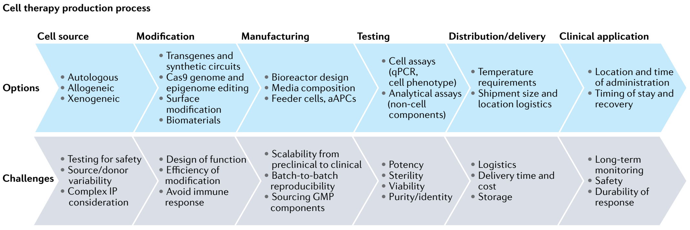
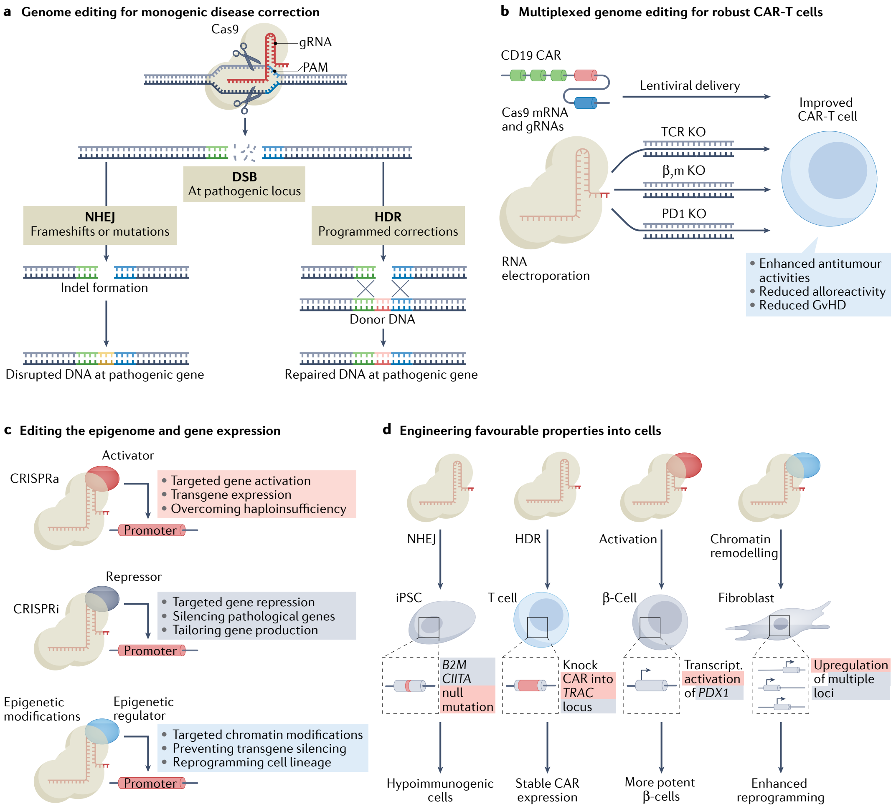
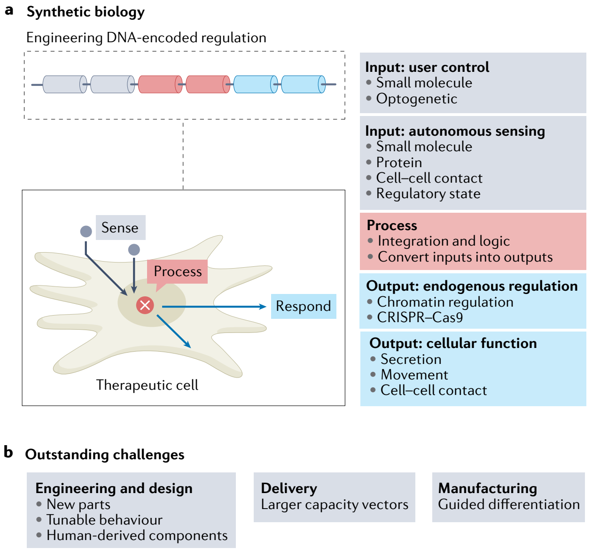
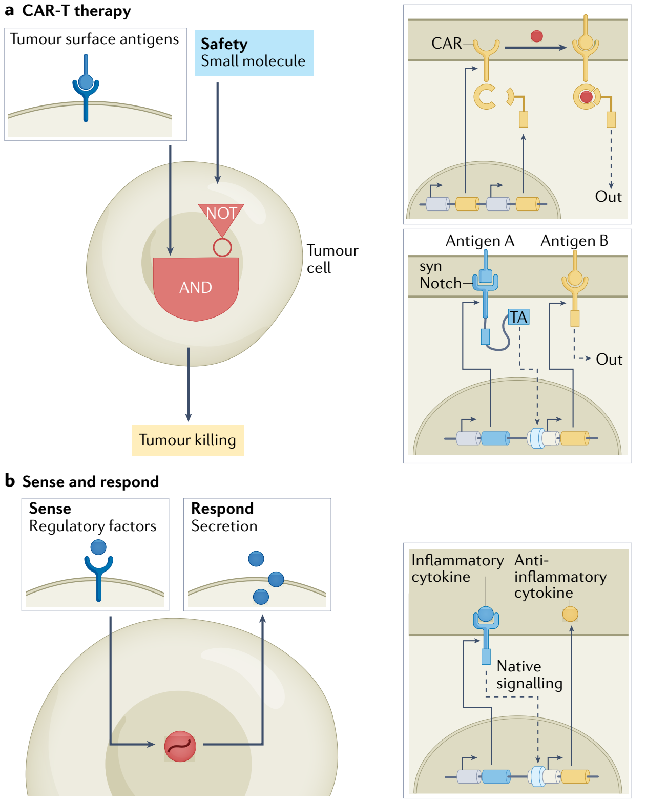
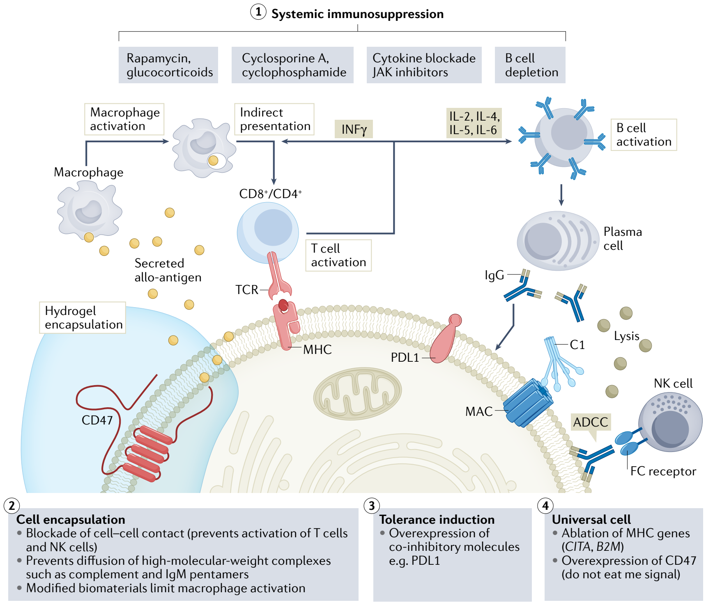

Nature Reviews Drug Discovery  ·  Reviews

# Engineering the next generation of cell-based therapeutics

Caleb J. Bashor1,2✉, Isaac B. Hilton1,2✉, Hozefa Bandukwala3,4, Devyn M. Smith3,5 and Omid Veiseh1✉

1Department of Bioengineering, Rice University, Houston, TX, USA. 2Department of Biosciences, Rice University, Houston, TX, USA. 3Sigilon Therapeutics, Cambridge, MA, USA. 4Present address: Flagship Pioneering, Cambridge, MA, USA. 5Present address: Arbor Biotechnologies, Cambridge, MA, USA.

✉e-mail: caleb.bashor@rice.edu; isaac.hilton@rice.edu; omid.veiseh@rice.edu

https://doi.org/10.1038/s41573-022-00476-6

Abstract | Cell-based therapeutics are an emerging modality with the potential to treat many currently intractable diseases through uniquely powerful modes of action. Despite notable recent clinical and commercial successes, cell-based therapies continue to face numerous challenges that limit their widespread translation and commercialization, including identification of the appropriate cell source, generation of a sufficiently viable, potent and safe product that meets patient- and disease-specific needs, and the development of scalable manufacturing processes. These hurdles are being addressed through the use of cutting-edge basic research driven by next-generation engineering approaches, including genome and epigenome editing, synthetic biology and the use of biomaterials.

Adoptive cell transfer

The transfer of cells into a recipient patient.

Gene therapy

A therapy whereby vectors are administered to modify a person’s genes to treat or cure a disease.

Table 1 | Cell-based therapies used in the USA and EU

| Product (brand name; company/institution) | Therapeutic area | Cell type | Approval date | Status |
| --- | --- | --- | --- | --- |
| HPCs, cord blood (Bloodworks) | Oncology | Allogeneic HSCs | 2012 USA | Investigational |
| HPCs, cord blood (Ducord; Duke University) | Oncology | Allogeneic HSCs | 2012 USA | Investigational |
| HPCs, cord blood (Clinimmune Labs) | Oncology | Allogeneic HSCs | 2012 USA | Investigational |
| HPCs, cord blood (Allocord; Glennon Children's Medical Center) | Oncology | Allogeneic HSCs | 2013 USA | Investigational |
| HPCs, cord blood (Hemacord; New York Blood Center) | Oncology | Allogeneic HSCs | 2013 USA | Investigational |
| HPCs, cord blood (Life South) | Oncology | Allogeneic HSCs | 2013 USA | Investigational |
| HPCs, cord blood (Clevecord; Cleveland Cord Blood Center) | Oncology | Allogeneic HSCs | 2015 USA | Investigational |
| HPCs, cord blood (MD Anderson) | Oncology | Allogeneic HSCs | 2018 USA | Investigational |
| Sipuleucel-T (Provenge; Dendreon Pharmaceuticals) | Oncology | Autologous dendritic cells | 2010 USA 2013 EU | Marketed USA Withdrawn EU |
| Tisagenlecleucel (Kymriah; Novartis) | Oncology | Autologous CAR-T cells | 2017 USA 2018 EU | Marketed |
| Axicabtagene ciloleucel (Yescarta; Kite/Gilead) | Oncology | Autologous CAR-T cells | 2017 USA 2018 EU | Marketed |
| Brexucabtagene autoleucel (Tecartus: Kite/Gilead) | Oncology | Autologous CAR-T cells | 2020 USA | Marketed USA |
| Idecabtagene vicleucel (Abecma; Bristol-Myers Squibb) | Oncology | Autologous CAR-T cells | 2021 USA | Marketed USA |
| Lisocabtagene maraleucel (Breyanzi; Bristol-Myers Squibb) | Oncology | Autologous CAR-T cells | 2021 USA | Marketed USA |
| Allogeneically derived fibroblasts (Apligraf; Organogenesis) | Skin | Allogeneic fibroblasts | 1998 USA | Marketed |
| Articular cartilage-derived cells (ChondroCelect; TiGenix) | Cartilage | Autologous chondrocytes | 2009 EU | Marketed Withdrawn EU |
| Azficel-T (Laviv; Fibrocell Technologies, Inc.) | Dermatology | Autologous fibroblasts | 2011 USA | Marketed |
| Allogeneic cultured keratinocytes and fibroblasts in bovine collagen (Gintuit; Organogenesis) | Dental | Allogeneic fibroblasts | 2012 USA | Marketed |
| Autologous cultured chondrocytes on porcine collagen membrane (MACI; Vericel Corp.) | Cartilage | Autologous chondrocytes | 2016 US 2013 EU | Marketed USA; withdrawn EU |
| Ex vivo expanded autologous human corneal epithelial cells containing stem cells (Holoclar; Chiesi Farmaceutici) | Eye | Autologous limbal stem cells | 2015 EU | Marketed EU |
| Patient-derived chondrocytes (Spherox; Co-Don Ag) | Cartilage | Autologous chondrocytes | 2017 EU | Marketed |
| Adipose-derived mesenchymal stem cells (Alofisel; Takeda) | Crohn's disease | Allogeneic adipose-derived stem cells | 2018 EU 2021 Japan | Marketed |

CAR-T, chimeric antigen receptor T cell; HPC, haematopoietic progenitor cell; HSC, haematopoietic stem cell.

Cell-based therapy, which involves the administration of cells as living agents to fight disease, has in recent years experienced explosive growth in both clinical deployment and expansion within the pharmaceutical marketplace. In particular, a handful of therapies have overcome regulatory hurdles and entered commercial use, resulting in growing public recognition and excitement. These include the successful treatment of lymphoid cancers using adoptive cell transfer of genetically reprogrammed T cells, resulting in FDA approval of tisagenlecleucel and axicabtagene ciloleucel in 2017 for the treatment of acute lymphoblastic leukaemia (ALL) and large B cell lymphoma (LBCL), respectively. Other recent successes have included approval of the use of patient-derived limbal stem cells to repair damaged corneal epithelia1, as well as adult stem cells to treat fistulas associated with Crohn’s disease2. These breakthroughs were built upon decades of basic research, and their successes as well as that of other vanguard therapies have had the effect of stimulating enormous cross-disciplinary interest from many previously disconnected basic biomedical research and engineering fields. This growth has been accompanied by an ever-expanding number of clinical trials, and a growing collection of commercially approved therapies (TABLE 1).

Much of the ongoing enthusiasm for cell-based therapies derives from the prospect of redirecting innate cellular function to enable safety and efficacy profiles that exceed other, more-established, modalities. Although biologics — which include recombinant proteins and other cell-derived biomolecules — can harness the recognition capabilities of macromolecules to achieve a high degree of target specificity, they are prone to unfavourable pharmacokinetic (PK) and pharmacodynamic (PD) properties that can limit their safety and efficacy3,4. Gene therapies offer the prospect of correcting cellular genotype through therapeutic transgene delivery, usually via a viral vector. However, gene therapies face several translational challenges5,6, which include a lack of control over the localization, distribution and magnitude of transgene expression, as well as limitations surrounding transgenic payload size of many vectors, and a well-documented inability to support repeated dosing cycles owing to the adaptive immune response7,8. Additionally, there have been significant safety concerns in recent gene therapy clinical trials9.

Although cell-based therapies have many of the same translational barriers as gene therapies — including safety concerns over the potential tumorigenicity and high manufacturing costs that challenge product reimbursement — they have unique intrinsic features that offer the potential for enhanced efficacy against disease. For example, cells can naturally migrate, localize and even undergo proliferation in specific tissues or compartments10. Cell-based modalities that harness these properties therefore hold potential for biodistribution and targeted delivery advantages not only over biologics, which are subject to limitations imposed by their PK/PD profiles, but also over gene therapies, for which tropism specificity remains challenging to engineer. Furthermore, cells can actively sense a wide variety of extrinsic inputs from small molecules, cell surface marker proteins and even physical forces. Thus, cell-based therapies have the capacity for highly sophisticated sense-and-respond functions that could dynamically track disease states by detecting associated molecular cues and delivering a multifactorial output response that includes activation of an intrinsic response or the expression of therapeutic transgenes. Finally, because of the ability of cells to persist in vivo, consume nutrients and affect their extrinsic environment through production of secreted factors, cell-based therapies can be used to sustain long-term endogenous drug delivery. Although nearly every cell type in the human body (~200 in total)11 harbours properties that can potentially be turned to therapeutic use, some of the highest profile contemporary clinical successes have been enabled by engineered alterations in cellular function. For example, the clinical results for haematological malignancies described above were achieved using chimeric antigen receptors (CARs), engineered DNA constructs introduced into patient T cells to redirect their cytotoxicity to tumour cells that bear CD19, a B lymphocyte-associated antigen12.

Chimeric antigen receptors

Receptors that have been engineered to direct immune cell response to cells expressing specific antigens.

Cell therapy

A form of treatment in which viable cells are administered to a patient to elicit a medicinal effect.

Epigenome editing

Genetic engineering approach in which the epigenome is modified at specific genomic sites using engineered molecules.

Fig. 1 | A cellular therapy process flow. Options and considerations that go into developing each step of a new cell therapy process can lead to challenges at each stage. The cell source is the starting point, whether allogeneic or autologous in nature, but these are often modified into bespoke cell therapies. These must then be manufactured at scale, which is currently a tremendous bottleneck in the industry. Finally, testing, distribution and delivery for clinical application are less challenging than some of the earlier production processes. aAPC, artificial antigen presenting cell; GMP, good manufacturing practice; IP, intellectual property.

Despite ongoing progress towards cell-based treatments for various indications, creating new products remains a formidable undertaking, as treatment strategies tailored to specific diseases must overcome a series of grand challenges, listed here, to successfully generate products that are clinically and commercially viable (FIG. 1).

• A cell source (BOX 1) needs to be identified that yields a product with robust and stable properties, and, for engineering purposes, is amenable to genetic manipulation.

• A cell-based product needs to harbour sufficient viability to ensure adequate duration of therapeutic action.

• Predictable and defined levels of therapeutic potency must be achieved by either redirecting existing cellular properties or engineering new ones.

• PK/PD properties of the cell must match the specific physiological needs of the disease.

• The safety and tumorigenicity profile of the cell therapy product must be ensured to limit adverse reactions with the host immune system and prevent tumour formation.

• Scalable manufacturing processes must be developed that can efficiently and affordably generate quantities of cells adequate for dosing patients.

In this Review, we discuss how progress towards new and more effective cell therapies that overcome these challenges will require development of abilities to complement, augment and even reprogramme native cellular function using an emerging set of biological engineering approaches that include genome and epigenome editing, synthetic biology and the use of biomaterials. These strategies are currently being leveraged not only to enhance the mode of action for existing therapies, but also to create entirely new modalities by finding solutions to the grand challenges enumerated above.

We begin with a brief overview of the current landscape of cell-based therapies, highlighting illustrative examples of recent clinical and commercial successes in the field, including the use of CAR T cell (CAR-T) therapy to treat cancer13, as well as the use of stem cell therapies to treat other indications such as myocardial infarction and diabetes14, describing breakthroughs as well as current limitations. We then provide a brief introduction to the various sources of cells that are currently being developed for cell therapy applications, highlighting their advantages and limitations. The core of the article focuses on some of the most innovative and exciting preclinical applications of the above-listed biological engineering approaches, assessing how these promising proof-of-concept studies point the way towards addressing the grand challenges. Finally, we highlight future opportunities and discuss how they could further expand the clinical and commercial reach of cell therapy.

## Progress and challenges in cell-based therapy

Box 1 | Cell source and the immune response

Various sources of cells currently being developed for therapeutic use can be broadly categorized into three groups based on their origin (TABLE 2): autologous cells, in which the cells comprising the product are derived from the patient; allogeneic cells, which are of human origin but from an individual distinct from the patient; and xenogeneic cells, which are of non-human origin. Cell source is a fundamental factor that affects not only procurement, manufacturing and efficacy of a therapeutic product but also safety, as it serves as the key determinant of a patient’s immune response to the transplanted cells. A strong response can lead to both toxicity and failure of the cells to persist and provide therapeutic benefit to the patients. Although the potential for xeno-derived cells is high231,238, the use of these sources remains rare owing to challenges with overcoming host immune rejection. We therefore limit our discussion below to advantages and disadvantages of autologous and allogeneic cells.

Autologous cells

The goal of autologous cell therapies is to treat disease by redirecting the native function of a patient’s own cells. As described above, there are primarily three cell types either approved or under active clinical development as autologous therapies: bone-marrow-derived haematopoietic stem cells (HSCs), immune effector cells isolated from peripheral blood, and induced pluripotent stem cells (iPSCs). A general limitation for these therapies is the dependence of product quality upon the patient’s health. For example, many adoptive therapy pipelines use immune cells that can become depleted in a donor with chronic illness. This variability in cell source, when coupled with complex expansion protocols and long lead times, typically results in high manufacturing costs and reimbursement challenges. However, despite these challenges, autologous therapies offer the considerable advantage of avoiding immune responses, enhancing efficacy owing to long-term engraftment times and holding the potential for re-administration239. It should be noted that autologous therapies may still pose the risk of immune response via transgenes that encode antigens that are xenogeneic or congenitally absent. Immunogenicity from non-tolerized transgenes has been demonstrated preclinically and involves both cellular (CD8+ and CD4+ T cells) and humoral arms of the adaptive immune response240,241. However, such deleterious immune responses have yet to be observed in the clinic. For example, in one recent study, a complete reversal of clinical manifestations of β-thalassaemia was obtained upon transfer of lentivirus-modified HSCs expressing a mutant β-globin gene without an apparent immune response242.

Allogeneic cells

In contrast to autologous sources, allogeneic products offer potentially scalable production from abundant cell sources that can dramatically improve cost and simplify manufacturing, although often at the expense of therapeutic potency. Although there are some notable examples of allogeneic sources for cell therapy that elicit minimal immunogenic reactions — natural killer (NK) cells do not induce graft versus host disease (GvHD)243 and mesenchymal stem cells (MSCs) enjoy immune evasive status under most circumstances244 — most allogeneic cell therapies are vulnerable to negative interactions with the host owing to immune mismatch. This poses crucial challenges to response durability, requiring immunosuppression regimens or novel engineering approaches. For example, there are numerous allogeneic therapies under development in which cells are engineered for the continuous delivery of therapeutic proteins that are absent or decreased in patients owing to congenital mutations. For most of these applications, cells are encapsulated in biopolymer matrices to prevent immune recognition and mitigate the use of immunosuppression245. However, the foreign body response to the encapsulation material remains an ongoing challenge186,246,247 (see Biomaterials section below for further discussion). Advantages of this approach include the ability to re-dose and stable pharmacokinetics due to elimination of the peaks and troughs associated with periodic infusion248. Several encapsulated allogeneic cell therapies are under development, including for type 1 diabetes (NCT04678557), haemophilia (NCT04541628) and glaucoma (NCT04577300).

Table 2 | Advantages and disadvantages of various cell sources for cell-based therapeutics

| Cell source | Examples | Effect on immune cells | Cell engraftment | Durability of response | Dosing | Refs |
| --- | --- | --- | --- | --- | --- | --- |
| Autologous | HSCs, T cells | Recognized as self, no need for immunosuppression | Potentially permanent | Long-term, highly viable | Re-administration possible, variability in dosing | 20,21,227,228 |
| Allogeneic | MSCs, NK cells, B cells | Cells recognized as foreign, immunosuppression required | Transient engraftment | Short-term, variable | Re-administration possible, good control over dosing | 25,229,230 |
| Xenogeneic | Porcine pancreatic islet cells, choroid plexus cells | Cells and proteins recognized as foreign, immunosuppression required | Transient engraftment | Short-term, variable | Low feasibility for re-administration, limited control over dosing | 169,175,231 |
| Sequestered cells (encapsulation or device) | β-Cells167,232, RPE cells154,233,234, hepatocytes235 | Shielded from immune system, no need for immuosuppression | User-defined engraftment | User-defined, potentially long-term | Re-administration possible, good control over dosing | 153,164,175,227,228,236,237 |
| Genetically modified non-immunogenic cells | Universal cells | Not recognized by the immune system | Potentially permanent | Long-term, highly viable | Re-administration possible, variability in dosing | 161 |

HSC, haematopoietic stem cell; MSC, mesenchymal stem cell; NK, natural killer; RPE cell, retinal pigment epithelial cell.

Cell-based therapies for humans were first introduced in the 1950s in the form of bone marrow transplants for patients with blood-borne cancers15. The success of these treatments as a safe and effective standard of care has served as longstanding evidence of the potential of cells to treat disease and has paved the way for regulatory approval in recent decades of treatments that use umbilical cord blood-derived HSCs and haematopoietic progenitor cells (HPCs) as sources16. These products are in widespread clinical use and comprise a plurality of cell-based therapies approved by the FDA to date (TABLE 1). Although there has been simultaneous progress in the development of therapies derived from other cell sources for treating other indications, translation of these therapies has encountered formidable barriers to commercialization, including the identification of cell sources that can be readily procured and manufactured. Although most approved therapies use autologous cells — derived directly from the patient — many candidate therapies being explored in clinical and preclinical settings are allogeneic, that is, derived from other individuals. Although cells derived from different sources have their advantages and disadvantages (BOX 1; TABLE 2), developing strategies to address how they interact with the host immune system remains a major hurdle for new product development. These and other challenges have presented persistent barriers to safety and efficacy, resulting in only a handful of new cell-based therapies gaining regulatory approval and entering the market before the past decade.

Allogeneic cell therapies

Cell therapy interventions that rely on a single donor source to treat many patients.

One of the first breakthrough non-HPC products was a prostate cancer therapy in which dendritic cells isolated from a patient are exposed to a recombinant tumour antigen ex vivo, and then reintroduced to promote a T cell-mediated antitumour response17. This therapy, sipuleucel-T, marketed by Dendreon, was touted as the world’s first ‘personalized’ cancer therapy when it received FDA approval in 2010, but has seen limited use owing to inconsistent efficacy and reimbursement uncertainty, both consequences of the high cost and technical complexity of the manufacturing process18. Other early entries into the market have included therapies using both patient- and donor-derived fibroblasts to topically treat tissue damage, as well as patient-derived chondrocytes used to repair articular cartilage. The earliest of these therapies was a bilayered tissue composed of a bovine type I collagen matrix populated with human foreskin-derived neonatal fibroblasts and an epidermal sheet derived from foreskin-derived neonatal epidermal keratinocytes, marketed in the late 1990s by Organogenesis in the USA19, with additional entrants appearing over the past decade (TABLE 1).

Table 3 | Selected cell-based products in clinical trials for oncology

| Cell type | Product (brand name; company or institution) | Indication | Source | Delivery | Phase | Clinical trial ID |
| --- | --- | --- | --- | --- | --- | --- |
| T cell (TCR) | E7 TCR (National Cancer Institute) | Oropharyngeal cancer | Autologous | i.t. | II | NCT04044950 |
|  | MAGE-A10c796T (Adaptimmune Therapeutics) | Melanoma | Autologous | i.v. | II | NCT02989064 |
| T cell (CAR) | bb2121 (Celgene) | Multiple myeloma | Autologous | i.v. | III | NCT03651128 |
|  | Anti-CEA CAR-T (Sorrento Therapeutics) | Liver metastasis | Autologous | Hepatic artery | II, III | NCT04037241 |
|  | CTX110 (CRISPR Therapeutics) | Lymphoma | Allogeneic | i.v. | II | NCT04035434 |
| MSCs | NA (Mayo Clinic) | Ovarian cancer | Allogeneic | i.p. | II | NCT02068794 |
|  | MSC TRAIL (University College London) | Small cell lung cancer | Allogeneic | i.v. | II | NCT03298763 |
| HSCs | NA (Novartis) | Non-Hodgkin lymphoma | Autologous | i.v. | III | NCT03570892 |
|  | NA (St Jude Children’s Hospital) | Brain and CNS tumours | Autologous | i.v. | III | NCT00085202 |
|  | NA (M. D. Anderson) | Solid tumours | Allogeneic | i.v. | II | NCT00432094 |
| Dendritic cells | NA (University Hospital Erlangen) | Uveal melanoma | Autologous | i.v. | III | NCT01983748 |
|  | Sipuleucel-T (Provenge; Dendreon Pharmaceuticals) | Prostate adenocarcinoma | Autologous | i.v. | III | NCT03686683 |
|  | NA (Dana Farber Cancer Institute) | AML | Allogeneic | s.c. | II | NCT0367960 |

AML, acute myeloid leukaemia; CAR, chimeric antigen receptor; CNS, central nervous system; HSC, haematopoietic stem cell; i.p., intraperitoneal; i.t., intratumoural; i.v., intravenous; MSC, mesenchymal stem cell; NA, not applicable; s.c., subcutaneous; TCR, T cell receptor.

Progress in the commercialization of cell-based therapies has dramatically accelerated within the past decade following regulatory approval of CAR-T therapy by the FDA20–22. Since then, CAR-T products for refractory multiple myeloma, as well as additional products for ALL and LBCL, have reached the market23, and there is potential for approval of therapies using donor-derived natural killer (NK) cells24 based on promising clinical outcomes25. Currently, numerous clinical trials have been completed for solid and liquid tumour indications, using various effector cell types (notable examples are listed in TABLE 3 and well reviewed elsewhere26–28), with some reporting breakthrough success22. However, despite this ongoing diversification, most adoptive cancer cell-based therapy trials continue to use patient-derived T cells that, although successful with haematological malignancies, present a persistent set of challenges for treating other cancers29. These challenges include safety issues posed by cytokine release syndrome (CRS), which results from excessive activation or uncontrolled expansion of administered cells30. Additionally, a need exists for refined tumour antigen targeting to prevent antigen escape or off-target cytotoxicity, both key hindrances to the application of CAR-T therapies to solid tumours29. Finally, not only does the solid tumour microenvironment (TME) present a physical barrier that limits T cell trafficking and infiltration, but TME-associated immunosuppressive signals can diminish both effector function and cell expansion and persistence31. As we discuss later in this Review, overcoming these challenges will likely involve a combination of different engineering approaches, including genetic and/or epigenetic modification to enhance T cell-intrinsic properties, as well as development of synthetic regulatory circuitry that allows T cells to interact with their extracellular environment, thereby enabling conditional regulation of effector function or TME remodelling.

Pluripotent stem cells

Cells that have the capacity to self-renew by dividing and to differentiate into various phenotypes.

Universal cells

Cells that have been genetically manipulated to remove required components for immune recognition to create a universal donor.

Table 4 | Selected cell-based products in clinical trials for non-oncology indications

| Cell type | Product name (company or institution) | Indication | Source | Delivery | Phase | Trial ID |
| --- | --- | --- | --- | --- | --- | --- |
| T cell | TR004 (Kings’ College London) | Crohn’s disease | Autologous | i.v. | II | NCT03185000 |
| MSC | COPD (Mayo Clinic) | COPD | Autologous | i.v. | I | NCT4047810 |
| MSC | NurOwn (Brainstorm Cell Therapeutics) | Multiple sclerosis | Autologous | i.v. | II | NCT03799718 |
| HSC | NA (Bluebird Bio) | Sickle cell disease | Autologous | i.v. | II | NCT03745287 |
| RPE cell | ASP7317 (Astellas Pharma, Inc.) | Macular degeneration | Allogeneic | i.v. | I | NCT03178149 |
| T cell (TCR) | Tabelecleucel (Atara Biotherapeutics) | Lymphoproliferative disease | Allogeneic | i.v. | III | NCT03392142 |
| HSC | MDR-102 (Medeor Therapeutics, Inc.) | Kidney transplantation | Allogeneic | i.v. | II, III | NCT03605654 |
| MSC | Prochymal (Osiris) | Graft versus host disease | Allogeneic | i.v. | III | NCT00284986 |
| Dendritic cell | Dcreg (University of Pittsburgh) | Liver transplantation | Allogeneic | i.v. | II | NCT04208919 |
| MSC | Remestemcel-L (Mesoblast, Inc.) | COVID-19 | Allogeneic | i.v. | III | NCT04371393 |
| HSC | Elivaldogene autotemcel (Bluebird Bio) | Cerebral adrenoleukodystrophy | Autologous | i.v. | III | NCT03852498 |
| T cell | Descartes-08 (Cartesian Therapeutics) | Myasthenia gravis | Autologous | i.v. | II | NCT04146051 |
| B cell | VC-01-103 (ViaCyte, Inc.) | Type 1 diabetes | Allogeneic | i.v. | II | NCT04678557 |

COPD, chronic obstructive pulmonary disease; HSC, haematopoietic stem cell; i.v., intravenous; MSC, mesenchymal stem cell; NA, not applicable; RPE cell, retinal pigment epithelial cell; TCR, T cell receptor.

The excitement surrounding CAR-T products in recent years has driven investment in developing cell-based therapies for a broad variety of indications and, although cancer therapies continue to garner the most attention, there are several emerging areas in which clinical success has generated excitement (TABLE 4). These include treatment of autoimmune disease32, central nervous system (CNS) and neurodegenerative disorders33, cardiovascular disease34 and various orphan diseases35. Several of these therapies have been developed using mesenchymal stem cells (MSCs; also known as stromal cells), which have received longstanding attention as a potential source of therapeutic products owing to their immunomodulatory and anti-inflammatory properties, potential to differentiate into several mature cell types, ease of isolation from a variety of donor tissue sources and favourable safety profile36. Despite their preclinical promise, most early efforts to translate MSC-based therapies lacked appropriate product quality controls owing to variability in cell isolation procedures, culture conditions and final expansion processes, with resulting product inconsistencies leading to numerous clinical failures36. The previously mentioned treatment for Crohn’s disease-associated fistulas, darvadstrocel, currently offered in the EU and Japan2, is one of a handful of commercialized MSC products. Another well-known product is remestemcel-L, which uses donor-derived, culture-expanded MSCs to treat GvHD37. This therapy, originally marketed by Osiris Pharmaceuticals and later purchased by Mesoblast, received regulatory approval in Canada, and then in New Zealand and Japan38. Although its FDA approval for treating GvHD is still pending, this therapy has recently undergone trials for treatment of COVID-19-associated CRS (NCT04371393). Cardiovascular disease is another area in which several MSC-based clinical studies have been completed over the past 20 years39. Some promising therapies that used systemically injected cells to treat myocardial infarction were initially thought to act by engraftment and differentiation to replace damaged host cardiac tissue. However, further investigation revealed that the cells did not in fact engraft but were rapidly cleared by the host immune system40,41, and that tissue regeneration was instead accomplished by immunogenic and tissue-genic factors secreted by the MSCs42. Unfortunately, inconsistent results in subsequent clinical trials resulted in failure to commercialize these therapies, underscoring how challenges of uncharacterized mode of action, inconsistent potency and poor in vivo viability can hamper MSC translation43.

A growing collection of therapies currently making progress through clinical trials uses cellular products derived from pluripotent stem cells44. In one notable example, retinal pigmented epithelial cells derived from induced pluripotent stem cells (iPSCs) are used to treat acute macular degeneration and Stargardt’s disease45. CNS diseases are another area of active research for such therapies, with several groups investigating the use of iPSCs to generate dopaminergic neurons for application in Parkinson disease, and several stem cell-based approaches are under preclinical development for stroke, epilepsy, spinal cord injury, Alzheimer disease, multiple sclerosis and pain46–48. One longstanding focus for iPSC-based therapies has been on engineering pancreatic β-cell replacement as a treatment for type 1 diabetes49. Many early efforts using cadaveric or non-human islets were affected by supply limitations and demonstrated poor long-term viability in the host without immunosuppression, which limits their widespread use49,50. Recently, a new generation of companies have undertaken the use of embryonic stem cell (ESC)- and iPSC-derived islet cells51. In recent years, significant progress has been made towards differentiation protocol optimization52 to rigorously control progression through stage-specific developmental intermediates, yielding cells with higher maturity, purity and potency. Mature islets can then be placed into some type of encapsulation technology or device, and implanted into a human to provide a functional cure for patients53. Although there is tremendous excitement surrounding these therapies, numerous technical hurdles remain, including the development of differentiation protocols that are capable of achieving mature cell phenotypes in quantities sufficient for clinical use.

Non-homologous end joining

(NHEJ). An error-prone mechanism in which broken ends of DNA are joined together.

Homology-directed repair

(HDR). A precise repair mechanism that uses homologous donor DNA to repair DNA damage.

## Innovations in cell engineering

Innovations in engineering disciplines — genome and epigenome editing, synthetic biology and biomaterials — are currently being explored to address the grand challenges in cell therapy. Although some of these approaches have been successfully used to generate commercialized products, many remain at a preclinical stage. Nonetheless, there has been tremendous progress in using these approaches to improve existing, and create new, cell-based therapy pipelines.

### Genome and epigenome editing.

Recent advances in cell-based therapeutics have been driven by the development of CRISPR and CRISPR-associated (Cas) proteins as programmable tools to engineer the human genome and epigenome in living cells. CRISPR–Cas systems can be targeted to specific genomic loci simply by altering the protospacer sequence of an associated guide RNA (gRNA)54–56, which provides an advantage over other genome editing tools, such as zinc finger nuclease (ZFN) and transcription activator-like effector nuclease (TALEN) proteins, that require protein engineering to target new sequences57. This improved ease of use can directly translate into optimized design, build and test cycles, and thus reduce the time to market and the manufacturing costs of cell-based therapeutics. Nevertheless, the use of ZFN and TALEN proteins has resulted in several important clinical advances that paved the way for the rapid deployment and clinical utility of CRISPR–Cas-based technologies58–60. In this section, we focus on the application of CRISPR–Cas-based tools for cell-based therapeutics in the context of the grand challenges outlined above.

Box 2 | CRISPR–Cas genome editing toolbox

Naturally occurring CRISPR–Cas-based genome editing tools

The canonical Cas9 variant is sourced from Streptococcus pyogenes (SpCas9; here, Cas9). Cas9 recognizes and binds to an NGG protospacer adjacent motif (PAM) and after binding cuts ~3 nt upstream of the PAM, resulting in a blunt-ended double strand break (DSB)54–56. Other naturally occurring Cas proteins (for example, SaCas9 (REF.249), NmCas9 (REF.250), CjCas9 (REF.142), AsCas12a and LbCas12a251,252) offer smaller sizes and altered PAM specificities, which can be useful for viral packaging and expanding targeting ranges, respectively. Further, some Cas proteins can site-specifically target RNAs, notably Cas13 variants253,254, and recent efforts have also focused on harnessing type I CRISPR systems, such as the Cascade complex255,256, which contain multiple different protein subunits. Although each of these platforms holds tremendous clinical promise, ongoing work to characterize efficiency, pre-existing immunity and mechanisms of nuclease activity and resolution will improve efficacy and utility. These efforts will benefit from newly issued FDA guidelines on incorporation of genome editing into human gene therapy products (https://www.fda.gov/media/156894/download).

Engineered CRISPR–Cas-based genome editing tools

In addition to repurposing naturally occurring CRISPR–Cas platforms, the Cas9 protein has been engineered for improved specificity, expanded targeting ranges and to allow sequence modifications without DSBs. Key mutations in the Cas9 protein have resulted in engineered variants, such as SpCas9-HF1 (REF.257), eSpCas9 (REF.258) and HypaCas9 (REF.259) that display improved genome-wide targeting specificity while maintaining high on-target activity. Other engineering efforts have yielded Cas9 protein variants with altered PAM specificities260,261, and more recently near ‘PAMless’ versions262 that are targetable to virtually any endogenous locus. Additionally, recent advances include Cas9 proteins that alter DNA without induction of DSBs, such as base editing technologies71,74,75, CRISPR-based transposases78,79 and prime editing77 platforms.

Nuclease-null CRISPR–Cas-based tools to control gene expression and the epigenome

Nuclease-null, deactivated CRISPR–Cas systems (dCas) have been created that target the human genome similar to conventional Cas proteins but do not make cuts after site-specific recognition95,97,263,264. These dCas-based platforms have been repurposed as scaffolds to deliver transcriptional modulatory domains and epigenetic effects to specific loci for therapeutic benefit. Widely used transcriptional activators recruited using dCas include the VP64 (REF.264), VPR98, p300 (REF.108) and synergistic activation mediator (SAM)265 effectors. The SunTag266 platform has also enabled robust recruitment of multiple effectors to a target locus, which can be used to potently induce gene expression. More recently, compact and robust transcriptional activators sourced from human proteins have been described105. Parallel technologies have been developed to repress human gene expression, using the recruitment of repressors such as the KRAB domain264 or bipartite fusions thereof (that is, KRAB–MeCP2)267. DNA methylation-modifying domains, including DNMT3a–3l268,269 or the catalytic domain of the demethylase TET1 (REFS236,237) have also been recruited to human loci using dCas proteins, which results in site-specific DNA methylation or demethylation, respectively. A full assessment of these technologies is beyond the scope of this Review; however, it is becoming clear that the synergy of these tools with conventional genome editing and state-of-the-art cell-based therapies will be an important component for the future of engineered cells.

Fig. 2 | Leveraging CRISPR–Cas-mediated genome and epigenome editing for improved cell-based therapeutics. a | Genome editing can be applied to correct monogenic diseases. Double strand breaks (DSBs) resulting from programmed genome editing outcomes generally resolve via non-homologous end joining (NHEJ) or homology-directed repair (HDR) repair mechanisms in human cells. NHEJ typically results in insertions or deletions (indels) near the targeted genomic site, which can be leveraged for programmable endogenous genetic disruption. By contrast, in the presence of a donor DNA template, HDR can permit precision replacement of genomic DNA, including donor templated to correct DNA associated with pathology or to incorporate clinically important transgenic payloads. b | CRISPR–Cas-based genome editing technologies are highly amenable to multiplexing, which can be used to improve cell-based therapeutics, including chimeric antigen receptor T cell (CAR-T) therapies. Multiplexed CRISPR–Cas9-based genome editing (shown here simultaneously targeting the genes encoding human β2-microglobulin (β2m), PD1 and endogenous T cell receptor (TCR)) in combination with a lentivirally delivered CAR can be used to generate CAR-T cells with improved function and safety profiles. c | CRISPR–Cas systems with inactivated nuclease activity do not result in DSBs, but can still precisely target genomic DNA. These CRISPR–Cas-based ‘epigenome editing’ platforms enable robust activation or repression of transcription (CRISPR activation (CRISPRa) or CRISPR interference (CRISPRi), respectively) or tailored control over epigenetic modifications within human cells, which can be used to shape gene regulation and cell functions. d | The convergence of these transformative technologies can be used to engineer favourable properties within cell-based therapeutics, for example, by disrupting loci that elicit immunological recognition in therapeutic-grade induced pluripotent stem cells (iPSCs), overcoming limitations to therapeutic efficacy and natural potency by harmonizing integrated payloads with natural genetic regulatory programmes (that is, expressing a CAR-T receptor from a locus (TRAC) that naturally drives TCR expression) or overexpressing beneficial endogenous molecules, and by remodelling chromatin signatures to more efficiently reprogramme cellular lineage commitment, for instance, improving the derivation of iPSCs from fibroblasts. gRNA, guide RNA; PAM, protospacer adjacent motif; Transcript., transcriptional.

The best characterized CRISPR–Cas system leverages the Cas9 protein derived from Streptococcus pyogenes54–56 to make double strand breaks (DSBs) in the human genome. However, several other CRISPR–Cas platforms will also be clinically important moving forward, including novel Cas proteins sourced from diverse prokaryotes and those that have been engineered in the laboratory (BOX 2). CRISPR–Cas-based DSBs are resolved by native pathways in human cells through non-homologous end joining (NHEJ), homology-directed repair (HDR) (FIG. 2a) or other, related, pathways. Cas9-mediated NHEJ has been used to silence pathogenic loci, remove deleterious insertions and confer resistance to viruses. In the context of therapeutic genome editing and cell-based therapeutics, early landmark studies demonstrated that Cas9-mediated NHEJ of the BCL11A erythroid enhancer could be used to potentially treat sickle cell disease or β-thalassaemia61. In addition, NHEJ strategies using Cas9 to target specific regions of the HIV62 or human papillomavirus (HPV)63 genomes have been useful in limiting the spread of these viruses.

Although leveraging Cas9-mediated NHEJ to target single loci and/or monogenic diseases has currently experienced the most clinical progress, multiplexed approaches aimed at simultaneously targeting several loci have also substantially advanced in recent years64–66 (FIG. 2b). For example, multiplexed CRISPR–Cas9-based genome editing using Cas9 mRNA and gRNAs that target T cell receptor (TCR), β2-microglobulin (β2m) and PD1 genes simultaneously, has been used in combination with a lentivirally delivered CAR, to generate allogeneic CAR-T cells deficient in TCR, HLA class I molecule and PD1, and has opened the door to universal CAR-T cells65. Importantly, these types of combinatorial strategy could prove central to solving some of the grand challenges that face cell therapies — particularly by decreasing the immunogenic profiles of autologous cell sources and enhancing the viability of engineered cells, which in turn could improve patient safety and therapeutic potency. Moving forward, multiplexed genome editing technologies could also be pivotal for modelling and treating more complex diseases, wherein pathologies manifest from multiple loci acting in concert. Multiplexed genome editing technologies will likely also provide new ways to overcome many of the hurdles that face cell-based therapeutics, for instance, by enabling the simultaneous knockout of multiple loci that otherwise are bottlenecks in the production of therapeutic proteins, or that render cells more sensitive to apoptosis in adverse conditions.

One confounding factor surrounding the use of NHEJ for genome editing to build cell-based therapeutics is that the resolution of DSBs subsequent to NHEJ can be unpredictable. In contrast, HDR can result in precise and predictable changes in genomic sequence. For instance, CRISPR–Cas-based HDR has been used to increase the robustness of CAR-T cell therapeutics, by directing a CD19-specific CAR to the T cell receptor α-chain (TRAC) locus for more uniform CAR expression and enhanced potency67. More recently, ribonuclear protein (RNP)-mediated delivery of CRISPR–Cas components and designer donor templates were used to insert exogenous payloads into primary human T cells via HDR. This approach permits robust individual or multiplexed modifications and was used to both correct pathogenic mutations and engineer the endogenous TCR locus to recognize a NY-ESO-1 cancer antigen7. Expanding these approaches to knocking in pools of different variants into specific loci in T cells has also proved to be a powerful way to screen for improved efficacy against solid tumours68.

Base editing

CRISPR–Cas9-based genome editing technology that allows the introduction of point mutations in the DNA without generating double-stranded breaks.

DSBs created by CRISPR–Cas systems can lead to harmful genomic rearrangements and cytotoxicity, creating safety and viability concerns for engineered cells. For instance, CRISPR–Cas9-mediated DSBs in murine ESCs and haematopoietic progenitors, as well as in human cell lines, have been reported to result in large unintended deletions that could drive hazardous pathologies if not properly evaluated and controlled69. In addition, CRISPR–Cas9-based genome editing in immortalized human retinal pigment epithelial cells has been observed to induce a p53-mediated DNA damage response70. Therefore, considerable attention has also been focused on engineering CRISPR–Cas-based tools that can perform genome editing in the absence of creating DSBs. For example, CRISPR–Cas-based base editors have been designed to target and subsequently edit genomic sequences at specific loci without creating a DSB71–75. Despite base editors being relatively new compared with conventional nuclease-based genome editing, they will undoubtedly display significant utility for cell-based therapeutics. For instance, recent efforts using multiplexed base editing in primary human T cells resulted in a novel platform to produce allogeneic CAR-T cells76. Other technologies, such as CRISPR–Cas-based prime editing77, and CRISPR–Cas-based transposases78,79 also permit site-specific genome editing without DSBs and will likely be useful tools within the genome editing arsenal for future cell-based therapeutics (BOX 2).

Because CRISPR–Cas proteins are derived from bacterial or archaeal sources, another important consideration is the potential immunogenicity or toxicity of genome and epigenome editing tools that are leveraged for cellular engineering and therapeutic protein production. For example, CRISPR–Cas components can be immunogenic in mammals, and certain patients may have acquired immunity through previous exposure to Cas proteins80,81. Furthermore, the mere expression of Cas9 has been associated with the activation of the p53 pathway and the enrichment of mutations that inactivate p53 in a litany of human cancer cell lines70,82. Although ex vivo editing approaches combined with cell screening and selection can circumvent many of these issues, they can be costly and are not amenable to scaling. Although these immunogenicity and toxicity issues are a clear concern, targeted in vivo efforts are rapidly maturing83,84 and will be pivotal in the future. Further frameworks that more comprehensively describe and address these concerns will enable future successes in drug discovery, disease modelling and engineering cells in animals and in patients.

In addition to progress in ongoing clinical trials85 and in creating new CAR platforms86, genome editing has been instrumental in the development of ‘off-the-shelf’ engineered cells for use as therapeutics. For example, human T cells that have been edited to remove both CD7 and TRAC showed potency against T cell acute lymphoblastic leukaemia (T-ALL) without evidence of xenogeneic GvHD87. As discussed above, multiplexed application of CRISPR–Cas9 has also been used to simultaneously disrupt endogenous TCR, HLA and PD1 to produce allogeneic CAR-T cells with reduced immunogenicity65. Performing genome editing before cellular differentiation is another option that can result in homogeneous cellular populations that may make manufacturing more scalable and affordable. For instance, disrupting HLA genes in iPSCs has proved to be a useful way to enhance immune compatibility, and recently iPSCs were subjected to allele-specific editing of HLA to generate pseudo-homozygosity, yielding iPSCs that could escape recognition by both T cells and NK cells88. Similar strategies to knock out B2M and simultaneously overexpress CD47 have also produced iPSCs with substantially reduced immunogenicity89. Human iPSC-based off-the-shelf therapeutics are making rapid progress, and clinical trials in both solid tumours and advanced haematological malignancies are ongoing (NCT03841110 and NCT04023071, respectively). These exciting advances in the use of genome editing in clinical contexts have extended to numerous serious indications, including bacterial infections90,91 (for example, NCT04191148), β-thalassaemia and sickle cell disease92 (for example, NCT03655678; EDIT-301), haemophilia B59,93 (NCT02695160) and mucopolysaccharidosis II94 (for example, NCT03041324), among others60.

Although conventional CRISPR–Cas-based genome editing results in changes to genomic sequences, most CRISPR–Cas platforms used in human cells can be deactivated and rendered nuclease-null with simple amino acid substitutions. These so-called deactivated or dCas systems have enabled the creation of easy-to-programme synthetic transcription factors and chromatin modifiers, which in turn has established the emerging field of epigenome editing95–97 (FIG. 2c). Epigenome editing strategies have been useful in reprogramming and directing cell lineage specification and in modelling human diseases. For example, CRISPRa technologies have shown promise in synthetically inducing the expression of master transcription factors that control cell fate specification. For instance, dCas9–VPR has been used to robustly drive the expression of endogenous human neurogenin 2 and thereby force iPSCs into neuronal lineage commitment98. Interestingly, in contrast to conventional cDNA overexpression, CRISPRa-based lineage conversion strategies also produce changes to endogenous chromatin that have been observed to improve cellular reprogramming efficiency99. Similar approaches have been used to engineer myocytes100, reprogramme pancreatic cell fates101, target multiple loci simultaneously in vivo102 and engineer pluripotency103–105.

In addition, CRISPR–Cas-based epigenome editing tools have been used to model several human diseases and disease treatments wherein gene expression and/or the epigenome is dysregulated. A comprehensive discussion of epigenome editing for disease models is beyond the scope of this Review; however, notable recent examples include neuromuscular106 and enzymatic disorders107, as well as kidney disease and diabetes101. As these new technologies to precisely programme human gene expression and the human epigenome continue to emerge and mature, they will undoubtedly be integral to the next generation of cellular drugs when combined with current state-of-the-art cell-based therapeutics and conventional genome editing. These technologies will likely be particularly useful in tailoring precise levels of gene products and preventing the epigenetic silencing of therapeutic transgenes or cytokines over time within engineered cells.

As with Cas proteins, many of the most potent and widely adopted transcriptional effectors used for CRISPR–Cas-based epigenome editing applications are developed using non-human (typically viral) natural or even synthetic transcriptional and/or chromatin modifiers. Therefore, there is a risk and a high likelihood that these effector domains may also harbour intrinsic immunogenicity in vivo, especially if expressed for long periods of time. Future efforts aimed at identifying or engineering transcriptional and/or epigenetic effector proteins sourced from human cells105,108,109 will be key to obviating these immunological obstacles in patients. In addition, although the specificity of targeted CRISPR–Cas-based epigenome editing tools is likely much higher than that of small molecules that globally disrupt the human epigenome, careful analyses of the stability and specificity of epigenome editing will be crucial for tailoring therapeutic efficacy, durability and PK/PD properties of cell-based therapeutics in the years ahead.

Altogether, exciting and profound new opportunities to engineer favourable properties and behaviours into human cells have been driven by the combination of genome and epigenome editing (FIG. 2). As described above, these emergent technological advances have already resulted in improved ways to leverage human cells as therapeutic modalities. Given this progress, cell-based therapeutics will almost certainly continue to progress with the aid of genome and epigenome editing tools. In the context of the grand challenges that face cell-based therapeutics, genome and epigenome editing technologies will likely expedite the production of large quantities of cells with limited immunogenicity that also harbour robust and stable clinical properties and tightly controllable viability. Further, by harnessing the natural epigenetic programmes of human cells, CRISPR–Cas-based epigenome editing will likely facilitate tunable control and predictable outputs from therapeutic transgenes or endogenous biomolecules.

Despite this transformative progress, many challenges remain. For instance, stably maintaining the presence of, and high uniform expression from, large genetic payloads within engineered cells is often difficult. A combination of sophisticated genetic circuitry (see below) and epigenome editing technologies could be used to address inconsistencies in expression levels, which would be particularly important for balancing CAR-T activity110 and could be leveraged to prevent epigenetic exhaustion in engineered cells. Moreover, since transgenic payloads can be epigenetically silenced over time, there is a unique opportunity to leverage epigenome editing tools to potentially reverse and/or prevent any epigenetic silencing of therapeutic transgenic payloads. Finally, although producing iPSCs from differentiated cells, and directing their subsequent re-differentiation has dramatically advanced over the past decade, the processes and protocols used are often inefficient and/or laborious and therefore not ideal for manufacturing at scale. A combined approach to genetically engineer the human genome, epigenetically engineer the human transcriptome, and to tailor culturing conditions and small-molecule cocktails will likely resolve these inefficiencies and help to usher in the next wave of cell-based therapeutics.

### Synthetic biology.

Fig. 3 | Using synthetic biology approaches to endow therapeutic cells with enhanced functional properties. a | Making new synthetic regulatory connections. Engineered regulatory circuits can be introduced into therapeutic cells to create artificial input–output relationships. This can connect external user control or disease-associated molecular cues to diverse therapeutic outputs. b | Outstanding challenges for synthetic biology in engineering new cell-based therapy applications. Future developments should include developing human-derived components, developing larger capacity vectors to accommodate larger, more sophisticated circuitry and using synthetic circuits to guide cell differentiation (for example, from induced pluripotent stem cells to immune effector cells).

The use of genetic engineering to introduce transgenic or artificial genes into therapeutic cells has been pursued for decades as a means to create safer and more effective cell-based products. Many of these approaches, which include the introduction of CARs into T cells, are belied by the label ‘engineering’; most use decades-old genetics tools to introduce transgenes into cells in a way that offers limited control over the magnitude or timing of their expression. The field of synthetic biology has emerged over the past two decades with the goal of making genetic engineering outcomes more precise, predictable and reproducible through the application of quantitative design rules111. Although it achieved its earliest breakthroughs in microorganismal systems111, the field has charted progress in engineering human cells in recent years112. This progress has been motivated in large part by the possibility that cell-based therapies can be enhanced though precision control over therapeutic transgene expression or delivery of secreted therapeutic factors, or by programming cells to sense biomolecular species associated with a specific tissue compartment or disease state and respond via altered cell behaviour (FIG. 3a). Although most efforts are currently aimed at enhancing therapeutic potency, PK/PD profile and safety, synthetic biology has the potential to deliver engineering solutions that address all the grand challenges discussed in the introduction of this Review, including expanding the spectrum of cell types that can be used for therapy, as well as making cell manufacturing processes more efficient and robust (FIG. 3b).

Fig. 4 | Using synthetic circuits to enhance therapeutic function. a | Synthetic regulatory circuits have been developed that improve chimeric antigen receptor T cell (CAR-T) therapy by enabling small-molecule remote control over CAR activity117 and enhancing target cell specificity118 (synNotch). The remote-control circuit features a split CAR that can be used to reconstitute CAR activity through administration of a small-molecule dimerizer, enabling exogenous control over T cell antitumour function. SynNotch is a programmable receptor that can sense cell surface ligands and respond by activating gene expression. This response can be coupled to production of a CAR, which is then able to recognize a second ligand, thereby enabling Boolean AND-gate function. b | Synthetic sense-and-respond programmes have been engineered that can autonomously treat diseased tissue. In one set of example applications125, systems have been developed in which the sensing of inflammatory cytokines is coupled to secretion of those that are anti-inflammatory. TA, transcriptional activator.

Applications of synthetic biology to cell-based therapies that have been reported in recent years range in complexity from simple switch modules constructed from engineered proteins to multi-component ‘circuits’ — artificial gene and protein regulatory networks programmed to convert specific molecular inputs into therapeutic outputs113. Circuit designs fall broadly into two functional categories (FIG. 4). First, those that enable exogenous control over the dose or temporal response profile of gene expression or protein activity, usually via inputs such as small-molecule drugs. These ‘user-operated’ circuits can be used to activate or deactivate transgene expression, enabling treatment regimens that optimize the timing of therapeutic action. Second, those that link the autonomous recognition of molecular inputs to downstream activity, thereby establishing closed-loop sensing and response to exogenous signals associated with a specific tissue compartment or disease state. Circuits in this second category are often coupled to engineered cell surface receptors that detect extracellular protein or small-molecule species. Circuits from both categories feature intermediate signal processing ‘motifs’ that convert inputs into outputs according to quantitatively defined operations. For example, feedback control can be used to modulate the timing of circuit output, while Boolean logic operations can be implemented to activate circuits only in the presence of specific sets of inputs. Both motifs have clear applications for enhancing therapeutic outcomes: the former case can be used to modulate the kinetics of therapeutic action, while the latter can leverage combinatorial molecular recognition to more precisely direct therapeutic outputs to specific target cells or tissues (FIG. 3a).

This spectrum of approaches is exemplified by recent work using synthetic biology to address challenges associated with specificity and activity in adoptive T cell therapy114,115. One of the most successful applications in this space is a protein safety kill switch engineered to cause apoptosis in engrafted cells116. The switch’s chimeric design features a human caspase 9 fused to a modified human FK-binding domain, enabling dimerization and activation of apoptotic signalling upon administration of the small-molecule drug AP1903. Although originally developed to eliminate alloreactive T cells during stem cell transplantation procedures, the switch has been subsequently used in clinical trials for CAR-T therapy to limit effector proliferation in the face of CRS (NCT03696784). In another application, chemical dimerization was used to induce CAR activity through membrane recruitment of intracellular activation domains117 (FIG. 4a). This so-called ON-switch CAR offers a tool for either fine tuning in vivo potency of a CAR-T product via administration of the dimerizer AP21967 or abrogating activation during CRS onset through removal of the drug.

Safety kill switch

Engineered gene into therapeutic cells that can be activated using small molecules to induce apoptosis to enhance the safety of cell therapy.

One important recent focus in CAR-T synthetic biology has been on developing strategies to enhance tumour targeting specificity, with an eye towards enabling solid tumour therapy. One well-known example, originally developed by Lim and colleagues115,118, is a receptor-mediated gene regulatory circuit design in which an engineered chimeric Notch receptor appended to single-chain antibody is triggered upon binding to ligands on the surface of adjacent cells, resulting in the proteolytic liberation of a transcriptional activator and transgene expression (FIG. 4a). Termed synNotch, this system was initially engineered to express a CAR in the presence of a second ligand, thereby enabling two-input AND-gate recognition of antigen combinations119. Further development of synNotch has yielded circuits that employ feedback to achieve switch-like activation, all or none activation at a threshold of target cell antigen density120, as well as to enable sophisticated multi-input Boolean gate circuits with potential to distinguish specific tumours from bystander tissue121. Other solutions for improving CAR-T specificity have focused on engineering extracellular recognition capabilities including split, universal and programmable (SUPRA) CARs, which use multivalent extracellular protein scaffolds to mediate recognition of antigen combinations122. Another system was described in which an engineered protein undergoes a conformational change in the presence of sets of antigens to reveal a peptide that can recruit CAR-T cells123. Solutions for making CAR-T therapy safer include split receptors re-engineered to either be induced117 or activated by small-molecule administration, with both strategies enabling quick deactivation of CAR function in the face of CRS. An innovative strategy by which adeno-associated virus (AAV) is used to introduce a ‘classifier circuit’ into cells that is programmed to sense tumour-specific transcription factor and microRNA signatures has been described119. Cells that express the circuit output, a unique cell surface ligand, could then be targeted by T cells that harbour a cognate CAR119. Finally, receptor domain swapping was recently used to develop a synthetic receptor that selectively recognizes markers of activated lymphocytes. This protein, termed the allo defence receptor, allows adoptive T cells to resist host immune rejection by targeting alloreactive lymphocytes, thereby generating longer-term therapeutic benefit in animal models124.

Switch-like activation

When system activates abruptly at a specific threshold of input.

Another major focus of synthetic biology has been on the development of generalizable closed-loop regulatory circuits engineered to monitor physiological or disease-state features and respond with a therapeutic output. A strategy whereby transgene reporter cassettes are used to reroute native signal transduction pathways has been utilized. One such example is a two-stage cytokine converter circuit that converts TNFα-dependent NF-κB signalling into IL-22 production in its first stage, which then activates a cytokine receptor and signals through STAT3, driving transcriptional production and secretion of anti-inflammatory cytokines IL-10 and IL-4 (REF.125) (FIG. 4b). Following encapsulation and engraftment into mice, cells harbouring this circuit could attenuate inflammation in a mouse psoriasis model. Similarly, β-cell-mimetic designer cells have been constructed that introduce a circuit that senses glucose by linking glycolysis-mediated Ca2+ entry to induction of a transcription circuit driving insulin expression and secretion. When implanted into a mouse model of diabetes, the engineered cells secreted insulin in a glucose-responsive manner, thereby correcting insulin deficiency and mostly eliminating hyperglycaemia126.

Although each of these designs focuses primarily on improving disease-specific mode of action, synthetic biology developments that clear paths to clinical and commercial viability may come from addressing manufacturing and cell source challenges, which, despite representing a major bottleneck that limits product commercialization, have received limited attention from the field. One potential approach could involve circuits that control the overexpression of transcriptional regulators that promote favourable cell-intrinsic phenotypes, or even act as differentiation ‘guidance’ programmes. Such circuitry could be used to guide immune effector cells to differentiate into therapeutically potent subsets, or to promote differentiation and expansion of cells into more viable or potent cell products. On the safety side, regulatory schema could be constructed that use cell-state-responsive circuits to sense aberrant or tumorigenic regulatory states and activate cell death, a strategy that has been successfully used to create conditional safety switches in microorganisms127. In one notable early example of this approach, circuit-driven differentiation of iPSCs into pancreatic β-like cells using timed expression of critical transcription factors was performed128. Such an approach has been used to guide differentiation of iPSCs into liver organoids using inducible transcriptional activation circuits129,130.

As the field continues to incorporate the above-described strategies into clinically relevant therapeutic pipelines, it faces two overarching sets of engineering challenges: first, development and refinement of new synthetic parts and circuit designs are needed to recognize disease-associated physical and biomolecular features, create robust and tunable circuit connections, and couple them to therapeutic outputs; second, cell engineering strategies are needed that grant precise, reproducible delivery of circuits across a population of cells comprising a therapeutic product to ensure stable, quantitatively defined, reproducible behaviour. For the first challenge, despite the progress described above, engineerable regulatory schemes in mammalian cells generally lack the degree of control and scalability that is found in microbial systems. Gene expression control systems available for mammalian gene circuit engineering are limited in number and offer relatively poor scalability. Additionally, they are largely microbial in origin (for example, TetR, Gal4), which raises concerns about their immunogenicity. In the future, using modular systems constructed from humanized proteins and genes will become increasingly prioritized in cell-based therapy applications. One recent example to address this shortcoming is the creation of sets of ZF-derived transcriptional regulators131 shown to function in human cells132,133. While ZF-based circuits can be scaled to support complex multi-gene regulatory behaviour134, these systems can also be used for precise, switch-like expression control135.

Another continuing focus for the field will be on engineering surface proteins to expand the ability of cells to interact with their environment. This includes developing custom configurable receptors capable of coupling disease-specific inputs to endogenous signalling or transcriptional circuitry. Recent developments in engineering extracellular ligand-responsive receptors, in addition to examples described above, include creating modular frameworks for engineering connections between exogenous factor binding and activation of intracellular signalling pathways136, as well as engineering CARs that are sensitive to soluble cytokine ligands137. The use of engineered surface protein expression to enable tissue- and disease-specific targeting is another approach that has shown early promise. MSCs engineered to transiently express a single transgene encoding PSGL1/SLeXX, a surface protein that plays a crucial role in tethering during inflammatory response, demonstrated enhanced localization to sites of inflammation in mouse models of skin inflammation138. In a separate mouse study, overexpression of the chemokine receptor CXCR4, increased homing of MSCs to ischaemic heart tissue139. These preclinical results suggest that reshaping the surface protein expression profile of a cell — its ‘surfacesome’ — through fine-tuned multi-gene expression is a strategy that could offer a powerful means to improve therapeutic potency and PK/PD profile. Coupling inputs from surface-expressed proteins to downstream signalling circuitry will be an important extension of surface protein engineering. The recent emphasis in the field on engineering protein-based circuitry140 has furnished parts and design frameworks for engineering synthetic signalling networks that rely on both phosphorylation141 and proteolysis142. These designs have been leveraged to create post-translational signalling pathways capable of sensing the extracellular environment and transmitting information at a rate much faster than with gene circuits143. The response speed attained by these circuits could be used to enhance PK profiles by incorporating fast timescale events such as phosphorylation-based signalling networks144 or ion channel regulation145.

Boolean AND-gate

A system that performs a computation whereby an output occurs only when all the inputs are present.

As discussed in the previous section, unlocking the full potential of synthetic biology will require overcoming the current limitations on size and corresponding complexity of synthetic circuits that can be efficiently introduced into therapeutic cells. The poor transfection efficiency and low expansion potential of many primary cell types, coupled with repair template size constraints, limits CRISPR-based integration to just a handful of genes, making it a challenge to encode complex function. By the same token, circuits introduced into cells via retroviral and transposon-based vectors also have characteristic size limits and additionally suffer from copy number control issues that limit precision and reproducibility. The use of recombinase-mediated landing pad integration is one technology that has the potential to improve the precision and repeatability of circuit engineering by enabling single-copy integration of large transgene cassettes at defined genomic loci146. However, this approach is hampered by low integration efficiency and necessitates expansion of cells from small subpopulations, potentially diminishing product potency. Efforts to introduce human artificial chromosomes147 or to harness large-genome viruses to deliver multi-gene systems present two other options currently being explored to overcome these barriers148, while the use of the previously mentioned transposon-based CRISPR tools may offer a more general solution for stable integration of complex circuits in the future. Additionally, the ability to maintain transgene stability in the face of epigenetic silencing poses a major challenge for synthetic circuit engineering but could potentially be addressed by deploying a combination of sequence optimization and circuit design, in combination with epigenomic effectors to dynamically maintain an ‘open’ chromatin regulatory state.

Solutions to overcome the interdependent challenges of engineering and precision delivery of complex circuitry to therapeutic cells will free synthetic biology to focus on developing programmes with multi-faceted functionality that can simultaneously encode disease-specific mode of action, safety mechanisms and circuit stability, all while establishing and maintaining relevant cell-intrinsic properties. Additionally, and importantly, these capabilities would give synthetic biologists the opportunity to employ design, build and test cycles to iteratively converge on synthetic circuitry that is quantitatively precise and capable of more effectively addressing disease- and patient-specific needs.

### Biomaterials.

Semi-permeable biomaterials and hydrogels have been used to improve the delivery, viability, retention and safety of therapeutic cells149–152. A wide array of biomaterial formulations ranging from degradable hydrogels to non-degradable plastics and metals have been explored as scaffolds to improve delivery and viability152, facilitate retention of cells within a particular body cavity (that is, intraperitoneal149,153, epicardial151 or intraocular154), promote controlled release150,152 and enable retrievability for improved safety155. These approaches have proved impactful in improving the therapeutic outcomes for cell-based therapies in many preclinical studies156 and early-stage clinical trials154,155. However, a major goal for the field remains the development of long-term functional immuno-isolation solutions to enable use of allogeneic cells.

Fig. 5 | Strategies to overcome immune rejection for allogeneic cell therapy. Schematic representation of current approaches being investigated to overcome immune mechanisms that underlie the rejection of transplanted allogeneic cells. (1) Systemic immunosuppression is the only clinically approved approach, but it results in compromised immunity and risk of malignancy. Several drug regimens and combinations of approaches including treatments with rapamycin and/or glucocorticoids, cyclosporine A and/or cyclophosphamide, cytokine blockade and/or JAK–STAT inhibitors, and B cell depletion with antibodies, are available to enable cell and organ transplantation. (2) Cell encapsulation using biocompatible polymers provides a physical barrier that limits cell–cell contact required for activation and functional lysis by T cells and natural killer (NK) cells. (3) Tolerance induction through direct overexpression of ligands for inhibitory pathways in transplanted cells leads to induction of tolerance. (4) Hypoimmunogenic cells (that is, ‘universal’ stem cells) generated through CRISPR-mediated deletion of major histocompatibility complex (MHC) molecules and overexpression of CD47 limit T and NK cell-mediated cell killing and limit macrophage-mediated phagocytosis. ADCC, antibody-dependent cell-mediated cytotoxicity; FC, fragment crystallizable region; IFN, interferon; MAC, membrane attack complex; MHC, major histocompatibility complex; TCR, T cell receptor.

Hypoimmunogenic

Describes genetically manipulated cells designed to avoid adaptive and innate immune surveillance.

Several types of immune cell play a part in the rejection of allogeneic cells, limiting the development of true off-the-shelf cell therapy products (FIG. 5).

CD4+ and CD8+ T cells have a central role in mediating rejection of allogeneic cells through recognition of the highly variant major histocompatibility complex (MHC) class I and MHC class II gene products157. In addition, innate immune cells such as NK cells and macrophages can also mediate the rejection of allogeneic cells158. Universal iPSCs have been created through CRISPR-mediated deletion of the B2M and CIITA genes required for the expression of HLA class I and HLA class II genes. Additionally, the engineered iPSCs were further customized to express high levels of negative regulators: PDL1, HLA-G and CD47 to block functions of T cells, NK cells and provide the ‘do-not-eat-me’ signal to macrophages, respectively. By leveraging these strategies, several groups have reported the generation of hypoimmunogenic or ‘universal’ iPSCs89,159, which retain their pluripotency potential and could be differentiated into multiple lineages such as endothelial cells, cardiomyocytes and even more complex organoids such as pancreatic islets89,160,161. Hypoimmunogenic cells have been found to not induce immune response in vitro and in vivo in preclinical humanized mice. Although these preclinical data are intriguing, the potential of these cells to evade immune rejection in human subjects remains to be established. However, in the field of islet transplantation, several clinical trials are now planned or currently underway to determine the utility of hypoimmunogenic cells for cell-based therapeutics162.

Immune mechanisms that mediate rejection of allogeneic cells (FIG. 5) require cell–cell contact. A strategy that has been actively explored both in preclinical studies163–165 and in clinical trials166–169 is the use of cell encapsulation of the donor allogeneic cells within semi-porous membranes to enable immuno-isolation170. The goal of these efforts is to isolate the transplanted cells from the patient’s own immune system while allowing for bidirectional transport of soluble factors; for instance, the influx of nutrients such as glucose and oxygen to support the long-term survival of the transplanted cells as well as export of therapeutic proteins produced by them171. Feasibility in animals was first demonstrated through the use of alginate hydrogels to facilitate immuno-isolation of pancreatic islets in rats49. This study showed short-term (several weeks) transplanted allogeneic cell function in an immunocompetent animal. Over the years, many advanced prototypes of encapsulated cell products have been evaluated in the clinic172 for a wide range of cell-based therapeutic applications including ophthalmology173, endocrinology51, oncology174 and neurology175. However, long-term function of encapsulated cell products has been elusive because of host immune responses to implanted biomaterials that lead to fibrosis and hypoxia within the device176.

Although encapsulation has been demonstrated to be highly effective in preventing MHC-mediated recognition of the allogeneic cells by the adaptive immune response of the recipient and extending the survival of the transplanted cells for a few weeks, the long-term survival of the transplanted cells was limited by the development of a characteristic foreign body response (FBR) to the encapsulating biomaterials177,178. The FBR comprises a sequela of processes that begin with the deposition of host-derived circulating proteins such as complement and clotting factors, extracellular matrix (ECM) proteins and albumin176. These proteinaceous deposits promote recruitment and attachment of granulocytes and macrophages. The adherent macrophages can then fuse to form foreign body giant cells and produce factors that lead to recruitment of myofibroblasts, which ultimately produce excessive amounts of pro-fibrogenic and ECM proteins such as collagen, generating granuloma formation179,180. Upon extensive fibrosis, the diffusion of soluble factors becomes highly limited, leading to the death of transplanted cells and therapy failure163.

The transplantation technologies that use donor cells require long-term protection from FBR and host recognition. A semi-permeable hydrogel network is needed to allow small molecules, such as NO, reactive oxygen species (ROS), O2 and cytokines, to effortlessly circulate while avoiding close contact between encapsulated cells and infiltrating immune cells around these implants. Numerous strategies have been used to modulate the physicochemical properties of biomaterials to reduce fibrosis and facilitate long-term graft survival. Surface chemistry to tune surface properties has been shown to influence the biological responses of immune-associated factors176,181–184. Various types of chemical approach have been taken to mitigate the FBR and prevent fibrosis; they are reviewed elsewhere178. However, several of the most advanced technologies that are closer to clinical translation are highlighted below.

Hydrogel surfaces have been modified by immunomodulatory small molecules to prevent any FBR. A unique chemical modification strategy in alginate-based hydrogels using small molecules for the modulation of host immune recognition has been demonstrated184. Intraperitoneal implants using lead materials in mice established lowest FBR, cell, macrophage and collagen deposition for three lead analogues containing a triazole framework in their chemical structure, that may have an essential role in mitigating fibrosis. The positive results observed in mice translated to non-human primates185. Significantly, lead formulations from this screen led to the development of SIG-001, a two-compartment sphere with engineered human cells expressing human factor VIII, which recently entered a first-in-human clinical trial in haemophilia A186. This is an example of an in vivo discovery-driven phenotypic screening approach towards identification of biomaterials with improved immune responses. It is anticipated that future screens using a similar strategy could yield additional lead formulations or materials for other desired immune response profiles.

Another promising approach for alleviating FBR to biomaterials is the use of ultra-low-fouling zwitterionic biomaterials. Protein absorption has been postulated to be a key orchestrator of host immune activation and fibrosis. Zwitterionic hydrogels create a super hydrophilic bio-interface that serves to limit protein absorption187. For example, ultra-low protein fouling, poly(carboxybetaine methacrylate) (PCBMA) hydrogels have been subcutaneously implanted in mice, followed by observation of FBR and inflammatory response188. Studies revealed the growth of angiogenic blood vessels around the PCBMA implants, along with the presence of a considerable number of macrophages, showing anti-inflammatory expression compared with pHEMA. These polymers can also be applied as coatings to reduce immune responses to medical device implants that provoke immune responses such as continuous blood glucose monitors183,189. More recently, zwitterionic sulfobetaine modifications of alginate have been demonstrated to mitigate FBR in rodents, dogs and pigs to enable long-term pancreatic islet immuno-isolation190.

The physical properties, including size, shape, surface morphology, roughness, topography and geometry, of biomaterials play a crucial part in orchestrating protein adsorption, macrophage attachment and host immune responses to foreign materials191–193. Material topography is well known to manipulate macrophage attachment, and the phenotype of the material’s surface also has a role in the modification of an adsorbed protein by conformational changes193,194. The surface topography of a biomedical implant plays a crucial part in the behaviour and modulation of macrophages and other immune cells to influence FBR195. Alteration in surface roughness at the nanoscale can influence higher protein adsorption, affecting interactions with immune cells196,197, and different nanostructured topographies can affect cellular interactions181,198. Studies have revealed that imprinting the grating to the polymer surfaces causes behavioural changes of macrophages, independent of grating size or surface chemistry. Larger size gratings imprinted on polymer surfaces influence the adhesion of immune cells to planar polymeric control surfaces196. Evaluation of different-sized spherical implants in rodents and primates showed that larger implants of 1.5 mm diameter and above elicit very low FBR for an extended period in vivo181. Other reports showed that the size of titanium nanotubes can be modulated to reduce macrophage attachment and FBR199.

The design of semi-permeable membrane chemistry and pore size could potentially have an additional role in enhancing immunoprotection and graft cell survival200. RGD-functionalized polyethylene glycol (PEG) hydrogels, further modified with peptides that show strong binding affinity to pro-inflammatory cytokines, including TNFα and MCP1, increased cell survival compared with unmodified PEG hydrogels201. Others have explored limiting transport based on pore size modulation to exclude effector immune molecules such as cytokines202. More recent studies suggest that pore size limits of 1 µm or less is sufficient to exclude T immune cells from entry, while allowing permeability to macrophages to enable improved viability and long-term graft protection from the immune system164. Permeability to macrophages could also further facilitate removal of cell debris and promote vascularization to improve viability164. These multifactorial design considerations should be further explored in future device designs to develop improved cell encapsulation solutions.

Larger-sized cell encapsulation systems (that is, macrodevices) offer potential safety benefits because they can be designed to be retrievable after implantation203. This benefit has been leveraged to advance cell sources with higher safety risk assessments (that is, stem cell-derived or transformed cells) that have potential for tumorigenesis or teratoma formation into human clinical testing (NCT02239354). Macrodevices offer improved control over design features such as polymer chemistry, membrane pore size and porosity, and overall device dimensions. However, as the device size is increased, nutrient and oxygen diffusion to encapsulated cells is reduced, leading to cellular necrosis204. Furthermore, the larger reservoir for cells can impede diffusion of therapies out of the device. For applications such as islet cell transplantation in which glucose sensing and insulin release kinetics must be tightly regulated to match physiological needs, the macro-sized devices pose constraints205.

To improve cell viability and function of macrodevice encapsulation systems, design features to promote vascularization must be incorporated. Initial approaches to addressing this problem involved loading implanted constructs with angiogenic factors, but it became clear that these molecules alone were insufficient to stimulate meaningful angiogenesis206. Implanting constructs containing channels seeded with endothelial cells has proved to be a much more effective strategy for eliciting angiogenesis207,208. The goal of these channels is often to merge with host vasculature. Once that happens, the cells within the construct would have better access to nutrients from the bloodstream. These artificial channels are frequently seeded with endothelial cells to accelerate vascular engraftment.

3D printing offers a relatively fast method of creating vascular channels in large, biocompatible materials. Recent advances in photopolymerization of hydrogels using new biocompatible chemical reactions are enabling outgrowth of 3D bioprinting methods209,210. Significantly, these reports have highlighted the ability to print organized tissue constructs to create blood vessels and organized organoids for applications in lung, heart and liver repair211–213. Vascular architectures designed for 3D printing can either be custom-made for tunability or derived from computational models to improve viability and autonomy214,215. This fine level of architectural control is necessary because tissues and organs often contain vasculature of varying diameter216. The size of vascular channels is crucial from a physiological perspective — endothelial cell phenotype is heavily influenced by shear stress, which for a constant volumetric flow rate and fluid viscosity is determined by channel diameter217.

Finally, biomaterials can be leveraged as scaffolds to help facilitate host tissue integration upon administration218,219. Natural biomaterials obtained from animal sources or synthetic polymers, including collagen, PLGA, PCL and citrate, have been used in several approved cell-based products on the market today. For example, an acellular dermal matrix obtained from cadaveric human skin is used in combination with fat grafts in breast reconstruction procedures to improve localization and survival of transplanted fat cells220. Collagen has been used to facilitate organization of composite cell types within tissue grafts such as skin grafts in the commercialized product Epigraft221. More recently, collagen sheet laden stem cell-derived epicardium cells combined with stem cell-derived cardiomyocytes were used for myocardial tissue repair after infarction222.

In the future, we anticipate that biomaterials could further be leveraged for advanced functionalities such as transducers of signals to activate cell function. Early feasibility trials in animals suggest that external actuators that generate forces that are permeable to the body including ultrasound223,224, magnetic fields225 and electronic inputs226 can be leveraged to regulate cell activity remotely. These technologies are still in their infancy, and improvements in external signal generation and capture are necessary to drive their future advancement.

Autologous cell therapy

Cell therapy intervention that uses an individual’s own cells.

## Outlook

Given recent progress in cell therapy research, it is clear that the engineering disciplines outlined in this Review — genome and epigenome editing, synthetic biology and biomaterial-mediated immune modulation — will play an increasing role in the creation of new product pipelines with improved safety, efficacy and accessibility for patients. Recent scientific advances have not only demonstrated the potential impact of technologies developed by each of these fields, but have also identified potential paths for overcoming the grand challenges that currently limit broader commercialization of cell therapies. We anticipate that these technologies will continue to refine autologous cell therapy pipelines (for example, CAR-T therapy), offering improvements in mode of action and manufacturing. However, it is probable that the most impactful advancements towards products will come from innovations that enable greater potency and viability in allogeneic products that are more readily sourced and manufactured.

Beyond independent contributions made by the engineering approaches outlined in this Review, we foresee synergies between the disciplines that have a major role in advancing translation of cell-based therapies. Genome and epigenome editing strategies will continue to be used to improve cell-intrinsic properties, and new Cas protein variants that are uncovered and engineered will create opportunities to generate increasingly larger and more sophisticated genetic perturbations. These capabilities will enable comprehensive, systems-level reshaping of native cellular pathways and alteration of cell phenotype, potentially yielding products that are resistant to apoptotic signals, demonstrate enhanced viability and expansion potential across the spectrum of manufacturing steps, or are capable of secreting higher therapeutic protein titres. Advancing these capabilities will unlock the ability of synthetic biology to engineer functionality that enables dynamic control over these features through complex regulatory circuitry. Although these capabilities stand to enhance autologous cell therapies, their impact on therapies that rely on allogeneic cell sources could perhaps be even greater given the potential for complex, multi-module synthetic programmes that could be used to engineer enhanced efficacy in readily sourced, yet otherwise low-potency products.

Advances in biomaterials have already facilitated the development of several allogeneic encapsulated cell products, and there are currently several clinical stage companies advancing encapsulated cell products for type 1 diabetes, endocrinology indications and orphan diseases. We anticipate future development of encapsulated cell therapies into new indications by leveraging innovations in genome and/or epigenome editing and synthetic biology, to develop products with greater longevity and enhanced sense-and-respond capabilities that offer more precise spatial and temporal regulation of therapeutic activity in disease states, in a stage- and patient-specific fashion. Such custom programmed cell-based devices could be deployed as sentinels to monitor, modulate and report on fluctuations in patient physiology, enhancing management of chronic indications such as endocrine or autoimmune disorders.

One of the most exciting long-range opportunities for synergizing engineering approaches to address cell therapy grand challenges lies in the development of therapeutic pipelines that feature stem cell-derived, off-the-shelf products that can be custom engineered to treat diverse indications. Doses of these ‘universal’ cell therapy products could be generated on demand via retrieval from storage, expansion and differentiation to mature effector cell types, thereby furnishing a continuously replenishable, disease-specific cell source. Although formidable basic research barriers must be overcome before realizing this vision, the potential benefits of such an approach are numerous. As pluripotent cells are generally amenable to repeated and large-scale genetic manipulations, genome and/or epigenome editing and synthetic biology approaches could be fully utilized to engineer sophisticated and specialized functionality. In addition to being configured for immune evasion or exact HLA subtype matching, such cells could harbour synthetic regulatory programmes that precisely delineate differentiation to disease-specific effector cells or that enable residence within a biomaterial chassis. Additionally, these cells could be programmed with customized sense-and-respond modules that enhance potency and safety, while enabling field-programmable tuning capabilities to flexibly address diverse disease and patient settings.

Published online: 30 May 2022

## References

1. Pellegrini, G. et al. Navigating market authorization: the path holoclar took to become the first stem cell product approved in the European Union. Stem Cell Transl. Med. 7, 146–154 (2018).

2. Buscail, E. et al. Adipose-derived stem cells in the treatment of perianal fistulas in Crohn’s disease: rationale, clinical results and perspectives. Int. J. Mol. Sci. 22, 9967 (2021).

3. Shah, D. K. Pharmacokinetic and pharmacodynamic considerations for the next generation protein therapeutics. J. Pharmacokinet. Pharmacodyn. 42, 553–571 (2015).

4. Kamath, A. V. Translational pharmacokinetics and pharmacodynamics of monoclonal antibodies. Drug. Discov. Today Technol. 21–22, 75–83 (2016).

5. Bulaklak, K. & Gersbach, C. A. The once and future gene therapy. Nat. Commun. 11, 5820 (2020).

6. Elverum, K. & Whitman, M. Delivering cellular and gene therapies to patients: solutions for realizing the potential of the next generation of medicine. Gene Ther. 27, 537–544 (2020).

7. Roth, T. L. et al. Reprogramming human T cell function and specificity with non-viral genome targeting. Nature 559, 405–409 (2018). Describes the development of a CRISPR–Cas9-based targeting system to precisely insert large DNA segments without the need for viral vectors for rapid and flexible engineering of primary human immune cells.

8. Chew, W. L. et al. A multifunctional AAV-CRISPR-Cas9 and its host response. Nat. Methods 13, 868–874 (2016).

9. Keiser, J. Liver tumor in gene therapy recipient raises concerns about virus widely used in treatment. Science https://www.sciencemag.org/news/2020/12/liver-tumor-gene-therapy-recipient-raises-concerns-about-virus-widely-used-treatment (2020).

10. Aalipour, A. et al. Engineered immune cells as highly sensitive cancer diagnostics. Nat. Biotechnol. 37, 531–539 (2019).

11. Panina, Y., Karagiannis, P., Kurtz, A., Stacey, G. N. & Fujibuchi, W. Human Cell Atlas and cell-type authentication for regenerative medicine. Exp. Mol. Med. 52, 1443–1451 (2020).

12. June, C. H., O’Connor, R. S., Kawalekar, O. U., Ghassemi, S. & Milone, M. C. CAR T cell immunotherapy for human cancer. Science 359, 1361–1365 (2018).

13. Tran, E., Longo, D. L. & Urba, W. J. A milestone for CAR T cells. N. Engl. J. Med. 377, 2593–2596 (2017).

14. Kimbrel, E. A. & Lanza, R. Next-generation stem cells - ushering in a new era of cell-based therapies. Nat. Rev. Drug Discov. 19, 463–479 (2020).

15. Henig, I. & Zuckerman, T. Hematopoietic stem cell transplantation-50 years of evolution and future perspectives. Rambam Maimonides Med. J. 5, e0028 (2014).

16. Mayani, H., Wagner, J. E. & Broxmeyer, H. E. Cord blood research, banking, and transplantation: achievements, challenges, and perspectives. Bone Marrow Transpl. 55, 48–61 (2020).

17. Anassi, E. & Ndefo, U. A. Sipuleucel-T (Provenge) injection: the first immunotherapy agent (vaccine) for hormone-refractory prostate cancer. P T 36, 197–202 (2011).

18. Jaroslawski, S. & Toumi, M. Sipuleucel-T (Provenge((R)))-autopsy of an innovative paradigm change in cancer treatment: why a single-product biotech company failed to capitalize on its breakthrough invention. BioDrugs 29, 301–307 (2015).

19. Domaszewska-Szostek, A., Krzyzanowska, M. & Siemionow, M. Cell-based therapies for chronic wounds tested in clinical studies: review. Ann. Plast. Surg. 83, e96–e109 (2019).

20. US Food and Drug Administration. KYMRIAH (tisagenlecleucel) https://www.fda.gov/vaccines-blood-biologics/cellular-gene-therapy-products/kymriah-tisagenlecleucel (2019).

21. US Food and Drug Administration. YESCARTA (axicabtagene ciloleucel), https://www.fda.gov/vaccines-blood-biologics/cellular-gene-therapy-products/yescarta-axicabtagene-ciloleucel (2020).

22. Pettitt, D. et al. CAR-T cells: a systematic review and mixed methods analysis of the clinical trial landscape. Mol. Ther. 26, 342–353 (2018).

23. Crees, Z. D. & Ghobadi, A. Cellular therapy updates in B-cell lymphoma: the state of the CAR-T. Cancers (Basel) 13, 5181 (2021).

24. Albinger, N., Hartmann, J. & Ullrich, E. Current status and perspective of CAR-T and CAR-NK cell therapy trials in Germany. Gene Ther. 28, 513–527 (2021).

25. Liu, E. et al. Use of CAR-transduced natural killer cells in CD19-positive lymphoid tumors. N. Engl. J. Med. 382, 545–553 (2020).

26. Atrash S., Ali S. A & Usmani, S. Z. Chimeric antigen receptor T-cell therapy for multiple myeloma. Clin. Lymphoma Myeloma Leuk. 21, 21–34 (2021).

27. Feldman, S. A., Assadipour, Y., Kriley, I., Goff, S. L. & Rosenberg, S. A. Adoptive cell therapy–tumor-infiltrating lymphocytes, T-cell receptors, and chimeric antigen receptors. Semin. Oncol. 42, 626–639 (2015).

28. Tesfaye, M. & Savoldo, B. Adoptive cell therapy in treating pediatric solid tumors. Curr. Oncol. Rep. 20, 73 (2018).

29. Marofi, F. et al. CAR T cells in solid tumors: challenges and opportunities. Stem Cell Res. Ther. 12, 81 (2021).

30. Deng, Q. et al. Characteristics of anti-CD19 CAR T cell infusion products associated with efficacy and toxicity in patients with large B cell lymphomas. Nat. Med. 26, 1878–1887 (2020).

31. Boulch, M. A cross-talk between CAR T cell subsets and the tumor microenvironment is essential for sustained cytotoxic activity. Sci. Immunol. 6, eabd4344 (2021).

32. Ferreira, L. M. R., Muller, Y. D., Bluestone, J. A. & Tang, Q. Next-generation regulatory T cell therapy. Nat. Rev. Drug Discov. 18, 749–769 (2019).

33. Petrou, P. et al. Safety and clinical effects of mesenchymal stem cells secreting neurotrophic factor transplantation in patients with amyotrophic lateral sclerosis: results of phase 1/2 and 2a clinical trials. JAMA Neurol. 73, 337–344 (2016).

34. Terashvili, M. & Bosnjak, Z. J. Stem cell therapies in cardiovascular disease. J. Cardiothorac. Vasc. Anesth. 33, 209–222 (2019).

35. Mavilio, F. Developing gene and cell therapies for rare diseases: an opportunity for synergy between academia and industry. Gene Ther. 24, 590–592 (2017).

36. Pittenger, M. F. et al. Mesenchymal stem cell perspective: cell biology to clinical progress. NPJ Regen. Med. 4, 22 (2019).

37. Vaes, B., Van’t Hof, W., Deans, R. & Pinxteren, J. Application of multistem((R)) allogeneic cells for immunomodulatory therapy: clinical progress and pre-clinical challenges in prophylaxis for graft versus host disease. Front. Immunol. 3, 345 (2012).

38. Ronfard, V., Vertes, A. A., May, M. H., Dupraz, A., van Dyke, M. E. & Bayon, Y. Evaluating the past, present, future of regenerative medicine: a global view. Tissue Eng. Part B Rev. 2, 199–210 (2017).

39. Banerjee, M. N., Bolli, R. & Hare, J. M. Clinical studies of cell therapy in cardiovascular medicine: recent developments and future directions. Circ. Res. 123, 266–287 (2018).

40. Chien, K. R. et al. Regenerating the field of cardiovascular cell therapy. Nat. Biotechnol. 37, 232–237 (2019).

41. Schneider, M. D. Heartbreak hotel: a convergence in cardiac regeneration. Development 143, 1435–1441 (2016).

42. Galleu, A. et al. Apoptosis in mesenchymal stromal cells induces in vivo recipient-mediated immunomodulation. Sci. Transl. Med. 9, eaam7828 (2017).

43. Zhou, T. et al. Challenges and advances in clinical applications of mesenchymal stromal cells. J. Hematol. Oncol. 14, 24 (2021).

44. Lanza, R., Russell, D. W. & Nagy, A. Engineering universal cells that evade immune detection. Nat. Rev. Immunol. 19, 723–733 (2019).

45. da Cruz, L. et al. Phase 1 clinical study of an embryonic stem cell-derived retinal pigment epithelium patch in age-related macular degeneration. Nat. Biotechnol. 36, 328–337 (2018).

46. Osborn, T. M., Hallett, P. J., Schumacher, J. M. & Isacson, O. Advantages and recent developments of autologous cell therapy for Parkinson’s disease patients. Front. Cell Neurosci. 14, 58 (2020).

47. Ford, E. et al. Human pluripotent stem cells-based therapies for neurodegenerative diseases: current status and challenges. Cells 9, 2517 (2020).

48. Ahmadian-Moghadam, H., Sadat-Shirazi, M. S. & Zarrindast, M. R. Therapeutic potential of stem cells for treatment of neurodegenerative diseases. Biotechnol. Lett. 42, 1073–1101 (2020).

49. Lim, F. & Sun, A. M. Microencapsulated islets as bioartificial endocrine pancreas. Science 210, 908 (1980).

50. Basta, G., Montanucci, P. & Calafiore, R. Islet transplantation versus stem cells for the cell therapy of type 1 diabetes mellitus. Minerva Endocrinol. 40, 267–282 (2015).

51. Drew, L. How stem cells could fix type 1 diabetes. Nature 595, S64–S66 (2021).

52. Hogrebe, N. J., Maxwell, K. G., Augsornworawat, P. & Millman, J. R. Generation of insulin-producing pancreatic beta cells from multiple human stem cell lines. Nat. Protoc. 16, 4109–4143 (2021).

53. Henry, R. R. et al. Initial clinical evaluation of VC-01TM combination product — a stem cell–derived islet replacement for type 1 diabetes (T1D). Diabetes 67 (Suppl. 1), 138-OR (2018).

54. Jinek, M. et al. A programmable dual-RNA-guided DNA endonuclease in adaptive bacterial immunity. Science 337, 816–821 (2012).

55. Mali, P. et al. RNA-guided human genome engineering via Cas9. Science 339, 823–826 (2013).

56. Cong, L. et al. Multiplex genome engineering using CRISPR/Cas systems. Science 339, 819–823 (2013). References 54–56 are three landmark studies describing the development of the CRIPSR–Cas platform for programmable genome editing applications.

57. Hilton, I. B. & Gersbach, C. A. Enabling functional genomics with genome engineering. Genome Res. 25, 1442–1455 (2015).

58. Gaj, T., Gersbach, C. A. & Barbas, C. F. III ZFN, TALEN, and CRISPR/Cas-based methods for genome engineering. Trends Biotechnol. 31, 397–405 (2013).

59. Doudna, J. A. The promise and challenge of therapeutic genome editing. Nature 578, 229–236 (2020).

60. Porteus, M. H. A new class of medicines through DNA editing. N. Engl. J. Med. 380, 947–959 (2019).

61. Canver, M. C. et al. BCL11A enhancer dissection by Cas9-mediated in situ saturating mutagenesis. Nature 527, 192–197 (2015). This study demonstrates the use of CRISPR–Cas9 to saturate the BCL11A enhancer with mutations to produce a map of vulnerabilities that could open the door to new treatments for β-globinopathies.

62. Hu, W. et al. RNA-directed gene editing specifically eradicates latent and prevents new HIV-1 infection. Proc. Natl Acad. Sci. USA 111, 11461–11466 (2014).

63. Hu, Z. et al. Disruption of HPV16-E7 by CRISPR/Cas system induces apoptosis and growth inhibition in HPV16 positive human cervical cancer cells. Biomed. Res. Int. 2014, 612823 (2014).

64. Bak, R. O. et al. Multiplexed genetic engineering of human hematopoietic stem and progenitor cells using CRISPR/Cas9 and AAV6. eLife 6, e27873 (2017).

65. Ren, J. et al. Multiplex genome editing to generate universal CAR T cells resistant to PD1 inhibition. Clin. Cancer Res. 23, 2255–2266 (2017). This study leverages multiplexed CRISPR–Cas9 genome editing and lentiviral delivery of a CAR to generate CAR-T cells with potent antitumour activities and reduced alloreactivity.

66. Kabadi, A. M., Ousterout, D. G., Hilton, I. B. & Gersbach, C. A. Multiplex CRISPR/Cas9-based genome engineering from a single lentiviral vector. Nucleic Acids Res. 42, e147 (2014).

67. Eyquem, J. et al. Targeting a CAR to the TRAC locus with CRISPR/Cas9 enhances tumour rejection. Nature 543, 113–117 (2017). This study uses CRISPR–Cas-based genome editing to insert a CD19-specific CAR into the native TRAC locus, resulting in uniform CAR expression and enhanced CAR-T cell potency.

68. Roth, T. L. et al. Pooled knockin targeting for genome engineering of cellular immunotherapies. Cell 181, 728–744.e721 (2020).

69. Kosicki, M., Tomberg, K. & Bradley, A. Repair of double-strand breaks induced by CRISPR-Cas9 leads to large deletions and complex rearrangements. Nat. Biotechnol. 36, 765–771 (2018).

70. Haapaniemi, E., Botla, S., Persson, J., Schmierer, B. & Taipale, J. CRISPR-Cas9 genome editing induces a p53-mediated DNA damage response. Nat. Med. 24, 927–930 (2018).

71. Komor, A. C., Kim, Y. B., Packer, M. S., Zuris, J. A. & Liu, D. R. Programmable editing of a target base in genomic DNA without double-stranded DNA cleavage. Nature 533, 420–424 (2016). This study describes the development of CRISPR–Cas base editors, which enable genome editing without the creation of DSBs in genomic DNA.

72. Gaudelli, N. M. et al. Programmable base editing of A*T to G*C in genomic DNA without DNA cleavage. Nature 551, 464–471 (2017).

73. Koblan, L. W. et al. Improving cytidine and adenine base editors by expression optimization and ancestral reconstruction. Nat. Biotechnol. 36, 843–846 (2018).

74. Rees, H. A. & Liu, D. R. Base editing: precision chemistry on the genome and transcriptome of living cells. Nat. Rev. Genet. 19, 770–788 (2018).

75. Sangsin Lee, N. D. et al. Single C-to-T substitution using engineered APOBEC3G-nCas9 base editors with minimum genome- and transcriptome-wide off-target effects. Sci. Adv. 6, eaba1773 (2020).

76. Webber, B. R. et al. Highly efficient multiplex human T cell engineering without double-strand breaks using Cas9 base editors. Nat. Commun. 10, 5222 (2019).

77. Anzalone, A. V. et al. Search-and-replace genome editing without double-strand breaks or donor DNA. Nature 576, 149–157 (2019). This study describes the development of the CRISPR–Cas-based prime editing platorm, which can enable genome editing and programmable sequence alterations without the creation of DSBs in genomic DNA.

78. Strecker, J. et al. RNA-guided DNA insertion with CRISPR-associated transposases. Science 365, 48–53 (2019).

79. Klompe, S. E., Vo, P. L. H., Halpin-Healy, T. S. & Sternberg, S. H. Transposon-encoded CRISPR-Cas systems direct RNA-guided DNA integration. Nature 571, 219–225 (2019).

80. Charlesworth, C. T. et al. Identification of preexisting adaptive immunity to Cas9 proteins in humans. Nat. Med. 25, 249–254 (2019).

81. Wagner, D. L. et al. High prevalence of Streptococcus pyogenes Cas9-reactive T cells within the adult human population. Nat. Med. 25, 242–248 (2019).

82. Enache, O. M. et al. Cas9 activates the p53 pathway and selects for p53-inactivating mutations. Nat. Genet. 52, 662–668 (2020).

83. van Haasteren, J., Li, J., Scheideler, O. J., Murthy, N. & Schaffer, D. V. The delivery challenge: fulfilling the promise of therapeutic genome editing. Nat. Biotechnol. 38, 845–855 (2020).

84. Gemberling, M. P. et al. Transgenic mice for in vivo epigenome editing with CRISPR-based systems. Nat. Methods 18, 965–974 (2021).

85. Stadtmauer, E. A. et al. CRISPR-engineered T cells in patients with refractory cancer. Science 367, eaba7365 (2020).

86. Klichinsky, M. et al. Human chimeric antigen receptor macrophages for cancer immunotherapy. Nat. Biotechnol. 38, 947–953 (2020).

87. Cooper, M. L. et al. An “off-the-shelf” fratricide-resistant CAR-T for the treatment of T cell hematologic malignancies. Leukemia 32, 1970–1983 (2018).

88. Xu, H. et al. Targeted Disruption of HLA Genes via CRISPR-Cas9 generates iPSCs with enhanced immune compatibility. Cell Stem Cell 24, 566–578.e567 (2019).

89. Deuse, T. et al. Hypoimmunogenic derivatives of induced pluripotent stem cells evade immune rejection in fully immunocompetent allogeneic recipients. Nat. Biotechnol. 37, 252–258 (2019).

90. Selle, K. et al. In vivo targeting of clostridioides difficile using phage-delivered CRISPR-Cas3 antimicrobials. mBio 10, e00019-20 (2020).

91. Gomaa, A. A. et al. Programmable removal of bacterial strains by use of genome-targeting CRISPR-Cas systems. mBio 5, e00928-13 (2014).

92. Frangoul, H. et al. CRISPR-Cas9 gene editing for sickle cell disease and beta-thalassemia. N. Engl. J. Med. 384, 252–260 (2021).

93. Li, H. et al. In vivo genome editing restores haemostasis in a mouse model of haemophilia. Nature 475, 217–221 (2011).

94. Laoharawee, K. et al. Dose-dependent prevention of metabolic and neurologic disease in Murine MPS II by ZFN-mediated in vivo genome editing. Mol. Ther. 26, 1127–1136 (2018).

95. Thakore, P. I., Black, J. B., Hilton, I. B. & Gersbach, C. A. Editing the epigenome: technologies for programmable transcription and epigenetic modulation. Nat. Methods 13, 127–137 (2016).

96. Pickar-Oliver, A. & Gersbach, C. A. The next generation of CRISPR-Cas technologies and applications. Nat. Rev. Mol. Cell Biol. 20, 490–507 (2019).

97. Goell, J. H. & Hilton, I. B. CRISPR/Cas-based epigenome editing: advances, applications, and clinical utility. Trends Biotechnol. 39, 678–691 (2021).

98. Chavez, A. et al. Highly efficient Cas9-mediated transcriptional programming. Nat. Methods 12, 326–328 (2015). This study describes the development of the widely used dCas9–VPR CRISPRa platform.

99. Black, J. B. et al. Targeted epigenetic remodeling of endogenous loci by CRISPR/Cas9-based transcriptional activators directly converts fibroblasts to neuronal cells. Cell Stem Cell 19, 406–414 (2016).

100. Chakraborty, S. et al. A CRISPR/Cas9-based system for reprogramming cell lineage specification. Stem Cell Rep. 3, 940–947 (2014).

101. Liao, H. K. et al. In vivo target gene activation via CRISPR/Cas9-mediated trans-epigenetic modulation. Cell 171, 1495–1507.e1415 (2017). This study demonstrates the utility of CRISPR–Cas-based gene activation in vivo for diverse indications.

102. Zhou, H. et al. In vivo simultaneous transcriptional activation of multiple genes in the brain using CRISPR-dCas9-activator transgenic mice. Nat. Neurosci. 21, 440–446 (2018).

103. Liu, P., Chen, M., Liu, Y., Qi, L. S. & Ding, S. CRISPR-based chromatin remodeling of the endogenous Oct4 or Sox2 locus enables reprogramming to pluripotency. Cell Stem Cell 22, 252–261.e254 (2018).

104. Weltner, J. et al. Human pluripotent reprogramming with CRISPR activators. Nat. Commun. 9, 2643 (2018).

105. Mahata, B. et al. Compact engineered human transactivation modules enable potent and versatile synthetic transcriptional control. bioRxiv https://doi.org/10.1101/2022.03.21.485228 (2022).

106. Nelson, C. E., Robinson-Hamm, J. N. & Gersbach, C. A. Genome engineering: a new approach to gene therapy for neuromuscular disorders. Nat. Rev. Neurol. 13, 647–661 (2017).

107. Thakore, P. I. et al. RNA-guided transcriptional silencing in vivo with S. aureus CRISPR-Cas9 repressors. Nat. Commun. 9, 1674 (2018).

108. Hilton, I. B. et al. Epigenome editing by a CRISPR-Cas9-based acetyltransferase activates genes from promoters and enhancers. Nat. Biotechnol. 33, 510–517 (2015). This study is one of the first examples of using dCas9-based fusions to programmably modulate the human epigenome and activate gene expression from endogenous human enhancers.

109. Li, J. et al. Programmable human histone phosphorylation and gene activation using a CRISPR/Cas9-based chromatin kinase. Nat. Commun. 12, 896 (2021).

110. Feucht, J. et al. Calibration of CAR activation potential directs alternative T cell fates and therapeutic potency. Nat. Med. 25, 82–88 (2019).

111. Cameron, D. E., Bashor, C. J. & Collins, J. J. A brief history of synthetic biology. Nat. Rev. Microbiol. 12, 381–390 (2014).

112. Auslander, S. & Fussenegger, M. Engineering gene circuits for mammalian cell-based applications. Cold Spring Harb. Perspect. Biol. 8, a023895 (2016).

113. Kitada, T., DiAndreth, B., Teague, B. & Weiss, R. Programming gene and engineered-cell therapies with synthetic biology. Science 359, eaad1067 (2018).

114. Lim, W. A. & June, C. H. The principles of engineering immune cells to treat cancer. Cell 168, 724–740 (2017).

115. Roybal, K. T. & Lim, W. A. Synthetic immunology: hacking immune cells to expand their therapeutic capabilities. Annu. Rev. Immunol. 35, 229–253 (2017).

116. Di Stasi, A. et al. Inducible apoptosis as a safety switch for adoptive cell therapy. N. Engl. J. Med. 365, 1673–1683 (2011).

117. Wu, C. Y., Roybal, K. T., Puchner, E. M., Onuffer, J. & Lim, W. A. Remote control of therapeutic T cells through a small molecule-gated chimeric receptor. Science 350, aab4077 (2015).

118. Roybal, K. T. et al. Precision tumor recognition by T cells with combinatorial antigen-sensing circuits. Cell 164, 770–779 (2016). This study describes the the first use of transcriptional circuits engineered from artificial Notch-derived receptors to ehance CAR-T cell specificity.

119. Nissim, L. et al. Synthetic RNA-based immunomodulatory gene circuits for cancer immunotherapy. Cell 171, 1138–1150.e1115 (2017). This study reports on the use of RNA-based synthetic circuitry to direct a CAR-T cell to a target cell by computing its intracellular state.

120. Hernandez-Lopez, R. A. et al. T cell circuits that sense antigen density with an ultrasensitive threshold. Science 371, 1166–1171 (2021).

121. Williams, J. Z. et al. Precise T cell recognition programs designed by transcriptionally linking multiple receptors. Science 370, 1099–1104 (2020).

122. Cho, J. H., Collins, J. J. & Wong, W. W. Universal chimeric antigen receptors for multiplexed and logical control of T cell responses. Cell 173, 1426–1438.e1411 (2018). This study demonstrates the ability to direct CAR-T cells to specific cellular targets using programmable extracellular protein scaffolds.

123. Lajoie, M. J. et al. Designed protein logic to target cells with precise combinations of surface antigens. Science 369, 1637–1643 (2020).

124. Mo, F. et al. Engineered off-the-shelf therapeutic T cells resist host immune rejection. Nat. Biotechnol. 39, 56–63 (2021).

125. Schukur, L., Geering, B., Charpin-El Hamri, G. & Fussenegger, M. Implantable synthetic cytokine converter cells with AND-gate logic treat experimental psoriasis. Sci. Transl. Med. 7, 318ra201 (2015). This study is one of the first examples of closed-loop sense-and-respond circuitry that enables cells to sense disease-associated environmental cues and therapeutically respond.

126. Xie, M. et al. Beta-cell-mimetic designer cells provide closed-loop glycemic control. Science 354, 1296–1301 (2016). This study harnesses ion channels to engineer encapsulated cell devices that are capable of treating glycaemia in an in vivo model.

127. Stirling, F. et al. Rational design of evolutionarily stable microbial kill switches. Mol. Cell 68, 686–697.e683 (2017).

128. Saxena, P., Bojar, D., Zulewski, H. & Fussenegger, M. Generation of glucose-sensitive insulin-secreting beta-like cells from human embryonic stem cells by incorporating a synthetic lineage-control network. J. Biotechnol. 259, 39–45 (2017). In this study, the authors describe one of the first instances of gene circuit-guided differentiation of pluripotent stem cells towards a mature cell fate.

129. Guye, P. et al. Genetically engineering self-organization of human pluripotent stem cells into a liver bud-like tissue using Gata6. Nat. Commun. 7, 10243 (2016).

130. Velazquez, J. J. et al. Gene regulatory network analysis and engineering directs development and vascularization of multilineage human liver organoids. Cell Syst. 12, 41–55.e11 (2021).

131. Khalil, A. S. et al. A synthetic biology framework for programming eukaryotic transcription functions. Cell 150, 647–658 (2012).

132. Donahue, P. S. et al. The COMET toolkit for composing customizable genetic programs in mammalian cells. Nat. Commun. 11, 779 (2020). References 131 and 132 describe a highly modular ZF transcription factor-based gene circuit engineering platform, and demonstrate its scalability to engineering complex circuit architetures in yeast and human cells.

133. Lienert, F., Lohmueller, J. J., Garg, A. & Silver, P. A. Synthetic biology in mammalian cells: next generation research tools and therapeutics. Nat. Rev. Mol. Cell Biol. 15, 95–107 (2014).

134. Bashor, C. J. et al. Complex signal processing in synthetic gene circuits using cooperative regulatory assemblies. Science 364, 593–597 (2019).

135. Chen, Z. et al. Programmable design of orthogonal protein heterodimers. Nature 565, 106–111 (2019). This study describes a set of computationally designed modular protein switches with verastile use for programming post-translational cellular circuitry.

136. Scheller, L., Strittmatter, T., Fuchs, D., Bojar, D. & Fussenegger, M. Generalized extracellular molecule sensor platform for programming cellular behavior. Nat. Chem. Biol. 14, 723–729 (2018).

137. Chang, Z. L. et al. Rewiring T-cell responses to soluble factors with chimeric antigen receptors. Nat. Chem. Biol. 14, 317–324 (2018).

138. Scarpitta, S. C. & Harley, N. H. Adsorption and desorption of noble gases on activated charcoal: I. 133Xe studies in a monolayer and packed bed. Health Phys. 59, 383–392 (1990).

139. Cheng, Z. et al. Targeted migration of mesenchymal stem cells modified with CXCR4 gene to infarcted myocardium improves cardiac performance. Mol. Ther. 16, 571–579 (2008).

140. Wan, T. et al. Genome editing of mutant KRAS through supramolecular polymer-mediated delivery of Cas9 ribonucleoprotein for colorectal cancer therapy. J. Control. Rel. 322, 236–247 (2020).

141. Maze, A. & Benenson, Y. Artificial signaling in mammalian cells enabled by prokaryotic two-component system. Nat. Chem. Biol. 16, 179–187 (2020).

142. Kim, E. et al. In vivo genome editing with a small Cas9 orthologue derived from Campylobacter jejuni. Nat. Commun. 8, 14500 (2017).

143. Schwarz, K. A., Daringer, N. M., Dolberg, T. B. & Leonard, J. N. Rewiring human cellular input-output using modular extracellular sensors. Nat. Chem. Biol. 13, 202–209 (2017).

144. Gordley, R. M. et al. Engineering dynamical control of cell fate switching using synthetic phospho-regulons. Proc. Natl Acad. Sci. USA 113, 13528–13533 (2016).

145. Gaub, B. M. et al. Neurons differentiate magnitude and location of mechanical stimuli. Proc. Natl Acad. Sci. USA 117, 848–856 (2020).

146. Frey, B., Janel, G., Michelsen, U. & Kersten, H. Mutations in the Escherichia coli fnr and tgt genes: control of molybdate reductase activity and the cytochrome d complex by fnr. J. Bacteriol. 171, 1524–1530 (1989).

147. Kazuki, Y. & Oshimura, M. Human artificial chromosomes for gene delivery and the development of animal models. Mol. Ther. 19, 1591–1601 (2011).

148. Vijayachandran, L. S. et al. Gene gymnastics: synthetic biology for baculovirus expression vector system engineering. Bioengineered 4, 279–287 (2013).

149. Coon, M. E., Stephan, S. B., Gupta, V., Kealey, C. P. & Stephan, M. T. Nitinol thin films functionalized with CAR-T cells for the treatment of solid tumours. Nat. Biomed. Eng. 4, 195–206 (2020).

150. Stephan, S. B. et al. Biopolymer implants enhance the efficacy of adoptive T-cell therapy. Nat. Biotechnol. 33, 97–101 (2015).

151. Ghanta, R. K. et al. Immune-modulatory alginate protects mesenchymal stem cells for sustained delivery of reparative factors to ischemic myocardium. Biomater. Sci. 8, 5061–5070 (2020).

152. Chang, H. et al. Cryomicroneedles for transdermal cell delivery. Nat. Biomed. Eng. 5, 1008–1018 (2021).

153. Nash, A. et al. Clinically translatable cytokine delivery platform for eradication of intraperitoneal tumors. Sci. Adv. 8, eabm1032 (2022). This study demonstrates programmable and localized immunomodulation through cell-generated cytokines.

154. Sieving, P. A. et al. Ciliary neurotrophic factor (CNTF) for human retinal degeneration: phase I trial of CNTF delivered by encapsulated cell intraocular implants. Proc. Natl Acad. Sci. USA 103, 3896–3901 (2006).

155. Ramzy, A. et al. Implanted pluripotent stem-cell-derived pancreatic endoderm cells secrete glucose-responsive C-peptide in patients with type 1 diabetes. Cell Stem Cell 28, 2047–2061.e2045 (2021).

156. Mitrousis, N., Fokina, A. & Shoichet, M. S. Biomaterials for cell transplantation. Nat. Rev. Mater. 3, 441–456 (2018).

157. Lin, C. M. & Gill, R. G. Direct and indirect allograft recognition: pathways dictating graft rejection mechanisms. Curr. Opin. Organ. Transpl. 21, 40–44 (2016).

158. Wang, G., Kong, G. & Li, X. C. Adaptive features of innate immune cells and their relevance to graft rejection. Curr. Opin. Organ. Transpl. 24, 664–669 (2019).

159. Han, X. et al. Generation of hypoimmunogenic human pluripotent stem cells. Proc. Natl Acad. Sci. USA 116, 10441–10446 (2019).

160. Deuse, T. et al. Hypoimmune induced pluripotent stem cell-derived cell therapeutics treat cardiovascular and pulmonary diseases in immunocompetent allogeneic mice. Proc. Natl Acad. Sci. USA 118, e2022091118 (2021).

161. Yoshihara, E. et al. Immune-evasive human islet-like organoids ameliorate diabetes. Nature 586, 606–611 (2020). This study describes the feasibility of universal stem cells for generating hypoimmunigenic islet cells.

162. Dolgin, E. Diabetes cell therapies take evasive action. Nat. Biotechnol. 40, 291–295 (2022).

163. Bochenek, M. A. et al. Alginate encapsulation as long-term immune protection of allogeneic pancreatic islet cells transplanted into the omental bursa of macaques. Nat. Biomed. Eng. 2, 810–821 (2018). Demonstrates the use of immunomodulatory biomaterials to enable long-term transplantation of allogeneic islets without immunosuppression in non-human primates.

164. Bose, S. et al. A retrievable implant for the long-term encapsulation and survival of therapeutic xenogeneic cells. Nat. Biomed. Eng. 4, 814–826 (2020).

165. Farina, M., Alexander, J. F., Thekkedath, U., Ferrari, M. & Grattoni, A. Cell encapsulation: overcoming barriers in cell transplantation in diabetes and beyond. Adv. Drug Deliv. Rev. 139, 92–115 (2019).

166. Basta, G. et al. Long-term metabolic and immunological follow-up of nonimmunosuppressed patients with type 1 diabetes treated with microencapsulated islet allografts: four cases. Diabetes Care 34, 2406–2409 (2011).

167. Calafiore, R. et al. Microencapsulated pancreatic islet allografts into nonimmunosuppressed patients with type 1 diabetes: first two cases. Diabetes Care 29, 137–138 (2006).

168. Tuch, B. E. et al. Safety and viability of microencapsulated human islets transplanted into diabetic humans. Diabetes Care 32, 1887–1889 (2009).

169. Elliott, R. B. et al. Live encapsulated porcine islets from a type 1 diabetic patient 9.5yr after xenotransplantation. Xenotransplantation 14, 157–161 (2007).

170. Desai, T. & Shea, L. D. Advances in islet encapsulation technologies. Nat. Rev. Drug Discov. 16, 338–350 (2017).

171. Strand, B. L., Coron, A. E. & Skjak-Braek, G. Current and future perspectives on alginate encapsulated pancreatic islet. Stem Cell Transl. Med. 6, 1053–1058 (2017).

172. Desai, T. & Shea, L. D. Advances in islet encapsulation technologies. Nat. Rev. Drug Discov. 16, 367 (2017).

173. Chew, E. Y. et al. Effect of ciliary neurotrophic factor on retinal neurodegeneration in patients with macular telangiectasia type 2: a randomized clinical trial. Ophthalmology 126, 540–549 (2019).

174. Lohr, M. et al. Cell therapy using microencapsulated 293 cells transfected with a gene construct expressing CYP2B1, an ifosfamide converting enzyme, instilled intra-arterially in patients with advanced-stage pancreatic carcinoma: a phase I/II study. J. Mol. Med. 77, 393–398 (1999).

175. Snow, B. et al. A phase IIb, randomised, double-blind, placebo-controlled, dose-ranging investigation of the safety and efficacy of NTCELL((R)) [immunoprotected (alginate-encapsulated) porcine choroid plexus cells for xenotransplantation] in patients with Parkinson’s disease. Parkinsonism Relat. Disord. 61, 88–93 (2019).

176. Doloff, J. C. et al. Colony stimulating factor-1 receptor is a central component of the foreign body response to biomaterial implants in rodents and non-human primates. Nat. Mater. 16, 671–680 (2017).

177. Ashimova, A., Yegorov, S., Negmetzhanov, B. & Hortelano, G. Cell encapsulation within alginate microcapsules: immunological challenges and outlook. Front. Bioeng. Biotechnol. 7, 380 (2019).

178. Veiseh, O. & Vegas, A. J. Domesticating the foreign body response: recent advances and applications. Adv. Drug Deliv. Rev. 144, 148–161 (2019).

179. Sheikh, Z., Brooks, P. J., Barzilay, O., Fine, N. & Glogauer, M. Macrophages, foreign body giant cells and their response to implantable biomaterials. Materials 8, 5671–5701 (2015).

180. Dondossola, E. et al. Examination of the foreign body response to biomaterials by nonlinear intravital microscopy. Nat. Biomed. Eng. 1, 0007 (2016).

181. Veiseh, O. et al. Size- and shape-dependent foreign body immune response to materials implanted in rodents and non-human primates. Nat. Mater. 14, 643–651 (2015).

182. Farah, S. et al. Long-term implant fibrosis prevention in rodents and non-human primates using crystallized drug formulations. Nat. Mater. 18, 892–904 (2019).

183. Yesilyurt, V. et al. A facile and versatile method to endow biomaterial devices with zwitterionic surface coatings. Adv. Health. Mater. 6, https://doi.org/10.1002/adhm.201601091 (2017).

184. Vegas, A. J. et al. Combinatorial hydrogel library enables identification of materials that mitigate the foreign body response in primates. Nat. Biotechnol. 34, 345–352 (2016).

185. Bygd, H. C. & Bratlie, K. M. The effect of chemically modified alginates on macrophage phenotype and biomolecule transport. J. Biomed. Mater. Res. A 104, 1707–1719 (2016).

186. Shapiro, A. D. et al. First-in-human phase 1/2 clinical trial of SIG-001, an innovative shielded cell therapy platform, for hemophilia Α. Blood 136 (Suppl. 1), 8 (2020).

187. Blackman, L. D., Gunatillake, P. A., Cass, P. & Locock, K. E. S. An introduction to zwitterionic polymer behavior and applications in solution and at surfaces. Chem. Soc. Rev. 48, 757–770 (2019).

188. Jiang, S. & Cao, Z. Ultralow-fouling, functionalizable, and hydrolyzable zwitterionic materials and their derivatives for biological applications. Adv. Mater. 22, 920–932 (2010).

189. Xie, X. et al. Reduction of measurement noise in a continuous glucose monitor by coating the sensor with a zwitterionic polymer. Nat. Biomed. Eng. 2, 894–906 (2018).

190. Liu, Q. et al. Zwitterionically modified alginates mitigate cellular overgrowth for cell encapsulation. Nat. Commun. 10, 5262 (2019).

191. Mariani, E., Lisignoli, G., Borzi, R. M. & Pulsatelli, L. Biomaterials: foreign bodies or tuners for the immune response? Int. J. Mol. Sci. 20, 636 (2019).

192. Chandorkar, Y., K, R. & Basu, B. The foreign body response demystified. ACS Biomater. Sci. Eng. 5, 19–44 (2019).

193. Vassey, M. J. et al. Immune modulation by design: using topography to control human monocyte attachment and macrophage differentiation. Adv. Sci. 7, 1903392 (2020).

194. Roach, P., Eglin, D., Rohde, K. & Perry, C. C. Modern biomaterials: a review — bulk properties and implications of surface modifications. J. Mater. Sci. Mater. Med. 18, 1263–1277 (2007).

195. Doloff, J. C. et al. The surface topography of silicone breast implants mediates the foreign body response in mice, rabbits and humans. Nat. Biomed. Eng. 5, 1115–1130 (2021).

196. Chen, S. et al. Characterization of topographical effects on macrophage behavior in a foreign body response model. Biomaterials 31, 3479–3491 (2010).

197. Hulander, M. et al. Immune complement activation is attenuated by surface nanotopography. Int. J. Nanomed. 6, 2653–2666 (2011).

198. Jahed, Z. et al. Cell responses to metallic nanostructure arrays with complex geometries. Biomaterials 35, 9363–9371 (2014).

199. Rajyalakshmi, A., Ercan, B., Balasubramanian, K. & Webster, T. J. Reduced adhesion of macrophages on anodized titanium with select nanotube surface features. Int. J. Nanomed. 6, 1765–1771 (2011).

200. Finbloom, J. A., Sousa, F., Stevens, M. M. & Desai, T. A. Engineering the drug carrier biointerface to overcome biological barriers to drug delivery. Adv. Drug Deliv. Rev. 167, 89–108 (2020).

201. Lin, C.-C., Metters, A. T. & Anseth, K. S. Functional PEG–peptide hydrogels to modulate local inflammation inducedby the pro-inflammatory cytokine TNFα. Biomaterials 30, 4907–4914 (2009).

202. Chang, R. et al. Nanoporous immunoprotective device for stem-cell-derived beta-cell replacement therapy. ACS Nano 11, 7747–7757 (2017).

203. Goswami, D. et al. Design considerations for macroencapsulation devices for stem cell derived islets for the treatment of type 1 diabetes. Adv. Sci. 8, e2100820 (2021).

204. Wang, L. H. et al. An inverse-breathing encapsulation system for cell delivery. Sci. Adv. 7, eabd5835 (2021).

205. Yang, K. et al. A therapeutic convection-enhanced macroencapsulation device for enhancing beta cell viability and insulin secretion. Proc. Natl Acad. Sci. USA 118, e2101258118 (2021).

206. Mirabella, T. et al. 3D-printed vascular networks direct therapeutic angiogenesis in ischaemia. Nat. Biomed. Eng. 1, 0083 (2017).

207. Sarker, M. D., Naghieh, S., Sharma, N. K. & Chen, X. 3D biofabrication of vascular networks for tissue regeneration: a report on recent advances. J. Pharm. Anal. 8, 277–296 (2018).

208. Mastrullo, V., Cathery, W., Velliou, E., Madeddu, P. & Campagnolo, P. Angiogenesis in tissue engineering: as Nature intended? Front. Bioeng. Biotechnol. 8, 188 (2020).

209. Grigoryan, B. et al. Multivascular networks and functional intravascular topologies within biocompatible hydrogels. Science 364, 458–464 (2019).

210. Regehly, M. et al. Xolography for linear volumetric 3D printing. Nature 588, 620–624 (2020).

211. Skylar-Scott, M. A., Mueller, J., Visser, C. W. & Lewis, J. A. Voxelated soft matter via multimaterial multinozzle 3D printing. Nature 575, 330–335 (2019).

212. Skylar-Scott, M. A. et al. Biomanufacturing of organ-specific tissues with high cellular density and embedded vascular channels. Sci. Adv. 5, eaaw2459 (2019).

213. Lee, A. et al. 3D bioprinting of collagen to rebuild components of the human heart. Science 365, 482–487 (2019).

214. Hynes, W. F. et al. Examining metastatic behavior within 3D bioprinted vasculature for the validation of a 3D computational flow model. Sci. Adv. 6, eabb3308 (2020).

215. Kinstlinger, I. S. et al. Generation of model tissues with dendritic vascular networks via sacrificial laser-sintered carbohydrate templates. Nat. Biomed. Eng. 4, 916–932 (2020).

216. Kinstlinger, I. S. & Miller, J. S. 3D-printed fluidic networks as vasculature for engineered tissue. Lab. Chip 16, 2025–2043 (2016).

217. TG, P. & C, S. Vascular wall shear stress: basic principles and methods. Hellenic J. Cardiol. 46, 9–15 (2005).

218. Koons, G. L., Diba, M. & Mikos, A. G. Materials design for bone-tissue engineering. Nat. Rev. Mater. 5, 584–603 (2020).

219. Frassica, M. T. & Grunlan, M. A. Perspectives on synthetic materials to guide tissue regeneration for osteochondral defect repair. ACS Biomater. Sci. Eng. 6, 4324–4336 (2020).

220. Wainwright, D. J. Use of an acellular allograft dermal matrix (AlloDerm) in the management of full-thickness burns. Burn 21, 243–248 (1995).

221. Veves, A., Falanga, V., Armstrong, D. G. & Sabolinski, M. L. Graftskin, a human skin equivalent, is effective in the management of noninfected neuropathic diabetic foot ulcers: a prospective randomized multicenter clinical trial. Diabetes Care 24, 290–295 (2001).

222. Bargehr, J. et al. Epicardial cells derived from human embryonic stem cells augment cardiomyocyte-driven heart regeneration. Nat. Biotechnol. 37, 895–906 (2019).

223. Kearney, C. J. et al. Switchable release of entrapped nanoparticles from alginate hydrogels. Adv. Healthc. Mater. 4, 1634–1639 (2015).

224. Abedi, M. H., Lee, J., Piraner, D. I. & Shapiro, M. G. Thermal control of engineered T-cells. ACS Synth. Biol. 9, 1941–1950 (2020).

225. Chen, R., Romero, G., Christiansen, M. G., Mohr, A. & Anikeeva, P. Wireless magnetothermal deep brain stimulation. Science 347, 1477–1480 (2015).

226. Krawczyk, K. et al. Electrogenetic cellular insulin release for real-time glycemic control in type 1 diabetic mice. Science 368, 993–1001 (2020).

227. Maude, S. L. et al. Chimeric antigen receptor T cells for sustained remissions in leukemia. N. Engl. J. Med. 371, 1507–1517 (2014).

228. Muul, L. M. et al. Persistence and expression of the adenosine deaminase gene for 12 years and immune reaction to gene transfer components: long-term results of the first clinical gene therapy trial. Blood 101, 2563–2569 (2003).

229. Schweizer, M. T. et al. A phase I study to assess the safety and cancer-homing ability of allogeneic bone marrow-derived mesenchymal stem cells in men with localized prostate cancer. Stem Cell Transl. Med. 8, 441–449 (2019).

230. Shapiro, A. M. et al. International trial of the Edmonton protocol for islet transplantation. N. Engl. J. Med. 355, 1318–1330 (2006).

231. Matsumoto, S., Abalovich, A., Wechsler, C., Wynyard, S. & Elliott, R. B. Clinical benefit of islet xenotransplantation for the treatment of type 1 diabetes. EBioMedicine 12, 255–262 (2016).

232. Ludwig, B. et al. Transplantation of human islets without immunosuppression. Proc. Natl Acad. Sci. USA 110, 19054–19058 (2013).

233. Eriksdotter-Jonhagen, M. et al. Encapsulated cell biodelivery of nerve growth factor to the basal forebrain in patients with Alzheimer’s disease. Dement. Geriatr. Cogn. Disord. 33, 18–28 (2012).

234. Kauper, K. et al. Two-year intraocular delivery of ciliary neurotrophic factor by encapsulated cell technology implants in patients with chronic retinal degenerative diseases. Invest. Ophthalmol. Vis. Sci. 53, 7484–7491 (2012).

235. Dhawan, A. et al. Alginate microencapsulated human hepatocytes for the treatment of acute liver failure in children. J. Hepatol. 72, 877–884 (2020).

236. Xu, X. et al. A CRISPR-based approach for targeted DNA demethylation. Cell Discov. 2, 16009 (2016).

237. Liu, X. S. et al. Editing DNA methylation in the mammalian genome. Cell 167, 233–247. e217 (2016).

238. Yue, Y. et al. Extensive germline genome engineering in pigs. Nat. Biomed. Eng. 5, 134–143 (2021).

239. Alessandrini, M., Krause, K. H., Speck, R. F. & Pepper, M. S. Transplantation of gene-modified haematopoietic stem cells: application and clinical considerations. S. Afr. Med. J. 109, 64–69 (2019).

240. Lutzko, C. et al. Genetically corrected autologous stem cells engraft, but host immune responses limit their utility in canine alpha-L-iduronidase deficiency. Blood 93, 1895–1905 (1999).

241. Squeri, G. et al. Targeting a pre-existing anti-transgene T cell response for effective gene therapy of MPS-I in the mouse model of the disease. Mol. Ther. 27, 1215–1227 (2019).

242. Thompson, A. A. et al. Gene therapy in patients with transfusion-dependent beta-thalassemia. N. Engl. J. Med. 378, 1479–1493 (2018).

243. Geller, M. A. & Miller, J. S. Use of allogeneic NK cells for cancer immunotherapy. Immunotherapy 3, 1445–1459 (2011).

244. Ankrum, J. A., Ong, J. F. & Karp, J. M. Mesenchymal stem cells: immune evasive, not immune privileged. Nat. Biotechnol. 32, 252–260 (2014).

245. Brusko, T. M., Russ, H. A. & Stabler, C. L. Strategies for durable beta cell replacement in type 1 diabetes. Science 373, 516–522 (2021).

246. Barney, L. et al. Optimization of shielded encapsulated cell therapy for hemophilia and beyond. Mol. Ther. 28, 364 (2020).

247. Anderson, J. M., Rodriguez, A. & Chang, D. T. Foreign body reaction to biomaterials. Semin. Immunol. 20, 86–100 (2008).

248. Vegas, A. J. et al. Long-term glycemic control using polymer-encapsulated human stem cell-derived beta cells in immune-competent mice. Nat. Med. 22, 306–311 (2016).

249. Ran, F. A. et al. In vivo genome editing using Staphylococcus aureus Cas9. Nature 520, 186–191 (2015).

250. Ibraheim, R. et al. All-in-one adeno-associated virus delivery and genome editing by Neisseria meningitidis Cas9 in vivo. Genome Biol. 19, 137 (2018).

251. Fonfara, I., Richter, H., Bratovic, M., Le Rhun, A. & Charpentier, E. The CRISPR-associated DNA-cleaving enzyme Cpf1 also processes precursor CRISPR RNA. Nature 532, 517–521 (2016).

252. Zetsche, B. et al. Multiplex gene editing by CRISPR-Cpf1 using a single crRNA array. Nat. Biotechnol. 35, 31–34 (2017).

253. Abudayyeh, O. O. et al. RNA targeting with CRISPR-Cas13. Nature 550, 280–284 (2017). This study describes the use of CRISPR–Cas13 to target endogenous RNAs for degradation.

254. Konermann, S. et al. Transcriptome engineering with RNA-targeting Type VI-D CRISPR effectors. Cell 173, 665–676.e614 (2018). This study describes the development of the widely used dCas9–VPR CRISPRa platform.

255. Pickar-Oliver, A. et al. Targeted transcriptional modulation with type I CRISPR-Cas systems in human cells. Nat. Biotechnol. 37, 1493–1501 (2019).

256. Cameron, P. et al. Harnessing type I CRISPR-Cas systems for genome engineering in human cells. Nat. Biotechnol. 37, 1471–1477 (2019).

257. Kleinstiver, B. P. et al. High-fidelity CRISPR-Cas9 nucleases with no detectable genome-wide off-target effects. Nature 529, 490–495 (2016).

258. Slaymaker, I. M. et al. Rationally engineered Cas9 nucleases with improved specificity. Science 351, 84–88 (2016). References 257 and 258 highlight engineering efforts resulting in Cas9 proteins with improved specificity profiles in human cells.

259. Chen, J. S. et al. Enhanced proofreading governs CRISPR-Cas9 targeting accuracy. Nature 550, 407–410 (2017).

260. Kleinstiver, B. P. et al. Engineered CRISPR-Cas9 nucleases with altered PAM specificities. Nature 523, 481–485 (2015).

261. Hu, J. H. et al. Evolved Cas9 variants with broad PAM compatibility and high DNA specificity. Nature 556, 57–63 (2018).

262. Walton, R. T., Christie, K. A., Whittaker, M. N. & Kleinstiver, B. P. Unconstrained genome targeting with near-PAMless engineered CRISPR-Cas9 variants. Science 368, 290–296 (2020).

263. Qi, L. S. et al. Repurposing CRISPR as an RNA-guided platform for sequence-specific control of gene expression. Cell 152, 1173–1183 (2013).

264. Gilbert, L. A. et al. CRISPR-mediated modular RNA-guided regulation of transcription in eukaryotes. Cell 154, 442–451 (2013). References 263 and 264 are landmark studies describing the use of the dCas9 protein as a platform to modulate gene expression in human cells.

265. Konermann, S. et al. Genome-scale transcriptional activation by an engineered CRISPR-Cas9 complex. Nature 517, 583–588 (2015).

266. Tanenbaum, M. E., Gilbert, L. A., Qi, L. S., Weissman, J. S. & Vale, R. D. A protein-tagging system for signal amplification in gene expression and fluorescence imaging. Cell 159, 635–646 (2014).

267. Yeo, N. C. et al. An enhanced CRISPR repressor for targeted mammalian gene regulation. Nat. Methods 15, 611–616 (2018).

268. Stepper, P. et al. Efficient targeted DNA methylation with chimeric dCas9-Dnmt3a-Dnmt3L methyltransferase. Nucleic Acids Res. 45, 1703–1713 (2017).

269. O’Geen, H. et al. dCas9-based epigenome editing suggests acquisition of histone methylation is not sufficient for target gene repression. Nucleic Acids Res. 45, 9901–9916 (2017).

## Acknowledgements

The authors acknowledge editorial assistance of J. Veljkovic Garafalo, an employee of Sigilon Therapeutics (Cambridge, MA). Work in the authors’ laboratories was supported by the JDRF grant JDRF 3-SRA-2021-1023-S-B (O.V.), the US NIH, grants R01DK120459 (O.V.), R35GM143532 (I.B.H.), R21EB030772 (I.B.H.) and R01EB032272 (C.J.B.), ONR N00014-21-1-4006 (C.J.B.) the Cancer Prevention & Research Institute of Texas (CPRIT) grants RR170030 (I.B.H.) and RP210205 (O.V.).

## Author contributions

All authors performed literature reviews and participated in the writing of the manuscript. C.J.B., I.B.H. and O.V. share corresponding author responsibilities.

## Competing interests

All authors are inventors on several patents in the field of cell-based therapeutics, biomaterials, genome editing and genetic engineering that are owned by their current or former employers. D.M.S. holds equity in Sigilon Therapeutics and is currently an employee and shareholder of Arbor Bio. H.B. holds equity in Sigilon Therapeutics and is currently an employee and shareholder of Flagship Pioneering. O.V. is co-founder, holds equity in and receives consulting payments from Sigilon Therapeutics, Pana Bio, Avenge Bio and Curada Bio. O.V. has received compensation for consulting from Establishment Labs and Auregen Bio Therapeutics SA. The views presented here should not be considered as endorsements of any specific product or company.

## Publisher’s note

Springer Nature remains neutral with regard to jurisdictional claims in published maps and institutional affiliations.

© Springer Nature Limited 2022
