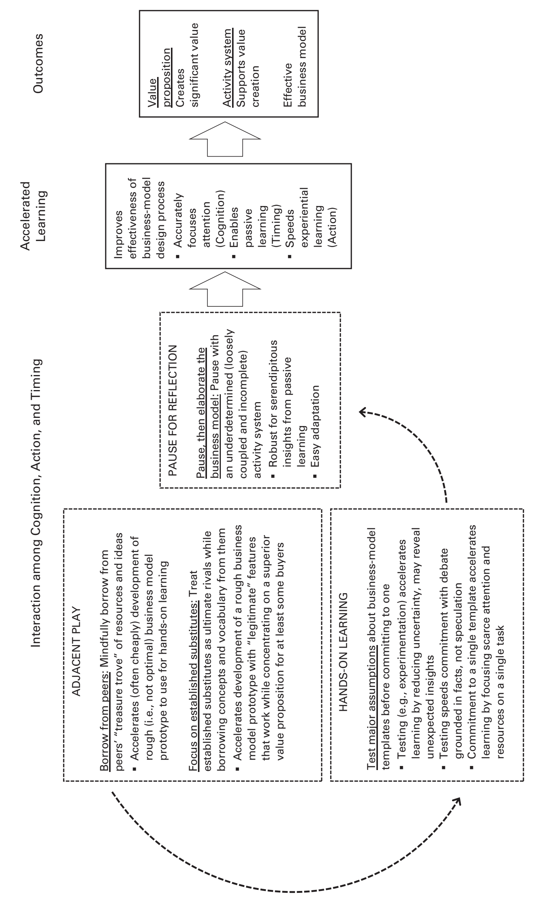

Administrative Science Quarterly 2020, Vol. 65(2)483-523

© The Author(s) 2019

Article reuse guidelines: sagepub.com/journals-permissions

DOI: 10.1177/0001839219852349

journals.sagepub.com/home/asq

# Parallel Play: Startups, Nascent Markets, and Effective Business-model Design

Rory M. McDonald1 and Kathleen M. Eisenhardt2

1 Harvard Business School

2 Stanford University

## Abstract

Prior research has advanced several explanations for entrepreneurial success in nascent markets but leaves a key imperative unexplored: the business model. By studying five ventures in a nascent financial-technology market, we develop a novel theoretical framework for understanding how entrepreneurs effectively design business models: parallel play. Similar to parallel play by preschoolers, entrepreneurs engaged in parallel play interweave action, cognition, and timing to accelerate learning about a novel world. Specifically, they (1) borrow from peers and focus on established substitutes for their services or products, (2) test assumptions, then commit to a broad business-model template, and (3) pause before elaborating the activity system. The insights from our framework contribute to research on optimal distinctiveness and to the learning and evolutionary-adjustment literatures. More broadly, we blend organization theory with a fresh theoretical lens—business-model processes—to highlight how organizations actually work and create value.

Keywords: entrepreneurship, search, adaptation, competition, legitimacy, strategy, organizational innovation, organizational learning, mechanisms and processes, institutional entrepreneurship, qualitative methods, business model design

Netflix’s initial public offering in 2002 capped its rapid rise from startup to established company. Early on, however, Netflix was merely one of several startups, including Magic Disc, DVD Express, and Reel.com, struggling to prosper in the nascent online movie-rental market. Netflix succeeded while the others faded away. The Netflix story is not unique. As recent examples like air taxis (Zuzul and Tripsas, 2019), residential solar (Hannah and Eisenhardt, 2018), and personal genomics (Gao and McDonald, 2019) demonstrate, nascent markets are typically domains in which a handful of firms strive to navigate an ambiguous, uncertain, and dynamic landscape.

Prior research on nascent markets offers several explanations for the success of ventures like Netflix. One line of inquiry focuses on how entrepreneurs gain support for their innovations. This work characterizes nascent markets as typically embedded in a web of related product markets and emphasizes the importance of audience enthusiasm (Navis and Glynn, 2010; Anthony, Nelson, and Tripsas, 2016). Faced with opposing pressures toward conformity (to legitimize the venture in the eyes of stakeholders) and differentiation (to gain competitive advantage by standing out), entrepreneurs should aim for optimal distinctiveness—the balance point between being similar to and different from others (Navis and Glynn, 2011; Zhao et al., 2018). A complementary line of inquiry examines organizational processes that promote flexibility and learning in highly uncertain environments (Rindova and Kotha, 2001; Chen et al., 2010). Processes such as trial and error (Bingham and Eisenhardt, 2011), experimentation (Murray and Tripsas, 2004), and bricolage (Baker and Nelson, 2005) enable entrepreneurs to solve problems and adapt to opportunities as they emerge.

Jointly, these perspectives attest to the benefits for new ventures of optimal distinctiveness, rigorous learning, and evolutionary adjustment. But these streams leave unexplored another likely contributor to the success of ventures like Netflix: that their entrepreneurs developed an effective business model. By a business model, we mean the system of interconnected organizational activities performed by a focal firm (and often by users and partners) to create value (Zott, Amit, and Massa, 2011).1 This broad definition encompasses business models as cognitive schemas (‘‘razor and blade’’) and as granular systems of specific activities. As granular systems, business models consist of two tightly coupled elements: a value proposition, in the form of a product or service that at least some customers value over existing solutions, and an activity system—the set of linked components and resources that helps create and deliver this value (Afuah and Tucci, 2000; Amit and Zott, 2015). An intertwined revenue model (i.e., a monetization method, such as subscription) enables the firm to capture some of the value created (Amit and Zott, 2012).

1 Many definitions exist, but ours captures the key features they share (e.g., Eisenmann, 2001; Johnson, Christensen, and Kagermann, 2008; Casadesus-Masanell and Zhu, 2013) and is in line with prevailing managerial usage (Amit and Zott, 2015).

At Netflix, for example, executives designed a novel business model that consisted of a movie-rental service whereby customers could view a movie at home whenever they wanted (an attractive value proposition, compared with alternatives like Blockbuster, for many customers). An integrated system of movie titles, a recommendation engine, warehouses, and a distribution network helped Netflix create significant value for itself, its customers, and partners like movie studios and the U.S. Postal Service (Shih and Kaufman, 2014). Optimal distinctiveness, learning, and adaptation may have all contributed to Netflix’s success, but they do not reveal exactly how Netflix’s entrepreneurs effectively designed a business model while their peers did not.

The concept of a business model is theoretically and practically important. Business models are central to firms’ long-term survival and growth (Massa, Tucci, and Afuah, 2017). Without a business model, a venture may flourish temporarily but will ultimately fail as an independent entity. Over and above business models’ role as significant drivers of performance (Snihur and Zott, 2019), scholars have noted that the business models pioneered by ventures like Airbnb and Google ‘‘have profoundly impacted and indeed changed the way people live, work, consume, and interact’’ (Demil et al., 2015: 2). Yet while business models are critical bottlenecks to survival and growth, entrepreneurs pioneering in nascent markets often begin with vague ideas about how to create value or even no business model at all. This raises the question of how entrepreneurs effectively design business models in nascent markets.

Given limited theory and empirical evidence, we adopt a multi-case theory-building approach (Eisenhardt and Graebner, 2007). Consistent with recent research (Amit and Zott, 2015; Martins, Rindova, and Greenbaum, 2015), we use the term ‘‘design’’ because a business model (especially an effective one) is likely to emerge from a creative process rather than from a search for an existing peak. By a nascent market, we mean a novel economic-exchange structure characterized by buyers, sellers, and a label (Weber, Heinze, and DeSoucey, 2008; Navis and Glynn, 2010)—and by incomplete products, uncertain technologies, and extreme ambiguity about opportunities and customer demand (Ozcan and Eisenhardt, 2009; Santos and Eisenhardt, 2009; Hiatt and Carlos, 2018). Using a ‘‘racing’’ research design, we track how effectively (or otherwise) five ventures in the same nascent market design a business model.

We contribute at the nexus of organization theory, strategy, and entrepreneurship. Our core contribution is a theoretical framework of parallel play—a process in which cognition, action, and timing intersect to enable entrepreneurs to design a business model effectively. Like that of young children (Parten, 1932; Rubin, Bukowski, and Parker, 1998), parallel play by entrepreneurs is a self-focused process. Those who engage in it take little interest in whether their activities do or do not resemble those of their peers. Instead, the aim of this constellation of behaviors (e.g., borrowing from peers, testing assumptions, pausing, and commitment) is to learn about a new market.

By exploring the implications of our parallel play framework, we offer a novel pathway to optimal distinctiveness and effective business model design. Contrary to strategy in established markets, peers become ‘‘treasure troves’’ of ideas while established substitutes are the ultimate rivals. Contrary to lean startup, pacing acceleration and pausing (not just being first or fast) matters as well. To learning and evolutionary adjustment perspectives, we contribute an enriched repertoire of learning behaviors suitable for nascent markets. Here, experimentation trumps trial and error while passive learning and commitment are essential. Broadly, we blend organization theory with a fresh theoretical lens—business-model processes—on how organizations actually work and learn to create value.

## EFFECTIVE BUSINESS MODEL DESIGN

Research suggests several perspectives relevant to the effective design of a business model in nascent markets. One approach, embedded in institutional theory and cultural entrepreneurship, conceptualizes nascent markets as domains whose constituent firms seek audience support from diverse stakeholders like buyers and partners. Here entrepreneurs face opposing pressures to conform to enhance legitimacy and be unique to create competitive advantage (Hargadon and Douglas, 2001; Santos and Eisenhardt, 2009). The implication is that a venture that finds the ‘‘sweet spot’’ of optimal distinctiveness will enjoy disproportionate audience support (Navis and Glynn, 2010).

Recent work suggests that the locus of optimal distinctiveness may shift over time and across stakeholders (Wry, Lounsbury, and Jennings, 2014; Zhao et al., 2017). For example, in their study of the video game industry, Zhao and colleagues (2018) showed that conforming quite closely to the features of leading games is effective early on while being unique is useful later on. Importantly, Navis and Glynn (2010) described a process to achieve optimal distinctiveness in which nascent-market pioneers begin by emphasizing cooperation and similarity with peers and then compete by differentiating themselves from them. Studying the nascent satellite-radio market, the authors documented how XM and Sirius cooperatively emphasized their similarity to establish and legitimate their market and then later distinguished themselves via unique claims and exclusive programming to win subscribers (Navis and Glynn, 2010). Overall, this body of work emphasizes a sequential path of cooperative similarity followed by competitive difference to achieve optimal distinctiveness vis-à-vis others, especially high-performing peers.

A second approach emphasizes learning and evolutionary adjustment in contexts characterized by uncertainty, ambiguity, and rapid change (Rindova and Kotha, 2001; Eisenhardt and Bingham, 2017; Raffaelli, 2018). This work examines one or two organizational processes that enable flexibility and adaptation. For example, Bingham and Eisenhardt (2011) studied trial-and-error learning, whereby entrepreneurs fuse learning and action in real time to identify more effective strategies. Trial and error is also at the heart of organizational adaptation models, which treat complex problem-solving tasks as a search for a performance ‘‘peak’’ within a rugged ‘‘landscape’’ (Katila and Chen, 2008; Baumann and Siggelkow, 2013). A central idea is that search will be more apt to result in a high-value solution when it is seeded with a map and proceeds via local search—that is, incremental adjustments—to scale such a peak (Gavetti, Levinthal, and Rivkin, 2005; Gavetti and Rivkin, 2007). Others study experimentation wherein firms reduce uncertainty and move ahead with fewer mistakes by engaging in deliberate offline learning. Experimentation plays a prominent role in product development processes (Pisano, 1994; Eisenhardt and Tabrizi, 1995; Thomke, 1998) and in the customer exploration efforts of ‘‘lean’’ startups (Murray and Tripsas, 2004; Ries, 2011; Bremner and Eisenhardt, 2019). Similarly, Baker and Nelson (2005) described how entrepreneurs use processes like bricolage to make do by inventing new uses and novel combinations of their existing resources.

Collectively, these lines of inquiry are insightful but incomplete. From an institutional perspective, entrepreneurs might aim for a level of distinctiveness from peers, but that does not guarantee that an emergent business model will be effective—that it will have both an attractive value proposition and a working activity system that supports it. Moreover, the relevant foil for optimal distinctiveness is not always apparent, especially in nascent markets and product categories (Anthony, Nelson, and Tripsas, 2016). In relation to what should the venture be optimally distinct? In addition, emphasizing similarity may even be counterproductive when the goal is a more value-creating and novel business model (Zott and Amit, 2007). Recent work suggests that it may be unwise to pursue similarity in a market so immature that it remains unclear what is legitimate (McDonald and Gao, 2019; Zuzul and Tripsas, 2019).

Adaptive learning processes like trial and error, experimentation, and bricolage seem broadly beneficial, but determining where to deploy them to gain useful experience remains a mystery. How and when should entrepreneurs use such processes? An evolutionary adjustment approach, grounded in local search of a static landscape, may not in fact be the best way to find a high-performing peak. In the case of business models, it remains unclear whether such a peak even exists a priori or whether entrepreneurs actively shape and design it as markets evolve (Ott, Eisenhardt, and Bingham, 2017). Thus prior research leaves unexamined the process of effectively designing a business model in nascent markets. We address this opportunity in the context of a nascent financial-technology market.

## METHODS

Given the scarcity of theory and evidence about our research question, we use a multi-case theory-building approach (Eisenhardt, 1989a) that fits our process focus (Langley, 1999). Multiple cases are particularly effective for theory development because their replication logic usually produces more robust, parsimonious, and generalizable theory than single cases (Eisenhardt and Graebner, 2007). An embedded design with multiple levels of analysis (i.e., the business model, its components, entrepreneurial team, and venture) enhances the richness and accuracy of resulting theory (Yin, 2009).

Our setting is social investing, a market that emerged at the intersection of finance (financial investing) and technology (social networking). We studied the market from its inception in 2007 until 2011. Consistent with our definition of a nascent market (Navis and Glynn, 2010), social investing was a new-to-the-world economic exchange structure (online platform), with a label, that connected producers (amateur investors) and consumers (other amateur investors). Like all nascent markets, it was at an early-formation stage characterized by an ambiguous and incomplete product, no clear business model, and uncertain customers (Santos and Eisenhardt, 2009). We began the study before winners, losers, or even market viability had become evident.

The social-investing market was inspired by social networks like Facebook and enabled by Web 2.0 technologies. Several entrepreneurs independently recognized the opportunity to combine social networking with financial investing by creating an online platform for amateur investors. As one founder we interviewed pointed out, ‘‘The worlds were converging. . . . People were much more willing and open to share stuff publicly online, and the individual investor increasingly had access to much the same tools and research as the pros.’’ The general idea was to create an online investment community (amateur investors who would offer advice, seek advice, or both), identify its most skilled members, and monetize their investment strategies. As one analyst described it, ‘‘Perhaps there might be an active community of investors willing to share their [investing] approach—and an equally active community willing to follow their advice.’’

Social investing seemed like an attractive opportunity, but the concept was highly ambiguous—a common phenomenon in nascent markets. The media used analogies to help audiences make sense of it: ‘‘Fantasy Football Meets Investing’’ and ‘‘‘American Idol’ investor talent discovery’’ conveyed the idea of a community in which day traders, hobbyists, and aspiring portfolio managers would share their views on investing and compete to ‘‘rise to the top.’’ Journalists began to call the nascent market ‘‘social investing,’’ an ambiguous label that some mistakenly took to mean investing to promote social good, rather than investing with an online community. A central theme was ‘‘democratization of investing’’—an online community of amateur investors helping each other, in theory, to bypass traditional investment firms that managed investments and gave advice for substantial fees. As a founder put it, ‘‘Let’s create an investing marketplace . . . playing off a social-network model of investing. We want to open the floodgates to everybody, to find the Michael Jordan of investing.’’

When social investing emerged in 2007, new ventures were the only entrants. None yet had a business model or even a clear conceptualization of one. The entrepreneurs and other participants merely had rudimentary ideas, like a destination site where people could discuss investing ideas; an investment vehicle to mine community members’ ideas; and an online exchange to allow people to replicate others’ investment strategies. It remained unclear which, if any, of these inchoate ideas could be turned into an actual business model.

Table 1. Social Investing Ventures Studied

| Firm | Location | Founding | Social investing | Initial ideas | Funding\* | Number of founders | Avg. age | Education | Prior industry experience |
| --- | --- | --- | --- | --- | --- | --- | --- | --- | --- |
| Zeus | East Coast | Q2 2007 | ‘‘It’s really kind of social networking meets investing. . . . We’re building a business on the back of a social networking site for investors.’’ | ‘‘Selling/licensing the data, advertising/page view based approach creating an open source hedge fund, subscription, and allow people to actively invest in [others] and collect a share of the management fees.’’ | Top 50 VC, Angels $10.5 million | 3 | 38 | Graduate degree(s) from prominent universities | Internet, financial services |
| Hercules | West Coast | Q2 2007 | ‘‘Let’s create an investing marketplace . . . playing off a social networking model for investing. We want to open the floodgates to everybody, to find the Michael Jordan of investing.’’ | ‘‘Selling advertising; selling a subscription to follow [talented investors’] behavior . . .; collecting a fee . . . for connecting investors with those who want to invest alongside them.’’ | Top 50 VC, Angels $11 million | 3 | 34 | Graduate degree(s) from prominent universities | Internet, financial services |
| Icarus | West Coast | Q2 2007 | ‘‘We really wanted to do something with investments that was social in nature—then to mine that data and drive the information to people out of our investment data.’’ | ‘‘Advertising, offers, and referrals; licensing the data to professional investors; paying a fairly significant fee for the right to look over people’s shoulders; and financial product creation (hedge fund).’’ | Top 50 VC, Angels $11 million | 2 | 34 | Graduate degree(s) from prominent universities | Internet, financial services |
| Narcissus | East Coast | Q2 2007 | ‘‘. . . really excited about the idea of a social network specifically for people interested in investing . . . people could invest and other people could look at their performance.’’ | ‘‘Create a hedge fund; sell the data to professional investors; generate referrals for premium advertising; charge a fee or commission for hooking them [investors and those seeking investment advice] up.’’ | Angels $3.5 million | 3 | 30 | Graduate degree(s) from prominent universities | Internet, financial services |
| Phaethon | West Coast | Q1 2007 | ‘‘We want to build an investment community, or network that helps individual investors discover, analyze, and evaluate new investment opportunities together.’’ | ‘‘. . . identify the top performers then monetize based on those valuable data—either by creating a fund with assets under management, becoming a publisher, generating referrals for financial products, or selling a product [the data] directly.’’ | Top 50 VC, Angels $1.5 million | 3 | 28 | Graduate degree(s) from prominent universities | Internet |

\* Rankings of venture-capital firms are based on eigenvector centrality in a network of early-stage investors at the time of the study (Crunchbase).

This study is part of a larger research project, initiated by the first author, on how ventures navigate nascent industries; the current study examines business models. Our sample is the five ventures—all privately owned and professionally funded—that began in 2007 when the U.S. social-investing market emerged. Table 1 provides an overview, and we use pseudonyms from Greek mythology to refer to the ventures throughout our study. All raised funds from professional investors, including top-50 U.S. venture capitalists and angels. Three began on the West Coast and two on the East Coast. The founding teams were similar in size (2–3), with members of comparable age (28–38), startup experience, industry experience (finance and Internet), and education (graduate degrees from top universities). All shared the goal of building a significant for-profit enterprise and the idea of doing so by creating an online investing community. Yet none began with a business model or even a clear idea for one. Instead, all were weighing possibilities. For example, one entrepreneur noted at founding that his venture might ‘‘create a hedge fund, sell the data to professional investors, generate referrals or premium advertising, charge a fee or commission for hooking them up [to investors willing to pay to follow other investors].’’ An entrepreneur at another venture was considering at founding ‘‘selling/ licensing the data, an advertising/page view–based approach, and creating an open-source hedge fund.’’

### Data Sources

Table 2. Overview of Interviews and Archival Materials

| Firm | Number of interviews | Insider informants | Number of interviews | External informants | Number of articles/pages | Sample sources | Blogs and press releases |
| --- | --- | --- | --- | --- | --- | --- | --- |
| Zeus | 12 | CEO/founder VP, operations Chairman/founder | 7 | VC investor Angel investors Board member Industry analyst Finance journalist | 43 articles 112 pages | Wall Street Journal New York Times Financial Times TechCrunch | 150 |
| Hercules | 8 | CEO/founder VP, business development Director, sales | 10 | Company advisor Industry analyst Technology journalist Finance journalist | 102 articles 185 pages | Wall Street Journal New York Times Investment News TechCrunch | 42 |
| Icarus | 10 | CEO/founder VP, engineering VP, product Chief scientist Director, engineering | 7 | Angel investors Industry analyst Technology journalist Finance journalist | 50 articles 92 pages | Wall Street Journal New York Times Financial Times Barron’s TechCrunch | 121 |
| Narcissus | 8 | CEO/founder VP, product VP, marketing CTO/founder | 4 | Company advisor Technology journalist Consultant | 30 articles 63 pages | Barron’s Investment News VentureBeat | 84 |
| Phaethon | 7 | CEO/founder VP, marketing | 5 | Angel investor Board member Partner Technology journalist | 23 articles 65 pages | TechCrunch Wall Street Journal Washington Post | 19 |

We used several data sources: (1) two waves of semi-structured interviews with firm executives, investors, and board members; (2) a third wave of semi-structured interviews with firm informants; (3) interviews with industry experts and journalists; (4) archival materials such as media and Internet resources, company press releases, internal documents, and blogs; and (5) analyst reports. Such varied data sources enable triangulation among them and increase accuracy. Table 2 provides an overview of the interviews and archival materials we used.

Our primary data source is semi-structured interviews. We conducted 78 interviews in three waves (see table 2). Our internal informants were the executives most familiar with their ventures’ efforts to design a business model, including all five founder/CEOs, most co-founders, and functional managers like VPs of marketing and engineering. External informants were associated with a single venture (e.g., VCs) or were industry analysts or journalists (e.g., the Wall Street Journal, TechCrunch).

The interviews had three sections. First, we asked about the informant’s background and the venture’s strategic objectives, nascent market, and performance. We then elicited an open-ended narrative of the venture’s history, from founding until the time of the interview. We probed how the actions that the informant described related (or did not) to the development of the business, including the business model. We also identified actions that were contemplated but not performed (counterfactuals) and probed reasons for pursuing some actions but not others. In the third section, we gathered more detail about some actions described earlier in the interview and the interviewee’s view of the nascent social-investing market. Interviews lasted between 45 minutes and two hours and were recorded and transcribed within a day. The second and third waves of interviews were similarly structured but focused on the interval since the previous interview. Interviews with external informants not associated with a given venture were similar but covered all five ventures and the industry.

We took multiple steps to ensure data validity. First, we collected both retrospective data (efficient for gathering information) on events that occurred during the market’s earliest years and real-time data (relatively free of bias). We also began data collection in 2009 before outcomes were known, thus minimizing retrospective sense-making (Huber, 1985). We further reduced retrospective bias by collecting data in waves. Second, we structured the interviews to gather specific information using nondirective questions focused on events (Huber and Power, 1985). Specifically, we asked informants to describe significant events in the venture’s life that they had personally experienced and to proceed chronologically. To improve accuracy, we avoided leading questions (e.g., Did you cooperate with peers?) and speculative ones (e.g., Why did another firm make a particular move?). Third, we interviewed a wide array of internal and external informants, including executives from different functions and levels (e.g., CEO, VP, director). This approach produces a more complete, accurate picture than does a single informant (Kumar, Stern, and Anderson, 1993). Fourth, we triangulated interview data with archival sources, including those created as events occurred. Finally, we provided anonymity to encourage candor.

We complemented interview data with archival material like media articles, press releases, conference presentations, analyst reports, blogs, and third-party websites. Although the social-investing market has continued to grow, we ended data collection in 2011 because all ventures had either reached a profitable business model or failed. This provided a natural endpoint.

### Data Analysis

We began data analysis by synthesizing interview and archival data into a comprehensive case history of each firm. We focused on actions and themes drawn from multiple data sources and confirmed by several informants (Jick, 1979). The resulting cases were 50–90 pages long. One author wrote the cases while a second author read the original data to develop an independent perspective. We then converged, resolving rare differences by returning to the data.

After completing within-case analysis, we turned to cross-case analysis (Eisenhardt and Graebner, 2007). We developed tentative constructs from individual cases (e.g., experiments, focus) and compared them across cases. Cycling between emergent theory and data, we clarified constructs and related measures and strengthened logical arguments. As our theoretical insights crystallized, we compared them with prior research (Eisenhardt, Graebner, and Sonenshein, 2016). Once we had strong correspondence among the data, measures, constructs, and theory, we finalized our explanatory framework for effective business-model design.

### Measures

Our research question was how entrepreneurs effectively design business models in nascent markets. Fortuitously, an unexpected bifurcation into two business-model templates occurred, allowing us to enrich our theory. One group of ventures—Zeus, Hercules, and Icarus—pursued an ultimately higher-value-creating but more difficult type of business model as a ‘‘financial intermediary.’’ These ventures sought to identify talented investors in the online community and connect them to followers who paid the venture for the privilege of investing alongside these talented investors but in their own brokerage accounts. This model required SEC approval.

A second group—Narcissus and Phaethon—pursued an ultimately lower-value-creating but easier to execute and more familiar type of business model (‘‘advertising destination’’). These ventures created websites, trying to attract amateur investors eager to share ideas and improve their investing skills. Through content like interactive tools and stock-market simulations, users could hone their skills, compare their virtual trading performance with others’, and share investing tips. Advertisers paid the venture a fee to reach its large, engaged audience interested in finance. As might be expected, the first group raised more capital than the second group.

We assessed the effectiveness of a venture’s design process after our study ended in 2011 in several ways, which converged for each venture. First, we measured process effectiveness by whether the process led to an actual business model that had customer traction (a value proposition) and worked (an activity system). We used quantitative indicators that executives and analysts told us were most relevant for a specific business-model template. For the financial-intermediary business model, these indicators were (1) number of customer accounts (from analyst reports) and (2) assets under management (from the SEC’s Investment Advisor Public Disclosure website). For the advertising-destination business model, the indicator was (1) web traffic in terms of number of unique visitors to the venture’s website (from Compete.com). Prior work has found that web traffic is a relevant indicator of customer traction, especially for Internet-based companies (Kerr, Lerner, and Schoar, 2014).

Second, we measured process effectiveness by its development time and financial resources used. We measured development time as the interval from founding until the venture had a working business model (if ever). We confirmed the importance of development time with our informants. We roughly estimated financial resources by funding that the venture raised and whether the venture ran out of money (e.g., Pahnke et al., 2015). Two ventures ran out of money before achieving a working business model while peers with the same business model type and comparable funding did not.

Third, we measured process effectiveness by whether the process led to high overall post-study performance. We used objective indicators of survival and growth: two ventures were alive and continued growing after 2011, two failed, and one hibernated (a going concern that was neither actively managed nor growing). We also used subjective indicators: ranking in a poll of industry analysts and experts and qualitative assessments by industry experts, media, and internal informants. As noted above, these three sets of measures have high convergence in each venture.

Table 3. Effectiveness of the Business-model Design Process (Post Study)

| Firm | Business model | Revenue model | 2011 indicator\* | Time to develop/funding raised | Market ranking† | Post-study outcome | Representative quotes |
| --- | --- | --- | --- | --- | --- | --- | --- |
| Zeus | Financial intermediary | Shared fee based on assets managed | $100M 300 accounts | 3 years $10.5M | 1st | 1 of 2 market leaders, acquired, now operates in 100 countries | ‘‘Zeus may just become the de facto, pay-to-play standard.’’ (Industry expert) |
| Hercules | Financial intermediary | Shared fee based on assets managed | $100M 500 accounts | 3.5 years $11M | 2nd | 1 of 2 market leaders, now > $1B in managed assets | ‘‘Hercules is one of those businesses the finance world needs.’’ (Leading technology publication) |
| Icarus | Financial intermediary | N/A | $0 | N/A $11M | Not in top ten | Failed. Less than $1M asset sale in 2010 | ‘‘At the end of the day, it was an asset sale. Nobody made any money on it.’’ (VP engineering) |
| Narcissus | Advertising destination | Revenue from advertising and referral payments | 50,000 unique visitors/month | 3.5 years $3.5M | Top ten | Small, marginally profitable, private company, failed in 2017 | ‘‘We managed to reach profitability, but the only possibility was to just hibernate the company.’’ (CEO) |
| Phaethon | Advertising destination | N/A | 17,000 unique visitors/month before exit | N/A $1.5M | Not in top ten | Failed. Less than $1M asset sale in 2009 | ‘‘Phaethon had a lot of promise and the right people behind it. The redeeming fact is I didn’t lose everything.’’ (Angel investor) |

\* For Zeus, Hercules, and Icarus, the business-model-template-specific indicators are assets managed and number of customer accounts. For Narcissus and Phaethon, the business-model-specific indicator is web traffic, measured as unique visitors to the site (Compete.com). Figures are for 2011.

† Ranking in sector is determined by polling industry experts about the firms’ market positions and business-model effectiveness.

As summarized in table 3, there is striking variation in how effectively the entrepreneurs designed their business models. In the first group, Zeus and Hercules were highly effective. Zeus designed a value-creating business model that attracted over $100 million in account assets, completed its business model first (early 2010), and was ranked first by industry experts. Hercules also designed a business model that attracted over $100 million in assets, completed its business model about six months after Zeus, and ranked second. The media hailed both business models as ‘‘changing the rules of investing’’ and ‘‘reinventing financial services’’ by ‘‘democratizing’’ investing—offering transparent, cheap professional investment for all, not just wealthy investors. Both ventures continued to prosper into 2018, evolving to include new offerings. In contrast, Icarus was ineffective. The team spent more than $10 million in funding (highest in our study) without achieving an actual business model and ran out of money. In a typical comment, a media observer called it ‘‘a complete bust.’’ The venture failed in 2010. In the second group, Narcissus was moderately effective. It designed a value-creating business model that attracted 50,000 unique visits per month and did so by mid-2010. Yet although the venture was profitable, its growth stalled. Its executives hibernated Narcissus—let it run without oversight—and moved on in 2011. Phaethon was ineffective. It failed to achieve an actual business model, ran out of money, and sold for less than $1 million. Our emergent framework attempts to explain this striking variation across ventures.

## PARALLEL PLAY: AN EMERGENT FRAMEWORK

Our data indicate that some entrepreneurs effectively designed business models while others did not. Specifically, the successful entrepreneurs engaged in a process that we call ‘‘parallel play.’’ In the child development literature (Parten, 1932; Rubin, Bukowski, and Parker, 1998), parallel play occurs at an early development stage when preschoolers play near each other but not together. Though they mostly play alone, preschoolers engaged in parallel play take an interest in what their peers are doing, often mimic them, and sometimes grab their toys. Such play frequently involves building objects like stacking blocks and trying different toys before choosing favorites. Precocious children may even pause and consider their progress before continuing. Overall, parallel play is a process by which preschoolers learn about their world. It is characterized by self-focus and disinterest in comparisons with peers (Parten, 1932), hands-on building (Smith, 1978), and, among the more precocious, an ability to pause and reflect before continuing (Bakeman and Brownlee, 1980; Bingham and O’Leary, 2006). Our data unexpectedly revealed that the entrepreneurs who effectively designed business models engaged in a similar parallel-play process. That is, parallel play emerged from our data as a unifying conceptualization of effective business-model design in nascent markets.

### Borrowing from Peers, Focusing on Substitutes (2007–2008)

The five ventures we studied were pioneers in the social-investing market as it emerged in 2007. Some viewed their startup peers as rivals and thus sought to be unique. Meanwhile these ventures largely ignored established firms offering substitute products in adjacent markets, like Morgan Stanley and Fidelity. These ventures (for brevity, ‘‘low performers’’) were less effective at designing a business model.

In contrast, the ventures that effectively designed a business model (the ‘‘high performers’’) engaged in parallel play. Though cognizant of other startups in the social-investing market, they took little interest in resembling or differentiating themselves from peers. Rather, they treated peers as sources of ideas and resources that they could borrow to design their own business models quickly and cheaply, just as preschoolers readily imitate other kids and sometimes take their toys. And like maturing children who regard older siblings as both role models and rivals, these ventures were also aware of established substitutes, sometimes borrowing from them and viewing them as ultimate rivals.

Table 4. Borrowing from Peers, Focusing on Substitutes (2007–2008)

| Firm | Borrowing from peers | Borrowing vs. distinguishing: | Focus\* |  |  | Outcomes |
| --- | --- | --- | --- | --- | --- | --- |
|  |  | Representative quotes | Perceived rivals | Competitive orientation | Representative quotes |  |
| Zeus | Copies user interface of peer Q1 2007 Uses same data analytics provider as peer Q1 2007 Uses same test users for feedback as peer Q3 2007 | ‘‘Like a good golfer, Zeus plays the course, not the players [peers].’’ (CEO) ‘‘What Zeus implemented was much closer to the original Narcissus idea.’’ (Narcissus VP, product) | Established substitutes (100% executives) Asset mgrs. (UBS, Morgan Stanley) | Established substitutes 96% | ‘‘The really big competition for Zeus are the existing asset management firms—all the other places you could go with your money.’’ (Board member) | Completes beta prototype ahead of schedule Q2 2007 ‘‘We were way ahead of schedule and we quickly got a critical mass of people together.’’ (COO) |
| Hercules | Uses same platform as peer to build user community Q3 2007 Copies user interface of peer Q1 2008 Uses same test users for feedback as peer Q3 2008 | ‘‘[VP] came to me and said, ‘I think we’re on the wrong platform. . . . There’s so much less friction to create a community on this [peer] platform, we should be there. . . . We ought to be there.’’’ (CEO) | Established substitutes: (100% executives) Managed funds (Fidelity, OneSource) Asset mgrs. (UBS) | Established substitutes 93% | ‘‘Everyone wants to lump us with Zeus . . . that’s not our competition. We said our competition was Schwab, OneSource [mutual fund platform].’’ (VP) | Completes beta product just after Zeus Q2 2007 |
| Icarus | None | ‘‘It was very clear that right out of the gate, there was very little differentiation between us and these other two [social investing peers] competitors.’’ (Investor) ‘‘If we just offered sort of a so-so tool to the masses, I just didn’t see how we were going to gain any traction.’’ (VP engineering) | Peers (100% executives) | Peers 66% | ‘‘The biggest competitor in our minds was Zeus. . . . Hercules was also one.’’ (Chief scientist) | Releases beta product after others Q3 2007, plagued by cost overruns and delays |
| Narcissus | None | ‘‘We’re very focused on how can we differentiate our product and strategy from these [social investing] competitors.’’ (VP, product) | Peers; later, established substitutes (100%, 50% executives) Financial websites | Established substitutes 53% | ‘‘Our competitors are people who have social investing sites like Hercules, Phaethon, Icarus.’’ (CTO) | Completes beta product on schedule Q2 2007, but plagued by bugs |
| Phaethon | None | ‘‘We thought the market was heating up and we might have to differentiate in order to survive.’’ (VP marketing) | Peers (100% executives) | Peers 78% | ‘‘We basically kept an eye on [our startup peers]. . . . I think we were paranoid about the wrong people too early.’’ (VP, marketing) | Releases weak beta product 4 months behind schedule Q3 2007 ‘‘We have a pretty ill-defined product right now.’’ (VP, marketing) |

\* Measured by counting total comparisons with other firms in the venture’s press releases and computing the percentage of peer versus established-substitute comparisons.

By borrowing, we mean copying or taking others’ ideas or resources for use in designing a business model. To assess borrowing, we determined whether entrepreneurs knowingly adopted a business model element (such as a design feature) that another firm used (see table 4). To establish borrowing, we required that two or more informants agree on the borrowed idea or resource and from whom, and we kept track of the rationale for borrowing. While all five ventures, as shown in table 4, used borrowed concepts (such as client accounts) and vocabulary (such as ‘‘assets under management’’) from established substitutes, only the high performers, Zeus and Hercules, borrowed from peers. They purposefully borrowed activity system elements of peers’ business models in an apparent effort to save time or resources. Low performers, by contrast, tried to be unique to distinguish themselves from peers (whom they saw as rivals) and consciously eschewed borrowing from them.

Zeus saw peers as sources of promising ideas and resources that might accelerate its progress rather than as competitive threats. It did not frame its peers as rivals when designing a business model. As a founder put it, Zeus was like a good golfer who ‘‘plays the course (i.e., the social-investing market), not the players.’’ Zeus began borrowing from peers in its first year (2007). While developing its user interface (UI), the team noticed that a peer already had a very good one. Zeus copied it rather than spending engineering resources to develop its own. Similarly, Zeus chose the financial-analytics service used by a peer instead of developing proprietary algorithms to scrape data. Zeus also e-mailed several users who had blogged about their experiences with peers’ social-investing websites and persuaded them to test its product as well, to get quick feedback on features like presentation of community members’ investing strategies. Interestingly enough, Zeus’s awareness of what peers were doing typically came from indirect sources like media articles and conversations with users, since Zeus did not systematically track its peers. Essentially, Zeus focused on designing its own business model (e.g., algorithms to identify investor performance and to enable investors to track others) but occasionally stumbled onto something useful that peers were doing and borrowed it.

The high performers were also aware of firms in adjacent markets for whose products—such as private wealth management (e.g., UBS), brokerage (e.g., Charles Schwab), and mutual funds (e.g., Fidelity)—social investing was a potential replacement.2 In other words, the two sets of firms, though in different industries, offered products of similar functionality. Viewing these established firms as their ultimate rivals, the high performers borrowed some activities and terminology from them but also sought to be distinct from them by exploiting the unique features of social investing. That is, they sought to be preferable to these substitutes for at least some customers. In contrast, the low performers mostly ignored substitutes.

2 Like Navis and Glynn (2010), we differentiate between social investing and traditional investing because the two categories do not engage in mutual competitive moves and lack product overlap, nor were they assigned to the same industry sector by expert outsiders during our study (Lounsbury and Rao, 2004)—typical criteria for defining an industry. We use the term ‘‘substitute’’ as it is used in competitive strategy (Porter, 1996; Adner and Kapoor, 2016).

We used interview data, blogs, and press releases to measure ‘‘focus’’— firms that entrepreneurs viewed as their primary rivals—and to compile representative quotes. Following Navis and Glynn (2010), we also measured focus in terms of competitive orientation by counting the total comparisons with other firms in the venture’s press releases and then computing the percentage of peer versus established substitute comparisons.

To illustrate, from the outset, Zeus’s team consistently focused on established substitutes for which Zeus was creating an alternative. As one informant said, ‘‘Our competitors are other people with money, so it’s the UBSs and Morgan Stanleys—and when I say ‘with money,’ I mean with assets. . . . It’s firms who have traditionally managed clients’ money.’’ A board member affirmed this view: ‘‘As the competition, I’m not so much focused on Hercules [a peer]. I’m much more focused on the many, many billions and billions of dollars that are sitting at more traditional asset-management firms. . . . It’s just figuring out how to crack the nut on getting folks who currently have their money at UBS and Morgan Stanley to put some of it with Zeus.’’ Zeus executives did not see their peers as rivals; 96 percent of their competitive comparisons invoked established substitutes. They saw little point in worrying about peers that are, as one noted, ‘‘just as tiny and insignificant as we are.’’

In contrast, the low performers, Phaethon and Icarus, did not engage in parallel play. Instead, they tried to be unique—not to borrow from peers—and largely ignored (did not focus on) established substitutes. The Icarus team consciously avoided borrowing from peers, even when they believed that peers had useful ideas and resources. For example, one executive said, ‘‘The impressive thing at [a peer] was their UI.’’ But instead of copying the peer’s UI, Icarus sought to be different by designing its own UI from scratch. Similarly, though aware that peers like Zeus used a financial-analytics firm, the Icarus team again sought to be unique by building a proprietary aggregation algorithm to scrape data directly from brokerage accounts. ‘‘Icarus has its own technology for linking to accounts and getting source data, while Zeus uses an intermediary,’’ a board member argued. ‘‘We think that makes Icarus a better service.’’ The firm’s engineering VP also affirmed the importance of being novel: ‘‘If we just offered a sort of so-so tool to the masses, I didn’t see how we were going to gain any traction.’’

Icarus also treated peers as rivals. For example, all Icarus informants identified peers as rivals, particularly Zeus and Hercules, and more often compared themselves with peers (66 percent of comparisons). At the same time, they often dismissed established substitutes as serious rivals, describing them as ‘‘irrelevant and stodgy.’’ This disinterest in established substitutes was apparent at the outset. For example, the CEO described Icarus’s roots in social networking but made no mention of better investing for users relative to established substitutes: ‘‘Social networking was taking off. . . . It was very clear just from paying attention to the Internet space that the Facebook and Myspace applications were going to be a very, very big trend. So the idea was to take different verticals, which is literally how I came up with the idea for Icarus.’’ In contrast, the CEO described Zeus’s origins with a story about getting market-beating stock tips about oil companies from a cousin in Kuwait rather than relying on pricey money managers like UBS.

Why is purposefully borrowing ideas and resources from peers effective? One reason is that doing so accelerates progress toward rough prototypes. In effect, borrowing is a form of bricolage, whereby peers are treated as ‘‘treasure troves’’ of ideas and resources from which entrepreneurs can draw (Baker and Nelson, 2005). Although borrowing may not yield an optimal business model, it is likely to shrink the cost in money and time of designing a ‘‘good-enough-for-now’’ one. For example, Zeus’s borrowing from peers shortened the duration and lowered the costs of piecing together a prototype activity system. As a VP put it, ‘‘We were way ahead of schedule, and we quickly got a critical mass of people [amateur investors].’’ Even at this early stage, Zeus made progress toward a business model with a rough activity system and value proposition that drew some users and enabled hands-on learning and that another VP deemed ‘‘pretty good.’’ In contrast, Icarus’s refusal to borrow from peers was costly and time consuming, as its proprietary aggregation algorithm illustrates. ‘‘We were seven people at that time, and a big portion of what we had to do was build out our own aggregation technology,’’ the CTO explained. Icarus ended up spending most of its initial funding—the highest in our study—on this and other unique activity-system elements and fell behind Zeus in launching a rough early prototype.

Borrowing from peers also preserves more resources to devote to other aspects of the business model and to testing assumptions. Icarus’s engineering VP made this point: ‘‘They [Zeus, Hercules] did something smart, which is to outsource the aggregation part—which is the part I built—because it’s really hard and labor-intensive to get it right. . . . So they had a lot more resources to concentrate on things like the front end.’’

More subtly, borrowing from peers helps entrepreneurs resist the temptation to strive for an optimal solution, an unrealistic and unnecessary aim in a nascent market. As a Zeus VP noted early on, ‘‘Nobody had the right product yet.’’ A premature emphasis on being different and a focus on peers as rivals can lead entrepreneurs to fixate on minor similarities and to divert resources toward aspects of the business model that may be irrelevant as the market evolves.

Finally, the process of thoughtfully considering whether to borrow a specific resource or idea is apt to make entrepreneurs more mindful and thus more astute in their choice. Indeed, mindfulness underlies effective bricolage (Baker and Nelson, 2005) and design (Amit and Zott, 2015). Of course, entrepreneurs might borrow faulty resources and ideas. Yet since they are at work on their own business model, they are likely to be reasonably astute judges of whether a given resource or idea is useful. At this very early market stage, furthermore, quickly assembling a rough prototype for hands-on learning is likely to be a more realistic and useful aim than an optimal solution in effectively moving the business model design forward.

An alternative explanation is that borrowing from peers is effective because it lends legitimacy.3 Though plausible, this seems unlikely because neither peers nor social investing were legitimate at this very early stage in the market’s development: the peers were small and insignificant startups with few customers at best (Rao, 1994). Borrowing from established substitutes would seem more useful as a legitimacy-seeking action. As noted above, all ventures adopted some concepts and vocabulary from the traditional investing industry. Nevertheless, there were limits to what these ventures could borrow from established substitutes, because many activities necessary for social-investing business models—algorithms to rank investors’ skill, tracking other investors, click-through advertising metrics—were absent in established substitutes.

Finally, focusing on established substitutes as ultimate rivals keeps entrepreneurs centered on creating a realistic value proposition for at least some users. While peers have few if any users, established substitutes already create value for customers. As a Zeus founder noted, keeping established substitutes in mind as ultimate rivals prevented the team from ‘‘worrying about the wrong thing.’’ By contrast, Icarus mostly ignored established substitutes and ended up without a value proposition that worked for users. As the CEO admitted, Icarus ‘‘wasn’t really resonating with customers out there. It just wasn’t taking off with them to the extent that we thought.’’

### Testing Assumptions, Then Committing to a Business-model Template (2008–Early 2009)

The parallel play of preschoolers typically involves exploring alternatives before settling on the activities that engage them most. Similarly, the high-performing ventures—Zeus and Hercules—explored alternative types of business models before committing to one. These entrepreneurs were often deliberate about what they wanted to learn—such as by testing major assumptions to resolve key uncertainties affecting their choice of a business-model template. In contrast, the low-performing ventures did not engage in parallel play. Instead, they either committed to a specific business-model template quickly (Narcissus, Icarus) or flitted among several (Phaethon).

Table 5. Testing Assumptions, Then Committing to a Business-model Template (2008–Early 2009)

| Firm | Representative assumptions | Testing examples (pre-commitment) | Representative quotes | Learning about assumptions (pre-commitment) | Business-model commitment | Representative quotes |
| --- | --- | --- | --- | --- | --- | --- |
| Zeus | Users unwilling to share track records online SEC will prohibit startups from managing assets | Experiment Q1 2008: closed alpha with prototype platform Experiment Q2 2008: multiple mockups presented to SEC | ‘‘[We wanted] to demonstrate that there was an appetite for investors to come along and share their actual investment activity in public view. Once we proved that, there was the potential to bring a real business.’’ (CEO) | A surprising number of users are willing to share other insights about net worth, anonymity, and motives SEC approval process and tips for transitioning quickly | Financial intermediary Q1 2009 | ‘‘It’s a go/no-go decision: becoming an RIA firm. Should they cross the Rubicon? Into a whole other world of cost, complexity, and infrastructure.’’ (Investor) |
| Hercules | Users unwilling to share track records online SEC approval not needed for fees and ‘‘follower’’ trading | Trial and error Q3 2007: rapid prototype of ‘‘virtual’’ investing Trial and error Q4 2008: rapid prototype of fees and ‘‘follower’’ trading | ‘‘Our goal is to get to market quickly, observe how people use our product and then navigate to the most profitable business.’’ (CEO) | Users want to share track records online SEC approval required SEC approval process | Financial intermediary Q2 2009 | ‘‘To take that extra step, it’s an enormous amount of legal wrangling. You have to become a broker dealer, have a whole lot of fraud prevention mechanisms. . . . It’s a giant commitment.’’ (Analyst) |
| Icarus | Users want complex tools and investing histories SEC approval not needed for financial products from user data | None | ‘‘We were all very brazen. . . . We’re just going to create it. [Users] just don’t get it yet.’’ (VP engineering) ‘‘For whatever reason, we never wanted to label ourselves as a broker.’’ (Executive) | None until after commitment | Financial intermediary Q1 2008 | ‘‘We just decided to create products around the aggregated data and make money off that.’’ (CEO) |
| Narcissus | Users unwilling to share track records online SEC will prohibit startups from managing assets | None | ‘‘The barrier for people to input their real trading accounts and login into our website would be too high.’’ (CEO) ‘‘There’s all the concerns with regulations in the U.S. with securities law.’’ (CEO) | None until after commitment | Advertising destination Q4 2008 | ‘‘[The financial-intermediary template] was going to take a lot of time.’’ (CEO) ‘‘We decided to cut everything down . . . focus on what we can generate now with advertising.’’ (VP, marketing) |
| Phaethon | Users unwilling to share track records online SEC will prohibit startups from managing assets | None, but much debate | ‘‘Major people who are trading, they’re not going to want to share their information.’’ (VP, marketing) ‘‘A huge legal challenge, with all the things involved with a financial institution.’’ (Executive) | Little from own experience | Multiple business models, ‘‘fell into’’ advertising destination late—just before exit Q3 2009 | ‘‘We didn’t actually make a decision, ultimately.’’ (VP, marketing) |

By assumptions, we mean taken-for-granted suppositions, such as about social investing. Using interview and archival data, we assessed each team’s major assumptions about business-model templates, whether and how they tested those assumptions, and what insights, if any, they amassed. We also assessed whether and when the venture committed to a business-model template, by whether multiple informants indicated that a choice had been made, and whether the choice involved spending resources only on the chosen business-model template. Our summary of how committing to a template played out in the ventures is shown in table 5.

3 We appreciate a reviewer’s advice to address these alternative explanations and contingencies.

As noted in Methods, each venture had several rudimentary and incomplete ideas for business models when launched in 2007. As the market clarified during its second year (2008), these ideas converged into two broad types of business models: financial intermediary and advertising destination. Several assumptions about these templates were widely shared. One such assumption was that investors would not reveal their real investing track records online. If this assumption were accurate, the potentially more value-creating but difficult financial-intermediary business model was probably not feasible. Yet if it were incorrect, then ventures might be able to identify skilled amateur investors and capitalize on their prowess. Another common assumption was that a new venture would face enormous hurdles winning approval from the Securities and Exchange Commission (SEC) to manage financial assets—that the SEC would prohibit startups from handling actual brokerage accounts and real transactions. If accurate, it would again be difficult or impossible to execute the potentially more valuable financial-intermediary business model. Yet if it were not true, a door could open to the lucrative potential of the traditional financial industry.

Assumptions about business-model templates prevailed at all firms, but only Zeus and Hercules engaged in testing to learn about them. Zeus usually used systematic experimentation while Hercules used trial and error. The Zeus team decided to interrogate the assumption that few investors would share their track records online. As an analyst put it, ‘‘The notion of social networking, at its base, is intended to be altruistic, and that is not typically the strategy of professional [financial] traders.’’

In early 2008, Zeus tested this assumption experimentally. Zeus released a closed alpha product—a rough prototype product with few features—to select ‘‘family and friends’’ to determine their willingness to share their investing track records. If they did so, Zeus could identify skilled amateur investors and ‘‘monetize’’ their insights via an activity system that would enable other investors to ‘‘follow’’ them (to invest identically) for a fee. The experiment thus aimed to resolve uncertainty about whether the financial-intermediary business model would work. As a founder noted, the experiment could reveal whether ‘‘there was an appetite for investors to come along and share their actual investment activity in public view.’’

Within a few months, Zeus learned that, in fact, amateur investors would reveal their investing track records online. It also gained other insights, such as that the percentage of participants willing to share their track records was unexpectedly large and that some seemed like they might be competent investors. ‘‘We are amazed by the quality of the people who are willing to share,’’ a founder observed. The team was also able to reject the hypothesis that investors would share only because of financial motives. Instead, investors had varied motives. ‘‘Our original hypothesis was that we were promising them [skilled amateur investors], at some point in the future, that they could earn fees,’’ a founder noted. ‘‘But what we actually found is that their motivations were different: people want to prove that they’re good and rank themselves against others.’’ Zeus also learned that most participants strongly preferred to use screen names and would not reveal their real net worth.

To test whether SEC approval would in fact be virtually impossible, the Zeus team mocked-up several detailed business-model concepts and presented them to SEC officials. Zeus learned instead that approval was a distinct possibility—that the SEC would allow a startup like Zeus to manage financial assets. They also familiarized themselves with the approval path and gathered tips for pursuing it.

By mid-2008 Zeus had made further progress on designing a rough activity system that included a platform for investors to share their track records publicly and for other investors to ‘‘follow’’ their investments in their own portfolios. As the platform gained users, the team learned that at least some of them would be willing to pay Zeus a fee to serve as a financial intermediary for trade execution, to facilitate following other investors, and to manage assets. As the COO described it, ‘‘You could see, along with people wanting to come along and follow that activity, there was the potential to have a real business.’’ To reduce its uncertainty about profitability, Zeus also experimented with revenue models. By doing so, it learned that its returns would likely be comparable to those of mutual funds.

After testing the main assumptions underlying the choice of a business-model template, Zeus committed to the financial-intermediary one in early 2009. It saw this decision as a major turning point, one that would require it to design an activity system capable of transforming its small venture into a regulated financial-services company. As an investor described, ‘‘It was a go/no-go decision . . . to cross the Rubicon into a whole other world of cost, complexity, and infrastructure.’’ To be allowed to charge fees for managing assets, for example, Zeus would have to be approved as a Registered Investment Advisor (RIA) with the SEC and design an activity system that complied with SEC rules for trade execution and asset management on behalf of users. ‘‘When you’re touching real money . . . it’s just tough,’’ a founder observed. ‘‘There’s just a lot more friction and working parts.’’

Hercules, the other high performer, also tested key assumptions underlying the choice of a business-model template but used trial and error—often via rapid prototyping. For instance, Hercules quickly built a simulated investing platform to explore how users would make ‘‘pretend’’ trades, as in fantasy sports leagues. When some users asked to share their real investing records online, Hercules rapidly mocked up a new platform that allowed it. The mockup included activity-system elements for products that relied on user data and fee collection. When the SEC contacted Hercules about rule violations, the team followed up to learn about the SEC approval process.

By contrast, Narcissus (a moderate performer) and Icarus (a low performer) did not engage in parallel play. These ventures did not test major assumptions. Instead, they quickly committed to a business-model template without much of an attempt to learn first. Narcissus’s team considered the financial-intermediary business model. As the CEO noted, ‘‘There was one alternative we looked into . . . which is actually using people’s real trading data.’’ They assumed, however, that investors would not share their investing track records online. As a founder opined, ‘‘The barrier for people to put in their real trading accounts and login into our website would be too high.’’ Yet Narcissus never tested this assumption, nor the assumption that SEC approval to manage financial assets would be too arduous. ‘‘There are all the concerns with regulations in the U.S. securities law,’’ the CEO explained. ‘‘So it made us say, ‘Let’s not worry about it.’’’ As a result, Narcissus dismissed the financial-intermediary template without testing the assumptions underlying its choice.

Narcissus chose the easier and more familiar advertising-destination template and began designing the relevant activity system. In early 2009, it built an online virtual-investing platform that allowed users to make fantasy stock trades (like Fantasy Football). According to a founder, it was ‘‘for people to basically trade in a virtual environment.’’ The team then elaborated the activity system by adding ‘‘sticky’’ content features to attract and keep users, such as the ability to share stock tips, follow other fantasy investors, and join industry-specific investing forums. To attract advertising, which a founder termed ‘‘a very proven concept,’’ the activity system was elaborated with elements intended to connect advertisers to relevant users on the platform and report click-through metrics. Thus Narcissus committed to the well-known but less value-creating advertising-destination business model without testing assumptions.

Icarus also did not engage in parallel play, neglecting to test major assumptions before commitment. Instead, the team jumped directly into the more difficult financial-intermediary business model in early 2008. Their rationale was that only this likely more value-creating business model was worth pursuing. Having assumed that SEC approval was not relevant, they failed to gain the critical insights about user preferences and the SEC that Zeus and Hercules did. For example, unlike Zeus, Icarus did not learn early on about users’ motivations—to rank themselves against others and prove themselves—or their preferences, such as screen names. It also neglected to look to established substitutes as benchmarks. Instead, Icarus tried to design a unique activity system in secret, and its initial product was too complex for most users. As an executive ruefully noted, ‘‘We were all very brazen. . . . Users just don’t get us yet, we thought. But we just didn’t give them a chance to tell us what they wanted.’’ Thus, although Icarus chose the financial-intermediary template sooner than Zeus and Hercules (the high performers) did, the team designed its ill-fitting business model more slowly.

Finally, Phaethon did not test major assumptions and then commit to a single business model. The team merely debated the two business-model templates, and variations within them, without testing its assumptions. For example, the team assumed that it would be near-impossible to gain SEC approval to manage real money: ‘‘Managing assets would have been a huge legal challenge,’’ a VP asserted. Rather than testing this assumption as Zeus did, the team debated in the abstract whether it was true and sought the opinions of others. They also vacillated between business-model templates and spent resources to design unique elements for different activity systems that fit different templates. Eventually, as their CEO noted, they belatedly ‘‘just fell into an advertising model’’ shortly before Phaethon failed.

Why is it effective to test the assumptions underlying a business model? First, testing can reduce the uncertainty about which business-model template to choose. By experimenting, Zeus resolved some uncertainty about the feasibility of the financial-intermediary model (e.g., SEC approval process) prior to choosing it. By engaging in trial-and-error learning, Hercules too resolved some uncertainty about its choice of business-model template, albeit more slowly and less deliberately than Zeus. In contrast, failing to test assumptions may lead entrepreneurs to overlook more value-creating business-model templates and to settle for easy (or more obvious) but less value-creating ones, as Narcissus did.

Second, testing assumptions can also provide useful and unexpected insights for designing business models quickly and well. For example, Zeus learned valuable lessons about user preferences and the path to SEC approval from experiments. These lessons helped Zeus to progress faster and more accurately than others toward a business model. While Icarus pursued a similar financial-intermediary template, it missed lessons about users and the SEC. The team assumed (but did not test) user preferences and a lack of SEC requirements. They ended up designing an activity system that supported a complicated product that users dismissed and the SEC questioned.

A third and subtler reason is that testing major assumptions grounds debate in realistic and relevant information, not opinions. Such factual grounding speeds decision making, improves executives’ confidence about their choices, and reduces emotional conflict (Eisenhardt, 1989b; Raffaelli, Glynn, and Tushman, 2019). When debate is based primarily on assertions and untested assumptions, decision making is likely to slow and become beset by emotional conflict, lowering the quality of choices. This was the scenario at Phaethon, whose team—relying mostly on opinions—debated for months without committing to a business-model template.4

Finally, why is commitment to a business-model template effective? This insight particularly surprised us because we expected that high performers in a nascent market would delay commitment to maintain flexibility (Rindova and Kotha, 2001). Instead, commitment is effective because the choice of a business-model template is a decisive fork in the road. A venture capitalist compared the choice to ‘‘crossing the Rubicon.’’ It shapes critical elements of the activity system and value proposition. For example, an advertising-destination business model calls for activities (algorithms linking ads to users, ‘‘sticky’’ content to attract users, staff to manage advertisers) that differ from those of a financial-intermediary one (algorithms to identify talented investors, procedures to fit SEC rules). We observed firsthand that simultaneously pursuing multiple business models over an extended time strains resources and creates confusion (Phaethon).

4 An alternative explanation is that Icarus’s early commitment to the financial-intermediary business model facilitated the success of Zeus and Hercules by enabling them to learn vicariously from Icarus. This scenario seems unlikely: though Icarus committed to a business-model template early, it was slow to make progress (the last to release a prototype). Icarus was also secretive and thus difficult to learn from.

Finally, we found that although Icarus and Phaethon, the low performers, focused on peers as rivals, they failed to learn about major assumptions from Hercules and Zeus, the high performers. A key reason is that this learning was not readily available to them. For example, it took time even for Zeus to grasp the lessons of its own users’ behavior and its SEC experiments, and even then, these lessons were not easy to see from outside the venture. Similarly, Hercules’s trial-and-error learning, such as about users’ willingness to reveal their track records online, was also not immediately apparent from the outside.

### Pausing, Then Elaborating the Business Model (Mid-2009–Early 2011)

The parallel play of preschoolers frequently centers on making things (e.g., stacking blocks, dressing dolls, and making puzzles) to learn how things work (Smith, 1978). In addition, precocious preschoolers often pause to reflect on their projects before continuing (Bakeman and Brownlee, 1980; Bingham and O’Leary, 2006). We saw similar behavior at Zeus, whose entrepreneurs paused with an underdetermined business model before elaborating it.

Table 6. Pausing, Then Elaborating the Business Model (Mid-2009–Early 2011)

| Firm | Business model elaboration | Representative quotes | Typical activity-system elements | Targeted users | Learning | Final business model | Typical quotes |
| --- | --- | --- | --- | --- | --- | --- | --- |
| Zeus | Pause with under-determined business model Then elaborate | ‘‘We are kind of purposefully underdetermined. . . . So, the fewer constraints we impose, the better, because there’s more room for emergent behavior, more room to discover.’’ (Board member) | Basic and neutral UI 2009–Q2 2010 Basic user features 2009–Q2 2010 Visualization Q3 2009 No marketing 2009–Q2 2010 | Initially everyone, then professionals and aspiring professionals Q2 2010 | ‘‘We had a good selection of RIAs come to the platform, which we hadn’t really envisioned. Zeus gave them the ability to market themselves in a way that they couldn’t before.’’ (Investor) | Initially, financial-intermediary platform connecting investors Later, two-sided financial-intermediary marketplace, open to all but tailored to linking professional money managers to clients Q2 2010 | ‘‘Zeus nailed the deal. . . . I’d put them right at the top. Their business model is strong.’’ (Peer executive) |
| Hercules | Quickly elaborate business model Then reorient | ‘‘[Once] they close in on product/market fit . . . they’re in optimizing mode.’’ (Advisor) ‘‘If something seems to succeed, we pursue it aggressively.’’ (CEO) | ‘‘Social’’ features like ‘‘sharing’’ tips with ‘‘friends’’ Q2 2009 ‘‘Social’’ UI copying well-known social network Q3 2009 Social investing messaging Q3-Q4 2009 | Initially amateur investors, then shift to professionals Q4 2010 | ‘‘We were shocked that so few amateurs are good investors, that crappy investors were not willing to admit it . . . and that professionals would put up with transparency to get distribution.’’ (CEO) | Initially, financial-intermediary platform connecting amateur investors, emphasizing social networking Then reoriented to resemble Zeus with two-sided financial-intermediary marketplace linking professional money managers to clients Q4 2010 | ‘‘Hercules has taken an interesting turn. . . . Their business model is sort of an evolution. It’s taking the next step.’’ (Peer investor) |
| Narcissus | Quickly elaborate business model Then hibernate | ‘‘We’re in a mode that started very aggressively. . . . We’re focusing on the two things: generating traffic and trying to monetize it at the best price.’’ (CEO) ‘‘We have a targeted audience with incredible marketability to financial companies.’’ (Business development manager) | Fantasy messaging Sticky content Advertiser tools like click metrics Q2–Q4 2009 Features to create investing contests Q2 2009 Sponsor-paid contests Q2 2009 | Amateur investors, especially students | ‘‘The only possibility was to hibernate.’’ (CEO) | Advertising-destination site with ‘‘sticky’’ content for amateur investors (especially students), monetized with advertising by financial companies and affiliates Q2 2010 | ‘‘We tried for the homerun. But once you realize the homerun isn’t there, we tried to hit the double or single.’’ (CTO) |
| Phaethon | Failed before designed business model | N/A | N/A | N/A | N/A | N/A | ‘‘The redeeming fact is that I didn’t lose everything.’’ (Investor) |
| Icarus | Failed before designed business model | N/A | N/A | N/A | N/A | N/A | ‘‘We wanted a business model like Hercules.’’ (CEO) |

By early 2010, Icarus and Phaethon had failed to design a working business model and exited. Both ventures had frittered away time and resources by focusing on peers as rivals but failing to borrow from them, leaving major business-model assumptions untested and, in the case of Phaethon, vacillating among business-model templates. Meanwhile Zeus, Hercules, and Narcissus were progressing at designing their business models. Each had committed to a business-model template and gained early traction with users. Yet they differed on when and how thoroughly they elaborated their business models. Hercules and Narcissus quickly moved to complete and tightly couple (optimize) their business models by developing comprehensive and integrated activities for their initial users. In contrast, Zeus engaged in parallel play. Like precocious preschoolers, they paused with an incomplete and loosely coupled (underdetermined) business model that remained open, or robust, to many types of uses and users. Table 6 provides an overview of business-model elaboration in the five ventures.

We determined business-model elaboration by assessing whether and when the venture added major activity-system elements and integrated them into a value proposition for particular users. From our data, we identified these fundamental elements: (1) user interface; (2) product features; (3) algorithms, such as for evaluating investment performance of individual users; and (4) marketing efforts. We then assessed when and to what degree the ventures elaborated each element, including tailoring to specific users.

Zeus initially added basic activity-system elements (e.g., simple functionality) to its business model but left other elements like the user interface unrefined. In other words, although Zeus committed to a financial-intermediary template, the team hesitated to optimize it—that is, to complete and tightly couple elements like the UI, algorithms, marketing, and product features to suit specific users. Its rationale was that unknown uncertainties probably remained that it could not readily resolve via experimentation or trial-and-error learning. So it paused with a deliberately underdetermined business model—incomplete and loosely coupled but designed to be robust to unforeseen occurrences. For example, the platform offered only basic functionality, like calculating users’ investment performance, letting them link their brokerage accounts to the platform, and enabling them to follow others’ investing. At the time, a board member explained, ‘‘[Our business model] is not trying to solve a specific problem for a specific group of people, but rather make it as easy as possible for the best people to find us, no matter where they come from.’’ He added, ‘‘The right people will eventually find us.’’

At first Zeus attracted amateur investors, hobbyists, and day traders. The team believed, however, that tailoring its user interface to these users would signal that Zeus was courting them exclusively. Instead Zeus opted for a neutral interface that could appeal to a wide range of users and uses. Unexpectedly, professional investors began using the platform to attract clients, make trades, and track their investment performance. When these professionals requested new product features, Zeus added one (visualization) but paused on adding others. An investor in the company described the business model as ‘‘purposefully underdetermined—that is, open to being surprised about who the actual main adopters are, or by how people use it.’’ Since the team sought to accommodate surprises, he noted, ‘‘The fewer constraints we impose, the better, because there’s more room for emergent behavior, more room to discover.’’

By pausing with a purposefully underdetermined business model, Zeus gained several insights. First, by keeping the interface generic (i.e., not optimized for its initial amateur and day-trader users), the team discovered that other users were also interested in its social-investing platform. One founder described the range of early users as ‘‘the full spectrum of what one might expect to find in an open Internet casting call—professional money managers, amateur traders, and hobbyists.’’ Another noted with surprise, ‘‘We had a good selection of small professionals come to the platform that we really hadn’t envisioned.’’

Second, Zeus learned about the value proposition that appealed to these users, especially the professional investors. The COO explained, ‘‘[We] got a lot of professionals trying to get wider distribution. And most of these small professionals don’t really leverage the Internet, so most of their customer base comes from the local area.’’ In other words, geographically constrained professional investors, who previously attracted assets only from local customers, were increasingly using Zeus’s platform to attract geographically dispersed clients. Zeus’s underdetermined business model could readily accommodate these unanticipated uses of professionals who were repurposing the platform for themselves.

By mid-2010, Zeus resumed elaborating its business model by adding activity-system elements that supported its shift to a two-sided marketplace. Amateur investors and day traders were welcome, but Zeus focused on connecting professional investors and aspiring money managers (often constrained by geography or resources) to clients eager for professional money management with the low fees and transparency Zeus offered. At the end of 2010, Zeus had effectively designed what others described as a ‘‘very strong business model.’’ With it, Zeus became the market leader in ‘‘revolutionizing financial investing’’—’’democratizing’’ it via cheap, transparent, professional management for all.

Meanwhile Hercules moved quickly to complete and tightly couple its activity system. Hercules too initially attracted mostly amateur investors to its financial-intermediary business model. Such investors could follow other amateurs on the platform, share tips, and invest with them. Unlike Zeus, Hercules elaborated its activity system to fit these amateur users, who valued social networking around investing. Specifically, Hercules designed its UI and features to resemble those of a popular social-networking site and reinforced its activity system to emphasize ‘‘sharing’’ stock tips, recent trades, and investing strategies with ‘‘friends.’’

But rapid elaboration of Hercules’s business model created problems. First, because Hercules tailored its activity system to fit its initial users, the team inadvertently excluded the geographically isolated professional investors whom Zeus discovered when pausing. These and other types of users avoided the platform, which they perceived as not designed for them (an inference confirmed by industry analysts). Second, with an optimized business model, Hercules found it difficult to unwind activities and create new ones when the nascent market evolved and the inconsistent performance of amateur investors became apparent.

After Zeus garnered favorable media coverage for its well-designed business model, the Hercules team abruptly shifted to resemble Zeus. Reorienting to target professional investors was difficult because it involved unwinding optimized activities. This used resources and raised questions for observers. An industry expert compared Hercules unfavorably with Zeus: ‘‘In comparison, Zeus is doing a good job of staying with its original approach and seeing how things are going to play out.’’ More-strident critics—notably amateur investors who had pursued social and investing relationships on the Hercules platform—lashed out at management for abandoning them. ‘‘Terrible idea with terrible execution (overnight with no advance notice?). Very amateurish move,’’ one complained. ‘‘Looks like I must go back to Narcissus or Zeus. It’s a shame.’’ Ultimately, Hercules opted for a rebrand, including a name change.

Why is pausing with a deliberately underdetermined business model effective? First, an incomplete, loosely coupled (i.e., underdetermined) business model increases the likelihood that entrepreneurs learn information that they could not easily anticipate. Though experiments can be directed toward reducing well-defined sources of uncertainty, like acknowledged assumptions, and trial-and-error prototypes can pinpoint local uncertainty, these learning approaches are apt to be less useful in the face of more pervasive ambiguity about what sources of uncertainty (if any) exist.

Second, a purposefully underdetermined business model helps entrepreneurs’ activities co-evolve with a changing market. Users’ preferences often shift in nascent markets, becoming refined over time as users engage with innovations like social investing in unanticipated ways (Thomke and Reinertsen, 1998; Thomke and von Hippel, 2002). Thus pausing enables what we call passive learning—learning by waiting and observing—that can yield unanticipated insights less likely to emerge from other learning approaches. At Zeus, for example, the prospect of passive learning about unintended uses and users was the reason for pausing. As an advisor observed, ‘‘It’s common, perhaps the norm, for startups to discover that a product is catching on in unintended ways worth pursuing.’’ And because Zeus’s business model was underdetermined, it was relatively easy to adapt it to fit the evolving nascent market—there were few activities to unwind.

In contrast, moving quickly to optimize a business model may work, but it is often problematic in evolving nascent markets. When this occurs, the venture may end up saddled with a business model with less value-creation potential or may have to unwind and rebuild aspects of its business model. Hercules’ amateur-focused business model might have been a highly effective design, for instance, but it ultimately did not fit the changing market. Meanwhile, Hercules needed to execute a challenging reorientation (‘‘epic pivot’’) to its business model. Consistent with loosely coupled systems (Davis, Eisenhardt, and Bingham, 2009), Zeus more easily adapted its robust business model.5

5 Pausing with an underdetermined business model is also relatively low risk. Even if pausing does not yield new, useful insights, it is likely to be inexpensive, since it requires patience but few resources. And because pausing mostly entails watching, entrepreneurs can readily resume elaborating their business model when the team is no longer learning much or peers are sprinting too far ahead.

Finally, why is committing to a business-model template effective but elaborating it quickly is not? As we described in the previous section, the choice of a business-model template is a significant fork in the road that leads a venture down a distinct path of activities and value proposition. For example, financial-intermediary and advertising-destination business models require many different activities—conforming to SEC requirements and creating investing tools vs. creating ‘‘sticky’’ content, social-networking features, and advertising tools—and create different value propositions. Thus, to make progress, these ventures chose one or the other path: doing both was too costly in terms of attention and resources and was likely to trigger conflicts between the two activity systems. In contrast, ventures can adjust the pace of elaborating their business-model template by slowing or even pausing to accommodate serendipitous insights through passive learning.

We considered whether certain ventures were particularly effective because they implemented business models chosen in advance. Though plausible, this scenario seems unlikely. As noted in the Methods section, all five teams initially discussed several similar but vague ideas for business models, but there is no evidence that any team had a fully articulated business model at the outset. We also considered whether some entrepreneurs had superior mental models. This too seems unlikely. Our evidence indicates that, when analogies like Fantasy Football were invoked, they originated with analysts and the media, not with the entrepreneurs. Furthermore, the teams’ similar backgrounds preclude the usual sources of dissimilar mental models, like industry experience (e.g., Benner and Tripsas, 2012). Overall, though some antecedent conditions may be relevant to effectively designing business models (Snihur and Zott, 2019), the parallel-play thesis fits our data and exhibits a plausible theoretical logic.

## DISCUSSION

Curious about how ventures like Netflix succeed while their peers do not, we asked how entrepreneurs design business models effectively in nascent markets. Our core insight is a novel process that we call parallel play. Prior research based in institutional and cultural entrepreneurship asserts that becoming optimally distinct in nascent markets entails cooperation followed by differentiation (Lounsbury and Glynn, 2001; Navis and Glynn, 2010). Other research emphasizes learning and evolutionary adjustment (Baker and Nelson, 2005; Gavetti, Levinthal, and Rivkin, 2005; Bingham and Eisenhardt, 2011). This work, though useful, leaves incompletely described the critical process by which entrepreneurs effectively design business models.

By studying the five ventures that pioneered the social-investing market, we contribute a theoretical framework that describes how action (borrowing, experimentation, and commitment), cognition (templates and attention), and timing (acceleration and pausing) interact in the effective design of business models. We also offer theoretical insights into the process of achieving optimal distinctiveness. We further emphasize the relevance of a repertoire of learning processes (not merely one or two), including passive learning and learning by borrowing. Finally, we extend research on business-model processes and contribute to an active debate about business-model definition. Broadly, we blend organization theory with a fresh theoretical perspective on business models to explain how organizations actually work and create value.

### A New Theoretical Framework: Parallel Play

Figure 1. Parallel play: A process for effectively designing business models in nascent markets.

Our core contribution is the dynamic process of parallel play by which entrepreneurs effectively design business models in nascent markets. In the child-development literature (Parten, 1932; Rubin, Bukowski, and Parker, 1998), parallel play is a way that preschoolers learn about a new world. Summarized by figure 1, the process consists of (1) self-focus, paired with indifference to resembling or differing from peers; (2) hands-on learning; and (3) among the precocious, an ability to pause and reflect. Our data unexpectedly reveal that entrepreneurs who effectively designed business models engaged in similar behavior. Among entrepreneurs, parallel play is a dynamic process for learning about a novel environment.

First, entrepreneurs who effectively design business models borrow from their peers. Like preschoolers who play alongside peers, copy them, and sometimes grab their toys, entrepreneurs sometimes avail themselves of the treasure troves of resources and ideas that their peers amass. When such bricolage is ‘‘mindful’’ (Baker and Nelson, 2005; Amit and Zott, 2015), effective entrepreneurs can quickly and cheaply build rough (not optimal) business-model prototypes, thus accomplishing hands-on learning quickly.

Meanwhile, these entrepreneurs pay attention to established substitutes—existing firms in adjacent markets that offer substitute products. Like maturing preschoolers who see older siblings as both role models and rivals, these entrepreneurs regard established substitutes as their ultimate rivals even while borrowing concepts and vocabulary from them. Thus they furnish their rough prototypes with ‘‘legitimate’’ features borrowed from established firms while continuing to concentrate on creating a value proposition that will be superior for at least some customers. In contrast, entrepreneurs who ineffectively design business models avoid imitating peers, view them as rivals, and seek to be unique. Yet with limited insight into which features are valued, peer-focused entrepreneurs risk investing resources and time in novel features that ultimately will not matter.

Second, entrepreneurs who design business models effectively test their central assumptions about business-model templates and then commit. Like preschoolers who try many toys before settling on favorites, these entrepreneurs test major assumptions to reduce uncertainty about which template to choose. Such testing, especially by experimentation, enhances learning by reducing uncertainty (Brown and Eisenhardt, 1997; Thomke, 1998; Ozcan and Eisenhardt, 2009), generating unexpected insights, and grounding decisions in debate about facts, not speculation (Eisenhardt, 1989b). Committing to a single business-model template in turn improves learning by focusing attention and resources on a single task. In contrast, ineffective entrepreneurs either commit to a business-model template without testing assumptions, missing critical learning, or straddle templates, spreading resources and attention too thinly.

Third, entrepreneurs who effectively design business models pause before completing their activity systems. Like precocious preschoolers who pause to reflect on their building projects before proceeding, these entrepreneurs pause while their activity systems are still underdetermined. Consistent with research on loose coupling (Davis, Eisenhardt, and Bingham, 2009), such activity systems remain open to serendipitous insights and readily adaptive. In contrast, ineffective entrepreneurs rush to tightly couple and optimize their business models. Though this approach can work, it increases the likelihood of overlooking better business models and needing challenging reorientations like ‘‘pivots’’ to unwind overdetermined activity systems.

Overall, parallel play differs from strategy in established markets, which emphasizes competition with peers and differentiation from them. By contrast, parallel play emphasizes self-focus, in conjunction with rivalry and differentiation vis-à-vis established substitutes, not peers. Another difference is that strategy in established markets uses commitment as a deterrent to entry. In parallel play, by contrast, commitment is a design choice, necessary to proceed with a specific business-model template or to complete an optimal activity system. Finally, while strategy in established markets focuses on timing in terms of first-mover advantage, parallel play focuses on pacing: accelerating (e.g., quickly reaching a rough prototype) and pausing (e.g., waiting with an underdetermined activity system). Overall, parallel play treats strategy as process, outlining a sequence of steps for successfully navigating nascent markets.

### Institutional Entrepreneurship: The Process of Becoming Optimally Distinct

We also contribute to the literature on institutional entrepreneurship (see Battilana, Leca, and Boxenbaum, 2009) by broadening the discussion of optimal distinctiveness. Optimal distinctiveness balances conflicting pressures on actors to simultaneously conform and be unique (Lounsbury and Glynn, 2001). Early scholarly work on established markets (Deephouse, 1999) and nascent markets (Hargadon and Douglas, 2001; Santos and Eisenhardt, 2009) indicated that firms should find the balance point at which they can be just distinct enough. Importantly, longitudinal research has indicated that the process of reaching this elusive threshold in nascent markets begins with cooperation and similarity among peers and then moves to differentiation (Navis and Glynn, 2010). We add in several ways.

First, we identify an alternative pathway by which ventures become optimally distinct. Unlike research that describes a process of cooperation and similarity among peers to create legitimacy, the effective entrepreneurs in our study borrow, becoming similar by adopting selected ideas and resources from peers and established substitutes. Furthermore, the conventional mechanism underlying similarity is legitimacy—gaining audience support by reproducing established practice (Lounsbury and Glynn, 2001; Zhao et al., 2018)—but we propose a new mechanism: faster learning. Although legitimacy undoubtedly plays a role, faster learning explains why effective entrepreneurs borrow and thus become increasingly similar to others. Consistent with bricolage (Baker and Nelson, 2005), borrowing enables ventures to design a business model more quickly and often more cheaply, such as by creating rough prototypes for hands-on learning.

Second, rather than differentiating themselves from peers (Navis and Glynn, 2010; Zhao et al., 2018), effective entrepreneurs in nascent markets differentiate themselves from established substitutes, overwhelmingly comparing themselves with those firms and seeing them as rivals. Further, by exploiting unique features of their opportunities, effective entrepreneurs seek to be better than established substitutes, not merely unique. For example, effective entrepreneurs borrowed vocabulary and concepts from established substitutes like Morgan Stanley while gradually developing unique features of social investing (e.g., a community of amateur investors, algorithms to rank investors and let investors ‘‘follow’’ others). These entrepreneurs sought to be better than established substitutes for at least some customers by offering a superior value proposition. In contrast, entrepreneurs who designed business models ineffectively focused on differentiation from peers and were largely unaware of optimal distinctiveness.

Our work is broadly consistent with the industry-emergence narrative that ventures exhibit early variety, shake out, and then converge on a dominant design (Anderson and Tushman, 1990; Benner and Tripsas, 2012). For example, Hercules pursued its own path early on but then converged on Zeus’s business model. We recognize that cooperation can be subtle and that we could have overlooked it; however, even in trade associations we saw no evidence of cooperation like collective advocacy (Zuzul and Edmondson, 2017). Exploring where cooperation emerges—for example, in regulated markets like satellite radio, or among very small entrants in a market dominated by large firms—is an exciting direction for future research.

### Learning and Evolutionary Adjustment: Toward a Broader Learning Repertoire

We also contribute to understanding of learning and evolutionary adjustment. Prior research has focused on only one or two distinct processes, like trial and error, experimentation, and bricolage. First, we add by identifying new and neglected processes. Passive learning involves learning by pausing to observe. This new concept generates a counterintuitive insight: even when trying to move rapidly, ventures can enjoy surprising gains by doing nothing. Learning by borrowing, an often-forgotten learning process, can be surprisingly effective at accelerating progress, limiting risk, and conserving resources. This suggests another important insight: borrowing from peers in certain areas can free up attention and resources with which to innovate in more valuable areas. Jointly, passive learning and borrowing are clever, underappreciated, and low-resource ways to learn.

Second, while prior work typically has focused on only one or two processes, we examine a broad repertoire of learning approaches, exploring a range of experiential processes and indicating precisely when they are likely to be useful. For example, experimentation to test assumptions is particularly effective at decisive forks in the road characterized by mutually exclusive and non-obvious choices among different paths. In contrast, trial and error is apt to be slower and less informative but less demanding, as we observed in the contrast between Zeus and Hercules. Passive learning is particularly helpful when it is unclear what information (if any) is missing and where it is located (if anywhere). Borrowing and bricolage work well as quick and easy ways to accelerate progress, such as by speeding prototypes and conserving resources for high-value uses.

It is intriguing to compare parallel play with adaptive models of search. The two are similar in that business-model templates are guides to learning, akin to maps that guide initial search in favorable areas. Thus both models emphasize cognition and action (see also Ott, Eisenhardt, and Bingham, 2017), but they also differ. Parallel play is more agency-oriented: it entails shaping an effective and novel business model that does not yet exist through deft use of a repertoire of learning approaches, not merely searching a fixed landscape for an existing peak. Parallel play is closer to design (Amit and Zott, 2015; Dalpiaz, Rindova, and Ravasi, 2016) in its emergent quality (Elsbach and Stigliani, 2018) and in elements like templates, rapid prototyping, and borrowing (Amit and Zott, 2015). This is why we framed our research question as about design, not search.

Parallel play also invites comparison with lean startup.6 Both focus on actions like rapid and rough prototyping of a minimally viable solution and iteration, topics also addressed in longstanding streams of work on experimentation (e.g., Thomke, 1998; Miner, Bassoff, and Moorman, 2001; Kerr, Nanda, and Rhodes-Kropf, 2014), continuous change (e.g., Brown and Eisenhardt, 1997; Rindova and Kotha, 2001), and product development (Pisano, 1994; Eisenhardt and Tabrizi, 1995; Marx and Hsu, 2015). Fundamentally, lean startup is rapid iteration toward a business model driven by continuous experiments and pivots (Contigiani and Levinthal, 2019). Parallel play incorporates these actions and more: a broad repertoire of learning processes (not just experimentation), pausing (not always rushing ahead, which can necessitate difficult reorientations such as pivots), and explicitly pursuing optimal distinctiveness from established substitutes. Lean startup has significantly advanced the practitioner conversation (Eisenmann, Ries, and Dillard, 2013; Blank, 2013); we aim to advance the research conversation by offering a more elaborated and precise understanding of designing business models in nascent markets.

6 Related concepts like discovery-driven planning and effectuation fit here as well. They combine multiple ideas and link most closely with experimentation and bricolage, respectively.

### Insights for Business-model Research

In recent years, business models have gained both theoretical and practical importance, and our study contributes to this burgeoning literature in several ways. First, we emphasize a process perspective by drawing attention to design behaviors that influence the effectiveness of the resulting business model, not just the initial choice of a business model. Prior research has typically focused on content (Massa, Tucci, and Afuah, 2017): types of business models (Chesbrough and Rosenbloom, 2002), rigidity (Tripsas and Gavetti, 2000), antecedents (Piezunka and Dahlander, 2014; Snihur and Zott, 2019), and performance (Zott and Amit, 2007; Casadesus-Masanell and Zhu, 2013). Like the few process studies on business models (e.g., Zott and Amit, 2016; Snihur and Zott, 2019), ours recognizes experimentation, blending action with cognition, and prototyping designs. But we go further, identifying how experimentation actually works and illustrating its intersections with other learning processes and commitment. We also add conceptual precision and empirical insight into how entrepreneurs combine action and cognition, such as by using business-model templates to guide experiments.

Second, we contribute to the extensive debate on definition. As Massa and colleagues (2017) noted, there are three distinct camps. We add by blending the two research-based ones: business model as cognitive schema and as activity system. Parallel play recognizes the role of business-model templates as cognitive schema, providing broad guidance on developing early prototypes that advance learning and create significant forks in the road that ultimately require commitment. At the same time, parallel play specifies an equally important role for activity systems that create the actual value for customers. Such systems are, in effect, concrete elaborations of cognitive schemas (i.e., business-model templates). Thus the definition of a business model may need to be broad enough to capture both interpretations and to include the key elements of value proposition, activity system, and related revenue model.

### Conclusions

A key consideration is whether parallel play generalizes beyond entrepreneurs, nascent markets, and business models. Established firms that enter nascent markets are also likely to benefit from parallel play because they too face the challenges of learning about a dynamic and uncertain market. A key difference is that they likely have more resources and thus more alternatives to parallel play (Ahuja and Novelli, 2016; DeSantola and Gulati, 2017; Gao et al., 2017), such as acquiring another firm and waiting until the market coalesces. In contrast, parallel play may be less useful in established markets, which favor mimetic isomorphism over extensive learning (Jennings, Jennings, and Greenwood, 2006; Bermiss et al., 2017). In short, parallel play is apt to be best suited to circumstances similar to those we studied—settings characterized by technological innovations, new products, and high uncertainty, and by multiple peers, pathways (e.g., several technologies), and product markets. Parallel play is well suited, for example, to industries like personal genomics, with multiple entrants, competing technologies, and distinct product-market applications.

With the emergence of new technologies, there is little sign that the pace of new-market creation is slowing. Such disparate markets as autonomous trucks, drones, virtual reality, and personal genomics are emerging. These markets call to mind wormholes and other unexpected anomalies beloved by science-fiction fans. The reason is that the usual rules of business building do not seem to apply. Parallel play is thus a significant first step in understanding how entrepreneurs effectively navigate these nascent domains. We hope our framework inspires the further efforts of others.

### Acknowledgments

This paper has benefited from discussions with Riitta Katila, Woody Powell, Steve Barley, Mark Granovetter, Tom Byers, and Chuck Eesley. We are grateful to seminar participants at Stanford University, North Carolina State, University of North Carolina, University of Texas, University of Colorado at Denver, Northwestern University, University of Southern California, Boston College, Harvard Business School, and West Coast Research Symposium. Support for this research was generously provided by a Kauffman Foundation Dissertation Fellowship, a National Defense Science and Engineering Graduate Fellowship, the Stanford Technology Ventures Program, and Harvard Business School’s Division of Research and Faculty Development.

## REFERENCES

Adner, R., and R. Kapoor 2016 ‘‘Innovation ecosystems and the pace of substitution: Reexamining technology S-curves.’’ Strategic Management Journal, 37: 625–648.

Afuah, A., and C. L. Tucci 2000 Internet Business Models and Strategies: Text and Cases. New York: Irwin/McGraw-Hill.

Ahuja, G., and E. Novelli 2016 ‘‘Incumbent responses to an entrant with a new business model: Resource co-deployment and resource re-deployment strategies.’’ In T. Folta, C. Helfat, and S. Karim (eds.), Advances in Strategic Management: Resource Redeployment and Corporate Strategy, 35: 125–153. Bingley, UK: Emerald Insight.

Amit, R., and C. Zott 2012 ‘‘Creating value through business model innovation.’’ MIT Sloan Management Review, 53: 41–49.

Amit, R., and C. Zott 2015 ‘‘Crafting business architecture: The antecedents of business model design.’’ Strategic Entrepreneurship Journal, 9: 331–350.

Anderson, P., and M. L. Tushman 1990 ‘‘Technological discontinuities and dominant designs: A cyclical model of technological change.’’ Administrative Science Quarterly, 35: 604–633.

Anthony, C., A. J. Nelson, and M. Tripsas 2016 ‘‘‘Who are you?... I really wanna know’: Product meaning and competitive positioning in the nascent synthesizer industry.’’ Strategy Science, 1: 163–183.

Bakeman, R., and J. R. Brownlee 1980 ‘‘The strategic use of parallel play: A sequential analysis.’’ Child Development, 51: 873–878.

Baker, T., and R. E. Nelson 2005 ‘‘Creating something from nothing: Resource construction through entrepreneurial bricolage.’’ Administrative Science Quarterly, 50: 329–366.

Battilana, J., B. Leca, and E. Boxenbaum 2009 ‘‘How actors change institutions: Towards a theory of institutional entrepreneurship.’’ Academy of Management Annals, 3: 65–107.

Baumann, O., and N. Siggelkow 2013 ‘‘Dealing with complexity: Integrated vs. chunky search processes.’’ Organization Science, 24: 116–132.

Benner, M. J., and M. Tripsas 2012 ‘‘The influence of prior industry affiliation on framing in nascent industries: The evolution of digital cameras.’’ Strategic Management Journal, 33: 277–302.

Bermiss, Y. S., B. L. Hallen, R. McDonald, and E. C. Pahnke 2017 ‘‘Entrepreneurial beacons: The Yale endowment, run-ups, and the growth of venture capital.’’ Strategic Management Journal, 38: 545–565.

Bingham, C. B., and K. M. Eisenhardt 2011 ‘‘Rational heuristics: The ‘simple rules’ that strategists learn from process experience.’’ Strategic Management Journal, 32: 1437–1464.

Bingham, L. B., and R. O’Leary 2006 ‘‘Conclusion: Parallel play, not collaboration: Missing questions, missing connections.’’ Public Administration Review, 66: 161–167.

Blank, S. 2013 ‘‘Why the lean start-up changes everything.’’ Harvard Business Review, 91: 63–72.

Bremner, R. P., and K. M. Eisenhardt 2019 ‘‘Experimentation, bottlenecks, and organizational form: Innovation and growth in the nascent drone industry.’’ Working paper, Stanford Technology Ventures Program.

Brown, S. L., and K. M. Eisenhardt 1997 ‘‘The art of continuous change: Linking complexity theory and time-paced evolution in relentlessly shifting organizations.’’ Administrative Science Quarterly, 42: 1–34.

Casadesus-Masanell, R., and F. Zhu 2013 ‘‘Business model innovation and competitive imitation: The case of sponsor-based business models.’’ Strategic Management Journal, 34: 464–482.

Chen, E. L., R. Katila, R. McDonald, and K. M. Eisenhardt 2010 ‘‘Life in the fast lane: Origins of competitive interaction in new vs. established markets.’’ Strategic Management Journal, 31: 1527–1547.

Chesbrough, H., and R. S. Rosenbloom 2002 ‘‘The role of the business model in capturing value from innovation: Evidence from Xerox Corporation’s technology spin-off companies.’’ Industrial and Corporate Change, 11: 529–555.

Contigiani, A., and D. Levinthal 2019 ‘‘Situating the construct of lean startup: Adjacent ‘conversations’ and possible future directions.’’ Industrial and Corporate Change, forthcoming.

Dalpiaz, E., V. Rindova, and D. Ravasi 2016 ‘‘Combining logics to transform organizational agency: Blending industry and art at Alessi.’’ Administrative Science Quarterly, 61: 347–392.

Davis, J. P., K. M. Eisenhardt, and C. B. Bingham 2009 ‘‘Optimal structure, market dynamism, and the strategy of simple rules.’’ Administrative Science Quarterly, 54: 413–452.

Deephouse, D. L. 1999 ‘‘To be different, or to be the same? It’s a question (and theory) of strategic balance.’’ Strategic Management Journal, 20: 147–166.

Demil, B., X. Lecocq, J. E. Ricart, and C. Zott 2015 ‘‘Introduction to the SEJ special issue on business models: Business models within the domain of strategic entrepreneurship.’’ Strategic Entrepreneurship Journal, 9: 1–11.

DeSantola, A., and R. Gulati 2017 ‘‘Scaling: Organizing and growth in entrepreneurial ventures.’’ Academy of Management Annals, 11: 640–668.

Eisenhardt, K. M. 1989a ‘‘Building theories from case study research.’’ Academy of Management Review, 14: 532–550.

Eisenhardt, K. M. 1989b ‘‘Making fast strategic decisions in high-velocity environments.’’ Academy of Management Journal, 32: 543–576.

Eisenhardt, K. M., and C. B. Bingham 2017 ‘‘Superior strategy in entrepreneurial settings: Thinking, doing, and the logic of opportunity.’’ Strategy Science, 2: 246–257.

Eisenhardt, K. M., and M. E. Graebner 2007 ‘‘Theory building from cases: Opportunities and challenges.’’ Academy of Management Journal, 50: 25–32.

Eisenhardt, K. M., M. E. Graebner, and S. Sonenshein 2016 ‘‘Grand challenges and inductive methods: Rigor without rigor mortis.’’ Academy of Management Journal, 59: 1113–1123.

Eisenhardt, K. M., and B. N. Tabrizi 1995 ‘‘Accelerating adaptive processes: Product innovation in the global computer industry.’’ Administrative Science Quarterly, 40: 84–110.

Eisenmann, T. R. 2001 Internet Business Models: Text and Cases. New York: McGraw-Hill/Irwin.

Eisenmann, T., E. Ries, and S. Dillard 2013 ‘‘Hypothesis-driven entrepreneurship: The lean startup.’’ Harvard Business School Background Note 812–095, July 10.

Elsbach, K. D., and I. Stigliani 2018 ‘‘Design thinking and organizational culture: A review and framework for future research.’’ Journal of Management, 44: 2274–2306.

Gao, C., and R. M. McDonald 2019 ‘‘Shaping nascent industries: Innovation strategy and regulatory uncertainty in personal genomics.’’ Working paper, Harvard Business School.

Gao, C., T. Zuzul, G. Jones, and T. Khanna 2017 ‘‘Overcoming institutional voids: A reputation-based view of long-run survival.’’ Strategic Management Journal, 38: 2147–2167.

Gavetti, G., D. A. Levinthal, and J. W. Rivkin 2005 ‘‘Strategy making in novel and complex worlds: The power of analogy.’’ Strategic Management Journal, 26: 691–712.

Gavetti, G., and J. Rivkin 2007 ‘‘On the origins of strategy: Action and cognition over time.’’ Organization Science, 18: 420–439.

Hannah, D. P., and K. M. Eisenhardt 2018 ‘‘How firms navigate cooperation and competition in nascent ecosystems.’’ Strategic Management Journal, 39: 3163–3192.

Hargadon, A. B., and Y. Douglas 2001 ‘‘When innovations meet institutions: Edison and the design of the electric light.’’ Administrative Science Quarterly, 46: 476–501.

Hiatt, S. R., and W. C. Carlos 2018 ‘‘From farms to fuel tanks: Stakeholder framing contests and entrepreneurship in the emergent U.S. biodiesel market.’’ Strategic Management Journal, published online ahead of print. DOI: 10.1002/smj.2989.

Huber, G. 1985 ‘‘Temporal stability and response-order biases in participant descriptions of organizational decisions.’’ Academy of Management Journal, 28: 943–950.

Huber, G., and D. Power 1985 ‘‘Retrospective reports of strategic-level managers: Guidelines for increasing their accuracy.’’ Strategic Management Journal, 6: 171–180.

Jennings, J., P. D. Jennings, and R. Greenwood 2006 ‘‘The strategic positioning of professional service firm start-ups: Balance beguiles but purism pays.’’ Research in the Sociology of Organizations, 24: 45–68.

Jick, T. 1979 ‘‘Mixing qualitative and quantitative methods: Triangulation in action.’’ Administrative Science Quarterly, 24: 602–611.

Johnson, M., C. Christensen, and H. Kagermann 2008 ‘‘Reinventing your business model.’’ Harvard Business Review, 86: 50–59.

Katila, R., and E. L. Chen 2008 ‘‘Effects of search timing on innovation: The value of not being in sync with rivals.’’ Administrative Science Quarterly, 53: 593–625.

Kerr, W., J. Lerner, and A. Schoar 2014 ‘‘The consequences of entrepreneurial finance: Evidence from angel financings.’’ Review of Financial Studies, 27: 20–55.

Kerr, W., R. Nanda, and M. Rhodes-Kropf 2014 ‘‘Entrepreneurship as experimentation.’’ Journal of Economic Perspectives, 28: 25–48.

Kumar, N., L. Stern, and J. Anderson 1993 ‘‘Conducting interorganizational research using key informants.’’ Academy of Management Journal, 36: 1633–1651.

Langley, A. 1999 ‘‘Strategies for theorizing from process data.’’ Academy of Management Review, 24: 691–710.

Lounsbury, M., and M. A. Glynn 2001 ‘‘Cultural entrepreneurship: Stories, legitimacy, and the acquisition of resources.’’ Strategic Management Journal, 22: 545–564.

Lounsbury, M., and H. Rao 2004 ‘‘Sources of durability and change in market classifications: A study of the reconstitution of product categories in the American mutual fund industry, 1944–1985.’’ Social Forces, 82: 969–999.

Martins, L. L., V. P. Rindova, and B. E. Greenbaum 2015 ‘‘Unlocking the hidden value of concepts: A cognitive approach to business model innovation.’’ Strategic Entrepreneurship Journal, 9: 99–117.

Marx, M., and D. Hsu 2015 ‘‘Strategic ‘switchbacks’: Dynamic commercialization strategies for technology entrepreneurs.’’ Research Policy, 44: 1815–1826.

Massa, L., C. L. Tucci, and A. Afuah 2017 ‘‘A critical assessment of business model research.’’ Academy of Management Annals, 11: 73–104.

McDonald, R., and C. Gao 2019 ‘‘Pivoting isn’t enough: Managing strategic reorientation in new ventures.’’ Organization Science, forthcoming.

Miner, A., P. Bassoff, and C. Moorman 2001 ‘‘Organizational improvisation and learning: A field study.’’ Administrative Science Quarterly, 46: 304–337.

Murray, F., and M. Tripsas 2004 ‘‘The exploratory processes of entrepreneurial firms: The role of purposeful experimentation.’’ In J. A. C. Baum and A. M. McGahan (eds.), Business Strategy over the Industry Lifecycle: 45–75. Bingley, UK: Emerald Group.

Navis, C., and M. A. Glynn 2010 ‘‘How new market categories emerge: Temporal dynamics of legitimacy, identity, and entrepreneurship in satellite radio, 1990–2005.’’ Administrative Science Quarterly, 55: 439–471.

Navis, C., and M. A. Glynn 2011 ‘‘Legitimate distinctiveness and the entrepreneurial identity: Influence on investor judgments of new venture plausibility.’’ Academy of Management Review, 36: 479–499.

Ott, T. E., K. M. Eisenhardt, and C. B. Bingham 2017 ‘‘Strategy formation in entrepreneurial settings: Past insights and future directions.’’ Strategic Entrepreneurship Journal, 11: 306–325.

Ozcan, P., and K. Eisenhardt 2009 ‘‘Origin of alliance portfolios: Entrepreneurs, network strategies, and firm performance.’’ Academy of Management Journal, 52: 246–279.

Pahnke, E., R. McDonald, D. Wang, and B. Hallen 2015 ‘‘Exposed: Venture capital, competitor ties, and entrepreneurial innovation.’’ Academy of Management Journal, 58: 1334–1360.

Parten, M. B. 1932 ‘‘Social participation among pre-school children.’’ Journal of Abnormal and Social Psychology, 27 (3): 243–269.

Piezunka, H., and L. Dahlander 2014 ‘‘Distant search, narrow attention: How crowding alters organizations’ filtering of suggestions in crowdsourcing.’’ Academy of Management Journal, 58: 856–880.

Pisano, G. P. 1994 ‘‘Knowledge, integration, and the locus of learning: An empirical analysis of process development.’’ Strategic Management Journal, 15: 85–100.

Porter, M. 1996 ‘‘What is strategy?’’ Harvard Business Review, 74: 61–78.

Raffaelli, R. 2018 ‘‘Technology reemergence: Creating new value for old technologies in Swiss mechanical watchmaking, 1970–2008.’’ Administrative Science Quarterly, published online ahead of print. DOI: 10.1177/0001839218778505.

Raffaelli, R., M. A. Glynn, and M. Tushman 2019 ‘‘Flexing the frame: The role of cognitive and emotional framing in innovation adoption by incumbent firms.’’ Strategic Management Journal, forthcoming.

Rao, H. 1994 ‘‘The social construction of reputation: Certification contests, legitimation, and the survival of organizations in the American automobile industry: 1895–1912.’’ Strategic Management Journal, 15: 29–44.

Ries, E. 2011 The Lean Startup: How Today’s Entrepreneurs Use Continuous Innovation to Create Radically Successful Businesses. New York: Crown Business.

Rindova, V., and S. Kotha 2001 ‘‘Continuous morphing: Competing through dynamic capabilities, form and function.’’ Academy of Management Journal, 44: 1263–1280.

Rubin, K. H., W. M. Bukowski, and J. G. Parker 1998 ‘‘Peer interactions, relationships, and groups.’’ In W. Damon and N. Eisenberg (eds.), Handbook of Child Psychology: 619–700. Hoboken, NJ: Wiley.

Santos, F., and K. M. Eisenhardt 2009 ‘‘Constructing markets and shaping boundaries: Entrepreneurial agency in nascent fields.’’ Academy of Management Journal, 52: 643–671.

Shih, W., and S. Kaufman 2014 ‘‘Netflix in 2011.’’ Harvard Business School Case 615-007.

Smith, P. K. 1978 ‘‘A longitudinal study of social participation in preschool children: Solitary and parallel play reexamined.’’ Developmental Psychology, 14: 517–523.

Snihur, Y., and C. Zott 2019 ‘‘The genesis and metamorphosis of imprints: How business model innovation evolves in young ventures.’’ Academy of Management Journal, published online ahead of print. https://doi.org/10.5465/amj.2017.0706.

Thomke, S. H. 1998 ‘‘Managing experimentation in the design of new products.’’ Management Science, 44: 743–762.

Thomke, S., and D. Reinertsen 1998 ‘‘Agile product development: Managing development flexibility in uncertain environments.’’ California Management Review, 41 (1): 8–30.

Thomke, S., and E. von Hippel 2002 ‘‘Customers as innovators: A new way to create value.’’ Harvard Business Review, 80: 74–85.

Tripsas, M., and G. Gavetti 2000 ‘‘Capabilities, cognition, and inertia: Evidence from digital imaging.’’ Strategic Management Journal, 21: 1147–1161.

Weber, K., K. Heinze, and M. DeSoucey 2008 ‘‘Forage for thought: Mobilizing codes in the movement for grass-fed meat and dairy products.’’ Administrative Science Quarterly. 53: 529–567.

Wry, T., M. Lounsbury, and P. D. Jennings 2014 ‘‘Hybrid vigor: Securing venture capital by spanning categories in nanotechnology.’’ Academy of Management Journal, 57: 1309–1333.

Yin, R. 2009 Case Study Research: Design and Methods. Thousand Oaks, CA: Sage.

Zhao, E. Y., G. Fisher, M. Lounsbury, and D. Miller 2017 ‘‘Optimal distinctiveness: Broadening the interface between institutional theory and strategic management.’’ Strategic Management Journal, 38: 93–113.

Zhao, E. Y., M. Ishihara, P. D. Jennings, and M. Lounsbury 2018 ‘‘Optimal distinctiveness in the console video game industry: An exemplar-based model of proto-category evolution.’’ Organization Science, published online ahead of print. DOI: 10.1287/orsc.2017.1194.

Zott, C., and R. Amit 2007 ‘‘Business model design and the performance of entrepreneurial firms.’’ Organization Science, 18: 181–199.

Zott, C., and R. Amit 2016 ‘‘Business model innovation: Toward a process perspective.’’ In C. E. Shalley, M. A. Hitt, and J. Zhou (eds.), Oxford Handbook of Creativity, Innovation, and Entrepreneurship: 395–406. Oxford: Oxford University Press.

Zott, C., R. Amit, and L. Massa 2011 ‘‘The business model: Recent developments and future research.’’ Journal of Management, 37: 1019–1042.

Zuzul, T., and A. Edmondson 2017 ‘‘The advocacy trap: When legitimacy building inhibits organizational learning.’’ Academy of Management Discoveries, 3: 302–321.

Zuzul, T., and M. Tripsas 2019 ‘‘Start-up inertia versus flexibility: The role of founder identity in a nascent industry.’’ Administrative Science Quarterly, published online ahead of print. DOI: 10.1177/0001-839219843486.

### Authors’ Biographies

Rory M. McDonald is the Thai-Hi T. Lee (MBA 1985) Associate Professor of Business at Harvard Business School, Soldiers Field, Morgan Hall 491, Boston, MA 02163 (e-mail: rmcdonald@hbs.edu). He studies how firms successfully navigate new technology-enabled markets. He received his Ph.D. in management science and engineering from Stanford University’s Technology Ventures Program.

Kathleen M. Eisenhardt is the S. W. Ascherman M.D. Professor of Organization and Strategy at Stanford University, 324 Huang Engineering Center, 425 Via Ortega, Stanford, CA 94305-4024 (e-mail: kme@stanford.edu) and co-author of Simple Rules: How to Thrive in a Complex World. She studies technology-based organizations and their strategies in high-velocity markets. She received her Ph.D. from Stanford University’s Graduate School of Business.
