Science Translational Medicine | Research Article

Tissue Engineering

# Pediatric tri-tube valved conduits made from fibroblast-produced extracellular matrix evaluated over 52 weeks in growing lambs

Zeeshan H. Syedain1, Bee Haynie, Sandra L. Johnson1, Matthew Lahti2, James Berry2, John P. Carney2, Jirong Li3, Ryan C. Hill4, Kirk C. Hansen4, Greeshma Thrivikraman1, Richard Bianco2, Robert T. Tranquillo1,5\*

1Department of Biomedical Engineering, University of Minnesota, Minneapolis, MN 55455, USA.

2Experimental Surgical Services, University of Minnesota, Minneapolis, MN 55455, USA.

3Department of Mechanical Engineering, University of Minnesota, Minneapolis, MN 55455, USA.

4Department of Biochemistry and Molecular Genetics, University of Colorado–Anschutz Medical Campus, Aurora, CO 80045, USA.

5Department of Chemical Engineering and Materials Science, University of Minnesota, Minneapolis, MN 55455, USA.

\*Corresponding author. Email: tranquillo@umn.edu

There is a need for replacement heart valves that can grow with children. We fabricated tubes of fibroblast-derived collagenous matrix that have been shown to regenerate and grow as a pulmonary artery replacement in lambs and implemented a design for a valved conduit consisting of three tubes sewn together. Seven lambs were implanted with tri-tube valved conduits in sequential cohorts and compared to bioprosthetic conduits. Valves implanted into the pulmonary artery of two lambs of the first cohort of four animals functioned with mild regurgitation and systolic pressure drops <10 mmHg up to 52 weeks after implantation, during which the valve diameter increased from 19 mm to a physiologically normal ~25 mm. In a second cohort, the valve design was modified to include an additional tube, creating a sleeve around the tri-tube valve to counteract faster root growth relative to the leaflets. Two valves exhibited trivial-to-mild regurgitation at 52 weeks with similar diameter increases to ~25 mm and systolic pressure drops of <5 mmHg, whereas the third valve showed similar findings until moderate regurgitation was observed at 52 weeks, correlating to hyperincrease in the valve diameter. In all explanted valves, the leaflets contained interstitial cells and an endothelium progressing from the base of the leaflets and remained thin and pliable with sparse, punctate microcalcifications. The tri-tube valves demonstrated reduced calcification and improved hemodynamic function compared to clinically used pediatric bioprosthetic valves tested in the same model. This tri-tube valved conduit has potential for long-term valve growth in children.

## INTRODUCTION

Unlike a wide variety of mechanical and bioprosthetic heart valves routinely implanted and often now delivered via catheter into adult patients, a heart valve that can grow and maintain function for pediatric patients has not yet been demonstrated. According to the Society of Thoracic Surgeons Congenital Heart Surgery National Database, over a 4-year period ending in June 2016, there were 985 pulmonary valve replacements and 1111 right ventricle to pulmonary artery replacements (typically valved conduits) or about 500 pulmonary valve replacements per year (1). At least 230 and up to 350 aortic valve replacements were performed per year because of aortic insufficiency and/or aortic stenosis (1). The only accepted options for these children are valves made from chemically fixed tissues that often become dysfunctional due to calcification and require replacement because they lack growth capacity due to the chemical fixation. These children will often need to endure at least one and up to five (or more) open heart surgeries (2) until a mechanical valve is implanted in adulthood, requiring lifelong anticoagulation therapy (3). A valved conduit that could be implanted during the initial surgery and then grows somatically, including development of a functional endothelium, would alleviate surgical burden for these children and their families and reduce health care costs.

Here, we proposed a solution using a hybrid of tissue engineering and regenerative medicine. Using classical tissue engineering, we grew tissues in vitro to generate biologically engineered bioactive material [extracellular matrix (ECM)] upon decellularization. Upon implantation, the matrix scaffold relies upon intrinsic host processes to become recellularized and to regenerate into the target functional tissue, which is the principle of regenerative medicine. Specifically, we have grown biological tubes in vitro from human dermal fibroblasts entrapped in sacrificial fibrin gel tubes (4). Over a period of about 8 weeks, the fibroblasts converted the fibrin gel tube into a tube of circumferentially aligned dense collagenous matrix, which undergoes detergent decellularization to create an allograft that can be stored for at least 6 months without loss of mechanical properties (5). The tube exhibited a nonlinear stress-strain curve typical of native valve roots and leaflets (6), and the resulting tensile mechanical properties were comparable to ovine pulmonary valve leaflets in terms of modulus and ultimate tensile stress (UTS) measured in strain-to-failure testing (6). Collagen contents were also comparable (7). Preclinical studies in sheep up to 12 months duration revealed that decellularized grafts grown from ovine dermal fibroblasts (ODFs) become populated by appropriate host cells (including endothelium formation) without a sustained inflammatory response, overt immune response, or visible calcification upon implantation as arterial grafts and tubular heart valves (5, 7–9) and grow as a pulmonary artery replacement with young lambs into adulthood (10). Similar results have been observed using vascular grafts grown from human dermal fibroblasts implanted into baboons as arteriovenous grafts for up to 6 months (11), further indicating the clinical potential of these biological tubes of allogeneic fibroblast-produced collagenous matrix with somatic growth potential (10).

In a previous study, we developed and tested a pediatric valved conduit design based on these tubes and degradable suture. One tube was placed inside a second tube, and the tubes were sutured together at the base with three equally spaced vertical suture lines, creating a tubular heart valve with three leaflets because the inner tube was constrained from collapsing inward at those three commissures (7). Commissure stability relies on host cells to recellularize the tubes that lead to their cohesion via deposition of ECM before suture degradation. This tube-in-tube valve exhibited short-term function in a growing lamb model, but it manifested a failure mode of leaflet height reduction after 12 to 22 weeks of implantation (7). The tubes had fused together along the degradable suture line, essentially forming leaflets in situ; however, the initial locations of the commissures were several millimeters above the points of closest approach of the ultimate leaflets; this occurred in the absence of any leaflet thickening, suggesting that the suture points defining the commissures at implantation were not stable in long-term exposure to cyclic diastolic (downward) force on the inner tube (7). We speculate that this caused a migration of the inner tube through the suture line at the commissures over time and led to an effective decrease in leaflet height with attendant central valvular regurgitation before the possibility of valve growth. Although recellularization occurred, it was apparently insufficient to cause or maintain tube cohesion along the entire suture line, specifically, the commissures. Cells were present on most of the leaflet surfaces as early as 12 weeks after implantation, but they had not extensively recellularized the interior at 22 weeks as would be needed for an increase in coaptation area by leaflet growth to occur; in contrast, the valve root was extensively recellularized by 12 weeks (7).

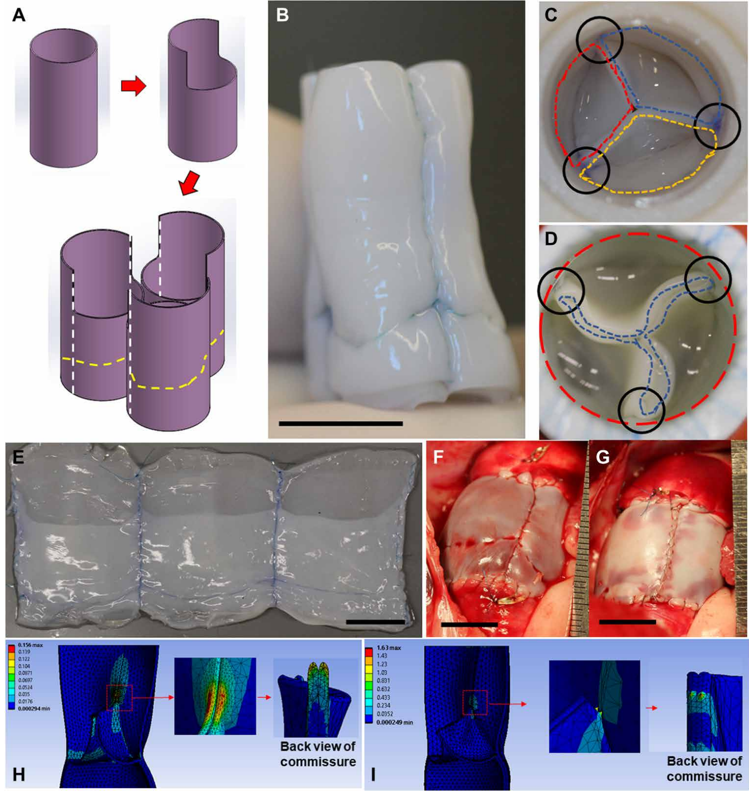

Fig. 1. Tri-tube valve. (A) Schematic showing construction of a tri-leaflet valve from three biologically engineered tubes and degradable suture. White dashed lines show axial suture lines along contact lines of tubes, and yellow dashed lines show where bottom of each tube was sutured closed to create a leaflet. (B) Photograph of exterior view of the sewn valve. Scale bar, 1 cm. Comparison of top (outflow) view of the new tri-tube valve (C) and prior tube-in-tube valve (D), with tubes color coded for clarity and commissures circled. (E) Gen 1 valve as sewn before implantation, slit open, and laid flat to show leaflets. Photographs of surgical field of 19-mm Gen 1 (tri-tube) valve (F) and Gen 2 (sleeved tri-tube) valve (G) implanted in a lamb pulmonary artery, with surgical clips marking anastomoses. Scale bars, 1 cm (E to G). Maps of stress from mechanical analysis using ANSYS for the tri-tube valve (H) and the tube-in-tube valve (I). The back view of stress at the commissure for the tri-tube valve requires a virtual section through the two adjacent tubes whereas it is simply the stress on the outer surface of the inner tube for the tube-in-tube valve.

To prevent the failure mode of unstable commissures observed in the original tube-in-tube design, we developed a tri-tube valved conduit design in which three tubes were sutured together in a closed ring, with the bottom of each tube sutured closed to form its own leaflet (Fig. 1, A and B). The crucial difference in the commissures with this new tri-tube valve design is evident when comparing the connection of the three tubes (Fig. 1C) with the connection of the two tubes in the original tube-in-tube design (Fig. 1D). In the new tri-tube design, the downward diastolic force on the leaflets is going to be predominately carried by the bulk matrix as opposed to being carried by the suture in the original tube-in-tube design.

Here, we present computational mechanical analysis supporting the improved commissure stability of the tri-tube valve design, hereafter referred to as Gen 1. Pulse duplicator testing showed acceptable valve function under pulmonary valve flow conditions relevant for a child. Ultrasonography was performed 1 week, 1 month, and then bimonthly after implantation of the Gen 1 valve into the pulmonary artery of four lambs in one cohort for up to 62 weeks. A second cohort was followed for up to 52 weeks after implantation wherein an additional tube was used to create a sleeve around the tri-tube valve, hereafter referred to as Gen 2; the Gen 2 design yielded an improved outcome over Gen 1 valves. Mechanical and biomechanical properties, dimensions, and histology of the preimplant and explanted valves were used to characterize regeneration of the matrix. Results for calcification and function of the tri-tube valved conduit (simply “valve” hereafter) are compared to reported studies for clinically used pediatric bioprosthetic valved conduits tested in this growing lamb model.

## RESULTS

### Valve fabrication and characterization

Gen 1 valves of 19 mm diameter were fabricated using three 16-mm-diameter biologically engineered tubes derived from ovine fibroblasts embedded in fibrin gel. After decellularization, each tube was trimmed to remove a rectangular section to define the leaflet resulting from subsequent suturing (Fig. 1A). The tubes were sutured together into a closed ring using degradable sutures with three suture lines spanning the length along their point of contact, and the bottom of each tube was sutured closed to create a leaflet, yielding a tri-leaflet valve (Fig. 1B). The top view of a tube-in-tube valve and a tri-tube valve (Gen 1) with the tubes color coded (Fig. 1, C and D) facilitates comparison of commissure construction. The leaflet shape of the tri-tube valve before implantation is seen in a valve slit open and laid flat (Fig. 1E). A representative surgical field shows the suture lines of the valve under pressure (Fig. 1F). The Gen 2 valve was created by slitting an additional tube longitudinally and suturing it around the Gen 1 tri-tube valve to create a sleeved tri-tube valve, with the added sleeve over the tri-tube valve apparent from its increased opacity in the surgical field (Fig. 1G).

Computational analysis of the solid stress generated during valve closure was performed using ANSYS for both the tube-in-tube valve and Gen 1 tri-tube valve. The stress concentration that occurred at the commissure sutures for the tube-in-tube valve did not occur in the Gen 1 tri-tube valve (Fig. 1, H and I). Stress concentration still occurred at the Gen 1 valve commissures but was continuous within the matrix because the valve lacks commissure sutures, suggesting improved commissure stability.

### Characterization of tube properties

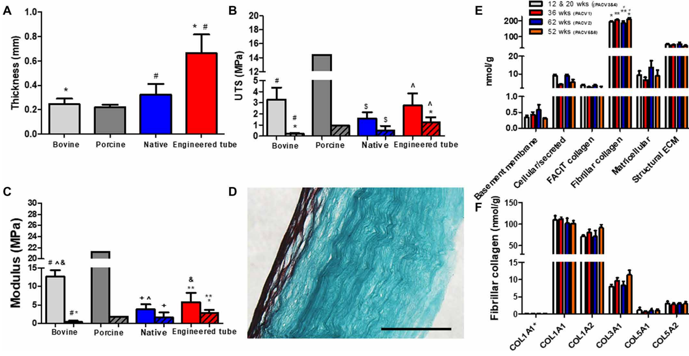

Fig. 2. Preimplantation valve properties. Biologically engineered tube matrix (n = 9) compared to native sheep pulmonary valve leaflet (n = 3), bovine valve leaflet (n = 3), and porcine valve leaflet (n = 1). Mean (A) thickness, (B) ultimate tensile strength (UTS), and (C) modulus. (D) Trichrome-stained cross section of decellularized engineered tube. Solid/hatched bars display the circumferential/radial tensile properties in (B) and (C). Scale bar, 200 µm. Error bars show SD. Paired symbols indicate difference at P < 0.05 (t test for anisotropy, one-way ANOVA, and Tukey post hoc test). (E) Protein abundances of ECM, ECM-associated, and representative cellular proteins binned by functional classification based on gene ontology for the four batches of tubes used to fabricate the valves as indicated. Paired symbols represent P < 0.05 differences (two-way ANOVA and Bonferroni post hoc test). wk, week; FACIT, fibril-associated collagens with interrupted triple-helices. (F) Abundance of fibrillar collagens in the same four batches, “\*” means contains C-term propeptides.

Table S1. Proteomics protein quantification

|  |  |  |  |  | Protein Quantification (nmols/g) |  |  |  |  |  |  |  |  |  |  |  |  |
| --- | --- | --- | --- | --- | --- | --- | --- | --- | --- | --- | --- | --- | --- | --- | --- | --- | --- |
|  |  |  | ECM Annotation |  | 36 weeks |  |  | 62 weeks |  |  | 12/20 weeks |  |  | 52 weeks |  |  | Tech Rep |
| Protein | GENE | Uniprot | Functional | Matrisome | 12-1 | 12-2 | 12-3 | 13-1 | 13-2 | 13-3 | 15-1 | 15-2 | 15-3 | 17-1 | 17-2 | 17-3 | (CV%) |
| Collagen alpha-1(IV) chain(Arresten/Core Protein) | COL4A1\* | P02462 | Basement Membrane | Collagen | 0.039 | 0.051 | 0.072 | 0.043 | 0.030 | 0.045 | 0.053 | 0.020 | 0.041 | 0.036 | 0.043 | 0.032 | 29% |
| Perlecan | HSPG2 | P98160 | Basement Membrane | Proteoglycan | 0.247 | 0.357 | 0.254 | 0.342 | 0.490 | 0.317 | 0.680 | 0.386 | 0.555 | 0.281 | 0.285 | 0.263 | 27% |
| Annexin A2 | ANXA2 | P07355 | ECM-affiliated | ECM-affiliated | 0.036 | 0.077 | 0.098 | 0.057 | 0.055 | 0.028 | 0.076 | 0.066 | 0.046 | 0.035 | 0.050 | 0.035 | 26% |
| Annexin A4 | ANXA4 | P97429 | ECM-affiliated | ECM-affiliated | 0.029 | 0.052 | 0.100 | 0.065 | 0.047 | 0.038 | 0.058 | 0.058 | 0.058 | 0.072 | 0.059 | 0.049 | 18% |
| Mimecan/Osteoglycin | OGN | P20774 | ECM-affiliated | Proteoglycan | 0.076 | 0.111 | 0.068 | 0.081 | 0.101 | 0.067 | 0.105 | 0.090 | 0.136 | 0.062 | 0.102 | 0.072 | 32% |
| Collagen alpha-1(XII) chain | COL12A1 | Q99715 | FACIT Collagen | Collagen | 2.633 | 3.775 | 3.586 | 2.240 | 1.851 | 2.554 | 3.782 | 2.464 | 3.315 | 2.495 | 1.992 | 0.693 | 8% |
| Collagen alpha-1(XIV) chain | COL14A1 | Q05707 | FACIT Collagen | Collagen | 0.223 | 0.144 | 0.225 | 0.267 | 0.408 | 0.281 | 0.160 | 0.155 | 0.147 | 0.181 | 0.179 | 0.124 | 13% |
| Collagen alpha-1(I) chain(C-term Propeptides (NC1 Domain)) | COL1A1\* | P02452 | Fibrillar Collagen | Collagen | 0.029 | 0.054 | 0.074 | 0.094 | 0.131 | 0.113 | 0.062 | 0.047 | 0.054 | 0.027 | 0.048 | 0.015 | 19% |
| Collagen alpha-2(I) chain(C-term Propeptide) | COL1A2\* | P08123 | Fibrillar Collagen | Collagen |  |  |  | 0.081 | 0.108 | 0.116 |  |  |  |  |  |  | 44% |
| Collagen alpha-1(I) chain | COL1A1 | P02452 | Fibrillar Collagen | Collagen | 116.540 | 97.215 | 114.557 | 115.408 | 107.165 | 113.820 | 97.740 | 115.397 | 93.199 | 95.002 | 102.714 | 107.522 | 9% |
| Collagen alpha-2(I) chain | COL1A2 | P08123 | Fibrillar Collagen | Collagen | 70.326 | 75.376 | 69.333 | 78.083 | 88.813 | 73.996 | 59.948 | 70.153 | 85.725 | 84.783 | 91.292 | 99.149 | 7% |
| Collagen alpha-1(III) chain | COL3A1 | P02461 | Fibrillar Collagen | Collagen | 8.214 | 8.477 | 7.380 | 9.409 | 9.125 | 10.647 | 8.662 | 7.154 | 9.349 | 12.860 | 11.255 | 10.290 | 32% |
| Collagen alpha-1(V) chain | COL5A1 | P20908 | Fibrillar Collagen | Collagen | 0.316 | 1.512 | 1.616 | 0.653 | 0.910 | 0.426 | 1.427 | 1.112 | 0.481 | 0.393 | 1.290 | 1.186 | 13% |
| Collagen alpha-2(V) chain | COL5A2 | P05997 | Fibrillar Collagen | Collagen | 2.685 | 3.798 | 2.652 | 2.468 | 2.840 | 3.153 | 2.779 | 2.788 | 3.311 | 3.531 | 2.972 | 2.483 | 7% |
| Periostin | POSTN | Q62009 | Matricellular | Glycoprotein | 0.047 | 0.106 | 0.094 | 0.411 | 0.240 | 0.554 | 0.051 | 0.056 | 0.048 | 0.090 | 0.093 | 0.028 | 17% |
| Thrombospondin 1 | THBS1 | P07996 | Matricellular | Glycoprotein | 3.004 | 3.842 | 4.480 | 2.987 | 3.965 | 1.886 | 6.624 | 3.607 | 4.950 | 3.983 | 2.740 | 1.458 | 6% |
| Thrombospondin 2 | THBS2 | P35442 | Matricellular | Glycoprotein | 0.213 | 0.278 | 0.302 | 0.303 | 0.301 | 0.184 | 0.732 | 0.326 | 0.396 | 0.518 | 0.405 | 0.095 | 21% |
| Tenascin-C(Iso1,2,3,4,5) | TNC | P24821 | Matricellular | Glycoprotein | 3.527 | 6.141 | 6.202 | 3.529 | 3.182 | 2.122 | 10.637 | 6.795 | 7.006 | 7.841 | 5.091 | 4.088 | 15% |
| Biglycan | BGN | P21810 | Structural ECM | Proteoglycan | 0.026 | 0.067 | 0.074 | 0.053 | 0.052 | 0.035 | 0.051 | 0.055 | 0.037 | 0.029 | 0.038 | 0.030 | 31% |
| Collagen alpha-1(XVIII) chain | COL18A1 | P39060 | Structural ECM | Collagen | 0.032 | 0.040 | 0.039 | 0.038 | 0.033 | 0.024 | 0.050 | 0.044 | 0.042 | 0.028 | 0.037 | 0.033 | 17% |
| Collagen alpha-1(VI) chain | COL6A1 | P12109 | Structural ECM | Collagen | 7.544 | 9.133 | 6.627 | 6.262 | 6.106 | 8.285 | 9.932 | 8.648 | 8.545 | 6.055 | 6.149 | 5.272 | 9% |
| Collagen alpha-2(VI) chain | COL6A2 | P12110 | Structural ECM | Collagen | 10.665 | 10.064 | 8.163 | 7.439 | 7.434 | 11.116 | 12.486 | 9.098 | 8.143 | 7.154 | 5.848 | 5.250 | 9% |
| Collagen alpha-3(VI) chain | COL6A3 | P12111 | Structural ECM | Collagen | 11.196 | 13.066 | 10.327 | 12.883 | 11.473 | 14.958 | 15.898 | 10.898 | 13.566 | 11.789 | 12.217 | 7.922 | 10% |
| Dermatopontin | DPT | Q07507 | Structural ECM | Glycoprotein | 0.127 | 0.156 | 0.215 | 0.226 | 0.233 | 0.210 | 0.211 | 0.218 | 0.229 | 0.278 | 0.264 | 0.167 | 12% |
| Emilin 1 | EMILIN1 | Q9Y6C2 | Structural ECM | Glycoprotein | 0.193 | 0.273 | 0.306 | 0.256 | 0.206 | 0.215 | 0.381 | 0.241 | 0.327 | 0.381 | 0.276 | 0.243 | 10% |
| Fibulin 1 | FBLN1 | P23142 | Structural ECM | Glycoprotein |  |  |  |  |  |  | 0.127 | 0.138 | 0.095 |  |  |  | 40% |
| Fibromodulin | FMOD | Q06828 | Structural ECM | Proteoglycan | 0.065 | 0.052 | 0.079 | 0.072 | 0.061 | 0.054 | 0.118 | 0.121 | 0.093 | 0.106 | 0.059 | 0.063 | 23% |
| Fibronectin 1(type-III 4/7 domain) | FN1 | P02751 | Structural ECM | Glycoprotein | 13.916 | 18.857 | 12.556 | 10.666 | 10.856 | 11.971 | 17.476 | 13.613 | 14.371 | 13.041 | 9.056 | 8.709 | 9% |
| Lumican | LUM | P51885 | Structural ECM | Proteoglycan | 0.537 | 0.662 | 0.650 | 0.606 | 0.685 | 0.787 | 0.490 | 0.286 | 0.406 | 0.804 | 0.757 | 0.720 | 7% |
| Microfibrillar-associated protein 2 | MFAP2 | P55001 | Structural ECM | Glycoprotein | 1.281 | 1.551 | 3.199 | 2.689 | 2.144 | 1.776 | 2.384 | 1.740 | 2.033 | 3.918 | 3.204 | 3.164 | 30% |
| Versican | VCAN | P13611 | Structural ECM | Proteoglycans | 0.621 | 0.451 | 0.642 | 1.062 | 0.591 | 0.776 | 0.655 | 0.376 | 0.372 | 0.502 | 0.485 | 0.453 | 5% |
| Vitronectin | VTN | Q3ZBS7 | Structural ECM | Glycoprotein | 4.862 | 3.167 | 3.783 | 4.463 | 4.411 | 3.132 | 3.987 | 2.578 | 2.234 | 4.693 | 3.170 | 4.504 | 14% |
| Tubulin beta-4B chain(4b & 5 chain) | TUBB\* | P04350 | Cellular/Secreted | Cellular | 0.145 | 0.153 | 0.199 | 0.094 | 0.084 | 0.067 | 0.190 | 0.164 | 0.160 | 0.098 | 0.105 | 0.089 | 6% |
| Histone 2A(H2A-A-K) | H2A\* | Q96QV6 | Cellular/Secreted | Cellular | 0.638 | 0.451 | 1.027 | 0.571 | 0.589 | 0.281 | 0.631 | 0.277 | 0.295 | 0.467 | 0.501 | 0.120 | 11% |
| Transforming growth factor-beta-induced protein ig-h3 | TGFBI | Q15582 | Cellular/Secreted | Glycoprotein | 2.427 | 3.639 | 3.119 | 2.029 | 1.760 | 2.258 | 2.987 | 2.717 | 3.001 | 2.776 | 2.017 | 1.070 | 23% |
| Actin (All Isoforms) | ACT | P60709 | Cellular/Secreted | Cellular | 0.229 | 0.290 | 0.341 | 0.113 | 0.096 | 0.078 | 0.238 | 0.170 | 0.167 | 0.142 | 0.161 | 0.096 | 9% |
| Actin, cytoplasmic 1/2 | ACTB | P60709 | Cellular/Secreted | Cellular | 4.995 | 4.248 | 5.244 | 1.640 | 1.110 | 1.316 | 5.817 | 5.631 | 4.754 | 3.233 | 2.730 | 2.199 | 19% |

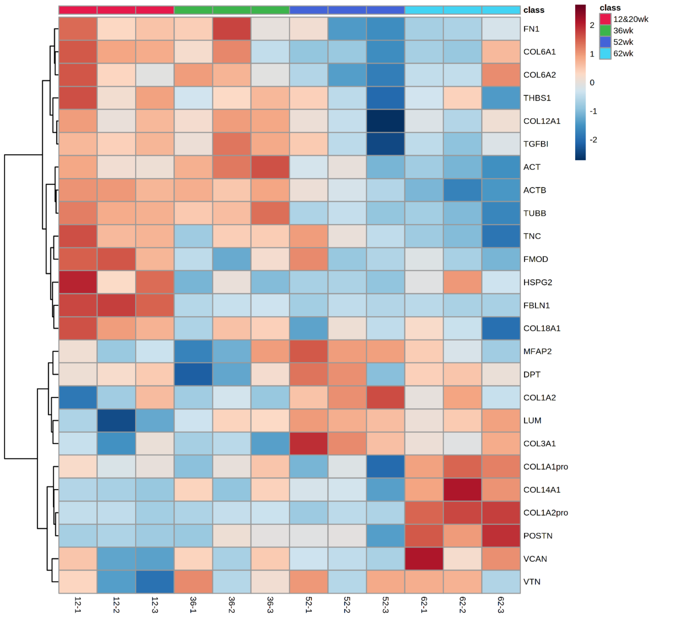

Fig. S1. Proteomics heatmap. Heatmap of top 25 proteins identified by partial least squared discriminate analysis that define unique proteins within each sample. Protein similarity is organized according to Euclidean distance measurement and Ward clustering algorithm.

The decellularized tissue tubes from a representative batch were compared to ovine pulmonary valve leaflets and to the standard-of-care for pediatric pulmonary valve replacement, the chemically cross-linked bovine jugular vein valve (Contegra 200 valved conduit, simply “bovine valve” hereafter) and porcine aortic valve (Hancock 150 valved conduit, simply “porcine valve” hereafter). Tube thickness was 0.66 ± 0.15 mm compared to 0.32 ± 0.09 mm for native ovine pulmonary valve leaflets (n = 3) (Fig. 2A). The tensile strength (circumferential) was similar in magnitude and anisotropy among the bovine, native pulmonary leaflets, and tube groups but appeared substantially higher for the porcine valve leaflets (UTS ~2 MPa versus 14 MPa; Fig. 2B). The tensile stiffness (circumferential) of the tube was comparable to the native leaflet and lower than the bovine leaflets and appeared lower than the porcine leaflets (modulus ~5 MPa versus 10 and 21 MPa, respectively; Fig. 2C). The tube suture pullout force was 92 ± 13 gram-force (n = 9) as compared to 244 ± 31 gram-force (n = 3) for the native pulmonary artery of a sheep (data file S1). Decellularized tissue histology shows collagen bands (stained blue green) aligned in the circumferential direction with remnant fibrin (stained red) on the luminal surface and no intact cell nuclei in the tube matrix (Fig. 2D). Proteomics directed at ~250 distinct ECM proteins or protein isoforms was used to assess differences in their density for the four batches of biologically engineered tubes used to construct the seven valves implanted. Figure 2E shows the seven classes of ECM proteins for available tube batches. Total fibrillar collagen showed differences between batches, whereas no difference existed for specific collagen types among the batches (Fig. 2F). Complete quantitative protein results are shown in table S1 and a protein heatmap is shown in fig. S1.

### Valve durability and hydrodynamics

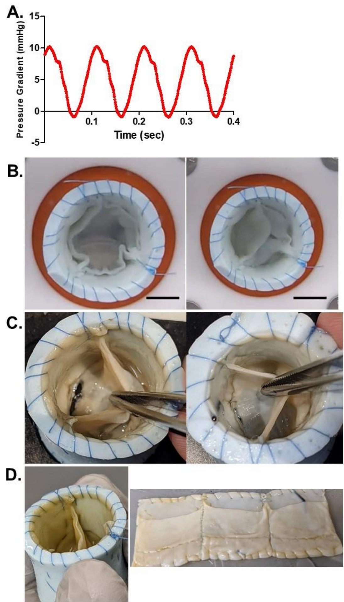

Fig. S2. Durability testing of the tri-tube valve. Testing was conducted in a Bose Durapulse system. (A) Assigned pressure wave with peak maintained above 10mmHg for 5% of the cycle. (B) End-on view of one valve in the open and closed positions during a cycle. Scalebar = 1 cm. (C) Images of both valves tested after 13.5M cycles showing suture line damage that was not apparent after 9.2M cycles. (D) Images of the commissures after 13.5M cycles showing no visual damage.

Durability of Gen 1 valves (n = 2) was assessed in accelerated fatigue testing at 10 Hz with 10 mmHg end-diastolic pressure drop for at least 95% of all cycles conforming with ISO 5840-2015 Part 1, Table E.7 for pediatric right side valves (fig. S2A) (12). Periodic high-speed video revealed that valves fully opened but did not fully close under these conditions (fig. S2B). Periodic inspection of the valves during the testing period revealed that suture pullout occurred along the suture line made at the bottom of the tube (to form a leaflet) in at least one of the tubes between 9.2M and 13.5M cycles for both valves (fig. S2C). No damage was evident at any of the commissures of either valve (fig. S2D). Substantial fungal contamination in the test fluid was evident despite the use of antimicrobial and antifungal agents and periodic fluid change and system cleaning.

Table S2. Summary of pulse duplicator testing of bovine, porcine, and Gen 1 valves.

| Parameter | Bovine (Contegra) valve 20 mm (n=3) | Porcine (Hancock) valve 18 mm (n=1) | Gen 1 valve 19 mm (n=2) |
| --- | --- | --- | --- |
| Mean flow rate (LPM) | 4.1±0.1\* | 3.9±0.3\* | 3.9±0.2\* |
| EOA (cm²) | 0.74±0.08 | 0.71±0.03 | 0.97±0.02 |
| Regurgitation fraction (%) | 7.8±2.7 | 3.6±1.7 | 8.1±1.6 |
| Peak systolic ΔP (mm Hg) | 9.2±2.5 | 8.2±0.1 | 3.4±0.3 |
| Mean systolic ΔP (mm Hg) | 4.6±0.9 | 4.5±0.2 | 2.5±0.2 |

\* Standard deviation represents average of 10 cycles for each valve, averaged over all tested valves.

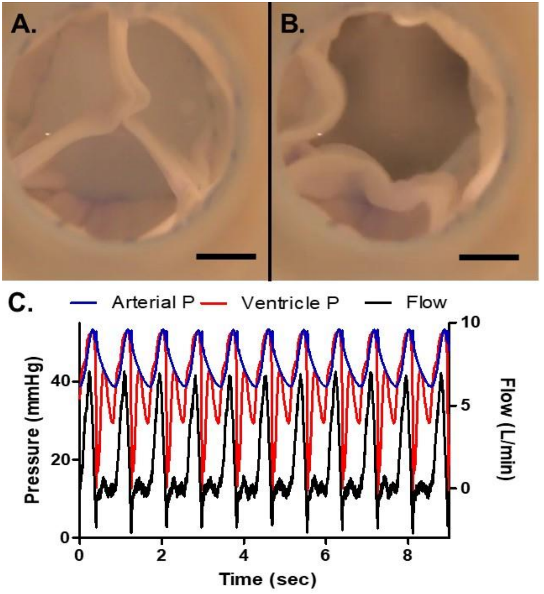

Fig. S3. Gen 1 valve performance in pulse duplicator system. End-on view of valve mounted in (A) closed and (B) open position. (C) Pressure and flowrate traces for 3 cycles of valve under pulmonary valve flow conditions. During diastolic phase, the process of fluid moving from reservoir through a mechanical valve into the pump when low pressure pulmonary conditions are simulated leads to a pressure pulse that causes transient positive (forward) flow through the valve as can be seen in the flow profile. Scalebar = 5 mm.

As expected, on the basis of the close agreement of tensile modulus between the biologically engineered tubes and native valve leaflets, the hydrodynamic performance of a valve constructed from these tubes of cell-produced collagenous matrix was acceptable, with <3 mmHg mean systolic pressure gradient, <9% regurgitant fraction, and nearly 1-cm² effective orifice area (EOA) as shown by comparison of pulse duplicator testing data for Gen 1, bovine, and porcine valves (table S2 and movies S1 to S3). Traces of pressures, flow rate, and valve orifice during testing of a Gen 1 valve are shown in fig. S3. Testing of the Gen 2 valve in the pulse duplicator was not performed.

### Valve function after implantation

### Gen 1 valve

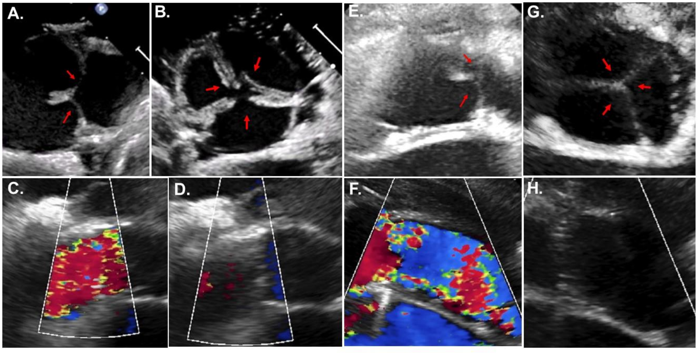

Fig. S4. Epicardial echocardiographic images at implantation. Gen 1 (D0) and Gen 2 (D7) valves during diastole in long (A,E) and short (B,G) axis views. Arrows indicate “leaflets”. Color Doppler ultrasound during (C,F) systole, showing a large valve orifice, and (D,H) diastole, showing no regurgitation.

Table S3. Summary of echocardiography for Gen 1 and Gen 2 valves 1 week after implantation.

| Valve design | Animal ID | Cardiac output (LPM) | Mean systolic ΔP (mmHg) | Effective orifice area (cm²) | Pulmonary insufficiency index |
| --- | --- | --- | --- | --- | --- |
| Gen 1 | PACV 1 | 4.1 | 15ᵃ | 0.88 | Trivial |
| Gen 1 | PACV 2 | 7.2ᵇ | 5 | 1.37 | Trivial |
| Gen 1 | PACV 3 | 4.2 | 2 | 0.92 | Trivial |
| Gen 1 | PACV 4 | 4.9 | 3 | 0.94 | Trivial |
| Gen 2 | PACV 5 | 4.0 | 17ᵃ | 1.5 | None |
| Gen 2 | PACV 6 | 2.8 | 4 | 1.35 | None |
| Gen 2 | PACV 7 | 5.4 | 3 | 2.1 | None |

ᵃ Systolic pressure was high due to cinching at distal anastomotic suture line

ᵇ Cardiac output was abnormally high due to a high heart rate during echocardiography

Given the acceptable performance of the Gen 1 valve under pulmonary valve flow conditions for a young lamb, four lambs (average of 4 months old, 28 kg) were each implanted with a Gen 1 valve interpositionally in the pulmonary artery after removing the leaflets of the native pulmonary valve. The lamb model was chosen to assess the ability of the valve to grow and maintain function in the same ovine species that is the standard for preclinical testing, because its heart is comparable in size to the human and bioprosthetic valves that will eventually calcify in the human will typically calcify within months in a sheep (13). Three-dimensional epicardial echocardiography was performed at implantation. Ultrasound images for the Gen 1 tri-tube valve immediately (day 0) after implantation are shown in fig. S4. The measured coaptation length of the leaflets taken from the long-axis view was 3 to 5 mm (data file S2). Valve performance metrics from transthoracic echocardiography conducted 1-week post-operation are reported in table S3. All valve leaflets had normal leaflet motion with full coaptation (overlap of leaflets when bending inward, resulting in valve closure) during diastole and nil regurgitation (movie S4). Systolic pressure drop across the valves was <5 mmHg except in one animal where, due to suturing, a narrow distal anastomosis created a systolic pressure drop of 15 mmHg (table S3). Another animal had a high heart rate [189 beats per minute (bpm)] during echocardiography, although typical stroke volume, that led to high cardiac output.

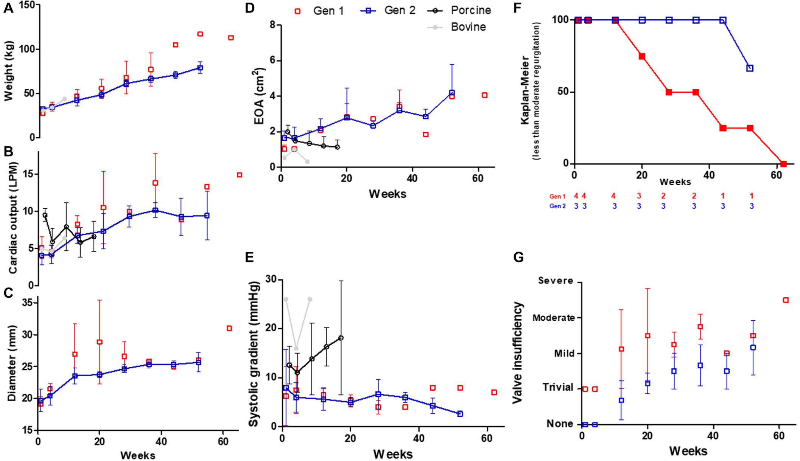

Fig. 3. Longitudinal measurements after implantation. Data shown for all seven lambs in the Gen 1 (n = 4; red) and Gen 2 (n = 3; blue) cohorts, a cohort implanted with a porcine valve (Hancock 150 valved conduit) (n = 6; black) in the same lamb model derived from a previous study (14), and a lamb implanted with a bovine valve (Contegra valved conduit) (n = 1; gray). (A) Animal weight, (B) cardiac output, (C) valve diameter, (D) effective orifice area (EOA), (E) mean systolic pressure gradient, (F) Kaplan-Meier diagram based on freedom from moderate regurgitation, and (G) valve insufficiency index. LPM, liters per minute.

The progression of this Gen 1 cohort in terms of animal weight, valve size, and valve function until explantation is shown in Fig. 3. A 52-week implantation was planned if valve regurgitation remained less than moderate. The animals were all gaining weight before explantation (Fig. 3A), with increased valve diameter and increased EOA (Fig. 3, C and D). Valve function degraded and valve diameter increased markedly between weeks 4 and 12 in two animals, leading to explantation after just 12 and 20 weeks, respectively (Fig. 3C). Two valves implanted functioned acceptably for 28 and 52 weeks (movies S5 and S6), although their explantation at 36 and 62 weeks, respectively, was also dictated by a valve diameter increase coinciding with degraded valve function. In all four animals, degraded valve function was due to increased regurgitation associated with a valve diameter greater than an expected ultimate diameter of 24 to 25 mm based on our prior pulmonary artery replacement study (10). The progressive regurgitation is reflected in the increased cardiac output to abnormally high values (Fig. 3B). For comparison, data are also shown for a 20-week study of a porcine valve (Hancock 150 bioprosthetic valved conduit) in the same growing lamb model previously reported in aggregate along with adult sheep outcomes (14) and a bovine valve (Contegra 200 valved conduit) implanted as part of this study for 11 weeks until the animal died from right heart failure (Fig. 3, A, B, D, and E).

### Gen 2 valve

Three additional lambs (average of 3.5 months old, 32 kg) were implanted interpositionally with a Gen 2 valve in the pulmonary artery after removing the leaflets of the native pulmonary valve, as for the Gen 1 valves. The ECM proteins in the tubes used to construct the Gen 2 valves were similar to the tubes for the Gen 1 valves, as previously noted. Ultrasound images for the Gen 2 valve 1-week after implantation are shown in fig. S4. The measured coaptation length of the leaflets taken from the long axis view was 3 to 5 mm as for the Gen 1 valves (data file S2). Valve performance metrics from transthoracic echocardiography conducted 1-week post-operation are reported in table S3. All valve leaflets had normal leaflet motion with full coaptation during diastole and nil regurgitation (movie S7), and systolic pressure drop across the valves was <5 mmHg in two animals but elevated in one animal (17 mmHg).

Figure 3 also shows the progression of the Gen 2 cohort. As in the Gen 1 cohort, a 52-week implantation was planned if valve function remained better than moderate regurgitation. The first two animals in the Gen 2 cohort both exhibited only trivial-to-mild regurgitation over the 52-week duration (movies S8 and S9) with systolic pressure drops <5 mm Hg at the end point (Fig. 3E), and the same was true for the third animal through 44 weeks until development of moderate regurgitation at 52 weeks (movie S10) coinciding with a valve diameter increase to 27 mm (Fig. 3C).

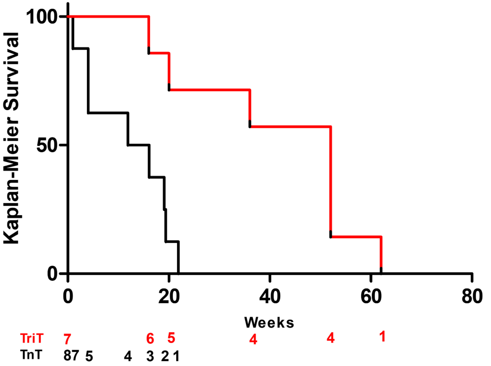

Fig. S5. Kaplan-Meier survival curves. Curves for tube-in-tube valve design (TnT) and tri-tube valve design (TriT). Comparison of survival curve with Log-rank (Mantel-Cox) test yields P = 0.024.

Although there was no difference (P > 0.05) between the Gen 1 and Gen 2 valves based on statistical analysis of Kaplan-Meier survival curves for freedom from moderate regurgitation (Fig. 3F), attributable to the small group sizes and large variation in the Gen 1 survival times, the valve performance was different based on the insufficiency index at explantation (Fig. 3G) as a time-independent comparative measure (P = 0.015; Gen 1 = 3.5 ± 0.4 and Gen 2 = 2.2 ± 0.8). Lastly, the Kaplan-Meier survival curves for the new tri-tube design (Gen 1 and Gen 2 valves combined) were different from the prior tube-in-tube design (P = 0.0024, log-rank Mantel-Cox test; assumed, actual hazard ratio = 0.125, 0.123) (fig. S5), consistent with expectation based on its new commissure design.

### Valve morphology at explantation

### Gen 1 valve

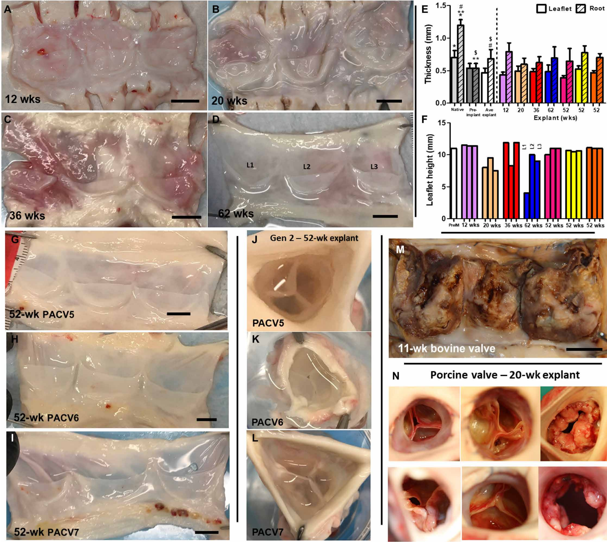

Fig. 4. Photographs and dimensions of explanted valves. Photographs of valves explanted at (A) 12, (B) 20, (C) 36, and (D) 62 weeks in the Gen 1 cohort. Plots of leaflet (E) thickness and (F) height. PreIM, preimplant. Paired symbols indicate significant difference at P < 0.05 (one-way ANOVA and Tukey post hoc test), with all thickness values for explanted valves being pooled for comparison to preimplant and native values. Photographs of valves explanted at 52 weeks in the Gen 2 cohort [(G) to (I)] and their distal view in situ at explantation [(J) to (L)]. L1 to L3 refer to leaflets in (D) and (F). (M) Bovine valve explanted at 11 weeks and (N) porcine valves explanted at 20 weeks. Scale bars, 1 cm.

Gross imaging upon explantation showed that all four Gen 1 valves had three intact leaflets each (Fig. 4, A to D), with no degradable suture evident, and that they were shaped much differently than the leaflets of the tri-tube valves imaged before implantation. Figure 4 (A to D) also shows separation that developed between the commissures and that the leaflets approximately maintained their initial dimensions as the valve diameter increased. There was no temporal trend in thickness of the leaflets or root with implant duration, but the explanted root was thicker than the implanted root (Fig. 4E); both were thinner than the native root (Fig. 4E). There was no difference in thickness between native leaflets and the implanted or explanted leaflets (Fig. 4E). There was a weak linear trend of decreasing leaflet height with time (R2 = 0.33; Fig. 4F); the explanted leaflets were collectively shorter than the preimplant leaflets (Fig. 4F).

### Gen 2 valve

Figure 4 (G to I) shows gross images of the three explanted valves, which had three intact leaflets each that were reshaped during implantation. Small leaflet separation developed at one commissure in two animals, consistent with their trivial-to-mild regurgitation and stable ~25 mm diameter, whereas an oval valve shape also developed in the third animal, consistent with its moderate regurgitation and excessive 27-mm valve diameter. Figure 4 (J to L) conveys the native valve appearance of these three 52-week valves in situ at explantation, in stark contrast to the 11-week bovine valve (Fig. 4M) and 20-week porcine valves (Fig. 4N). The thicknesses of the leaflets and root of the Gen 2 cohort were comparable to the first cohort (Fig. 4E). All three animals in the Gen 2 cohort had explanted leaflets that were essentially the same 11-mm height compared to the preimplant leaflets (Fig. 4F) and had not thickened (Fig. 4E).

### Valve histology at explantation

### Gen 1 valve

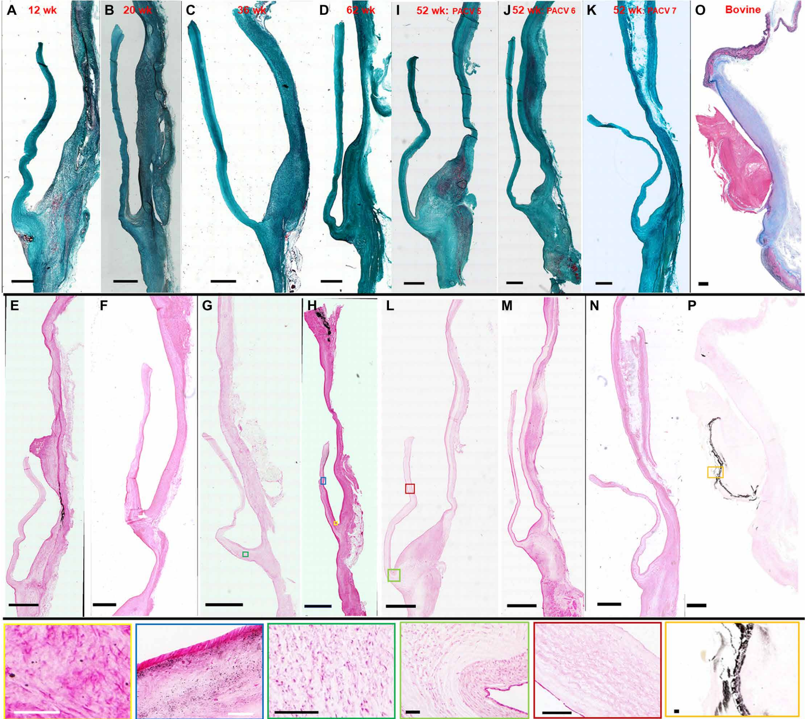

Fig. 5. Histology of explanted valves. Representative longitudinal sections through the root and adjacent leaflet stained with trichrome (collagen, blue green; noncollagen proteins, red; cell nuclei, black): (A) 12, (B) 20, (C) 36, and (D) 62 weeks in the Gen 1 cohort. (E to H) Similar von Kossa–stained sections (calcification, black): (E) 12, (F) 20, (G) 36, and (H) 62 weeks in the Gen 1 cohort. (I to K) Trichrome staining of three 52-week explanted valves in the Gen 2 cohort, and (L to N) von Kossa staining of three 52-week explanted valves in the Gen 2 cohort. (O) Trichrome and (P) von Kossa staining of 11-week explanted bovine valve. Colored borders of insets show areas of interest at higher magnification below. Scale bars, 1 mm (A to P) and 100 µm (insets).

The histology for these valves (Fig. 5, A to D) is consistent with the apparent growth of the root but not obviously of the leaflets, with many more cells across the thickness of the root versus the leaflets. Sparse, punctate microcalcification was evident from von Kossa staining in some leaflet regions of the valve explanted at 62 weeks and occasional deposits in association with the degradable suture lines at the anastomoses (Fig. 5, E to H). In addition, there was one focal calcification present in the root in the 12-week valve (Fig. 5E) that was not observed in any other valves, including the 20-week valve that was constructed from the same batch of tubes.

### Gen 2 valve

The trichrome histology shown in Fig. 5 (I to K) for these three explanted valves is similar to the Gen 1 cohort, with higher cellularity in the root versus the leaflets. Again, leaflet recellularization appeared to progress from cells migrating primarily over the surfaces from the root. However, a key difference in this Gen 2 cohort is that although recellularization of the sleeve was extensive, recellularization of the root of the tri-tube valve was incomplete in the outflow region, in contrast to the explanted Gen 1 valves that did not include the sleeve. Recellularization of the root of the inflow region was complete in the Gen 2 valves, as for the Gen 1 valves. Another notable difference in the Gen 2 valves was an apparent increase in the leaflet free-edge length at 52 weeks, being longer by 17 to 19%, 22 to 37%, and 25 to 34% as measured from ultrasound images at sacrifice (data file S2). Von Kossa staining showed no evidence of any gross calcification in the Gen 2 valves explanted at 52 weeks, with only sparse, punctate microcalcification evident in some leaflet regions (Fig. 5, L to N). In contrast, there was substantial calcification in grossly thickened leaflets of the bovine valve that failed at 11 weeks without any evidence of infection (Fig. 5, O and P).

### Valve immunohistochemistry

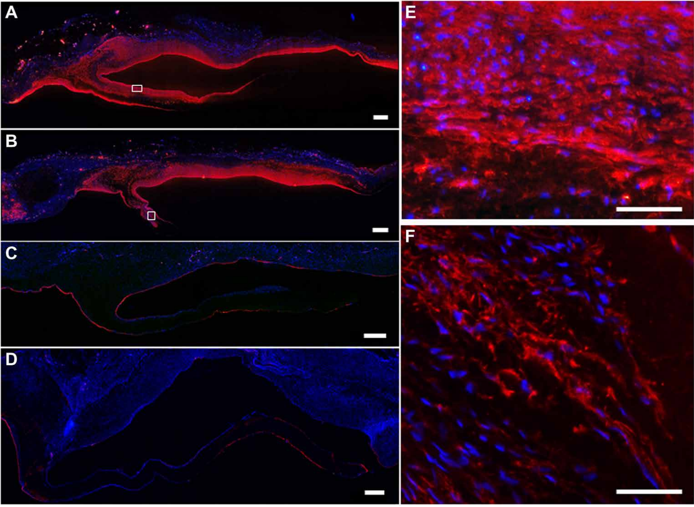

Fig. 6. Immunostaining of leaflets of longest-term (62 weeks) and shortest-term (12 weeks) valve explants (both Gen 1 valves). (A and B) α-Smooth muscle actin (SMA) (red), 4′,6-diamidino-2-phenylindole (DAPI) (blue), and (C and D) von Willebrand factor (vWF) (red), DAPI (blue)–stained representative sections of leaflet L3 [(A) and (C)] and L1 (B) as labeled in Fig. 4D for the 62-week explant and (D) a leaflet for the 12-week explant. Magnified section of SMA stain in (E) L3 and (F) L1 showing cell morphology difference. Scale bars, 500 µm (A to D) and 0.5 µm (E and F).

Focusing on the Gen 1 valve implanted for 62 weeks as compared to the one implanted 36-weeks, leaflet recellularization appeared to progress from cells migrating primarily over the surfaces from the root as seen in the histology. Several recellularization patterns occurred within and between leaflets, which are elucidated using immunohistochemistry for the 62-week valve in Fig. 6 (A to C). In a leaflet that retained nearly full height for this valve as seen in its gross image (L3), a section shows a substantial number of α-smooth muscle actin (SMA)–positive cells, presumably interstitial cells (Fig. 6A). Von Willebrand factor (vWF) staining of another section of L3 located ~500 µm away indicated formation of an endothelium emanating from both the base of the leaflet and the commissure region (Fig. 6C). A comparison of the nuclear staining in these two sections indicated a substantial difference in the number of cells that had invaded into the leaflet interstitium; however, a large portion of the leaflet surfaces were covered with cells in both cases. The one leaflet that was shorter in the 62-week valve (L1) exhibited a focal collective infiltration of SMA-positive cells with distinctive morphology (Fig. 6B, compare insets of magnified fields in E and F). The two valves were explanted at 12 and 20 weeks due to their rapid increase in diameter and resultant regurgitation motivated their characterization as well. After 20 weeks of implantation, the leaflet surfaces were covered with cells, although there were fewer cells that had invaded into the leaflet interstitium and less endothelium formation as compared to the 62-week valve (Fig. 6, C and D), as might be expected. Given the similarity between the histology of the Gen 1 and Gen 2 valves, immunohistochemistry was not performed for Gen 2 valves.

### Valve composition and mechanical properties at explantation

### Gen 1 valve

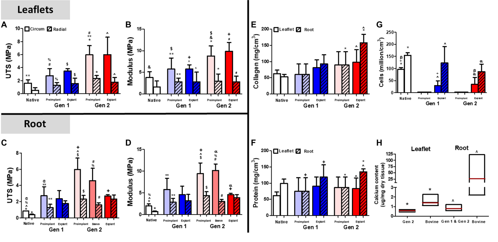

Fig. 7. Tensile mechanical properties and compositions of explanted valves. Preimplant tube and native sheep pulmonary valve values are plotted for comparison. (A) Leaflet UTS, (B) leaflet modulus, (C) root UTS, and (D) root modulus for Gen 1 and 2 valves. Solid/hatched bars display the circumferential/radial tensile properties. (E) Collagen, (F) total protein, and (G) DNA contents of Gen 1 valves. Error bars show SDs for the pulmonary valve (n = 3), preimplant tubes (n = 9), sleeve tubes (n = 3), explanted Gen 1 valves (n = 4), and explanted Gen 2 valves (n = 3). Paired symbols indicate significant difference at P < 0.05 (one-way ANOVA and Tukey post hoc test). (H) Calcium of Gen 1 and Gen 2 valves (n = 3 leaflets, n = 7 roots) as compared to reported data for the bovine valve (17), with medians and 25 to 75% ranges shown. Paired symbols indicate significant difference at P < 0.05 (one-sample t test against reported lower limit; data file S4).

Despite the substantial histological differences between the high-cellularity growing root and the low-cellularity nongrowing leaflets at these extended time points, the modulus and UTS of the root and leaflets did not exhibit a temporal trend and were not different from preimplant values or native values (Fig. 7, A to D). Similarly, the explanted collagen and total protein contents exhibited no temporal trend and were not different from preimplant tube values (Fig. 7, E and F). The explanted leaflet modulus anisotropy \((E\_{\mathrm{circ}}/E\_{\mathrm{rad}})\) did not exhibit a temporal trend and with value 1.8 ± 0.5 (i.e., stiffer in the circumferential direction, the direction of alignment of the preimplant tube) was comparable to the preimplant tube (2.0 ± 0.4) and native leaflet (2.3 ± 0.6) (Fig. 7B). However, the explanted roots did not have a modulus anisotropy, in contrast to the preimplant tube (2.0 ± 0.4) and native root (2.9 ± 0.22) (Fig. 7D). The collagen contents of the explanted roots and leaflets were not different from the preimplant values or the native root (Fig. 7E), although the protein content of the explanted roots was greater than the explanted leaflets (Fig. 7F). Consistent with that difference and the histology, the roots had higher cellularity than the leaflets (Fig. 7G). The mean cell concentration in the explant roots for the four valves (123 ± 68 million cells/cm³) was not different from native root (155 ± 10 million cells/cm³); however, the cell concentration of the explanted leaflets (29 ± 20 million cells/cm³) was 70% lower compared to native leaflets (96 ± 8 million cells/cm³).

The two valves were explanted at 12 and 20 weeks due to their rapid increase in diameter, and resultant regurgitation motivated additional characterization of these two valves in addition to histological assessment. Ki67 immunostaining revealed a higher frequency of dividing cells in the root (1.23 ± 0.59% for the 12- and 20-week valves as compared to 0.20 ± 0.29% for the 36- and 62-week valves, n = 15 fields totaling >6000 cells) (data file S3), and DNA quantitation revealed a higher density of cells in the root of the 20-week valve (227 cells/cm³) as compared to the 36- and 62-week valves (140 and 77 cells/cm³, respectively); however, cell density was not higher in the 12-week valve (66 cells/cm³) (data file S3). These findings are consistent overall with the greatly increased valve diameter from 4 weeks to 12 and 20 weeks being due to cellular remodeling of root tissue.

### Gen 2 valve

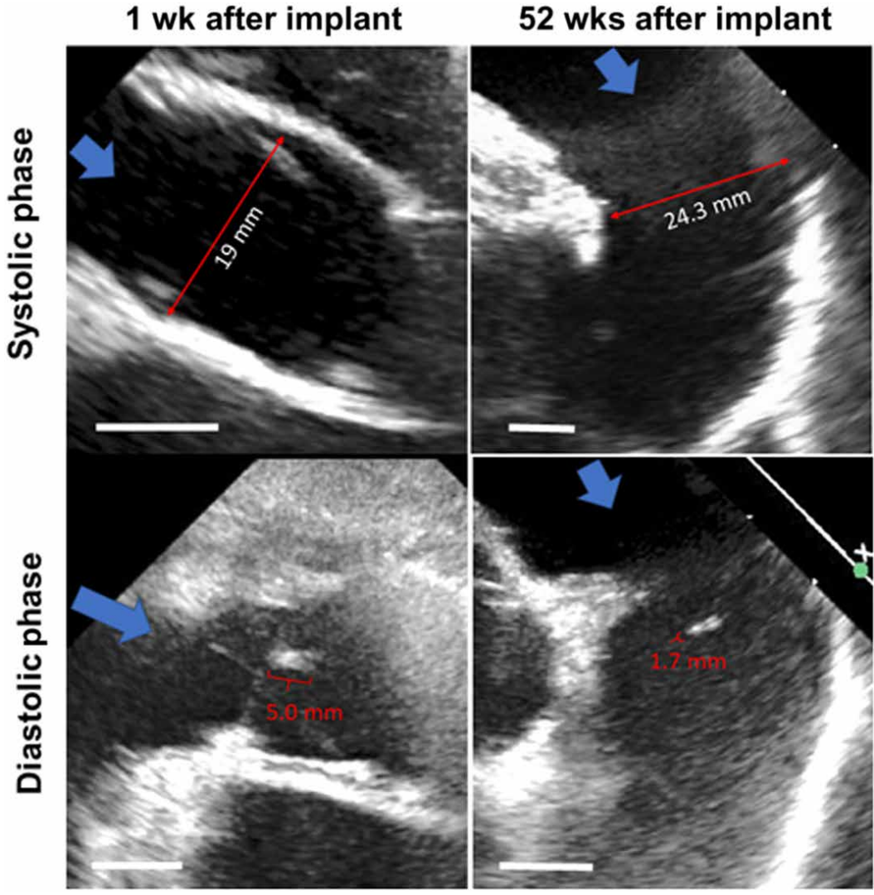

Fig. 8. Still images from echocardiography of a Gen 2 valve in long-axis view. Images show open and closed states at implantation and at 52 weeks. Red arrows in systolic phase indicate approximate location of valve diameter measurement. The overlaid brackets in the diastolic phase images at 12 and 52 weeks indicate the coaptation lengths (5.0 and 1.7 mm, respectively). Blue arrows indicate direction of blood flow. Scale bars, 1 cm.

The modulus and UTS of the root for the explanted Gen 2 valves were similar to the Gen 1 valves (Fig. 7, C and D). Gen 2 leaflets had higher values; however, they were not different from the preimplant values for the batch of tubes used to fabricate the Gen 2 valves, as was also true for the Gen 1 valves. Unlike the Gen 1 valves, the collagen density of the Gen 2 valve roots was increased over the preimplant value (Fig. 7E). Similar to the Gen 1 valves, the protein density of the Gen 2 valve roots was increased over the preimplant value (Fig. 7F). Cellularity of the Gen 2 valve root increased to the value of the ovine pulmonary artery as did the Gen 1 valve root, and the Gen 2 leaflet cellularity was comparable to the Gen 1 leaflets (both ~33% of native leaflets) (Fig. 7G). Quantitative measurement of calcification from randomly selected biopsies yielded 0.59 ± 0.24 µg/mg dry weight (n = 3) in the leaflets for the Gen 2 valves (Fig. 7H). The outflow segment of the valve roots measured 0.84 ± 0.42 µg/mg dry weight (n = 6) for the three Gen 2 valves averaged with the four Gen 1 valves, which retrospectively excluded the aforementioned calcific nodule noted for the 12-week explanted valve. Median values are shown in Fig. 7H. Preimplant matrix contained 0.10 to 0.12 µg/mg dry weight (n = 2) (data file S4). Collectively, these properties imparted valve function and maintenance of large orifice area with only trace-to-mild regurgitation observed in all three Gen 2 valves for 44 weeks and two of the valves for 52 weeks despite the reduction in coaptation length evident in diastole compared to 1 week (Fig. 8), presumably offset by the increase in free-edge length.

## DISCUSSION

Here, we report the results of in vitro testing and in vivo assessment of a tri-tube valve design where diastolic forces are carried predominantly by the collagenous matrix comprising the tubes and not the suture that initially attaches them together. Improved commissure stability of the tri-tube design relative to our previous tube-in-tube design (7) is suggested by the occurrence of stress concentration at the commissure sutures in the tube-in-tube design, which is absent in the tri-tube design, as shown using computational mechanical analysis. The tri-tube valve was shown here to exhibit acceptable hydrodynamic performance in a pulse duplicator. Markedly improved function of the tri-tube valve over the tube-in-tube valve was demonstrated in a growing lamb model.

Pronounced commissure separation in the Gen 1 (tri-tube) valves after implantation resulted from rapid growth of the root at the commissures relative to the leaflets, which led to increasing regurgitation. This motivated the Gen 2 (sleeved tri-tube) valve, the sleeve being an additional tube of the biologically engineered matrix placed around the tri-tube valve. The improvement in long-term performance in the Gen 2 valve was notable. Two animals that reached the 52-week end point both exhibited a stable valve diameter after growth from 19 to ~25 mm, an increase in EOA from ~1.8 to ~3.2 cm², only trivial-to-mild regurgitation, and a systolic pressure gradient less than 10 mmHg at all times (and decreasing by 52 weeks to less than 5 mmHg). The third animal developed moderate regurgitation at 52 weeks coinciding with hyperincreased valve diameter, although it had thin, pliable, leaflets of full height and with systolic gradient <10 mmHg at all times. These results were compared to a bioprosthetic valve widely used in pediatric right ventricular outflow tract (RVOT) reconstruction (15, 16), the chemically processed porcine aortic valve mounted within a woven fabric sleeve (marketed as the Hancock 150 valve). The porcine valve was evaluated in the same growing lamb model. There was an obvious deterioration in the performance of the porcine valve evident from decreasing EOA and increasing systolic pressure gradient to nearly 20 mmHg (Fig. 3). The same was true for the animal implanted with a chemically processed bovine jugular vein valve (marketed as the Contegra valve), which died after 11 weeks due to calcification and thrombus resulting in stenotic occlusion and thus heart failure, the study being discontinued.

Table 1. Summary of echocardiography for porcine, Gen 1, and Gen 2 valves.

|  | 20-week echo data |  |  | 52-week echo data |  |  |
| --- | --- | --- | --- | --- | --- | --- |
|  | Porcine (n = 6) | Gen 1 (n = 3) | Gen 2 (n = 3) | Porcine (n = 0) | Gen 1 (n = 1) | Gen 2 (n = 3) |
| Cardiac output (liter/min) | 6.6 ± 2.0 | 10.5 ± 4.9 | 7.3 ± 2.3 | – | 13.3 | 9.4 ± 3.3 |
| EOA (cm²) | 1.14 ± 0.41 | 2.84 ± 0.74 | 2.05 ± 0.39 | – | 3.99 | 4.2 ± 1.6 |
| Systolic ΔP (mmHg) | 18 ± 11 | 5 ± 1 | 5 ± 1 | – | 8 | 2.7 ± 0.6 |

In one retrospective analysis of 63 pediatric patients implanted with a porcine valve between 2000 and 2010, freedom from failure, defined as severe conduit regurgitation or stenosis with a main pulmonary artery systolic gradient over 60 mmHg, was 100, 96, and 83% after 1, 3, and 5 years, respectively (16). The mean systolic gradient, found to be exclusively at the valvular level across the stenotic valved conduit was 87 ± 11 mmHg, consistent with porcine valve results in the growing lamb model and in stark contrast to our Gen 2 valve. The improved performance of the Gen 1 and Gen 2 valves at 20 weeks based on echocardiography (Table 1) was not unexpected when comparing the images of the Gen 2 valves explanted at 52 weeks with the porcine valves explanted at 20 weeks or the bovine valve explanted postmortem at 11 weeks, which revealed pronounced calcification and distortion of the leaflets (Fig. 4).

We made comparison of our Gen 1 and Gen 2 valves to performance data on the porcine valve in the same growing lamb model previously reported in aggregate along with adult sheep outcomes (14). In addition to improved EOA and systolic gradient of the Gen 1 and Gen 2 valves over the first 20 weeks of implantation as compared to the porcine valve in the same growing lamb model, these valves constructed from the biologically engineered matrix also exhibited stronger calcification resistance. The newer bovine valve was shown to resist calcification in a similar growing lamb model among six stentless bioprosthetic valves tested (17), and we thus made comparison to these results to minimize animal usage when comparison control data in the same model are available, as for the porcine valve performance comparison. A median of 0.78 µg calcium/mg dry weight in the outflow of the root was measured for the seven Gen 1 and Gen 2 valves implanted for an average time of 9.4 ± 4.3 months as compared to more than a 33-fold greater 25.8 µg/mg dry weight reported for the bovine valve implanted for 5 to 6 months in older adolescent sheep (age 8 to 11 months); a median of 0.54 µg calcium/mg dry weight in the leaflets was measured for the three Gen 2 valves implanted for 12 months compared to the 2.6-fold greater 1.42 µg/mg dry weight reported for the bovine valve, also statistically different (17). The extensive calcification that occurred in leaflets of the bovine valve implanted in our study likely reflects the younger lamb used in our study, wherein acceleration of calcification has been reported (18).

The leaflets of our 19-mm-diameter valve were designed to have 3 to 5 mm of coaptation length (as measured in the long-axis view) to accommodate an anticipated rapid increase in valve diameter before leaflet growth due to their slower recellularization, without losing coaptation. It has been reported that the pulmonary artery is ~19-mm internal diameter (ID) in lambs of age 4 months and ~23-mm ID at age 12 months (19), consistent with our previously reported increase to 24 to 25 mm of a 16-mm-ID tube of the same matrix into the pulmonary artery of young lambs growing to 12 months (10). On the basis of in vitro hydrodynamic testing, the regurgitant fraction, EOA, and systolic pressure gradient of the Gen 1 valve were comparable to the bovine and porcine valves. In addition, ultrasound analysis at 1 week showed no evidence of regurgitation or abnormal closing volume in all seven animals implanted with tri-tube valves. This was true even though the cardiac flow rate was ~25% higher than the value used for in vitro testing, indicating robust valve performance. Five of the seven implanted valves had a systolic pressure drop <5 mmHg 1 week after implantation. In two other cases, the pressure drops were elevated (15 and 17 mmHg) because of a narrow distal anastomosis, inadvertently due to suturing. With our use of degradable suture, this narrow anastomosis and associated gradient were expected to resolve as previous work has shown the growth of our biologically engineered material and increase in diameter at anastomoses in this model (7). Resolution occurred in these cases, with gradients <5 mmHg by 12 weeks in both cases. Excluding these two cases, the other Gen 1 and Gen 2 valves exhibited a 2.8-fold lower systolic gradient 1 week after implantation than the porcine valve, possibly reflecting the higher stiffness of the porcine tissue, which had a ~2- and 3-fold higher circumferential modulus compared to the Gen 1 and Gen 2 valves, respectively.

The failure mode of commissure instability after 12- to 16-week implantation in our previous tube-in-tube valve design (7) was resolved with this tri-tube design, consistent with the diastolic forces now being predominately carried by the bulk matrix of the tubes as opposed to being carried by the suture in the original tube-in-tube design and consistent with the computational model and durability testing. None of the explanted Gen 1 valves exhibited extreme (~50%) leaflet shortening that was previously observed in the tube-in-tube valves due to a hypothesized commissure instability (7). Two of the four Gen 1 valves functioned longer (28 and 52 weeks) and had leaflet heights at explantation comparable to the preimplant value of 11 mm; however, new failure modes occurred.

The early, marked increase in the diameters of the two Gen 1 valves explanted at 12 and 20 weeks was unexpected. This diameter increase did not appear to be aneurysmal as the collagen density in the root and its thickness were similar to preimplantation values. The comparable or higher cell density and higher frequency of dividing cells as compared to the valves explanted at 36 and 62 weeks are also consistent with the occurrence of root growth rather than root thinning. These two valves exhibited a much higher systolic pressure gradient at week 4 (11 to 12 mm Hg), which matches the subsequent rapid diameter increase with a lag time of 8 to 16 weeks. The increased gradient implies that a higher luminal pressure was present and greater valve distension occurred. Many cell types are known to be stimulated by cyclic stretching, which has been used as a strategy for inducing tissue growth in vitro (20–23), so the subsequent rapid diameter increase could have been triggered by cells repopulating the matrix and subjected to abnormal stretching 8 to 16 weeks earlier. If this was the causal factor, it could be mitigated or preempted by using stiffer tubes to construct the valves (e.g., cultured to produce more collagen and/or more highly cross-linked collagen). However, these two valves were constructed from the same batch of tubes, whereas the other two Gen 1 valves that maintained the expected diameter and functioned much longer were constructed from two different batches. Proteomics was conducted to ascertain whether there were any differences in the starting matrix composition that might explain the outcomes. The proportions of matrix proteins among seven functional classes were not different among the three batches used to construct the Gen 1 valves except for fibrillar collagen, although there were no differences by collagen type among the three batches. The ECM proteomics suggests that differences in the matrix composition among the batches are unlikely to explain the observed differences in Gen 1 outcomes. However, because the proteomics library does not probe for all possible ECM constituents nor any ECM-associated growth factors produced by the fibroblasts, this is not definitive.

The failure mode of the Gen 1 valves that were functional at 28 and 52 weeks appeared to be root growth between the commissures leading to separation of the leaflets. We hypothesize that the increasing regurgitation occurring over many months led to increasingly abnormal RVOT hemodynamics and, eventually, a maladaptive growth of the valve root. This failure mode may be moot for children, who grow at a much slower rate than sheep, with a pulmonary artery increasing from a diameter of 12 mm at birth to a diameter of 24 mm at age 16 years or 12 mm change in diameter over 16 years (24). This is in sharp contrast to the much faster growth of the sheep pulmonary artery, 4 mm in diameter over 8 months (10, 19), a rate consistent with the valve diameter results in this study.

We nonetheless conceived the Gen 2 design, placing a sleeve comprising the same biologically engineered matrix tube around the tri-tube valve, as a possible means to slow the growth rate of the valve diameter relative to the leaflets. The sleeve also provides mechanical support to the commissures and a layer of safety to possible failure of suture lines. For example, the doubling of initial root thickness might present an increased mechanical constraint to growth and increase the time for complete recellularization to occur in the root or both. The sleeve delayed the time to complete recellularization of the root, which was necessarily accommodating increasing valve diameter in the acellular region by some combination of stretching, plastic deformation, and/or protease-mediated remodeling of the implanted matrix. Although the mechanism cannot be concluded, we achieved our objective of reducing the commissure separation observed in the Gen 1 valves and preserved good valve function—and stable valve diameter—through the target 52-week implant duration in two of three animals implanted with the Gen 2 valve. The third animal in the cohort that worsened from mild to moderate regurgitation between 44 and 52 weeks is the animal that exhibited the earliest regurgitation increase (from trivial to trivial-mild at 20 weeks), consistent with progressive regurgitation, increased cardiac output, and supraphysiological increase in diameter of the valve and distal pulmonary artery that occurred in the Gen 1 valves. That root growth occurred in both the Gen 1 and Gen 2 valves is supported by the increase in collagen density of the valve roots that increased in diameter without a change of thickness, consistent with our reported results for a pulmonary artery replacement using a single tube in this growing lamb model (10). A gap developed between the leaflets at one commissure in all three explanted Gen 2 valves. This was the commissure where the suture line of the sleeve overlapped with the axial suture line of the tri-tube valve forming the commissure. This suggests that a more robust growth response was induced by the degrading suture, which is easily remedied by relocating the suture line for the sleeve between commissures.

The Gen 2 valve leaflets were comparably recellularized to the extent observed in the long-term (36 and 62 weeks) explanted Gen 1 valves based on histology and DNA quantitation. However, the combination of somatic growth of the root and growth accommodation by the leaflets due to excess coaptation area at implantation and reported increased free-edge length (presumably by the same combination stated above) yielded a valve that retained function during growth of the lamb into adulthood, with the potential for eventual complete leaflet recellularization. This potential exists because of the remarkable durability of the biologically engineered collagenous matrix comprising the slowly recellularizing leaflets.

The recellularization pattern of the leaflets was similar in the both the Gen 1 and Gen 2 valves, consistent with migration from the root primarily on the leaflet surfaces, with migration from the base through the interstitial matrix apparently being inhibited. In this respect, our findings are consistent with study based on implantation of decellularized pulmonary and aortic valve allografts similarly implanted into the ovine pulmonary artery of lambs (25), although the resulting histology differs substantially. Our findings also appear consistent with our prior tube-in-tube valve design study that used younger lambs (5.5 weeks old), where the entire leaflet surface appeared to be covered by cells after 12-week implantation. The one severely shortened leaflet in the 62-week explanted valve appeared to have a focal collective invasion of SMA-positive cells. There was no evidence of this leaflet being shortened in the 52-week echocardiography, as this leaflet could be visualized on the basis of reference suture clips and exhibited high mobility during the cardiac cycle; the valve had only mild-to-moderate insufficiency at 52 weeks. However, this same leaflet exhibited no mobility when visualized at 62 weeks, when the valve insufficiency was moderate to severe. Whether this invasion was occurring but not yet manifested as leaflet contraction at 52 weeks or began when the leaflet lost mobility at some point after 52 weeks is unknown.

All three 52-week explanted Gen 2 valves maintained their preimplantation leaflet height. The slight reduction in height of leaflets in the long-term (36 and 62 weeks) explanted Gen 1 valves relative to the preimplantation value can be attributed, at least in part, to the circumferential stretching of the leaflets that occurred when the valve diameter increased beyond the expected value of 24 to 25 mm. This is supported by the maintenance of leaflet height in the two Gen 2 valves that maintained the expected valve diameter. It is notable that a common failure mode of tissue-engineered heart valves (TEHVs)—leaflet thickening—was never observed, with all leaflets having similar thickness compared to preimplantation values. The maintenance of tensile stiffness and strength of the implanted matrix whether it became highly recellularized (root) or modestly recellularized (leaflet) even after 52- to 62-week implantation is a favorable outcome, indicating the potential stability of the matrix over longer periods to time that are apparently required for complete leaflet recellularization.

There are several limitations to this study and its findings. Although the functional improvement of the tri-tube design over the tube-in-tube design is well supported from the Kaplan-Meier survival curves, the cohort sizes for the Gen 1 and Gen 2 valves were too small to conclude a difference between them on this basis. The difference based on reduced insufficiency index at explantation is promising, however. Potential outcome variability due to biological heterogeneity in the recipient population would only be assessable in larger cohorts. Complete leaflet recellularization with cell types and phenotypes consistent with homeostasis after regeneration of the implanted matrix will be required for longer-term durability of the valve, and this remains to be shown in a cohort with a longer end point. Heparin was administered twice daily for the duration in this study to obviate clotting as a failure mode while ascertaining valve growth potential; the time when anticoagulation can be discontinued with minimal risk, either because of spontaneous endothelium formation and/or passivation of any exposed matrix, remains to be determined. Regulatory approval will also require production of the Gen 2 valve according to current Good Manufacturing Practice. Expanded in vitro hydrodynamic characterization of the Gen 2 valve would also be required for its regulatory approval. Although there are ISO standards for testing of pediatric heart valves (ISO 5840-2015 Part 1, Annex E) it remains to be seen whether they are applied without modification to TEHVs that include living cells at implantation or, as in this approach, are designed for recellularization and growth after implantation. Hydrodynamic testing that is based on short-term function (e.g., EOA and regurgitant fraction over a range of flow rates) should apply to TEHV, and only a single flow rate was investigated using n = 2 Gen 1 valves in this study.

Note that durability testing according to ISO standards, which is justified by the need to demonstrate an inert valve that cannot self-repair in adults or grow with children will function for a clinically relevant period (200M cycles for biologic valves and 600M cycles for mechanical valves), does not clearly apply, as demonstrated by no case of suture line failure for any of the tri-tube valves (n = 7), up to 62 weeks in vivo (38M cycles at the 72 bpm average for sheep) as compared to 9.2M to 13.5M cycles in the durability test. The shorter durability life in vitro likely reflects nonsterile conditions and resultant matrix damage (absent a sterile durability test system and despite use of antimicrobial agents); however, it also reflects the impossibility of an in vitro test reflecting the durability associated with tissue growth along the suture lines that occurs in vivo. Durability testing demonstrated that the suture lines are sufficiently durable during the initial implantation period before matrix recellularization and tissue growth along the suture lines, which occurred as early as 12 weeks (8.8M cycles at 72 bpm) in the tube-in-tube valve (7).

The tri-tube design that we used in both the Gen 1 and Gen 2 valve designs, where three tubes are sutured together in a closed ring and the bottom of each tube is then sutured closed to form its own leaflet, yields a wide range of possible leaflet sizes/coaptation areas and leaflet angulations for a target valve diameter because three tubes that have a diameter within a wide range can be sewn together into a valve of target diameter with this design (e.g., tubes of smaller diameter yielding less coaptation area and vice versa). This leads to an interesting design optimization problem that dictates initial valve performance in a reasonably predictive manner given measurable constitutive mechanical properties of the collagenous matrix. It also determines long-term growth of the valve through as-yet poorly understood cell-mediated regenerative processes that can depend on the initial and evolving valve stress and strain/flexion distributions (26).

## METHODS

### Study design

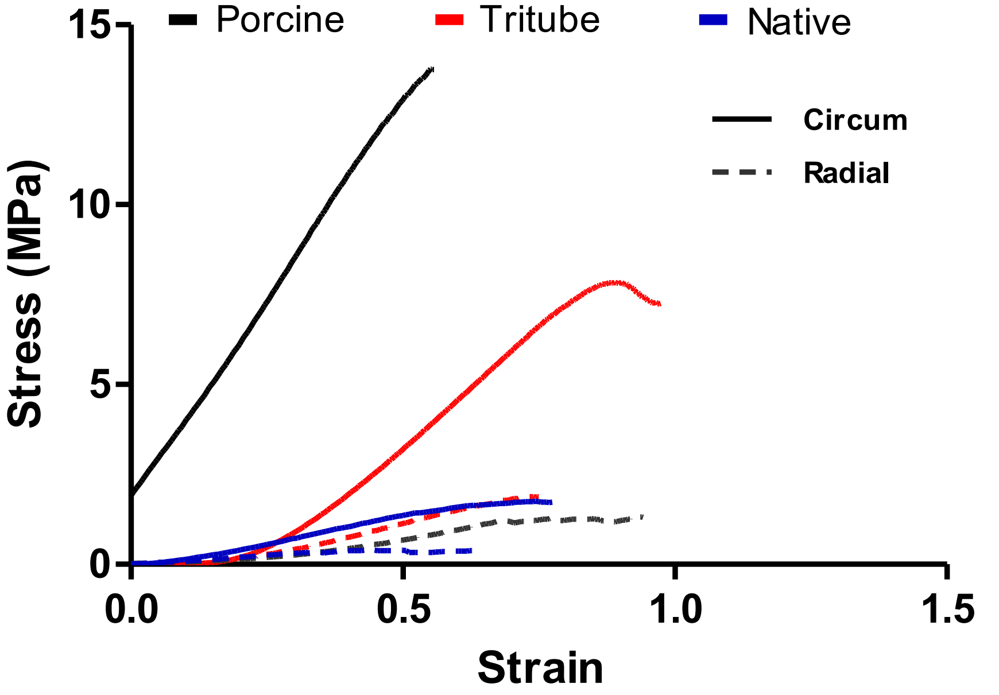

Fig. S6. Stress-strain curves. Native ovine leaflet, biologically engineered tube, and porcine (Hancock)leaflet tissue in circumferential (solid line) and radial (hash line; corresponds to axial direction of the tube) from uniaxial tensile testing.

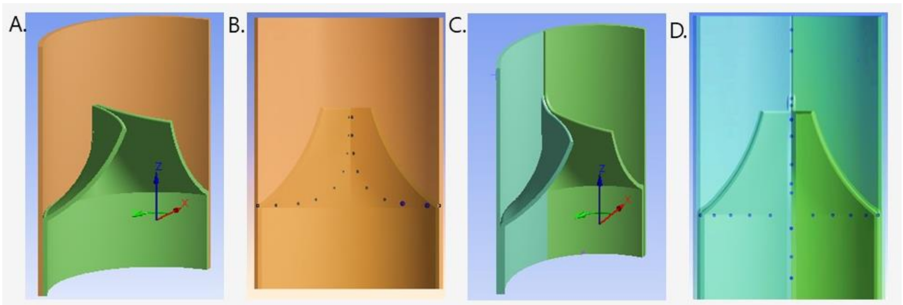

Fig. S7. ANSYS valve models. (A) The tube-in-tube valve model was composed of an inner tube defining the leaflet domain (green body) and the outer tube defining the root domain (orange body) with suture points shown in (B). The tri-tube valve model was defined by one-half of two adjacent tubes (cyan and green bodies) shown in (C), with suture points shown in (D).

The study was designed to ascertain whether the new tri-tube design (“group 1”) resulted in longer time of freedom from valve failure (“survival time”) than the previous tube-in-tube design. In vitro characterization and testing were first performed to ensure valve function at the time of implantation and durability until expected recellularization. These in vitro methods are all found in Materials and Methods of the Supplementary Materials and include: durability testing, pulse duplicator testing, tensile strain-to-failure testing, suture pullout force testing, tissue/matrix composition analysis, histology, proteomics, and computational model of valve diastolic forces (with stress strain curves and model geometry shown in figs. S6 and S7, respectively).

The statistical design of the implantation study, conducted under approval by the Institutional Animal Care and Use Committee (IACUC), is as follows: The median survival time for our tube-in-tube study in the lamb model was 14 weeks (n = 8, “group 0”) (7). A sample size (n) for group 1 was determined from a proportional-hazards regression model (27) using the University of California, San Francisco Clinical and Translational Science Institute web-based software. For a planned average survival time of 52 weeks, a hazard ratio (group 1/group 0) value = 0.125, α (two-tailed) value = 0.05, censoring rate (censor/time) value = 0, and n = 6 is required for power = 0.8 (i.e., probability of failure, β = 0.2). The modification of the tri-tube valve during the study by adding the sleeve to the Gen 1 valve to create the Gen 2 valve precluded a powered design for their survival comparison.

### Tissue tube production

Tubular, cell-seeded fibrin gels were fabricated by mixing aqueous solutions of ODFs (Coriell), bovine fibrinogen (Sigma-Aldrich), thrombin (Sigma-Aldrich), and calcium chloride (Sigma-Aldrich). The final component concentrations were as follows: 1 million ODFs/ml, fibrinogen (4 mg/ml), thrombin (0.38 U/ml), and 5.0 mM calcium chloride. The mixed solution was injected into tubular glass molds, which had a 16-mm-ID mandrel, a 4-mm annulus, and were 15 cm in total length.

After gelation, the tubular fibrin gels on glass mandrels were cultured in Dulbecco's modified Eagle medium + 10% fetal bovine serum (Hyclone), penicillin (100 U/ml) (Gibco), streptomycin (100 µg/ml) (Gibco), amphotericin B (0.25 µg/ml) (Gibco), insulin (2 µg/ml) (Sigma-Aldrich), and ascorbic acid (50 µg/ml) (Sigma-Aldrich). Culture medium was changed three times per week for 2 weeks while allowing the longitudinal shortening of the gels. The tissue tubes were then matured on the mandrel for 7 weeks.

After maturation, the biologically engineered tubes were decellularized by immersion in 1% SDS (Sigma-Aldrich) and 1% Triton X-100 (Sigma-Aldrich) for 6 hours and 30 min, respectively, at room temperature with continuous shaking. The tubes were then extensively rinsed in 1× phosphate-buffered saline before and after overnight incubation in culture medium plus deoxyribonuclease (2 U/ml) (Worthington Biochemical).

### Valve fabrication

Valves of 19 mm diameter were fabricated using three of the 16-mm-diameter decellularized biologically engineered tubes. Each tube was cut to a length of 3 cm and further trimmed to define a leaflet while providing for an outflow tract (Fig. 1A). The tubes were sutured together into a closed ring using degradable sutures (Covidien Maxon CV) with three suture lines spanning the length along their point of contact (white dashed lines in Fig. 1A). The bottom of each tube was sutured together to create a leaflet (yellow dashed lines Fig. 1A) with 11 mm height, yielding a tri-leaflet valve (Fig. 1B). A sleeved tri-tube valve (Gen 2) was created by opening an additional tube longitudinally and suturing it around the tri-tube valve shown in Fig. 1B. This suture line coincided with one of the axial suture lines of the tri-tube valve in all three implanted Gen 2 valves. Six punctures were first made in the sleeve of Gen 2 using a 22-gauge needle to mitigate the possible accumulation of exudate between the sleeve and tri-tube valve after implantation.

### Valve implantation procedure

Implantations were performed at the University of Minnesota Experimental Surgical Services (ESS). The fabricated Gen 1 and Gen 2 valves were implanted as pulmonary valve replacements in n = 7 Dorset lambs (average age = 15.5 ± 3.1 weeks and average weight = 29.5 ± 2.9 kg). All protocols were approved by the IACUC. Briefly, animals were anesthetized using ketamine (10 mg/kg) and propofol (2 to 6 mg/kg) and maintained on 2 to 4% isoflurane for the duration of the procedure. The heart was exposed via a left lateral thoracotomy with dissection through the intercostal space. Native leaflets of the pulmonary valve were removed, and a segment of the pulmonary artery was resected and replaced with the tri-tube valve and sutured into place using 5-0 running degradable (Maxon) suture. The distal end was first sutured using running suture followed by the proximal end. Before closing the anastomosis, the tri-tube valve was allowed to fill with blood to displace air. Once off bypass, epicardial echocardiography was performed with images acquired. After surgery, animals received subcutaneous injections of 1500 IU of heparin twice daily for the duration of the study. Valve function was measured with transthoracic echocardiography under manual restraint at 1 week, 1 month, and then bimonthly after implantation (whenever regurgitation became moderate). End-on (short-axis) ultrasound images were used to measure the free-edge length of the leaflets at 1 and 52 weeks, with percentage increase in the length reported. The same protocol was followed for a 20-mm bovine valve (Contegra 200 valved conduit, expired and thus available for research use) implanted into a lamb aged 15 weeks weighing 29 kg.

Porcine valves (Hancock 150 valved conduits) of 22 mm diameter were implanted into n = 6 juvenile sheep (age, <6 months; weight, 48 to 54 kg) at ESS under IACUC approval. The surgical procedure was similar except that the RVOT extraction method was used for implantation, where the pulmonary artery is excised from the myocardium and not incorporated into the proximal anastomosis of the test valve, which is trimmed into a “cobra-head” shape to place it on the myocardial surface as close as possible to the native position of the pulmonary valve (14). A full-thickness pledgeted polypropylene suture was placed into the most distal end of the right ventriculotomy, and the conduit was sewn to the right ventricle in a single continuous running stitch. After surgery, animals received subcutaneous injections of 2000 IU of heparin twice daily for 3 days. Valve function was measured with transthoracic echocardiography under manual restraint at days 14 and 30 and then 30-day intervals until euthanasia at day 140.

### Statistical analysis

Post hoc analysis of Kaplan-Meier survival curves of valve function (freedom from moderate regurgitation) for group 0 (tube-in-tube) and group 1 (tri-tube) designs using the log-rank (Mantel-Cox) test was performed using GraphPad Prism with an assumed hazard ratio (group 1/group 0) of 0.125. The same survival curve analysis was performed for the Gen 1 and Gen 2 valves as well as a t test based on the measured insufficiency index at explantation as another comparative measure of valve performance. Tensile properties were evaluated using one-way analysis of variance (ANOVA) with Tukey post hoc test for differences at P < 0.05. Paired symbols are used to show difference between groups. Explanted valve leaflet and root tissue were evaluated for trends over the implant duration (i.e., a linear regression slope based on preimplant and explanted values not different from zero at P < 0.05) to evaluate any trend in thickness and length of leaflet and root tissues, tensile properties, cellularity, and collagen or total protein concentrations. Absent any temporal trend, measurements from the four explanted valves in Gen 1 were averaged. Tissue anisotropy was measured using t test at P < 0.05. One-way ANOVA with Tukey post hoc test was used to evaluate difference in explanted valve properties compared to the preimplant tubes and native pulmonary valves. Calcium measurements for Gen 2 leaflets were compared with the reported lower limit for explanted bovine valve leaflets [dry tissue (1.11 µg/mg) (17)] using a one-sample t test. Similarly, the outflow root tissues of Gen 1 and Gen 2 were compared with the reported lower limit for explanted bovine valve roots [dry tissue (1.11 µg/mg) (17)]. Any usage of “difference” implies a statistically significant difference at P < 0.05. Proteomic differences between functional classifications were evaluated by two-way ANOVA with Bonferroni with no correction for multiple comparisons.

## SUPPLEMENTARY MATERIALS

stm.sciencemag.org/cgi/content/full/13/585/eabb7225/DC1 Materials and Methods Fig. S1. Proteomics heatmap. Fig. S2. Durability testing of the tri-tube valve. Fig. S3. Gen 1 valve performance in pulse duplicator system. Fig. S4. Epicardial echocardiographic images at implantation. Fig. S5. Kaplan-Meier survival curves. Fig. S6. Stress-strain curves. Fig. S7. ANSYS valve models. Table S1. Proteomics protein quantification. Table S2. Summary of pulse duplicator testing of bovine, porcine, and Gen 1 valves. Table S3. Summary of echocardiography for Gen 1 and Gen 2 valves 1 week after implantation. Data file S1. Suture pullout force testing. Data file S2. Leaflet coaptation and free-edge length measurements from echocardiographic images. Data file S3. Ki67 staining and DNA measurements of 12- and 20-week explanted Gen 1 valves. Data file S4. Calcium concentration preimplant and explant measurements. Movie S1. End-on view of 19-mm Gen 1 tri-tube valved conduit during hydrodynamic testing. Movie S2. End-on view of 20-mm bovine valve during hydrodynamic testing. Movie S3. End-on view of 18-mm porcine valve during hydrodynamic testing. Movie S4. Transthoracic echocardiography of Gen 1 valves 1-week post-operation. Movie S5. Transthoracic echocardiography of the 36-week explant Gen 1 valve at 28 weeks post-operation (PACV 3). Movie S6. Transthoracic echocardiography of the 62-week explant Gen 1 valve at 52 weeks post-operation (PACV 4). Movie S7. Transthoracic echocardiography of Gen 2 valves 1-week post-operation. Movie S8. Transthoracic echocardiography of first 52-week explant Gen 2 valve at 52 weeks post-operation (PACV 5). Movie S9. Transthoracic echocardiography of second 52-week explant Gen 2 valve at 52 weeks post-operation (PACV 6). Movie S10. Transthoracic echocardiography of third 52-week explant Gen 2 valve at 52 weeks post-operation (PACV 7). References (28–36) View/request a protocol for this paper from Bio-protocol.

## REFERENCES AND NOTES

1. Congenital Heart Surgery National Database, The Society of Thoracic Surgeons (2016).

2. J. P. Jacobs, C. Mavroudis, J. A. Quintessenza, P. J. Chai, S. K. Pasquali, K. D. Hill, L. A. Vricella, M. L. Jacobs, J. A. Dearani, D. Cameron, Reoperations for pediatric and congenital heart disease: An analysis of the Society of Thoracic Surgeons (STS) congenital heart surgery database. Semin. Thorac. Cardiovasc. Surg. Pediatr. Card. Surg. Annu. 17, 2–8 (2014).

3. K. A. Holst, S. M. Said, T. J. Nelson, B. C. Cannon, J. A. Dearani, Current Interventional and surgical management of congenital heart disease: Specific focus on valvular disease and cardiac arrhythmias. Circ. Res. 120, 1027–1044 (2017).

4. Z. H. Syedain, L. A. Meier, J. W. Bjork, A. Lee, R. T. Tranquillo, Implantable arterial grafts from human fibroblasts and fibrin using a multi-graft pulsed flow-stretch bioreactor with noninvasive strength monitoring. Biomaterials 32, 714–722 (2011).

5. L. A. Meier, Z. H. Syedain, M. T. Lahti, S. S. Johnson, M. H. Chen, R. P. Hebbel, R. T. Tranquillo, Blood outgrowth endothelial cells alter remodeling of completely biological engineered grafts implanted into the sheep femoral artery. J. Cardiovasc. Transl. Res. 7, 242–249 (2014).

6. Z. H. Syedain, L. A. Meier, J. M. Reimer, R. T. Tranquillo, Tubular heart valves from decellularized engineered tissue. Ann. Biomed. Eng. 41, 2645–2654 (2013).

7. J. Reimer, Z. Syedain, B. Haynie, M. Lahti, J. Berry, R. Tranquillo, Implantation of a tissue-engineered tubular heart valve in growing lambs. Ann. Biomed. Eng. 45, 439–451 (2017).

8. Z. H. Syedain, L. A. Meier, M. T. Lahti, S. L. Johnson, R. T. Tranquillo, Implantation of completely biological engineered grafts following decellularization into the sheep femoral artery. Tissue Eng. Part A 20, 1726–1734 (2014).

9. Z. Syedain, J. Reimer, J. Schmidt, M. Lahti, J. Berry, R. Bianco, R. T. Tranquillo, 6-month aortic valve implantation of an off-the-shelf tissue-engineered valve in sheep. Biomaterials 73, 175–184 (2015).

10. Z. Syedain, J. Reimer, M. Lahti, J. Berry, S. Johnson, R. Bianco, R. T. Tranquillo, Tissue engineering of acellular vascular grafts capable of somatic growth in young lambs. Nat. Commun. 7, 12951 (2016).

11. Z. H. Syedain, M. L. Graham, T. B. Dunn, T. O’Brien, S. L. Johnson, R. J. Schumacher, R. T. Tranquillo, A completely biological “off-the-shelf” arteriovenous graft that recellularizes in baboons. Sci. Transl. Med. 9, eaan4209 (2017).

12. Cardiac Valve Prostheses — Part 1: General requirements. International Organization for Standardization (Geneva, Switzerland, 2015).

13. B. L. Zhang, R. W. Bianco, F. J. Schoen, Preclinical assessment of cardiac valve substitutes: Current status and considerations for engineered tissue heart valves. Front Cardiovasc. Med. 6, 72 (2019).

14. J. P. Carney, L. M. Zhang, J. J. Larson, M. T. Lahti, N. A. Robinson, A. P. Dalmasso, R. W. Bianco, The Hancock valved conduit for right ventricular outflow tract reconstruction in sheep for assessing new devices. J. Heart Valve Dis. 26, 472–480 (2017).

15. E. Belli, E. Salihoğlu, B. Leobon, F. Roubertie, M. Ly, R. Roussin, A. Serraf, The performance of Hancock porcine-valved Dacron conduit for right ventricular outflow tract reconstruction. Ann. Thorac. Surg. 89, 152–157; discussion 157–158 (2010).

16. A. Ruffer, J. Wittmann, S. Potapov, A. Purbojo, M. Glockler, A. M. Koch, S. Dittrich, R. A. Cesnjevar, Mid-term experience with the Hancock porcine-valved Dacron conduit for right ventricular outflow tract reconstruction. Eur. J. Cardiothorac. Surg. 42, 988–995 (2012).

17. W. Flameng, R. Jashari, G. De Visscher, L. Mesure, B. Meuris, Calcification of allograft and stentless xenograft valves for right ventricular outflow tract reconstruction: An experimental study in adolescent sheep. J. Thorac. Cardiovasc. Surg. 141, 1513–1521 (2011).

18. W. Flameng, B. Meuris, J. Yperman, G. de Visscher, P. Herijgers, E. Verbeken, Factors influencing calcification of cardiac bioprostheses in adolescent sheep. J. Thorac. Cardiovasc. Surg. 132, 89–98 (2006).

19. D. Gottlieb, B. Fata, A. J. Powell, C. A. Cois, D. Annese, K. Tandon, G. Stetten, J. E. Mayer Jr., M. S. Sacks, Pulmonary artery conduit in vivo dimensional requirements in a growing ovine model: Comparisons with the ascending aorta. J. Heart Valve Dis. 22, 195–203 (2013).

20. J. L. Balestrini, K. L. Billiar, Equibiaxial cyclic stretch stimulates fibroblasts to rapidly remodel fibrin. J. Biomech. 39, 2983–2990 (2006).

21. C.-H. Ku, P. H. Johnson, P. Batten, P. Sarathchandra, R. C. Chambers, P. M. Taylor, M. H. Yacoub, A. H. Chester, Collagen synthesis by mesenchymal stem cells and aortic valve interstitial cells in response to mechanical stretch. Cardiovasc. Res. 71, 548–556 (2006).

22. B. D. Riehl, J.-H. Park, I. K. Kwon, J. Y. Lim, Mechanical stretching for tissue engineering: Two-dimensional and three-dimensional constructs. Tissue Eng. Part B Rev. 18, 288–300 (2012).

23. Z. H. Syedain, J. S. Weinberg, R. T. Tranquillo, Cyclic distension of fibrin-based tissue constructs: Evidence of adaptation during growth of engineered connective tissue. Proc. Natl. Acad. Sci. U.S.A. 105, 6537–6542 (2008).

24. H. O. Akay, C. A. Ozmen, A. H. Bayrak, S. Senturk, S. Katar, H. Nazaroglu, M. Taskesen, Diameters of normal thoracic vascular structures in pediatric patients. Surg. Radiol. Anat. 31, 801–807 (2009).

25. I. Tudorache, K. Theodoridis, H. Baraki, S. Sarikouch, C. Bara, T. Meyer, K. Höffler, D. Hartung, A. Hilfiker, A. Haverich, S. Cebotari, Decellularized aortic allografts versus pulmonary autografts for aortic valve replacement in the growing sheep model: Haemodynamic and morphological results at 20 months after implantation. Eur. J. Cardiothorac. Surg. 49, 1228–1238 (2016).

26. M. Y. Emmert, B. A. Schmitt, S. Loerakker, B. Sanders, H. Spriestersbach, E. S. Fioretta, L. Bruder, K. Brakmann, S. E. Motta, V. Lintas, P. E. Dijkman, L. Frese, F. Berger, F. P. T. Baaijens, S. P. Hoerstrup, Computational modeling guides tissue-engineered heart valve design for long-term in vivo performance in a translational sheep model. Sci. Transl. Med. 10, eaan4587 (2018).

27. D. A. Schoenfeld, Sample-size formula for the proportional-hazards regression model. Biometrics 39, 499–503 (1983).

28. J. M. Reimer, Z. H. Syedain, B. H. Haynie, R. T. Tranquillo, Pediatric tubular pulmonary heart valve from decellularized engineered tissue tubes. Biomaterials 62, 88–94 (2015).

29. G. N. Cattermole, P. Y. M. Leung, G. Y. L. Ho, P. W. S. Lau, C. P. Y. Chan, S. S. W. Chan, B. E. Smith, C. A. Graham, T. H. Rainer, The normal ranges of cardiovascular parameters measured using the ultrasonic cardiac output monitor. Physiol. Rep. 5, e13195 (2017).

30. H. Stegemann, K. Stalder, Determination of hydroxyproline. Clin. Chim. Acta 18, 267–273 (1967).

31. P. S. Robinson, S. L. Johnson, M. C. Evans, V. H. Barocas, R. T. Tranquillo, Functional tissue-engineered valves from cell-remodeled fibrin with commissural alignment of cell-produced collagen. Tissue Eng. Part A 14, 83–95 (2008).

32. Y. J. Kim, R. L. Sah, J. Y. Doong, A. J. Grodzinsky, Fluorometric assay of DNA in cartilage explants using Hoechst 33258. Anal. Biochem. 174, 168–176 (1988).

33. B. S. Kim, D. J. Mooney, Engineering smooth muscle tissue with a predefined structure. J. Biomed. Mater. Res. 41, 322–332 (1998).

34. A. S. Barrett, M. J. Wither, R. C. Hill, M. Dzieciatkowska, A. D’Alessandro, J. A. Reisz, K. C. Hansen, Hydroxylamine chemical digestion for insoluble extracellular matrix characterization. J. Proteome Res. 16, 4177–4184 (2017).

35. R. C. Hill, E. A. Calle, M. Dzieciatkowska, L. E. Niklason, K. C. Hansen, Quantification of extracellular matrix proteins from a rat lung scaffold to provide a molecular readout for tissue engineering. Mol. Cell. Proteomics 14, 961–973 (2015).

36. S. G. Dempsey, C. H. Miller, R. C. Hill, K. C. Hansen, B. C. H. May, Functional insights from the proteomic inventory of ovine forestomach matrix. J. Proteome Res. 18, 1657–1668 (2019).

Acknowledgments: We acknowledge technical assistance from N. Ferguson, A. Jenson, and Experimental Surgical Services staff. Funding: NIH R01 HL107572 to R.T.T. Author contributions: Z.H.S.: Conception; data acquisition, analysis, and interpretation; and manuscript writing. B.H.: Data acquisition (valve design and suturing). S.L.J.: Data acquisition (biochemical assays, histology, and immunohistochemistry). M.L.: Data acquisition (surgical implantation). J.P.C.: Data acquisition (surgical implantation). J.B.: Data acquisition, analysis, and interpretation (echocardiography). J.L.: Data acquisition, analysis, and interpretation (valve mechanical model). R.C.H.: Data acquisition, analysis, and interpretation (proteomics). K.C.H.: Data acquisition, analysis, and interpretation (proteomics). G.T.: Data acquisition (calcium assay). R.B.: Data acquisition (surgical implantation). R.T.T.: Conception, data analysis and interpretation, and manuscript writing. Competing interests: Z.H.S. and R.T.T. disclose financial interest in Vascudyne Inc., licensee of related University of Minnesota patents US20180325650A1 and WO2018187714A1. R.C.H. currently serves as the director of proteomics at Omix Technologies Inc., and R.B. consults for WL Gore and is a member of scientific advisory councils for Xeltis Inc. and Novostia Inc. The other authors declare that they have no competing interests. Data and materials availability: All data associated with this study are present in the paper or the Supplementary Materials. Biologically engineered tubes are available for research purposes upon reasonable request to R.T.T. under a material transfer agreement with the University of Minnesota.

Submitted 13 March 2020 Resubmitted 7 December 2020 Accepted 26 February 2021 Published 17 March 2021 10.1126/scitranslmed.abb7225

Citation: Z. H. Syedain, B. Haynie, S. L. Johnson, M. Lahti, J. Berry, J. P. Carney, J. Li, R. C. Hill, K. C. Hansen, G. Thrivikraman, R. Bianco, R. T. Tranquillo, Pediatric tri-tube valved conduits made from fibroblast-produced extracellular matrix evaluated over 52 weeks in growing lambs. Sci. Transl. Med. 13, eabb7225 (2021).

## Evaluating engineered valves

Particularly for pediatric patients, replacement heart valves that can grow with the patient would substantially reduce surgical burden. Syedain et al. designed acellular conduits for pulmonary valve replacement by suturing together three tubes of cell-derived extracellular matrix. The valves maintained their function for 52 weeks when implanted in the pulmonary arteries of lambs, and adding an additional tubular sleeve around the tri-tube valve improved the valve design and reduced regurgitation at explantation. Valves became recellularized and increased in diameter over time while showing reduced calcification compared to clinically used bioprosthetic valves, supporting the potential utility of these conduits in pediatric populations.

### Article Tools

<http://stm.sciencemag.org/content/13/585/eabb7225>

### Supplementary Materials

<http://stm.sciencemag.org/content/suppl/2021/03/15/13.585.eabb7225.DC1>

### Related Content

- <http://stm.sciencemag.org/content/scitransmed/9/414/eaan4209.full>
- <http://stm.sciencemag.org/content/scitransmed/10/440/eaan4587.full>
- <http://stm.sciencemag.org/content/scitransmed/11/485/eaau6934.full>
- <http://stm.sciencemag.org/content/scitransmed/12/537/eaax6919.full>

### References

This article cites 34 articles, 6 of which you can access for free. <http://stm.sciencemag.org/content/13/585/eabb7225#BIBL>

### Permissions

<http://www.sciencemag.org/help/reprints-and-permissions>

Use of this article is subject to the Terms of Service.

Science Translational Medicine (ISSN 1946-6242) is published by the American Association for the Advancement of Science, 1200 New York Avenue NW, Washington, DC 20005. The title Science Translational Medicine is a registered trademark of AAAS.

Copyright © 2021 The Authors, some rights reserved; exclusive licensee American Association for the Advancement of Science. No claim to original U.S. Government Works

stm.sciencemag.org/cgi/content/full/13/585/eabb7225/DC1

## Supplementary Materials

The PDF file includes:

Materials and Methods

Fig. S1. Proteomics heatmap.

Fig. S2. Durability testing of the tri-tube valve.

Fig. S3. Gen 1 valve performance in pulse duplicator system.

Fig. S4. Epicardial echocardiographic images at implantation.

Fig. S5. Kaplan-Meier survival curves.

Fig. S6. Stress-strain curves.

Fig. S7. ANSYS valve models.

Table S1. Proteomics protein quantification.

Table S2. Summary of pulse duplicator testing of bovine, porcine, and Gen 1 valves.

Table S3. Summary of echocardiography for Gen 1 and Gen 2 valves 1 week after implantation.

Legends for data files S1 to S4

Legends for movies S1 to S10

References (28–36)

Other Supplementary Material for this manuscript includes the following:

(available at stm.sciencemag.org/cgi/content/full/13/585/eabb7225/DC1)

Data file S1 (Microsoft Excel format). Suture pullout force testing.

Data file S2 (Microsoft Excel format). Leaflet coaptation and free-edge length measurements from echocardiographic images.

Data file S3 (Microsoft Excel format). Ki67 staining and DNA measurements of 12- and 20-week explanted Gen 1 valves.

Data file S4 (Microsoft Excel format). Calcium concentration preimplant and explant measurements.

Movie S1 (.mp4 format). End-on view of 19-mm Gen 1 tri-tube valved conduit during hydrodynamic testing.

Movie S2 (.mp4 format). End-on view of 20-mm bovine valve during hydrodynamic testing.

Movie S3 (.mp4 format). End-on view of 18-mm porcine valve during hydrodynamic testing.

Movie S4 (.mp4 format). Transthoracic echocardiography of Gen 1 valves 1-week post-operation.

Movie S5 (.mov format). Transthoracic echocardiography of the 36-week explant Gen 1 valve at 28 weeks post-operation (PACV 3).

Movie S6 (.mov format). Transthoracic echocardiography of the 62-week explant Gen 1 valve at 52 weeks post-operation (PACV 4).

Movie S7 (.mov format). Transthoracic echocardiography of Gen 2 valves 1-week post-operation.

Movie S8 (.mov format). Transthoracic echocardiography of first 52-week explant Gen 2 valve at 52 weeks post-operation (PACV 5).

Movie S9 (.mov format). Transthoracic echocardiography of second 52-week explant Gen 2 valve at 52 weeks post-operation (PACV 6).

Movie S10 (.mov format). Transthoracic echocardiography of third 52-week explant Gen 2 valve at 52 weeks post-operation (PACV 7).

## Materials and Methods

### Durability testing:

Valves were mounted on a custom molded 19-mm ID silicone tube and placed in Bose Durapulse System. Valves were tested at 10 Hz frequency with end diastolic pressure of 10 mmHg (to mimic pulmonary diastolic pressure gradients) for at least 95% of the cycles, in accordance with ISO 5840 part 1/AnnexE, Table E-7 for pediatric right-side valves. The test fluid was comprised of phosphate buffer saline with antimicrobial-antimycotic (Gibco Anti-Anti) added, maintained at 37 °C, and replaced every 4-7 days. Additional, antifungal fungizone (250 µg/ml Gibco) was added on day 12. Valves were removed for visual inspection every 4-7 days. High-speed video end-on of the outflow side of the valves were periodically acquired at 240 fps using a Pixel 4 camera.

### Pulse duplicator testing:

A customized pulse duplicator system previously described (28) was used. It consists of a commercial wave generator and pump (ViVitro Systems), reservoir, valve mounting chamber, variable compliance chamber, and mechanical bi-leaflet valve to ensure one-directional fluid movement. The system has pressure transducers (ViVitro Systems) immediately upstream and downstream of the valve to allow for accurate pressure measurements. Additionally, there is an electromagnetic flow meter (Carolina Medical, 500 series flow-meter) upstream of the valve to measure the flow rate in both directions. A custom Labview program is used to record flowrates and pressures. For testing, the valve is sewn into two custom silicone sleeves that are then mounted in a custom chamber that allows for applying a transmural pressure gradient, which was set to 16±1 mmHg and generating cyclic root distention (28). The pulse duplicator loop is run at room temperature with phosphate buffered saline as the test fluid. Each valve is tested at a prescribed flow rate (set by pump stroke volume and frequency) with measurement of pressure proximal and distal to the valve. An average flow rate of 4.0 liters per minute (LPM) was used to mimic pediatric cardiac output (29). Pressure is controlled by changing the down-stream flow resistance, stroke volume, and up-stream hydraulic pressure head. During valve testing, end-on camera (Canon EOS T3i) images are obtained at 30 fps for video capture. At least 10 cycles were recorded during continuous testing and analyzed for EOA, valvular pressure drop, and regurgitation fraction (closing volume plus leakage volume).

### Tensile strain-to-failure testing:

Strips with dimensions ~2 mm x ~10 mm were cut from the biologically engineered tube, Contegra valve, ovine pulmonary valve, and explanted tri-tube valve as specified in the circumferential and axial directions. Each strip was tested in tensile strain-to failure as previously described (9, 28). Sample dimensions are measured prior to testing using a digital caliper. The strips are mounted in custom grips attached to the actuator arms of an Instron tensile testing system (Instron Systems) and straightened with a 0.05 N tensile load. Strain is calculated by taking the natural logarithm of the sample's deformed length over its initial length. Stress is defined as the force divided by the undeformed, cross-sectional area of the strip. Modulus and ultimate tensile strength (UTS) are taken as the slope of the linear region of the stress-strain curve and the maximum stress recorded, respectively, as shown for representative stress-strain curves in fig. S6

### Suture pull-out force testing:

As previously described (11), suture pull-out force was measured by placing a loop of 7-0 prolene suture 2 mm from the edge of a strip that is cut 1x1cm. One end of the loop is clamped to a stationary arm and the other end is connected to the actuator arm of an Instron tensile testing system (Instron Systems). The loop is pulled to failure at a rate of 50 mm/min based on ISO 7198 for vascular grafts.

### Tissue/Matrix composition analysis:

The collagen mass content was quantified using a hydroxyproline assay previously described (30) assuming 7.46 mg of collagen per 1 mg of hydroxyproline. The total protein content was measured using the ninhydrin assay (31). The tissue volume calculated using the measured length, width, and thickness of the samples (in units of ml) was then used to calculate the sample mass concentration (mg protein/ml tissue) of collagen and total protein. The DNA content was quantified with a modified Hoechst assay for total DNA (32) using 7.6 pg of DNA per cell (33). For calcium content, lyophilized tissue was hydrolyzed in 6 M HCl for 20 hrs at 110°C, the hydrolysate volume measured and 0.8 volumes of 6 M NaOH added. Samples were then used in a colorimetric Calcium Detection Assay Kit (abcam ab102505) according to the manufacturer’s protocol.

### Histology:

Preimplant tube and explanted tritube valve tissue samples were fixed in cold 4% paraformaldehyde, infiltrated with 30% sucrose and 5% DMSO, embedded in O.C.T. Compound (Tissue-Tek) and frozen in liquid N2. Sections 9 µm thick were adhered to slides and stained using standard procedures for Lillie’s Trichrome and Von Kossa. Contegra valve explant tissue was fixed in 10% formalin followed by paraffin embedding, sectioning, and staining with Mason’s trichrome and Von Kossa. Immunostaining was performed on tissue pre-blocked with 5% normal donkey serum in PBS. Primary antibodies (VWF, abcam ab6994, 1:200; SMA, Sigma A-5338, 1:200; Ki67, abcam ab15580, 1:100) were diluted into fresh blocking buffer for overnight incubation. Detection was with species matched Alexa Fluor 647 (Jackson Immunoresearch). Nuclei were stained with Hoechst 33342 (Invitrogen H3570). Images were acquired with a Leica DMi8 widefield microscope equipped with Leica DFC 7000T camera and Leica Application Suite X software.

### Proteomics:

Approximately 3 mgs of tissue samples were weighed and chemically digested with 1 M hydroxylamine at a concentration of 5 mg/mL for 3 hr as described previously (34). Equal volumes of each sample representing ~25 µg of protein was then combined with 500 fmols of 13C6 labeled QconCAT standards and proteolytically digested using filter aided sample preparation protocol (35). Resultant peptides were analyzed by Liquid Chromatography – Selected Reaction Monitoring (LC-SRM) analysis with the following modifications (36). LC-SRM analysis was performed on a QTRAP 5500 (ABSciex) in line with a Dionex Ultimate 3000 UHPLC system. Equal volumes of resultant protein digest were injected over an Acquity UPLC BEH C18 column (1.7 µm, 1 x 150 mm). Resultant spectra were manually interrogated for peak integrity in Skyline as described previously (35).

### Computational model of valve diastolic forces

Finite element models of the valves were created in ANSYS Workbench: Transient Structural. To simplify, an isotropic stress-strain curve (the average of the curves for tensile testing of the tube in the axial and circumferential directions in fig. S6) was fit to the Mooney-Rivlin (hyperelastic) constitutive equation and sutures were modeled as point attachments at merged nodes (“suture points”). The models were solved for a waveform of increasing backpressure. An augmented Lagrange-based contact algorithm was utilized to prevent penetration between bodies defining the leaflets.

The tube-in-tube valve model was composed of an inner tube defining the leaflet domain (green body) and the outer tube defining the root domain (orange body) shown in fig. S7A. Axisymmetry was invoked to justify a 1/3 sub-domain. They were connected at nodes representing suture points (blue spheres) along the suture lines made in valve construction [c.f. in fig. S7B and Fig. 2 of (28)]. To constrain the degree of freedom of the model (by necessity for convergence of the numerical solution), top and bottom edges were fixed in the axial (z) and circumferential (y) directions. Consistent with axisymmetry, all nodes and the two suture points on the left and right edges and all nodes on the axial midline of the domain were constrained circumferentially. Two suture points that at the middle of model domain were constrained in the y direction and free to move in radial (x) and z directions to simulate the movement of suture points during valve diastole. All other suture points were free to move in all directions. The valve model was discretized by 24715 10-node tetrahedral elements.

The model of the tri-tube valve also invoked axisymmetry to justify a 1/3 sub-domain, defined by one-half of two adjacent tubes (cyan and green bodies in fig. S7C). They were connected via nodes defining the suture points along the axial suture line made in valve construction (fig. S7C). Leaflets were created by merging nodes so as to emulate the suture points created when suturing the bottom of each tube closed for valve construction (fig. S7D). Top and bottom edges of the valve were again fixed in the z and y directions, and all nodes and the two suture points on the left and right edges were constrained circumferentially. Consistent with axisymmetry, suture points along the mid-line of the domain were constrained in the y direction. There was no constrains for all other suture points. The valve model was discretized by 23093 10-node tetrahedral elements

Data file S1. Suture pullout force testing.

Data file S2. Leaflet coaptation and free-edge length measurements from echocardiographic images.

Data file S3. Ki67 staining and DNA measurements of 12- and 20-week explanted Gen 1 valves.

Data file S4. Calcium concentration preimplant and explant measurements.

Movie S1. End-on view of 19-mm Gen 1 tri-tube valved conduit during hydrodynamic testing.

Movie S2. End-on view of 20-mm bovine valve during hydrodynamic testing.

Movie S3. End-on view of 18-mm porcine valve during hydrodynamic testing.

Movie S4. Transthoracic echocardiography of Gen 1 valves 1-week post-operation.

Movie S5. Transthoracic echocardiography of the 36-week explant Gen 1 valve at 28 weeks post-operation (PACV 3).

Movie S6. Transthoracic echocardiography of the 62-week explant Gen 1 valve at 52 weeks post-operation (PACV 4).

Movie S7. Transthoracic echocardiography of Gen 2 valves 1-week post-operation.

Movie S8. Transthoracic echocardiography of first 52-week explant Gen 2 valve at 52 weeks post-operation (PACV 5).

Movie S9. Transthoracic echocardiography of second 52-week explant Gen 2 valve at 52 weeks post-operation (PACV 6).

Movie S10. Transthoracic echocardiography of third 52-week explant Gen 2 valve at 52 weeks post-operation (PACV 7).
