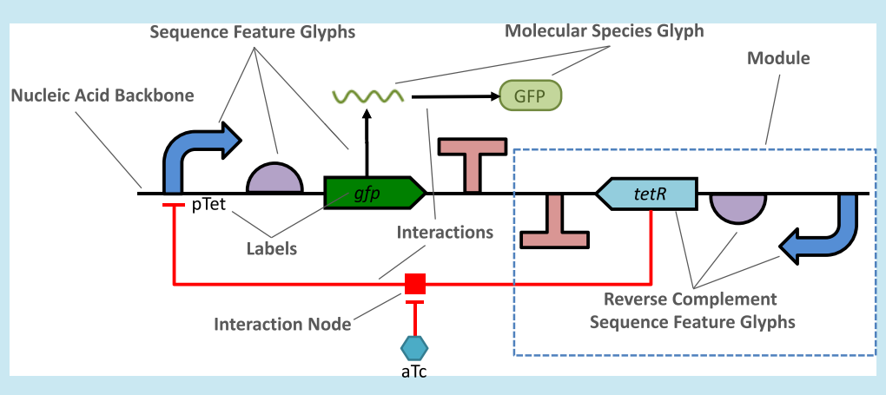
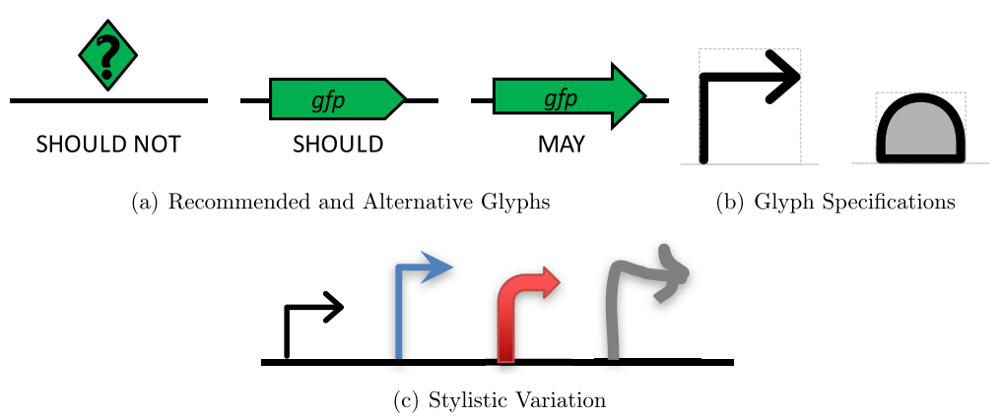
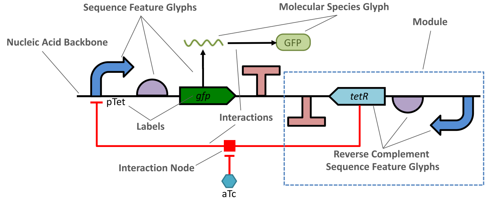
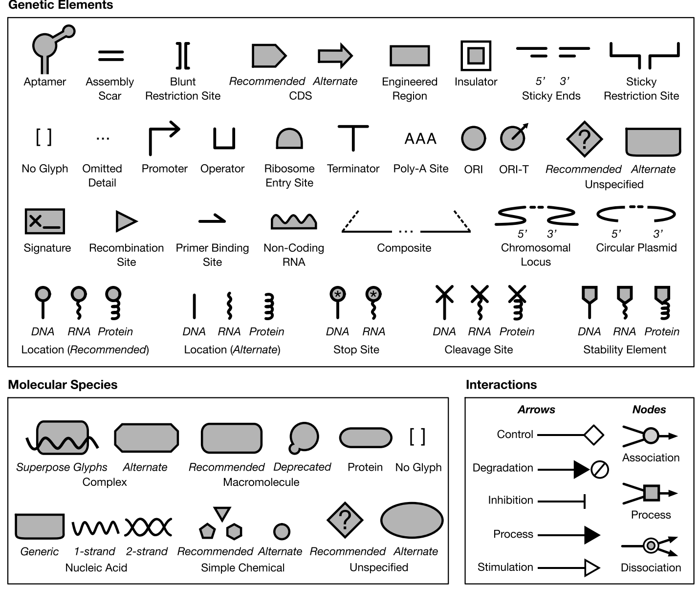
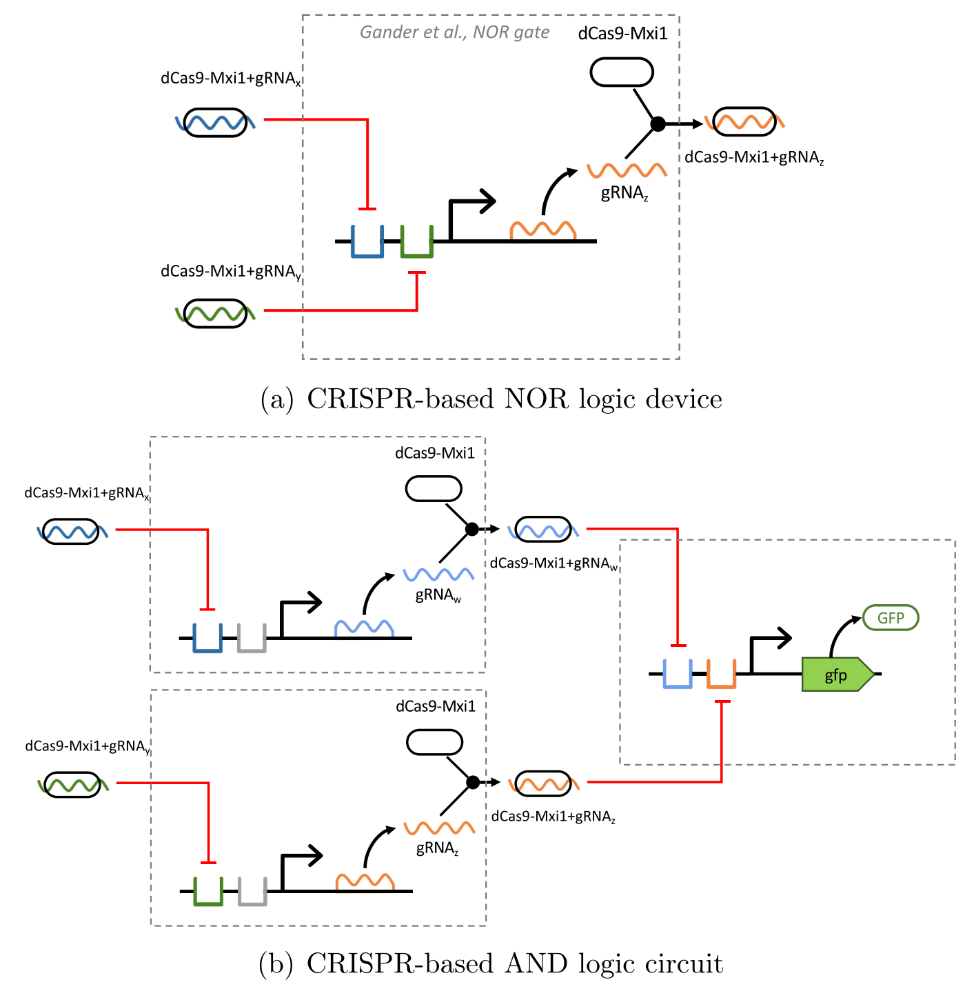
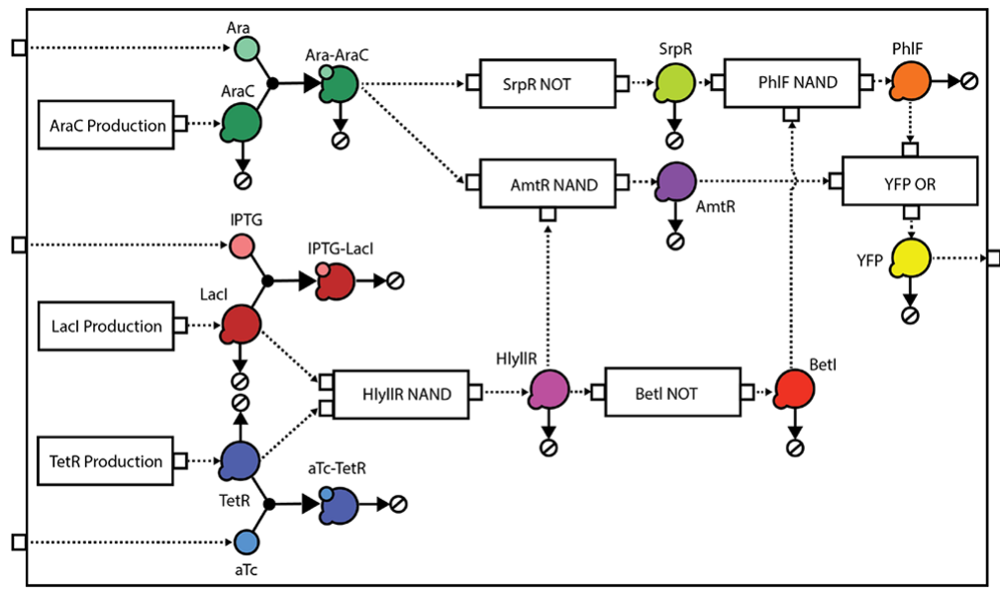
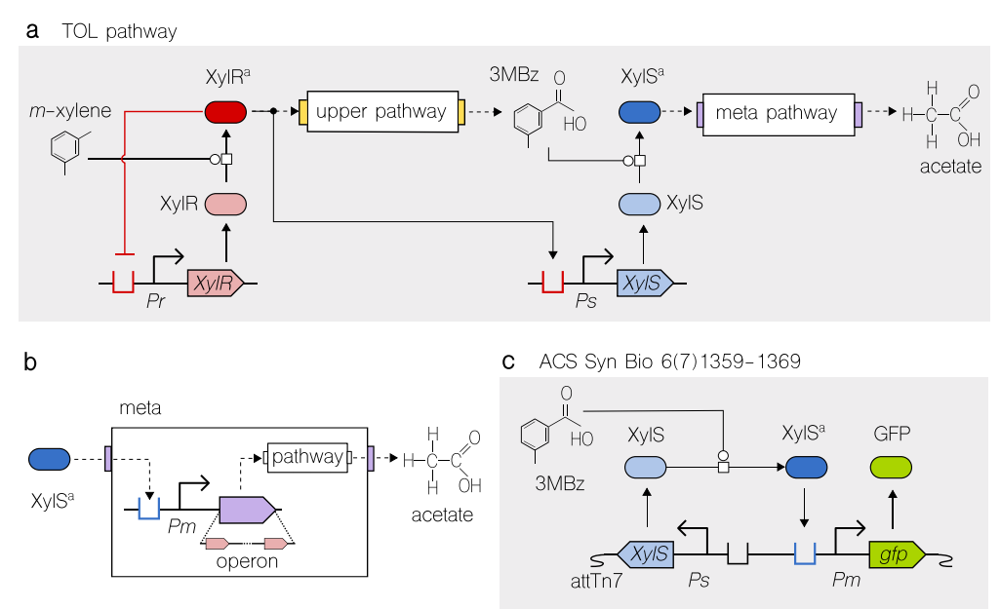
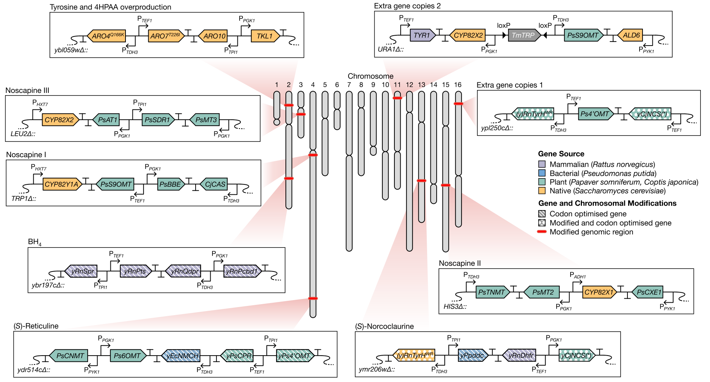

Research Article

Cite This: *ACS Synth. Biol.* 2019, 8, 1818−1825

Received: March 30, 2019; Published: July 26, 2019

DOI: 10.1021/acssynbio.9b00139

© 2019 American Chemical Society

# Communicating Structure and Function in Synthetic Biology Diagrams

Jacob Beal,\*,1,2 Tramy Nguyen,3 Thomas E. Gorochowski,4 Angel Goñi-Moreno,5 James Scott-Brown,6 James Alastair McLaughlin,5 Curtis Madsen,7 Benjamin Aleritsch,8 Bryan Bartley,2 Shyam Bhakta,9 Mike Bissell,10 Sebastian Castillo Hair,9 Kevin Clancy,1 Augustin Luna,11 Nicolas Le Novère,12 Zach Palchick,13 Matthew Pocock,14 Herbert Sauro,15 John T. Sexton,9 Jeffrey J. Tabor,9 Christopher A. Voigt,16 Zach Zundel,3 Chris Myers,3 and Anil Wipat5

1BioCoder Consulting, Carlsbad 92008, California, United States 2Raytheon BBN Technologies, Arlington, Virginia 22209, United States 3University of Utah, Salt Lake City, Utah 84112, United States 4University of Bristol, Bristol BS8 1TH, U.K. 5Newcastle University, Newcastle upon Tyne NE1 7RU, U.K. 6University of Oxford, Oxford OX1 2JD, U.K. 7Boston University, Boston, Massachusetts 02215, United States 8Technical University of Munich, 80333 München, Germany 9Rice University, Houston, Texas 77005, United States 10Amyris, Inc., Emeryville, California 94608, United States 11Harvard Medical School, Boston, Massachusetts 02115, United States 12aSciStance Ltd., Cambridge CB22 3LF, U.K. 13Zymergen, Emeryville, California 94608, United States 14Turing Ate My Hamster, Ltd., Tyne And Wear NE27 0RT, U.K. 15University of Washington, Seattle, Washington 98195, United States 16MIT, Cambridge, Massachusetts 02139, United States

ABSTRACT: Biological engineers often find it useful to communicate using diagrams. These diagrams can include information both about the structure of the nucleic acid sequences they are engineering and about the functional relationships between features of these sequences and/or other molecular species. A number of conventions and practices have begun to emerge within synthetic biology for creating such diagrams, and the Synthetic Biology Open Language Visual (SBOL Visual) has been developed as a standard to organize, systematize, and extend such conventions in order to produce a coherent visual language. Here, we describe SBOL Visual version 2, which expands previous diagram standards to include new functional interactions, categories of molecular species, support for families of glyph variants, and the ability to indicate modular structure and mappings between elements of a system. SBOL Visual 2 also clarifies a number of requirements and best practices, significantly expands the collection of glyphs available to describe genetic features, and can be readily applied using a wide variety of software tools, both general and bespoke.

KEYWORDS: synthetic biology, visualization, diagrams, Synthetic Biology Open Language

In all fields of engineering, diagrams form a key tool for communication between practitioners. Diagrams are found at every stage of a system’s development, from idea and requirements capture to refinement and realization, from analysis and debugging to deployment, operations, and maintenance. As an engineering field matures and operations become more routine, conventions often emerge and become standardized into a common language for displaying diagrams, e.g., circuit diagrams in electrical engineering1,2 or schematic plans in architecture and mechanical engineering.3,4 These shared languages for diagrams greatly simplify communication between practitioners and reduce the likelihood of mistakes and misinterpretations. They also allow the development of software tools to graphically edit designs expressed in diagrammatic form.

The engineering of biological organisms is still relatively new as a field, but its practitioners have already begun to establish conventions about how to communicate using diagrams. Accordingly, the Synthetic Biology Open Language (SBOL) community has been developing a standard diagram language, SBOL Visual, for the communication of synthetic biology designs. Prior versions of SBOL Visual5−7 have focused on a standardized collection of glyphs (also known as symbols) for expressing commonly used features of nucleic acid sequences (as well as recently proposing glyphs for protein features8), but left many aspects of diagrams unspecified and did not define representations for other classes of chemical species (e.g., functional RNAs, small molecules), or functional relations (e.g., genetic production, repression, chemical reactions). Complementary to this effort, the Systems Biology Graphical Notation (SBGN)9 and its many antecedents10−16 have provided a way to visually express the functional relationships between chemical species, but not their structure or encoding into DNA. Moreover, SBGN has strict requirements that are at times incompatible with the de facto conventions of usage adopted by many practitioners.

SBOL Visual 2 accordingly aims to provide a coherent language for expressing both the structure and the function of biological designs, by organizing, combining, and systematizing these prior works, and by incorporating emerging conventions across the field of synthetic biology.17,18 This language is designed to be simultaneously simple and easy to use—either by hand or with a wide variety of software programs—and to allow a high degree of flexibility and freedom in how practitioners choose to organize, present, and style their diagrams. Finally, the standard also supports the use of custom and novel diagram elements, as well as providing a means for the adoption of useful new elements from such diagrams into the standard.

## Results

SBOL Visual 2 provides three main advancements over the prior SBOL Visual 1 standard. First, it expands the classes of glyphs to include molecular species and their interactions, as well as allowing alternatives for glyphs and giving precise specifications for what is and is not included in the definition of a glyph. Second, it defines a language for diagrams that can incorporate both structural information (nucleic acid sequence features, molecular species), and functional information (interactions, modular structure, and mappings), as well as labels and custom annotations. Finally, it significantly expands the collection of glyphs available to a designer, including glyphs for indicating genomic context, such as integration into a plasmid or the genome of a cell. We discuss each of these in turn, followed by examples illustrating the ease of representing diverse and complex systems with SBOL Visual 2. Full details of the specification summarized here are available at http://sbolstandard.org/sbol-visual-specification/.

Glyph Specifications. SBOL Visual 1 standardized a collection of glyphs for representing nucleic acid sequence features, such as promoters, coding sequences, and terminators, each defined by association to one or more terms from the Sequence Ontology.19 In addition, SBOL Visual 2 adds two classes of glyphs, enabling diagrams to include other species and interactions between species (both of which are also largely outside of the scope of the Sequence Ontology). Molecular species glyphs represent any class of molecules whose detailed structure is not being shown (e.g., a protein, a noncoding RNA, a small molecule, etc.), and are defined by association with a term from the Systems Biology Ontology.20 Interaction glyphs, on the other hand, are “arrows” indicating functional relationships between sequence features and/or molecular species (e.g., genetic production, inhibition, degradation, etc.). These too are defined by association with a term from the Systems Biology Ontology.20

Each of these classes is also associated with a class in the SBOL 2 data model,21 enabling automatic mapping from designs to diagrams: sequence feature glyphs represent an SBOL Component in a sequence specification, molecular species glyphs represent an SBOL FunctionalComponent in a module specification, and interaction glyphs represent an SBOL Interaction in a module with defined Participation roles for the elements at the glyph’s head and tail.

Figure 1. SBOL Visual 2 glyphs (a) support alternative representations, such as this protein coding sequence, which is best represented as part of a nucleic acid sequence by the recommended glyph in the middle, but can also use the less specific Unspecified glyph (left) or alternate arrow glyph (right). These recommendations have differing degrees of importance: less specific glyphs are strongly recommended against (“SHOULD NOT”), whereas alternative glyphs are less of an issue (“MAY”). (b) Glyphs also have specifications that include a preferred relative scale for the glyph outline (solid), fill (gray), bounding box (dashed box), and recommended alignment with the nucleic acid backbone (dashed horizontal line), as in these examples of the specification for a Promoter (left) and the specification for a Ribosome Entry Site (right), and (c) can be freely varied in line and fill style, scale, and minor “font-like” customizations.

SBOL Visual 2 also acknowledges that in some cases there are good reasons to allow more than one way to represent a particular concept with a glyph. For example, although it is recommended that coding sequences be represented as a pentagonal shape pointing in the direction of the sequence, there is a large community that prefers to use a block arrow instead, as illustrated in Figure 1(a). Accordingly, SBOL Visual 2 allows glyphs to form a family of variants: one of these must be designated as “recommended” in the standard, but the alternatives may still be used whenever there is good reason for doing so. Similarly, when a feature, species, or interaction could be represented by more than one glyph, the specification recommends always using the most specific applicable glyph, but the less specific alternative may nonetheless be used instead.

While the standard continues to support broad stylistic variations, additional specification information has been added for each glyph, as illustrated in Figure 1(b). In addition to indicating the stroke outline of a glyph, each glyph’s specification must now indicate which (if any) portions of the glyph are its “interior” for purposes of color fill (removing some previous ambiguities, e.g., with respect to insulator glyphs). Sequence feature and molecular species glyphs must also include a bounding box indicating areas outside of the stroke that are still preferred to not overlap (e.g., the area underneath a promoter arrow). Sequence features also must provide a recommended alignment with the line representing the nucleic acid backbone, and all glyphs are defined as vector graphics on a standard canvas to enable determination of recommended relative scale. Counterintuitively, this additional specification information actually increases the freedom for individual stylistic choices when drawing an SBOL Visual diagram, as illustrated in Figure 1(c), because anything not explicitly defined in the standard is allowed to be varied—whereas with SBOL Visual 1 it was unclear whether some aspects of glyphs were supposed to be fixed or flexible. Furthermore, the specification now specifically defines a set of reserved visual properties—line and fill color and styling—that are specifically disallowed from being constrained by glyph specifications. Glyph scaling is also allowed to be modified to encode additional information, such the length of the corresponding sequence, and minor “font-like” customizations (such as the addition of shadows and changes to corner styling) are explicitly endorsed.

Finally, the specification provides means for defining and incorporating novel glyphs and glyph variants. There are a set of further recommended “best practices” for glyph design: in addition the requirements already described, a glyph should be easy to sketch by hand, should not risk confusion by looking similar to any other existing glyph (even when rescaled or poorly sketched), and should not contain text (to avoid confusion between glyphs and labels). Sequence features are also recommended to be asymmetric (to indicate direction) and horizontally scalable (to represent feature size or complexity). Novel glyphs can thus be created and used freely on an ad hoc basis. When one proves useful, however, it is also recommended that practitioners submit the new glyph for approval, incorporation into the standard, and dissemination throughout the community of practitioners.

Figure 2. Example illustrating the elements of an SBOL Visual 2 diagram, with nucleic acid sequence features on the forward and reverse strand of a backbone, other molecular species, interactions and interaction nodes indicating the functional relationships between various elements of the system, and a module boundary grouping together one set of elements; the gray labels and indicator lines are annotations.

Diagram Language. In addition to defining glyphs, SBOL Visual defines a language for combining these glyphs into diagrams that can be readily and consistently interpreted. An SBOL Visual 2 diagram centers around representations of nucleic acid constructs and molecular species. A diagram for a nucleic acid construct is based around a backbone line, its primary structure specified by the sequence of attached sequence feature glyphs, with strand information optionally indicated by placing a glyph above or below the backbone. Molecular species, on the other hand, are indicated by glyphs not in contact with any backbone. Interactions involving sequence features and molecular species may then be represented with a network of directed edges and nodes. Finally, any of these objects may have an associated label showing its name, may be grouped together into modules and mappings, and the diagram may further include any form of other annotations, including other uses of text. Figure 2 shows a simple example illustrating all of these types of diagram elements. As with individual glyphs, a diagram as a whole may also be associated with an SBOL 2 data class if desired (a ComponentDefinition for each nucleic acid backbone and a ModuleDefinition for any diagram including molecular species or interactions). Typically, however, the translation from data model to diagram will omit or compress significant amounts of information.

Nucleic acid backbones can be drawn using either a single or double line, with double lines being an optional means of explicitly indicating double-stranded regions of the backbone. They are typically horizontal in orientation, but can use other orientations and topologies to indicate information such as circularity or DNA nanotech structures. Capturing some common use cases, certain stylized backbone shapes have further been defined into glyphs to indicate the context of a construct, such as integration into a genomic locus or inclusion in a circular plasmid.

Sequence features are indicated with glyphs placed in contact with the nucleic acid backbone, following the vertical alignment recommendation for the glyph where possible and optionally using direction and/or inversion to represent strand information. The ordering of features on the positive (inline) strand goes from 5′ left to 3′ right, and the opposite for the negative (reverse complement) strand. Overlap between glyphs (or their bounding boxes) indicates overlap in locations, and the horizontal scaling of glyphs can be used to indicate relative size of features.

Away from backbones, molecular species glyphs represent anything whose structure is not being described in terms of sequence features. This encompasses small molecules, proteins and other macromolecules, as well as nucleic acids that are of interest but whose structure is “uninteresting” for the diagram (e.g., a transcribed mRNA that is just being shown as an intermediate product). The interactions between molecular species and/or sequence features are shown as directed edges (e.g., arrows), with the meaning of the arrow determined by its head. For diagrammatic clarity, interaction edges should not cross, but when there is no good alternative and edges must cross, they are required to use “crossover” patterns (like in electronic wiring diagrams) to clearly disambiguate which edge is which. Otherwise, crossing edges might be mistaken for arrows with multiple heads and/or tails, which are used to represent superposition (e.g., production of a protein from two different coding sequences, or a repressor acting on two different promoters). Biochemical processes, such as association, dissociation, or catalysis, are indicated by edges that come together at a node glyph, whose type indicates the type of process. Critically, these requirements enable clear distinctions between superpositions and biochemical processes, which are currently often ambiguous in system diagrams.

So far, all of these diagram elements directly represent the biochemical objects and processes of a system. Notions of engineering intention and abstraction can be represented as well, as modules represented by closed visual boundaries. Similarly, identity mappings between elements in different modules can be represented with undirected edges. Modules can be either “white box” modules that show their contents or “black box” modules that hide their contents, thereby simplifying a diagram through abstraction, and can indicate intended interactions with rectangular “ports” on the boundary, similarly to both electronics diagrams and SBGN diagrams.9

Finally, these diagrams may be freely annotated with labels—text giving the names of objects—and also any other textual or graphical annotations that are visually distinct from SBOL Visual elements and do not needlessly reinvent their functions. Notice that these requirements provide minimal constraint on how diagrams are laid out, their contents, choices of which parts are detailed and which parts simplified, etc. Moreover, most of the diagram language is either identical or close to how diagrams are already created by many practitioners. Therefore, it should be quite simple for most practitioners to create diagrams compliant with SBOL Visual 2.

Figure 3. Expanded glyph collection available in SBOL Visual 2. Note that genetic elements are shown here with their glyph and fill only, omitting bounding box and backbone alignment.

Expanded Glyph Collection. SBOL Visual 2 expands on the collection of glyphs provided by SBOL Visual 1 in three main ways: it extends the collection of glyphs representing nucleic acid sequence features, it adds a category of glyphs representing Molecular Species, and it adds a set of glyphs representing Interactions and Interaction Nodes. The full collection of current SBOL Visual 2 glyphs are shown in Figure 3.

With respect to the prior collection of sequence feature glyphs in SBOL Visual 1, one major change is that the User Defined glyph has been replaced by four separate glyphs, each representing one of the often-confused prior common usages of User Defined. The Unspecified glyph typically indicates missing information in the specification of a sequence and is thus recommended to be represented by a Unicode “replacement character” glyph (but can be alternatively represented by an SBGN half-rounded rectangle glyph for nucleic acids). No Glyph Assigned, on the other hand, is represented by brackets, suggesting information that needs to be filled in it is recommended that instead of using this glyph, users provide their own glyph, and submit it for possible adoption into the SBOL Visual standard. The third, Engineered Region, is represented by a plain rectangle that is suggestive of a blank slate to be written upon, and the fourth, Composite is drawn as a pair of dashed “expanding lines” linking any base glyph to an “inset” backbone diagramming the contents of the composite. Complementary to Composite, there is also now an Omitted Detail glyph allows users to explicitly indicate that features are not being shown with an ellipsis in a break in the backbone.

New glyphs have also been added for a number of types of biological features that were not previously represented: Aptamer (a cartoon of the secondary structure of a prototypical aptamer), Non-Coding RNA Gene (a rectangular box whose top is a single-stranded RNA “wiggle”), Origin of Transfer (a circle like the origin of replication, but with an outbound arrow), PolyA Site (a sequence of As sitting atop the backbone), and Specific Recombination Site (a triangle centered on the backbone). Two other newly introduced glyph pairs stylize the shape of a backbone to indicate that it is part of a Circular Plasmid (a C-shaped curve) or integrated into a chromosome at a Chromosomal Locus (an S-shaped curve).

A consistent framework of stem-top glyphs for indicating sites has been created that extends beyond the RNA Stability Element, Protein Stability Element, and Protease Site provided in SBOL Visual 1. In this system the top glyph indicates the type of site, and the vertical stem linking this to backbone indicates whether it affects DNA (straight line), RNA (wavy line), or protein (looped line). This system includes a DNA/RNA/protein Stability Element, for which the top glyph is a pentagon suggestive of a shield; a transcription/translation Stop Site, for which the top glyph is a circle containing an asterisk; a DNA/RNA/protein Cleavage Site, for which the top glyph is a cross suggestive of a cut; and a DNA/RNA/protein Biopolymer Location, which represents sequence features of length zero or one, and for which the top glyph is a circle suggestive of a pin stuck into a location (or, alternatively, no top at all, as in many plasmid or genomic diagrams).

Finally, a number of other small changes have been made to glyphs that previously existed in SBOL Visual 1. The most notable is that the top edge of the Operator glyph has been removed, changing it from a square to an “open cup” in order to make it asymmetrical and better distinguish it from Engineered Region. The rest of the changes address prior ambiguities in how glyphs should be positioned on the backbone, where their bounding boxes are, or which portions should be filled when the glyph is colored—all of which can now be explicitly specified.

Shifting to the new glyph classes, a new set of Molecular Species glyphs have been added to represent molecular species in a diagram. When drawn, they must not be connected to a nucleic acid backbone (or else they might be mistaken for sequence features). For each of these glyphs, the glyphs from SBGN are either used or included as alternatives to ensure compatibility with that existing standard, but the recommended glyphs have been chosen to better follow common diagrammatic practices and to be more visually distinctive. Double-Stranded Nucleic Acid is represented by a double-helix, and Single-Stranded Nucleic Acid by a single helix; alternatively, either can be represented by the half-round rectangle SBGN glyph for nucleic acids. Macromolecules are represented by the rounded rectangle SBGN macromolecule glyph (or alternately, by a diagonally offset union of a large and small circle). Proteins can be represented either using the macromolecule glyph of by the more specific protein glyph (a “pill” or “stadium” shape); there is no specific representation for proteins in SBGN, but this choice of shape is consistent with the visual protein language in ref 8. A Simple Chemical is represented either by a small polygon (e.g., triangle, pentagon, hexagon), or by a small circle, which is compatible with SBGN. A Complex is represented by a composite of the glyphs for the molecules comprising the complex (or, alternatively, the corner-cut rectangle used in SBGN). As for sequence features, No Glyph Assigned is represented by a pair of brackets, and unspecified by a Unicode “replacement character” glyph (with the elliptical SBGN “generic species” glyph as an alternative).

Several kinds of arrows are defined as Interaction Glyphs representing interactions between sequence features and/or molecular species. As with molecular species, these are all compatible with existing SBGN conventions: all are defined as either the same term or a parent term in the Systems Biology Ontology, Their names also differ from SBGN in some cases, as SBOL Visual in all cases uses the name of the associated SBO term. Specifically, a diamond arrowhead represents Control (a generic interaction, including such activities as recombinase inversion of a sequence flanked by specific recombination sites, equivalent to SBGN Modulation), an arrowhead filled with the same color as the line represents a Process (such as production of a protein from a coding sequence, a superset of SBGN Production), an arrowhead that is empty or filled with a different color to the line represents Stimulation (such as activation of a promoter by an activator protein), a bar (or “T-shaped”) arrowhead represents Inhibition (such as repression of a promoter by a repressor protein), and an arrowhead pointing at an empty-set symbol represents Degradation (such as the recycling of mRNAs),

Finally, Interaction Node glyphs represent biochemical processes, and can be drawn at the ends of Interaction Glyphs: Association or noncovalent binding is represented by a circular node; Dissociation is represented by a circular node nested inside a second circle; and a generic Process is represented by a square node. As with interaction glyphs, these three glyphs are based on corresponding glyphs from SBGN.

Examples of Usage. This section provides several examples to illustrate how SBOL Visual 2 can be used to produce clear diagrams describing a broad range of systems, all of which use consistent symbols despite being drawn in a range of distinct visual styles. All make heavy use of both structural information about nucleic acid sequences and/or other molecules of interest, as well as functional information about regulation, production, binding, decay, or other interactions of interest.

Figure 4. CRISPR/Cas9-based devices and circuits drawn using SBOL Visual 2. (a) NOR device from Gander et al.,22 in which gRNA/dCas9 complexes repress operators upstream of a promoter that regulates the production of gRNA, which in turn binds with dCas9-Mxi1 to complete implementation of a digital NOR logic device. Note the use of color coding to distinguish the x/y/z gRNAs, and the dashed module boundary identifying device inputs and outputs. (b) Interconnection of three NOR devices to implement an AND circuit from Gander et al.22 Expression of green fluorescence protein (GFP) is used as output and module boundary crossings show how devices are interconnected to form a circuit.

- CRISPR/Cas9-based circuits − Two genetic Boolean logic gates from Gander et al.,22 NOR and AND, are shown in Figure 4. Complex formation between dCas9 and various gRNAs is indicated using superposition of glyphs. Note that each gRNA variant is identified both explicitly with a textual label and implicitly with color, including a color match with its associated binding site.

Figure 5. Complex gene regulatory circuit implementing Wolfram’s Rule 30 drawn using SBOL Visual 2. Circuit taken from Nielsen et al.23 and displayed using abstract modules and ports to highlight the species interconnecting the devices and their binding and decay relationships.

- Large gene regulatory circuit − A large genetic circuit, taken from Nielsen et al.,23 is drawn in Figure 5. Genetic details are hidden within black-box modules, and only the molecular connectivity and degradations of the circuit is made explicit, showing an example of how an author can choose which details to communicate.

Figure 6. TOL metabolic and regulatory network drawn using SBOL Visual 2. (a) Structure of the TOL network of *Pseudomonas putida* with focus on the two master regulators, XylR and XylS, along with their cognate expression (Pr:XylR and Ps:XylS) and activation (m-xylene and 3MBz) systems. Modules are used to abstract away specifics of the upper and meta pathways. (b) Detail of meta pathway where the XylS′ target, promoter Pm, is explicitly drawn. Pm’s downstream operon is abstracted using a composite glyph. (c) Regulatory circuit from Goni-Moreno et al.26 inserted into the chromosome (at the attTn7 site) using components of the TOL network. For all panels, structural formulas of small molecules (i.e., m-xylene, 3MBz and acetate) do not follow SBOL Visual glyphs.

- Merged metabolic and regulatory network − Biological circuits often make use of both metabolic and regulatory nodes to process information.24,25 This is the case of the TOL network of *Pseudomonas putida*, which is drawn in Figure 6. As in previous examples, modules are used to abstract away those details that are not considered fundamental to communicate the function of the device. Note that the small molecules are not represented by SBOL Visual glyphs, allowing their chemical structures to be communicated directly. Importantly, catalytic connections are consistent with SBGN notation. The meta pathway is zoomed in (Figure 6b) to show the whereabouts of the Pm promoter, which is a crucial part of a new genetic design26 shown in Figure 6c.

Figure 7. Metabolic engineering of the yeast genome to produce noscapine and halogenated alkaloids from Li et al.27 shown using SBOL Visual 2. Source organism of each gene is denoted by color (purple: mammalian, blue: bacterial, green: plant, and orange: native) and modifications including codon optimization of coding regions shown using patterning (stripes: codon optimized, dots: modified and codon optimized).

- Genetic constructs for metabolic engineering − Figure 7 shows a large metabolic system developed by Li et al.27 The diagram demonstrates the ability to show genetic integration of constructs at nine separate modules into different chromosomal loci. Note the use of non-SBOL Visual graphics to show the chromosomal position of each locus, and use of color and shading to indicate the source of each coding sequence and whether it has been modified (e.g., codon optimization of genes).

It should be noted that across all diagrams the use of color and line style is used to communicate many different types of information, e.g., the integration of non-SBOL materials in Figure 5 and Figure 7. Note also the major differences in organization and graphical style applied across the various examples.

Finally, we note that four different standard graphics editing tools were used to produce the example figures: Microsoft PowerPoint for Figure 4, Inkscape for Figure 5, Adobe Illustrator for Figure 6, and OmniGraffle for Figure 7. Each was independently chosen by an author as their preferred illustration tool, indicating how readily SBOL Visual 2 diagrams can be created in a diverse set of tools. SBOL Visual 2 is also supported by more specialized tools for genetic circuit illustration and editing, including updated versions of DNAplotlib,28,29 VisBOL,30 and SBOLDesigner.31

## Discussion

We have shown how SBOL Visual 2 synthesizes and extends prior means of expressing both structural and functional diagrams of biological designs. The resulting language is succinct, distinct, and flexible, enabling the construction of highly lucid and readily interpretable diagrams. As SBOL Visual 2 draws on prior diagrammatic conventions wherever possible (including SBGN9), widespread adoption of SBOL Visual should be relatively simple. For individual practitioners, there is a clear benefit to adoption, improving the ease with which others can understand and build upon their work. Likewise, software tools will benefit from adoption by making it simpler for users to learn their interface and produce diagrams that can be widely understood. We also argue that journals and funding bodies should strongly consider requiring use of this standard in order to improve the clarity and impact of works that they publish or fund (see Hillson et al.32 for a step in this direction).

Anticipated future directions for evolution of the standard include continued expansion of the glyph collection and standardization of languages for proteins and functional RNA. There are also questions to be addressed regarding how to best represent overlapping features, how to diagram variants and combinatorial libraries, and refinement of the recommendations for diagramming interactions. Ultimately, however, SBOL Visual is an open standard driven by the needs and contributions of the synthetic biology community. The community maintains a public Web site at sbolstandard.org, and the SBOL Visual project is hosted publicly on GitHub at https://github.com/SynBioDex/SBOL-visual. All practitioners are encouraged to participate, whether by expressing needs or by directly involving themselves in development of the standard and its supporting instantiations and tools, in order to help ensure the standard continues to develop in ways that will best suit their needs.

## Author Information

### Corresponding Author

\*E-mail: jakebeal@ieee.org.

### ORCID

Jacob Beal: 0000-0002-1663-5102  
Tramy Nguyen: 0000-0002-8035-0259  
Bryan Bartley: 0000-0002-1597-4022  
Christopher A. Voigt: 0000-0003-0844-4776  
Zach Zundel: 0000-0003-1355-6721  
Chris Myers: 0000-0002-8762-8444  
Anil Wipat: 0000-0001-7310-4191

### Notes

The authors declare no competing financial interest.

## Acknowledgments

J.B. is supported in part by the National Science Foundation Expeditions in Computing Program Award #1522074 as part of the Living Computing Project. T.e.g. is supported by a Royal Society University Research Fellowship (grant UF160357) and BrisSynBio, a BBSRC/EPSRC Synthetic Biology Research Centre (grant BB/L01386X/1). G.-B.S. is supported by an EPSRC Fellowship for Growth in Synthetic Biology (grant EP/M002187/1). A.G.-M. is supported by the EPSRC grant SynBio3D (EP/R019002/1) and the BioRoboost contract of the European Union (EU-H2020-BIOTEC-820699). J.S.-B. acknowledges support from the EPSRC & BBSRC Centre for Doctoral Training in Synthetic Biology (EP/L016494/1) and from DSTL. H.M.S. acknowledges support from NIH grant GM123032. T.N., Z.Z., and C.J.M. are supported by the National Science Foundation under Grant No. 1522074, CCF-1748200, DBI-1356041, and DARPA FA8750-17-C-0229. J.A.M. is supported by FUJIFILM DioSynth Technologies. A.W. is supported by the Engineering and Physical Sciences Research Council (EPSRC) grants EP/N031962/1, EP/R003629/1, and EP/K039083/1. A.L. is supported by National Institute of General Medical Sciences (NIGMS) grant P41 GM103504 and National Human Genome Research Institute (NHGRI) grant U41 HG006623.

## References

(1) IEEE. (1991) IEEE Graphic Symbols for Logic Functions (Includes IEEE Std 91A-1991 Supplement, and IEEE Std 91−1984), IEEE Std. 91a-1991.

(2) IEEE. (1993) IEEE Standard American National Standard Canadian Standard Graphic Symbols for Electrical and Electronics Diagrams (Including Reference Designation Letters), IEEE Std. 315−1975 (Reaffirmed 1993).

(3) Schley, M., Buday, R., Sanders, K., and Smith, D. (1997) AIA CAD Layer Guidelines, The American Institute of Architects Press, Washington, D.C.

(4) British Standards Institution. (2007) Collaborative Production of Architectural, Engineering and Construction Information, BS 1192:2007.

(5) Quinn, J. Y., et al. (2015) SBOL Visual: A Graphical Language for Genetic Designs. *PLoS Biol.* 13, No. e1002310.

(6) Quinn, J., Beal, J., Bhatia, S., Cai, P., Chen, J., Clancy, K., Hillson, N., Galdzicki, M., Maheshwari, A., Pocock, M., Rodriguez, C., Stan, G.-B., and Endy, D. (2013) Synthetic Biology Open Language Visual (SBOL Visual), version 1.0.0.

(7) Rodriguez, C., Bartram, S., Ramasubramanian, A., and Endy, D. (2009) BBF RFC 16: Synthetic Biology Open Language Visual (SBOLv) Specification.

(8) Cox, R. S., III, McLaughlin, J. A., Grunberg, R., Beal, J., Wipat, A., and Sauro, H. M. (2017) A Visual Language for Protein Design. *ACS Synth. Biol.* 6, 1120−1123.

(9) Le Novere, N., et al. (2009) The systems biology graphical notation. *Nat. Biotechnol.* 27, 735−741.

(10) Pirson, I., Fortemaison, N., Jacobs, C., Dremier, S., Dumont, J. E., and Maenhaut, C. (2000) The visual display of regulatory information and networks. *Trends Cell Biol.* 10, 404−408.

(11) Cook, D. L., Farley, J. F., and Tapscott, S. J. (2001) A basis for a visual language for describing, archiving and analyzing functional models of complex biological systems. *Genome Biol.* 2, research0012.1.

(12) Kitano, H. (2003) A graphical notation for biochemical networks. *BIOSILICO* 1, 169−176.

(13) Kitano, H., Funahashi, A., Matsuoka, Y., and Oda, K. (2005) Using process diagrams for the graphical representation of biological networks. *Nat. Biotechnol.* 23, 961.

(14) Kohn, K. W., Aladjem, M. I., Weinstein, J. N., and Pommier, Y. (2006) Molecular interaction maps of bioregulatory networks: a general rubric for systems biology. *Mol. Biol. Cell* 17, 1−13.

(15) Moodie, S. L., Sorokin, A., Goryanin, I., and Ghazal, P. (2006) A graphical notation to describe the logical interactions of biological pathways. *J. Integr. Bioinf.* 3, 177−187.

(16) Longabaugh, W. J., Davidson, E. H., and Bolouri, H. (2009) Visualization, documentation, analysis, and communication of large-scale gene regulatory networks. *Biochim. Biophys. Acta, Gene Regul. Mech.* 1789, 363−374.

(17) Cox, R. S., et al. (2018) Synthetic Biology Open Language Visual (SBOL Visual) Version 2.0. *J. Integr. Bioinf.*, DOI: 10.1515/jib-2017-0074.

(18) Madsen, C., et al. (2019) Synthetic Biology Open Language Visual (SBOL Visual) Version 2.1. *J. Integr. Bioinf.*, DOI: 10.1515/jib-2018-0101.

(19) Eilbeck, K., Lewis, S. E., Mungall, C. J., Yandell, M., Stein, L., Durbin, R., and Ashburner, M. (2005) The Sequence Ontology: a tool for the unification of genome annotations. *Genome Biol.* 6, R44.

(20) Courtot, M., et al. (2011) Controlled vocabularies and semantics in systems biology. *Mol. Syst. Biol.* 7, 543.

(21) Madsen, C., et al. (2019) Synthetic Biology Open Language (SBOL) Version 2.3. *J. Integr. Bioinf.*, DOI: 10.1515/jib-2019-0025.

(22) Gander, M. W., Vrana, J. D., Voje, W. E., Carothers, J. M., and Klavins, E. (2017) Digital logic circuits in yeast with CRISPR-dCas9 NOR gates. *Nat. Commun.* 8, 15459.

(23) Nielsen, A. A., Der, B. S., Shin, J., Vaidyanathan, P., Paralanov, V., Strychalski, E. A., Ross, D., Densmore, D., and Voigt, C. A. (2016) Genetic circuit design automation. *Science* 352, aac7341.

(24) Chavarría, M., Goñi-Moreno, Á., de Lorenzo, V., and Nikel, P. I. (2016) A metabolic widget adjusts the phosphoenolpyruvate-dependent fructose influx in *Pseudomonas putida*. *mSystems* 1, e00154-16.

(25) Goni-Moreno, A., and Nikel, P. I. (2019) High-Performance Biocomputing in Synthetic Biology−Integrated Transcriptional and Metabolic circuits. *Front. Bioeng. Biotechnol.* 7, 40.

(26) Goni-Moreno, A., Benedetti, I., Kim, J., and de Lorenzo, V. (2017) Deconvolution of gene expression noise into spatial dynamics of transcription factor−promoter interplay. *ACS Synth. Biol.* 6, 1359−1369.

(27) Li, Y., Li, S., Thodey, K., Trenchard, I., Cravens, A., and Smolke, C. D. (2018) Complete biosynthesis of noscapine and halogenated alkaloids in yeast. *Proc. Natl. Acad. Sci. U. S. A.* 115, E3922−E3931.

(28) Bartoli, V., Dixon, D. O. R., and Gorochowski, T. E. (2018) In *Synthetic Biology: Methods and Protocols* (Braman, J. C., Ed.) pp 399−409, Springer, New York, NY.

(29) Der, B. S., Glassey, E., Bartley, B. A., Enghuus, C., Goodman, D. B., Gordon, D. B., Voigt, C. A., and Gorochowski, T. E. (2017) DNAplotlib: Programmable Visualization of Genetic Designs and Associated Data. *ACS Synth. Biol.* 6, 1115−1119.

(30) McLaughlin, J. A., Pocock, M., Mısırlı, G., Madsen, C., and Wipat, A. (2016) VisBOL: web-based tools for synthetic biology design visualization. *ACS Synth. Biol.* 5, 874−876.

(31) Zhang, M., McLaughlin, J. A., Wipat, A., and Myers, C. J. (2017) SBOLDesigner 2: an intuitive tool for structural genetic design. *ACS Synth. Biol.* 6, 1150−1160.

(32) Hillson, N. J., Plahar, H. A., Beal, J., and Prithviraj, R. (2016) Improving Synthetic Biology Communication: Recommended Practices for Visual Depiction and Digital Submission of Genetic Designs. *ACS Synth. Biol.* 5, 449−451.
