Mechanical Properties Determination of DMPC, DPPC, DSPC, and HSPC Solid-Ordered Bilayers

This is an open access article published under a Creative Commons Attribution (CC-BY) License, which permits unrestricted use, distribution and reproduction in any medium, provided the author and source are cited.

Langmuir · pubs.acs.org/Langmuir · Article

# Mechanical Properties Determination of DMPC, DPPC, DSPC, and HSPC Solid-Ordered Bilayers

Dominik Drabik,\* Grzegorz Chodaczek, Sebastian Kraszewski, and Marek Langner

Cite This: *Langmuir* 2020, 36, 3826−3835 · <https://dx.doi.org/10.1021/acs.langmuir.0c00475>

Received: February 19, 2020 · Revised: March 10, 2020 · Published: March 16, 2020

© 2020 American Chemical Society

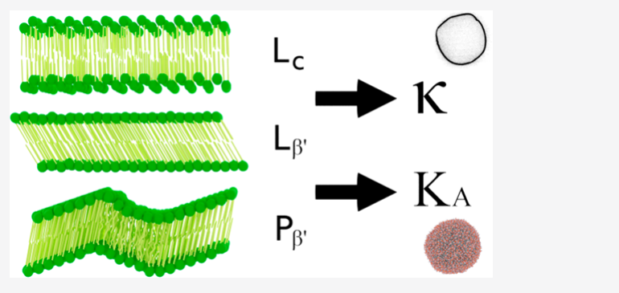

ABSTRACT: Lipid bilayers are active participants in many crucial biological processes. They can be observed in different phases, liquid and solid, respectively. The liquid phase is predominant in biological systems. The solid phase, both crystalline and gel phases, is under investigation due to its resilience to mechanical stress and tight packing of lipids. The mechanical properties of lipids affect their dynamics, therefore influencing the transformation of cell plasma and the endomembrane. Mechanical properties of lipid bilayers are also an important parameter in the design and production of supramolecular lipid-based drug delivery systems. To this end, in this work, we focused on investigating the effect of solid phases of lipid bilayers on their structural parameters and mechanical properties using theoretical molecular dynamics studies on atomistic models of whole vesicles. Those include area per lipid, membrane thickness, density vesicle profiles, bending rigidity coefficient, and area compressibility. Additionally, the bending rigidity coefficient was measured using the flicker noise spectroscopy. The two approaches produced very similar and consistent results. We showed that, contrary to our expectations, bending rigidity coefficients of solid-ordered bilayers for vesicles decreased with an increase in lipid transition temperature. This tendency was reverse in planar systems. Additionally, we have observed an increase of membrane thickness and area compressibility and a decrease of area per lipid. We hope these results will provide valuable mechanical insight for the behavior in solid phases and differences between spherical and planar confirmations.

## Introduction

Over past few years, lipids have been acknowledged as diverse active participants in many biological processes rather than being simple building blocks of cells components.1 Lipids and their aggregates, apart from their barrier function, participate in metabolic processes, cytoplasm compartmentalization, and the formation of a dynamic infrastructure for the rearrangement of aqueous compartments. In the fluid mosaic membrane model, disordered bilayers are built by freely moving lipids subject to lateral diffusion. While the model is an effective tool for understanding molecular-level processes, it is unable to rationalize lipid bilayer properties. This is especially relevant in cell physiology, where the occurrence of local defects, the size, and both mechanical and electrostatic properties are necessary for ensuring local molecular homeostasis.2 The other important feature of the biological membrane is its heterogeneity with respect to lipid composition and physicochemical properties. This gave rise to the membrane raft concept, also sometimes referred to as microdomains. They differ from the surrounding lipid matrix with respect to lipid composition and molecular packing.3 Furthermore, individual lipid mobility and collective lipid dynamics (i.e., the packing structure and organization) depend on the activity of the surrounding water.4 The effect of microdomains on the mechanical properties has not been thoroughly investigated.5 The mechanics of heterogeneous lipid bilayers can be simplified by the investigation of homogeneous lipid bilayers with different lipid dynamics and different hydrocarbon chain lengths. Typically, there are four states in which the bilayer can be in the crystalline phase, gel phase (together referred to as solid phase), ripple phase, and liquid phase. When the cell membrane is fully hydrated, it is predominantly in the liquid phase. However, it transitions into the gel phase with a reduction in temperature below the so-called main transition temperature (\(T\_\mathrm{m}\)).6 The gel phase is mostly observed in long and saturated fatty acid chains. In that phase, the lipid head groups are very tightly packed; the lipid acyl chains become straighter and ordered, and the bilayer thickness increases.7 The lipid bilayer formed from lipids, whose phase is well-defined at a specific temperature, is a convenient experimental model. For instance, the coexistence of gel and fluid phases has been demonstrated on membranes formed from the mixture of lipids with different \(T\_\mathrm{m}\)'s. Such cases were reported for DMPC (1,2-dimyristoyl-*sn*-glycero-3-phosphocholine)−DSPC (1,2-distearoyl-*sn*-glycero-3-phosphocholine), 20:0 DMPC−PC (phosphocholine), and DMPC−DPPC (1,2-dipalmitoyl-*sn*-glycero-3-phosphocholine) mixtures using quick-freeze differential scanning calorimetry8 as well as for different two-component mixtures of DSPC, DLPC, DMPC, or DAPC using model simulations.9 From a biological perspective, the membrane is formed from lipids that are mostly unsaturated, and organisms adapt their fatty acid composition to the environment to prevent the formation of solid phases. Despite detecting solid phases in very specific cases of biological membranes like the myelin sheath or stratum corneum,10 where it is required to form a mechanically resistant lipid barrier, it is generally considered that they do not occur in biological membranes.11 The lipid bilayer mechanics is also a very significant property for the design of the targeted delivery system. It has been demonstrated that endocytosis depends on the nanoparticle stiffness and shape.12 The drug carrier mechanics is also important for its stability in serum, specifically by protecting it from undesired interactions such as the interaction with lipoproteins (which are known to interact with lipids and to induce structural changes) and/or blood key proteins.13

In this Article, we have focused on mechanical properties of solid phase bilayers as a means to provide information about their behavior. From a general mechanical point of view, lipid systems possess a peculiar combination of elastic properties. The stretching elasticity of the lipid bilayer is described by the area compressibility modulus (\(K\_\mathrm{A}\); N/m). It is understood that energy is necessary to stretch the bilayer into a direction perpendicular to the bilayer itself. The shear elasticity of the lipid bilayer is understood as the shear between individual lipid molecules. It is negligible in liquid-ordered phases but significant for crystallized membranes. However, the ability to bend under very low stress, the bending elasticity, is perhaps the most interesting one of the mechanical properties.14 This ability is described by bending elasticity, \(\kappa\). It is very challenging to measure this parameter as its value is very small (on the order of 10−19−10−20 J). Due to the pioneering work of Helfrich,15 the membrane thermal flickering phenomenon was initially observed in red blood cell membranes.16 This discovery sparked a significant number of studies involving membrane mechanics and allowed for different approaches to determine the bending elasticity in membrane systems.5 In this work, we have used two different techniques to determine the mechanical properties of the investigated bilayers. These bilayers consist of lipids with \(T\_\mathrm{m}\) higher than the ambient temperature often used in experimental measurements. We selected four such lipids: DMPC, DPPC, DSPC, and an HSPC (L-α-phosphatidylcholine, mixture of 11.4% DPPC and 88.6% DSPC) mixture. The measuring temperature in the experiments and simulations was selected at 295 K (22 °C). As a result, each of the investigated bilayers are measured in different solid phases. The DMPC bilayer is only 2 K below the transition temperature (\(T\_\mathrm{m}\) = 297 K) but, at the same time, higher than both subtransition and pretransition temperatures (287 and 289 K, respectively), which results in a rippled Pβ′ gel phase. In the rippled phase, the regions in the gel phases are separated by liquid phases.17 The DPPC bilayer is measured below its transition and pretransition temperatures (314 and 307 K, respectively) but higher than its subtransition temperature (294 K), which results in the Lβ′ gel phase. The DSPC bilayer is measured below the subtransition, pretransition, and transition temperatures (301, 324, and 328 K, respectively), which results in either an Lc stable crystalline phase or a metastable phase transitioning into it. The HSPC bilayer is a mixture of 11.4% DPPC and 88.6% DSPC, which means that there are two fractions, one of them being in the crystalline/metastable phase and the second one in the gel phase.6,18 First, we used an experimental flicker noise spectroscopy, a measuring technique that links spontaneous bilayer fluctuations with its mechanical properties. The second technique was molecular dynamics (MD) simulations of small unilamellar vesicles. Due to its nature, it allows great insight into vesicle dynamics. To our knowledge, this is the first approach to measure an HSPC mixture using two different techniques.

## Experimental Methods and Procedures

### Materials

Lipids DMPC (1,2-dimyristoyl-*sn*-glycero-3-phosphocholine), DSPC (1,2-distearoyl-*sn*-glycero-3-phosphocholine), DPPC (1,2-dipalmitoyl-*sn*-glycero-3-phosphocholine), and HSPC (L-α-phosphatidylcholine, mixture of 11.4% DPPC and 88.6% DSPC) were purchased from Avanti Polar Lipids (USA). The fluorescent probe Atto488-DOPE was purchased from Atto-Tech (Germany).

### Preparation of Giant Unilamellar Vesicles (GUVs)

A modified electroformation method was used to model the formation of lipid membranes.19 Briefly, 20 μL of the chosen lipid in chloroform (3 mM) was deposited in small quantities (as 2 μL droplets) onto platinum electrodes. Two electrodes were set parallel to one another at a distance of 5 mm. The electrodes were kept for 1 h under reduced pressure to remove traces of organic solvents. Next, the electrodes were immersed in preheated pure aqueous solution. As we recently demonstrated,20 a sufficient electroformation protocol consists of 4 h of electroformation with a 1 Hz AC electrical field applied in an electroformation chamber with the electrical field voltage set to 1 V for the first hour, 2 V for the second hour, 3 V for the third hour, and finally 4 V for the remaining time of the electroformation. In order to obtain GUVs from the investigated lipids, the temperature of the solvent was set at least 20 °C above the transition phase temperature of the investigated lipids (for example, it was 80 °C for HSPC). To this end, a custom glass electroformation chamber similar in design to thermal glasses combined with a heated bath (Lab. Companion RW-0525G, Poland) was used. After electroformation, the sample was left at the elevated temperature for an additional hour without the electrical field applied to allow the descent of the vesicles from the electrodes. Finally, the solution with GUVs was transferred to an unheated glass vial to induce a free decrease of solvent temperature to room temperature.

### Acquisition and Assessment of Microscopic Images

The Cell Observer SD spinning disk confocal microscope (Zeiss, Germany) was used for vesicle recording. It was equipped with an α Plan-Apochromat 100×/1.46 oil immersion objective (Zeiss, Germany). 512 × 512 pixel images were recorded with an EMCCD camera (iXon3885, Andor, UK) using 2 × 2 binning with a 0.133 μm pixel size at a rate of 33 frames per second (fps) with a video integration time of 30 ms. At least 5000 images were recorded for each of the vesicles. Samples were illuminated with a 488 nm laser, and emitted light passed through the 527/54 filter. All samples were measured at 22 ± 1 °C (295 K). All measurements have been performed in a dedicated PTFE observation chamber with very limited height (equal to 300 μm) to reduce the effect of uncontrolled vesicle movements. The value of depth of focus was equal to 0.85 μm. To improve further quality of the analysis, the radius of the vesicle was calculated for each image, and when the fluctuations of the radius were unacceptable, as a result of misdetection caused by noise or other reasons described in previous work,19 the image in the series was discarded from further analysis.

### Flicker Noise Spectroscopy Analysis

The flicker noise spectroscopy technique is based on the analysis of vesicle shape fluctuations over time. In short, a membrane fluctuation spectrum was extracted from every single recorded image of the same lipid vesicle. This was performed using custom software.19 To calculate the bending rigidity coefficient from a set of time-lapsed images, a correlation between the two-dimensional fluctuations and three-dimensional membrane elasticity model was established. This was achieved by calculating the angular autocorrelation function \(\xi(\gamma, t)\) defined by eq 1. The cross-sectional radius \(\rho(\Phi, t)\) is the position of the vesicle bilayer at a given angle \(\Phi\) and time \(t\); \(\overline{\rho}(t)\) is an averaged vesicle radius of a given image recorded at time \(t\) using eq 2. \(R = \langle\overline{\rho}(t)\rangle\) is the vesicle radius.

$$\xi(\gamma, t) = \frac{1}{2\pi^2 R^2} \int\_0^{2\pi} [\rho(\phi + \gamma, t) - \overline{\rho}(t)] \times [\rho(\phi, t) - \overline{\rho}(t)]\, \mathrm{d}\phi$$

(1)

$$\overline{\rho}(t) = \frac{1}{4\pi} \sum\_{i=1}^{N} (\rho\_i + \rho\_{i+1}) \times (\phi\_{i+1} - \phi\_i)$$

(2)

The bending rigidity coefficient can be determined using two approaches, the statistical approach19,21 and the averaged-based approach (AVB),19,22 respectively. In the first one, autocorrelation curves are decomposed as cosine components of Fourier series. Since curves are even functions, sine components were not calculated. The amplitudes of cosine functions for each frame of a given mode \(m\), \(\chi^m(t)\), were next histogrammed and fitted by monoexponential distributions \(\Gamma^m(\chi^m)\) according to eq 3.

$$\Gamma^m = a \times \exp\left(-R^m\left(\frac{\kappa}{kT}, \bar{\sigma}\right) \times \frac{\chi^m}{2}\right)$$

(3)

The monoexponential character of the distribution indicates that the model adequately describes the thermal fluctuations of the membrane. To bridge the bending rigidity coefficient with the obtained distributions, the decays were fitted using the monoexponential function for \(\Gamma^m\) ranging from 0.6 to 0.08. Higher values are omitted due to the low probability of the occurrence, while lower values were omitted due to being too close to the resolution limit. The uncertainty of the \(\Gamma^m\) value was calculated according to eq 4.

$$\Delta\Gamma^m = \frac{R^m}{\sqrt{N}} \times \sqrt{\sum\_i \left(\ln\!\left[\Gamma^m\!\left(\frac{\chi\_i^m}{2}\right)\right] - \ln(a) + R^m \times \frac{\chi\_i^m}{2}\right)^2}$$

(4)

The bending rigidity coefficient can be determined by fitting eq 5 to the experimentally determined \(\Gamma^m\) values, where \(\sigma\_\mathrm{wh}\) is related to white noise generated by the limited optical resolution of the microscope and the electronic noise generated by the camera. \(\mathcal{P}\_n^m\) is the normalized Legendre polynomial, and \(\lambda\_n(\bar{\sigma})\) is the function related to the reduced membrane tension (\(\bar{\sigma}\)) defined by eq 6.

$$R^m\!\left(\frac{\kappa}{kT}, \bar{\sigma}, \sigma\_{\mathrm{wh}}\right) = \frac{1}{\dfrac{\kappa}{kT}\left(\sum\_{n \geq m}^{n\_{\max}} \dfrac{[\mathcal{P}\_n^m(0)]^2}{\lambda\_n(\bar{\sigma})}\right) + \sigma\_{\mathrm{wh}}^{\,2}}$$

(5)

$$\lambda\_n(\bar{\sigma}) = (n+1)(n+2)[\bar{\sigma} + n(n+1)]$$

(6)

In the average-based approach, angular autocorrelation curves (eq 1) are decomposed in the Legendre polynomial series. The decomposition is described by eq 7, where \(B\_n(t)\) with physical meaning (only positive values) is averaged over the position to obtain \(\langle B\_n \rangle\). Obtained \(\langle B\_n \rangle\) values are then plotted as a function of fluctuation mode number, and the bending rigidity coefficient is determined (eq 8). In the equation, \(k\_\mathrm{B}\) is the Boltzmann constant.

$$\xi(\gamma, t) = \langle B\_0 \rangle \times P\_0(\cos\gamma) + \sum\_{n=2}^{n\_{\max}} B\_n(t) \times P\_n(\cos\gamma)$$

(7)

$$\langle B\_n \rangle \cong B\_n(\kappa, \bar{\sigma}) = \frac{2n+1}{4\pi} \times \frac{k\_{\mathrm{B}} T}{\kappa(n+2)(n-1)[\bar{\sigma} + n(n+1)]} \quad \text{for } n > 1$$

(8)

### Molecular Dynamics Simulations

The full-atomistic molecular dynamics simulations were performed using NAMD 2.923 software with CHARMM36 united-atom force field24 under NPT conditions (constant: number of particles, pressure, and temperature). The bending rigidity coefficient and area compressibility were determined for POPC, DMPC, DSPC, DPPC, and HSPC lipid vesicles. Each of the vesicles was modeled separately as a liposome with a 10 nm radius, and both sides were hydrated with TIP3P water molecules, giving a final simulation box of 30 nm3. Three dimensional periodic boundary conditions were applied in order to deal with potential energy disruption due to the origin cell discontinuity. The vesicle system was created using a custom script in MATLAB. The starting area per lipid (APL) value was chosen to be 65.7 Å2 for DPPC, 70 Å2 for DMPC, 68.1 Å2 for POPC, and 63.8 Å2 for DSPC on average, respectively.25 The APL was corrected to account for the effect of the vesicle's curvature by multiplying the APL value by 0.95 and 1.05 for inner and outer leaflets, respectively. This correction is a result of conclusions drawn by Braun and Sachs.26 Vesicle systems, after the standard equilibration procedure, were subjected to at least the 10 ns production run and then analyzed. In order to determine a stable time point of equilibration, six selected parameters (mean values and standard deviations of both inner and outer leaflets, vesicle radius, and the thickness of the lipid bilayer) were continuously monitored. This was followed by determination of the order parameter drift. More detailed information regarding the setup of the systems and their properties are presented in Section 1 of the Supporting Information. Additionally, planar bilayers were simulated under the same conditions with 648 lipid molecules and a hydration level of 20 Å for comparison (details are presented in Section 4 of the Supporting Information).

### Determination of Bending Rigidity Coefficient in MD

The bending rigidity of model lipid vesicles was determined according to the algorithm developed by Braun and Sachs.26 It has an advantage over other approaches,27 as it determines mechanical properties based on fluctuations of the bilayer within the vesicle. In short, each lipid is described by a vector spreading from the head (phosphorus atom) up to the tail position (midpoint of both 16th carbon atoms in each of the tails). This is followed by discrete surface representation \(\theta, \varphi\) using a grid. For each time point, the surface of the fluctuations is established by the detection of the origin point of the fitted sphere, the conversion of the bilayer fluctuations into spherical coordinates, and the subtraction of the radius value. Finally, the average of both the inner and outer leaflet fluctuations is calculated. This is followed by spectral harmonics analysis (SPHA) for calculated fluctuations \(f(\theta,\varphi)\). The fluctuations are represented as a linear combination of spherical harmonics with degree \(l\) and order \(m\). Eventually, Helfrich's approach can be employed as described by eq 9, where \(a\_{lm}\) is the spherical harmonic coefficient and \(Y\_{lm}\) is the spherical harmonic basis function described by eq 10. The term \(\tilde{P}\_l^m\) defines the fully normalized associated Legendre polynomials.

$$f(\theta, \varphi) = \sum\_{l,m} a\_{lm} Y\_{lm}$$

(9)

$$Y\_{lm} = \tilde{P}\_l^m(\cos\theta)\, e^{im\varphi}$$

(10)

In order to determine the values of the spherical harmonic coefficient, inverse transformation is used. To this end, matrix **P** for a given \(\theta, \varphi\) distribution is generated, as presented in eq 11, where \(l\_i \in 0, \ldots, l\_\mathrm{max}\), from which the matrix **Y** can be written as the spherical harmonic forward transformation (eq 12). In this equation, \(a\_{lm}^{l}\) is a recasting of spherical harmonic coefficients \(a\_{lm}\) with dimensions corresponding to the row construction of **Y**, and \(f\_{\theta,\varphi}^{l}\) is the matrix of the bilayer position.

$$\mathbf{P}\_{l\_i}^{m} = \left[\begin{pmatrix} \tilde{P}\_0^{m}(\cos\theta\_1) & \cdots & \tilde{P}\_{l\_i}^{m}(\cos\theta\_1) \\ \vdots & \ddots & \vdots \\ \tilde{P}\_0^{m}(\cos\theta\_N) & \cdots & \tilde{P}\_{l\_i}^{m}(\cos\theta\_N) \end{pmatrix}\right]^{T}$$

(11)

$$\mathbf{Y} a\_{lm}^{l} = f\_{\theta,\varphi}^{l}$$

(12)

In order to calculate the inverse transformation (eq 13), the FACTORIZE package28 in MATLAB was used. This allowed one to compute the approximation of the pseudoinverse of **Y** and apply it to determine \(a\_{lm}^{l}\).

$$\mathbf{Y}^{-1} f\_{\theta,\varphi}^{l} = a\_{lm}^{l}$$

(13)

From \(a\_{lm}^{l}\), the undulation power spectrum can be obtained by the binning modulus of the spherical harmonic coefficients across degree \(l\). The resulting profile can be interpreted according to the Helfrich continuum model for undulations on a sphere with vanishing spontaneous curvature (eq 14), where \(T\) is temperature and \(k\_\mathrm{B}\) is the Boltzmann constant.

$$|a\_{lm}|^{2} = \frac{k\_{\mathrm{B}} T}{\kappa[l^{2}(l+1)^{2} - 2l(l+1)]}$$

(14)

### Determination of Basic Structural Parameters

Additional structural parameters were determined from MD simulations. Those include membrane thickness (MT), area per lipid (APL), and vesicle density profiles. For each frame, a sphere fit to the phosphorus atoms in the inner leaflet and in the outer leaflet and to all phosphorus atoms was done in order to obtain the radius for the inner leaflet, for the outer leaflet, and for the whole vesicle, respectively. MT was calculated as a difference between the radius of the outer and inner layers. APL, for the whole vesicle and each of the leaflets separately, was calculated according to eqs 15−17 as proposed by Braun and Sachs.26

$$\mathrm{ALP}\_{\mathrm{vesicle}} = \frac{4\pi r\_{\mathrm{vesicle}}^{2}}{\frac{1}{2}(n\_{L,\mathrm{inner}} + n\_{L,\mathrm{outer}})}$$

(15)

$$\mathrm{APL}\_{\mathrm{inner}} = \frac{4\pi r\_{\mathrm{inner}}^{2}}{n\_{L,\mathrm{inner}}}$$

(16)

$$\mathrm{APL}\_{\mathrm{outer}} = \frac{4\pi r\_{\mathrm{outer}}^{2}}{n\_{L,\mathrm{outer}}}$$

(17)

In order to determine the density vesicle profiles, three crucial zones of each vesicle in the lipid molecule particles were distinguished: headgroups, carbonyl−glycerol, and acyl chains. The vesicle center of mass is established with respect to all lipid molecule particles, which is followed by calculating the distance between particles and the established center of mass. This was done for at least the 100 last frames of the system. Eventually, the positions of the particles were histogrammed and fitted with a normal distribution.

### Determination of Area Compressibility in Molecular Dynamics

In order to determine area compressibility (\(K\_\mathrm{A}\)), a method by Waheed and Edholm was used.29 It allows one to separate the contributions from area fluctuations and undulations. First, the apparent area compressibility is calculated using eq 18, where \(A\) is the area of the system (calculated from the radius of the vesicle) and \(\langle\delta A^{2}\rangle\) is its mean square displacement.

$$K\_{\mathrm{A}}^{\mathrm{app}} = \frac{A \times k\_{\mathrm{B}} T}{\langle \delta A^{2} \rangle}$$

(18)

Undulations and area changes in the curved surface occur independently of each other. The true value of area compressibility is determined using eq 19 for systems with low surface tension and eq 20 for systems with high surface tension.

$$\frac{1}{K\_{\mathrm{A}}^{\mathrm{true}}} = \frac{1}{K\_{\mathrm{A}}^{\mathrm{app}}} - \frac{A \times k\_{\mathrm{B}} T}{32\pi^{3} \kappa^{2}}$$

(19)

$$\frac{1}{K\_{\mathrm{A}}^{\mathrm{true}}} = \frac{1}{K\_{\mathrm{A}}^{\mathrm{app}}} - \frac{A \times k\_{\mathrm{B}} T}{16.6\pi^{3} \kappa^{2}}$$

(20)

## Results and Discussion

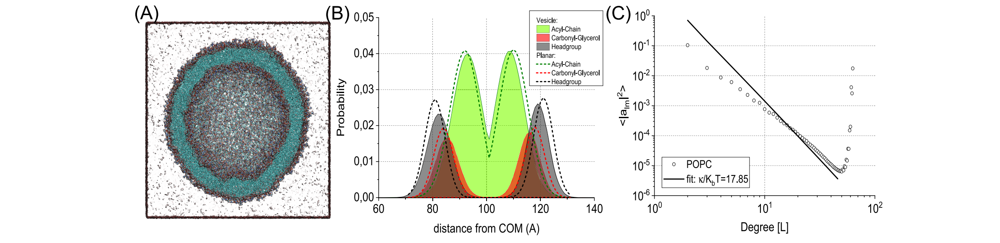

Figure 1. Molecular dynamics simulations of POPC membrane systems at 295 K. (A) A snapshot of the POPC vesicle cross-section in the water box. (B) Comparison of bilayer profiles for the POPC vesicle and the POPC planar system. (C) Undulation power spectra for the POPC vesicle system with the corresponding bending rigidity fit.

### Validation of the Numerical Approach

In order to verify whether the numerical approach was correctly adapted, a well-characterized POPC lipid bilayer (TT = −2 °C, Figure 1A) was used as a reference.5 The simulation system was equilibrated for 98 ns followed by an analysis time of 65 ns. Calculated membrane thickness (MT) was equal to 3.425 ± 0.008 nm. This result is slightly larger than in NMR experimental work, where it was equal to 3.0530 or 2.98 nm.31 On the other hand, the result was smaller than the membrane thickness (MT) obtained by X-ray scattering, which was equal to 3.9 ± 0.1 nm.25 The calculated value of MT is also slightly smaller than the results from the MD studies of planar lipid bilayers ranging from 3.832 to 3.95 nm.33 Since the result is within the range of reported values, it is considered correctly calculated.

The calculated area per lipid (APL) was equal to 57.7 ± 0.1 Å2 in the inner leaflet and 65.4 ± 0.1 Å2 in the outer leaflet. The APL calculated for the whole vesicle was equal to 61.4 ± 0.1 Å2. Similar results were reported in the literature 40−65 Å2.27a,34

The calculated vesicle density profile is presented in Figure 1B. For comparison, a profile calculated from the planar lipid bilayer is also included in the plot. While positions of the peaks representing membrane regions are similar for both systems, the distributions are different. In the planar system, the distributions are broader than these calculated for a vesicle. This indicates a higher mobility of lipids in a model system characterized by a lower curvature. This can be easily observed by looking at the peak of the carbonyl−glycerol groups (red dashed curve and red area in Figure 1B). In most experimental techniques, lipid vesicles are used as a model, for instance, to determine MT. Quantitative values of structural parameters calculated using the presented simulation model of the POPC vesicle are in good agreement with experimental data and simulations presented by others.

Finally, the bending rigidity was calculated and was equal to 7.40 × 10−20 J (which corresponds to 17.85κ/kBT as shown in Figure 1C). This result is in good agreement with the bending rigidities obtained from other molecular dynamics studies.27a,34 It was also within the limits of the reported experimental value based on the number of vesicles (N = 10) and equal to (10.5 ± 5.8) × 10−20 J.19 Calculated area compressibility (\(K\_\mathrm{A}\)) was equal to 0.23 N/m. Again, determined values for the vesicle model were in excellent agreement with other computational (0.24−0.28 N/m)35 and experimental studies (0.18−0.33 N/m).36 In summary, the presented computational approach delivers structural and mechanical data for the POPC (liquid) lipid bilayer, which is in good agreement with the results presented by others. Next, the computational approach combined with the experimental studies will be employed to characterize lipid bilayers in solid phases.

### Basic Structural Properties

**Table 1.** Summary of Calculated Parameters from a Molecular Dynamics (MD) Study and Flicker Noise Spectroscopy Measurements for Gel Phase Lipid Vesiclesa

| lipid type | membrane thickness [nm] | APL of vesicle [Å2] | APL of inner membrane [Å2] | APL of outer membrane [Å2] | κ (MD vesicle) [J] | κ (flicker, AVB) [J] | κ (flicker, SA) [J] | KA (MD) [N/m] | κ (MD, planar) [J] |
| --- | --- | --- | --- | --- | --- | --- | --- | --- | --- |
| POPC | (3.425 ± 0.0088) | (61.4 ± 0.1) | (57.7 ± 0.1) | (65.4 ± 0.1) | 7.40 × 10−20 | (10.5 ± 2.2) × 10−20 | (12 ± 7) × 10−20 | 0.23 | (10.8 ± 0.3) × 10−20 |
| DMPC | (3.140 ± 0.007) | (60.5 ± 0.1) | (72.1 ± 0.1) | (56.3 ± 0.1) | 7.22 × 10−20 | (5.3 ± 2.2) × 10−20 | (6.0 ± 2.0) × 10−20 | 0.25 | (11.7 ± 0.4) × 10−20 |
| DPPC | (4.059 ± 0.003) | (45.6 ± 0.1) | (47.2 ± 0.1) | (46.8 ± 0.1) | 4.28 × 10−20 | (5.0 ± 3.3) × 10−20 | (5.3 ± 3.0) × 10−20 | 0.31 | (23 ± 1) × 10−20 |
| DSPC | (4.297 ± 0.004) | (46.8 ± 0.1) | (47.4 ± 0.1) | (48.5 ± 0.1) | 3.74 × 10−20 | (5.0 ± 2.4) × 10−20 | (4.5 ± 2.6) × 10−20 | 0.57 | (19.9 ± 1.1) × 10−20 |
| HSPC | (4.290 ± 0.0006) | (46.1 ± 0.1) | (45.6 ± 0.1) | (48.4 ± 0.1) | 3.55 × 10−20 | (3.5 ± 1.8) × 10−20 | (2.9 ± 2.0) × 10−20 | 0.26 | (23.2 ± 1.8) × 10−20 |

aAPL, area per lipid; κ, bending rigidity coefficient; AVB, average-based approach; SA, statistical approach; KA, true value of area compressibility.

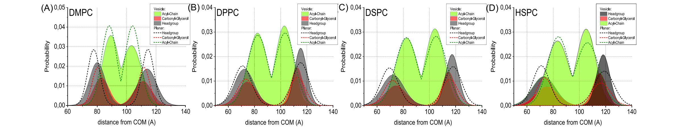

Figure 2. Comparison of component atom probabilities for (A) DMPC, (B) DPPC, (C) DSPC, and (D) HSPC lipid bilayers in molecular dynamics vesicle studies.

Table 1 presents calculated basic structural properties of the investigated solid-phase lipid vesicles. When one compares the results of APL obtained from vesicle simulations with literature data, significant differences in parameters can be observed.25 In the investigated bilayers, it was determined that the APL for DPPC and DSPC systems is lower than for the corresponding measured experimental value by 20 and 17 Å2, respectively. In the DMPC system, the value of the APL was in agreement with the membrane in the fluid phase. Additionally, this agreement was also confirmed by another MD simulation26 and the experiment at 303 K.37 Furthermore, for each of investigated vesicles, it was determined that the APL in the inner monolayer is higher than the one in the outer layer with the exception for DSPC and POPC systems. Such a difference was already reported in the literature. It was presumed by Braun and Sachs that its occurrence is caused by greater tension in the inner leaflet and tighter position distribution (as a result of unbalance in water density or lipid density across the vesicle).26 Interestingly, during DMPC simulation, an occurrence of a spontaneous water pore was observed. It remained open until the balance of water densities inside and outside the lipid vesicle was reached, which has been followed by its closure. The observation is in good agreement with data presented by others.38 Such an event can be explained by the fact that the DMPC membrane is in the rippled-gel phase, where the existence of interdigitated regions occurs. The starting points of the vesicle systems are lipids set opposite to each other. During the initial stages of simulation, an interdigitated region would need to emerge, which could result in high lateral pressure, resulting in spontaneous water pores and/or lack/excess of water to allow the appropriate confirmation for the interdigitated regions to emerge. Interestingly, a significant difference between the APL for the inner and outer layers was observed in the DMPC system. It was not observed in any other of the investigated systems. Hence, we believe that the difference is imposed by the system itself. Interestingly, the APL of the DMPC system is closer to the POPC system rather than the gel systems, which might suggest a high influence of the interdigitated regions in the rippled-gel phase. For liposomes consisting of lipids with high \(T\_\mathrm{m}\) (HSPC, DPPC, and DSPC), the determined APL was lower by about 20 Å2 than that of the DMPC/POPC system. This well-known dependency39 can be explained by denser packing of lipid tails when the membrane is at a temperature substantially lower than the \(T\_\mathrm{m}\). In the case of membrane thickness, a simple dependency is known: the higher the transition temperature of lipids, the higher is the membrane thickness of the bilayer.39 Our results are in agreement with it. Similar conclusions can be drawn when analyzing density vesicle profiles in Figure 2. It can be observed that the main influence of the membrane thickness comes from the width of the acyl chain position population. The population width is smaller in DMPC, resulting in smaller MT contrary to other investigated bilayers. Furthermore, the profile does not change when the bilayer becomes heterogeneous as can be observed in the case of the HSPC bilayer. Profiles determined for the DSPC and DPPC lipids also remain the same in the case of the HSPC bilayer. All of the investigated vesicles sustained their quasi-spherical geometry.

### Mechanical Parameters Determination

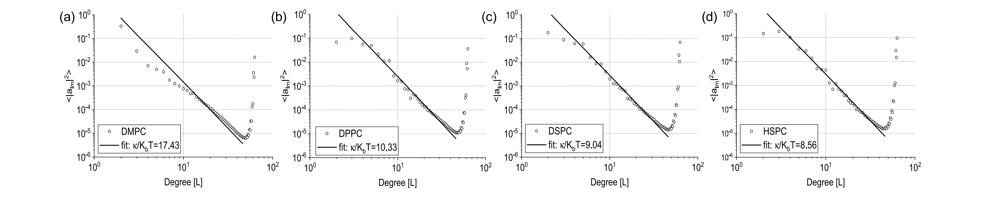

Figure 3. Fluctuations of the power spectra for (A) DMPC, (B) DPPC, (C) DSPC, and (D) HSPC vesicle systems with the corresponding bending rigidity (κ) fit.

The bending rigidity coefficient was obtained using both computational and experimental approaches. The determined bending rigidity coefficients are presented in Table 1. The power spectra of the investigated lipid bilayers obtained using MD studies along with model fits are shown in Figure 3. Additionally, mechanical properties were determined for planar systems using the real-space fluctuation method (details are presented in Section 4 of the Supporting Information).

The value of the bending rigidity coefficient from the MD simulations for the DMPC lipid bilayer was equal to 7.22 × 10−20 J at 295 K. This value is slightly lower than the values for the DMPC bilayers obtained in our simulation of the flat-patch system (−1.2 × 10−19 J). The obtained values of the DMPC bending in the literature are for the bilayer in the liquid phase; however, they are presented to show the effect of the different phases. The obtained values for the ripple phase are lower than those reported in the literature for the liquid phase: −1.3 × 10−19 J for vesicle and 2.1 × 10−19 J for the flat-patch system (T = 303 K),26 1.45 × 10−19 J for the flat-patch system (T = 303 K),40 and 1.22 × 10−19 J for the flat-patch system (T = 303 K).35 Such a variation of the bending rigidity coefficient for the DMPC bilayers can be somewhat explained by the phase, topology, and/or water model. As reported in ref 41, the mechanical properties of the DMPC lipid bilayer, especially in gel/rippled phases, are very sensitive to temperature changes, especially when near \(T\_\mathrm{m}\). A difference of 1 order of magnitude was reported in bending rigidity coefficient values of the DMPC lipid bilayer when changing the temperature from 293 to 296 K. It was shown that changes in the topology of the lipid bilayer influence the bending rigidity coefficient. For instance, vesicle systems tend to show generally smaller values compared to flat-patch systems in the MD simulation, although simulations were performed in the liquid phase (303 K).26 It was also reported26 that a small increase in the number of water molecules in the initial system can influence the obtained bending rigidity coefficient from 6.1 × 10−20 J up to 1.3 × 10−19 J for the DMPC system. Furthermore, as reported by Levine et al.,27b the value of the bending rigidity for another bilayer type, a DPPC bilayer, can differ significantly from 3.0 × 10−20 J up to 1.9 × 10−19 J, depending on the numerical approach used. All these factors can, in extreme cases, sum up to the difference of the magnitude in the value of the bending rigidity coefficient. Therefore, it is crucial to compare calculated values with experimental ones. According to the calculations, the area compressibility was equal to 0.25 N/m for the DMPC system. While this value is well within the range of values reported in the literature, a significant discrepancy in the literature can be found. The area compressibility for DMPC using the MD simulations was reported to be 0.25 N/m,35 0.23 N/m with a micropipette (temperatures not provided),42 and decreased from 0.56 to 0.40 N/m with an increase of temperature from 300 up to 340 K with Neutron Spin Echo spectroscopy.43

In our MD simulations, the obtained value of the bending rigidity coefficient for the DPPC bilayer was equal to 4.28 × 10−20 J at 295 K. This value is an order lower than the one we obtained for the flat-patch system (−2.3 × 10−19 J). Furthermore, this result differs by 1 order of magnitude from the values for the DPPC bilayer reported in the literature, which are 1.52 × 10−19 J for the flat-patch system (T = 303 K),40 1.56 × 10−18 J for the flat-patch system (T = 323 K),27b and 1.58 × 10−19 J for the flat-patch system (T = 323 K),35 but we also found a much closer value to our finding of 4.52 × 10−20 J in the flat-patch system (T = 323 K).44 It has to be noted that systems in the literature are above \(T\_\mathrm{m}\); therefore, the comparison should be understood as an effect of phase change rather than a direct value comparison. Interestingly, the bending rigidity obtained for our flat-patch system is slightly higher than for those reported in the literature; however, this can also be explained by the phase difference. The area compressibility was equal to 0.31 N/m with our MD study. Similarly, the discrepancy can be observed with the area compressibility for DPPC equal to 0.21−0.23 N/m, depending on the size of the system in the MD studies,35 0.23 N/m with micropipette measurements (temperatures not provided),42 and 0.56 N/m in 320 K with Neutron Spin Echo spectroscopy.43

Finally, bending rigidity coefficients for the DSPC and HSPC lipid bilayers obtained by the MD simulations were equal to 3.74 × 10−20 and 3.55 × 10−20 J, both at 295 K, respectively. Those values, yet again, were lower than the bending rigidities obtained in our flat-patch simulations. Those were equal to 2.0 × 10−19 and 2.3 × 10−19 J for DPSC and HSPC, respectively. No literature value for the bending rigidity coefficient was found for those bilayers. Area compressibilities values were equal to 0.57 and 0.26 N/m for DSPC and HSPC lipid bilayers, respectively. Only the area compressibility for DSPC is available from the literature; it was reported to decrease from 0.50 down to 0.45 N/m with the temperature rising from 330 to 340 K using Neutron Spin Echo spectroscopy.43 These results are consistent with ours since the temperature set in our simulations is 295 K. Therefore, the value of area compressibility should be higher, considering the dependence provided in the literature.

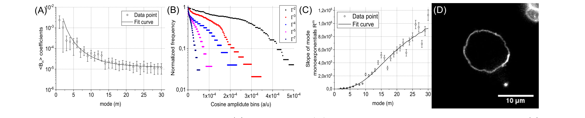

Figure 4. Flicker noise analysis of the HSPC vesicle. (A) Model fit of the ⟨Bn⟩ dependency on mode in the average-based approach. (B) Distribution Γm of shape fluctuations acquired by cosine decomposition in the statistical approach. (C) Model fit of slope Rm dependency on mode in the statistical approach. (D) Image of an HSPC vesicle with an oddly rectangular shape.

The calculated parameters were confronted with experimental values of the bending rigidity coefficient determined with the flicker noise technique. The experimental values presented in Table 1 are averaged over at least 10 vesicles. They are calculated using two different approaches: statistical and average-based (AVB) ones. An example of fluctuation distribution and model fits using both approaches is presented in Figure 4A−C. The details on individual measurements are presented in the Supporting Information in Section 3. Additionally, it should be noted that GUVs created from lipids with a \(T\_\mathrm{m}\) higher than room temperature tend to form oddly rectangular shapes rather than typical quasi-spherical ones. This is shown in Figure 4D and was not observed in our MD studies. The reason for this is probably due to the small size of the simulated vesicles and/or lack of the lipid bilayer rapid phase change in MD simulations.

Using flicker noise spectroscopy, the obtained values of the bending rigidity coefficient for the DMPC lipid bilayer using AVB and statistical approaches were equal to (5.3 ± 2.2) × 10−20 and (6.0 ± 2.0) × 10−20 J, both at 295 K, respectively. When compared to the literature, the values can be either within the range of error or even an order of magnitude higher, depending on the temperature, method, and data processing used. Using spin echo spectroscopy, the value of the bending rigidity coefficient for the DMPC bilayer was equal to 1.5 × 10−19 J at 300 K and 9.4 × 10−20 J at 340 K.43 Using an optical dynamometry study, the value decreased from 2 × 10−18 to 4 × 10−20 J by increasing the temperature from 293 to 296 K.41 Using flicker noise spectroscopy, the value was reported to be 1 × 10−19 J for 298 K.45 Using the all-optical method, the value was equal to (1.41 ± 0.13) × 10−19 J for 300 K and (1.33 ± 0.12) × 10−19 J for 303 K,46 respectively.

The experimentally determined bending rigidity coefficients for the DPPC lipid bilayer obtained with AVB and statistical approaches were equal to (5.0 ± 3.3) × 10−20 and (5.3 ± 3.0) × 10−20 J, both at 295 K, respectively. The measured value is lower than those reported with other experimental results. Specifically, with AFM indentation, the value of the bending rigidity coefficient for the DPPC bilayer was equal to 1.55 × 10−18 J for the vesicle system and 2.03 × 10−19 J for the supported lipid bilayer system at 293 K.47 In another AFM study, the value was equal to (1.3 ± 0.1) × 10−18 J.48 Using spin echo spectroscopy, the value was equal to 2.08 × 10−19 J for 320 K.43

For the DSPC bilayer, the bending rigidity coefficient was equal to (5.0 ± 2.4) × 10−20 and (4.5 ± 2.6) × 10−20 J at 295 K using AVB and statistical approaches, respectively, in our study. Using spin echo spectroscopy, the value was equal to 2.28 × 10−19 J for 330 K.43 There was no agreement between the results, probably due to the temperature difference.

Finally, for the HSPC bilayer, the values were equal to (3.5 ± 1.8) × 10−20 and (2.9 ± 2.0) × 10−20 J for 295 K using AVB and statistical approaches, respectively. No literature data regarding the bending rigidity of the HSPC bilayer is available.

It is well-known that different techniques yield inconsistent values for the bending rigidity coefficient.49 Such discrepancies in the reported data are not surprising. On the other hand, the difference in the reported values of the bending rigidity between both vesicle simulation and flicker noise spectroscopy and both flat-patch simulations and the literature value is quite puzzling, especially given the fact that values of membrane thickness and APL are in agreement with the literature; additionally, there is an agreement for bending rigidity values between performed experimental calculations and simulations. It also should be noted that the obtained bending rigidity modulus from flicker noise spectroscopy compares very well with our theoretical simulations of the vesicles. When \(T\_\mathrm{m}\) of the investigated lipids is taken into account, an additional dependency can be found. It can be observed that the bending rigidity coefficient of the bilayers consisting of low \(T\_\mathrm{m}\) lipids are almost twice the value of bilayers consisting of lipids with higher \(T\_\mathrm{m}\) (difference between 7.22 × 10−20 and 3.55 × 10−20 J). This is, however, contrary to what we got when the bending rigidity was determined for flat-patch systems. This is also contrary to what one might expect, as a bilayer in the gel phase exhibits shear elasticity between individual lipid molecules and the effective energy required to bend the bilayer should be much higher than in the bilayers without it.15 Another puzzling phenomena is the time constant deviation from the sphere shape observed in the vesicles, which bilayer is built from lipids with a high \(T\_\mathrm{m}\), such as DPPC, DSPC, and HSPC (see Section 6 in the Supporting Information regarding the time stability of solid-ordered vesicles shapes).

To this end, a different explanation is proposed, which could explain this discrepancy and phenomena. Since vesicles are formed by electroformation in high temperatures above \(T\_\mathrm{m}\) and then slowly cooled down, the phase-transition process is not rapid enough to cause the rupture of vesicles. What is happening is the slow stiffening of individual, small, flat patches, which rapidly meet at angles, slowly driven by the occurrence of another force, shear elasticity, which has been reported in bilayers below \(T\_\mathrm{m}\). The system then is slowly reaching new minimal-energy configuration and, as result, the vesicle we are observing has a considerable deviation from sphericity. This would be extremely visible where the rigid flat patches meet. This would explain why, when analyzing the flat patch, the bending rigidity coefficient is very high, but when treating a system globally (as a vesicle), the system is hardly rigid at all. It would also explain the oddly rectangular shapes of the vesicles we were observing. It is also possible that these phenomena are observed only in a metastable phase, leading to the subgel phase of the membrane. However, this confirmation was observed for considerable amounts of time (at least hours), and the mechanical properties of the membrane in such a state are also worth investigating.

For area compressibility, the simple tendency in homogeneous lipid bilayers can be found; area compressibility increases with \(T\_\mathrm{m}\). However, interesting phenomena can be observed in the case of heterogeneous HSPC. Despite both being a mixture of DPPC and DSPC and having a high \(T\_\mathrm{m}\), its area compressibility is almost equal to that of DMPC (0.26 N/m) and is significantly lower than its component lipids. This result suggests that the heterogeneity of the lipid bilayers can influence the area compressibility in an unexpected nonlinear way.

## Summary and Conclusions

In this paper, we have investigated the basic structure parameters (membrane thickness, area per lipid of both layers, and vesicle profiles) as well as mechanical properties (bending rigidity coefficient and area compressibility) of selected lipid bilayers. We have selected lipids on the basis of their transition temperature with an aim to investigate solid-ordered bilayers in physiological temperatures. To this end, lipids such as DMPC, DPPC, DSPC, and HSPC were chosen. Each of the bilayers built from those lipids are considered in different phases: rippled Pβ gel phase, Lβ gel phase, Lc stable crystalline or metastable phase, and the mixture of crystalline and gel phase lipids, respectively. Furthermore, POPC was chosen as a reference for the MD setup verification. Our results of area per lipid (APL) analysis confirmed that the parameter is lower for gel bilayers. We also reconfirmed that the higher value of membrane thickness is larger in solid-ordered than in liquid-ordered bilayers. Bending rigidity coefficients were determined using both flicker noise spectroscopy and 3D fluctuations spectra from MD studies. There was agreement in the parameters from experimental and computational techniques. For homogeneous bilayers, the bending rigidity coefficient decreased with an increase in the transition temperature of the lipids. These results are against intuition, as it could be argued that lipid bilayers are more resilient to mechanical stress when in the solid phase. Additionally, the obtained values of the bending rigidity coefficient were lower than in our flat-patch systems and in the literature data. Opposite dependencies were reported as well. We propose the explanation that the vesicle consists of rigid small patches. When analyzed locally, the bending rigidity is quite high, but when the system is analyzed globally, as for a vesicle, the value decreases, as individual small patches easily bend between each other. This view is additionally strengthened by the high deviation from sphericity observed in the investigated GUVs. Instead of the typical quasi-spherical shape, lipids with a higher \(T\_\mathrm{m}\) formed oddly rectangular shapes. This was mostly visible in HSPC and DSPC vesicles (crystalline phase or metastable phase), seen slightly less in DPPC (gel phase), and almost unobserved in DMPC (rippled gel phase). In the case of area compressibility, the parameter increased with \(T\_\mathrm{m}\), suggesting that the presence of shear elasticity indeed limits stretching. Surprisingly, for the HSPC bilayer, the value of the bending rigidity was lower than both of its components and, at the same time, area compressibility was higher than both of its components. This suggests that the mechanical properties of the mixed bilayers cannot be straightforwardly calculated, due to either shear elasticity or the topology of the system. We hope that this work will prove valuable in further studies on solid-ordered bilayers as well as starting points to more detailed studies on the effect of bilayer topology from the mechanical point of view at the molecular level.

## Associated Content

### Supporting Information

The Supporting Information is available free of charge at <https://pubs.acs.org/doi/10.1021/acs.langmuir.0c00475>.

(1) Details of molecular dynamics simulations, (2) calculation of the order parameter for vesicle systems, (3) flicker noise analysis approach for molecular dynamics studies, (4) planar bilayer MD simulations details and mechanical parameters determination, (5) details of flicker noise measurements, and (6) time-stability of solid-ordered vesicles shapes (PDF)

## Author Information

### Corresponding Author

**Dominik Drabik** − Department of Biomedical Engineering, Faculty of Fundamental Problems of Technology, Wrocław University of Science and Technology, 50-377 Wrocław, Poland; [orcid.org/0000-0003-4568-4066](https://orcid.org/0000-0003-4568-4066); Email: [Dominik.Drabik@pwr.edu.pl](mailto:Dominik.Drabik@pwr.edu.pl)

### Authors

**Grzegorz Chodaczek** − PORT − Polish Center for Technology Development, 54-066 Wrocław, Poland

**Sebastian Kraszewski** − Department of Biomedical Engineering, Faculty of Fundamental Problems of Technology, Wrocław University of Science and Technology, 50-377 Wrocław, Poland

**Marek Langner** − Department of Biomedical Engineering, Faculty of Fundamental Problems of Technology, Wrocław University of Science and Technology, 50-377 Wrocław, Poland

Complete contact information is available at: <https://pubs.acs.org/10.1021/acs.langmuir.0c00475>

### Author Contributions

The manuscript was written through contributions of all authors. All authors have given approval to the final version of the manuscript.

### Notes

The authors declare no competing financial interest.

## Acknowledgments

This work was possible thanks to the financial support from the National Science Centre (Poland) grant nos. 2016/21/N/NZ1/02767 and 2015/19/B/NZ7/02380 as well as statutory funds from Wroclaw University of Technology. Numerical resources for Molecular Dynamics simulations were granted by Wroclaw Centre of Networking and Supercomputing, grant no. 274.

## Abbreviations

Tm, transition temperature; MD, molecular dynamics; AVB, averaged-based approach; APL, area per lipid; SPHA, spherical harmonics analysis; MT, membrane thickness

## References

1. (1) Stillwell, W. Introduction to Biological Membranes. In *An Introduction to Biological Membranes*; Gonzalez, P., Ed.; Elsevier: United Kingdom, 2013; pp 3−6.
2. (2) Humphrey, J. D.; Dufresne, E. R.; Schwartz, M. A. Mechanotransduction and extracellular matrix homeostasis. *Nat. Rev. Mol. Cell Biol.* 2014, 15 (12), 802−12.
3. (3) Alonso, M. A.; Millan, J. The role of lipid rafts in signalling and membrane trafficking in T lymphocytes. *J. Cell Sci.* 2001, 114, 2957−2965.
4. (4) Milhaud, J. New insights into water−phospholipid model membrane interactions. *Biochim. Biophys. Acta, Biomembr.* 2004, 1663 (1−2), 19−51.
5. (5) Dimova, R. Recent developments in the field of bending rigidity measurements on membranes. *Adv. Colloid Interface Sci.* 2014, 208, 225−234.
6. (6) Marsh, D. Phase Transition Temperatures. In *Handbook of lipid bilayers*; Taylor & Francis Group: New York, 2013; pp 539−600.
7. (7) (a) Nagle, J. F. Theory of the main bilayer phase transition. *Annu. Rev. Phys. Chem.* 1980, 31, 157−195. (b) Bagatolli, L.; Sunil Kumar, P. B. Phase behavior of multicomponent membranes: Experimental andcomputational techniques. *Soft Matter* 2009, 5, 3234−3248.
8. (8) (a) Melchior, D. L. Lipid domains in fluid membranes: a quick-freeze differential scanning calorimetry study. *Science* 1986, 234 (4783), 1577−80. (b) Lentz, B. R.; Barenholz, Y.; Thompson, T. E. Fluorescence depolarization studies of phase transitions and fluidity in phospholipid bilayers. 2. Two-component phosphatidylcholine liposomes. *Biochemistry* 1976, 15 (20), 4529−4537. (c) Mabrey, S.; Sturtevant, J. M. Investigation of phase transitions of lipids and lipid mixtures by sensitivity differential scanning calorimetry. *Proc. Natl. Acad. Sci. U. S. A.* 1976, 73 (11), 3862−3866.
9. (9) Jørgensen, K.; Sperotto, M. M.; Mouritsen, O. G.; Ipsen, J. H.; Zuckermann, M. J. Phase equilibria and local structure in binary lipid bilayers. *Biochim. Biophys. Acta, Biomembr.* 1993, 1152 (1), 135−145.
10. (10) (a) Ruocco, M. J.; Shipley, G. G. Interaction of cholesterol with galactocerebroside and galactocerebroside-phosphatidylcholine bilayer membranes. *Biophys. J.* 1984, 46 (6), 695−707. (b) Norlen, L. Skin barrier structure and function: the single gel phase model. *J. Invest. Dermatol.* 2001, 117 (4), 830−836.
11. (11) Jouhet, J. Importance of the hexagonal lipid phase in biological membrane organization. *Front. Plant Sci.* 2013, 4, 494.
12. (12) Yi, X.; Gao, H. Kinetics of receptor-mediated endocytosis of elastic nanoparticles. *Nanoscale* 2017, 9 (1), 454−463.
13. (13) (a) Ishida, T.; Harashima, H.; Kiwada, H. Liposome clearance. *Biosci. Rep.* 2002, 22 (2), 197−224. (b) Moghimi, S. M.; Hunter, A. C.; Murray, J. C. Long-circulating and target-specific nanoparticles: theory to practice. *Pharmacol. Rev.* 2001, 53 (2), 283−318. (c) Lombardo, D.; Calandra, P.; Barreca, D.; Magazu, S.; Kiselev, M. A. Soft Interaction in Liposome Nanocarriers for Therapeutic Drug Delivery. *Nanomaterials* 2016, 6 (7), 125.
14. (14) Bouvrais, H.; Holmstrup, M.; Westh, P.; Ipsen, J. H. Analysis of the shape fluctuations of reconstitued membranes using GUVs made from lipid extracts of invertebrates. *Biol. Open* 2013, 2, 373−378.
15. (15) Helfrich, W. Elastic Properties of Lipid Bilayers: Theory and Possible Experiments. *Z. Naturforsch., C: J. Biosci.* 1973, 28 (c), 693−703.
16. (16) Brochard, F.; Lennon, J. F. Frequency Spectrum of the Flicker Phenomenon in Erythrocytes. *J. Phys. (Paris)* 1975, 36 (11), 1035−1047.
17. (17) Akabori, K.; Nagle, J. F. Structure of the DMPC lipid bilayer ripple phase. *Soft Matter* 2015, 11 (5), 918−26.
18. (18) (a) Silvius, J. R. *Thermotropic Phase Transitions of Pure Lipids in Model Membranes and Their Modifications by Membrane Proteins*; John Wiley & Sons, Inc.: New York, 1982. (b) Lewis, R. N. A. H.; Mak, N.; McElhaney, R. N. A differential scanning calorimetric study of the thermotropic phase behavior of model membranes composed of phosphatidylcholines containing linear saturated fatty acyl chains. *Biochemistry* 1987, 26 (19), 6118−6126.
19. (19) Drabik, D.; Przybyło, M.; Chodaczek, G.; Iglič, A.; Langner, M. The modified fluorescence based vesicle fluctuation spectroscopy technique for determination of lipid bilayer bending properties. *Biochim. Biophys. Acta, Biomembr.* 2016, 1858 (2), 244−252.
20. (20) Drabik, D.; Doskocz, J.; Przybyło, M. Effects of electroformation protocol parameters on quality of homogeneous GUV populations. *Chem. Phys. Lipids* 2018, 212, 88−95.
21. (21) Meleard, P.; Pott, T.; Bouvrais, H.; Ipsen, J. H. Advantages of statistical analysis of giant vesicle flickering for bending elasticity measurements. *Eur. Phys. J. E: Soft Matter Biol. Phys.* 2011, 34, 116.
22. (22) Pecreaux, J.; Döbereiner, H.-G.; Prost, J.; Joanny, J.-F.; Bassereau, P. Refined contour analysis of giant unilamellar vesicles. *Eur. Phys. J. E: Soft Matter Biol. Phys.* 2004, 13, 277−290.
23. (23) Phillips, J. C.; Braun, R.; Wang, W.; Gumbart, J.; Tajkhorshid, E.; Villa, E.; Chipot, C.; Skeel, R. D.; Kale, L.; Schulten, K. Scalable molecular dynamics with NAMD. *J. Comput. Chem.* 2005, 26 (16), 1781−1802.
24. (24) Lee, S.; Tran, A.; Allsopp, M.; Lim, J. B.; Hénin, J.; Klauda, J. B. CHARMM36 United Atom Chain Model for Lipids and Surfactants. *J. Phys. Chem. B* 2014, 118 (2), 547−556.
25. (25) Kučerka, N.; Nieh, M.-P.; Katsaras, J. Fluid phase lipid areas and bilayer thicknesses of commonly used phosphatidylcholines as a function of temperature. *Biochim. Biophys. Acta, Biomembr.* 2011, 1808, 2761−2771.
26. (26) Braun, A. R.; Sachs, J. N. Determining Structural and Mechanical Properties from Molecular Dynamics Simulations of Lipid Vesicles. *J. Chem. Theory Comput.* 2014, 10, 4160−4168.
27. (27) (a) Khelashvili, G.; Johner, N.; Zhao, G.; Harries, D.; Scott, H. L. Molecular origins of bending rigidity in lipids with isolated and conjugated double bonds: The effect of cholesterol. *Chem. Phys. Lipids* 2014, 178, 18−26. (b) Levine, Z. A.; Venable, R. M.; Watson, M. C.; Lerner, M. G.; Shea, J.-E.; Pastor, R. W.; Brown, F. L. H. Determination of Biomembrane Bending Moduli in Fully Atomistic Simulations. *J. Am. Chem. Soc.* 2014, 136, 13582−13585. (c) Kawamoto, S.; Nakamura, T.; Nielsen, S. O.; Shinoda, W. A guiding potential method for evaluating the bending rigidity of tensionless lipid membranes from molecular simulation. *J. Chem. Phys.* 2013, 139, No. 034108.
28. (28) Davies, T. A. Algorithm 930: FACTORIZE: An object-oriented linear system solver for MATLAB. *ACM Transactions on Mathematical Software* 2013, 39 (4), 28.
29. (29) Waheed, Q.; Edholm, O. Undulation Contributions to the Area Compressibility in Lipid Bilayer Simulations. *Biophys. J.* 2009, 97, 2754−2760.
30. (30) Harzer, U.; Bechinger, B. Alignment of Lysine-Anchored Membrane Peptides under Conditions of Hydrophobic Mismatch: A CD, 15N and 31P Solid-State NMR Spectroscopy Investigation. *Biochemistry* 2000, 39, 13106−13114.
31. (31) Nezil, F. A.; Bloom, M. Combined influence of cholesterol and synthetic amphiphillic peptides upon bilayer thickness in model membranes. *Biophys. J.* 1992, 61, 1176−1183.
32. (32) Pasenkiewicz-Gierula, M; Murzyn, K; Rog, T; Czaplewski, C Molecular dynamics simulation studies of lipid bilayer systems. *Acta Biochimica Polonica* 2000, 47, 601−611.
33. (33) Tsai, H.-H. G.; Lee, J.-B.; Huang, J.-M.; Juwita, R. A Molecular Dynamics Study of the Structural and Dynamical Properties of Putative Arsenic Substituted Lipid Bilayers. *Int. J. Mol. Sci.* 2013, 14, 7702−7715.
34. (34) MacDermaid, C. M.; Kashyap, H. K.; DeVane, R. H.; Shinoda, W.; Klauda, J. B.; Klein, M. L.; Fiorin, G. Molecular dynamics simulations of cholesterol-rich membranes using a coarsegrained force field for cyclic alkanes. *J. Chem. Phys.* 2015, 143, 243144.
35. (35) Venable, R. M.; Brown, F. L. H.; Pastor, R. W. Mechanical properties of lipid bilayers from molecular dynamics simulation. *Chem. Phys. Lipids* 2015, 192, 60−74.
36. (36) Nagle, J. F.; Tristram-Nagle, S. Structure of lipid bilayers. *Biochim. Biophys. Acta, Rev. Biomembr.* 2000, 1469 (3), 159−195.
37. (37) Petrache, H. I.; Dodd, S. W.; Brown, M. F. Area per lipid and acyl length distributions in fluid phosphatidylcholines determined by (2)H NMR spectroscopy. *Biophys. J.* 2000, 79 (6), 3172−92.
38. (38) Lis, M.; Wizert, A.; Przybylo, M.; Langner, M.; Swiatek, J.; Jungwirth, P.; Cwiklik, L. The effect of lipid oxidation on the water permeability of phospholipids bilayers. *Phys. Chem. Chem. Phys.* 2011, 13 (39), 17555−63.
39. (39) Kinnun, J. J.; Mallikarjunaiah, K. J.; Petrache, H. I.; Brown, M. F. Elastic deformation and area per lipid of membranes: atomistic view from solid-state deuterium NMR spectroscopy. *Biochim. Biophys. Acta, Biomembr.* 2015, 1848 (1 Pt B), 246−259.
40. (40) Doktorova, M.; Harries, D.; Khelashvili, G. Determination of bending rigidity and tilt modulus of lipid membranes from real-space fluctuation analysis of molecular dynamics simulations. *Phys. Chem. Chem. Phys.* 2017, 19, 16806.
41. (41) Dimova, R.; Pouligny, B.; Dietrich, C. Pretransitional Effects in Dimyristoylphosphatidylcholine Vesicle Membranes: Optical Dynamometry Study. *Biophys. J.* 2000, 79 (1), 340−356.
42. (42) Rawicz, W.; Olbrich, K. C.; McIntosh, T.; Needham, D.; Evans, E. Effect of chain length and unsaturation on elasticity of lipid bilayers. *Biophys. J.* 2000, 79 (1), 328−39.
43. (43) Nagao, M.; Kelley, E. G.; Ashkar, R.; Bradbury, R. D.; Butler, P. D. Probing Elastic and Viscous Properties of Phospholipid Bilayers Using Neutron Spin Echo Spectroscopy. *J. Phys. Chem. Lett.* 2017, 8 (19), 4679−4684.
44. (44) Hofsäß, C.; Lindahl, E.; Edholm, O. Molecular Dynamics Simulations of Phospholipid Bilayers with Cholesterol. *Biophys. J.* 2003, 84 (4), 2192−2206.
45. (45) Meleard, P.; Gerbeaud, C.; Pott, T.; Fernandez-Puente, L.; Bivas, I.; Mitov, M. D.; Dufourcq, J.; Bothorel, P. Bending Elasticities of Model Membranes: Influences of Temperature and Sterol Content. *Biophys. J.* 1997, 72, 2616−2629.
46. (46) Lee, C.-H.; Lin, W.-C.; Wang, J. All-optical measurements of the bending rigidity of lipid-vesicle membranes across structural phase transitions. *Phys. Rev. E: Stat. Phys., Plasmas, Fluids, Relat. Interdiscip. Top.* 2001, 64, No. 020901(R).
47. (47) Et-Thakafy, O.; Delorme, N.; Gaillard, C.; Mériadec, C.; Artzner, F.; Lopez, C.; Guyomarc'h, F. Mechanical properties of membranes composed of gel-phase or fluid-phase phospholipids probed on liposomes by atomic force spectroscopy. *Langmuir* 2017, 33 (21), 5117−5126.
48. (48) Delorme, N.; Fery, A. Direct method to study membrane rigidity of small vesicles basedon atomic force microscope force spectroscopy. *Phys. Rev. E* 2006, 74, No. 030901(R).
49. (49) Nagle, J. F. Introductory Lecture: Basic quantities in model biomembranes. *Faraday Discuss.* 2013, 161, 11−29.

---

Supporting Information

Supporting Information for:

# Mechanical properties determination of DMPC, DPPC, DSPC and HSPC solid-ordered bilayers

Dominik Drabik,a\* Grzegorz Chodaczek,b Sebastian Kraszewski,a Marek Langnera

a Department of Biomedical Engineering, Faculty of Fundamental Technical Problems, Wrocław University of Science and Technology, 50-377 Wrocław, Pl. Grunwaldzki 13, Poland.

b PORT – Polish Center for Technology Development, Stabłowicka 147, 54-066 Wrocław, Poland.

\* Corresponding author: [Dominik.Drabik@pwr.edu.pl](mailto:Dominik.Drabik@pwr.edu.pl)

Number of: pages − 12; figures − 20; tables − 1

## 1. Molecular Dynamics simulation details of vesicle systems

All full-atomic simulation simulations were performed with the NAMD1 software and united-atom CHARMM36 force field under NPT conditions. Each of vesicles was modelled with 10nm radius. United atom chain models were used for lipids2. The system was hydrated with TIP3P water molecules giving a final simulation box of 30 nm3. Ions were not added to system. It was our aim to recreate experimental setup, where deionized water is used, at accurately as possible. Furthermore ions are charged particles which increase significantly simulations time, as they require calculation of additional electrostatic interactions. Due to significant volume of systems such option was choose in order to avoid prolonged simulation time. Three dimensional periodic boundary conditions were applied in the simulations. Vesicle system was created using custom script in Matlab. Starting area per lipid (APL) value was assumed based on literature data3. APL was adopted to account for the effect of vesicle's curvature – multiplied by respectively 0.95 and 1.05 for inner and outer leaflet. Simulations were analysed for at least the last 10ns of equilibrated system. In order to determine equilibration six selected parameters were monitored. Those were vesicle radius, thickness of lipid bilayer, mean values and standard deviations of both inner and outer leaflets. All calculation of this parameters is based on location of phosphorus atom in lipid molecules. The simulations were run with time-step equal to 2fs. The simulated POPC system consisted of 3637 lipid molecules (269 139 atoms) and 748 344 water molecules (2 245 032 atoms). Adopted Area per lipid (APL) was equal to 68.1 Å2. There were 1521 lipid molecules in inner leaflet and 2 116 in outer leaflet. As a reference simulation it was carried out for the longest time - total 163 ns simulation time. Final simulation unit cell was equal to 298Å in each of xyz axis. The equilibration parameters are presented in figure S1.A. Last 65 ns of simulation were used for bending rigidity determination. The simulated DMPC system consisted of 3556 lipid molecules (241877 atoms) and 720 421 water molecules (2 161 263 atoms). Adopted APL was equal to 70 Å2. There were 1156 lipids in inner leaflet and 2 400 in outer. The simulation was carried out for 32 ns. Final simulation unit cell was equal to 293Å in each of xyz axis. The equilibration parameters are presented in figure S1.B. At the beginning of equilibration spontaneous water pore has opened. It closed itself at the end of equilibration time. Last 13 ns of simulation were used for bending rigidity determination. The simulated DSPC system consisted of 4251 lipid molecules (323077 atoms) and 678 524 water molecules (2 035 572 atoms). Adopted APL was equal to 68.1 Å2. There were 1 443 lipids in inner leaflet and 2808 in outer. The simulation was carried out for 35 ns. Final simulation unit cell was equal to 293Å in each of xyz axis. The equilibration parameters are presented in figure S3.A. Last 15 ns of simulation were used for bending rigidity determination. The simulated DPPC system consisted of 4251 lipids (306 073 atoms) and 693 076 water molecules (2 079 228 atoms). Adopted APL was equal to 65.7 Å2. There were 1443 lipid molecules in inner leaflet and 2 808 in outer. The simulation was carried out for 32 ns. Final simulation unit cell was equal to 294Å in each of xyz axis. The equilibration parameters are presented in figure S3.B. Last 12 ns of simulation were used for bending rigidity determination. The simulated HSPC system, as a mixture of 11.4% of DPPC and 88.6% DSPC, consisted of 4328 lipid molecules (326 949 atoms) and 682 785 water molecules (2 048 355 atoms). From those lipid molecules 495 of them was DPPC and 3833 DSPC. Adopted APL was equal to weighted average of DPPC and DSPC APLs. There were 1520 lipids in inner and 2808 it outer leaflet. The simulation was carried out for 31 ns. Final simulation unit cell was equal to 294Å in each of xyz axis. The equilibration parameters are presented in figure S3.C. Last 12 ns of simulation were used for bending rigidity determination.

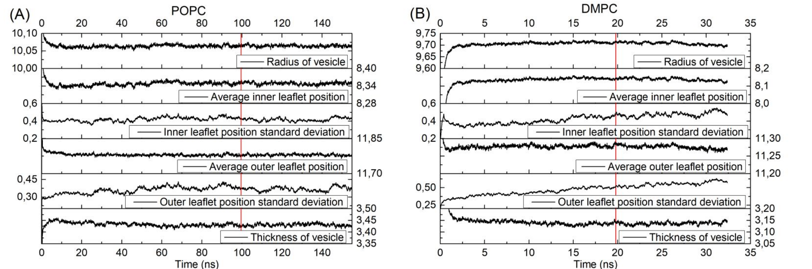

Figure S1. Visualization of six parameters used for equilibration determination for (A) POPC and (B) DMPC vesicle systems. Red line represents the starting point of data used for bending rigidity determination.

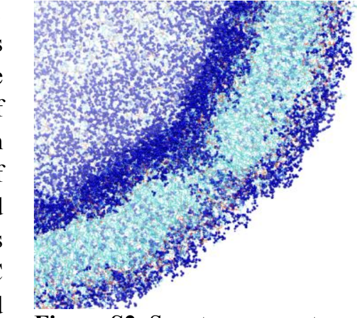

Figure S2. Spontaneous water pore observed during DMPC vesicle equilibration.

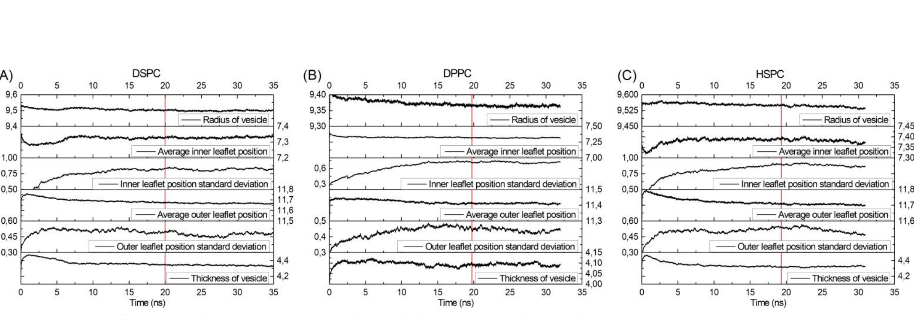

Figure S3. Visualization of six parameters used for equilibration determination for (A) DSPC, (B) DPPC and (C) HSPC vesicle systems. Red line represents the starting point of data used for bending rigidity determination.

## 2. Calculation of order parameter for vesicle systems

Carbon-hydrogen order parameter of lipid tails is often used to assess force field accuracy. In this section we are presenting the change of order parameter throughout whole simulation for both inner and outer membranes. Three carbons were selected on both tails – second (C22, C32), eighth (C28,C38) and fifteenth (C215,C315). For DSPC vesicle system thirteen carbon (C213,C313) was selected instead of fifteenth for obvious reasons. Order parameter was calculated by established protocol for united-atom4 with slight adaptation for vesicle systems. Namely, the vector between vesicle center and position of phosphorus atom for given lipid is treated as membrane normal.

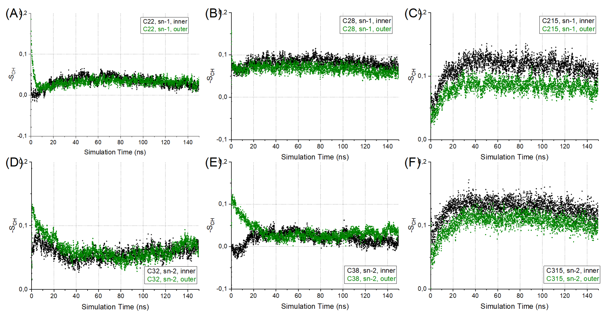

Figure S4. Order parameter for selected carbon atoms in function of simulation time for POPC vesicle system.

Carbon atoms for POPC system located closer to lipid head (namely C22,C32,C28 and C38) became stable after 20 ns of simulations. For C215 and C315 order parameter semi-stabilized after 20 ns, after which constant small drift could be observed. However such drift is to be expected in carbon atoms at the end of carbon tails. Parameter evolution is presented in Figure S4.

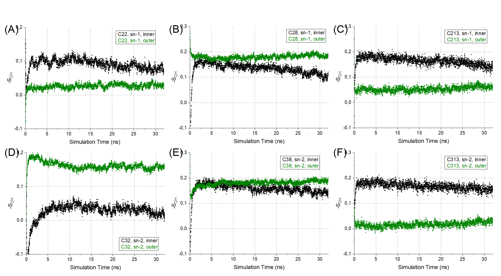

Figure S5. Order parameter for selected carbon atoms in function of simulation time for DMPC vesicle system.

Carbon atoms in DMPC vesicle system located closer to lipid head (namely C22,C32,C28 and C38) became stable after 10 ns of simulations for sn-2 tail and after 8 ns for sn-1 tail. For carbon atoms at the end of tails the order parameter semi-stabilized almost instantly after less than 2 ns, after which remain constant when a small drift could be observed around 28 ns. Additionally, significant difference was observed in parameter value between the inner and outer leaflets. This was not observed only for middle carbon atom. However it can be concluded that system is thermally stable. Order parameter evolution in time is presented in Figure S5.

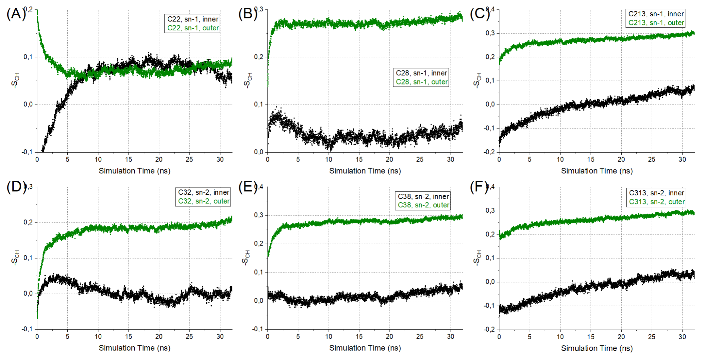

Figure S6. Order parameter for selected carbon atoms in function of simulation time for DSPC vesicle system.

For DSPC system atoms closest to head, namely C22 and C23, obtained stability after 10 ns for both inner and outer leaflets. However the fluctuation of the parameter in time was much higher than observed for POPC or DMPC systems. Similar tendency was observed for C28 and C38 atoms. Additionally it takes longer for inner leaflet to obtain stability. A constant drift was observed for last carbon atoms in tails, the drift was higher in inner leaflet. Except for C22 atom, order parameter values were different between the inner and outer leaflet. Despite that the parameters and stable, therefore system can be treated as thermally stable as well. Order parameter evolution in time is presented in Figure S6.

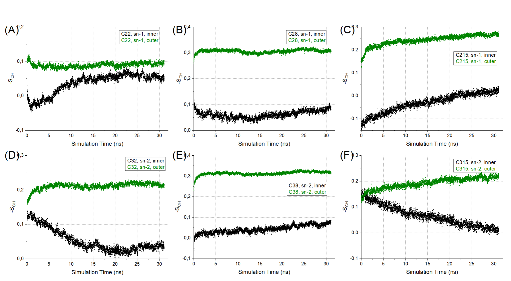

Figure S7. Order parameter for selected carbon atoms in function of simulation time for DPPC vesicle system.

For DPPC system and carbon atoms closest to head, stability was obtained after 15 ns for inner leaflet and after 5ns for outer leaflet. For C28 and C38 stability was obtained relatively quick after 5 ns. However, either small drift or high fluctuation can be observed for carbon atom in inner leaflet. A constant drift was observed for last carbon atoms in tails, after obtaining semi-stability at around 3 ns. It can be concluded that system can be treated as thermally stable after 15 ns. Order parameter evolution in time is presented in Figure S7.

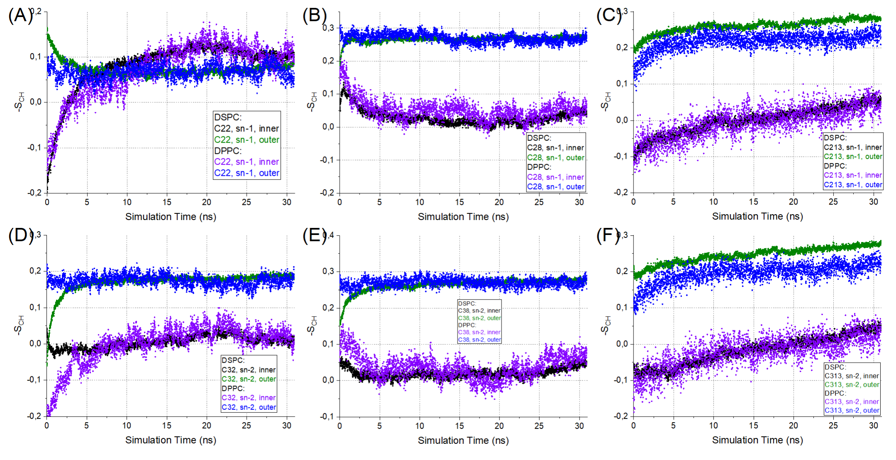

Figure S8. Order parameter for selected carbon atoms in function of simulation time for HSPC vesicle system.

For HSPC system two different lipid types can be found. It can be observed that order parameter value is the same for both DSPC and DPPC lipid molecules. Only exception from this tendency can be observed in C213 and C313 atoms in outer leaflet. For carbon atoms closes to head as well as for middle carbon atoms stability was observed after 8ns. For carbon atoms at the end of tail semi-stability was observed after 4 ns for outer and 10 ns for inner leaflet. However constant small drift was present in both cases. Nevertheless, it can be safely assumed that systems are thermally stable after 10 ns of simulations. Order parameter evolution in time is presented in Figure S8.

## 3. Flicker-noise analysis approach for Molecular Dynamics simulation

For bending rigidity determination in case of molecular dynamics study the fluctuation analysis is done on whole liposome. However, in case of flicker-noise spectroscopy, only cross-section is analysed and used to mathematically re-establish fluctuations on whole vesicle. To compare accuracy of such approach, fluctuation contour of cross-section of vesicle in molecular dynamics studies was extracted and analysed similarly to flicker-noise images. Fluctuation spectra was collected for range of 3 nm and under five different angles as visualized in Figure S9. Bending rigidity calculated using Braun and Sachs5 approach was equal to κ=17,86·kBT. When analysed the slice under 0 degree angle it was equal to 17.9±0.6·kBT and 17±3·kBT from average-based and statistical approaches respectively. In other angles result were within margin of error: for 30 degree slice it was equal to 17.2±0.7·kBT and 16±4·kBT, for 45 degree slice - 16.6±0.6·kBT and 15.5±4.3·kBT and for 90 degree slice - 17.7±0.7·kBT and 17±4·kBT. In each case first result from average-based approach is presented followed by statistical approach. Only in case of 60 degree angle slice result was slightly different - 13.9±0.5·kBT and 14.3±3.4·kBT. Despite this single discrepancy, it can be concluded that determination of fluctuation spectra from cross section is accurate.

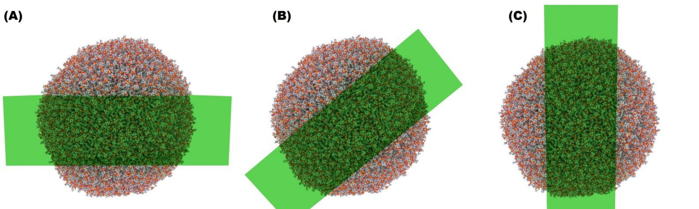

Figure S9. Liposomes used for contour determination in (a) 0 (b) 45 and (c) 90 degree cross-sections. Images were rendered using Blender software.

## 4. Planar bilayer MD simulations details and mechanical parameters determination

Mechanical parameters for investigated lipids were also determined in planar lipid bilayer configuration. All full-atomic simulation simulations were performed with the NAMD1 software and united-atom CHARMM36 force field2 under NPT conditions. Specifically, planar lipid bilayers were generated using CHARMM-GUI membrane builder, which was followed with hydrogen removal to reflect united-atom force field. Each investigated bilayer consisted of 648 lipids (324 for each leaflet). For HSPC system the bilayer consisted of 574 DSPC molecules and 74 DPPC molecules. Other options were the same as in vesicle system simulations. Planar bilayer simulations were run for at least 100 ns. Last 50 ns were used for mechanical parameter determination.

To determine mechanical parameters (focusing on bending rigidity coefficient, but also tilt modulus) a real-space fluctuation (RSF) method was used6. Specifically, a probability distribution for both tilt and splay is determined for all lipids over all analyzed time steps. Tilt θ is defined as an angle between the lipid director (vector between lipid head – midpoint between C2 and P atoms – and lipid tail – midpoint between last carbon atoms) and bilayer normal. Lipid splay Sr is defined as divergence of an angle formed by the directors of neighboring lipids providing that they are weakly correlated. The method, along with equations and calculations, is thoroughly described in given references. APL in planar bilayer simulation is simply determined by dividing box area over number of lipids, which is followed by averaging over analyzed time steps. In table 1 obtained parameters are presented. In figures S10-S14 obtained probabilities P(θ) and P(Sr) along with model fit to the potential of mean force (PMF) for each bilayers are presented. Area compressibility is determined using same algorithm as for vesicle systems7.

**Table S1.** Mechanical parameter determination from planar lipid bilayer simulations using RSF method.

| Lipid type | APL [Å2] | κ [J] | κt [J] | KA [N/m] |
| --- | --- | --- | --- | --- |
| POPC | 62.4 ± 0.6 | (10.8 ± 0.3) × 10−20 | (2.80 ± 0.04) × 10−20 | 0.18 |
| DMPC | 59.4 ± 0.5 | (11.7 ± 0.4) × 10−20 | (2.69 ± 0.06) × 10−20 | 0.30 |
| DPPC | 51.3 ± 0.5 | (23 ± 1) × 10−20 | (3.8 ± 0.3) × 10−20 | 0,55 |
| DSPC | 49.2 ± 0.4 | (19.9 ± 1.1) × 10−20 | (5.3 ± 0.1) × 10−20 | 0.88 |
| HSPC | 49.6 ± 0.2 | (23.2 ± 1.8) × 10−20 | (5.61 ± 0.32) × 10−20 | 0.48 |

APL, Area per lipid; κ, bending rigidity coefficient; κt, thermodynamic tilt modulus; KA, area compressibility;

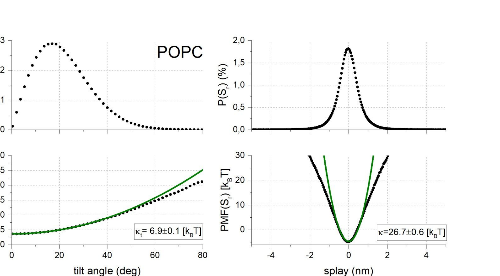

Figure S10. Visualization of the fitting procedure used for the determination of the tilt and splay moduli on example of POPC bilayer. Both probability distributions and PMFs of tilt angle θ and lipid splay S are presented. A quadratic function is fitted to PMF in range of [μ-σ, μ+σ] to obtain either tilt of bending moduli in low tilt/splay region. Values of tilt and splay modulus in function of fold kBT are also included.

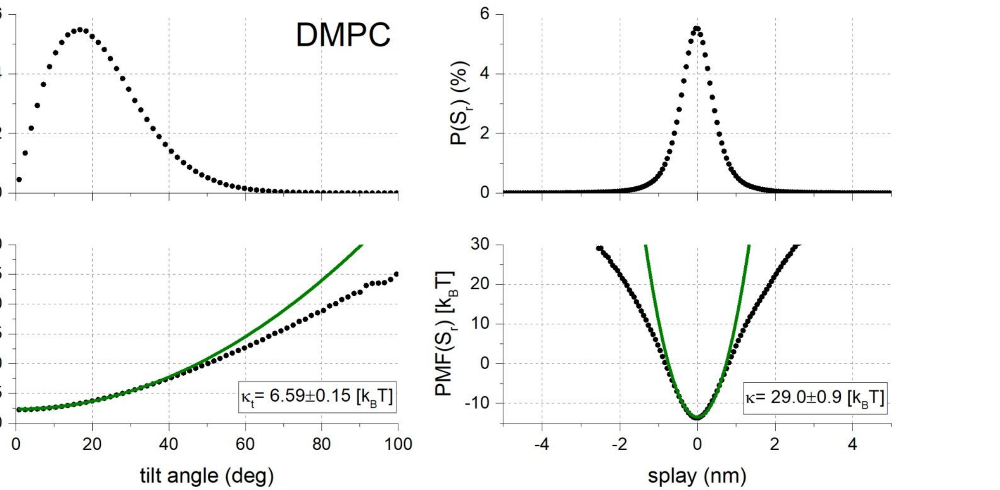

Figure S11. Visualization of the fitting procedure used for the determination of the tilt and splay moduli on example of DMPC bilayer. Both probability distributions and PMFs of tilt angle θ and lipid splay S are presented. A quadratic function is fitted to PMF in range of [μ-σ, μ+σ] to obtain either tilt of bending moduli in low tilt/splay region. Values of tilt and splay modulus in function of fold kBT are also included.

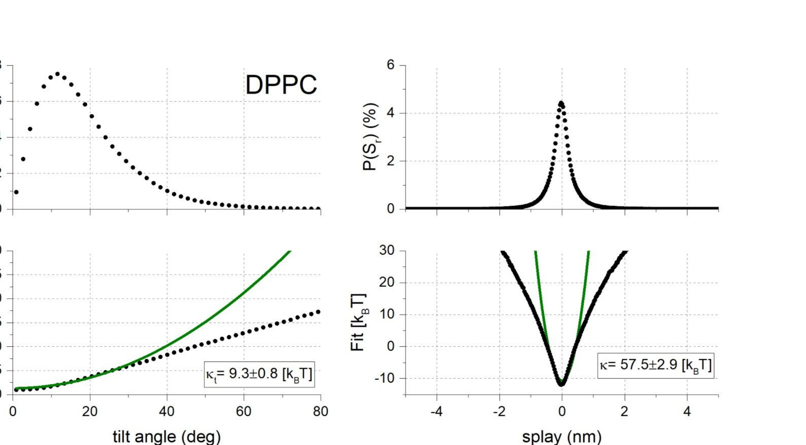

Figure S12. Visualization of the fitting procedure used for the determination of the tilt and splay moduli on example of DPPC bilayer. Both probability distributions and PMFs of tilt angle θ and lipid splay S are presented. A quadratic function is fitted to PMF in range of [μ-σ, μ+σ] to obtain either tilt of bending moduli in low tilt/splay region. Values of tilt and splay modulus in function of fold kBT are also included.

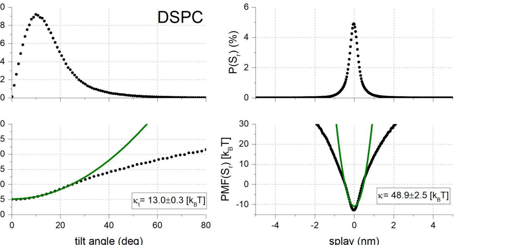

Figure S13. Visualization of the fitting procedure used for the determination of the tilt and splay moduli on example of DSPC bilayer. Both probability distributions and PMFs of tilt angle θ and lipid splay S are presented. A quadratic function is fitted to PMF in range of [μ-σ, μ+σ] to obtain either tilt of bending moduli in low tilt/splay region. Values of tilt and splay modulus in function of fold kBT are also included.

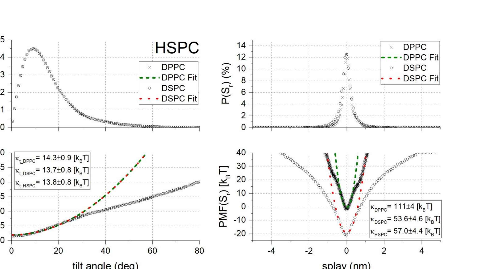

Figure S14. Visualization of the fitting procedure used for the determination of the tilt and splay moduli on example of HSPC bilayer. Both probability distributions and PMFs of tilt angle θ and lipid splay S are presented. A quadratic function is fitted to PMF in range of [μ-σ, μ+σ] to obtain either tilt of bending moduli in low tilt/splay region. Values of tilt and splay modulus in function of fold kBT for individual lipid types are also included, as well as final parameters calculated according to phenomenological dependency established to heterogeneous bilayers.

## 5. Flicker-noise detailed results

Presented in main paper bending rigidity coefficients determined in flicker noise spectroscopy were averaged values. They are averaged over at least 10 individual vesicles. However average value do not fully show the diversity of individual measurements. To this end the values of bending rigidity coefficient for individual vesicles as well as their average values are presented in this paragraph (Figures S15-18). They are presented for both average-based approach and statistical one. Furthermore image of vesicles are shown to further emphasize the difference in their shape, which is stated in main paper.

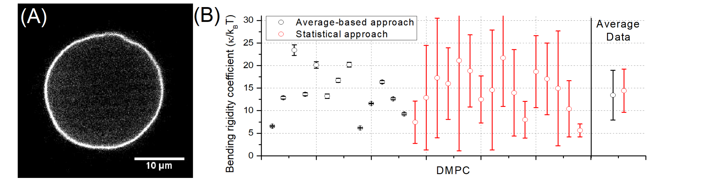

Figure S15. (A) Image of DMPC vesicle and (B) bending rigid coefficient values for individual measurements.

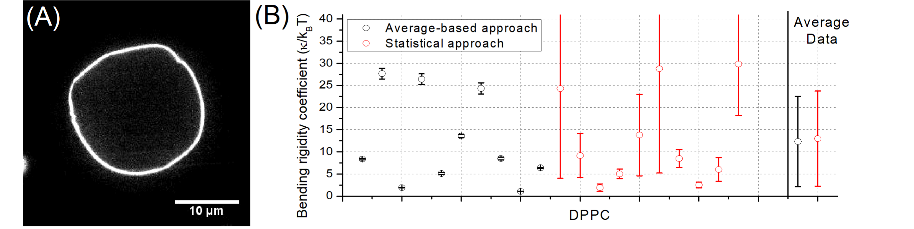

Figure S16. (A) Image of DPPC vesicle and (B) bending rigid coefficient values for individual measurements.

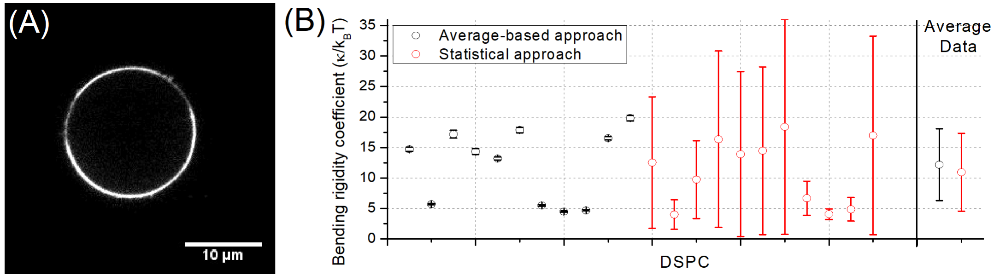

Figure S17. (A) Image of DSPC vesicle and (B) bending rigid coefficient values for individual measurements.

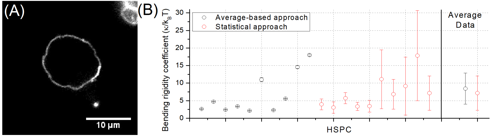

Figure S18. (A) Image of HSPC vesicle and (B) bending rigid coefficient values for individual measurements.

## 6. Time-stability of solid-ordered vesicles shapes

Vesicles created from lipids with Tm higher than room temperature exhibited oddly-rectangular shape rather than typical quasi-spherical one. This was more visible the higher was the Tm of lipid – namely observed 'bilayer wrinkles' were common view in DSPC, DPPC and HSPC, while they were less visible in DMPC. In this section time stability of this peculiar bilayer shape are shown. As one can see in Figures S9 and S10, visible 'wrinkles' can be seen stable for over a minute. Furthermore, the changes in the vesicle shape is mostly due to rotation of vesicle rather than change of individual *wrinkles*.

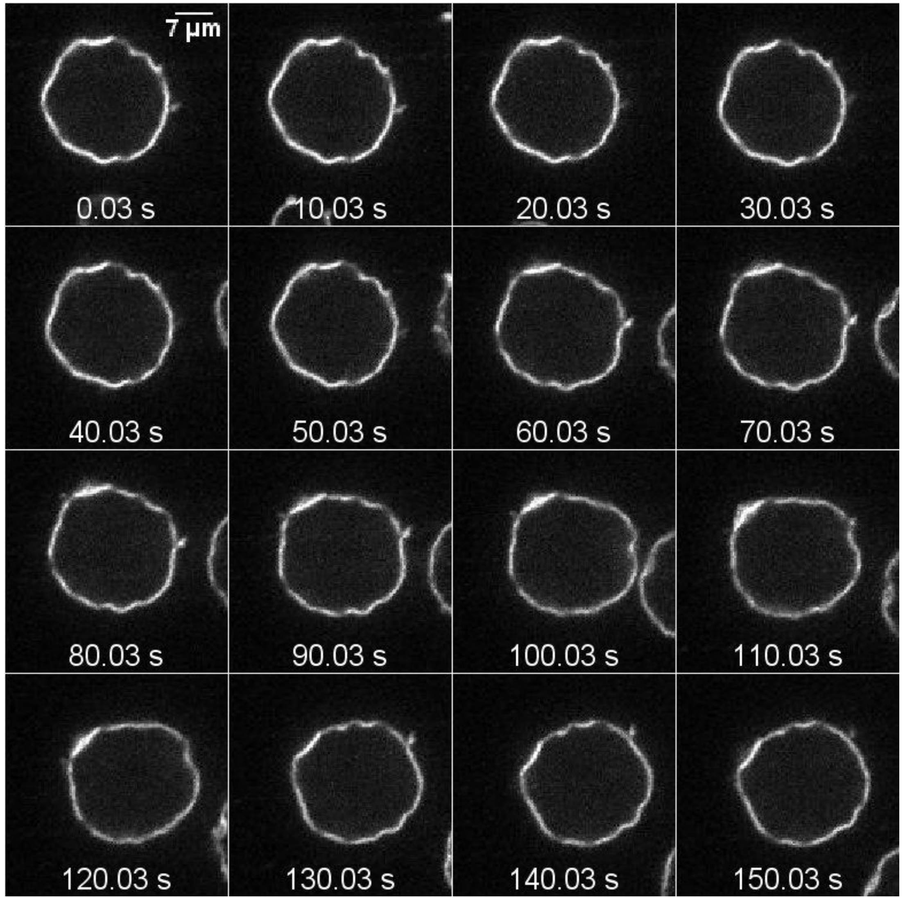

Figure S19. Time evolution of selected DPPC vesicle shape.

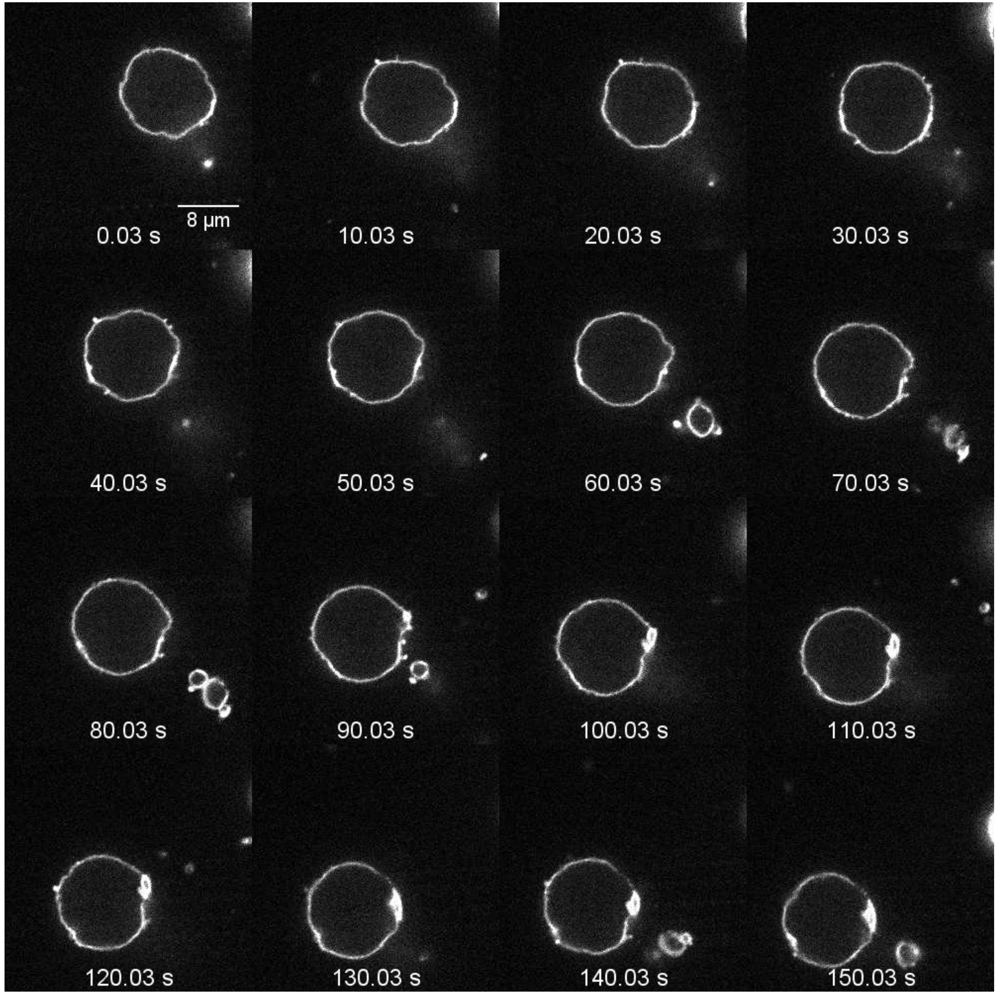

Figure S20. Time evolution of selected HSPC vesicle shape.

## 6. Bibliography

1. 1. Philips, J. C.; Braun, R.; Wang, W.; Gumbart, J.; Tajkhorsid, E.; Villa, E.; Chipot, C.; Skeel, R. D.; Kalé, L.; Schulten, K., Scalable molecular dynamics with NAMD. *Journal of Computational Chemistry* **2005,** *26* (16), 1781-1802.
2. 2. Lee, S.; Tran, A.; Allsopp, M.; Lim, J. B.; Hénin, J.; Klauda, J. B., CHARMM36 United Atom Chain Model for Lipids and Surfactants. *J. Phys. Chem. B* **2014,** *118* (2), 547-556.
3. 3. Kučerka, N.; Nieh, M.-P.; Katsaras, J., Fluid phase lipid areas and bilayer thicknesses of commonly used phosphatidylcholines as a function of temperature. *Biochimica et Biophysica Acta* **2011,** *1808,* 2761-2771.
4. 4. Piggot, T. J.; Allison, J. R.; Sessions, R. B.; Essex, J. W., On the Calculation of Acyl Chain Order Parameters from Lipid Simulations. *Journal of chemical theory and computation* **2017,** *13* (11), 5683-5696.
5. 5. Braun, A. R.; Sachs, J. N., Determining Structural and Mechanical Properties from Molecular Dynamics Simulations of Lipid Vesicles. *J. Chem. Theory Comput.* **2014,** *10,* 4160-4168.
6. 6. (a) Doktorova, M.; Harries, D.; Khelashvili, G., Determination of bending rigidity and tilt modulus of lipid membranes from real-space fluctuation analysis of molecular dynamics simulations. *Phys. Chem. Chem. Phys.* **2017,** *19,* 16806; (b) Johner, N.; Harries, D.; Khelashvili, G., Curvature and Lipid Packing Modulate the Elastic Properties of Lipid Assemblies: Comparing HII and Lamellar Phases. *The journal of physical chemistry letters* **2014,** *5* (23), 4201-6.
7. 7. Waheed, Q.; Edholm, O., Undulation Contributions to the Area Compressibility in Lipid Bilayer Simulations. *Biophys J* **2009,** *97,* 2754-2760.
