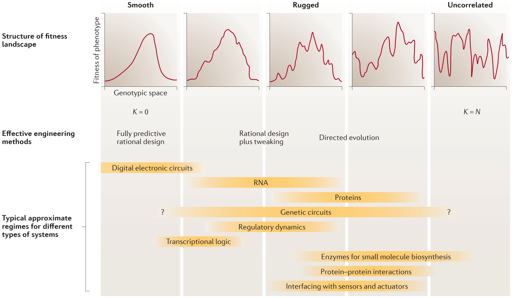
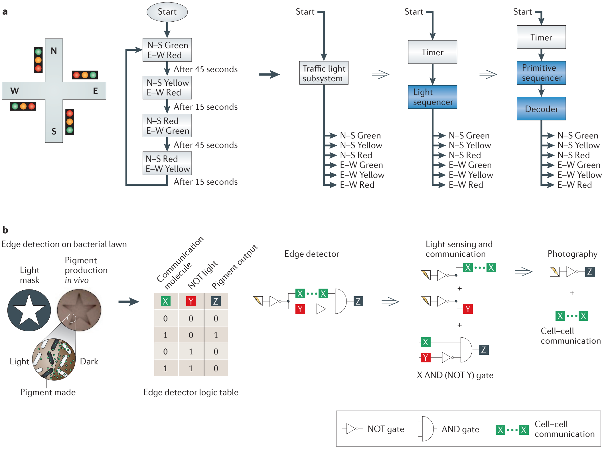
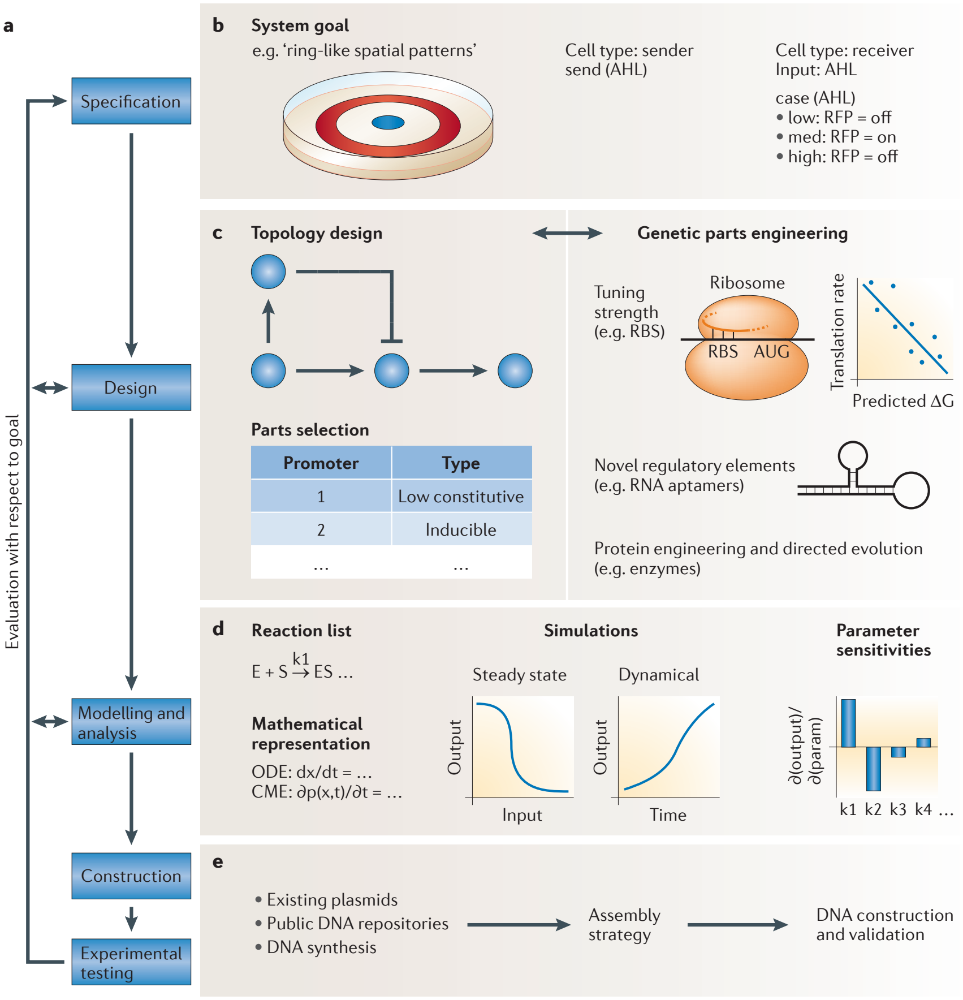
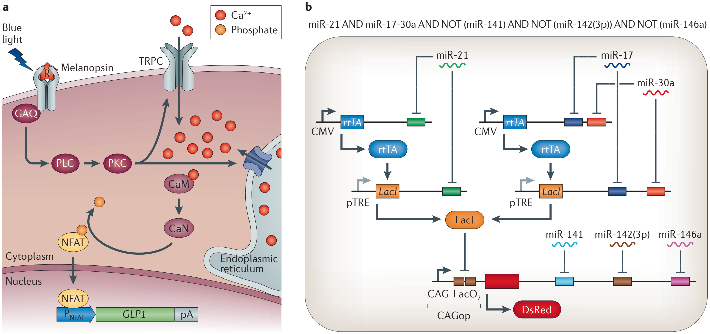

Foundations for the design and implementation of synthetic genetic circuits

# Foundations for the design and implementation of synthetic genetic circuits

Adrian L. Slusarczyk1, Allen Lin1 and Ron Weiss1,2

1Department of Biological Engineering, Massachusetts Institute of Technology. 2Department of Electrical Engineering and Computer Science, Massachusetts Institute of Technology, 77 Massachusetts Avenue, Cambridge, Massachusetts 02139, USA.

Correspondence to R.W. e‑mail: [rweiss@mit.edu](mailto:rweiss@mit.edu)

doi:10.1038/nrg3227

June 2012 | Volume 13

© 2012 Macmillan Publishers Limited. All rights reserved

Abstract | Synthetic gene circuits are designed to program new biological behaviour, dynamics and logic control. For all but the simplest synthetic phenotypes, this requires a structured approach to map the desired functionality to available molecular and cellular parts and processes. In other engineering disciplines, a formalized design process has greatly enhanced the scope and rate of success of projects. When engineering biological systems, a desired function must be achieved in a context that is incompletely known, is influenced by stochastic fluctuations and is capable of rich nonlinear interactions with the engineered circuitry. Here, we review progress in the provision and engineering of libraries of parts and devices, their composition into large systems and the emergence of a formal design process for synthetic biology.

Since its emergence as a discipline, synthetic biology has implemented synthetic digital1,2 and analogue3 computation in live cells. It has provided a rigorous mechanistic foundation for genome-scale systems biology by elucidating design principles of dynamical phenotypes using small circuits4,5 and has demonstrated the potential use of cells engineered with synthetic genetic circuits as living factories and as smart therapeutic agents6,7.

Although the field was initially established in bacteria, eukaryotic and specifically mammalian synthetic biology have now emerged as important subdisciplines. Recent advances in eukaryotic systems have included RNAi-based synthetic regulation, optogenetic gene circuits for the real-time study of brain physiology in live mammals8, improved tools for assembly of large DNA constructs and genome engineering9,10 and novel mammalian sensors and actuators. These developments have now made synthetic gene circuits a valuable and widely applicable tool for studying human genetics and cell biology.

In addition to their value as research tools and model systems, synthetic gene circuits are beginning to be applied to practical problems. Synthetic multi-component biosynthetic pathways11,12 for the production of pharmaceuticals, biofuels and fine chemicals have been among the first avenues to be pursued. Multi-input biosensors for pharmaceutical *in vitro* assay development13 also offer a clear path from academic research to commercial use. Synthetic biology has also driven technological progress at its periphery — for example, in DNA synthesis and assembly9,10 — and thus has given rise to new, commercially available products and services.

Figure 1 | **Design and evolution of phenotypes on rugged landscapes.** One reason why synthetic gene circuits may not always behave as predicted is that they do not function in isolation but in the context of living cells. Subcellular structure, nongenetic factors such as mass transport and crosstalk with endogenous gene networks combine with the action of synthetic gene circuits, as does feedback from the phenotype. The *NK* model of fitness landscapes131,132 for systems with *N* subunits (such as amino acids in a protein or genes in a regulatory network) and on average *K* interactions per subunit helps to conceptualize degrees of nonlinearity. If the fitness of the system is a linear combination of independent contributions from each subunit, then any change to a single subunit only marginally alters system fitness, and the fitness landscape is smooth. If changing a single subunit can have effects of unlimited magnitude on system fitness, the system is maximally nonlinear and uncorrelated, and small changes (or errors) can have drastic functional effects. Real biological systems have fitness landscapes of intermediate ruggedness. The smoother the landscape, the more effective rational design typically is. The regimes for genetic circuits remain uncertain (indicated by ‘?’). One goal in synthetic biology is to design parts and modules in such a fashion as to make systems-level fitness landscapes smoother: for example, by orthogonalization.

## Box 1 | **Engineering design across disciplines**

A formalized design process has proved to be indispensable in other engineering disciplines to handle the complexity of ever-larger projects, such as microchips and aircraft.

## Top-down decomposition of a traffic light controller

Consider a traffic light controller (panel **a** of the figure). It should signal green in north (N) and south (S) directions for 45 seconds, then yellow for 15 seconds and then red for 60 seconds, before repeating the entire cycle. The signals for east (E) and west (W) should vary correspondingly. One possible decomposition for a system implementing this behaviour is shown. First, the controller is decomposed into a timer and a light sequencer. The timer is a generic device and is widely commercially available; here, it signals after alternating intervals of 45 and 15 seconds. The light sequencer is further decomposed into a primitive sequencer, which translates the timer signal into one of the phases for each direction (namely, green, yellow, red and red) and a decoder, which translates the sequencer output into the ‘on’ or ‘off’ state of each colour for all lights. This simple decomposition reduced the original complex specification to more generic and readily available components.

## Retrosynthetic analysis in synthetic organic chemistry

In the first decades of organic synthesis, synthetic routes were exclusively conceived using a bottom-up approach: starting from available substrates with apparent structural similarity to the target, known reactions were used to obtain closer intermediates until, in successful cases, the target was obtained. In practice, this approach often failed because it inherently excluded non-intuitive reactants. The total synthesis of very complex molecules, such as natural products and vitamins, was boosted by Corey’s articulation of a top-down approach known as retrosynthetic analysis111. It makes no assumptions about the starting materials. Instead, the target is decomposed into successively simpler intermediates by known reactions until readily available starting materials are reached — which often bear no resemblance to the target. Many such possible paths are initially mapped out (sometimes with the aid of computers112), and chemical judgement based on intuition and experience then selects and attempts the most feasible.

## Synthetic gene circuit design

Many projects in synthetic biology in the past proceeded by bottom-up assembly alone. Increasingly, a more structured design process is emerging. Consider the edge detection circuit shown in panel **b**). First, the function of detecting edges between dark and light areas on an illuminated bacterial film is translated into a formal specification (‘if dark, produce no pigment; if light and neighbours are in dark, produce pigment; if light and neighbours also in light, produce no pigment’). It is then decomposed into light sensing and communication and a photographic inverter, which in turn are reduced to previously published subcircuits encoding light sensing, cell–cell communication and signal inversion. Panel **a** of the figure is printed and electronically adapted from REF. 110 © (1994) by permission of Pearson Education, Inc., Upper Saddle River, New Jersey. Panel **b** of the figure is adapted, with permission, from REF. 77 © (2009) Cell Press.

It should nevertheless be noted that the field is still in its infancy, much like synthetic chemistry in the early twentieth century or computer engineering in the middle of the twentieth century. Design and implementation of synthetic gene circuits remains too slow, difficult and challenging to scale-up to realize the potential of engineering biology. The highly interconnected nature of biological systems sometimes favours different approaches than those that are used in traditional engineering disciplines (FIG. 1). Stochastic noise and the difficulty of information-rich, precise and direct measurement in single cells at a high throughput further complicate the construction and parameterization of predictive models. Future progress will crucially depend on our ability to make the design and construction of large genetic circuits more reliable and predictable14. Here we therefore focus on foundational advances towards a formalized design process (BOX 1) and towards the creation of highly reusable classes of parts and modules to facilitate creating such circuits.

## The hierarchy of parts, modules and systems

We organize this Review by a hierarchy of synthetic parts, modules and systems. This hierarchy represents a continuum without hard boundaries, and the terms are operational and conventional rather than representing fundamental properties of life. Elementary ‘parts’ are DNA sequences with a defined function, such as promoters, genes or terminators. The term can also refer to gene products, such as transcription factors. The key feature of parts is that they are elementary functional building blocks. A ‘system’ will be taken to mean an integrated and independently functioning whole serving a useful purpose. A ‘module’ would be a subsystem of intermediate complexity consisting of several interacting molecules and performing a defined function, but as part of a larger whole. An example would be a toggle switch that encodes memory or a logic gate. Clearly, a system in one context may serve as a module of an even larger system elsewhere. This is similar to other engineering fields. For example, microscopic wires, resistors and capacitors may be thought of as the elementary parts of a computer. Its processor, memory and input–output devices may be seen as modules, and a fully usable personal computer may be seen as a system. In another context, that same computer may serve as a submodule of a large network or of an aircraft that it helps to control.

**Abstraction** The process of hiding the extraneous details of a specific implementation to highlight the salient and general features of a system or design.

## A design process for synthetic gene circuits

Synthetic biology strives to make desired phenotypes easier to implement by applying engineering principles, such as functional decoupling, abstraction and modularization to biology. Specifically, this has meant finding and optimizing suitable basic molecular parts, such as orthogonal transcription factors and promoters, characterizing their behaviour (or their ‘device physics’), collecting and documenting parts in repositories and developing standardized methods for DNA assembly and delivery.

Great progress has been made, especially in *Escherichia coli*. However, designing and implementing large and sophisticated systems (a process that is central to all engineering disciplines) was beyond the scope of early synthetic biology. And although most synthetic genetic systems to date comprise only a handful of regulatory units14, many potential applications of synthetic biology to science, medicine and industry require greater complexity. To manage such complexity, other engineering disciplines use formalized design comprising bottom-up assembly and top-down decomposition. The emergence of a formalized design process for synthetic gene circuits represents one of the most important current developments in synthetic biology.

In bottom-up assembly, engineers survey available parts and modules and conjure up possible combinations of them that might achieve the desired function. Design in most engineering disciplines started in this manner. As the fields have matured and as systems have become more complex, bottom-up assembly has been complemented by top-down decomposition. The latter begins with a detailed high-level formal specification of the desired functionality and constraints and successively breaks the problem until it has mapped a path to readily available basic building blocks. BOX 1 illustrates the idea.

Synthetic biology is now ready for formalized design by top-down decomposition coupled with bottom-up assembly. A key requirement is the sufficient availability of well-behaved parts and subsystems for diverse tasks and is increasingly met at least for transcriptional regulatory elements. Recent years have seen the increasing provision of classes of highly engineerable such parts, which are amenable to orthogonalization and fine-tuning of their characteristic properties.

Figure 2 | **Overview of the computer-aided design process.** **a** | The ideal design methodology encompasses five stages: specification, design, modelling and analysis, construction, and experimental testing. Multiple iterations may be required to obtain a circuit with the desired behaviour. **b** | The first step is formally to specify the overall circuit behaviour. Constraints on its steady state and dynamical behaviour in response to inputs should be established. **c** | Network toplogies are designed and populated with specific parts. Computer-aided design tools can be used to help find and optimize network topologies and kinetic parameters to achieve a specified behaviour. Novel parts, which have been rationally designed and fine-tuned with directed evolution, can be created to obtain desired kinetics or regulatory functionality. **d** | Physico-chemical kinetic modelling is used to analyse network behaviour and robustness to perturbations (so-called sensitivity analysis). Different network topologies may be modelled, and only the most promising ones are selected for experimental testing. **e** | The DNA is assembled and the circuit is experimentally tested. AHL, acyl homoserine; CME, chemical master equation; ODE, ordinary differential equation; RBS, ribosome-binding site; RFP, red fluorescent protein.

Table 1 | **Software tools for synthetic biology**

| Purpose | Software tool | Description | URL | Refs |
| --- | --- | --- | --- | --- |
| Specification | | | | |
| --- | --- | --- | --- | --- |
|  | Proto Biocompiler | Compiles high-level behaviour into a gene network | <http://proto.bbn.com/Proto/Proto.html> | 18 |
| Design | | | | |
| Topology design and part selection | Cell Designer | Creates network diagrams and associated models | <http://celldesigner.org> | 133 |
| GEC | Language for describing biochemical interactions | <http://research.microsoft.com/en-us/projects/gec/> | 134 |
| GenoCAD | Assembles gene circuits from parts using formal grammar | <http://www.genocad.org> | 135 |
| ProMoT | Creates and analyses modular models | <http://www.mpi-magdeburg.mpg.de/projects/promot> | 136 |
| SynBioSS | Creates network diagrams and associated models | <http://www.synbioss.org> | 137 |
| Tinkercell | Creates network diagrams that map to models and parts | <http://www.tinkercell.com> | 138 |
| Network optimization | Genetdes | Designs network to achieve desired dynamics | <http://synth-bio.yi.org/genetdes.html> | 139 |
| OptCircuit | Uses constrained list of parts to achieve targeted dynamics |  | 140 |
| RoVerGeNe | Finds kinetic parameters given desired dynamics | <http://iasi.bu.edu/~batt/rovergene/rovergene.htm> | 141 |
| Genetic part engineering | Mfold | Predicts RNA secondary structure | <http://mfold.rna.albany.edu/?q=mfold> | 142 |
| RBS calculator | Calculates RBS translation initiation rate | <https://salis.psu.edu/software> | 30 |
| Rosetta | *De novo* protein design | <http://www.rosettacommons.org> | 124 |
| Modelling and analysis | | | | |
| Intracellular | COPASI | Analyses biochemical network behaviour | <http://www.copasi.org> | 143 |
| Mathematica | Versatile mathematics suite | <http://www.wolfram.com/mathematica> |  |
| SimBiology (MATLAB) | Analyses biochemical network behaviour | <http://www.mathworks.com/products/simbiology> |  |
| Multicellular | CompuCell3D | Simulates multicellular behaviour | <http://compucell3d.org> | 144 |
| Construction | | | | |
| DNA design and assembly | Gene Designer | Graphical user interface for gene design | <https://www.dna20.com/genedesigner2> | 145 |
| GeneDesign | Suite of tools for gene design | <http://www.genedesign.org> | 146 |
| Data management | ClothoCAD | Data retrieval platform with plug‑in functionality | <http://www.clothocad.org> | 147 |

Formalizing design in other disciplines sometimes involves automation of important parts of the design process with computer-aided design. In organic synthesis, software can enumerate a large number of possible retrosyntheses, and human judgment can select the most promising routes15. In synthetic biology, a range of new computational tools has been created16,17 (FIG. 2; TABLE 1). Effort is underway towards automatically generating *in silico* regulatory gene circuits from high-level specifications18; such strategies are subject to design constraints in dynamical behaviour or available parts (FIG. 2; TABLE 1).

Highly formalized design may not be applicable to all aspects of synthetic biology (FIG. 1). For example, engineering of sensors and actuators and interfacing with the cellular context remain application-specific in nature. But efficient design of the transcriptional regulatory signal processing circuitry alone, which intermediates between sensory inputs and actuation, would already simplify the construction of new living systems.

This Review is guided by three questions. How readily can the characteristic properties of parts and modules be tuned and adapted? How well do their properties facilitate their reusability and composability into higher-order systems? Finally, what lessons can be learned from recent examples of systems-level design and implementation?

## Engineerable classes of molecular parts

From the outset, synthetic biology placed great emphasis on the collection, characterization and standardized assembly of molecular parts2. These include transcription factors, ribosome-binding sites (RBSs), senders and receivers for cell–cell communication and outputs such as fluorescent reporters and biosynthetic enzymes; especially in the core functional categories such as transcriptional regulation, substantial numbers of parts are becoming available. If, however, a novel specificity or different rate or affinity is required of a molecular part, attaining it is often not trivial and requires, for example, protein engineering19.

## Box 2 | **Desirable properties of parts, modules and systems**

The properties of the components used for synthetic gene circuits matter greatly for ease and reliability of engineering. Certain such properties are almost universally desirable (although there are exceptions to this rule). For example:

* Specificity of regulatory or metabolic parts and pathways is necessary to ensure predictable function.
* Orthogonality of parts or of circuits refers to the absence of interactions with native cellular pathways and can be achieved, for example, by using parts from distant phyla or by deliberately re-engineering for orthogonality.
* Sensitivity and robustness may appear to be contradictory requirements: good parts and modules should be robust (that is, unresponsive) to most cellular and environmental fluctuations but sensitive to the signals that they are designed to respond to.
* Furthermore, it may be useful for them to be tunable: that is, to alter sensitively the strength or specificity of their response in a well-defined fashion following, for example, mutation of certain amino acid positions or binding to a small molecular modulator. Tunability of molecular parts is essential for the tunability of more global module or systems-level responses. For example, tuning of the activity of a transcription factor in an oscillatory gene circuit may be used to vary the period of its oscillation in a well-defined way.
* To implement large systems, components must be compatible. One common problem stems from reuse of parts: if the same regulatory molecule has different roles in two modules, these modules can probably not be used in the same cell. Thus, availability of many parts with equivalent function but different specificities (orthogonal parts) facilitates compatibility.
* Composability refers to the potential of parts and modules that are to be included in larger systems and maintain function. One requirement for composability is that the signal-to-noise ratio of module outputs is at least as large as that of the inputs.
* Matching signal strengths among components, or the ability to tune them in overlapping ranges, is likewise crucial.

To a large extent, these properties must first and foremost be ensured at the level of molecular parts and then propagated throughout the system hierarchy. For example, if all regulatory proteins in a circuit are chemically orthogonal to the cellular context and to each other, the circuit modules will also be orthogonal. However, network motifs and topologies also matter. For example, a toggle switch can be implemented using a simple autoregulatory positive feedback loop or using two mutually repressing regulators. But the latter topology is substantially more robust with respect to noise in the input signal and with respect to the kinetic properties of its components than the former60.

In this Review, we emphasize the importance of the wide availability of parts and modules possessing these desirable properties for facilitating design and implementation of sophisticated systems.

In evolutionary history, unusually malleable protein folds have been selected. A small number of such architectures, including the TIM barrel and the immunoglobulin fold, make up the great majority of protein domains20 and have proved to be exceptionally amenable to protein engineering. It would likewise be desirable in synthetic biology to have classes of molecular parts with reliably consistent behaviour in most respects, malleability of some parameters (such as specificity and strength) and interoperability deriving from mutual orthogonality between different class members (BOX 2).

***Transcription factors.*** Transcriptional regulators are such a class of parts for which using a number of highly engineerable molecular architectures would be advantageous. Initial efforts in synthetic biology used tried, proven and well-characterized transcription factors21. These, however, are limited in number and require extensive individual characterization. It would be highly desirable to have classes of transcription factors that can be altered and diversified to obtain sets of multiple, mutually orthogonal parts with desired specificity and strength and otherwise consistent biochemical behaviour (such as oligomeric state, synthesis rates and degradation rates).

The discovery of the zinc finger DNA-binding architecture predates the advent of synthetic biology by two decades and was soon followed by the creation of *de novo* transcriptional activators and repressors with arbitrary sequence specificity22. They were the first such modular and engineerable transcriptional regulators to be widely used23. Zinc finger domains can be engineered by directed evolution to recognize any nucleotide triplet in DNA. They can be linearly fused specifically to recognize any longer (and thus rarer) sequence, and they have been fused to transcriptional activation and repression domains, as well as to DNA nucleases, which can be used for genome engineering at specific loci. However, zinc fingers do have drawbacks: directed evolution of their specificity is time-consuming, and their specificity does depend on sequence context, limiting the possibility of rational design.

Recently, a new protein fold has been described that seems to lack the limitations of zinc fingers and has been greeted with enthusiasm in the synthetic biology community. Transcription-activator-like (TAL) effectors from parasitic plant bacteria have evolved under great pressure for modular evolvability of their specificity. The result is a protein scaffold with one-to-one, context-independent correspondence between pairs of amino acid residues and single nucleotides24–26. The apparent ease with which synthetic TAL transcriptional activators have already been engineered is striking24,27 and holds the promise of reliable and rational design of transcriptional repressors, nucleases and other DNA-sequence-specific regulators and actuators for any target sequence.

**Actuation** The action on the internal or external environment that constitutes the output of a synthetic gene circuit.

**TIM barrel** A conserved protein fold named after triose phosphate isomerase (TIM) and shared among many enzymes with widely differing substrate specificities and catalytic activities.

**Immunoglobulin fold** A very common protein fold that is based on a β-sandwich. Contains hypervariable loops, which can accommodate almost any sequence and bind a wide variety of partners.

***RNA parts.*** RNA can be used to construct molecular sensors, signal-processing devices and enzymatic and regulatory actuators. Desirable properties for parts such as orthogonality and ease of engineering of specificity and strength are usually more readily found in nucleic-acid-based devices than they are in protein-based molecular devices, making RNA attractive for gene circuit design28,29.

RBSs have long been used as modulators of gene expression in bacteria. Initially, sets of RBSs were characterized and collected; however, sequence context, including the downstream coding sequence, does considerably influence RBS strength. To resolve this, Salis and colleagues30 developed a thermodynamic model of transcriptional initiation. They not only predicted the expression strength of a given RBS and transgene, but by combining their model with a Metropolis–Monte Carlo algorithm, they were able to forward-engineer RBS sequences with a desired strength for a given gene. In addition to predictive modelling, directed evolution of RBSs for multiple genes in a circuit has been successfully used to optimize dynamic function31 or metabolic production12.

Recently, RNAi has been harnessed for synthetic eukaryotic regulation and has been used to improve a mammalian bistable switch32, to detect microRNA (miRNA) species in living cells33 and to detect mRNA in cell-free lysates34. The miRNA-based cell classifier developed by Xie and colleagues35, which uses both endogenous miRNA as an input and orthogonal miRNA as part of the synthetic circuit, demonstrates the power and scalability of circuits constructed from such parts. miRNAs can be rationally designed to target any mRNA, and it is furthermore possible to include known orthogonal miRNA target sites in the 3′ untranslated region of any message. This makes it easier to scale-up synthetic gene circuits that use RNAi in addition to transcriptional regulation than it is to scale-up those circuits that are based solely on transcription factors.

Transcriptional regulation using antisense RNA in *E. coli* (via a mechanism that is distinct from RNAi) has also been used to construct synthetic transcriptional regulatory circuits such as cascades36. As RNA is more amenable to rational engineering of its properties than proteins, Lucks and colleagues36 were able to construct mutually orthogonal variants of their regulators by rational mutagenesis. By combining multiple target sites for regulatory RNAs in the same promoter, they were further able to build logic gates with multiple inputs using a simple architecture.

Sensing of signals from inside and outside the cell is essential to gene circuits, and here RNA can also help. RNA aptamers37,38 change their secondary structure when they are bound to specific small molecules (such as theophylline and aminoglycosides) and have been combined into signal processing devices by fusion to ribozymes or regulatory regions in mRNAs39,40. More recently, engineered ligand-responsive aptazymes for controlling gene expression exhibit substantially larger changes in output following ligand addition41. The generation of aptamers by directed evolution is quite efficient42 and has been extended to protein sensors as well43. Modes of actuation that have been linked to aptamer sensors include not only modulation of RNA functions such as splicing and translation but also direct control of protein activity44, including that of transcription factors45.

***Surface receptors and signal transduction.*** Protein interactions are a highly attractive target for biological circuit design. They allow sensing of diverse signals and exhibit faster dynamics compared to transcription. In bacteria, two-component systems provide a modular toolkit for sensing chemical46 and optical47,48 inputs. They can be rewired by swapping the sensor and kinase domains of the sensor histidine kinase47. Furthermore, Skerker and colleagues46 computationally identified and experimentally verified small numbers of specificity-conferring residues in the kinase domain, taking one step further towards the rational creation of sets of orthogonal novel sensing pathways.

In mammalian cells, encouraging results have been obtained with optically controlled ion channels that activate downstream functions in cell culture and live animals (reviewed in REFS 49,50). The molecular strategies used include engineering channelrhodopsins51, using light-sensitive domains to modulate binding52, kinase53 or G-protein-coupled receptor (GPCR)54 activity and using photocaged unnatural amino acids for fast activation of kinases55. Chemical sensing by engineered ligand-gated ion channels56 and GPCRs57 has also been realized. Crucially, screening and selection methods for directed evolution of their specificity56,58 are being implemented, potentially turning these eclectic collections of parts into engineerable classes of parts. Mammalian protein interaction networks for post-sensory signal processing have been engineered using a highly modular domain recombination approach (reviewed in REF. 59). This will be discussed in the next section.

**Photocaged unnatural amino acids** Unnatural amino acids containing a photosensitive masking group, which following activation by light reveals a biologically active functional group.

## Engineerable classes of modules

Like parts, modules must be composable and tunable to facilitate reuse as well as design and construction of higher-order gene circuits. Like larger systems, they are themselves multicomponent genetic circuits, typically with internal regulatory dynamics. Examples include quorum-sensing modules for communication, signal-processing modules (such as switches and logic gates) and output modules (such as biosynthetic pathways). Here, we focus on classes of modules that are useful for a broad range of applications; typically, this is truer for signal-processing modules than it is for more project-specific input and output modules. Nevertheless, a rich repertoire of sensors and actuators constitutes the ‘business end’ of synthetic gene circuits, and expanding it is an important future task for the field.

**Quorum sensing** Sensing of population density by cell–cell communication.

Much noteworthy research must unfortunately remain beyond the scope of this Review. The particular classes of modules covered here are demonstrative examples of types of module function, desirable properties and design methods. Reviews on scientific4,5 and biomedical6,7 applications of synthetic gene circuits, as well as the other reviews cited in this section (for example, on switches60 and oscillators61), offer further detail.

***Transcriptional signal processing.*** Transcriptional signal-processing modules have been the major focus of synthetic gene circuit design to date. Examples include logic gates, cascades, bandpass filters, switches and memory. Synthetic transcriptional oscillators offer an insightful case study into the iterative improvement of module design (reviewed in REFS 4,61). Many different oscillators have been built, partly motivated by an interest in the biological design principles of circadian clocks. The initial ring oscillator reported by Elowitz and Leibler3 displayed periodic gene expression but lacked persistence (that is, the oscillations died out quickly), tunability and regularity of period and amplitude and population-level phase synchronization. Using a positive-feedback oscillator, Atkinson and colleagues62 were able to obtain persistent oscillations with greater period than the cell division time of *E. coli*. Stricker and colleagues63 also combined tunable positive-feedback loops and tunable, delayed negative-feedback loops. This produced a persistent oscillator over a wide range of parameter values and with tunable period. By implementing the same topology but with cell-to-cell coupling by diffusible quorum-sensing molecules, Danino and colleagues64 then built a population-synchronized oscillator.

**Oscillators** A circuit with a periodically varying output signal.

**Bandpass filters** A circuit that lets through signals within a certain frequency range but not outside it.

These different oscillators vary in crucial ways. For most purposes, the properties of interlocking positive- and negative-feedback loops make them a better module design than ring oscillators. This topology is also somewhat independent of the molecular implementation; a robust and tunable mammalian oscillator has been built that is based on a similar design65. Independence with respect to detailed part kinetics also means that given sufficient numbers of suitable parts, the Stricker oscillator could be implemented with different transcription factors in the same cell, ensuring interoperability. Whether coupling is desired (for population-synchronized phenotypes) or explicitly not desired (for example, to break symmetry) will depend on the application.

**Topology** In a network, the set of all connections among nodes. Depending on what the network signifies (for example, molecular binding, genetic regulation or metabolic fluxes), the network topology takes different meanings. For synthetic gene circuits, topology usually refers to regulatory relationships.

Like oscillators, other classes of transcriptional regulatory modules, such as switches and logic gates, have seen a proliferation of implementations using different topologies, different organisms and diverse biochemical mechanisms, such as Krüppel-associated box (KRAB) repression domains, which mediate DNA methylation66 and integration of non-transcriptional mechanisms such as RNAi32 or dynamic DNA recombination67,68. Such differences in implementation make for modules that differ in functionally relevant ways: for example, in robustness, characteristic timescale or potential for crosstalk.

***Cell–cell communication.*** Engineered intercellular communication modules have been widely used in bacterial synthetic gene circuits, and some have been established in eukaryotic hosts. Intercellular communication modules consist of a sender submodule, which synthesizes a chemical signal, the signal molecule itself and a receiver submodule that detects and transduces the signal. Having multiple orthogonal, tunable and engineerable communication channels is essential for engineering multicellular entities, such as microbial consortia69 and engineered tissues.

In synthetic biology, bacterial quorum-sensing pathways have been adapted for intercellular communication with great success70. They have been used to implement population-wide synchronization64, pattern formation71,72, population control73, synthetic ecosystems74,75 and multicellular computing76,77. Several partially orthogonal systems are available that rely on different acyl homoserine (AHL) molecules as signals. One problem is that receiver proteins weakly recognize non-cognate AHLs, leading to crosstalk. Part-engineering of the receptors by directed evolution has been used to minimize such crosstalk78, but mutual orthogonality is a challenge for the establishment of many more AHL channels. More importantly, it is in general difficult to engineer biosynthetic enzyme clusters that are capable of producing a modified AHL, which limits our ability to generate many independent AHL communication channels. Beyond AHLs, signalling peptides used by Gram-positive bacteria79,80 and two-component signalling systems46,81,82 are promising starting points for synthetic cell–cell communication in bacteria.

**Two-component signalling systems** A type of response system commonly found in bacteria and typically consisting of a membrane-bound, sensory histidine kinase and a soluble response regulator.

In eukaryotic cells, several uses of metabolites such as adenine83, amino acids84, acetaldehyde85 or nitric oxide86 have been reported. Yet such signals are not orthogonal to the host cell and thus are suitable for some, but not all, applications. Chen and Weiss87 used plant-derived machinery to engineer orthogonal communication in yeast. Although this is promising in principle, the use of evolutionarily distant species as a source of orthogonal parts and modules has so far yielded fewer successful examples for engineered mammalian communication than for other uses, such as transcriptional regulation, presumably because several submodules (such as sender, signal, receiver and transducer) have to function in the new context and have to be orthogonal.

***Protein-protein interaction modules.*** A great diversity of intracellular signalling networks has evolved in eukaryotic cells to transduce signals across the plasma membrane, to process them and to relay them to actuation processes, including cell migration, the cell cycle and differentiation. Such signal transduction and processing relies primarily on protein–protein interactions. This allows it to operate on faster timescales than transcriptional dynamics but also makes signalling more difficult to engineer.

**Signal transduction** The triggering of an intracellular event following detection of an extracellular cue by a transmembrane receptor molecule.

Lim and co-workers have used modular domain recombination to engineer eukaryotic cell signalling (reviewed in REF. 59). The natural modularity of membrane receptors, scaffold proteins, adaptors and the regulatory domains of downstream actuators means that a small number of catalytic, allosteric and binding domains can be combinatorially composed into proteins that act as signal-processing modules. Lim and colleagues were thus able to re-wire the connectivity of yeast mitogen-activated protein kinase (MAPK) pathways88, to tune the transfer function of a module rationally89 and to use autoinhibitory domains to alter the temporal dynamics of a module to obtain a pulse generator, which produced a pulse response to a step input90. Using combinatorial libraries of domains and subsequent screening, they furthermore demonstrated that the modular domain architecture results in high enrichment for functional, coherent phenotypes, thus rendering library screening a viable strategy for engineering new function in cell-signalling circuits91.

These signal-processing modules are of substantial use in eukaryotic synthetic biology. They allow interfacing of genetic regulatory circuits with sensory inputs and actuation mechanisms, and in conjunction with suitable ligand synthesis, secretion and receptors, they will be an essential component of cell–cell communication systems. They are modularly recombinable and tunable, and specificities and wiring have been shown to be amenable to engineering. A central problem to be addressed in future work is increasing the ease and predictability of such manipulations.

## Box 3 | **Methods for engineering biology**

| Molecular scaffold | Function | Engineering method | Refs |
| --- | --- | --- | --- |
| Immunoglobulin; FN3 domain; designed ankyrin repeat proteins (DARPins) | Binding of proteins and small molecules | Directed evolution | 113–115 |
| microRNA | Post-transcriptional regulation | Rational design | 33,35,116 |
| Transcription-activator-like effectors | DNA binding; transcriptional regulation; genome editing | Computational or rational design | 24,27,117,118 |
| Surface receptors | Chemical and optical sensing | Directed evolution; library screening | 50,51,56,57,119,120 |
| Scaffold and signal processing proteins | Cell signalling | Domain recombination | 59 |
| Natural product synthetases | Small-molecule biosynthesis | Domain recombination; directed evolution | 121,122 |
| TIM barrels | Small-molecule biosynthesis | Rosetta design; directed evolution | 107,123,124 |

## Molecular parts

Biomolecular engineering predates synthetic gene circuit design and has established a range of methods for generating proteins and nucleic acids for specific purposes. Engineering by rational design makes premeditated changes in the sequence of a biomolecule to achieve a desired function. For example, variants of GFP with different colours have been created by introducing point mutations in or near the fluorophore. Such changes can follow intuition or can be chosen by a computer algorithm and might require iteration. Rational design usually requires detailed mechanistic and structural knowledge of the molecule, and even then it is often limited by unpredictable interactions during folding or by substantial deleterious effects of subtle structural perturbations. Diversity-based approaches redress these limitations by simultaneously testing large libraries of molecular variants for the desired function. Directed evolution uses multiple rounds of diversity generation and screening or selection to accumulate gradual improvements to the functionality of a molecule. Limitations are the availability of suitable starting points, the need to generate and maintain sufficient diversity and the availability of a high-throughput method for screening or selection. In practice, successful strategies for biomolecular engineering often combine rational (that is, computational) methods for creating a minimally functional starting structure (or a focused library of reasonable starting structures) and evolution for further refinement. Additionally, different classes of proteins and nucleic acids yield themselves to different strategies (see examples in the table).

## Modules and systems

Rational design has arguably been more successful for genetic circuits than for protein engineering. Possible reasons include the smaller number of network nodes in synthetic gene circuits compared with the number of amino acids in typical proteins and the absence of as many nonspecific interactions (which in proteins often occur through structural effects that propagate throughout the molecule). Examples of rational design, library selections and complex multimodal engineering strategies for genetic circuits are given throughout this Review.

## Engineerable by design

Parts and circuits differ in their suitability for different engineering methods. For example, consider the nucleic acid binding specificity of different regulators of gene expression. For microRNA, it can be trivially altered in a rational way. For transcription-activator-like domains, it also follows a known code but may require some tweaking for efficiency and specificity of binding. For zinc finger domains, its alteration requires directed evolution. Finally, for many binding domains, it cannot be arbitrarily altered without abolishing function altogether. Likewise, different circuit topologies are easy to tune, to connect and to use in different cellular contexts, whereas others are not. A major goal of synthetic biology is to establish toolkits of classes of engineerable component parts and modules and associated engineering methods that make it easier to design and to implement sophisticated systems.

***Design methods and principles for modules.*** The topology of small signal-processing modules can be, and has often been, designed to be bottom-up. The basic architecture of a module that may serve as, for example, an oscillator or a NAND gate may derive from *a priori* reasoning, from naturally occurring motifs in gene networks92 or from other fields, such as physics or engineering, in which similar problems have been studied. This initial idea can then be mapped to a possible biological implementation and can be tested computationally before being constructed in living cells. An alternative approach is to obtain possible module architectures by *in vivo* library screening93 or by *in silico* evolution94,95. However, diversity-based approaches have been less often used for generating circuit topologies than for parameter tuning31,96. A more comprehensive discussion of library-based approaches will follow in the next section and in BOX 3.

**NAND gate** A digital logic gate that implements the logical NAND, or ‘NOT AND’. Its output is low when all inputs are high and is otherwise high.

How does one ensure that a module under design will be well-behaved with respect to system requirements? The properties of small circuits are determined by the nature and properties of their molecular parts, by the circuit topology and by the detailed biochemical nature of the linkages between parts, as well as by the context in which they operate. These linkages can be covalent bonds (as with multidomain proteins), transcriptional *cis*-regulation or non-covalent bonding (as in the case of scaffolds). Mathematically capturing the linkages for modelling may require accounting for physical processes, such as convection and diffusion of a signal molecule in an inhomogenous extracellular matrix.

Thus, orthogonality and minimal crosstalk usually have to be ensured at the level of parts, whereas robustness, tunability and reliability crucially depend on circuit topology. That different topologies of circuit modules, even with qualitatively similar logic or dynamics, may vary in their robustness to perturbations is a central lesson from the early work of this field on switches and oscillators97. Nature, through evolution, has learned this lesson, too. ‘Robustness by design’ in noisy contexts is a pervasive theme in frequently occurring natural network motifs98,99. The underlying biochemistry will do much to determine the possible timescales, the potential for inadvertent crosstalk (or deliberate interfacing) with the endogenous cellular machinery and the ease of composition into larger systems.

## Integrated purposeful systems

Living organisms exhibit multitudes of varied and sophisticated phenotypes that are often many levels of abstraction removed from the base sequence of their DNA and that arise through interactions of regulatory information flows, chemical catalysis and physical and material structure.

Consider the DNA sequence encoding a protein kinase. The molecular phenotype — that is, enzymatic activity and specificity — requires folding of the polypeptide into a defined three-dimensional shape. Expression and structure of the substrates of the kinase, and its own regulation by other enzymes, assign it a role in a regulatory network: for example, negative feedback effecting a transient response to a step stimulus. Depending on the inputs and outputs, this ability to respond transiently could be part of a genetic module governing, for example, chemotaxis or secretion of a hormone with high-level organismal function. Thus, complex traits emerge from genes through multiple nested scales of functional interactions (see also FIG. 1).

Synthetic biology is beginning to build integrated systems that are composed of functional modules, which in turn are built from molecular parts; that is, they are two or three levels of abstraction removed from the gene. Here, we thus define a synthetic biological system and review key themes in the advance towards composition of modules and parts into synthetic gene circuits encoding such complex systems.

***Top-down decomposition, bottom-up assembly and reusable modules.*** For complex new biological behaviours, it is not easy to design a viable genetic implementation directly and by intuition alone (see above in ‘A design process for synthetic gene circuits’). The edge detection circuit by Tabor and colleagues77 shows well how design by top-down decomposition helps to keep the functional complexity at each level within cognitively manageable proportions (BOX 1).

**NOR gates** A digital logic gate that implements the logical NOR, or ‘NOT OR’. Its output is low when at least one input is high and is otherwise high.

A pair of important studies by Tamsir and colleagues76 and by Regot and co-workers100 shows how compartmentalization in multicellular consortia can help to simplify module reuse and composition into complex systems. Tamsir *et al.*76 implemented all 16 possible logic functions with two inputs in *E. coli* using only combinations of NOR gates. They showed the feasibility of designing a complex phenotype (composite logic functions) by decomposition into simpler functions (differently connected NOR gates) and then implementation by predictable bottom-up assembly of previously characterized parts. They decomposed all two-input Boolean functions into NOR gates, which is a well-known result in mathematical logic. Then, sets of NOR gates were constructed and characterized in a separate bacterial subpopulation, along with cell–cell communication by quorum sensing that defined the ‘wiring’ between the gates.

Working in yeast rather than *E. coli*, Regot and colleagues100 implemented a set of logic gates, such as AND gates and NOT gates, in each cell and linked them via cell–cell communication. The sensory inputs included doxycyline, glucose and estradiol. Cell–cell wiring was implemented using yeast pheromones. By co-culturing populations of cells with appropriate internal logic and input–output wiring, they were able to compose logic gates into circuits that were capable of more complex computation, such as binary addition with carry.

**AND gates** Digital logic gates that implement the logical AND. Their output is high when all inputs are high and is otherwise low.

**Binary addition with carry** Addition of numbers represented in a base-2 numeral system, where care is taken to carry digits to the left as necessary. For example, 01b + 01b = 10b (in decimal numbers, 1 + 1 = 2).

## Box 4 | **Of mice and men**

Mammalian cells are challenging yet highly attractive targets for synthetic gene circuit design. They offer access to a rich repertoire of endogenous programs and mechanisms for engineering, as well as an opportunity to understand and cure disease6.

## Foundations

Major milestones of synthetic gene circuit design in bacteria have been recapitulated in mammalian cells, including digital logic125, switches32,66, oscillators65,126,127 and chemical and optical control over circuit dynamics49–59. In addition, several of these studies and others take advantage of molecular and mechanistic possibilities that are unique to eukaryotic or mammalian systems, such as mRNA splicing127, RNAi32 and the modular repertoire of eukaryotic scaffold and signalling protein domains59.

## Integrated purposeful systems

Several mammalian circuits published to date demonstrate general design strategies and considerations in higher eukaryotes. They also point towards sophisticated applications even though the field is still in its infancy. Ye and colleagues104 reported a light-controlled synthetic gene circuit controlling insulin production in live diabetic mice (panel **a** of the figure). By interfacing synthetic regulation (here, melanopsin as an optical sensor, sensing the photoisomerization of retinal by blue light) with existing mammalian circuitry (calcium signalling) and heterologous actuation (glucagon-like peptide expression from the calcium-responsive nuclear factor of activated T cells (NFAT) promoter), they elegantly implemented a hybrid synthetic–natural gene circuit giving rise to a novel phenotype (regulation of blood-glucose levels) by introducing just two simple transgene constructs. Although pleiotropy is a risk, such ‘plug and play’ generation of novel function is not only appealing to engineers but seems to have been selected for in the evolution of core machineries, such as the second messenger systems128.

The cell classifier circuit by Xie and colleagues35 is designed to detect a predetermined expression profile of many microRNAs that are characteristic of a cell type of interest (panel **b** of the figure). Conditional on detection of the correct profile, the circuit drives expression of an output such as a fluorescent reporter (DsRed) or apoptotic actuator to kill cancer cells. Designing gene circuits for detection of microRNA biomarkers is simplified by the fact that their target sites are simply complementary sequences, and scaling to multiple inputs is possible by combining multiple different target sites in the 3′ untranslated region of an mRNA.

## Challenges and outlook

Mammalian synthetic biology is presented with opportunities and challenges by the high degree of spatial organization via organelles, scaffold proteins and chromatin architecture, by the multilayered genetic regulation by epigenetic marks, extensive higher-order *cis*-regulatory logic and dynamics129, alternative splicing and non-coding RNA and by the sensitivity of cell signalling to a plethora of mechanical and chemical cues from each other and their environment, to name but a few examples. The works discussed here exemplify the vigorous and creative efforts of the field to make the most of what makes higher eukaryotes special. Certain current technical challenges will hopefully soon be made irrelevant by technological advancement: better DNA assembly9,10, better delivery across the cytoplasmic and nuclear membranes130 and better tools for genome editing9 would address key bottlenecks in mammalian cell engineering. CAGop, CAG promoter combined with two copies of the Lac operator; CaM, calmodulin; CaN, calcineurin; CMV, cytomegalovirus; GAQ, GAQ-type G protein; PLC, phospholipase C; PKC, phosphokinase C; pTRE, tetracycline responsive element promoter; R, retinal; rtTA, tetracycline reverse transcriptional activator; TRPC, transient receptor potential channels. Panel **a** of the figure is adapted, with permission, from REF. 104 © (2011) American Academy for the Advancement of Science. Panel **b** of the figure is adapted, with permission, from REF. 35 © (2011) American Academy for the Advancement of Science.

The cell classifier built by Xie and colleagues35 (see also BOX 4) can be decomposed into modules for sensing endogenous miRNA, modules for signal processing, such as double inversion module and the AND gate, which integrates all inputs to compute a decision, and finally the cell-killing actuation module, which activates the endogenous apoptotic pathway, demonstrating a potential biomedical application. In this gene circuit, each endogenous miRNA that it is capable of detecting forms an interface with the endogenous cellular machinery.

These examples show that systematic top-down decomposition and bottom-up assembly have indeed become feasible in synthetic biology, as evidenced by systems that process multiple inputs in a sophisticated manner.

***Interfacing modules and retroactivity.*** An important requirement for composable modules in such a rational design process is that they behave orthogonally and independently when combined, except at defined interfaces, allowing for predictive systems-level design. To ensure such functional independence, orthogonality of parts is important and can be implemented by chemical specificity and spatial organization (see the discussion of work by Tamsir and colleagues76 above). However, a different, emergent kind of non-independence may arise when composing modules into systems and has been called retroactivity101. In bacteria, even RNA and protein synthesis may be easily saturated by expression of a modest number of transgenes, leading to cell-wide effects and differential growth rates. In eukaryotes, machineries such as the RNAi pathway have been shown to be capable of saturation102, creating a potential for global effects. In all types of cells, specific regulatory species may well be substantially depleted by downstream circuitry. Downstream modules that take as their input the output (such as the concentration of a transcription factor) of an upstream module can perturb the dynamics of that upstream module. The mechanism can arise from sequestration and is analogous to impedance in electrical circuits.

Del Vecchio and colleagues101 present a number of examples and propose several designs of insulation modules, which minimize retroactivity. Phosphorylation cascades, such as those found in MAPK signalling, are one such example. In such cascades, input signals activate a kinase, thus shifting the balance of activity between this kinase and a constitutively active opposing phosphatase. As a result, the input signal is amplified. Here, such cascades are shown mathematically and computationally to afford dynamics that are much more independent of downstream sequestration. The authors analyse the essential features of such insulating devices, suggesting general ways for minimizing retroactivity.

***Interfacing with the cellular and extracellular context.*** Synthetic gene circuits interact with the cell to varying degrees, from nearly complete orthogonality to deep integration103. Especially in eukaryotic cells (BOX 4), a rich endogenous machinery exists for sensing and acting on environmental cues. If suitable existing endogenous sensors and actuators can be identified, interfacing with them may help to avoid laboriously re-implementing existing functions. For example, to achieve a transcriptional response following GPCR activation by light, Ye and colleagues104 interfaced their input and output modules with calcium release, which is a widely used second messenger system. Their transgene expression construct contained the endogeneous nuclear factor of activated T cells *(NFAT)* promoter, which is known to be calcium-responsive (BOX 4).

**Emergent** A term used to describe a phenomenon whereby a system is more than the sum of its parts. An emergent property or behaviour is irreducible.

Integration of endogenous modules into synthetic gene circuits is not limited to eukaryotic cells. In order to construct a bacterial strain that is capable of specifically invading and potentially killing tumour cells, Anderson and colleagues105 made human cell invasion by the bacterium contingent on the hypoxic tumour microenvironment. For this purpose, they used the endogenous formate dehydrogenase promoter from *E. coli*, which is known to be strongly induced following transition from aerobic to anaerobic growth. To actuate human cell invasion, the group used invasin from *Yersinia pseudotuberculosis* — an endogenous protein that mediates cell entry via endocytosis by that pathogen.

**Kinetic parameters** In a mass action kinetic model of biological dynamics, the kinetic parameters are the constants in the differential equations governing the dynamics of a system, such as rate constants and Hill coefficients.

***Library-based approaches.*** Biological systems are rich in highly nonlinear interactions among their components and with the environment (FIG. 1), complicating rational design. Gene circuits are often first rationally designed but are then iteratively tweaked. Orthogonal parts and careful design can minimize but not fully eliminate the number of unaccounted interactions. Stochasticity of gene expression, spatial inhomogeneity, interference from endogenous processes and nongenetic factors, such as cell mechanics, can cause large qualitative changes in global system behaviour. Library-based methods have therefore been applied to gene circuit design and optimization106 (BOX 3).

One approach to library-based gene circuit design is to randomize fully the topology of a circuit. Indeed, Guet and colleagues93 created and screened all 125 possible topologies for a three-gene circuit with five possible promoters, three small-molecule-regulated transcription factors and a fluorescent output. This produced a library of binary logic gates. Similarly, the combinatorial fusion protein library created by Peisajovich and colleagues91 encoded randomly wired regulatory circuitry.

Another strategy is to randomize the strength of regulatory linkages. Yokobayashi and colleagues31 pioneered this approach to optimize a simple logic circuit. More recently, one-step multi-locus genomic mutagenesis in *E. coli* has enabled simultaneous modification of 24 RBS sequences for optimized production of lycopene, which is an industrially useful red pigment12. Likewise, RBS optimization by library selection was used to match the strengths of inputs and outputs in Anderson’s tumour-invading bacteria105. Although robust qualitative behaviour can be routinely designed into a circuit topology, it is the kinetic parameters that are notoriously hard to measure *in vivo*. Therefore, library-based tuning of linkage strengths can indeed be helpful.

Library diversity can also be used at the front end of gene circuit design. Ellis and colleagues96 demonstrated this for feedforward loops and for timer networks. They constructed and screened a combinatorial library of synthetic promoters. Twenty were characterized in detail to parameterize a computational model of their timer circuit. One timer was synthesized and characterized to constrain the many generic parameters in the model, and the refined model was used to choose synthetic promoters for timers with defined delays. When constructed, these timers conformed to predictions.

Experience in protein engineering and design suggests that combining the strengths of rational design and random libraries107–109 may prove to be instructive for gene circuit design.

## Conclusions and outlook

Synthetic biology has demonstrated that cellular dynamics and computation can be engineered to well-defined specifications. As we enter the second decade of the field, its thrust is moving to the design and implementation of genetic circuits encoding larger and more complex systems than are easily handled by human intuition.

At the level of parts and modules, one of the most important recent developments is the increasing focus on especially malleable molecular architectures, such as the zinc finger and TAL folds for DNA binding. Molecular parts that allow easy alteration of their specificity and kinetics without loss of function enable both orthogonalization and fine-tuning and greatly simplify module and systems-level engineering. As the recent discovery of TAL effectors demonstrates, useful new part architectures are still to be found in nature, perhaps by mining sequence data from environmental samples that is being generated at an accelerating pace. Important future needs include better methods and parts for protein–protein interactions with fast kinetics, multichannel cell–cell communication and a wide variety of useful sensors and actuators, including in mammalian cells. Modules, by virtue of inherently robust topologies, orthogonal components, tunable behaviour and characterization on more than one context, should be designed so as to encourage their reuse more than is the case now.

At the systems level, synthetic biology is beginning to design and to implement systems that are several layers of abstraction above the raw sequence of DNA. Formalized design can help by decomposing complex desired functions into manageable components, potentially aided by computational automation. Where interactions are too rich and nonspecific, library selections and directed evolution may usefully complement rational design, providing that a suitable selection or screen can be established. Endogenous cellular machineries provide a wealth of functionality, especially in higher organisms, that may often be easier to co-opt into a synthetic gene circuit than to re-implement altogether. Integration of large synthetic circuits with endogenous gene networks, of genetics with cell mechanics and of individual cells with multicellular functional units and the extracellular matrix will broaden the scope of synthetic biology, will allow more sophisticated synthetic gene circuits to be created and will enable contributions to medicine, science and industry.

1. Gardner, T. S., Cantor, C. R. & Collins, J. J. Construction of a genetic toggle switch in *Escherichia coli*. *Nature* **403**, 339–342 (2000).

2. Weiss, R. & Basu, S. The device physics of cellular logic gates. in *NSC‑1: The First Workshop on Non‑Silicon Computing* 54–61 (2002).

3. Elowitz, M. B. & Leibler, S. A synthetic oscillatory network of transcriptional regulators. *Nature* **403**, 335–338 (2000).

4. Mukherji, S. & van Oudenaarden, A. Synthetic biology: understanding biological design from synthetic circuits. *Nature Rev. Genet.* **10**, 859–871 (2009).

5. Nandagopal, N. & Elowitz, M. B. Synthetic biology: integrated gene circuits. *Science* **333**, 1244–1248 (2011).

6. Ruder, W. C., Lu, T. & Collins, J. J. Synthetic biology moving into the clinic. *Science* **333**, 1248–1252 (2011).

7. Khalil, A. S. & Collins, J. J. Synthetic biology: applications come of age. *Nature Rev. Genet.* **11**, 367–379 (2010).

8. Yizhar, O. *et al.* Neocortical excitation/inhibition balance in information processing and social dysfunction. *Nature* **477**, 171–178 (2011).

9. Carr, P. A. & Church, G. M. Genome engineering. *Nature Biotech.* **27**, 1151–1162 (2009).

10. Ellis, T., Adie, T. & Baldwin, G. S. DNA assembly for synthetic biology: from parts to pathways and beyond. *Integr. Biol.* **3**, 109–118 (2011).

11. Ro, D.-K. *et al.* Production of the antimalarial drug precursor artemisinic acid in engineered yeast. *Nature* **440**, 940–943 (2006).

12. Wang, H. H. *et al.* Programming cells by multiplex genome engineering and accelerated evolution. *Nature* **460**, 894–898 (2009). **Optimization of a gene network by simultaneous modification of multiple ribosome binding sites across a bacterial genome is discussed in this paper. It also shows the potential of fast and efficient genome engineering.**

13. Weber, W. *et al.* A synthetic mammalian gene circuit reveals antituberculosis compounds. *Proc. Natl Acad. Sci. USA* **105**, 9994–9998 (2008).

14. Purnick, P. E. M. & Weiss, R. The second wave of synthetic biology: from modules to systems. *Nature Rev. Mol. Cell Biol.* **10**, 410–422 (2009).

15. Todd, M. H. Computer-aided organic synthesis. *Chem. Soc. Rev.* **34**, 247–266 (2005).

16. MacDonald, J. T., Barnes, C., Kitney, R. I., Freemont, P. S. & Stan, G.-B. V. Computational design approaches and tools for synthetic biology. *Integr. Biol.* **3**, 97–108 (2011).

17. Chandran, D., Bergmann, F. T., Sauro, H. M. & Densmore, D. *Design and Analysis of Biomolecular Circuits: Engineering Approaches to Systems and Synthetic Biology* 203–224 (Springer, 2011).

18. Beal, J., Lu, T. & Weiss, R. Automatic compilation from high-level biologically-oriented programming language to genetic regulatory networks. *PLoS ONE* **6**, e22490 (2011).

19. Grünberg, R. & Serrano, L. Strategies for protein synthetic biology. *Nucleic Acids Res.* **38**, 2663–2675 (2010).

20. Martin, A. R. C. *et al.* Protein folds and functions. *Structure* **6**, 875–884 (1998).

21. Lutz, R. & Bujard, H. Independent and tight regulation of transcriptional units in *Escherichia coli* via the LacR/O, the TetR/O and AraC/I1-I2 regulatory elements. *Nucleic Acids Res.* **25**, 1203–1210 (1997).

22. Choo, Y., Sánchez-García, I. & Klug, A. *In vivo* repression by a site-specific DNA-binding protein designed against an oncogenic sequence. *Nature* **372**, 642–645 (1994).

23. Klug, A. The discovery of zinc fingers and their applications in gene regulation and genome manipulation. *Annu. Rev. Biochem.* **79**, 213–231 (2010).

24. Boch, J. *et al.* Breaking the code of DNA binding specificity of TAL-type III effectors. *Science* **326**, 1509–1512 (2009).

25. Moscou, M. J. & Bogdanove, A. J. A simple cipher governs DNA recognition by TAL effectors. *Science* **326**, 1501 (2009).

26. Voytas, D. F. & Joung, J. K. D. N. A. Binding made easy. *Science* **326**, 1491–1492 (2009).

27. Morbitzer, R., Römer, P., Boch, J. & Lahaye, T. Regulation of selected genome loci using *de novo*-engineered transcription activator-like effector (TALE)-type transcription factors. *Proc. Natl Acad. Sci. USA* **107**, 1–6 (2010).

28. Davidson, E. A. & Ellington, A. D. Synthetic RNA circuits. *Nature Chem. Biol.* **3**, 23–28 (2007).

29. Isaacs, F. J., Dwyer, D. J. & Collins, J. J. RNA synthetic biology. *Nature Biotech.* **24**, 545–554 (2006).

30. Salis, H. M. Mirsky, E. A. & Voigt, C. A. Automated design of synthetic ribosome binding sites to control protein expression. *Nature Biotech.* **27**, 946–950 (2009). **This study uses a physical chemical model of the interaction between the Shine–Dalgarno sequence and the 16S ribosomal RNA for predictive forward design of ribosomal binding sites of desired strength.**

31. Yokobayashi, Y., Weiss, R. & Arnold, F. H. Directed evolution of a genetic circuit. *Proc. Natl Acad. Sci. USA* **99**, 16587–16591 (2002).

32. Deans, T. L., Cantor, C. R. & Collins, J. J. A tunable genetic switch based on RNAi and repressor proteins for regulating gene expression in mammalian cells. *Cell* **130**, 363–372 (2007).

33. Rinaudo, K. *et al.* A universal RNAi-based logic evaluator that operates in mammalian cells. *Nature Biotech.* **25**, 795–801 (2007).

34. Xie, Z., Liu, S. J., Bleris, L. & Benenson, Y. Logic integration of mRNA signals by an RNAi-based molecular computer. *Nucleic Acids Res.* **38**, 2692–2701 (2010).

35. Xie, Z., Wroblewska, L., Prochazka, L., Weiss, R. & Benenson, Y. Multi-input RNAi-based logic circuit for identification of specific cancer cells. *Science* **333**, 1307–1311 (2011). **This paper shows that the use of multiple miRNA biomarker sensors and synthetic genetic logic for the specific identification of a particular human cancer cell type.**

36. Lucks, J. B., Qi, L., Mutalik, V. K., Wang, D. & Arkin, A. P. Versatile RNA-sensing transcriptional regulators for engineering genetic networks. *Proc. Natl Acad. Sci. USA* **108**, 8617–8622 (2011).

37. Cho, E. J., Lee, J.-W. & Ellington, A. D. Applications of aptamers as sensors. *Annu. Rev. Anal. Chem.* **2**, 241–264 (2009).

38. Famulok, M., Hartig, J. S. & Mayer, G. Functional aptamers and aptazymes in biotechnology, diagnostics, and therapy. *Chem. Rev.* **107**, 3715–3743 (2007).

39. Win, M. N. & Smolke, C. D. A modular and extensible RNA-based gene-regulatory platform for engineering cellular function. *Proc. Natl Acad. Sci. USA* **104**, 14283–14288 (2007).

40. Win, M. N. & Smolke, C. D. Higher-order cellular information processing with synthetic RNA devices. *Science* **322**, 456–460 (2008).

41. Ausländer, S., Ketzer, P. & Hartig, J. S. A ligand-dependent hammerhead ribozyme switch for controlling mammalian gene expression. *Mol. Biosyst.* **6**, 807–814 (2010).

42. Joyce, G. F. Forty years of *in vitro* evolution. *Angew. Chem. Int. Edn Engl.* **46**, 6420–6436 (2007).

43. Culler, S. J., Hoff, K. G. & Smolke, C. D. Reprogramming cellular behavior with RNA controllers responsive to endogenous proteins. *Science* **330**, 1251–1255 (2010).

44. Vuyisich, M. & Beal, P. A. Controlling protein activity with ligand-regulated RNA aptamers. *Chem. Biol.* **9**, 907–913 (2002).

45. Hunsicker, A. *et al.* An RNA aptamer that induces transcription. *Chem. Biol.* **16**, 173–180 (2009).

46. Skerker, J. M. *et al.* Rewiring the specificity of two-component signal transduction systems. *Cell* **133**, 1043–1054 (2008).

47. Levskaya, A. *et al.* Synthetic biology: engineering *Escherichia coli* to see light. *Nature* **438**, 441–442 (2005).

48. Tabor, J. J. Levskaya, A. & Voigt, C. A. Multichromatic control of gene expression in *Escherichia coli*. *J. Mol. Biol.* **405**, 315–324 (2010).

49. Toettcher, J. E., Voigt, C. A., Weiner, O. D. & Lim, W. A. The promise of optogenetics in cell biology: interrogating molecular circuits in space and time. *Nature Methods* **8**, 35–38 (2011).

50. Fenno, L., Yizhar, O. & Deisseroth, K. The development and application of optogenetics. *Annu. Rev. Neurosci.* **34**, 389–412 (2010).

51. Boyden, E. S., Zhang, F., Bamberg, E., Nagel, G. & Deisseroth, K. Millisecond-timescale, genetically targeted optical control of neural activity. *Nature Neurosci.* **8**, 1263–1268 (2005).

52. Levskaya, A. Weiner, O. D., Lim, W. A. & Voigt, C. A. Spatiotemporal control of cell signalling using a light-switchable protein interaction. *Nature* **461**, 997–1001 (2009).

53. Wu, Y. I. *et al.* A genetically encoded photoactivatable Rac controls the motility of living cells. *Nature* **461**, 104–108 (2009).

54. Airan, R. D., Thompson, K. R., Fenno, L. E., Bernstein, H. & Deisseroth, K. Temporally precise *in vivo* control of intracellular signalling. *Nature* **458**, 1025–1029 (2009).

55. Gautier, A., Deiters, A. & Chin, J. W. Light-activated kinases enable temporal dissection of signaling networks in living cells. *J. Am. Chem. Soc.* **133**, 2124–2127 (2011).

56. Magnus, C. J. *et al.* Chemical and genetic engineering of selective ion channel-ligand interactions. *Science* **333**, 1292–1296 (2011).

57. Pei, Y., Rogan, S. C., Yan, F. & Roth, B. L. Engineered GPCRs as tools to modulate signal transduction. *Physiology* **23**, 313–321 (2008).

58. Dong, S., Rogan, S. C. & Roth, B. L. Directed molecular evolution of DREADDs: a generic approach to creating next-generation RASSLs. *Nature Protoc.* **5**, 561–573 (2010).

59. Lim, W. A. Designing customized cell signalling circuits. *Nature Rev. Mol. Cell Biol.* **11**, 393–403 (2010). **This paper reviews a series of studies conducted in the Lim group on engineering the dynamics of protein–protein interaction networks in eukaryotic signal processing by protein domain recombination. Although challenging, this is an important complement to the more widespread engineering of transcriptional regulation.**

60. Burrill, D. R. & Silver, P. A. Making cellular memories. *Cell* **140**, 13–18 (2010).

61. Purcell, O., Savery, N. J., Grierson, C. S. & di Bernardo, M. A comparative analysis of synthetic genetic oscillators. *J. R. Soc. Interface* **7**, 1503–1524 (2010).

62. Atkinson, M. R., Savageau, M. A., Myers, J. T. & Ninfa, A. J. Development of genetic circuitry exhibiting toggle switch or oscillatory behavior in *Escherichia coli*. *Cell* **113**, 597–607 (2003).

63. Stricker, J. *et al.* A fast, robust and tunable synthetic gene oscillator. *Nature* **456**, 516–519 (2008).

64. Danino, T., Mondragón-Palomino, O., Tsimring, L. & Hasty, J. A synchronized quorum of genetic clocks. *Nature* **463**, 326–330 (2010).

65. Tigges, M., Marquez-Lago, T. T., Stelling, J. & Fussenegger, M. A tunable synthetic mammalian oscillator. *Nature* **457**, 309–312 (2009).

66. Kramer, B. P. *et al.* An engineered epigenetic transgene switch in mammalian cells. *Nature Biotech.* **22**, 867–870 (2004).

67. Ham, T. S., Lee, S. K., Keasling, J. D. & Arkin, A. P. Design and construction of a double inversion recombination switch for heritable sequential genetic memory. *PLoS ONE* **3**, e2815 (2008).

68. Friedland, A. E. *et al.* Synthetic gene networks that count. *Science* **324**, 1199–1202 (2009).

69. Brenner, K., You, L. & Arnold, F. H. Engineering microbial consortia: a new frontier in synthetic biology. *Trends Biotechnol.* **26**, 483–489 (2008).

70. Pai, A., Tanouchi, Y., Collins, C. H. & You, L. Engineering multicellular systems by cell-cell communication. *Curr. Opin. Biotechnol.* **20**, 461–470 (2009).

71. Basu, S., Gerchman, Y., Collins, C. H., Arnold, F. H. & Weiss, R. A synthetic multicellular system for programmed pattern formation. *Nature* **434**, 1130–1134 (2005).

72. Liu, C. *et al.* Sequential establishment of stripe patterns in an expanding cell population. *Science* **334**, 238–241 (2011).

73. You, L., Cox, R. S., Weiss, R. & Arnold, F. H. Programmed population control by cell-cell communication and regulated killing. *Nature* **428**, 868–871 (2004).

74. Balagaddé, F. K. *et al.* A synthetic *Escherichia coli* predator-prey ecosystem. *Mol. Systems Biol.* **4**, 187 (2008).

75. Weber, W., Daoud-El Baba, M. & Fussenegger, M. Synthetic ecosystems based on airborne inter- and intrakingdom communication. *Proc. Natl Acad. Sci. USA* **104**, 10435–10440 (2007).

76. Tamsir, **A.** Tabor, J. J. & Voigt, C. A. Robust multicellular computing using genetically encoded NOR gates and chemical “wires”. *Nature* **469**, 212–215 (2011). **References 76 and 100 demonstrate the decomposition of complex biological logic and dynamics into elementary functions which are implemented in single cells and composed via cell–cell communication in a population.**

77. Tabor, J. J. *et al.* A synthetic genetic edge detection program. *Cell* **137**, 1272–1281 (2009). **An integrated system is described in this paper that combines light sensing, photographic inversion and cell–cell communication modules to produce a pigment only along the edges between illuminated and non-illuminated areas of a bacterial culture on solid medium.**

78. Collins, C. H., Leadbetter, J. R. & Arnold, F. H. Dual selection enhances the signaling specificity of a variant of the quorum-sensing transcriptional activator LuxR. *Nature Biotech.* **24**, 708–712 (2006).

79. Sturme, M. H. J. *et al.* Cell to cell communication by autoinducing peptides in gram-positive bacteria. *Antonie van Leeuwenhoek* **81**, 233–243 (2002).

80. Dunny, G. M. & Leonard, B. A. Cell–cell communication in Gram-positive bacteria. *Annu. Rev. Microbiol.* **51**, 527–564 (1997).

81. Clarke, E. J. & Voigt, C. A. Characterization of combinatorial patterns generated by multiple two-component sensors in *E. coli* that respond to many stimuli. *Biotechnol. Bioeng.* **108**, 666–675 (2011).

82. Ninfa, A. J. Use of two-component signal transduction systems in the construction of synthetic genetic networks. *Curr. Opin. Microbiol.* **13**, 240–245 (2010).

83. Shou, W., Ram, S. & Vilar, J. M. G. Synthetic cooperation in engineered yeast populations. *Proc. Natl Acad. Sci. USA* **104**, 1877–1882 (2007).

84. Weber, W., Schuetz, M., Dénervaud, N. & Fussenegger, M. A synthetic metabolite-based mammalian inter-cell signaling system. *Mol. Biosyst.* **5**, 757–763 (2009).

85. Weber, W. *et al.* Gas-inducible transgene expression in mammalian cells and mice. *Nature Biotech.* **22**, 1440–1444 (2004).

86. Wang, W.-D., Chen, Z.-T., Kang, B.-G. & Li, R. Construction of an artificial intercellular communication network using the nitric oxide signaling elements in mammalian cells. *Exp. Cell Res.* **314**, 699–706 (2008).

87. Chen, M.-T. & Weiss, R. Artificial cell–cell communication in yeast *Saccharomyces cerevisiae* using signaling elements from *Arabidopsis thaliana*. *Nature Biotech.* **23**, 1551–1555 (2005).

88. Park, S.-H. Zarrinpar, A. & Lim, W. a Rewiring MAP kinase pathways using alternative scaffold assembly mechanisms. *Science* **299**, 1061–1064 (2003).

89. Dueber, J. E. Mirsky, E. a & Lim, W. A. Engineering synthetic signaling proteins with ultrasensitive input/output control. *Nature Biotech.* **25**, 660–662 (2007).

90. Bashor, C. J. Helman, N. C., Yan, S. & Lim, W. A. Using engineered scaffold interactions to reshape MAP kinase pathway signaling dynamics. *Science* **319**, 1539–1543 (2008).

91. Peisajovich, S. G., Garbarino, J. E., Wei, P. & Lim, W. A. Rapid diversification of cell signaling phenotypes by modular domain recombination. *Science* **328**, 368–372 (2010).

92. Alon, U. Network motifs: theory and experimental approaches. *Nature Rev. Genet.* **8**, 450–461 (2007).

93. Guet, C. C., Elowitz, M. B., Hsing, W. & Leibler, S. Combinatorial synthesis of genetic networks. *Science* **296**, 1466–1470 (2002).

94. Francois, P., Hakim, V. & Siggia, E. D. Deriving structure from evolution: metazoan segmentation. *Mol. Syst. Biol.* **3**, 154 (2007).

95. François, P. & Hakim, V. Design of genetic networks with specified functions by evolution *in silico*. *Proc. Natl Acad. Sci. USA* **101**, 580–585 (2004).

96. Ellis, T., Wang, X. & Collins, J. J. Diversity-based, model-guided construction of synthetic gene networks with predicted functions. *Nature Biotech.* **27**, 465–471 (2009). **This study achieved predictive, systems-level design of sophisticated regulatory dynamics by quantitative experimental characterization of a library of ribosomal binding sites and computational system design.**

97. Randall, A., Guye, P., Gupta, S., Duportet, X. & Weiss, R. Design and connection of robust genetic circuits. *Meth. Enzymol.* **497**, 159–186 (2011).

98. Silva-Rocha, R. & de Lorenzo, V. Noise and robustness in prokaryotic regulatory networks. *Annu. Rev. Microbiol.* **64**, 257–275 (2010).

99. Balázsi, G., van Oudenaarden, A. & Collins, J. J. Cellular decision making and biological noise: from microbes to mammals. *Cell* **144**, 910–925 (2011).

100. Regot, S. *et al.* Distributed biological computation with multicellular engineered networks. *Nature* **469**, 207–211 (2011). **See the blurb for reference 76.**

101. Del Vecchio, D., Ninfa, A. J. & Sontag, E. D. Modular cell biology: retroactivity and insulation. *Mol. Systems Biol.* **4**, 161 (2008). **This paper derives a model of retroactivity, whereby downstream modules can alter upstream dynamics — for example, by sequestration effects — and proposes several potential insulation mechanisms to minimize retroactivity.**

102. Mukherji, S. *et al.* MicroRNAs can generate thresholds in target gene expression. *Nature Genet.* **43**, 854–859 (2011).

103. Nandagopal, N. & Elowitz, M. B. Synthetic biology: integrated gene circuits. *Science* **333**, 1244–1248 (2011).

104. Ye, H., Daoud-El Baba, M., Peng, R.-W. & Fussenegger, M. A synthetic optogenetic transcription device enhances blood-glucose homeostasis in mice. *Science* **332**, 1565–1568 (2011). **This paper provides an integrated synthetic gene circuit using both synthetic and endogenous modules for a proof-of-concept of a potential gene or cell-based synthetic biomedical therapy.**

105. Anderson, J. C. Clarke, E. J., Arkin, A. P. & Voigt, C. A. Environmentally controlled invasion of cancer cells by engineered bacteria. *J. Mol. Biol.* **355**, 619–627 (2006).

106. Haseltine, E. L. & Arnold, F. H. Synthetic gene circuits: design with directed evolution. *Annu. Rev. Biophys. Biomol. Struct.* **36**, 1–19 (2007).

107. Röthlisberger, D. *et al.* Kemp elimination catalysts by computational enzyme design. *Nature* **453**, 190–195 (2008).

108. Voigt, C. a, Mayo, S. L., Arnold, F. H. & Wang, Z. G. Computational method to reduce the search space for directed protein evolution. *Proc. Natl Acad. Sci. USA* **98**, 3778–3783 (2001).

109. Lutz, S. & Patrick, W. M. Novel methods for directed evolution of enzymes: quality, not quantity. *Curr. Opin. Biotechnol.* **15**, 291–297 (2004).

110. Katz, R. H. *Contemporary Logic Design.* (Benjamin Cummings, 1994).

111. Corey, E. J. The logic of chemical synthesis: multistep synthesis of complex carbogenic molecules (Nobel Lecture). *Angew. Chem. Int. Edn Engl.* **30**, 455–465 (1991).

112. Corey, E., Long, A. & Rubenstein, S. Computer-assisted analysis in organic synthesis. *Science* **228**, 408–418 (1985).

113. Hoogenboom, H. R. Selecting and screening recombinant antibody libraries. *Nature Biotech.* **23**, 1105–1116 (2005).

114. Hackel, B. J., Kapila, A. & Wittrup, K. D. Picomolar affinity fibronectin domains engineered utilizing loop length diversity, recursive mutagenesis, and loop shuffling. *J. Mol. Biol.* **381**, 1238–1252 (2008).

115. Boersma, Y. L. & Plückthun, A. DARPins and other repeat protein scaffolds: advances in engineering and applications. *Curr. Opin. Biotechnol.* **22**, 849–57 (2011).

116. Leisner, M., Bleris, L., Lohmueller, J., Xie, Z. & Benenson, Y. Rationally designed logic integration of regulatory signals in mammalian cells. *Nature Nanotechnol.* **5**, 1–5 (2010).

117. Cermak, T. *et al.* Efficient design and assembly of custom TALEN and other TAL effector-based constructs for DNA targeting. *Nucleic Acids Res.* **39**, e82 (2011).

118. Miller, J. C. *et al.* A TALE nuclease architecture for efficient genome editing. *Nature Biotech.* **29**, 143–148 (2011).

119. Conklin, B. R. *et al.* Engineering GPCR signaling pathways with RASSLs. Persp. **5**, 673–678 (2008).

120. Gunaydin, L. a. *et al.* Ultrafast optogenetic control. *Nature Neurosci.* **13**, 387–392 (2010).

121. Weissman, K. J. & Leadlay, P. F. Combinatorial biosynthesis of reduced polyketides. *Nature Rev. Microbiol.* **3**, 925–936 (2005).

122. Cane, D. E. Harnessing the biosynthetic code: combinations, permutations, and mutations. *Science* **282**, 63–68 (1998).

123. Jiang, L. *et al.* *De novo* computational design of retro-aldol enzymes. *Science* **319**, 1387–1391 (2008).

124. Richter, F., Leaver-Fay, A., Khare, S. D., Bjelic, S. & Baker, D. *De novo* enzyme design using Rosetta3. *PLoS ONE* **6**, e19230 (2011).

125. Kramer, B. P., Fischer, C. & Fussenegger, M. BioLogic gates enable logical transcription control in mammalian cells. *Biotechnol. Bioeng.* **87**, 478–484 (2004).

126. Tigges, M., Dénervaud, N., Greber, D., Stelling, J. & Fussenegger, M. A synthetic low-frequency mammalian oscillator. *Nucleic Acids Res.* **38**, 2702–2711 (2010).

127. Swinburne, I., Miguez, D. G., Landgraf, D. & Silver, P. Intron length increases oscillatory periods of gene expression in animal cells. *Genes Dev.* **22**, 2342–2346 (2008).

128. Gerhart, J. & Kirschner, M. The theory of facilitated variation. *Proc. Natl Acad. Sci. USA* **104**, 8582–8589 (2007).

129. Yuh, C. H., Bolouri, H. & Davidson, E. H. Genomic cis-regulatory logic: experimental and computational analysis of a sea urchin gene. *Science* **279**, 1896–1902 (1998).

130. Green, J. & Langer, R. A combinatorial polymer library approach yields insight into nonviral gene delivery. *Acc. Chem. Res.* **41**, 749–759 (2008).

131. Kauffman, S. A. *The Origins of Order: Self‑Organization and Selection in Evolution* (Oxford Univ. Press, 1993).

132. Kauffman, S. A. & Weinberger, E. D. The NK model of rugged fitness landscapes and its application to maturation of the immune response. *J. Theor. Biol.* **141**, 211–245 (1989).

133. Funahashi, A. *et al.* CellDesigner 3.5: a versatile modeling tool for biochemical networks. *Proc. IEEE* **96**, 1254–1265 (2008).

134. Pedersen, M. & Phillips, A. Towards programming languages for genetic engineering of living cells. *J. R. Soc. Interface* **6**, S437–S450 (2009).

135. Czar, M. J., Cai, Y. & Peccoud, J. Writing DNA with GenoCAD. *Nucleic Acids Res.* **37**, W40–W47 (2009).

136. Mirschel, S., Steinmetz, K., Rempel, M. & Ginkel, M. PROMOT: modular modeling for systems biology. *Bioinformatics* **25**, 687–689 (2009).

137. Hill, A. D., Tomshine, J. R., Weeding, E. M. B., Sotiropoulos, V. & Kaznessis, Y. N. SynBioSS: the synthetic biology modeling suite. *Bioinformatics* **24**, 2551–2553 (2008).

138. Chandran, D., Bergmann, F. T. & Sauro, H. M. TinkerCell: modular CAD tool for synthetic biology. *J. Biol. Eng.* **29**, 19 (2009).

139. Rodrigo, G., Carrera, J. & Jaramillo, A. Genetdes: automatic design of transcriptional networks. *Bioinformatics* **23**, 1857–1858 (2007). (2009).

140. Dasika, M. S. & Maranas, C. D. OptCircuit: an optimization based method for computational design of genetic circuits. *BMC Systems Biol.* **2**, 24 (2008).

141. Batt, G., Yordanov, B., Weiss, R. & Belta, C. Robustness analysis and tuning of synthetic gene networks. *Bioinformatics* **23**, 2415–2422 (2007).

142. Zuker, M. Mfold web server for nucleic acid folding and hybridization prediction. *Nucleic Acids Res.* **31**, 3406–3415 (2003).

143. Hoops, S. *et al.* COPASI-a COmplex PAthway SImulator. *Bioinformatics* **22**, 3067–3074 (2006).

144. Merks, R. & Glazier, J. A cell-centered approach to developmental biology. *Physica A* **352**, 113–130 (2005).

145. Villalobos, A., Ness, J. E., Gustafsson, C., Minshull, J. & Govindarajan, S. Gene Designer: a synthetic biology tool for constructing artificial DNA segments. *BMC Bioinformat.* **7**, 285 (2006).

146. Richardson, S. M., Wheelan, S. J., Yarrington, R. M. & Boeke, J. D. GeneDesign: rapid, automated design of multikilobase synthetic genes. *Genome Res.* **16**, 550–556 (2006).

147. Xia, B. *et al.* Developer’s and user’s guide to Clotho v2.0 A software platform for the creation of synthetic biological systems. *Meth. Enzymol.* **498**, 97–135 (2011).

## Acknowledgements

A.L.S. is pleased to thank the Boehringer Ingelheim Fonds for support through a Ph.D. fellowship. Work in the Weiss laboratory is supported by the US Defense Advanced Research Projects Agency, the US National Institutes of Health and the US National Science Foundation.

## Competing interests statement

The authors declare no competing financial interests.

## FURTHER INFORMATION

**Adrian L. Slusarczyk’s homepage:** <http://www.adrianslusarczyk.com>

**Allen Lin’s homepage:** <http://www.allenlin.org>

**Ron Weiss’s homepage:** <http://groups.csail.mit.edu/synbio>

**Synthetic Biology Center at MIT:** <http://synbio.mit.edu>

**iGEM:** <http://igem.org>

ALL LINKS ARE ACTIVE IN THE ONLINE PDF