# Ultrasmall InGa(As)P Dielectric and Plasmonic Nanolasers

Debarghya Sarkar, Sangyeon Cho, Hao Yan, Nicola Martino, Paul H. Dannenberg, and Seok Hyun Yun*

Cite This: <https://doi.org/10.1021/acsnano.3c04721>  
ACS Nano XXXX, XXX, XXX−XXX  
Received: May 26, 2023  
Accepted: July 25, 2023

ABSTRACT: Nanolasers have great potential for both on-chip light sources and optical barcoding particles. We demonstrate ultrasmall InGaP and InGaAsP disk lasers with diameters down to 360 nm (198 nm in height) in the red spectral range. Optically pumped, room-temperature, single-mode lasing was achieved from both disk-on-pillar and isolated particles. When isolated disks were placed on gold, plasmon polariton lasing was obtained with Purcell-enhanced stimulated emission. UV lithography and plasma ashing enabled wafer-scale fabrication of nanodisks with an intended random size variation. Silica-coated nanodisk particles generated stable subnanometer spectra from within biological cells across an 80 nm bandwidth from 635 to 715 nm.

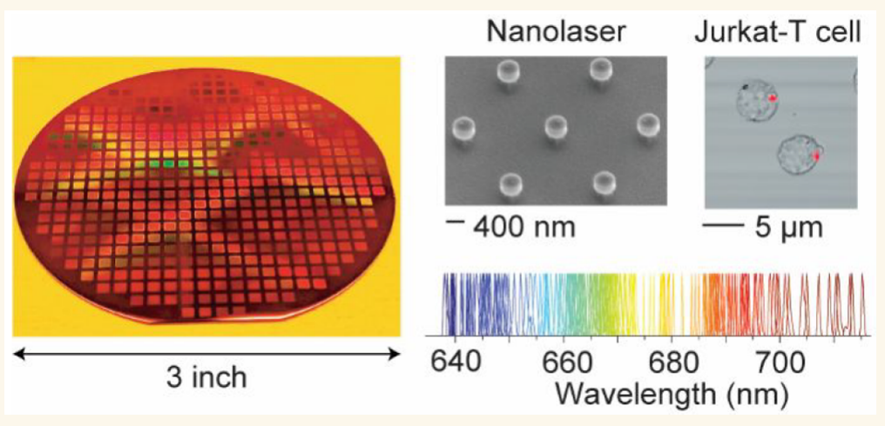

KEYWORDS: nanolaser, lasing, nanophotonics, plasmonic, cell barcoding

Submicron- and nanoscale lasers have received interest for basic research and applications including optical communications, integrated photonics, chemical sensing, and biological probing.1,2 A small device volume is the defining characteristic of nanolasers. The small size not only provides some intriguing physical phenomena such as large Purcell effects3 and threshold-less lasing,4 but is also important for practical applications. A small volume of the gain medium is beneficial for low pump energy consumption. Also importantly, smaller sizes are generally preferred for biological applications to facilitate cellular uptake or attachment on the cell membrane with minimal physical perturbations on cells.5 Furthermore, a small size is critical for the transport and diffusion of nanolasers in tissues.6,7

Recently, free-standing miniature lasers, or laser particles (LPs), have emerged as promising optical probes for imaging, sensing, and mass-scale cellular tagging.6,8−10 The spectrally narrowband stimulated emission from LPs can constitute several hundreds of frequency (color) channels, providing much enhanced multiplexing capability compared to conventional fluorescent probes. The multicolor feature makes LPs suited for cell-tracking analysis.11 III−V compound semiconductors are an attractive choice of materials for miniature lasers due to their high refractive index and high optical gain,12 as well as good material stability in aqueous media when coated with a protective silica layer.10

Nonetheless, semiconductor nanolasers reported to date have two limitations. First, the smallest size of a room-temperature laser has been larger than the optical wavelength in air in at least one dimension, to provide net intracavity gain.1 The exceptions are resonant Mie scattering nanoparticles made of CsPbBr3 perovskite crystals13 and spaser (surface plasmon amplification by stimulated emission of radiation) particles involving microbubble cavities.14 However, the water solubility of the perovskites and the excessive heating of the spasers make them not suited for nonperturbative biological applications. Second, the fabrication of the nanostructures has almost exclusively required electron beam lithography for III−V semiconductors6,15 or chemical growth of individual crystals such as for GaN nanowires16,17 and II−VI CdS/CdSe nanowires18 or plates.19,20 The electron beam exposure process is time-consuming and expensive, and thus is not acceptable for high-volume production of LPs for barcoding applications that require a large number of LPs.10,11 Crystal growth has the potential to meet production-scale requirements but is less established than nanofabrication, especially to directly create III−V semiconductor nanostructures that are suited for biological samples.

Here, we report significant advances in the fabrication and miniaturization of semiconductor nanolasers. First, we demonstrate wafer-scale fabrication of circular nanodisks made of an InGa(As)P semiconductor using UV stepper lithography and a plasma ashing method. Our scalable fabrication meets the need to produce a large number of nanodisks on a wafer scale with different colors for tagging biological cells. Second, we achieve room-temperature lasing from subwavelength nanolasers-on-pillar with diameters as small as 460 nm (198 nm height) at optical wavelengths around 660 nm. This represents about 40% reduction in size compared to previous InGaP quantum-well disks fabricated by electron-beam lithography.6,15 We further push the size reduction by the help of a gold substrate via surface plasmon polariton20,21 and demonstrate lasing from disks with a diameter of 360 nm. Using a combination of two semiconductor gain materials and diameter variation, we demonstrate lasing from a large number of nanodisk LPs over an 80 nm spectral bandwidth. The multicolor nanodisk LPs coated with a biocompatible silica shell and surface functionalized with polyethylenimine (PEI) are used to demonstrate optical barcoding of various biological cells.

## RESULTS/DISCUSSION

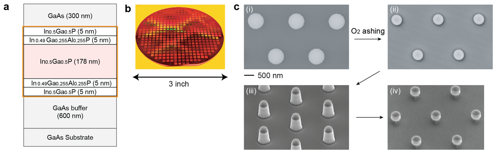

Figure 1. Wafer-scale fabrication of semiconductor nanodisks. (a) Schematic of the first wafer design. The core/clad layers that constitute laser disks are marked with the orange-line box. (b) Photo of a 3 in. wafer after stepper UV lithography and O₂ plasma ashing. (c) SEM images after four major fabrication steps: (i) SU8 patterns after stepper lithography, (ii) SU8 patterns with reduced diameters (to 500 nm) by O₂ plasma ashing, (iii) mesa structure after reactive ion etching (still capped with SU8), and (iv) disk-on-pillar structure after SU8 removal and sacrificial layer partially etched.

We used two different epitaxial structures grown on 3 in. GaAs substrates. Figure 1a shows the first design, in which the active gain material is InGaP with a thickness of 178 nm and is sandwiched by 5 nm thick InGaAlP clad layers to reduce surface recombination on the outer surfaces. Additional 5-nm-thick InGaP layers were added to make the outer surface of disks free of aluminum to avoid oxidation-induced degradation in moist or aqueous environments. The second epitaxial wafer design is described later. Figure 1b shows a representative 3 in. epitaxial wafer scalably patterned with the device structures using stepper UV lithography and O2 plasma ashing. Figure 1c illustrates the fabrication process by a series of scanning electron microscopy (SEM) images. The first step involves stepper UV lithography to obtain 800 nm diameter circular SU8 photoresist patterns (Figure 1c-i). With typically available production-grade lithography (Auto Step 200, 5× reduction, i-line: 365 nm), it is generally difficult to reliably produce circular patterns below 750 nm in diameter.

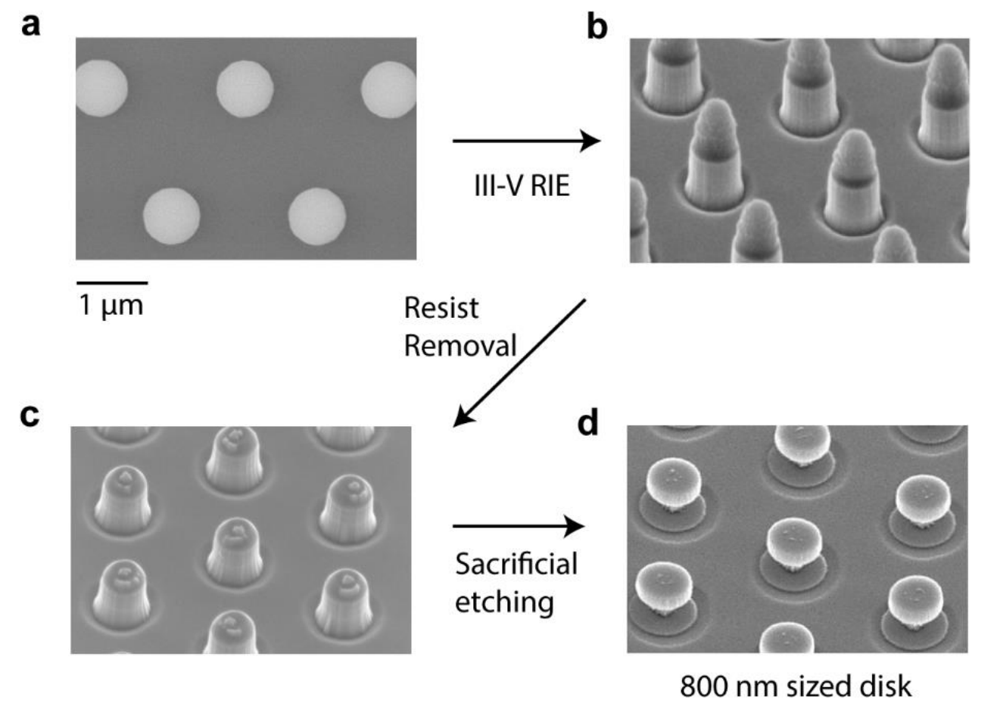

Figure S1. Fabrication of 800 nm diameter disk. SEM images of fabrication of 800 nm diameter disks (a) SU8 patterns using stepper lithography, (b) micropillars with resist mask on top after RIE, (c) micropillars with resist mask removed, and (d) microdisks with resist removed and sacrificial layer partially etched to create disk-on-pillar structures.

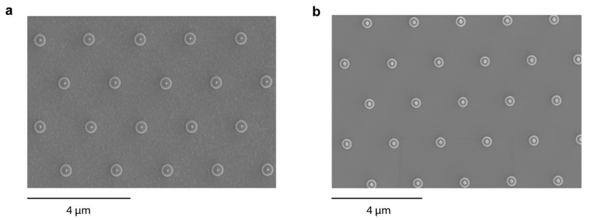

Figure S2. Top view SEM image of disks-on-pillar. Top view SEM images of (a) 450 nm, and (b) 400 nm diameter disks-on-pillar. The small dot on top of each disk is the partially etched GaAs

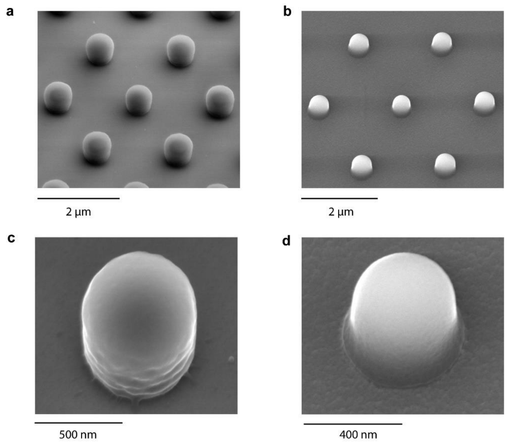

Figure S3. Resist geometry control by O₂ plasma ashing. (a) Tilt view of stepper lithography ~800 nm diameter resist patterns. (b) Tilt view of patterns after hard baking and O₂ plasma ashing. (c) Single resist pillar before hard baking showing interference patterns on side wall from UV exposure. (d) Single resist pillar after hard baking and O₂ plasma ashing showing smooth sidewall.

To solve this problem, we used oxygen (O2) plasma ashing to reduce the photoresist structure to smaller dimensions (Figure 1c-ii). The O2 ashing process transforms the SU8 photoresist to gaseous carbon oxides, thereby reducing the diameter (and thickness). For a specific plasma power and O2 pressure/flow rate, the final diameter of the resist is determined by the ashing time. The resist patterns are then used as etch masks for reactive ion etching (RIE) to obtain the mesa structure (Figure 1c-iii). Finally, the resist is removed, and GaAs sacrificial layers are selectively etched using a dilute piranha solution (H2SO4:H2O2:H2O = 1:1:100). Partial etching results in a disk-on-pillar array on the wafer (Figure 1c-iv). Longer etching detaches the disks completely off the wafer for producing LPs. The smallest possible diameter that can be achieved by this method is limited by the thickness reduction of the photoresist through the ashing process, which does not withstand the full RIE etch time once the ashed photoresist thickness is below ∼150 nm. Starting with a 600 nm thick and 800 nm diameter resist, we were able to obtain disk diameters down to ∼350 nm. Further details of the fabrication process are given in the Methods section and Figures S1−S3.

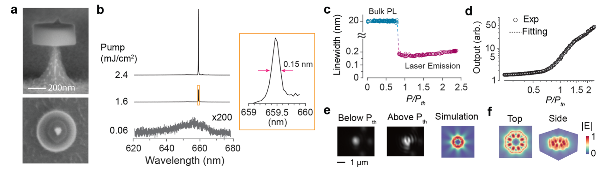

Figure 2. Lasing characteristics of a 460 nm diameter InGaP disk on a thin pillar. (a) SEM images—side view (upper panel) and top view (lower panel)—of the InGaP disk-on-pillar nanolaser. (b) Emission spectra at different pump fluences. Inset: zoom-in of the spectrum at a pump fluence of 1.6 mJ/cm² (threshold fluence ∼1 mJ/cm²). (c) Measured line width at different pump fluences. (d) Light-in-light-out curve. (e) Measured output far-field profiles and simulated profile. (f) FDTD-simulated electric field amplitude, |E|, of the WGM mode at ∼660 nm.

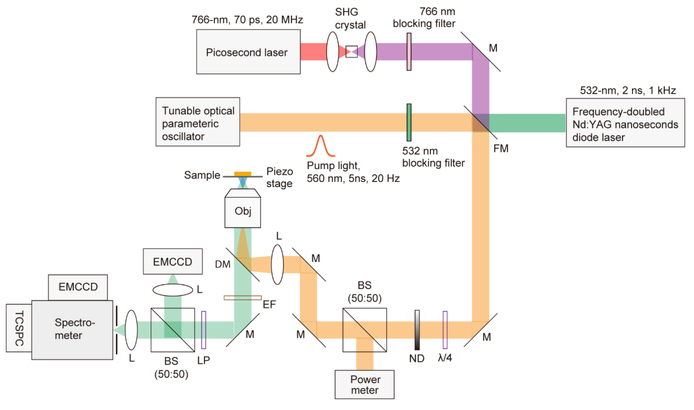

Figure S4. Laser optical characterization setup

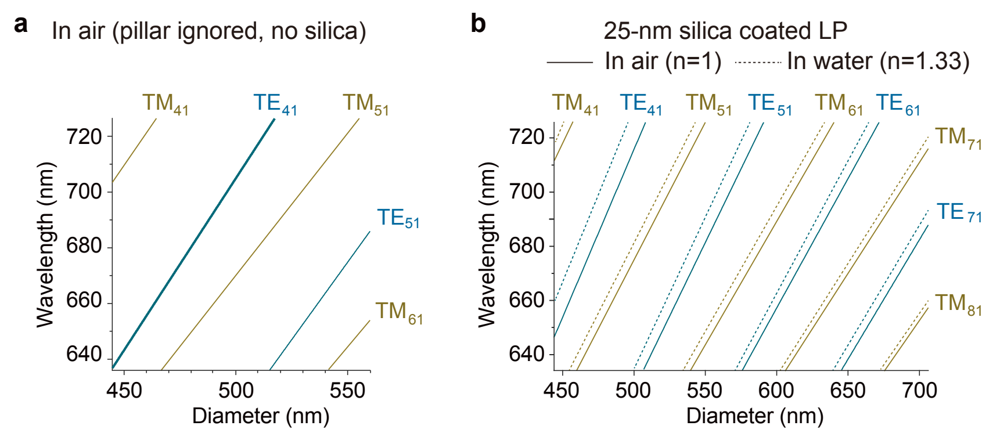

Figure S5. FDTD simulation of mode resonance. a, Dielectric mode resonance peaks in a bare semiconductor disk surrounded by air. The TE₄₁ mode used in the laser-on-pillar device demonstrated in Figure 2 is highlighted. b, Spectral shifts of the mode resonances in a silica-coated semiconductor disk when the surrounding medium is changed from air to water.

Figure 2a shows a 460 nm diameter InGaP disk on an ∼120 nm diameter GaAs pillar. We used a nanosecond optical parametric oscillator (OPO) tuned to 560 nm and a hyperspectral microscope to measure the lasing properties (Figure S4). Figures 2b−e show the lasing characteristics of a representative 460 nm diameter InGaP disk on a GaAs pillar. A sharp single-mode lasing emission appeared at 660 nm from the disk above a threshold pump fluence of ∼1 mJ/cm² (Figure 2b). The line width decreased from 20 nm below threshold to 0.15−0.2 nm after lasing, and with further increase in pump power, it became broadened due to carrier chirping-induced refractive index changes (Figure 2c). The light-in-light-out plot indicates a spontaneous emission factor (β) of 0.01 (Figure 2d). The laser far-field emission showed interference patterns (Figure 2e). Finite-difference time-domain (FDTD) simulation shows that the lasing mode is of the fourth order (m = 4) transverse electric (TE) whispering gallery mode (WGM) (Figure 2f and Figure S5). The quality factor (Q) of the simulated mode was ∼430, although the actual value may be somewhat lower.22 We obtained similar lasing thresholds and line widths from slightly larger disks, but no lasing was observed from disks smaller than 460 nm either on pillars or when fully detached and placed on glass substrates.

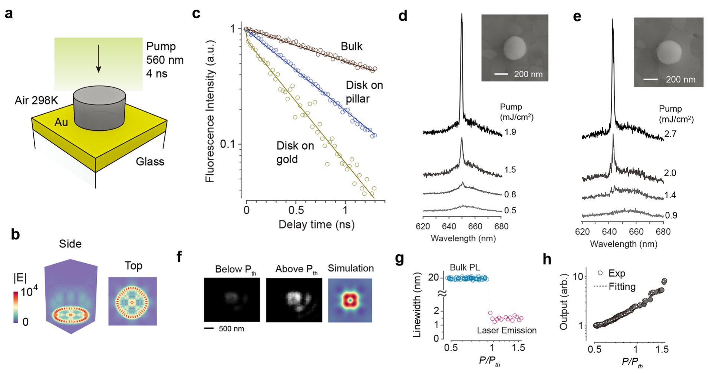

Figure 3. Surface plasmon polariton enhanced nanolasers. (a) Schematic of a disk-on-gold laser. (b) FDTD simulated electric field profile, |E|, of the plasmonic mode for a 360-nm-diameter InGaP disk on gold. (c) Time-resolved PL decay curves of the bulk material in the wafer (brown), a disk on a pillar (blue), and a disk on gold (yellow). Circular markers, data points. Lines, double-exponential fits. (d, e) Measured output spectra of two representative disks on gold. Insets: top-view SEM images of the lasers. (f) Measured far-field emission profiles below and above the lasing threshold, and simulated far-field emission profile. (g) Measured line width at different pump fluences. (h) Light-in-light-out curve. (i) Wavelength stability of a device at a pump power level twice the lasing threshold.

We tested nanodisk LPs placed on a gold substrate (Figure 3a) with the expectation that coupling with the gold’s surface plasmon polariton may allow lasing of smaller disks.21,23 We have previously shown plasmonic lasing from submicron CsPbBr3 perovskite crystals on a gold substrate with lasing thresholds lower than the same gain crystals on glass.21 The Purcell enhancement of the plasmonic mode due to its small mode volume increased the gain and spontaneous emission factor enough to overcome the metallic loss.20 Our numerical and FDTD simulations predicted a similar effect for InGaP disks. For example, the dielectric mode of a 360 nm diameter disk in air has a cavity Q factor of only 20 and a moderate Purcell factor of 2.3. By contrast, the same disk on gold has a much higher-order WGM plasmonic mode localized at the semiconductor−gold interface (Figure 3b). Its cavity Q factor of 30 and Purcell factor of 19 are higher than those of the photonic mode without gold. Note S1 refers to the laser rate equations and parameter definitions used for this analysis. To verify the Purcell enhancement experimentally, we performed time-resolved photoluminescence (PL) spectroscopy. PL decay curves were obtained from three different samples: an intact wafer, a 380-nm-sized disk on a pillar, and a disk of a similar size on a gold substrate (Figure 3c). The bulk semiconductor from the full wafer stack exhibited a monotonic exponential decay with a lifetime of 1840 ps. The disk on pillar showed a monoexponential decay but with a shorter lifetime of 623 ps, evidence of a cavity-enhanced Purcell effect. The disk-on-gold sample showed two distinct exponential decays. The first fast decay has a lifetime less than the photodiode’s response time (<35 ps) and is attributed to plasmonic modes strongly coupled with the gold’s plasmons. The second slow decay with a lifetime of 410 ps is thought to be associated with other photonic-like modes weakly interacting with the plasmons. We observed lasing from 360 nm diameter disks on gold, but not on a pillar or glass.

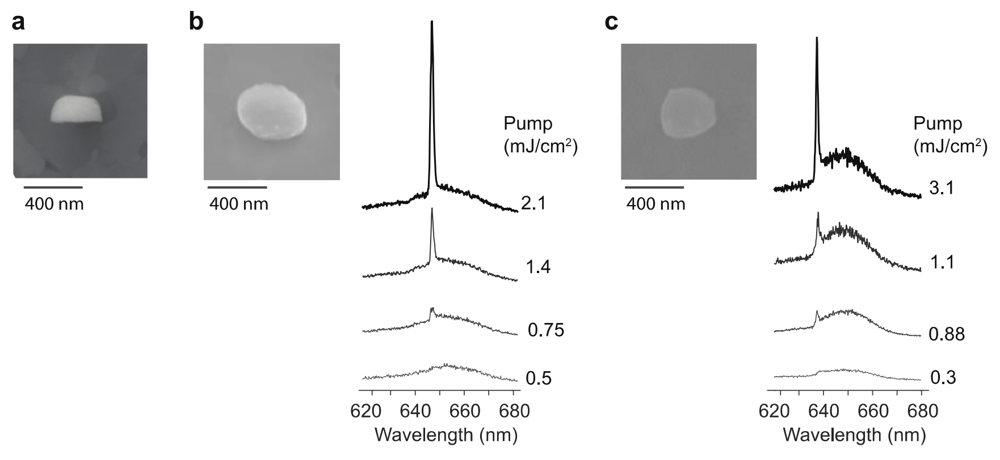

Figure S6. a, SEM image of a 350 nm diameter semiconductor disk placed on a silicon substrate sideways. The top area has been rounded owing to partial erosion of photoresist during reactive ion etching. b-c, Two highly deformed semiconductor disks placed on a gold substrate. Top-view SEM of the devices, and output spectra at different pump fluence levels. Scale bars, 400 nm.

Figures 3d and 3e show the output spectra of two representative plasmonic devices. The threshold pump fluences were 0.9 and 1.5 mJ/cm², respectively, similar to the smallest (460 nm diameter) lasers on a pillar. The line width above threshold was about 1.5 nm, considerably broader than the all-dielectric lasers but narrower than the PL line width below threshold (Figure 3g). The performance of plasmonic devices was largely insensitive to the roundness of semiconductor particles (Figure S6). Figure 3f shows the far-field emission profiles of a plasmonic nanolaser below and above the lasing threshold. These profiles correspond well with the simulated image. According to the light-in-light-out plot, the spontaneous emission factor (β) for the plasmonic device is 0.09, which is 9 times larger than that of the dielectric device. This can be attributed to a significant Purcell effect, as shown in Figure 3h. The lasing performance was stable over repeated pumping (Figure 3i).

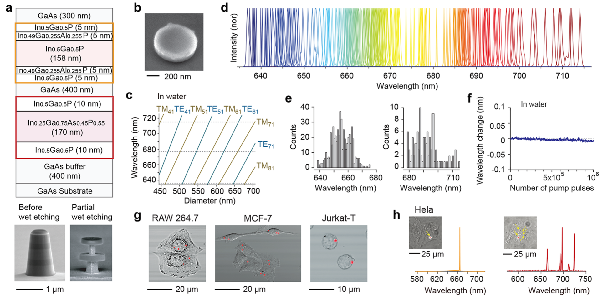

Figure 4. Multicolor nanodisk particles and intracellular lasing. (a) (Top) Schematic of the second wafer. The two disk regions are marked with orange and red boxes, respectively. (Bottom) SEM of pre- and partial etching of the sacrificial layers. Scale bar, 1 μm. (b) SEM of a silica-coated nanodisk particle. (c) FDTD-calculated resonance wavelengths of WGM modes (TEₘ₁ and TMₘ₁) in water for different silica-coated disk diameters. Horizontal dotted lines indicate the approximate boundaries of the gain band of the two semiconductor materials. (d) Normalized laser emission spectra of ∼100 representative LPs. (e) Histogram of lasing wavelengths of LPs from top (left) and bottom (right) layers. (f) Wavelength variation of a silica-coated laser particle in water for up to 1 million pump pulses at 1 kHz (integration time 1 s) at twice the lasing threshold pumping level. (g) Overlaid bright-field and confocal fluorescence image (red) of LPs inside various biological cells in culture. (h) Emission spectra and overlaid bright-field and stimulated emission images of a single LP or 5 LPs inside living HeLa cells.

Next, we fabricated dielectric nanodisk lasers coated with silica to showcase the potential biological applications of our work. To produce LPs over a wide spectral range, we used a multidisk wafer design24 consisting of two disk regions separated by GaAs sacrificial layers (Figure 4a), although it is possible to use two separate wafers each with a different gain material. The pillar structure before and with partial etching of the sacrificial layers was imaged by SEM (Figure 4a bottom). The first disk region is identical to the single-InGaP-active-layer wafer described earlier except for a slightly thinner gain region (158 nm). The second disk region is comprised of an InGaAsP core and InGaP clad layers. The InGaAsP-core gain region layer has a PL peak at 706 nm, ∼56 nm red-shifted from the InGaP-core gain region layer. Using the process described earlier, mesa structures with diameters in the range of 500 to 700 nm were produced. After removing the resist, the entire chip was immersed in dilute piranha solution to selectively etch the GaAs sacrificial layers. Following this, through a multistep centrifugation−resuspension process, we finally obtained a suspension of the nanodisks in ethanol. Finally, they were fully coated with a silica shell of ∼25 nm thickness. The entire process to produce silica-coated laser particles, including the removal of the disks from the substrate, silica coating, and purification to obtain laser particles in solution, exhibited a yield of better than 10%.

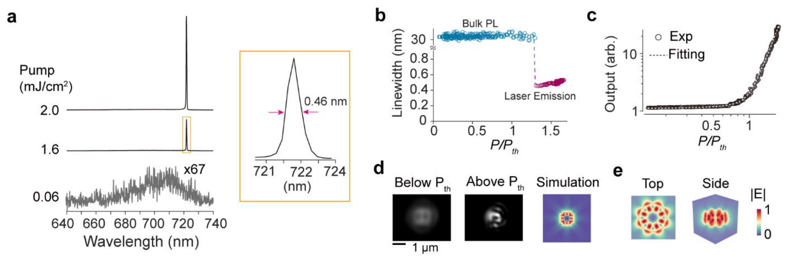

Figure S7. Lasing characteristics of a silica coated InGaP disk in water. (a) Emission spectra at different pump fluences. Inset, zoom-in of the spectrum at pump fluence of 1.6 mJ/cm² (threshold fluence ~1.3 mJ/cm²). (b) Measured linewidth at different pump fluences. (c) Light-in-light-out curve. (d) Measured output far-field profiles and simulated profile. (e) FDTD simulated electric field amplitude, |E|, of the WGM mode at ~720 nm in 500-nm sized silica coated disk in water.

Figure 4b shows the SEM image of a silica-coated LP with a ∼650 nm diameter semiconductor core and ∼25 nm silica shell. Figure 4c shows the mode resonances of the silica-coated disks (thickness of 178 nm) fully immersed in water in the diameter range from 430 to 710 nm. The TE and TM modes are interlaced. The free spectral range between neighboring modes is 30−50 nm, which is similar to the semiconductor gain bandwidth of 40 nm. Experimentally, all LPs with diameters greater than ∼540 nm showed lasing. Furthermore, nearly all LPs emitted a single lasing peak resulting from the gain competition of neighboring modes. The wavelength tuning slopes as a function of diameter are 0.9 to 1.2 nm/nm for the modes with m = 4, 5, and 6. Due to the finite evanescent field energy of the modes outside the silica layer, their resonance wavelengths are somewhat sensitive to the refractive index (RI) of the surrounding medium with coefficients of up to 30 nm shift per RIU (see Figure S5b). For example, a change in the surrounding index from 1.33 to 1.5 would result in a spectral shift of 5.1 nm for the TE₅₁ mode. The intended variation of the disk diameters resulted in LPs with a continuum of emission peaks spanning over an 80 nm range from 635 to 715 nm. Figure 4d shows a collection of laser spectra from different LPs suspended in water. The threshold of a silica-coated disk in water was found to be 1.3 mJ/cm², with a spontaneous emission factor of 0.003 and a line width of 0.46 nm (Figure S7). Figure 4e shows the wavelength histograms of LPs from the two individual disk regions, obtained by controlled wet etching to harvest LPs from each disk region separately. The lasing wavelength of the laser particles was stable over an extended operation in water (Figure 4f).

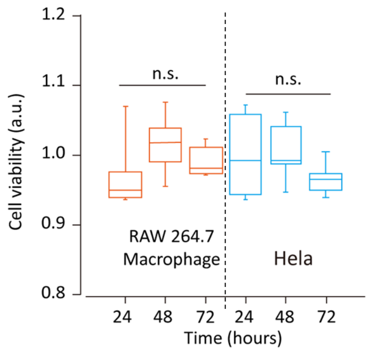

Figure S8. Cell viability of RAW 264.7 macrophage and HeLa cells.

We tested silica-coated LPs for cell tagging after surface functionalization with PEI for efficient uptake.11 Figure 4g shows RAW 264.7 macrophages, MCF-7 breast cancer cells, and Jurkat T cells in culture, after overnight incubation with LPs. Since the uptake process is stochastic, each cell can internalize a different number of LPs. The presence of LPs in the cytoplasm has no statistically significant effect on the viability of the cells over 72 h (Figure S8), and the cells continue to proliferate and thrive with natural cadence. Figure 4h demonstrates lasing of these LPs from within the cells. The set of LPs associated with each cell acts as their optical barcode, which can be used to distinctly identify individual cells and track them spatiotemporally for large-scale single-cell analysis.10,11

## CONCLUSIONS

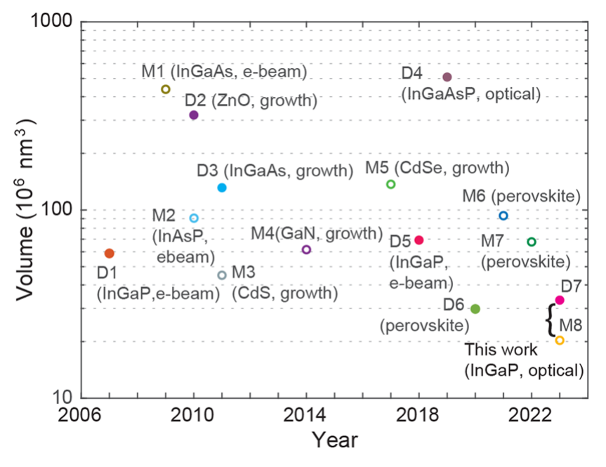

Figure 5. Device volume of various semiconductor-material-based dielectric and plasmonic nanolasers operating at room temperature. Solid circles represent semiconductor-only dielectric lasers, and hollow circles represent metal-incorporated plasmonic lasers. Each data point is labeled with the device name used in Tables S1 and S2 and the gain medium and fabrication method.

Figure 5 compares our results with those of previously reported dielectric (semiconductor and no metal) and plasmonic (semiconductor and metal) nanolasers. The bulk core-clad structure of our semiconductor nanolasers provided sufficient optical gain to enable InGaP nanolasers as small as 460 nm in diameter. To the best of our knowledge, this represents the smallest III−V semiconductor laser demonstrated to date and the smallest WGM laser made of any materials. Furthermore, the plasmonic lasing achieved with InGaP disks on gold of 360 nm diameter and 198 nm height (∼0.02 μm³ in volume) is, in terms of semiconductor volume, the smallest plasmonic laser ever demonstrated at room temperature and is comparable to other nanolasers operated at cryogenic temperatures (Note S2). It should also be noted that this work represents the first optical lithography-based fabrication of submicron-sized LPs. Our results show the potential of multicolor nanodisk LPs in the silicon-detector range for large-scale optical barcoding of cells.

## STUDY LIMITATIONS

The present plasmonic lasers require a metal substrate, which limits their biomedical applications. However, it is possible to deposit gold directly onto semiconductor disks on a pillar using electron-beam evaporation to fabricate gold-on-disk structures and eventually to produce standalone plasmonic LPs. Alternatively, it may be possible to coat a gold layer on or around semiconductor disks using redox chemistry. Furthermore, this study explored only two \(\mathrm{In}_{x}\mathrm{Ga}_{1-x}\mathrm{As}_{y}\mathrm{P}_{1-y}\) stoichiometries that spanned an 80 nm wavelength range. It should be possible to extend the spectral range to a wavelength of 1000 nm, for example, by incorporating different semiconductor compositions. The operating pump levels of a few mJ/cm² are substantially higher than those of other low-threshold laser devices. It corresponds to several pJ per pump pulse. However, this excitation fluence is thought to be adequate for biological applications where the pump beam is rapidly scanned over the sample and could be within the laser safety limit of biological tissues (\(\sim t^{0.25}\) J/cm² for an exposure time t in seconds for the skin).25 For example, pulse repetition rates of up to 100 kHz would be acceptable for an exposure time of \(10^{-3}\) s. Finally, the sensitivity of the lasing wavelength to the surrounding medium may be an issue when such spectral shifts are not desired. We note that the sensitivity can be significantly reduced with thicker silica coating (e.g., >50 nm). On the other hand, most cell tagging applications can tolerate certain wavelength shifts. We found that silica-coated InGaAsP LPs, once incorporated into the cytoplasm or attached on the cell membrane, remain stable within a wavelength resolution of ±0.5 nm. We have used this spectral barcoding strategy in our recent imaging and flow cytometry studies.10,11 Compared to the previous LPs in the spectral range of NIR-II (1100−1600 nm), the LPs developed in this work offer smaller sizes and compatibility with silicon detector technology. However, their spectral range overlaps with some commonly used dyes in the red and NIR-I ranges, and therefore, it limits the compatibility with fluorescence techniques.

## METHODS/EXPERIMENTAL

**Epitaxial Wafer Structure.** The devices are fabricated from two different wafer structures. In both cases, the substrate is GaAs. In the first wafer structure, only a single active layer material is present, with the exact structure being GaAs substrate/600 nm GaAs/5 nm InGaP/ 5 nm In₀.₄₉(Ga₀.₅Al₀.₅)₀.₅₁P/178 nm InGaP/5 nm In₀.₄₉(Ga₀.₅Al₀.₅)₀.₅₁P/5 nm InGaP/300 nm GaAs. The central InGaP forms the main active material layer, while the 10 nm layers on either side form a cladding layer to reduce surface recombination. The top 300 nm GaAs is a sacrificial capping layer to protect the active material from potential damage during fabrication. In the second wafer structure, two active layer materials are present, with the exact structure being GaAs substrate/400 nm GaAs/10 nm InGaP/ 170 nm InGaAsP/10 nm InGaP/400 nm GaAs/5 nm InGaP/5 nm In₀.₄₉(Ga₀.₅Al₀.₅)₀.₅₁P/158 nm InGaP/5 nm In₀.₄₉(Ga₀.₅Al₀.₅)₀.₅₁P/5 nm InGaP/300 nm GaAs. GaAs layers are sacrificial. These are custom ordered and epitaxially grown using metal organic chemical vapor deposition (MOCVD) by Xiamen Powerway Advanced Materials Co. Ltd.

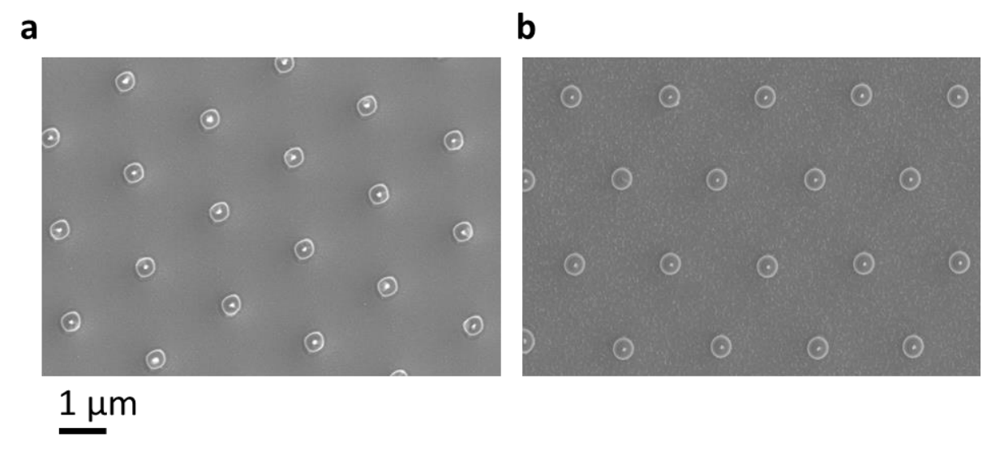

Figure S9. Effect of different reactive ion etching processes on disk morphology. (a) Morphology of disks using CH₄-H₂-Cl₂ etch in Oxford RIE; (b) Morphology of disks using BCl₃-Ar etch in SAMCO RIE.

**Fabrication of Microdisk Lasers on a Chip.** Device fabrication starts with cleaning the wafers in acetone, isopropyl alcohol (IPA), methanol, and deionized water to remove dissolvable contaminants from the surface. The wafer is baked at 180 °C to dehydrate adsorbed water molecules, and then processed by oxygen plasma to descum surface organics and to improve photoresist adhesion. SU8 2000.5 is then spin-coated and soft-baked to form a 500−600 nm thick layer (based on spin speed). Exposure is performed using stepper UV lithography (Auto Step 200), followed by postexposure bake, development using propylene glycol methyl ether acetate (PGMEA), and finally rinse-off with IPA. SU8, being a negative photoresist, retains the patterns at the locations where it is exposed. The patterns are then hard-baked to 180 °C, and then the wafer is descummed using oxygen plasma to remove any remaining photoresist molecules on the unexposed substrate surface. To get submicrometer dimensions, these photoresist patterns are controllably ashed using oxygen plasma (Anatech SP100), where ∼1 min ashing leads to a reduction in diameter by ∼100 nm. Reactive ion etching using a chlorine-based chemistry is then carried out in SAMCO 200iP or 230 iP to create III−V micropillars with the patterned hard-baked photoresist acting as an etch mask. A methane−chlorine-based chemistry used in an Oxford RIE tool gave significant anisotropy, as shown in Figure S9a, compared to the morphology obtained using the boron trichloride−argon chemistry in SAMCO RIE represented by the SEM image in Figure S9b. The photoresist mask is then removed using a carbon tetrafluoride−oxygen plasma, followed by dissolution in sulfuric acid solution. Dilute piranha solution (H2SO4:H2O2:H2O, 1:1:100) is used to selectively etch the GaAs layers while keeping the active materials intact. Partial etching of the GaAs layers creates a pillar structure with the diameter smaller than the overlying disk, thereby creating the nanodisk structures on a chip.

**Fabrication of Free-Standing Laser Particles.** After the nanodisk structures on the chip are created, complete etching of GaAs releases the nanodisks in the piranha solution. The next steps involve collection of the laser particles and making them biocompatible for cell studies. The laser particle suspension in piranha is centrifuged to collect the disks at the bottom of a tube, and the supernatant liquid is selectively removed. Ethanol is then added to the tube, and the laser particles are redispersed in it by ultrasonication. Repeating this centrifugation, decanting of supernatant, adding fresh ethanol, and resuspension of laser particles, the medium is effectively cleared of piranha solution. Using tetraethyl orthosilicate (TEOS) with the reaction initiated in a basic medium (through ammonium hydroxide), a uniform silica shell is then created around each disk to obtain freely suspended biocompatible silica-coated laser particles. These are then surface-functionalized with PEI for improved cellular association.

**Optical Characterization.** For the laser experiment, the specimen is placed in a home-built epi-fluorescence microscopy setup. The pump source is an optical parametric oscillator (Optotek HE 355 LD) tuned to 560 nm, with a repetition rate of 20 Hz and a pulse duration of 4 ns, or a frequency-doubled NDYAG laser (532 nm), with a repetition rate of 1 kHz and a pulse duration of 4 ns. Using a 0.6 NA, 50× air objective lens or 0.9 NA, 100× air objective lens (Nikon), the full-width-at-half-maxima (fwhm) size of the pump beam on the sample is about 20 μm. The emission from the sample collected by the objective lens is passed through a dichroic mirror and a dichroic filter and split to a silicon-based EMCCD camera (Luca, Andor) for wide-field imaging and to a grating-based EMCCD spectrometer (Shamrock, Andor). With an entrance slit width of 20 μm, the measurement spectral resolution is about 0.13 nm. For time-resolved photoluminescence measurements, a picosecond laser (VisIR-765, PicoQuant) is used, which is frequency doubled to 382 nm using a nonlinear Beta barium borate (BBO) crystal, a single-photon avalanche photodiode (MicroPhotonics Devices) with a single photon timing resolution of 35 ps (fwhm), and a time-correlated single-photon counting board (TimeHarp 260, PicoQuant).

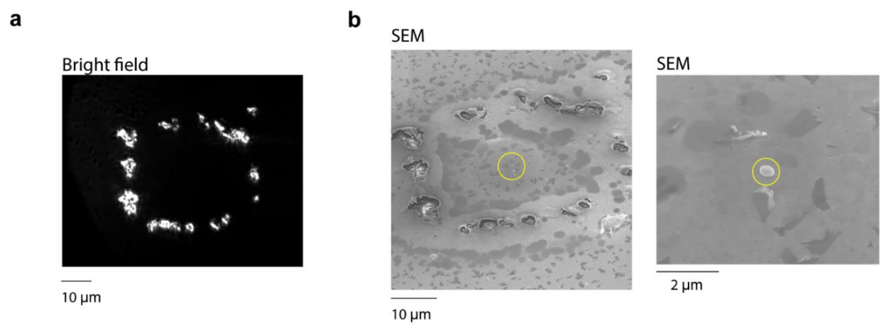

Figure S10. Marking samples for SEM. (a) Bright-field optical image (visualized by bright light scattering) of a semiconductor-on-gold sample after generating patterns on the substrate using a high-power laser beam to mark the location of the semiconductor disk. (b) SEM images of the corresponding sample (circle) identified by the particular pattern on the substrate.

**Fabrication of the Plasmonic Laser.** The free-standing disks suspended in ethanol solution are simply drop-cast on a polycrystalline gold substrate (Platypus). The root-mean-square roughness of the gold surface is about 0.7 nm.21 After characterizing the lasing properties of the device, we mark the corresponding device’s position by irradiating the gold substrate using high pump fluence (Figure S10). The devices are then imaged by SEM to precisely quantify their sizes.

**Finite Difference Time Domain Simulation.** The eigenmodes and field profiles of the nanodisk lasers are numerically simulated with a commercial 3D FDTD solver from Lumerical. The optical constants for gold are taken from the CRC handbook.26

In order to excite the desired modes, an electric dipole is positioned inside the semiconductor. The 3D simulation utilizes a mesh grid size of 5 nm or less with mesh refinement by the Yu−Mittra method. The boundary conditions are implemented by using perfectly matched layers. To measure the time-dependent electric fields, point-like time monitors are placed inside or near the semiconductor particle. The recorded data are analyzed in the spectral domain by a fast Fourier transform. The cavity Q factor is calculated from \(\varpi_{\mathrm{res}}/\Delta_{\mathrm{res}}\) using the peak wavelength position \(\varpi_{\mathrm{res}}\) and the full width half-maximum \(\Delta\varpi_{\mathrm{res}}\). To obtain a 3D near-field pattern of the modes, we utilize an array of 2D field monitors covering the entire simulation volume with time apodization. To avoid the effect of transients, the apodization center is set to 420 fs with a width of 100 fs.

**Cell Experiment.** HeLa human cervical cancer cells, MCF-7 human breast cancer cells, RAW 264.7 mouse macrophage cells, and Jurkat Clone E6-1 human T lymphoblast (Jurkat T) cells are purchased from ATCC (American Type Culture Collection). HeLa, MCF-7, and RAW 264.7 cells are cultured and maintained in the cell media of Dulbecco’s modified Eagle medium (DMEM) supplemented with 10% (v/v) fetal bovine serum (FBS) and 1% (v/v) penicillin−streptomycin at 37 °C under 5% CO2. Jurkat T cells are cultured in RPMI 1640 (Thermo Fisher) cell medium supplemented with 10% FBS and 1% antibiotic−antimycotic. For cytotoxicity assessment, HeLa and RAW 264.7 cells are seeded in 96-well plastic plates with the density of 3000 cells/well and incubated first for 24 h. Then about 6000 silica-coated visible LPs are added into each well. After further incubation for 24, 48, and 72 h, the standard cell counting kit (CCK8) (Sigma-Aldrich) assay is performed to test the cell viability. The nontreated cells at different time points are used as control (100%) for calculation. For each group, six parallel experiments are performed simultaneously. For the cell tagging experiment, cells are plated in their respective media at a known density on a glass-bottom plate. After 24 h of incubation, the visible laser particles resuspended in PBS buffer are added into cells with the particle-to-cell ratio 4:1. The plate is shaken to mix the media evenly, and the cell media is carefully refreshed 6 h later. After 24 h of further incubation, the cells are washed three times with DPBS buffer and fixed using a 4% paraformaldehyde (PFA) solution for the following confocal imaging (Olympus, FV3000) and cell laser experiment.

## ASSOCIATED CONTENT

### Supporting Information

The Supporting Information is available free of charge at <https://pubs.acs.org/doi/10.1021/acsnano.3c04721>.

SEM images of fabrication of 800 nm diameter disks; top view SEM images of disks-on-pillar; SEM images showing geometry control of photoresist by O2 plasma ashing; schematic of laser optical characterization setup; FDTD simulation results of mode resonance; sideways SEM image of a 350 nm diameter disk and plane-view SEM images of irregular shaped disks and their output emission spectra; lasing characteristics of silica-coated InGaP disk in water; cell viability analysis of RAW 264.7 macrophage and HeLa cells; effect of different reactive ion etching processes on disk morphology; method for identifying individual disks on a gold substrate under bright-field microscopy and SEM to correlate lasing characteristics with physical structure; nanolaser rate equations and parameter definitions; comparison of laser properties in this work with other representative reported micro- and nanolasers (PDF)

## AUTHOR INFORMATION

### Corresponding Author

Seok Hyun Yun − Harvard Medical School, Boston, Massachusetts 02115, United States; Wellman Center for Photomedicine, Massachusetts General Hospital, Boston, Massachusetts 02114, United States; Harvard-MIT Health Sciences and Technology, Massachusetts Institute of Technology, Cambridge, Massachusetts 02139, United States; Email: syun@hms.harvard.edu

### Authors

Debarghya Sarkar − Harvard Medical School, Boston, Massachusetts 02115, United States; Wellman Center for Photomedicine, Massachusetts General Hospital, Boston, Massachusetts 02114, United States; orcid.org/0000-0002-5411-7066

Sangyeon Cho − Harvard Medical School, Boston, Massachusetts 02115, United States; Wellman Center for Photomedicine, Massachusetts General Hospital, Boston, Massachusetts 02114, United States; orcid.org/0000-0002-2997-4760

Hao Yan − Harvard Medical School, Boston, Massachusetts 02115, United States; Wellman Center for Photomedicine, Massachusetts General Hospital, Boston, Massachusetts 02114, United States; orcid.org/0000-0002-5268-7153

Nicola Martino − Harvard Medical School, Boston, Massachusetts 02115, United States; Wellman Center for Photomedicine, Massachusetts General Hospital, Boston, Massachusetts 02114, United States; orcid.org/0000-0002-4639-2930

Paul H. Dannenberg − Harvard Medical School, Boston, Massachusetts 02115, United States; Wellman Center for Photomedicine, Massachusetts General Hospital, Boston, Massachusetts 02114, United States; Harvard-MIT Health Sciences and Technology, Massachusetts Institute of Technology, Cambridge, Massachusetts 02139, United States; orcid.org/0000-0002-9091-1611

Complete contact information is available at: <https://pubs.acs.org/10.1021/acsnano.3c04721>

### Author Contributions

DS and SC contributed equally to this work. DS, SC, and SHY designed the project. DS developed and performed the nanofabrication. SC performed optical measurements and computer simulations. HY conducted the cell culture. NM and PHD contributed to the nanofabrication and measurement. DS, SC, and SHY wrote the manuscript with input from all authors.

### Notes

The authors declare the following competing financial interest(s): PHD, NM, and SHY hold patents on laser particle technologies. NM and SHY have financial interests in LASE Innovation Inc., a company focused on commercializing technologies based on laser particles. The financial interests of NM and SHY were reviewed and are managed by Mass General Brigham in accordance with their conflict-of-interest policies.

A preprint version of the work in this manuscript appears in arXiv.27

## ACKNOWLEDGMENTS

This study was supported by the U.S. National Institutes of Health research grants (DP1-OD022296, R01-EB033155). SC acknowledges the MGH fund for a medical discovery (FMD) fundamental research fellowship award. This research used the resources of the Center for Nanoscale Systems, part of Harvard University, a member of the National Nanotechnology Coordinated Infrastructure (NNCI), which is supported by the National Science Foundation under award number 1541959, and of the MIT.nano facilities, part of Massachusetts Institute of Technology.

## ABBREVIATIONS

LP, laser particle; SEM, scanning electron microscopy; WGM, whispering gallery mode; FDTD, finite-difference time-domain

## REFERENCES

(1) Ma, R.-M.; Oulton, R. F. Applications of Nanolasers. Nat. Nanotechnol 2019, 14, 12−22.

(2) Liang, Y.; Li, C.; Huang, Y.-Z.; Zhang, Q. Plasmonic Nanolasers in On-Chip Light Sources: Prospects and Challenges. ACS Nano 2020, 14 (11), 14375−14390.

(3) Russell, K. J.; Liu, T.-L.; Cui, S.; Hu, E. L. Large Spontaneous Emission Enhancement in Plasmonic Nanocavities. Nat. Photonics 2012, 6 (7), 459−462.

(4) Khajavikhan, M.; Simic, A.; Katz, M.; Lee, J. H.; Slutsky, B.; Mizrahi, A.; Lomakin, V.; Fainman, Y. Thresholdless Nanoscale Coaxial Lasers. Nature 2012, 482 (7384), 204.

(5) Albanese, A.; Tang, P. S.; Chan, W. C. W. The Effect of Nanoparticle Size, Shape, and Surface Chemistry on Biological Systems. Annu. Rev. Biomed Eng. 2012, 14 (1), 1−16.

(6) Fikouras, A. H.; Schubert, M.; Karl, M.; Kumar, J. D.; Powis, S. J.; Di Falco, A.; Gather, M. C. Non-Obstructive Intracellular Nanolasers. Nat. Commun. 2018, 9 (1), 4817.

(7) Tasciotti, E.; Liu, X.; Bhavane, R.; Plant, K.; Leonard, A. D.; Price, B. K.; Cheng, M. M.-C.; Decuzzi, P.; Tour, J. M.; Robertson, F. Mesoporous Silicon Particles as a Multistage Delivery System for Imaging and Therapeutic Applications. Nat. Nanotechnol 2008, 3 (3), 151−157.

(8) Humar, M.; Hyun Yun, S. Intracellular Microlasers. Nat. Photonics 2015, 9, 572−576.

(9) Schubert, M.; Woolfson, L.; Barnard, I. R. M.; Dorward, A. M.; Casement, B.; Morton, A.; Robertson, G. B.; Appleton, P. L.; Miles, G. B.; Tucker, C. S. Monitoring Contractility in Cardiac Tissue with Cellular Resolution Using Biointegrated Microlasers. Nat. Photonics 2020, 14 (7), 452−458.

(10) Martino, N.; Kwok, S. J. J.; Liapis, A. C.; Forward, S.; Jang, H.; Kim, H.-M.; Wu, S. J.; Wu, J.; Dannenberg, P. H.; Jang, S.-J.; Lee, Y.-H.; Yun, S.-H. Wavelength-Encoded Laser Particles for Massively-Multiplexed Cell Tagging. Nat. Photonics 2019, 13 (10), 720−727.

(11) Kwok, S. J. J.; Forward, S.; Fahlberg, M. D.; Cosgriff, S.; Lee, S. H.; Abbott, G.; Zhu, H.; Minasian, N. H.; Vote, A. S.; Martino, N.; Seok Hyun, Y. Laser Particle Barcoding for Multi-Pass High-Dimensional Flow Cytometry. 2022, 2022.06.03.494697. bioRxiv. DOI: 10.1101/2022.06.03.494697 (accessed June 04, 2022).

(12) Ning, C.-Z. Semiconductor Nanolasers. physica status solidi (b) 2010, 247 (4), 774−788.

(13) Tiguntseva, E.; Koshelev, K.; Furasova, A.; Tonkaev, P.; Mikhailovskii, V.; Ushakova, E. V.; Baranov, D. G.; Shegai, T.; Zakhidov, A. A.; Kivshar, Y.; Makarov, S. V. Room-Temperature Lasing from Mie-Resonant Nonplasmonic Nanoparticles. ACS Nano 2020, 14 (7), 8149−8156.

(14) Galanzha, E. I.; Weingold, R.; Nedosekin, D. A.; Sarimollaoglu, M.; Nolan, J.; Harrington, W.; Kuchyanov, A. S.; Parkhomenko, R. G.; Watanabe, F.; Nima, Z. Spaser as a Biological Probe. Nat. Commun. 2017, 8, 15528.

(15) Zhang, Z.; Yang, L.; Liu, V.; Hong, T.; Vahala, K.; Scherer, A. Visible Submicron Microdisk Lasers. Appl. Phys. Lett. 2007, 90 (11), 111119.

(16) Chen, R.; Tran, T.-T. D.; Ng, K. W.; Ko, W. S.; Chuang, L. C.; Sedgwick, F. G.; Chang-Hasnain, C. Nanolasers Grown on Silicon. Nat. Photonics 2011, 5 (3), 170.

(17) Zhang, Q.; Li, G.; Liu, X.; Qian, F.; Li, Y.; Sum, T. C.; Lieber, C. M.; Xiong, Q. A Room Temperature Low-Threshold Ultraviolet Plasmonic Nanolaser. Nat. Commun. 2014, 5, 4953.

(18) Consoli, A.; Caselli, N.; López, C. Electrically Driven Random Lasing from a Modified Fabry−Pérot Laser Diode. Nat. Photonics 2022, 16 (3), 219−225.

(19) Ma, R.-M.; Oulton, R. F.; Sorger, V. J.; Bartal, G.; Zhang, X. Room-Temperature Sub-Diffraction-Limited Plasmon Laser by Total Internal Reflection. Nat. Mater. 2011, 10 (2), 110−113.

(20) Wang, S.; Wang, X.-Y.; Li, B.; Chen, H.-Z.; Wang, Y.-L.; Dai, L.; Oulton, R. F.; Ma, R.-M. Unusual Scaling Laws for Plasmonic Nanolasers beyond the Diffraction Limit. Nat. Commun. 2017, 8 (1), 1889.

(21) Cho, S.; Yang, Y.; Soljačić, M.; Yun, S. H. Submicrometer Perovskite Plasmonic Lasers at Room Temperature. Sci. Adv. 2021, 7 (35), eabf3362.

(22) Sauvan, C.; Hugonin, J.-P.; Maksymov, I. S.; Lalanne, P. Theory of the Spontaneous Optical Emission of Nanosize Photonic and Plasmon Resonators. Phys. Rev. Lett. 2013, 110 (23), 237401.

(23) Wang, S.; Wang, X.-Y.; Li, B.; Chen, H.-Z.; Wang, Y.-L.; Dai, L.; Oulton, R. F.; Ma, R.-M. Unusual Scaling Laws for Plasmonic Nanolasers beyond the Diffraction Limit. Nat. Commun. 2017, 8 (1), 1889.

(24) Dannenberg, P. H.; Liapis, A. C.; Martino, N.; Kang, J.; Wu, Y.; Kashiparekh, A.; Yun, S.-H. Multilayer Fabrication of a Rainbow of Microdisk Laser Particles Across a 500 Nm Bandwidth. ACS Photonics 2021, 8 (5), 1301−1306.

(25) Yun, S. H.; Kwok, S. J. J. Light in Diagnosis, Therapy and Surgery. Nat. Biomed Eng. 2017, 1 (1), 8.

(26) Haynes, W. M.; Lide, D. R.; Bruno, T. J. CRC Handbook of Chemistry and Physics; CRC press, Boca Raton, FL, 2016.

(27) Sarkar, D.; Cho, S.; Yan, H.; Martino, N.; Dannenberg, P. H.; Yun, S.-H. Ultrasmall InGa (As) P Dielectric and Plasmonic Nanolasers. 2022, 2212.13301. arXiv. DOI: 10.48550/arXiv.2212.133 (accessed Dec 26, 2022).

## Supporting Information

### Note S1. Nano-laser rate equations and definitions of parameters

The rate equations for the semiconductor laser can be written as2:

$$\frac{d}{dt}\rho(t)=P(t)-\frac{\beta_m V F}{\tau_s}[\rho(t)-\rho_{tr}]q(t)-\frac{F_{tot}}{\tau_s}\rho(t)-\frac{1}{\tau_{nr}}\rho(t)\tag{1}$$

$$\frac{d}{dt}q(t)=\frac{\beta_m V F_{tot}}{\tau_s}[\rho(t)-\rho_{tr}]q(t)+\frac{\beta F_{tot}}{\tau_s}\rho(t)-\frac{1}{\tau_c}q(t)\tag{2}$$

where \(P(t)\) is the rate of pumping, \(\rho(t)\) is the carrier density, \(\rho_{tr}\) is the transparent carrier density (about \(10^{18}\) cm−3), \(q(t)\) is the number density of the cavity photon, \(F_{tot}\) is an average enhancement factor of emission contributed by all cavity modes including non-lasing modes as well as background modes uncoupled to a cavity: i.e. \(F_{tot}=\operatorname{average}\!\left(\sum F_i+F_u\right)\), where \(F_i\) is the enhancement factors of individual cavity modes and \(F_u\) is the enhancement factor for modes uncoupled to the cavity (\(F_u=1\) when carriers are in free space, and \(F_u>1\) when the emitters are interacting with plasmonic waves that have the high density of states and are non-resonant in the cavity), \(\beta_m\) is the spontaneous emission factor, which represents the fraction of spontaneous emission into a cavity mode of interest and is related to the Purcell factor \(F_m\) of the mode (\(F_m=\beta_m F_{tot}\)), \(\tau_s\) is the radiative lifetime, \(\tau_{nr}\) is the non-radiative lifetime, and \(\tau_c\) is the photon lifetime inside the cavity. Quantum yield \(\eta\) is the fraction of radiative emission rate over a total decay rate:

$$\eta=\frac{F_{tot}/\tau_s}{F_{tot}/\tau_s+1/\tau_{nr}}.$$

The modal Purcell factor can be expressed as \(F_m=\frac{3}{4\pi^2}\left(\frac{Q_m}{V_m}\right)\left(\frac{\lambda}{n}\right)^3\), where \(Q_m\) is the quality factor of the mode, \(\lambda\) is the wavelength, \(n\) is the refractive index, and \(V_m\) is the mode volume. \(F_m\) can be significantly increased for the particular lasing mode in plasmonic lasers owing to a small mode volume, despite a low \(Q_m\). However, \(F_{tot}\) is likely to remain constant close to 1 as it includes all possible modes. Therefore, the increase of \(F_m\) largely leads to an increase of \(\beta_m\).

The threshold condition is equivalent to having one photon in the cavity mode volume (\(qV=1\)). The steady-state solution can be expressed as

$$P_{th}V=\frac{\omega_0}{\beta_m Q_m\eta}+\frac{F_{tot}\rho_{tr}V}{\tau_s\eta}(1-\beta_m\eta)\tag{3}$$

The first term describes the radiative cavity loss, and the second term is related to the energy required to reach the population inversion. Despite low cavity Q factors, plasmonic lasers could have lower threshold than dielectric lasers due to larger \(\beta_m\) through its significant enhancement by smaller mode volume2,3.

<table id="Table_S1">
<caption data-paragraph="111" id="p111">Table S1. A list of representative room-temperature dielectric nanolasers to date.</caption>
<thead>
<tr><th scope="col"></th><th scope="col">Cavity structure (type)</th><th scope="col">Gain material (wavelength)</th><th scope="col">Gain-medium size</th><th scope="col">Mode type</th><th scope="col">Fabrication Method</th><th scope="col">Threshold energy (value, method)</th><th scope="col">Pulse duration (repetition)</th><th scope="col">Peak power</th><th scope="col">Year (ref)</th></tr>
</thead><tbody>
<tr><td>D1</td><td>Disk (on pillar)</td><td>InGaP quantum well with InGaAlP cladding (660 nm)</td><td>645 nm (diameter), 180 nm (height)</td><td>WGM</td><td>E-beam lithography</td><td>(70 mJ/cm², Optical)</td><td>8 ns (33 kHz)</td><td>8.8 MW/cm²</td><td>2007 (6)</td></tr>
<tr><td>D2</td><td>Hexagonal nanodisk</td><td>ZnO on silica (390 nm)</td><td>490 nm (side), 550 nm (height)</td><td>WGM</td><td>Chemical vapor transport growth</td><td>(2 mJ/cm², Optical)</td><td>5 ns (10 Hz)</td><td>0.4 MW/cm²</td><td>2010 (7)</td></tr>
<tr><td>D3</td><td>Hexagonal nanopillar</td><td>InGaAs core in GaAs shell (900 nm)</td><td>270 nm (diameter), 2 µm (height)</td><td>Helical</td><td>Nanowire growth</td><td>(22 μJ/cm², Optical)</td><td>120 fs (76 MHz)</td><td>183 MW/cm²</td><td>2011 (8)</td></tr>
<tr><td>D4</td><td>Disk (free standing)</td><td>InGaAsP (1170~1580 nm)</td><td>1,800 nm (diameter), 250 nm (height)</td><td>WGM</td><td>Optical lithography</td><td>(56 μJ/cm², Optical)</td><td>3 ns (2 MHz)</td><td>0.02 MW/cm²</td><td>2019 (9)</td></tr>
<tr><td>D5</td><td>Disk (free standing)</td><td>InGaP</td><td>700 nm (diameter), 180 nm (height)</td><td>WGM</td><td>E-beam lithography</td><td>(30 μJ/cm², Optical)</td><td>1.5 ns (100 Hz)</td><td>0.02 MW/cm²</td><td>2019 (10)</td></tr>
<tr><td>D6</td><td>Cube (on substrate)</td><td>CsPbBr₃ (530 nm)</td><td>310 nm (side)</td><td>Mie</td><td>Solution deposition</td><td>(300 μJ/cm², Optical)</td><td>150 fs (100 kHz)</td><td>2000 MW/cm²</td><td>2020 (11)</td></tr>
<tr><td>D7</td><td>Disk (on pillar)</td><td>InGaP bulk (650 nm)</td><td>460 nm (diameter), 200 nm (height)</td><td>WGM</td><td>Optical lithography</td><td>(1 mJ/cm², Optical)</td><td>5 ns (20 Hz)</td><td>0.2 MW/cm²</td><td>This work</td></tr>
<tr><td>D8 (ref)</td><td>Photonic crystal</td><td>InGaAsP bulk (1350 nm)</td><td>4,000 nm × 300 nm × 150 nm</td><td>Photonic crystal</td><td>E-beam lithography</td><td>(1.3 μW, Optical)</td><td>CW</td><td>0.1 KW/cm²</td><td>2010 (12)</td></tr>
</tbody></table>

<table id="Table_S2">
<caption data-paragraph="112" id="p112">Table S2. A list of representative plasmonic lasers demonstrated to date.</caption>
<thead>
<tr><th scope="col"></th><th scope="col">Cavity structure</th><th scope="col">Gain material (wavelength)</th><th scope="col">Gain-medium size</th><th scope="col">Metal</th><th scope="col">Mode type</th><th scope="col">Fabrication Method</th><th scope="col">Threshold energy (value, method)</th><th scope="col">Pulse duration (repetition)</th><th scope="col">Peak power</th><th scope="col">Year (ref)</th></tr>
</thead><tbody>
<tr><td>M1</td><td>Rectangular pillar (metal-coated, on substrate)</td><td>InGaAs (1500 nm)</td><td>310 nm (diameter), 6,000 nm (length), 300 nm (height)</td><td>Silver</td><td>Fabry-Perot</td><td>E-beam lithography</td><td>(5.9 mA, electrical)</td><td>28 ns (1 MHz)</td><td></td><td>2009 (13)</td></tr>
<tr><td>M2</td><td>Disk (metal-coated, on substrate)</td><td>InAsP quantum well (1300 nm)</td><td>700 nm (diameter), 235 nm (height)</td><td>Silver</td><td>WGM</td><td>E-beam lithography</td><td>7.2 μJ/cm²</td><td>60 ps (80 MHz)</td><td>0.12 MW/cm²</td><td>2010 (14)</td></tr>
<tr><td>M3</td><td>Square Plates (on metal substrate)</td><td>CdS (500 nm)</td><td>1 μm (side length). 45 nm (thickness)</td><td>Silver</td><td>WGM</td><td>Vapor-phase growth</td><td>200 μJ/cm²</td><td>100 fs (10 kHz)</td><td>2000 MW/cm²</td><td>2011 (15)</td></tr>
<tr><td>M4</td><td>Nanowires (on metal substrate)</td><td>GaN (375 nm)</td><td>100 nm (diameter), 15 μm (length)</td><td>Aluminum</td><td>Fabry-Perot</td><td>Vapor-phase growth</td><td>35 mJ/cm²</td><td>10 ns (100 kHz)</td><td>3.5 MW/cm²</td><td>2014 (16)</td></tr>
<tr><td>M5</td><td>Square Plates (on metal substrate)</td><td>CdSe (700 nm)</td><td>1 μm (side length), 137 nm (height)</td><td>Gold</td><td>WGM</td><td>Vapor-phase growth</td><td>45 μJ/cm² (10 kW/cm², optical)</td><td>4.5 ns (1 kHz)</td><td>10 MW/cm²</td><td>2017 (3)</td></tr>
<tr><td>M6</td><td>Cubes (on metal substrate)</td><td>CsPbBr₃ (540 nm)</td><td>(Device 1. Length: 570 nm, Height: 320 nm Device 2. Length: 720 nm, Height: 180 nm)</td><td>Gold</td><td>WGM</td><td>Sonochemistry</td><td>Device 1. 1 mJ/cm² Device 2. 0.7 mJ/cm², Optical)</td><td>5 ns (20 Hz)</td><td>1. 0.22 MW/cm² 2. 0.14 MW/cm²</td><td>2021 (2)</td></tr>
<tr><td>M7</td><td>Square Plates (on metal substrate)</td><td>CsPbBr₃ (540 nm)</td><td>1,060 nm (length), 830 nm (length), 77 nm (height)</td><td>Silver</td><td>WGM</td><td>Solution deposition</td><td>(26 μJ/cm²)</td><td>190 fs (80 MHz)</td><td>137 MW/cm²</td><td>2022 (14)</td></tr>
<tr><td>M8</td><td>Disk (on substrate)</td><td>InGaP bulk (650 nm)</td><td>360 nm (diameter), 200 nm (height)</td><td>Gold</td><td>WGM</td><td>Optical lithography</td><td>(0.9-1.5 mJ/cm², Optical)</td><td>5 ns (20 Hz)</td><td>0.18-0.3 MW/cm²</td><td>This work</td></tr>
</tbody></table>

<table id="Table_S3">
<caption data-paragraph="113" id="p113">Table S3. A list of representative nanolasers at cryogenic temperature.</caption>
<thead>
<tr><th scope="col"></th><th scope="col">Cavity structure</th><th scope="col">Gain materials (wavelength)</th><th scope="col">Gain-medium size</th><th scope="col">Metal</th><th scope="col">Mode type</th><th scope="col">Fabrication Method</th><th scope="col">Temperature</th><th scope="col">Threshold (value, method)</th><th scope="col">Pulse duration (rep.)</th><th scope="col">Peak power</th><th scope="col">Year (ref)</th></tr>
</thead><tbody>
<tr><td>D8</td><td>Disk (on pillar)</td><td>InAs QD in GaAs (860 nm)</td><td>627 nm (diameter), 265 nm (height)</td><td></td><td>WGM</td><td>Optical lithography, wet etching</td><td>10 K</td><td>(50 μW, Optical)</td><td>200 fs (76 MHz)</td><td>0.02 MW/cm²</td><td>2009 (17)</td></tr>
<tr><td>D9</td><td>Nanocylinder</td><td>GaAs on quartz (825 nm)</td><td>500 nm (diameter), 330 nm (height)</td><td></td><td>Quasi Bound States in Continuum</td><td>E-beam lithography</td><td>77 K</td><td>(433 μJ/cm², Optical)</td><td>200 fs (20 kHz)</td><td>2.2 MW/cm²</td><td>2020 (18)</td></tr>
<tr><td>M9</td><td>Rectangular pillar (metal-coated, on substrate)</td><td>InGaAsP (1400 nm)</td><td>210 nm (diameter), 300 nm (height)</td><td>Gold</td><td>Fabry-Perot</td><td>E-beam lithography</td><td>77 K</td><td>(4 μA, electrical)</td><td>CW</td><td></td><td>2007 (19)</td></tr>
<tr><td>M10</td><td>Nanowires (on metal substrate)</td><td>CdS (489 nm)</td><td>129 nm (diameter), 12 μm (length)</td><td>Silver</td><td>Fabry-Perot</td><td>Vapor-phase growth</td><td>&lt; 10K</td><td>500 nJ/cm² (5MW/cm², optical)</td><td>100 fs (80 MHz)</td><td>5MW/cm²</td><td>2009 (20)</td></tr>
<tr><td>M11</td><td>Disk (metal-coated, on substrate)</td><td>InAsP QWs (1420 nm)</td><td>1000 nm (diameter), 235 nm (thickness)</td><td>Silver</td><td>WGM</td><td>E-beam lithography</td><td>8K</td><td>(120 kW/cm²)</td><td>60 ps (80 MHz)</td><td>120 kW/cm²</td><td>2010 (21)</td></tr>
<tr><td>M12</td><td>Coaxial (metal-coated, on substrate)</td><td>InGaAsP quantum well (1427nm)</td><td>200 nm (inner core), 100 nm (gain ring thickness), 200 nm (height)</td><td>Silver 98%, aluminium 2%</td><td>WGM</td><td>E-beam lithography</td><td>4.5 K</td><td>-</td><td>CW</td><td></td><td>2012 (22)</td></tr>
<tr><td>M13</td><td>Nanowires (on metal substrate)</td><td>InGaN@GaN core-shell (510 nm)</td><td>170 nm (long axis), 30 nm (side length of hexagon)</td><td>Silver</td><td>Fabry-Perot</td><td>Molecular beam epitaxy</td><td>78K</td><td>(3.7 kW/cm²)</td><td>CW</td><td>3.7 kW/cm²</td><td>2012 (23)</td></tr>
<tr><td>M14</td><td>Gap plasmon (nanocube on metal substrate)</td><td>CsPbBr₃ quantum dot</td><td>100 nm (side length), 100 nm (height)</td><td>Silver (nanocube), Gold (substrate)</td><td>Gap plasmon</td><td>Bottom-up</td><td>120 K</td><td>(1.9 W/cm²)</td><td>CW</td><td>(1.9 W/cm²)</td><td>2020 (24)</td></tr>
</tbody></table>

**Note S2. Tables S1-S3** for the comparison of our work with other representative all-dielectric and plasmonic micro- and nanolasers operating at room-temperature and cryogenic temperature4,5.

### References

(1) Landau, L. D.; Bell, J. S.; Kearsley, M. J.; Pitaevskii, L. P.; Lifshitz, E. M.; Sykes, J. B. Electrodynamics of Continuous Media; elsevier, 2013; Vol. 8.

(2) Cho, S.; Yang, Y.; Soljačić, M.; Yun, S. H. Submicrometer Perovskite Plasmonic Lasers at Room Temperature. Sci. Adv. 2021, 7 (35), eabf3362.

(3) Wang, S.; Wang, X.-Y.; Li, B.; Chen, H.-Z.; Wang, Y.-L.; Dai, L.; Oulton, R. F.; Ma, R.-M. Unusual Scaling Laws for Plasmonic Nanolasers beyond the Diffraction Limit. Nat. Commun. 2017, 8 (1), 1889.

(4) Ma, R.-M.; Oulton, R. F. Applications of Nanolasers. Nat. Nanotechnol 2019, 14, 12–22.

(5) Azzam, S. I.; Kildishev, A. V; Ma, R.-M.; Ning, C.-Z.; Oulton, R.; Shalaev, V. M.; Stockman, M. I.; Xu, J.-L.; Zhang, X. Ten Years of Spasers and Plasmonic Nanolasers. Light Sci. Appl. 2020, 9 (1), 1–21.

(6) Zhang, Z.; Yang, L.; Liu, V.; Hong, T.; Vahala, K.; Scherer, A. Visible Submicron Microdisk Lasers. Appl. Phys. Lett. 2007, 90 (11), 111119.

(7) Liu, X.; Ha, S. T.; Zhang, Q.; De La Mata, M.; Magen, C.; Arbiol, J.; Sum, T. C.; Xiong, Q. Whispering Gallery Mode Lasing from Hexagonal Shaped Layered Lead Iodide Crystals. ACS Nano 2015, 9 (1), 687–695.

(8) Chen, R.; Tran, T.-T. D.; Ng, K. W.; Ko, W. S.; Chuang, L. C.; Sedgwick, F. G.; Chang-Hasnain, C. Nanolasers Grown on Silicon. Nat. Photonics 2011, 5 (3), 170.

(9) Martino, N.; Kwok, S. J. J.; Liapis, A. C.; Forward, S.; Jang, H.; Kim, H.-M.; Wu, S. J.; Wu, J.; Dannenberg, P. H.; Jang, S.-J.; et al. Wavelength-Encoded Laser Particles for Massively-Multiplexed Cell Tagging. Nat. Photonics 2019, 13 (10), 720–727.

(10) Fikouras, A. H.; Schubert, M.; Karl, M.; Kumar, J. D.; Powis, S. J.; Di Falco, A.; Gather, M. C. Non-Obstructive Intracellular Nanolasers. Nat. Commun. 2018, 9 (1), 4817.

(11) Tiguntseva, E. Y.; Koshelev, K. L.; Furasova, A. D.; Mikhailovskii, V. Y.; Ushakova, E. V; Baranov, D. G.; Shegai, T. O.; Zakhidov, A. A.; Kivshar, Y. S.; Makarov, S. V. Room-Temperature Lasing from Mie-Resonant Non-Plasmonic Nanoparticles. ACS Nano 2020, 14 (7), 8149–8156.

(12) Matsuo, S.; Shinya, A.; Kakitsuka, T.; Nozaki, K.; Segawa, T.; Sato, T.; Kawaguchi, Y.; Notomi, M. High-Speed Ultracompact Buried Heterostructure Photonic-Crystal Laser with 13 FJ of Energy Consumed per Bit Transmitted. Nat. Photonics 2010, 4 (9), 648–654.

(13) Hill, M. T.; Marell, M.; Leong, E. S. P.; Smalbrugge, B.; Zhu, Y.; Sun, M.; van Veldhoven, P. J.; Geluk, E. J.; Karouta, F.; Oei, Y.-S.; et al. Lasing in Metal-Insulator-Metal Sub-Wavelength Plasmonic Waveguides. Opt. Express 2009, 17 (13), 11107.

(14) Yang, S.; Bao, W.; Liu, X.; Kim, J.; Zhao, R.; Ma, R.; Wang, Y.; Zhang, X. Subwavelength-Scale Lasing Perovskite with Ultrahigh Purcell Enhancement. Matter 2021, 4 (12), 4042–4050.

(15) Ma, R.-M.; Oulton, R. F.; Sorger, V. J.; Bartal, G.; Zhang, X. Room-Temperature Sub-Diffraction-Limited Plasmon Laser by Total Internal Reflection. Nat. Mater. 2011, 10 (2), 110–113.

(16) Zhang, Q.; Li, G.; Liu, X.; Qian, F.; Li, Y.; Sum, T. C.; Lieber, C. M.; Xiong, Q. A Room Temperature Low-Threshold Ultraviolet Plasmonic Nanolaser. Nat. Commun. 2014, 5, 4953.

(17) Song, Q.; Cao, H.; Ho, S. T.; Solomon, G. S. Near-IR Subwavelength Microdisk Lasers. Appl. Phys. Lett. 2009, 94, 61109.

(18) Mylnikov, V.; Ha, S. T.; Pan, Z.; Valuckas, V.; Paniagua-Dominguez, R.; Demir, H. V.; Kuznetsov, A. I. Lasing Action in Single Subwavelength Particles Supporting Supercavity Modes. ACS Nano 2020, 14 (6), 7338–7346.

(19) Hill, M. T.; Oei, Y.-S.; Smalbrugge, B.; Zhu, Y.; de Vries, T.; van Veldhoven, P. J.; van Otten, F. W. M.; Eijkemans, T. J.; Turkiewicz, J. P.; de Waardt, H.; et al. Lasing in Metallic-Coated Nanocavities. Nat. Photonics 2007, 1, 589–594. https://doi.org/10.1038/nphoton.2007.171.

(20) Oulton, R. F.; Sorger, V. J.; Zentgraf, T.; Ma, R.-M.; Gladden, C.; Dai, L.; Bartal, G.; Zhang, X. Plasmon Lasers at Deep Subwavelength Scale. Nature 2009, 461 (October), 629–632.

(21) Kwon, S.-H.; Kang, J.-H.; Seassal, C.; Kim, S.-K.; Regreny, P.; Lee, Y.-H.; Lieber, C. M.; Park, H.-G. Subwavelength Plasmonic Lasing from a Semiconductor Nanodisk with Silver Nanopan Cavity. Nano Lett. 2010, 10 (9), 3679–3683.

(22) Khajavikhan, M.; Simic, A.; Katz, M.; Lee, J. H.; Slutsky, B.; Mizrahi, A.; Lomakin, V.; Fainman, Y. Thresholdless Nanoscale Coaxial Lasers. Nature 2012, 482 (7384), 204.

(23) Lu, Y.-J.; Kim, J.; Chen, H.-Y.; Wu, C.; Dabidian, N.; Sanders, C. E.; Wang, C.-Y.; Lu, M.-Y.; Li, B.-H.; Qiu, X. Plasmonic Nanolaser Using Epitaxially Grown Silver Film. Science 2012, 337 (6093), 450–453.

(24) Hsieh, Y.-H.; Hsu, B.-W.; Peng, K.-N.; Lee, K.-W.; Chu, C. W.; Chang, S.-W.; Lin, H.-W.; Yen, T.-J.; Lu, Y.-J. Perovskite Quantum Dot Lasing in a Gap-Plasmon Nanocavity with Ultralow Threshold. ACS Nano 2020, 14 (9), 11670–11676.

© XXXX American Chemical Society

Downloaded via HARVARD UNIV on August 14, 2023 at 22:14:23 (UTC).  
See <https://pubs.acs.org/sharingguidelines> for options on how to legitimately share published articles.
