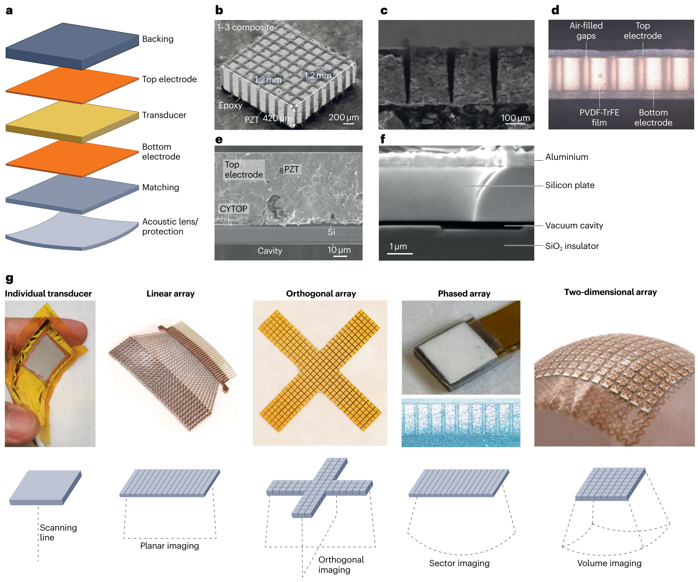
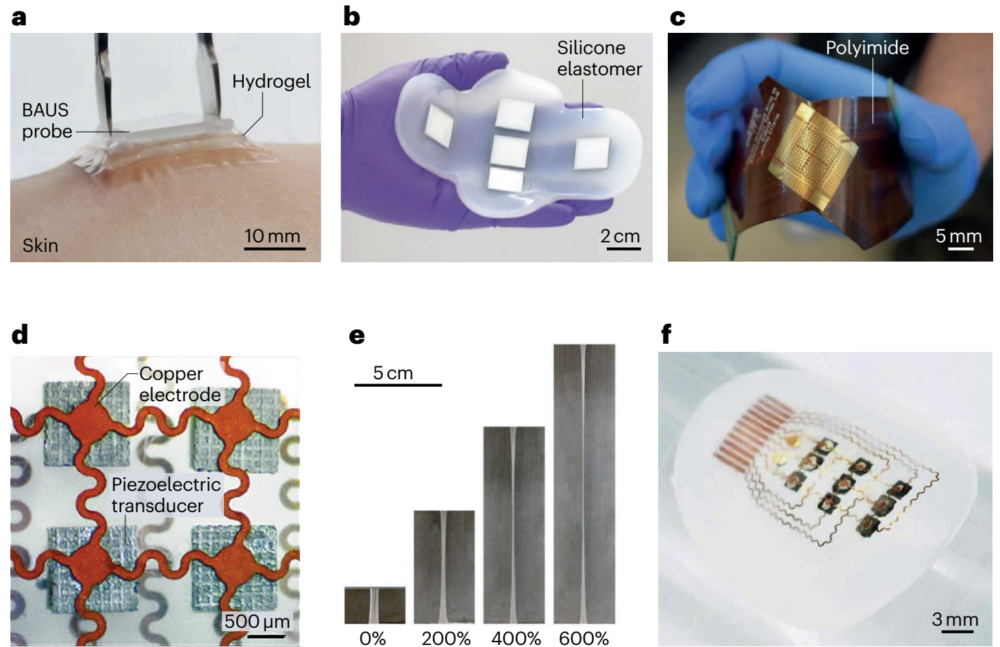
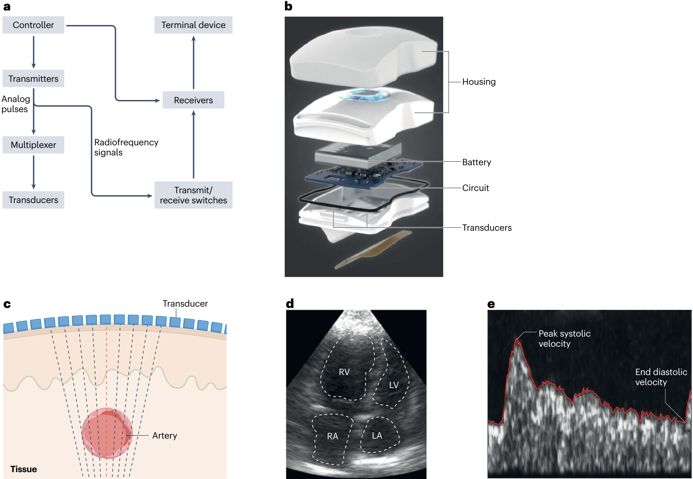
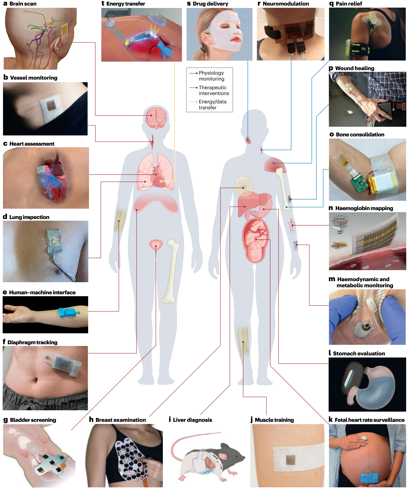

https://doi.org/10.1038/s44222-025-00329-y

# Wearable ultrasound technology

Sai Zhou1,6, Geonho Park2,6, Muyang Lin2,6, Xinyi Yang1 & Sheng Xu1,2,3,4,5

## Abstract

Wearable ultrasound technology refers to ultrasound devices designed with compact form factors that do not restrict the mobility or routine functions of the wearer. These devices are intended to provide continuous monitoring of internal tissue structures and offer therapeutic intervention without manual operation. Wearable ultrasound technology has potential applications in the management of chronic diseases, acute conditions during surgeries and emergencies, and post-operative care. This technology can provide clinicians and patients with data and insights, such as patterns of physiological variations over time and critical periods of disease progression, that are hardly attainable using conventional handheld ultrasound devices. In this Review, we discuss recent advances in wearable ultrasound technology, focusing on material selection, mechanical design, the integration of wearable systems, and exemplary medical applications. Additionally, we provide a framework for expanding the adoption of wearable ultrasound technology, particularly in low-resource settings, by exploring barriers in technology transfer. Finally, we identify critical challenges from scientific, engineering and clinical perspectives to advance wearable ultrasound technology to the next stages of development.

1 Materials Science and Engineering Program, University of California San Diego, La Jolla, CA, USA.

2 Aiiso Yufeng Li Family Department of Chemical and Nano Engineering, University of California San Diego, La Jolla, CA, USA.

3 Department of Electrical and Computer Engineering, University of California San Diego, La Jolla, CA, USA.

4 Shu Chien–Gene Lay Department of Bioengineering, University of California San Diego, La Jolla, CA, USA.

5 Department of Radiology, University of California San Diego, La Jolla, CA, USA.

6 These authors contributed equally: Sai Zhou, Geonho Park, Muyang Lin. e-mail: shengxu@ucsd.edu

## Key points

• Wearable ultrasound technology enables hands-free, operator-independent and continuous operation.

• The integration of miniaturized back-end circuits, autonomous signal processing algorithms and multimodal sensing systems is intended to enhance diagnosis accuracy, user experience and patient outcomes.

• Wearable ultrasound technology has shown potential in a wide range of use cases, although most of the results are yet to be validated against gold standards in well-controlled clinical studies.

• To enable clinical translation, it is necessary to carry out controlled clinical studies, establish safety protocols for therapeutic intervention, and integrate wearable data with electronic health records.

• Future advancements should focus on improving imaging resolution, realizing efficient 3D imaging, integrating control electronics with low size, weight and power consumption, creating breathable device packaging.

## Introduction

Ultrasound is a versatile healthcare tool used for both diagnostic and therapeutic purposes. Diagnostic ultrasound sends sound waves into the body, which interact with tissues to produce echoes. These echoes can be captured and processed for anatomical imaging (such as A-mode, B-mode and M-mode) to visualize internal structures, or functional imaging (such as Doppler and elastography) to quantify tissue behaviour and properties. Therapeutic ultrasound uses the bioeffects of transmitted ultrasound waves to treat diseases and conditions1. For example, surgical interventions, drug-related treatments and neuromodulation can be performed using the mechanical and thermal effects of ultrasound waves.

Ultrasound can provide real-time feedback and is generally lower in cost than other medical imaging techniques, making it an indispensable tool in healthcare. Although conventional diagnostic ultrasound devices, such as cart-based ultrasound machines, are adequate and effective for many purposes (such as vascular ultrasound for detecting deep vein thrombosis, thyroid ultrasound for evaluating nodules and ocular ultrasound for diagnosing retinal detachment), they fail to capture comprehensive longitudinal views and critical transient moments of dynamics in the body. Similarly, conventional therapeutic ultrasound is effective for many use cases (such as ultrasonic lithotripsy, tumour ablation and cataract removal) but often fails to provide continuous or prolonged targeted interventions.

Advancements in the integrated circuits have resulted in palm-sized ultrasound probes. These probes enable protable and remote physician-guided operation based on robotics or mobile phones and can potentially alleviate the burden of centralized facilities2. However, the cost of robotics can be prohibitively high, making them inaccessible in many settings. Additionally, mobile phone integrated probes still require an experienced sonographer to supervise untrained users. Furthermore, because these probes still need to be fixed to a specific body area by robotics or by hand, patient mobility is limited, and they are unsuitable for continuous assessment or treatment.

Wearable devices provide continuous tracking and regulation of physiological signals, enabling early detection of anomalies and timely interventions3–5. These devices typically comprise miniaturized sensors or actuators that can be worn on the body without restricting user mobility. The sensors capture physiological signals in real time to provide a comprehensive assessment of the user’s health status. The actuators can interact with bodily functions — for example, regulating neurological behaviours6–9, administering medications10,11, accelerating tissue regeneration after injury12 and managing pain perception13. The low form factor offers patient mobility, efficiency and usability, and enhances patient compliance and outcomes14.

Signals from inner organs can often provide a more systemic perspective on the human body than those from the skin surface or shallow tissues. Probing signals from deep tissue is a broad trend across multiple modalities15. For example, wearable microneedle-based glucose sensors, which access interstitial fluid in the dermis by penetrating ~500 µm into the skin, provide more accurate measurements than sweat-based glucose sensors16. Wearable microneedle-based electromyography outperforms surface electromyography in capturing subtle muscular contractions involved in fine motor tasks17. Deeper wearable optical biopsy can also be achieved by replacing light-emitting diodes with laser-based equipment to detect more pathologies beneath the epidermis, such as diabetic microangiopathy and subcutaneous inflammation18.

Wearable ultrasound technology integrates the deep penetration depth of ultrasound with the continuous operation of wearable devices19–22. Specifically, wearable ultrasound devices can adhere to the skin without manual holding, electronic scanning by phased array technique allows active searching of the target, and artificial-intelligence-based data processing enables automatic data interpretation without the involvement of sonographers (Box 1). Wearable ultrasound technology empowers patients to capture continuous data streams and provide prolonged intervention if needed. Furthermore, healthcare providers can access the data remotely at any time without disrupting the patients’ daily lives. Together, wearable ultrasound technology has the potential to simplify ultrasound applications by requiring minimal training to perform diagnostic assessments and/or treatments independently19, which holds potential for applications ranging from managing chronic diseases to responding to acute medical emergencies and providing post-operative care. In this Review, we discuss the design, fabrication, integration, and applications of wearable ultrasound devices with a particular emphasis on the technology translation. Additionally, we identify specific challenges and explore approaches for future advancements of this technology.

## Box 1 | Low-resource considerations

Traditional imaging systems (such as X-ray computed tomography, magnetic resonance imaging and positron emission tomography)243 can be difficult to access in low-resource settings because these modalities demand considerable investments in equipment and maintenance, as well as an experienced workforce (such as radiologists and sonographers) to operate and interpret results. Additionally, specialized infrastructures, such as radiation shielding for X-rays and cryogenic systems for magnetic resonance imaging, are required244. Those residing in remote regions or facing healthcare disparities disproportionately bear this burden213.

Wearable ultrasound technology is a viable alternative to overcome these barriers because these devices do not need substantial infrastructure or maintenance investments associated with traditional imaging systems19. Their portability makes them particularly suitable for remote areas with limited healthcare resources, ensuring that everybody, including those unable to travel, has access to advanced imaging systems245.

Unlike portable handheld probes, wearable ultrasound devices enable hands-free, operator-independent and continuous monitoring, which is particularly useful for high-risk populations or those with acute conditions, such as in intensive care scenarios63,68. Additionally, wearable ultrasound technology provides automated image acquisition, ensuring consistent and reliable data quality in environments with limited clinical oversight. Automated data interpretation algorithms further mitigate this reliance.

Wearable ultrasound technology can potentially extend the reach of advanced healthcare. In the short term, it can circumvent the concentration of complex imaging equipment in traditional highly specialized (such as tertiary and quaternary) hospitals, making advanced imaging available even in primary and secondary care settings246. In the long term, these imaging systems can be integrated with telemedicine platforms to offer expert diagnoses and consultations to individuals in remote regions, eliminating the need to travel to hospitals247. Such strategies could transcend economical barriers, democratize access to advanced medical resources and provide a level of care previously unattainable in low-resource settings.

## Device design

### Material design of transducers

Fig. 1 | Transducer material design, acoustic stack and configurations for wearable ultrasound devices. a, Transducer design with acoustic stacking layers including a backing layer, electrode layers, a transducer layer, a matching layer, and an acoustic lens or protection. b, In 1–3 composite piezoelectric ceramics, the ceramic rods extend throughout the thickness but are isolated laterally by the polymer matrix. c, A fine-pitch array fabricated with lead indium niobate–lead magnesium niobate–lead titanate (PIN–PMN–PT) crystal. d, A flexible transducer array design with the air-filled gaps and the poly-vinylidene fluoride-co-trifluoroethylene (PVDF–TrFE) film structure. e, The structure of a piezoelectric micromachined ultrasound transducer. The piezoelectric layer is adhered to a Si layer using cyclic transparant optical polymer (CYTOP), forming the vibration membrane. f, The structure of a capacitive micromachined transducer. The cavity is vacuum sealed to prevent moisture and variations in ambient pressure from affecting the transducer’s performance. g, Representatives of wearable ultrasound transducers, including an individual transducer, a linear array, an orthogonal array, a phased array and a two-dimensional array (top row) and their corresponding schematic layout of configurations and imaging capabilities (bottom row). PZT, lead zirconate titanate. Part b is adapted with permission from ref. 237, AAAS. Part c is reprinted with permission from ref. 238, IEEE. Part d is adapted from ref. 25, Springer Nature Limited. Part e is reprinted from ref. 239, Springer Nature Limited. Part f is reprinted with permission from ref. 240, IEEE. Part g ‘individual transducer’ is reprinted from ref. 241, CC BY 4.0 (https://creativecommons.org/licenses/by4.0/). Part g ‘linear array’ is reprinted from ref. 68, Springer Nature Limited. Part g ‘orthogonal array’ is reprinted from ref. 63, Springer Nature Limited. Part g ‘phased array’ is reprinted from ref. 24, Springer Nature Limited. Part g ‘two-dimensional array’ is reprinted from ref. 75, Springer Nature Limited.

Table 1 | Comparison of wearable diagnostic ultrasound technologies

| Mode | Signal processing | Advantages | Disadvantages | Applications | Transducer material | Conformity | Durabilityᵃ | Data and/or power transfer method | Refs. |
| --- | --- | --- | --- | --- | --- | --- | --- | --- | --- |
| A-mode | Absolute intensity of radiofrequency signal | Accurate distance measurement; simple signal processing | No lateral information | Bladder dimension | Piezoelectric ceramics | Rigid | Non-durable | Wireless | 89,90 |
|  |  |  |  |  | Piezoelectric ceramics | Stretchable | Durable | Wired | 139 |
|  |  |  |  | Blood pressure | Piezoelectric polymers | Flexible | Non-durable | Wired | 25 |
|  |  |  |  |  | Piezoelectric ceramics | Stretchable | Durable | Wired | 91–93 |
|  |  |  |  |  | Piezoelectric ceramics | Stretchable | Durable | Wireless | 68 |
|  |  |  |  | Respiratory | Piezoelectric ceramics | Flexible | Non-durable | Wired | 94 |
|  |  |  |  | Muscle dimension | Piezoelectric ceramics | Rigid | Non-durable | Wired | 80,81, 95 |
|  |  |  |  | Muscle dimension | PMUT | Rigid | Non-durable | Wired | 127 |
|  |  |  |  | Muscle dimension | Piezoelectric ceramics | Flexible | Durable | Wireless | 98 |
|  |  |  |  | Intestinal function | PMUT | Rigid | Non-durable | Wired | 99 |
| M-mode | Continuous line scanning over time | Visualization of temporal changes; high temporal resolution | No lateral information | Myocardium wall motion | Piezoelectric ceramics | Stretchable | Durable | Wired | 63 |
|  |  |  |  | Respiratory | Piezoelectric ceramics | Flexible | Durable | Wireless | 98 |
| B-mode | 2D image of radiofrequency signals from an array | High spatial resolution; wide field of view | Complex signal processing; prone to artefacts because the image is reconstructed from multiple sequential scans | Bladder volume | Piezoelectric crystals | Stretchable | Durable | Wired | 24 |
|  |  |  |  | Cardiac anatomy | Piezoelectric ceramics | Stretchable | Durable | Wired | 63 |
|  |  |  |  | Stomach volume | Piezoelectric ceramics | Rigid | Durable | Wired | 73 |
|  |  |  |  | Muscle dimension | Piezoelectric ceramics | Rigid | Non-durable | Wired | 126 |
|  |  |  |  | Breast tumour | Piezoelectric crystals | Rigid | Non-durable | Wired | 23 |
| Elastography | Radiofrequency signals from localized tissue displacement | Quantification of tissue modulus; enables detection of tissue boundaries even with minimal acoustic impedance differences | Complex setup; low temporal resolution | Muscle soreness and injury | Piezoelectric ceramics | Stretchable | Durable | Wired | 75 |
|  |  |  |  | Liver stiffness | Piezoelectric ceramics | Flexible | Durable | Wired | 103 |
| Spectral Doppler | Velocity waveforms using continuous or pulsed waves | Quantification of flow velocity profile; visualization of temporal flow changes | No lateral resolution; no axial information for continuous wave | Blood flow velocity | Piezoelectric ceramics | Stretchable | Non-durable | Wired | 72,104 |
|  |  |  |  |  |  | Stretchable | Durable | Wired | 107 |
|  |  |  |  |  |  | Rigid | Durable | Wired | 73 |
|  |  |  |  |  |  | Rigid | Non-durable | Wireless | 119 |
| Colour Doppler | Mean phase difference from multiple pulse-echoes | Visualization of flow direction; high spatial resolution | No quantification of flow velocity profile | Artery and vein differentiation | Piezoelectric ceramics | Stretchable | Durable | Wired | 107 |
|  |  |  |  | Muscle movement velocity | Piezoelectric ceramics | Rigid | Durable | Wired | 73 |
| Power Doppler | Integrated power from multiple pulse-echoes | High spatial resolution | No differentiation of flow directions; no quantification of flow velocity profile | Blood flow | Piezoelectric ceramics | Stretchable | Non-durable | Wired | 72 |

PMUT, piezoelectric micromachined ultrasonic transducer.

ᵃDurability is defined as “durable with non-vaporizable coupling materials” and “non-durable with vaporizable coupling gel”.

Transducers are core components of ultrasound devices (Fig. 1a). They convert electrical energy into ultrasound waves and vice versa. They can be made of bulk materials, including piezoelectric crystals23, ceramics24 and polymers25–27, or can incorporate micromachined membranes and cavities28 (Table 1). Their functionality can be evaluated by the piezoelectric coefficient, electromechanical coupling coefficient and acoustic impedance.

The piezoelectric coefficient (d33, usually ranging from 20 to 1,550 pC N−1) quantifies conversion between electric field and mechanical strain29 and is defined by:

$$d\_{33} = S\_3/E\_3$$

where S3 is the strain produced and E3 is electric field applied along the transducer thickness direction. Higher piezoelectric coefficients correlate with better transducer sensitivity.

The electromechanical coupling coefficient (k, typically ranging from 0.15 to 0.95) describes the conversion between electrical and mechanical energy30 and is defined by:

$$k = (U\_{\mathrm{ME}}/U\_{\mathrm{E}})^{0.5}$$

where UME is the stored mechanical energy and UE is the input electrical energy. For an ideal transducer, it approaches unity.

The acoustic impedance (Z, usually ranging from 3.7 to 34 MRayl) is defined by:

$$Z = \rho v$$

where ρ and v are material density and the sound velocity in the material, respectively. It indicates the resistance to ultrasound wave propagation through different tissues. The mismatch of acoustic impedances in different tissues serves as the fundamental contrast mechanism for ultrasound imaging. However, it also causes energy loss at media interfaces31. An ideal transducer for biomedical applications would have a similar acoustic impedance to that of soft tissue (~1.6 MRayl)32, enabling low energy loss in acoustic transmission and good signal quality33.

Piezoelectric ceramics, such as polycrystalline lead zirconate titanate Pb(Zr1−xTix)O3 (known as PZT), have high cost-efficiency, large piezoelectric coefficient (374–650 pC N−1), strong electromechanical coupling coefficient (0.17–0.58) and high acoustic impedance (~30 MRayl)34–36. The material can be fabricated into pillars and embedded in a polymer matrix such as epoxy, to form a 1–3 composite (Fig. 1b) with a reduced acoustic impedance (9–17 MRayl), closer to that of soft tissue. With the ideal aspect ratio, the transverse and longitudinal vibration frequencies of the pillars match and achieve the largest vibration amplitude in the thickness direction of the composite material. This results in electromechanical coupling coefficient in the thickness (kt) direction approaching the ideal k33 value30, enhancing the energy efficiency and signal-to-noise ratio37.

Piezoelectric crystals have highly ordered and symmetrical lattice structures, and thus uniformly aligned electric dipoles, leading to higher piezoelectric coefficients compared with their ceramic counterparts, which have randomly oriented grains. A representative material is lead indium niobate–lead magnesium niobate–lead titanate (PIN–PMN–PT) (Fig. 1c), which features an outstanding piezoelectric coefficient (1,550 pC N−1), a high electromechanical coupling coefficient (0.56–0.95) and a high acoustic impedance (34 MRayl)38. However, the thermal stability of the commonly used PIN–PMN–PT crystal is lower than that of other crystals (such as PZT), suggesting it is not ideal for applications that require high-power transmission. The Curie temperature of PIN–PMN–PT is only 130–170 °C (ref. 39), whereas it is >300 °C for PZT40,41. Additionally, the use of crystals is limited by complex preparation and growth processes requiring precise control over temperature, pressure and cooling rates.

Supplementary Table 1 | Advantages and disadvantages of different transducer materials

| Transducer materials | Advantages | Disadvantages |
| --- | --- | --- |
| Piezoelectric ceramics | - High sensitivity, high efficiency | - High impedance mismatch with soft tissue - High thermal stability |
| Piezoelectric crystals | - Higher sensitivity and higher efficiency than piezoelectric ceramics | - High impedance mismatch with soft tissue - Lower thermal stability than piezoelectric ceramics. |
| Piezoelectric polymers | - High reception bandwidth - Low acoustic impedance mismatch with soft tissue - Mechanical flexibility | - Low transmission efficiency - Lower thermal stability than piezoelectric crystals |
| Piezoelectric micromachined ultrasound transducers | - High sensitivity - Low voltage operation - High compatibility with integrated circuits | - High fabrication complexity - Narrower bandwidth than capacitive micromachined transducers |
| Capacitive micromachined ultrasound transducers | - High sensitivity - High bandwidth - High compatibility with integrated circuits | - High fabrication complexity - Complex pulser design to drive transducers with bias voltage |

Piezoelectric polymers, especially polyvinylidene fluoride (PVDF)42 and its copolymer with trifluoroethylene (PVDF–TrFE)27, are used in biomedical applications owing to their cost efficiency and high flexibility43,44 (Fig. 1d). The thermal stability of these polymers is lower than that of inorganic piezoelectric materials because the polymer chains in PVDF become mobile at ~170 °C (ref. 45) (below its Curie temperature46), leading to softening and gradual depolarization of the material. The polymers display a relatively low piezoelectric coefficient (20–29 pC N−1) and a low electromechanical coupling coefficient (0.15–0.3), which restrict their voltage sensitivity as ultrasound transducers. However, because the permittivity of polymers is lower than its inorganic counterparts47, the piezoelectric voltage constant (g33, 200–300 V m N−1)48 is relatively high, enabling them to detect ultrasound waves efficiently. Therefore, PVDF is preferred for reception-only applications such as photoacoustic imaging and hydrophone-based characterization. Additionally, PVDF can be readily processed into thin films with desired curvature, making them naturally focused for high-resolution imaging49 or scanning microscopy imaging50. These polymers are flexible and can conform to developable surfaces, offering better mechanical compliance than ceramics and crystals. Compared with its ceramic counterparts (Young’s modulus ~50 GPa), PVDF has a smaller modulus (Young’s modulus 2.0–3.5 GPa)51 leading to a smaller acoustic impedance (3.7–3.9 MRayl) and thus less mismatch with soft tissue (Supplementary Table 1).

Piezoelectric micromachined ultrasound transducers feature a piezoelectric membrane sandwiched between two electrodes52 (Fig. 1e). The piezoelectric membrane primarily operates in the flexural mode, which pops the membrane out-of-plane. When activated by alternating current voltages53, the membrane vibrates. The generated acoustic pressure is typically linearly proportional to the activation voltage (such as 4.9 kPa V−1 at 1.5 MHz)54. Owing to their limited amount of piezoelectric material, these micromachined transducers have lower sensitivity than bulk piezoelectric transducers55. However, they offer advantages in fine-pitch design and compatibility with standard circuit integration and their microfabrication processes28. These micromachined transducers can be manufactured on polymer substrates to make them mechanically compliant56.

Capacitive micromachined ultrasound transducers are composed of flexible membrane layers, a cavity, an insulator layer (Fig. 1f), and a bottom electrode57. When an alternating voltage is applied to the two electrodes, electrostatic force will induce oscillations in the membrane electrode, generating ultrasound. In comparison with piezoelectric counterparts, the vibrating membranes of capacitive transducers are thinner58, leading to lower inertia, flexural rigidity and acoustic impedance55; and therefore higher sensitivity to high-frequency signals and higher ultrasound transmission efficiency to soft tissue. A voltage of up to tens of volts can be applied, known as the bias voltage, to pre-stress the membrane electrode and pull it closer to the substrate, resulting in better pressure sensitivity59 (such as 21 kPa V−1 at 1.85 MHz; ref. 60). Tuning the bias voltage adjusts the stress in the membrane electrode and the transducer’s resonance frequency to suit specific applications that require delicate tissue structures at various depths, such as musculoskeletal and ophthalmic imaging. However, the use of a bias voltage necessitates the inclusion of additional power converters to boost the low voltage input of batteries61, which increases the complexity of driving electronics62.

### Transducer stack and configurations

The transducer stack features a backing layer, a matching layer, an acoustic lens, and/or an encapsulation layer (Fig. 1a). The backing layer, typically composed of metal–epoxy resin composites63, absorbs and dissipates acoustic energy propagating backwards to prevent multiple reflections that can degrade bandwidth and spatial resolution. The matching layer creates an impedance gradient to compensate for the mismatch between the transducer and soft tissue, enhancing the transmission of ultrasound energy33. This layer is a quarter-wavelength thick to achieve phase synchronization and constructive interference64,65, and this thickness eliminates the interfacial reverberation between the matching material and the transducer23. The acoustic lens focuses the ultrasound beam to produce high intensity at the desired depth66. The encapsulation, or protection, layer is typically made of silicone elastomers that have similar modules with soft tissue for better acoustic transmission66. A single layer of elastomer could be designed to serve as both lens and protection67. A complete transducer stack is critical to achieving high imaging performance. In some non-imaging applications, the stack can be simplified to reduce the probe thickness and bulkiness. For example, pulse recording from shallow peripheral arteries may not require the lens68, and continuous-wave Doppler for flow monitoring can operate without the backing layer69.

Wearable ultrasound devices can be configured individual transducers, linear arrays, orthogonal arrays, phased arrays and two-dimensional (2D) arrays (Fig. 1g). Individual transducers have simple electrical connections and can function for both signal transmission and receiving, but they lack lateral resolution. Linear arrays enable electronic steering of the ultrasound beam to provide lateral resolution70. Orthogonal arrays combine two independent, perpendicular linear arrays, enabling them to capture two cross planes simultaneously. The elements at the intersections are shared through multiplexing by both linear arrays63. Phased arrays are characterized by wide-range beam steering and focusing. The centre-to-centre distance between adjacent elements (pitch) in phased arrays needs to be close to half of an ultrasound wavelength, so that the main beam can be steered to any angle and undesired secondary beams (grating lobes) are kept outside the field of view. This makes it ideal for applications that require a large field of view from a small acoustic window, such as imaging cardiac chambers through intercostal spaces. A pitch smaller than half of the ultrasound wavelength reduces sensitivity, however, owing to the small width of each element24. 2D arrays are composed of individually addressable elements arranged in a matrix71, and they use electrical volumetric beam steering and focusing to enable three-dimensional (3D) imaging. However, complex and high-channel-count wiring systems are required to support 2D arrays72.

### Rigid, flexible and stretchable wearable probe designs

Supplementary Table 2 | Advantages and disadvantages of the rigid, flexible and stretchable wearable ultrasound probes

| Probe types | Advantages | Disadvantages |
| --- | --- | --- |
| Rigid | - Mature fabrication process - High image quality - Highly compatible with conventional imaging systems | - Limited to relatively flat acoustic windows and subcutaneous fat for cushioning - May need thick encapsulation layer on highly curved body surfaces |
| Flexible | - Better conformity and wearing comfort than rigid probes - Long-term wearability | - Relatively complicated to fabricate - Array bending leads to minor phase distortion. - Additional components or methods needed to compensate array bending |
| Stretchable | - Better conformity and wearing comfort than flexible probes - Long-term wearability | - Relatively complicated to fabricate - Array stretching and bending lead to pitch change and phase distortion. - Additional components or methods needed to compensate changes in array pitch and curvature |

Conventional handheld ultrasound probes use liquid gel to couple with the skin, which dries quickly and complicates disinfection when the probes are used on different participants. In addition, conventional handheld probes require manual operation, which is time consuming and prone to errors, especially on curved and dynamic body surfaces, such as joints and other extremities. Furthermore, their acoustic windows are intrinsically small. Material and structural engineering can be applied to develop rigid, flexible or stretchable wearable ultrasound probes to address these limitations (Supplementary Table 2).

Fig. 2 | Rigid, flexible and stretchable wearable ultrasound designs. a, A rigid wearable ultrasound device to the skin has a bioadhesive hydrogel to provide conformal contact and efficient acoustic coupling. b, Isolated rigid arrays are embedded in a silicone elastomer to image with extended aperture. c, A flexible wearable ultrasound device on a polyimide substrate. d, A stretchable wearable ultrasound device including serpentine copper electrodes as stretchable bridges to interconnect transducer islands. e, A stretchable liquid metal electrode can remain electrically conductive at various strain levels. f, A stretchable ultrasound device with transducer spacing filled by silicone elastomer. The elastomer serves as electrical insulation and transducer protection. BAUS, bioadhesive ultrasound. Part a is reprinted with permission from ref. 73, AAAS. Part b is reprinted from ref. 24, Springer Nature Limited. Part c is reprinted from ref. 74, Springer Nature Limited. Part d is reprinted with permission from ref. 237, AAAS. Part e is reprinted from ref. 63, Springer Nature Limited. Part f is reprinted from ref. 104, CC BY 4.0 (https://creativecommons.org/licenses/by4.0/).

Rigid wearable ultrasound probes integrate a rigid transducer array, which is structurally similar to that of conventional ultrasound probes to ensure high quality and compatibility with back-end systems. The rigid probe can be coupled to the skin a soft layer commonly made of silicone24 or hydrogel73 elastomers (Fig. 2a,b), which are acoustically transparent and can mitigate the mechanical mismatch between the transducer array and the human body. This soft coupling layer can also be engineered to serve as a supporting substrate24 and skin adhesive73. These probes can be used at various sites, which are relatively flat or have subcutaneous fat and muscles as natural cushioning, such as the parasternal window for cardiac imaging, the temporal window for transcranial imaging, the tibial window for musculoskeletal imaging and the abdominal window for internal organ imaging. However, at highly curved sites, such as the wrist, knee and shoulder, a thick, soft coupling layer is required to maintain skin contact, which increases device bulkiness and can compromise its wearability73.

Flexible wearable ultrasound probes feature bendable transducer arrays on polymer substrates, such as polyimide6,25,43,74 (Fig. 2c). Flexible probes can conform to curved skin surfaces without thick, soft coupling layers, aiding long-term wear. However, flexible probes can only conform to developable surfaces or cylindrical shapes (such as the neck25 and limbs74), not to non-developable geometries such as spherical or curvilinear body parts.

Stretchable wearable ultrasound probes are designed to maintain electrical connectivity and mechanical integrity when stretched. Electrical connectivity is achieved through patterned metals, including serpentine copper75 (Fig. 2d), or intrinsically soft conductive materials, such as liquid metals63 (Fig. 2e). Mechanical integrity is maintained by filling transducer kerfs, the gaps between adjacent elements, with elastomer76. Using hydrophobic elastomers limits moisture permeability and prevents electrode corrosion by sweat75 (Fig. 2f). Stretchable probes provide the highest degree of skin conformity and maintain device functionality during body motion68. However, their fabrication involves processes, such as transfer printing on elastomers, that are not yet compatible with established industrial manufacturing standards. These processes rely on manual operation, creating a scalability barrier. Non-recurring engineering investments can help establish specialized equipment to enable scalable fabrication. For example, transfer printing could be replaced by roll-to-roll printing tailored for elastomer substrates77. By distributing the initial engineering investments across high-volume production, stretchable ultrasound probes could transition from bespoke prototypes to commercially viable products.

## Device integration

### Back-end circuits

To aid rapid prototyping in early research stages, wearable ultrasound probes are often tethered through flexible cables to bulky back-end circuits, where dedicated software is designed24,63,73. The tethering cable confines the user’s mobility. To expand the utility of wearable ultrasound devices, the circuits must be made compact and wearable so that individuals can move freely and engage in daily activities without constraints.

Fig. 3 | Device integration. a, Key building blocks of an ultrasound circuit. b, A dual-transducer continuous-wave Doppler system. c, Each transducer element in a 32-element array can emit an ultrasound beam. A machine-learning algorithm can scan through the array to identify the element that accurately measures the arterial diameter. d, A fully convolutional neural network can be used to analyse images to measure cardiac volume. e, Automated maximum velocity envelope tracing is used to extract the peak systolic and end diastolic velocities. LA, left atrium; LV, left ventricle; RA, right atrium; RV, right ventricle. Part b is reprinted from ref. 69, Springer Nature Limited. Part c is reprinted from ref. 68, Springer Nature Limited. Part d is adapted from ref. 63, Springer Nature Limited. Part e is adapted from ref. 72, Springer Nature Limited.

In general, the complexity and size of these circuits depend on the number of transducer elements because, in principle, each element requires a transmitter and receiver78 (Fig. 3a). To reduce the number of transmitters and receivers, multiplexers can be used to sequentially connect multiple transducer elements to a single transmitter and receiver78.

Single-element wearable ultrasound probes use a simple circuit, for example, including a controller, a transmitter, a transmit–receive switch and a receiver. Under the command of the controller, the transmitter generates high-voltage analog pulses to activate the transducer elements, which emit ultrasound waves79. The transmit–receive switch protects the receiver by blocking the high-energy transmitted analog pulses that could otherwise damage sensitive receiving electronics78. The receiver records, amplifies, filters and digitizes the reflected radiofrequency signals from the transducer element78.

Building on the single-element circuit design, dual-element wearable ultrasound probes use separate elements for transmitting and receiving ultrasound waves, and therefore do not require a transmit–receive switch. For pulsed-wave Doppler, a pulse generator transmits ultrasound pulses, which enables calculation of the latency between the transmission and reception for distance measurements78. For continuous-wave Doppler, a clock generator ensures signal synchronization among all circuit components, and a quadrature demodulator typically enables blood flow measurement by detecting phase differences between transmitting and receiving transducer elements69 (Fig. 3b).

Arrayed ultrasound probes require multiple transmitters and receivers79. In exemplary eight-element arrays, each element equipped with individual transmitter–receiver pairs, have demonstrated the capability for simultaneous transmission and receiving to detect muscle activities in limb amputees80,81. Multiplexers can allow data transmission from up to 32 elements using a single transmitter–receiver pair68. However, they lack beam-steering capabilities and have limited temporal resolution. To solve this problem, multiple multiplexers can be configured to introduce phase delays across multiple channels, enabling beam steering36. Additionally, multiplexers reduce the number of necessary channels to be connected to each transmitter–receiver pair at any given time and therefore reduce channel congestion.

Application-specific integrated circuits (ASICs) can reduce the circuit size without sacrificing complexity, although their development is costly78. For example, an ASIC with four transmitters, four transmit–receive switches and four receivers for sensing applications can be miniaturized to only 9.89 mm² in size82. This compact size means that the circuit can be integrated closer to the transducers, and the shortened signal path reduces noise coupling and improves signal quality78. Additionally, this ASIC features an optimized transistor architecture to reduce current leakage, thereby minimizing static power consumption and enhancing power efficiency78. For therapeutic applications, the ASIC integrates transmitters and boost converters to elevate battery voltage for high-energy transmission. Transmit–receive switches or receivers are not required. Therefore, therapeutic ASICs are generally smaller than those for sensing applications. Their size depends on the number of elements: 4 mm² for single-element83, 6.25 mm² for 16-element84 and 96.04 mm² for 1,024-element85 arrays. The nonlinear scaling of these ASIC sizes is driven by factors such as manufacturing processes (180 nm versus 350 nm), pulser type (unipolar versus bipolar) and shift register width (smaller registers reduce complexity).

For wireless communication, both Bluetooth and Wi-Fi modules can transfer received digitized data to a terminal device86. Bluetooth operates using a short-range radiofrequency, resulting in relatively lower power consumption and less susceptibility to signal interference owing to its limited coverage86,87. By contrast, Wi-Fi uses high-power radio signals across multiple frequency bands, offering higher data transfer rates and broader coverage68.

### Signal processing

Radiofrequency signals are the simplest form of received signals and are amenable to a multitude of processing modes including amplitude (A-mode), motion (M-mode), brightness (B-mode), elastography and Doppler (including spectral Doppler, colour Doppler and power Doppler)64,88.

A-mode represents the absolute intensity of radiofrequency signals; it measures the time of flight, defined as the time required for an ultrasound pulse to travel from the transducer to a target and back88. Each peak in A-mode signals represents a tissue interface, where an acoustic impedance mismatch occurs, enabling accurate distance measurements. These measurements can be achieved using a single-element circuit with minimal signal processing. Applications include assessing bladder dimension89,90, blood pressure25,91–93, respiratory dynamics94, muscle dimension80,81,95–98 and intestinal function99. However, because this method records signals only along a single beam path, it does not capture lateral spatial information, meaning it cannot visualize 2D or 3D anatomical structures.

M-mode displays radiofrequency signals over time, offering a one-dimensional (1D) view that captures tissue motions (such as myocardium wall motion63, respiratory dynamics68 and vessel pulsation68). A single element can generate a M-mode image with high temporal resolution. For example, a 32-element array was used to generate 32 M-mode images of a vessel68. A machine-learning model trained with a labelled dataset can classify these images and autonomously select the image capturing the vessel diameter, eliminating the need for manual selection by a technician68 (Fig. 3c). Domain adaptation techniques apply the unique features of the labelled dataset to a non-labelled dataset, enhancing the model’s generalizability across participants with different M-mode image features, such as luminosity and tissue movement patterns68.

B-mode reconstructs radiofrequency signals from an array to generate 2D or 3D images of anatomical structures. Beamforming controls the direction and focus of ultrasound waves using a multielement circuit, by adjusting the timing and amplitude of signals from each transducer element. Various transmit beamforming techniques, such as plane wave, mono-focusing and wide-beam compounding, can be used to enhance image quality63, as evaluated by axial and lateral resolutions23,63,100. Plane wave relies on single transmission and therefore offers high frame rates but sacrifices spatial resolution101. Mono-focusing improves resolution by concentrating acoustic energy within the focal zone but deteriorates outside of it, owing to beam divergence101. Wide-beam compounding enables the beam to diverge and cover a large field of view63. Superimposing frames from multiple transmission angles produces high-quality B-mode images but with a limited frame rate and an increased susceptibility to artefacts. The images can be further processed using a fully convolutional neural network to extract actionable information such as left ventricular volume, stroke volume, cardiac output and ejection fraction63 (Fig. 3d).

Ultrasound elastography collects radiofrequency signals from localized displacements to map tissue moduli. Tissue boundaries, even with minimal acoustic impedance differences, can be detected because the displacements depend on variations in tissue moduli64,102. Owing to the low temporal resolution of elastography, B-mode imaging is usually used to identify the region of interest before elastography. In quasi-static elastography, displacement vectors are measured by correlating the radiofrequency signals before and after tissue deformation75. Inferring tissue moduli from these displacements presents an inverse elasticity problem owing to their complex and non-linear relationship75. The problem was solved by iteratively finding the distribution of shear modulus that minimizes the difference between predicted and measured displacement fields75. Because the applied stress is unknown, only relative tissue moduli could be acquired. In shear-wave elastography, a focused ultrasound beam applies an acoustic radiation force to generate localized shear waves, mechanical waves that travel through soft tissues perpendicular to the direction of ultrasound propagation103. The measured shear-wave velocity can then be used to calculate Young’s modulus given tissue density.

Doppler ultrasound uses phase differences between the transmitted and received radiofrequency signals to detect movement64. Spectral Doppler displays velocity waveforms using either continuous69,104 or pulsed-wave72 ultrasound. For continuous wave, the signal processing is relatively straightforward because it continuously measures the phase differences along the entire beam path between the transmitted and received signals from a two-element circuit, but it lacks depth resolution64. By contrast, pulsed wave uses transmitted pulses and their received echoes64. The signal processing is more complex because it measures the phase differences based on the time of flight64. This enables flow measurements at specific depths because the time interval between the transmitted pulses and received echoes can be accurately determined88. These Doppler spectra quantify blood flow velocity profiles and visualize temporal flow changes. However, the spectra are susceptible to signal interference from tissue motions. An advanced graphics processing unit can enable simultaneous imaging and spectral Doppler, allowing real-time vessel identification and reduced interference from tissue motion105. Automated envelope tracing processes these spectra by identifying the outer boundary of the waveform to extract peak systolic and end diastolic velocities72 (Fig. 3e).

Colour Doppler uses pulsed waves to measure the mean phase differences between consecutive pulse-echoes, caused by moving objects (such as flowing red blood cells)106. These images can visualize arterial and venous flow velocities and muscle movement patterns towards and away from the probe107. Power Doppler uses pulsed waves to calculate the integrated power, which relates to the number of moving objects (such as red blood cells), from multiple pulse-echoes88. This results in higher sensitivity to blood flow, but it cannot differentiate between flow directions108. Neither method can visualize tissue interfaces, requiring B-mode superimposition, nor quantify flow velocity profiles, necessitating spectral Doppler for precise velocity measurements.

Ultrafast imaging transmits several unfocused waves (such as plane or diverging waves) of different transmission angles into the tissue at very high frame rates, typically thousands of hertz109. The backscattered signals collected within a short duration (as little as 1 s), known as compounded data, are then coherently summed and processed through a spatiotemporal clutter filter (such as singular value decomposition to isolate tissue motion signals from blood flow signals) based on the difference in their spatiotemporal coherences. Therefore, ultrafast imaging can be used to enhance the quality of B-mode, elastography and Doppler images. By integrating ultrafast imaging with wearable ultrasound probes, 3D power Doppler signals were reconstructed with an enhanced signal-to-noise ratio and sensitivity of the Doppler shift72. Consequently, the wearable probes could effectively capture weak cerebral blood flow even with skull attenuation.

## Applications

### Physiology monitoring

Fig. 4 | Applications of wearable ultrasound technology. a–t, Wearable ultrasound devices can be tailored for different targets and applications in physiology monitoring (red), therapeutic interventions (blue), and energy and/or data transfer (yellow). Part a is adapted from ref. 72, Springer Nature Limited. Part b is adapted from ref. 107, Springer Nature Limited. Part c is adapted from ref. 63, Springer Nature Limited. Part d image courtesy of IEEE (ref. 242). Part e is adapted from ref. 98, Springer Nature Limited. Part f is reprinted from ref. 68, Springer Nature Limited. Part g is reprinted from ref. 24, Springer Nature Limited. Part h is adapted with permission from ref. 23, AAAS. Part i is adapted with permission from ref. 103, AAAS. Part j is reprinted from ref. 75, Springer Nature Limited. Part k is adapted from ref. 145, CC BY 4.0 (https://creativecommons.org/licenses/by4.0/). Part l is reprinted with permission from ref. 73, AAAS. Part m is adapted from ref. 91, Springer Nature Limited. Part n is reprinted from ref. 152, Springer Nature Limited. Part o is reprinted (adapted) with permission from ref. 182, American Chemical Society. Image in p is courtesy of P. Lewin, Drexel University. Part q image courtesy of ZetrOZ Systems LLC. Part r is reprinted from ref. 36, IEEE. Part s is reprinted (adapted) with permission from ref. 11, American Chemical Society. Part t is adapted with permission from ref. 197, AAAS.

Wearable ultrasound technology provides continuous monitoring of deep tissues and real-time insights into internal organ functions (Fig. 4a–n).

Cardiovascular assessment. The cardiovascular system provides oxygen and nutrients and removes waste to support all functions of the human body. Wearable ultrasound probes that integrate B-mode and M-mode imaging can capture dynamic cardiac structures and provide warnings when abnormalities (such as heart attack) are detected to prevent severe outcomes for high-risk patients. B-mode imaging is used to visualize cardiac anatomy and detect structural malfunctions73,110. M-mode captures structural behaviours, such as myocardial wall motions, over time to assess the dynamic functionality of the heart63. Stress echocardiography is used to diagnose heart conditions but can only be performed before and after exercise. However, many cardiovascular risks are visible only when maximum exertion is applied to the heart. Therefore, wearable ultrasound probes are designed to provide continuous monitoring of the heart before, during and after exercise. The probes capture real-time cardiac responses and offer objective data to standardize the stress test endpoint and enhance patient safety. A wearable ultrasound probe used orthogonal transducer arrays to independently and simultaneously capture cardiac imaging in two complementary orientations, without the need for manual rotation of handheld probes in clinical protocols63 (Fig. 4c). Furthermore, a deep learning model, FCN-32, was used to segment the B-mode images to extract the left ventricular volume63. Although this probe has the potential to evaluate cardiac functions and diagnose diseases such as heart failure, heart valve disease and coronary artery disease, the current model is limited to participants included in the training dataset63. Expanding the training dataset or optimizing it with few-shot learning or reinforcement learning strategies could potentially enable the model to adapt to a larger and more diverse population.

Continuous and non-invasive monitoring of haemodynamic parameters such as blood pressure and flow is necessary to manage cardiovascular diseases111–113. Traditional methods to monitor blood pressure include the cuff and arterial line, which can induce bruising, infection and thrombosis, especially with prolonged use. Wearable ultrasound probes can measure arterial wall pulsations based on A-mode radiofrequency signals and correlate the vessel diameter waveform to the blood pressure waveform following established mathematic models25,56,91,114,115. This method can be applied to monitor blood pressure at multiple locations, including the neck, arm, wrist and foot92. The mean differences between the wearable ultrasound probe and clinical reference methods (such as a cuff or arterial line) are <3 mmHg, with standard deviations of the difference <4 mmHg, during a range of daily activities with healthy participants, as well as in controlled clinical settings such as outpatient clinics, cardiac catheterization laboratories and intensive care units with cardiovascular patients93. Such high agreement between the measurement results from the wearable ultrasound probe and clinical reference methods indicates that the wearable ultrasound probe can be reliably used across diverse settings. However, the mathematical models used for blood pressure monitoring in wearable ultrasound probes assume a constant arterial stiffness coefficient based on initial calibration25,56,91,114–117, which may fluctuate during the progression of cardiovascular diseases. Further research is needed to understand arterial wall dynamics and refine the vessel diameter–pressure relationship for accurate long-term monitoring118.

Wearable Doppler ultrasound has been used to measure blood flow and identify issues such as arterial stenosis and venous insufficiency69,87,104,119,120. A phased array can actively steer and focus an ultrasound beam with different incident angles to target regions of interest and precisely monitor blood flow velocity in the body107 (Fig. 4b). Similarly, wearable transcranial Doppler121–123 enables continuous, long-term monitoring of cerebral blood flow for early detection of strokes, identifying vasospasms in patients with subarachnoid haemorrhage, and studying neurovascular coupling. A wearable ultrasound array72 uses ultrafast imaging with diverging waves to visualize the cerebral vasculature in 3D, which assists in identifying arterial segments and diagnosing vessel-morphology-correlated diseases124 (Fig. 4a). Additionally, focused ultrasound enables the acquisition of blood flow spectra at selected locations. For example, a series of intracranial B waves (slow oscillations in the cerebral blood flow velocity indicating the waste-cleaning process in the brain125) was captured when the participant was drowsy. When compared with a conventional transcranial Doppler probe, measurements from the wearable probe showed high agreement across participants of diverse backgrounds72. This demonstrates the ability of the wearable ultrasound array to accurately measure transcranial blood flow, a key factor in the long-term management of cerebrovascular diseases. However, without contrast agents, the spatial resolution of the array was limited to ~1 mm. Additionally, ultrasound gel must be used as an acoustic coupling medium, especially when applied over hair.

Musculoskeletal evaluation. Wearable ultrasound probes have demonstrated their ability to monitor musculoskeletal health for sports training and rehabilitation after injury. First, A-mode and B-mode imaging directly reveal changes in muscle dimensions during physical activities and can be used to evaluate muscle contraction and training intensity96,97,126,127. Second, elastography can monitor muscle moduli correlated to muscle soreness and injury128. A wearable ultrasound array has been used to track the dynamic recovery process of muscle after repeated exercise75 and to provide immediate feedback on the effectiveness of training and rehabilitation (Fig. 4j). Third, tissue Doppler imaging has been used to assess changes in muscle movement velocities, which can be correlated to fatigue129, and as the fatigued muscle recovers, the average muscle velocity waveforms show a return toward their baseline129. Fourth, transosseous ultrasound propagation can be used to evaluate bone fracture healing130. A study in sheep, using a mid-shaft tibial osteotomy, demonstrated that changes in ultrasound velocity and signal amplitude could be tracked to assess callus formation bridging the fracture gap. In the early stages of healing, the callus is largely composed of soft tissue and fluid. Ultrasound waves travel slowly with reduced amplitude. As the callus matures and mineralizes, both velocity and amplitude increase. These changes offer insights into bone consolidation, enabling clinicians to better guide recovery protocols.

Wearable ultrasound probes could potentially act as human–machine interfaces to control prosthetics and robots131,132 (Fig. 4e). Traditional human–machine interfaces are based on electromyography and electroencephalography, which have limitations in complex control tasks. Electromyography is primarily sensitive to superficial muscles and therefore cannot accurately identify complex hand gestures133. Furthermore, the signals from multiple muscle fibres can be mixed, making it difficult to isolate specific muscle contributions, losing spatial resolution98. Similarly, using electroencephalography is not practical for fine motor control in prostheses because it is indirectly related to muscle activities. In contrast, echomyography based on ultrasound imaging provides direct, real-time visualization of both shallow and deep muscle distribution across different gestures134. Each gesture produces a unique muscle distribution, resulting in a distinct echomyography signal. The correlation between echomyography signals and specific gestures can be established by machine-learning algorithms81,135,136. Therefore, echomyography enables complex gesture classification and fine motor control in prostheses98. However, muscle configurations are highly complex, and existing wearable ultrasound devices can only collect 1D or 2D information from muscles, meaning that the devices must be carefully aligned with the target muscles to accurately identify different gestures, which can be challenging in practice98.

Breast examination. Wearable probes hold potential for early breast cancer detection because they empower patients to monitor tissues without the need to visit the hospital, enabling the detection of tumours that can go unnoticed between annual screenings137 and post-surgery surveillance for tumour recurrence. For example, a honeycomb-shaped wearable ultrasound probe with an easy-to-operate tracker has been developed for continuous, large-area and multi-angle B-mode breast imaging23 (Fig. 4h). An ultrasound specialist was able to identify a patient’s breast cysts with both the wearable probe and a conventional probe to validate the potential of the wearable probe. However, the honeycomb design contains only six openings for the transducer array, which limits the imaging views and does not provide comprehensive coverage of the breast23. Furthermore, to move the transducer array, the user must manually slide it sequentially across different openings, which is inefficient. A more ergonomic layout, such as a ring or partially circular design that could pivot around the breast, could be considered to enable comprehensive coverage and smoother transitions among different scanning positions.

Bladder screening. Wearable ultrasound technology empowers users to manage toileting objectively and independently89,90,138,139. It can provide paraplegic patients with automatic and precise bladder volume measurements, as well as diagnosis for conditions such as hydronephrosis and incomplete bladder emptying, to improve medical care outcomes and quality of life. Conventional ultrasound devices use A-mode to detect the anterior–posterior dimension of the bladder, which can lead to errors in volume estimation. A wearable ultrasound probe has been developed to provide B-mode imaging of the bladder24 (Fig. 4g). Based on five phased arrays, the probe locates the bladder without manual rotation and enables a multi-angle and more accurate estimation of bladder volume compared with conventional devices. The wearable probe is validated on four participants without ultrasound gel, demonstrating high agreement with a reference clinical system (GE LOGIQ E10 with the C1-6-D probe).

Stomach evaluation. Similarly, a wearable ultrasound probe has been used to evaluate stomach volume73 (Fig. 4l). Over the course of continuous 48-h B-mode imaging, it captures changes in the human gastric antral cross-sectional area following fluid intake99. By detecting signs of delayed gastric emptying or abnormal antral distension, this probe can aid in diagnosing conditions such as gastroparesis, gastrointestinal reflux disease and pyloric obstruction, demonstrating the potential of wearable ultrasound in digestive health monitoring.

Liver diagnosis. Liver health can be tracked using elastography to monitor liver stiffness and evaluate fibrosis and cirrhosis103. A wearable ultrasound probe, equipped with a 128-element linear array, has been developed to generate shear waves for measuring variations in liver stiffness103 (Fig. 4i). Its accuracy was validated in rats with acute liver failure, and the liver stiffness measured from the wearable probe showed high consistency with that from histopathological staining. However, wearable ultrasound for liver elastography remains in the early stages of clinical validation. Key challenges include early detection of chronic liver disease, distinguishing fibrosis from inflammation, and monitoring of post-transplant graft health. Addressing these questions will require further rigorous clinical studies.

Lung inspection. Wearable ultrasound probes can be used to manage lung health140,141. For patients with chronic respiratory obstructive disease or asthma, airway inflammation can cause breathing fluctuations. Continuous monitoring is critical for early diagnosis and tracking of the progression of these respiratory conditions73. Wearable ultrasound probes can perform M-mode and B-mode imaging to measure diaphragm excursion and lung wall movements, thus providing continuous real-time data on lung functionality73,94,141,142 (Fig. 4d). This measurement enables remote data transmission to clinicians, minimizing in-person contact and reducing reliance on hospital-based facilities68, which is particularly valuable during pandemics.

Fetal surveillance. Wearable ultrasound probes augment fetal monitoring143,144. They offer a flexible and portable alternative to traditional rigid Doppler probes and cardiotocography systems, which are typically available in hospital settings and thus restrict mobility. These wearable probes can accurately record tissue Doppler waveforms from heart valve movements, which are used to derive fetal heart rate and heart rate variability, enabling early detection of pregnancy abnormalities145 (Fig. 4k). This is particularly beneficial for underserved communities, in which maternal morbidity and mortality rates are the highest, because current monitoring technologies are often too expensive and complex to adopt145.

Multimodal monitoring. By measuring biomarkers from several independent sensors, multimodal monitoring enables a rich physiological profile, improves diagnostic accuracy and supports personalized healthcare strategies. For example, a device integrating ultrasound and electrochemical sensors offers simultaneous monitoring of haemodynamic signals and fluidic biomarkers to provide comprehensive information of the body’s response to daily activities91 (Fig. 4m). The device was able to capture higher fluctuations in blood pressure and lactate levels during exercise in sedentary than in active individuals. Low lactate levels with high blood pressure can indicate a healthy response to cardiovascular stress, signalling that continued exercise is safe for the patient146,147. Conversely, high lactate and blood pressure levels during exercise may signal severe cardiovascular stress, and exercise should be paused146,147. Additionally, electromyography can complement ultrasound in monitoring muscle activity148. Ultrasound provides structural and gesture-related changes in muscle distribution, and electromyography monitors muscle activity. Together, they can precisely correlate muscle electrical activity patterns with various gesture movements for applications such as prosthetics and human–machine interfaces148.

Ultrasound can be generated through various mechanisms, including thermal, X-ray and optical excitation, corresponding respectively to thermoacoustic149, X-ray-induced acoustic150 and photoacoustic imaging151. Wearable photoacoustic probes have been developed by integrating ultrasound transducers with compact optical components, such as light-emitting diodes and vertical-cavity surface-emitting laser diodes, to generate high-contrast biomolecular images152 (Fig. 4n). Upon illumination at 850 nm, biomolecules, such as haemoglobin, absorb and convert optical energy into ultrasound waves that can be detected for imaging153. This technique holds potential for monitoring blood perfusion in conditions such as breast cancer and haemorrhage153. To add chemical contrast to reconstructed images, different light wavelengths can be used to activate different biomolecules, for example 260 nm for nucleic acid bases151, 700 nm for melanin154 and 1,530 nm for collagen155. Optical fibres can be used to enable this multi-wavelength capability, although this requires a complex back-end laser source156. Other studies have used transparent ultrasound transducer elements so that the optical components can be overlaid on top to reduce the device footprint153,157.

There are other multimodal sensors based on conventional ultrasound devices, which can be integrated into wearable ultrasound probes. For example, vessel distension measurements using ultrasound can be integrated with force sensors that provide precise quantification of external compression for calibration-free blood pressure monitoring158–160. Additionally, multimodal sensors can be integrated with deep learning to improve detection accuracy86. Deep learning models analyse the correlations of multiple sensing signals to specific disease patterns, automatically extract shared features and identify subtle patterns to enhance predictive capabilities. For example, combining electrocardiograms with ultrasound using deep learning models improves the detection precision of hypertrophic cardiomyopathy by 33% compared with deep learning based on echocardiogram alone161. Similarly, the evaluation of fetal health can be automated using a convolutional neural network to integrate fetal heart rate measured by ultrasound with uterine contraction measured by tocodynamometer, potentially reducing assessment time from hours to an instant162. Machine-learning-based fusion of mammogram and ultrasound images has refined breast cancer detection, reducing human diagnostic errors163. However, challenges remain in optimizing power efficiency for multimodal wearable devices, as well as ensuring deep learning model generalizability across a large population.

### Therapeutic interventions

Ultrasound intervention is based on mechanical and/or thermal effects, which are synergistic and difficult to differentiate164. Mechanical effects arise from acoustic radiation force, which can induce tissue displacement owing to shear stress or promote fluid flows through acoustic streaming165, facilitating cell membrane activities and molecular transport166,167. Acoustic radiation force can also induce cavitation, a process of microbubble formation and collapse164, which generates localized forces and heat to temporarily increase the permeability of cell membranes168. Thermal effects arise from the conversion of ultrasound energy into heat169. The oscillatory movements of molecules driven by ultrasound generate friction and raise the tissue temperature, which also increases the permeability of cell membranes. These combined effects enable various therapeutic interventions (Fig. 4o–s).

Therapeutic interventions can be achieved using both high-intensity and low-intensity ultrasound. High-intensity ultrasound causes localized heating that leads to tissue coagulation or ablation170. Achieving such high-intensity levels is challenging for wearable ultrasound because it often requires amplifiers and cooling systems171, which are difficult to integrate into a compact wearable device. Low-intensity ultrasound is typically used for therapies with mild tissue displacement and heating. Wearable ultrasound with low intensity can provide continuous and controllable interventions for many use cases.

Neurostimulation. Ultrasound-based neurostimulation provides non-invasive, precise and cost-effective therapy for neurological disorders7–9. Mechanically, acoustic streaming and cavitation can deform cell membranes and activate mechanosensitive ion channels, leading to neuronal polarization or depolarization7–9. Thermally, the phospholipid bilayer undergoes axial narrowing and lateral expansion as temperature increases. Heating can also alter the electrical capacitance of the plasma membrane172. However, the exact mechanisms by which ultrasound modulates neural activities remain a subject of active investigation173. Wearable ultrasound probes enable hand-free continuous neurostimulation throughout the day, which is particularly beneficial for conditions requiring frequent or long-term neurostimulation174. For example, a wearable ultrasound band has been developed to transmit low-pressure acoustic waves (~0.5 MPa) at 1.3 MHz for Vagus nerve stimulation36 (Fig. 4r). By using different parameters (such as frequency, intensity and duty cycle), this band has the potential to modulate physiological responses in multiple ways: it can stimulate afferent nerve fibres to promote the release of anti-inflammatory mediators, thereby modulating inflammatory reflexes175; alter neuronal excitability and synaptic plasticity in mood-regulating brain regions to alleviate depression176; and even influence autonomic activity, modifying vascular tone and heart rate to help regulate blood pressure177.

Drug delivery. Wearable ultrasound technology allows user-independent and precise drug delivery to target areas, which can enhance patient convenience, safety and treatment efficacy. Acoustic streaming can accelerate drug distribution within fluids. Cavitation can disrupt cell membranes and open vesicles, to aid localized drug transport and improve skin permeability for deeper drug penetration178. Additionally, the thermal effect accelerates drug diffusion and assists drug release from temperature-sensitive carriers such as liposomes179. For example, a wearable ultrasound facial mask has been developed for skincare11 (Fig. 4s). The mask uses controllable electric power and duration so that the maximum device temperature remains <42 °C, posing no safety concerns. Although this was applied for relatively short periods (~10 min per session), human experiments have demonstrated that treatment in a single session can increase skin moisture by up to 20% and accelerate hyaluronic acid permeation compared with controls.

Wound healing. The mechanical effects of ultrasound can activate the immune system to promote wound healing. Acoustic streaming promotes the release of chemical mediators such as histamine from white blood cells, attracting fibroblasts and endothelial cells to form granulation tissue, a connective tissue that fills wounds180. Furthermore, acoustic streaming increases the rate of fibroblast migration and boosts collagen secretion, thereby accelerating tissue repair and enhancing the tensile strength of connective tissues180. In a pilot clinical study, a wearable ultrasound probe operating within 20–100 kHz reduced the average wound closure time on human participants from 12 weeks to 4.7 weeks12 (Fig. 4p). The intensity was set to a spatial-peak temporal-peak intensity of 100 mW cm−2 for up to 15 min to ensure ultrasound exposure safety (up to 4 h without adverse effects). In vitro experiments using murine 3T3 fibroblasts as the cellular model showed that exposure to 20 kHz ultrasound at 100 mW cm−2 for 24 h resulted in an average increase of 32% in cellular metabolism (P < 0.05) and a 40% increase in cell proliferation (p < 0.01) compared with control cells, providing quantifiable evidence of fibroblast activation for collagen production that underpins the accelerated wound healing observed clinically181.

Bone consolidation. Wearable ultrasound has been advocated to promote bone healing to complement or replace surgical interventions. In a rat femoral fracture model, a stretchable ultrasound array effectively accelerated bone healing (Fig. 4o). Daily treatments at 1 MHz and 15 V for 25 min over 6 weeks led to a 615% increase in modulus, a 30.2% increase in bone density, a 39.4% increase in bone tissue-to-total tissue volume and a 35.7% increase in trabecular thickness182. An Exogen stimulator was used in a retrospective study on 14 patients with surgically stabilized non-unions of lower-limb long bones183. This device provided mechanical stimulation that enhanced callus formation and osteogenic activity, therefore accelerating the consolidation process. After receiving 20 min of low-intensity (spatial-peak temporal-average intensity of 30 mW cm−2) stimulation daily over three months, bone consolidation was achieved in 79% of the cases, compared with ~85–100% when treated with revision surgery. Although these results are promising, the overall efficacy of ultrasound in promoting bone consolidation remains inconclusive, owing to variability in study designs, differences in ultrasound parameters (such as frequency, intensity and duration), lack of large-scale clinical trials, and inconsistencies in evaluating outcomes184–186. With that being said, it was proven that combining wearable ultrasound with modalities such as extracorporeal shock wave therapy187 and pulsed electromagnetic fields188 could potentially enhance bone consolidation more effectively than any single treatment alone188.

Pain relief. Ultrasound can provide pain relief based on vasodilation induced by the thermal effect189. Increases in temperature trigger the endothelium of blood vessels to release nitric oxide, which causes smooth muscle relaxation and blood vessels dilation, stimulating blood flow to the target area190. The improved circulation aids nutrient and oxygen delivery as well as the removal of metabolic wastes, which is crucial for pain alleviation191. Wearable ultrasound systems for pain relief are non-pharmacological in nature and offer ease of use and targeted therapy. For example, sustained acoustic medicine (sam) treatment devices have been used to treat patients with soft tissue injuries13 (Fig. 4q). These devices usually deposit more than 4,000 J energy per session, to provide heat up to 5 cm below the skin surface to assist pain relief. In a controlled study, participants with elbow tendinopathy used the sam device at home and assessed pain using the 11-point numeric rating scale. The study shows a significant average reduction in pain scores of 3.94 ± 2.15 points over 6 weeks (P = 0.004).

By enabling precise control of treatment parameters over time, wearable ultrasound technology can be personalized to minimize the risk of overdosing or underdosing, therefore reducing tissue damage and ineffective treatments, and promoting healing. Ultimately, such tailored interventions can shorten recovery time and improve overall treatment outcomes, enhancing the quality of patient care192.

### Energy and data transfer

Based on piezoelectric effects, wearable ultrasound devices can transform ultrasound waves into electrical energy or signals, and vice versa, to wirelessly power and communicate with implantable devices193,194. A wireless energy supply enables compact implants with small batteries and reduced frequency of surgical replacements. A wearable ultrasound transducer has demonstrated a power transfer efficiency of 23% from an implanted neurostimulator with a working distance of 5 mm (ref. 147) (Fig. 4t). In this system, the transducer emits ultrasound waves through the skin and superficial subcutaneous tissue to the implant. The implant’s transducer converts these waves into electrical energy, generating an alternating current, which is then rectified into direct current to power the implant’s electronics. In separate studies, an alternating current can be processed by an implanted rectifier and filter circuit for stimulating the lumbosacral spinal cord to restore locomotion195, the tibialis anterior muscle for rehabilitation196, and the retina in visual prostheses6. However, the power transfer efficiency of ultrasound to electricity is relatively low197 (~20% efficiency) compared with other wireless power transfer methods such as electromagnetic induction198 (~80% efficiency) and radiofrequency transfer199 (~50% efficiency), primarily owing to a loss of energy in the form of heat, which may raise safety concerns.

Implants can also include transmitters that convert electrical signals into ultrasound waves that travel through the tissue to a wearable receiver. By encoding physiological data, such as heart rate and temperature, into ultrasound waves, the wearable receiver then demodulates and interprets the signals in real time197. Because ultrasound has shorter wavelengths than Wi-Fi and Bluetooth, this technology could potentially lead to smaller implants than those relying on Wi-Fi or Bluetooth. In a preclinical study, a wearable ultrasound transducer powered an implanted flexible battery-free cardiac pacemaker for cardiac pacing197. A programmed micro control unit in the implant analyses the signal and activates the implanted transducer to transmit all signals back to a wearable communicational transducer. If abnormalities are detected and intervention is needed, the implant directly stimulates the heart via an electrical signal to restore normal cardiac rhythm.

Although promising, technical challenges remain. First, localized tissue heating during prolonged operations can cause discomfort and tissue damage, even though intensity levels are kept below the FDA’s recommended limits for safe ultrasound exposure (derated spatial-peak temporal-average intensity of 720 mW cm−2)200. Second, energy and data transfer are only possible when an external ultrasound source is available, potentially limiting continuous application. Third, the system still requires the implantation of ultrasound transducers and associated electronics, which require surgical removal. Further research is necessary to these systems.

## Clinical translation

Wearable ultrasound technology should ultimately be translated into clinical practice to achieve meaningful impact. Although many wearable ultrasound prototypes have shown promising results in preclinical or small-scale clinical studies23,63,72,92, large and well-controlled clinical studies are required across a diverse patient population to establish their effectiveness, safety, reliability, and consistency in real-world settings. Regulatory bodies require comprehensive clinical data before granting approval for specific use cases200,201. Insurance companies and reimbursement agencies also require substantial clinical data to justify coverage, affecting the financial viability of patients and institutions (Box 2).

## Box 2 | Technology transfer considerations

The translation of wearable ultrasound technology from academia to real-world scenarios introduces challenges in terms of device validation, regulatory approval, reimbursement and manufacturing. Besides technologists, the commercialization journey engages with various stakeholders to understand their needs and expectations.

After validating the unmet needs in healthcare, the next step is to define the value propositions of wearable ultrasound technology. These include continuous monitoring and therapy, long-term user-independent operation, and the potential to provide personalized care outside clinical settings. Conducting pilot studies with target end users helps provide feedback to refine these value propositions. Before that, preclinical testing may provide data on the safety and functionality of the technology prior to clinical applications.

Regulatory approval is a major hurdle in the deployment of all medical devices. In the USA, the Food and Drug Administration typically classifies ultrasound devices as class II (intermediate risk) or class III (highest risk) devices. Based on the device classification, a premarket notification (510(k) process) or a premarket approval may be required. To broaden the global reach of a device, regulatory approvals such as Europe’s Conformité Européenne marking and China’s National Medical Products Administration should be considered. Compliance with these regulations ensures the device meets the unique safety and performance standards required in those regional markets. Wearable ultrasound technology may face additional regulatory challenges owing to its continuous hands-free operation. Early engagement with regulatory authorities, robust usability testing and clear demonstration of clinical benefits are crucial for successful approval.

Additionally, securing reimbursement for the devices is critical for market penetration. This entails demonstrating the economic value of the device to payers and insurers, who will scrutinize its cost-effectiveness and impact on patient care outcomes. Besides US Current Procedural Terminology codes for ultrasound-related procedures, regional reimbursement codes shall be considered for non-US markets to enable global adoption. For example, Operationen- und Prozedurenschlüssel codes in Germany, the Office of Population Censuses and Surveys Classification of Interventions and Procedures version 4 codes in the UK, and Medical Service Item codes in China are used to describe services provided to patients.

Furthermore, scaling up manufacturing for wearable ultrasound devices requires careful planning to meet the expected market demand while maintaining high standards of quality and compliance. Manufacturers must source key components such as transducer materials, electronic circuits and biocompatible packaging materials from reliable suppliers. Establishing a thorough quality management system is essential to ensure products meet safety and performance standards. For example, compliance with international standards such as ISO 13485 for medical devices is mandatory.

At each stage of development, financial resources are correlated with specific milestones to be achieved. Fundraising follows a structured progression, and demonstrating evidence of past achievements and future potential at each stage is essential for securing funding for the next phase of development.

Supplementary Table 3 | Thermal index recommendations66 for adult transcranial, general abdominal, peripheral vascular, neonatal (except transcranial and spine) and other scanning examinations (except the eye)

| TI range | Maximum dwell time (minutes) |
| --- | --- |
| TI ≤ 0.7 | No time limit |
| 1.5 < TI ≤ 2.0 | 120 |
| 2.0 < TI ≤ 2.5 | 60 |
| 2.5 < TI ≤ 3.0 | 15 |
| 3.0 < TI ≤ 4.0 | 4 |
| 4.0 < TI ≤ 5.0 | 1 |
| 5.0 < TI ≤ 6.0 | 0.25 |
| TI > 6.0 | Not recommended |

Supplementary Table 4 | Thermal index recommendations66 for obstetric, neonatal transcranial and neonatal spinal examinations

| TI range | Maximum dwell time (minutes) |
| --- | --- |
| TI ≤ 0.7 | No time limit |
| 0.7 < TI ≤ 1.0 | 60 |
| 1.0 < TI ≤ 1.5 | 30 |
| 1.5 < TI ≤ 2.0 | 15 |
| 2.0 < TI ≤ 2.5 | 4 |
| 2.5 < TI ≤ 3.0 | 1 |
| TI > 3.0 | Not recommended |

Appropriate ultrasound intensity must be tailored to the intended application to balance safety and effectiveness. Therapeutic applications require the ultrasound intensity to exceed a specific threshold to elicit the desired effect. Therefore, there are no specific regulatory recommendations dedicated to therapeutic ultrasound1. For diagnostic applications, however, the ultrasound intensity is usually kept as low as possible to minimize the risk of mechanical and thermal effects202. The US Food and Drug Administration200, American Institute of Ultrasound in Medicine203 and British Medical Ultrasound Society204 provide systematic recommendations (Supplementary Tables 3 and 4).

For mechanical effects, safety standards for diagnostic ultrasound recommend that the mechanical index not exceed 1.9 to prevent cavitation and mechanical damage to tissues200. For ophthalmic applications, the mechanical index limit is set at 0.23 to protect the delicate eye200. Techniques, such as magnetic resonance elastography205 and velocimetry206, can be used to investigate the changes in tissue and biofluid characteristics owing to prolonged ultrasound exposure.

Thermal effects can accumulate over time and arise from both the device–skin interface and deep tissues207. For use on skin, surface temperature is measured to quantify the heat generated by the wearable device itself, and acoustic measurements are used to calculate at-surface thermal indices that quantify ultrasound reflection owing to the acoustic mismatch at the device–phantom interface207,208. However, because the guidelines for surface temperature measurements207 and thermal indices203,204 differ, a direct correlation between these parameters is challenging. For use in deep tissues, below-surface thermal indices are used to estimate tissue heating from ultrasound absorption. However, in vitro-derived values can fail to capture variability between individuals, especially during prolonged ultrasound exposure209. Magnetic resonance thermometry can map temperature in vivo, effectively characterizing thermal effects from prolonged exposure, but its use is limited by high cost and constraints on patient mobility210,211.

Besides device effectiveness and safety, integrating the continuous data stream from wearable ultrasound devices into existing electronic health records ensures compliance with data privacy regulations, such as the Health Insurance Portability and Accountability Act, safeguarding against unauthorized access and breaches212,213. In addition, it enables real-time, comprehensive surveillance by combining ultrasound data with patient history and other sensor data in both hospital and remote settings214. Machine learning and big data analytics can be used to analyse such electronic health records and to identify patterns and correlations among data streams to simplify the diagnostic processes and enhance clinical outcomes213.

## Outlook

Although device prototypes have demonstrated the potential of wearable ultrasound technology to assist in early detection and efficient management of diseases, several challenges related to image quality and device design must be addressed for the technology to achieve widespread clinical adoption.

Achieving high image quality is essential for detecting and monitoring subtle physiological changes. In contrast to rigid ultrasound probes, flexible and stretchable wearable ultrasound probes do not have fixed transducer element positions for image reconstruction because they must conform to the curved and dynamic skin surface215. This introduces variations in the array pitch and curvature and therefore phase aberration, degrading image quality215. This issue becomes more pronounced at higher frequencies, because element positional errors induce relatively larger phase shifts for shorter wavelengths, resulting in greater image degradation. To address this challenge, both hardware and software solutions have been proposed. Hardware approaches include the use of 3D cameras63, strain sensors36 and optical fibres216 to accurately map element positions, which involve adjusting the time delay of individual elements for phase aberration correction. Software approaches typically use an iterative process based on entropy217, phase error218, speckle brightness219 or the coherence factor220 until phase aberrations are minimized. Specifically, entropy measures the level of randomness or disorder within an ultrasound image, with high entropy corresponding to lower quality217. It can be iteratively minimized during the image reconstruction process to produce an ordered and clear image. Phase errors induced by inconsistent transducer element positions misalign wavefronts, which can be iteratively corrected for accurate and high-resolution imaging218. Variations in speckle brightness are caused by the interference of scattered waves. Phase aberrations can reduce brightness and contrast in certain areas of an image221. Iterative optimization of speckle brightness ensures that interference patterns are well defined, improving image quality. Finally, the coherence factor determines the uniformity of signals received across the transducer array220. A higher coherence factor indicates signals are consistent across the array, reducing artefacts and preserving image integrity, particularly for imaging large or complex anatomical structures.

Super-resolution ultrasound imaging, such as ultrasound localization microscopy and structured illumination, can achieve spatial resolution beyond the diffraction limit222,223. Ultrasound localization microscopy relies on microbubbles as contrast agents and uses ultrafast imaging to detect, localize and track individual microbubbles with subdiffraction precision224. To reconstruct detailed vascular images, many localizations must be accumulated over time with low microbubble concentrations to ensure spatial separability, which limits the number of localizations per frame and leads to prolonged acquisition times224. Super-resolution imaging can also be achieved by structured illumination, for which periodic multifocal patterns are transmitted and interact with tissue structural features to generate moiré fringes in the received signal225,226. These moiré fringes result from the wave interference between the known illumination and unknown tissue structure, and encode high-frequency spatial information227. By transmitting multiple shifted illumination patterns, this high-frequency information can be decoded and synthesized to form a single image with enhanced resolution225. These techniques can be applied without requiring substantial hardware modifications, making them particularly compatible with compact, wearable ultrasound probes.

The complexity of the human body makes 2D imaging highly dependent on probe orientation and positioning, often leading to error-prone and time-consuming procedures in practical applications228. Two-dimensional transducer arrays solve this problem by enabling 3D imaging that is independent of probe orientation and less dependent on probe positioning. However, the number of transducer elements required for 3D imaging, which is directly tied to the desired image resolution and specific applications228, is typically in the thousands. Each element would ideally require a separate electrode. Integrating such large arrays of electrodes is challenging229. To overcome this challenge, row–column addressing sequentially transmits ultrasound waves from rows and simultaneously receives echoes from all columns230, which reduces the number of electrodes to approximately the square root of what a fully populated 2D array would require231. However, row–column addressing is constrained to steering in only the row and column directions, which results in reduced spatial resolution and overall image quality231. Sparse arrays also reduce the number of elements and thus electrodes, for example by 88%232, using algorithms to optimize the placement of a limited number of elements within the array233. This strategy intrinsically decreases the sensitivity, which can be mitigated by optimizing transmit power or accumulating signals over multiple acquisitions233.

Circuit integration, power consumption and device breathability are also considerations in the further development of wearable ultrasound technology (Table 1). A fully integrated wearable ultrasound device has been developed for M-mode-based blood pressure monitoring68. However, the system places large demands on the battery capacity. Replacing commercial off-the-shelf chips with ASICs can reduce power consumption while maintaining high performance234. Integrating wearable power-harvesting devices could also extend the battery lifetime235. Additionally, the prototypes are encapsulated with hydrophobic silicone elastomers, which do not allow sweat permeation. Embedding breathability while maintaining the electrical and structural integrity of the device would enhance skin ventilation and minimize gel evaporation, which is critical for protecting skin from irritation during prolonged monitoring236. Nanofibre mats could be used as the transducer substrate in this regard. The pore size of the substrate can be controlled by varying the nanofibre diameter and coverage density to balance sweat evaporation and gel loss for long-term use236.

Wearable ultrasound technology has shown potential for hands-free, user-independent and continuous health monitoring, as well as therapeutic interventions, even during motion. Addressing the aforementioned limitations could accelerate its widespread adoption across diverse healthcare settings. Its applications could extend beyond clinical environments to consumer electronics such as wellness and fitness trackers, and human–machine interfaces for gaming and prosthetic control.

## Citation diversity statement

We acknowledge that papers authored by scholars from historically excluded groups are systematically under-cited. Here, we have made every attempt to reference relevant papers in a manner that is equitable in terms of racial, ethnic, gender and geographical representation.

Published online: 15 July 2025

## References

1. Miller, D. L. et al. Overview of therapeutic ultrasound applications and safety considerations. J. Med. Ultrasound 31, 623–634 (2012).

2. Li, K., Xu, Y. & Meng, M. Q.-H. An overview of systems and techniques for autonomous robotic ultrasound acquisitions. IEEE Trans. Med. Robot. Bionics 3, 510–524 (2021).

3. Steinhubl, S. R., Muse, E. D. & Topol, E. J. The emerging field of mobile health. Sci. Transl. Med. 7, 283rv283 (2015).

4. Majumder, S., Mondal, T. & Deen, M. J. Wearable sensors for remote health monitoring. Sensors 17, 130 (2017).

5. Li, Z., Tian, X., Qiu, C.-W. & Ho, J. S. Metasurfaces for bioelectronics and healthcare. Nat. Electron. 4, 382–391 (2021).

6. Jiang, L. et al. Flexible ultrasound-induced retinal stimulating piezo-arrays for biomimetic visual prostheses. Nat. Commun. 13, 3853 (2022).

7. Fu, B., Pu, C., Guo, L., Xu, H. & Peng, C. A wearable ultrasound transducer array for neuromodulation applications in the treatment of diabetic foot disease. In 2023 IEEE International Ultrasonics Symposium (IUS) 1–4 (IEEE, 2023).

8. Moon, S. et al. A Flexible Ultrasound transducer with tunable focusing for non-invasive brain stimulation. In 2023 IEEE International Ultrasonics Symposium (IUS) 1–4 (IEEE, 2023).

9. Sonmezoglu, S., Shen, K., Carmena, J. M. & Maharbiz, M. M. in Handbook of Neuroengineering (ed. Thakor, N. V.) 623–650 (Springer, 2023).

10. Yu, C. C. et al. A conformable ultrasound patch for cavitation-enhanced transdermal cosmeceutical delivery. Adv. Mater. 35, e2300066 (2023).

11. Li, S. et al. Stretchable electronic facial masks for sonophoresis. ACS Nano 16, 5961–5974 (2022).

12. Ngo, O. et al. Development of low frequency (20–100 kHz) clinically viable ultrasound applicator for chronic wound treatment. IEEE Trans. Ultrason. Ferroelectr. Freq. Control 66, 572–580 (2019).

13. Best, T. M., Moore, B., Jarit, P., Moorman, C. T. & Lewis, G. K. Sustained acoustic medicine: wearable, long duration ultrasonic therapy for the treatment of tendinopathy. Phys. Sportsmed. 43, 366–374 (2015).

14. Song, Y., Min, J. & Gao, W. Wearable and implantable electronics: moving toward precision therapy. ACS Nano 13, 12280–12286 (2019).

15. Lin, M., Hu, H., Zhou, S. & Xu, S. Soft wearable devices for deep-tissue sensing. Nat. Rev. Mater. 7, 850–869 (2022).

16. Bollella, P., Sharma, S., Cass, A. E. G. & Antiochia, R. Minimally‐invasive microneedle‐ based biosensor array for simultaneous lactate and glucose monitoring in artificial interstitial fluid. Electroanalysis 31, 374–382 (2019).

17. Krieger, K. J. et al. Development and evaluation of 3D-printed dry microneedle electrodes for surface electromyography. Adv. Mater. Technol. 5, 2000518 (2020).

18. Lee, G. H. et al. Multifunctional materials for implantable and wearable photonic healthcare devices. Nat. Rev. Mater. 5, 149–165 (2020).

19. Huang, H., Wu, R. S., Lin, M. & Xu, S. Emerging wearable ultrasound technology. IEEE Trans. Ultrason. Ferroelectr. Freq. Control 71, 713–729 (2023).

20. Zhang, L., Du, W., Kim, J. H., Yu, C. C. & Dagdeviren, C. An emerging era: conformable ultrasound electronics. Adv. Mater. 36, e2307664 (2023).

21. Li, Y. et al. Progress in wearable acoustical sensors for diagnostic applications. Biosens. Bioelectron. 237, 115509 (2023).

22. Wang, C. & Zhao, X. See how your body works in real time — wearable ultrasound is on its way. Nature 630, 817–819 (2024).

23. Du, W. et al. Conformable ultrasound breast patch for deep tissue scanning and imaging. Sci. Adv. 9, eadh5325 (2023).

24. Zhang, L. et al. A conformable phased-array ultrasound patch for bladder volume monitoring. Nat. Electron. 7, 77–90 (2023).

25. van Neer, P. et al. Flexible large-area ultrasound arrays for medical applications made using embossed polymer structures. Nat. Commun. 15, 2802 (2024).

26. Keller, K., Leitner, C., Baumgartner, C., Benini, L. & Greco, F. Fully printed flexible ultrasound transducer for medical applications. Adv. Mater. Technol. 8, 2300577 (2023).

27. Fukada, E. History and recent progress in piezoelectric polymers. IEEE Trans. Ultrason. Ferroelectr. Freq. Control 47, 1277–1290 (2000).

28. Pang, D. C. & Chang, C. M. Development of a novel transparent flexible capacitive micromachined ultrasonic transducer. Sensors 17, 1443 (2017).

29. Dang, Z.-M. Dielectric Polymer Materials for High-Density Energy Storage (William Andrew, 2018).

30. Kim, M., Kim, J. & Cao, W. Aspect ratio dependence of electromechanical coupling coefficient of piezoelectric resonators. Appl. Phys. Lett. 87, 132901 (2005).

31. Mattoon, J. S., Sellon, R. K. & Berry, C. R. Small Animal Diagnostic Ultrasound E-Book (Elsevier Health Sciences, 2020).

32. Chan, V. & Perlas, A. in Atlas of Ultrasound-Guided Procedures in Interventional Pain Management (ed. Narouze, S. N.) 13–19 (2011).

33. Rathod, V. T. A review of acoustic impedance matching techniques for piezoelectric sensors and transducers. Sensors 20, 4051 (2020).

34. Wu, D.-W. et al. Very high frequency (beyond 100 MHz) PZT kerfless linear arrays. IEEE Trans. Ultrason. Ferroelectr. Freq. Control 56, 2304–2310 (2009).

35. Kim, T., Kim, J. & Jiang, X. Transit time difference flowmeter for intravenous flow rate measurement using 1–3 piezoelectric composite transducers. IEEE Sens. J. 17, 5741–5748 (2017).

36. Pashaei, V. et al. Flexible body-conformal ultrasound patches for image-guided neuromodulation. IEEE Trans. Biomed. Circuits Syst. 14, 305–318 (2020).

37. Zhu, K. et al. Increasing performances of 1–3 piezocomposite ultrasonic transducer by alternating current poling method. Micromachines 13, 1715 (2022).

38. Chen, Y. et al. High-frequency PIN–PMN–PT single crystal ultrasonic transducer for imaging applications. Appl. Phys. A 108, 987–991 (2012).

39. Zhang, S. et al. Recent developments on high Curie temperature PIN–PMN–PT ferroelectric crystals. J. Cryst. Growth 318, 846–850 (2011).

40. Tittmann, B. R., Parks, D. A. & Zhang, S. O. High temperature piezoelectrics — a comparison. In Proc. 13th International Symposium on Nondestructive Characterization of Materials (NDCM-XIII) 20–24 (2013).

41. Jaffe, H. Piezoelectric ceramics. J. Am. Ceram. Soc. 41, 494–498 (1958).

42. Lin, Y. et al. Studies on the electrostatic effects of stretched PVDF films and nanofibers. Nanoscale Res. Lett. 16, 79 (2021).

43. Persano, L. et al. High performance piezoelectric devices based on aligned arrays of nanofibers of poly(vinylidenefluoride-co-trifluoroethylene). Nat. Commun. 4, 1633 (2013).

44. Liu, Y. et al. Fabrication and optical properties of transparent P (VDF-TrFE) ultrathin films. Nanomaterials 12, 588 (2022).

45. Dallaev, R. et al. Brief review of PVDF properties and applications potential. Polymers 14, 4793 (2022).

46. Mao, D., Gnade, B. E. & Quevedo-Lopez, M. A. in Ferroelectrics: Physical Effects (ed. Lallart, M.) 23 (InTech, 2011).

47. Uchino, K. Advanced Piezoelectric Materials: Science and Technology (Woodhead, 2017).

48. Foster, F. S., Harasiewicz, K. A. & Sherar, M. D. A history of medical and biological imaging with polyvinylidene fluoride (PVDF) transducers. IEEE Trans. Ultrason. Ferroelectr. Freq. Control 47, 1363–1371 (2000).

49. Carey, S. et al. PVdF array characterisation for high frequency ultrasonic imaging. In IEEE Ultrasonics Symposium 2024 1930–1933 (IEEE, 2004).

50. Habib, A., Wagle, S., Decharat, A. & Melandsø, F. Evaluation of adhesive-free focused high-frequency PVDF copolymer transducers fabricated on spherical cavities. SMS 29, 045026 (2020).

51. Kim, H. S. et al. Dominant role of Young’s modulus for electric power generation in PVDF–BaTiO3 composite-based piezoelectric nanogenerator. Nanomaterials 8, 777 (2018).

52. Akasheh, F., Myers, T., Fraser, J. D., Bose, S. & Bandyopadhyay, A. Development of piezoelectric micromachined ultrasonic transducers. Sens. Actuat. A 111, 275–287 (2004).

53. Wang, T., Kobayashi, T. & Lee, C. Highly sensitive piezoelectric micromachined ultrasonic transducer operated in air. Micro Nano Lett. 11, 558–562 (2016).

54. Ledesma, E., Zamora, I., Uranga, A., Torres, F. & Barniol, N. Enhancing AlN PMUTs’ acoustic responsivity within a MEMS-on-CMOS process. Sensors 21, 8447 (2021).

55. Birjis, Y. et al. Piezoelectric micromachined ultrasonic transducers (PMUTs): performance metrics, advancements, and applications. Sensors 22, 9151 (2022).

56. Liu, W., Zhu, C. & Wu, D. Flexible piezoelectric micro ultrasonic transducer array integrated on various flexible substrates. Sens. Actuat. A 317, X–y (2021).

57. Qiu, Y. et al. Piezoelectric micromachined ultrasound transducer (PMUT) arrays for integrated sensing, actuation and imaging. Sensors 15, 8020–8041 (2015).

58. Li, J., Ren, W., Fan, G. & Wang, C. Design and fabrication of piezoelectric micromachined ultrasound transducer (pMUT) with partially-etched ZnO film. Sensors 17, 1381 (2017).

59. Huang, Y. et al. Collapsed regime operation of capacitive micromachined ultrasonic transducers based on wafer-bonding technique. In IEEE Symposium on Ultrasonics 2003 1161–1164 (IEEE, 2003).

60. Lee, B. C., Nikoozadeh, A., Park, K. K. & Khuri-Yakub, B. T. High-efficiency output pressure performance using capacitive micromachined ultrasonic transducers with substrate-embedded springs. Sensors 18, 2520 (2018).

61. Caliano, G., Matrone, G. & Savoia, A. S. Biasing of capacitive micromachined ultrasonic transducers. IEEE Trans. Ultrason. Ferroelectr. Freq. Control 64, 402–413 (2016).

62. Qin, Y., Sun, W. & Yeow, J. T. A robust control approach for MEMS capacitive micromachined ultrasonic transducer. Trans. Inst. Meas. Control. 41, 107–116 (2019).

63. Hu, H. et al. A wearable cardiac ultrasound imager. Nature 613, 667–675 (2023).

64. Shung, K. K. Diagnostic Ultrasound: Imaging and Blood Flow Measurements (CRC Press, 2005).

65. Szabo, T. L. Diagnostic Ultrasound Imaging: Inside Out (Academic, 2004).

66. Lee, W. & Roh, Y. Ultrasonic transducers for medical diagnostic imaging. Biomed. Eng. Lett. 7, 91–97 (2017).

67. Bhuyan, A. et al. Miniaturized, wearable, ultrasound probe for on-demand ultrasound screening. In 2011 IEEE International Ultrasonics Symposium 1060–1063 (IEEE, 2011).

68. Lin, M. et al. A fully integrated wearable ultrasound system to monitor deep tissues in moving subjects. Nat. Biotechnol. 42, 448–457 (2024).

69. Kenny, J. S. et al. A novel, hands-free ultrasound patch for continuous monitoring of quantitative Doppler in the carotid artery. Sci. Rep. 11, 7780 (2021).

70. Ritter, T. A., Shrout, T. R., Tutwiler, R. & Shung, K. K. A 30-MHz piezo-composite ultrasound array for medical imaging applications. IEEE Trans. Ultrason. Ferroelectr. Freq. Control 49, 217–230 (2002).

71. Zhou, Q., Lam, K. H., Zheng, H., Qiu, W. & Shung, K. K. Piezoelectric single crystal ultrasonic transducers for biomedical applications. Prog. Mater. Sci. 66, 87–111 (2014).

72. Zhou, S. et al. Transcranial volumetric imaging using a conformal ultrasound patch. Nature 629, 810–818 (2024).

73. Wang, C. et al. Bioadhesive ultrasound for long-term continuous imaging of diverse organs. Science 377, 517–523 (2022).

74. Elloian, J. et al. Flexible ultrasound transceiver array for non-invasive surface-conformable imaging enabled by geometric phase correction. Sci. Rep. 12, 16184 (2022).

75. Hu, H. et al. Stretchable ultrasonic arrays for the three-dimensional mapping of the modulus of deep tissue. Nat. Biomed. Eng. 7, 1321–1334 (2023).

76. Bélanger, M. C. & Marois, Y. Hemocompatibility, biocompatibility, inflammatory and in vivo studies of primary reference materials low‐density polyethylene and polydimethylsiloxane: a review. J. Biomed. Mater. Res. 58, 467–477 (2001).

77. Ota, H. et al. R2R-based continuous production of patterned and multilayered elastic substrates with liquid metal wiring for stretchable electronics. Adv. Mater. Technol. 9, 1–14 (2024).

78. Chen, C. & Pertijs, M. A. Integrated transceivers for emerging medical ultrasound imaging devices: a review. Open J. Solid State Circuits Soc. 1, 104–114 (2021).

79. Zhang, Y. & Demosthenous, A. Integrated circuits for medical ultrasound applications: imaging and beyond. TBioCAS 15, 838–858 (2021).

80. Hettiarachchi, N., Ju, Z. & Liu, H. A new wearable ultrasound muscle activity sensing system for dexterous prosthetic control. In 2015 IEEE International Conference on Systems, Man, and Cybernetics 1415–1420 (IEEE, 2015).

81. Yang, X., Chen, Z., Hettiarachchi, N., Yan, J. & Liu, H. A wearable ultrasound system for sensing muscular morphological deformations. IEEE Trans. Syst. Man. Cybern. 51, 3370–3379 (2021).

82. Zhang, Y. et al. A four-channel analog front-end ASIC for wearable A-mode ultrasound hand kinematic tracking applications. In 2023 IEEE Biomedical Circuits and Systems Conference (BioCAS) 1–4 (IEEE, 2023).

83. Ye, X., Jiang, X., Wang, S. & Chen, J. A low-intensity pulsed ultrasound interface ASIC for wearable medical therapeutic device applications. Electronics 13, 1154 (2024).

84. Seok, C., Yamaner, F. Y., Sahin, M. & Oralkan, Ö. A wearable ultrasonic neurostimulator — Part I: A 1D CMUT phased array system for chronic implantation in small animals. IEEE Trans. Biomed. Circuits Syst. 15, 692–704 (2021).

85. Seok, C., Adelegan, O. J., Biliroğlu, A. Ö., Yamaner, F. Y. & Oralkan, Ö. A wearable ultrasonic neurostimulator — Part II: A 2D CMUT phased array system with a flip-chip bonded ASIC. IEEE Trans. Biomed. Circuits Syst. 15, 705–718 (2021).

86. Luo, Y. et al. Technology roadmap for flexible sensors. ACS Nano 17, 5211–5295 (2023).

87. Song, I. et al. Design and implementation of a new wireless carotid neckband Doppler system with wearable ultrasound sensors: preliminary results. Appl. Sci. 9, 2202 (2019).

88. Hoskins, P. R., Martin, K. & Thrush, A. Diagnostic Ultrasound: Physics and Equipment (CRC, 2019).

89. Kwinten, W. M. J., van Leuteren, P. G., van Duren-van Iersel, M., Dik, P. & Jira, P. E. SENS-U: continuous home monitoring of natural nocturnal bladder filling in children with nocturnal enuresis — a feasibility study. J. Pediatr. Urol. 16, 196 e191–196 e196 (2020).

90. Niu, H. et al. Design of an ultrasound bladder volume measurement and alarm system. In 5th International Conference on Bioinformatics and Biomedical Engineering 1–4 (IEEE, 2011).

91. Sempionatto, J. R. et al. An epidermal patch for the simultaneous monitoring of haemodynamic and metabolic biomarkers. Nat. Biomed. Eng. 5, 737–748 (2021).

92. Wang, C. et al. Monitoring of the central blood pressure waveform via a conformal ultrasonic device. Nat. Biomed. Eng. 2, 687–695 (2018).

93. Zhou, S. et al. Clinical validation of a wearable ultrasound sensor of blood pressure. Nat. Biomed. Eng. 9, 865–881 (2024).

94. Shahshahani, A., Laverdiere, C., Bhadra, S. & Zilic, Z. Ultrasound sensors for diaphragm motion tracking: an application in non-invasive respiratory monitoring. Sensors 18, 2617 (2018).

95. Yang, X., Sun, X., Zhou, D., Li, Y. & Liu, H. Towards wearable A-mode ultrasound sensing for real-time finger motion recognition. IEEE Trans. Neural. Syst. Rehabil. Eng. 26, 1199–1208 (2018).

96. Molyneux, P., Ellis, R. F. & Carroll, M. Reliability of a two-probe ultrasound imaging procedure to measure strain in the Achilles tendon. J. Foot Ankle Res. 12, 49 (2019).

97. AlMohimeed, I., Turkistani, H. & Ono, Y. Development of wearable and flexible ultrasonic sensor for skeletal muscle monitoring. In 2013 IEEE International Ultrasonics Symposium (IUS) 1137–1140 (IEEE, 2013).

98. Gao, X. et al. A wearable echomyography system based on a single transducer. Nat. Electron. 7, 1035–1046 (2024).

99. Ding, X. et al. A high-sensitivity bowel sound electronic monitor based on piezoelectric micromachined ultrasonic transducers. Micromachines 13, 2221 (2022).

100. Thijssen, J., Van Wijk, M. & Cuypers, M. Performance testing of medical echo/Doppler equipment. Eur. J. Ultrasound 15, 151–164 (2002).

101. Demi, L. Practical guide to ultrasound beam forming: beam pattern and image reconstruction analysis. Appl. Sci. 8, 1544 (2018).

102. Gennisson, J.-L., Deffieux, T., Fink, M. & Tanter, M. Ultrasound elastography: principles and techniques. Diagn. Interv. Imaging 94, 487–495 (2013).

103. Liu, H.-C. et al. Wearable bioadhesive ultrasound shear wave elastography. Sci. Adv. 10, eadk8426 (2024).

104. Wang, F. et al. Flexible Doppler ultrasound device for the monitoring of blood flow velocity. Sci. Adv. 7, eabi9283 (2021).

105. Chang, L.-W., Hsu, K.-H. & Li, P.-C. Graphics processing unit-based high-frame-rate color Doppler ultrasound processing. IEEE Trans. Ultrason. Ferroelectr. Freq. Control 56, 1856–1860 (2009).

106. Evans, D. H., Jensen, J. A. & Nielsen, M. B. Ultrasonic colour Doppler imaging. Interface Focus 1, 490–502 (2011).

107. Wang, C. et al. Continuous monitoring of deep-tissue haemodynamics with stretchable ultrasonic phased arrays. Nat. Biomed. Eng. 5, 749–758 (2021).

108. Rubin, J. M., Bude, R. O., Carson, P. L., Bree, R. L. & Adler, R. S. Power Doppler US: a potentially useful alternative to mean frequency-based color Doppler US. Radiology 190, 853–856 (1994).

109. Bercoff, J. et al. Ultrafast compound Doppler imaging: providing full blood flow characterization. IEEE Trans. Ultrason. Ferroelectr. Freq. Control 58, 134–147 (2011).

110. Blans, M. J., Bosch, F. H. & van der Hoeven, J. G. The use of an external ultrasound fixator (Probefix) on intensive care patients: a feasibility study. Ultrasound J. 11, 26 (2019).

111. Shomaji, S., Basak, A., Mandai, S., Karam, R. & Bhunia, S. A wearable carotid ultrasound assembly for early detection of cardiovascular diseases. In 2016 IEEE Healthcare Innovation Point-of-Care Technologies Conference (HI-POCT) 17–20 (IEEE, 2016).

112. Shomaji, S. et al. Early detection of cardiovascular diseases using wearable ultrasound device. IEEE Consum. Electron. Mag. 8, 12–21 (2019).

113. Kenny, J. S., Munding, C. E., Eibl, A. M. & Eibl, J. K. Wearable ultrasound and provocative hemodynamics: a view of the future. Crit. Care 26, 329 (2022).

114. Weber, S. et al. Continuous wrist blood pressure measurement with ultrasound. Biomed. Tech. (Berl.) https://doi.org/10.1515/bmt-2013-4124 (2013).

115. Peng, C., Chen, M., Sim, H. K., Zhu, Y. & Jiang, X. Noninvasive and nonocclusive blood pressure monitoring via a flexible piezo-composite ultrasonic sensor. IEEE Sens. J. 21, 2642–2650 (2021).

116. Steinberg, S., Huang, A., Ono, Y. & Rajan, S. Continuous artery monitoring using a flexible and wearable single-element ultrasonic sensor. IEEE Instrum. Meas. Mag. 25, 6–11 (2022).

117. Xu, L. et al. Online continuous measurement of arterial pulse pressure and pressure waveform using ultrasound. Measurement 220, 113379 (2023).

118. Goncalves Seabra, A. C., Silva, A. F. D., Stieglitz, T. & Amado-Rey, A. B. In silico blood pressure models comparison. IEEE Sens. J. 22, 23486–23493 (2022).

119. Kenny, J. S. et al. A wireless wearable Doppler ultrasound detects changing stroke volume: proof-of-principle comparison with trans-esophageal echocardiography during coronary bypass surgery. Bioengineering 8, 203 (2021).

120. Frey, S., Vostrikov, S., Benini, L. & Cossettini, A. WULPUS: a Wearable Ultra Low-Power Ultrasound probe for multi-day monitoring of carotid artery and muscle activity. In 2022 IEEE International Ultrasonics Symposium (IUS) 1–4 (IEEE, 2022).

121. Khan, D. Z. et al. Robotic semi-automated transcranial Doppler assessment of cerebrovascular autoregulation in post-concussion syndrome: methodological considerations. Neurotrauma Rep. 1, 218–231 (2020).

122. Krings, E. J. et al. Design of a wearable ultrasound patch with soft and conformal matching layer. Front. Med. Eng. 86731, V001T004A011 (2023).

123. Li, L., Long, F. L. J., Lim, I., Sun, T. & Ren, H. An overhead collapsible origami-based mount for medical applications. Robotics 12, 21 (2023).

124. Purkayastha, S. & Sorond, F. Transcranial Doppler ultrasound: technique and application. Semin. Neurol. 32, 411–420 (2012).

125. Newell, D. W., Aaslid, R., Stooss, R. & Reulen, H. J. The relationship of blood flow velocity fluctuations to intracranial pressure B waves. J. Neurosurg. 76, 415–421 (1992).

126. Heres, H. M. et al. Image acquisition stability of fixated musculoskeletal sonography in an exercise setting: a quantitative analysis and comparison with freehand acquisition. J. Med. Ultrason. 47, 47–56 (2020).

127. Qu, M. et al. Continuously monitoring of muscle fatigue based on a wearable micromachined ultrasonic transducer probe. Sens. Actuat. A 365, 114892 (2024).

128. Brandenburg, J. E. et al. Ultrasound elastography: the new frontier in direct measurement of muscle stiffness. Arch. Phys. M. 95, 2207–2219 (2014).

129. Majdi, J. A., Acuña, S. A., Chitnis, P. V. & Sikdar, S. Toward a wearable monitor of local muscle fatigue during electrical muscle stimulation using tissue Doppler imaging. Wearable Technol. 3, e16 (2022).

130. Protopappas, V. C. et al. An ultrasound wearable system for the monitoring and acceleration of fracture healing in long bones. IEEE Trans. Biomed. Eng. 52, 1597–1608 (2005).

131. Sun, S. et al. MEMS ultrasonic transducers for safe, low-power and portable eye-blinking monitoring. Microsyst. Nanoeng. 8, 63 (2022).

132. Mendez, J. et al. Continuous A-mode ultrasound-based prediction of transfemoral amputee prosthesis kinematics across different ambulation tasks. IEEE Trans. Biomed. Eng. 71, 56–67 (2024).

133. Nazari, V. & Zheng, Y. P. Controlling upper limb prostheses using sonomyography (SMG): a review. Sensors 23, 1885 (2023).

134. Iravantchi, Y., Goel, M. & Harrison, C. BeamBand: Hand gesture sensing with ultrasonic beamforming. In Proc. 2019 CHI Conference on Human Factors in Computing Systems 1–10 (ACM, 2019).

135. Shi, J., Chang, Q. & Zheng, Y.-P. Feasibility of controlling prosthetic hand using sonomyography signal in real time: preliminary study. JRRD 47, 87–98 (2010).

136. Sgambato, B. G. et al. High performance wearable ultrasound as a human-machine interface for wrist and hand kinematic tracking. IEEE Trans. Biomed. Eng. 71, 484–493 (2024).

137. Godih, A. et al. Design and creation of a wearable circular ultrasonic device for a soft screening and diagnosis of breast abnormalities. J. Cancer Sci. Clin. Ther. 3, 251–265 (2019).

138. van Leuteren, P. G., Klijn, A. J., de Jong, T. P. & Dik, P. SENS-U: validation of a wearable ultrasonic bladder monitor in children during urodynamic studies. J. Pediatr. Urol. 14, 569.e561–569.e566 (2018).

139. Pu, C., Fu, B., Guo, L., Xu, H. & Peng, C. A stretchable and wearable ultrasonic transducer array for bladder volume monitoring application. IEEE Sens. J. 24, 15875–15883 (2024).

140. Weng, C. K., Chen, J. W., Lee, P. Y. & Huang, C. C. Implementation of a wearable ultrasound device for the overnight monitoring of tongue base deformation during obstructive sleep apnea events. Ultrasound Med. Biol. 43, 1639–1650 (2017).

141. Chen, A. et al. Machine-learning enabled wireless wearable sensors to study individuality of respiratory behaviors. Biosens. Bioelectron. 173, 112799 (2021).

142. Marugan-Rubio, D. et al. Concurrent validity and reliability of manual versus specific device transcostal measurements for breathing diaphragm thickness by ultrasonography in lumbopelvic pain athletes. Sensors 21, 4329 (2021).

143. Roham, M. et al. A mobile wearable wireless fetal heart monitoring system. In 2011 5th International Symposium on Medical Information and Communication Technology 135–138 (IEEE, 2011).

144. Nguyen, K. et al. Wearable fetal monitoring solution for improved mobility during labor & delivery. In 40th Annual International Conference of the IEEE Engineering in Medicine and Biology Society (EMBC) 4397–4400 (IEEE, 2018).

145. Ryu, D. et al. Comprehensive pregnancy monitoring with a network of wireless, soft, and flexible sensors in high- and low-resource health settings. Proc. Natl Acad. Sci. USA 118, e2100466118 (2021).

146. Donovan, C. M. & Brooks, G. A. Endurance training affects lactate clearance, not lactate production. Am. J. Physiol. Endocrinol. Med. 244, E83–E92 (1983).

147. Cornelissen, V. A. & Smart, N. A. Exercise training for blood pressure: a systematic review and meta‐analysis. J. Am. Heart Assoc. 2, e004473 (2013).

148. Guo, J.-Y. et al. A comparative evaluation of sonomyography, electromyography, force, and wrist angle in a discrete tracking task. Ultrasound Med. Biol. 37, 884–891 (2011).

149. Lou, C., Yang, S., Ji, Z., Chen, Q. & Xing, D. Ultrashort microwave-induced thermoacoustic imaging: a breakthrough in excitation efficiency and spatial resolution. Phys. Rev. Lett. 109, 218101 (2012).

150. Choi, S., Park, E.-Y., Park, S., Kim, J. H. & Kim, C. Synchrotron X-ray induced acoustic imaging. Sci. Rep. 11, 4047 (2021).

151. Park, J. et al. Clinical translation of photoacoustic imaging. Nat. Rev. Bioeng. 3, 193–212 (2024).

152. Gao, X. et al. A photoacoustic patch for three-dimensional imaging of hemoglobin and core temperature. Nat. Commun. 13, 7757 (2022).

153. Park, J. et al. Opto-ultrasound biosensor for wearable and mobile devices: realization with a transparent ultrasound transducer. Biomed. Opt. Express 13, 4684–4692 (2022).

154. Park, B. et al. 3D wide‐field multispectral photoacoustic imaging of human melanomas in vivo: a pilot study. J. Eur. Acad. Dermatol. Venereol. 35, 669–676 (2021).

155. Feng, T. et al. Detection of collagen by multi-wavelength photoacoustic analysis as a biomarker for bone health assessment. Photoacoustics 24, 100296 (2021).

156. Jin, H. et al. A flexible optoacoustic blood ‘stethoscope’ for noninvasive multiparametric cardiovascular monitoring. Nat. Commun. 14, 4692 (2023).

157. Liu, Y.-H. et al. Transparent flexible piezoelectric ultrasound transducer for photoacoustic imaging system. IEEE Sens. J. 22, 2070–2077 (2022).

158. Zakrzewski, A. M., Huang, A. Y., Zubajlo, R. & Anthony, B. W. Real-time blood pressure estimation from force-measured ultrasound. IEEE Trans. Biomed. Eng. 65, 2405–2416 (2018).

159. Jaffe, A. T., Zubajlo, R. E., Daniel, L. & Anthony, B. W. Automated force-coupled ultrasound method for calibration-free carotid artery blood pressure estimation. Ultrasound Med. Biol. 48, 1806–1821 (2022).

160. Jaffe, A., Goryachev, I., Sodini, C. & Anthony, B. W. Central venous pressure estimation with force-coupled ultrasound of the internal jugular vein. Sci. Rep. 13, 1500 (2023).

161. Soto, J. T. et al. Multimodal deep learning enhances diagnostic precision in left ventricular hypertrophy. Eur. Heart J. Digit. Health 3, 380–389 (2022).

162. Petrozziello, A., Redman, C. W., Papageorghiou, A. T., Jordanov, I. & Georgieva, A. Multimodal convolutional neural networks to detect fetal compromise during labor and delivery. IEEE Access 7, 112026–112036 (2019).

163. Atrey, K., Singh, B. K. & Bodhey, N. K. Multimodal classification of breast cancer using feature level fusion of mammogram and ultrasound images in machine learning paradigm. Multimed. Tools Appl. 83, 21347–21368 (2024).

164. Izadifar, Z., Babyn, P. & Chapman, D. Mechanical and biological effects of ultrasound: a review of present knowledge. Ultrasound Med. Biol. 43, 1085–1104 (2017).

165. Manasseh, R. in Handbook of Ultrasonics and Sonochemistry (eds Ashokkumar, M. et al.) 33–68 (Springer, 2016).

166. Sundaram, J., Mellein, B. R. & Mitragotri, S. An experimental and theoretical analysis of ultrasound-induced permeabilization of cell membranes. Biophys. J. 84, 3087–3101 (2003).

167. Wu, J. Acoustic streaming and its applications. Fluids 3, 108 (2018).

168. Pitt, W. G., Husseini, G. A. & Staples, B. J. Ultrasonic drug delivery — a general review. Expert. Opin. Drug. Deliv. 1, 37–56 (2004).

169. Quarato, C. M. I. et al. A review on biological effects of ultrasounds: key messages for clinicians. Diagnostics 13, 855 (2023).

170. Ter Haar, G. HIFU tissue ablation: concept and devices. Therapeutic Ultrasound 880, 3–20 (2016).

171. Jang, H. J., Lee, J.-Y., Lee, D.-H., Kim, W.-H. & Hwang, J. H. Current and future clinical applications of high-intensity focused ultrasound (HIFU) for pancreatic cancer. Gut Liver 4, S57–S61 (2010).

172. Plaksin, M., Shapira, E., Kimmel, E. & Shoham, S. Thermal transients excite neurons through universal intramembrane mechanoelectrical effects. Phys. Rev. X 8, 011043 (2018).

173. Ye, J. et al. Ultrasonic control of neural activity through activation of the mechanosensitive channel MscL. Nano Lett. 18, 4148–4155 (2018).

174. Kim, E. et al. Wearable transcranial ultrasound system for remote stimulation of freely moving animal. IEEE Trans. Biomed. Eng. 68, 2195–2202 (2021).

175. Wasilczuk, K. M. et al. Modulating the inflammatory reflex in rats using low-intensity focused ultrasound stimulation of the vagus nerve. Ultrasound Med. Biol. 45, 481–489 (2019).

176. Herlihy, R. A. et al. Investigation of non-invasive focused ultrasound efficacy on depressive-like behavior in hemiparkinsonian rats. Exp. Brain Res. 242, 321–336 (2024).

177. Ji, N. et al. Blood pressure modulation with low-intensity focused ultrasound stimulation to the vagus nerve: a pilot animal study. Front. Neurosci. 14, 586424 (2020).

178. Mitragotri, S. Healing sound: the use of ultrasound in drug delivery and other therapeutic applications. Nat. Rev. Drug Discov. 4, 255–260 (2005).

179. Rossmann, C., McCrackin, M. A., Armeson, K. E. & Haemmerich, D. Temperature sensitive liposomes combined with thermal ablation: effects of duration and timing of heating in mathematical models and in vivo. PLoS One 12, e0179131 (2017).

180. Yadollahpour, A., Mostafa, J., Samaneh, R. & Zohreh, R. Ultrasound therapy for wound healing: a review of current techniques and mechanisms of action. J. Pure Appl. Microbiol. 8, 4071–4085 (2014). mW/cm²)

181. Samuels, J. A. et al. Low-frequency (<100 kHz), low-intensity (<100 ultrasound to treat venous ulcers: a human study and in vitro experiments. J. Acoust. Soc. Am. 134, 1541–1547 (2013).

182. Liu, H. et al. Bone fracture healing under the intervention of a stretchable ultrasound array. ACS Nano 18, 19549–19560 (2024).

183. Hemery, X., Ohl, X., Saddiki, R., Barresi, L. & Dehoux, E. Low-intensity pulsed ultrasound for non-union treatment: a 14-case series evaluation. Orthop. Traumatol. Surg. Res. 97, 51–57 (2011).

184. Harrison, A. & Alt, V. Low-intensity pulsed ultrasound (LIPUS) for stimulation of bone healing — a narrative review. Injury 52, S91–S96 (2021).

185. Harrison, A., Lin, S., Pounder, N. & Mikuni-Takagaki, Y. Mode & mechanism of low intensity pulsed ultrasound (LIPUS) in fracture repair. Ultrasonics 70, 45–52 (2016).

186. Schandelmaier, S. et al. Low intensity pulsed ultrasound for bone healing: systematic review of randomized controlled trials. Br. Med. J. 356, j656 (2017).

187. Inoue, S. et al. Effects of ultrasound, radial extracorporeal shock waves, and electrical stimulation on rat bone defect healing. Ann. NY Acad. Sci. 1497, 3–14 (2021).

188. Hannemann, P., Mommers, E., Schots, J., Brink, P. & Poeze, M. The effects of low-intensity pulsed ultrasound and pulsed electromagnetic fields bone growth stimulation in acute fractures: a systematic review and meta-analysis of randomized controlled trials. Arch. Orthop. Trauma Surg. 134, 1093–1106 (2014).

189. Lewis, G. K. Jr, Langer, M. D., Henderson, C. R. Jr & Ortiz, R. Design and evaluation of a wearable self-applied therapeutic ultrasound device for chronic myofascial pain. Ultrasound Med. Biol. 39, 1429–1439 (2013).

190. Cheng, J. L. & MacDonald, M. J. Effect of heat stress on vascular outcomes in humans. J. Appl. Physiol. 126, 771–781 (2019).

191. Aiyer, R. et al. Therapeutic ultrasound for chronic pain management in joints: a systematic review. Pain Med. 21, 1437–1448 (2020).

192. Uddin, S. M. Z., Komatsu, D. E., Motyka, T. & Petterson, S. Low-intensity continuous ultrasound therapies — a systematic review of current state-of-the-art and future perspectives. J. Clin. Med. 10, 2698 (2021).

193. Jiang, L. et al. Flexible piezoelectric ultrasonic energy harvester array for bio-implantable wireless generator. Nano Energy 56, 216–224 (2019).

194. Morales González, R., Marzo, A., Freeman, E., Frier, W. & Georgiou, O. Ultrapower: Powering tangible & wearable devices with focused ultrasound. In Proc. 15th International Conference on Tangible, Embedded, and Embodied Interaction 1–13 (2021).

195. Li, S. et al. Ultrasound-driven piezoelectric current activates spinal cord neurocircuits and restores locomotion in rats with spinal cord injury. Bioelectron. Med. 6, 13 (2020).

196. Alam, M. et al. Development of a battery-free ultrasonically powered functional electrical stimulator for movement restoration after paralyzing spinal cord injury. J. Neuroeng. Rehabil. 16, 36 (2019).

197. Jin, P. et al. A flexible, stretchable system for simultaneous acoustic energy transfer and communication. Sci. Adv. 7, eabg2507 (2021).

198. Wei, X. & Liu, J. Power sources and electrical recharging strategies for implantable medical devices. FEPE China 2, 1–13 (2008).

199. Ho, J. S. et al. Wireless power transfer to deep-tissue microimplants. Proc. Natl Acad. Sci. USA 111, 7974–7979 (2014).

200. Food and Drug Administration. Marketing Clearance of Diagnostic Ultrasound Systems and Transducers: Guidance for Industry and Food and Drug Administration Staff (2023).

201. Duck, F. A. Medical and non-medical protection standards for ultrasound and infrasound. Prog. Biophys. Mol. Biol. 93, 176–191 (2007).

202. Song, P. et al. Clinical, safety and engineering perspectives on wearable ultrasound technology: a review. IEEE Trans. Ultrason. Ferroelectr. Freq. Control 71, 730–744 (2023).

203. Abramowicz, J. S. et al. AIUM official statement for recommended maximum scanning times for displayed thermal index values. J. Med. Ultrasound 42, E74–E75 (2023).

204. British Medical Ultrasound Society Guidelines for the safe use of diagnostic ultrasound equipment. Ultrasound 18, 52–59 (2010).

205. Mariappan, Y. K., Glaser, K. J. & Ehman, R. L. Magnetic resonance elastography: a review. Clin. Anat. 23, 497–511 (2010).

206. Elkins, C. J. & Alley, M. T. Magnetic resonance velocimetry: applications of magnetic resonance imaging in the measurement of fluid motion. Exp. Fluids 43, 823–858 (2007).

207. International Electrotechnical Commission. IEC 60601-2-37 Medical Electrical Equipment – Part 2 – 37: Particular Requirements for the Basic Safety and Essential Performance of Ultrasonic Medical Diagnostic and Monitoring Equipment, edition 2.1 (2015).

208. International Electrotechnical Commission. IEC 62359:2010/AMD1:2017 Ultrasonics – Field Characterization – Test Methods for the Determination of Thermal and Mechanical Indices Related To Medical Diagnostic Ultrasonic Fields, edition 2.1 (2017).

209. Bigelow, T. A. et al. The thermal index: its strengths, weaknesses, and proposed improvements. J. Med. Ultrasound 30, 714–734 (2011).

210. Odéen, H., Almquist, S., de Bever, J., Christensen, D. A. & Parker, D. L. MR thermometry for focused ultrasound monitoring utilizing model predictive filtering and ultrasound beam modeling. J. Ther. Ultrasound 4, 1–13 (2016).

211. Odéen, H. & Parker, D. L. Magnetic resonance thermometry and its biological applications — physical principles and practical considerations. Prog. Nucl. Magn. Reson. Spectrosc. 110, 34–61 (2019).

212. Banerjee, S., Hemphill, T. & Longstreet, P. Wearable devices and healthcare: data sharing and privacy. Inform. Soc. 34, 49–57 (2018).

213. Pandit, J. A., Pawelek, J. B., Leff, B. & Topol, E. J. The hospital at home in the USA: current status and future prospects. NPJ Digit. Med. 7, 48 (2024).

214. Xu, S., Kim, J., Walter, J. R., Ghaffari, R. & Rogers, J. A. Translational gaps and opportunities for medical wearables in digital health. Sci. Transl. Med. 14, eabn6036 (2022).

215. Ali, R. et al. Aberration correction in diagnostic ultrasound: a review of the prior field and current directions. Z. Med. Phys. 33, 267–291 (2023).

216. Lane, C. J. The inspection of curved components using flexible ultrasonic arrays and shape sensing fibres. Case Stud. Nondestr.Test. Eval. 1, 13–18 (2014).

217. Noda, T., Tomii, N., Nakagawa, K., Azuma, T. & Sakuma, I. Shape estimation algorithm for ultrasound imaging by flexible array transducer. IEEE Trans. Ultrason. Ferroelectr. Freq. Control. 67, 2345–2353 (2020).

218. Mallart, R. & Fink, M. The van Cittert–Zernike theorem in pulse echo measurements. J. Am. Stat. Assoc. 90, 2718–2727 (1991).

219. Nock, L., Trahey, G. E. & Smith, S. W. Phase aberration correction in medical ultrasound using speckle brightness as a quality factor. J. Acoust. Soc. Am. 85, 1819–1833 (1989).

220. Mallart, R. & Fink, M. Adaptive focusing in scattering media through sound-speed inhomogeneities: the van Cittert Zernike approach and focusing criterion. J. Am. Stat. Assoc. 96, 3721–3732 (1994).

221. Nock, L., Trahey, G. E. & Smith, S. W. Phase aberration correction in medical ultrasound using speckle brightness as a quality factor. J. Am. Stat. Assoc. 85, 1819–1833 (1989).

222. Errico, C. et al. Ultrafast ultrasound localization microscopy for deep super-resolution vascular imaging. Nature 527, 499–502 (2015).

223. Opacic, T. et al. Motion model ultrasound localization microscopy for preclinical and clinical multiparametric tumor characterization. Nat. Commun. 9, 1527 (2018).

224. Christensen-Jeffries, K. et al. Super-resolution ultrasound imaging. Ultrasound Med. Biol. 46, 865–891 (2020).

225. Ilovitsh, T., Ilovitsh, A., Foiret, J., Fite, B. Z. & Ferrara, K. W. Acoustical structured illumination for super-resolution ultrasound imaging. Commun. Biol. 1, 3 (2018).

226. Lin, J. & Ma, C. Far-field acoustic subwavelength imaging with blind structured illumination and joint-sparsity reconstruction. Phys. Rev. Appl. 17, 054030 (2022).

227. Chen, X. et al. Superresolution structured illumination microscopy reconstruction algorithms: a review. Light. Sci. Appl. 12, 172 (2023).

228. Nelson, T. R. & Pretorius, D. H. Three-dimensional ultrasound imaging. Ultrasound Med. Biol. 24, 1243–1270 (1998).

229. Harrington, T. & Liu, S.-N. in Review of Progress in Quantitative Nondestructive Evaluation: 8, Part A and B (eds Thompson, D. O. & Chimenti, D. E.) 1067–1074 (Springer, 1989).

230. Seo, C. H. & Yen, J. T. A 256 × 256 2-D array transducer with row-column addressing for 3-D rectilinear imaging. IEEE Trans. Ultrason. Ferroelectr. Freq. Control 56, 837–847 (2009).

231. Rasmussen, M. F. & Jensen, J. A. in Medical Imaging 2013: Ultrasonic Imaging, Tomography, and Therapy 73–83 (SPIE, 2013).

232. Ramalli, A., Boni, E., Savoia, A. S. & Tortoli, P. Density-tapered spiral arrays for ultrasound 3-D imaging. IEEE Trans. Ultrason. Ferroelectr. Freq. Control. 62, 1580–1588 (2015).

233. Wei, L. et al. Sparse 2-D PZT-on-PCB arrays with density tapering. IEEE Trans. Ultrason. Ferroelectr. Freq. Control 69, 2798–2809 (2022).

234. Rothberg, J. M. et al. Ultrasound-on-chip platform for medical imaging, analysis, and collective intelligence. Proc. Natl Acad. Sci. USA 118, e2019339118 (2021).

235. Yin, L. et al. A self-sustainable wearable multi-modular E-textile bioenergy microgrid system. Nat. Commun. 12, 1542 (2021).

236. Yan, Z. et al. Recent advances in breathable electronics. Nano Res. 16, 4130–4142 (2023).

237. Hu, H. J. et al. Stretchable ultrasonic transducer arrays for three-dimensional imaging on complex surfaces. Sci. Adv. 4, eaar3979 (2018).

238. Li, X. et al. Micromachined PIN–PMN–PT crystal composite transducer for high-frequency intravascular ultrasound (IVUS) imaging. IEEE Trans. Ultrason. Ferroelectr. Freq. Control 61, 1171–1178 (2014).

239. Lee, J.-H. et al. Flexible piezoelectric micromachined ultrasonic transducer (pMUT) for application in brain stimulation. Microsyst. Technol. 23, 2321–2328 (2016).

240. Lin, D.-S., Zhuang, X., Wong, S. H., Kupnik, M. & Khuri-Yakub, B. T. Encapsulation of capacitive micromachined ultrasonic transducers using viscoelastic polymer. J. Microelectromech. Syst. 19, 1341–1351 (2010).

241. AlMohimeed, I. & Ono, Y. Ultrasound measurement of skeletal muscle contractile parameters using flexible and wearable single-element ultrasonic sensor. Sensors 20, 3616 (2020).

242. Tran, K. et al. Lung sliding detection in M-mode using wearable ultrasonic sensor: an in-vivo feasibility study. In 2023 IEEE International Ultrasonics Symposium (IUS) (IEEE, 2023).

243. Frija, G. et al. How to improve access to medical imaging in low- and middle-income countries? EClinicalMedicine 38, 101034 (2021).

244. Mariani, G. et al. Improving women’s health in low-income and middle-income countries. Part II: The needs of diagnostic imaging. Nucl. Med. Commun. 38, 1024–1028 (2017).

245. Frija, G., Salama, D. H., Kawooya, M. G. & Allen, B. A paradigm shift in point-of-care imaging in low-income and middle-income countries. EClinicalMedicine 62, 102114 (2023).

246. Maru, D. S.-R. et al. Turning a blind eye: the mobilization of radiology services in resource-poor regions. Glob. Health 6, 18 (2010).

247. Robertson, T. E. et al. Remote tele-mentored ultrasound for non-physician learners using FaceTime: a feasibility study in a low-income country. J. Crit. Care 40, 145–148 (2017).

## Acknowledgements

The authors are grateful for financial support from the National Institutes of Health (1R21EB025521-01, 1R21EB027303-01A1, 3R21EB027303-02S1, 1R01EB033464-01 and 1R01HL171652-01). The content is solely the responsibility of the authors and does not necessarily represent the official views of the National Institutes of Health.

## Author contributions

S.Z., G.P. and M.L. contributed equally to the literature review, figure design and manuscript writing. All authors contributed to writing and editing the manuscript.

## Competing interests

The authors declare no competing interests.

## Additional information

Supplementary information The online version contains supplementary material available at https://doi.org/10.1038/s44222-025-00329-y.

Peer review information Nature Reviews Bioengineering thanks ChengKuo Lee, Francesco Greco, Laura Ferrari and the other, anonymous, reviewer(s) for their contribution to the peer review of this work.

Publisher’s note Springer Nature remains neutral with regard to jurisdictional claims in published maps and institutional affiliations.

Springer Nature or its licensor (e.g. a society or other partner) holds exclusive rights to this article under a publishing agreement with the author(s) or other rightsholder(s); author self-archiving of the accepted manuscript version of this article is solely governed by the terms of such publishing agreement and applicable law.

## Related links

Ceramic counterparts (Young’s modulus ~50 GPa): https://support.piezo.com/article/62-material-properties

Drexel University: https://drexel.edu/news/archive/2016/november/ultrasound-wound-healing-device

Electromechanical coupling coefficient (0.17–0.58): https://www.ctscorp.com/Product-Series/3203HD.htm

Mobile phone integrated probes: https://www.butterflynetwork.com/teleguidance

PIN–PMN-PT: https://www.trstechnologies.com/Materials/High-Performance-PMN-PT-Piezoelectric-Single-Crystal

Vibration amplitude: https://www.americanpiezo.com/knowledge-center/piezo-theory/piezoelectric-constants/#:~:Text=For%20a%20thin%20disc%20of

ZetrOZ Systems LLC: https://samrecover.com/

© Springer Nature Limited 2025

## Supplementary information

In the format provided by the authors and unedited

## Table of Contents

Supplementary Table 1 | Advantages and disadvantages of different transducer materials 3

Supplementary Table 2 | Advantages and disadvantages of the rigid, flexible, and stretchable wearable ultrasound probes 3

Supplementary Table 3 | Thermal index recommendations73 for adult transcranial, general abdominal, peripheral vascular, neonatal (except transcranial and spine), and other scanning examinations (except the eye) 3

Supplementary Table 4 | Thermal index recommendations73 for obstetric, neonatal transcranial, and neonatal spinal examinations 4

## References

1 Dang, Z.-M. Dielectric polymer materials for high-density energy storage. (William Andrew, 2018).

2 Kim, M., Kim, J. & Cao, W. Aspect ratio dependence of electromechanical coupling coefficient of piezoelectric resonators. Appl. Phys. Lett. 87 (2005).

3 Zhang, S. & Shrout, T. R. Relaxor-PT single crystals: observations and developments. T-UFFC 57, 2138-2146 (2010).

4 Dani, S. S., Tripathy, A., Alluri, N. R., Balasubramaniam, S. & Ramadoss, A. A critical review: the impact of electrical poling on the longitudinal piezoelectric strain coefficient. Mater. Adv. 3, 8886-8921 (2022).

5 Yang, J. An introduction to the theory of piezoelectricity. Vol. 9 (Springer, 2005).

6 Dallaev, R. et al. Brief review of PVDF properties and applications potential. Polymers 14, 4793 (2022).

7 Mao, D., Gnade, B. E. & Quevedo-Lopez, M. A. Ferroelectric properties and polarization switching kinetic of poly (vinylidene fluoride-trifluoroethylene) copolymer. Ferroelectrics-Physical Effects 23 (2011).

8 Seok, C., Yamaner, F. Y., Sahin, M. & Oralkan, Ö. A wearable ultrasonic neurostimulator-Part I: A 1D CMUT phased array system for chronic implantation in small animals. TBioCAS 15, 692-704 (2021).

9 Seok, C., Adelegan, O. J., Biliroğlu, A. Ö., Yamaner, F. Y. & Oralkan, Ö. A wearable ultrasonic neurostimulator—part II: A 2D CMUT phased array system with a flip-chip bonded ASIC. TBioCAS 15, 705-718 (2021).

10 Chen, C. & Pertijs, M. A. Integrated transceivers for emerging medical ultrasound imaging devices: A review. OJ-SSCS 1, 104-114 (2021).

11 Lim, J. Circuits on miniaturized ultrasound imaging system-on-a-chip: a review. Biomed. Eng. Lett. 12, 219-228 (2022).

12 Hu, H. J. et al. Stretchable ultrasonic transducer arrays for three-dimensional imaging on complex surfaces. Sci. Adv. 4, eaar3979 (2018).

13 Errico, C. et al. Ultrafast ultrasound localization microscopy for deep super-resolution vascular imaging. Nature 527, 499-502 (2015).

14 Wang, C. et al. Bioadhesive ultrasound for long-term continuous imaging of diverse organs. Science 377, 517-523 (2022).

15 Hu, H. et al. A wearable cardiac ultrasound imager. Nature 613, 667-675 (2023).

16 Weber, S. et al. Continuous Wrist Blood Pressure Measurement with Ultrasound. Biomed. Tech. (Berl) 58 Suppl 1 (2013).

17 Liu, W., Zhu, C. & Wu, D. Flexible piezoelectric micro ultrasonic transducer array integrated on various flexible substrates. SENSOR ACTUAT A-PHYS 317 (2021).

18 Sempionatto, J. R. et al. An epidermal patch for the simultaneous monitoring of haemodynamic and metabolic biomarkers. Nat. Biomed. Eng. 5, 737–748 (2021).

19 Peng, C., Chen, M., Sim, H. K., Zhu, Y. & Jiang, X. Noninvasive and Nonocclusive Blood Pressure Monitoring via a Flexible Piezo-Composite Ultrasonic Sensor. IEEE Sens. J. 21, 2642-2650 (2021).

20 Steinberg, S., Huang, A., Ono, Y. & Rajan, S. Continuous artery monitoring using a flexible and wearable single-element ultrasonic sensor. IEEE Instrum. Meas. Mag. 25, 6-11 (2022).

21 Xu, L. et al. Online continuous measurement of arterial pulse pressure and pressure waveform using ultrasound. Measurement 220 (2023).

22 van Neer, P. et al. Flexible large-area ultrasound arrays for medical applications made using embossed polymer structures. Nat. Commun. 15, 2802 (2024).

23 Goncalves Seabra, A. C., Silva, A. F. d., Stieglitz, T. & Amado-Rey, A. B. In Silico Blood Pressure Models Comparison. IEEE Sens. J. 22, 23486-23493 (2022).

24 Zhou, S. et al. Transcranial volumetric imaging using a conformal ultrasound patch. Nature 629, 810-818 (2024).

25 Yan, J., Yang, X., Sun, X., Chen, Z. & Liu, H. A Lightweight Ultrasound Probe for Wearable Human–Machine Interfaces. IEEE Sens. J. 19, 5895-5903 (2019).

26 Sun, S. et al. MEMS ultrasonic transducers for safe, low-power and portable eye-blinking monitoring. Microsyst. Nanoeng. 8, 63 (2022).

27 Dutta, A. et al. Closely Packed Stretchable Ultrasound Array Fabricated with Surface Charge Engineering for Contactless Gesture and Materials Detection. Adv. Sci., e2303403 (2024).

28 Mendez, J. et al. Continuous A-Mode Ultrasound-Based Prediction of Transfemoral Amputee Prosthesis Kinematics Across Different Ambulation Tasks. IEEE Trans. Biomed. Eng. 71, 56-67 (2024).

29 Gao, X. et al. A wearable echomyography system based on a single transducer. Nat. Electron. (2024).

30 Du, W. et al. Conformable ultrasound breast patch for deep tissue scanning and imaging. Sci. Adv. 9, eadh5325 (2023).

31 Liu, H.-C. et al. Wearable bioadhesive ultrasound shear wave elastography. Sci. Adv. 10, eadk8426 (2024).

32 Blackmore, J., Shrivastava, S., Sallet, J., Butler, C. R. & Cleveland, R. O. Ultrasound Neuromodulation: A Review of Results, Mechanisms and Safety. Ultrasound Med. Biol. 45, 1509-1536 (2019).

33 Huang, Z. et al. Three-dimensional integrated stretchable electronics. Nat. Electron. 1, 473-480 (2018).

34 Xu, S. et al. Stretchable batteries with self-similar serpentine interconnects and integrated wireless recharging systems. Nat. Commun. 4, 1543 (2013).

35 Yin, L. et al. A self-sustainable wearable multi-modular E-textile bioenergy microgrid system. Nat. Commun. 12, 1542 (2021).

36 Min, J. et al. An autonomous wearable biosensor powered by a perovskite solar cell. Nat. Electron. 6, 630-641 (2023).

37 Food and Drug Administration. Marketing clearance of diagnostic ultrasound systems and transducers: Guidance for industry and Food and Drug Administration staff. (Food and Drug Administration, 2023).

38 Noda, T., Tomii, N., Nakagawa, K., Azuma, T. & Sakuma, I. Shape estimation algorithm for ultrasound imaging by flexible array transducer. T-UFFC 67, 2345-2353 (2020).

39 Mallart, R. & Fink, M. The van Cittert–Zernike theorem in pulse echo measurements. JASA 90, 2718-2727 (1991).

40 Nock, L., Trahey, G. E. & Smith, S. W. Phase aberration correction in medical ultrasound using speckle brightness as a quality factor. J. Acoust. Soc. Am. 85, 1819-1833 (1989).

41 Mallart, R. & Fink, M. Adaptive focusing in scattering media through sound‐speed inhomogeneities: The van Cittert Zernike approach and focusing criterion. JASA 96, 3721-3732 (1994).

42 Hyun, D., Narayan, S. V., Simson, W., Zhuang, L. L. & Dahl, J. J. in 2023 IEEE International Ultrasonics Symposium (IUS) 1-4 (2023).

43 Nock, L., Trahey, G. E. & Smith, S. W. Phase aberration correction in medical ultrasound using speckle brightness as a quality factor. JASA 85, 1819-1833 (1989).

44 Hoskins, P. R., Martin, K. & Thrush, A. Diagnostic ultrasound: physics and equipment. (CRC Press, 2019).

45 Rasmussen, M. F. & Jensen, J. A. in Medical Imaging 2013: Ultrasonic Imaging, Tomography, and Therapy. 73-83 (SPIE).

46 Davidsen, R. E., Jensen, J. A. & Smith, S. W. Two-dimensional random arrays for real time volumetric imaging. Ultrason. Imaging 16, 143-163 (1994).

47 Rothberg, J. M. et al. Ultrasound-on-chip platform for medical imaging, analysis, and collective intelligence. Proc. Natl. Acad. Sci. USA 118 (2021).

48 Song, I. et al. Design and Implementation of a New Wireless Carotid Neckband Doppler System with Wearable Ultrasound Sensors: Preliminary Results. Appl. Sci. 9 (2019).

49 Yang, X., Chen, Z., Hettiarachchi, N., Yan, J. & Liu, H. A Wearable Ultrasound System for Sensing Muscular Morphological Deformations. IEEE Trans. Syst. Man. Cybern. 51, 3370-3379 (2021).

50 Lin, M. et al. A fully integrated wearable ultrasound system to monitor deep tissues in moving subjects. Nat. Biotechnol. 42, 448–457 (2024).

51 Noda, T. et al. Textile-based shape-conformable and breathable ultrasound imaging probe. Commun. Mater. 5, 144 (2024).

52 Yan, Z. et al. Recent advances in breathable electronics. Nano Res. 16, 4130-4142 (2023).

53 Apfel, R. E. & Holland, C. K. Gauging the likelihood of cavitation from short-pulse, low-duty cycle diagnostic ultrasound. Ultrasound Med. Biol. 17, 179-185 (1991).

54 Society, B. M. U. Guidelines for the safe use of diagnostic ultrasound equipment. Ultrasound 18, 52-59 (2010).

55 Quarato, C. M. I. et al. A Review on Biological Effects of Ultrasounds: Key Messages for Clinicians. Diagnostics (Basel) 13 (2023).

56 Manasseh, R. in Handbook of ultrasonics and sonochemistry Vol. 33 (2016).

57 Mariappan, Y. K., Glaser, K. J. & Ehman, R. L. Magnetic resonance elastography: a review. Clin. Anat. 23, 497-511 (2010).

58 Elkins, C. J. & Alley, M. T. Magnetic resonance velocimetry: applications of magnetic resonance imaging in the measurement of fluid motion. Exp. Fluids 43, 823-858 (2007).

59 Bigelow, T. A. et al. The thermal index: its strengths, weaknesses, and proposed improvements. J. Med. Ultrasound 30, 714-734 (2011).

60 International Electrotechnical Commission. IEC 60601-2-37 “Medical Electrical Equipment – Part 2 – 37: Particular Requirements for the Basic Safety and Essential Performance of Ultrasonic Medical Diagnostic and Monitoring Equipment”. International Electrotechnical Commission, Geneva, Switzerland, Ed. 2.1 (2015).

61 International Electrotechnical Commission. IEC 62359:2010/AMD1:2017 “Ultrasonics – Field Characterization – Test methods for the determination of thermal and mechanical indices related to medical diagnostic ultrasonic fields”. International Electrotechnical Commission, Geneva, Switzerland, Ed. 2.1 (2017).

62 Calvert, J. & Duck, F. Self-heating of diagnostic ultrasound transducers in air and in contact with tissue mimics. Ultrasound 14, 100-108 (2006).

63 Miller, M. W. & Ziskin, M. C. Biological consequences of hyperthermia. Ultrasound Med. Biol. 15, 707-722 (1989).

64 Duck, F. Physical properties of tissues: a comprehensive reference book. (Academic press, 2013).

65 Nyborg, W. L. Heat generation by ultrasound in a relaxing medium. JASA 70, 310-312 (1981).

66 Abramowicz, J. S. et al. AIUM Official Statement for Recommended Maximum Scanning Times for Displayed Thermal Index Values. J. Med. Ultrasound 42, E74-E75 (2023).

67 Odéen, H., Almquist, S., de Bever, J., Christensen, D. A. & Parker, D. L. MR thermometry for focused ultrasound monitoring utilizing model predictive filtering and ultrasound beam modeling. J. Ther. Ultrasound 4, 1-13 (2016).

68 Odéen, H. & Parker, D. L. Magnetic resonance thermometry and its biological applications–Physical principles and practical considerations. Prog. Nucl. Magn. Reson. Spectrosc. 110, 34-61 (2019).

69 Wang, C. et al. Monitoring of the central blood pressure waveform via a conformal ultrasonic device. Nat. Biomed. Eng. 2, 687-695 (2018).

70 Duck, F. A. Medical and non-medical protection standards for ultrasound and infrasound. Prog. Biophys. Mol. Biol. 93, 176-191 (2007).
